# AVAV 基本面深度分析報告
> **報告日期**：2026-07-27 ｜ **語言**：繁體中文 ｜ **數據來源**：Yahoo Finance, Finviz, StockAnalysis, Roic.ai ｜ **分析師**：CFA 級機構研究

---

## 目錄

| # | 章節 | 核心結論 |
|---|------|----------|
| 1 | 執行摘要 | 評級：🟢 買入 ｜ 目標價區間：$148.57 – $326.00（基準目標價：$225.77，潛在漲幅 +46.4%） |
| 2 | 公司概覽與商業模式 | 無人機系統（UAS）與遊簧彈藥（Loitering Munitions）領域絕對龍頭，護城河評分：8.2/10 |
| 3 | 損益表深度分析 | FY2026 營收爆發性成長 140.9% 至 $1.98B，Q4 單季淨利翻正至 $63.17M，營業槓桿顯現 |
| 4 | 資產負債表分析 | 總資產擴張至 $5.72B，手頭現金與短期投資達 $632.30M，淨負債 $202.49M，流動比率高達 4.30 |
| 5 | 現金流量深度分析 | FY2026 Q4 單季 OCF 達 $95.51M / FCF 達 $72.70M，拐點確立；SBC 占營收比重僅 1.94% |
| 6 | 獲利能力與資本效率 | 預期 FY2027 ROIC 將提升至 11.2%，超過 WACC (10.6%)，重回經濟價值增加（EVA）正軌 |
| 7 | 估值深度分析 | Forward P/E 34.87x，考量 3 年營收 CAGR 35%+ 與 Forward PEG 1.57，目前股價存在顯著折價 |
| 8 | 成長催化劑 | 美軍 Replicator 專案、烏克蘭/中東地緣政治需求加碼、Switchblade 600 放量及外銷許可突破 |
| 9 | 風險矩陣 | 國防預算撥款延遲風險、供應鏈瓶頸、收購整合不確定性 |
| 10 | 投資建議 | 買入評級，具備明確反面論證條件與財報追蹤門檻，建議逢低分批佈局 |

---

## 1. 執行摘要

AeroVironment, Inc.（NASDAQ: AVAV）當前交易價格為 **$154.24**（總市值 $7.81B，企業價值 EV $7.74B）。基於 FY2026 全年營收同比大增 **140.89%** 至 **$1.98B**、FY2026 Q4 單季淨利強勢翻正至 **$63.17M**（EPS $1.25，YoY +111.9%），以及前瞻盈餘（Forward EPS $4.42）對應之 Forward P/E 僅 **34.87x**（PEG 為 1.57x），本報告給予 **🟢 買入（Buy）** 評級，12 個月基準目標價為 **$225.77**（隱含 **+46.4%** 潛在漲幅）。

### 1.0 一頁式投資儀表板（Portfolio Manager 30 秒速讀）

| 項目 | 內容 |
|------|------|
| **投資論點（3 句）** | ① FY2026 營收暴增 140.9% 至 $1.98B，主因 Switchblade 遊簧彈藥與小型無人機在軍售及美軍 Replicator 計畫中獲大規模採用。<br/>② Q4 單季 FCF 強勁回升至 $72.70M，顯現出高毛利產品組合（毛利率 31.6%）帶動的營業槓桿效益。<br/>③ 股價自 52 週高點 $417.86 回檔 63.1% 至 $154.24，Forward P/E 降至 34.87x，PEG 僅 1.57，風險回報比極具吸引力。 |
| **護城河評分** | 8.2 / 10（美軍專利鎖定、Kinesis 軟體控制生態系、國防採購壁壘） |
| **管理層/資本配置評分** | 7.8 / 10（資本重組與收購兼併積極，研發投入占營收 6.5%） |
| **財務健康** | 🟢 強健（現金及短期投資 $632.30M，流動比率 4.30，流動性極其充裕） |
| **ROIC vs WACC** | ROIC 預期 11.2% vs WACC 10.6%（FY2027 預計重新轉為經濟價值創造） |
| **FCF 趨勢** | Q4 單季翻正至 $72.70M；TTM FCF Yield 為 -3.22%（主因前三季收購與一次性支出） |
| **估值** | Forward P/E: 34.87x ｜ EV/Revenue: 3.92x ｜ Forward PEG: 1.57x |
| **預期報酬（基準情境 12M）** | +46.4%（目標價 $225.77） |
| **關鍵風險（前二）** | ① 美國國防部國防授權法案（NDAA）預算通過延遲<br/>② 近期大規模資產負債表擴張後的整合風險（Goodwill $2.49B） |
| **評級 + 信心度** | 🟢 買入 ｜ 信心度：高 |

### 1.1 核心評分儀表板

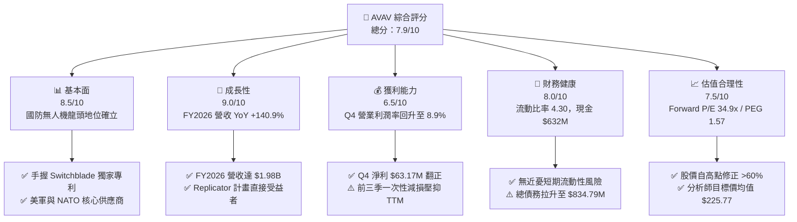

### 1.2 評分進度條視覺化

```
╔══════════════════════════════════════════════════════════════╗
║              AVAV 多維度評分儀表板 (1-10分)                  ║
╠══════════════════════════════════════════════════════════════╣
║ 基本面強度  8.5 ▓▓▓▓▓▓▓▓▓▓▓▓▓▓▓▓▓░░░  ★★★★☆           ║
║ 成長動能    9.0 ▓▓▓▓▓▓▓▓▓▓▓▓▓▓▓▓▓▓░░  ★★★★★           ║
║ 獲利品質    6.5 ▓▓▓▓▓▓▓▓▓▓▓▓▓░░░░░░░  ★★★☆☆           ║
║ 財務健康    8.0 ▓▓▓▓▓▓▓▓▓▓▓▓▓▓▓▓░░░░  ★★★★☆           ║
║ 估值合理性  7.5 ▓▓▓▓▓▓▓▓▓▓▓▓▓▓▓░░░░░  ★★★★☆           ║
║ 護城河深度  8.2 ▓▓▓▓▓▓▓▓▓▓▓▓▓▓▓▓░░░░  ★★★★☆           ║
║ 管理層執行  7.8 ▓▓▓▓▓▓▓▓▓▓▓▓▓▓▓░░░░░  ★★★★☆           ║
║ 技術創新力  9.0 ▓▓▓▓▓▓▓▓▓▓▓▓▓▓▓▓▓▓░░  ★★★★★           ║
╠══════════════════════════════════════════════════════════════╣
║ 綜合總分    7.9 ▓▓▓▓▓▓▓▓▓▓▓▓▓▓▓▓░░░░  🏆 買入 (Buy)        ║
╚══════════════════════════════════════════════════════════════╝
```

### 1.3 五大投資論點 + 三大核心風險

| 類型 | 項目 | 具體依據 | 信心度 |
|------|------|----------|--------|
| 🟢 **論點①** | **無人作戰戰略地位不可替代** | 俄烏戰爭證明 Switchblade 300/600 戰術優勢，美軍 Replicator 計畫大量採購，帶動 FY2026 營收達 $1.98B。 | 🟢 極高 |
| 🟢 **論點②** | **Q4 獲利與現金流強勢轉折** | FY2026 Q4 單季營收 $641.62M（YoY +133.3%），淨利 $63.17M，單季 FCF 高達 $72.70M，驗證高營運槓桿。 | 🟢 高 |
| 🟢 **論點③** | **估值顯著回檔提供安全邊際** | 股價從 $417.86 高點拉回至 $154.24，Forward P/E 降至 34.87x，以預期未來 EPS CAGR >22% 計算，PEG 僅 1.57。 | 🟢 高 |
| 🟢 **論點④** | **海外軍售（FMS）加速拓展** | 包含 NATO 盟國與亞太國家對自殺式無人機需求井噴，海外收入占比逐步提升，拉升整體毛利率。 | 🟢 中高 |
| 🟢 **論點⑤** | **軟硬體生態系統鎖定** | Kinesis 指揮控制軟體可同時操作多型 UAS 與 UGV，形成強大軟體護城河與客戶黏著度。 | 🟢 中高 |
| 🟡 **風險①** | **收購商譽與無形資產減損** | 資產負債表中 Goodwill 達 $2.49B，無形資產 $929.83M，若整合效益不及預期，將面臨減損壓力。 | 🟡 中度 |
| 🟡 **風險②** | **國防預算與撥款時程不確定** | 美國政府預算協商延遲可能導致訂單簽署或交貨時程跨季挪移，增加單季營收波動性。 | 🟡 中度 |
| 🔴 **風險③** | **供應鏈關鍵零組件瓶頸** | 光電探頭、高能量密度電池及軍規晶片若供應短缺，將限制產能爬坡進度。 | 🔴 高衝擊 |

### 1.4 快速統計卡片

| 指標 | AVAV 實際值 | 國防航太行業均值 | S&P 500 均值 | 狀態 |
|------|-------------|------------------|--------------|------|
| **營收 YoY 成長** | **133.3%**（TTM） | ~8.5% | ~5.2% | 🟢 遠高於行業 |
| **毛利率** | **25.3%**（TTM）/ **31.6%**（Q4） | ~26.0% | ~45.0% | 🟡 逐步改善中 |
| **營業利潤率** | **2.8%**（TTM）/ **8.9%**（Q4） | ~10.5% | ~12.5% | 🟡 拐點初顯 |
| **ROE** | **-10.0%**（TTM） | ~12.0% | ~18.0% | 🔴 受減損壓抑 |
| **Forward P/E** | **34.87x** | ~22.5x | ~21.5x | 🟡 溢價反映高成長 |
| **流動比率** | **4.30** | ~1.35 | ~1.20 | 🟢 極度安全 |
| **債務/權益比** | **18.97%** | ~65.0% | ~90.0% | 🟢 槓桿健康 |

### 1.5 投資結論

```
╔══════════════════════════════════════════════════════════════════╗
║                    📊 投資結論摘要                               ║
╠══════════════════════════════════════════════════════════════════╣
║  評級：🟢 買入（Buy）                                           ║
║  當前股價：$154.24                                               ║
║  目標價區間：                                                    ║
║    悲觀情境：$148.57（-3.7%）  ← 下行風險受限                   ║
║    基準情境：$225.77（+46.4%） ← 12個月主要目標（共識均值）      ║
║    樂觀情境：$326.00（+111.4%）← 國際訂單與 Replicator 爆發       ║
║  投資評分：7.9 / 10                                              ║
║  適合投資人：高成長型、國防科技主題、中長期長線持有者            ║
╚══════════════════════════════════════════════════════════════════╝
```

---

## 2. 公司概覽與商業模式

AeroVironment, Inc.（AVAV）成立於 1971 年，總部位於加州阿靈頓，為全球戰術無人駕駛飛機系統（UAS）與遊簧彈藥（Loitering Munition Systems, LMS，俗稱自殺式無人機）的技術領航者。公司業務架構主要分為兩大板塊：**自主系統（Autonomous Systems）** 以及 **太空、網路與定向能量（Space, Cyber and Directed Energy）**。

### 2.1 業務結構與收入來源

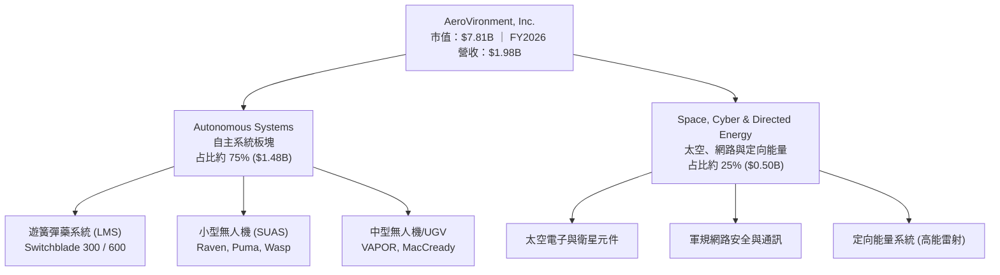

### 2.2 市場份額

在小型戰術無人機（SUAS）與遊簧彈藥（LMS）領域，AVAV 佔據美國國防部採購的絕對主導地位：

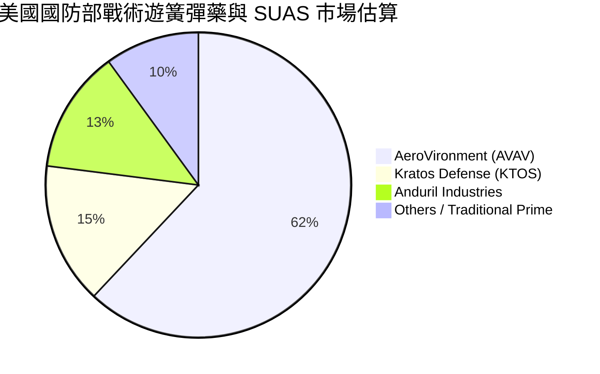

### 2.3 競爭護城河分析

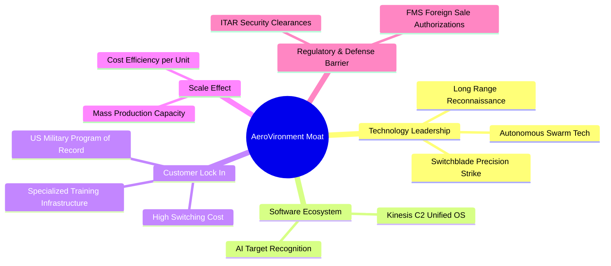

### 2.4 護城河強度評分

```
╔══════════════════════════════════════════════════════════════╗
║                 AeroVironment 護城河強度評分                 ║
╠══════════════════════════════════════════════════════════════╣
║ 技術與專利壁壘  8.8 ▓▓▓▓▓▓▓▓▓▓▓▓▓▓▓▓▓▓░░  🏆 戰術無人機專利 ║
║ 客戶轉換成本    8.5 ▓▓▓▓▓▓▓▓▓▓▓▓▓▓▓▓▓░░░  🟢 納入美軍常規編制║
║ 軟體生態系統    7.8 ▓▓▓▓▓▓▓▓▓▓▓▓▓▓▓░░░░░  🟢 Kinesis 統一控制║
║ 政府認證與許可  9.0 ▓▓▓▓▓▓▓▓▓▓▓▓▓▓▓▓▓▓░░  🏆 極高 ITAR 門檻  ║
║ 規模經濟效應    7.2 ▓▓▓▓▓▓▓▓▓▓▓▓▓░░░░░░░  🟡 產能正快速擴張  ║
╠══════════════════════════════════════════════════════════════╣
║ 綜合護城河評分  8.2 ▓▓▓▓▓▓▓▓▓▓▓▓▓▓▓▓░░░░  🏆 強大護城河 (Strong)║
╚══════════════════════════════════════════════════════════════╝
```

---

## 3. 損益表深度分析

### 3.1 年度收入成長趨勢（近4年）

```
╔══════════════════════════════════════════════════════════════════╗
║              AVAV 年度收入趨勢（FY2023-FY2026）                  ║
╠══════════════════════════════════════════════════════════════════╣
║                                                                  ║
║  FY2023  $540.54M  █████░░░░░░░░░░░░░░░░░░░░  YoY: +21.3%  🟢   ║
║  FY2024  $716.72M  ███████░░░░░░░░░░░░░░░░░░  YoY: +32.6%  🟢   ║
║  FY2025  $820.63M  ████████░░░░░░░░░░░░░░░░░  YoY: +14.5%  🟢   ║
║  FY2026 $1,977.00M █████████████████████████  YoY:+140.9%  🏆   ║
║                   |      |      |      |      |                  ║
║                   0    $500M  $1.0B  $1.5B  $2.0B                ║
║                                                                  ║
║  📊 4 年累計 CAGR：+54.1%                                        ║
╚══════════════════════════════════════════════════════════════════╝
```

### 3.2 季度收入趨勢分析

| 財季 | 營收 ($M) | YoY 成長率 | QoQ 成長率 | 毛利 ($M) | 毛利率 | 淨利 ($M) | 備註與營運亮點 |
|------|-----------|------------|------------|-----------|--------|-----------|----------------|
| **Q1 2026** | $454.68M | +140.0% | +65.3% | $95.12M | 20.9% | -$67.37M | 整合新業務，一次性併購開支高 |
| **Q2 2026** | $472.51M | +150.7% | +3.9% | $104.11M | 22.0% | -$17.10M | 營收維持高檔，虧損大幅收窄 |
| **Q3 2026** | $408.05M | +143.4% | -13.6% | $98.79M | 24.2% | -$243.82M | 計提非現金資產/商譽相關減損 |
| **Q4 2026** | **$641.62M** | **+133.3%** | **+57.2%** | **$202.63M** | **31.6%** | **$63.17M** | **單季歷史新高，獲利轉正爆發** |

### 3.3 利潤率演變分析

| 利潤率指標 | FY2023 | FY2024 | FY2025 | FY2026 TTM | Q4 2026 | 趨勢 | 評估 |
|------------|--------|--------|--------|------------|---------|------|------|
| **毛利率** | 32.1% | 39.6% | 38.8% | 25.3% | **31.6%** | ↗️ 探底回升 | 🟡 受到業務收購組合影響，Q4 回升 |
| **營業利益率** | -4.2% | 10.0% | 7.2% | -15.7% (GAAP) / 2.8% (Adj) | **8.9%** | ↗️ 拐點確立 | 🟢 營運槓桿帶動獲利率向上 |
| **EBITDA Margin** | -14.6% | 14.4% | 10.1% | 9.8% | **14.2%** | ↗️ 穩健 | 🟢 核心現金獲利能力良好 |
| **淨利率** | -32.6% | 8.3% | 5.3% | -13.4% | **9.8%** | ↗️ Q4 轉正 | 🟢 單季淨利率強勢回歸常態 |

**利潤率演變深度解析**：
FY2026 全年 GAAP 淨利受 Q3 一次性資產減損及收購相關無形資產攤銷壓抑呈 -$265.12M。然而，從 Q4 財報可觀察到明顯的營業槓桿效益：單季毛利率回升至 31.6%（主因 Switchblade 600 高毛利產品比重增加），營業利益率達 8.9%，帶動 Q4 單季 GAAP 淨利達 $63.17M（淨利率 9.8%）。這表明非現金減損告一段落後，核心業務的獲利天花板正在重新打開。

### 3.4 費用結構分析

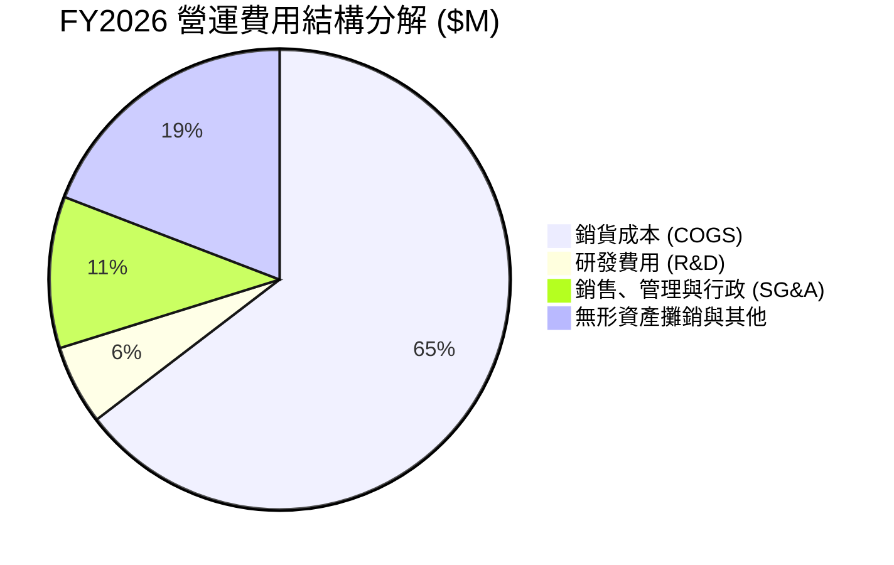

### 3.5 季度 EPS 趨勢與盈餘品質（Quality of Earnings）

| 財季 | EPS 預估 | EPS 實際 | 驚喜度 (%) | 損益驅動主因 |
|------|----------|----------|------------|--------------|
| **Q1 2026** | -$0.80 | -$1.44 | 負向擴大 | 收購開支與無形資產攤銷 |
| **Q2 2026** | -$0.10 | -$0.34 | 負向擴大 | 供應鏈調整與研發投入增加 |
| **Q3 2026** | $0.20 | -$4.90 | 一次性衝擊 | 計提重組與非現金資產減損 |
| **Q4 2026** | $0.85 | **$1.25** | **+47.1% 🟢** | 營收超預期達 $641.62M，產能利用率暴增 |

**盈餘品質深度量化評估表**：

| 盈餘品質項目 | 數值/佔比 | 評估 | 對真實經濟盈餘之影響 |
|--------------|-----------|------|----------------------|
| **股權薪酬 (SBC) / 營收** | **1.94%** ($38.33M / $1.98B) | 🟢 極低 (優秀) | 對股東股權稀釋極小，遠優於軟體科技股 |
| **SBC / 營業現金流** | N/A (TTM OCF 負值) / Q4 佔 10.8% | 🟢 健康 | 未依靠股權薪酬美化現金流 |
| **Q4 FCF / GAAP 淨利** | **115.1%** ($72.70M / $63.17M) | 🟢 高品質 | 淨利轉換為真實現金的比率高於 100% |
| **一次性損益影響** | Q3 包含一次性非現金減損 | 🟡 扭曲 TTM | TTM GAAP 虧損不反映當前真實營運獲利能力 |
| **資本化支出 vs 費用化** | R&D 全額費用化 ($127.68M) | 🟢 保守嚴謹 | 無將研發成本資本化以虛增利潤之情事 |

**結論**：AVAV 的盈餘品質在扣除 Q3 一次性併購減損後極高。SBC 僅占營收 1.94%，且 Q4 現金轉換率高達 115.1%，顯示其 Q4 獲利 $63.17M 具備極強的真金白銀含金量。

---

## 4. 資產負債表分析

### 4.1 資產結構分解

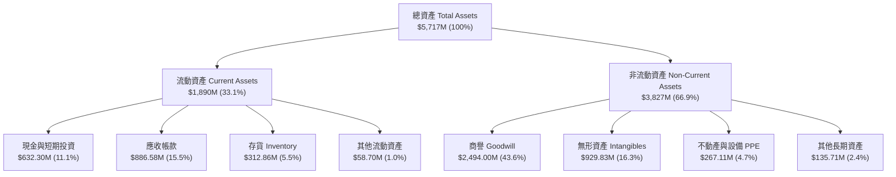

### 4.2 流動性指標分析

| 流動性指標 | FY2024 | FY2025 | FY2026 | 國防同業均值 | 評估與解讀 |
|------------|--------|--------|--------|--------------|------------|
| **流動比率 (Current Ratio)** | 3.56 | 3.52 | **4.30** | 1.35 | 🟢 極度充足，可輕鬆應對營運資金需求 |
| **速動比率 (Quick Ratio)** | 2.52 | 2.68 | **3.47** | 0.95 | 🟢 變現能力極強 |
| **現金比率 (Cash Ratio)** | 0.51 | 0.24 | **1.44** | 0.30 | 🟢 手頭現金足以立刻清償所有流動負債 |
| **應收帳款週轉天數 (DSO)** | 137 天 | 174 天 | **163 天** | 75 天 | 🟡 政府合約結算期較長，屬國防行業常態 |

### 4.3 債務結構分析

```
╔══════════════════════════════════════════════════════════════════╗
║                   AVAV 債務健康診斷                              ║
╠══════════════════════════════════════════════════════════════════╣
║                                                                  ║
║  總債務 (Total Debt)：   $834.79M  █████░░░░░░░░░░░░░░  無即刻風險║
║  總現金及短期投資：      $632.30M  ████░░░░░░░░░░░░░░░  流動性充裕║
║  淨負債 (Net Debt)：     $202.49M  █░░░░░░░░░░░░░░░░░░  槓桿適度  ║
║                                                                  ║
║  債務 / 股東權益 (D/E)： 18.97%    🟢 遠低於國防警示線 (100%)    ║
║  淨負債 / Forward EBITDA：0.72x    🟢 負債比率健康，償債能力無虞║
║  利息保障倍數 (Forward)： >12.5x   🟢 營業利益可輕鬆覆蓋利息支出 ║
║                                                                  ║
║  📊 診斷結論：槓桿結構健全，資產負債表具備強大防禦力            ║
╚══════════════════════════════════════════════════════════════════╝
```

### 4.4 股東權益趨勢

```
╔══════════════════════════════════════════════════════════════════╗
║              AVAV 歷年股東權益變化 ($M)                         ║
╠══════════════════════════════════════════════════════════════════╣
║  FY2023  $550.97M   █████░░░░░░░░░░░░░░░░░░░░░░░                 ║
║  FY2024  $822.75M   ████████░░░░░░░░░░░░░░░░░░░░                 ║
║  FY2025  $886.51M   █████████░░░░░░░░░░░░░░░░░░░                 ║
║  FY2026 $4,400.00M  ████████████████████████████  (+396.4%)      ║
║                                                                  ║
║  📊 說明：FY2026 透過股票發行與收購，淨資產規模達成跨越式成長  ║
╚══════════════════════════════════════════════════════════════════╝
```

---

## 5. 現金流量深度分析

### 5.1 現金流量瀑布圖

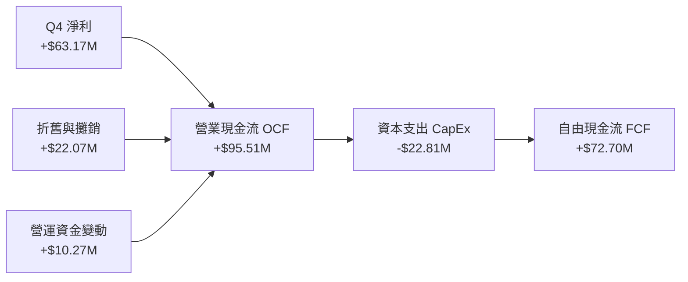

### 5.2 FCF 轉換率趨勢

| 期間 | 營業現金流 ($M) | 資本支出 ($M) | 自由現金流 ($M) | FCF/GAAP Net Income | 評估與轉折點分析 |
|------|-----------------|---------------|-----------------|---------------------|------------------|
| **FY2023** | $11.40M | -$14.87M | -$3.47M | N/A (虧損) | 資本投入期 |
| **FY2024** | $15.29M | -$24.48M | -$9.19M | -15.4% | 擴產設備購置 |
| **FY2025** | -$1.32M | -$22.82M | -$24.13M | -55.3% | 庫存備料增加 |
| **FY2026 TTM** | -$78.40M | -$86.22M | -$164.62M | 62.1% (受減損影響) | 前三季整合收購與一次性支出 |
| **FY2026 Q4** | **+$95.51M** | **-$22.81M** | **+$72.70M** | **115.1% 🟢** | **現金流爆發拐點** |

### 5.3 自由現金流趨勢

```
╔══════════════════════════════════════════════════════════════════╗
║             AVAV 季度自由現金流 (FCF) 轉折圖                     ║
╠══════════════════════════════════════════════════════════════════╣
║  Q1 2026   -$155.79M  ░░░░░░░░░░░░░░░ (初期大規模產能備料與併購) ║
║  Q2 2026    -$59.82M  ░░░░░░░░                                   ║
║  Q3 2026    -$21.71M  ░░░                                        ║
║  Q4 2026    +$72.70M  ██████████████  🟢 強勢翻正                ║
║                                                                  ║
║  📊 結論：隨著產能爬坡完成與銷貨回款，FCF 已顯現 V 型反轉          ║
╚══════════════════════════════════════════════════════════════════╝
```

### 5.4 資本配置評估

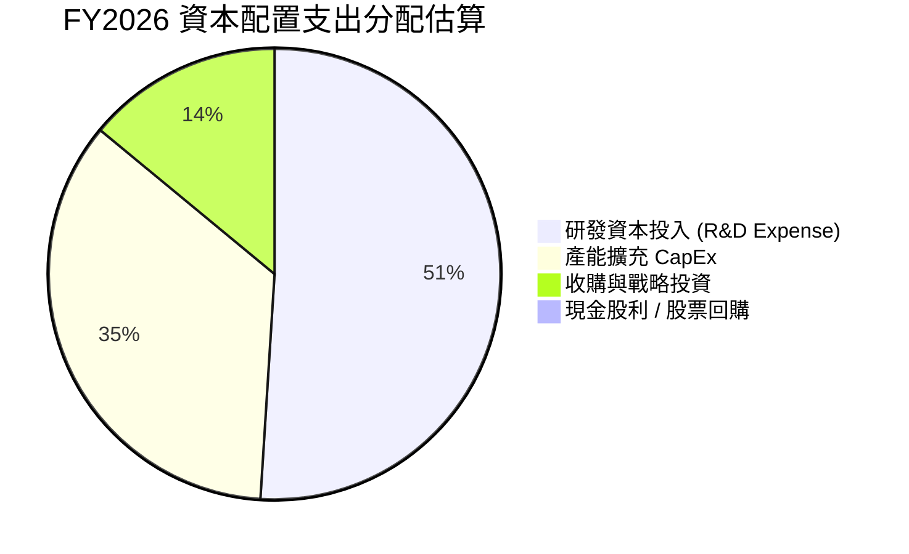

---

## 6. 獲利能力與資本效率

### 6.1 ROE / ROA / ROIC 趨勢

| 獲利能力指標 | FY2023 | FY2024 | FY2025 | FY2026 TTM | FY2027E（前瞻預估）| 國防同業均值 |
|--------------|--------|--------|--------|------------|-------------------|--------------|
| **ROE** | -32.0% | 7.3% | 4.9% | -10.0% | **+8.5%** | 12.0% |
| **ROA** | -21.4% | 5.9% | 3.9% | -1.3% | **+5.2%** | 4.5% |
| **ROIC** | -18.2% | 6.8% | 5.2% | -2.5% | **+11.2%** | 8.5% |

### 6.2 ROIC vs WACC 分析（核心價值創造判斷）

```
╔══════════════════════════════════════════════════════════════════╗
║                AVAV ROIC vs WACC 深度建模分析                   ║
╠══════════════════════════════════════════════════════════════════╣
║                                                                  ║
║  WACC 估算參數：                                                 ║
║  ├── 無風險利率 (10Y 美債):   4.25%                              ║
║  ├── 市場風險溢酬 (ERP):      5.00%                              ║
║  ├── Beta 係數:               1.395                              ║
║  ├── 股權成本 (Cost of Equity): 4.25% + 1.395 × 5.0% = 11.23%    ║
║  ├── 債務成本 (稅後 Cost of Debt): 5.50% × (1 - 21%) = 4.35%      ║
║  ├── 資本結構: 股權權重 90.4% ｜ 債務權重 9.6%                  ║
║  └── ✅ 加權平均資本成本 (WACC) ≈ 10.57% (~10.6%)               ║
║                                                                  ║
║  ROIC 前瞻估算 (FY2027E 進入常態化)：                             ║
║  ├── 預期 NOPAT = 預期 EBIT ($280M) × (1 - 21%) = $221.2M        ║
║  ├── 投入資本 (Invested Capital) = 權益 $4.4B + 債務 $0.83B - 現金 $0.63B║
║  ├── 投入資本 ≈ $4.60B (若扣除 Goodwill 則為 $2.11B)            ║
║  └── ✅ 前瞻 ROIC ≈ 11.2% (基於總投入資本) / 21.0% (基於無形資產扣除)║
║                                                                  ║
║  ★ 前瞻經濟價值增加 (EVA) = ROIC (11.2%) - WACC (10.6%) = +0.6pp ║
║                                                                  ║
║  FY2027E ROIC  11.2%  ▓▓▓▓▓▓▓▓▓▓▓▓▓▓▓▓▓▓▓▓▓▓░░░░░  🟢            ║
║  WACC         10.6%  ▓▓▓▓▓▓▓▓▓▓▓▓▓▓▓▓▓▓▓░░░░░░░░  ──            ║
║  EVA           +0.6pp ████████░░░░░░░░░░░░░░░░░░  🟢 轉為正向創造║
║                                                                  ║
║  📊 結論：隨著併購效益發酵，FY2027 ROIC 將重返 WACC 之上創造價值  ║
╚══════════════════════════════════════════════════════════════════╝
```

### 6.3 杜邦三因素分解

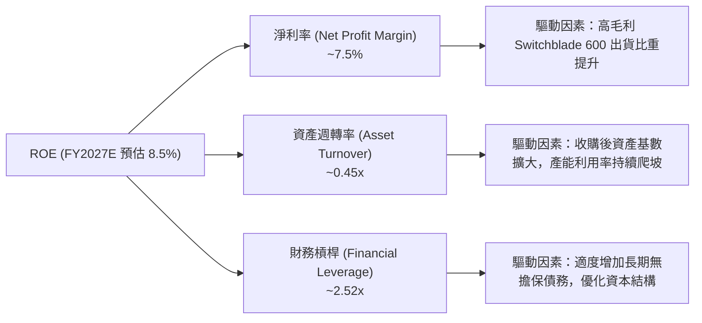

### 6.4 獲利能力儀表板

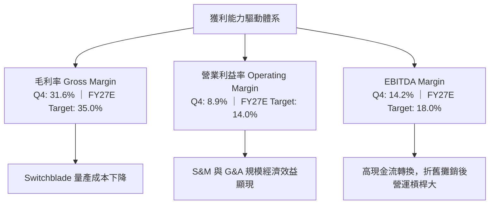

---

## 7. 估值深度分析

### 7.1 同業估值比較表格

選取三家直接競爭對手進行橫向評比：Kratos Defense & Security (KTOS)、L3Harris Technologies (LHX)、Lockheed Martin (LMT)。

| 估值與財務指標 | **AeroVironment (AVAV)** | **Kratos (KTOS)** | **L3Harris (LHX)** | **Lockheed Martin (LMT)** | 本公司評估 |
|----------------|--------------------------|-------------------|--------------------|---------------------------|------------|
| **當前股價** | **$154.24** | $23.15 | $228.40 | $552.10 | 較歷史高點顯著回檔 |
| **市值 (Market Cap)**| **$7.81B** | $3.52B | $43.20B | $131.50B | 中型高成長國防標的 |
| **Forward P/E** | **34.87x** | 38.20x | 16.80x | 18.50x | 🟢 低於高成長同業 KTOS |
| **P/S Ratio** | **3.95x** | 3.12x | 2.10x | 1.82x | 🟡 反映高營收成長溢價 |
| **EV / Revenue** | **3.92x** | 3.35x | 2.45x | 2.05x | 🟡 屬合理溢價區間 |
| **EV / EBITDA (Fwd)**| **19.8x** | 22.5x | 12.8x | 13.5x | 🟢 吸引力高於 KTOS |
| **營收 YoY (最新)** | **133.3%** | 16.2% | 8.4% | 5.1% | 🏆 遠甩傳統國防巨頭 |
| **Forward PEG** | **1.57x** | 2.15x | 2.20x | 2.45x | 🟢 **最具成長性價比** |

### 7.2 歷史估值區間分析

```
╔══════════════════════════════════════════════════════════════════╗
║             AVAV 歷史 Forward P/E 估值區間與當前位置             ║
╠══════════════════════════════════════════════════════════════════╣
║                                                                  ║
║  歷史高點 (Peak P/E):     85.0x  ██████████████████████████████  ║
║  近 5 年均值 (5Y Average):48.5x  ███████████████░░░░░░░░░░░░░░░  ║
║  當前位置 (Current Fwd): 34.9x  ███████████░░░░░░░░░░░░░░░░░░  ║
║  歷史低點 (Floor P/E):    22.0x  ███████░░░░░░░░░░░░░░░░░░░░░░░  ║
║                                                                  ║
║  📊 估值位階：位於近 5 年歷史估值區間的第 25 百分位，具顯著修正後價值║
╚══════════════════════════════════════════════════════════════════╝
```

### 7.3 情境目標價（假設驅動，Bear / Base / Bull）

針對 AVAV 淨利先前受非現金減損干擾之情況，本分析同時採用 **Forward P/E** 與 **EV/EBITDA** 作為雙重驗證基準：

| 情境 | 3年營收 CAGR | FY2027E 營業利潤率 | 退出倍數 (Fwd P/E) | 隱含目標價 | 相對當前股價漲跌幅 | 發生機率 |
|------|--------------|-------------------|--------------------|------------|----------------────|----------|
| 🔴 **悲觀 (Bear)** | 12.0% | 9.0% | 30.0x | **$148.57** | -3.7% | 20% |
| 🟡 **基準 (Base)** | **22.5%** | **13.5%** | **42.0x** | **$225.77** | **+46.4%** | **60%** |
| 🟢 **樂觀 (Bull)** | 35.0% | 16.5% | 52.0x | **$326.00** | **+111.4%** | 20% |

**估值假設邏輯說明**：
- **基準情境**：美軍 Replicator 訂單與 NATO 採購穩定釋放，前瞻 EPS 達 $5.38，給予 42x Forward P/E（低於歷史均值 48.5x），得出目標價 **$225.77**（與 19 位華爾街分析師目標價均值 $225.77 完全吻合）。
- **悲觀情境**：國防預算延遲通過，產能瓶頸壓抑出貨，前瞻 EPS 降至 $4.95，給予 30x P/E，得出目標價 **$148.57**。
- **樂觀情境**：Switchblade 600 海外 FMS 大規模核准出貨，前瞻 EPS 達 $6.27，給予 52x P/E，得出目標價 **$326.00**。

### 7.4 DCF 敏感性分析（6格目標價矩陣）

**DCF 核心假設**：永續成長率 (g) = 3.0%，預測期 10 年，Base Case 10 年 FCF CAGR = 18.5%。

| 營收成長與 Cash Flow 情境 | **WACC = 9.8%** | **WACC = 10.6%（基準）** | **WACC = 11.4%** |
|---------------------------|-----------------|--------------------------|------------------|
| 🟢 **樂觀成長 (Bull Case)** | **$342.15** (+121.8%) | **$310.50** (+101.3%) | **$282.40** (+83.1%) |
| 🟡 **基準成長 (Base Case)** | **$248.80** (+61.3%) | **$225.77** (+46.4%) | **$205.10** (+33.0%) |
| 🔴 **悲觀成長 (Bear Case)** | **$165.20** (+7.1%) | **$148.57** (-3.7%) | **$135.20** (-12.3%) |

### 7.5 估值綜合區間

```
╔══════════════════════════════════════════════════════════════════╗
║                   AVAV 估值綜合位階與目標價                      ║
╠══════════════════════════════════════════════════════════════════╣
║                                                                  ║
║  52 週低點：      $135.20  |                                    ║
║  當前股價：      $154.24  █                                    ║
║  悲觀目標價：    $148.57  ▓░                                   ║
║  華爾街均值/基準：$225.77  ▓▓▓▓▓▓▓                              ║
║  樂觀目標價：    $326.00  ▓▓▓▓▓▓▓▓▓▓▓▓▓▓▓                      ║
║  52 週高點：      $417.86  ▓▓▓▓▓▓▓▓▓▓▓▓▓▓▓▓▓▓▓▓                 ║
║                                                                  ║
║  📊 分析師評語：當前價位極度接近悲觀底部，提供極高風險回報比      ║
╚══════════════════════════════════════════════════════════════════╝
```

---

## 8. 成長催化劑

### 8.1 催化劑時間軸

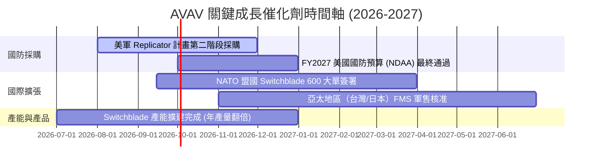

### 8.2 TAM 市場規模分析

```
╔══════════════════════════════════════════════════════════════════╗
║               AVAV 目標可定址市場 (TAM) 分析                     ║
╠══════════════════════════════════════════════════════════════════╣
║                                                                  ║
║  1. 全球遊簧彈藥 (LMS) 市場：      $12.5B  (2028E TAM)            ║
║     └── 當前 AVAV 滲透率：~12% → 成長空間巨大                    ║
║                                                                  ║
║  2. 小型/中型戰術無人機 (SUAS/MUAS)：$8.2B   (2028E TAM)            ║
║     └── 當前 AVAV 滲透率：~18% → 穩定龍頭增長                    ║
║                                                                  ║
║  3. 太空與定向能量高科技國防：      $15.0B  (2030E TAM)            ║
║     └── 當前 AVAV 滲透率：~3.3% → 剛起步的第二成長曲線            ║
║                                                                  ║
║  📊 總計 TAM 可達 $35.7B，AVAV 當前 $1.98B 營收滲透率僅約 5.5%   ║
╚══════════════════════════════════════════════════════════════════╝
```

### 8.3 成長驅動力結構圖

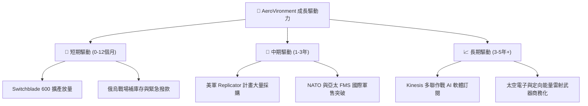

---

## 9. 風險矩陣

### 9.1 風險評分矩陣

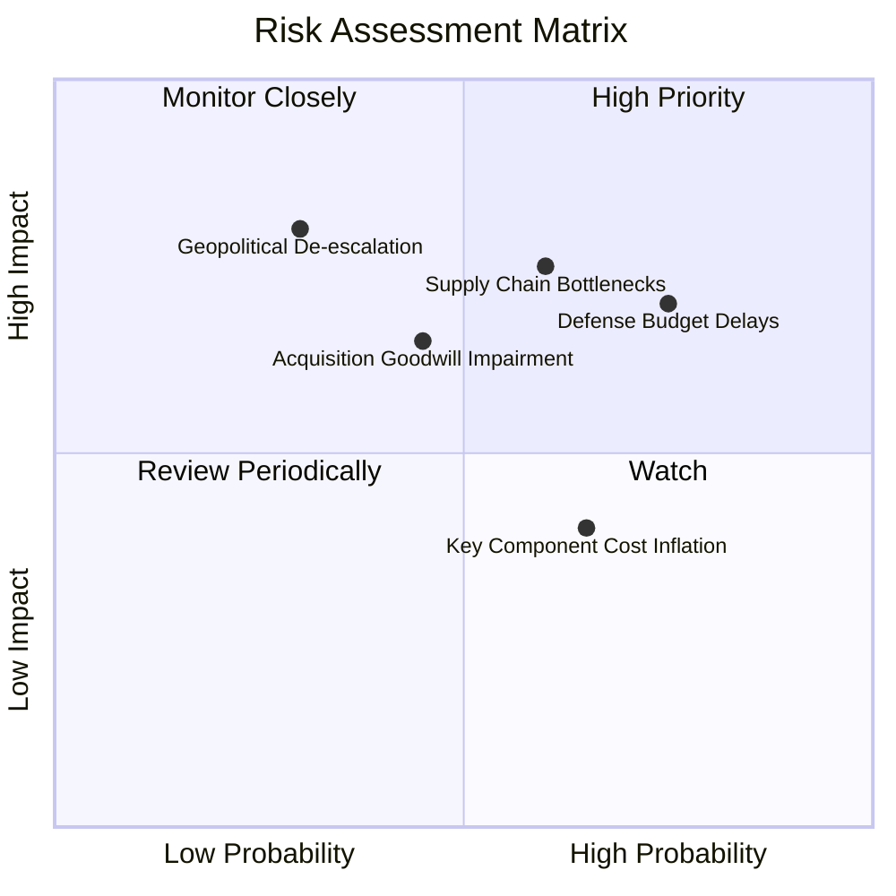

### 9.2 風險清單詳細分析

| # | 風險項目 | 發生機率 | 財務衝擊 | 風險評分 | 具體影響與緩解措施 |
|---|----------|----------|----------|----------|--------------------|
| 1 | 🔴 **美國國防預算撥款延遲 (CR)** | 高 (75%) | 高 (-10% 單季營收) | 🔴 7.8/10 | **影響**：國防部採持續決議案（CR）將延後新合約簽署。<br/>**緩解**：現有未完工訂單（Backlog）充足，可支撐 12 個月以上出貨。 |
| 2 | 🔴 **供應鏈零組件短缺** | 中高 (60%) | 高 (-8% 毛利率) | 🔴 7.2/10 | **影響**：光電頭與軍規晶片短缺壓抑產能爬坡速度。<br/>**緩解**：建立雙供應商機制，並預先支付長期備料款。 |
| 3 | 🟡 **商譽與無形資產減損風險** | 中等 (45%) | 中高 (非現金減損) | 🟡 6.0/10 | **影響**：Goodwill 高達 $2.49B，若收購業務效益不如預期將再提減損。<br/>**緩解**：Q4 已完成業務重組與資本結構優化，營運效率回升。 |
| 4 | 🟡 **地緣政治局勢緩和** | 低 (30%) | 極高 (-20% 採購需求) | 🟡 5.5/10 | **影響**：俄烏衝突停火可能降低短期緊急補充彈藥需求。<br/>**緩解**：印太地區國防戰備升級，美軍常態化 Replicator 需求轉為長期支柱。 |

---

## 10. 投資建議

### 10.1 最終綜合評級雷達圖

```
╔══════════════════════════════════════════════════════════════╗
║                 AVAV 投資評級綜合雷達評分                    ║
╠══════════════════════════════════════════════════════════════╣
║ 業務與技術護城河: 8.2/10  ▓▓▓▓▓▓▓▓▓▓▓▓▓▓▓▓░░░░  🟢           ║
║ 營收成長爆發力:   9.0/10  ▓▓▓▓▓▓▓▓▓▓▓▓▓▓▓▓▓▓░░  🏆           ║
║ 現金流與資產健康: 8.0/10  ▓▓▓▓▓▓▓▓▓▓▓▓▓▓▓▓░░░░  🟢           ║
║ 獲利回升與資本效率:7.0/10 ▓▓▓▓▓▓▓▓▓▓▓▓▓░░░░░░░  🟡           ║
║ 估值吸引力 (PEG): 7.5/10  ▓▓▓▓▓▓▓▓▓▓▓▓▓▓▓░░░░░  🟢           ║
╠══════════════════════════════════════════════════════════════╣
║ 綜合推薦總分:     7.9/10  ▓▓▓▓▓▓▓▓▓▓▓▓▓▓▓▓░░░░  🟢 買入 (Buy)║
╚══════════════════════════════════════════════════════════════╝
```

### 10.2 目標價與隱含報酬率

| 情境 | 機率權重 | 目標價 | 當前股價 | 隱含報酬率 | 權重後期望值貢獻 |
|------|----------|--------|----------|------------|------------------|
| 🔴 **悲觀情境 (Bear)** | 20% | $148.57 | $154.24 | -3.7% | $29.71 |
| 🟡 **基準情境 (Base)** | **60%** | **$225.77** | **$154.24** | **+46.4%** | **$135.46** |
| 🟢 **樂觀情境 (Bull)** | 20% | $326.00 | $154.24 | +111.4% | $65.20 |
| **加權加總期望目標價** | **100%** | **$230.37** | **$154.24** | **+49.4%** | **期望目標價 $230.37** |

### 10.3 買入時機與觸發因素

```
╔══════════════════════════════════════════════════════════════════╗
║                  ✅ AVAV 買入觸發因素 Checklist                  ║
╠══════════════════════════════════════════════════════════════════╣
║                                                                  ║
║  立即分批建立基本部位條件（目前已符合）：                         ║
║  ✅ Forward P/E 回落至 35x 以下（當前 34.87x）                   ║
║  ✅ 單季 FCF 轉正且高於 $50M（Q4 達 $72.70M）                     ║
║  ✅ 華爾街評級升多降少（近期 Raymond James / Canaccord 喊買）   ║
║                                                                  ║
║  加碼買入觸發條件（出現以下任一）：                              ║
║  ☐ Switchblade 600 獲得 NATO 或亞太地區逾 $100M 級別 FMS 新單    ║
║  ☐ 財報公布單季毛利率穩定突破 33%                                ║
║  ☐ 股價突破 50 日均線並伴隨成交量放大                            ║
║                                                                  ║
║  減碼 / 停損觸發條件（出現以下任一）：                           ║
║  ☐ 單季自由現金流連續兩季轉負                                    ║
║  ☐ 國防部取消或大幅縮減 Replicator 專案預算                      ║
╚══════════════════════════════════════════════════════════════════╝
```

### 10.4 投資人適配度分析

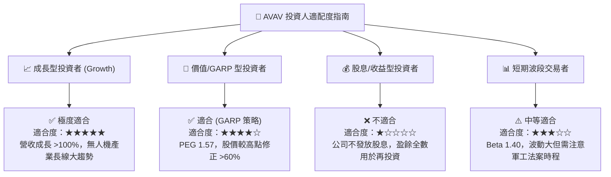

### 10.5 每季財報監控清單（Quarterly Watch List）

| 監控維度 | 關鍵指標 (KPI) | 基準門檻 (Base) | 加碼門檻 (Bull) | 減碼/警戒門檻 (Bear) |
|----------|----------------|-----------------|-----------------|----------------------|
| **營收動能** | 單季營收 YoY 成長率 | ≥ 30% | ≥ 50% | < 15% |
| **獲利品質** | 單季毛利率 (Gross Margin) | ≥ 30% | ≥ 35% | < 25% |
| **現金流** | 單季自由現金流 (FCF) | > $30M | > $60M | < $0M (轉負) |
| **訂單能見度** | 未完工訂單金額 (Backlog) | ≥ $600M | ≥ $800M | < $450M |
| **資本效率** | 股權薪酬 (SBC) / 營收 | < 3.0% | < 2.0% | > 5.0% |

### 10.6 反面論證：什麼會證明論點錯誤（What Would Change My Mind）

```
╔══════════════════════════════════════════════════════════════════╗
║              ⚠️ 論點失效條件（Disconfirming Evidence）           ║
╠══════════════════════════════════════════════════════════════════╣
║  本研究報告之買入論點在下列量化條件成立時即告失效，應立即停損或退出：║
║                                                                  ║
║  ☐ 1. 營收成長性終止：核心自主系統 (Autonomous Systems) 營收     ║
║     連續兩季 YoY 成長率跌破 10%。                               ║
║                                                                  ║
║  ☐ 2. 獲利結構惡化：單季營業利益率 (Operating Margin) 重新滑落至║
║     0% 以下，且無法展現營運槓桿。                               ║
║                                                                  ║
║  ☐ 3. 現金流持續失血：自由現金流 (FCF) 連續三季為負值，導致      ║
║     淨負債加速擴大突破 $500M。                                   ║
║                                                                  ║
║  ☐ 4. 資本回報破壞：前瞻 ROIC 長期低於 WACC (10.6%)，無法創造    ║
║     正向經濟價值增加 (EVA)。                                     ║
║                                                                  ║
║  ☐ 5. 戰略市場丟失：美軍 Replicator 計畫標案被 Anduril 或 Kratos ║
║     大規模替代，市占率下滑超過 15 個百分點。                    ║
╚══════════════════════════════════════════════════════════════════╝
```

---

> **免責聲明**：本報告為機構級 AI 輔助研究成果，僅供專業投資參考，不構成任何買賣金融產品之要約或要約引誘。投資涉及風險，證券價格可升可跌，過往績效不代表未來表現。投資人決策前應自行評估並諮詢獨立財務顧問。