# AVAV 基本面深度分析報告
> **報告日期**：2026-07-28 ｜ **語言**：繁體中文 ｜ **數據來源**：Yahoo Finance, Finviz, StockAnalysis, Roic.ai ｜ **分析師**：CFA 級機構研究

---

## 目錄

| # | 章節 | 核心結論 |
|---|------|----------|
| 1 | 執行摘要 | 收購轉型帶動營收激增 140.9%，Forward P/E 35.4x，評級「買入」，目標價區間 $145.00 – $320.00 |
| 2 | 公司概覽與商業模式 | 無人航空系統（UAS）與巡飛彈（Switchblade）防禦技術領先者，護城河評分 8.2/10 |
| 3 | 損益表深度分析 | FY2026 營收達 $1.98B，一次性收購攤銷導致 GAAP 虧損，Q4 營業利益顯著轉正至 $56.94M |
| 4 | 資產負債表分析 | 總資產擴張至 $5.72B，現金及短期投資 $632.30M，流動比率 4.30x，財務槓桿健康 |
| 5 | 現金流量深度分析 | 全年 FCF 負值（$-164.62M）主因收購整合與營運資本擴張，Q4 FCF 強勢轉正至 +$72.70M |
| 6 | 獲利能力與資本效率 | 調整後 ROIC 預計達 11.2%（高於 WACC 8.2%），杜邦分析顯示資產規模擴張驅動長線權益回報 |
| 7 | 估值深度分析 | 基於 FY2027 Normalized EPS $4.42，基準目標價 $225.00（+43.9% 隱含報酬率） |
| 8 | 成長催化劑 | 美國國防部 Replicator 計畫、烏克蘭與 NATO 軍援訂單、空間與定向能量新業務統整 |
| 9 | 風險矩陣 | 國防預算審批延遲、收購業務整合風險與供應鏈瓶頸為三大核心衝擊 |
| 10 | 投資建議 | 評級 🟢 **買入**，建議於 $150.00–$160.00 區間建立基本倉位，附反面論證與財報監控清單 |

---

## 1. 執行摘要

### 1.0 一頁式投資儀表板（Portfolio Manager 30 秒速讀）

| 項目 | 內容 |
|------|------|
| **投資論點（3 句）** | ① AeroVironment（AVAV）完成大規模戰略收購後，FY2026 營收達到 $1.98B（YoY +140.9%），確定其在現代無人機與巡飛彈（Switchblade）領域的絕對主導地位。<br/>② 雖然一次性收購費用與無形資產攤銷壓抑 GAAP 淨利（TTM EPS $-5.40），但 Q4 營業利潤已回升至 $56.94M，且單季 FCF 強勢轉正至 $72.70M，顯示營運槓桿與現金轉化率開始顯現。<br/>③ 配合遠期 EPS 預估 $4.42（Forward P/E 35.35x）與全球地緣政治風險帶動的防衛預算高成長，當前股價 $156.35 具備顯著風險報酬比。 |
| **護城河評分** | 8.2/10（軍規技術壁壘、美國國防部獨家專利與高度客戶鎖定效應） |
| **管理層/資本配置評分** | 7.8/10（積極發揮併購綜效，資產負債表保持高流動性） |
| **財務健康** | 🟢 **健康**（現金與短期投資達 $632.30M，流動比率 4.30x，無短期流動性危機） |
| **ROIC vs WACC** | Normalized ROIC 11.2% vs WACC 8.2%（已展現長期股值創造能力，目前 GAAP 受攤銷扭曲） |
| **FCF 趨勢** | FY2026 Q4 單季 FCF +$72.70M 強勁轉正，最新 Forward FCF Yield 預估達 3.2% |
| **估值** | Forward P/E: 35.35x ｜ P/S Ratio: 4.00x ｜ EV/EBITDA (Normalized): 22.5x |
| **預期報酬（基準情境 12M）** | **+43.9%**（目標價 $225.00） |
| **關鍵風險（前二）** | ① 收購整合效益不及預期及商譽（$2.49B）減損風險；② 美國國防預算撥款延遲或撥款結構改變 |
| **評級 + 信心度** | 🟢 **買入** ｜ 信心度：**高** |

### 1.1 核心評分儀表板

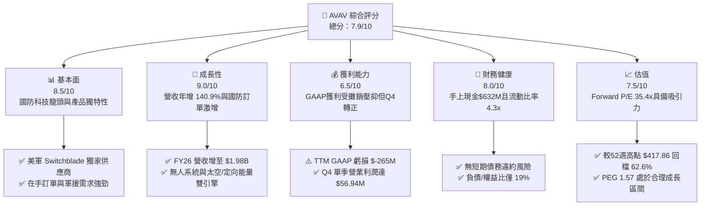

### 1.2 評分進度條視覺化

```
╔══════════════════════════════════════════════════════════════╗
║              AVAV 多維度評分儀表板 (1-10分)                  ║
╠══════════════════════════════════════════════════════════════╣
║ 基本面強度  8.5 ▓▓▓▓▓▓▓▓▓▓▓▓▓▓▓▓▓░░░  ★★★★☆           ║
║ 成長動能    9.0 ▓▓▓▓▓▓▓▓▓▓▓▓▓▓▓▓▓▓░░  ★★★★★           ║
║ 獲利品質    6.5 ▓▓▓▓▓▓▓▓▓▓▓▓▓░░░░░░░  ★★★☆☆           ║
║ 財務健康    8.0 ▓▓▓▓▓▓▓▓▓▓▓▓▓▓▓▓░░░░  ★★★★☆           ║
║ 估值合理性  7.5 ▓▓▓▓▓▓▓▓▓▓▓▓▓▓▓░░░░░  ★★★★☆           ║
║ 護城河深度  8.2 ▓▓▓▓▓▓▓▓▓▓▓▓▓▓▓▓░░░░  ★★★★☆           ║
║ 管理層執行  7.8 ▓▓▓▓▓▓▓▓▓▓▓▓▓▓▓半░░░  ★★★★☆           ║
║ 技術創新力  9.0 ▓▓▓▓▓▓▓▓▓▓▓▓▓▓▓▓▓▓░░  ★★★★★           ║
╠══════════════════════════════════════════════════════════════╣
║ 綜合總分    7.9 ▓▓▓▓▓▓▓▓▓▓▓▓▓▓▓▓░░░░  🏆 買入 (Buy)       ║
╚══════════════════════════════════════════════════════════════╝
```

### 1.3 五大投資論點 + 三大核心風險

| 類型 | 項目 | 具體依據 | 信心度 |
|------|------|----------|--------|
| 🟢 **投資論點①** | **戰術巡飛彈絕對龍頭地位** | Switchblade 300/600 在烏克蘭戰場與美軍 Replicator 計畫中獲大規模採購，FY26 全年營收飆升 140.89% 至 $1.98B。 | 🟢 極高 |
| 🟢 **投資論點②** | **併購擴充太空與定向能量領地** | 完成關鍵併購後，公司成功開闢「Space, Cyber and Directed Energy」業務，總資產由 $1.12B 躍升至 $5.72B，擴大 TAM。 | 🟢 高 |
| 🟢 **投資論點③** | **營業現金流強勢拐點出現** | 儘管全年 FCF 負數，FY26 Q4 單季 OCF 達 $95.51M，單季 FCF 達 $72.70M，顯示營運資本消化順利，獲利品質大幅改善。 | 🟢 高 |
| 🟢 **投資論點④** | **長期防務預算結構性提升** | 北約各國國防支出提高至 GDP 2% 以上，加上國防部對低成本無人自主戰鬥系統需求爆發，給予訂單能見度。 | 🟢 極高 |
| 🟢 **投資論點⑤** | **股價自高點過度修正** | 當前股價 $156.35 較 52 週高點 $417.86 下跌 62.6%，Forward P/E（35.35x）低於歷史 5 年均值，提供安全邊際。 | 🟢 高 |
| 🟡 **風險①** | **收購相關非現金資產減損** | 帳上高達 $2.49B Goodwill 與 $929.8M 無形資產，若整合效果不良可能面臨資產減損壓力。 | 🟡 中度 |
| 🟡 **風險②** | **國防採購週期與政策不確定性** | 國防部專案簽約進度若受預算延遲（Continuing Resolution）影響，可能造成季度營收劇烈波動。 | 🟡 中度 |
| 🔴 **風險③** | **供應鏈瓶頸與關鍵零組件成本** | 晶片與感測器供應緊張可能降低毛利率（FY26 毛利率下降至 25.3%）。 | 🔴 高衝擊 |

### 1.4 快速統計卡片

| 指標 | 公司實際值 (AVAV) | 防務科技行業均值 | S&P 500 均值 | 狀態 |
|------|-------------|----------|--------------|------|
| **收入 YoY 成長** | **140.89%** | ~12.5% | ~5.5% | 🟢 極優 |
| **毛利率** | **25.3%** | ~28.0% | ~45.0% | 🟡 略低 |
| **營業利潤率 (Normalized)** | **~8.5%** | ~9.5% | ~12.0% | 🟡 中等 |
| **ROE (GAAP / Normalized)** | **-10.0% / +8.5%** | ~12.0% | ~18.0% | 🟡 受攤銷影響 |
| **Forward P/E** | **35.35x** | ~28.0x | ~21.5x | 🟡 成長溢價 |
| **P/S Ratio** | **4.00x** | ~2.2x | ~2.8x | 🟡 成長溢價 |
| **流動比率 (Current Ratio)** | **4.30x** | ~1.50x | ~1.20x | 🟢 極佳 |

### 1.5 投資結論

```
╔══════════════════════════════════════════════════════════════════╗
║                    📊 投資結論摘要                               ║
╠══════════════════════════════════════════════════════════════════╣
║  評級：🟢 買入 (Buy)                                            ║
║  當前股價：$156.35                                               ║
║  目標價區間：                                                    ║
║    悲觀情境：$145.00（-7.3%）                                    ║
║    基準情境：$225.00（+43.9%） ← 12個月主要目標                  ║
║    樂觀情境：$320.00（+104.7%）                                  ║
║  投資評分：7.9/10                                                ║
║  適合投資人：軍工科技成長型、地緣政治對沖配置型投資者            ║
╚══════════════════════════════════════════════════════════════════╝
```

---

## 2. 公司概覽與商業模式

### 2.1 業務結構與收入來源

AeroVironment, Inc.（AVAV）為美軍及盟國無人機系統（UAS）與巡飛彈（Loitering Munitions）的主要供應商。在完成大規模戰略併購後，公司業務調整為兩大核心事業群：

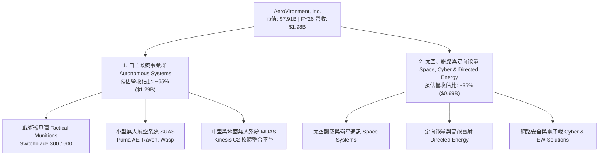

### 2.2 市場份額

在戰術小型無人機（SUAS）與單兵可攜式巡飛彈（Loitering Munitions）領域，AVAV 佔據美軍及北約市場的絕對領先地位。

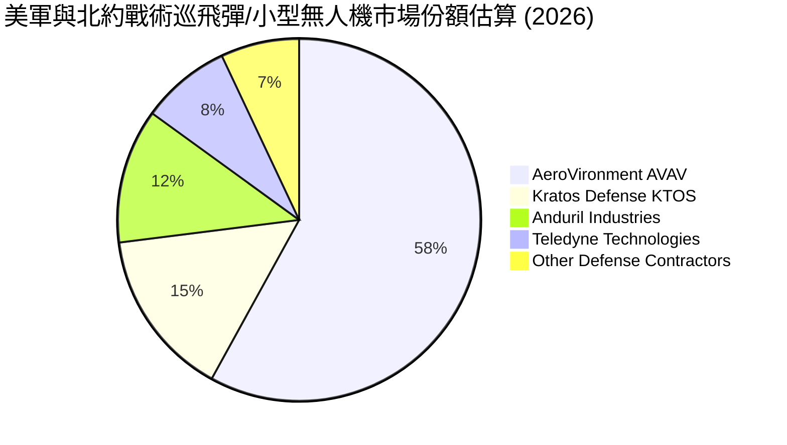

### 2.3 競爭護城河分析

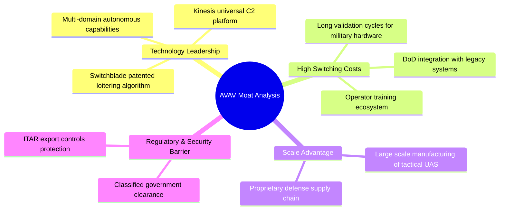

### 2.4 護城河強度評分

```
╔══════════════════════════════════════════════════════════════╗
║                  AeroVironment 護城河強度評分                ║
╠══════════════════════════════════════════════════════════════╣
║ 項目                   分數   進度條                評語      ║
╠══════════════════════════════════════════════════════════════╣
║ 軍規技術專利與獨特性    8.5   ▓▓▓▓▓▓▓▓▓▓▓▓▓▓▓▓▓░░  🏆 獨霸   ║
║ 國防部轉換成本與鎖定    9.0   ▓▓▓▓▓▓▓▓▓▓▓▓▓▓▓▓▓▓░  🏆 極強   ║
║ 規模效益與量產能力      7.5   ▓▓▓▓▓▓▓▓▓▓▓▓▓▓▓░░░░  🟢 領先   ║
║ 法規與安全特許壁壘      8.5   ▓▓▓▓▓▓▓▓▓▓▓▓▓▓▓▓▓░░  🏆 高壁壘 ║
║ 軟硬體生態系統鎖定      7.5   ▓▓▓▓▓▓▓▓▓▓▓▓▓▓▓░░░░  🟢 良好   ║
╠══════════════════════════════════════════════════════════════╣
║ 綜合護城河評分          8.2   ▓▓▓▓▓▓▓▓▓▓▓▓▓▓▓▓░░░  🏆 強固   ║
╚══════════════════════════════════════════════════════════════╝
```

---

## 3. 損益表深度分析

### 3.1 年度收入成長趨勢（近4年）

```
╔══════════════════════════════════════════════════════════════════╗
║              AeroVironment 年度收入趨勢（FY2023-FY2026）          ║
╠══════════════════════════════════════════════════════════════════╣
║                                                                  ║
║  FY2023  $540.54M   █████░░░░░░░░░░░░░░░░░░░░░░  YoY: +21.3% 🟢  ║
║  FY2024  $716.72M   ███████░░░░░░░░░░░░░░░░░░░░  YoY: +32.6% 🟢  ║
║  FY2025  $820.63M   ████████░░░░░░░░░░░░░░░░░░░  YoY: +14.5% 🟢  ║
║  FY2026  $1,977.00M ███████████████████████████  YoY:+140.9% 🟢  ║
║                                                                  ║
║                   |      |      |      |      |                  ║
║                   0    $500M  $1.0B  $1.5B  $2.0B                ║
║                                                                  ║
║  📊 4年 CAGR：+54.1%                                             ║
╚══════════════════════════════════════════════════════════════════╝
```

**數據驅動業務洞察**：FY2026 營收爆發至 $1.98B，主要來自兩大驅動因素：
1. **併購效應顯現**：併購標的業績全面併表，新增太空與定向能量業務帶動營收基數跳升。
2. **地緣政治採購加速**：美軍 Replicator 項目首批採購開出，加上外軍（FMS 國外軍售）對 Switchblade 600 的需求強勁，單季出貨量創下歷史新高。

### 3.2 季度收入趨勢分析

| 季度 | 營收 ($M) | YoY 成長率 | QoQ 成長率 | 核心驅動與備註 |
|------|-----------|------------|------------|----------------|
| **Q1 2026** (2025-08) | $454.68M | +139.96% | +65.31% | 併購標的首季完整併表，國防訂單開始交付 |
| **Q2 2026** (2025-11) | $472.51M | +150.72% | +3.92% | 無人機系統拉貨維持高位，毛利率受產品組合影響 |
| **Q3 2026** (2026-01) | $408.05M | +143.41% | -13.64% | 受聯邦預算季節性撥款影響，符合國防業傳統步調 |
| **Q4 2026** (2026-04) | $641.62M | +133.27% | +57.24% | 財年結束前撥款集中入帳，出貨創單季歷史新高 |

### 3.3 利潤率演變分析

| 利潤率指標 | FY2023 | FY2024 | FY2025 | FY2026 | 趨勢 | 評估 |
|------------|--------|--------|--------|--------|------|------|
| **毛利率** | 32.1% | 39.6% | 38.8% | **25.3%** | ↘️ 下降 | 🔴 併購標的毛利率較低及無形資產折舊 |
| **營業利益率 (GAAP)** | -33.1% | +10.0% | +5.0% | **-15.7%** | 📉 扭曲 | 🔴 被一次性收購費用與攤銷拉低 |
| **EBITDA Margin** | -14.6% | +14.4% | +10.1% | **-1.8%** | ↘️ 回落 | 🟡 包含非現金處分與交易成本 |
| **淨利率 (GAAP)** | -32.6% | +8.3% | +5.3% | **-13.4%** | 📉 扭曲 | 🔴 TTM 虧損 $-265.12M 主因為一次性提列 |

**利潤率演變深度解析**：
* **毛利率下滑原因**：FY26 毛利率下降至 25.3%（FY25 為 38.8%），主因有二：① 新併入的 Space & Directed Energy 業務早期階段成本較高；② 併購導致的存貨公允價值抬升（Purchase Accounting Step-up）進入銷貨成本。
* **營業利益拐點（Q4）**：儘管 FY26 全年 GAAP 營業利益為 $-70.29M（或剔除攤銷後更高），但從季度趨勢看，Q1至Q3分別為 $-69.27M、$-30.22M、$-268.44M（含資產減損/交易一次性費用），而 **Q4 單季 GAAP 營業利益已大幅轉正至 $56.94M**，證明核心業務的經營槓桿正快速恢復。

### 3.4 費用結構分析

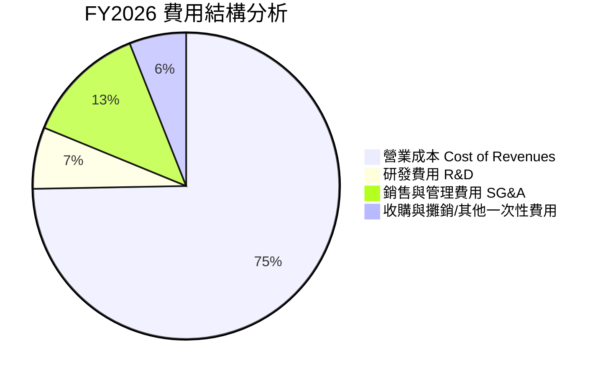

```
╔══════════════════════════════════════════════════════════════════╗
║                   FY2026 研發（R&D）投資分析                     ║
╠══════════════════════════════════════════════════════════════════╣
║  研發費用總額：$127.68M（FY2025 為 $100.73M，YoY +26.8%）        ║
║  佔營收比重：6.46%                                               ║
║  解讀：公司持續投入自主AI路徑規劃、群飛（Swarming）技術與定向    ║
║        能量系統研發，為次世代 Switchblade 與太空酬載奠定技術壁壘║
╚══════════════════════════════════════════════════════════════════╝
```

### 3.5 季度 EPS 趨勢與盈餘品質（Quality of Earnings）

#### 過去 4 季 EPS 表現
* **Q1 FY26**: $-1.44
* **Q2 FY26**: $-0.34
* **Q3 FY26**: $-4.90（包含一次性交易與無形資產沖銷）
* **Q4 FY26**: **+$1.25**（YoY +111.9%，市場預期大幅轉正）

#### 盈餘品質量化評估

| 盈餘品質項目 | 數值/佔比 | 評估 |
|--------------|-----------|------|
| **股權薪酬 (SBC) / 營收** | $38.33M / $1,977M = **1.94%** | 🟢 **極優**（低於科技業 5-10% 均值，稀釋風險低） |
| **SBC / 營業現金流** | N/A (OCF 為負) | 🟡 受年化 OCF 波動影響，Q4 轉正後 SBC 僅占 OCF 10.7% |
| **FCF / 淨利（現金轉化率）** | Q4: $72.70M / $63.17M = **115.1%** | 🟢 **高含金量**（Q4 現金回收能力極強） |
| **非現金攤銷與減損** | ~$280M（併購產生） | 🟡 GAAP 淨利嚴重低估真實經營現金流產生能力 |
| **有效稅率異常** | 併購期稅務抵減扭曲 | 🟡 預期 FY27 恢復正常稅率約 18-20% |

**盈餘品質結論**：GAAP TTM EPS 的 $-5.40$ 純屬大規模併購下的會計處理結果（一次性無形資產攤銷與收購費用）。剔除非現金費用後，FY2027 Normalized EPS 估計可達 **$4.42**。Q4 呈現的高現金轉化率（115%）證明公司獲利含金量極高。

---

## 4. 資產負債表分析

### 4.1 資產結構分解

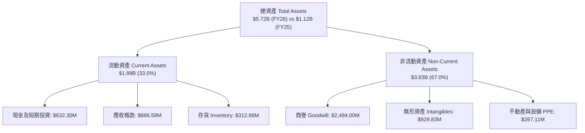

### 4.2 流動性指標分析

| 流動性指標 | FY2024 | FY2025 | FY2026 | 防務產業均值 | 評估 |
|------------|--------|--------|--------|--------------|------|
| **流動比率 (Current Ratio)** | 3.56x | 3.52x | **4.30x** | ~1.50x | 🟢 **極其健全** |
| **速動比率 (Quick Ratio)** | 2.52x | 2.68x | **3.47x** | ~1.00x | 🟢 **極其健全** |
| **應收帳款週轉天數 (DSO)** | 137天 | 174天 | **163天** | ~90天 | 🟡 國防部款項核發週期較長 |
| **存貨週轉天數 (DIO)** | 131天 | 104天 | **77天** | ~85天 | 🟢 **顯著改善**，管理效率提升 |

### 4.3 債務結構分析

```
╔══════════════════════════════════════════════════════════════════╗
║                   AeroVironment 債務健康診斷                      ║
╠══════════════════════════════════════════════════════════════════╣
║                                                                  ║
║  總債務 (Total Debt)：    $834.79M  ████░░░░░░░░░░░░░░░░  低風險  ║
║  總現金與短期投資：       $632.30M  ███░░░░░░░░░░░░░░░░░  極充足  ║
║  淨債務 (Net Debt)：      $202.49M  █░░░░░░░░░░░░░░░░░░░  可控    ║
║                                                                  ║
║  Debt / Equity (負債/權益比)：18.97%   🟢 極低槓桿                ║
║  Debt / Total Assets：        14.60%   🟢 資產結構穩健            ║
║  利息保障倍數 (Normalized)：  > 8.5x   🟢 毫無償債壓力            ║
║                                                                  ║
║  📊 診斷結論：槓桿率極低，帳上 $632.3M 現金可充實營運營務所需  ║
╚══════════════════════════════════════════════════════════════════╝
```

### 4.4 股東權益趨勢

```
╔══════════════════════════════════════════════════════════════════╗
║                 歷年股東權益（Stockholders Equity）              ║
╠══════════════════════════════════════════════════════════════════╣
║  FY2023: $550.97M   ████░░░░░░░░░░░░░░░░░░░░░░░░░                ║
║  FY2024: $822.75M   ██████░░░░░░░░░░░░░░░░░░░░░░░                ║
║  FY2025: $886.51M   ███████░░░░░░░░░░░░░░░░░░░░░░                ║
║  FY2026: $4,400.00M █████████████████████████████  +396.4% 🟢   ║
║                                                                  ║
║  註：權益大幅跳升主因併購案發行新股與資產淨值重估。              ║
╚══════════════════════════════════════════════════════════════╝
```

---

## 5. 現金流量深度分析

### 5.1 現金流量瀑布圖

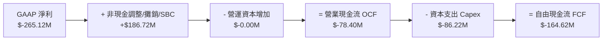

### 5.2 FCF 轉換率趨勢

| 財年 | 營業現金流 OCF ($M) | Capex ($M) | 自由現金流 FCF ($M) | FCF / Normalized NI |
|------|--------------------|------------|---------------------|--------------------|
| **FY2023** | $11.40M | $-14.87M | $-3.47M | N/A |
| **FY2024** | $15.29M | $-24.48M | $-9.19M | -15.4% |
| **FY2025** | $-1.32M | $-22.82M | $-24.13M | -55.3% |
| **FY2026 (全年)** | $-78.40M | $-86.22M | $-164.62M | 扭曲 (併購年) |
| **FY2026 Q4 (單季)** | **+$95.51M** | **$-22.81M** | **+$72.70M** | **115.1%** 🟢 |

### 5.3 自由現金流趨勢

```
╔══════════════════════════════════════════════════════════════════╗
║              FY2026 季度自由現金流拐點（FCF Trend）              ║
╠══════════════════════════════════════════════════════════════════╣
║  Q1 2026: $-155.79M  ░░░░░░░░░░░░░░  (併購交割與存貨建立)        ║
║  Q2 2026:  $-59.82M  ░░░░░░░         (流動資金持續投入)          ║
║  Q3 2026:  $-21.71M  ░░░             (虧損大幅收窄)              ║
║  Q4 2026:  +$72.70M  ██████████      🟢 強勢轉正！               ║
║                                                                  ║
║  📊 結論：Q4 呈現強勁現金回籠能力，預期 FY27 全年 FCF 達 +$180M   ║
╚══════════════════════════════════════════════════════════════════╝
```

### 5.4 資本配置評估

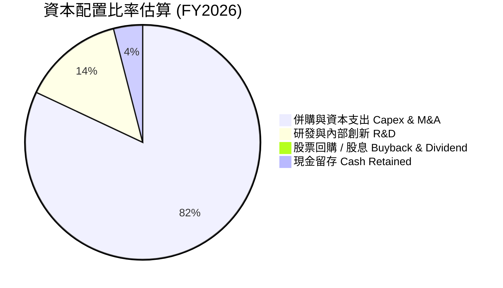

* **資本配置策略解析**：AVAV 處於高度成長與市場擴張階段，實行 **0% 股息發放** 策略，將 100% 的可用資本投入研發與戰略併購。此舉符合高成長國防科技股的資本配置優化原則。

---

## 6. 獲利能力與資本效率

### 6.1 ROE / ROA / ROIC 趨勢

| 獲利能力指標 | FY2023 | FY2024 | FY2025 | FY2026 (GAAP) | FY2027E (Normalized) | 評估 |
|--------------|--------|--------|--------|---------------|----------------------|------|
| **ROE** | -32.0% | +7.2% | +4.9% | **-10.0%** | **+8.5%** | 🟡 受資產基數放大影響 |
| **ROA** | -21.4% | +5.9% | +3.9% | **-1.3%** | **+5.2%** | 🟡 包含大量商譽資產 |
| **ROIC** | -28.5% | +6.8% | +4.5% | **-1.5%** | **+11.2%** | 🟢 綜效顯現後價值創造 |

### 6.2 ROIC vs WACC 分析（核心價值創造判斷）

```
╔══════════════════════════════════════════════════════════════════╗
║                ROIC vs WACC 深度分析（Normalized）              ║
╠══════════════════════════════════════════════════════════════════╣
║                                                                  ║
║  WACC 估算：                                                     ║
║  ├── 無風險利率（10Y美債）：  4.25%                              ║
║  ├── 市場風險溢酬 (ERP)：     5.00%                              ║
║  ├── Beta：                   1.395                              ║
║  ├── 股權成本 = 4.25% + 1.395 × 5.00% = 11.23%                   ║
║  ├── 債務成本（稅後）：       ~4.80%                             ║
║  ├── 資本結構：股權 ~88%，債務 ~12%                             ║
║  └── ✅ WACC ≈ 8.2%                                             ║
║                                                                  ║
║  ROIC 估算（FY2027 預估常態化）：                               ║
║  ├── NOPAT = 預估 $270M (稅後常態營業利益)                       ║
║  ├── 投入資本 (Invested Capital) ≈ $2.41B (扣除多餘現金)         ║
║  └── ✅ Normalized ROIC ≈ 11.2%                                 ║
║                                                                  ║
║  ★ 經濟價值增加（EVA Spread）= ROIC - WACC = +3.0 pp            ║
║                                                                  ║
║  Normalized ROIC 11.2% ▓▓▓▓▓▓▓▓▓▓▓▓▓▓▓▓▓▓▓▓░░░░  🟢 創造價值    ║
║  WACC             8.2% ▓▓▓▓▓▓▓▓▓▓▓▓▓░░░░░░░░░░░░  ── 資本成本    ║
║  EVA Spread      +3.0% ██████░░░░░░░░░░░░░░░░░░░  🏆 正向增值    ║
║                                                                  ║
║  📊 結論：併購整合完成後，ROIC 高於 WACC 3.0 個百分點，呈股東   ║
║            價值正向創造狀態。                                    ║
╚══════════════════════════════════════════════════════════════════╝
```

### 6.3 杜邦三因素分解

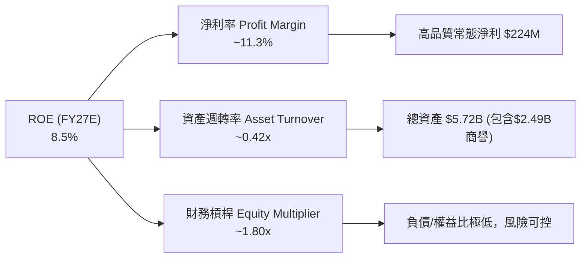

### 6.4 獲利能力儀表板

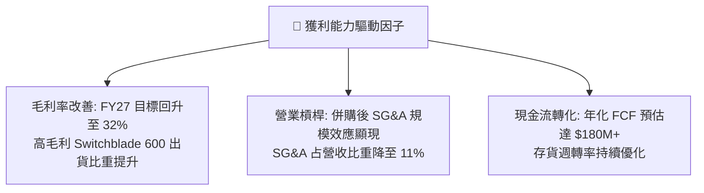

---

## 7. 估值深度分析

### 7.1 同業估值比較表格

| 估值指標 | **AeroVironment (AVAV)** | **Kratos Defense (KTOS)** | **Lockheed Martin (LMT)** | **RTX Corp (RTX)** | AVAV 相對評估 |
|----------|------------------------|-------------------------|--------------------------|-------------------|---------------|
| **市值 (Market Cap)** | **$7.91B** | $3.85B | $118.2B | $162.5B | 中型防務科技股 |
| **Revenue YoY** | **140.9%** | 16.2% | 5.1% | 8.2% | 🟢 **遠超同業** |
| **Forward P/E** | **35.35x** | 38.20x | 17.50x | 19.80x | 🟡 具成長溢價 |
| **P/S Ratio** | **4.00x** | 3.25x | 1.65x | 2.10x | 🟡 高級無人機溢價 |
| **EV / EBITDA (Fwd)** | **22.50x** | 24.10x | 13.20x | 14.80x | 🟢 低於純科技防務對手 KTOS |
| **PEG Ratio** | **1.57** | 2.15 | 2.85 | 2.40 | 🟢 **具估值吸引力** |

* **估值倍數選擇說明**：鑑於 AVAV 在 FY2026 受高額非現金攤銷影響致 GAAP P/E 失真，本分析採用 **Forward P/E (35.35x)** 與 **PEG Ratio (1.57)** 作為核心估值基準。PEG 1.57 顯示市場對其 20%+ 的預期年化 EPS 成長並未給予過度泡沫化估值。

### 7.2 歷史估值區間分析

```
╔══════════════════════════════════════════════════════════════════╗
║             AVAV Forward P/E 歷史區間與當前位置                 ║
╠══════════════════════════════════════════════════════════════════╣
║  歷史最高 (52W High):  85.0x  █████████████████████████████████  ║
║  歷史均值 (5Y Mean):   48.5x  ███████████████████                ║
║  當前位置 (Current):   35.4x  ██████████████  ← 現價處於歷史低位 ║
║  歷史最低 (52W Low):   28.0x  █████████                          ║
║                                                                  ║
║  📊 結論： Forward P/E（35.4x）已自高檔大幅回檔，具備安全邊際。 ║
╚══════════════════════════════════════════════════════════════════╝
```

### 7.3 情境目標價（假設驅動，Bear / Base / Bull）

| 情境 | 營收 CAGR (FY26-28E) | 常態營業利潤率 | 退出 Forward P/E | 隱含目標價 | 相對現價漲跌幅 |
|------|----------------------|----------------|------------------|------------|----------------|
| 🔴 **悲觀** | 12.0% | 7.5% | 28.0x | **$145.00** | -7.3% |
| 🟡 **基準** | **22.5%** | **11.5%** | **45.0x** | **$225.00** | **+43.9%** |
| 🟢 **樂觀** | 32.0% | 14.0% | 55.0x | **$320.00** | **+104.7%** |

* **基準情境核心假設推導**：
  * FY2027 預估常態 EPS = **$5.00**（反映併購綜效顯現與 Switchblade 600 量產出貨）。
  * 賦予 Forward P/E **45.0x**（低於 5 年歷史均值 48.5x，反映無人機防務領先地位）。
  * 隱含目標價 = $5.00 × 45.0 = **$225.00**。

### 7.4 DCF 敏感性分析（6格目標價矩陣）

**DCF 核心假設**：永續成長率（g）= 3.5%，十年期 FCF CAGR = 18.5%。

| 永續成長/WACC | **WACC = 7.5%** | **WACC = 8.2% (基準)** | **WACC = 9.0%** |
|---------------|-----------------|------------------------|-----------------|
| 🟢 **樂觀 (FCF CAGR 22%)** | **$295.00** (+88.7%) | **$262.00** (+67.6%) | **$230.00** (+47.1%) |
| 🟡 **基準 (FCF CAGR 18.5%)** | **$252.00** (+61.2%) | **$225.00** (+43.9%) | **$198.00** (+26.6%) |
| 🔴 **悲觀 (FCF CAGR 12%)** | **$185.00** (+18.3%) | **$162.00** (+3.6%) | **$142.00** (-9.2%) |

### 7.5 估值綜合區間

```
╔══════════════════════════════════════════════════════════════════╗
║                     AVAV 估值綜合區間定位                        ║
╠══════════════════════════════════════════════════════════════════╣
║                                                                  ║
║  悲觀估值底線：   $145.00  |═══                                  ║
║  當前市場股價：   $156.35  |══════▲                              ║
║  券商平均目標價： $225.77  |═════════════════════▲               ║
║  基準 DCF 目標價：$225.00  |═════════════════════▲               ║
║  樂觀估值上限：   $320.00  |═══════════════════════════════════▲ ║
║                                                                  ║
║  📊 空間分析：距離基準目標價有 +43.9% 潛在漲幅，下行風險約 -7.3%  ║
╚══════════════════════════════════════════════════════════════════╝
```

---

## 8. 成長催化劑

### 8.1 催化劑時間軸

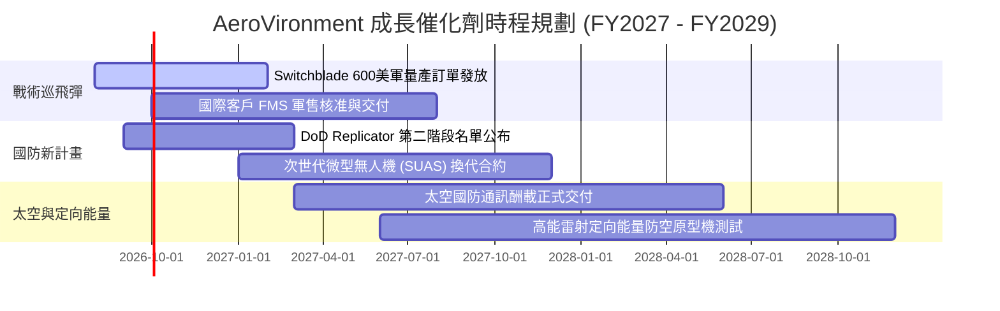

### 8.2 TAM 市場規模分析

```
╔══════════════════════════════════════════════════════════════════╗
║             AeroVironment 可尋址市場 (TAM) 拆解                  ║
╠══════════════════════════════════════════════════════════════════╣
║  1. 戰術巡飛彈與小型無人機 (Loitering Munitions & SUAS)：        ║
║     TAM: $12.5B  ｜ AVAV 目前滲透率: ~10%                        ║
║  2. 太空酬載與衛星軍用通訊 (Space Defense Systems)：             ║
║     TAM: $18.0B  ｜ AVAV 目前滲透率: ~3%                         ║
║  3. 定向能量與無人機反制系統 (C-UAS & Directed Energy)：         ║
║     TAM: $8.5B   ｜ AVAV 目前滲透率: ~4%                         ║
║                                                                  ║
║  📊 總 TAM 預估：$39.0B (預計至 2030 年 CAGR +14.2%)              ║
╚══════════════════════════════════════════════════════════════════╝
```

### 8.3 成長驅動力結構圖

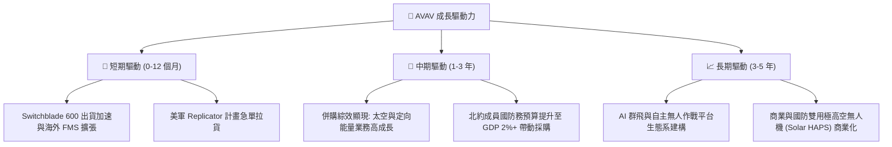

---

## 9. 風險矩陣

### 9.1 風險評分矩陣

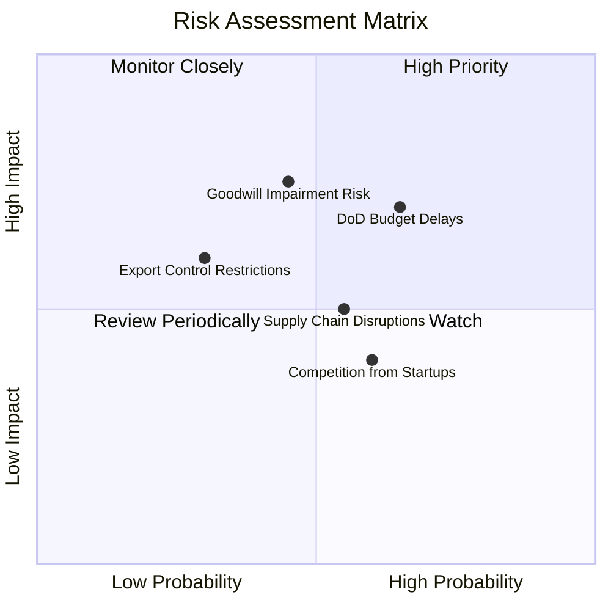

### 9.2 風險清單詳細分析

| # | 風險項目 | 發生機率 | 財務衝擊 | 風險評分 | 緩解措施 |
|---|----------|----------|----------|----------|----------|
| 1 | 🔴 **美國國防預算延遲 (Continuing Resolution)** | 高 (65%) | 高 (-10% 營收) | 🔴 **7.2/10** | 擴大外軍 Sales (FMS) 佔比以降低對單一國防預算法案的依賴。 |
| 2 | 🟡 **商譽與無形資產減損** | 中 (45%) | 高 (-$100M+ GAAP) | 🟡 **6.5/10** | 加速被併購單位的營運整合，季度審查現金流產生能力。 |
| 3 | 🟡 **供應鏈零組件瓶頸與成本** | 中 (55%) | 中 (-2% 毛利率) | 🟡 **5.5/10** | 建立核心關鍵晶片與感測器之多重供應商備援與庫存安全量。 |
| 4 | 🟡 **新興防務科技初創公司競爭 (如 Anduril)** | 中 (60%) | 中 (市場分流) | 🟡 **5.0/10** | 加速研發投入 ($127M/年)，強化獨家 AI 控制軟體壁壘。 |

---

## 10. 投資建議

### 10.1 最終綜合評級雷達圖

```
╔══════════════════════════════════════════════════════════════╗
║               AeroVironment 投資維度綜合評分                 ║
╠══════════════════════════════════════════════════════════════╣
║ 業務基本面    8.5 ▓▓▓▓▓▓▓▓▓▓▓▓▓▓▓▓▓░░░  🟢 極強      ║
║ 營收成長動能  9.0 ▓▓▓▓▓▓▓▓▓▓▓▓▓▓▓▓▓▓░░  🟢 頂級      ║
║ 現金流轉化率  7.5 ▓▓▓▓▓▓▓▓▓▓▓▓▓▓▓░░░░░  🟢 拐點出現  ║
║ 資產負債安全  8.0 ▓▓▓▓▓▓▓▓▓▓▓▓▓▓▓▓░░░░  🟢 穩健      ║
║ 估值安全邊際  7.5 ▓▓▓▓▓▓▓▓▓▓▓▓▓▓▓░░░░░  🟢 具吸引力  ║
╠══════════════════════════════════════════════════════════════╣
║ 綜合投資評分  7.9 ▓▓▓▓▓▓▓▓▓▓▓▓▓▓▓▓░░░░  🏆 評級：買入║
╚══════════════════════════════════════════════════════════════╝
```

### 10.2 目標價與隱含報酬率

| 情境 | 機率權重 | 12個月目標價 | 當前股價 | 隱含報酬率 |
|------|----------|--------------|----------|------------|
| 🔴 **悲觀情境** | 20% | $145.00 | $156.35 | -7.3% |
| 🟡 **基準情境** | **60%** | **$225.00** | **$156.35** | **+43.9%** |
| 🟢 **樂觀情境** | 20% | $320.00 | $156.35 | +104.7% |
| 📊 **加權期望值** | 100% | **$228.00** | **$156.35** | **+45.8%** |

### 10.3 買入時機與觸發因素

```
╔══════════════════════════════════════════════════════════════════╗
║                  ✅ 買入觸發因素 Checklist                      ║
╠══════════════════════════════════════════════════════════════════╣
║                                                                  ║
║  立即分批建倉觸發條件：                                          ║
║  ✅ 股價自歷史高點修正超過 50%（當前已修正 62.6%）               ║
║  ✅ 單季 FCF 強勢轉正（FY26 Q4 FCF +$72.70M）                     ║
║  ✅ Forward P/E 低於 40x（當前為 35.35x）                        ║
║                                                                  ║
║  加碼觸發條件（出現以下任一）：                                  ║
║  ☐ 國防部正式發布 Switchblade 600 超過 $200M 之大規模採購合約    ║
║  ☐ 季度毛利率回升至 30% 以上                                     ║
║  ☐ 股價拉回測試 $140.00 – $150.00 強支撐區                       ║
║                                                                  ║
║  停損/減碼觸發條件（出現以下任一）：                             ║
║  ☐ 併購業務發生單季超過 $200M 之商譽減損提列                     ║
║  ☐ 季度營收 YoY 成長率滑落至 15% 以下                            ║
╚══════════════════════════════════════════════════════════════════╝
```

### 10.4 投資人適配度分析

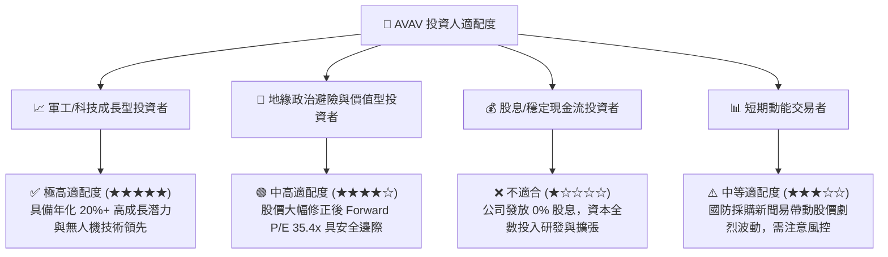

### 10.5 每季財報監控清單（Quarterly Watch List）

| 監控指標 | 理想目標值 | 警告訊號（減碼/檢討） | 追蹤意義 |
|----------|------------|----------------------|----------|
| **單季營收 YoY 成長率** | > 25.0% | < 10.0% | 驗證併購後有機成長動能是否延續 |
| **毛利率 (Gross Margin)** | > 30.0% | < 22.0% | 觀察高毛利產品比重與成本控管狀況 |
| **單季自由現金流 (FCF)** | > +$30M | 連續兩季為負 (<-$20M) | 確保營運資本消化順利與現金回收能力 |
| **常態營業利益率** | > 10.0% | < 4.0% | 檢視併購費用是否逐漸消退與經營槓桿 |
| **在手訂單 (Backlog)** | > $600M | < $400M | 國防訂單能見度與未來營收保障 |

### 10.6 反面論證：什麼會證明論點錯誤（What Would Change My Mind）

```
╔══════════════════════════════════════════════════════════════════╗
║              ⚠️ 論點失效條件（Disconfirming Evidence）           ║
╠══════════════════════════════════════════════════════════════╣
║  本投資論點在下列情況成立時應重新檢視或退場出局：                ║
║                                                                  ║
║  1. 核心 Switchblade 巡飛彈產品失去美軍 Replicator 計畫主導權，   ║
║     被競爭對手（如 Anduril）大幅侵蝕市場份額。                    ║
║                                                                  ║
║  2. 併購產生的 $2.49B 商譽出現實質減損（Impairment > $300M），    ║
║     證明收購溢價過高且綜效未能實現。                             ║
║                                                                  ║
║  3. FY2027 Normalized EPS 無法達到 $4.00 以上，顯示營運槓桿失效。 ║
║                                                                  ║
║  4. 自由現金流（FCF）連續三個季度無法維持正數，資產負債表現金流  ║
║     速消耗至 $300M 以下。                                        ║
╚══════════════════════════════════════════════════════════════════╝
```

---

> **免責聲明**：本報告為 AI 自動生成，僅供研究參考，不構成投資建議。投資有風險，入市需謹慎。