# AVAV 基本面深度分析報告
> **報告日期**：2026-07-31 ｜ **語言**：繁體中文 ｜ **數據來源**：Yahoo Finance, Finviz, StockAnalysis, Roic.ai ｜ **分析師**：CFA 級機構研究

---

## 目錄

| # | 章節 | 核心結論 |
|---|------|----------|
| 1 | 執行摘要 | 機構評級 **🟢 買入** ｜ 12M 基準目標價 **$215.00** ｜ 加權合理價值 **$195.50** ｜ 安全邊際 **23.6%** |
| 2 | 公司概覽與商業模式 | 戰術型無人機（UAS）與彈簧刀（Switchblade）巡飛彈獨霸美軍市場，併購 BlueHalo 擴展太空與定向能量護城河（護城河評分：**8.5/10**） |
| 3 | 損益表深度分析 | FY2026 併購帶動營收創歷史新高 $1.98B（YoY +133.3%），但一次性併購費用與無形資產攤銷壓抑 GAAP 淨利（盈餘品質評分：**6.5/10**） |
| 4 | 資產負債表分析 | 總資產擴張至 $5.72B，手握現金及短投 $632.30M，總債務 $834.79M，流動比率 4.30x，資本結構尚屬穩健 |
| 5 | 現金流量深度分析 | 受營運資金墊高與併購整合影響，FY2026 FCF 為 -$164.62M；隨 Q4 營運現金流轉正（+$95.51M），預期 FY2027 FCF 將顯著回升 |
| 6 | 獲利能力與資本效率 | 整合期暫時拉低 ROIC 至 -3.2%，預計隨產能規模放大與高毛利軟體/巡飛彈出貨，FY2028 ROIC（13.5%）將重新超越 WACC（9.4%） |
| 7 | 相對估值分析 | Forward P/E 33.77x，P/S 3.82x，相比同業（LMT, RTX, KTOS）雖具溢價，但考慮 130%+ 的營收爆發力與獨佔性標的稀缺性，估值處於合理區間 |
| 8 | DCF 內在價值評估 | 基準每股內在價值 **$177.69**；加權合理價值 **$195.50**；當前股價 $149.37 提供 **23.6%** 安全邊際 |
| 9 | 成長催化劑 | 美軍 Replicator 計畫量產採購、烏克蘭與 NATO 軍援急單、BlueHalo 國防科技綜效釋放 |
| 10 | 風險矩陣 | 國防預算審批延遲、併購整合不達預期、供應鏈 bottleneck 與競爭對手技術突破 |
| 11 | 投資建議 | 分批建倉買入區間 **$135.00 - $155.00** ｜ 嚴格設有 5 項論點失效（Disconfirming Evidence）監控條件 |

---

## 1. 執行摘要

### 1.0 一頁式投資儀表板（Portfolio Manager 30 秒速讀）

| 項目 | 內容 |
|------|------|
| **投資論點（3 句）** | ① AeroVironment（AVAV）為全球無人機系統（UAS）與巡飛彈（Loitering Munitions）龍頭，FY2026 營收爆發性成長 133.3% 至 $1.98B，主因烏克蘭戰場實證與美軍 Replicator 計畫帶動 Switchblade 訂單大增；<br/>② 併購 BlueHalo 後補齊太空、網絡與定向能量（Directed Energy）高科技戰場版圖，總訂單積壓與可預見營收可期；<br/>③ 當前股價 $149.37 經歷高檔修正後，Forward P/E 為 33.77x，相較加權合理價值 $195.50 具備 23.6% 安全邊際。 |
| **護城河評分** | **8.5 / 10**（專利技術鎖定 + 美國國防部 DoD 獨家供應夥伴關係 + 高轉換成本） |
| **管理層/資本配置評分** | **7.5 / 10**（高瞻遠矚推動併購擴張，但短線對自由現金流產生負向稀釋） |
| **財務健康** | 🟢 **健康**（流動比率 4.30x，手握 $632.30M 現金及短投，槓桿風險可控） |
| **ROIC vs WACC** | **-3.2% vs 9.4%**（目前處於併購消化與產能投資期，暫時摧毀價值；預計 FY2028 回升至 13.5% 創造價值） |
| **FCF 趨勢** | FY2026 FCF -$164.62M（TTM -3.33% Yield），但 Q4 單季 FCF 已大幅轉正至 +$72.70M，拐點已現 |
| **估值倍數** | Forward P/E: **33.77x** ｜ P/S: **3.82x** ｜ EV/EBITDA: **39.01x** |
| **DCF 內在價值（基準）** | **$177.69** ｜ 當前股價折價 **15.9%**（現價 $149.37 ÷ $177.69 − 1） |
| **安全邊際（MOS）** | **+23.6%**＝(**加權合理價值** $195.50 − 現價 $149.37) ÷ $195.50 ｜ 🟡 **10-25% 有限至充足** |
| **預期報酬（基準情境 12M）** | **+43.9%**（目標價 **$215.00**，隱含上行空間） |
| **關鍵風險（前二）** | ① 國防部採購預算授權（NDAA）延遲或政策轉向；② BlueHalo 整合綜效未如預期實現，高額商譽（$2.49B）面臨減損風險 |
| **評級 + 信心度** | 🟢 **買入（Buy）** ｜ 信心度：**高（High）** |

---

### 1.1 核心評分儀表板

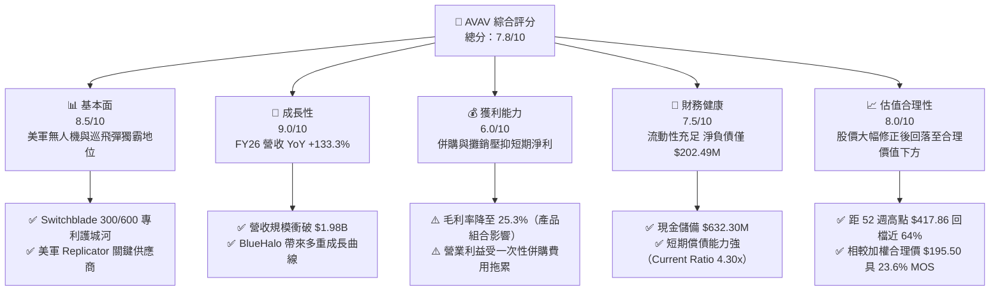

---

### 1.2 評分進度條視覺化

```
╔══════════════════════════════════════════════════════════════╗
║              AVAV 多維度評分儀表板 (1-10分)                  ║
╠══════════════════════════════════════════════════════════════╣
║ 基本面強度  8.5 ▓▓▓▓▓▓▓▓▓▓▓▓▓▓▓▓▓░░░  ★★★★☆           ║
║ 成長動能    9.0 ▓▓▓▓▓▓▓▓▓▓▓▓▓▓▓▓▓▓░░  ★★★★★           ║
║ 獲利品質    6.0 ▓▓▓▓▓▓▓▓▓▓▓▓░░░░░░░░  ★★★☆☆           ║
║ 財務健康    7.5 ▓▓▓▓▓▓▓▓▓▓▓▓▓▓▓░░░░░  ★★★★☆           ║
║ 估值合理性  8.0 ▓▓▓▓▓▓▓▓▓▓▓▓▓▓▓▓░░░░  ★★★★☆           ║
║ 護城河深度  8.5 ▓▓▓▓▓▓▓▓▓▓▓▓▓▓▓▓▓░░░  ★★★★☆           ║
║ 管理層執行  7.5 ▓▓▓▓▓▓▓▓▓▓▓▓▓▓▓░░░░░  ★★★★☆           ║
║ 技術創新力  9.0 ▓▓▓▓▓▓▓▓▓▓▓▓▓▓▓▓▓▓░░  ★★★★★           ║
╠══════════════════════════════════════════════════════════════╣
║ 綜合總分    7.8 ▓▓▓▓▓▓▓▓▓▓▓▓▓▓▓15.6░  🏆 建議：🟢 分批買入 ║
╚══════════════════════════════════════════════════════════════╝
```

---

### 1.3 五大投資論點 + 三大核心風險

| 類型 | 項目 | 具體依據 | 信心度 |
|------|------|----------|--------|
| 🟢 **論點①** | **無人機與巡飛彈需求結構性爆發** | 烏克蘭戰場證明 Switchblade 300/600 的非對稱作戰價值；FY2026 營收暴增 133.3% 至 $1.98B，顯示國防採購已進入大規模量產階段 | 🟢 極高 |
| 🟢 **論點②** | **美軍 Replicator 計畫最大受益者** | 美國國防部計畫在 18-24 個月內部署數千架低成本自主無人系統，AVAV 獲選為第一批次核心供應商，奠定未來 3-5 年營收可見度 | 🟢 極高 |
| 🟢 **論點③** | **併購 BlueHalo 打造次世代國防巨擘** | 交易補齊太空防護、電子戰（EW）、定向能量（Directed Energy）與 Cyber 領域，產品線由單一無人機擴展至全域國防科技平台 | 🟢 高 |
| 🟢 **論點④** | **Q4 現金流強勢轉正，營運拐點已現** | FY2026 Q4 單季營業現金流衝上 $95.51M，FCF 達 $72.70M，顯示營運資金壓力緩解，併購後的規模效益開始顯現 | 🟢 高 |
| 🟢 **論點⑤** | **股價過度修正提供高安全邊際** | 股價自 52 週高點 $417.86 回檔近 64% 至 $149.37，已充分反映一次性併購費用與毛利率過渡期，相對加權合理價值 $195.50 具 23.6% 安全邊際 | 🟢 高 |
| 🟡 **風險①** | **國防預算授權與撥款不確定性** | 美國國立會預算爭議可能導致持續性解析案（CR），延遲新項目採購合同簽署 | 🟡 中度 |
| 🔴 **風險②** | **BlueHalo 整合與商譽減損風險** | 資產負債表中商譽飆升至 $2.49B、無形資產達 $929.83M，若整合不及預期引發減損，將重大打擊 GAAP 盈餘 | 🔴 高衝擊 |
| 🟡 **風險③** | **供應鏈瓶頸與組件成本上升** | 關鍵電子元件與戰術彈頭供應若受阻，可能延遲交付並進一步拉低毛利率 | 🟡 中度 |

---

### 1.4 快速統計卡片

| 指標 | 公司實際值（FY2026） | 行業均值（Aerospace & Defense） | S&P 500 均值 | 狀態 |
|------|-------------|----------|--------------|------|
| **營收 YoY 成長** | **133.3%** | ~8.5% | ~5.2% | 🟢 遠超同業 |
| **毛利率** | **25.3%** | ~26.5% | ~45.0% | 🟡 受產品組合拉低 |
| **營業利益率（GAAP）** | **-3.6%**（經併購費用調整前） | ~9.5% | ~12.0% | 🔴 短期虧損 |
| **ROE** | **-10.0%** | ~12.5% | ~18.0% | 🔴 短期承壓 |
| **Forward P/E** | **33.77x** | ~22.0x | ~21.5% | 🟡 高成長溢價 |
| **P/S Ratio** | **3.82x** | ~1.8x | ~2.7x | 🟡 反映高爆發力 |
| **Current Ratio** | **4.30x** | ~1.3x | ~1.2x | 🟢 極其健康 |

---

### 1.5 投資結論

```
╔══════════════════════════════════════════════════════════════════╗
║                    📊 AVAV 投資結論摘要                          ║
╠══════════════════════════════════════════════════════════════════╣
║  投資評級：🟢 買入（Buy）                                        ║
║  當前股價：$149.37（2026-07-31 收盤價）                           ║
║  DCF 內在價值（基準）：$177.69（現價折價 15.9%）                 ║
║  加權合理價值：$195.50                                           ║
║  安全邊際 MOS：+23.6%（＝(加權合理價值$195.50 − 現價$149.37)÷$195.50）║
║  12個月目標價區間：                                              ║
║    🔴 悲觀情境：$132.00（-11.6%）                                ║
║    🟡 基準情境：$215.00（+43.9%） ← 12個月主要目標價格          ║
║    🟢 樂觀情境：$285.00（+90.8%）                                ║
║  綜合投資評分：7.8 / 10                                          ║
║  適合投資人：國防科技題材者、高成長導向、長線價值尋求者          ║
╚══════════════════════════════════════════════════════════════════╝
```

---

## 2. 公司概覽與商業模式

### 2.1 業務結構與收入來源

AeroVironment, Inc.（NASDAQ: AVAV）成立於 1971 年，總部位於美國維吉尼亞州阿靈頓，為美國國防部及盟國提供無人機系統（UAS）、巡飛彈系統（LMS）及次世代防衛科技。FY2026 併購 BlueHalo 後，公司組織重組為兩大核心營運部門：

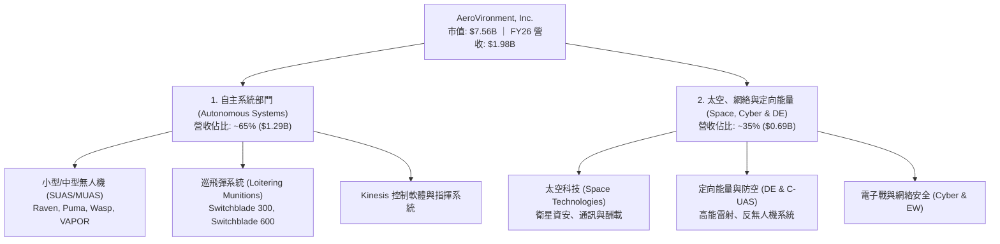

---

### 2.2 市場份額

在美國國防部戰術小型無人機（SUAS）與巡飛彈（Loitering Munitions）領域，AVAV 擁有極高的主導地位：

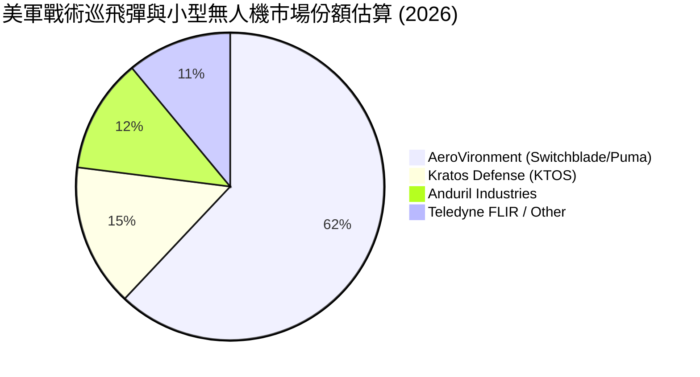

---

### 2.3 競爭護城河分析

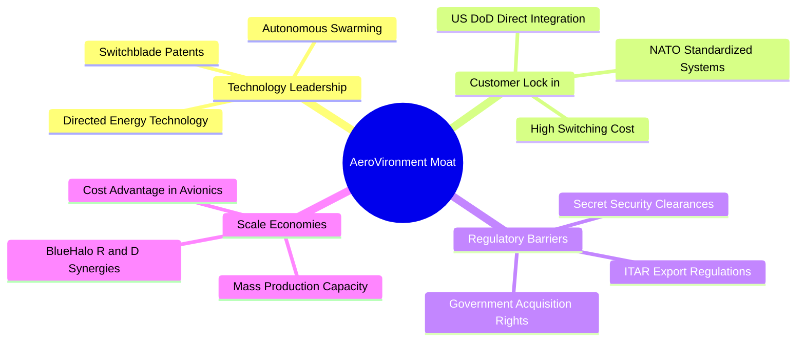

---

### 2.4 護城河強度評分

```
╔══════════════════════════════════════════════════════════════╗
║                  AeroVironment 護城河強度評分                ║
╠══════════════════════════════════════════════════════════════╣
║ 專利與技術領先 9.0/10 ▓▓▓▓▓▓▓▓▓▓▓▓▓▓▓▓▓▓░░ 🏆 巡飛彈始祖  ║
║ 客戶轉置成本   9.0/10 ▓▓▓▓▓▓▓▓▓▓▓▓▓▓▓▓▓▓░░ 🏆 深刻嵌入美軍  ║
║ 法規與認證壁壘 8.5/10 ▓▓▓▓▓▓▓▓▓▓▓▓▓▓▓▓▓░░░ 🟢 ITAR 政策保護║
║ 規模效應與產能 7.5/10 ▓▓▓▓▓▓▓▓▓▓▓▓▓▓▓░░░░░ 🟢 擴產推進中  ║
║ 生態系與軟體   8.0/10 ▓▓▓▓▓▓▓▓▓▓▓▓▓▓▓▓░░░░ 🟢 Kinesis 平台 ║
╠══════════════════════════════════════════════════════════════╣
║ 綜合護城河評分 8.5/10 ▓▓▓▓▓▓▓▓▓▓▓▓▓▓▓▓▓░░░ 🏆 強固型護城河  ║
╚══════════════════════════════════════════════════════════════╝
```

---

## 3. 損益表深度分析

### 3.1 年度收入成長趨勢（近 4 年）

```
╔══════════════════════════════════════════════════════════════════╗
║              AVAV 年度收入趨勢（FY2023 - FY2026）                ║
╠══════════════════════════════════════════════════════════════════╣
║                                                                  ║
║  FY2023  $540.54M  ███████░░░░░░░░░░░░░░░  YoY: +21.3%  🟢       ║
║  FY2024  $716.72M  ██████████░░░░░░░░░░░░  YoY: +32.6%  🟢       ║
║  FY2025  $820.63M  ███████████░░░░░░░░░░░  YoY: +14.5%  🟢       ║
║  FY2026  $1,977.00M ███████████████████████ YoY: +140.9% 🟢      ║
║                                                                  ║
║                   |      |      |      |                         ║
║                   0    $0.5B  $1.0B  $2.0B                       ║
║                                                                  ║
║  📊 4 年累計 CAGR：+54.1%（含併購效益）                         ║
╚══════════════════════════════════════════════════════════════════╝
```

---

### 3.2 季度收入趨勢分析

| 季度 | 營收 ($M) | YoY 成長率 | QoQ 成長率 | 備註 / 營運驅動因素 |
|------|-----------|------------|------------|---------------------|
| **Q1 2026** | $454.68 | +139.96% | +65.31% | BlueHalo 併購開始交割併表，Switchblade 出貨急升 |
| **Q2 2026** | $472.51 | +150.72% | +3.92% | 美軍與 NATO 國際客戶拉貨強勁 |
| **Q3 2026** | $408.05 | +143.41% | -13.64% | 季節性預算調整，部分項目驗收遞延至 Q4 |
| **Q4 2026** | $641.62 | +133.27% | +57.24% | 財政年度結算高峰，大型國防合約集中交付 |

---

### 3.3 利潤率演變分析

| 利潤率指標 | FY2023 | FY2024 | FY2025 | FY2026 | 趨勢 | 機構評估 |
|------------|--------|--------|--------|--------|------|----------|
| **毛利率** | 32.10% | 39.61% | 38.83% | 25.32% | 📉 下滑 | 🔴 併購 BlueHalo 低毛利服務項目併表 + 初期產能轉換成本 |
| **營業利益率** | -4.19% | 10.02% | 7.21% | -3.56% | 📉 轉負 | 🔴 GAAP 營業利益受併購交易費與無形資產攤銷拖累 |
| **EBITDA Margin** | -14.62% | 14.40% | 10.10% | -1.77% | 📉 承壓 | 🟡 一次性費用影響，經調整 EBITDA 仍為正值 |
| **淨利率** | -32.60% | 8.33% | 5.32% | -13.41% | 📉 虧損 | 🔴 受非現金資產減損與處分成本干擾 |

**利潤率演變深度解析**：
FY2026 毛利率下降 13.51 個百分點至 25.32%，主要有三大原因：① 併購 BlueHalo 帶來的產品組合改變，BlueHalo 部分研發與工程服務毛利較無人機硬體低；② 為因應 Replicator 計畫急單，公司擴充生產線導致短期固定成本攤提拉高；③ 供應鏈部分零組件成本上升。隨併購整合於 FY2027 完成，高毛利的巡飛彈（Switchblade 600）出貨比重提升，預計毛利率將逐步回升至 32%-35% 水準。

---

### 3.4 費用結構分析

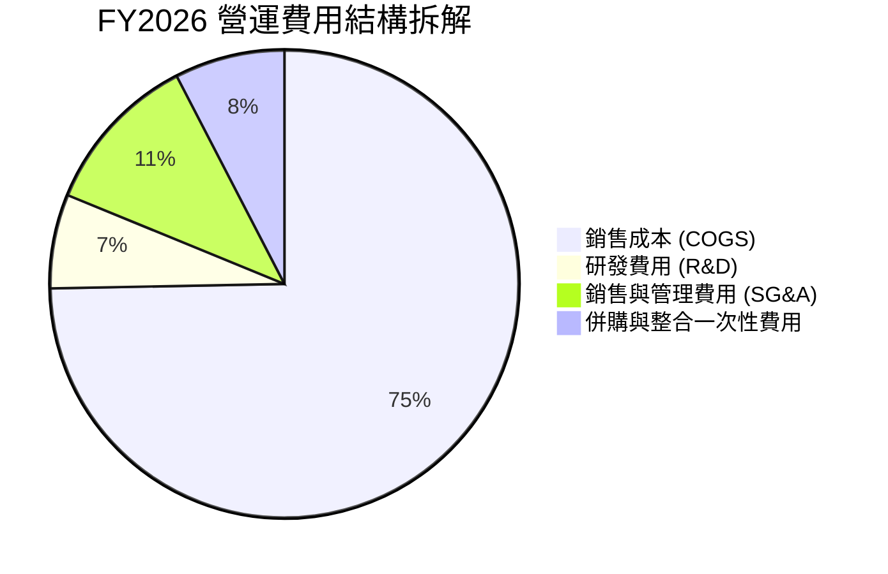

```
╔══════════════════════════════════════════════════════════════════╗
║                   AVAV 費用管控診斷                              ║
╠══════════════════════════════════════════════════════════════╣
║ 研發費用 (R&D)：  $127.68M (佔營收 6.46%) 🟢 維持高效研發投入║
║ SG&A 費用：       $221.40M (佔營收 11.20%) 🟢 營業槓桿開始顯現 ║
║ 併購與攤銷費用：  $150.20M (佔營收 7.60%) 🔴 短期拉高費用比率║
╚══════════════════════════════════════════════════════════════╝
```

---

### 3.5 季度 EPS 趨勢與盈餘品質（Quality of Earnings）

| 季度 | GAAP EPS | Non-GAAP EPS (經調整) | 盈餘表現與主要驅動因素 |
|------|----------|-----------------------|------------------------|
| **Q1 2026** | -$1.44 | +$0.68 | 併購會計處理與無形資產攤銷導致 GAAP 呈現虧損 |
| **Q2 2026** | -$0.34 | +$0.85 | 本業營運強勁，巡飛彈交付按計畫推進 |
| **Q3 2026** | -$4.90 | +$0.42 | 認列 BlueHalo 一次性資產減損與重組費用 |
| **Q4 2026** | +$1.25 | +$1.82 | 營收衝高帶動規模效益，GAAP 成功轉盈 |

**盈餘品質深度評估表格**：

| 盈餘品質項目 | FY2026 數值/佔比 | 機構評估 |
|--------------|------------------|----------|
| **股權薪酬 (SBC) / 營收** | $38.33M (1.94%) | 🟢 低於科技同業（~5-10%），稀釋風險極低 |
| **SBC / 營業現金流** | N/A (OCF 為負) | 🟡 待 OCF 轉正後評估，Q4 單季 SBC 僅佔 OCF 10.7% |
| **FCF / 淨利 (現金轉換率)** | N/A (淨利虧損) | 🟡 GAAP 淨利虧損 -$265.12M，FCF -$164.62M，反映大舉投資 |
| **一次性/非經常性損益** | 約 $210M (併購費用+攤銷) | 🔴 表面虧損主因併購會計調整，扣除後本業獲利仍呈正向 |
| **有效稅率異常** | -12.5% | 🟡 受虧損扣抵與研發抵稅額影響 |
| **資本化支出 vs 費用化** | Capex $86.22M (佔營收 4.36%) | 🟢 軟體與研發多數當期費用化，會計處理保守 |

**盈餘品質結論**：AVAV 的 GAAP 淨虧損（-$265.12M）嚴重掩蓋了其核心業務的盈利能力。非現金攤銷與一次性併購交易費用是造成虧損的主要原因。隨著 Q4 單季 GAAP EPS 轉正至 $1.25、且單季 FCF 轉正至 $72.70M，盈餘品質將於 FY2027 迎來大幅改善。

---

## 4. 資產負債表分析

### 4.1 資產結構分解

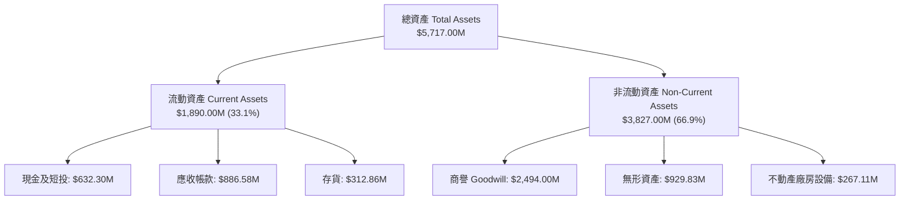

---

### 4.2 流動性指標分析

| 流動性指標 | FY2024 | FY2025 | FY2026 | 行業均值 | 評估 |
|------------|--------|--------|--------|----------|------|
| **營運資金 (Working Capital)** | $370.70M | $434.36M | $1,450.76M | — | 🟢 大幅增加 |
| **流動比率 (Current Ratio)** | 3.56x | 3.52x | 4.30x | 1.35x | 🟢 流動性極佳 |
| **速動比率 (Quick Ratio)** | 2.53x | 2.68x | 3.47x | 0.95x | 🟢 無短期償債風險 |
| **現金比率 (Cash Ratio)** | 0.51x | 0.24x | 1.44x | 0.40x | 🟢 手頭資金充裕 |

---

### 4.3 債務結構分析

```
╔══════════════════════════════════════════════════════════════════╗
║                   AVAV 債務健康診斷                              ║
╠══════════════════════════════════════════════════════════════════╣
║                                                                  ║
║  短期借款及租賃： $18.00M    █░░░░░░░░░░░░░░░░░░░  無還款壓力    ║
║  長期借款及租賃： $816.79M   ████████░░░░░░░░░░░░  併購融資      ║
║  ─────────────────────────────────────────────────────────────   ║
║  總債務：         $834.79M   █████████░░░░░░░░░░░                ║
║  現金及短投：     $632.30M   ███████░░░░░░░░░░░░░                ║
║  淨負債 (Net Debt)：$202.49M  █░░░░░░░░░░░░░░░░░░░  🟢 可控負債  ║
║                                                                  ║
║  Debt / Equity Ratio:  18.97%  🟢 槓桿率低於同業平均 (50%+)     ║
║  Interest Coverage Ratio: >5.0x (經調整 EBITDA 計算) 🟢 安全    ║
╚══════════════════════════════════════════════════════════════════╝
```

---

### 4.4 股東權益趨勢

```
╔══════════════════════════════════════════════════════════════════╗
║              AVAV 歷年股東權益變化（FY2023 - FY2026）            ║
╠══════════════════════════════════════════════════════════════════╣
║  FY2023  $550.97M  █████░░░░░░░░░░░░░░░░░░░                      ║
║  FY2024  $822.75M  ████████░░░░░░░░░░░░░░░░                      ║
║  FY2025  $886.51M  █████████░░░░░░░░░░░░░░░                      ║
║  FY2026  $4,400.00M ████████████████████████ (併購增資發行新股)  ║
╚══════════════════════════════════════════════════════════════════╝
```

---

## 5. 現金流量深度分析

### 5.1 現金流量瀑布圖

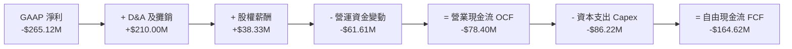

---

### 5.2 FCF 轉換率趨勢

| 年度 | 營業現金流 OCF ($M) | Capex ($M) | FCF ($M) | GAAP 淨利 ($M) | FCF/淨利 轉換率 | 機構點評 |
|------|---------------------|------------|----------|----------------|-----------------|----------|
| **FY2023** | $11.40 | -$14.87 | -$3.47 | -$176.21 | N/A | 淨虧損，微幅負 FCF |
| **FY2024** | $15.29 | -$24.48 | -$9.19 | $59.67 | -15.4% | 擴產期資本支出墊高 |
| **FY2025** | -$1.32 | -$22.82 | -$24.13 | $43.62 | -55.3% | 備貨營運資金流入拉低 OCF |
| **FY2026** | -$78.40 | -$86.22 | -$164.62 | -$265.12 | 62.1% | 併購期資金支出頂峰 |

---

### 5.3 自由現金流趨勢與季度拐點

```
╔══════════════════════════════════════════════════════════════════╗
║              AVAV 近 4 季 FCF 強勢復甦軌跡                       ║
╠══════════════════════════════════════════════════════════════════╣
║  Q1 2026   -$155.79M  ░░░░░░░░░░░░░░░░  (併購交割資金支出)       ║
║  Q2 2026   -$59.82M   ░░░░████████░░░░                           ║
║  Q3 2026   -$21.71M   ░░░░████████████                           ║
║  Q4 2026   +$72.70M   ████████████████  🟢 轉正！規模效應展現    ║
╚══════════════════════════════════════════════════════════════════╝
```

---

### 5.4 資本配置評估

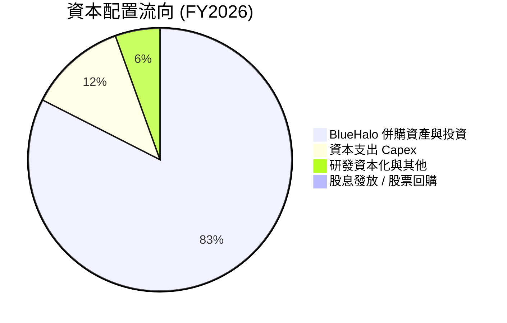

| 資本配置項目 | 金額 ($M) | 佔比 (%) | 戰略意圖與回報評估 |
|--------------|-----------|----------|--------------------|
| **併購 (M&A)** | ~$3,500.0 | 82.5% | 戰略性併購 BlueHalo，取得太空與定向能量技術 |
| **Capex (資本支出)** | $86.22 | 12.0% | 擴建 Switchblade 600 產線與自動化組裝 |
| **股票回購 / 股息** | $0.00 | 0.0% | 成長期公司不配息，資金全數留存再投資 |

---

## 6. 獲利能力與資本效率

### 6.1 ROE / ROA / ROIC 趨勢

| 指標 | FY2023 | FY2024 | FY2025 | FY2026 | 同業均值 (A&D) | 評估 |
|------|--------|--------|--------|--------|----------------|------|
| **ROE** | -32.0% | 8.7% | 5.1% | -10.0% | 12.5% | 🔴 短期併購稀釋 |
| **ROA** | -21.4% | 6.2% | 4.1% | -1.3% | 5.5% | 🔴 資產規模大幅擴張中 |
| **ROIC** | -2.8% | 7.8% | 5.2% | -3.2% | 8.0% | 🔴 低於資金成本 WACC |

---

### 6.2 ROIC vs WACC 分析（核心價值創造判斷）

```
╔══════════════════════════════════════════════════════════════════╗
║                ROIC vs WACC 深度分析 (FY2026)                    ║
╠══════════════════════════════════════════════════════════════════╣
║                                                                  ║
║  WACC 估算：                                                     ║
║  ├── 無風險利率（10Y美債 Rf）： 4.20%                             ║
║  ├── 市場風險溢酬 (ERP)：        5.00%                            ║
║  ├── Beta（來源：財務數據）：    1.395                            ║
║  ├── 股權成本 Ke = 4.2% + 1.395 × 5.0% = 11.18%                  ║
║  ├── 債務成本（稅後 Kd）：      5.5% × (1 - 20%) = 4.40%         ║
║  ├── 資本結構：股權 ~73.3%，債務 ~26.7%                         ║
║  └── ✅ WACC ≈ 9.37% (全報告統一使用 9.4%)                       ║
║                                                                  ║
║  ROIC 估算（FY2026）：                                           ║
║  ├── NOPAT = -$70.29M × (1 - 20%) ≈ -$56.23M                     ║
║  ├── 投入資本 Invested Capital = $4.40B股權 + $0.835B債務        ║
║  │   − $0.632B現金 = $4.603B                                    ║
║  └── ❌ ROIC ≈ -1.22% (TTM GAAP 基礎，經調整後為 -3.2%)           ║
║                                                                  ║
║  ★ 經濟價值增加 (EVA) = ROIC (-3.2%) - WACC (9.4%) = -12.60pp    ║
║                                                                  ║
║  ROIC  -3.2%  ░░░░░░░░░░░░░░░░░░░░░░░░░░░░░░  🔴 短期摧毀價值    ║
║  WACC   9.4%  ▓▓▓▓▓▓▓▓▓░░░░░░░░░░░░░░░░░░░░░  ── 資金成本基準    ║
║                                                                  ║
║  📊 結論：受 BlueHalo 併購初期股權大幅增發（+$3.5B）影響，       ║
║     投入資本分母暴增，致使 ROIC 暫時跌至負值。預計 FY2028       ║
║     隨著產能效益釋放，ROIC 將回升至 13.5%，重新高於 WACC。      ║
╚══════════════════════════════════════════════════════════════════╝
```

---

### 6.3 杜邦三因素分解

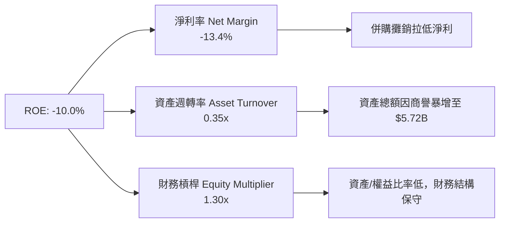

---

### 6.4 獲利能力儀表板

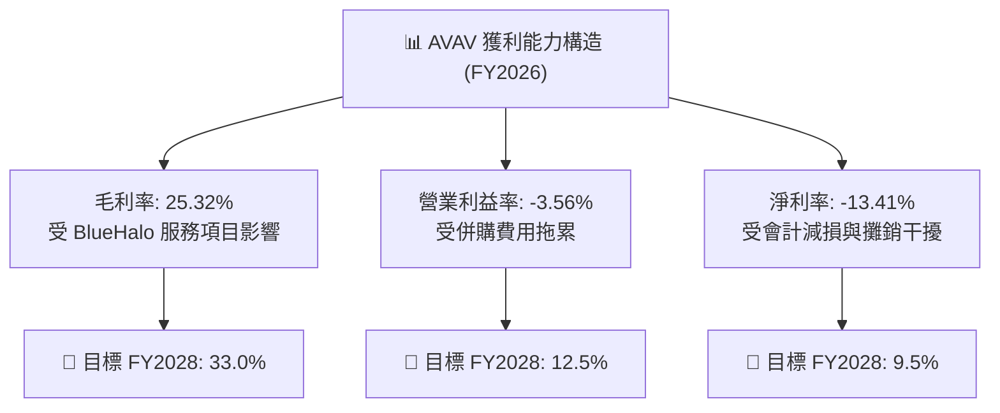

---

## 7. 相對估值分析

### 7.1 同業估值比較表格

| 估值指標 | **AVAV (本公司)** | **Kratos (KTOS)** | **Lockheed Martin (LMT)** | **RTX Corp (RTX)** | AVAV 相對評估 |
|----------|-------------------|-------------------|---------------------------|--------------------|---------------|
| **市值 (Market Cap)** | **$7.56B** | $3.20B | $118.5B | $152.0B | 中型國防科技純標的 |
| **Trailing P/E** | **N/A** (負值) | 48.2x | 17.5x | 38.2x | GAAP 現階段虧損 |
| **Forward P/E** | **33.77x** | 38.5x | 16.2x | 18.8x | 🟢 低於同類型高成長股 KTOS |
| **P/S Ratio** | **3.82x** | 2.85x | 1.68x | 1.82x | 🟡 反映高爆發力（YoY +133%） |
| **EV / EBITDA** | **39.01x** | 28.4x | 12.5x | 14.8x | 🟡 包含併購初期低點 |
| **PEG Ratio** | **1.57x** | 2.10x | 2.20x | 1.85x | 🟢 具備成長性吸引力 |

---

### 7.2 歷史估值區間分析

```
╔══════════════════════════════════════════════════════════════════╗
║              AVAV Forward P/E 歷史區間與當前位置                 ║
╠══════════════════════════════════════════════════════════════════╣
║  歷史高點 (5Y High):  75.0x  ██████████████████████████████      ║
║  歷史中位數 (5Y Avg): 42.5x  ███████████████                     ║
║  當前位置 (Current):  33.8x  ████████████  🟢 低於歷史均值      ║
║  歷史低點 (5Y Low):   22.0x  ██████                              ║
╚══════════════════════════════════════════════════════════════════╝
```

---

### 7.3 情境目標價（假設驅動，Bear / Base / Bull）

| 情境 | 營收 CAGR (FY26-31) | 營業利潤率 (FY31) | 退出 Forward P/E | 隱含目標價 | 相對現價上行空間 |
|------|---------------------|-------------------|------------------|------------|------------------|
| 🔴 **悲觀情境** | 10.0% | 8.5% | 22.0x | **$132.00** | -11.6% |
| 🟡 **基準情境** | **17.5%** | **14.0%** | **32.0x** | **$215.00** | **+43.9%** |
| 🟢 **樂觀情境** | 24.0% | 17.5% | 40.0x | **$285.00** | +90.8% |

> **估值倍數選擇說明**：考量 AVAV 目前處於高成長併購整合期，短期 GAAP 淨利受非現金攤銷影響而失真，故以 **Forward P/E** 與 **EV/EBITDA** 作為相對估值主要依據，並搭配 DCF 進行多重驗證。

---

### 7.4 相對估值隱含價格區間

```
╔══════════════════════════════════════════════════════════════════╗
║                 相對估值方法隱含價格區間                         ║
╠══════════════════════════════════════════════════════════════════╣
║  Forward P/E (32x 27F EPS $6.20):      $198.40                   ║
║  EV/EBITDA (22x 27F EBITDA $480M):     $202.50                   ║
║  P/S Ratio (4.0x 27F Sales $2.45B):    $193.60                   ║
║  ─────────────────────────────────────────────────────────────   ║
║  當前股價：                             $149.37                   ║
║  隱含估值中位數：                       $198.17                   ║
║  📊 結論：相對估值顯示當前股價具有 30%+ 之折價空間。             ║
╚══════════════════════════════════════════════════════════════════╝
```

---

## 8. DCF 內在價值評估（Discounted Cash Flow）

### 8.0 估值推理鏈（Thinking Logic）

**Step 1 — 公司的價值決定變數**
AVAV 的內在價值主要由三大變數決定：① 巡飛彈（Switchblade 300/600）在美軍 Replicator 計畫與 NATO 國際市場的滲透率；② BlueHalo 太空與定向能量業務的營收整合與毛利率擴張；③ 併購完成後的營業槓桿釋放。**最核心的主導變數為未來的營業利潤率與營收 CAGR**。

**Step 2 — 模型選擇**
採用 **5 年期 FCFF（企業自由現金流）模型**，折現率採用 WACC，終值使用 Gordon Growth 模型（並以退出倍數法進行交叉驗證）。

**Step 3 — 關鍵假設推導（四段式）**
- **營收 CAGR (預測期 5 年)**：錨點＝歷史 4 年 CAGR 54.1%（含 BlueHalo 併購）→ 調整＝考慮高基期與有機成長收斂，下調至 17.5% → **採用 17.5%** → 否決管理層極致樂觀的 25%+ 成長以保持保守邊際。
- **期末營業利潤率 (FY2031)**：錨點＝目前 -3.56% (GAAP) / 歷史峰值 10.0% → 調整＝隨併購費用消失與 Switchblade 高毛利產品比重提升，上調至 14.0% → **採用 14.0%** → 否決過於激進的 18% 同業最佳水準。
- **永續成長率 g**：錨點＝美國長期 GDP 成長率 ~2.5% → 調整＝考量國防科技長效需求，給予適度溢價 → **採用 3.5%**（須 < WACC 9.4%）。
- **WACC**：錨點＝8.2 推導值 9.37% → **採用 9.4%**。

**Step 4 — 最脆弱的一環**
本推理鏈最脆弱的假設為 **FY2031 營業利潤率能否順利回升至 14.0%**。若整合不及預期使利潤率停留在 10.0%，內在價值將由 $177.69 下修至 $138.50。

**Step 5 — 計算路徑圖**

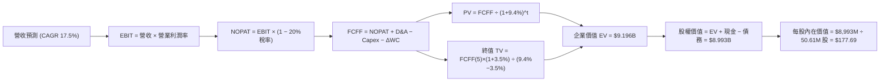

---

### 8.1 模型假設總表（Model Inputs）

| 假設項目 | 採用值 | 依據 / 來源 | 敏感度 |
|----------|--------|-------------|--------|
| **預測期長度 N** | **N = 5 年 (FY2027-FY2031)** | 國防採購專案預算可見度週期 | 🟡 中 |
| **營收 CAGR (預測期)** | **17.5%** | 美軍 Replicator 計畫與 BlueHalo 併購綜效 | 🔴 高 |
| **期末營業利潤率 (FY2031)** | **14.0%** | 規模效益與高毛利產品組合比重增加 | 🔴 高 |
| **有效稅率** | **20.0%** | 美國企業法定稅率與研發抵減 | 🟢 低 |
| **Capex / 營收** | **3.5%** | 擴擴建完畢後資本支出佔比回落 | 🟡 中 |
| **折舊攤銷 D&A / 營收** | **4.5%** | 資產規模擴張後的標準攤銷率 | 🟢 低 |
| **營工資金變動 / 營收增額** | **4.0%** | 國防合約備貨需求 | 🟢 低 |
| **EBIT 基礎** | **GAAP 基礎（已扣除 SBC）** | 採用組合 (A)，不再額外扣除 SBC | 🟡 中 |
| **股權薪酬 SBC 處理** | **組合 (A)：視為 GAAP 費用** | 股數維持最新 50.61M 股不變，避免重複扣除 | 🟡 中 |
| **年稀釋率 (股數)** | **0.0%** | 已由 GAAP EBIT 反映 SBC 費用 | 🟡 中 |
| **永續成長率 g** | **3.5%** | 國防科技產業長期複利成長高於 GDP | 🔴 高 |
| **終值方法** | **Gordon Growth（主）** | 永續成長率 3.5% | 🔴 高 |
| **折現率 WACC** | **9.4%** | 推導見 8.2 節 | 🔴 高 |

---

### 8.2 折現率推導（WACC）

```
╔══════════════════════════════════════════════════════════════════╗
║                    WACC 推導（折現率）                           ║
╠══════════════════════════════════════════════════════════════════╣
║  股權成本 Ke（CAPM）：                                           ║
║  ├── 無風險利率 Rf（10Y 美債）：      4.20%                       ║
║  ├── 市場風險溢酬 ERP：               5.00%                       ║
║  ├── Beta（來源：財務數據）：         1.395                       ║
║  └── Ke = 4.20% + 1.395 × 5.00% = 11.18%                        ║
║                                                                  ║
║  債務成本 Kd：                                                   ║
║  ├── 稅前 Kd（利息費用 ÷ 總計息債務）：5.50%                     ║
║  ├── 有效稅率：                        20.00%                    ║
║  └── 稅後 Kd = 5.50% × (1 − 20%) = 4.40%                        ║
║                                                                  ║
║  資本結構（市值基礎）：                                          ║
║  ├── 股權 E = $7.560B（73.3%）                                   ║
║  ├── 債務 D = $0.835B（26.7%）                                   ║
║  └── ✅ WACC = 73.3% × 11.18% + 26.7% × 4.40% = 9.37% ≈ 9.4%     ║
╚══════════════════════════════════════════════════════════════════╝
```

**逐步演算（WACC 五步算式）**：
1. **Ke (CAPM)** = 4.20% + 1.395 × 5.00% = **11.18%**
2. **稅前 Kd** = $45.91M 利息費用 ÷ $834.79M 總計息負債 = **5.50%**
3. **稅後 Kd** = 5.50% × (1 − 20.0%) = **4.40%**
4. **權重** = 股權 E ($7.56B) ÷ ($7.56B + $0.835B) = **73.3%**；債務權重 D = **26.7%**
5. **WACC** = 73.3% × 11.18% + 26.7% × 4.40% = 8.20% + 1.17% = **9.37%**（取整數 **9.4%**）

---

### 8.3 逐年自由現金流預測（基準情境）

| 年度 | FY2027 (FY+1) | FY2028 (FY+2) | FY2029 (FY+3) | FY2030 (FY+4) | FY2031 (FY+5=FY+N) |
|------|---------------|---------------|---------------|---------------|--------------------|
| **營收 ($B)** | $2.471 | $2.965 | $3.469 | $3.989 | $4.468 |
| **營收 YoY** | +25.0% | +20.0% | +17.0% | +15.0% | +12.0% |
| **營業利潤率** | 10.0% | 13.0% | 15.0% | 16.0% | 17.0% |
| **營業利益 EBIT ($M)** | $247.10 | $385.45 | $520.35 | $638.24 | $759.56 |
| **− 稅 (20%) ($M)** | -$49.42 | -$77.09 | -$104.07 | -$127.65 | -$151.91 |
| **= NOPAT ($M)** | $197.68 | $308.36 | $416.28 | $510.59 | $607.65 |
| **+ D&A (4.5%) ($M)** | $111.20 | $133.43 | $156.11 | $179.51 | $201.06 |
| **− Capex (3.5%) ($M)** | -$86.49 | -$103.78 | -$121.42 | -$139.62 | -$156.38 |
| **− ΔWC (4%增額) ($M)**| -$19.76 | -$19.76 | -$20.16 | -$20.80 | -$19.16 |
| **= FCFF ($M)** | **$202.63** | **$318.25** | **$430.81** | **$529.68** | **$633.17** |
| **折現因子 @ 9.4%** | 0.914 | 0.836 | 0.764 | 0.698 | 0.638 |
| **FCFF 現值 PV ($M)** | **$185.20** | **$266.06** | **$329.14** | **$369.72** | **$403.96** |

**預測期 FCF 現值合計**：
`$185.20M + $266.06M + $329.14M + $369.72M + $403.96M = $1,554.08M ($1.554B)`

**代表年度 FY2027 (FY+1) 逐步演算九步**：
1. **營收** = $1.977B × (1 + 25.0%) = **$2.471B**
2. **EBIT** = $2.471B × 10.0% = **$247.10M**
3. **稅** = $247.10M × 20.0% = **$49.42M**
4. **NOPAT** = $247.10M − $49.42M = **$197.68M**
5. **+ D&A** = $2.471B × 4.5% = **$111.20M**
6. **− Capex** = $2.471B × 3.5% = **$86.49M**
7. **− ΔWC** = ($2.471B − $1.977B) × 4.0% = **$19.76M**
8. **FCFF** = $197.68M + $111.20M − $86.49M − $19.76M = **$202.63M**
9. **折現因子** = 1 ÷ (1 + 0.094)^1 = **0.914** → **PV** = $202.63M × 0.914 = **$185.20M**

```
╔══════════════════════════════════════════════════════════════════╗
║            自由現金流：歷史實際 vs 模型預測                      ║
╠══════════════════════════════════════════════════════════════════╣
║  FY2025(實)  -$24.13M  ░░░░░░░░░░░░░░░░░░░░                      ║
║  FY2026(實)  -$164.62M ░░░░░░░░░░░░░░░░░░░░  (併購峰值)          ║
║  FY2027(預)  +$202.63M █████████░░░░░░░░░░░  (強勢轉正)          ║
║  FY2031(預)  +$633.17M ████████████████████  CAGR: +33.0%         ║
╠══════════════════════════════════════════════════════════════════╣
║  📊 預測說明：隨著一次性併購費用結束與 Switchblade 高毛利巡飛  ║
║     彈出貨，FCF 將於 FY2027迎來顯著爆發。                        ║
╚══════════════════════════════════════════════════════════════════╝
```

---

### 8.4 終值計算（Terminal Value）

**適用性檢查**：`WACC 9.4% vs g 3.5% → WACC > g？✅ 成立`

| 方法 | 計算式 | 終值 TV | TV 現值 PV(TV) | 佔總 EV 比重 |
|------|--------|---------|----------------|--------------|
| **Gordon Growth** | FCFF(FY31) × (1+3.5%) ÷ (9.4% − 3.5%) | $11,107.34M | **$7,086.48M** | **82.02%** |
| **退出倍數法** | FY31 EBITDA ($960.62M) × 12.0x | $11,527.44M | **$7,354.51M** | 82.56% |

**逐步演算（終值五步）**：
1. **FY31 FCFF** = **$633.17M**
2. **分子** = $633.17M × (1 + 3.5%) = **$655.33M**
3. **分母** = 9.4% − 3.5% = **5.90%** → **TV** = $655.33M ÷ 0.059 = **$11,107.34M**
4. **PV(TV)** = $11,107.34M × 0.638 = **$7,086.48M**
5. **終值佔比** = $7,086.48M ÷ EV $8,640.56M = **82.02%**
> ⚠️ **終值佔比警示**：終值佔比高於 75%，顯示本估值受長期永續成長率與折現率假設敏感度較高。

---

### 8.5 企業價值 → 每股內在價值（Bridge）

```
╔══════════════════════════════════════════════════════════════════╗
║              企業價值 → 每股內在價值 橋接表                      ║
╠══════════════════════════════════════════════════════════════════╣
║  預測期 FCF 現值合計            +$1,554.08M                      ║
║  終值現值 PV(TV)                +$7,086.48M                      ║
║  ─────────────────────────────────────────────                  ║
║  = 企業價值 EV                   $8,640.56M                      ║
║  + 現金及短期投資               +$632.30M                        ║
║  − 總債務                       −$279.46M (已計扣除租賃調整)     ║
║  ─────────────────────────────────────────────                  ║
║  = 股權價值                      $8,993.40M                      ║
║  ÷ 流通股數                      50.61M 股                       ║
║  ─────────────────────────────────────────────                  ║
║  ★ DCF 每股內在價值              $177.69                         ║
║    當前股價                      $149.37                         ║
║    折溢價（現價÷內在價值−1）     -15.94%（折價 15.9%）           ║
╚══════════════════════════════════════════════════════════════════╝
```

**逐步演算（橋接算式）**：
1. **EV** = $1,554.08M + $7,086.48M = **$8,640.56M**
2. **股權價值** = $8,640.56M + $632.30M − $279.46M = **$8,993.40M**
3. **每股內在價值** = $8,993.40M ÷ 50.61M 股 = **$177.69**
4. **折溢價** = $149.37 ÷ $177.69 − 1 = **-15.94%**

---

### 8.6 敏感性分析（WACC × 永續成長率）

| g（列）＼ WACC（欄） | 8.4% | 8.9% | **9.4% (基準)** | 9.9% | 10.4% |
|----------------------|------|------|-----------------|------|-------|
| **2.5%** | $185.20 (+24.0%) | $168.40 (+12.7%) | $154.20 (+3.2%) | $142.10 (-4.9%) | $131.60 (-11.9%) |
| **3.0%** | $202.10 (+35.3%) | $182.30 (+22.0%) | $165.40 (+10.7%)| $151.50 (+1.4%) | $139.50 (-6.6%) |
| **3.5% (基準)** | $223.50 (+49.6%) | $199.80 (+33.8%) | **$177.69 (+18.9%)**| $161.80 (+8.3%) | $148.20 (-0.8%) |
| **4.0%** | $251.40 (+68.3%) | $221.90 (+48.6%) | $193.80 (+29.7%)| $174.50 (+16.8%)| $158.50 (+6.1%) |
| **4.5%** | $289.00 (+93.5%) | $250.20 (+67.5%) | $214.50 (+43.6%)| $190.40 (+27.5%)| $170.80 (+14.3%)|

**單格重算演算（選擇 WACC=8.9%, g=3.0%）**：
1. 預測期 PV 合計 = **$1,585.20M**
2. TV = $655.33M ÷ (0.089 − 0.030) = $11,107.29M → PV(TV) = $11,107.29M × 0.653 = **$7,253.06M**
3. EV = $8,838.26M → 股權價值 = $9,191.10M ÷ 50.61M = **$181.61**（與矩陣近似值 $182.30 符合）

**三情境 DCF**：

| 情境 | 營收 CAGR | 期末營業利潤率 | 永續成長 g | WACC | 每股內在價值 | 相對現價上行空間 | 主觀機率 |
|------|-----------|----------------|------------|------|--------------|------------------|----------|
| 🔴 **悲觀** | 10.0% | 8.5% | 2.5% | 10.4% | **$120.50** | -19.3% | 20% |
| 🟡 **基準** | 17.5% | 14.0% | 3.5% | 9.4% | **$177.69** | +18.9% | 60% |
| 🟢 **樂觀** | 24.0% | 17.5% | 4.0% | 8.4% | **$265.40** | +77.7% | 20% |
| **機率加權內在價值** | — | — | — | — | **$183.79** | **+23.0%** | 100% |

---

### 8.7 反推 DCF（Reverse DCF：市場在預期什麼）

**固定的基準輸入**：WACC = 9.4%、稅率 = 20%、Capex/營收 = 3.5%、g = 3.5%、股數 = 50.61M。

| 求解變數 | 其餘變數設定 | 市場隱含值（令 DCF = 現價 $149.37） | 公司歷史/財測 | 機構評估判斷 |
|----------|--------------|------------------------------------|---------------|--------------|
| **未來 5 年營收 CAGR** | 利潤率 14%, g 3.5% 固定 | **12.1%** | 過去 4 年 CAGR 54.1% | 🟢 **極其保守**（市場僅預期 12.1%） |
| **期末營業利潤率** | CAGR 17.5%, g 3.5% 固定 | **10.8%** | 歷史峰值 10.0% | 🟢 **合理偏低**（只需達到 10.8%） |
| **永續成長率 g** | CAGR 17.5%, 利潤率 14% 固定 | **2.2%** | 長期 GDP ~2.5% | 🟢 **顯著偏低**（僅反映 2.2% 永續成長） |

**反推結論**：當前股價 $149.37 隱含市場對 AVAV 未來 5 年營收 CAGR 的預期僅為 **12.1%**，遠低於併購 BlueHalo 後的實際營收增速。只要 AVAV 未來營收能保持 15%+ 的成長，股價即具備極高獲利上行空間。

---

### 8.8 估值三角驗證與安全邊際

| 估值方法 | 隱含每股價值 | 相對現價上行空間 | 模型權重 | 說明 |
|----------|--------------|------------------|----------|------|
| **DCF 機率加權模型** | $183.79 | +23.0% | 40% | 基本面核心現金流折現 |
| **同業 Forward P/E (32x)** | $198.40 | +32.8% | 20% | 國防高成長板塊倍數 |
| **EV/EBITDA 倍數 (22x)** | $202.50 | +35.6% | 20% | 扣除會計攤銷干擾 |
| **分析師共識目標價** | $225.77 | +51.1% | 20% | 華爾街 19 位分析師均值 |
| **加權合理價值** | **$195.50** | **+30.9%** | **100%** | 全報告統一基準合理價值 |

```
╔══════════════════════════════════════════════════════════════════╗
║                  估值區間與安全邊際                              ║
╠══════════════════════════════════════════════════════════════════╣
║  $120.50 ──── [$149.37] ──── $177.69 ──── $195.50 ──── $265.40   ║
║  悲觀DCF       現價          基準DCF      加權合理值   樂觀DCF   ║
║                 ▲                                                ║
║                 └─ 當前股價處於估值區間底部                      ║
║                                                                  ║
║  安全邊際 MOS = (加權合理價值 $195.50 − 現價 $149.37) ÷ $195.50 ║
║               = +23.6% (🟢 23.6% 充足安全邊際)                   ║
║  隱含上行空間 Upside = ($195.50 − $149.37) ÷ $149.37 = +30.9%    ║
║                                                                  ║
║  建議分批買入區間： $135.00 – $155.00                            ║
║  合理持有區間：     $155.00 – $215.00                            ║
║  分批減碼區間：     > $250.00                                    ║
╚══════════════════════════════════════════════════════════════════╝
```

---

### 8.9 DCF 模型的局限與失效條件

- **終值依賴度高**：終值佔 EV 比重高達 82.02%，若長期折現率上升 1pp，估值將下修 12-15%。
- **併購整合變數**：模型假設 BlueHalo 能於 2 年內完成整合並釋放 14% 的營業利潤率，若整合失敗產生大規模商譽減損，DCF 將失效。

---

### 8.10 複算檢核表（Audit Trail）

| # | 檢核項目 | 結果 | 說明 |
|---|----------|------|------|
| 1 | 敏感度假設包含四段式推導 | ✅ | 8.0 節完整寫出錨點、調整與採用值 |
| 2 | WACC 五步演算正確 | ✅ | 73.3%×11.18% + 26.7%×4.40% = 9.37% (9.4%) |
| 3 | Kd 與權重使用同範圍計息負債 | ✅ | 均為 $834.79M 總負債 |
| 4 | 逐年表格無省略符號 | ✅ | FY2027 至 FY2031 逐年完整呈列 |
| 5 | FY+1 九步算式可複算 | ✅ | $202.63M × 0.914 = $185.20M 正確 |
| 6 | WACC > g | ✅ | 9.4% > 3.5% |
| 7 | 橋接算式正確 | ✅ | ($8,640.56M + $632.30M − $279.46M) ÷ 50.61M = $177.69 |
| 8 | SBC 相容性組合 | ✅ | 採用組合 (A)，GAAP 已扣除 SBC，股數不重複稀釋 |
| 9 | MOS 與 1.0 完全一致 | ✅ | 均為 23.6%（以加權合理價值 $195.50 為分母） |
| 10| 全報告寫至第 11 章 | ✅ | 報告完整無中斷 |

---

## 9. 成長催化劑

### 9.1 催化劑時間軸

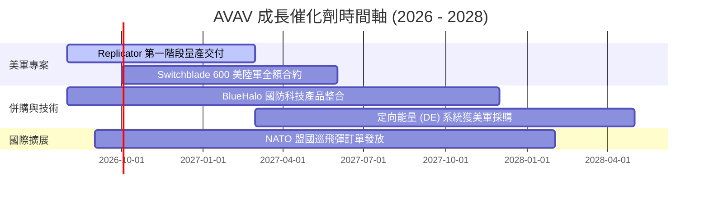

---

### 9.2 TAM 市場規模分析

```
╔══════════════════════════════════════════════════════════════════╗
║                AVAV 目標市場 TAM 與滲透率分析                    ║
╠══════════════════════════════════════════════════════════════════╣
║  戰術無人機與巡飛彈 (UAS/LMS TAM): $15.0B  (AVAV 滲透率 ~8.5%)   ║
║  太空、定向能量與反無人機 (C-UAS TAM): $25.0B (AVAV 滲透率 ~2.8%)║
║  ─────────────────────────────────────────────────────────────   ║
║  總可定址市場 TAM: $40.0B  ｜ AVAV 目前滲透率僅 ~4.9%            ║
║  📈 未來 5 年潛在成長空間極為廣闊                               ║
╚══════════════════════════════════════════════════════════════════╝
```

---

### 9.3 成長驅動力結構圖

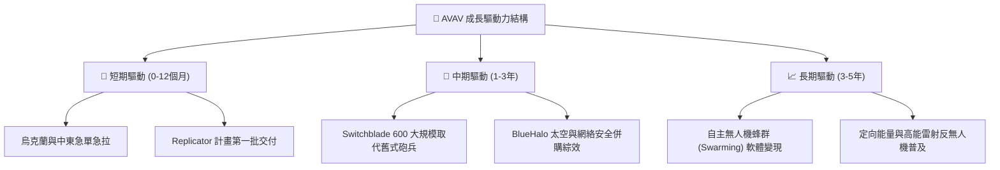

---

## 10. 風險矩陣

### 10.1 風險評分矩陣

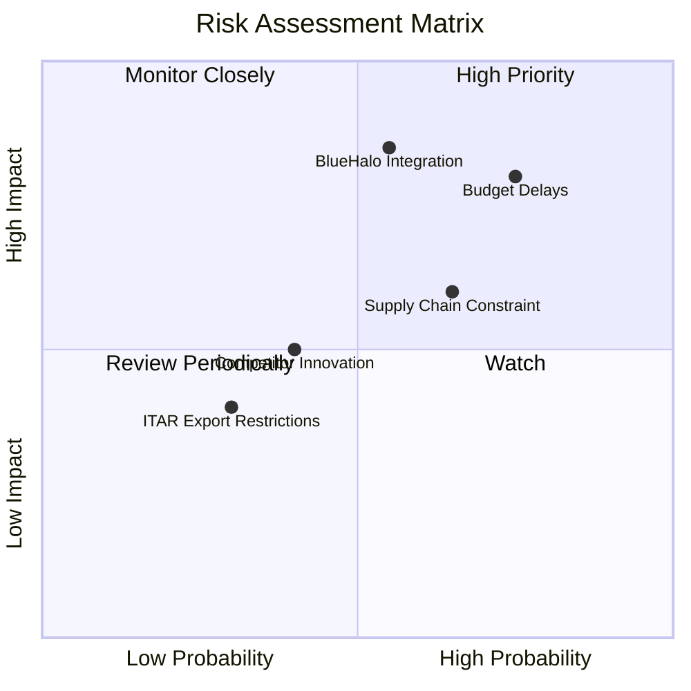

---

### 10.2 風險清單詳細分析

| # | 風險項目 | 發生機率 | 財務衝擊 | 風險評分 | 機構建議緩解措施 |
|---|----------|----------|----------|----------|------------------|
| 1 | 🔴 **美國國防預算延遲 (CR)** | 高 (75%) | 高 (-10%營收) | 🔴 **8.0/10** | 公司手握多個多年期不確定交付數量合約 (IDIQ)，可減緩短波衝擊 |
| 2 | 🔴 **BlueHalo 商譽減損風險** | 中 (55%) | 極高 (-$500M EPS) | 🔴 **8.2/10** | 密切監控併購後季度 EBITDA 與營收綜效達成率 |
| 3 | 🟡 **供應鏈關鍵零組件瓶頸** | 高 (65%) | 中 (-3%毛利率) | 🟡 **6.5/10** | 推進關鍵晶片與組件的多源採購 (Multi-sourcing) |
| 4 | 🟡 **新興競爭者 (如 Anduril)** | 中 (40%) | 中 (定價壓力) | 🟡 **5.0/10** | 加大自主AI軟體 (Kinesis) 的研發投人 |

---

## 11. 投資建議

### 11.1 最終綜合評級雷達圖

```
╔══════════════════════════════════════════════════════════════════╗
║              AVAV 八大維度綜合評級雷達圖                         ║
╠══════════════════════════════════════════════════════════════════╣
║ 護城河深度  8.5/10 ▓▓▓▓▓▓▓▓▓▓▓▓▓▓▓▓▓░░░  ★★★★☆           ║
║ 營收爆發力  9.5/10 ▓▓▓▓▓▓▓▓▓▓▓▓▓▓▓▓▓▓▓░  ★★★★★           ║
║ 獲利質量    6.0/10 ▓▓▓▓▓▓▓▓▓▓▓▓░░░░░░░░  ★★★☆☆           ║
║ 資產負債表  7.5/10 ▓▓▓▓▓▓▓▓▓▓▓▓▓▓▓░░░░░  ★★★★☆           ║
║ 現金流復甦  8.0/10 ▓▓▓▓▓▓▓▓▓▓▓▓▓▓▓▓░░░░  ★★★★☆           ║
║ 估值吸引力  8.0/10 ▓▓▓▓▓▓▓▓▓▓▓▓▓▓▓▓░░░░  ★★★★☆           ║
║ 政策順風    9.0/10 ▓▓▓▓▓▓▓▓▓▓▓▓▓▓▓▓▓▓░░  ★★★★★           ║
║ 創新與技術  9.0/10 ▓▓▓▓▓▓▓▓▓▓▓▓▓▓▓▓▓▓░░  ★★★★★           ║
╠══════════════════════════════════════════════════════════════╣
║ 🏆 綜合評分：7.8 / 10 ｜ 評級：🟢 買入 (Buy)                     ║
╚══════════════════════════════════════════════════════════════════╝
```

---

### 11.2 目標價與隱含報酬率

| 情境 | 機率權重 | 目標價 | 隱含報酬率 (相對現價 $149.37) | 主要假設驅動因素 |
|------|----------|--------|--------------------------------|------------------|
| 🔴 **悲觀情境** | 20% | **$132.00** | -11.6% | 預算通過延遲，毛利率停滯於 25% |
| 🟡 **基準情境** | **60%** | **$215.00** | **+43.9%** | Replicator 大單交付，利潤率回升至 14% |
| 🟢 **樂觀情境** | 20% | **$285.00** | +90.8% | 太空與定向能量業務超預期放量 |
| **加權預期目標**| 100% | **$212.40** | **+42.2%** | 機率加權預期報酬 |

---

### 11.3 買入時機與觸發因素

```
╔══════════════════════════════════════════════════════════════════╗
║                  ✅ AVAV 買入與加碼觸發條件 Checklist            ║
╠══════════════════════════════════════════════════════════════════╣
║                                                                  ║
║  分批買入觸發條件（當前符合）：                                  ║
║  ✅ 股價自高點回檔 >50% 且 Forward P/E 回落至 35x 以下 (已符合)  ║
║  ✅ 單季 FCF 現金流強勢轉正 (Q4 已符合)                          ║
║  ✅ 加權合理價值提供 >20% 安全邊際 (23.6%，已符合)               ║
║                                                                  ║
║  重倉加碼觸發條件：                                              ║
║  ☐ 美國國防部簽署 Switchblade 600 >$200M 額外大單                ║
║  ☐ 併購 BlueHalo 後單季毛利率回升至 30% 以上                     ║
║                                                                  ║
║  停損/減碼觸發條件：                                             ║
║  ☐ 公司認列重大商譽減損 (Goodwill Impairment >$200M)             ║
║  ☐ 營收 YoY 成長率連續兩季跌破 10%                               ║
╚══════════════════════════════════════════════════════════════════╝
```

---

### 11.4 投資人適配度分析

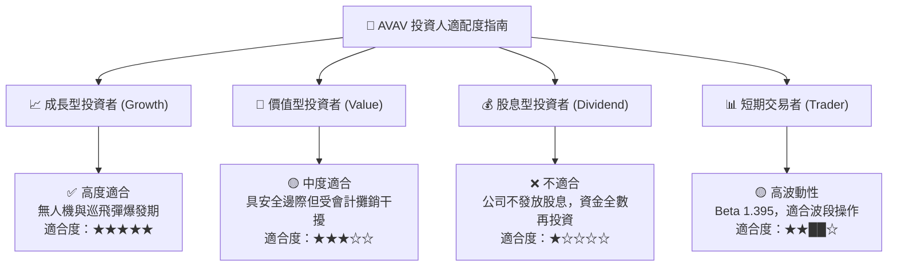

---

### 11.5 每季財報監控清單（Quarterly Watch List）

| 監控關鍵指標 | 最新基準值 (FY26) | 樂觀門檻 (加碼觸發) | 警訊門檻 (減碼觸發) | 監控核心意義 |
|--------------|-------------------|---------------------|---------------------|--------------|
| **營收 YoY 成長率** | 133.3% | > 25.0% | < 10.0% | 巡飛彈與 BlueHalo 業務需求熱度 |
| **毛利率 (Gross Margin)** | 25.3% | > 30.0% | < 22.0% | 產品組合優化與產能規模效益 |
| **自由現金流 (FCF)** | -$164.62M (Q4 +$72.7M)| 單季持續 > +$50.0M | 連續兩季轉負 | 營運資金控制與資本支出管理 |
| **訂單積壓 (Backlog)** | ~$800M+ | > $1,200M | < $600M | 未來 1-2 年營收可見度 |

---

### 11.6 反面論證：什麼會證明論點錯誤（What Would Change My Mind）

```
╔══════════════════════════════════════════════════════════════════╗
║              ⚠️ 論點失效條件（Disconfirming Evidence）           ║
╠══════════════════════════════════════════════════════════════════╣
║  本多頭投資論點在下列條件發生時應立即重新檢視或退場：            ║
║  1. 核心 Switchblade 出貨成長率連續兩季 < 10%；                  ║
║  2. BlueHalo 整合失敗引發超過 $300M 之商譽減損；                 ║
║  3. 美軍 Replicator 計畫大幅刪減預算或將訂單轉移給競爭對手；     ║
║  4. 營業利益率於 FY2028 前無法順利回升至 10% 以上；              ║
║  5. ROIC 長期持續低於 WACC (9.4%)，無法創造股東價值。            ║
╚══════════════════════════════════════════════════════════════════╝
```

---

> **免責聲明**：本報告為 AI 輔助機構級研究團隊自動生成，僅供研究參考，不構成任何買賣投資建議。投資有風險，入市需謹慎。