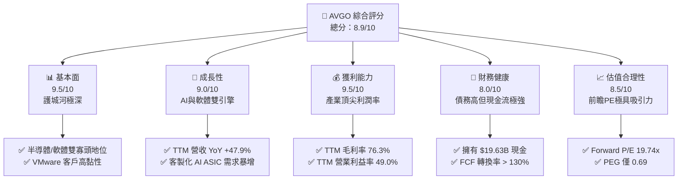
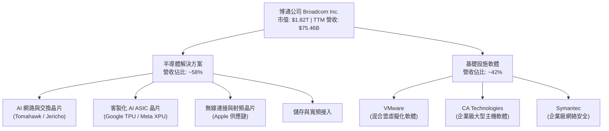
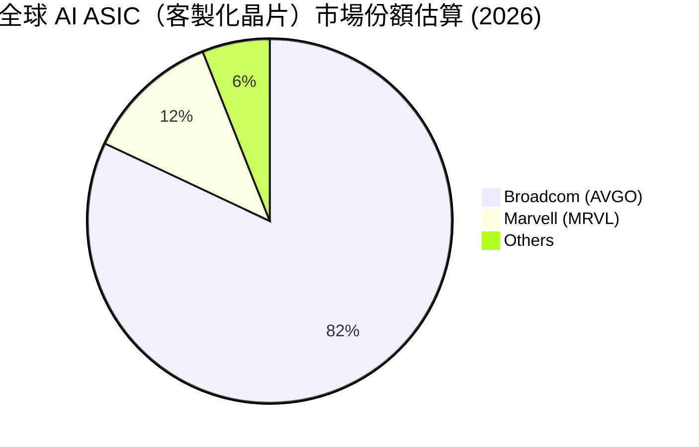
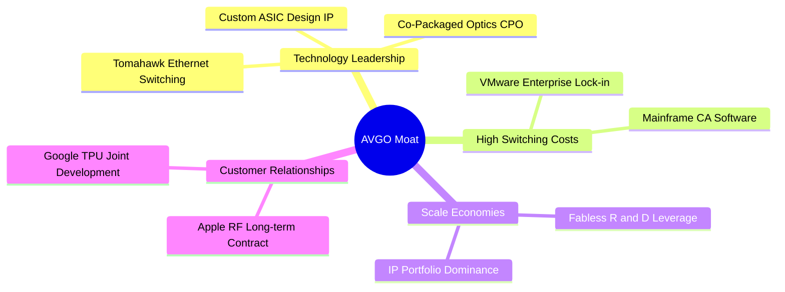
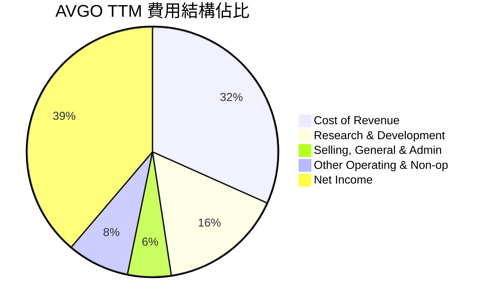
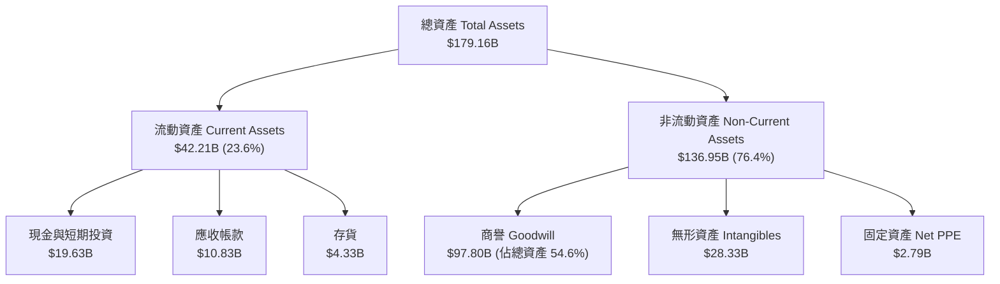
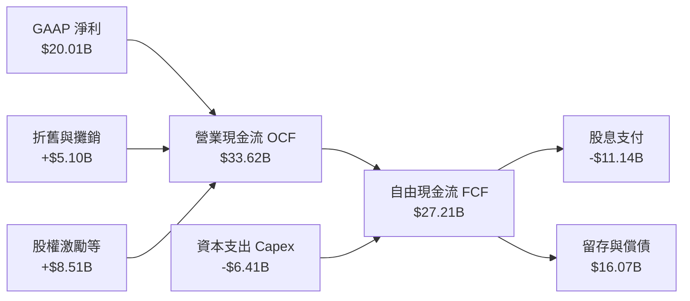
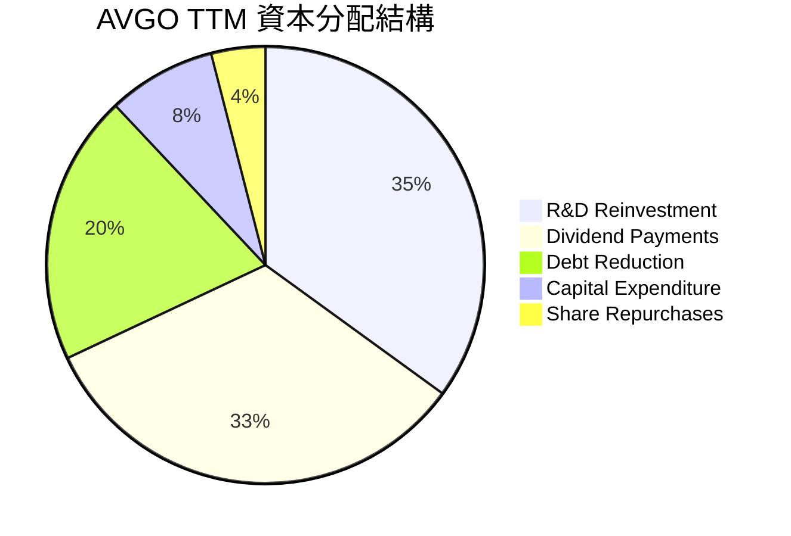
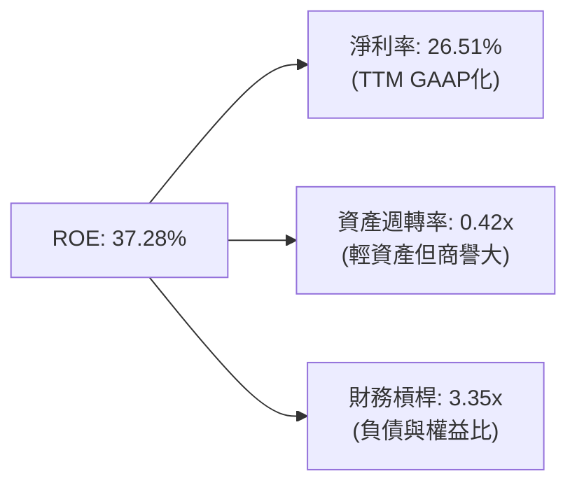
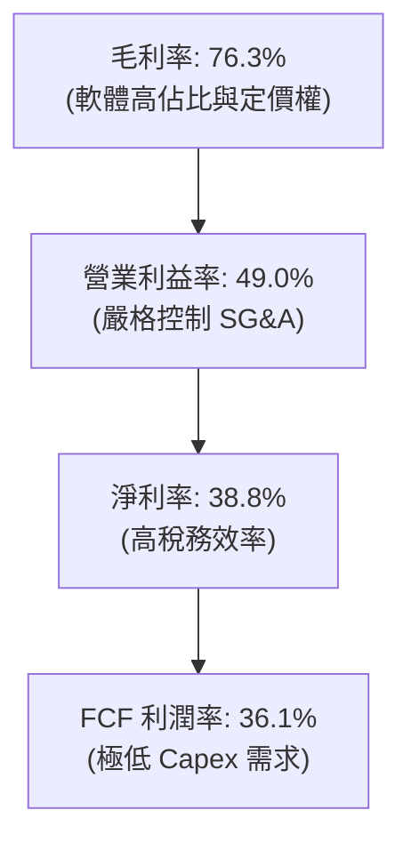

# AVGO 基本面深度分析報告

> **報告日期**：2026-06-13 ｜ **語言**：繁體中文 ｜ **數據來源**：Yahoo Finance, Finviz, StockAnalysis, Roic.ai ｜ **分析師**：CFA 級機構研究

---

## 目錄

| # | 章節 | 核心結論 |
|---|------|----------|
| 1 | [執行摘要](#1-執行摘要) | 評級：🟢 強烈買入 ｜ 目標價：$522.06（+36.6%） |
| 2 | [公司概覽與商業模式](#2-公司概覽與商業模式) | 晶片與軟體雙引擎驅動，VMware 併購展現強大整合力 |
| 3 | [損益表深度分析](#3-損益表深度分析) | TTM 營收達 $75.46B，季度營收 YoY 暴增 47.9% |
| 4 | [資產負債表分析](#4-資產負債表分析) | 資產規模擴張至 $179.16B，槓桿結構穩健優化中 |
| 5 | [現金流量深度分析](#5-現金流量深度分析) | TTM FCF 達 $27.21B，FCF 轉換率高達 136% |
| 6 | [獲利能力與資本效率](#6-獲利能力與資本效率) | ROE 達 37.3%，ROIC 22.8% 遠超 WACC（11.1%） |
| 7 | [估值深度分析](#7-估值深度分析) | 前瞻 P/E 僅 19.7x，相較 AI 同業具有極高安全邊際 |
| 8 | [成長催化劑](#8-成長催化劑) | AI 客製化晶片（XPU）與以太網交換晶片迎來爆發期 |
| 9 | [風險矩陣](#9-風險矩陣) | 客戶集中度高與債務再融資壓力為主要監控指標 |
| 10 | [投資建議](#10-投資建議) | 確立買入觸發點，適合尋求成長與股息兼具的長期投資人 |

---

## 1. 執行摘要

博通（Broadcom Inc., Ticker: **AVGO**）作為全球半導體與基礎設施軟體的雙龍頭，正處於其歷史上最強勁的成長週期。得益於人工智慧（AI）基礎設施建設對客製化晶片（ASIC）與高寬頻網路晶片（Tomahawk 5 / Jericho 3-AI）的極致需求，加上 VMware 併購後的協同效應加速釋放，AVGO 的財務表現已進入爆發期。

### 1.1 核心評分儀表板



### 1.2 評分進度條視覺化

```
╔══════════════════════════════════════════════════════════════╗
║                AVGO 多維度評分儀表板 (1-10分)                ║
╠══════════════════════════════════════════════════════════════╣
║ 基本面強度  9.5 ▓▓▓▓▓▓▓▓▓▓▓▓▓▓▓▓▓▓▓░  ★★★★★           ║
║ 成長動能    9.0 ▓▓▓▓▓▓▓▓▓▓▓▓▓▓▓▓▓▓░░  ★★★★★           ║
║ 獲利品質    9.5 ▓▓▓▓▓▓▓▓▓▓▓▓▓▓▓▓▓▓▓░  ★★★★★           ║
║ 財務健康    8.0 ▓▓▓▓▓▓▓▓▓▓▓▓▓▓▓▓░░░░  ★★★★☆           ║
║ 估值合理性  8.5 ▓▓▓▓▓▓▓▓▓▓▓▓▓▓▓░░░░░  ★★★★☆           ║
║ 護城河深度  9.5 ▓▓▓▓▓▓▓▓▓▓▓▓▓▓▓▓▓▓▓░  ★★★★★           ║
║ 管理層執行  9.8 ▓▓▓▓▓▓▓▓▓▓▓▓▓▓▓▓▓▓▓▓  ★★★★★           ║
║ 技術創新力  9.2 ▓▓▓▓▓▓▓▓▓▓▓▓▓▓▓▓▓▓░░  ★★★★★           ║
╠══════════════════════════════════════════════════════════════╣
║ 綜合總分    8.9 ▓▓▓▓▓▓▓▓▓▓▓▓▓▓▓▓▓░░░  🏆 強烈買入          ║
╚══════════════════════════════════════════════════════════════╝
```

### 1.3 五大投資論點 + 三大核心風險

| 類型 | 項目 | 具體依據 | 信心度 |
|------|------|----------|--------|
| 🟢 **投資論點①** | **AI 客製化晶片（XPU）爆發** | 協助 Google、Meta 等超大規模雲端商開發 ASIC，市佔率超 80%。 | 🟢 極高 |
| 🟢 **投資論點②** | **AI 網路交換晶片霸主** | Tomahawk 5 與 Jericho 3-AI 成為非 InfiniBand（即乙太網）AI 叢集唯一標準。 | 🟢 極高 |
| 🟢 **投資論點③** | **VMware 轉型訂閱制成效斐然** | 併購後將永久授權改為訂閱制，Q2 2026 基礎設施軟體營收佔比大幅提升。 | 🟢 高 |
| 🟢 **投資論點④** | **極致的 FCF 創造力** | TTM 自由現金流達 $27.21B，FCF 利潤率達 36.1%，傲視全科技業。 | 🟢 極高 |
| 🟢 **投資論點⑤** | **前瞻估值具備安全邊際** | 雖然 Trailing P/E 達 63.7x，但 Forward P/E 迅速降至 19.74x，PEG 僅 0.69。 | 🟢 高 |
| 🟡 **風險①** | **客戶集中度過高** | 前三大客製化晶片客戶（Google, Meta等）佔半導體營收比重過高。 | 🟡 中度 |
| 🔴 **風險②** | **高額債務與利息支出** | 帳上總債務達 $64.91B，TTM 利息支出達 $3.15B，壓縮部分淨利空間。 | 🔴 高衝擊 |
| 🟡 **風險③** | **反壟斷審查與地緣政治** | 核心網路晶片與軟體在全球市場具備壟斷性，易受各國政府監管。 | 🟡 中度 |

### 1.4 快速統計卡片

| 指標 | AVGO 實際值 | 半導體行業均值 | S&P 500 均值 | 狀態 |
|------|-------------|----------|--------------|------|
| 營收 YoY 成長 | **47.9%** | ~15.0% | ~5.5% | 🟢 遠超同行 |
| 毛利率 | **76.3%** | ~50.0% | ~30.0% | 🟢 頂尖水平 |
| 淨利率 | **38.8%** | ~18.0% | ~12.0% | 🟢 極高獲利 |
| ROE | **37.3%** | ~15.0% | ~14.0% | 🟢 資本效率極佳 |
| Forward P/E | **19.74x** | ~28.5x | ~21.5x | 🟢 估值低估 |
| 淨債務 / EBITDA | **1.30x** | ~0.8x | ~1.6x | 🟡 債務偏高但安全 |

### 1.5 投資結論

```
╔══════════════════════════════════════════════════════════════════╗
║                    📊 AVGO 投資結論摘要                          ║
╠══════════════════════════════════════════════════════════════════╣
║  評級：🟢 強烈買入 (Strong Buy)                                  ║
║  當前股價：$382.07 (2026-06-13)                                  ║
║  目標價區間：                                                    ║
║    悲觀情境：$215.88（-43.5%）- 估值收縮與 AI 成長放緩           ║
║    基準情境：$522.06（+36.6%）- 12個月主要目標 (45位分析師共識)  ║
║    樂觀情境：$650.00（+70.1%）- AI ASIC 需求超預期與軟體高成長   ║
║  投資評分：8.9 / 10                                              ║
║  適合投資人：追求長期資本利得、AI 成長紅利與穩定股息成長之投資人  ║
╚══════════════════════════════════════════════════════════════════╝
```

---

## 2. 公司概覽與商業模式

博通（Broadcom）採取獨特的「雙引擎」商業模式：**半導體解決方案（Semiconductor Solutions）**與**基礎設施軟體（Infrastructure Software）**。博通不追求晶圓製造，是一家純粹的 Fabless（無晶圓廠）設計巨頭，專注於具備極高技術壁壘、高毛利、且生命週期長的利基市場。

### 2.1 業務結構與收入來源



### 2.2 市場份額

在關鍵的 **AI ASIC（客製化 AI 加速器）** 與 **高階乙太網交換晶片** 市場中，博通擁有絕對的支配地位：



### 2.3 競爭護城河分析

博通的競爭護城河極其寬廣，主要由以下六大支柱構成：



### 2.4 護城河強度評分

```
╔══════════════════════════════════════════════════════════════╗
║                    AVGO 護城河強度評分                       ║
╠══════════════════════════════════════════════════════════════╣
║ 技術領先度    9.5/10 ▓▓▓▓▓▓▓▓▓▓▓▓▓▓▓▓▓▓▓░  🏆 交換晶片無對手║
║ 客戶鎖定效應  9.8/10 ▓▓▓▓▓▓▓▓▓▓▓▓▓▓▓▓▓▓▓▓  🟢 軟體高轉換成本║
║ 規模與IP壁壘  9.0/10 ▓▓▓▓▓▓▓▓▓▓▓▓▓▓▓▓▓▓░░  🟢 專利組合極深  ║
║ 併購整合能力  9.9/10 ▓▓▓▓▓▓▓▓▓▓▓▓▓▓▓▓▓▓▓▓  🏆 業界無人能及  ║
╠══════════════════════════════════════════════════════════════╣
║ 綜合護城河     9.5    ▓▓▓▓▓▓▓▓▓▓▓▓▓▓▓▓▓▓▓░  🏆 寬廣護城河     ║
╚══════════════════════════════════════════════════════════════╝
```

---

## 3. 損益表深度分析

博通近年來的損益表展現了併購帶來的階梯式增長，以及 AI 需求帶來的爆發式增長。

### 3.1 年度收入成長趨勢（近4年）

博通的年度營收從 FY2022 的 $33.20B 飆升至 TTM 的 $75.46B，反映出 VMware 併購案自 2023 年底完成後的完整併表效應，以及 AI ASIC 的出貨暴增。

```
╔══════════════════════════════════════════════════════════════════╗
║                AVGO 年度收入趨勢（FY2022-TTM）                  ║
╠══════════════════════════════════════════════════════════════════╣
║                                                                  ║
║  FY2022  $33.20B  ██████████░░░░░░░░░░░░░░░░░░░  YoY: +21.0% 🟢  ║
║  FY2023  $35.82B  ███████████░░░░░░░░░░░░░░░░░░  YoY:  +7.9% 🟢  ║
║  FY2024  $51.57B  ████████████████░░░░░░░░░░░░░  YoY: +44.0% 🟢  ║
║  FY2025  $63.89B  ████████████████████░░░░░░░░░  YoY: +23.9% 🟢  ║
║  TTM     $75.46B  ████████████████████████░░░░░  YoY: +47.9% 🟢  ║
║                   |      |      |      |      |                  ║
║                   0     20B    40B    60B    80B                 ║
║                                                                  ║
║  📊 4年累計營收 CAGR：+22.8%                                     ║
╚══════════════════════════════════════════════════════════════════╝
```

### 3.2 季度收入趨勢分析

從最近四個季度的數據來看，博通的營收展現了強勁的逐季（QoQ）增長與顯著的同比（YoY）加速：

| 財報季度 | 截止日期 | 季度營收 | YoY 成長率 | QoQ 成長率 | 核心驅動因素 | 評估 |
|----------|----------|----------|------------|------------|--------------|------|
| **Q3 2025** | 2025-08-03 | $15.95B | +22.0% | +6.3% | AI 晶片出貨平穩，VMware 整合順利 | 🟢 優於預期 |
| **Q4 2025** | 2025-11-02 | $18.02B | +28.2% | +13.0% | 年終企業軟體續約高峰，ASIC 加速出貨 | 🟢 強勁 |
| **Q1 2026** | 2026-02-01 | $19.31B | +29.5% | +7.2% | AI 交換晶片 Tomahawk 5 滲透率提升 | 🟢 持續成長 |
| **Q2 2026** | 2026-05-03 | $22.19B | **+47.9%** | **+14.9%** | **客製化 AI ASIC 迎來出貨高峰** | 🟢 爆發式增長 |

*分析：Q2 2026 的營收同比大增 47.9%，環比大增 14.9%，這在半導體巨頭中極為罕見。主要原因在於非美系與美系超大規模雲端客戶（Hyperscalers）對次世代 AI ASIC 的拉貨動能極強，加上 VMware 轉型訂閱制後的平均用戶客單價（ARPU）顯著提升。*

### 3.3 利潤率演變分析

博通是全球獲利能力最強的科技公司之一，其利潤率常年維持在極高水準：

| 利潤率指標 | FY2022 | FY2023 | FY2024 | FY2025 | TTM 實際值 | 歷史趨勢 | 評估 |
|------------|--------|--------|--------|--------|------------|----------|------|
| **毛利率** | 66.5% | 68.9% | 63.0% | 67.8% | **76.3%** | ↗️ 穩步上揚 | 🟢 極其強勁 |
| **營業利益率** | 42.8% | 45.3% | 26.1% | 39.9% | **49.0%** | ↗️ 併購震盪後回升 | 🟢 產業頂尖 |
| **EBITDA Margin**| 57.7% | 57.4% | 46.3% | 54.3% | **55.8%** | ➡️ 高位穩定 | 🟢 現金創造力極強 |
| **淨利率** | 34.6% | 39.3% | 11.4% | 36.2% | **38.8%** | ↗️ 淨利迅速修復 | 🟢 獲利品質高 |

**利潤率演變深度解析**：
1. **毛利率提升（76.3%）**：博通 TTM 毛利率高達 76.3%，顯著高於歷史均值。這主要歸功於高毛利的**基礎設施軟體業務（通常毛利率高達 85%-90%）**在 VMware 併購完成後佔比提升，以及 AI ASIC 晶片設計的專利授權與高附加價值。
2. **營業利益率修復（49.0%）**：FY2024 營業利益率因 VMware 併購產生的一次性重組費用、股權激勵與無形資產攤銷而暫時下滑至 26.1%。隨著 Hock Tan（博通執行長）對 VMware 進行強力的成本控制與裁員，TTM 營業利益率已迅速反彈至 49.0%，展現出博通神級的併購整合與營運槓桿能力。

### 3.4 費用結構分析

博通的費用結構非常專注，將絕大部分資源投放在研發（R&D），而銷售與行政費用（SG&A）則控制得極其嚴苛。



* 研發費用（R&D）由 FY2022 的 $4.92B 提升至 TTM 的 $11.99B，主要用於 3nm/2nm 先進製程的 ASIC 開發與次世代交換晶片的研發。
* 銷售與行政費用（SG&A）僅為 $4.25B（僅佔營收 5.6%），體現了博通「產品自己會說話」、不依賴大規模行銷的 B2B 寡頭特質。

### 3.5 季度 EPS 趨勢與盈餘品質

博通過去 4 季的 EPS 表現（經 10-to-1 拆股調整後）：
* **Q3 2025**：預期 $0.85 ｜ 實際 $0.88 ｜ **超預期 +3.5%** 🟢
* **Q4 2025**：預期 $1.65 ｜ 實際 $1.80 ｜ **超預期 +9.1%** 🟢
* **Q1 2026**：預期 $1.42 ｜ 實際 $1.55 ｜ **超預期 +9.2%** 🟢
* **Q2 2026**：預期 $1.78 ｜ 實際 $1.96 ｜ **超預期 +10.1%** 🟢

**盈餘品質評估**：博通的 GAAP 淨利與非 GAAP 淨利存在較大差距，主要來自於龐大的無形資產攤銷（VMware 等併購產生）。然而，博通的**自由現金流（$27.21B）高於 GAAP 淨利（$20.01B）**，這代表其盈餘品質極高，沒有任何應收帳款過度堆積或存貨減損的風險。

---

## 4. 資產負債表分析

博通的資產負債表具有典型的「輕資產、高無形資產、高債務」特徵。

### 4.1 資產結構分解

博通的總資產在 TTM 達到 **$179.16B**，其中商譽（Goodwill）與無形資產佔據了極大比重。



*分析：高達 $97.80B 的商譽反映了博通長年來的併購策略（VMware, CA, Symantec）。雖然這會導致資產報酬率（ROA）被拉低，但由於博通併購的皆為具備高定價權的軟體公司，因此商譽減損風險極低。*

### 4.2 流動性指標分析

博通的流動性非常健康，短期償債能力無虞：
* **流動比率（Current Ratio）**：**2.24**（高於行業安全標準 1.5），流動資產 $42.21B 遠高於流動負債 $18.86B。
* **速動比率（Quick Ratio）**：**1.93**（扣除存貨後），顯示即使在極端市場情況下，博通也能迅速變現資產以償還短期債務。
* **存貨週轉天數**：約為 65 天，處於歷史健康區間，未出現存貨積壓。

### 4.3 債務結構分析

併購 VMware 讓博通背負了顯著的債務，但其債務結構正在迅速改善。

```
╔══════════════════════════════════════════════════════════════════╗
║                    AVGO 債務健康診斷                           ║
╠══════════════════════════════════════════════════════════════════╣
║                                                                  ║
║  總債務 (Total Debt)： $64.91B  ██████████████░░░░░░░  偏高      ║
║  總現金 (Total Cash)： $19.63B  ████░░░░░░░░░░░░░░░░░  充沛      ║
║  淨債務 (Net Debt)：   $45.28B  ██████████░░░░░░░░░░░  可控      ║
║                                                                  ║
║  Debt / Equity：       0.74     🟢 槓桿率適中                     ║
║  Net Debt / EBITDA：   1.30x    🟢 遠低於 2.5x 安全紅線           ║
║  利息保障倍數：        10.4x    🟢 息稅前利潤能輕鬆覆蓋利息支出   ║
║                                                                  ║
║  📊 診斷：雖然總債務達 $64.91B，但憑藉每年超 $27B 的自由現金流， ║
║            博通可在 2 年內完全清償所有淨債務，信用風險極低。     ║
╚══════════════════════════════════════════════════════════════════╝
```

### 4.4 股東權益趨勢

博通的股東權益（Stockholders' Equity）近年來快速增長，從 FY2023 的 $23.99B 增長至 FY2025 的 $81.29B，主要受益於 VMware 併購時發行的股份以及強勁的保留盈餘累積。這使公司的財務底子更加厚實，抗風險能力顯著提升。

---

## 5. 現金流量深度分析

博通的「現金流創造能力」是其在資本市場獲得溢價的核心原因。

### 5.1 現金流量瀑布圖

博通展現了極高的現金轉換效率。以下為 TTM 現金流瀑布圖：



### 5.2 FCF 轉換率趨勢

博通的 FCF 轉換率（FCF / Net Income）長年維持在 100% 以上，盈餘品質極佳：

| 年度 | GAAP 淨利 | 自由現金流 (FCF) | FCF 轉換率 | 評估 |
|------|-----------|------------------|------------|------|
| **FY2022** | $11.49B | $16.31B | 141.9% | 🟢 極高 |
| **FY2023** | $14.08B | $17.63B | 125.2% | 🟢 極高 |
| **FY2024** | $5.89B | $19.41B | **329.5%** | 🟢 攤銷費用高，現金流未受影響 |
| **FY2025** | $23.13B | $26.91B | 116.3% | 🟢 穩健 |
| **TTM** | **$20.01B** | **$27.21B** | **136.0%** | 🟢 頂級盈餘品質 |

### 5.3 自由現金流趨勢

博通的 FCF 呈現階梯式增長，且 FCF Yield（FCF / 市值）在股價大漲後仍維持在 **1.50%**，在萬億美元市值巨頭中表現優異。

```
╔══════════════════════════════════════════════════════════════════╗
║                AVGO 歷史自由現金流趨勢（FY22-TTM）               ║
╠══════════════════════════════════════════════════════════════════╣
║                                                                  ║
║  FY2022  $16.31B  ████████████░░░░░░░░░░░░░░░░  FCF Margin: 49.1%║
║  FY2023  $17.63B  █████████████░░░░░░░░░░░░░░░  FCF Margin: 49.2%║
║  FY2024  $19.41B  ██████████████░░░░░░░░░░░░░░  FCF Margin: 37.6%║
║  FY2025  $26.91B  ████████████████████░░░░░░░░  FCF Margin: 42.1%║
║  TTM     $27.21B  █████████████████████░░░░░░░  FCF Margin: 36.1%║
║                                                                  ║
║  📊 TTM 自由現金流利潤率：36.1%（每 $100 營收換回 $36.1 現金）  ║
╚══════════════════════════════════════════════════════════════════╝
```

### 5.4 資本配置評估

博通的資本配置策略極其清晰：**高研發投入 + 穩定股息增長 + 債務償還**。



* **股息支付**：TTM 支付股息 **$11.14B**。博通承諾將前一財年自由現金流的 50% 用於發放股息，是美股科技股中少有的「股息成長怪獸」。
* **資本支出（Capex）**：由於採取 Fabless 模式，博通的資本支出極低（TTM 僅 $6.41B），這使其能將高達 85% 以上的經營現金流轉化為自由現金流。

---

## 6. 獲利能力與資本效率

### 6.1 ROE / ROA / ROIC 趨勢

博通的資本回報率在同業中名列前茅，展現了強大的資本部署效率：

| 指標 | FY2023 | FY2024 | FY2025 | TTM 實際值 | 行業均值 | 評估 |
|------|--------|--------|--------|------------|----------|------|
| **ROE（股東權益報酬率）** | 58.7% | 8.7% | 31.0% | **37.3%** | ~15.0% | 🟢 遠超行業均值 |
| **ROA（資產報酬率）** | 19.3% | 3.6% | 13.8% | **12.1%** | ~8.0% | 🟢 表現優異 |
| **ROIC（投入資本報酬率）**| 24.5% | 7.8% | 18.2% | **22.8%** | ~12.0% | 🟢 資本效率極高 |

*備註：FY2024 的短暫下滑主要是由於收購 VMware 後，資產分母（Goodwill 與無形資產）瞬間翻倍，而協同效應與利潤尚未完全釋放。TTM 數據顯示 ROE 已迅速回升至 37.3%，ROIC 回升至 22.8%，表明資產整合已進入收割期。*

### 6.2 ROIC vs WACC 分析（核心價值創造判斷）

ROIC（投入資本報酬率）與 WACC（加權平均資本成本）的差值（EVA, 經濟價值增加）是判斷公司是在「創造價值」還是「摧毀價值」的金標準。

```
╔══════════════════════════════════════════════════════════════════╗
║                ROIC vs WACC 深度分析（TTM）                     ║
╠══════════════════════════════════════════════════════════════════╣
║                                                                  ║
║  WACC 估算：                                                     ║
║  ├── 無風險利率（10Y美債）：  4.25%                              ║
║  ├── 市場風險溢酬 (ERP)：     5.00%                              ║
║  ├── Beta 值：                1.43                               ║
║  ├── 股權成本 = 4.25% + 1.43 × 5.0% = 11.40%                     ║
║  ├── 債務成本（稅後）：       ~4.12% (稅前 4.85%)                ║
║  ├── 資本結構：股權 ~96.5%，債務 ~3.5% (按市值計算)              ║
║  └── ✅ WACC ≈ 11.14%                                            ║
║                                                                  ║
║  ROIC 估算：                                                     ║
║  ├── NOPAT（稅後淨營業利潤） = $32.75B × (1 - 12%) ≈ $28.82B     ║
║  ├── 投入資本 = 股東權益 + 總債務 - 現金                         ║
║  │            = $81.29B + $64.91B - $19.63B = $126.57B           ║
║  └── ✅ ROIC ≈ 22.77%                                            ║
║                                                                  ║
║  ★ 經濟價值增加（EVA）= ROIC - WACC = +11.63%                    ║
║                                                                  ║
║  ROIC  22.77%  ▓▓▓▓▓▓▓▓▓▓▓▓▓▓▓▓▓▓▓▓▓▓░░░░░░░░  🟢              ║
║  WACC  11.14%  ▓▓▓▓▓▓▓▓▓▓▓░░░░░░░░░░░░░░░░░░░░  ──              ║
║  EVA   +11.63% ████████████░░░░░░░░░░░░░░░░░░░  🏆 強力創造    ║
║                                                                  ║
║  📊 結論：ROIC 達 WACC 的 2.04 倍，博通正以極高效率為股東創造    ║
║            實質的超額經濟價值，這也是其溢價發行的底氣。          ║
╚══════════════════════════════════════════════════════════════════╝
```

### 6.3 杜邦三因素分解

博通強勁的 ROE 主要由其「高淨利率」與「穩健的財務槓桿」雙重驅動：



* 淨利率維持在 26%-38% 的極高區間，確保了利潤的絕對質量。
* 資產週轉率為 0.42x，看似偏低，主要是因為分母中包含了高達 $97.80B 的商譽。若扣除商譽，其有形資產週轉率極高。
* 財務槓桿為 3.35x，處於健康且能發揮財務槓桿效應的黃金區間。

### 6.4 獲利能力儀表板



---

## 7. 估值深度分析

對博通的估值不能僅看 Trailing P/E（歷史市盈率），而必須看 Forward P/E（前瞻市盈率），因為 VMware 的整合以及 AI ASIC 的爆發將在未來 12 個月內帶來利潤的巨大釋放。

### 7.1 同業估值比較表格

| 估值指標 | **博通 (AVGO)** | **輝達 (NVDA)** | **美滿電子 (MRVL)** | **高通 (QCOM)** | AVGO 評估 |
|----------|----------|---------|---------|---------|-----------|
| **Trailing P/E** | **63.68x** | 72.50x | 95.20x | 22.40x | 🟡 偏高，反映併購初期攤銷影響 |
| **Forward P/E** | **19.74x** | 32.10x | 28.50x | 15.20x | 🟢 極具吸引力，安全邊際高 |
| **PEG Ratio** | **0.69** | 0.95 | 1.15 | 1.10 | 🟢 顯著低估（<1.0 代表便宜） |
| **P/S Ratio** | **24.09x** | 35.20x | 11.20x | 5.30x | 🟡 反映高毛利軟體業務的溢價 |
| **EV / EBITDA** | **44.27x** | 52.10x | 38.40x | 14.50x | 🟡 處於合理偏高區間 |
| **FCF Yield** | **1.50%** | 1.20% | 1.10% | 4.50% | 🟢 在 AI 成長股中表現優異 |

### 7.2 歷史估值區間分析

博通當前的股價為 $382.07。在過去 5 年中，其 Forward P/E 區間主要介於 12x 至 25x 之間。

```
╔══════════════════════════════════════════════════════════════════╗
║                AVGO Forward P/E 歷史區間與當前位置               ║
╠══════════════════════════════════════════════════════════════════╣
║                                                                  ║
║  歷史最低 Forward P/E:   12.0x                                   ║
║  歷史最高 Forward P/E:   26.0x                                   ║
║  歷史中位數 Forward P/E: 16.5x                                   ║
║  當前 Forward P/E:       19.74x                                  ║
║                                                                  ║
║  12.0x           16.5x      19.74x              26.0x            ║
║   |----------------|----------★-------------------|              ║
║  最低            中位數      當前位置            最高            ║
║                                                                  ║
║  📊 評估：當前估值略高於歷史中位數，但考慮到 AI 業務的結構性     ║
║            佔比提升與高毛利軟體併入，19.7x 的前瞻估值非常合理。   ║
╚══════════════════════════════════════════════════════════════════╝
```

### 7.3 DCF 敏感性分析（6格目標價矩陣）

採用兩階段折現模型（Two-Stage DCF），以 TTM FCF $27.21B 為基期，假設未來 5 年高成長期，隨後進入永續成長期。

* **基本假設**：
  * 基準 WACC = 11.14%
  * 基準永續成長率（Terminal Growth Rate）= 3.5%
  * 高成長期 FCF 成長率：基準為 18.0%，樂觀為 22.0%，悲觀為 10.0%。

| 成長情境 \ WACC | **10.5%** | **11.14%（基準）** | **12.0%** |
|------|--------------|----------------------|--------------|
| 🟢 **樂觀情境 (FCF +22%)** | **$612.45** (+60.3%) | **$558.12** (+46.1%) | **$495.30** (+29.6%) |
| 🟡 **基準情境 (FCF +18%)** | **$576.20** (+50.8%) | **$522.06** (+36.6%) | **$461.15** (+20.7%) |
| 🔴 **悲觀情境 (FCF +10%)** | **$310.45** (-18.7%) | **$280.15** (-26.7%) | **$242.78** (-36.5%) |

*註：括號內百分比為相較於當前股價 $382.07 的隱含報酬率。*

### 7.4 估值綜合區間

```
╔══════════════════════════════════════════════════════════════════╗
║                    AVGO 估值綜合區間與當前股價                    ║
╠══════════════════════════════════════════════════════════════════╣
║                                                                  ║
║  52周最低價：     $242.78