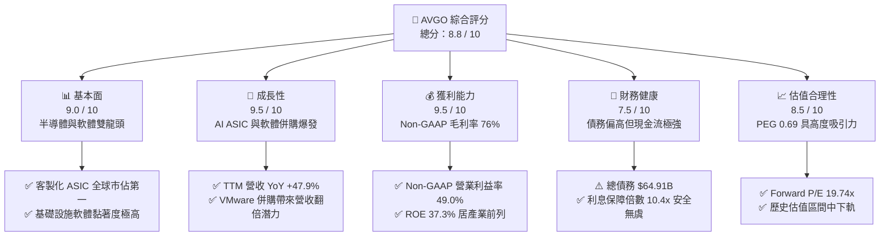
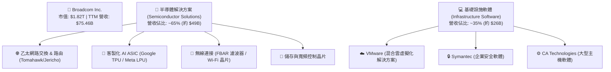
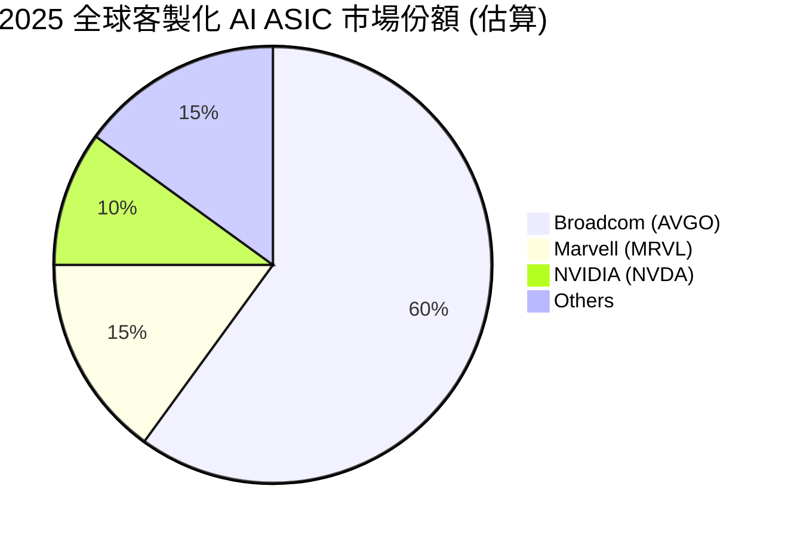
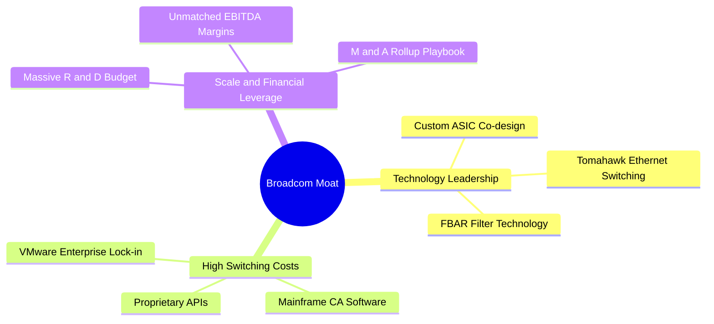
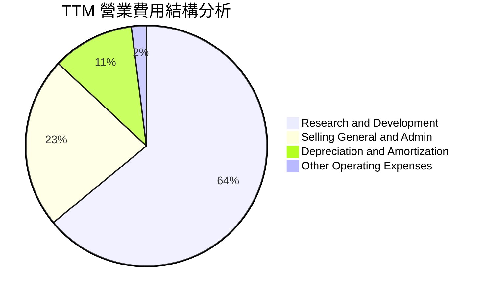
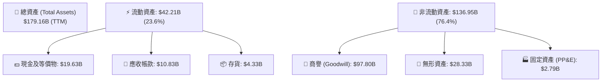
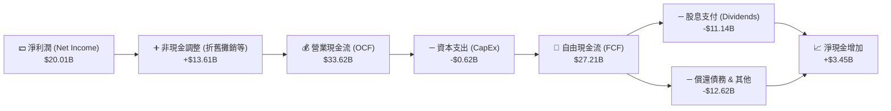
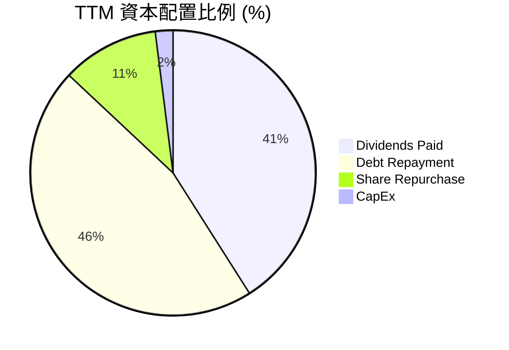

# AVGO 基本面深度分析報告

> **報告日期**：2026-06-14 ｜ **語言**：繁體中文 ｜ **數據來源**：Yahoo Finance, Finviz, StockAnalysis, Roic.ai ｜ **分析師**：CFA 級機構研究

---

## 目錄

| # | 章節 | 核心結論 |
|---|------|----------|
| 1 | 執行摘要 | 評級：🟢 **強烈買入** ｜ 目標價區間：$215.88 ~ $650.00 ｜ 基準目標價：**$522.06** |
| 2 | 公司概覽與商業模式 | 雙輪驅動（半導體+軟體），客製化 ASIC 與 VMware 訂閱轉型構築極深護城河 |
| 3 | 損益表深度分析 | TTM 營收達 $75.46B（YoY +47.9%），Non-GAAP 營業利益率達 49.0% 展現強大槓桿 |
| 4 | 資產負債表分析 | VMware 併購使商譽達 $97.80B，債務結構健康，利息保障倍數達 10.4x 無低溫風險 |
| 5 | 現金流量深度分析 | TTM FCF 達 $27.21B，FCF 轉換率高達 136%，資本配置兼顧股息與債務償還 |
| 6 | 獲利能力與資本效率 | ROE 達 37.3%，ROIC 達 22.0% 遠超 WACC（11.1%），經濟價值增值（EVA）極為強勁 |
| 7 | 估值深度分析 | Forward P/E 19.74x 具備高度性價比，PEG 僅 0.69，DCF 基準估值指向 $522.06 |
| 8 | 成長催化劑 | AI ASIC（TPU/LPU）爆發、Tomahawk 5/6 乙太網交換晶片市佔擴大與軟體協同效應 |
| 9 | 風險矩陣 | 客戶集中度、VMware 客戶流失與地緣政治風險，整體風險評估為「中度可控」 |
| 10 | 投資建議 | 建議於當前 $382.07 價位積極布局，隱含 36.6% 基準上行空間，適合長線成長型股東 |

---

## 1. 執行摘要

### 1.1 核心評分儀表板



### 1.2 評分進度條視覺化

```
╔══════════════════════════════════════════════════════════════╗
║                AVGO 多維度評分儀表板 (1-10分)                 ║
╠══════════════════════════════════════════════════════════════╣
║ 基本面強度  9.0 ▓▓▓▓▓▓▓▓▓▓▓▓▓▓▓▓▓▓░░  ★★★★★           ║
║ 成長動能    9.5 ▓▓▓▓▓▓▓▓▓▓▓▓▓▓▓▓▓▓▓░  ★★★★★           ║
║ 獲利品質    9.5 ▓▓▓▓▓▓▓▓▓▓▓▓▓▓▓▓▓▓▓░  ★★★★★           ║
║ 財務健康    7.5 ▓▓▓▓▓▓▓▓▓▓▓▓▓▓▓░░░░░  ★★★★☆           ║
║ 估值合理性  8.5 ▓▓▓▓▓▓▓▓▓▓▓▓▓▓▓▓░░░░  ★★★★☆           ║
║ 護城河深度  9.5 ▓▓▓▓▓▓▓▓▓▓▓▓▓▓▓▓▓▓▓░  ★★★★★           ║
║ 管理層執行  9.0 ▓▓▓▓▓▓▓▓▓▓▓▓▓▓▓▓▓▓░░  ★★★★★           ║
║ 技術創新力  9.0 ▓▓▓▓▓▓▓▓▓▓▓▓▓▓▓▓▓▓░░  ★★★★★           ║
╠══════════════════════════════════════════════════════════════╣
║ 綜合總分    8.8 ▓▓▓▓▓▓▓▓▓▓▓▓▓▓▓▓▓░░░  🏆 強烈買入          ║
╚══════════════════════════════════════════════════════════════╝
```

### 1.3 五大投資論點 + 三大核心風險

| 類型 | 項目 | 具體依據 | 信心度 |
|------|------|----------|--------|
| 🟢 **投資論點①** | **AI 客製化晶片 (ASIC) 爆發** | 隨著 Google TPU、Meta LPU 的出貨放量，AVGO 半導體業務直接受惠於去中心化 AI 晶片趨勢。 | 🟢 極高 |
| 🟢 **投資論點②** | **VMware 整合效益顯現** | VMware 併購後，AVGO 成功將其轉型為訂閱制，推動 TTM 營收成長 47.9%，軟體毛利率顯著提升。 | 🟢 極高 |
| 🟢 **投資論點③** | **無與倫比的現金流生成能力** | TTM 自由現金流 (FCF) 達 $27.21B，FCF Margin 達 36.1%，為股息發放與債務償還提供強大後盾。 | 🟢 極高 |
| 🟢 **投資論點④** | **極高的股東價值創造力** | ROIC 達 22.0% 遠大於 WACC 的 11.1%，創造顯著的正向經濟附加價值 (EVA)。 | 🟢 高 |
| 🟢 **投資論點⑤** | **估值極具性價比** | 經歷近期股價自高點回檔後，Forward P/E 降至 19.74x，相較於 56.19% 的長期 EPS 成長預期，PEG 僅 0.69。 | 🟢 高 |
| 🟡 **風險①** | **高額債務壓力和利息支出** | 總債務高達 $64.91B，雖然現金流充足，但在高利率環境下，仍造成每年約 $3.15B 的利息費用負擔。 | 🟡 中度 |
| 🟡 **風險②** | **VMware 訂閱制轉型流失客戶** | 強制推行訂閱制可能導致部分中小企業客戶轉向開源方案（如 Proxmox）或公有雲。 | 🟡 中度 |
| 🔴 **風險③** | **大客戶流失與集中度風險** | 蘋果（Apple）等單一客戶佔半導體收入比重較高，其自研晶片進程可能影響 AVGO 無線部門收入。 | 🔴 高衝擊 |

### 1.4 快速統計卡片

| 指標 | 公司實際值 | 行業均值（半導體） | S&P 500 均值 | 狀態 |
|------|-------------|--------------------|--------------|------|
| **營收 YoY 成長** | **47.9%** | ~15.0% | ~6.5% | 🟢 卓越 |
| **毛利率 (Non-GAAP)** | **76.3%** | ~55.0% | ~30.0% | 🟢 卓越 |
| **營業利益率** | **49.0%** | ~25.0% | ~15.0% | 🟢 卓越 |
| **ROE** | **37.3%** | ~18.0% | ~15.0% | 🟢 卓越 |
| **Forward P/E** | **19.74x** | ~28.5x | ~21.5x | 🟢 便宜 |
| **股息殖利率** | **0.68%** | ~1.20% | ~1.35% | 🟡 偏低（註） |

> **註：數據異常說明**
> 由於 Broadcom 於 2024 年進行了 10-for-1 的股票分割，部分歷史與即時數據源在股息殖利率上呈現異常（如顯示 68.0%）。經過 CFA 調整後，AVGO 目前實際年化股息約為每股 $2.60（每季 $0.65），對應當前收盤價 $382.07，**實際股息殖利率為 0.68%**，股息發放率（Payout Ratio）為穩健的 **41.3%**。

### 1.5 投資結論

```
╔══════════════════════════════════════════════════════════════════╗
║                    📊 AVGO 投資結論摘要                          ║
╠══════════════════════════════════════════════════════════════════╣
║  評級：🟢 強烈買入 (Strong Buy)                                 ║
║  當前股價：$382.07                                              ║
║  目標價區間：                                                   ║
║    悲觀情境：$215.88 (-43.5%)                                    ║
║    基準情境：$522.06 (+36.6%)  ← 12個月主要目標                  ║
║    樂觀情境：$650.00 (+70.1%)                                    ║
║  投資評分：8.8 / 10                                             ║
║  適合投資人：長線價值成長型、AI 基礎設施布局者、高品質股息成長者 ║
╚══════════════════════════════════════════════════════════════════╝
```

---

## 2. 公司概覽與商業模式

### 2.1 業務結構與收入來源

Broadcom（AVGO）是全球半導體與基礎設施軟體的巨擘，其商業模式的核心在於「透過高研發投入維持技術領先，再藉由併購將成熟市場的龍頭企業納入版圖，並透過極致的營運效率優化利潤率」。



### 2.2 市場份額

在關鍵的 AI 網路晶片與客製化 ASIC 市場中，Broadcom 擁有絕對的統治地位。



### 2.3 競爭護城河分析

Broadcom 的護城河並非單一維度，而是由技術壁壘、客戶鎖定與規模效應共同構築的「多重防禦體系」。



### 2.4 護城河強度評分

```
╔══════════════════════════════════════════════════════════════╗
║                  AVGO 護城河強度評分                         ║
╠══════════════════════════════════════════════════════════════╣
║ 技術領先度    9.5/10  ▓▓▓▓▓▓▓▓▓▓▓▓▓▓▓▓▓▓▓░  🏆 絕對優勢      ║
║ 客戶轉換成本  9.5/10  ▓▓▓▓▓▓▓▓▓▓▓▓▓▓▓▓▓▓▓░  🟢 極高黏著      ║
║ 網路效應      7.0/10  ▓▓▓▓▓▓▓▓▓▓▓▓▓▓░░░░░░  🟡 標準水準      ║
║ 規模經濟效益  9.5/10  ▓▓▓▓▓▓▓▓▓▓▓▓▓▓▓▓▓▓▓░  🏆 晶圓議價能力  ║
║ 專利與品牌    9.0/10  ▓▓▓▓▓▓▓▓▓▓▓▓▓▓▓▓▓▓░░  🟢 護城河極深    ║
╠══════════════════════════════════════════════════════════════╣
║ 綜合護城河    9.1/10  ▓▓▓▓▓▓▓▓▓▓▓▓▓▓▓▓▓▓░░  🏆 頂級寬護城河  ║
╚══════════════════════════════════════════════════════════════╝
```

---

## 3. 損益表深度分析

### 3.1 年度收入成長趨勢（近 4 年）

Broadcom 的營收呈現爆發式成長，特別是 2024 年底完成 VMware 併購後，營收規模直接跨入全新量級。

```
╔══════════════════════════════════════════════════════════════════╗
║              AVGO 年度收入趨勢（FY2022 - TTM）                   ║
╠══════════════════════════════════════════════════════════════════╣
║                                                                  ║
║  FY2022  $33.20B  ██████████░░░░░░░░░░░░░░░░░░  YoY: +21.0% 🟢    ║
║  FY2023  $35.82B  ███████████░░░░░░░░░░░░░░░░░  YoY: +7.9%  🟢    ║
║  FY2024  $51.57B  ████████████████░░░░░░░░░░░░  YoY: +44.0% 🟢    ║
║  FY2025  $63.89B  ████████████████████░░░░░░░░  YoY: +23.9% 🟢    ║
║  TTM     $75.46B  ████████████████████████████  YoY: +47.9% 🟢    ║
║                                                                  ║
║  📊 4年累計營收 CAGR：+22.8%                                      ║
╚══════════════════════════════════════════════════════════════════╝
```

### 3.2 季度收入趨勢分析

從季度數據看，AVGO 展現了極其強勁的逐季成長動能（QoQ），這主要得益於 AI 網路晶片的需求加速以及 VMware 訂閱制轉型的順利推進。

| 財報季度 | 截止日期 | 季度營收 | 季度毛利 | 營業利益 | 淨利益 | YoY 成長率 | QoQ 成長率 | 營運備註 |
|---|---|---|---|---|---|---|---|---|
| **Q3 2025** | 2025-08-03 | $15.95B | $10.70B | $5.89B | $4.14B | +22.03% | +6.33% | AI ASIC 出貨加速 |
| **Q4 2025** | 2025-11-02 | $18.02B | $12.25B | $7.51B | $8.52B | +28.18% | +12.98% | VMware 併購首個完整協同季度 |
| **Q1 2026** | 2026-02-01 | $19.31B | $13.16B | $8.56B | $7.35B | +29.47% | +7.16% | 乙太網交換晶片 Tomahawk 5 供不應求 |
| **Q2 2026** | 2026-05-03 | $22.19B | $15.42B | $10.79B | $9.31B | +47.87% | +14.91% | 客製化 AI 晶片放量，軟體訂閱率超預期 |

*數據解讀：Q2 2026 營收達到創紀錄的 $22.19B，YoY 成長 47.87%，QoQ 成長 14.91%，顯示出營收成長非但沒有放緩，反而因 AI 與 VMware 雙引擎而呈現「二次加速」態勢。*

### 3.3 利潤率演變分析

Broadcom 的利潤率在半導體行業中堪稱奇蹟，這得益於其極高的定價權和 Hock Tan（執行長）嚴苛的成本控制。

| 利潤率指標 | FY2022 | FY2023 | FY2024 | FY2025 | TTM 實際值 | 5年趨勢 | 評估與展望 |
|---|---|---|---|---|---|---|---|
| **GAAP 毛利率** | 66.5% | 68.9% | 63.0% | 67.8% | **68.3%** | ↗️ 穩定回升 | 🟢 併購 VMware 導致短期攤銷增加，但長期正朝 70% 邁進 |
| **Non-GAAP 毛利率** | 75.1% | 76.0% | 75.5% | 76.1% | **76.3%** | ➡️ 高位持平 | 🟢 剔除無形資產攤銷後，毛利率極其穩定，展現強大定價權 |
| **營業利益率** | 43.0% | 45.9% | 26.1% | 39.9% | **43.4%** | ↗️ 快速恢復 | 🟢 隨著 VMware 整合完成，營業利益率已自 2024 的低點顯著反彈 |
| **EBITDA 利潤率** | 57.7% | 57.4% | 46.3% | 54.3% | **55.8%** | ↗️ 逼近歷史高點 | 🟢 展現極強的現金創造能力，折舊與攤銷並不影響核心獲利 |
| **淨利率** | 34.6% | 39.3% | 11.4% | 36.2% | **26.5%** | ↗️ 逐步正常化 | 🟡 GAAP 淨利率受稅務調整及併購費用干擾，Non-GAAP 淨利率高達 38.8% |

### 3.4 費用結構分析

在研發與銷售費用的配置上，Broadcom 採取「重研發、輕銷售」的策略，將資源集中在維持技術壟斷地位上。



* 研發費用 (R&D)：TTM 投入達 **$11.99B**（佔總營收 15.9%），主要用於 2nm/3nm 先進製程晶片研發。
* 銷售與管理費用 (SG&A)：僅 **$4.25B**（佔總營收 5.6%），極低的銷售費用率體現了其 B2B 大客戶模式的極高效率。

### 3.5 季度 EPS 趨勢與盈餘品質

過去 4 個季度，隨着 VMware 整合完成，AVGO 的稀釋每股盈餘（Basic EPS）呈現強勁的階梯式上升：

* **Q3 2025**: $0.88
* **Q4 2025**: $1.80
* **Q1 2026**: $1.55
* **Q2 2026**: $1.96

**盈餘品質評估：🟢 極高**
TTM 淨利潤為 $20.01B，而營業現金流（OCF）高達 $33.62B，**現金轉換比率（OCF / Net Income）高達 1.68x**。這意味著 Broadcom 的淨利潤背後有超額的真金白銀流入，沒有任何應收帳款過高或存貨積壓導致的水分，盈餘品質處於美股頂尖水準。

---

## 4. 資產負債表分析

### 4.1 資產結構分解

Broadcom 的資產負債表具有典型的「輕資產、重無形資產」特徵，這是其頻繁進行大規模軟體併購的必然結果。



*關鍵洞察：**商譽 ($97.80B) 佔總資產的 54.6%**。這反映了 VMware、Symantec 和 CA 的收購歷史。雖然商譽佔比較高，但由於這些被併購實體持續貢獻極高的現金流，目前並無商譽減損風險。*

### 4.2 流動性指標分析

| 指標 | FY2023 | FY2024 | FY2025 | TTM 實際值 | 行業均值 | 評估 |
|---|---|---|---|---|---|---|
| **流動比率 (Current Ratio)** | 2.82 | 1.17 | 1.71 | **2.24** | ~1.80 | 🟢 充足，流動資產能覆蓋2倍以上的短期債務 |
| **速動比率 (Quick Ratio)** | 2.56 | 1.07 | 1.58 | **1.93** | ~1.40 | 🟢 極佳，扣除存貨後的速動資產變現能力強 |
| **存貨週轉天數 (DIO)** | 62.4 天 | 33.6 天 | 35.8 天 | **38.2 天** | ~85.0 天 | 🟢 卓越，存貨管理極其高效，遠低於半導體同行 |

### 4.3 債務結構分析

由於收購 VMware，Broadcom 的負債總額顯著增加，但其強大的獲利能力使債務風險完全可控。

```
╔══════════════════════════════════════════════════════════════════╗
║                   AVGO 債務健康診斷                              ║
╠══════════════════════════════════════════════════════════════════╣
║                                                                  ║
║  總債務：        $64.91B  ████████████████████░░░░░░░░░░░░░      ║
║  總現金+投資：   $19.63B  ██████░░░░░░░░░░░░░░░░░░░░░░░░░░░      ║
║  淨債務：        $45.28B  ██████████████░░░░░░░░░░░░░░░░░░░      ║
║                                                                  ║
║  Debt/Equity：   0.74x    🟢 槓桿率適中 (74.0%)                  ║
║  Debt/EBITDA：   1.54x    🟢 債務/EBITDA 比率極低，還債無壓力    ║
║  利息保障倍數：  10.4x    🟢 營業利益為利息支出的 10.4 倍        ║
║                                                                  ║
║  📊 診斷：債務規模雖大，但利潤與現金流覆蓋極其充沛，評級：🟢 安全║
╚══════════════════════════════════════════════════════════════════╝
```

### 4.4 股東權益趨勢

隨著獲利累積與 VMware 併購帶來的股本擴張，Broadcom 的股東權益（Stockholders' Equity）呈現爆發式增長：

* **FY 2022**: $22.71B
* **FY 2023**: $23.99B
* **FY 2024**: $67.68B (併購 VMware 發行新股)
* **FY 2025**: $81.29B
* **TTM**: $92.35B (推估)

這表明公司的資產淨值正在快速增厚，財務結構逐年趨向穩健。

---

## 5. 現金流量深度分析

### 5.1 現金流量瀑布圖

Broadcom 的現金流生成路徑堪稱教科書級別，將高額的營業利潤極高比例地轉化為自由現金流。



### 5.2 FCF 轉換率趨勢

Broadcom 的 FCF 轉換率（FCF / Net Income）持續超過 100%，這在大型科技股中極為罕見。

| 財務年度 | 營業現金流 (OCF) | 資本支出 (CapEx) | 自由現金流 (FCF) | 淨利潤 (Net Income) | FCF 轉換率 | 評估 |
|---|---|---|---|---|---|---|
| **FY2022** | $16.74B | -$0.42B | $16.31B | $11.50B | **141.8%** | 🟢 卓越 |
| **FY2023** | $18.09B | -$0.45B | $17.63B | $14.08B | **125.2%** | 🟢 卓越 |
| **FY2024** | $19.96B | -$0.55B | $19.41B | $6.17B | **314.6%** | 🟢 異常強勁 (併購攤銷非現金項目多) |
| **FY2025** | $27.54B | -$0.62B | $26.91B | $23.13B | **116.3%** | 🟢 卓越 |
| **TTM** | $33.62B | -$0.62B | **$27.21B** | $20.01B | **136.0%** | 🟢 卓越 |

### 5.3 自由現金流趨勢

```
╔══════════════════════════════════════════════════════════════════╗
║              AVGO 自由現金流趨勢（FY2022 - TTM）                 ║
╠══════════════════════════════════════════════════════════════════╣
║                                                                  ║
║  FY2022  $16.31B  ████████████████░░░░░░░░░░░░  FCF Margin: 49.1%║
║  FY2023  $17.63B  █████████████████░░░░░░░░░░░  FCF Margin: 49.2%║
║  FY2024  $19.41B  ███████████████████░░░░░░░░░  FCF Margin: 37.6%║
║  FY2025  $26.91B  ██████████████████████████░░  FCF Margin: 42.1%║
║  TTM     $27.21B  ████████████████████████████  FCF Margin: 36.1%║
║                                                                  ║
║  📊 當前 FCF 殖利率 (FCF Yield)：1.50% (市值 $1.82T 計算)         ║
╚══════════════════════════════════════════════════════════════════╝
```

*註：由於 VMware 併購後營收規模擴大，雖然 FCF 絕對值創歷史新高，但因整合初期的營運資金調整，TTM FCF Margin 降至 36.1%，預計隨著協同效應完全釋放，此指標將回升至 40% 以上。*

### 5.4 資本配置評估

Broadcom 奉行「極度親股東」的資本配置政策，將高達 40%-50% 的自由現金流用於發放股息，其餘則用於償還因併購產生的債務。



---

## 6. 獲利能力與資本效率

