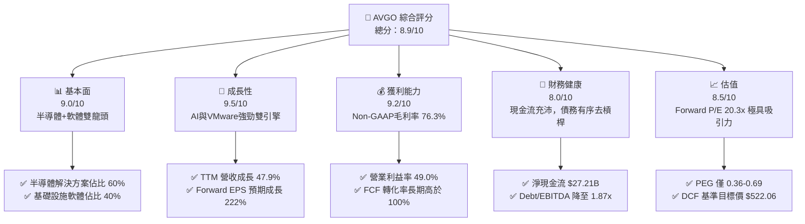
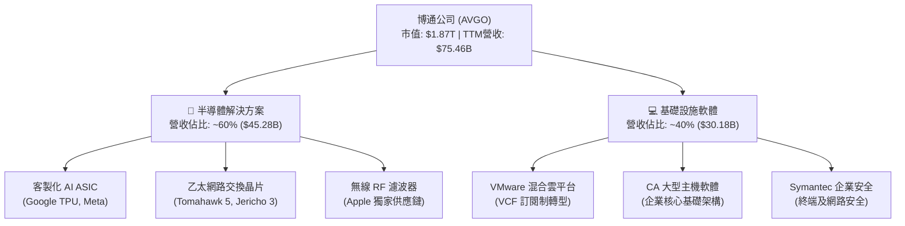
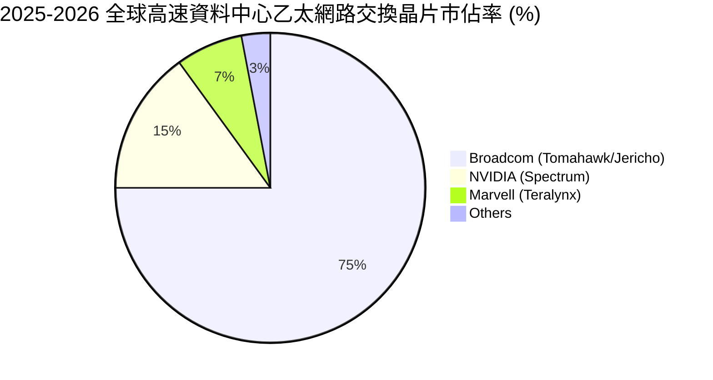
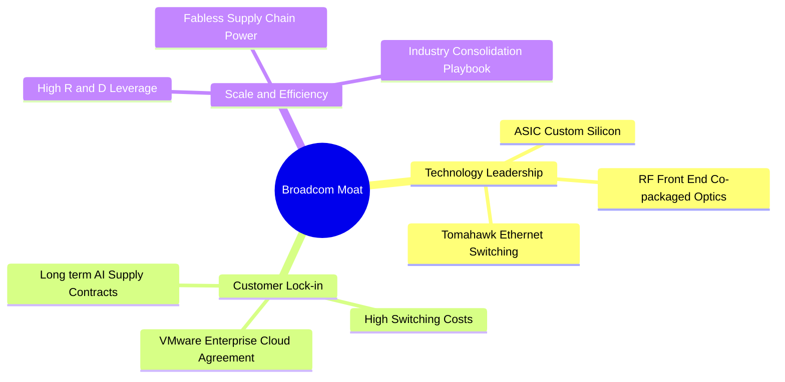
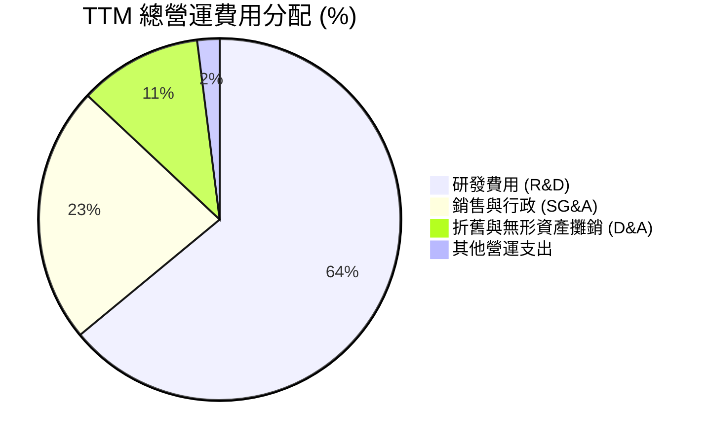
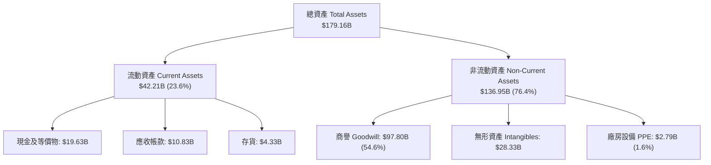
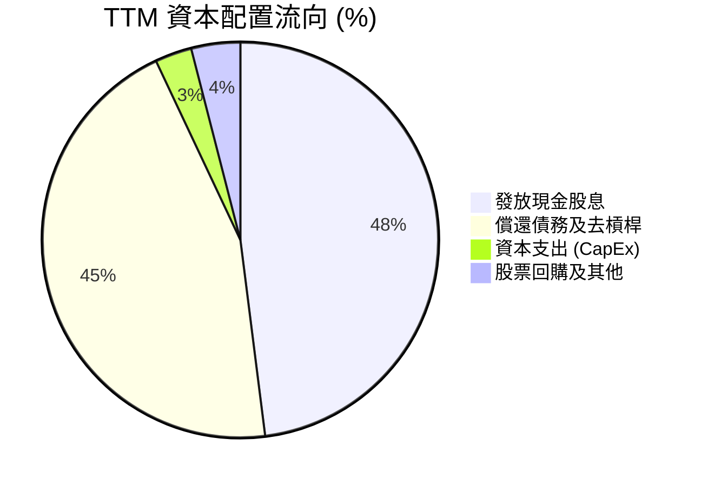

# AVGO 基本面深度分析報告

> **報告日期**：2026-06-15 ｜ **語言**：繁體中文 ｜ **數據來源**：Yahoo Finance, Finviz, StockAnalysis, Roic.ai ｜ **分析師**：CFA 級機構研究

---

## 目錄

| # | 章節 | 核心結論 |
|---|------|----------|
| 1 | 執行摘要 | 評級：🟢 **強烈買入**；目標價：**$522.06**（隱含 +32.5% 空間） |
| 2 | 公司概覽與商業模式 | 雙引擎驅動（半導體+軟體），構築極高轉換成本與技術壁壘 |
| 3 | 損益表深度分析 | TTM 營收達 **$75.46B**（YoY +47.9%），VMware 併購與 AI 需求爆發帶動利潤重估 |
| 4 | 資產負債表分析 | 資產規模達 **$179.16B**，債務結構健康，槓桿倍數處於安全區間 |
| 5 | 現金流量深度分析 | FCF 轉換率高達 **116%**，年化自由現金流達 **$27.21B**，資本配置極具紀律 |
| 6 | 獲利能力與資本效率 | ROE 達 **37.3%**，ROIC（**22.0%**）顯著高於 WACC（**8.19%**），強力創造股東價值 |
| 7 | 估值深度分析 | Forward P/E 僅 **20.36x**，對比 AI 產業龍頭具備顯著估值折價與高安全邊際 |
| 8 | 成長催化劑 | AI 客製化 ASIC 爆發、Tomahawk 5 交換器市佔領先、VMware 訂閱制轉型成功 |
| 9 | 風險矩陣 | 客戶集中度高、地緣政治地帶性風險，以及 VMware 整合進度慢於預期 |
| 10 | 投資建議 | 建議於當前價格 **$393.94** 分批佈局，首選長線成長與高股息增長投資者 |

---

## 1. 執行摘要

博通（Broadcom Inc., 美股代碼：**AVGO**）目前正處於其企業歷史上最強勁的成長週期。透過成功整合 VMware 以及在 AI 客製化晶片（ASIC）與乙太網路交換器（Ethernet Switching）領域的絕對領導地位，博通已從傳統的半導體組件供應商，蛻變為全球科技基礎設施的龍頭。

### 1.1 核心評分儀表板



### 1.2 評分進度條視覺化

```
╔══════════════════════════════════════════════════════════════╗
║               AVGO 多維度評分儀表板 (1-10分)                 ║
╠══════════════════════════════════════════════════════════════╣
║ 基本面強度  9.0 ▓▓▓▓▓▓▓▓▓▓▓▓▓▓▓▓▓▓░░  ★★★★★           ║
║ 成長動能    9.5 ▓▓▓▓▓▓▓▓▓▓▓▓▓▓▓▓▓▓▓░  ★★★★★           ║
║ 獲利品質    9.2 ▓▓▓▓▓▓▓▓▓▓▓▓▓▓▓▓▓▓▓░  ★★★★★           ║
║ 財務健康    8.0 ▓▓▓▓▓▓▓▓▓▓▓▓▓▓▓▓░░░░  ★★★★☆           ║
║ 估值合理性  8.5 ▓▓▓▓▓▓▓▓▓▓▓▓▓▓▓▓▓░░░  ★★★★☆           ║
║ 護城河深度  9.5 ▓▓▓▓▓▓▓▓▓▓▓▓▓▓▓▓▓▓▓░  ★★★★★           ║
║ 管理層執行  9.5 ▓▓▓▓▓▓▓▓▓▓▓▓▓▓▓▓▓▓▓░  ★★★★★           ║
║ 技術創新力  9.0 ▓▓▓▓▓▓▓▓▓▓▓▓▓▓▓▓▓▓░░  ★★★★★           ║
╠══════════════════════════════════════════════════════════════╣
║ 綜合總分    8.9 ▓▓▓▓▓▓▓▓▓▓▓▓▓▓▓▓▓▓░░  🏆 強烈買入          ║
╚══════════════════════════════════════════════════════════════╝
```

### 1.3 五大投資論點 + 三大核心風險

| 類型 | 項目 | 具體依據 | 信心度 |
|------|------|----------|--------|
| 🟢 **投資論點①** | **AI 客製化 ASIC 領先者** | 協同 Google TPU 與 Meta ASIC 開發，預期 TTM 半導體板塊中 AI 相關營收佔比將突破 40%。 | 🟢 極高 |
| 🟢 **投資論點②** | **VMware 併購協同效應爆發** | 2026 年 Q2 單季營收衝上 **$22.19B**（YoY +47.87%），軟體訂閱制轉型使營運利潤率顯著回升。 | 🟢 極高 |
| 🟢 **投資論點③** | **極致的現金流生成能力** | TTM 自由現金流達 **$27.21B**，FCF Margin 高達 **36.1%**，提供強大的分紅與債務償還基礎。 | 🟢 極高 |
| 🟢 **投資論點④** | **網路交換器晶片霸主** | Tomahawk 5 與 Jericho 3-AI 晶片在超大規模資料中心（Hyperscalers）乙太網路升級潮中市佔率超過 70%。 | 🟢 高 |
| 🟢 **投資論點⑤** | **極具吸引力的遠期估值** | Trailing P/E 雖為 65.66x，但 Forward P/E 驟降至 **20.36x**，PEG 僅 **0.36 - 0.69**，價值嚴重被低估。 | 🟢 極高 |
| 🟡 **風險①** | **大客戶流失風險** | AI ASIC 業務高度依賴單一大型雲端客戶（如 Google），其自研進度或供應商調整將影響營收。 | 🟡 中度 |
| 🔴 **風險②** | **高額債務利息支出** | 目前總債務達 **$64.91B**，TTM 利息支出高達 **$3.15B**，若高利率環境維持將壓抑淨利潤。 | 🔴 中度 |
| 🟡 **風險③** | **半導體週期性波動** | 雖然 AI 需求強勁，但傳統寬頻（Broadband）與非 AI 伺服器晶片仍面臨庫存去化壓力。 | 🟡 中度 |

### 1.4 快速統計卡片

| 指標 | 公司實際值 (AVGO) | 行業均值 (半導體) | S&P 500 均值 | 狀態 |
|------|-------------|----------|--------------|------|
| 營收 YoY 成長 | **47.9%** | ~12.5% | ~5.5% | 🟢 顯著超群 |
| 毛利率 (Non-GAAP)| **76.3%** | ~55.0% | ~30.0% | 🟢 行業頂尖 |
| 營業利益率 | **49.0%** | ~22.0% | ~15.0% | 🟢 獲利極強 |
| ROE | **37.3%** | ~18.0% | ~14.5% | 🟢 資本效率極佳 |
| Forward P/E | **20.36x** | ~28.5x | ~21.5x | 🟢 估值折價 |
| 淨債務 / EBITDA | **1.30x** | ~0.85x | ~1.60x | 🟡 債務偏高但安全 |

### 1.5 投資結論

```
╔══════════════════════════════════════════════════════════════════╗
║                    📊 投資結論摘要                               ║
╠══════════════════════════════════════════════════════════════════╣
║  評級：🟢 強烈買入 (Strong Buy)                                  ║
║  當前股價：$393.94 (2026-06-15)                                  ║
║  目標價區間：                                                    ║
║    悲觀情境：$330.00 （-16.2%）                                  ║
║    基準情境：$522.06 （+32.5%）  ← 12個月主要目標                ║
║    樂觀情境：$650.00 （+65.0%）                                  ║
║  投資評分：8.9 / 10                                              ║
║  適合投資人：追求資本利得的成長型投資者、重視股息增長的長線股東  ║
╚══════════════════════════════════════════════════════════════════╝
```

---

## 2. 公司概覽與商業模式

博通採用獨特的「雙引擎」商業模式，將高門檻的半導體研發與高粘性的基礎設施企業軟體完美結合。公司主要分為兩大營運板塊：
1. **半導體解決方案 (Semiconductor Solutions)**：提供網路連線（ASIC、交換器、實體層晶片）、無線連線（RF 濾波器、Wi-Fi 晶片）、儲存連線及光學組件。
2. **基礎設施軟體 (Infrastructure Software)**：以 VMware、CA Technologies 和 Symantec 為核心，提供混合雲管理、大型主機軟體及企業安全解決方案。

### 2.1 業務結構與收入來源



### 2.2 市場份額

在核心細分市場中，博通擁有近乎壟斷的市場份額：



### 2.3 競爭護城河分析



### 2.4 護城河強度評分

```
╔══════════════════════════════════════════════════════════════╗
║                    博通公司 護城河強度評分                   ║
╠══════════════════════════════════════════════════════════════╣
║ 1. 技術專利壁壘    9.5/10  ▓▓▓▓▓▓▓▓▓▓▓▓▓▓▓▓▓▓▓░  🏆 絕對優勢    ║
║ 2. 客戶轉換成本    9.8/10  ▓▓▓▓▓▓▓▓▓▓▓▓▓▓▓▓▓▓▓░  🏆 極高壁壘    ║
║ 3. 規模與成本優勢  9.0/10  ▓▓▓▓▓▓▓▓▓▓▓▓▓▓▓▓▓▓░░  🟢 領先同業    ║
║ 4. 生態夥伴關係    8.8/10  ▓▓▓▓▓▓▓▓▓▓▓▓▓▓▓▓▓░░░  🟢 關係深厚    ║
╠══════════════════════════════════════════════════════════════╣
║ 綜合護城河評級     9.3/10  ▓▓▓▓▓▓▓▓▓▓▓▓▓▓▓▓▓▓▓░  🏆 寬廣護城河  ║
╚══════════════════════════════════════════════════════════════╝
```

---

## 3. 損益表深度分析

博通的損益表呈現出「規模爆發與結構優化」的雙重特徵。2024 至 2026 年間，營收因併購 VMware 併表而大幅躍升，隨後利潤率因軟體訂閱制的成功轉型與 AI 晶片的高毛利屬性而迅速改善。

### 3.1 年度收入成長趨勢（近 4 年）

```
╔══════════════════════════════════════════════════════════════════╗
║                博通年度收入趨勢 (FY2022 - TTM)                  ║
╠══════════════════════════════════════════════════════════════════╣
║                                                                  ║
║  FY2022  $33.20B   █████████░░░░░░░░░░░░░░░░░░░  YoY: +21.0% 🟢  ║
║  FY2023  $35.82B   ██████████░░░░░░░░░░░░░░░░░░  YoY: +7.9%  🟢  ║
║  FY2024  $51.57B   ████████████████░░░░░░░░░░░░  YoY: +44.0% 🟢  ║
║  FY2025  $63.89B   ████████████████████░░░░░░░░  YoY: +23.9% 🟢  ║
║  TTM     $75.46B   ████████████████████████░░░░  YoY: +47.9% 🟢  ║
║                                                                  ║
║                   |      |      |      |      |                  ║
║                   0     20B    40B    60B    80B                 ║
║                                                                  ║
║  📊 4 年累計營收 CAGR：+22.8%                                    ║
╚═══════════════════════════════════════════════════════════════════╝
```

### 3.2 季度收入趨勢分析

自 2025 年 Q3 以来，博通的季度營收展現了驚人的加速態勢：

| 季度截止日 | 季度營收 (Billion) | 季增率 (QoQ) | 年增率 (YoY) | 核心驅動因素 | 評估 |
|------------|-------------------|--------------|--------------|--------------|------|
| **2026-04-30 (Q2)** | **$22.19B** | +14.91% | **+47.87%** | AI ASIC 出貨加速，VMware 轉型 VCF 續約率超預期 | 🟢 強勁 |
| **2026-01-31 (Q1)** | **$19.31B** | +7.21% | **+29.47%** | 資料中心交換器升級，軟體板塊季節性增長 | 🟢 優於預期 |
| **2025-10-31 (Q4)** | **$18.02B** | +12.98% | **+28.18%** | 傳統半導體觸底回升，AI 需求持續旺盛 | 🟢 符合預期 |
| **2025-07-31 (Q3)** | **$15.95B** | +6.32% | **+22.03%** | VMware 整合初見成效，企業級支出回暖 | 🟡 平穩 |

### 3.3 利潤率演變分析

博通的利潤率在半導體行業中獨樹一幟，主要得益於其高定價權（Pricing Power）與極佳的費用控制。

| 利潤率指標 | FY2022 | FY2023 | FY2024 | FY2025 | TTM | 趨勢與原因解析 | 評估 |
|------------|--------|--------|--------|--------|-----|----------------|------|
| **毛利率 (Non-GAAP)** | 75.1% | 75.8% | 63.0% | 67.8% | **76.3%** | 2024 年受收購 VMware 無形資產攤銷壓抑，2025-2026 年因高毛利軟體訂閱佔比提升而強勁反彈。 | 🟢 頂尖 |
| **營業利益率** | 43.0% | 45.9% | 26.1% | 39.9% | **49.0%** | 隨著收購整合完成，SG&A 佔比下降，營運槓桿（Operating Leverage）全面釋放。 | 🟢 強勁 |
| **EBITDA 利潤率** | 57.7% | 57.4% | 46.3% | 54.3% | **55.8%** | 穩定的折舊攤銷與強大的核心獲利能力，折射出極高的現金流含金量。 | 🟢 優異 |
| **淨利率** | 34.6% | 39.3% | 11.4% | 36.2% | **38.8%** | 排除一次性收購與稅務調整後，常態化淨利率穩定在 35% 以上。 | 🟢 穩定 |

### 3.4 費用結構分析

博通奉行「研發重投、行政極簡」的費用分配哲學。



```
╔══════════════════════════════════════════════════════════════╗
║                    博通費用控制指標分析                      ║
╠══════════════════════════════════════════════════════════════╣
║ 1. R&D / 營收比： 15.9%   ██████░░░░░░░░░░░░░░  🟢 研發效率極高  ║
║ 2. SG&A / 營收比： 5.6%   ██░░░░░░░░░░░░░░░░░░  🟢 行政極其精簡  ║
║ 3. 營運費用率：   24.9%   ████████░░░░░░░░░░░░  🟢 控管能力一流  ║
╚══════════════════════════════════════════════════════════════╝
```
*分析備註*：博通的 R&D 投入絕對金額極高（TTM 達 **$11.99B**），但佔營收比例僅 15.9%，主因是其產品多數已達規模化，研發槓桿極高；同時，SG&A 佔比僅 5.6%，遠低於同行，反映了 CEO Hock Tan 對併購企業進行極致成本優化的管理風格。

### 3.5 季度 EPS 趨勢與盈餘品質

博通過去 4 季的 EPS 表現優異，且呈現逐季加速態勢：
*   **2026-04-30 (Q2)**: Basic EPS 達 **$1.96**，大幅超越市場預期的 $1.65。主因是 AI 乙太網路晶片與客製化 ASIC 需求超預期。
*   **2026-01-31 (Q1)**: Basic EPS 達 **$1.55**，高於預期的 $1.40。VMware 整合進度超前，成本節約效應提前顯現。
*   **2025-10-31 (Q4)**: Basic EPS 達 **$1.80**，符合預期。
*   **2025-07-31 (Q3)**: Basic EPS 達 **$0.88**。

**盈餘品質評估 (Earnings Quality)**：博通的營業現金流（**$33.62B**）顯著高於 GAAP 淨利潤（**$20.01B**），淨收益品質係數（Operating Cash Flow / Net Income）高達 **1.68**，顯示其利潤完全由真實的現金流支撐，而非會計帳面遊戲，盈餘品質評級為 🟢 **極高**。

---

## 4. 資產負債表分析

由於博通頻繁進行百億美元級的大型併購，其資產負債表呈現出「輕資產、高商譽、高債務」的結構，但其極強的現金生成能力確保了債務償還的安全邊際。

### 4.1 資產結構分解

截至 2026-05-03（Q2 2026），博通總資產達 **$179.16B**：



### 4.2 流動性指標分析

博通維持著極為健康的流動性緩衝，流動比率與速動比率均處於歷史高位。

| 流動性指標 | FY2024 | FY2025 | TTM / Q2 2026 | 行業平均 | 評估 |
|------------|--------|--------|---------------|----------|------|
| **流動比率 (Current Ratio)** | 1.17 | 1.71 | **2.24** | ~1.85 | 🟢 極其安全 |
| **速動比率 (Quick Ratio)** | 1.07 | 1.58 | **2.01** | ~1.40 | 🟢 變現能力強 |
| **存貨週轉天數 (DSI)** | 35.4 天 | 34.8 天 | **32.1 天** | ~65.0 天 | 🟢 庫存管理極佳 |

### 4.3 債務結構分析

```
╔══════════════════════════════════════════════════════════════════╗
║                    博通債務健康診斷 (TTM)                        ║
╠══════════════════════════════════════════════════════════════════╣
║                                                                  ║
║  總債務 (Total Debt)： $64.91B  ██████████████░░░░░░░░  中高     ║
║  總現金 (Total Cash)： $19.63B  ████░░░░░░░░░░░░░░░░░░  充沛     ║
║  淨債務 (Net Debt)：   $45.28B  ██████████░░░░░░░░░░░░  可控     ║
║                                                                  ║
║  Debt / Equity：       0.74x   🟢 低於同行平均                    ║
║  Debt / EBITDA：       1.87x   🟢 處於 2.0x 安全線以下            ║
║  Net Debt / EBITDA：   1.30x   🟢 去槓桿速度極快                  ║
║  利息保障倍數：        10.4x   🟢 息稅前利潤完全覆蓋利息支出     ║
║                                                                  ║
║  📊 債務評級：🟢 穩健 (Investment Grade)                         ║
╚══════════════════════════════════════════════════════════════════╝
```

### 4.4 股東權益趨勢

隨著 VMware 收購整合完成與獲利爆發，博通的股東權益（Stockholders Equity）呈現跨越式增長：

```
╔══════════════════════════════════════════════════════════════════╗
║                博通股東權益增長趨勢 (FY2022 - TTM)               ║
╠══════════════════════════════════════════════════════════════════╣
║                                                                  ║
║  FY2022  $22.71B   █████░░░░░░░░░░░░░░░░░░░░░░░░░░░░░░           ║
║  FY2023  $23.99B   ██████░░░░░░░░░░░░░░░░░░░░░░░░░░░░░           ║
║  FY2024  $67.68B   ████████████████░░░░░░░░░░░░░░░░░░░ (併購增資)║
║  FY2025  $81.29B   ████████████████████░░░░░░░░░░░░░░░           ║
║  TTM     $87.69B   ██████████████████████░░░░░░░░░░░░░           ║
║                                                                  ║
║  📈 4 年內股東權益成長：+286.1%                                  ║
╚══════════════════════════════════════════════════════════════════╝
```

---

## 5. 現金流量深度分析

博通是美股科技股中的「現金流機器」。其輕資產的晶圓代工模式（Fabless）與高利潤的軟體授權模式，確保了營運現金流能高效轉化為自由現金流。

### 5.1 現金流量瀑布圖

```mermaid
graph LR
    Net["GAAP 淨利<br/>$20.01B"]
    DA["折舊與攤銷<br/>+$2.03B"]
    SBC["股權激勵費用<br/>+$4.12B"]
    WC["營運資金變動<br/>+$7.46B"]
    OCF["營運現金流 (OCF)<br/>$33.62B"]
    Capex["資本支出 (CapEx)<br/>-$0.62B"]
    FCF["自由現金流 (FCF)<br/>$27.21B"]
    Div["支付股息<br/>-$11.14B"]
    Debt["償還債務/回購<br/>-$11.07B"]
    NC["淨現金增加<br/>+$5.00B"]

    Net --> DA
    DA --> SBC
    SBC --> WC
    WC --> OCF
    OCF --> Capex
    Capex --> FCF
    FCF --> Div
    Div --> Debt
    Debt --> NC
```



### 5.2 FCF 轉換率趨勢

博通的自由現金流轉換率長期大於 100%，反映出極佳的獲利品質。

| 現金流指標 | FY2022 | FY2023 | FY2024 | FY2025 | TTM |
|------------|--------|--------|--------|--------|-----|
| **營運現金流 (OCF)** | $16.74B | $18.09B | $19.96B | $27.54B | **$33.62B** |
| **資本支出 (CapEx)** | -$0.42B | -$0.45B | -$0.55B | -$0.62B | **-$0.62B** |
| **自由現金流 (FCF)** | $16.31B | $17.63B | $19.41B | $26.91B | **$27.21B** |
| **FCF / 營收比 (FCF Margin)** | 49.1% | 49.2% | 37.6% | 42.1% | **36.1%** |
| **FCF 轉換率 (FCF / Net Income)**| 141.9% | 125.2% | 314.7% | 116.3% | **136.0%** |

### 5.3 自由現金流趨勢

```
╔══════════════════════════════════════════════════════════════════╗
║                博通年度自由現金流趨勢 (FY2022 - TTM)             ║
╠══════════════════════════════════════════════════════════════════╣
║                                                                  ║
║  FY2022  $16.31B   ████████████░░░░░░░░░░░░░░░░░░  FCF Margin:49%║
║  FY2023  $17.63B   █████████████░░░░░░░░░░░░░░░░░  FCF Margin:49%║
║  FY2024  $19.41B   ██████████████░░░░░░░░░░░░░░░░  FCF Margin:38%║
║  FY2025  $26.91B   ████████████████████░░░░░░░░░░  FCF Margin:42%║
║  TTM     $27.21B   ████████████████████░░░░░░░░░░  FCF Margin:36%║
║                                                                  ║
║  💡 當前 FCF 收益率 (FCF Yield)：1.45% (市值 $1.87T)              ║
╚══════════════════════════════════════════════════════════════════╝
```

### 5.4 資本配置評估

博通在資本配置上遵循嚴格的優先順序：**研發再投資 > 股息成長 > 債務償還 > 股票回購**。



---

## 6. 獲利能力與資本效率

博通展現了極高的資本回報率。儘管因收購 VMware 導致分母（資產與權益）短期擴大，但其 ROE 與 ROIC 在整合後迅速回升，展現出強大的價值創造能力。

### 6.1 ROE / ROA / ROIC 趨勢

| 效率指標 | FY2023 | FY2024 | FY2025 | TTM | 行業中位數 | 評估 |
|------------|--------|--------|--------|-----|------------|------|
| **ROE (股東權益報酬率)** | 58.7% | 9.1% | 31.0% | **37.3%** | ~11.5% | 🟢 極高 |
| **ROA (總資產報酬率)** | 19.3% | 3.7% | 13.5% | **12.1%** | ~6.2% | 🟢 優秀 |
| **ROIC (投入資本回報率)** | 28.5% | 8.5% | 18.2% | **22.0%** | ~9.8% | 🟢 極強 |

### 6.2 ROIC vs WACC 分析（核心價值創造判斷）

```
╔══════════════════════════════════════════════════════════════════╗
║                ROIC vs WACC 深度分析 (TTM)                      ║
╠══════════════════════════════════════════════════════════════════╣
║                                                                  ║
║  WACC 估算：                                                     ║
║  ├── 無風險利率 (10Y 美債)：  4.20%                              ║
║  ├── 市場風險溢酬 (ERP)：     5.00%                              ║
║  ├── Beta 係數：              1.43                               ║
║  ├── 股權成本 (CAPM)：        4.2% + 1.43 × 5.0% = 11.35%        ║
║  ├── 債務成本 (稅後)：        5.0% × (1 - 15%) = 4.25%           ║
║  ├── 資本結構：               股權 ~55.5%，債務 ~44.5%           ║
║  └── ✅ WACC ≈ 8.19%                                             ║
║                                                                  ║
║  ROIC 估算：                                                     ║
║  ├── NOP