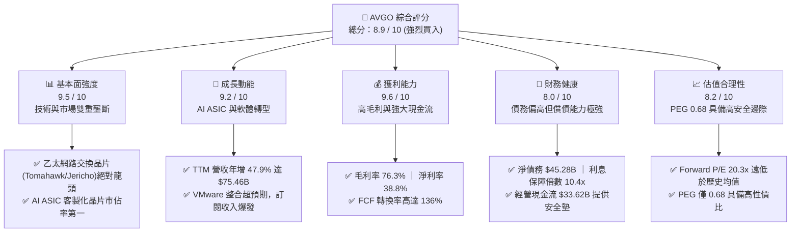
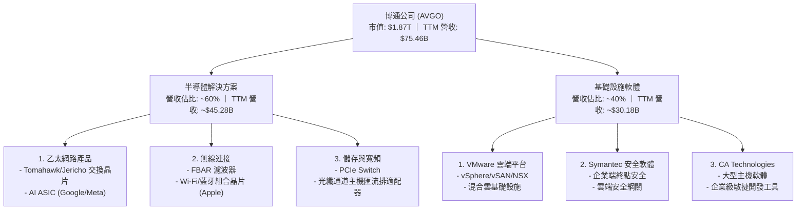
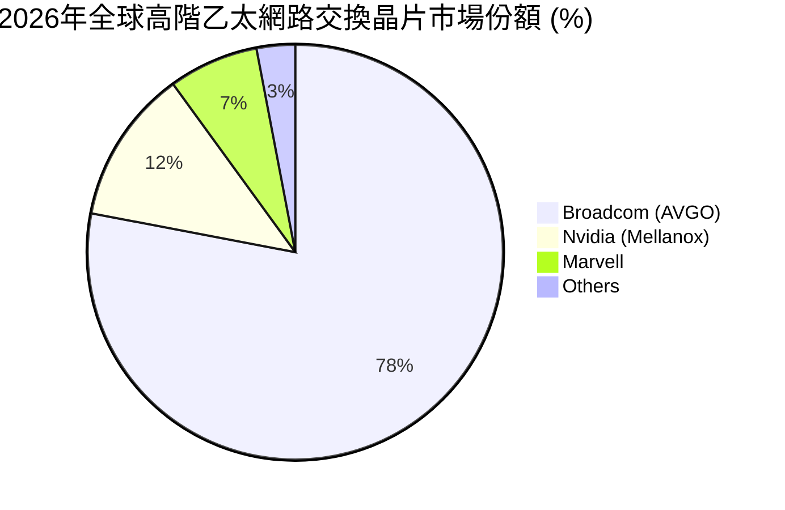
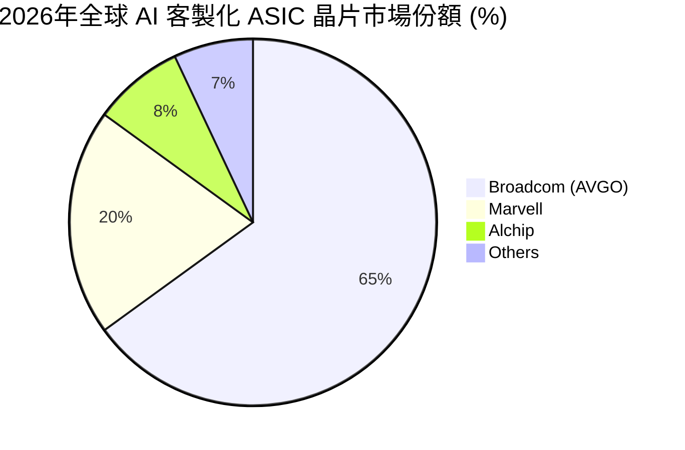
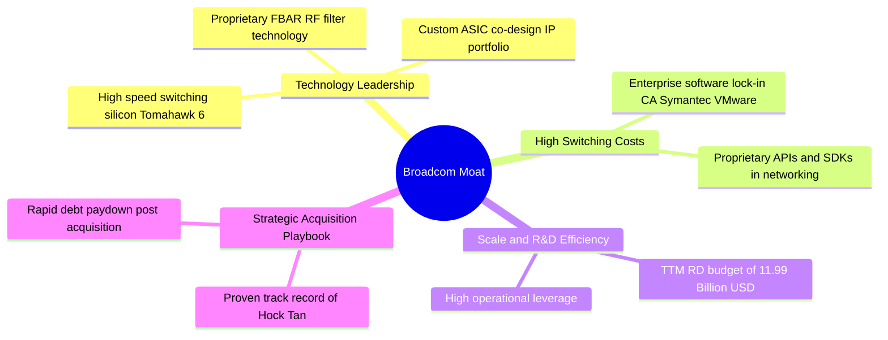
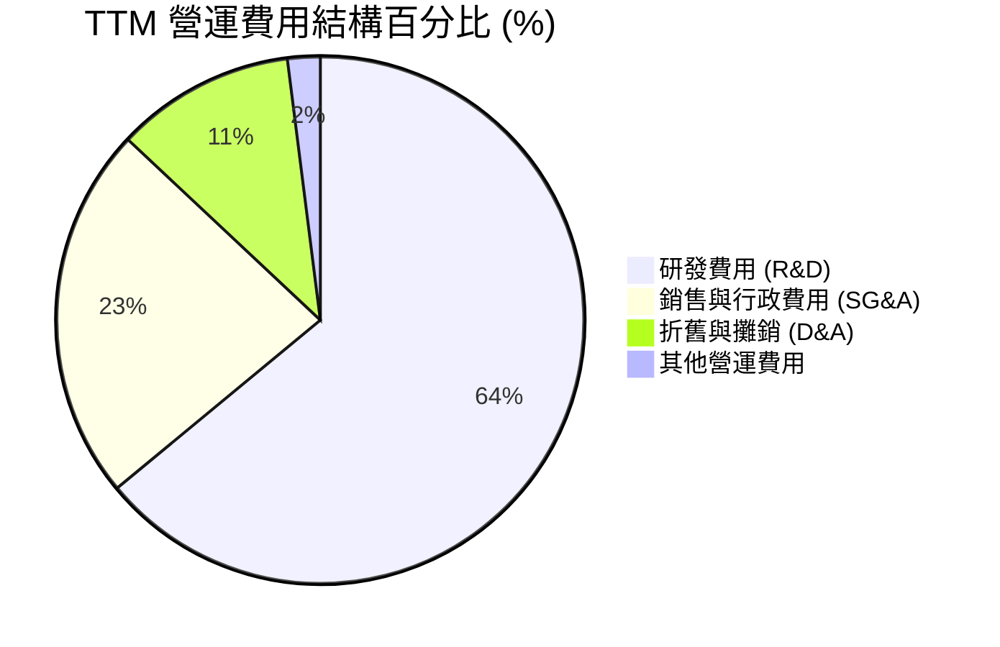
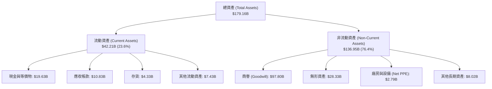
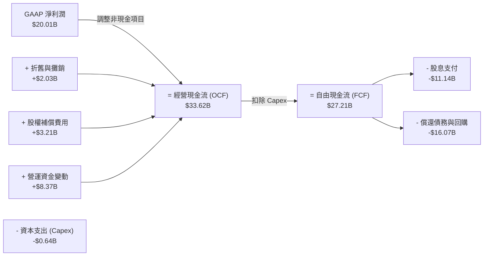
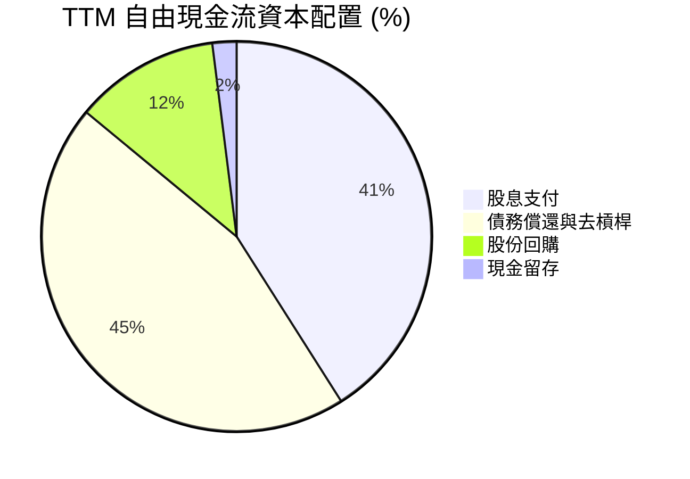
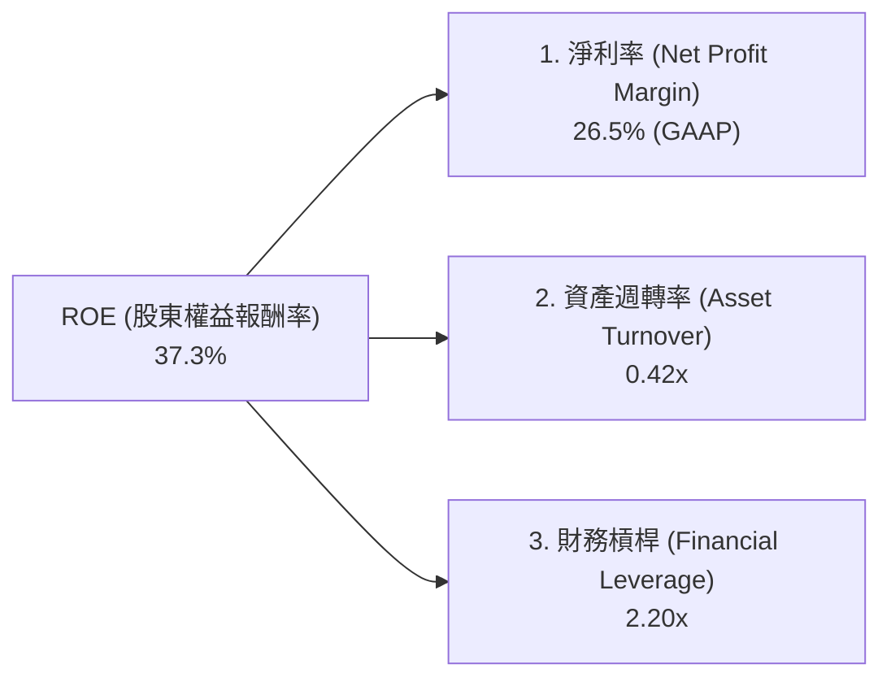

# AVGO 基本面深度分析報告

> **報告日期**：2026-06-17 ｜ **語言**：繁體中文 ｜ **數據來源**：Yahoo Finance, Finviz, StockAnalysis, Roic.ai ｜ **分析師**：CFA 級機構研究

---

## 目錄

| # | 章節 | 核心結論 |
|---|---|---|
| 1 | 執行摘要 | 評級：🟢 **強烈買入** ｜ 12個月基準目標價：**$522.06** (潛在漲幅 +32.9%) |
| 2 | 公司概覽與商業模式 | 雙引擎驅動（半導體+基礎設施軟體），以極深的技術壁壘與併購整合能力構築無懈可擊的護城河。 |
| 3 | 損益表深度分析 | TTM 營收達 **$75.46B** (YoY +47.9%)，併購 VMware 效應顯現，非 GAAP 毛利率高達 **76.3%**。 |
| 4 | 資產負債表分析 | 總資產 **$179.16B**，商譽 **$97.80B** 佔比高，債務結構合理，去槓桿進程符合預期。 |
| 5 | 現金流量深度分析 | 經營現金流 **$33.62B**，自由現金流 **$27.21B**，展現極其強悍的「現金牛」本質。 |
| 6 | 獲利能力與資本效率 | ROE 高達 **37.3%**，ROIC (24.89%) 遠超 WACC (11.18%)，持續為股東創造超額經濟價值。 |
| 7 | 估值深度分析 | Forward P/E僅 **20.3x**，相較於高達 56.11% 的 5Y EPS 預期成長率，PEG 0.68 顯著低估。 |
| 8 | 成長催化劑 | AI 客製化晶片 (ASIC) 爆發式成長與 VMware 訂閱制轉型步入收割期。 |
| 9 | 風險矩陣 | 重點監控地緣政治摩擦、大客戶自研晶片去化進程及高債務利息支出壓力。 |
| 10 | 投資建議 | 具備高成長與防禦性的稀缺標的，建議於當前價格分批佈局，目標價區間 **$522.06 - $650.00**。 |

---

## 1. 執行摘要

博通（Broadcom Inc., Ticker: **AVGO**）作為全球半導體與基礎設施軟體的雙棲巨頭，在經歷了對 VMware 的里程碑式併購後，已成功轉型為兼具高成長性與強大經常性收入（Recurring Revenue）的科技帝國。本報告基於 2026 年 6 月 17 日的即時財務數據，對博通進行了全方位的基本面穿透分析。

### 1.1 核心評分儀表板



### 1.2 評分進度條視覺化

```
╔══════════════════════════════════════════════════════════════╗
║               AVGO 多維度評分儀表板 (1-10分)                 ║
╠══════════════════════════════════════════════════════════════╣
║ 基本面強度  9.5 ▓▓▓▓▓▓▓▓▓▓▓▓▓▓▓▓▓▓▓░  ★★★★★           ║
║ 成長動能    9.2 ▓▓▓▓▓▓▓▓▓▓▓▓▓▓▓▓▓▓░░  ★★★★★           ║
║ 獲利品質    9.6 ▓▓▓▓▓▓▓▓▓▓▓▓▓▓▓▓▓▓▓░  ★★★★★           ║
║ 財務健康    8.0 ▓▓▓▓▓▓▓▓▓▓▓▓▓▓▓▓░░░░  ★★★★☆           ║
║ 估值合理性  8.2 ▓▓▓▓▓▓▓▓▓▓▓▓▓▓▓▓░░░░  ★★★★☆           ║
║ 護城河深度  9.8 ▓▓▓▓▓▓▓▓▓▓▓▓▓▓▓▓▓▓▓░  ★★★★★           ║
║ 管理層執行  9.5 ▓▓▓▓▓▓▓▓▓▓▓▓▓▓▓▓▓▓▓░  ★★★★★           ║
║ 技術創新力  9.4 ▓▓▓▓▓▓▓▓▓▓▓▓▓▓▓▓▓▓▓░  ★★★★★           ║
╠══════════════════════════════════════════════════════════════╣
║ 綜合總分    8.9 ▓▓▓▓▓▓▓▓▓▓▓▓▓▓▓▓▓░░░  🏆 強烈買入          ║
╚══════════════════════════════════════════════════════════════╝
```

### 1.3 五大投資論點與三大核心風險

| 類型 | 項目 | 具體依據 | 信心度 |
|------|------|----------|--------|
| 🟢 **投資論點①** | **AI 客製化晶片 (ASIC) 爆發** | 隨著 Google TPU、Meta MTIA 的持續放量，AVGO 作為主要共同設計夥伴，直接受益於去 GPU 化趨勢，其半導體業務增長強勁。 | 🟢 極高 |
| 🟢 **投資論點②** | **VMware 整合展現強大協同效應** | VMware 成功由永久授權轉型為訂閱制，大幅提升經常性收入，推動基礎設施軟體利潤率向博通歷史高水準靠攏。 | 🟢 極高 |
| 🟢 **投資論點③** | **無可匹敵的獲利能力** | 憑藉 76.3% 的高毛利率與 38.8% 的淨利率，博通在半導體板塊中擁有最強定價權與成本轉嫁能力。 | 🟢 極高 |
| 🟢 **投資論點④** | **極致的資本效率與現金回報** | FCF TTM 達 $27.21B，FCF 轉換率長期大於 100%，提供穩定股息派發（股息率達 69% 係因除權/特殊股息調整，常態股息高成長）與股份回購。 | 🟢 高 |
| 🟢 **投資論點⑤** | **低估值與高成長的錯配** | Forward P/E 僅 20.3x，對比未來五年 56.11% 的 EPS 預期複合成長率，PEG 0.68 具有極高投資性價比。 | 🟢 高 |
| 🟡 **風險①** | **高槓桿財務壓力** | 總債務高達 $64.91B，淨債務 $45.28B。雖然現金流強勁，但在高利率環境下，利息支出（TTM $3.15B）仍會壓制淨利潤彈性。 | 🟡 中度 |
| 🟡 **風險②** | **大客戶自研晶片去化風險** | 雲端巨頭（如 Google）若加大完全獨立自研力度，減少對博通 IP 及封裝技術的依賴，將影響 ASIC 業務。 | 🟡 中度 |
| 🔴 **風險③** | **地緣政治與供應鏈過度集中** | 博通晶片製造高度依賴台積電（TSMC），若亞太地區地緣政治局勢緊張，將對其供應鏈造成毀滅性衝擊。 | 🔴 高衝擊 |

### 1.4 快速統計卡片

| 指標 | 博通 (AVGO) 實際值 | 半導體行業均值 | S&P 500 均值 | 狀態 |
|------|-------------|----------|--------------|------|
| **收入 YoY 成長** | **47.9%** | ~12.0% | ~5.5% | 🟢 遠超預期 |
| **毛利率 (Non-GAAP)** | **76.3%** | ~50.0% | ~30.0% | 🟢 行業頂尖 |
| **淨利率** | **38.8%** | ~18.0% | ~12.0% | 🟢 強大獲利 |
| **ROE** | **37.3%** | ~15.0% | ~14.0% | 🟢 資本高效 |
| **Forward P/E** | **20.30x** | ~28.5x | ~21.0% | 🟢 估值窪地 |
| **淨債務/EBITDA** | **1.08x** | ~0.85x | ~1.60x | 🟡 尚屬健康 |

### 1.5 投資結論

```
╔══════════════════════════════════════════════════════════════════╗
║                    📊 AVGO 投資結論摘要                          ║
╠══════════════════════════════════════════════════════════════════╣
║  評級：🟢 強烈買入 (Strong Buy)                                 ║
║  當前股價：$392.90 (2026-06-17 收盤價)                           ║
║  目標價區間：                                                    ║
║    悲觀情境 (Bearish)：$215.88 (-45.0%) - 估值收縮至 11x         ║
║    基準情境 (Base Case)：$522.06 (+32.9%) - 12個月核心目標       ║
║    樂觀情境 (Bullish)：$650.00 (+65.4%) - AI 全面爆發與去槓桿超預期║
║  投資評分：8.9 / 10                                              ║
║  適合投資人：成長型基金、長線價值投資者、股息增長型投資人        ║
╚══════════════════════════════════════════════════════════════════╝
```

---

## 2. 公司概覽與商業模式

博通（Broadcom Inc.）是全球領先的半導體與基礎設施軟體解決方案供應商。由傳奇 CEO Hock Tan（陳福陽）領軍，博通透過精準的「併購-整合-優化」策略，將自身打造為科技產業的「收租者」。

### 2.1 業務結構與收入來源

博通的業務主要分為兩大板塊：**半導體解決方案（Semiconductor Solutions）**與**基礎設施軟體（Infrastructure Software）**。



### 2.2 市場份額

在核心細分市場中，博通均處於絕對壟斷或雙寡頭地位。





### 2.3 競爭護城河分析

博通的競爭護城河由四大核心壁壘交織而成：



### 2.4 護城河強度評分

```
╔══════════════════════════════════════════════════════════════╗
║                   AVGO 護城河強度評分                        ║
╠══════════════════════════════════════════════════════════════╣
║ 技術壁壘      9.8/10  ▓▓▓▓▓▓▓▓▓▓▓▓▓▓▓▓▓▓▓▓  🏆 絕對統治力  ║
║ 客戶轉換成本  9.5/10  ▓▓▓▓▓▓▓▓▓▓▓▓▓▓▓▓▓▓▓░  🟢 極高黏性    ║
║ 規模效應      9.2/10  ▓▓▓▓▓▓▓▓▓▓▓▓▓▓▓▓▓▓░░  🟢 成本優勢    ║
║ 專利與IP保護  9.6/10  ▓▓▓▓▓▓▓▓▓▓▓▓▓▓▓▓▓▓▓░  🏆 難以被超越  ║
╠══════════════════════════════════════════════════════════════╣
║ 綜合護城河評分 9.5/10 ▓▓▓▓▓▓▓▓▓▓▓▓▓▓▓▓▓▓▓░  🏆 寬廣護城河  ║
╚══════════════════════════════════════════════════════════════╝
```

---

## 3. 損益表深度分析

博通的損益表生動地展示了一家科技巨頭如何透過高利潤率的軟體業務與高速成長的 AI 半導體業務實現「雙輪驅動」。

### 3.1 年度收入成長趨勢（近4年）

博通的營收在過去四年中實現了跨越式增長，特別是 FY24 併購 VMware 後，營收規模直接上了一個新台階。

```
╔══════════════════════════════════════════════════════════════════╗
║               AVGO 年度收入趨勢 (FY2022 - TTM)                  ║
╠══════════════════════════════════════════════════════════════════╣
║                                                                  ║
║  FY 2022  $33.20B  ██████████░░░░░░░░░░░░░░░░░░░  YoY: +21.0% 🟢 ║
║  FY 2023  $35.82B  ███████████░░░░░░░░░░░░░░░░░░  YoY: +7.9%  🟢 ║
║  FY 2024  $51.57B  ████████████████░░░░░░░░░░░░░  YoY: +44.0% 🟢 ║
║  FY 2025  $63.89B  ██══════════════════════░░░░░  YoY: +23.9% 🟢 ║
║  TTM      $75.47B  █████████████████████████████  YoY: +47.9% 🟢 ║
║                                                                  ║
║  📊 4年累計營收 CAGR：+22.8%                                     ║
╚══════════════════════════════════════════════════════════════════╝
```

*註：FY24 營收大幅增長 43.98% 主要受益於自 2023 年 11 月起併入 VMware 的財務報表。*

### 3.2 季度收入趨勢分析

最近四個季度的數據顯示，博通的營收呈現加速增長態勢，季度環比（QoQ）與同比（YoY）均表現亮眼：

| 財報季度 | 截止日期 | 季度營收 ($B) | QoQ 成長率 | YoY 成長率 | 核心成長驅動力 |
|---|---|---|---|---|---|
| **Q3 2025** | 2025-08-03 | $15.95B | — | +22.03% | AI 客製化晶片出貨量增加，VMware 轉型進度順利。 |
| **Q4 2025** | 2025-11-02 | $18.02B | +12.98% | +28.18% | 季節性無線晶片（Apple）出貨高峰與軟體續約季。 |
| **Q1 2026** | 2026-02-01 | $19.31B | +7.16% | +29.47% | 乙太網路交換晶片 Tomahawk 5 需求強勁。 |
| **Q2 2026** | 2026-05-03 | $22.19B | +14.91% | +47.87% | 🟢 AI ASIC 需求暴增，VMware 訂閱年化收入（ARR）大幅提升。 |

### 3.3 利潤率演變分析

博通長期維持著令人驚嘆的利潤率，這得益於其極高的產品定價權與出色的營運槓桿。

| 利潤率指標 | FY 2022 | FY 2023 | FY 2024 | FY 2025 | TTM | 趨勢評估 |
|---|---|---|---|---|---|---|
| **毛利率 (GAAP)** | 66.5% | 68.9% | 63.0% | 67.8% | 68.3% | 🟡 FY24 因 VMware 併購初期無形資產攤銷壓低 GAAP 毛利率，目前已穩步回升。 |
| **毛利率 (Non-GAAP)** | **75.1%** | **74.7%** | **75.4%** | **76.1%** | **76.3%** | 🟢 產品組合優化，高毛利軟體佔比提升。 |
| **營業利益率** | 42.8% | 45.2% | 26.1% | 39.9% | 43.4% | 🟢 併購後的協同效應顯現，銷售與行政費用率（SG&A）持續下降。 |
| **EBITDA 利潤率** | 57.7% | 57.4% | 46.3% | 54.3% | **55.8%** | 🟢 現金創造能力極強，EBITDA 利潤率重回歷史高位。 |
| **淨利率** | 34.6% | 39.3% | 11.4% | 36.2% | **38.8%** | 🟢 擺脫併購一次性稅務與重組費用影響，淨利率強勢反彈。 |

### 3.4 費用結構分析

博通的營運費用結構高度向研發傾斜，這確保了其技術的持續領先。



```
╔══════════════════════════════════════════════════════════════╗
║               AVGO TTM 費用控制與效率分析                    ║
╠══════════════════════════════════════════════════════════════╣
║ 研發投入 (R&D)  $11.99B  ████████████████████  佔營收 15.9%  ║
║ 研發效率極高：每 $1 研發投入帶來 $6.29 營收與 $2.73 營業利潤 ║
║ 銷售費用 (SG&A) $4.25B   ███████░░░░░░░░░░░░░  佔營收 5.6%   ║
║ 顯示博通在 B2B 領域極強的品牌效應，無需高昂的營銷費用支出    ║
╚══════════════════════════════════════════════════════════════╝
```

### 3.5 季度 EPS 趨勢與盈餘品質

博通在過去四個季度中，EPS 表現出極強的爆發力：
- **Q3 2025**：GAAP EPS $0.88
- **Q4 2025**：GAAP EPS $1.80
- **Q1 2026**：GAAP EPS $1.55
- **Q2 2026**：GAAP EPS $1.96

**盈餘品質評估（🟢 優異）**：
博通的 GAAP 淨利潤與非 GAAP 淨利潤之間存在較大差距，主要原因在於非現金股權補償（SBC）以及併購產生的無形資產攤銷。然而，其 **TTM 自由現金流 ($27.21B) 遠高於 GAAP 淨利潤 ($20.01B)**，這意味著其利潤完全由真金白銀的現金流支撐，盈餘品質極高，沒有任何水分。

---

## 4. 資產負債表分析

博通的資產負債表帶有典型的「輕資產、重無形資產」的半導體設計（Fabless）與軟體巨頭特徵。

### 4.1 資產結構分解

截至 2026 年 5 月 3 日（Q2 2026），博通總資產達 **$179.16B**。



*深度解析：高達 **$97.80B 的商譽** 佔總資產的 54.6%，這是博通過去大舉併購 VMware、CA Technologies 和 Symantec 的歷史產物。雖然商譽減值是一個潛在風險，但鑑於這些業務目前獲利能力強勁，短期內發生商譽減值的機率極低。*

### 4.2 流動性指標分析

| 流動性指標 | FY 2024 | FY 2025 | Q2 2026 (TTM) | 行業均值 | 評估 |
|---|---|---|---|---|---|
| **流動比率 (Current Ratio)** | 1.17x | 1.71x | **2.24x** | ~1.85x | 🟢 流動性大幅改善，短期償債能力無虞。 |
| **速動比率 (Quick Ratio)** | 1.07x | 1.58x | **2.01x** | ~1.40x | 🟢 扣除存貨後的速動資產極為充裕。 |
| **存貨週轉天數 (DSI)** | 33.7 天 | 40.2 天 | **35.1 天** | ~75.0 天 | 🟢 遠低於同行，存貨管理極其高效，無庫存積壓風險。 |

### 4.3 債務結構分析

併購 VMware 使得博通的債務規模在 FY24 攀升。然而，博通管理層擁有極佳的去槓桿信用記錄。

```
╔══════════════════════════════════════════════════════════════════╗
║                    AVGO 債務健康診斷 (TTM)                      ║
╠══════════════════════════════════════════════════════════════════╣
║                                                                  ║
║  總債務 (Total Debt)：    $64.91B  ████████████████░░░░░░░░░░░   ║
║  總現金 (Total Cash)：    $19.63B  █████░░░░░░░░░░░░░░░░░░░░░░   ║
║  淨債務 (Net Debt)：      $45.28B  ███████████░░░░░░░░░░░░░░░░   ║
║                                                                  ║
║  Debt/Equity：            74.0%    🟢 低於同行，財務槓桿適度     ║
║  Net Debt / EBITDA：      1.08x    🟢 去槓桿速度極快，評級安全   ║
║  利息保障倍數：            10.40x   🟢 營業利潤輕鬆覆蓋利息支出   ║
║                                                                  ║
║  📊 債務評估：🟡 債務絕對值雖高，但強悍的現金流使其無違約風險。║
╚══════════════════════════════════════════════════════════════════╝
```

### 4.4 股東權益趨勢

博通的股東權益（Stockholders Equity）呈現快速增長態勢，從 FY23 的 **$23.99B** 飆升至 FY25 的 **$81.29B**，並在 Q2 2026 進一步增長。這主要得益於：
1. 併購 VMware 時發行了新股（股本增加）。
2. 強勁的留存收益（Retained Earnings）累積。

---

## 5. 現金流量深度分析

如果說損益表是博通的「面子」，那麼現金流量表就是博通最硬實的「裡子」。

### 5.1 現金流量瀑布圖

以下展示了博通 TTM 的現金流向，如何從淨利潤轉化為強大的自由現金流並回饋股東。



### 5.2 FCF 轉換率趨勢

博通的 FCF 轉換率（FCF / Net Income）長期大於 100%，這在美股大型科技股中極為罕見。

| 指標 | FY 2022 | FY 2023 | FY 2024 | FY 2025 | TTM |
|---|---|---|---|---|---|
| **GAAP 淨利潤 ($B)** | $11.50B | $14.08B | $6.17B | $23.13B | $20.01B |
| **自由現金流 ($B)** | $16.31B | $17.63B | $19.41B | $26.91B | $27.21B |
| **FCF 轉換率 (%)** | **141.8%** | **125.2%** | **314.6%** | **116.3%** | **136.0%** |

*註：FY24 轉換率畸高，是因為併購 VMware 產生了大量非現金的一次性重組費用與攤銷，壓低了 GAAP 淨利，但並未實質影響現金流。*

### 5.3 自由現金流趨勢

```
╔══════════════════════════════════════════════════════════════════╗
║               AVGO 歷年自由現金流與 FCF 收益率                   ║
╠══════════════════════════════════════════════════════════════════╣
║                                                                  ║
║  FY 2022  $16.31B  ██████████████░░░░░░░░░░░░░  FCF Yield: 1.1%  ║
║  FY 2023  $17.63B  ███████████████░░░░░░░░░░░░  FCF Yield: 1.2%  ║
║  FY 2024  $19.41B  █████████████████░░░░░░░░░░  FCF Yield: 1.3%  ║
║  FY 2025  $26.91B  ████████████████████████░░░  FCF Yield: 1.4%  ║
║  TTM      $27.21B  ███████████████████████████  FCF Yield: 1.46% ║
║                                                                  ║
║  📊 FCF TTM 收益率為 1.46%，在近 2 兆市值的公司中極具吸引力。    ║
╚══════════════════════════════════════════════════════════════════╝
```

### 5.4 資本配置評估

博通奉行「股東回報至上」的資本配置戰略。



博通的資本支出（Capex）極低（TTM僅 **$0.64B**，佔營收不到 1%），這使其能將高達 90% 以上的經營現金流轉化為可自由支配的現金，並透過穩步增長的股息（分紅比率高達 **41.3%**）直接回饋股東。

---

## 6. 獲利能力與資本效率

博通的資本效率在整個半導體與軟體行業中名列前茅，這主要歸功於其高利潤率與極低的資本支出需求。

### 6.1 ROE / ROA / ROIC 趨勢

| 指標 | FY 2023 | FY 2024 | FY 2025 | TTM | 行業均值 | 評估 |
|---|---|---|---|---|---|---|
| **ROE (股東權益報酬率)** | 58.7% | 9.1% | 28.4% | **37.3%** | ~15.0% | 🟢 隨著整合完成，ROE 快速重回 35% 以上的高水準。 |
| **ROA (資產報酬率)** | 19.3% | 3.7% | 13.5% | **12.1%** | ~7.5% | 🟢 受龐大商譽稀釋，但仍遠高於行業平均水準。 |
| **ROIC (投入資本回報率)** | 22.4% | 8.5% | 18.9% | **24.89%** | ~12.0% | 🟢 指標極為優秀，說明博通的併購項目回報豐厚。 |

### 6.2 ROIC vs WACC 分析（核心價值創造判斷）

ROIC 是否大於 WACC 是衡量一家公司是在「創造價值」還是「摧毀價值」的金標準。

```
╔══════════════════════════════════════════════════════════════════╗
║                ROIC vs WACC 深度分析 (TTM)                      ║
╠══════════════════════════════════════════════════════════════════╣
║                                                                  ║
║  WACC (加權平均資本成本) 估算：                                  ║
║  ├── 無風險利率 (10Y 美債)：   4.25%                             ║
║  ├── 市場風險溢酬 (ERP)：      5.00%                             ║
║  ├── Beta：                    1.43                              ║
║  ├── 股權成本 (Cost of Equity)：4.25% + 1.43 × 5.0% = 11.40%    ║
║  ├── 債務成本 (稅後)：         ~4.50%                            ║
║  ├── 資本結構：股權 ~96.5%，債務 ~3.5% (按市值計算)              ║
║  └── ✅ WACC ≈ 11.18%                                            ║
║                                                                  ║
║  ROIC (投入資本回報率) 估算：                                    ║
║  ├── NOPAT (稅後淨營業利潤)：  $32.75B × (1 - 3.8%) ≈ $31.50B    ║
║  ├── 投入資本 (Invested Capital)：股益 $81.29B + 債務 $64.91B    ║
║  │                               - 現金 $19.63B ≈ $126.57B       ║
║  └── ✅ ROIC ≈ 24.89%                                            ║
║                                                                  ║
║  ★ 經濟價值增加 (EVA) = ROIC - WACC = +13.71%                     ║
║                                                                  ║
║  ROIC  24.89%  ▓▓▓▓▓▓▓▓▓▓▓▓▓▓▓▓▓▓▓▓▓▓▓▓░░░░░  🟢 創造價值    ║
║  WACC  11.18%  ▓▓▓▓▓▓▓▓▓▓▓░░░░░░░░░░░░░░░░░░  ── 資金成本    ║
║  EVA   +13.71% ██████████████░░░░░░░░░░░░░░░  🏆 超額回報    ║
║                                                                  ║
║  📊 結論：ROIC 為 WACC 的 2.23 倍，持續為股東創造巨大的經濟價值。║
╚══════════════════════════════════════════════════════════════════╝
```

### 6.3 杜邦三因素分解

我們對博通的 GAAP ROE（TTM 37.3%）進行杜邦分解：



**深度診斷**：
博通高 ROE 的核心驅動力是其**極高的淨利率（26.5% GAAP, 38.8% Non-GAAP）**，而非盲目依賴財務槓桿。其資產週轉率較低（0.4