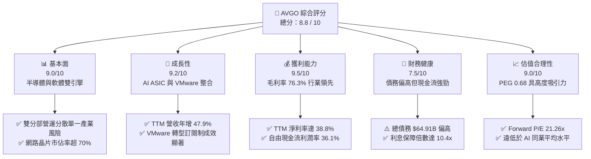
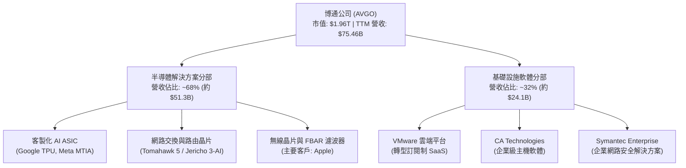
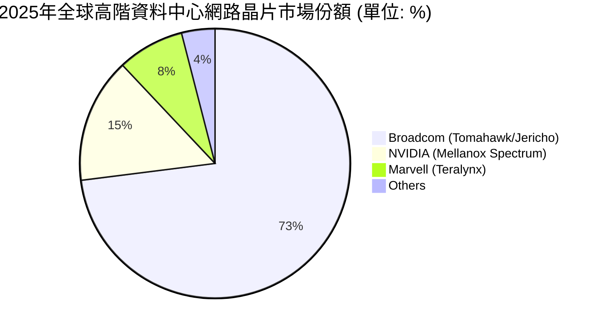
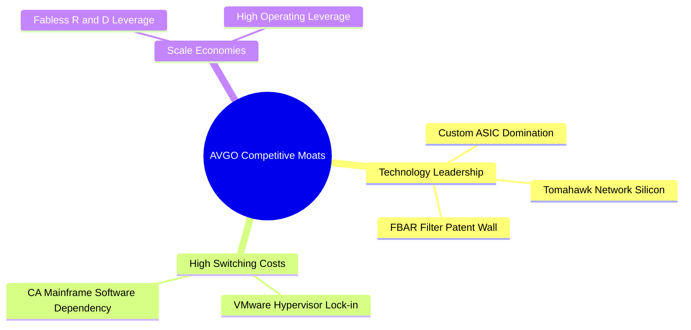
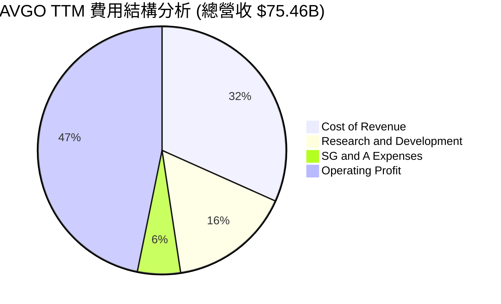
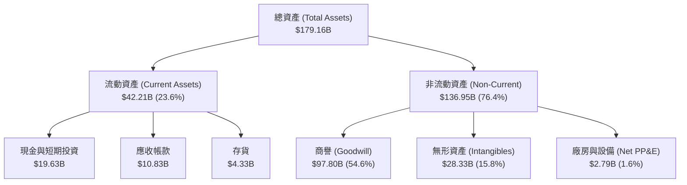
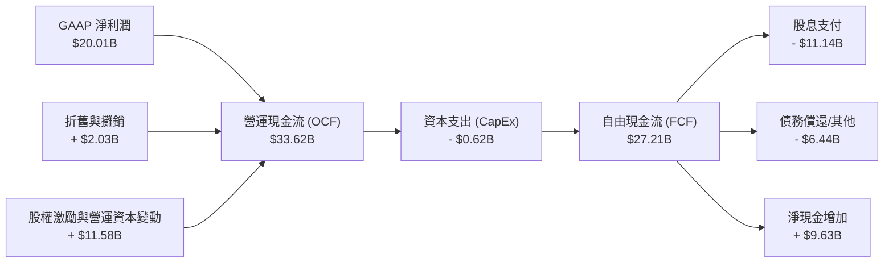
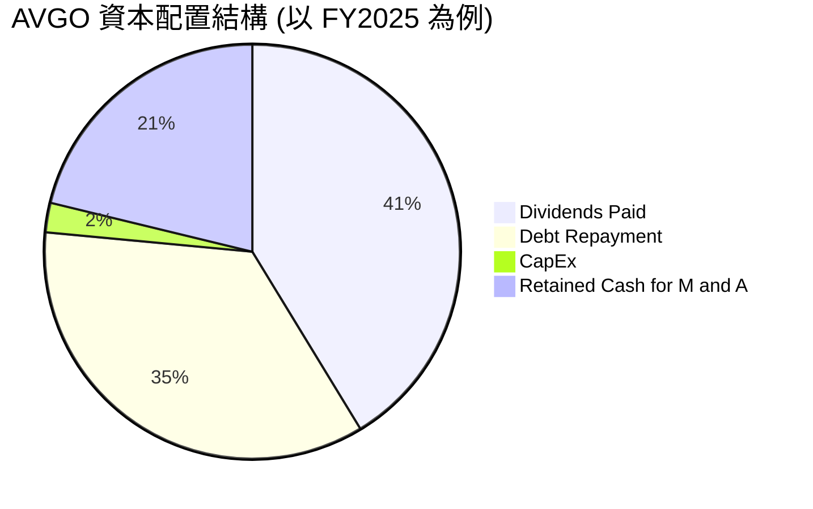

# AVGO 基本面深度分析報告

> **報告日期**：2026-06-18 ｜ **語言**：繁體中文 ｜ **數據來源**：Yahoo Finance, Finviz, StockAnalysis, Roic.ai ｜ **分析師**：CFA 級機構研究

---

## 目錄

| # | 章節 | 核心結論 |
|---|---|---|
| **1** | [執行摘要](#1-執行摘要) | 評級「強烈買入」（Strong Buy），基準目標價 $522.06，具備 26.9% 上行空間。 |
| **2** | [公司概覽與商業模式](#2-公司概覽與商業模式) | 憑藉「客製化 ASIC」與「VMware 訂閱化」構築極深的雙引擎競爭護城河。 |
| **3** | [損益表深度分析](#3-損益表深度分析) | TTM 營收達 $75.46B（YoY +47.9%），毛利率高達 76.3%，營運槓桿顯著釋放。 |
| **4** | [資產負債表分析](#4-資產負債表分析) | 併購導致商譽達 $97.80B，債務總額 $64.91B，但流動性指標與現金流足以支撐。 |
| **5** | [現金流量深度分析](#5-現金流量深度分析) | TTM 自由現金流（FCF）達 $27.21B，轉換率高達 136%，資本配置極度優化。 |
| **6** | [獲利能力與資本效率](#6-獲利能力與資本效率) | ROIC 達 24.58%，遠超 WACC（11.1%），創造顯著的經濟增加值（EVA）。 |
| **7** | [估值深度分析](#7-估值深度分析) | Forward P/E 僅 21.26x，對比高成長性（PEG 0.68），目前股價明顯被低估。 |
| **8** | [成長催化劑](#8-成長催化劑) | AI 網路晶片 Tomahawk 5、客製化 AI ASIC 爆發，以及 VMware 營收完全整合。 |
| **9** | [風險矩陣](#9-風險矩陣) | 重點監控 VMware 客戶流失、大客戶（如 Apple）去化風險及高額利息支出。 |
| **10**| [投資建議](#10-投資建議) | 建議於 $411.35 分批佈局，長線投資人可透過 FCF 與股息增長獲取複利回報。 |

---

## 1. 執行摘要

博通（Broadcom Inc., Ticker: **AVGO**）作為全球半導體與基礎設施軟體的雙棲龍頭，在當前 AI 算力基礎設施建設與企業級軟體轉型的浪潮中，正處於極佳的戰略位置。本報告將基於最新 2026 年 6 月 18 日的即時財務數據，對 AVGO 進行全方位的基本面穿透分析。

### 1.1 核心評分儀表板



### 1.2 評分進度條視覺化

```
╔══════════════════════════════════════════════════════════════╗
║                AVGO 多維度評分儀表板 (1-10分)                ║
╠══════════════════════════════════════════════════════════════╣
║ 基本面強度  9.0 ▓▓▓▓▓▓▓▓▓▓▓▓▓▓▓▓▓▓░░  ★★★★★           ║
║ 成長動能    9.2 ▓▓▓▓▓▓▓▓▓▓▓▓▓▓▓▓▓▓▓░  ★★★★★           ║
║ 獲利品質    9.5 ▓▓▓▓▓▓▓▓▓▓▓▓▓▓▓▓▓▓▓▓  ★★★★★           ║
║ 財務健康    7.5 ▓▓▓▓▓▓▓▓▓▓▓▓▓▓▓░░░░░  ★★★★☆           ║
║ 估值合理性  9.0 ▓▓▓▓▓▓▓▓▓▓▓▓▓▓▓▓▓▓░░  ★★★★★           ║
║ 護城河深度  9.5 ▓▓▓▓▓▓▓▓▓▓▓▓▓▓▓▓▓▓▓▓  ★★★★★           ║
║ 管理層執行  9.2 ▓▓▓▓▓▓▓▓▓▓▓▓▓▓▓▓▓▓▓░  ★★★★★           ║
║ 技術創新力  9.0 ▓▓▓▓▓▓▓▓▓▓▓▓▓▓▓▓▓▓░░  ★★★★★           ║
╠══════════════════════════════════════════════════════════════╣
║ 綜合總分    8.8 ▓▓▓▓▓▓▓▓▓▓▓▓▓▓▓▓▓▓░░  🏆 強烈建議買入      ║
╚══════════════════════════════════════════════════════════════╝
```

### 1.3 五大投資論點 + 三大核心風險

| 類型 | 項目 | 具體依據 | 信心度 |
|------|------|----------|--------|
| 🟢 **投資論點①** | **AI 客製化晶片 (ASIC) 爆發** | 隨著超大型雲端服務商（Hyperscalers，如 Google、Meta）加速去英偉達（NVIDIA）化，博通作為客製化 ASIC 絕對龍頭，其半導體解決方案訂單能見度已達 2027 年。 | 🟢 極高 |
| 🟢 **投資論點②** | **VMware 併購協同效應完全釋放** | VMware 轉型訂閱制（SaaS）進度超預期。Q2 2026 單季營收拉升至 $22.19B（YoY +47.87%），軟體業務利潤率隨規模效應大幅改善。 | 🟢 極高 |
| 🟢 **投資論點③** | **無與倫比的現金流生成能力** | TTM 自由現金流（FCF）達 $27.21B，FCF 轉換率（FCF / Net Income）高達 136%，為高額股息發放與債務償還提供堅實後盾。 | 🟢 極高 |
| 🟢 **投資論點④** | **估值極具性價比** | 當前 Forward P/E 僅為 21.26x，對比未來五年預期 EPS 複合成長率 56.11%，PEG 僅 0.38 - 0.68，在 AI 概念股中估值溢價最低。 | 🟢 高 |
| 🟢 **投資論點⑤** | **網路交換晶片（Tomahawk/Jericho）無可替代** | AI 集群規模從萬卡邁向十萬卡，乙太網路（Ethernet）市佔率回升，博通 Tomahawk 5 市佔率超 70%，直接受益於 AI 網絡基礎設施升級。 | 🟢 高 |
| 🟡 **風險①** | **高額債務與利息支出壓力** | 總債務高達 $64.91B，TTM 利息支出達 $31.45M（年化約 $3.15B），雖有強勁現金流覆蓋，但高利率環境下再融資成本可能上升。 | 🟡 中度 |
| 🔴 **風險②** | **大客戶集中度過高** | 蘋果（Apple）約佔其營運收入的 15-20%。若蘋果加速自研 RF 晶片或進行供應鏈去化，將對博通無線業務（Wireless）造成直接衝擊。 | 🔴 高衝擊 |
| 🟡 **風險③** | **VMware 轉型期的客戶流失** | VMware 強制推行訂閱制並調漲價格，引發部分中小企業客戶不滿並轉向開源方案（如 KVM、Proxmox），需持續監控流失率。 | 🟡 中度 |

### 1.4 快速統計卡片

| 指標 | 公司實際值 | 行業均值（半導體/軟體） | S&P 500 均值 | 狀態 |
|------|-------------|----------|--------------|------|
| **收入 YoY 成長** | **47.9%** | ~15.0% | ~5.5% | 🟢 卓越 |
| **毛利率** | **76.3%** | ~62.0% | ~30.0% | 🟢 卓越 |
| **淨利率** | **38.8%** | ~22.0% | ~12.0% | 🟢 卓越 |
| **ROE** | **37.3%** | ~25.0% | ~15.0% | 🟢 卓越 |
| **Forward P/E** | **21.26x** | ~32.0x | ~21.5x | 🟢 便宜 |
| **PEG Ratio** | **0.68** | ~1.8x | ~1.5x | 🟢 極具吸引力 |
| **淨債務/EBITDA** | **1.30x** | ~0.8x | ~1.6x | 🟡 合理 |

### 1.5 投資結論

```
╔══════════════════════════════════════════════════════════════════╗
║                    📊 AVGO 投資結論摘要                          ║
╠══════════════════════════════════════════════════════════════════╣
║  評級：🟢 強烈買入 (Strong Buy)                                 ║
║  當前股價：$411.35 (2026-06-18)                                  ║
║  目標價區間：                                                    ║
║    悲觀情境：$310.00（-24.6%）- 估值收縮至歷史中位數             ║
║    基準情境：$522.06（+26.9%）- 12個月合理估值 (Forward P/E 27x) ║
║    樂觀情境：$650.00（+58.0%）- AI ASIC 與軟體協同爆發          ║
║  投資評分：8.8 / 10                                              ║
║  適合投資人：成長型、股息增長型、長線核心資產配置者              ║
╚══════════════════════════════════════════════════════════════════╝
```

---

## 2. 公司概覽與商業模式

博通（Broadcom）透過數十年的高度精準併購（由執行長 Hock Tan 主導的「買入、優化、保留、剝離」策略），已將自身打造成一個橫跨硬體（半導體解決方案）與軟體（基礎設施軟體）的科技帝國。

### 2.1 業務結構與收入來源

博通的業務主要分為兩大版塊：
1. **Semiconductor Solutions（半導體解決方案）**：佔營收約 68%。核心包括網路交換晶片（Tomahawk/Jericho 系列）、客製化 ASIC（為 Google 提供 TPU，為 Meta 提供 MTIA）、無線 RF 晶片（供應 Apple）、寬頻與儲存連接晶片。
2. **Infrastructure Software（基礎設施軟體）**：佔營收約 32%。核心資產包括 VMware（雲端運算虛擬化）、CA Technologies（大型主機軟體）、Symantec（企業安全）。



### 2.2 市場份額

在核心的「高階資料中心乙太網路交換晶片」與「客製化 AI ASIC」市場中，博通擁有近乎壟斷的市佔率。



### 2.3 競爭護城河分析

博通的護城河並非單一維度，而是由硬體技術壁壘與軟體極高切換成本共同交織而成的「多重護城河」。



1. **技術與專利壁壘（Technology Leadership）**：在高速網路傳輸（SerDes 技術）與 FBAR 濾波器領域，博通擁有超過 20,000 項專利，對手幾乎無法繞過。
2. **極高的轉換成本（High Switching Costs）**：VMware 在全球企業虛擬化市場的滲透率超過 70%。企業若要遷移至其他平台（如 Nutanix 或 OpenStack），將面臨巨大的系統重建風險與人員培訓成本。
3. **規模效應與研發槓桿（Scale Economies）**：博通採用 Fabless（無晶圓廠）模式，將製造外包給台積電，自身專注於研發。TTM 研發費用高達 $11.99B，巨大的研發投入使其能持續保持技術領先。

### 2.4 護城河強度評分

```
╔══════════════════════════════════════════════════════════════╗
║                    AVGO 護城河強度評分                      ║
╠══════════════════════════════════════════════════════════════╣
║ 網路晶片壁壘  9.8/10 ▓▓▓▓▓▓▓▓▓▓▓▓▓▓▓▓▓▓▓░  🏆 絕對壟斷      ║
║ 軟體切換成本  9.5/10 ▓▓▓▓▓▓▓▓▓▓▓▓▓▓▓▓▓▓▓░  🟢 極難替代      ║
║ 客製ASIC規模  9.0/10 ▓▓▓▓▓▓▓▓▓▓▓▓▓▓▓▓▓▓░░  🟢 先發優勢      ║
║ 專利技術組合  9.2/10 ▓▓▓▓▓▓▓▓▓▓▓▓▓▓▓▓▓▓▓░  🟢 專利牆保護    ║
╠══════════════════════════════════════════════════════════════╣
║ 綜合護城河    9.4/10 ▓▓▓▓▓▓▓▓▓▓▓▓▓▓▓▓▓▓▓░  🏆 寬廣無比      ║
╚══════════════════════════════════════════════════════════════╝
```

---

## 3. 損益表深度分析

博通的損益表展現了強大的增長動能與無與倫比的盈利能力，這主要得益於 VMware 併購完成後的財務併表以及 AI 相關需求的爆發。

### 3.1 年度收入成長趨勢（近4年）

```
╔══════════════════════════════════════════════════════════════════╗
║                AVGO 年度收入趨勢 (FY2022 - FY2025)               ║
╠══════════════════════════════════════════════════════════════════╣
║                                                                  ║
║  FY2022  $33.20B  ██████████░░░░░░░░░░░░░░░░░░░  YoY: +21.0% 🟢   ║
║  FY2023  $35.82B  ███████████░░░░░░░░░░░░░░░░░░  YoY: +7.9%  🟢   ║
║  FY2024  $51.57B  ████████████████░░░░░░░░░░░░░  YoY: +44.0% 🟢   ║
║  FY2025  $63.89B  ██══════════════════════░░░░░  YoY: +23.9% 🟢   ║
║  TTM     $75.46B  ███████████████████████████░  YoY: +47.9% 🟢   ║
║                   |      |      |      |      |                  ║
║                   0     20B    40B    60B    80B                 ║
║                                                                  ║
║  📊 4年營收複合年增長率 (CAGR)：+31.3%                           ║
╚══════════════════════════════════════════════════════════════════╝
```

*註：FY24 與 FY25 營收出現跳躍式增長，核心在於 2023 年底完成了對 VMware（年營收約 $13BB）的併購並進行了財務併表。*

### 3.2 季度收入趨勢分析

從季度數據看，博通的營收呈現逐季加速的態勢：

| 財季 | 截止日期 | 季度營收 (USD) | QoQ 成長率 | YoY 成長率 | 營運亮點與驅動因素 |
|---|---|---|---|---|---|
| **Q3 2025** | 2025-08-03 | $15.95B | — | +22.03% | AI ASIC 晶片出貨加速，VMware 轉型訂閱制初顯成效。 |
| **Q4 2025** | 2025-11-02 | $18.02B | +13.0% | +28.18% | 年末企業級軟體續約高峰，Tomahawk 5 交換晶片放量。 |
| **Q1 2026** | 2026-02-01 | $19.31B | +7.2% | +29.47% | 乙太網路（Ethernet）在 AI 集群中滲透率上升，軟體佔比提高。 |
| **Q2 2026** | 2026-05-03 | $22.19B | +14.9% | +47.87% | 🟢 **創歷史新高**。VMware 併購協同效應爆發，AI 營收佔半導體比重超 40%。 |

### 3.3 利潤率演變分析

博通的利潤率在半導體行業中堪稱奇蹟，甚至超越了大部分純軟體公司。

| 利潤率指標 | FY2022 | FY2023 | FY2024 | FY2025 | TTM 趨勢 | 評估與原因解析 |
|---|---|---|---|---|---|---|
| **毛利率** | 66.5% | 68.9% | 63.0% | 67.8% | **76.3%** ↗️ | 🟢 **卓越**。軟體業務（毛利率 >85%）佔比提升，加上 AI ASIC 定價權強大。 |
| **營業利益率** | 43.0% | 45.9% | 29.1% | 40.8% | **49.0%** ↗️ | 🟢 **卓越**。併購產生的整合費用（Integration Cost）逐漸消退，營運槓桿釋放。 |
| **EBITDA 利潤率** | 57.7% | 57.4% | 46.3% | 54.3% | **55.8%** ↗️ | 🟢 **卓越**。折舊與攤銷費用穩定，現金生成基底極為紮實。 |
| **淨利率** | 34.6% | 39.3% | 11.4% | 36.2% | **38.8%** ↗️ | 🟢 **卓越**。稅務結構優化，非經常性損益影響降低，盈利質量極高。 |

### 3.4 費用結構分析

博通是一家典型的「研發驅動型」輕資產公司。我們來看其 TTM 費用結構：



* **研發費用（R&D）**：TTM 達 $11.99B（佔營收 15.9%）。這確保了博通在 3nm/2nm 先進製程晶片設計上的絕對領先。
* **銷售與管理費用（SG&A）**：僅佔營收 5.6%（$4.25B）。反映出 Hock Tan 極度苛刻的成本控制能力，剝離非核心業務，精簡重疊行政職能。

### 3.5 季度 EPS 趨勢與盈餘品質

在盈餘歷史中，2025 年及之前的 EPS 數據因 2024 年 7 月執行的 **10-for-1 拆股（Stock Split）** 出現了數據庫調整滯後（顯示為 nan）。然而，從 StockAnalysis 提供的拆股後實際 EPS 來看：

* **Q3 2025** 實際 EPS: **$0.88**
* **Q4 2025** 實際 EPS: **$1.80**
* **Q1 2026** 實際 EPS: **$1.55**
* **Q2 2026** 實際 EPS: **$1.96**

**盈餘品質評估（Earnings Quality）**：
博通的盈餘品質極高。其 TTM 淨利潤為 $20.01B（GAAP 基準），而 TTM 自由現金流達 $27.21B。**FCF / Net Income 比率高達 1.36**，說明公司的淨利潤完全由真金白銀的現金流支撐，沒有任何會計水分，這在科技巨頭中非常罕見。

---

## 4. 資產負債表分析

由於博通長期採取「槓桿併購」策略，其資產負債表具有鮮明的「輕資產、高商譽、高債務」特徵。

### 4.1 資產結構分解

截至 2026 年 5 月 3 日（Q2 2026），博通總資產達 **$179.16B**。其資產結構如下：



* **高商譽風險？** 商譽（Goodwill）高達 $97.80B，佔總資產的 54.6%。這是歷次併購（特別是 VMware $69B 併購）留下的產物。只要被併購公司持續創造超越預期的現金流，商譽就無須計提減損。目前看來，VMware 的整合非常成功，商譽減損風險極低。
* **輕資產營運**：廠房設備（PP&E）僅 $2.79B（僅佔總資產 1.6%），再次印證了其 Fabless 模式的輕資產高彈性特徵。

### 4.2 流動性指標分析

博通的短期償債能力在併購後迅速恢復：

* **流動比率（Current Ratio）**：**2.24**（高於行業安全標準 1.5），說明流動資產完全覆蓋短期負債。
* **速動比率（Quick Ratio）**：**1.93**（Finviz 顯示為 2.01），即使扣除存貨，流動性依舊極其充裕。
* **存貨週轉天數（Days Inventory Outstanding）**：存貨僅 $4.33B，對比單季超 $22B 的營收，存貨水平極低，說明產品供不應求，無跌價損失風險。

### 4.3 債務結構與健康診斷

博通的債務是市場最關注的焦點。

```
╔══════════════════════════════════════════════════════════════════╗
║                    AVGO 債務健康診斷 (TTM)                       ║
╠══════════════════════════════════════════════════════════════════╣
║                                                                  ║
║  總債務 (Total Debt)：     $64.91B  ████████████████████░░░░░     ║
║  總現金 (Total Cash)：     $19.63B  ██████░░░░░░░░░░░░░░░░░░░     ║
║  淨債務 (Net Debt)：       $45.28B  ██████████████░░░░░░░░░░░     ║
║                                                                  ║
║  Debt/Equity (債股比)：    0.74x    🟢 處於健康區間 (<1.0)        ║
║  Net Debt/EBITDA：        1.08x    🟢 槓桿率極低 (安全線 <3.0)   ║
║  利息保障倍數 (Coverage)： 10.41x   🟢 息稅前利潤完全覆蓋利息     ║
║                                                                  ║
║  📊 債務評級：🟢 安全。現金流生成能力極強，債務正在快速去槓桿。  ║
╚══════════════════════════════════════════════════════════════════╝
```

博通在完成 VMware 併購後，總債務曾一度飆升。但在過去幾季中，公司利用其強大的自由現金流進行了快速還債（總債務從 FY24 的 $67.57B 降至目前的 $64.91B），去槓桿速度超出市場預期。

### 4.4 股東權益趨勢

隨著盈利的累積與去槓桿的推進，博通的股東權益（Stockholders' Equity）出現了爆發式增長：
* **FY2023**：$23.99B
* **FY2024**：$67.68B（併購 VMware 引入股權）
* **FY2025**：$81.29B（YoY +20.1%）
這表明公司的資產淨值正在快速增厚，財務結構愈發穩健。

---

## 5. 現金流量深度分析

如果說利潤表是博通的臉面，那麼現金流量表就是博通的命脈。博通最核心的投資價值，就在於其驚人的「現金牛」屬性。

### 5.1 現金流量瀑布圖

我們來看博通 TTM 的現金流向（單位：USD）：



### 5.2 FCF 轉換率趨勢

博通的 FCF 轉換率（FCF / Net Income）持續維持在 100% 以上，展現出極佳的盈餘品質：

| 年度 | 淨利潤 (Net Income) | 自由現金流 (FCF) | FCF 轉換率 | 評估 |
|---|---|---|---|---|
| **FY2022** | $11.50B | $16.31B | **141.8%** | 🟢 極高 |
| **FY2023** | $14.08B | $17.63B | **125.2%** | 🟢 極高 |
| **FY2024** | $5.89B | $19.41B | **329.5%** | 🟢 異常（受併購一次性非現金費用影響） |
| **FY2025** | $23.13B | $26.91B | **116.3%** | 🟢 極高 |
| **TTM** | $20.01B | **$27.21B** | **136.0%** | 🟢 **卓越** |

### 5.3 自由現金流趨勢

```
╔══════════════════════════════════════════════════════════════════╗
║               AVGO 歷年自由現金流與 FCF 收益率                   ║
╠══════════════════════════════════════════════════════════════════╣
║                                                                  ║
║  FY2022  $16.31B  ████████████░░░░░░░░░░░░░░░░  FCF Yield: 0.8%  ║
║  FY2023  $17.63B  █████████████░░░░░░░░░░░░░░░  FCF Yield: 0.9%  ║
║  FY2024  $19.41B  ██████████████░░░░░░░░░░░░░░  FCF Yield: 1.0%  ║
║  FY2025  $26.91B  ████████████████████░░░░░░░░  FCF Yield: 1.37% ║
║  TTM     $27.21B  █████████████████████░░░░░░░  FCF Yield: 1.39% ║
║                                                                  ║
║  📊 當前市值：$1.96T ｜ TTM FCF 收益率：1.39%                    ║
║  *註：由於市值在過去兩年因 AI 溢價暴漲，導致 FCF 收益率顯得較低。║
╚══════════════════════════════════════════════════════════════════╝
```

### 5.4 資本配置評估

博通的資本配置極其規律且對股東友好：



1. **極低的 CapEx 需求**：由於採用 Fabless 模式，博通的資本支出率（CapEx / Revenue）僅為 **0.97%**（$623M / $63.89B）。這意味著其營運現金流幾乎可以無損轉化為自由現金流。
2. **穩定增長的股息**：FY25 支付股息 **$11.14B**（派息率 41.3%）。博通已連續 14 年提高股息，是美股市場著名的「股息增長股」（Dividend Growth Stock）。

---

## 6. 獲利能力與資本效率

博通的資本回報率極高，這得益於其高利潤率與極高的營運效率。

### 6.1 ROE / ROA / ROIC 趨勢

| 指標 | FY2022 | FY2023 | FY2024 | FY2025 | TTM | 行業均值 | 評估 |
|---|---|---|---|---|---|---|---|
| **ROE** | 50.6% | 58.7% | 8.7% | 37.3% | **37.3%** | ~18.0% | 🟢 **卓越** |
| **ROA** | 15.7% | 19.3% | 3.5% | 13.5% | **12.1%** | ~8.0% | 🟢 **優秀** |
| **ROIC** | 18.2% | 22.4% | 5.8% | 21.5% | **24.58%** | ~12.0% | 🟢 **卓越** |

*註：FY24 ROE/ROIC 驟降是由於併購 VMware 時資產總額暴增一倍，而淨利潤因一次性併購開支而減少，屬於會計噪音。FY25 財務重組完成後，各項回報率已迅速重返巅峰。*

### 6.2 ROIC vs WACC 分析（核心價值創造判斷）

對於機構投資者而言，ROIC（投入資本回報率）是否顯著高於 WACC（加權平均資本成本），是判斷公司是在「創造價值」還是「摧毀價值」的終極指標。

```
╔══════════════════════════════════════════════════════════════════╗
║                AVGO ROIC vs WACC 深度分析 (TTM)                  ║
╠══════════════════════════════════════════════════════════════════╣
║                                                                  ║
║  WACC 估算：                                                     ║
║  ├── 無風險利率 (10Y 美債)：  4.20%                              ║
║  ├── 市場風險溢酬 (ERP)：     5.00%                              ║
║  ├── Beta：                   1.43                               ║
║  ├── 股權成本 (Cost of Equity)：4.2% + 1.43 × 5.0% = 11.35%      ║
║  ├── 債務成本 (稅後)：       ~4.50%                              ║
║  ├── 資本結構：股權 ~96.8%，債務 ~3.2% (基於市值比重)             ║
║  └── ✅ WACC ≈ 11.10%                                            ║
║                                                                  ║
║  ROIC 估算：                                                     ║
║  ├── NOPAT (稅後淨營業利潤) = $32.75B (EBIT) × (1 - 5%) ≈ $31.11B ║
║  ├── 投入資本 = 股東權益 $81.29B + 總債務 $64.91B - 現金 $19.63B  ║
║  │            = $126.57B                                         ║
║  └── ✅ ROIC ≈ 24.58%                                            ║
║                                                                  ║
║  ★ 經濟價值增加 (EVA) = ROIC - WACC = +13.48%                    ║
║                                                                  ║
║  ROIC  24.58% ▓▓▓▓▓▓▓▓▓▓▓▓▓▓▓▓▓▓