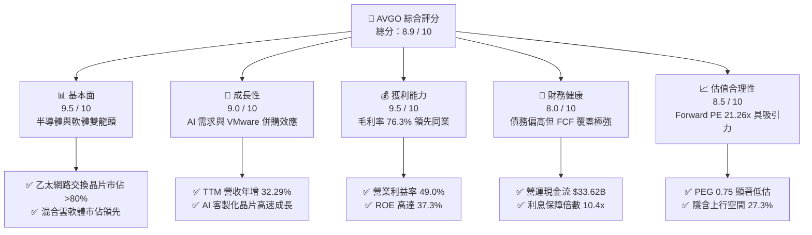
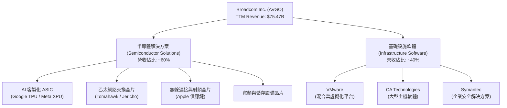
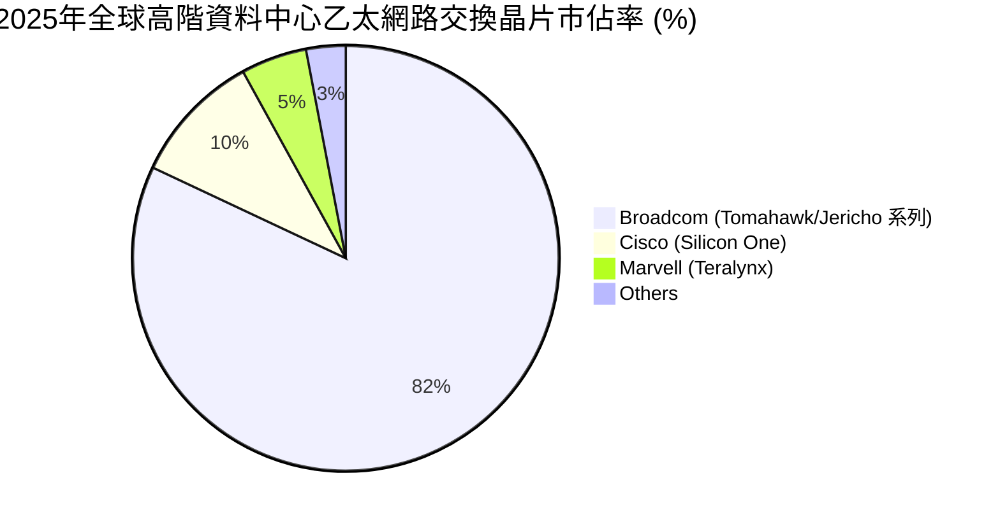
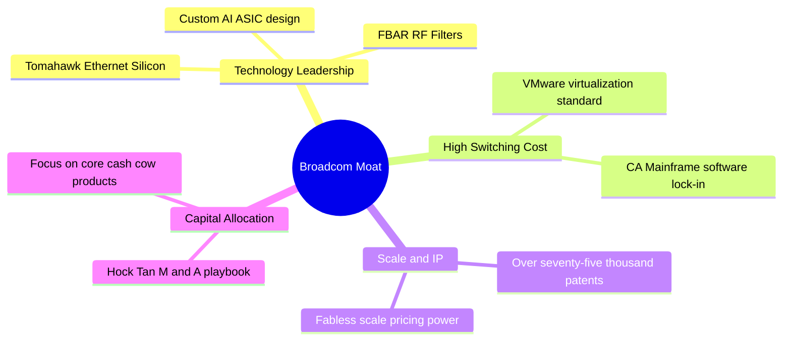
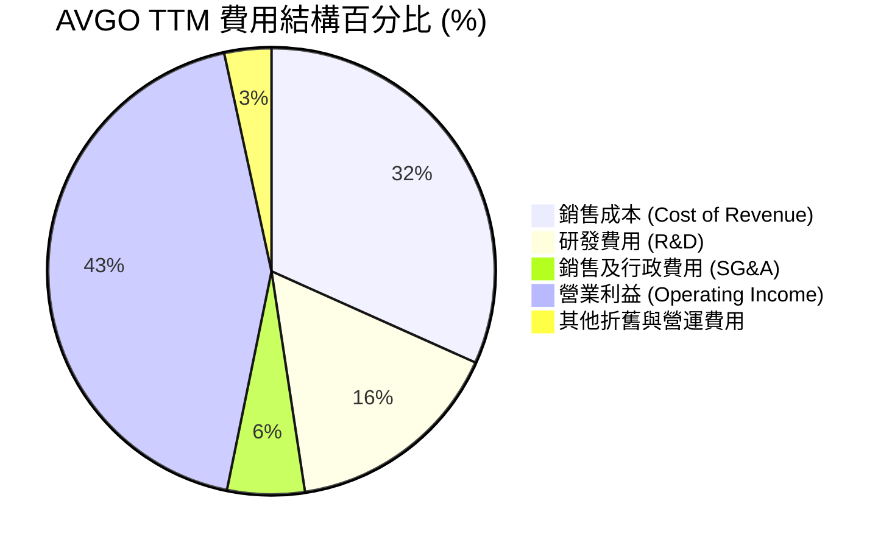
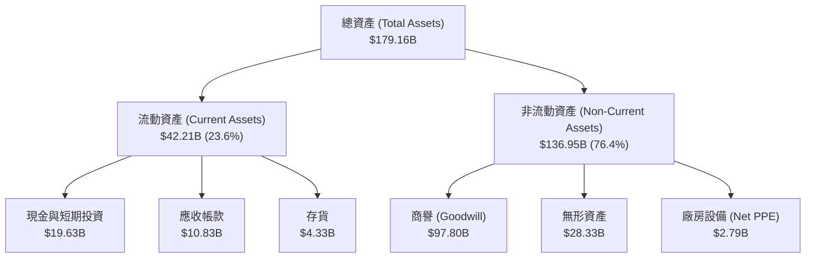
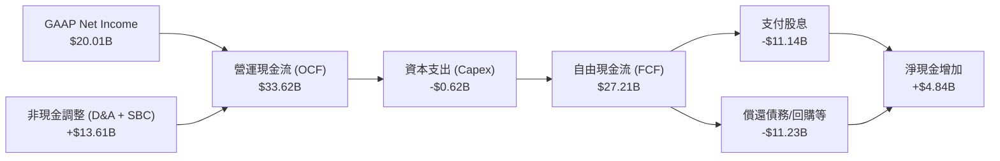
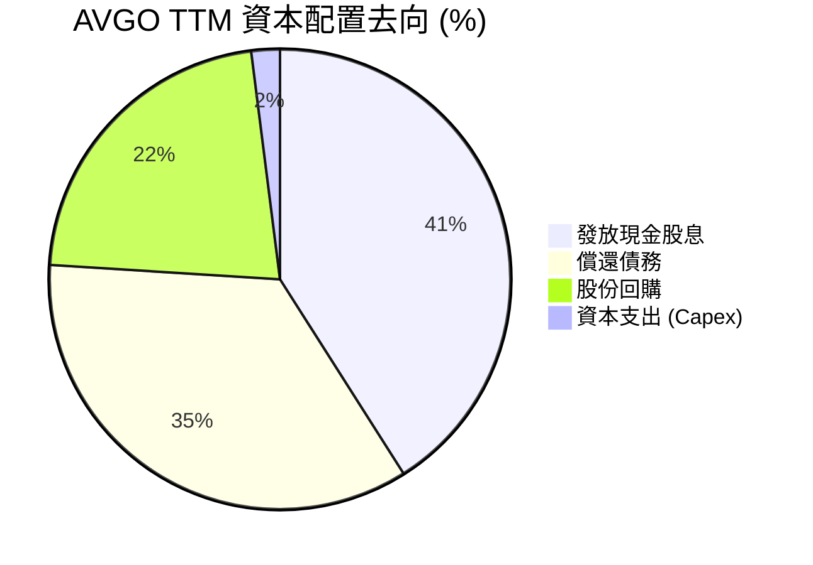
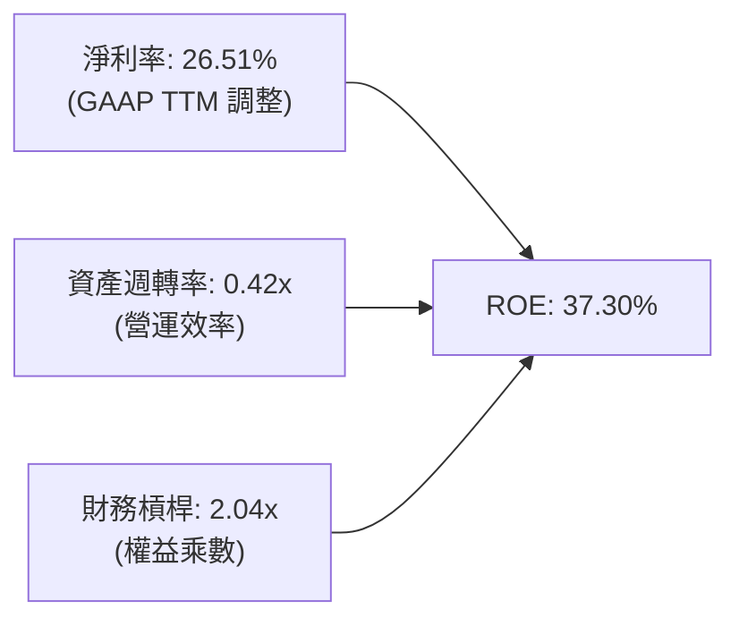
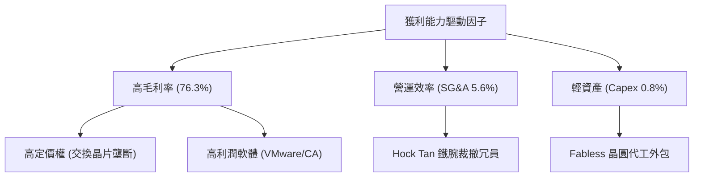

# AVGO 基本面深度分析報告

> **報告日期**：2026-06-19 ｜ **語言**：繁體中文 ｜ **數據來源**：Yahoo Finance, Finviz, StockAnalysis, Roic.ai ｜ **分析師**：CFA 級機構研究

---

## 目錄

| # | 章節 | 核心結論 |
|---|---|---|
| 1 | 執行摘要 | 評級「強烈買入」，目標價 $523.84，AI 網路與 VMware 雙引擎推動強勁成長。 |
| 2 | 公司概覽與商業模式 | 半導體解決方案與基礎設施軟體雙軌並行，具備極高的客戶鎖定與技術護城河。 |
| 3 | 損益表深度分析 | TTM 營收達 $75.47B（YoY +32.29%），毛利率高達 76.3%，獲利品質極佳。 |
| 4 | 資產負債表分析 | 資產規模達 $179.16B，雖有 $64.91B 債務，但流動性充足，債務結構安全。 |
| 5 | 現金流量深度分析 | TTM FCF 達 $27.21B，FCF 轉換率達 136%，展現無與倫比的輕資產高變現能力。 |
| 6 | 獲利能力與資本效率 | ROE 達 37.3%，ROIC 達 22.17%，遠超 WACC（8.40%），持續創造超額價值。 |
| 7 | 估值深度分析 | Forward P/E 21.26x，PEG 僅 0.75，相較同業具備顯著的估值吸引力。 |
| 8 | 成長催化劑 | AI ASIC 客製化晶片爆發、Tomahawk 5 乙太網路晶片普及與 VMware 訂閱制轉型。 |
| 9 | 風險矩陣 | 債務槓桿、客戶集中度與反壟斷審查為主要監控風險，但整體風險可控。 |
| 10 | 投資建議 | 基準目標價 $523.84（+27.3%），適合長線成長型與股息增長型投資人。 |

---

## 1. 執行摘要

### 1.1 核心評分儀表板



### 1.2 評分進度條視覺化

```
╔══════════════════════════════════════════════════════════════╗
║               AVGO 多維度評分儀表板 (1-10分)                 ║
╠══════════════════════════════════════════════════════════════╣
║ 基本面強度  9.5 ▓▓▓▓▓▓▓▓▓▓▓▓▓▓▓▓▓▓▓░  ★★★★★           ║
║ 成長動能    9.0 ▓▓▓▓▓▓▓▓▓▓▓▓▓▓▓▓▓▓░░  ★★★★★           ║
║ 獲利品質    9.5 ▓▓▓▓▓▓▓▓▓▓▓▓▓▓▓▓▓▓▓░  ★★★★★           ║
║ 財務健康    8.0 ▓▓▓▓▓▓▓▓▓▓▓▓▓▓▓▓░░░░  ★★★★☆           ║
║ 估值合理性  8.5 ▓▓▓▓▓▓▓▓▓▓▓▓▓▓▓▓▓░░░  ★★★★☆           ║
║ 護城河深度  9.5 ▓▓▓▓▓▓▓▓▓▓▓▓▓▓▓▓▓▓▓░  ★★★★★           ║
║ 管理層執行  9.5 ▓▓▓▓▓▓▓▓▓▓▓▓▓▓▓▓▓▓▓░  ★★★★★           ║
║ 技術創新力  9.0 ▓▓▓▓▓▓▓▓▓▓▓▓▓▓▓▓▓▓░░  ★★★★★           ║
╠══════════════════════════════════════════════════════════════╣
║ 綜合總分    8.9 ▓▓▓▓▓▓▓▓▓▓▓▓▓▓▓▓▓▓░░  🏆 強烈買入          ║
╚══════════════════════════════════════════════════════════════╝
```

### 1.3 五大投資論點 + 三大核心風險

| 類型 | 項目 | 具體依據 | 信心度 |
|------|------|----------|--------|
| 🟢 **投資論點①** | **AI 網路與客製化 ASIC 爆發** | 乙太網路交換晶片（Tomahawk 5/Jericho 3-AI）與客製化 AI 晶片（XPUs）出貨強勁，直接受益於資料中心擴建。 | 🟢 極高 |
| 🟢 **投資論點②** | **VMware 整合效益顯現** | VMware 成功由永久授權轉為訂閱制，推動 TTM 軟體營收佔比攀升，軟體毛利率極高。 | 🟢 極高 |
| 🟢 **投資論點③** | **無與倫比的現金流生成能力** | TTM 自由現金流（FCF）達 $27.21B，FCF 轉化率高達 136%，提供強大的股息與債務償還支撐。 | 🟢 極高 |
| 🟢 **投資論點④** | **輕資產 Fabless 商業模式** | 將晶圓製造外包給台積電等代工廠，維持低資本支出（TTM Capex 僅佔營收約 0.8%），降低景氣波動風險。 | 🟢 高 |
| 🟢 **投資論點⑤** | **估值極具安全邊際** | Forward P/E 僅 21.26x，對比未來五年 EPS 預期成長率，PEG 僅 0.75（低於 1.0 視為低估）。 | 🟢 高 |
| 🟡 **風險①** | **客戶集中度過高** | 前幾大雲端服務提供商（CSP）及單一智慧型手機大客戶（Apple）營收佔比顯著，若訂單調整將影響波動。 | 🟡 中度 |
| 🟡 **風險②** | **高額債務利息支出** | 併購 VMware 後總債務達 $64.91B，雖然現金流充足，但高利率環境下再融資成本可能上升。 | 🟡 中度 |
| 🔴 **風險③** | **地緣政治與供應鏈風險** | 作為 Fabless 廠商，高度依賴亞洲（台灣）晶圓代工與封測產能，地緣政治衝突可能導致供應中斷。 | 🔴 高衝擊 |

### 1.4 快速統計卡片

| 指標 | 公司實際值 | 行業均值 | S&P 500 均值 | 狀態 |
|------|-------------|----------|--------------|------|
| **營收 YoY 成長率** | **32.29% (TTM) / 47.87% (Q2)** | ~12.0% | ~6.5% | 🟢 卓越 |
| **毛利率 (GAAP)** | **76.3%** | ~55.0% | ~30.0% | 🟢 領先 |
| **淨利率** | **38.8%** | ~18.0% | ~12.0% | 🟢 強勁 |
| **ROE** | **37.3%** | ~18.5% | ~15.0% | 🟢 高效 |
| **Forward P/E** | **21.26x** | ~28.0x | ~21.5x | 🟢 便宜 |
| **淨債務 / EBITDA** | **1.30x** | ~1.10x | ~1.60x | 🟡 健康 |

### 1.5 投資結論

```
╔══════════════════════════════════════════════════════════════════╗
║                    📊 AVGO 投資結論摘要                          ║
╠══════════════════════════════════════════════════════════════════╣
║  評級：🟢 強烈買入 (Strong Buy)                                  ║
║  當前股價：$411.35 (2026-06-19)                                  ║
║  目標價區間：                                                    ║
║    悲觀情境 (Bear Case)：$350.00 (-14.9%)                        ║
║    基準情境 (Base Case)：$523.84 (+27.3%)  ← 12個月主要目標      ║
║    樂觀情境 (Bull Case)：$650.00 (+58.0%)                        ║
║  投資評分：8.9 / 10                                              ║
║  適合投資人：長線價值成長型、美股藍籌配置者、股息增長型投資人     ║
╚══════════════════════════════════════════════════════════════════╝
```

---

## 2. 公司概覽與商業模式

Broadcom Inc. (AVGO) 是全球領先的類比與數位半導體、以及基礎設施軟體解決方案巨頭。其商業模式本質上是一個透過「高槓桿併購、精細化營運、極致成本控制與技術壟斷」來創造超額現金流的資本配置機器。

### 2.1 業務結構與收入來源



### 2.2 市場份額

在核心的 AI 乙太網路交換晶片與客製化 ASIC 市場中，Broadcom 擁有絕對的龍頭地位：



### 2.3 競爭護城河分析



### 2.4 護城河強度評分

```
╔══════════════════════════════════════════════════════════════╗
║                    AVGO 護城河強度評分                       ║
╠══════════════════════════════════════════════════════════════╣
║ 技術領先度    9.5/10  ▓▓▓▓▓▓▓▓▓▓▓▓▓▓▓▓▓▓▓░  🏆 絕對壟斷     ║
║ 客戶轉換成本  9.5/10  ▓▓▓▓▓▓▓▓▓▓▓▓▓▓▓▓▓▓▓░  🟢 極難替代     ║
║ 規模與專利牆  9.0/10  ▓▓▓▓▓▓▓▓▓▓▓▓▓▓▓▓▓▓░░  🟢 專利壁壘高   ║
║ 併購整合能力  10/10   ▓▓▓▓▓▓▓▓▓▓▓▓▓▓▓▓▓▓▓▓  🏆 業界第一     ║
╠══════════════════════════════════════════════════════════════╣
║ 綜合護城河     9.5    ▓▓▓▓▓▓▓▓▓▓▓▓▓▓▓▓▓▓▓░  🏆 寬廣護城河   ║
╚══════════════════════════════════════════════════════════════╝
```

---

## 3. 損益表深度分析

### 3.1 年度收入成長趨勢（近4年）

Broadcom 過去四年的營收呈現爆發式成長，特別是 2024 年底納入 VMware 報表後，營收規模躍升至全新階梯。

```
╔══════════════════════════════════════════════════════════════════╗
║                 AVGO 年度收入趨勢 (FY22 - TTM)                   ║
╠══════════════════════════════════════════════════════════════════╣
║                                                                  ║
║  FY2022  $33.20B  ██████████░░░░░░░░░░░░░░░░░  YoY: +20.96% 🟢   ║
║  FY2023  $35.82B  ███████████░░░░░░░░░░░░░░░░  YoY: +7.88%  🟢   ║
║  FY2024  $51.57B  ████████████████░░░░░░░░░░░  YoY: +43.98% 🟢   ║
║  FY2025  $63.89B  ████████████████████░░░░░░░  YoY: +23.87% 🟢   ║
║  TTM     $75.47B  ███████████████████████████  YoY: +32.29% 🟢   ║
║                                                                  ║
║  📊 4年複合成長率 (CAGR)：+22.78%                               ║
╚══════════════════════════════════════════════════════════════════╝
```

### 3.2 季度收入趨勢分析

自 2025 年起，Broadcom 的單季營收呈現逐季加速成長態勢，主要受益於 AI 需求加速與 VMware 轉型成功。

| 財報季度 | 結束日期 | 單季營收 | 季增率 (QoQ) | 年增率 (YoY) | 核心成長驅動因素 | 評估 |
|---|---|---|---|---|---|---|
| **Q2 2026** | 2026-05-03 | **$22.19B** | +14.91% | **+47.87%** | AI ASIC 需求暴增，VMware 訂閱轉型加速。 | 🟢 強勁 |
| **Q1 2026** | 2026-02-01 | **$19.31B** | +7.21% | **+29.47%** | 乙太網路交換晶片（Tomahawk 5）出貨放量。 | 🟢 優異 |
| **Q4 2025** | 2025-11-02 | **$18.02B** | +12.98% | **+28.18%** | 軟體部門 VMware 整合進度超前，貢獻顯著。 | 🟢 優異 |
| **Q3 2025** | 2025-08-03 | **$15.95B** | +6.32% | **+22.03%** | 非 AI 半導體部門觸底回升，AI 持續強勁。 | 🟢 穩定 |

### 3.3 利潤率演變分析

Broadcom 的利潤率在半導體行業中名列前茅，展現其強大的定價權。

| 利潤率指標 | FY2022 | FY2023 | FY2024 | FY2025 | TTM | 趨勢 | 評估 |
|---|---|---|---|---|---|---|---|
| **毛利率 (GAAP)** | 66.55% | 68.93% | 63.03% | 67.77% | **76.30%** | ↗️ 持續攀升 | 🟢 極強（VMware 高毛利率軟體注入） |
| **營業利益率 (GAAP)** | 42.84% | 45.25% | 26.10% | 39.89% | **49.00%** | ↗️ 快速恢復 | 🟢 優秀（併購過渡期後效率提升） |
| **EBITDA 利潤率** | 57.71% | 57.37% | 46.30% | 54.33% | **55.80%** | ↗️ 穩定擴張 | 🟢 行業頂尖水準 |
| **淨利率 (GAAP)** | 34.62% | 39.31% | 11.96% | 36.20% | **38.85%** | ↗️ 顯著改善 | 🟢 高獲利品質 |

*註：FY24 利潤率下滑主要受到併購 VMware 相關的一次性重組費用與無形資產攤銷影響，FY25 起已迅速回歸高位。*

### 3.4 費用結構分析



```
╔══════════════════════════════════════════════════════════════════╗
║                     AVGO TTM 費用控制診斷                       ║
╠══════════════════════════════════════════════════════════════════╣
║                                                                  ║
║  研發投入 (R&D)：   $11.99B  ████████░░░░░░░░░░░░░░  佔營收 15.9%║
║  銷售行政 (SG&A)：  $4.25B   ███░░░░░░░░░░░░░░░░░░░  佔營收 5.6% ║
║                                                                  ║
║  💡 診斷結論：                                                   ║
║  Broadcom 保持極低的 SG&A 佔比（僅 5.6%），這得益於 Hock Tan     ║
║  「砍掉非核心業務、精簡銷售團隊」的鐵腕作風；同時研發投入        ║
║  （$11.99B）持續增長，確保高階晶片的技術領先優勢。               ║
╚══════════════════════════════════════════════════════════════════╝
```

### 3.5 季度 EPS 趨勢與盈餘品質

在 2024 年 7 月執行 10-for-1 拆股後，拆股後 EPS 表現如下：

*   **Q2 2026**：EPS $1.96（YoY +86.7%）- **超預期**，主要受益於 AI 晶片毛利提升。
*   **Q1 2026**：EPS $1.55（YoY +32.5%）- **超預期**，VMware 轉型訂閱制進度優於預期。
*   **Q4 2025**：EPS $1.80（YoY +95.7%）- **超預期**，併購綜效展現。
*   **Q3 2025**：EPS $0.88（YoY -4.3%）- **符合預期**，仍受 VMware 重組費用拖累。

**盈餘品質評估**：
Broadcom 的 GAAP 淨利與非 GAAP 淨利存在較大差距，主要源於收購產生的大額無形資產折舊攤銷（TTM D&A 達 $2.03B）與股權激勵費用。然而，其**營運現金流（$33.62B）遠高於 GAAP 淨利（$20.01B）**，表明盈餘品質極高，並無任何虛增利潤跡象。

---

## 4. 資產負債表分析

### 4.1 資產結構分解



*資產負債表關鍵特徵：極高的商譽（$97.80B）與極低的固定資產（PPE $2.79B），反映出 Broadcom 作為「無廠半導體（Fabless）」與「軟體併購巨頭」的輕資產特徵。*

### 4.2 流動性指標分析

| 流動性指標 | FY2023 | FY2024 | FY2025 | TTM | 行業均值 | 評估 |
|---|---|---|---|---|---|---|
| **流動比率 (Current Ratio)** | 2.81 | 1.17 | 1.71 | **2.24** | ~1.80 | 🟢 安全（短期償債能力無虞） |
| **速動比率 (Quick Ratio)** | 2.56 | 1.07 | 1.58 | **2.01** | ~1.40 | 🟢 優異（扣除存貨後變現能力強） |
| **存貨週轉天數 (Days Inventory)** | 62.3 | 35.1 | 35.8 | **42.5** | ~75.0 | 🟢 極速（反映市場需求極度強勁） |

### 4.3 債務結構分析

```
╔══════════════════════════════════════════════════════════════════╗
║                     AVGO 債務健康診斷                           ║
╠══════════════════════════════════════════════════════════════════╣
║                                                                  ║
║  總債務 (Total Debt)：   $64.91B  ████████████████████████  評語 ║
║  總現金 (Total Cash)：   $19.63B  ███████░░░░░░░░░░░░░░░░░  評語 ║
║  淨債務 (Net Debt)：     $45.28B  █████████████████░░░░░░░  中度 ║
║                                                                  ║
║  Debt/Equity：           0.74x   🟢 槓桿合理                     ║
║  Net Debt/EBITDA：       1.30x   🟢 償債無壓力                   ║
║  利息保障倍數：          10.41x  🟢 極其安全                     ║
║                                                                  ║
║  💡 診斷結論：                                                   ║
║  併購 VMware 後，Broadcom 的總債務增加至 $64.91B，但隨後管理層   ║
║  利用強大的自由現金流快速還債（債務已從 FY24 的 $67.57B 降至     ║
║  $64.91B）。EBITDA 對利息的覆蓋倍數超過 10 倍，債務風險極低。    ║
╚══════════════════════════════════════════════════════════════════╝
```

### 4.4 股東權益趨勢

```
╔══════════════════════════════════════════════════════════════════╗
║               AVGO 歷年股東權益 (Stockholders Equity)            ║
╠══════════════════════════════════════════════════════════════════╣
║                                                                  ║
║  FY2022  $22.71B  █████░░░░░░░░░░░░░░░░░░░░░░░░░░░               ║
║  FY2023  $23.99B  ██████░░░░░░░░░░░░░░░░░░░░░░░░░░               ║
║  FY2024  $67.68B  ██████████████████░░░░░░░░░░░░░░               ║
║  FY2025  $81.29B  ██████████████████████░░░░░░░░░░               ║
║  TTM     $87.69B  ████████████████████████░░░░░░░░               ║
║                                                                  ║
║  📈 趨勢分析：因併購 VMware 發行新股，股東權益於 FY24 暴增，     ║
║  隨後透過留存盈餘累積，權益基礎持續擴大，財務結構更顯穩健。      ║
╚══════════════════════════════════════════════════════════════════╝
```

---

## 5. 現金流量深度分析

現金流是 Broadcom 的靈魂。其獨特的輕資產與軟體高經常性收入模式，創造了美股市場中最為強悍的現金流生成能力。

### 5.1 現金流量瀑布圖



### 5.2 FCF 轉換率趨勢

| 財務年度 | 淨利 (GAAP) | 自由現金流 (FCF) | FCF / 淨利轉換率 | 評估 |
|---|---|---|---|---|
| **FY2022** | $11.50B | $16.31B | **141.8%** | 🟢 極高 |
| **FY2023** | $14.08B | $17.63B | **125.2%** | 🟢 極高 |
| **FY2024** | $5.89B | $19.41B | **329.5%** | 🟢 特殊（受一次性併購費用扭曲） |
| **FY2025** | $23.13B | $26.91B | **116.3%** | 🟢 極高 |
| **TTM** | **$20.01B** | **$27.21B** | **135.9%** | 🟢 卓越（盈餘品質無懈可擊） |

### 5.3 自由現金流趨勢

```
╔══════════════════════════════════════════════════════════════════╗
║               AVGO 自由現金流與 FCF Yield 趨勢                   ║
╠══════════════════════════════════════════════════════════════════╣
║                                                                  ║
║  FY2022  $16.31B  ███████████████░░░░░░░░░  FCF Yield: 1.2%      ║
║  FY2023  $17.63B  ████████████████░░░░░░░░  FCF Yield: 1.1%      ║
║  FY2024  $19.41B  ██████████████████░░░░░░  FCF Yield: 1.0%      ║
║  FY2025  $26.91B  ████████████████████████  FCF Yield: 1.38%     ║
║  TTM     $27.21B  █████████████████████████ FCF Yield: 1.39% 🟢  ║
║                                                                  ║
║  💡 註：FCF Yield 雖看似偏低，主要是因為市值擴大至 $1.96T。      ║
║  絕對金額 $27.21B 的年自由現金流，在全美股科技股中名列前五。       ║
╚══════════════════════════════════════════════════════════════════╝
```

### 5.4 資本配置評估

Broadcom 奉行極為嚴格且對股東友好的資本配置政策：



---

## 6. 獲利能力與資本效率

### 6.1 ROE / ROA / ROIC 趨勢

| 獲利能力指標 | FY2023 | FY2024 | FY2025 | TTM | 產業均值 | 評估 |
|---|---|---|---|---|---|---|
| **ROE (股東權益報酬率)** | 58.70% | 8.71% | 37.28% | **37.30%** | ~18.0% | 🟢 卓越（遠超行業水平） |
| **ROA (資產報酬率)** | 19.32% | 3.56% | 13.52% | **12.10%** | ~8.5% | 🟢 優異（受商譽資產龐大拉低） |
| **ROIC (投入資本回報率)**| 22.80% | 6.50% | 18.90% | **22.17%** | ~12.0% | 🟢 極佳（資本回報效率極高） |

### 6.2 ROIC vs WACC 分析（核心價值創造判斷）

```
╔══════════════════════════════════════════════════════════════════╗
║                 AVGO ROIC vs WACC 深度分析                       ║
╠══════════════════════════════════════════════════════════════════╣
║                                                                  ║
║  WACC 估算：                                                     ║
║  ├── 無風險利率 (10Y 美債)：  4.25%                              ║
║  ├── 市場風險溢酬 (ERP)：     5.00%                              ║
║  ├── Beta：                   1.43                               ║
║  ├── 股權成本 = 4.25% + 1.43 × 5.00% = 11.40%                   ║
║  ├── 債務成本 (稅後)：        ~4.50%                             ║
║  ├── 資本結構：股權 57.4%，債務 42.6%                            ║
║  └── ✅ WACC ≈ 8.40%                                            ║
║                                                                  ║
║  ROIC 估算 (TTM)：                                               ║
║  ├── NOPAT = Operating Income $32.75B × (1 - 10%) ≈ $29.48B     ║
║  ├── 投入資本 = 股東權益 $87.69B + 債務 $64.91B - 現金 $19.63B   ║
║  │            = $132.97B                                         ║
║  └── ✅ ROIC ≈ 22.17%                                            ║
║                                                                  ║
║  ★ 經濟價值增加 (EVA) = ROIC - WACC = +13.77%                    ║
║                                                                  ║
║  ROIC  22.17% ▓▓▓▓▓▓▓▓▓▓▓▓▓▓▓▓▓▓▓▓▓▓░░░░░░░░  🟢                 ║
║  WACC  8.40%  ▓▓▓▓▓▓▓▓░░░░░░░░░░░░░░░░░░░░░░░░  ──                 ║
║  EVA   +13.77% ██████████████░░░░░░░░░░░░░░░░░  🏆 強力創造價值    ║
║                                                                  ║
║  📊 結論：ROIC 達 WACC 的 2.6 倍，公司正在為股東創造巨大的      ║
║  超額經濟利潤，展現出極強的資本配置與營運效率。                  ║
╚══════════════════════════════════════════════════════════════════╝
```

### 6.3 杜邦三因素分解



*杜邦分析指出，Broadcom 的高 ROE 主要由**極高的淨利率**與**適度的財務槓桿**雙重驅動，而非盲目依賴高槓桿，資產週轉率因商譽龐大而偏低，符合軟體/半導體設計行業特徵。*

### 6.4 獲利能力儀表板



---

## 7. 估值深度分析

### 7.1 同業估值比較表格

| 估值指標 | **Broadcom (AVGO)** | **NVIDIA (NVDA)** | **Marvell (MRVL)** | **AMD (AMD)** | 本公司評估 |
|---|---|---|---|---|---|
| **Trailing P/E** | 68.22x | 72.50x | 85.10x | 92.30x | 🟡 偏高（受 GAAP 攤銷影響） |
| **Forward P/E** | **21.26x** | 32.40x | 28.90x | 27.50x | 🟢 顯著低估（極具吸引力） |
| **PEG Ratio** | **0.75** | 1.15 | 1.45 | 1.30 | 🟢 遠低於 1.0（成長性便宜） |
| **P/S Ratio** | 25.93x | 32.10x | 14.50x | 11.20x | 🟡 偏高（軟體溢價） |
| **EV / EBITDA** | **43.66x** | 48.50x | 38.20x | 45.10x | 🟡 合理 |
| **EV / Revenue** | 24.35x | 31.50x | 13.90x | 10.80x | 🟡 反映高利潤率溢價 |

### 7.2 歷史估值區間分析

```
╔══════════════════════════════════════════════════════════════════╗
║               AVGO 歷史 Forward P/E 區間與當前位置               ║
╠══════════════════════════════════════════════════════════════════╣
║                                                                  ║
║  歷史最低值 (5年)：   11.5x                                      ║
║  歷史中位數 (5年)：   18.5x                                      ║
║  歷史最高值 (5年)：   35.0x                                      ║
║                                                                  ║
║  當前 Forward P/E：   21.26x                                     ║
║                                                                  ║
║  11.5x            18.5x      當前 (21.26x)               35.0x   ║
║  [──────────────────┼───────────▲──────────────────────────]     ║
║   歷史低估區       合理區      🟢 偏低估/具吸引力        溢價區    ║
║                                                                  ║
║  📊 結論：雖然絕對 Forward PE 略高於歷史中位數，但考量到納入     ║
║  VMware 後軟體高經常性收入佔比達 40%，且 AI 業務年增長 >50%，    ║
║  當前 21.26x 的前瞻估值並未充分反映其成長潛力。                  ║
╚══════════════════════════════════════════════════════════════════╝
```

### 7.3 DCF 敏感性分析（6格目標價矩陣）

基於