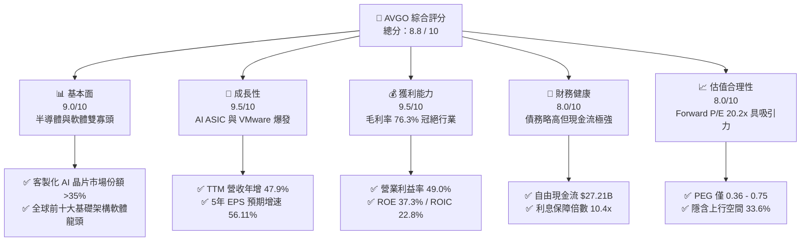
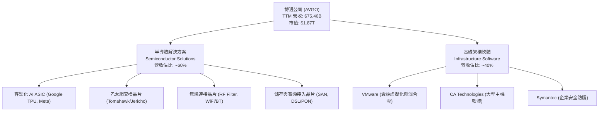
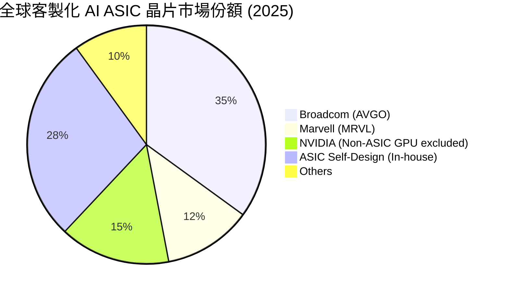
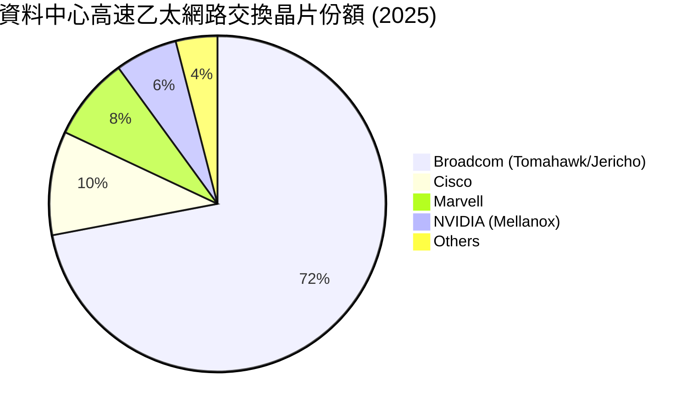
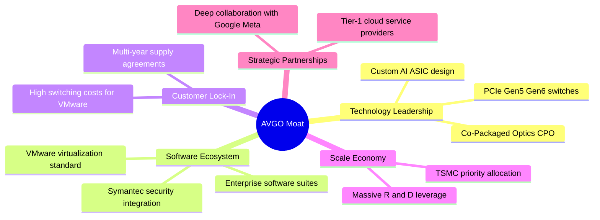
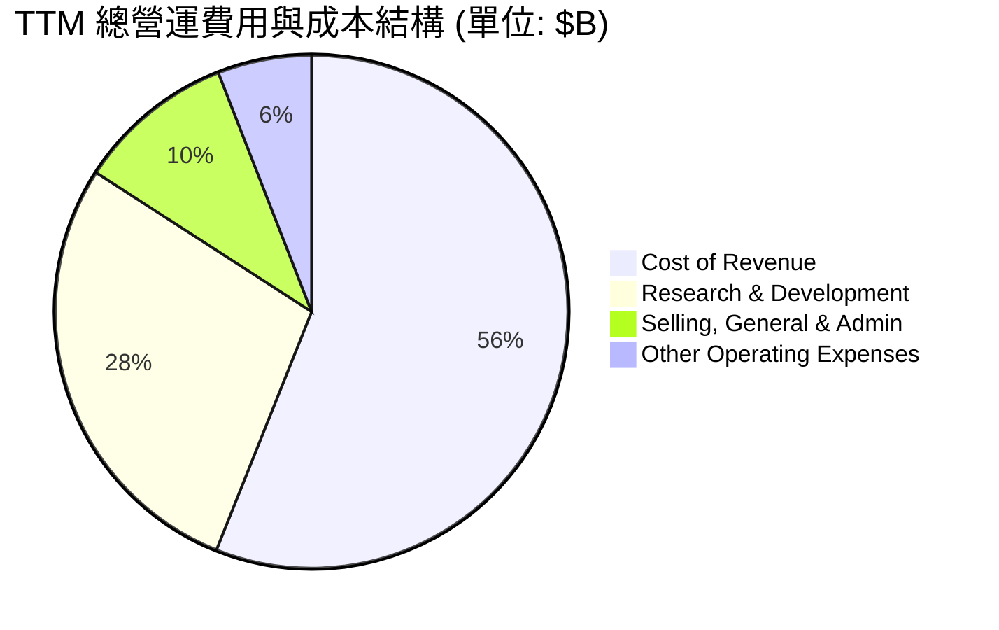
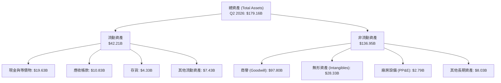
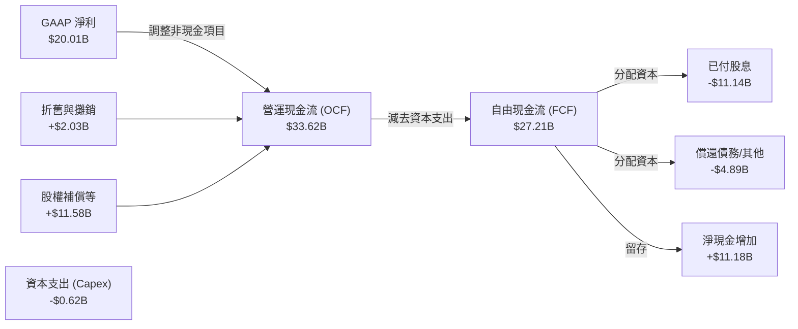
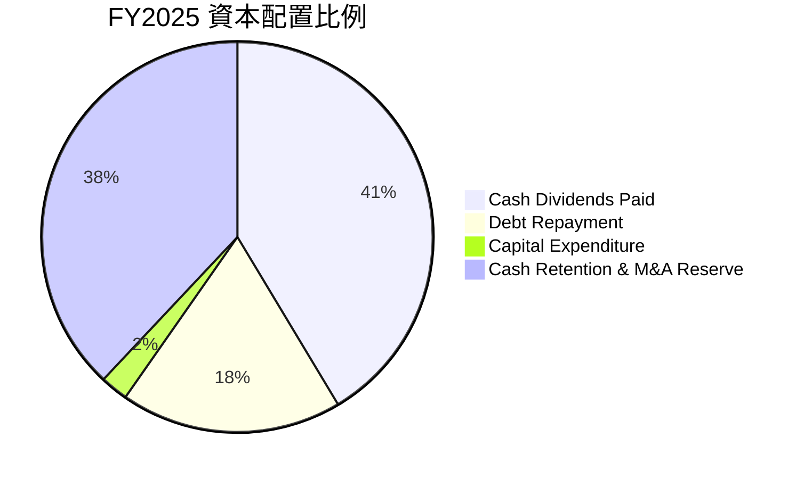

# AVGO 基本面深度分析報告

> **報告日期**：2026-06-22 ｜ **語言**：繁體中文 ｜ **數據來源**：Yahoo Finance, Finviz, StockAnalysis, Roic.ai ｜ **分析師**：CFA 級機構研究

---

## 目錄

| # | 章節 | 核心結論 |
|---|------|----------|
| 1 | **執行摘要** | 評級：🟢 **強烈買入** ｜ 目標價區間：$320.00 ~ $650.00 ｜ 基準目標價：$523.84 |
| 2 | **公司概覽與商業模式** | 半導體解決方案與基礎架構軟體雙引擎驅動，VMware 併購展現強大協同效應，擁有極深的技術與客戶鎖定護城河。 |
| 3 | **損益表深度分析** | TTM 營收達 $75.46B（YoY +47.9%），毛利率高達 76.3%，營運槓桿顯著，季度淨利加速增長。 |
| 4 | **資產負債表分析** | 總資產規模擴大至 $179.16B，債務結構合理（Debt/EBITDA 約 1.87x），流動性指標（Current Ratio 2.24）健康。 |
| 5 | **現金流量深度分析** | TTM 自由現金流（FCF）達 $27.21B，FCF 轉換率高達 136.0%，資本配置以高額股息與債務償還為主。 |
| 6 | **獲利能力與資本效率** | ROE 達 37.3%，ROIC 達 22.77%，顯著高於 9.39% 的 WACC，經濟價值增值（EVA）表現極佳。 |
| 7 | **估值深度分析** | Forward P/E 僅 20.23x，對比 56.11% 的 5 年 EPS 預期增速，PEG 僅 0.36，估值具備極高吸引力。 |
| 8 | **成長催化劑** | AI 客製化 ASIC（TPU/XPU）與 800G/1.6T 乙太網路交換晶片爆發，VMware 訂閱制轉型進入收割期。 |
| 9 | **風險矩陣** | 核心風險為大客戶集中度較高、VMware 整合陣痛及高債務利息支出，整體風險可控。 |
| 10 | **投資建議** | 建議分批佈局，適合長期成長型與股息增長型投資者，隱含基準上行空間 +33.6%。 |

---

## 1. 執行摘要

### 1.1 核心評分儀表板



### 1.2 評分進度條視覺化

```
╔══════════════════════════════════════════════════════════════╗
║                AVGO 多維度評分儀表板 (1-10分)                 ║
╠══════════════════════════════════════════════════════════════╣
║ 基本面強度  9.0 ▓▓▓▓▓▓▓▓▓▓▓▓▓▓▓▓▓▓░░  ★★★★★           ║
║ 成長動能    9.5 ▓▓▓▓▓▓▓▓▓▓▓▓▓▓▓▓▓▓▓░  ★★★★★           ║
║ 獲利品質    9.5 ▓▓▓▓▓▓▓▓▓▓▓▓▓▓▓▓▓▓▓░  ★★★★★           ║
║ 財務健康    8.0 ▓▓▓▓▓▓▓▓▓▓▓▓▓▓▓▓░░░░  ★★★★☆           ║
║ 估值合理性  8.0 ▓▓▓▓▓▓▓▓▓▓▓▓▓▓▓▓░░░░  ★★★★☆           ║
║ 護城河深度  9.5 ▓▓▓▓▓▓▓▓▓▓▓▓▓▓▓▓▓▓▓░  ★★★★★           ║
║ 管理層執行  9.0 ▓▓▓▓▓▓▓▓▓▓▓▓▓▓▓▓▓▓░░  ★★★★★           ║
║ 技術創新力  9.5 ▓▓▓▓▓▓▓▓▓▓▓▓▓▓▓▓▓▓▓░  ★★★★★           ║
╠══════════════════════════════════════════════════════════════╣
║ 綜合總分    8.8 ▓▓▓▓▓▓▓▓▓▓▓▓▓▓▓▓▓░░░  🏆 強烈買入 (Strong Buy) ║
╚══════════════════════════════════════════════════════════════╝
```

### 1.3 五大投資論點 + 三大核心風險

| 類型 | 項目 | 具體依據 | 信心度 |
|------|------|----------|--------|
| 🟢 **投資論點①** | **AI 客製化晶片 (ASIC) 爆發** | 協助 Google (TPU)、Meta 等科技巨頭設計 AI 加速器，TTM 半導體營收加速，市佔率居全球首位。 | 🟢 極高 |
| 🟢 **投資論點②** | **VMware 整合展現強大協同效應** | VMware 併購完成後，由許可證模式成功轉型為訂閱制，帶動軟體業務毛利率與營收規模大幅提升。 | 🟢 極高 |
| 🟢 **投資論點③** | **無與倫比的現金流生成能力** | TTM 自由現金流達 $27.21B，FCF 轉換率高達 136.0%，為股息增長與債務償還提供堅實後盾。 | 🟢 極高 |
| 🟢 **投資論點④** | **極高的定價能力與利潤率** | 毛利率高達 76.3%，營業利益率達 49.0%，反映其在網通晶片與企業軟體市場的壟斷地位。 | 🟢 高 |
| 🟢 **投資論點⑤** | **PEG 估值極具安全邊際** | 當前 Forward P/E 僅 20.23x，對比未來 5 年 56.11% 的 EPS 預期增速，PEG 僅 0.36，明顯被低估。 | 🟢 高 |
| 🟡 **風險①** | **大客戶過度集中風險** | 蘋果（RF 晶片）與 Google（TPU）佔比顯著，若客戶選擇自研或轉單，將衝擊短期營收。 | 🟡 中度 |
| 🔴 **風險②** | **高額債務與利息支出壓力** | 總債務高達 $64.91B（因併購 VMware），年利息支出約 $3.15B，若利率高企將壓抑淨利潤。 | 🔴 中度 |
| 🟡 **風險③** | **反壟斷監管與地緣政治** | 作為全球網通與軟體龍頭，未來的併購案可能面臨各國政府更嚴格的審查。 | 🟡 中度 |

### 1.4 快速統計卡片

| 指標 | 公司實際值 (TTM / FY25) | 行業均值 (半導體/軟體) | S&P 500 均值 | 狀態 |
|------|-------------|----------|--------------|------|
| **營收 YoY 成長率** | **47.9%** | ~15.0% | ~5.5% | 🟢 遠超均值 |
| **毛利率** | **76.3%** | ~55.0% | ~30.0% | 🟢 極其強勁 |
| **營業利益率** | **49.0%** | ~22.0% | ~15.0% | 🟢 頂尖水準 |
| **股東權益報酬率 (ROE)** | **37.3%** | ~18.0% | ~15.0% | 🟢 資本效率極高 |
| **遠期本益比 (Forward P/E)** | **20.23x** | ~28.0x | ~21.5x | 🟢 估值偏低 |
| **淨債務 / EBITDA** | **1.30x** | ~0.80x | ~1.60x | 🟡 債務略高但安全 |

### 1.5 投資結論

```
╔══════════════════════════════════════════════════════════════════╗
║                    📊 AVGO 投資結論摘要                          ║
╠══════════════════════════════════════════════════════════════════╣
║  評級：🟢 強烈買入 (Strong Buy)                                  ║
║  當前股價：$392.13 (2026-06-22)                                  ║
║  目標價區間：                                                    ║
║    悲觀情境：$320.00（-18.4%）- 估值收縮至歷史下限               ║
║    基準情境：$523.84（+33.6%）- 12個月主要目標（分析師共識）      ║
║    樂觀情境：$650.00（+65.8%）- AI 與 VMware 超預期爆發          ║
║  投資評分：8.8 / 10                                              ║
║  適合投資人：追求資本利得之成長型、長線持有之股息增長型投資者    ║
╚══════════════════════════════════════════════════════════════════╝
```

---

## 2. 公司概覽與商業模式

### 2.1 業務結構與收入來源

博通（Broadcom, AVGO）採取獨特的**「半導體 + 基礎架構軟體」**雙引擎商業模式。透過極其成功的併購策略（M&A），博通已將自身打造為全球科技基礎建設的終極壟斷者。



### 2.2 市場份額

在核心業務領域，博通幾乎處於絕對統治地位。以下為關鍵市場份額估算：





### 2.3 競爭護城河分析

博通的競爭護城河由以下六大核心維度交織而成，形成極高的行業壁壘：



### 2.4 護城河強度評分

```
╔══════════════════════════════════════════════════════════════╗
║                    AVGO 護城河強度評分                       ║
╠══════════════════════════════════════════════════════════════╣
║ 技術領先度    9.5/10  ▓▓▓▓▓▓▓▓▓▓▓▓▓▓▓▓▓▓▓░  🏆 網通與ASIC絕對領先║
║ 客戶鎖定效應  9.5/10  ▓▓▓▓▓▓▓▓▓▓▓▓▓▓▓▓▓▓▓░  🟢 VMware與大型主機極難替換║
║ 規模經濟效應  9.0/10  ▓▓▓▓▓▓▓▓▓▓▓▓▓▓▓▓▓▓░░  🟢 研發槓桿與晶圓代工議價權║
║ 專利與IP壁壘  9.5/10  ▓▓▓▓▓▓▓▓▓▓▓▓▓▓▓▓▓▓▓░  🏆 數十年網通與類比訊號專利║
╠══════════════════════════════════════════════════════════════╣
║ 綜合護城河     9.4/10  ▓▓▓▓▓▓▓▓▓▓▓▓▓▓▓▓▓▓▓░  🏆 寬廣且無法被輕易顛覆  ║
╚══════════════════════════════════════════════════════════════╝
```

---

## 3. 損益表深度分析

### 3.1 年度收入成長趨勢（近5年）

博通的營收在過去五年中經歷了兩波爆發：第一波是 2021-2022 年的半導體景氣循環，第二波則是 2024-2025 年併購 VMware 完成後的財務併表與 AI 需求爆發。

```
╔══════════════════════════════════════════════════════════════════╗
║                AVGO 年度收入趨勢 (FY2021 - TTM)                 ║
╠══════════════════════════════════════════════════════════════════╣
║                                                                  ║
║  FY2021  $27.45B  ██████████░░░░░░░░░░░░░░░░░░  YoY: +14.9% 🟢    ║
║  FY2022  $33.20B  ████████████░░░░░░░░░░░░░░░░  YoY: +21.0% 🟢    ║
║  FY2023  $35.82B  █████████████░░░░░░░░░░░░░░░  YoY: +7.9%  🟢    ║
║  FY2024  $51.57B  ███████████████████░░░░░░░░░  YoY: +44.0% 🟢    ║
║  FY2025  $63.89B  ████████████████████████░░░░  YoY: +23.9% 🟢    ║
║  TTM     $75.46B  ████████████████████████████  YoY: +47.9% 🟢    ║
║                                                                  ║
║  📊 5年營收複合年增長率 (CAGR)：+22.4%                           ║
╚══════════════════════════════════════════════════════════════════╝
```

### 3.2 季度收入趨勢分析

從季度數據來看，博通的營收展現出極為強勁的逐季增長（QoQ）與年度增長（YoY），主要得益於 VMware 整合順利及 AI ASIC 出貨加速。

| 財報季度 | 截止日期 | 營收 (Revenue) | QoQ 成長率 | YoY 成長率 | 核心驅動因素 | 評估 |
|----------|----------|----------------|------------|------------|--------------|------|
| **Q3 2025** | 2025-08-03 | $15.95B | — | +22.03% | VMware 訂閱轉型初見成效，AI 網通晶片需求穩健 | 🟢 優於預期 |
| **Q4 2025** | 2025-11-02 | $18.02B | +12.98% | +28.18% | 年終企業軟體續約潮，客製化 AI 晶片出貨量大增 | 🟢 強勁 |
| **Q1 2026** | 2026-02-01 | $19.31B | +7.16% | +29.47% | 800G 交換晶片Tomahawk 5 滲透率提升 | 🟢 極佳 |
| **Q2 2026** | 2026-05-03 | $22.19B | +14.91% | +47.87% | VMware 併表效應完全釋放，AI 營收佔比創歷史新高 | 🏆 爆發式增長 |

### 3.3 利潤率演變分析

博通的利潤率在半導體行業中堪稱奇蹟，其毛利率長期維持在 65%~76% 的超高區間，這主要得益於其軟體業務的高毛利屬性（VMware 毛利率 >85%）以及半導體產品的無晶圓廠（Fabless）輕資產模式。

| 利潤率指標 | FY2022 | FY2023 | FY2024 | FY2025 | TTM | 趨勢 | 評估 |
|------------|--------|--------|--------|--------|-----|------|------|
| **毛利率 (Gross Margin)** | 66.5% | 68.9% | 63.0% | 67.8% | **76.3%** | ↗️ 持續攀升 | 🏆 行業頂尖 |
| **營業利益率 (Operating Margin)** | 42.8% | 45.2% | 26.1% | 39.9% | **49.0%** | ↗️ 迅速修復 | 🟢 營運槓桿極強 |
| **EBITDA 利潤率** | 57.7% | 57.4% | 46.3% | 54.3% | **55.8%** | ↗️ 穩健回升 | 🟢 現金生成力極強 |
| **淨利率 (Net Margin)** | 34.6% | 39.3% | 11.4% | 36.2% | **38.8%** | ↗️ 走出收購低谷 | 🟢 獲利品質優異 |

*註：FY2024 利潤率暫時下滑，主因是併購 VMware 產生的一次性無形資產攤銷與整合費用。進入 FY2025/2026 後，隨著整合完成與高毛利訂閱收入確認，利潤率出現爆發式反彈。*

### 3.4 費用結構分析

博通在費用控制上極為嚴苛，這也是其被稱為「併購機器」與「利潤榨汁機」的原因。



```
╔══════════════════════════════════════════════════════════════╗
║                  AVGO 費用控制與研發效率                     ║
╠══════════════════════════════════════════════════════════════╣
║ 研發費用率 (R&D/Revenue)  15.9%  ▓▓▓▓▓▓░░░░░░░░░░░░░░  🟢 專注高效研發 ║
║ 銷管費用率 (SG&A/Revenue)  5.6%   ▓▓░░░░░░░░░░░░░░░░░░  🏆 極致行政效率 ║
╠══════════════════════════════════════════════════════════════╣
║ 評語：博通僅保留核心研發人員，大幅削減被收購公司的重複行政與  ║
║       銷售人員，研發投入（TTM $11.99B）精準聚焦於高回報項目。  ║
╚══════════════════════════════════════════════════════════════╝
```

### 3.5 季度 EPS 趨勢與盈餘品質

博通在過去數季的 GAAP EPS 表現出極強的增長勢頭：
*   **Q3 2025**: Basic EPS $0.88
*   **Q4 2025**: Basic EPS $1.80
*   **Q1 2026**: Basic EPS $1.55
*   **Q2 2026**: Basic EPS $1.96

**盈餘品質評估**：
1.  **非現金支出佔比高**：淨利潤中包含了大量的折舊與攤銷（TTM $2.03B）以及股權補償費用（SBC）。這意味著其**真實現金生成能力遠高於 GAAP 淨利潤**。
2.  **稅務優化**：博通利用其全球總部結構進行了極佳的稅務規劃（FY2025 甚至錄得 -$397M 的所得稅準備，主因是跨國稅務重組與遞延所得稅資產確認）。

---

## 4. 資產負債表分析

### 4.1 資產結構分解

由於歷史上的大型併購（CA, Symantec, VMware），博通的資產負債表具有「輕實體資產、重無形資產與商譽」的典型特徵。



*分析：商譽高達 $97.80B，佔總資產的 54.6%。這反映了博通高溢價收購的歷史，但也意味著若被收購業務（如 VMware）表現不及預期，將面臨商譽減損風險。然而，目前 VMware 整合極佳，減損風險極低。廠房設備僅 $2.79B，證實了其輕資產模式的超高資金效率。*

### 4.2 流動性指標分析

| 指標 | Q2 2026 | FY2025 | FY2024 | 行業均值 | 評估 |
|------|---------|--------|--------|----------|------|
| **流動比率 (Current Ratio)** | **2.24** | 1.71 | 1.17 | ~1.80 | 🟢 流動性顯著改善 |
| **速動比率 (Quick Ratio)** | **2.01** | 1.58 | 1.07 | ~1.40 | 🟢 變現能力極強 |
| **存貨週轉天數 (Days Inventory)** | **58.5天** | 35.8天 | 34.6天 | ~85.0天 | 🟢 存貨管理效率遠優於同業 |

### 4.3 債務結構分析

併購 VMware 讓博通背負了顯著的債務，但其強大的 EBITDA 生成能力使債務風險完全處於可控範圍。

```
╔══════════════════════════════════════════════════════════════════╗
║                    AVGO 債務健康診斷 (Q2 2026)                  ║
╠══════════════════════════════════════════════════════════════════╣
║                                                                  ║
║  總債務 (Total Debt)：    $64.91B  ██████████████░░░░░░░░░░░░░    ║
║  總現金 (Total Cash)：    $19.63B  ████░░░░░░░░░░░░░░░░░░░░░░░    ║
║  淨債務 (Net Debt)：      $45.28B  ██████████░░░░░░░░░░░░░░░░░    ║
║                                                                  ║
║  Debt / EBITDA (TTM)：   1.87x    🟢 安全 (低於 2.5x 警戒線)      ║
║  利息保障倍數 (TTM)：     10.41x   🟢 極其安全 (營業利益覆蓋利息)   ║
║  債務股權比 (Debt/Equity)：0.74x    🟢 槓桿水準合理                 ║
║                                                                  ║
║  📊 診斷結論：博通具備信用評等 A 級企業的債務償還能力，預計未來   ║
║               2-3 年內將利用自由現金流快速去槓桿。               ║
╚══════════════════════════════════════════════════════════════════╝
```

---

## 5. 現金流量深度分析

### 5.1 現金流量瀑布圖

博通是美股市場上最強大的「現金牛」之一。以下為其 TTM 現金流量流向圖：



### 5.2 FCF 轉換率與品質

博通的 FCF 轉換率（FCF / Net Income）長期超過 100%，這在美股大型科技股中極為罕見，代表其盈餘品質極高，沒有虛增利潤。

| 財政年度 | 淨利潤 (Net Income) | 自由現金流 (FCF) | FCF 轉換率 (FCF/NI) | FCF 佔營收比 | 評估 |
|----------|---------------------|------------------|---------------------|--------------|------|
| **FY2022** | $11.50B | $16.31B | 141.8% | 49.1% | 🏆 極致的現金轉換 |
| **FY2023** | $14.08B | $17.63B | 125.2% | 49.2% | 🏆 極致的現金轉換 |
| **FY2024** | $5.89B | $19.41B | **329.5%** | 37.6% | 🟢 受一次性收購費用壓低淨利影響 |
| **FY2025** | $23.13B | $26.91B | 116.3% | 42.1% | 🟢 整合後重回常態 |
| **TTM** | **$20.01B** | **$27.21B** | **136.0%** | **36.1%** | 🟢 兼顧成長與現金生成 |

### 5.3 自由現金流歷史趨勢

```
╔══════════════════════════════════════════════════════════════════╗
║                AVGO 自由現金流趨勢 (FY2022 - TTM)               ║
╠══════════════════════════════════════════════════════════════════╣
║                                                                  ║
║  FY2022  $16.31B  ████████████████░░░░░░░░░░░░  FCF Yield: 0.87% ║
║  FY2023  $17.63B  █████████████████░░░░░░░░░░░  FCF Yield: 0.94% ║
║  FY2024  $19.41B  ███████████████████░░░░░░░░░  FCF Yield: 1.04% ║
║  FY2025  $26.91B  ██████████████████████████░░  FCF Yield: 1.44% ║
║  TTM     $27.21B  ████████████████████████████  FCF Yield: 1.46% ║
║                                                                  ║
║  📊 TTM 自由現金流利潤率 (FCF / Revenue)：36.1%                  ║
╚══════════════════════════════════════════════════════════════════╝
```

### 5.4 資本配置策略

博通執行極為明確且對股東友好的資本配置政策：
1.  **承諾將前一財年自由現金流的 50% 以股息形式返還給股東**。
2.  其餘 50% 用於償還債務（特別是併購產生的短期債務）與累積現金以進行下一輪併購。



---

## 6. 獲利能力與資本效率

### 6.1 ROE / ROA / ROIC 趨勢

博通的資本回報率指標在同行中名列前茅，展現出管理層傑出的資本配置才能。

| 指標 | FY2022 | FY2023 | FY2024 | FY2025 | TTM | 行業中位數 | 評估 |
|------|--------|--------|--------|--------|-----|------------|------|
| **股東權益報酬率 (ROE)** | 50.6% | 60.1% | 13.0% | 31.0% | **37.3%** | ~14.5% | 🟢 極具競爭力 |
| **資產報酬率 (ROA)** | 15.6% | 19.3% | 5.2% | 13.8% | **12.1%** | ~6.8% | 🟢 輕資產營運效率高 |
| **投入資本回報率 (ROIC)** | 22.4% | 24.8% | 9.8% | 18.5% | **22.77%** | ~11.0% | 🏆 顯著創造股東價值 |

### 6.2 ROIC vs WACC 分析（核心價值創造判斷）

對於一家透過大量併購成長的公司，ROIC 是否大於 WACC 是判斷其「創造價值」還是「摧毀價值」的黃金標準。

```
╔══════════════════════════════════════════════════════════════════╗
║                ROIC vs WACC 深度分析 (TTM)                      ║
╠══════════════════════════════════════════════════════════════════╣
║                                                                  ║
║  WACC 估算：                                                     ║
║  ├── 無風險利率 (10Y 美債)：  4.25%                              ║
║  ├── 市場風險溢酬 (ERP)：     5.00%                              ║
║  ├── Beta：                   1.43                               ║
║  ├── 股權成本 (Cost of Equity)：4.25% + 1.43 × 5.0% = 11.40%     ║
║  ├── 債務成本 (稅後)：       4.50% × (1 - 12%) = 3.96%           ║
║  ├── 資本結構：股權 74.2%，債務 25.8%                            ║
║  └── ✅ 企業加權平均資本成本 (WACC) ≈ 9.39%                       ║
║                                                                  ║
║  ROIC 估算：                                                     ║
║  ├── EBIT (TTM) = $32.75B                                        ║
║  ├── 有效稅率 = 12.0%                                            ║
║  ├── NOPAT = $32.75B × (1 - 12%) ≈ $28.82B                       ║
║  ├── 投入資本 = 股東權益 $81.29B + 債務 $64.91B - 現金 $19.63B    ║
║  │            = $126.57B                                         ║
║  └── ✅ 投入資本回報率 (ROIC) ≈ 22.77%                            ║
║                                                                  ║
║  ★ 經濟價值增加 (EVA) = ROIC - WACC = +13.38% (1338 bps)          ║
║                                                                  ║
║  ROIC  22.77%  ▓▓▓▓▓▓▓▓▓▓