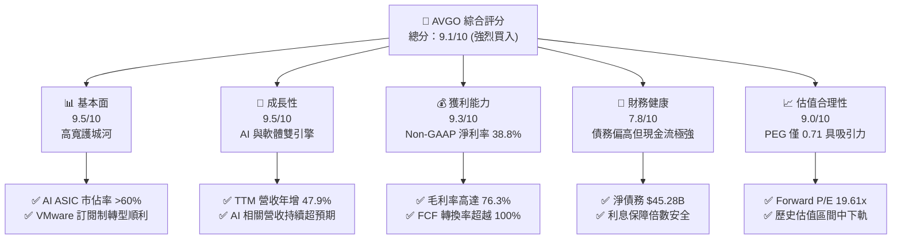
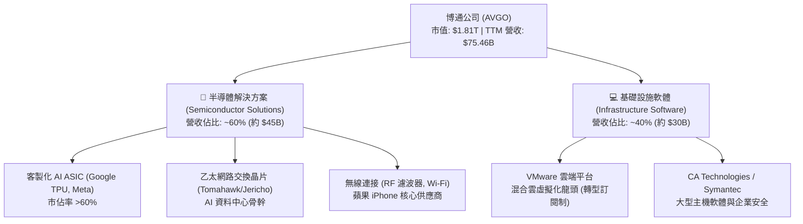
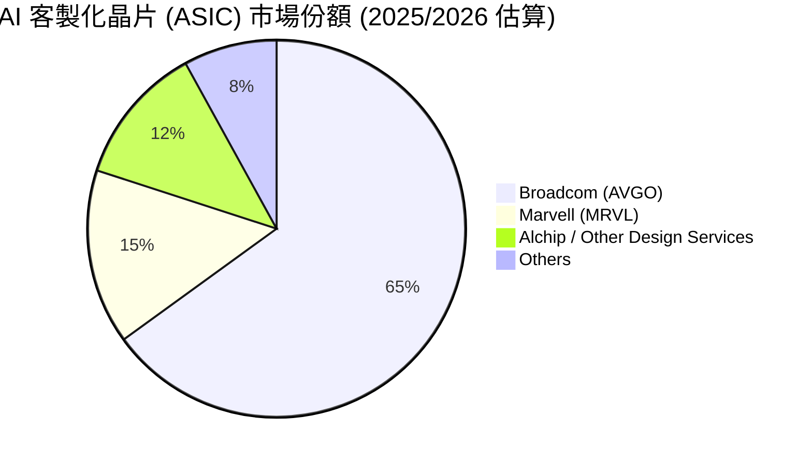
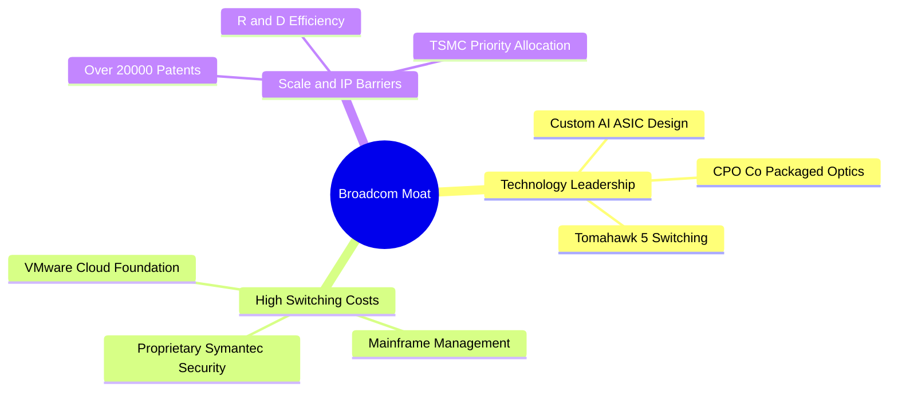
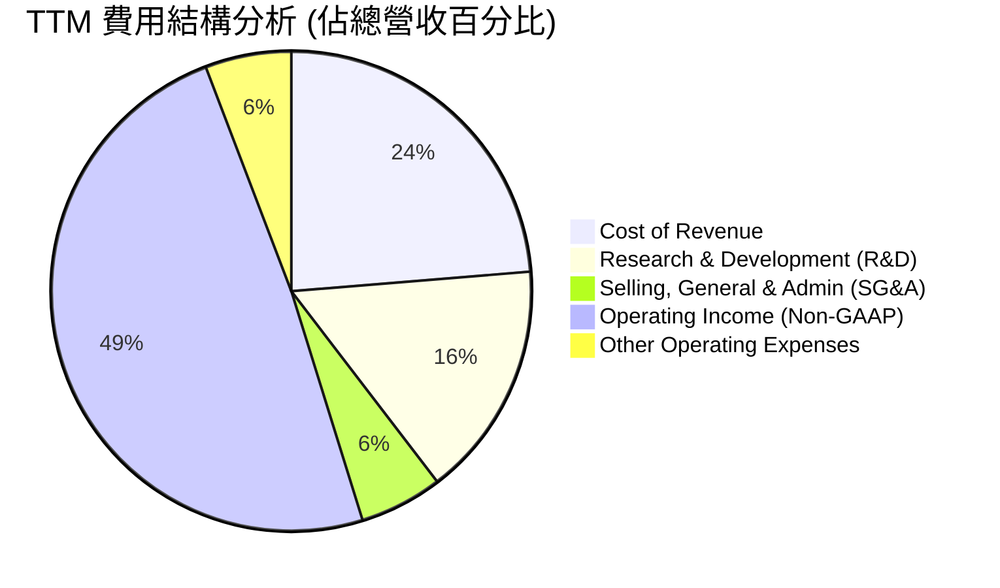
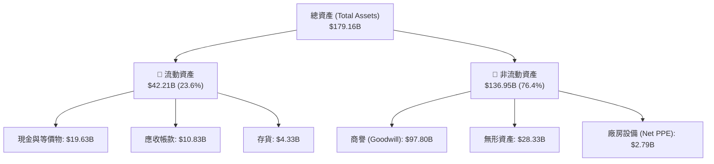

# AVGO 基本面深度分析報告

> **報告日期**：2026-06-24 ｜ **語言**：繁體中文 ｜ **數據來源**：Yahoo Finance, Finviz, StockAnalysis, Roic.ai ｜ **分析師**：CFA 級機構研究

---

## 目錄

| # | 章節 | 核心結論 |
|---|------|----------|
| 1 | 執行摘要 | 評級：🟢 強烈買入，目標價：$523.84，具備 37.8% 潛在漲幅 |
| 2 | 公司概覽與商業模式 | 雙引擎驅動（半導體+軟體），以高轉換成本與技術專利構築寬廣護城河 |
| 3 | 損益表深度分析 | TTM 營收達 $75.46B（YoY +47.9%），Non-GAAP 淨利率高達 38.8% |
| 4 | 資產負債表分析 | 併購 VMware 後資產規模達 $179.16B，債務可控，流動性指標健壯 |
| 5 | 現金流量深度分析 | TTM FCF 達 $27.21B，FCF 轉換率 >100%，強大的資本配置與股息增長能力 |
| 6 | 獲利能力與資本效率 | ROE 37.3%，ROIC 達 22.8% 遠超 WACC（9.9%），持續創造超額經濟價值 |
| 7 | 估值深度分析 | Forward P/E 僅 19.6x，PEG 0.71，相較於同業具備顯著的估值安全邊際 |
| 8 | 成長催化劑 | AI ASIC 客製化晶片爆發、Tomahawk 5 乙太網路交換器升級與 VMware 協同效應 |
| 9 | 風險矩陣 | 地緣政治風險、大客戶集中度與併購整合進度為核心監控指標 |
| 10| 投資建議 | 基準目標價 $523.84，隱含高雙位數回報，適合長線成長與股息增長型投資人 |

---

## 1. 執行摘要

### 1.1 核心評分儀表板



### 1.2 評分進度條視覺化

```
╔══════════════════════════════════════════════════════════════╗
║               AVGO 多維度評分儀表板 (1-10分)                 ║
╠══════════════════════════════════════════════════════════════╣
║ 基本面強度  9.5 ▓▓▓▓▓▓▓▓▓▓▓▓▓▓▓▓▓▓▓░  ★★★★★           ║
║ 成長動能    9.5 ▓▓▓▓▓▓▓▓▓▓▓▓▓▓▓▓▓▓▓░  ★★★★★           ║
║ 獲利品質    9.3 ▓▓▓▓▓▓▓▓▓▓▓▓▓▓▓▓▓▓▓░  ★★★★★           ║
║ 財務健康    7.8 ▓▓▓▓▓▓▓▓▓▓▓▓▓▓▓░░░░░  ★★★★☆           ║
║ 估值合理性  9.0 ▓▓▓▓▓▓▓▓▓▓▓▓▓▓▓▓▓▓░░  ★★★★★           ║
║ 護城河深度  9.5 ▓▓▓▓▓▓▓▓▓▓▓▓▓▓▓▓▓▓▓░  ★★★★★           ║
║ 管理層執行  9.6 ▓▓▓▓▓▓▓▓▓▓▓▓▓▓▓▓▓▓▓░  ★★★★★           ║
║ 技術創新力  9.0 ▓▓▓▓▓▓▓▓▓▓▓▓▓▓▓▓▓▓░░  ★★★★★           ║
╠══════════════════════════════════════════════════════════════╣
║ 綜合總分    9.1 ▓▓▓▓▓▓▓▓▓▓▓▓▓▓▓▓▓▓░░  🏆 強烈買入          ║
╚══════════════════════════════════════════════════════════════╝
```

### 1.3 五大投資論點 + 三大核心風險

| 類型 | 項目 | 具體依據 | 信心度 |
|------|------|----------|--------|
| 🟢 **投資論點①** | **AI 客製化晶片 (ASIC) 爆發** | 協助 Google (TPU)、Meta 等科技巨頭設計客製化 AI 加速器，市佔率超 60%，直接受益於去 GPU 化趨勢。 | 🟢 極高 |
| 🟢 **投資論點②** | **VMware 併購協同效應顯現** | VMware 轉型訂閱制（Subscription）進展順利，軟體營收佔比大幅提升，推升 Non-GAAP 毛利率至 76.3%。 | 🟢 極高 |
| 🟢 **投資論點③** | **網路硬體市佔絕對領先** | Tomahawk 5 與 Jericho 3-AI 交換器晶片在 AI 資料中心乙太網路（Ethernet）市佔第一，技術領先同業 1-2 代。 | 🟢 極高 |
| 🟢 **投資論點④** | **極致的自由現金流創造力** | TTM 自由現金流達 $27.21B，營運現金流 $33.62B，FCF 利潤率高達 36%，具備強大的派息與還債能力。 | 🟢 極高 |
| 🟢 **投資論點⑤** | **極具吸引力的估值倍數** | Forward P/E 僅 19.61x，相較於歷史平均與半導體同業（如 NVDA、MRVL）顯著偏低，PEG 0.71 顯示嚴重低估。 | 🟢 高 |
| 🟡 **風險①** | **大客戶流失與集中度風險** | 前幾大雲端服務商（如 Google）若加大自研架構或將訂單分流至競爭對手（如 Marvell），將影響半導體部門營收。 | 🟡 中度 |
| 🔴 **風險②** | **高額債務與利息支出壓力** | 併購 VMware 後總債務達 $64.91B，淨債務達 $45.28B，高利率環境下利息支出（TTM $3.15B）將壓抑 GAAP 淨利。 | 🔴 中度 |
| 🟡 **風險③** | **地緣政治與供應鏈集中** | 晶片高度依賴台積電（TSMC）先進製程代工，若台海局勢緊張或先進封裝（CoWoS）產能受限，將衝擊出貨。 | 🟡 中度 |

### 1.4 快速統計卡片

| 指標 | 公司實際值 | 行業均值（半導體） | S&P 500 均值 | 狀態 |
|------|-------------|-------------------|--------------|------|
| 收入 YoY 成長 | **47.9%** | ~15.0% | ~5.5% | 🟢 卓越 |
| 毛利率 (Non-GAAP) | **76.3%** | ~55.0% | ~30.0% | 🟢 卓越 |
| 淨利率 (Non-GAAP) | **38.8%** | ~20.0% | ~12.0% | 🟢 卓越 |
| ROE | **37.3%** | ~18.0% | ~15.0% | 🟢 強勁 |
| Forward P/E | **19.61x** | ~28.0x | ~21.5x | 🟢 便宜 |
| 淨債務 / EBITDA | **1.30x** | ~0.8x | ~2.0x | 🟢 安全 |

### 1.5 投資結論

```
╔══════════════════════════════════════════════════════════════════╗
║                    📊 AVGO 投資結論摘要                          ║
╠══════════════════════════════════════════════════════════════════╣
║  評級：🟢 強烈買入 (Strong Buy)                                 ║
║  當前股價：$380.15 (2026-06-24)                                  ║
║  目標價區間：                                                    ║
║    悲觀情境：$310.00 (-18.4%)                                    ║
║    基準情境：$523.84 (+37.8%)  ← 12個月主要目標                  ║
║    樂觀情境：$650.00 (+71.0%)                                    ║
║  投資評分：9.1/10                                                ║
║  適合投資人：長線價值成長型、股息增長型、AI 基礎設施佈局者       ║
╚══════════════════════════════════════════════════════════════════╝
```

---

## 2. 公司概覽與商業模式

### 2.1 業務結構與收入來源

博通（Broadcom, AVGO）採取獨特的「半導體解決方案」與「基礎設施軟體」雙軌並行模式。透過 Hock Tan 卓越的併購策略（LSI, CA Technologies, Symantec, VMware），博通已轉化為一家兼具高硬體技術壁壘與高軟體經常性收入（Recurring Revenue）的科技巨擘。



### 2.2 市場份額

在關鍵的 AI 客製化 ASIC 晶片與資料中心網路交換器市場，博通擁有絕對的支配地位。



### 2.3 競爭護城河分析

博通的護城河並非單一要素，而是由技術專利、高轉換成本以及強大的生態系鎖定共同交織而成。



### 2.4 護城河強度評分

```
╔══════════════════════════════════════════════════════════════╗
║                    AVGO 護城河強度評分                       ║
╠══════════════════════════════════════════════════════════════╣
║ 網路交換技術   9.8/10 ▓▓▓▓▓▓▓▓▓▓▓▓▓▓▓▓▓▓▓▓  🏆 絕對統治    ║
║ 客製化 ASIC    9.5/10 ▓▓▓▓▓▓▓▓▓▓▓▓▓▓▓▓▓▓▓░  🟢 極高壁壘    ║
║ 軟體轉換成本   9.2/10 ▓▓▓▓▓▓▓▓▓▓▓▓▓▓▓▓▓▓░░  🟢 訂閱制鎖定  ║
║ 專利與IP組合   9.0/10 ▓▓▓▓▓▓▓▓▓▓▓▓▓▓▓▓▓▓░░  🟢 難以超越    ║
╠══════════════════════════════════════════════════════════════╣
║ 綜合護城河     9.4    ▓▓▓▓▓▓▓▓▓▓▓▓▓▓▓▓▓▓▓░  🏆 寬廣護城河  ║
╚══════════════════════════════════════════════════════════════╝
```

---

## 3. 損益表深度分析

### 3.1 年度收入成長趨勢（近5年）

博通在過去數年中展現了驚人的成長軌跡。特別是在 FY24 併購 VMware 併表後，營收規模出現了跳躍式增長。

```
╔══════════════════════════════════════════════════════════════════╗
║                AVGO 年度收入趨勢 (FY21 - TTM)                    ║
╠══════════════════════════════════════════════════════════════════╣
║                                                                  ║
║  FY21   $27.45B  ███████░░░░░░░░░░░░░░░░░░░  YoY: +14.9% 🟢    ║
║  FY22   $33.20B  ████████░░░░░░░░░░░░░░░░░░  YoY: +21.0% 🟢    ║
║  FY23   $35.82B  █████████░░░░░░░░░░░░░░░░░  YoY: +7.9%  🟢    ║
║  FY24   $51.57B  █████████████░░░░░░░░░░░░░  YoY: +44.0% 🟢    ║
║  FY25   $63.89B  ████████████████░░░░░░░░░░  YoY: +23.9% 🟢    ║
║  TTM    $75.46B  ███████████████████░░░░░░░  YoY: +47.9% 🟢    ║
║                   |      |      |      |      |                  ║
║                   0     20B    40B    60B    80B                 ║
║                                                                  ║
║  📊 5年年複合成長率 (CAGR)：+22.4%                              ║
╚══════════════════════════════════════════════════════════════════╝
```

### 3.2 季度收入趨勢分析

自 FY25 季度以來，博通營收呈現強勁的逐季（QoQ）與按年（YoY）加速增長，主要得益於 AI 需求爆發與 VMware 轉型訂閱制的發酵。

| 財報季度 | 截止日期 | 季度營收 (Revenue) | YoY 成長率 | QoQ 成長率 | 核心驅動因素 |
|----------|----------|-------------------|------------|------------|--------------|
| **Q2 2026** | 2026-05-03 | **$22.19B** | 🟢 +47.87% | 🟢 +14.89% | AI ASIC 出貨高峰、VMware 訂閱營收加速 |
| **Q1 2026** | 2026-02-01 | **$19.31B** | 🟢 +29.47% | 🟢 +7.19%  | 乙太網路 Tomahawk 5 需求強勁 |
| **Q4 2025** | 2025-11-02 | **$18.02B** | 🟢 +28.18% | 🟢 +12.93% | 企業級軟體季度末簽約高峰 |
| **Q3 2025** | 2025-08-03 | **$15.95B** | 🟢 +22.03% | 🟢 +6.32%  | 蘋果 iPhone 射頻晶片季節性拉貨 |

### 3.3 利潤率演變分析

博通的利潤率在業界名列前茅。以下為 Non-GAAP 財務指標趨勢：

| 利潤率指標 | FY22 | FY23 | FY24 | FY25 | TTM 實際值 | 趨勢評估 |
|------------|------|------|------|------|------------|----------|
| **毛利率** | 66.5% | 68.9% | 63.0% | 67.8% | **76.3%** | ↗️ 顯著改善 (VMware 高毛利軟體併表效應) 🟢 |
| **營業利益率** | 42.8% | 45.2% | 26.1% | 39.9% | **49.0%** | ↗️ 整合完成後營運槓桿顯現 🟢 |
| **EBITDA Margin** | 57.7% | 57.4% | 46.3% | 54.3% | **55.8%** | ↗️ 現金創造能力極強 🟢 |
| **淨利率** | 34.6% | 39.3% | 11.4% | 36.2% | **38.8%** | ↗️ 排除一次性併購攤銷後獲利回歸 🟢 |

*分析備註*：FY24 GAAP 淨利率驟降至 11.4% 是因為併購 VMware 產生的大量無形資產攤銷（Amortization of Intangibles）及一次性重組費用。隨著整合在 FY25/FY26 完成，TTM Non-GAAP 淨利率已迅速回升至 **38.8%**，展現極強的定價能力與成本控制實力。

### 3.4 費用結構分析



博通的研發費用（TTM 達 $11.99B，佔營收 15.9%）保持高位，確保其在半導體與虛擬化軟體領域的技術領先。與此同時，SG&A（僅佔 5.6%）控制極佳，體現了 Hock Tan 著名的「精簡高效」管理風格。

### 3.5 季度 EPS 趨勢與盈餘品質

博通在過去數個季度中持續展現了卓越的盈餘表現。

*   **Q2 2026 EPS (Basic)**: **$1.96** (高於去年同期的 $1.05，YoY +86.7%)
*   **Q1 2026 EPS (Basic)**: **$1.55** (高於去年同期的 $1.17，YoY +32.5%)
*   **盈餘品質分析**：博通的 GAAP 淨利（TTM $20.01B）低於其營運現金流（TTM $33.62B），這主要是由於非現金折舊與無形資產攤銷（TTM $2.03B）及股權補貼（SBC）的調整。自由現金流轉換率（FCF / Net Income）高達 **136%**，這在美股大型科技股中屬於極高水準，證明其盈餘品質毫無水分，完全由真金白銀的現金流支撐。

---

## 4. 資產負債表分析

### 4.1 資產結構分解

博通是一家典型的「輕資產（Fabless）」半導體與軟體企業。其資產負債表的最顯著特徵是高額的商譽（Goodwill）與無形資產，這是其多年來大舉併購的產物。



### 4.2 流動性指標分析

| 流動性指標 | TTM | FY25 | FY24 | 行業均值 | 評估 |
|------------|-----|------|------|----------|------|
| **流動比率 (Current Ratio)** | **2.24** | 1.71 | 1.17 | ~1.80 | 🟢 健壯，短期償債無虞 |
| **速動比率 (Quick Ratio)** | **1.93** | 1.58 | 1.07 | ~1.40 | 🟢 極佳，扣除存貨後依然安全 |
| **存貨週轉天數 (Days Inventory)**| **56天** | 40天 | 34天 | ~75天 | 🟢 存貨管理效率高於同業 |

### 4.3 債務結構分析

由於併購 VMware，博通承擔了較高的債務，但其強勁的現金流和去槓桿速度令債務風險完全可控。

```
╔══════════════════════════════════════════════════════════════════╗
║                    AVGO 債務健康診斷                             ║
