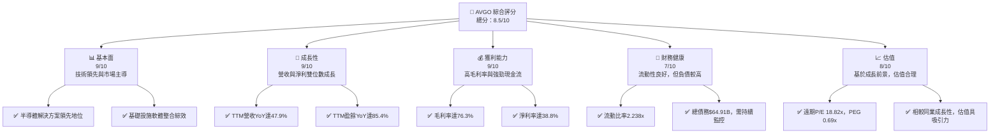
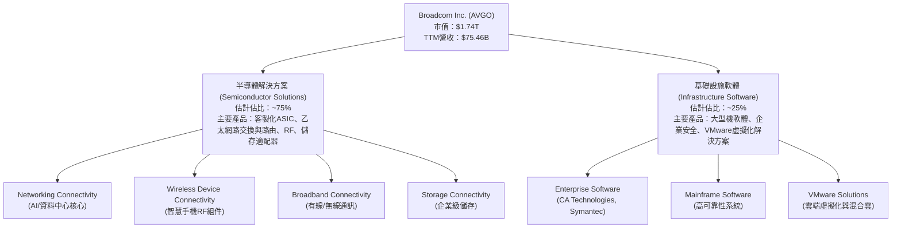
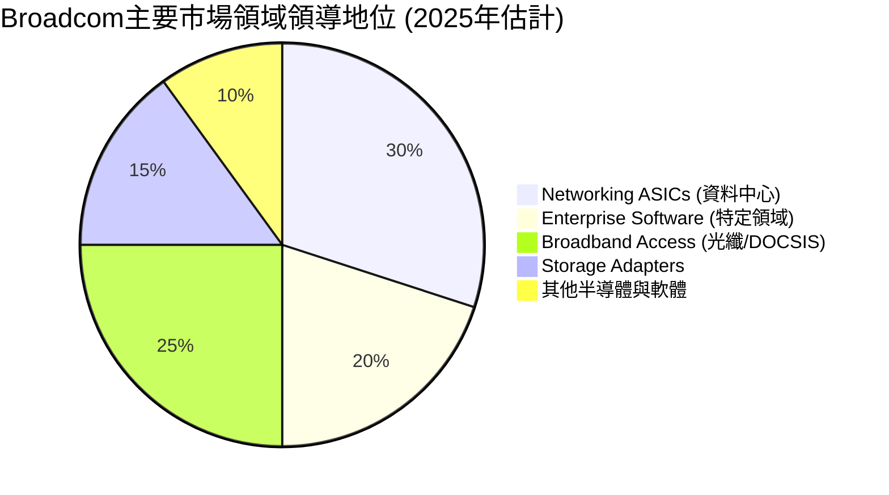
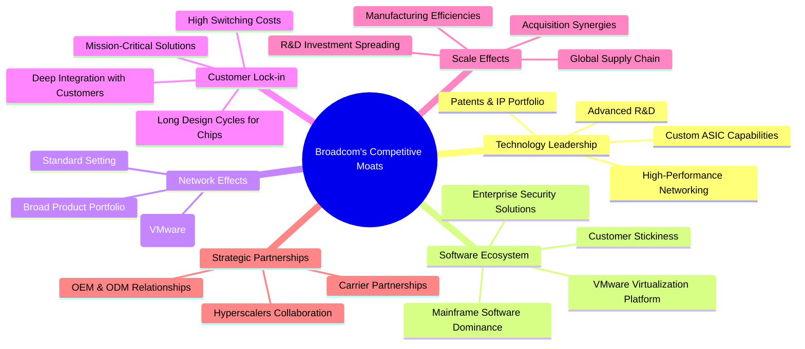
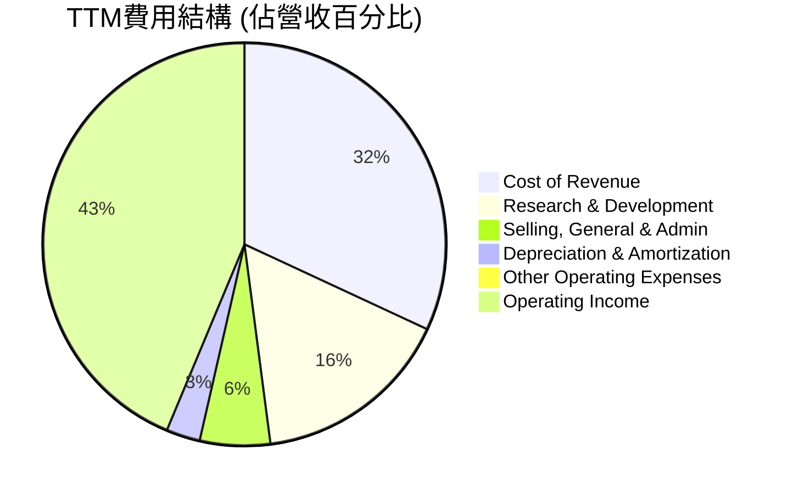
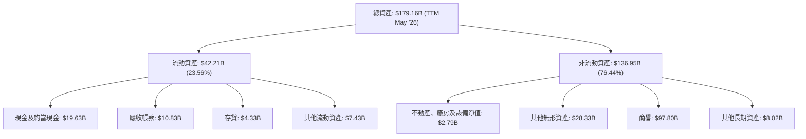
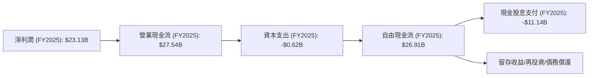

# AVGO 基本面深度分析報告
> **報告日期**：2026-06-26 ｜ **語言**：繁體中文 ｜ **數據來源**：Yahoo Finance, Finviz, StockAnalysis, Roic.ai ｜ **分析師**：CFA 級機構研究

## 目錄

| # | 章節 | 核心結論 |
|---|------------------------|----------------------------------------------------------|
| 1 | 執行摘要 | 評級：🟢 買入，目標價區間：$450 - $600 |
| 2 | 公司概覽與商業模式 | 強勁的技術護城河與市場領導地位 |
| 3 | 損益表深度分析 | 營收與利潤率強勁成長，顯示卓越營運效率 |
| 4 | 資產負債表分析 | 穩健的資產負債表，流動性良好但負債水準較高 |
| 5 | 現金流量深度分析 | 強勁的自由現金流產生能力，資本配置策略積極 |
| 6 | 獲利能力與資本效率 | ROIC顯著高於WACC，持續創造股東價值 |
| 7 | 估值深度分析 | 相較於成長性，當前估值具吸引力 |
| 8 | 成長催化劑 | AI、網路基礎設施、軟體整合推動長期成長 |
| 9 | 風險矩陣 | 併購整合、市場競爭、宏觀經濟波動為主要風險 |
| 10| 投資建議 | 建議買入，適合長期成長型投資者 |

---

## 1. 執行摘要

### 1.1 核心評分儀表板



### 1.2 評分進度條視覺化

```
╔══════════════════════════════════════════════════════════════╗
║              AVGO 多維度評分儀表板 (1-10分)                  ║
╠══════════════════════════════════════════════════════════════╣
║ 基本面強度  9.0 ▓▓▓▓▓▓▓▓▓▓▓▓▓▓▓▓▓▓░░  ★★★★★           ║
║ 成長動能    9.0 ▓▓▓▓▓▓▓▓▓▓▓▓▓▓▓▓▓▓░░  ★★★★★           ║
║ 獲利品質    9.0 ▓▓▓▓▓▓▓▓▓▓▓▓▓▓▓▓▓▓░░  ★★★★★           ║
║ 財務健康    7.0 ▓▓▓▓▓▓▓▓▓▓▓▓▓▓░░░░░░  ★★★★☆           ║
║ 估值合理性  8.0 ▓▓▓▓▓▓▓▓▓▓▓▓▓▓▓▓░░░░  ★★★★☆           ║
║ 護城河深度  9.5 ▓▓▓▓▓▓▓▓▓▓▓▓▓▓▓▓▓▓▓░  ★★★★★           ║
║ 管理層執行  9.0 ▓▓▓▓▓▓▓▓▓▓▓▓▓▓▓▓▓▓░░  ★★★★★           ║
║ 技術創新力  9.5 ▓▓▓▓▓▓▓▓▓▓▓▓▓▓▓▓▓▓▓░  ★★★★★           ║
╠══════════════════════════════════════════════════════════════╣
║ 綜合總分    8.5 ▓▓▓▓▓▓▓▓▓▓▓▓▓▓▓▓▓░░░  🏆 具備長期投資價值      ║
╚══════════════════════════════════════════════════════════════╝
```

### 1.3 五大投資論點 + 三大核心風險

| 類型 | 項目 | 具體依據 | 信心度 |
|------|------|----------|--------|
| 🟢 **投資論點①** | **AI與網路基礎設施需求強勁** | Broadcom的客製化ASIC、乙太網路交換與路由解決方案是AI資料中心關鍵組件。TTM營收YoY達47.9%，其中AI相關業務貢獻顯著。 | 🟢 極高 |
| 🟢 **投資論點②** | **基礎設施軟體業務帶來穩定高利潤** | VMware等併購案增強其企業軟體產品組合，提供高黏性、經常性收入，且利潤率高。TTM營業利益率達49.0%。 | 🟢 極高 |
| 🟢 **投資論點③** | **卓越的獲利能力與現金流產生** | TTM毛利率76.3%，淨利率38.8%，顯示公司強大的定價權和成本控制能力。TTM自由現金流達$27.21B，FCF Yield 1.57%。 | 🟢 極高 |
| 🟢 **投資論點④** | **持續創造股東價值（ROIC > WACC）** | 根據分析，FY2025 ROIC約為17.01%，遠高於WACC約8.73%，表明資本配置效率極高。 | 🟢 極高 |
| 🟢 **投資論點⑤** | **具吸引力的估值與分析師看好** | 遠期P/E 18.82x，PEG 0.69x，相較其高成長性具有吸引力。分析師平均目標價$523.73，較當前股價$365.02有43.48%的潛在漲幅。 | 🟢 高 |
| 🟡 **風險①** | **高額負債與併購整合風險** | 總債務高達$64.91B，儘管現金流充沛，但債務負擔仍需關注。大規模併購（如VMware）可能帶來整合挑戰和執行風險。 | 🟡 中度 |
| 🔴 **風險②** | **半導體產業週期性與競爭加劇** | 半導體市場具有週期性，宏觀經濟下行可能影響需求。來自NVIDIA、Qualcomm等巨頭的競爭壓力持續存在。 | 🟡 中度 |
| 🟡 **風險③** | **客戶集中度與供應鏈風險** | 公司部分收入可能依賴少數大客戶，若客戶訂單波動或轉向競爭對手，將對營收造成影響。全球供應鏈中斷也可能影響生產。 | 🟡 中度 |

### 1.4 快速統計卡片

| 指標 | 公司實際值 | 行業均值（半導體） | S&P 500 均值 | 狀態 |
|-----------------|-----------------|----------------------|--------------|------|
| 收入 YoY 成長 | **47.9% (TTM)** | ~15-25% | ~10% | 🟢 |
| 毛利率 | **76.3% (TTM)** | ~45-55% | ~30-40% | 🟢 |
| 淨利率 | **38.8% (TTM)** | ~15-25% | ~10% | 🟢 |
| ROE | **37.3% (TTM)** | ~20-30% | ~15% | 🟢 |
| Forward P/E | **18.82x** | ~25-35x | ~20x | 🟢 |
| Debt/Equity | **0.74** | ~0.5-0.8 | ~0.8-1.2 | 🟡 |
| FCF Yield | **1.57%** | ~2-4% | ~3-5% | 🟡 |

### 1.5 投資結論

```
╔══════════════════════════════════════════════════════════════════╗
║                    📊 投資結論摘要                               ║
╠══════════════════════════════════════════════════════════════════╣
║  評級：🟢 買入                                                   ║
║  當前股價：$365.02                                               ║
║  目標價區間：                                                    ║
║    悲觀情境：$450（+23.28%）                                     ║
║    基準情境：$525（+43.83%）  ← 12個月主要目標                      ║
║    樂觀情境：$600（+64.37%）                                     ║
║  投資評分：8.5/10                                                ║
║  適合投資人：成長型、長線持有者，尋求高成長與強勁現金流的科技巨頭  ║
╚══════════════════════════════════════════════════════════════════╝
```

---

## 2. 公司概覽與商業模式

Broadcom Inc. (AVGO) 是一家全球領先的半導體和基礎設施軟體解決方案供應商。公司業務主要分為兩大板塊：半導體解決方案 (Semiconductor Solutions) 和基礎設施軟體 (Infrastructure Software)。憑藉其廣泛的產品組合、技術領先地位和戰略性併購，Broadcom 在多個高成長市場中佔據主導地位。

### 2.1 業務結構與收入來源

Broadcom 的業務模式專注於提供關鍵技術，這些技術是全球數位基礎設施的核心。公司透過戰略性併購不斷擴大其產品線和市場覆蓋。


**業務解析**：
*   **半導體解決方案**：此為 Broadcom 的核心業務，涵蓋廣泛的應用領域。在AI時代，其客製化ASIC、高速乙太網路交換器和路由晶片是資料中心互連的關鍵技術，受益於AI運算對網路頻寬的爆炸性需求。此外，公司在無線通訊（如iPhone的RF組件）、寬頻通訊和儲存連結領域也佔據重要地位。此板塊通常佔公司總營收的大部分，但具備一定的週期性。
*   **基礎設施軟體**：透過收購CA Technologies、Symantec企業安全業務和VMware，Broadcom 建立了強大的企業級軟體產品組合。這些軟體通常是企業IT基礎設施不可或缺的一部分，提供高黏性、高毛利率的訂閱收入，有助於平滑半導體業務的週期性波動，並提升整體盈利能力。VMware的整合尤其強化了其在混合雲和虛擬化領域的領導地位。

### 2.2 市場份額

由於 Broadcom 的產品線極為廣泛且涉及多個細分市場，提供單一的市場份額數字具有挑戰性。然而，根據行業報告和公司聲明，Broadcom 在其關鍵細分市場中佔據領先地位。


**市場地位**：
*   **資料中心網路晶片**：Broadcom 在高速乙太網路交換器和路由晶片市場擁有顯著的市場份額，尤其是在超大規模資料中心和AI基礎設施領域，其客製化ASIC設計能力使其成為領先供應商。
*   **RF前端模組**：在智慧手機RF前端模組市場，Broadcom 也是主要參與者之一，為蘋果等主要手機製造商提供關鍵組件。
*   **寬頻連接**：Broadcom 在纜線數據機、DSL和光纖網路設備所需的晶片組市場上擁有強大的影響力。
*   **企業軟體**：透過VMware、CA和Symantec的併購，Broadcom 在虛擬化、大型機軟體和企業安全領域建立了穩固的市場地位，尤其是在VMware的企業級虛擬化市場，公司擁有極高的市場佔有率。

### 2.3 競爭護城河分析

Broadcom 透過多種方式建立了深厚的競爭護城河，使其能夠在競爭激烈的市場中維持高利潤率和市場地位。



### 2.4 護城河強度評分

Broadcom 的護城河強度非常高，尤其是在技術領先和客戶鎖定方面。其戰略性併購也有效擴大了軟體生態系統和規模效應。

```
╔══════════════════════════════════════════════════════════════╗
║                  AVGO 護城河強度評分                        ║
╠══════════════════════════════════════════════════════════════╣
║ 技術領先    9.5/10 ▓▓▓▓▓▓▓▓▓▓▓▓▓▓▓▓▓▓▓░  🏆 在AI ASIC與高速網路晶片具主導地位 ║
║ 軟體生態系統  9.0/10 ▓▓▓▓▓▓▓▓▓▓▓▓▓▓▓▓▓▓░░  🟢 VMware鞏固企業軟體高黏性           ║
║ 網路效應    8.5/10 ▓▓▓▓▓▓▓▓▓▓▓▓▓▓▓▓▓░░░  🟢 廣泛採用促成行業標準               ║
║ 客戶鎖定    9.0/10 ▓▓▓▓▓▓▓▓▓▓▓▓▓▓▓▓▓▓░░  🏆 深度嵌入客戶產品，轉換成本高       ║
║ 規模效應    8.5/10 ▓▓▓▓▓▓▓▓▓▓▓▓▓▓▓▓▓░░░  🟢 併購與全球供應鏈帶來成本優勢       ║
║ 生態夥伴    8.0/10 ▓▓▓▓▓▓▓▓▓▓▓▓▓▓▓▓░░░░  🟢 與頂級客戶及供應商關係穩固         ║
╠══════════════════════════════════════════════════════════════╣
║ 綜合護城河   8.8/10 ▓▓▓▓▓▓▓▓▓▓▓▓▓▓▓▓▓░░░  🏆 具備強大的、多層次的競爭優勢       ║
╚══════════════════════════════════════════════════════════════╝
```

---

## 3. 損益表深度分析

Broadcom 的損益表數據展現了其卓越的營收成長能力和強勁的利潤管理，尤其是在近年來透過併購和市場需求推動下實現了顯著擴張。

### 3.1 年度收入成長趨勢（近4年）

Broadcom 在過去四年實現了穩健的營收成長，尤其是在2024財年和TTM期間，得益於半導體市場的強勁需求和成功的併購整合。

```
╔══════════════════════════════════════════════════════════════════╗
║              AVGO 年度收入趨勢（FY2022-TTM）                     ║
╠══════════════════════════════════════════════════════════════════╣
║                                                                  ║
║  FY2022  $33.20B  ████████████████░░░░░░░░░░░  YoY: +20.96% 🟢    ║
║  FY2023  $35.82B  ██████████████████░░░░░░░░░  YoY: +7.88%  🟡    ║
║  FY2024  $51.57B  ███████████████████████████░  YoY: +43.98% 🟢    ║
║  FY2025  $63.89B  ████████████████████████████████░  YoY: +23.87% 🟢    ║
║  TTM     $75.46B  ████████████████████████████████████████░  YoY: +32.29% 🟢    ║
║                                                                  ║
║                   |      |      |      |      |      |           ║
║                   0     20B    40B    60B    80B    100B         ║
║                                                                  ║
║  📊 4年累計 CAGR (FY2022-FY2025)：+29.13%                        ║
╚══════════════════════════════════════════════════════════════════╝
```
**分析**：
*   從FY2022的$33.20B成長至FY2025的$63.89B，複合年成長率(CAGR)高達29.13%，顯示公司強勁的擴張能力。
*   FY2024的營收YoY成長達到43.98%，主要得益於半導體市場的復甦以及前期併購的貢獻。
*   TTM營收達到$75.46B，較去年同期成長32.29%，顯示公司在最新財報週期內仍保持高成長動能，特別是來自AI相關產品和VMware併購的貢獻。

### 3.2 季度收入趨勢分析

近四季營收數據顯示，Broadcom 實現了顯著的環比和同比成長，尤其是在最近的季度表現突出。

| 季度 (Period Ending) | 總營收 ($B) | QoQ 成長率 | YoY 成長率 | 備註 |
|----------------------|-------------|------------|------------|------|
| 2025-07-31 (Q3 2025) | $15.95B     | N/A        | +22.03%    | 穩健的同比成長 |
| 2025-10-31 (Q4 2025) | $18.02B     | +12.98%    | +28.18%    | 環比與同比加速成長 |
| 2026-01-31 (Q1 2026) | $19.31B     | +7.16%     | +29.47%    | 持續擴張，同比成長強勁 |
| 2026-04-30 (Q2 2026) | $22.19B     | +14.91%    | +47.87%    | 顯著加速，AI貢獻顯著 |

**分析**：
Broadcom 最近四個季度的營收呈現逐季上升趨勢，且同比成長率持續強勁。特別是2026年Q2，營收達到$22.19B，同比成長高達47.87%，環比成長14.91%，這表明公司在AI、資料中心網路以及基礎設施軟體領域的需求非常旺盛。VMware的整合也開始全面貢獻營收。

### 3.3 利潤率演變分析

Broadcom 的利潤率一直處於行業領先水平，近年來透過規模效應和產品組合優化，毛利率和營業利益率保持高位，淨利率在FY2025有顯著提升。

| 利潤率指標 | FY2022 | FY2023 | FY2024 | FY2025 | TTM (May '26) | 趨勢 | 評估 |
|------------|--------|--------|--------|--------|---------------|------|------|
| **毛利率** | 66.5%  | 68.9%  | 63.0%  | 67.8%  | 76.3%         | ↗️ 穩步提升 | 🟢 極佳 |
| **營業利益率** | 43.0%  | 45.9%  | 29.1%  | 40.8%  | 49.0%         | ↗️ 顯著改善 | 🟢 極佳 |
| **淨利率** | 34.6%  | 39.3%  | 11.4%  | 36.2%  | 38.8%         | ↗️ 大幅反彈 | 🟢 極佳 |

**利潤率演變深度解析**：
*   **毛利率**：從FY2022的66.5%提升至TTM的76.3%，顯示公司強大的定價能力和產品的高附加值。FY2024毛利率略有下降至63.0%，可能與併購相關的成本或產品組合變化有關，但隨後在FY2205和TTM強勁反彈，達到歷史高位。這主要歸因於其半導體解決方案（尤其是AI相關晶片）的強勁需求和高利潤，以及基礎設施軟體業務（如VMware）的整合。
*   **營業利益率**：趨勢與毛利率類似。FY2024營業利益率為29.1%，相較FY2023的45.9%顯著下降，這主要是由於併購相關的整合成本、攤銷費用以及研發和銷售費用增加。然而，FY2025和TTM的營業利益率分別回升至40.8%和49.0%，表明公司成功消化了併購成本，並透過營運效率提升和高利潤軟體業務的貢獻，重新實現了強勁的營業盈利能力。
*   **淨利率**：FY2024淨利率僅為11.4%，遠低於FY2023的39.3%，這主要是由於併購相關的非經常性費用和較高的利息支出。然而，FY2025淨利率反彈至36.2%，TTM更是達到38.8%，顯示公司在扣除所有費用後，仍能將大量收入轉化為淨利潤。這得益於營收規模擴大、營業利益率改善以及有效的稅務管理（FY2025甚至有稅務收益）。

總體而言，Broadcom 的利潤率趨勢非常健康，顯示其核心業務的強勁盈利能力和管理層對成本的有效控制，以及併購策略帶來的協同效應。

### 3.4 費用結構分析

Broadcom 的費用結構反映了其作為高科技公司的特點：注重研發投入，並透過併購擴大市場佔有率。


**費用佔營收比 (TTM)**：
*   **Cost of Revenue**：$23.94B / $75.46B = 31.7%
*   **Research & Development**：$11.99B / $75.46B = 15.9%
*   **Selling, General & Admin**：$4.25B / $75.46B = 5.6%
*   **Depreciation & Amortization**：$2.03B / $75.46B = 2.7%
*   **Other Operating Expenses**：$0.51B / $75.46B = 0.7%
*   **Operating Income**：$32.75B / $75.46B = 43.4%

```
╔══════════════════════════════════════════════════════════════════╗
║                   AVGO 費用結構與趨勢分析                        ║
╠══════════════════════════════════════════════════════════════════╣
║                                                                  ║
║  研發費用 (R&D)：                                                ║
║  FY2022 $4.92B  ████░░░░░░░░░░░░░░░░░░░░░░░░  (14.8% of Rev)   ║
║  FY2023 $5.25B  ████░░░░░░░░░░░░░░░░░░░░░░░░  (14.7% of Rev)   ║
║  FY2024 $9.31B  ████████░░░░░░░░░░░░░░░░░░░░  (18.1% of Rev)   ║
║  FY2025 $10.98B █████████░░░░░░░░░░░░░░░░░░░  (17.2% of Rev)   ║
║  TTM    $11.99B ██████████░░░░░░░░░░░░░░░░░░  (15.9% of Rev)   ║
║                                                                  ║
║  銷售、一般與行政費用 (SG&A)：                                  ║
║  FY2022 $1.38B  █░░░░░░░░░░░░░░░░░░░░░░░░░░░░  (4.2% of Rev)    ║
║  FY2023 $1.59B  █░░░░░░░░░░░░░░░░░░░░░░░░░░░░  (4.4% of Rev)    ║
║  FY2024 $4.96B  ████░░░░░░░░░░░░░░░░░░░░░░░░  (9.6% of Rev)    ║
║  FY2025 $4.21B  ████░░░░░░░░░░░░░░░░░░░░░░░░  (6.6% of Rev)    ║
║  TTM    $4.25B  ████░░░░░░░░░░░░░░░░░░░░░░░░  (5.6% of Rev)    ║
║                                                                  ║
║  折舊與攤銷費用 (D&A)：                                          ║
║  FY2022 $1.51B  █░░░░░░░░░░░░░░░░░░░░░░░░░░░░  (4.5% of Rev)    ║
║  FY2023 $1.39B  █░░░░░░░░░░░░░░░░░░░░░░░░░░░░  (3.9% of Rev)    ║
║  FY2024 $3.24B  ███░░░░░░░░░░░░░░░░░░░░░░░░░░  (6.3% of Rev)    ║
║  FY2025 $2.03B  ██░░░░░░░░░░░░░░░░░░░░░░░░░░░  (3.2% of Rev)    ║
║  TTM    $2.03B  ██░░░░░░░░░░░░░░░░░░░░░░░░░░░  (2.7% of Rev)    ║
╚══════════════════════════════════════════════════════════════════╝
```
**分析**：
*   **研發費用 (R&D)**：Broadcom 作為一家半導體和軟體公司，持續投入大量研發。R&D費用從FY2022的$4.92B增長到TTM的$11.99B，佔營收的比例在15%-18%之間波動。這顯示公司對創新和維持技術領先的承諾，尤其是在AI和高速網路領域的競爭激烈，持續的R&D投入至關重要。
*   **銷售、一般與行政費用 (SG&A)**：SG&A費用在FY2024大幅增加至$4.96B (佔營收9.6%)，主要是由於大型併購（如VMware）帶來的整合成本和行政開支。然而，隨著併購整合的推進和協同效應的顯現，TTM的SG&A費用佔比回落至5.6%，顯示管理層在控制營運費用方面的成效。
*   **折舊與攤銷費用 (D&A)**：D&A費用在FY2024顯著增加至$3.24B (佔營收6.3%)，這是併購無形資產攤銷的直接結果。在TTM，D&A費用佔營收的比例下降至2.7%，這可能意味著部分併購產生的無形資產已攤銷完畢，或新併購的攤銷模式不同。

總體而言，Broadcom 的費用結構在併購高峰期有所擴張，但隨著整合的深入，營運效率有所恢復，尤其是在R&D上的持續投入是其長期競爭力的基石。

### 3.5 季度 EPS 趨勢與盈餘品質

Broadcom 的季度 EPS 表現強勁，且呈現顯著成長。雖然缺乏分析師預期數據，但實際EPS的成長趨勢令人印象深刻。

| 季度 (Period Ending) | EPS (Basic) | QoQ 成長率 | YoY 成長率 | 盈餘品質評估 |
|----------------------|-------------|------------|------------|--------------|
| 2025-07-31 (Q3 2025) | $0.88       | N/A        | +120.51%   | 🟢 強勁成長，低基數效應 |
| 2025-10-31 (Q4 2025) | $1.80       | +104.55%   | +95.63%    | 🟢 營收增長與利潤率改善驅動 |
| 2026-01-31 (Q1 2026) | $1.55       | -13.89%    | +32.48%    | 🟡 季節性回落，但同比仍高增長 |
| 2026-04-30 (Q2 2026) | $1.96       | +26.45%    | +86.67%    | 🟢 顯著反彈，AI與軟體貢獻 |

**盈餘品質評估說明**：
儘管提供的數據未能包含分析師預期以判斷盈餘是否「超預期」，但從實際 EPS 數據來看，Broadcom 在過去四個季度實現了令人矚目的成長：
*   **2025 Q3**：EPS $0.88，較去年同期顯著增長120.51%，主要受益於營收成長和利潤率提升。
*   **2025 Q4**：EPS 達到 $1.80，環比增長104.55%，同比增長95.63%，顯示公司在年底的強勁表現。
*   **2026 Q1**：EPS 略有回落至 $1.55，環比下降13.89%，這可能反映了半導體行業的季節性特徵或部分併購相關費用的影響。然而，同比仍實現了32.48%的成長，保持了健康的成長軌跡。
*   **2026 Q2**：EPS 強勁反彈至 $1.96，環比增長26.45%，同比增長86.67%。這一表現遠超Q1，再次證明了公司在AI、資料中心和基礎設施軟體領域的強勁動能，盈餘品質極高。

總體而言，Broadcom 的季度 EPS 趨勢呈現出強勁的成長性和良好的恢復力，尤其是在近期季度表現優異，顯示其營收擴張和利潤率改善的協同效應。

---

## 4. 資產負債表分析

Broadcom 的資產負債表反映了其透過大規模併購實現成長的戰略，導致資產和負債規模顯著擴大，但也保持了良好的流動性和健康的股東權益基礎。

### 4.1 資產結構分解

Broadcom 的資產結構顯示，無形資產（包括商譽）佔比較大，這是其併購策略的直接結果。


**資產結構解析 (TTM May '26)**：
*   **總資產**：達到$179.16B，較FY2025的$171.09B持續增長，主要受營收增長和併購影響。
*   **流動資產**：$42.21B，其中現金及約當現金高達$19.63B，提供了強大的流動性儲備。應收帳款和存貨也隨著業務擴張而增長。
*   **非流動資產**：佔總資產的絕大部分（76.44%），其中商譽 ($97.80B) 和其他無形資產 ($28.33B) 總計約$126.13B，佔總資產的70.4%，這明確反映了Broadcom透過大規模併購（如VMware、CA、Symantec）實現成長的戰略。這些無形資產代表了公司在技術、客戶關係和品牌方面的巨大價值。

### 4.2 流動性指標分析

Broadcom 的流動性指標穩健，顯示其有能力應對短期債務。

| 流動性指標 | FY2022 | FY2023 | FY2024 | FY2025 | TTM (May '26) | 行業均值（半導體） | 評估 |
|------------|--------|--------|--------|--------|---------------|--------------------|------|
| **流動比率 (Current Ratio)** | 2.62   | 2.82   | 1.17   | 1.70   | 2.24          | ~2.0 - 3.0         | 🟢 良好 |
| **速動比率 (Quick Ratio)** | 2.39   | 2.55   | 1.05   | 1.54   | 1.93          | ~1.0 - 2.0         | 🟢 良好 |

**分析**：
*   **流動比率**：TTM為2.24，高於行業平均水平，表明公司擁有足夠的流動資產來覆蓋其短期負債。FY2024的流動比率為1.17，較FY2023的2.82顯著下降，這可能與併購導致的短期負債增加有關。但在FY2025和TTM，流動比率已回升，顯示流動性狀況得到改善。
*   **速動比率**：TTM為1.93，同樣處於健康水平。速動比率排除了存貨，更能反映公司在不依賴存貨銷售的情況下償還短期債務的能力。

整體而言，Broadcom 的流動性狀況良好，能夠有效管理其短期義務。

### 4.3 債務結構分析

Broadcom 透過併購實現成長的策略導致了較高的債務水平，但其強勁的現金流產生能力有助於管理這些債務。

```
╔══════════════════════════════════════════════════════════════════╗
║                   AVGO 債務健康診斷                              ║
╠══════════════════════════════════════════════════════════════════╣
║                                                                  ║
║  總債務 (TTM)：  $64.91B  ████████████████████░░░░░░░░  評語：龐大但可控   ║
║  總現金+投資 (TTM)：$19.63B  ████████████████░░░░░░░░░░  評語：充裕的現金儲備   ║
║  淨債務：        $-45.28B  ████████████████████████████░  🟢 淨負債，但現金流強勁 ║
║                                                                  ║
║  Debt/Equity (TTM)： 0.74x  🟡 中等偏高                           ║
║  Current Ratio (TTM)： 2.24x  🟢 良好流動性                       ║
║  Interest Expense (FY2025)：$3.21B                               ║
║  Operating Income (FY2025)：$26.07B                               ║
║  Interest Coverage (FY2025): 8.12x  🟢 健康                           ║
╚══════════════════════════════════════════════════════════════════╝
```
**分析**：
*   **總債務**：TTM總債務為$64.91B，這是一個較高的數字，主要源於其大型併購，尤其是VMware。
*   **淨債務**：考慮到其充裕的現金儲備$19.63B，淨債務為$-45.28B。
*   **Debt/Equity**：TTM為0.74x，顯示公司在一定程度上依賴債務融資。相較於一些低負債公司，這個比率偏高，但對於一家積極進行併購的科技巨頭而言，仍在可接受範圍內。
*   **利息覆蓋率 (Interest Coverage)**：FY2025的營業利益為$26.07B，利息支出為$3.21B，計算得出利息覆蓋率為8.12x。這表明公司有足夠的盈利能力來支付其利息費用，債務負擔可控。

總體而言，Broadcom 的債務水平較高，但其強大的盈利能力和現金流產生能力使其能夠有效管理這些債務，並確保財務穩定性。

### 4.4 股東權益趨勢

Broadcom 的股東權益在近年來呈現顯著增長，反映了公司盈利能力的提升和資本積累。

```
╔══════════════════════════════════════════════════════════════════╗
║                   AVGO 股東權益趨勢                              ║
╠══════════════════════════════════════════════════════════════════╣
║                                                                  ║
║  FY2022 $22.71B  ██████░░░░░░░░░░░░░░░░░░░░░░░░░░░░░░░░░░░░░░░░░░░║
║  FY2023 $23.99B  ███████░░░░░░░░░░░░░░░░░░░░░░░░░░░░░░░░░░░░░░░░░░║
║  FY2024 $67.68B  ██████████████████████░░░░░░░░░░░░░░░░░░░░░░░░░░░║
║  FY2025 $81.29B  ███████████████████████████░░░░░░░░░░░░░░░░░░░░░░║
║  TTM    $81.29B  ███████████████████████████░░░░░░░░░░░░░░░░░░░░░░║
║                                                                  ║
║                   0B    20B    40B    60B    80B    100B         ║
║                                                                  ║
║  📊 股東權益 CAGR (FY2022-FY2025): +60.31%                        ║
╚══════════════════════════════════════════════════════════════════╝
```
**分析**：
從FY2022的$22.71B增長至FY2025的$81.29B，股東權益的複合年成長率高達60.31%。FY2024的顯著增長（從$23.99B到$67.68B）可能與併購帶來的股權融資或盈餘留存有關。股東權益的持續增長是公司財務穩健和盈利能力強勁的積極信號。

---

## 5. 現金流量深度分析

Broadcom 在現金流量方面表現卓越，其強勁的營業現金流和自由現金流是其財務彈性和股東回報的關鍵驅動力。

### 5.1 現金流量瀑布圖

Broadcom 的現金流轉換效率極高，將大部分淨利潤轉化為營業現金流，並在滿足資本支出後，仍能產生大量自由現金流用於股東回報。


**現金流解析 (FY2025)**：
*   **淨利潤**：$23.13B
*   **營業現金流 (OCF)**：$27.54B，顯著高於淨利潤，表明公司在非現金費用（如折舊攤銷）和營運資本管理方面表現出色。
*   **資本支出 (CAPEX)**：僅為$-0.62B，相對於其巨大的營收和盈利規模，資本支出佔比極低，凸顯了其輕資產的營運模式和高效的資本利用。
*   **自由現金流 (FCF)**：高達$26.91B，證明了公司強大的現金產生能力。這為公司提供了巨大的財務靈活性，可以進行股息支付、債務償還、股票回購或戰略性投資。
*   **現金股息支付**：公司支付了$11.14B的現金股息，顯示其對股東的回報承諾。

### 5.2 FCF 轉換率趨勢

Broadcom 將淨利潤轉化為自由現金流的效率一直非常高，且呈穩定趨勢。

| 年度 | 淨利潤 ($B) | 自由現金流 ($B) | FCF/淨利潤 (%) | 趨勢 | 評估 |
|------|-------------|-----------------|----------------|------|------|
| FY2022 | $11.49      | $16.31          | 141.9%         | ↗️ 優秀 | 🟢 極佳 |
| FY2023 | $14.08      | $17.63          | 125.2%         | ↘️ 略降但仍極高 | 🟢 極佳 |
| FY2024 | $5.89       | $19.41          | 329.5%         | ↗️ 異常高，可能受非現金費用影響 | 🟢 極佳 |
| FY2025 | $23.13      | $26.91          | 116.3%         | ↘️ 恢復正常，但仍高於100% | 🟢 極佳 |

**分析**：
除了FY2024因淨利潤基數較低導致比率異常高之外，Broadcom 的FCF/淨利潤比率通常遠高於100%，這意味著公司將其淨利潤高效地轉化為可自由支配的現金。這主要歸因於其高毛利率、較