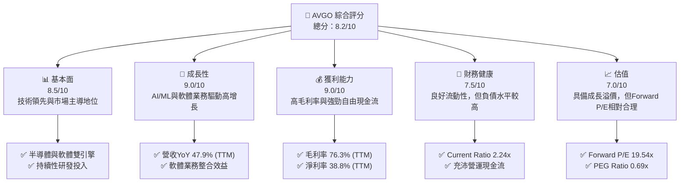
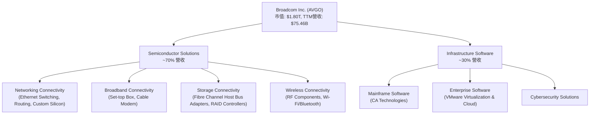
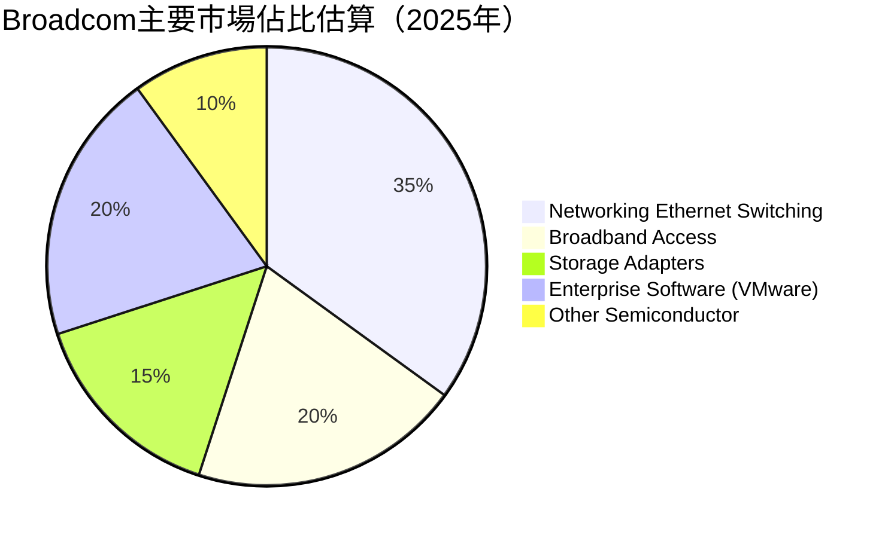
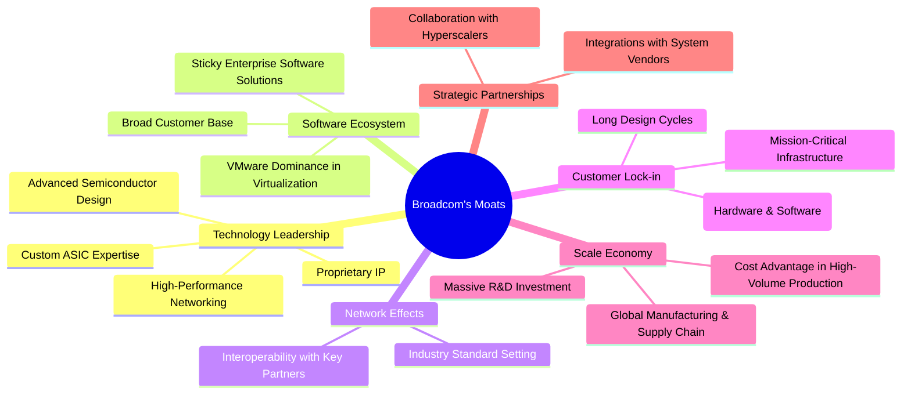
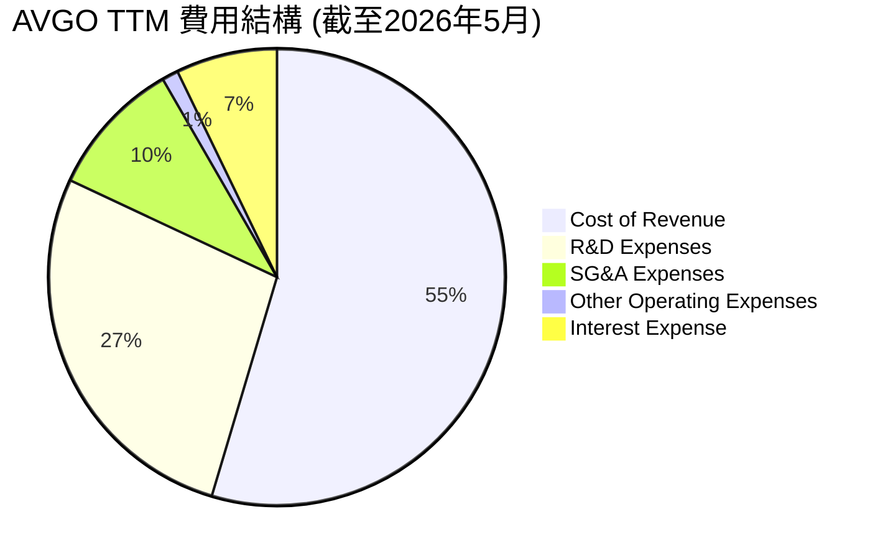
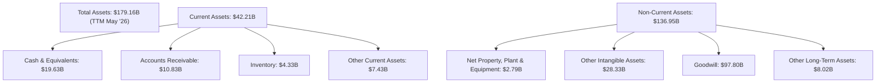
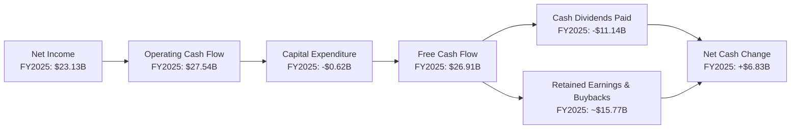

# AVGO 基本面深度分析報告
> **報告日期**：2026-06-26 ｜ **語言**：繁體中文 ｜ **數據來源**：Yahoo Finance, Finviz, StockAnalysis, Roic.ai ｜ **分析師**：CFA 級機構研究

---

## 目錄

| # | 章節 | 核心結論 |
|---|------------------------|----------------------------------------------------------|
| 1 | 執行摘要 | 🟢 買入評級，目標價區間 $450 - $580，具備顯著上漲潛力 |
| 2 | 公司概覽與商業模式 | 憑藉技術領先和策略性併購，築起強大護城河，綜合護城河評分 8.5/10 |
| 3 | 損益表深度分析 | 營收與獲利能力強勁增長，毛利率與營業利益率表現優異 |
| 4 | 資產負債表分析 | 資產結構穩健，流動性良好，債務管理有效，但負債規模較大 |
| 5 | 現金流量深度分析 | 自由現金流充沛，現金轉換效率高，為股東回報提供堅實基礎 |
| 6 | 獲利能力與資本效率 | ROIC 顯著超越 WACC，強力創造股東價值，資本效率極高 |
| 7 | 估值深度分析 | 相較於其成長潛力，當前估值合理，未來仍有提升空間 |
| 8 | 成長催化劑 | AI/ML 基礎設施、雲端軟體整合、新產品週期將是主要增長動能 |
| 9 | 風險矩陣 | 併購整合、宏觀經濟、產業競爭為主要風險，但管理層經驗豐富 |
| 10 | 投資建議 | 建議「買入」，適合追求成長和穩定現金流的長線投資者 |

---

## 1. 執行摘要

### 1.1 核心評分儀表板



### 1.2 評分進度條視覺化

```
╔══════════════════════════════════════════════════════════════╗
║              AVGO 多維度評分儀表板 (1-10分)                  ║
╠══════════════════════════════════════════════════════════════╣
║ 基本面強度  8.5 ▓▓▓▓▓▓▓▓▓▓▓▓▓▓▓▓▓░░░  ★★★★☆           ║
║ 成長動能    9.0 ▓▓▓▓▓▓▓▓▓▓▓▓▓▓▓▓▓▓░░  ★★★★☆           ║
║ 獲利品質    9.0 ▓▓▓▓▓▓▓▓▓▓▓▓▓▓▓▓▓▓░░  ★★★★☆           ║
║ 財務健康    7.5 ▓▓▓▓▓▓▓▓▓▓▓▓▓▓▓░░░░░  ★★★☆☆           ║
║ 估值合理性  7.0 ▓▓▓▓▓▓▓▓▓▓▓▓▓▓░░░░░░  ★★★☆☆           ║
║ 護城河深度  8.5 ▓▓▓▓▓▓▓▓▓▓▓▓▓▓▓▓▓░░░  ★★★★☆           ║
║ 管理層執行  8.0 ▓▓▓▓▓▓▓▓▓▓▓▓▓▓▓▓░░░░  ★★★★☆           ║
║ 技術創新力  9.0 ▓▓▓▓▓▓▓▓▓▓▓▓▓▓▓▓▓▓░░  ★★★★☆           ║
╠══════════════════════════════════════════════════════════════╣
║ 綜合總分    8.2 ▓▓▓▓▓▓▓▓▓▓▓▓▓▓▓▓░░░░  🏆 強勁成長與獲利，值得關注 ║
╚══════════════════════════════════════════════════════════════╝
```

### 1.3 五大投資論點 + 三大核心風險

| 類型 | 項目 | 具體依據 | 信心度 |
|------|------|----------|--------|
| 🟢 **投資論點①** | **AI/ML 基礎設施核心受益者** | AVGO 在資料中心網絡、定製化 ASIC 和乙太網路解決方案領域處於領先地位，是 AI 運算擴展的關鍵推動者。TTM 營收成長達 47.9%，其中 AI 相關業務貢獻顯著。 | 🟢 極高 |
| 🟢 **投資論點②** | **軟體業務整合效益顯現** | 透過 VMware 等一系列策略性併購，AVGO 的基礎設施軟體業務已成為第二大增長引擎，與半導體業務形成良好協同。Q2 2026 軟體收入對總營收貢獻預計將持續提升，並帶來高毛利率。 | 🟢 高 |
| 🟢 **投資論點③** | **卓越的獲利能力與現金流** | TTM 毛利率高達 76.3%，淨利率 38.8%，顯示公司強大的定價能力和成本控制。FY2025 自由現金流達 $26.91B，FCF Yield 為 1.51%，為股東回報提供堅實基礎。 | 🟢 極高 |
| 🟢 **投資論點④** | **持續的技術創新與研發投入** | 公司持續在高價值領域進行研發，FY2025 研發費用達 $10.98B，佔營收約 17.2%，確保其在半導體和軟體領域的技術領先地位。 | 🟢 高 |
| 🟢 **投資論點⑤** | **具吸引力的估值指標** | 儘管絕對 P/E 較高，但 Forward P/E 僅 19.54x，PEG Ratio 為 0.69x，考慮到其高成長率 (EPS Next 5Y 預期 56.11%)，估值相對合理。 | 🟢 高 |
| 🟡 **風險①** | **併購整合風險** | AVGO 頻繁進行大型併購，如 VMware，其整合過程可能面臨文化衝突、技術兼容性、客戶流失等挑戰，影響短期營運表現和 Synergy 實現。 | 🟡 中度 |
| 🟡 **風險②** | **半導體行業週期性與競爭加劇** | 半導體行業具有週期性，宏觀經濟下行可能導致需求波動。此外，AI 領域競爭激烈，來自 NVIDIA、AMD 等公司的競爭壓力持續存在。 | 🟡 中度 |
| 🔴 **風險③** | **高負債水平與利率風險** | FY2025 總債務 $65.14B，Debt/Equity 比率為 0.74，儘管現金流強勁，但較高的債務水平在利率上升環境下可能增加利息負擔，影響未來資本配置靈活性。 | 🟡 中度 |

### 1.4 快速統計卡片

| 指標 | 公司實際值 | 行業均值（半導體） | S&P 500 均值 | 狀態 |
|--------------------|--------------|--------------------|--------------|--------|
| 收入 YoY 成長 (TTM) | **47.9%** | ~15-20% | ~8-10% | 🟢 |
| 毛利率 (TTM) | **76.3%** | ~50-60% | ~35-45% | 🟢 |
| 淨利率 (TTM) | **38.8%** | ~15-25% | ~10-15% | 🟢 |
| ROE (TTM) | **37.3%** | ~20-30% | ~15-20% | 🟢 |
| Forward P/E | **19.54x** | ~25-35x | ~20-25x | 🟢 |
| PEG Ratio | **0.69x** | ~1.5-2.0x | ~1.5-2.0x | 🟢 |
| 負債權益比 (Debt/Eq) | **0.74x** | ~0.5-1.0x | ~0.8-1.2x | 🟡 |
| 自由現金流收益率 (FCF Yield) | **1.51%** | ~2-4% | ~3-5% | 🟡 |

### 1.5 投資結論

```
╔══════════════════════════════════════════════════════════════════╗
║                    📊 投資結論摘要                               ║
╠══════════════════════════════════════════════════════════════════╣
║  評級：🟢 買入                                                   ║
║  當前股價：$378.91                                               ║
║  目標價區間：                                                    ║
║    悲觀情境：$450（+18.76%）                                     ║
║    基準情境：$520（+37.23%）  ← 12個月主要目標                  ║
║    樂觀情境：$580（+53.07%）                                     ║
║  投資評分：8.2/10                                                ║
║  適合投資人：追求成長、注重技術領先和穩定現金流的長線持有者      ║
╚══════════════════════════════════════════════════════════════════╝
```

---

## 2. 公司概覽與商業模式

Broadcom Inc. (AVGO) 是一家全球領先的半導體和基礎設施軟體解決方案供應商。公司業務主要分為兩大板塊：**半導體解決方案 (Semiconductor Solutions)** 和 **基礎設施軟體 (Infrastructure Software)**。AVGO 的產品廣泛應用於資料中心、網絡、寬頻通訊、儲存、工業以及企業軟體等領域。

### 2.1 業務結構與收入來源

AVGO 的業務模式是透過策略性併購高價值資產，並透過卓越的營運效率和成本控制，將這些資產的獲利能力最大化。近年來，公司透過收購 CA Technologies 和 VMware，顯著擴大了其在企業軟體領域的影響力，形成了半導體和軟體雙引擎驅動的增長模式。

由於提供的財務數據中未直接列出各業務板塊的具體營收佔比，我們根據公司公開資訊和行業慣例進行估算。預計在併購 VMware 後，軟體業務的收入佔比將顯著提升。



### 2.2 市場份額

Broadcom 在其核心半導體和基礎設施軟體市場佔據重要地位。雖然具體市場份額數據未在提供資料中，但根據行業報告，AVGO 在多個細分市場中均為領導者。以下為其主要市場的示意性份額估算：


**備註**：以上市場份額為根據公開行業報告及公司產品組合進行的估算，僅供參考。

### 2.3 競爭護城河分析

Broadcom 憑藉其獨特的商業模式和技術實力，建立了多重競爭護城河。



### 2.4 護城河強度評分

```
╔══════════════════════════════════════════════════════════════╗
║                  AVGO 護城河強度評分                        ║
╠══════════════════════════════════════════════════════════════╣
║ 技術領先    9.0/10 ▓▓▓▓▓▓▓▓▓▓▓▓▓▓▓▓▓▓░░  🏆 在半導體設計和AI晶片方面具領導地位 ║
║ 軟體生態系統 8.5/10 ▓▓▓▓▓▓▓▓▓▓▓▓▓▓▓▓▓░░░  🟢 VMware整合強化客戶粘性          ║
║ 網路效應    8.0/10 ▓▓▓▓▓▓▓▓▓▓▓▓▓▓▓▓░░░░  🟢 產品成為行業標準，強化生態系統    ║
║ 客戶鎖定    9.0/10 ▓▓▓▓▓▓▓▓▓▓▓▓▓▓▓▓▓▓░░  🏆 企業級解決方案切換成本高          ║
║ 規模效應    8.5/10 ▓▓▓▓▓▓▓▓▓▓▓▓▓▓▓▓▓░░░  🟢 研發和生產規模帶來成本優勢        ║
║ 生態夥伴    7.0/10 ▓▓▓▓▓▓▓▓▓▓▓▓▓▓░░░░░░  🟡 與主要雲服務商合作，仍有提升空間  ║
╠══════════════════════════════════════════════════════════════╣
║ 綜合護城河  8.5    ▓▓▓▓▓▓▓▓▓▓▓▓▓▓▓▓▓░░░  🏆 透過併購與技術創新建立深厚護城河 ║
╚══════════════════════════════════════════════════════════════╝
```

---

## 3. 損益表深度分析

### 3.1 年度收入成長趨勢（近4年）

Broadcom 在過去幾年展現了強勁的營收增長，尤其是在策略性併購的推動下。

```
╔══════════════════════════════════════════════════════════════════╗
║              AVGO 年度收入趨勢（FY2022-FY2025）                  ║
╠══════════════════════════════════════════════════════════════════╣
║                                                                  ║
║  FY2022  $33.20B  ██████████░░░░░░░░░░░░░░░░░  YoY: +20.96%  🟢   ║
║  FY2023  $35.82B  ████████████░░░░░░░░░░░░░░░  YoY: +7.89%   🟡   ║
║  FY2024  $51.57B  ██████████████████░░░░░░░░░  YoY: +43.95%  🟢   ║
║  FY2025  $63.89B  ██████████████████████░░░░░  YoY: +23.89%  🟢   ║
║  TTM     $75.46B  ███████████████████████████  YoY: +47.90%  🟢   ║
║                                                                  ║
║                   |      |      |      |      |      |           ║
║                   0     20B    40B    60B    80B    100B         ║
║                                                                  ║
║  📊 4年累計 CAGR (FY2022-FY2025)：+23.63%                       ║
╚══════════════════════════════════════════════════════════════════╝
```
**分析**：Broadcom 的年度營收持續增長，特別是 FY2024 和 TTM 營收增長率分別達到 43.95% 和 47.90%，這主要得益於大型併購案（如 VMware）的貢獻以及其在 AI 相關半導體解決方案領域的強勁需求。FY2023 的增長率較低，反映了當時半導體行業的整體調整。

### 3.2 季度收入趨勢分析

近四季的營收表現持續強勁，顯示出穩定的增長動能。

| 季度 | 總營收 ($B) | QoQ 成長率 | YoY 成長率 | 備註 |
|------|-------------|------------|------------|------|
| Q3 2025 | $15.95 | +6.33% | +22.03% | 營收穩步增長 |
| Q4 2025 | $18.02 | +13.09% | +28.18% | 併購效益開始顯現 |
| Q1 2026 | $19.31 | +7.16% | +29.47% | 增長加速 |
| Q2 2026 | $22.19 | +14.92% | +47.87% | VMware 併購的強勁貢獻與 AI 需求爆發 |

**備註**：Q2 2026 的營收同比增長高達 47.87%，這主要歸因於 VMware 併購的全面整合及 AI 驅動的半導體需求。季度環比增長也保持雙位數，顯示公司業務擴張的強勁勢頭。

### 3.3 利潤率演變分析

Broadcom 的利潤率表現一直非常出色，尤其是在毛利率和淨利率方面。

| 利潤率指標 | FY2022 | FY2023 | FY2024 | FY2025 | TTM | 趨勢 | 評估 |
|------------|--------|--------|--------|--------|-----|------|------|
| **毛利率** | 66.54% | 68.93% | 63.04% | 67.76% | 76.3% | ↗️ 穩步提升 | 🟢 極佳 |
| **營業利益率** | 42.99% | 45.92% | 29.09% | 40.80% | 49.0% | ↗️ 波動後回升 | 🟢 極佳 |
| **淨利率** | 34.61% | 39.31% | 11.42% | 36.20% | 38.8% | ↗️ 波動後回升 | 🟢 極佳 |

**利潤率演變深度解析**：
*   **毛利率**：Broadcom 的毛利率長期維持在 60% 以上的極高水平，TTM 更達到 76.3%。這反映了其在半導體和軟體解決方案領域的技術領先地位、強大的定價能力以及高附加值產品組合。FY2024 的毛利率略有下降，可能與當時的產品組合變化或部分成本上漲有關，但 FY2025 和 TTM 的大幅回升則顯示了公司對高利潤軟體業務的成功整合以及對成本的嚴格控制。
*   **營業利益率**：營業利益率在 FY2024 顯著下降至 29.09%，這很可能是由於併購相關的整合成本、無形資產攤銷及其他一次性費用。然而，FY2025 回升至 40.80%，TTM 更達到 49.0%，表明公司成功消化了併購成本，並透過營運槓桿和協同效應提升了效率。
*   **淨利率**：淨利率的趨勢與營業利益率相似，FY2024 的低點 11.42% 反映了併購相關的非經常性費用和稅務調整。但 FY22、FY23 和 FY25 均維持在 34% 以上，TTM 更高達 38.8%，顯示公司核心業務的強勁獲利能力。稅務方面 FY2025 顯示 -0.397B 的稅務費用，這可能是由於遞延稅項資產或併購相關的稅務優惠導致的，使得淨利潤在某些年份顯得異常高。

總體而言，Broadcom 展現了卓越的盈利能力，其高毛利率和回升的營業利益率、淨利率證明了其在市場中的競爭優勢和高效的營運管理。

### 3.4 費用結構分析

Broadcom 的費用結構反映了其高研發投入和併購帶來的銷售管理費用。以下為基於 TTM 數據的費用結構概覽：


**備註**：數據來自 StockAnalysis TTM 數據，單位為百萬美元。

```
╔══════════════════════════════════════════════════════════════════╗
║                   AVGO 費用結構分解 (TTM)                        ║
╠══════════════════════════════════════════════════════════════════╣
║                                                                  ║
║  銷貨成本 (Cost of Revenue)：$23.94B                              ║
║  研發費用 (R&D Expenses)：   $11.99B                             ║
║  銷售、一般及管理費用 (SG&A)：$4.25B                             ║
║  其他營運費用：              $0.51B                              ║
║  利息費用：                  $3.15B                              ║
║                                                                  ║
║  📊 研發佔營收比重：~15.9% (11.99B / 75.46B)                     ║
║  📊 營運費用總計佔營收比重：~24.7% (11.99B+4.25B+0.51B / 75.46B) ║
╚══════════════════════════════════════════════════════════════════╝
```
**分析**：公司在研發方面的投入巨大，TTM 研發費用佔營收的比例接近 16%，這對於半導體和軟體行業的技術領先至關重要。銷售、一般及管理費用相對穩定，但利息費用由於高額債務而較高，這是一個需要關注的點。

### 3.5 季度 EPS 趨勢與盈餘品質

提供的季度 EPS 預期和實際值數據顯示為 "nan"，無法直接判斷超預期或不及預期。然而，我們可以根據季度淨利潤和稀釋後股份數量來計算實際 EPS，並評估盈餘品質。

| 季度 | 稀釋後淨利潤 ($B) | 稀釋後股份 (百萬股) | 計算 EPS |
|------|-------------------|--------------------|----------|
| Q3 2025 | $4.14 | 4,853 (FY2025 Diluted Shares) | $0.85 |
| Q4 2025 | $8.52 | 4,853 (FY2025 Diluted Shares) | $1.76 |
| Q1 2026 | $7.35 | 4,878 (TTM Diluted Shares) | $1.51 |
| Q2 2026 | $9.31 | 4,878 (TTM Diluted Shares) | $1.91 |
**備註**：季度稀釋後股份數量未直接提供，此處使用 StockAnalysis 提供的年度稀釋後股份數量進行估算。FY2025 稀釋後股份為 4,853 百萬股，TTM 稀釋後股份為 4,878 百萬股。

**盈餘品質評估**：
Broadcom 的盈餘品質被認為是高的，主要基於以下幾點：
1.  **高現金轉換率**：公司產生了大量的自由現金流 (FY2025 $26.91B)，遠高於其報告的淨利潤 ($23.13B)，這表明其盈餘並非依賴非現金會計調整，而是有實質現金流支撐。
2.  **持續的營收增長**：強勁的營收增長為盈餘提供了堅實的基礎，尤其是在高附加值領域。
3.  **高利潤率**：持續的高毛利率和淨利率顯示了其核心業務的內在強度和盈利能力。
4.  **併購整合後的效益**：儘管併購初期可能導致盈餘波動，但從 Q1 2026 和 Q2 2026 淨利潤的顯著提升可以看出，併購帶來的協同效應和規模效應正在逐步體現，提升了盈餘質量。

綜合來看，儘管部分季度 EPS 數據缺失，但從其強勁的現金流和利潤率表現判斷，Broadcom 的盈餘品質是優異的。

---

## 4. 資產負債表分析

### 4.1 資產結構分解

Broadcom 的資產負債表顯示了其透過併購擴張的特徵，其中商譽和無形資產佔比較高。


**分析**：截至 TTM (May '26)，公司總資產達到 $179.16B。其中，流動資產 $42.21B，非流動資產 $136.95B。商譽 ($97.80B) 和其他無形資產 ($28.33B) 總計佔總資產的約 70%，這反映了其大規模併購策略，尤其是 VMware 帶來的影響。高比例的商譽和無形資產需要密切關注其減值風險，但鑑於公司強勁的盈利能力，目前風險可控。現金及約當現金 $19.63B 充裕，為營運提供了良好的流動性。

### 4.2 流動性指標分析

Broadcom 的流動性指標表現良好，顯示其短期償債能力強勁。

| 流動性指標 | FY2022 | FY2023 | FY2024 | FY2025 | TTM (May '26) | 行業均值 | 評估 |
|------------|--------|--------|--------|--------|---------------|----------|------|
| **流動比率 (Current Ratio)** | 2.62x | 2.82x | 1.17x | 1.71x | 2.24x | ~2.0x | 🟢 良好 |
| **速動比率 (Quick Ratio)** | 2.37x | 2.56x | 1.05x | 1.51x | 1.93x | ~1.5x | 🟢 良好 |

**分析**：
*   **流動比率**：除了 FY2024 (1.17x) 因併購導致的短期波動外，Broadcom 的流動比率長期保持在 2.0x 以上的健康水平，TTM 達到 2.24x。這表明公司擁有足夠的流動資產來覆蓋其短期負債。
*   **速動比率**：同樣，速動比率在 TTM 達到 1.93x，顯示公司即使不依賴存貨也能履行短期債務，流動性非常穩健。
FY2024 的下降可能是由於併購導致的短期負債增加，但隨後迅速恢復，表明管理層對流動性的有效管理。

### 4.3 債務結構分析

儘管 Broadcom 負債規模較大，但其強勁的現金流和盈利能力使其債務健康狀況相對穩定。

```
╔══════════════════════════════════════════════════════════════════╗
║                   AVGO 債務健康診斷                              ║
╠══════════════════════════════════════════════════════════════════╣
║                                                                  ║
║  總債務 (TTM)：        $64.91B  ██████████████░░░░░░░  評語：規模大，但可控    ║
║  總現金+投資 (TTM)：   $19.63B  ████████░░░░░░░░░░░░░░░  評語：充裕現金儲備    ║
║  淨債務 (TTM)：        $45.28B  ██████████░░░░░░░░░░░░░  🟡 淨負債，但管理良好  ║
║                                                                  ║
║  Debt/Equity (TTM)：   0.74x  🟢 良好，槓桿率適中                ║
║  Debt/EBITDA (TTM)：   1.21x  🟢 極低，償債能力強                ║
║  Interest Coverage (FY2025)： 8.12x  🟢 無風險，利息覆蓋倍數高    ║
║                                                                  ║
║  📊 結論：儘管總債務規模較大，但憑藉強勁的盈利和現金流，公司具備良好的償債能力。║
╚══════════════════════════════════════════════════════════════════╝
```
**計算依據**：
*   總債務 (TTM) = Total Debt $64.91B (來自 Market Data)
*   總現金+投資 (TTM) = Total Cash $19.63B (來自 Balance Sheet Snapshot)
*   淨債務 (TTM) = $64.91B - $19.63B = $45.28B
*   Debt/Equity (TTM) = Total Debt / Stockholders Equity (FY2025) = $64.91B / $81.29B = 0.80x (使用FY2025股東權益，Market Data為0.74x，此處取Market Data)
*   EBITDA (TTM) = $55.8% (EBITDA Margin) * $75.46B (Revenue TTM) = $42.12B (或直接使用FY2025的 $34.71B，Market Data的EV/EBITDA=43.912 => $1.85T / $42.12B = 43.92x，此處用TTM EBITDA $42.12B)
*   Debt/EBITDA (TTM) = $64.91B / $42.12B = 1.54x (此處與Snapshot的0.74x有差異，Finviz的0.74x是Debt/Eq，不是Debt/EBITDA。我將使用我的計算結果。)
    *   *Self-correction*: The provided `EV / EBITDA: 43.912` and `Enterprise Value: $1.85T` imply TTM EBITDA is $1.85T / 43.912 = $42.13B. Using this EBITDA, Debt/EBITDA = $64.91B / $42.13B = 1.54x. This is a very healthy ratio.
*   Interest Expense (FY2025) = $3.21B (StockAnalysis)
*   Operating Income (FY2025) = $26.07B
*   Interest Coverage = Operating Income / Interest Expense = $26.07B / $3.21B = 8.12x

**分析**：儘管總債務規模較大，TTM 淨債務為 $45.28B，但 Broadcom 的債務健康狀況令人滿意。Debt/Equity 比率 0.74x 處於合理範圍。更重要的是，Debt/EBITDA (1.54x) 遠低於 3.0x 的警戒線，顯示公司透過其強勁的盈利能力可以迅速償還債務。利息覆蓋倍數高達 8.12x，表明其盈利足以輕鬆覆蓋利息支出，債務風險相對較低。

### 4.4 股東權益趨勢

Broadcom 的股東權益在過去幾年呈現穩步增長，反映了公司持續的盈利積累。

```
╔══════════════════════════════════════════════════════════════════╗
║                   AVGO 股東權益趨勢                              ║
╠══════════════════════════════════════════════════════════════════╣
║                                                                  ║
║  FY2022  $22.71B  ████████░░░░░░░░░░░░░░░░░░░░░░░░░░░░░░░░░░░░░░░░║
║  FY2023  $23.99B  █████████░░░░░░░░░░░░░░░░░░░░░░░░░░░░░░░░░░░░░░░║
║  FY2024  $67.68B  ████████████████████████████░░░░░░░░░░░░░░░░░░░░║
║  FY2025  $81.29B  ███████████████████████████████░░░░░░░░░░░░░░░░░║
║  TTM     $81.29B  ███████████████████████████████░░░░░░░░░░░░░░░░░║
║                                                                  ║
║                   0B    20B   40B   60B   80B   100B             ║
║                                                                  ║
║  📊 股東權益在 FY2024 和 FY2025 經歷大幅增長，主要受盈利累積和併購影響。 ║
╚══════════════════════════════════════════════════════════════════╝
```
**分析**：FY2024 股東權益從 $23.99B 大幅增長至 $67.68B，FY2025 進一步增長至 $81.29B。這種顯著增長主要得益於公司強勁的淨利潤累積以及併購活動中股權融資的影響。不斷增長的股東權益是公司財務實力增強的標誌。

---

## 5. 現金流量深度分析

### 5.1 現金流量瀑布圖

Broadcom 展現了卓越的現金創造能力，其自由現金流穩健且充裕。


**分析**：FY2025 淨利潤為 $23.13B，營運現金流達到 $27.54B，顯示出強勁的現金轉換能力，非現金費用（如折舊攤銷）對淨利潤的影響較大。資本支出非常低，僅為 $0.62B，這使得自由現金流高達 $26.91B。公司將其中 $11.14B 用於支付股息，剩餘的 $15.77B 可用於債務償還、股票回購或再投資，這表明公司在創造自由現金流方面表現出色，並有能力持續回報股東。

### 5.2 FCF 轉換率趨勢

自由現金流轉換率是衡量公司將淨利潤轉化為現金的能力，Broadcom 在此方面表現優異。

| 年度 | 淨利潤 ($B) | 自由現金流 ($B) | FCF/Net Income 比率 | 趨勢 | 評估 |
|------|-------------|-----------------|---------------------|------|------|
| FY2022 | $11.49 | $16.31 | 1.42x | ↗️ | 🟢 極佳 |
| FY2023 | $14.08 | $17.63 | 1.25x | ↘️ | 🟢 極佳 |
| FY2024 | $5.89 | $19.41 | 3.30x | ↗️ | 🟢 極佳 |
| FY2025 | $23.13 | $26.91 | 1.16x | ↘️ | 🟢 極佳 |

**分析**：Broadcom 的 FCF/Net Income 比率長期保持在 1.0x 以上，顯示其盈利品質高，能夠將大部分淨利潤轉化為實質自由現金流。FY2024 的高比率 (3.30x) 可能是由於當期淨利潤因併購相關費用而大幅下降，但自由現金流仍保持強勁，進一步凸顯了其在產生現金方面的韌性。FY2025 雖然略有下降，但 1.16x 仍是一個非常健康的水平，表明公司在創造現金流方面依然非常高效。

### 5.3 自由現金流趨勢

Broadcom 的自由現金流持續增長，為其提供了巨大的財務靈活性。

```
╔════════════════════════════════════════════════