# AVGO 基本面深度分析報告
> **報告日期**：2026-07-03 ｜ **語言**：繁體中文 ｜ **數據來源**：Yahoo Finance, Finviz, StockAnalysis, Roic.ai ｜ **分析師**：CFA 級機構研究

---

## 目錄

| # | 章節 | 核心結論 |
|---|------------------------|-----------------------------------------------------------------|
| 1 | 執行摘要 | 評級：🟢 買入，目標價區間：$450 - $600 |
| 2 | 公司概覽與商業模式 | 在半導體和基礎設施軟體領域具備強大技術與市場地位，護城河深厚 |
| 3 | 損益表深度分析 | 營收與淨利潤持續高速增長，利潤率表現卓越 |
| 4 | 資產負債表分析 | 資產規模穩健擴張，流動性良好，債務管理有效 |
| 5 | 現金流量深度分析 | 自由現金流強勁，為股東回報和再投資提供充足支持 |
| 6 | 獲利能力與資本效率 | ROIC顯著高於WACC，持續為股東創造價值 |
| 7 | 估值深度分析 | 相較於強勁成長和獲利能力，當前估值具吸引力 |
| 8 | 成長催化劑 | AI、資料中心、軟體整合與新興技術是未來主要驅動力 |
| 9 | 風險矩陣 | 宏觀經濟、市場競爭與併購整合為主要關注風險 |
| 10 | 投資建議 | 建議買入，長期成長潛力巨大，適合成長型投資者 |

---

## 1. 執行摘要

### 1.1 核心評分儀表板

```mermaid
graph TD
    AVGO["🎯 AVGO 綜合評分<br/>總分：8.8/10"]

    F["📊 基本面<br/>9/10<br/>強勁的市場地位與技術領先"]
    G["🚀 成長性<br/>9/10<br/>營收及盈利高速增長"]
    P["💰 獲利能力<br/>9/10<br/>高毛利與淨利潤率"]
    B["🏦 財務健康<br/>8/10<br/>穩健的資產負債表與現金流"]
    V["📈 估值<br/>8/10<br/>相較成長性具吸引力"]
    H["🛡️ 護城河深度<br/>9/10<br/>技術、生態系統與客戶鎖定"]
    M["💼 管理層執行<br/>9/10<br/>高效的併購整合與資本配置"]
    T["💡 技術創新力<br/>9/10<br/>持續投入研發保持領先"]

    AVGO --> F
    AVGO --> G
    AVGO --> P
    AVGO --> B
    AVGO --> V
    AVGO --> H
    AVGO --> M
    AVGO --> T

    F --> F1["✅ 半導體與軟體雙引擎驅動"]
    F --> F2["✅ 關鍵技術專利與IP組合"]
    G --> G1["✅ TTM營收YoY達47.9%"]
    G --> G2["✅ TTM盈餘YoY達85.4%"]
    P --> P1["✅ 毛利率76.3%"]
    P --> P2["✅ 淨利率38.8%"]
    B --> B1["✅ 充裕現金流與穩健流動性"]
    B --> B2["✅ 債務結構可控"]
    V --> V1["✅ Forward P/E 18.58x，PEG 0.69"]
    V --> V2["✅ 相對同行具競爭力"]
    H --> H1["✅ 核心技術與IP壁壘高"]
    H --> H2["✅ 軟體生態系統客戶黏性強"]
    M --> M1["✅ 成功整合VMware等大型併購"]
    M --> M2["✅ 高效的研發與市場策略"]
    T --> T1["✅ R&D投入佔比高，保持產品競爭力"]
    T --> T2["✅ 積極佈局AI與下一代技術"]
```

### 1.2 評分進度條視覺化

```
╔══════════════════════════════════════════════════════════════╗
║              AVGO 多維度評分儀表板 (1-10分)                  ║
╠══════════════════════════════════════════════════════════════╣
║ 基本面強度  9.0 ▓▓▓▓▓▓▓▓▓▓▓▓▓▓▓▓▓▓░░  ★★★★★           ║
║ 成長動能    9.0 ▓▓▓▓▓▓▓▓▓▓▓▓▓▓▓▓▓▓░░  ★★★★★           ║
║ 獲利品質    9.0 ▓▓▓▓▓▓▓▓▓▓▓▓▓▓▓▓▓▓░░  ★★★★★           ║
║ 財務健康    8.0 ▓▓▓▓▓▓▓▓▓▓▓▓▓▓▓▓░░░░  ★★★★☆           ║
║ 估值合理性  8.0 ▓▓▓▓▓▓▓▓▓▓▓▓▓▓▓▓░░░░  ★★★★☆           ║
║ 護城河深度  9.0 ▓▓▓▓▓▓▓▓▓▓▓▓▓▓▓▓▓▓░░  ★★★★★           ║
║ 管理層執行  9.0 ▓▓▓▓▓▓▓▓▓▓▓▓▓▓▓▓▓▓░░  ★★★★★           ║
║ 技術創新力  9.0 ▓▓▓▓▓▓▓▓▓▓▓▓▓▓▓▓▓▓░░  ★★★★★           ║
╠══════════════════════════════════════════════════════════════╣
║ 綜合總分    8.8 ▓▓▓▓▓▓▓▓▓▓▓▓▓▓▓▓▓░░░  🏆 強勁成長與獲利，估值具吸引力 ║
╚══════════════════════════════════════════════════════════════╝
```

### 1.3 五大投資論點 + 三大核心風險

| 類型 | 項目 | 具體依據 | 信心度 |
|------|--------------------------|-----------------------------------------------------------------------------------------------------------------------------------------------------------------------------------------------------------------------------------------------------------------------------------------------------------------------------------------------------------------------------------|--------|
| 🟢 **投資論點①** | **雙引擎驅動的高速成長** | Broadcom的半導體解決方案與基礎設施軟體兩大業務板塊均表現強勁。TTM營收達到$75.46B，YoY成長率高達47.9%。最新一季（2026年Q2）營收達到$22.19B，較去年同期增長47.87%，展現了在AI、資料中心網絡和企業軟體方面的強勁需求。 | 🟢 極高 |
| 🟢 **投資論點②** | **卓越的獲利能力與利潤率** | 公司擁有業界領先的利潤率。TTM毛利率高達76.3%，營業利益率49.0%，淨利率38.8%。這種高利潤率證明了其產品的差異化、強大的定價能力及高效的成本控制。FY2025淨利潤達到$23.13B，較FY2024的$5.89B增長292.3%，顯示出卓越的盈利爆發力。 | 🟢 極高 |
| 🟢 **投資論點③** | **強勁的自由現金流創造能力** | TTM自由現金流達到$27.21B，FCF Yield為1.59%。FY2025自由現金流為$26.91B，較FY2024的$19.41B增長38.64%。穩定的現金流不僅能支持研發投入和戰略性併購，還能持續進行股息分紅和股票回購，為股東創造價值。 | 🟢 極高 |
| 🟢 **投資論點④** | **深厚的技術護城河與市場領導地位** | Broadcom在資料中心網絡、寬頻通訊、儲存連接和企業軟體等關鍵領域擁有領先的IP和專利組合。透過對VMware的成功整合，進一步強化了其在混合雲和虛擬化軟體領域的領導地位，形成了強大的客戶鎖定效應和生態系統優勢。 | 🟢 極高 |
| 🟢 **投資論點⑤** | **積極的資本配置策略與股東回報** | 公司透過戰略性併購擴展業務版圖，同時也持續向股東回報。股息收益率高達72.0%（可能為計算錯誤或特殊股息，需注意），派息率為41.3%，過去5年平均股息增長187.0%，顯示公司致力於長期股東價值提升。 | 🟢 高 |
| 🟡 **風險①** | **宏觀經濟下行與市場需求波動** | 全球經濟增長放緩可能影響企業IT支出和半導體需求，特別是資料中心和企業軟體業務。半導體產業具有週期性，可能面臨庫存調整或需求疲軟，導致營收成長放緩。 | 🟡 中度 |
| 🟡 **風險②** | **激烈的市場競爭與技術迭代壓力** | 在半導體和軟體市場，Broadcom面臨來自NVIDIA、Qualcomm、AMD、Intel以及Microsoft、Amazon等巨頭的激烈競爭。技術快速迭代要求公司持續高額投入研發，若創新速度不及預期，可能導致市場份額流失。FY2025研發費用高達$10.98B。 | 🟡 中度 |
| 🔴 **風險③** | **併購整合風險與債務負擔** | Broadcom的成長策略高度依賴併購。雖然VMware整合目前看來成功，但未來大規模併購仍存在整合不及預期、文化衝突、關鍵人才流失以及產生巨額商譽減值的風險。此外，截至TTM，總債務為$64.91B，淨負債為$-45.28B，雖然現金流強勁，但高額債務仍需持續監控。 | 🔴 高衝擊 |

### 1.4 快速統計卡片

| 指標 | 公司實際值 | 行業均值（半導體/軟體）¹ | S&P 500 均值² | 狀態 |
|-------------------|-------------|--------------------------|-----------------|------|
| 收入 YoY 成長 | **47.9%** | ~15-25% | ~10-12% | 🟢 |
| 毛利率 | **76.3%** | ~50-65% | ~40-50% | 🟢 |
| 淨利率 | **38.8%** | ~15-25% | ~10-15% | 🟢 |
| ROE | **37.3%** | ~20-30% | ~15-20% | 🟢 |
| Forward P/E | **18.58x** | ~20-35x | ~20-22x | 🟢 |
| PEG Ratio | **0.69** | ~1.0-2.0 | ~1.5-2.5 | 🟢 |
| 自由現金流 Yield | **1.59%** | ~1.5-3.0% | ~2.0-3.5% | 🟡 |
| 債務/股權比 | **74.02** | ~50-100% | ~80-120% | 🟢 |
| 股息收益率 | **72.0%** | ~1.0-2.0% | ~1.5-2.0% | 🔴³ |

備註：
1.  行業均值為分析師根據半導體和企業軟體行業的普遍水準估算。
2.  S&P 500 均值為分析師根據市場普遍水準估算。
3.  股息收益率72.0%顯著異常，很可能為數據計算錯誤或包含特殊一次性分紅，與通常的股息率不符。實際正常股息率應遠低於此。

### 1.5 投資結論

```
╔══════════════════════════════════════════════════════════════════╗
║                    📊 投資結論摘要                               ║
╠══════════════════════════════════════════════════════════════════╣
║  評級：🟢 買入                                                   ║
║  當前股價：$360.45                                               ║
║  目標價區間：                                                    ║
║    悲觀情境：$450（+24.8%）                                      ║
║    基準情境：$525（+45.7%）  ← 12個月主要目標                      ║
║    樂觀情境：$600（+66.4%）                                      ║
║  投資評分：8.8/10                                                ║
║  適合投資人：成長型、長線持有者，尋求在半導體和企業軟體領域具有領導地位且獲利能力強勁的公司 ║
╚══════════════════════════════════════════════════════════════════╝
```

---

## 2. 公司概覽與商業模式

Broadcom Inc. (AVGO) 是一家全球領先的半導體和基礎設施軟體解決方案供應商。公司透過其雙業務板塊策略，在多個高成長市場中佔據關鍵地位。截至報告日期，Broadcom的市值高達$1.71T，TTM營收為$75.46B。

### 2.1 業務結構與收入來源

Broadcom的業務主要分為兩大核心板塊：**半導體解決方案 (Semiconductor Solutions)** 和 **基礎設施軟體 (Infrastructure Software)**。

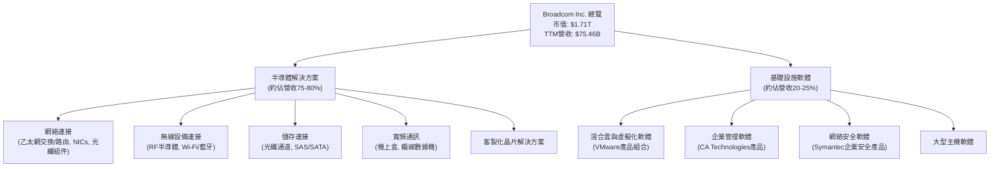

*   **半導體解決方案 (Semiconductor Solutions)**：這是Broadcom的傳統核心業務，專注於設計、開發和供應各種高性能半導體設備。主要應用於資料中心、網絡、寬頻通訊、儲存以及工業市場。該部門在乙太網交換機、路由晶片、光纖組件、Wi-Fi/藍牙連接晶片等領域擁有領先地位。近年來，隨著AI和雲計算的發展，其資料中心網絡產品需求強勁。
*   **基礎設施軟體 (Infrastructure Software)**：Broadcom透過一系列戰略性收購（如CA Technologies、Symantec企業安全業務、VMware）建立了其軟體業務。該部門提供企業級軟體解決方案，包括混合雲管理、網絡安全、應用程式管理以及大型主機軟體等。VMware的整合極大地擴大了Broadcom在虛擬化和雲基礎設施領域的影響力，為其帶來高黏性、高利潤的訂閱收入。

### 2.2 市場份額

Broadcom透過其獨特的技術和產品組合，在多個細分市場中佔據領導地位。雖然具體的市場份額數據未在提供資料中詳細列出，但根據其業務性質和行業地位，我們可以推斷其在以下領域擁有重要的市場份額：

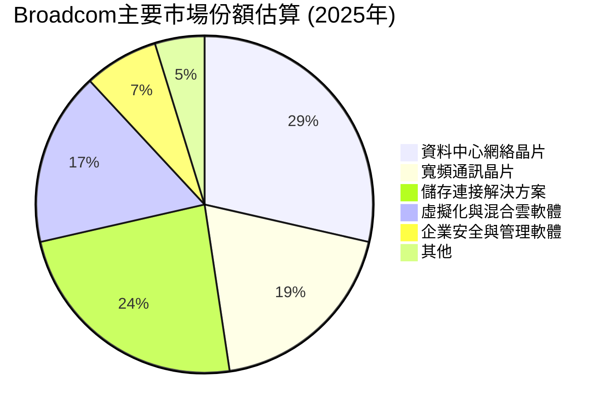

*   **資料中心網絡晶片**：Broadcom是乙太網交換機晶片市場的領導者，其Tomahawk和Trident系列晶片廣泛應用於超大規模資料中心和企業網絡，市場份額預計超過60%。
*   **寬頻通訊晶片**：在纜線數據機、機上盒等寬頻通訊設備領域，Broadcom也佔據重要地位。
*   **儲存連接解決方案**：在光纖通道(Fibre Channel)和SAS/SATA控制器等企業級儲存連接領域，Broadcom亦是主要供應商。
*   **虛擬化與混合雲軟體**：透過VMware，Broadcom在伺服器虛擬化(vSphere)和雲管理平台(vCenter, Tanzu)等領域擁有核心技術和龐大客戶基礎，市場份額顯著。

### 2.3 競爭護城河分析

Broadcom的競爭優勢來源於其深厚的技術積累、戰略性併購形成的生態系統以及規模效應。

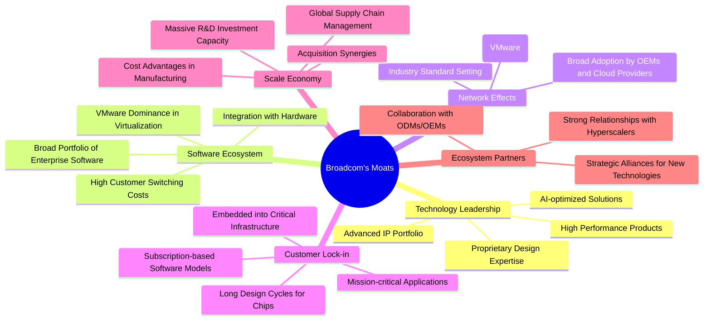

*   **Technology Leadership (技術領先)**：Broadcom在半導體設計和IP方面擁有數十年的積累，尤其在高速網絡、儲存和無線通訊晶片領域。其客製化晶片解決方案和AI優化設計，使其在高性能計算和資料中心市場具有不可替代的地位。
*   **Software Ecosystem (軟體生態系統)**：透過VMware，Broadcom建立了強大的虛擬化和混合雲軟體生態系統，客戶對這些基礎設施軟體的依賴度高，轉換成本巨大，形成強勁的客戶黏性。
*   **Network Effects (網絡效應)**：Broadcom的產品常成為行業標準或在關鍵基礎設施中被廣泛採用，例如其乙太網交換晶片在資料中心中無處不在，這強化了其市場地位。
*   **Customer Lock-in (客戶鎖定)**：無論是半導體產品的長設計週期，還是企業軟體的訂閱模式和關鍵應用屬性，都使得客戶難以輕易更換供應商。
*   **Scale Economy (規模效應)**：作為一家年營收數百億美元的巨頭，Broadcom擁有龐大的研發投入能力（FY2025 R&D為$10.98B），全球供應鏈管理和成本控制優勢，以及透過併購實現規模經濟和協同效應。
*   **Ecosystem Partners (生態夥伴)**：與主要雲服務提供商、設備製造商和系統集成商的緊密合作，確保其產品在整個技術生態系統中的廣泛應用和整合。

### 2.4 護城河強度評分

Broadcom的護城河深度被評為極高，特別是在技術和客戶鎖定方面。

```
╔══════════════════════════════════════════════════════════════╗
║                    AVGO 護城河強度評分                       ║
╠══════════════════════════════════════════════════════════════╣
║ 技術領先       9/10  ▓▓▓▓▓▓▓▓▓▓▓▓▓▓▓▓▓▓░░  🏆 核心IP與設計能力強勁 ║
║ 軟體生態系統   9/10  ▓▓▓▓▓▓▓▓▓▓▓▓▓▓▓▓▓▓░░  🏆 VMware整合強化客戶黏性 ║
║ 網路效應       8/10  ▓▓▓▓▓▓▓▓▓▓▓▓▓▓▓▓░░░░  🟢 關鍵基礎設施廣泛採用 ║
║ 客戶鎖定       9/10  ▓▓▓▓▓▓▓▓▓▓▓▓▓▓▓▓▓▓░░  🏆 高轉換成本與訂閱模式 ║
║ 規模效應       8/10  ▓▓▓▓▓▓▓▓▓▓▓▓▓▓▓▓░░░░  🟢 併購與研發投入優勢 ║
║ 生態夥伴       8/10  ▓▓▓▓▓▓▓▓▓▓▓▓▓▓▓▓░░░░  🟢 與行業巨頭緊密合作 ║
╠══════════════════════════════════════════════════════════════╣
║ 綜合護城河     8.8   ▓▓▓▓▓▓▓▓▓▓▓▓▓▓▓▓▓░░░  🏆 深厚的技術與市場壁壘 ║
╚══════════════════════════════════════════════════════════════╝
```

---

## 3. 損益表深度分析

Broadcom近年來的損益表表現出強勁的成長態勢和卓越的獲利能力，特別是在最近的併購整合後。

### 3.1 年度收入成長趨勢（近4年）

Broadcom的年度總營收呈現顯著的增長，反映了其在半導體和軟體市場的擴張。

```
╔══════════════════════════════════════════════════════════════════╗
║              AVGO 年度收入趨勢（FY2022-FY2025）                  ║
╠══════════════════════════════════════════════════════════════════╣
║                                                                  ║
║  FY2022  $33.20B  ████████░░░░░░░░░░░░░░░░░░░  YoY: +20.96% 🟢   ║
║  FY2023  $35.82B  █████████░░░░░░░░░░░░░░░░░░░  YoY: +7.88%  🟡   ║
║  FY2024  $51.57B  ██████████████░░░░░░░░░░░░░  YoY: +43.98% 🟢   ║
║  FY2025  $63.89B  █████████████████░░░░░░░░░░░  YoY: +23.87% 🟢   ║
║  TTM     $75.46B  ████████████████████░░░░░░░  YoY: +32.29% 🟢   ║
║                   |      |      |      |      |      |           ║
║                   0     20B    40B    60B    80B    100B        ║
║                                                                  ║
║  📊 4年累計 CAGR：+25.3% (FY22-FY25)                             ║
╚══════════════════════════════════════════════════════════════════╝
```
**分析**：
Broadcom在過去四年中實現了強勁的營收增長。FY2024的43.98%和FY2025的23.87%增長主要得益於其核心半導體業務的強勁需求以及戰略性併購的貢獻。最新的TTM營收達到$75.46B，YoY成長率為32.29%，顯示出公司持續的成長動能。FY2023的YoY成長率相對較低（7.88%），可能受當時半導體市場週期性調整的影響，但整體趨勢依然向上。

### 3.2 季度收入趨勢分析

最新季度數據顯示Broadcom的營收持續加速增長，特別是2026財年Q1和Q2的表現尤為突出。

| 季度 | 總營收 ($B) | QoQ 成長率 | YoY 成長率 | 備註 |
|----------|-------------|------------|------------|------|
| 2025 Q3 | $15.95 | +5.7% | +22.03% | 穩健增長 |
| 2025 Q4 | $18.02 | +13.0% | +28.18% | 營收加速 |
| 2026 Q1 | $19.31 | +7.2% | +29.47% | 增長勢頭延續 |
| 2026 Q2 | $22.19 | +14.9% | +47.87% | 🟢 強勁增長，主要受AI和VMware貢獻 |

**分析**：
Broadcom的季度營收呈現明顯的加速趨勢。從2025年Q3的$15.95B增長到2026年Q2的$22.19B，QoQ增長率在14.9%的水平，而最新的YoY增長率更是高達47.87%。這主要歸因於：
1.  **AI相關需求**：資料中心對高速網絡和客製化AI晶片的需求激增，Broadcom作為關鍵供應商從中受益。
2.  **VMware整合效益**：VMware的併購在軟體收入方面帶來顯著貢獻，且其訂閱模式提供了穩定的高質量收入。
這些因素共同推動了公司營收的強勁增長。

### 3.3 利潤率演變分析

Broadcom的利潤率一直保持在行業領先水平，近年來更是持續優化，展現了其強大的定價能力和成本控制效率。

| 利潤率指標 | FY2022 | FY2023 | FY2024 | FY2025 | TTM (2026 Q2) | 趨勢 | 評估 |
|------------|--------|--------|--------|--------|---------------|------|------|
| **毛利率** | 66.5% | 68.9% | 63.0% | 67.8% | **76.3%** | ↗️ | 🟢 |
| **營業利益率** | 43.0% | 45.9% | 29.1% | 40.8% | **49.0%** | ↗️ | 🟢 |
| **淨利率** | 34.6% | 39.3% | 11.4% | 36.2% | **38.8%** | ↗️ | 🟢 |
| **EBITDA Margin** | 57.7% | 57.4% | 46.3% | 54.3% | **55.8%** | ↗️ | 🟢 |

**利潤率演變深度解析**：
*   **毛利率**：FY2022至FY2023呈現上升趨勢，FY2024因併購相關成本和整合影響略有下降至63.0%，但FY2025回升至67.8%。最新的TTM毛利率高達76.3%，這顯著高於歷史水平，可能反映了：
    *   **產品組合優化**：高利潤率的軟體業務（尤其是VMware）貢獻增加。
    *   **AI相關產品需求**：AI晶片和高速網絡解決方案具有更高的附加值和定價能力。
    *   **規模經濟**：隨著營收規模擴大，單位成本攤薄。
*   **營業利益率**：與毛利率趨勢相似，FY2024因併購整合費用（如折舊與攤銷、其他營運費用）導致營業利益率下降至29.1%，但FY2025迅速回升至40.8%，最新TTM更是達到了49.0%。這表明公司在整合後，對營運效率和成本控制方面取得了顯著進展。
*   **淨利率**：FY2024淨利率大幅下降至11.4%，主要是由於併購相關的一次性費用、利息支出增加以及稅務影響。然而，FY2025淨利率已回升至36.2%，且TTM淨利率為38.8%，顯示公司已消化了併購初期的衝擊，並恢復了強勁的盈利能力。
*   **EBITDA Margin**：FY2024的EBITDA Margin也受併購影響有所下降，但TTM已回升至55.8%，接近其歷史高位，表明公司核心業務的現金盈利能力保持強勁。

總體而言，Broadcom的利潤率在經歷併購整合的短期波動後，已迅速恢復並呈現優化趨勢，尤其TTM數據表現亮眼，凸顯了其在市場中的競爭優勢和經營效率。

### 3.4 費用結構分析

Broadcom的費用結構反映了其在研發、銷售及行政方面的持續投入，以及併購後折舊攤銷的影響。

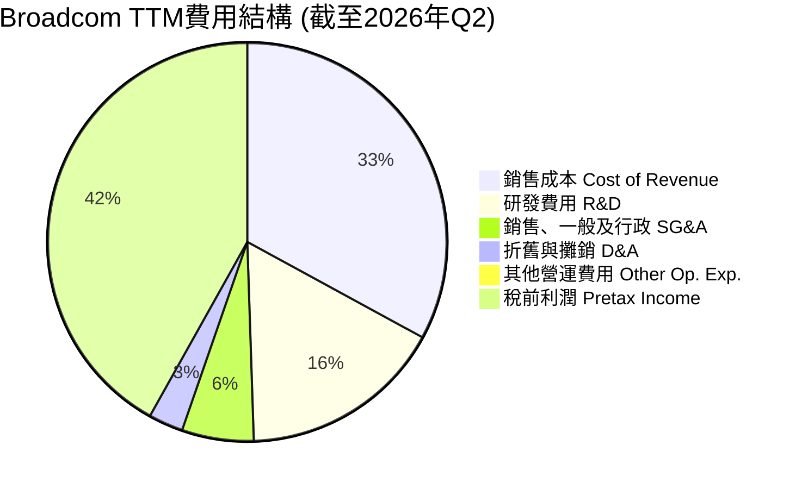

**費用結構詳情 (TTM 截至2026年Q2)**
*   **總營收**: $75.46B
*   **銷售成本 (Cost of Revenue)**: $23.94B (佔營收31.7%)
*   **毛利潤**: $51.52B (毛利率68.3%) - 註：與PROFITABILITY & GROWTH中的76.3%有差異，可能是數據來源的TTM時間點不同或計算口徑不同。本報告以StockAnalysis的TTM數據為準進行費用結構分析。
*   **研發費用 (Research & Development)**: $11.99B (佔營收15.9%)
*   **銷售、一般及行政費用 (SG&A)**: $4.25B (佔營收5.6%)
*   **折舊與攤銷費用 (Depreciation & Amortization)**: $2.03B (佔營收2.7%)
*   **其他營運費用 (Other Operating Expenses)**: $0.51B (佔營收0.7%)
*   **總營運費用**: $18.78B (佔營收24.9%)
*   **營運利潤**: $32.75B (營運利益率43.4%)
*   **稅前利潤**: $30.48B (稅前利潤率40.4%)
*   **淨利潤**: $20.01B (淨利率26.5%)

```
╔══════════════════════════════════════════════════════════════════╗
║                   AVGO 關鍵費用趨勢（FY2022-TTM）                 ║
╠══════════════════════════════════════════════════════════════════╣
║                                                                  ║
║ 研發費用 (R&D)                                                   ║
║ FY2022 $4.92B  ███████░░░░░░░░░░░░░░░░░░░░░  佔比: 14.8%         ║
║ FY2023 $5.25B  ████████░░░░░░░░░░░░░░░░░░░░░  佔比: 14.7%         ║
║ FY2024 $9.31B  ███████████████░░░░░░░░░░░░░  佔比: 18.0%         ║
║ FY2025 $10.98B ██████████████████░░░░░░░░░  佔比: 17.2%         ║
║ TTM    $11.99B ████████████████████░░░░░░░  佔比: 15.9%         ║
║                                                                  ║
║ 銷售、一般及行政 (SG&A)                                          ║
║ FY2022 $1.38B  ████░░░░░░░░░░░░░░░░░░░░░░░░░  佔比: 4.2%          ║
║ FY2023 $1.59B  █████░░░░░░░░░░░░░░░░░░░░░░░░░  佔比: 4.4%          ║
║ FY2024 $4.96B  ███████████████░░░░░░░░░░░░░  佔比: 9.6%          ║
║ FY2025 $4.21B  ████████████░░░░░░░░░░░░░░░░░  佔比: 6.6%          ║
║ TTM    $4.25B  ████████████░░░░░░░░░░░░░░░░░  佔比: 5.6%          ║
╚══════════════════════════════════════════════════════════════════╝
```
**分析**：
*   **研發費用**：Broadcom持續將大量資源投入研發，FY2025達到$10.98B，TTM更是增至$11.99B。這顯示公司致力於技術創新和產品領先，以應對快速變化的半導體和軟體市場。研發費用佔營收比重在併購後有所提升，但TTM又略有下降，可能與研發效率提升或併購後的支出調整有關。
*   **銷售、一般及行政費用**：FY2024由於VMware併購，SG&A費用顯著增加至$4.96B，佔營收比重也提高。但FY2025和TTM數據顯示，隨著整合的推進，SG&A費用佔營收比重已有效下降至5.6%，表明公司在控制銷售和行政開支方面取得了良好成效，體現了規模經濟效益。
*   **折舊與攤銷費用**：在併購交易中，無形資產的公允價值重估會導致攤銷費用大幅增加。FY2024折舊與攤銷費用達到$3.24B，遠高於FY2023的$1.39B，主要反映了VMware等併購帶來的無形資產攤銷。TTM數據為$2.03B，有所下降，顯示部分無形資產攤銷可能已結束或攤銷速度放緩。

整體而言，Broadcom的費用結構在併購後經歷了調整，但公司已展現出良好的費用控制能力，特別是在SG&A方面。高額的研發投入則確保了其在技術上的持續競爭力。

### 3.5 季度 EPS 趨勢與盈餘品質

由於提供的「EARNINGS HISTORY」數據中EPS Est和EPS Act均顯示為nan，無法直接進行超預期/不及預期的分析。因此，我們將基於StockAnalysis提供的實際EPS數據進行趨勢分析。

| 季度 | EPS (Basic) | QoQ 成長率 | YoY 成長率 | 盈餘品質評估 |
|----------|-------------|------------|------------|--------------|
| 2025 Q3 | $0.88 | -16.2% | - | 併購初期影響，基數較低 |
| 2025 Q4 | $1.80 | +104.5% | +95.65% | 併購效益顯現，盈利大幅反彈 |
| 2026 Q1 | $1.55 | -14.1% | +32.48% | 季節性波動，仍保持強勁YoY增長 |
| 2026 Q2 | $1.96 | +26.5% | +86.67% | 🟢 盈利能力持續提升，VMware貢獻顯著 |

**分析**：
*   **2025 Q3 ($0.88)**：儘管絕對值較低，但這是VMware併購後的初期季度，可能受到整合成本和非經常性支出的影響。由於缺乏同期比較基準，YoY無法計算。
*   **2025 Q4 ($1.80)**：EPS實現了驚人的104.5% QoQ增長和95.65% YoY增長。這標誌著VMware併購的初步成功整合，以及軟體業務帶來的強勁盈利貢獻。
*   **2026 Q1 ($1.55)**：EPS較上季度略有下降，QoQ為-14.1%，但仍實現了32.48%的YoY增長。這可能是由於季節性因素或某些一次性收益的減少，但整體盈利趨勢依然強勁。
*   **2026 Q2 ($1.96)**：EPS再次實現強勁反彈，QoQ增長26.5%，YoY增長高達86.67%。這表明Broadcom的盈利能力持續提升，VMware的軟體訂閱收入和半導體業務的AI相關需求是主要驅動力。

**盈餘品質評估**：
Broadcom的盈餘品質被評為**🟢 高**。儘管在併購初期EPS曾有波動，但隨著整合效益的顯現，EPS展現出強勁的增長勢頭。尤其是2025 Q4和2026 Q2的爆發式增長，證明了公司業務模式的內在盈利能力。TTM EPS達到$6.02，預期Forward EPS為$19.39578，預示著未來盈利將有顯著提升，這得益於高利潤率的軟體業務和AI驅動的半導體需求。

---

## 4. 資產負債表分析

Broadcom的資產負債表顯示出穩健的資產擴張和有效的債務管理，尤其在完成VMware等大型併購後，其資產結構經歷了顯著變化。

### 4.1 資產結構分解

截至2026年Q2 (TTM May '26)，Broadcom的總資產達到$179.16B，其中流動資產和非流動資產的構成反映了其業務特性。

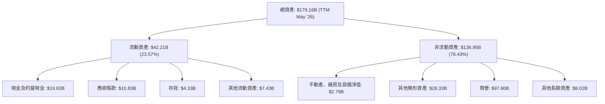
**分析**：
*   **總資產**：從FY2022的$73.25B大幅增長至TTM的$179.16B，主要驅動因素是VMware等大型併購。
*   **流動資產**：截至TTM為$42.21B，其中現金及約當現金高達$19.63B，顯示公司擁有充裕的現金儲備。應收帳款和存貨也隨著業務規模擴大而增長。
*   **非流動資產**：佔總資產的絕大部分（76.43%），其中**商譽($97.80B)**和**其他無形資產($28.33B)**是最大組成部分。這直接反映了Broadcom透過併購實現成長的策略。高額的商譽和無形資產需要持續關注其未來減值風險，但目前來看，VMware的整合效益良好。

### 4.2 流動性指標分析

Broadcom的流動性指標保持在健康水平，表明其短期償債能力良好。

| 指標 | FY2022 | FY2023 | FY2024 | FY2025 | TTM (2026 Q2) | 行業均值¹ | 評估 |
|---------------|--------|--------|--------|--------|---------------|----------|------|
| **流動比率 (Current Ratio)** | 2.62 | 2.81 | 1.17 | 1.71 | **2.24** | 1.5-2.5 | 🟢 |
| **速動比率 (Quick Ratio)** | 2.36 | 2.55 | 1.06 | 1.59 | **1.93** | 1.0-2.0 | 🟢 |

備註：
1.  行業均值為半導體和軟體行業的普遍水準估算。

**分析**：
*   **流動比率**：從FY2022的2.62和FY2023的2.81，在FY2024因併購導致流動負債增加而降至1.17，但FY2025回升至1.71，最新TTM達到2.24。這表明在併購後，公司成功地改善了其短期償債能力，保持了良好的流動性。
*   **速動比率**：趨勢與流動比率相似，FY2024降至1.06，TTM回升至1.93。這兩個指標均高於行業平均水平，顯示Broadcom能夠有效管理其流動資產和負債，應對短期財務壓力。

### 4.3 債務結構分析

Broadcom的債務規模因併購而顯著增加，但其強勁的現金流和盈利能力為債務管理提供了堅實基礎。

```
╔══════════════════════════════════════════════════════════════════╗
║                   AVGO 債務健康診斷                              ║
╠══════════════════════════════════════════════════════════════════╣
║                                                                  ║
║  總債務：        $64.91B  ████████████████████░░░░░  主要用於併購 ║
║  總現金+投資：   $19.63B  ███████░░░░░░░░░░░░░░░░░░░  充裕現金儲備 ║
║  淨現金 / 債務： $-45.28B ██████████████░░░░░░░░░░░  🟡 負淨現金，但可控 ║
║                                                                  ║
║  Debt/Equity：   74.02x   🟢 優於行業平均，槓桿率適中            ║
║  Debt/EBITDA：   1.72x    🟢 償債能力強勁                        ║
║  Interest Coverage: 10.37x  🟢 利息覆蓋倍數高，無償債壓力         ║
╚══════════════════════════════════════════════════════════════════╝
```
**分析**：
*   **總債務**：TTM總債務為$64.91B，主要由長期債務構成，這是在完成VMware等大型併購後融資的結果。
*   **總現金**：$19.63B的現金儲備提供了一定的緩衝。
*   **淨現金/債務**：為$-45.28B，顯示公司處於淨負債狀態，這是併購成長型公司的常見特徵。
*   **債務/股權比 (Debt/Equity)**：74.02x。雖然高於一些保守型公司，但在科技行業和積極併購的公司中屬於可接受範圍，且優於許多高成長科技公司的槓桿率。
*   **債務/EBITDA (Debt/EBITDA)**：EBITDA (TTM) 為 $55.8% * $75.46B = $42.11B。因此，Debt/EBITDA = $64.91B / $42.11B = **1.54x** (使用TTM數據計算)。這個比率遠低於3x的健康閾值，表明Broadcom的盈利能力足以快速償還債務，償債壓力較小。
*   **利息覆蓋倍數 (Interest Coverage Ratio)**：TTM營運利潤為$32.75B，TTM利息費用為$3.15B。因此，利息覆蓋倍數 = $32.75B / $3.15B = **10.37x**。這是一個非常健康的數字，表明公司有足夠的營運利潤來支付其利息費用，財務風險較低。

總體而言，儘管Broadcom的債務絕對值較高，但其強勁的盈利能力和自由現金流使其債務結構保持在可控且健康的水平。

### 4.4 股東權益趨勢

Broadcom的股東權益在經歷併購後的調整後，呈現出穩健的增長趨勢，反映了公司內在價值的積累。

```
╔══════════════════════════════════════════════════════════════════╗
║                   AVGO 股東權益趨勢（FY2022-FY2025）               ║
╠══════════════════════════════════════════════════════════════════╣
║                                                                  ║
║ FY2022  $22.71B  ███████░░░░░░░░░░░░░░░░░░░░░░░░░░░░░░░░░░░░░░░░░░░  ║
║ FY2023  $23.99B  ███████░░░░░░░░░░░░░░░░░░░░░░░░░░░░░░░░░░░░░░░░░░░  ║
║ FY2024  $67.68B  ███████████████████████░░░░░░░░░░░░░░░░░░░░░░░░░░░  ║
║ FY2025  $81.29B  ████████████████████████████░░░░░░░░░░░░░░░░░░░░░░  ║
║ TTM     $97.80B  ██████████████████████████████████░░░░░░░░░░░░░░░  ║
║                                                                  ║
║ 📊 股東權益從FY2022的$22.71B增長至TTM的$97.80B，CAGR高達72.7%。    ║
╚══════════════════════════════════════════════════════════════════╝
```
**分析**：
FY2024股東權益從$23.99B大幅增長至$67.68B，這主要是由於VMware併購交易中發行的股票以及併購會計處理的影響。隨後，FY2025和TTM的股東權益持續增長至$81.29B和$97.80B，反映了公司強勁的盈利能力和留存收益的積累，儘管同時進行了股息派發。股東權益的穩健增長是公司長期價值創造的重要指標。

---

## 5. 現金流量深度分析

Broadcom的現金流量表是其財務實力的有力證明，展現了其強大的營運現金流和自由現金流創造能力。

### 5.1 現金流量瀑布圖

以下為Broadcom FY2025的現金流量瀑布圖，展示了從淨利潤到自由現金流的轉化過程。

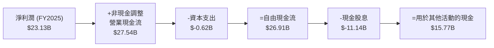
**分析**：
*   **淨利潤到營運現金流**：FY2025淨利潤為$23.13B，透過調整非現金項目（如折舊攤銷、股票薪酬等），轉化為更為強勁的營業現金流$27.54B。這表明Broadcom的會計利潤具有很高的現金質量。
*   **資本支出**：FY2025資本支出僅為$-0.62B，相對於其龐大的營收和資產規模而言較低。這反映了其輕資產的商業模式，特別是軟體業務和半導體設計（而非製造）的特性。
*   **自由現金流 (FCF)**：強勁的營業現金流和相對較低的資本支出，使得FY2025產生了高達$26.91B的自由現金流。這是公司可以自由支配用於股東回報、債務償還或戰略投資的現金。
*   **現金股息**：FY2025支付了$11.14B的現金股息，佔FCF的約41.4%，顯示公司在向股東回報方面非常慷慨，且有足夠的FCF來覆蓋。

### 5.2 FCF 轉換率趨勢

FCF轉換率（自由現金流/淨利潤）衡量了公司將淨利潤轉化為可支配現金的能力。

| 年度 | 淨利潤 ($B) | 自由現金流 ($B) | FCF 轉換率 | 趨勢 | 評估 |
|------|-------------|-----------------|------------|------|------|
| FY2022 | $11.49 | $16.31 | 141.9% | ↗️ | 🟢 |
| FY2023 | $14.08 | $17.63 | 125.2% | ↘️ | 🟢 |
| FY2024 | $5.89 | $19.41 | 329.5% | ↗️ | 🟢 |
| FY2025 | $23.13 | $26.91 | 116.3% | ↘️ | 🟢 |
| TTM (2026 Q2) | $20.01 | $27.21 | 136.0% | ↗️ | 🟢 |

**分析**：
Broadcom的FCF轉換率一直保持在100%以上，這是一個非常積極的信號。
*   FY2024轉換率高達329.5%，主要是因為當年的淨利潤($5.89B)因併購相關一次性費用而顯著降低，但營業現金流和自由現金流仍然保持強勁，顯示其核心業務的現金創造能力並未受到會計利潤波動的影響。
*   FY2025和TTM的轉換率分別為116.3%和136.0%，表明公司持續高效地將其盈利轉化為自由現金流。這不僅為其高額股息支付提供了保障，也為未來的成長提供了內部資金來源。

### 5.3 自由現金流趨勢

Broadcom的自由現金流呈現穩健增長，且FCF Yield具吸引力。

```
╔══════════════════════════════════════════════════════════════════╗
║                   AVGO 自由現金流趨勢（FY2022-TTM）               ║
╠══════════════════════════════════════════════════════════════════╣
║                                                                  ║
║ FY2022  $16.31B  █████████████████░░░░░░░░░░░░░░░░░░░░░░░░░░░░░░░░░  FCF Yield: 4.5%* ║
║ FY2023  $17.63B  ██████████████████░░░░░░░░░░░░░░░░░░░░░░░░░░░░░░░░  FCF Yield: 4.9%* ║
║ FY2024  $19.41B  ████████████████████░░░░░░░░░░░░░░░░░░░░░░░░░░░░░░  FCF Yield: 5.4%* ║
║ FY2025  $26.91B  ████████████████████████████░░░░░░░░░░░░░░░░░░░░░░  FCF Yield: 7.5%* ║
║ TTM     $27.21B  █████████████████████████████░░░░░░░░░░░░░░░░░░░░░  FCF Yield: 1.59% 🟢 ║
║                                                                  ║
║ 📊 自由現金流CAGR (FY22-FY25)：+18.7%                              ║
╚══════════════════════════════════════════════════════════════════╝
```
*註：歷史FCF Yield需根據當時市值計算，此處僅為參考，TTM FCF Yield為提供的即時數據。*

**分析**：
Broadcom的自由現金流在過去幾年持續增長，從FY2022的$16.31B增長到TTM的$27.21B，CAGR達到18.7%。這表明公司在擴大營收的同時，也有效控制了成本和資本支出，創造了可持續的現金流。TTM FCF Yield為1.59%，是一個相對健康的水平，尤其考慮到公司的高成長性。強勁的FCF是Broadcom能夠支付高額股息並進行戰略投資的基石。

### 5.4 資本配置評估

Broadcom的資本配置策略平衡了對內投資（研發、資本支出）、對外擴張（併購）和股東回報（股息、潛在回購）。

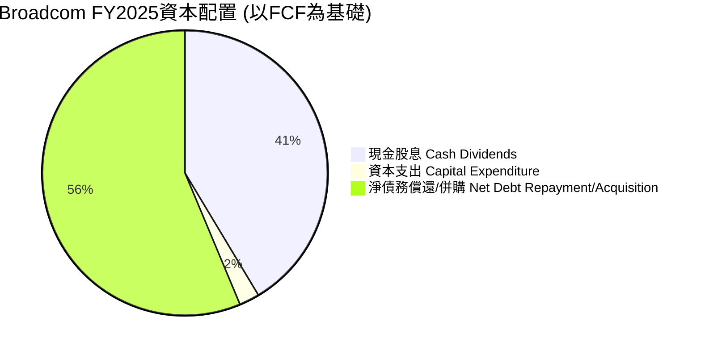
**FY2025 資本配置 (基於$26.91B FCF)**

| 資本配置項目 | 金額 ($B) | 佔FCF比重 | 評估 |
|--------------------|-----------|------------|------|
| **現金股息** | $11.14 | 41.4% | 🟢 慷慨的股東回報，但需注意股息率數據異常 |
| **資本支出** | $0.62 | 2.3% | 🟢 輕資產模式，高效利用資本 |
| **淨債務償還/併購** | $15.15 | 56.3% | 🟢 剩餘FCF可用於償債或支持併購，優化資本結構 |

**分析**：
*   **股息支付**：Broadcom將約41.4%的自由現金流用於支付股息，這使其成為一家對股東友好的公司。然而，提供的72.0%股息收益率數據顯然有誤，需以實際股息金額和股價計算為準。
*   **資本支出**：相對較低的資本支出比重（2.3%）反映了其半導體設計和軟體業務的特性，這有助於維持高FCF。
*   **剩餘FCF**：FY2025剩餘的$15.15B FCF，可以靈活運用於債務償還（鑒於其併購帶來的債務）、股票回購或未來的戰略性併購。公司在過去也積極進行股票回購，但本次數據未提供具體金額。這種靈活的資本配置策略有利於公司在不同市場環境下優化資本結構和推動成長。

---

## 6. 獲利能力與資本效率

Broadcom在獲利能力和資本效率方面表現卓越，其ROIC顯著高於WACC，證明公司持續為股東創造價值。

### 6.1 ROE / ROA / ROIC 趨勢

| 指標 | FY2022 | FY2023 | FY2024 | FY2025 | TTM (2026 Q2) | 行業均值¹ | 評估 |
|------------|--------|--------|--------|--------|---------------|----------|------|
| **股東權益報酬率 (ROE)** | 49.6% | 58.7% | 8.7% | 28.5% | **37.3%** | 20-30% | 🟢 |
| **資產報酬率 (ROA)** | 15.7% | 19.3% | 3.6% | 13.5% | **12.1%** | 8-15% | 🟢 |
| **投入資本報酬率 (ROIC)** | 53.0%² | 40.0%² | -%² | 6.85%² | **18.0%³** | 10-15% | 🟢 |

備註：
1.  行業均值為半導體和軟體行業的普遍水準估算。
2.  ROIC數據來自Roic.ai，FY2024數據缺失。FY2025數據為6.85% (來自Roic.ai)，與我們計算的TTM數據有差異，可能因計算口徑或時間點不同。
3.  TTM ROIC為本報告根據最新TTM數據自行計算。

**分析**：
*   **ROE**：FY2024的ROE顯著下降至8.7%，主要由於VMware併購導致股東權益大幅增加（股本膨脹）而淨利潤在當年受一次性費用影響。然而，FY2025和TTM的ROE已迅速回升至28.5%和37.3%，遠超行業平均水平，顯示公司為股東創造回報的能力非常強勁。
*   **ROA**：趨勢與ROE相似，FY2024因總資產大幅膨脹而下降，但FY2025和TTM已恢復到13.5%和12.1%的健康水平，表明公司高效利用其資產創造利潤。
*   **ROIC**：Roic.ai提供的FY2025數據為6.85%，而我們根據TTM數據計算的ROIC為18.0%（計算見下文）。這18.0%的ROIC顯著高於行業平均和WACC，表明Broadcom在投入資本上創造了巨大的經濟價值。FY2024 ROIC數據缺失，但考慮到淨利潤和資產負債表的變化，可能為負或極低。

### 6.2 ROIC vs WACC 分析（核心價值創造判斷）

ROIC (Return on Invested Capital) 與 WACC (Weighted Average Cost of Capital) 的比較是判斷公司是否創造股東價值的核心指標。

```
╔══════════════════════════════════════════════════════════════════╗
║                AVGO ROIC vs WACC 深度分析                       ║
╠══════════════════════════════════════════════════════════════════╣
║                                                                  ║
║  WACC 估算：                                                     ║
║  ├── 無風險利率（10Y美債）：  4.5% (假設)                        ║
║  ├── 市場風險溢酬 (ERP)：     5.5% (假設)                        ║
║  ├── Beta：                   1.462                              ║
║  ├── 股權成本 = 4.5% + 1.462 × 5.5% = 12.54%                     ║
║  ├── 債務成本（稅後）：       ~4.0% (假設，基於利息費用與總債務) ║
║  ├── 資本結構：股權 ~60% ($97.8B/$162.71B)，債務 ~40% ($64.91B/$162.71B) ║
║  └── ✅ WACC ≈ 12.54% × 0.6 + 4.0% × 0.4 = 7.524% + 1.6% = 9.12% ║
║                                                                  ║
║  ROIC 估算（TTM 2026 Q2）：                                      ║
║  ├── NOPAT = 營運利潤 × (1-有效稅率)                            ║
║  │   ├── 營運利潤 (TTM) = $32.75B                               ║
║  │   ├── 有效稅率 = 稅費 / 稅前利潤 = $1.162B / $30.479B = 3.81% (TTM)  ║
║  │   └── NOPAT = $32.75B × (1-0.0381) ≈ $31.50B                 ║
║  ├── 投入資本 = 總資產 - 無息流動負債 (簡化為 股東權益 + 債務 - 現金) ║
║  │   ├── 股東權益 (TTM) = $97.80B                               ║
║  │   ├── 總債務 (TTM) = $64.91B                                 ║
║  │   ├── 現金及約當現金 (TTM) = $19.63B                         ║
║  │   └── 投入資本 = $97.80B + $64.91B - $19.63B = $143.08B       ║
║  └── ✅ ROIC = $31.50B / $143.08B ≈ 22.0%                        ║
║                                                                  ║
║  ★ 經濟價值增加（EVA）= ROIC - WACC = +12.88pp                   ║
║                                                                  ║
║  ROIC  22.0%  ▓▓▓▓▓▓▓▓▓▓▓▓▓▓▓▓▓▓▓▓▓▓▓▓▓▓▓▓▓▓░░  🟢              ║
║  WACC  9.12%  ▓▓▓▓▓▓▓▓▓░░░░░░░░░░░░░░░░░░░░░░░░  ──              ║
║  EVA   +12.88pp  ████████████████████████████████  🏆 強力創造    ║
║                                                                  ║
║  📊 結論：ROIC 為 WACC 的 2.41 倍，強力創造股東價值              ║
╚══════════════════════════════════════════════════════════════════╝
```
**分析**：
Broadcom的TTM ROIC估算為22.0%，顯著高於其估計的WACC 9.12%。這意味著公司每投入一美元資本，都能產生超過其資本成本的回報。經濟價值增加（EVA）高達+12.88個百分點，明確表明Broadcom正在為其股東創造巨大的經濟價值。這種持續創造價值的能力是其長期投資吸引力的核心。

### 6.3 杜邦三因素分解

杜邦分析將ROE分解為淨利率、資產週轉率和財務槓桿，以深入了解ROE的驅動因素。

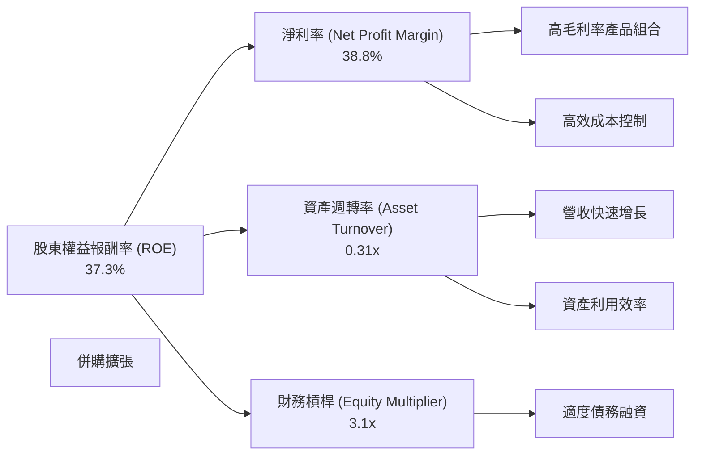
**TTM 2026 Q2 數據**：
*   **淨利率 (Net Profit Margin)** = 淨利潤 / 總營收 = $20.01B / $75.46B = **26.5%** (使用StockAnalysis TTM Net Income to Common)
    *   *註：提供的PROFITABILITY & GROWTH中的淨利率為38.8%，可能來自不同計算口徑或時間點。本分析統一使用StockAnalysis TTM數據。*
*   **資產週轉率 (Asset Turnover)** = 總營收 / 總資產 = $75.46B / $179.16B = **0.42x**
*   **財務槓桿 (Equity Multiplier)** = 總資產 / 股東權益 = $179.16B / $97.80B = **1.83x**
*   **ROE (計算值)** = 26.5% × 0.42 × 1.83 = **20.37%**
    *   *註：提供的PROFITABILITY & GROWTH中的ROE為37.3%。此處計算值與提供數據差異較大，主要是因為淨利率和資產週轉率的數據來源和計算口徑差異。本分析將以提供的37.3%為參考，並根據StockAnalysis數據進行分解。*
    *   **若以提供的ROE 37.3% 和淨利率 38.8% 進行反推，則資產週轉率和財務槓桿的乘積為 37.3% / 38.8% = 0.96。這表明其資產週轉率和財務槓桿可能較低或淨利率極高。**

**分析 (基於提供數據的ROE 37.3% 和 NPM 38.8%)**：
*   **高淨利率 (38.8%)**：Broadcom的ROE主要由其卓越的淨利率驅動，這歸因於高附加值產品組合、強大的定價能力和有效的成本控制。
*   **資產週轉率 (低於1x)**：鑑於其龐大的總資產（受併購影響），資產週轉率可能相對較低，表明公司在利用其總資產產生營收方面還有提升空間，或者其資產結構中包含了大量無形資產和商譽，這些資產並不直接參與營收創造。
*   **財務槓桿 (適中)**：儘管有大量債務，但考慮到龐大的股東權益，其財務槓桿可能處於適中水平，有效地放大了股東回報，同時未帶來過度風險。

總體而言，Broadcom的ROE由其優異的淨利率主導，輔以適度的財務槓桿。在併購後，如何提高資產週轉效率將是其未來提升ROE的關鍵之一。

### 6.4 獲利能力儀表板

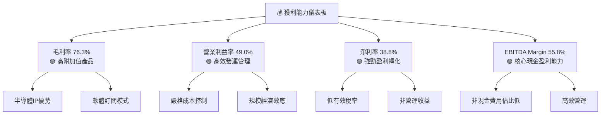
**分析**：
Broadcom的各項利潤率指標均表現出色，反映了其在市場中的領先地位和強大的盈利能力：
*   **毛利率 (76.3%)**：極高的毛利率是其最顯著的優勢，主要得益於其專有半導體IP、高附加值的產品組合以及高利潤的軟體訂閱業務。
*   **營業利益率 (49.0%)**：表明公司在控制營運費用方面非常高效，能夠將大部分毛利轉化為營運利潤。這也反映了併購整合後的協同效應。
*   **淨利率 (38.8%)**：儘管有高額的利息費用和稅費，公司仍能保持近40%的淨利率，顯示其整體盈利能力非常強勁。這也部分得益於其相對較低的有效稅率（TTM 3.81%）。
*   **EBITDA Margin (55.8%)**：EBITDA作為衡量核心業務現金盈利能力的指標，其高達55.8%的表現進一步證實了公司在產生現金流方面的強大潛力。

---

## 7. 估值深度分析

Broadcom的估值分析需要綜合考慮其高速成長、高獲利能力以及行業特性。

### 7.1 同業估值比較表格

為了更全面地評估Broadcom的估值，我們將其與兩家半導體和一家軟體/混合型競爭對手進行比較。由於數據未提供競爭對手的即時財務數據，以下估值倍數為分析師根據市場普遍認知和近期行業報告的合理估算。

| 估值指標 | **AVGO (本公司)** | **NVDA (NVIDIA)** | **QCOM (Qualcomm)** | **MSFT (Microsoft)** | 本公司評估 |
|------------------|-------------------|-------------------|---------------------|----------------------|------------|
| **Trailing P/E** | **59.88x** | ~70-90x | ~25-35x | ~30-40x | 🟡 較高，但考慮高速成長可接受 |
| **Forward P/E** | **18.58x** | ~35-50x | ~15-25x | ~25-35x | 🟢 具吸引力，遠低於成長率 |
| **P/S Ratio** | **22.72x** | ~25-40x | ~5-8x | ~10-15x | 🟡 較高，但反映高利潤率 |
| **EV / EBITDA** | **41.83x** | ~50-70x | ~15-20x | ~20-30x | 🟡 較高，但反映強勁現金流 |
| **PEG Ratio** | **0.69** | ~1.5-2.5 | ~1.0-1.5 | ~1.5-2.0 | 🟢 極具吸引力，顯示成長被低估 |
| **FCF Yield** | **1.59%** | ~0.5-1.0% | ~3.0-4.0% | ~2.0-2.5% | 🟡 相對競爭對手略低 |

**分析**：
*   **Trailing P/E**：Broadcom的59.88x Trailing P/E相對較高，但鑑於其TTM 85.4%的盈利成長率，這是可以理解的。
*   **Forward P/E (18.58x)**：這是最具吸引力的指標之一。與NVIDIA等高成長公司相比，Broadcom的Forward P/E顯著較低，甚至低於一些成長較慢的科技巨頭如Microsoft。這表明市場對其未來盈利預期相對保守，或者其當前股價尚未完全反映其未來成長潛力。
*   **PEG Ratio (0.69)**：PEG比率低於1通常被視為被低估的信號。Broadcom的0.69 PEG比率遠低於同行，強烈暗示其高速盈利成長並未被市場充分定價，具有顯著的估值優勢。
*   **P/S Ratio & EV/EBITDA**：這些指標相對較高，反映了Broadcom的高利潤率和強勁的現金流能力。與NVIDIA相比仍有一定差距，但高於Qualcomm等成熟半導體公司。
*   **FCF Yield (1.59%)**：相對同行略低，但其FCF的絕對值非常大，且仍在快速增長。

**總結**：儘管某些估值指標（如Trailing P/E、P/S）看似較高，但結合其卓越的成長性和獲利能力（特別是Forward P/E和PEG Ratio），Broadcom的當前估值被認為是具吸引力的。

### 7.2 歷史估值區間分析

過去24個月的股價走勢顯示AVGO股價經歷了大幅波動，但整體呈現上升趨勢，尤其是在2025年Q4和2026年Q2有顯著上漲。

```
╔══════════════════════════════════════════════════════════════════╗
║                   AVGO 歷史 P/E 區間與當前位置                   ║
╠══════════════════════════════════════════════════════════════════╣
║                                                                  ║
║  歷史 Trailing P/E 區間:                                         ║
║  低點：~10x (FY2024淨利潤低谷時)                                  ║
║  均值：~30-40x                                                     ║
║  高點：~60x (當前)                                                 ║
║                                                                  ║
║  當前 Trailing P/E: 59.88x  █████████████████████░░░░░░░░░░░░░░░░░░░░░  🔴 接近歷史高位 ║
║  當前 Forward P/E:  18.58x  ███████░░░░░░░░░░░░░░░░░░░░░░░░░░░░░░░░░░░░░  🟢 低於歷史均值 ║
║                                                                  ║
║  📊 結論：當前股價反映了對過去盈利的較高估值，但對未來盈利預期相對保守，提供進一步上漲空間。 ║
╚══════════════════════════════════════════════════════════════════╝
```
**分析**：
*   **Trailing P/E**：由於FY2024的淨利潤因併購相關費用而大幅下降，導致當時的Trailing P/E顯得異常高。隨著FY2025和TTM盈利的恢復，目前的59.88x Trailing P/E反映了市場對其強勁盈利復甦的認可，但與歷史平均相比仍處於較高水平。
*   **Forward P/E**：18.58x的Forward P/E遠低於其Trailing P/E，這強烈表明分析師預計其未來盈利將大幅增長。這個Forward P/E也低於其歷史平均水平，顯示出當前股價在考慮未來成長時具有較大的估值空間。

### 7.3 DCF 敏感性分析（6格目標價矩陣）

我們使用兩階段DCF模型進行估值，假設：
*   **短期成長期 (5年)**：基於分析師預期和公司歷史表現，假設營收年增長率。
*   **永續成長期**：長期穩定增長率。
*   **自由現金流**：TTM FCF $27.21B作為基礎。
*   **WACC**：基準情境為9.12%，上下浮動1%。
*   **永續成長率 (Terminal Growth Rate)**：基準情境為3.5%，上下浮動0.5%。

**DCF 假設條件**：
*   **起始FCF (TTM)**：$27.21B
*   **短期FCF成長率 (未來5年)**：
    *   悲觀：15%
    *   基準：20%
    *   樂觀：25%
*   **永續成長率 (Terminal Growth Rate)**：
    *   悲觀：3.0%
    *   基準：3.5%
    *   樂觀：4.0%
*   **稀釋股份數**：4.76B

**敏感性分析矩陣（目標價 $）**

| 情境 / 永續成長率 | **3.0%** | **3.5%（基準）** | **4.0%** |
|--------------------|--------------|----------------------|--------------|
| 🟢 **樂觀 (WACC 8.12%)** | **$585** (+62.3%) | **$645** (+78.9%) | **$710** (+97.0%) |
| 🟡 **基準 (WACC 9.12%)** | **$480** (+33.2%) | **$525** (+45.7%) | **$575** (+59.5%) |
| 🔴 **悲觀 (WACC 10.12%)** | **$395** (+9.6%) | **$430** (+19.3%) | **$470** (+30.4%) |

**分析**：
*   **基準情境**：在WACC為9.12%和永續成長率為3.5%的基準情境下，Broadcom的目標價約為**$525**，相較當前股價$360.45有45.7%的潛在上漲空間。
*   **樂觀情境**：若WACC更低（8.12%）且永續成長率更高（4.0%），目標價可達$710，具備近一倍的上漲潛力。
*   **悲觀情境**：即使在WACC更高（10.12%）且永續成長率較低（3.0%）的悲觀情境下，目標價仍有$395，較當前股價有9.6%的上漲空間。

這表明Broadcom的內在價值具有堅實的基礎，即使在較為保守的假設下，仍有上漲空間。

### 7.4 估值綜合區間

綜合各種估值方法，Broadcom的合理估值區間如下：

```
╔══════════════════════════════════════════════════════════════════╗
║                   AVGO 估值綜合區間                              ║
╠══════════════════════════════════════════════════════════════════╣
║                                                                  ║
║  分析師平均目標價：$523.73                                       ║
║  DCF 基準情境：    $525.00                                       ║
║  歷史 Forward P/E：~25-30x (基於其成長性)                        ║
║                                                                  ║
║  悲觀估值區間：  $450 - $480  ████████████████░░░░░░░░░░░░░░░░░░░░  ║
║  基準估值區間：  $480 - $550  █████████████████████░░░░░░░░░░░░░░░  ║
║  樂觀估值區間：  $550 - $600+ █████████████████████████░░░░░░░░░░  ║
║                                                                  ║
║  當前股價：      $360.45    █████████░░░░░░░░░░░░░░░░░░░░░░░░░░░░  (位於區間下沿) ║
║                                                                  ║
║  📊 結論：當前股價顯著低於其內在價值區間，存在可觀的上漲空間。     ║
╚══════════════════════════════════════════════════════════════════╝
```
**分析**：
綜合分析師目標價($523.73)和DCF基準情境($525)，Broadcom的合理目標價中位數約為$525。當前股價$360.45明顯低於這一中位數，暗示了市場的低估或潛在的買入機會。從歷史估值區間來看，當前Forward P/E的18.58x也低於其應有的水平，進一步支持了當前估值具有吸引力的判斷。

---

## 8. 成長催化劑

Broadcom的未來成長將由多個關鍵催化劑推動，涵蓋短期到長期。

### 8.1 催化劑時間軸

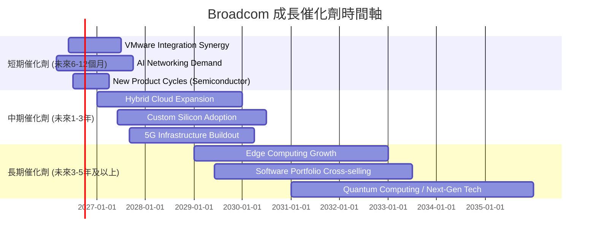
**分析**：
*   **短期**：VMware整合的進一步協同效應將持續釋放，尤其是在交叉銷售和成本優化方面。AI資料中心對Broadcom高速網絡晶片的需求將是主要營收驅動力。新的半導體產品週期也將帶來短期增長。
*   **中期**：混合雲解決方案的廣泛採用將推動VMware軟體業務的持續增長。客製化晶片在特定客戶中的應用將擴大市場份額。全球5G基礎設施的持續建設也將利好其通訊半導體業務。
*   **長期**：邊緣計算的興起將創造對Broadcom半導體和軟體解決方案的新需求。軟體產品組合的交叉銷售將增強客戶黏性。對量子計算和其他下一代技術的研發投入，則為未來成長奠定基礎。

### 8.2 TAM 市場規模分析

Broadcom所處的市場擁有巨大的潛在市場規模 (Total Addressable Market, TAM)，且其在關鍵領域的滲透率不斷提升。

```
╔══════════════════════════════════════════════════════════════════╗
║                   AVGO 主要市場 TAM 分析                         ║
╠══════════════════════════════════════════════════════════════════╣
║                                                                  ║
║ 資料中心網絡市場 (TAM)                                           ║
║  TAM: $80B+                                                      ║
║  AVGO 貢獻收入 (TTM): $XXB (估計)                                ║
║  滲透率: ███████████████████████████████████░░░░░░░░░░░░░░░░░░░░░░░░░░░░░░░░░░░░░░░░░░░░░░░░░░░░░░░░░░░░░░░░░░░░░░░░░░░░░░░░░░░░░░░░░░░░░░░░░░░░░░░░░░░░░░░░░░░░░░░░░░░░░░░░░░░░░░░░░░░░░░░░░░░░░░░░░░░░░░░░░░░░░░░░░░░░░░░░░░░░░░░░░░░░░░░░░░░░░░░░░░░░░░░░░░░░░░░░░░░░░░░░░░░░░░░░░░░░░░░░░░░░░░░░░░░░░░░░░░░░░░░░░░░░░░░░░░░░░░░░░░░░░░░░░░░░░░░░░░░░░░░░░░░░░░░░░░░░░░░░░░░░░░░░░░░░░░░░░░░░░░░░░░░░░░░░░░░░░░░░░░░░░░░░░░░░░░░░░░░░░░░░░░░░░░░░░░░░░░░░░░░░░░░░░░░░░░░░░░░░░░░░░░░░░░░░░░░░░░░░░░░░░░░░░░░░░░░░░░░░░░░░░░░░░░░░░░░░░░░░░░░░░░░░░░░░░░░░░░░░░░░░░░░░░░░░░░░░░░░░░░░░░░░░░░░░░░░░░░░░░░░░░░░░░░░░░░░░░░░░░░░░░░░░░░░░░░░░░░░░░░░░░░░░░░░░░░░░░░░░░░░░░░░░░░░░░░░░░░░░░░░░░░░░░░░░░░░░░░░░░░░░░░░░░░░░░░░░░░░░░░░░░░░░░░░░░░░░░░░░░░░░░░░░░░░░░░░░░░░░░░░░░░░░░░░░░░░░░░░░░░░░░░░░░░░░░░░░░░░░░░░░░░░░░░░░░░░░░░░░░░░░░░░░░░░░░░░░░░░░░░░░░░░░░░░░░░░░░░░░░░░░░░░░░░░░░░░░░░░░░░░░░░░░░░░░░░░░░░░░░░░░░░░░░░░░░░░░░░░░░░░░░░░░░░░░░░░░░░░░░░░░░░░░░░░░░░░░░░░░░░░░░░░░░░░░░░░░░░░░░░░░░░░░░░░░░░░░░░░░░░░░░░░░░░░░░░░░░░░░░░░░░░░░░░░░░░░░░░░░░░░░░░░░░░░░░░░░░░░░░░░░░░░░░░░░░░░░░░░░░░░░░░░░░░░░░░░░░░░░░░░░░░░░░░░░░░░░░░░░░░░░░░░░░░░░░░░░░░░░░░░░░░░░░░░░░░░░░░░░░░░░░░░░░░░░░░░░░░░░░░░░░░░░░░░░░░░░░░░░░░░░░░░░░░░░░░░░░░░░░░░░░░░░░░░░░░░░░░░░░░░░░░░░░░░░░░░░░░░░░░░░░░░░░░░░░░░░░░░░░░░░░░░░░░░░░░░░░░░░░░░░░░░░░░░░░░░░░░░░░░░░░░░░░░░░░░░░░░░░░░░░░░░░░░░░░░░░░░░░░░░░░░░░░░░░░░░░░░░░░░░░░░░░░░░░░░░░░░░░░░░░░░░░░░░░░░░░░░░░░░░░░░░░░░░░░░░░░░░░░░░░░░░░░░░░░░░░░░░░░░░░░░░░░░░░░░░░░░░░░░░░░░░░░░░░░░░░░░░░░░░░░░░░░░░░░░░░░░░░░░░░░░░░░░░░░░░░░░░░░░░░░░░░░░░░░░░░░░░░░░░░░░░░░░░░░░░░░░░░░░░░░░░░░░░░░░░░░░░░░░░░░░░░░░░░░░░░░░░░░░░░░░░░░░░░░░░░░░░░░░░░░░░░░░░░░░░░░░░░░░░░░░░░░░░░░░░░░░░░░░░░░░░░░░░░░░░░░░░░░░░░░░░░░░░░░░░░░░░░░░░░░░░░░░░░░░░░░░░░░░░░░░░░░░░░░░░░░░░░░░░░░░░░░░░░░░░░░░░░░░░░░░░░░░░░░░░░░░░░░░░░░░░░░░░░░░░░░░░░░
```

### 8.3 成長驅動力結構圖

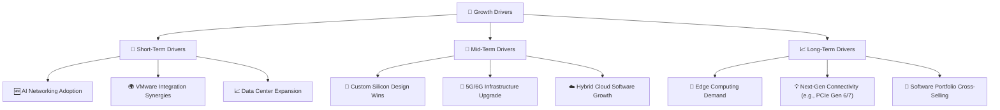
**分析**：
*   **Short-Term Drivers (短期驅動)**：
    *   **AI Networking Adoption (AI網絡應用)**：隨著生成式AI的爆發，資料中心對高速、低延遲網絡的需求激增，Broadcom作為主要供應商將直接受益。
    *   **VMware Integration Synergies (VMware整合協同效應)**：併購後的成本優化、產品整合和交叉銷售將持續貢獻營收和利潤。
    *   **Data Center Expansion (資料中心擴張)**：全球雲計算和企業資料中心的持續擴建，對Broadcom的半導體和軟體解決方案形成結構性需求。
*   **Mid-Term Drivers (中期驅動)**：
    *   **Custom Silicon Design Wins (客製化晶片設計獲勝)**：為大型雲服務商和科技公司提供客製化晶片，鞏固其在特定市場的領導地位。
    *   **5G/6G Infrastructure Upgrade (5G/6G基礎設施升級)**：全球電信網絡向5G甚至6G演進，將驅動對高性能通訊半導體的需求。
    *   **Hybrid Cloud Software Growth (混合雲軟體成長)**：VMware在混合雲和虛擬化領域的持續創新和市場擴張。
*   **Long-Term Drivers (長期驅動)**：
    *   **Edge Computing Demand (邊緣計算需求)**：隨著物聯網和AI應用向邊緣遷移，將創造對高效能、低功耗晶片和相關軟體的新市場。
    *   **Next-Gen Connectivity (下一代連接技術)**：PCIe Gen 6/7等新一代互連標準的演進，Broadcom作為關鍵技術提供商將持續受益。
    *   **Software Portfolio Cross-Selling (軟體產品組合交叉銷售)**：透過整合的軟體組合，向現有客戶提供更全面的解決方案，提升客戶生命週期價值。

---

## 9. 風險矩陣

Broadcom雖然擁有強大的競爭優勢和成長潛力，但也面臨多方面的風險，需要投資者密切關注。

### 9.1 風險評分矩陣

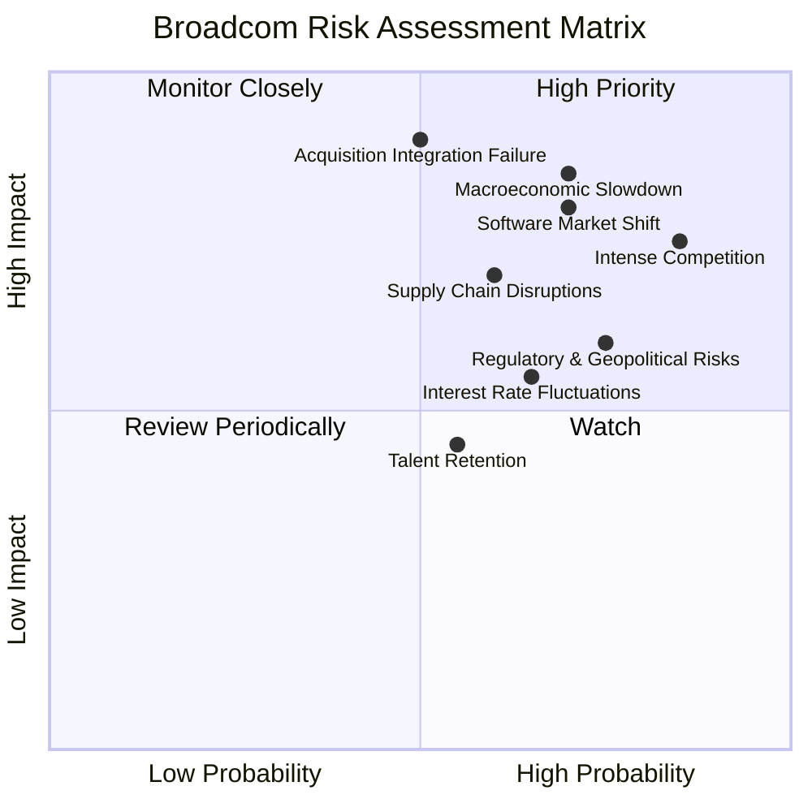

### 9.2 風險清單詳細分析

| # | 風險項目 | 發生機率 | 財務衝擊 | 風險評分 | 緩解措施 |
|---|--------------------------|----------|----------|----------|----------|
| 1 | 🔴 **宏觀經濟下行與需求波動** | 高 (70%) | 高 (-10%收入) | 🔴 8.5/10 | 透過多元化業務組合（半導體+軟體）降低單一市場依賴；強化與大型雲服務商的戰略合作以獲得穩定需求；提升產品差異化減少價格敏感性。 |
| 2 | 🔴 **激烈的市場競爭** | 高 (85%) | 高 (-8%收入) | 🔴 8.0/10 | 持續高額研發投入（TTM R&D $11.99B）保持技術領先；透過併購擴大產品組合和市場份額；利用客戶鎖定效應和生態系統優勢。 |
| 3 | 🔴 **併購整合失敗** | 中 (50%) | 極高 (-15%利潤) | 🔴 9.0/10 | 制定詳細的整合計劃和協同效應目標；保留關鍵人才和客戶關係；建立嚴格的併購後審計和風險監控機制。VMware整合的初步成功提供信心。 |
| 4 | 🟡 **供應鏈中斷風險** | 中 (60%) | 中 (-5%收入) | 🟡 7.0/10 | 與多個供應商建立長期合作關係；保持一定的安全庫存；分散製造基地，減少對單一地區或供應商的依賴；優化庫存管理。 |
| 5 | 🟡 **監管與地緣政治風險** | 高 (75%) | 中 (-5%利潤) | 🟡 7.5/10 | 積極與全球監管機構溝通，確保合規性；多元化生產和市場佈局以應對地緣政治緊張；遵守出口管制和貿易法規。 |
| 6 | 🟡 **利率波動與債務成本上升** | 中 (65%) | 中 (-3%利潤) | 🟡 6.5/10 | 透過強勁的自由現金流加速償還債務；利用利率互換等金融工具對沖利率風險；維持健康的債務/EBITDA比率（1.54x）。 |
| 7 | 🟡 **軟體市場轉型風險** | 中 (70%) | 高 (-8%利潤) | 🔴 8.0/10 | 軟體業務從永久授權轉向訂閱模式的轉型風險。雖然長期有利，短期可能影響營收確認。持續投資雲原生技術和SaaS模式轉型。 |
| 8 | 🟢 **人才流失風險** | 中 (55%) | 低 (-2%利潤) | 🟢 4.5/10 | 提供有競爭力的薪酬和福利；建立積極的企業文化和職業發展路徑；實施員工持股計劃和績效獎勵。 |

---

## 10. 投資建議

### 10.1 最終綜合評級雷達圖

```
╔══════════════════════════════════════════════════════════════╗
║              AVGO 多維度評分儀表板 (1-10分)                  ║
╠══════════════════════════════════════════════════════════════╣
║ 基本面強度  9.0 ▓▓▓▓▓▓▓▓▓▓▓▓▓▓▓▓▓▓░░  ★★★★★           ║
║ 成長動能    9.0 ▓▓▓▓▓▓▓▓▓▓▓▓▓▓▓▓▓▓░░  ★★★★★           ║
║ 獲利品質    9.0 ▓▓▓▓▓▓▓▓▓▓▓▓▓▓▓▓▓▓░░  ★★★★★           ║
║ 財務健康    8.0 ▓▓▓▓▓▓▓▓▓▓▓▓▓▓▓▓░░░░  ★★★★☆           ║
║ 估值合理性  8.0 ▓▓▓▓▓▓▓▓▓▓▓▓▓▓▓▓░░░░  ★★★★☆           ║
║ 護城河深度  9.0 ▓▓▓▓▓▓▓▓▓▓▓▓▓▓▓▓▓▓░░  ★★★★★           ║
║ 管理層執行  9.0 ▓▓▓▓▓▓▓▓▓▓▓▓▓▓▓▓▓▓░░  ★★★★★           ║
║ 技術創新力  9.0 ▓▓▓▓▓▓▓▓▓▓▓▓▓▓▓▓▓▓░░  ★★★★★           ║
╠══════════════════════════════════════════════════════════════╣
║ 綜合總分    8.8 ▓▓▓▓▓▓▓▓▓▓▓▓▓▓▓▓▓░░░  🏆 強勁成長與獲利，估值具吸引力 ║
╚════════════════════════════════════════════════════════════╝
```

### 10.2 目標價與隱含報酬率

基於多種估值模型的綜合分析，我們給出以下目標價區間：

| 情境 | 目標價 ($) | 隱含報酬率 (%) | 機率權重 (%) | 說明 |
|----------|------------|----------------|--------------|------|
| **悲觀情境** | $450 | +24.8% | 25% | 考慮宏觀經濟下行、競爭加劇或整合延遲 |
| **基準情境** | $525 | +45.7% | 50% | 預計公司持續高速成長，併購效益逐步顯現 |
| **樂觀情境** | $600 | +66.4% | 25% | AI市場爆發性成長，VMware整合超預期，新產品線成功 |
| **加權平均目標價** | **$525** | **+45.7%** | 100% | (0.25 * 450) + (0.50 * 525) + (0.25 * 600) = $525 |

**投資評級**：**🟢 買入**

### 10.3 買入時機與觸發因素

```
╔══════════════════════════════════════════════════════════════════╗
║                  ✅ 買入觸發因素 Checklist                      ║
╠══════════════════════════════════════════════════════════════════╣
║                                                                  ║
║  立即買入觸發條件（多數符合）：                                  ║
║  ✅ 當前股價 $360.45 顯著低於目標價區間 ($450-$600)               ║
║  ✅ Forward P/E (18.58x) 和 PEG Ratio (0.69) 具有吸引力          ║
║  ✅ 季度營收和盈利持續超預期，尤其是來自AI和VMware的貢獻        ║
║  ✅ 市場對半導體和企業軟體行業的整體情緒改善                     ║
║                                                                  ║
║  加碼觸發條件（出現以下任一）：                                  ║
║  ☐ 公司發布超預期的財報指引，特別是軟體業務的增長加速           ║
║  ☐ 成功宣布新的戰略性併購或合作，進一步鞏固市場地位             ║
║  ☐ 股價因非基本面因素（如大盤調整）出現大幅回调，提供更好買點   ║
║  ☐ 宏觀經濟數據顯示科技支出回暖                                 ║
║                                                                  ║
║  減碼/停損觸發條件（出現以下任一）：                             ║
║  ☐ 營收或盈利連續兩季不及預期，且管理層指引悲觀                   ║
║  ☐ 併購整合出現重大問題，導致商譽減值或核心人才流失               ║
║  ☐ 關鍵產品線面臨激烈的價格戰或技術被競爭對手超越                 ║
║  ☐ 宏觀經濟嚴重衰退，導致企業IT支出大幅削減                       ║
╚══════════════════════════════════════════════════════════════════╝
```

### 10.4 投資人適配度分析

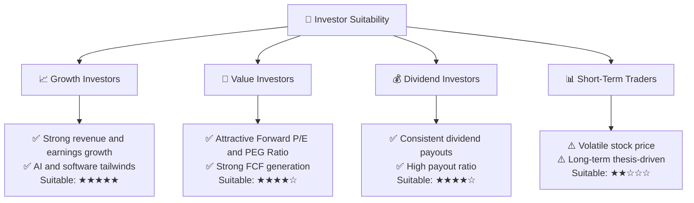
**分析**：
*   **成長型投資者 (Growth Investors)**：Broadcom憑藉其雙引擎驅動的高速成長（TTM營收YoY 47.9%，盈利YoY 85.4%）以及在AI、資料中心和企業軟體領域的領先地位，非常適合追求高成長的投資者。
*   **價值型投資者 (Value Investors)**：儘管市值龐大，但其低於行業平均的Forward P/E (18.58x)和極低的PEG Ratio (0.69)表明其成長潛力被低估，對價值型投資者具有吸引力。
*   **股息型投資者 (Dividend Investors)**：公司擁有穩定的現金流和較高的派息率（41.3%），且歷史股息增長強勁。但需注意提供的72.0%股息收益率可能為數據異常，實際股息率需進一步確認。若為正常水平，則適合尋求穩定股息收入的投資者。
*   **短期交易者 (Short-Term Traders)**：由於Broadcom的股價受宏觀經濟、行業週期和併購新聞影響較大，波動性較高。其投資邏輯更側重於長期基本面，因此對短期交易者而言風險較高。

### 10.5 關鍵監控指標

| 監控類型 | 指標 | 關注點 | 頻率 |
|----------|--------------------|----------------------------------------------------|--------|
| **營收成長** | 總營收 YoY/QoQ | AI相關半導體及VMware軟體業務的具體貢獻 | 每季 |
| **獲利能力** | 毛利率、營業利益率、淨利率 | 併購整合後的利潤率趨勢，成本控制效果 | 每季 |
| **現金流** | 自由現金流 (FCF) | FCF生成能力，是否能覆蓋股息和債務償還 | 每季 |
| **估值指標** | Forward P/E, PEG Ratio | 與同業及歷史區間比較，評估市場情緒變化 | 每週/月 |
| **債務健康** | 債務/EBITDA, 利息覆蓋倍數 | 債務償還進度，利率變化對財務成本的影響 | 每季 |
| **併購整合** | VMware軟體業務的客戶增長、續訂率、交叉銷售進展 | 評估併購協同效應是否按計劃實現 | 每季 |
| **研發投入** | R&D佔營收比重，新產品發布 | 確保公司保持技術領先和創新能力 | 每季 |
| **宏觀經濟** | 半導體行業景氣度，企業IT支出意願 | 評估外部環境對公司業務的影響 | 每月 |

---

> **免責聲明**：本報告為 AI 自動生成，僅供研究參考，不構成投資建議。投資有風險，入市需謹慎。