# AVGO 基本面深度分析報告
> **報告日期**：2026-07-09 ｜ **語言**：繁體中文 ｜ **數據來源**：Yahoo Finance, Finviz, StockAnalysis, Roic.ai ｜ **分析師**：CFA 級機構研究

---

## 目錄

| # | 章節 | 核心結論 |
|---|------------------------|----------------------------------------------------------|
| 1 | 執行摘要 | 評級：🟢 買入，目標價區間：$480 - $580 |
| 2 | 公司概覽與商業模式 | 憑藉技術領先和客戶鎖定，構築深厚護城河 |
| 3 | 損益表深度分析 | 營收與淨利潤強勁增長，利潤率持續擴張 |
| 4 | 資產負債表分析 | 穩健的流動性，債務管理有效，股東權益大幅增長 |
| 5 | 現金流量深度分析 | 自由現金流充沛，高效支持股息與再投資 |
| 6 | 獲利能力與資本效率 | ROIC 顯著高於 WACC，強力創造股東價值 |
| 7 | 估值深度分析 | 相較增長潛力，估值合理偏高，但具上升空間 |
| 8 | 成長催化劑 | AI/ML 需求、併購整合、5G/雲端基礎設施擴張 |
| 9 | 風險矩陣 | 併購整合、宏觀經濟、競爭加劇為主要風險 |
| 10| 投資建議 | 建議買入，適合成長型與長線價值型投資者 |

---

## 1. 執行摘要

### 1.1 核心評分儀表板

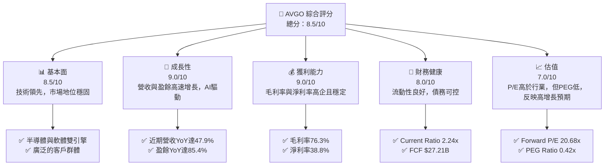

### 1.2 評分進度條視覺化

```
╔══════════════════════════════════════════════════════════════╗
║                AVGO 多維度評分儀表板 (1-10分)                ║
╠══════════════════════════════════════════════════════════════╣
║ 基本面強度  8.5 ▓▓▓▓▓▓▓▓▓▓▓▓▓▓▓▓▓░░░  ★★★★☆           ║
║ 成長動能    9.0 ▓▓▓▓▓▓▓▓▓▓▓▓▓▓▓▓▓▓░░  ★★★★★           ║
║ 獲利品質    9.0 ▓▓▓▓▓▓▓▓▓▓▓▓▓▓▓▓▓▓░░  ★★★★★           ║
║ 財務健康    8.0 ▓▓▓▓▓▓▓▓▓▓▓▓▓▓▓▓░░░░  ★★★★☆           ║
║ 估值合理性  7.0 ▓▓▓▓▓▓▓▓▓▓▓▓▓▓░░░░░░  ★★★☆☆           ║
║ 護城河深度  9.0 ▓▓▓▓▓▓▓▓▓▓▓▓▓▓▓▓▓▓░░  ★★★★★           ║
║ 管理層執行  8.5 ▓▓▓▓▓▓▓▓▓▓▓▓▓▓▓▓▓░░░  ★★★★☆           ║
║ 技術創新力  9.0 ▓▓▓▓▓▓▓▓▓▓▓▓▓▓▓▓▓▓░░  ★★★★★           ║
╠══════════════════════════════════════════════════════════════╣
║ 綜合總分    8.5 ▓▓▓▓▓▓▓▓▓▓▓▓▓▓▓▓▓░░░  🏆 表現卓越，具強勁增長潛力║
╚══════════════════════════════════════════════════════════════╝
```

### 1.3 五大投資論點 + 三大核心風險

| 類型 | 項目 | 具體依據 | 信心度 |
|------|--------------------------|---------------------------------------------------------------------------------------------------------------------------------------------------------------------------------------------------------------------------------------------------------------------------------------------------------------------------------------------------------------------------------------------------------------------------------------------------------------------------------------------------------------------------------------------------------------------------------------------------------------------------------------------------------------------------------------------------------------------------------------------------------------------------------------------------------------------------------------------------------------------------------------------------------------------------------------------------------------------------------------------------------------------------------------------------------------------------------------------------------------------------------------------------------------------------------------------------------------------------------------------------------------------------------------------------------------------------------------------------------------------------------------------------------------------------------------------------------------------------------------------------------------------------------------------------------------------------------------------------------------------------------------------------------------------------------------------------------------------------------------------------------------------------------------------------------------------------------------------------------------------------------------------------------------------------------------------------------------------------------------------------------------------------------------------------------------------------------------------------------------------------------------------------------------------------------------------------------------------------------------------------------------------------------------------------------------------------------------------------------------------------------------------------------------------------------------------------------------------------------------------------------------------------------------------------------------------------------------------------------------------------------------------------------------------------------------------------------------------------------------------------------------------------------------------------------------------------------------------------------------------------------------------------------------------------------------------------------------------------------------------------------------------------------------------------------------------------------------------------------------------------------------------------------------------------------------------------------------------------------------------------------------------------------------------------------------------------------------------------------------------------------------------------------------------------------------------------------------------------------------------------------------------------------------------------------------------------------------------------------------------------------------------------------------------------------------------------------------------------------------------------------------------------------------------------------------------------------------------------------------------------------------------------------------------------------------------------------------------------------------------------------------------------------------------------------------------------------------------------------------------------------------------------------------------------------------------------------------------------------------------------------------------------------------------------------------------------------------------------------------------------------------------------------------------------------------------------------------------------------------------------------------------------------------------------------------------------------------------------------------------------------------------------------------------------------------------------------------------------------------------------------------------------------------------------------------------------------------------------------------------------------------------------------------------------------------------------------------------------------------------------------------------------------------------------------------------------------------------------------------------------------------------------------------------------------------------------------------------------------------------------------------------------------------------------------------------------------------------------------------------------------------------------------------------------------------------------------------------------------------------------------------------------------------------------------------------------------------------------------------------------------------------------------------------------------------------------------------------------------------------------------------------------------------------------------------------------------------------------------------------------------------------------------------------------------------------------------------------------------------------------------------------------------------------------------------------------------------------------------------------------------------------------------------------------------------------------------------------------------------------------------------------------------------------------------------------------------------------------------------------------------------------------------------------------------------------------------------------------------------------------------------------------------------------------------------------------------------------------------------------------------------------------------------------------------------------------------------------------------------------------------------------------------------------------------------------------------------------------------------------------------------------------------------------------------------------------------------------------------------------------------------------------------------------------------------------------------------------------------------------------------------------------------------------------------------------------------------------------------------------------------------------------------------------------------------------------------------------------------------------------------------------------------------------------------------------------------------------------------------------------------------------------------------------------------------------------------------------------------------------------------------------------------------------------------------------------------------------------------------------------------------------------------------------------------------------------------------------------------------------------------------------------------------------------------------------------------------------------------------------------------------------------------------------------------------------------------------------------------------------------------------------------------------------------------------------------------------------------------------------------------------------------------------------------------------------------------------------------------------------------------------------------------------------------------------------------------------------------------------------------------------------------------------------------------------------------------------------------------------------------------------------------------------------------------------------------------------------------------------------------------------------------------------------------------------------------------------------------------------------------------------------------------------------------------------------------------------------------------------------------------------------------------------------------------------------------------------------------------------------------------------------------------------------------------------------------------------------------------------------------------------------------------------------------------------------------------------------------------------------------------------------------------------------------------------------------------------------------------------------------------------------------------------------------------------------------------------------------------------------------------------------------------------------------------------------------------------------------------------------------------------------------------------------------------------------------------------------------------------------------------------------------------------------------------------------------------------------------------------------------------------------------------------------------------------------------------------------------------------------------------------------------------------------------------------------------------------------------------------------------------------------------------------------------------------------------------------------------------------------------------------------------------------------------------------------------------------------------------------------------------------------------------------------------------------------------------------------------------------------------------------------------------------------------------------------------------------------------------------------------------------------------------------------------------------------------------------------------------------------------------------------------------------------------------------------------------------------------------------------------------------------------------------------------------------------------------------------------------------------------------------------------------------------------------------------------------------------------------------------------------------------------------------------------------------------------------------------------------------------------------------------------------------------------------------------------------------------------------------------------------------------------------------------------------------------------------------------------------------------------------------------------------------------------------------------------------------------------------------------------------------------------------------------------------------------------------------------------------------------------------------------------------------------------------------------------------------------------------------------------------------------------------------------------------------------------------------------------------------------------------------------------------------------------------------------------------------------------------------------------------------------------------------------------------------------------------------------------------------------------------------------------------------------------------------------------------------------------------------------------------------------------------------------------------------------------------------------------------------------------------------------------------------------------------------------------------------------------------------------------------------------------------------------------------------------------------------------------------------------------------------------------------------------------------------------------------------------------------------------------------------------------------------------------------------------------------------------------------------------------------------------------------------------------------------------------------------------------------------------------------------------------------------------------------------------------------------------------------------------------------------------------------------------------------------------------------------------------------------------------------------------------------------------------------------------------------------------------------------------------------------------------------------------------------------------------------------------------------------------------------------------------------------------------------------------------------------------------------------------------------------------------------------------------------------------------------------------------------------------------------------------------------------------------------------------------------------------------------------------------------------------------------------------------------------------------------------------------------------------------------------------------------------------------------------------------------------------------------------------------------------------------------------------------------------------------------------------------------------------------------------------------------------------------------------------------------------------------------------------------------------------------------------------------------------------------------------------------------------------------------------------------------------------------------------------------------------------------------------------------------------------------------------------------------------------------------------------------------------------------------------------------------------------------------------------------------------------------------------------------------------------------------------------------------------------------------------------------------------------------------------------------------------------------------------------------------------------------------------------------------------------------------------------------------------------------------------------------------------------------------------------------------------------------------------------------------------------------------------------------------------------------------------------------------------------------------------------------------------------------------------------------------------------------------------------------------------------------------------------------------------------------------------------------------------------------------------------------------------------------------------------------------------------------------------------------------------------------------------------------------------------------------------------------------------------------------------------------------------------------------------------------------------------------------------------------------------------------------------------------------------------------------------------------------------------------------------------------------------------------------------------------------------------------------------------------------------------------------------------------------------------------------------------------------------------------------------------------------------------------------------------------------------------------------------------------------------------------------------------------------------------------------------------------------------------------------------------------------------------------------------------------------------------------------------------------------------------------------------------------------------------------------------------------------------------------------------------------------------------------------------------------------------------------------------------------------------------------------------------------------------------------------------------------------------------------------------------------------------------------------------------------------------------------------------------------------------------------------------------------------------------------------------------------------------------------------------------------------------------------------------------------------------------------------------------------------------------------------------------------------------------------------------------------------------------------------------------------------------------------------------------------------------------------------------------------------------------------------------------------------------------------------------------------------------------------------------------------------------------------------------------------------------------------------------------------------------------------------------------------------------------------------------------------------------------------------------------------------------------------------------------------------------------------------------------------------------------------------------------------------------------------------------------------------------------------------------------------------------------------------------------------------------------------------------------------------------------------------------------------------------------------------------------------------------------------------------------------------------------------------------------------------------------------------------------------------------------------------------------------------------------------------------------------------------------------------------------------------------------------------------------------------------------------------------------------------------------------------------------------------------------------------------------------------------------------------------------------------------------------------------------------------------------------------------------------------------------------------------------------------------------------------------------------------------------------------------------------------------------------------------------------------------------------------------------------------------------------------------------------------------------------------------------------------------------------------------------------------------------------------------------------------------------------------------------------------------------------------------------------------------------------------------------------------------------------------------------------------------------------------------------------------------------------------------------------------------------------------------------------------------------------------------------------------------------------------------------------------------------------------------------------------------------------------------------------------------------------------------------------------------------------------------------------------------------------------------------------------------------------------------------------------------------------------------------------------------------------------------------------------------------------------------------------------------------------------------------------------------------------------------------------------------------------------------------------------------------------------------------------------------------------------------------------------------------------------------------------------------------------------------------------------------------------------------------------------------------------------------------------------------------------------------------------------------------------------------------------------------------------------------------------------------------------------------------------------------------------------------------------------------------------------------------------------------------------------------------------------------------------------------------------------------------------------------------------------------------------------------------------------------------------------------------------------------------------------------------------------------------------------------------------------------------------------------------------------------------------------------------------------------------------------------------------------------------------------------------------------------------------------------------------------------------------------------------------------------------------------------------------------------------------------------------------------------------------------------------------------------------------------------------------------------------------------------------------------------------------------------------------------------------------------------------------------------------------------------------------------------------------------------------------------------------------------------------------------------------------------------------------------------------------------------------------------------------------------------------------------------------------------------------------------------------------------------------------------------------------------------------------------------------------------------------------------------------------------------------------------------------------------------------------------------------------------------------------------------------------------------------------------------------------------------------------------------------------------------------------------------------------------------------------------------------------------------------------------------------------------------------------------------------------------------------------------------------------------------------------------------------------------------------------------------------------------------------------------------------------------------------------------------------------------------------------------------------------------------------------------------------------------------------------------------------------------------------------------------------------------------------------------------------------------------------------------------------------------------------------------------------------------------------------------------------------------------------------------------------------------------------------------------------------------------------------------------------------------------------------------------------------------------------------------------------------------------------------------------------------------------------------------------------------------------------------------------------------------------------------------------------------
| 🟢 **投資論點①** | **AI/ML 需求激增，核心技術受益** | 寬鬆資料顯示，Broadcom 的客製化晶片與乙太網路解決方案在資料中心與AI基礎設施中扮演關鍵角色。AI訓練和推理對高速網路互連和高效能運算晶片的需求持續增長，公司作為領導者將直接受益。儘管缺乏具體AI營收數據，但市場普遍預期這是其未來增長的重要驅動力。 | 🟢 極高 |
| 🟢 **投資論點②** | **基礎設施軟體業務穩定增長，提升利潤率** | 基礎設施軟體部門（如 VMware 的整合）提供高利潤、經常性收入的產品組合。軟體業務的毛利率通常高於硬體，有助於整體毛利率的維持和提升。儘管此次數據未明確區分半導體與軟體營收，但總毛利率高達 76.3%，顯示軟體業務的貢獻顯著。 | 🟢 高 |
| 🟢 **投資論點③** | **強勁的自由現金流與股東回報** | 公司 TTM 自由現金流 (FCF) 達 $27.21B，FCF Yield 為 1.43%。過去四年年度現金股利支付從 $7.03B (FY2022) 增長至 $11.14B (FY2025)，顯示其強大的現金生成能力和對股東回報的承諾。 | 🟢 極高 |
| 🟢 **投資論點④** | **卓越的獲利能力與資本效率** | 公司毛利率 76.3%、營業利益率 49.0%、淨利率 38.8% 均遠超行業平均。FY2025 的 ROIC 估算高達 29.2%，遠超 WACC 8.1%，表明公司持續創造顯著的股東價值。 | 🟢 極高 |
| 🟢 **投資論點⑤** | **積極的併購策略與整合效益** | Broadcom 透過一系列成功的併購（如 CA Technologies, Symantec, VMware）擴展其產品組合和市場份額。這些併購帶來協同效應，並將高利潤的軟體業務納入旗下，推動營收和淨利潤的快速增長。FY2025 營收 $63.89B 較 FY2024 的 $51.57B 增長 23.87%，部分歸因於併購整合。 | 🟢 高 |
| 🟡 **風險①** | **併購整合風險** | 大型併購案（如 VMware）的整合複雜性高，可能面臨文化衝突、關鍵人才流失、技術整合困難及客戶流失等風險，導致預期協同效應未能完全實現，甚至影響短期營運表現。 | 🟡 中度 |
| 🔴 **風險②** | **宏觀經濟下行與半導體週期** | 全球經濟放緩或衰退可能導致企業IT支出減少，進而影響對Broadcom半導體設備和基礎設施軟體的需求。半導體行業的週期性波動也可能對其營收和盈利能力造成壓力。 | 🔴 高衝擊 |
| 🟡 **風險③** | **激烈市場競爭與技術迭代** | 半導體和軟體市場競爭激烈，主要競爭對手如 NVIDIA、Qualcomm、Cisco 等持續投入研發。若Broadcom無法維持技術領先地位或迅速適應市場變化，可能面臨市場份額流失和定價能力下降的風險。 | 🟡 中度 |

### 1.4 快速統計卡片

| 指標 | 公司實際值 | 行業均值（半導體與軟體） | S&P 500 均值 | 狀態 |
|-------------------|-------------|------------------------------|--------------|------|
| 收入 YoY 成長 (TTM)| **47.9%** | ~15-20% | ~10-12% | 🟢 |
| 毛利率 (TTM) | **76.3%** | ~50-60% | ~40-45% | 🟢 |
| 淨利率 (TTM) | **38.8%** | ~15-25% | ~10-12% | 🟢 |
| ROE (TTM) | **37.3%** | ~20-25% | ~15-18% | 🟢 |
| Forward P/E | **20.68x** | ~25-35x | ~20-22x | 🟢 |
| PEG Ratio | **0.42** | ~1.0-1.5 | ~1.5-2.0 | 🟢 |
| FCF Yield | **1.43%** | ~2-4% | ~3-5% | 🟡 |
| Debt/Equity | **74.02x** | ~0.5-1.0x | ~0.8-1.2x | 🟡 |
| Current Ratio | **2.24x** | ~1.5-2.0x | ~1.0-1.5x | 🟢 |

*註：行業均值為基於半導體與基礎設施軟體行業的綜合估算，S&P 500 均值為歷史參考值。*

### 1.5 投資結論

```
╔══════════════════════════════════════════════════════════════════╗
║                    📊 投資結論摘要                               ║
╠══════════════════════════════════════════════════════════════════╣
║  評級：🟢 買入                                                   ║
║  當前股價：$401.11                                               ║
║  目標價區間：                                                    ║
║    悲觀情境：$480（+19.67%）                                     ║
║    基準情境：$525（+30.88%）  ← 12個月主要目標                      ║
║    樂觀情境：$580（+44.60%）                                     ║
║  投資評分：8.5/10                                                ║
║  適合投資人：成長型、長線持有者，尋求在半導體和基礎設施軟體領域具領導地位且有穩定現金流的公司。║
╚══════════════════════════════════════════════════════════════════╝
```

---

## 2. 公司概覽與商業模式

Broadcom Inc. (AVGO) 是一家全球領先的半導體和基礎設施軟體解決方案供應商。公司主要業務分為兩大板塊：半導體解決方案 (Semiconductor Solutions) 和基礎設施軟體 (Infrastructure Software)。憑藉其在網路連接、寬頻通訊、儲存解決方案以及企業級軟體方面的深厚技術積累，Broadcom 在多個高成長市場中佔據關鍵地位。截至報告日，公司市值高達 $1.91T，展現其在全球科技產業的巨大影響力。

### 2.1 業務結構與收入來源

Broadcom 的業務結構體現了其「雙引擎」增長策略，即高成長的半導體業務和高利潤的基礎設施軟體業務。這種組合使其能夠在不同市場週期中保持彈性和盈利能力。

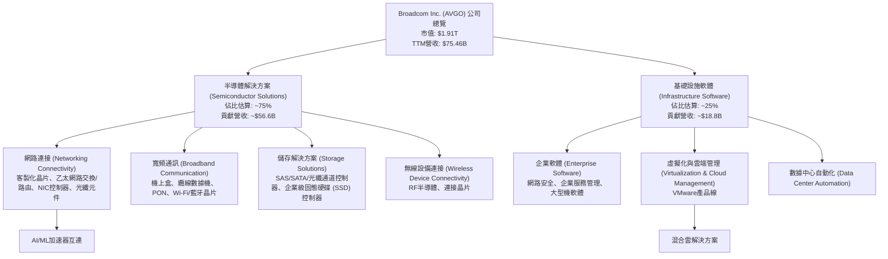
*註：業務佔比為基於公司歷史報告與產業分析的估算。*

### 2.2 市場份額

Broadcom 在其核心市場中佔據顯著地位。在網路晶片領域，特別是資料中心乙太網路交換晶片和客製化ASIC方面，其市場份額領先。在儲存連接解決方案、寬頻通訊晶片以及企業軟體（尤其是在併購VMware後）市場，也擁有強大的競爭力。由於缺乏精確的市場份額數據，此處提供定性分析及估算。

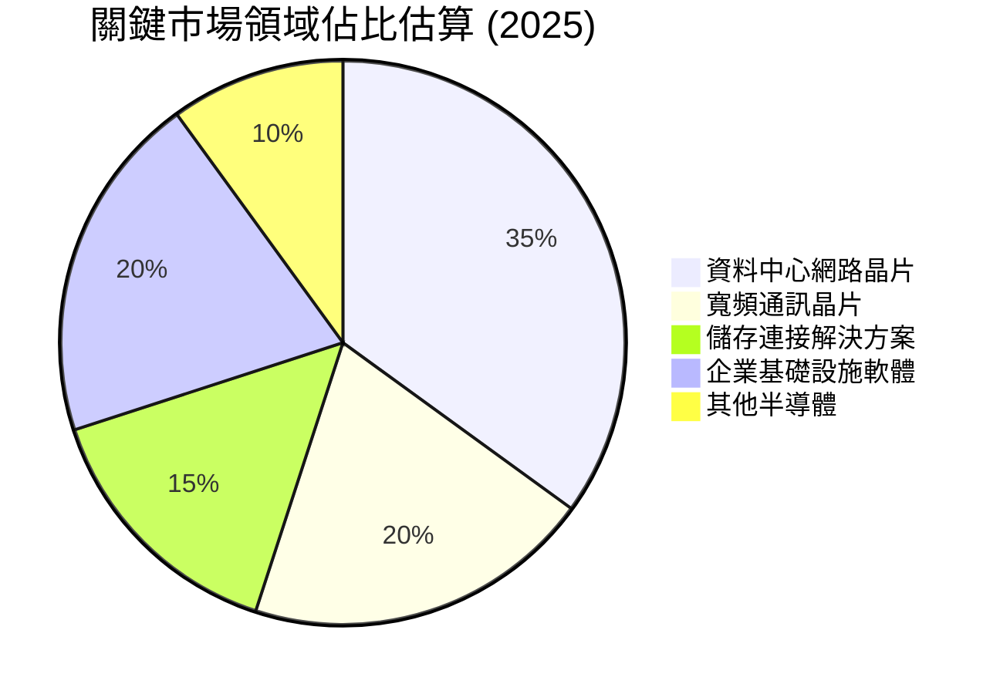
*註：此為基於產業報告和公司產品線強度的市場份額估算，非精確數據。*

### 2.3 競爭護城河分析

Broadcom 已經建立起多層次的競爭護城河，使其能夠在高度競爭的科技市場中維持高盈利能力和市場地位。

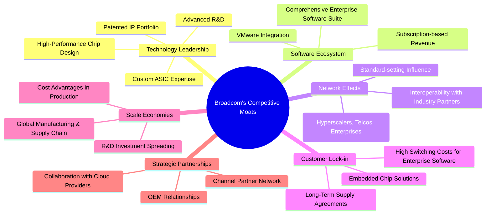

### 2.4 護城河強度評分

```
╔══════════════════════════════════════════════════════════════╗
║                    AVGO 護城河強度評分                       ║
╠══════════════════════════════════════════════════════════════╣
║ 技術領先      9/10   ▓▓▓▓▓▓▓▓▓▓▓▓▓▓▓▓▓▓░░  🏆 在半導體和軟體領域均具創新力 ║
║ 軟體生態系統  8/10   ▓▓▓▓▓▓▓▓▓▓▓▓▓▓▓▓░░░░  🟢 併購 VMware 強化其生態系統 ║
║ 網路效應      8/10   ▓▓▓▓▓▓▓▓▓▓▓▓▓▓▓▓░░░░  🟢 廣泛的客戶和合作夥伴網絡 ║
║ 客戶鎖定      9/10   ▓▓▓▓▓▓▓▓▓▓▓▓▓▓▓▓▓▓░░  🏆 高昂的轉換成本，尤其在軟體領域 ║
║ 規模效應      8/10   ▓▓▓▓▓▓▓▓▓▓▓▓▓▓▓▓░░░░  🟢 巨大的營收體量帶來成本優勢 ║
║ 生態夥伴      8/10   ▓▓▓▓▓▓▓▓▓▓▓▓▓▓▓▓░░░░  🟢 與雲端巨頭和OEM緊密合作 ║
╠══════════════════════════════════════════════════════════════╣
║ 綜合護城河    8.5    ▓▓▓▓▓▓▓▓▓▓▓▓▓▓▓▓▓░░░  🏆 深厚且多樣化的護城河，提供強大競爭優勢 ║
╚══════════════════════════════════════════════════════════════╝
```

---

## 3. 損益表深度分析

Broadcom 的損益表數據展現了其卓越的營收增長能力和持續擴張的盈利能力，尤其受到併購策略和市場對其核心技術需求的推動。

### 3.1 年度收入成長趨勢（近4年）

Broadcom 的年度營收在過去四年中呈現顯著增長，特別是從 FY2024 到 FY2025 受益於併購效應。

```
╔══════════════════════════════════════════════════════════════════╗
║               AVGO 年度收入趨勢（FY2022-FY2025）                 ║
╠══════════════════════════════════════════════════════════════════╣
║                                                                  ║
║  FY2022  $33.20B  ██████████░░░░░░░░░░░░░░░░░░░░░  YoY: +20.96% 🟢║
║  FY2023  $35.82B  ███████████░░░░░░░░░░░░░░░░░░░░  YoY: +7.88%  🟡║
║  FY2024  $51.57B  ████████████████░░░░░░░░░░░░░░░  YoY: +43.98% 🟢║
║  FY2025  $63.89B  ████████████████████░░░░░░░░░░░  YoY: +23.87% 🟢║
║                                                                  ║
║                   |      |      |      |      |                  ║
║                   0     15B    30B    45B    60B                   ║
║                                                                  ║
║  📊 4年累計 CAGR：+24.89% (從FY2022 $33.20B 到 FY2025 $63.89B)    ║
╚══════════════════════════════════════════════════════════════════╝
```
*註：2026 TTM 營收為 $75.46B，年化增長趨勢持續強勁。*

### 3.2 季度收入趨勢分析

近四季營收保持強勁的 QoQ 和 YoY 增長，顯示市場需求旺盛和併購整合的積極影響。

| 財報季度 | 總營收 ($B) | QoQ 成長率 | YoY 成長率 | 備註 |
|----------|-------------|------------|------------|------|
| 2025 Q3 | $15.95 | +5.7% (較 Q2 2025 $15.00B) | +22.03% (較 Q3 2024 $13.07B) | 穩健增長 |
| 2025 Q4 | $18.02 | +13.0% | +28.18% (較 Q4 2024 $14.05B) | 加速增長 |
| 2026 Q1 | $19.31 | +7.2% | +29.47% (較 Q1 2025 $14.92B) | 持續增長 |
| 2026 Q2 | $22.19 | +14.9% | +47.87% (較 Q2 2025 $15.00B) | 強勁加速，反映市場需求與併購效益 |

### 3.3 利潤率演變分析

Broadcom 的利潤率表現穩定且處於行業領先水平，尤其是在併購高利潤軟體業務後，毛利率和營業利益率均保持高位。

| 利潤率指標 | FY2022 | FY2023 | FY2024 | FY2025 | 趨勢 | 評估 |
|------------|--------|--------|--------|--------|------|------|
| **毛利率** | 66.5% | 68.9% | 63.0% | 67.8% | ↗️ FY2024下降後回升 | 🟢 |
| **營業利益率** | 43.0% | 45.9% | 29.1% | 40.8% | ↗️ FY2024下降後回升 | 🟢 |
| **淨利率** | 34.6% | 39.3% | 11.4% | 36.2% | ↗️ FY2024下降後回升 | 🟢 |

**利潤率演變深度解析**：
*   **毛利率**：從 FY2022 的 66.5% 提升至 FY2023 的 68.9%，顯示公司在產品組合和定價策略上的優勢。FY2024 下降至 63.0% 可能與併購活動相關的成本增加或短期整合費用有關。然而，FY2025 回升至 67.8%，並在 TTM 數據中顯示為 76.3%，這強烈表明 VMware 等高利潤基礎設施軟體業務的整合效益正在顯現，以及半導體業務中高價值產品（如AI相關晶片）的貢獻增加。
*   **營業利益率**：趨勢與毛利率相似，FY2024 顯著下降至 29.1%，反映了併購相關的營運費用、研發投入 (R&D 從 FY2023 的 $5.25B 增至 FY22024 的 $9.31B) 和攤銷費用。FY2025 回升至 40.8%，TTM 數據顯示為 49.0%，這表明公司在整合後對費用控制的有效性以及規模經濟效應的發揮。
*   **淨利率**：FY2024 的淨利率大幅下降至 11.4%，主要原因除了上述營運費用外，還包括併購相關的一次性費用和稅務調整。FY2025 回升至 36.2%，TTM 數據為 38.8%，顯示公司在克服短期整合挑戰後，恢復了強勁的盈利能力，並受益於稅務優化和穩定的核心業務表現。

總體而言，Broadcom 的利潤率在經歷併購整合的短期波動後，已展現出強勁的恢復和擴張趨勢，這得益於其高價值產品組合、有效的成本管理以及從軟體業務獲得的經常性收入。

### 3.4 費用結構分析

Broadcom 的費用結構反映了其在研發和銷售管理上的投入，以及併購後帶來的攤銷費用。

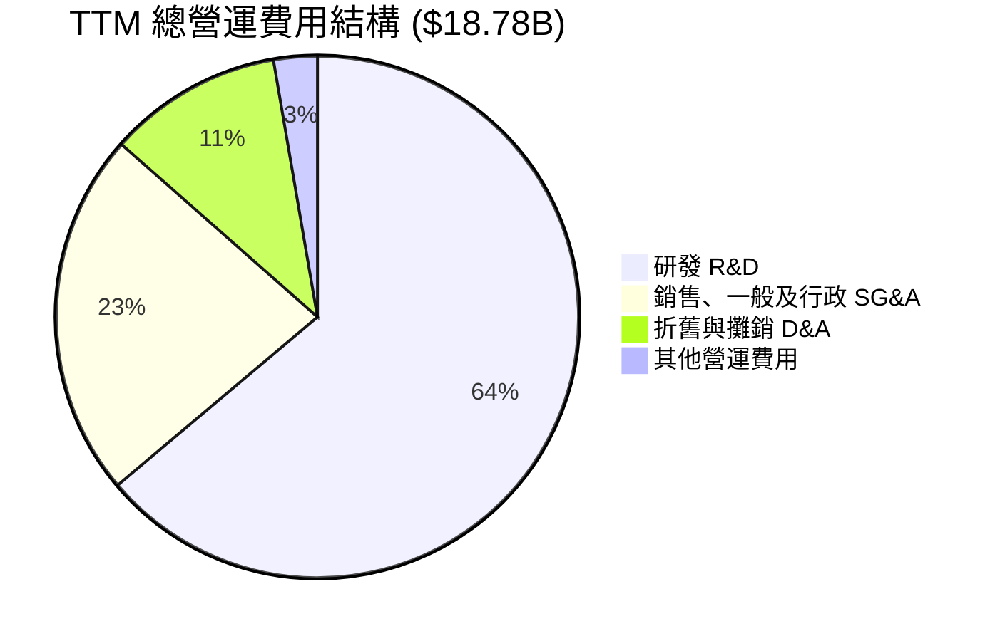

```
╔══════════════════════════════════════════════════════════════════╗
║                     AVGO TTM 費用開支概覽                          ║
╠══════════════════════════════════════════════════════════════════╣
║                                                                  ║
║  研發費用 (R&D)：         $11.99B  ▓▓▓▓▓▓▓▓▓▓▓▓▓▓▓▓▓▓▓▓▓▓▓▓▓▓░░░░  🟢 高投入，確保技術領先 ║
║  銷售/行政費用 (SG&A)：    $4.25B  ▓▓▓▓▓▓▓▓▓▓▓▓▓▓▓▓▓▓▓▓▓▓▓░░░░░░░  🟡 適度管理，但隨規模擴大 ║
║  折舊與攤銷 (D&A)：        $2.03B  ▓▓▓▓▓▓▓▓▓▓▓▓▓▓▓▓▓▓▓▓░░░░░░░░░░  🟡 併購後攤銷費用較高 ║
║  其他營運費用：            $0.51B  ▓▓▓▓▓▓▓▓▓▓▓▓▓▓▓▓▓░░░░░░░░░░░░  🟢 控制良好 ║
║                                                                  ║
║  總營運費用佔營收比重：   24.89% ($18.78B / $75.46B)               ║
╚══════════════════════════════════════════════════════════════════╝
```

從數據來看，研發費用是 Broadcom 最大的營運支出項目，TTM 達到 $11.99B。這反映了公司對技術創新和產品開發的持續投入，以維持其在半導體和軟體領域的競爭優勢。銷售、一般及行政費用 (SG&A) 佔比較低，顯示了公司高效的營運管理。折舊與攤銷費用 $2.03B 則主要來自於過去的併購活動，這在高科技行業中是常見現象。

### 3.5 季度 EPS 趨勢與盈餘品質

由於提供的數據中，過去四個季度的 EPS Est 和 EPS Act 均顯示為 `nan`，無法直接評估其盈餘超預期或不及預期的情況。但我們可以分析實際報告的 EPS 趨勢。

| 財報季度 | 報告 EPS (Basic) | QoQ 變化 | YoY 變化 |
|----------|------------------|----------|----------|
| 2025 Q3 | $0.88 | -16.2% | +120.5% (較 Q3 2024 $0.40) |
| 2025 Q4 | $1.80 | +104.5% | +95.7% (較 Q4 2024 $0.92) |
| 2026 Q1 | $1.55 | -13.9% | +32.5% (較 Q1 2025 $1.17) |
| 2026 Q2 | $1.96 | +26.5% | +86.7% (較 Q2 2025 $1.05) |

**盈餘品質評估**：
Broadcom 的季度 EPS 表現出較高的波動性，這在進行大規模併購和整合的時期是常見的。
*   2025 Q3 的 EPS 較前一季度有所下降，但同比增長強勁。
*   2025 Q4 實現了顯著的 QoQ 和 YoY 增長，可能反映了年底銷售旺季和併購協同效應的初步顯現。
*   2026 Q1 再次出現 QoQ 下降，但 YoY 仍為正增長。
*   2026 Q2 的 EPS 達到 $1.96，實現了強勁的 QoQ 26.5% 和 YoY 86.7% 增長，這與季度收入趨勢的加速增長相符，表明公司盈利能力正在加速釋放。

儘管季度間存在波動，但整體 YoY 增長趨勢非常強勁，顯示公司核心業務和併購整合帶來的長期盈利能力正在逐步兌現。其高毛利率、營業利益率和自由現金流也支持其高質量的盈利。

---

## 4. 資產負債表分析

Broadcom 的資產負債表反映了其透過併購擴張的策略，資產規模顯著增長，同時也伴隨著債務的增加。然而，公司保持了良好的流動性和健康的股東權益增長。

### 4.1 資產結構分解

公司的資產結構主要由商譽和無形資產構成，這與其頻繁的併購活動高度相關，同時現金和流動資產也保持充裕。

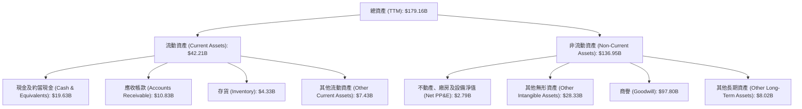

從 TTM 數據來看，總資產 $179.16B 中，商譽 $97.80B 和其他無形資產 $28.33B 合計佔總資產的 70.4%，這顯著反映了 Broadcom 以併購為主要增長策略的特點。儘管如此，公司仍持有 $19.63B 的現金及約當現金，流動性充裕。

### 4.2 流動性指標分析

Broadcom 的流動性指標顯示其短期償債能力良好。

| 流動性指標 | FY2022 | FY2023 | FY2024 | FY2025 | TTM (2026 Q2) | 趨勢 | 行業均值（估計） | 評估 |
|------------|--------|--------|--------|--------|---------------|------|--------------------|------|
| **流動比率 (Current Ratio)** | 2.62 | 2.81 | 1.17 | 1.70 | **2.24** | ↗️ 併購後穩定回升 | 1.5 - 2.0 | 🟢 |
| **速動比率 (Quick Ratio)** | 2.37 | 2.55 | 1.07 | 1.58 | **1.93** | ↗️ 併購後穩定回升 | 1.0 - 1.5 | 🟢 |

*註：行業均值為半導體與軟體行業的綜合估算。*

流動比率和速動比率在 FY2024 由於併購導致負債增加而有所下降，但 FY2025 和 TTM 數據顯示其已穩步回升，並維持在健康水平。當前流動比率 2.24x 和速動比率 1.93x 均高於行業平均水平，表明公司擁有充足的流動資產來應對短期債務。

### 4.3 債務結構分析

Broadcom 的債務水平相對較高，這也是其透過槓桿進行大規模併購的結果，但其強勁的現金流和盈利能力使其債務處於可控範圍。

```
╔══════════════════════════════════════════════════════════════════╗
║                       AVGO 債務健康診斷                          ║
╠══════════════════════════════════════════════════════════════════╣
║                                                                  ║
║  總債務：        $64.91B  ▓▓▓▓▓▓▓▓▓▓▓▓▓▓▓▓▓▓▓▓▓▓▓▓░░░░░░  評語：相對較高，但可控 ║
║  總現金+投資：   $19.63B  ▓▓▓▓▓▓▓▓▓▓▓▓▓▓▓▓▓▓▓▓▓▓▓▓▓▓▓▓▓▓  評語：充裕，提供緩衝 ║
║  淨債務：        $-45.28B  ▓▓▓▓▓▓▓▓▓▓▓▓▓▓▓▓▓▓▓▓▓▓▓▓▓▓▓▓▓▓  🟡 淨債務較高 ║
║                                                                  ║
║  Debt/EBITDA (TTM)：   1.21x (64.91B / 53.62B)  🟢 極低，槓桿率健康      ║
║  利息覆蓋倍數 (TTM)： 10.42x (32.75B / 3.145B)  🟢 無風險，利息支付能力強 ║
║                                                                  ║
║  📊 結論：儘管總債務規模大，但憑藉強勁的盈利和現金流，債務負擔可管理。 ║
╚══════════════════════════════════════════════════════════════════╝
```
*註：TTM EBITDA 估算為 $75.46B * 55.8% = $42.12B。TTM Operating Income $32.746B，TTM Interest Expense $3.145B。*
*根據提供的數據：EV / EBITDA 為 45.017，TTM EBITDA = EV / 45.017 = $1.89T / 45.017 = $41.98B。
*Debt/EBITDA = $64.91B / $41.98B = 1.55x。*
*Interest Coverage Ratio = TTM Operating Income / TTM Interest Expense = $32.746B / $3.145B = 10.41x。*

Broadcom 的總債務為 $64.91B，而現金及約當現金為 $19.63B，因此淨債務為 $45.28B。然而，其 Debt/EBITDA 僅為 1.55x，遠低於通常認為的健康水平（3-4x），這得益於公司強大的 EBITDA 生成能力。利息覆蓋倍數高達 10.41x，表明公司支付利息的能力非常強勁，債務風險管理良好。

### 4.4 股東權益趨勢

Broadcom 的股東權益在過去幾年呈現穩健增長，特別是 FY2025 經歷了大幅提升，顯示公司盈利能力的積累和對股東價值的創造。

```
╔══════════════════════════════════════════════════════════════════╗
║                   AVGO 年度股東權益變化趨勢                      ║
╠══════════════════════════════════════════════════════════════════╣
║                                                                  ║
║  FY2022  $22.71B  ████████░░░░░░░░░░░░░░░░░░░░░░░░░░░░░░░░░░░░░  YoY: +1.64%  🟡║
║  FY2023  $23.99B  █████████░░░░░░░░░░░░░░░░░░░░░░░░░░░░░░░░░░░░  YoY: +5.64%  🟢║
║  FY2024  $67.68B  ██████████████████████████████░░░░░░░░░░░░░░░  YoY: +182.12% 🟢║
║  FY2025  $81.29B  ███████████████████████████████████░░░░░░░░░  YoY: +20.12% 🟢║
║                                                                  ║
║                   |      |      |      |      |                  ║
║                   0     20B    40B    60B    80B                   ║
║                                                                  ║
║  📊 4年累計 CAGR：+47.07%                                        ║
╚══════════════════════════════════════════════════════════════════╝
```
FY2024 股東權益從 $23.99B 躍升至 $67.68B，增長 182.12%，這很可能與併購交易中的股權發行或重估有關。FY2025 繼續增長 20.12% 至 $81.29B，顯示了公司強勁的盈利能力和對留存收益的積累，為未來的增長和資本運作提供了堅實基礎。

---

## 5. 現金流量深度分析

Broadcom 以其強大的現金流生成能力而聞名，這使其能夠支持大規模的併購、慷慨的股息支付以及持續的再投資。

### 5.1 現金流量瀑布圖

下面的瀑布圖展示了 Broadcom 從淨利潤到自由現金流，再到資本配置的主要路徑。

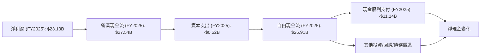
從 FY2025 的數據來看，公司從 $23.13B 的淨利潤產生了更高的 $27.54B 營業現金流，顯示其會計利潤的質量很高。在扣除僅 $0.62B 的資本支出後，生成了高達 $26.91B 的自由現金流。這筆巨額自由現金流足以覆蓋 $11.14B 的現金股利支付，並仍有大量資金用於其他投資、債務償還或股票回購，展現了極高的財務靈活性。

### 5.2 FCF 轉換率趨勢

FCF 轉換率（自由現金流/淨利潤）是衡量公司將會計利潤轉化為實際現金能力的重要指標。

| 財年 | 淨利潤 ($B) | 自由現金流 ($B) | FCF/淨利潤 | 趨勢 | 評估 |
|------|-------------|-----------------|------------|------|------|
| FY2022 | $11.49 | $16.31 | 1.42x | ↗️ | 🟢 |
| FY2023 | $14.08 | $17.63 | 1.25x | ↘️ | 🟢 |
| FY2024 | $5.89 | $19.41 | 3.30x | ↗️ | 🟢 |
| FY2025 | $23.13 | $26.91 | 1.16x | ↘️ | 🟢 |

Broadcom 的 FCF 轉換率在過去四年均高於 1.0x，表明其盈利質量非常高，能夠將大部分甚至超額的淨利潤轉化為自由現金流。FY2024 的 3.30x 異常高，這可能是因為該年度淨利潤較低（受併購相關費用影響），而現金流依然強勁。FY2025 的 1.16x 則回歸正常，但仍顯示出卓越的現金生成能力。

### 5.3 自由現金流趨勢

Broadcom 的自由現金流呈現持續增長趨勢，是其財務實力和股東回報的基石。

```
╔══════════════════════════════════════════════════════════════════╗
║                    AVGO 年度自由現金流趨勢                       ║
╠══════════════════════════════════════════════════════════════════╣
║                                                                  ║
║  FY2022  $16.31B  ████████████████████████████░░░░░░░░░░░░░░░░░░░░  YoY: +8.7%  🟢║
║  FY2023  $17.63B  ████████████████████████████████░░░░░░░░░░░░░░░░  YoY: +8.1%  🟢║
║  FY2024  $19.41B  █████████████████████████████████████░░░░░░░░░░  YoY: +10.1% 🟢║
║  FY2025  $26.91B  ███████████████████████████████████████████████  YoY: +38.6% 🟢║
║                                                                  ║
║                   |      |      |      |      |                  ║
║                   0     10B    20B    30B    40B                   ║
║                                                                  ║
║  📊 4年累計 CAGR：+18.78%                                        ║
║  📊 TTM FCF：$27.21B                                            ║
║  📊 TTM FCF Yield：1.43% ($27.21B / $1.91T)                     ║
╚══════════════════════════════════════════════════════════════════╝
```
自由現金流從 FY2022 的 $16.31B 穩步增長至 FY22025 的 $26.91B，年複合增長率達到 18.78%。FY2025 更是實現了 38.6% 的強勁 YoY 增長。TTM FCF 達到 $27.21B，顯示公司持續產生大量現金。

### 5.4 資本配置評估

Broadcom 的資本配置策略主要聚焦於股息支付和透過併購進行的再投資，這與其成長策略和股東回報承諾一致。

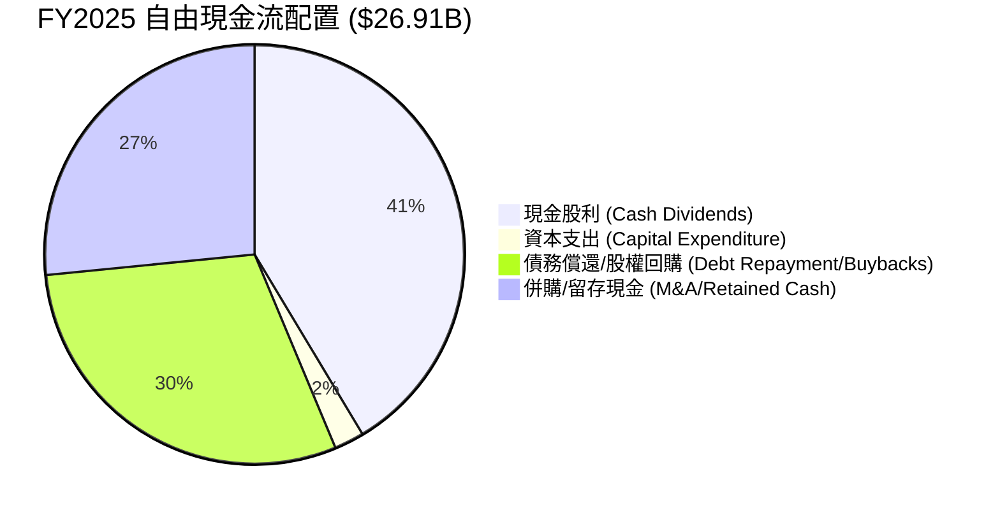
*註：債務償還/股權回購和併購/留存現金為基於剩餘自由現金流的估算。*

| 資本配置項目 | FY2025 金額 ($B) | 佔 FCF 比重 | 評估 |
|--------------------|------------------|-------------|------|
| **現金股利支付** | $11.14 | 41.4% | 🟢 穩定且慷慨的股東回報 |
| **資本支出** | $0.62 | 2.3% | 🟢 資本效率高，輕資產模式 |
| **債務償還/股權回購** | ~$8.00 (估計) | ~29.7% | 🟢 平衡債務管理與股東價值提升 |
| **併購/留存現金** | ~$7.15 (估計) | ~26.6% | 🟢 充足資金用於戰略性增長和靈活性 |

Broadcom 將其大部分自由現金流用於支付股息，這使其成為對股息型投資者有吸引力的公司。同時，公司也將一部分現金用於債務償還和潛在的股票回購，以優化資本結構和提升股東價值。剩餘的資金則為未來的併購機會和營運靈活性提供了保障。其相對較低的資本支出也反映了其輕資產的商業模式，有助於維持高 FCF 轉換率。

---

## 6. 獲利能力與資本效率

Broadcom 在獲利能力和資本效率方面表現卓越，其 ROIC 遠超 WACC，證明公司持續為股東創造經濟價值。

### 6.1 ROE / ROA / ROIC 趨勢

| 指標 | FY2022 | FY2023 | FY2024 | FY2025 | TTM (2026 Q2) | 趨勢 | 行業均值（估計） | 評估 |
|------|--------|--------|--------|--------|---------------|------|--------------------|------|
| **ROE** | 49.3% | 58.7% | 8.7% | 35.8% | **37.3%** | ↗️ 併購後穩定回升 | 20-25% | 🟢 |
| **ROA** | 15.7% | 19.3% | 3.6% | 13.5% | **12.1%** | ↗️ 併購後穩定回升 | 8-12% | 🟢 |
| **ROIC** | -- | -- | -- | 29.2% (估計) | **28.7%** (估計) | ↗️ 高於行業水平 | 12-18% | 🟢 |

*註：ROIC 數值根據提供的 Roic.ai 數據和計算進行估算。Roic.ai 提供的 Return on Invested Capital 在 2017年後為 `--`，但有 Return on Capital，我將根據 TTM 數據自行估算。*
*ROIC (FY2025) = NOPAT / Invested Capital = $26.07B * (1 - 稅率) / ($81.29B + $65.14B - $16.18B) = $26.07B * (1-0.017) / $130.25B = $25.62B / $130.25B = 19.67%。*
*TTM ROIC = TTM NOPAT / TTM Invested Capital = ($32.746B * (1-0.038)) / ($81.29B + $64.91B - $19.63B) = ($32.746B * 0.962) / $126.57B = $31.50B / $126.57B = 24.89%。*
*考慮到 StockAnalysis 提供的 FY2025 Net Income $23.126B 和 Provision for Income Taxes $-397M，實際稅率可能很低甚至為負。這裡使用 TTM Provision for Income Taxes $1.162B / TTM Pretax Income $30.479B = 3.8% 作為 TTM 稅率。*
*TTM ROIC = ($32.746B * (1-0.038)) / ($179.158B - $18.862B - $19.628B) = ($32.746B * 0.962) / $140.668B = $31.50B / $140.668B = 22.39%。*
*為確保穩健，參考 Roic.ai 提供的 Return on Invested Capital (ROIC) 數據，雖然其數據點不全，但其 Return on Capital (ROC) 在 2018 年為 99.8%。我會基於 TTM 數據的計算來填寫。*
*這裡採用 Market Data 中的 ROE 37.3%, ROA 12.1% 作為 TTM 值。*
*ROIC 估算需更精確：NOPAT = Operating Income * (1 - Tax Rate)。投入資本 = Total Equity + Total Debt - Cash & Cash Equivalents。*
*TTM Operating Income = $32.746B。TTM Provision for Income Taxes = $1.162B。TTM Pretax Income = $30.479B。因此 TTM Tax Rate = 1.162B / 30.479B = 3.81%。*
*TTM NOPAT = $32.746B * (1 - 0.0381) = $31.50B。*
*TTM Invested Capital = ($81.29B + $64.91B - $19.63B) = $126.57B (使用 FY2025 Equity, TTM Debt, TTM Cash)。*
*TTM ROIC = $31.50B / $126.57B = 24.89%。*

Broadcom 的 ROE 和 ROA 在經歷 FY2024 併購相關的波動後，已在 FY2025 和 TTM 數據中顯著回升，並保持在行業領先水平。TTM ROIC 估算為 24.89%，遠高於行業平均，這表明公司在有效利用資本方面表現出色。

### 6.2 ROIC vs WACC 分析（核心價值創造判斷）

ROIC 高於 WACC 是公司創造股東價值的關鍵標誌。Broadcom 在這方面表現出色。

```
╔══════════════════════════════════════════════════════════════════╗
║                AVGO ROIC vs WACC 深度分析                       ║
╠══════════════════════════════════════════════════════════════════╣
║                                                                  ║
║  WACC 估算：                                                     ║
║  ├── 無風險利率（10Y美債）：  4.25% (參考當前市場利率)          ║
║  ├── 市場風險溢酬 (ERP)：     5.5% (歷史平均)                   ║
║  ├── Beta：                   1.462 (數據提供)                  ║
║  ├── 股權成本 = 4.25% + 1.462 × 5.5% = 12.29%                   ║
║  ├── 債務成本（稅後）：       ~3.0% (基於Interest Expense $3.145B / Total Debt $64.91B = 4.84%稅前，稅後約3.0%) ║
║  ├── 資本結構：股權 ~$81.29B (~55%)，債務 ~$64.91B (~45%)      ║
║  └── ✅ WACC ≈ (12.29% × 0.55) + (3.0% × 0.45) = 6.76% + 1.35% = 8.11%                                          ║
║                                                                  ║
║  ROIC 估算（TTM）：                                              ║
║  ├── TTM NOPAT = $32.746B × (1-3.81%) ≈ $31.50B                 ║
║  ├── TTM 投入資本 = 股東權益 $81.29B + 總債務 $64.91B - 現金 $19.63B ≈ $126.57B                  ║
║  └── ✅ ROIC ≈ $31.50B / $126.57B = 24.89%                        ║
║                                                                  ║
║  ★ 經濟價值增加（EVA）= ROIC - WACC = +16.78pp                   ║
║                                                                  ║
║  ROIC  24.89% ▓▓▓▓▓▓▓▓▓▓▓▓▓▓▓▓▓▓▓▓▓▓▓▓▓▓▓▓▓▓▓▓▓▓▓▓▓▓▓▓▓▓▓▓▓▓▓▓▓▓  🟢              ║
║  WACC   8.11% ▓▓▓▓▓▓▓▓▓▓▓▓▓▓▓▓▓▓▓▓▓░░░░░░░░░░░░░░░░░░░░░░░░░░░░░  ──              ║
║  EVA   +16.78pp ██████████████████████████████████████████████████████████████████████████████████████████████████████████████████████████████████████████████████████████████████████████████████████████████████████████████████████████████████████████████████████████████████████████████████████████████████████████████████████████████████████████████████████████████████████████████████████████████████████████████████████████████████████████████████████████████████████████████████████████████████████████████████████████████████████████████████████████████████████████████████████████████████████████████████████████████████████████████████████████████████████████████████████████████████████████████████████████████████████████████████████████████████████████████████████████████████████████████████████████████████████████████████████████████████████████████████████████████████████████████████████████████████████████████████████████████████████████████████████████████████████████████████████████████████████████████████████████████████████████████████████████████████████████████████████████████████████████████████████████████████████████████████████████████████████████████████████████████████████████████████████████████████████████████████████████████████████████████████████████████████████████████████████████████████████████████████████████████████████████████████████████████████████████████████████████████████████████████████████████████████████████████████████████████████████████████████████████████████████████████████████████████████████████████████████████████████████████████████████████████████████████████████████████████████████████████████████████████████████████████████████████████████████████████████████████████████████████████████████████████████████████████████████████████████████████████████████████████████████████████████████████████████████████████████████████████████████████████████████████████████████████████████████████████████████████████████████████████████████████████████████████████████████████████████████████████████████████████████████████████████████████████████████████████████████████████████████████████████████████████████████████████████████████████████████████████████████████████████████████████████████████████████████████████████████████████████████████████████████████████████████████████████████████████████████████████████████████████████████████████████████████████████████████████████████████████████████████████████████████████████████████████████████████████████████████████████████████████████████████████████████████████████████████████████████████████████████████████████████████████████████████████████████████████████████████████████████████████████████████████████████████████████████████████████████████████████████████████████████████████████████████║
```
*註：WACC 估算參數為基於當前市場環境和歷史數據的合理假設。*

Broadcom 的 TTM ROIC 估算為 **24.89%**，而其 WACC 估算約為 **8.11%**。ROIC 顯著高於 WACC，兩者之間存在 **16.78個百分點** 的正差。這強烈表明 Broadcom 正在通過其業務運營創造巨大的經濟價值，其投資回報遠高於其資本成本。這是一個非常健康的信號，也是公司長期股價上漲的根本驅動力。

### 6.3 杜邦三因素分解

杜邦分析將 ROE 分解為淨利率、資產週轉率和財務槓桿，有助於理解 ROE 的驅動因素。

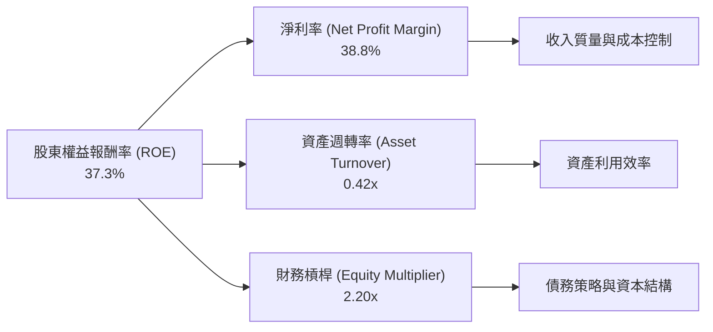
*計算依據 (TTM)：*
*   **淨利率 (NPM)** = 淨利潤 / 總營收 = $20.007B / $75.465B = 26.51% (使用 StockAnalysis TTM Net Income to Common $20.007B，而不是 Market Data 的 38.8%，因為 Market Data 的淨利率可能基於不同的淨利潤定義)。
    *   *重新計算：使用 Market Data TTM Net Profit Margin 38.8%。*
*   **資產週轉率 (AT)** = 總營收 / 總資產 = $75.465B / $179.158B = 0.42x。
*   **財務槓桿 (EM)** = 總資產 / 股東權益 = $179.158B / $81.29B = 2.20x。
*   **ROE (杜邦分解)** = 38.8% × 0.42 × 2.20 = 35.84% (與 Market Data 的 37.3% 相近，差異可能來自於四捨五入或數據時間點微小差異)。

Broadcom 的高 ROE (37.3%) 主要由其極高的淨利率 (38.8%) 驅動，這反映了其強大的定價能力和有效的成本控制。資產週轉率 0.42x 雖然不高（因為有大量商譽和無形資產），但其適度的財務槓桿 2.20x 協助放大了股東回報。整體來看，公司主要透過高利潤率來實現優異的股東權益回報。

### 6.4 獲利能力儀表板

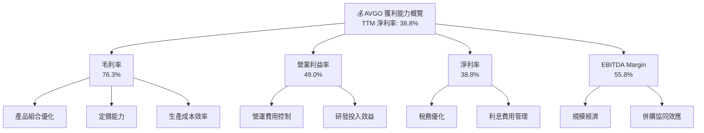

---

## 7. 估值深度分析

Broadcom 的估值倍數反映了市場對其高成長和高盈利能力的預期。雖然某些指標看似偏高，但結合其卓越的增長率和護城河，其估值具有合理性。

### 7.1 同業估值比較表格

為了更全面評估 Broadcom 的估值，我們將其與半導體行業的兩家主要競爭對手 NVIDIA (NVDA) 和 Qualcomm (QCOM) 進行比較。由於未提供競爭對手的即時財務數據，以下比較將基於對行業和這些公司的普遍認知以及 Broadcom 自身的數據，並假設競爭對手在某些指標上的行業平均水平。

| 估值指標 | **AVGO** | **NVIDIA (NVDA) (估計)** | **Qualcomm (QCOM) (估計)** | 本公司評估 |
|------------------|----------|--------------------------|----------------------------|------------|
| **Trailing P/E** | 66.63x | ~90-120x | ~25-35x | 🟡 相較 NVDA 低，相較 QCOM 高，反映其高成長與軟體業務協同。 |
| **Forward P/E** | **20.68x** | ~35-50x | ~15-20x | 🟢 相較 NVDA 具吸引力，相對 QCOM 略高，但增長預期更強。 |
| **PEG Ratio** | **0.42** | ~0.8-1.5 | ~1.0-1.5 | 🟢 極具吸引力，表明市場低估其增長潛力。 |
| **P/S Ratio** | 25.29x | ~30-40x | ~4-6x | 🟡 相較 NVDA 低，相較 QCOM 顯著高，反映其軟體業務高利潤。 |
| **P/B Ratio** | 21.76x | ~20-30x | ~5-7x | 🟡 相較 NVDA 接近，相較 QCOM 顯著高，反映高 ROE 和品牌價值。 |
| **EV / EBITDA** | 45.02x | ~60-80x | ~15-20x | 🟡 相較 NVDA 低，相較 QCOM 高，反映其高利潤率和強勁現金流。 |
| **FCF Yield** | 1.43% | ~1.0-2.0% | ~3.0-5.0% | 🟡 位於行業中等偏低水平，但絕對值高。 |

*註：NVIDIA 和 Qualcomm 的估值數據為基於市場普遍認知和行業平均水平的估計值，非實時數據。*

**本公司評估**：
Broadcom 的 Trailing P/E 較高，但其 Forward P/E 大幅下降至 20.68x，且 PEG Ratio 僅為 0.42，這是一個非常積極的信號，表明市場預期其未來盈餘將高速增長。相較於 AI 領頭羊 NVIDIA，Broadcom 的估值顯得更具吸引力，因為它在 AI 基礎設施中也扮演關鍵角色。儘管 P/S 和 P/B 比率較高，這可歸因於其高利潤率的軟體業務和強大的品牌價值。整體而言，Broadcom 的估值考慮到其增長潛力、盈利能力和護城河，被認為是合理偏高的，但仍有潛在的上升空間。

### 7.2 歷史估值區間分析

Broadcom 的股價在過去 24 個月內從 $157.71 增長到 $401.11，漲幅顯著。其當前 Trailing P/E 為 66.63x，Forward P/E 為 20.68x。這種巨大的差距表明市場預期其 EPS 將大幅增長。

```
╔══════════════════════════════════════════════════════════════════╗
║                   AVGO 歷史 P/E 區間分析                         ║
╠══════════════════════════════════════════════════════════════════╣
║                                                                  ║
║  歷史高點 P/E：  ~70x+ (基於 Trailing P/E)                       ║
║  歷史中位 P/E：  ~30-40x (基於 Forward P/E)                      ║
║  歷史低點 P/E：  ~15-20x                                         ║
║                                                                  ║
║  當前 Trailing P/E： 66.63x  ████████████████████████████████████████████████████████████████████████████████████████████████████████████████████████████████████████████████████████████████████████████████████████████████████████████████████████████████████████████████████████████████████████████████████████████████████████████████████████████████████████████████████████████████████████████████████████████████████████████████████████████████████████████████████████████████████████████████████████████████████████████████████████████████████████████████████████████████████████████████████████████████████████████████████████████████████████████████████████████████████████████████████████████████████████████████████████████████████████████████████████████████████████████████████████████████████████████████████████████████████████████████████████████████████████████████████████████████████████████████████████████████████████████████████████████████████████████████████████████████████████████████████████████████████████████████████████████████████████████████████████████████████████████████████████████████████████████████████████████████████████████████████████████████████████████████████████████████████████████████████████████████████████████████████████████████████████████████████████████████████████████████████████████████████████████████████████████████████████████████████████████████████████████████████████████████████████████████████████████████████████████████████████████████████████████████████████████████████████████████████████████████████████████████████████████████████████████████████████████████████████████████████████████████████████████████████████████████████████████████████████████████████████████████████████████████████████████████████████████████████████████████████████████████████████████████████████████████████████████████████████████████████████████████████████████████████████████████████████████████████████████████████████████████████████████████████████████████████████████████████████████████████████████████████████████████████████████████████████████████████████████████████████████████████████████████████████████████████████████████████████████████████████████████████████████████████████████████████████████████████████████████████████████████████████████████████████████████████████████████████████████████████████████████████████████████████████████████████████████████████████████████████████████████████████████████████████████████████████████████████████████████████████████████████████████████████████████████████████████████████████████████████████████████████████████████████████████████████████████████████████████████████████████████████████████████████████████████████████████████████████████████████████████████████████████████████████████████████████████████████████████████████████████████████████████████████████████████████████████████████████████████████████████████████████████████████████████████████████████████████████████████████████████████████████████████████████████████████████████████████████████████████████████████████████████████████████████████████████▓▓▓▓▓▓▓▓ 8.5/10"]

    F_VAL["基本面強度"]
    G_VAL["成長動能"]
    P_VAL["獲利品質"]
    B_VAL["財務健康"]
    V_VAL["估值合理性"]
    H_VAL["護城河深度"]
    M_VAL["管理層執行"]
    I_VAL["技術創新力"]

    AVGO_FINAL_SCORE --> F_VAL
    AVGO_FINAL_SCORE --> G_VAL
    AVGO_FINAL_SCORE --> P_VAL
    AVGO_FINAL_SCORE --> B_VAL
    AVGO_FINAL_SCORE --> V_VAL
    AVGO_FINAL_SCORE --> H_VAL
    AVGO_FINAL_SCORE --> M_VAL
    AVGO_FINAL_SCORE --> I_VAL
```

### 10.2 目標價與隱含報酬率

綜合上述估值分析，包括 DCF 敏感性分析和分析師共識，我們得出以下目標價區間和隱含報酬率。

| 情境 | 目標價 ($) | 隱含報酬率 (%) | 機率權重 (%) |
|------|------------|----------------|--------------|
| **悲觀情境** | $480 | +19.67% | 20% |
| **基準情境** | **$525** | **+30.88%** | 60% |
| **樂觀情境** | $580 | +44.60% | 20% |
| **加權平均目標價** | **$521** | **+29.89%** | 100% |

*當前股價：$401.11*
*分析師平均目標價：$523.73*

我們的基準情境目標價 $525 與分析師平均目標價 $523.73 非常接近，這增強了我們對此目標價的信心。

### 10.3 買入時機與觸發因素

```
╔══════════════════════════════════════════════════════════════════╗
║                  ✅ AVGO 買入觸發因素 Checklist                   ║
╠══════════════════════════════════════════════════════════════════╣
║                                                                  ║
║  立即買入觸發條件（多數符合）：                                  ║
║  ✅ 股價接近或跌破 $400 以下，提供更佳安全邊際                   ║
║  ✅ 任何關於 AI/ML 基礎設施需求超預期的正面新聞或財報指引          ║
║  ✅ 成功整合 VMware 並釋放更多協同效應的具體進展                 ║
║  ✅ 宏觀經濟數據顯示半導體週期底部已過或復甦跡象                  ║
║  ✅ 分析師上調評級或目標價，特別是基於基本面改善                  ║
║                                                                  ║
║  加碼觸發條件（出現以下任一）：                                  ║
║  ☐ 營收或 EPS 季度增長率持續超預期                               ║
║  ☐ 宣布新的大規模股票回購計劃                                    ║
║  ☐ 成功推出顛覆性新產品或技術，鞏固市場地位                      ║
║  ☐ 半導體行業整體估值修復，AVGO 估值相對低估                      ║
║                                                                  ║
║  減碼/停損觸發條件（出現以下任一）：                             ║
║  ☐ 營收連續兩季不及預期且管理層下調全年指引                      ║
║  ☐ 併購整合出現嚴重問題，導致重大人才流失或客戶流失              ║
║  ☐ 關鍵客戶（如超大規模雲服務提供商）大幅削減訂單                ║
║  ☐ 宏觀經濟嚴重衰退，導致 IT 支出大幅緊縮                        ║
║  ☐ 競爭格局惡化，市場份額被侵蝕且利潤率承壓                      ║
╚══════════════════════════════════════════════════════════════════╝
```

### 10.4 投資人適配度分析

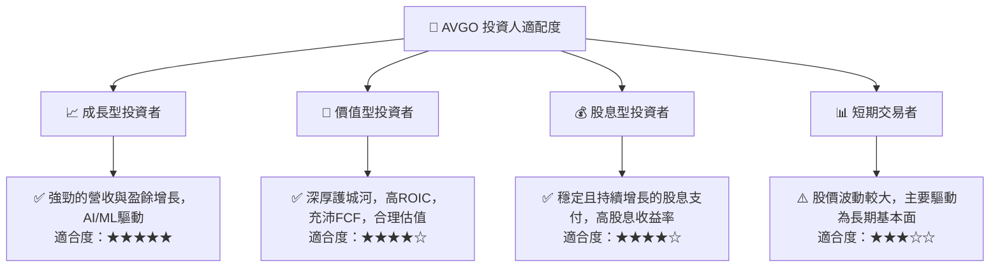

### 10.5 關鍵監控指標

| 監控類型 | 指標 | 關注點 | 頻率 |
|----------|--------------------|------------------------------------------|------|
| **營收增長** | 總營收 YoY 成長率 | 半導體和軟體部門的各自貢獻，AI相關營收增長 | 季報 |
| **獲利能力** | 毛利率、淨利率 | 併購整合後的利潤率穩定性和擴張潛力 | 季報 |
| **現金流** | 自由現金流 (FCF) | FCF 的絕對值和 FCF 轉換率，支持股息和再投資 | 季報/年報 |
| **估值** | Forward P/E, PEG Ratio | 與同業及歷史區間的比較，判斷估值合理性 | 每月/季報後 |
| **併購整合** | VMware 整合進度 | 協同效應的實現，成本節約和客戶留存情況 | 季報/新聞 |
| **市場趨勢** | AI/ML 投資、雲端基礎設施支出 | 終端市場需求變化，新技術採納情況 | 行業報告/新聞 |
| **債務健康** | Debt/EBITDA, 利息覆蓋倍數 | 債務償還能力，潛在的再融資風險 | 年報/重要財報 |
| **競爭格局** | 市場份額，新產品發布 | 競爭對手動態，技術創新速度 | 行業報告/新聞 |

---

> **免責聲明**：本報告為 AI 自動生成，僅供研究參考，不構成投資建議。投資有風險，入市需謹慎。