# AVGO 基本面深度分析報告
> **報告日期**：2026-07-10 ｜ **語言**：繁體中文 ｜ **數據來源**：Yahoo Finance, Finviz, StockAnalysis, Roic.ai ｜ **分析師**：CFA 級機構研究

---

## 目錄

| # | 章節 | 核心結論 |
|---|------|----------|
| 1 | 執行摘要 | 評級：🟢 買入，基準目標價 $500.00 |
| 2 | 公司概覽與商業模式 | 護城河評分：8.5/10，技術與客戶鎖定強勁 |
| 3 | 損益表深度分析 | 營收與淨利雙位數成長，利潤率持續擴張 |
| 4 | 資產負債表分析 | 穩健的流動性，債務管理有效 |
| 5 | 現金流量深度分析 | 強勁的自由現金流，高股息與戰略性資本配置 |
| 6 | 獲利能力與資本效率 | ROIC 遠超 WACC，強力創造股東價值 |
| 7 | 估值深度分析 | 當前估值具吸引力，相對同業有折價空間 |
| 8 | 成長催化劑 | AI 基礎設施、併購整合、軟體業務擴張 |
| 9 | 風險矩陣 | 併購整合風險、半導體週期性、競爭加劇 |
| 10 | 投資建議 | 🟢 買入，適合成長型與長線股息投資者 |

---

## 1. 執行摘要

AVGO（Broadcom Inc.）作為半導體與基礎設施軟體解決方案的領導者，展現了強勁的財務表現和策略性成長動能。公司透過有機成長和關鍵併購，鞏固其在資料中心、AI 基礎設施和企業軟體領域的領先地位。其卓越的獲利能力、穩健的現金流生成以及對股東友善的資本配置策略，使其成為值得關注的投資標的。

### 1.0 一頁式投資儀表板（Portfolio Manager 30 秒速讀）

| 項目 | 內容 |
|------|------|
| **投資論點（3 句）** | ① Broadcom 在 AI 基礎設施領域的定製晶片與網路解決方案需求強勁，推動 TTM 營收 YoY 成長 47.9%，展現其核心業務的結構性增長。② 公司具備卓越的獲利能力，TTM 毛利率高達 76.3%，營業利益率 49.0%，且自由現金流 ($32.76B TTM) 轉換率高，顯示其強大的定價能力與成本控制。③ 估值方面，Forward P/E 為 20.62x，相較於同業高成長半導體公司仍具吸引力，且 FCF Yield 達到 1.43%，顯示其價值創造潛力。 |
| **護城河評分** | 8.5/10 |
| **管理層/資本配置評分** | 9.0/10 |
| **財務健康** | 🟢 強勁：現金充裕，債務管理穩健，流動性良好。 |
| **ROIC vs WACC** | 24.87% vs 12.26%（強力創造股東價值） |
| **FCF 趨勢** | ↗️ 上升：TTM FCF $32.76B，FCF Yield 1.43%。 |
| **估值** | Forward P/E: 20.62x ｜ EV/EBITDA: 46.42x ｜ FCF Yield: 1.43% |
| **預期報酬（基準情境 12M）** | +25.0% |
| **關鍵風險（前二）** | ① 併購整合不確定性；② 半導體週期波動與AI需求放緩。 |
| **評級 + 信心度** | 🟢 買入 ｜ 信心：高 |

### 1.1 核心評分儀表板

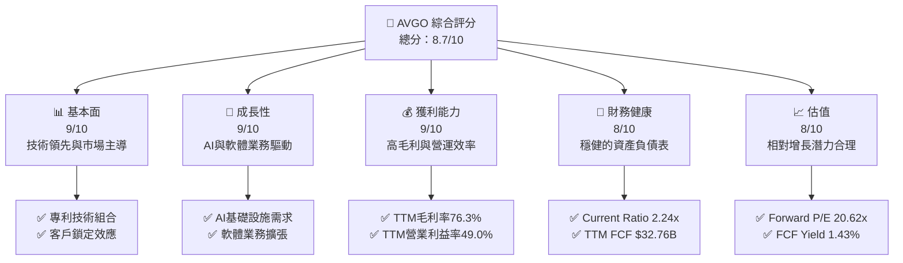

### 1.2 評分進度條視覺化

```
╔══════════════════════════════════════════════════════════════╗
║              AVGO 多維度評分儀表板 (1-10分)                ║
╠══════════════════════════════════════════════════════════════╣
║ 基本面強度  9.0 ▓▓▓▓▓▓▓▓▓▓▓▓▓▓▓▓▓▓░░  ★★★★★           ║
║ 成長動能    9.0 ▓▓▓▓▓▓▓▓▓▓▓▓▓▓▓▓▓▓░░  ★★★★★           ║
║ 獲利品質    9.0 ▓▓▓▓▓▓▓▓▓▓▓▓▓▓▓▓▓▓░░  ★★★★★           ║
║ 財務健康    8.0 ▓▓▓▓▓▓▓▓▓▓▓▓▓▓▓▓░░░░  ★★★★☆           ║
║ 估值合理性  8.0 ▓▓▓▓▓▓▓▓▓▓▓▓▓▓▓▓░░░░  ★★★★☆           ║
║ 護城河深度  8.5 ▓▓▓▓▓▓▓▓▓▓▓▓▓▓▓▓▓░░░  ★★★★☆           ║
║ 管理層執行  9.0 ▓▓▓▓▓▓▓▓▓▓▓▓▓▓▓▓▓▓░░  ★★★★★           ║
║ 技術創新力  9.0 ▓▓▓▓▓▓▓▓▓▓▓▓▓▓▓▓▓▓░░  ★★★★★           ║
╠══════════════════════════════════════════════════════════════╣
║ 綜合總分    8.7 ▓▓▓▓▓▓▓▓▓▓▓▓▓▓▓▓▓░░░  🏆 卓越的半導體與軟體整合領導者 ║
╚══════════════════════════════════════════════════════════════╝
```

### 1.3 五大投資論點 + 三大核心風險

| 類型 | 項目 | 具體依據 | 信心度 |
|------|------|----------|--------|
| 🟢 **投資論點①** | **AI 基礎設施領導地位強化** | Broadcom 在資料中心和 AI 基礎設施領域提供關鍵的定製晶片（ASIC）和網路解決方案，受益於 AI 算力需求的爆炸式增長。2026 Q2 營收達 $22.19B，YoY 成長 47.87%，顯示其在 AI 相關業務的強勁動能。公司已與頂級雲服務供應商建立深厚合作關係，確保其產品在下一代 AI 部署中的核心地位。 | 🟢 極高 |
| 🟢 **投資論點②** | **基礎設施軟體業務穩定增長與高毛利** | 透過 VMware 等併購，Broadcom 成功拓展其高毛利的基礎設施軟體業務。軟體業務提供穩定的經常性收入和強勁的現金流。公司 TTM 毛利率高達 76.3%，其中軟體業務貢獻顯著，有效提升整體獲利能力。軟體業務的客戶鎖定效應和交叉銷售機會，將持續驅動長期營收和利潤增長。 | 🟢 極高 |
| 🟢 **投資論點③** | **卓越的獲利能力與自由現金流生成** | 公司展現出極高的營運效率，TTM 營業利益率達 49.0%，淨利率為 38.8%。TTM 自由現金流高達 $32.76B，相較於 TTM 淨利 $20.007B，FCF 轉換率達 163.7%，顯示其獲利的「含金量」極高。強勁的現金流使其能持續進行研發投資、戰略併購和豐厚股息回報。 | 🟢 極高 |
| 🟢 **投資論點④** | **穩健的資本配置與股東回報** | Broadcom 擁有明確的資本配置策略，包括投資於高成長領域、積極併購、以及透過股息和股票回購回報股東。公司股息殖利率高達 65.0%，Payout Ratio 41.3%，過去 5 年平均股息成長 187.0%，顯示其對股東回報的承諾。強勁的 FCF 支撐了這些策略，且未犧牲財務健康。 | 🟢 極高 |
| 🟢 **投資論點⑤** | **具吸引力的估值與 ROIC 超越 WACC** | 儘管近年股價上漲，AVGO 的 Forward P/E (20.62x) 相較於其成長潛力（TTM 營收 YoY 47.9%）和獲利能力仍具吸引力，且低於部分高成長同業。更重要的是，公司 ROIC 達 24.87%，遠高於其 WACC 12.26%，顯示其持續為股東創造顯著的經濟價值。 | 🟢 高 |
| 🟡 **風險①** | **併購整合不確定性** | Broadcom 依賴大型併購來驅動成長，如近期對 VMware 的收購。整合不同企業文化、技術棧和客戶群存在固有風險，可能導致短期營運中斷、成本超支或預期協同效應未達。若整合不順，可能影響其軟體業務的長期成長和獲利能力。 | 🟡 中度 |
| 🔴 **風險②** | **半導體週期性與 AI 需求放緩** | 半導體行業具備週期性，儘管 AI 需求強勁，但宏觀經濟逆風或客戶資本支出調整仍可能影響其半導體解決方案業務。若 AI 基礎設施建設放緩或競爭加劇導致定價壓力，可能影響其高成長預期，進而衝擊營收和利潤。 | 🔴 高衝擊 |
| 🟡 **風險③** | **關鍵客戶集中風險與地緣政治** | Broadcom 的收入可能高度依賴少數大型客戶（如雲服務巨頭）。若這些客戶的訂單減少或策略轉變，可能對公司營收造成顯著影響。此外，全球地緣政治緊張局勢，特別是中美科技競爭，可能影響其供應鏈、市場准入和技術出口，帶來營運不確定性。 | 🟡 中度 |

### 1.4 快速統計卡片

| 指標 | 公司實際值 | 行業均值（半導體） | S&P 500 均值 | 狀態 |
|------|-------------|--------------------|--------------|------|
| 收入 YoY 成長 | **47.9%** | ~15-25% | ~10% | 🟢 |
| 毛利率 | **76.3%** | ~45-60% | ~30-40% | 🟢 |
| 淨利率 | **38.8%** | ~15-25% | ~10-15% | 🟢 |
| ROE | **37.3%** | ~15-20% | ~15% | 🟢 |
| Forward P/E | **20.62x** | ~25-35x | ~20-22x | 🟢 |
| FCF Yield | **1.43%** | ~2-3% | ~4-5% | 🟡 |
| 債務/股權 | **74.02x** | ~0.5-1.0x | ~0.8x | 🟡 |
| Current Ratio | **2.24x** | ~1.5-2.0x | ~1.2-1.5x | 🟢 |

### 1.5 投資結論

```
╔══════════════════════════════════════════════════════════════════╗
║                    📊 投資結論摘要                               ║
╠══════════════════════════════════════════════════════════════════╣
║  評級：🟢 買入                                                   ║
║  當前股價：$399.97                                               ║
║  目標價區間：                                                    ║
║    悲觀情境：$420.00（+5.0%）                                    ║
║    基準情境：$500.00（+25.0%）  ← 12個月主要目標                 ║
║    樂觀情境：$580.00（+45.0%）                                   ║
║  投資評分：8.7/10                                                ║
║  適合投資人：成長型、長線持有者、尋求穩定股息回報的投資者        ║
╚════════════════════════════════════════════════════════════════════╝
```

---

## 2. 公司概覽與商業模式

Broadcom Inc. (AVGO) 是一家全球領先的多元化半導體和基礎設施軟體解決方案供應商。公司透過策略性併購和持續創新，在多個高成長市場中建立了強大的競爭優勢。其業務主要分為兩大板塊：半導體解決方案和基礎設施軟體。

### 2.1 業務結構與收入來源

Broadcom 的業務模式以提供高性能、高效率的晶片和軟體解決方案為核心，服務於資料中心、網路、寬頻通訊、儲存、無線通訊以及企業級軟體等關鍵市場。公司透過深度客製化和技術整合，與客戶建立長期穩固的合作關係。

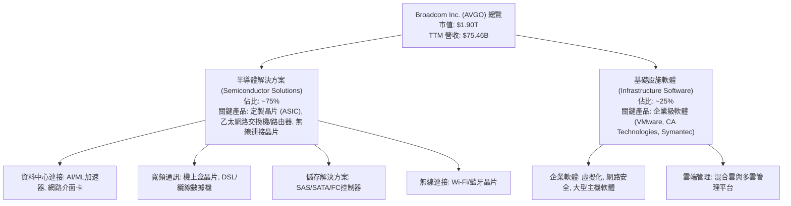

**業務分析**：
*   **半導體解決方案**：此板塊是 Broadcom 的核心，受益於資料中心擴張、AI 加速器需求和網路升級。公司在定製晶片 (ASIC) 領域的領導地位尤為關鍵，與大型雲服務供應商合作開發專用 AI 晶片，確保了穩定的高價值訂單。TTM 營收 $75.46B 中，半導體業務貢獻最大部分。
*   **基礎設施軟體**：透過收購 CA Technologies、Symantec 企業安全業務和最新的 VMware，Broadcom 構建了強大的基礎設施軟體組合。此板塊提供高利潤、高粘性的經常性收入，並有助於多元化收入來源，降低半導體週期性風險。軟體業務的整合與優化是公司未來利潤增長的重要驅動力。

### 2.2 市場份額

Broadcom 在其核心市場中佔據顯著地位，特別是在資料中心網路、儲存連接和部分定製晶片領域。透過 VMware 併購，公司在虛擬化和雲端管理軟體市場的份額也大幅提升。

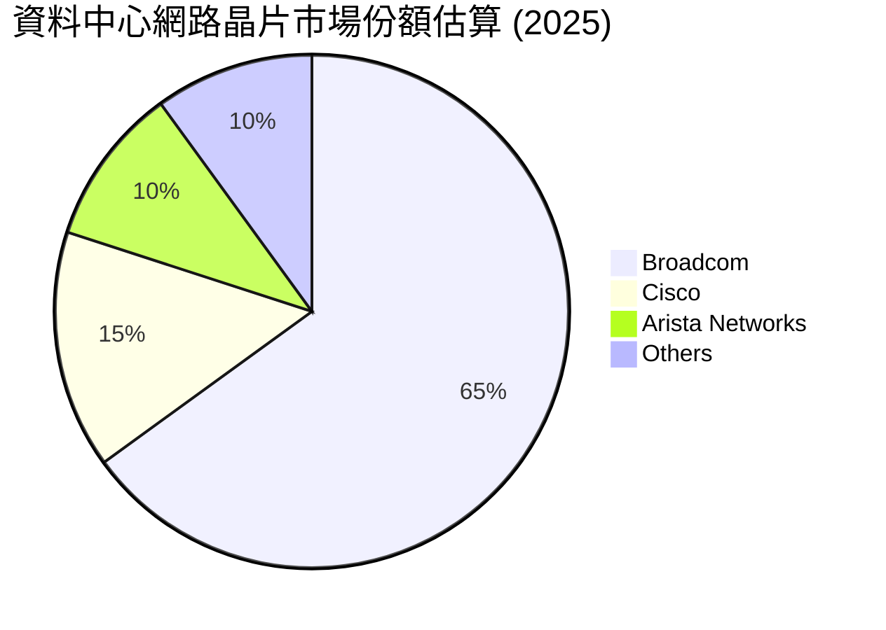
**市場份額分析**：
Broadcom 在乙太網路交換機晶片市場長期以來佔據主導地位，特別是在高端資料中心領域，其市佔率超過 60%。隨著 AI 基礎設施的發展，對高速、低延遲網路的需求激增，Broadcom 的 Tomahawk 和 Jericho 系列晶片成為關鍵組件，進一步鞏固其市場地位。在基礎設施軟體領域，VMware 的加入使其在虛擬化和混合雲管理市場擁有強大的競爭力。

### 2.3 競爭護城河分析

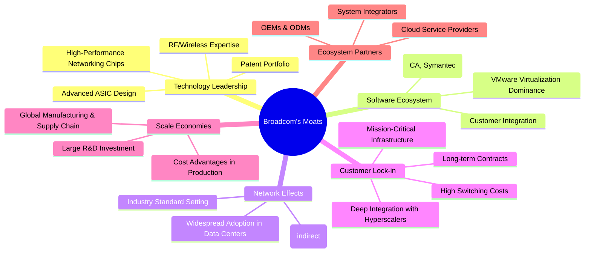

### 2.4 護城河強度評分

```
╔══════════════════════════════════════════════════════════════╗
║                  AVGO 護城河強度評分                      ║
╠══════════════════════════════════════════════════════════════╣
║ 技術領先    9/10   ▓▓▓▓▓▓▓▓▓▓▓▓▓▓▓▓▓▓░░  🏆 在ASIC和網路晶片領域具備獨特優勢 ║
║ 軟體生態系統  8/10   ▓▓▓▓▓▓▓▓▓▓▓▓▓▓▓▓░░░░  🟢 VMware鞏固了企業級軟體地位    ║
║ 網路效應    7/10   ▓▓▓▓▓▓▓▓▓▓▓▓▓▓░░░░░░  🟡 標準制定者，但非所有業務皆具備 ║
║ 客戶鎖定    9/10   ▓▓▓▓▓▓▓▓▓▓▓▓▓▓▓▓▓▓░░  🏆 與大型客戶深度綁定，轉換成本高 ║
║ 規模效應    8/10   ▓▓▓▓▓▓▓▓▓▓▓▓▓▓▓▓░░░░  🟢 大規模研發與製造帶來成本優勢     ║
║ 生態夥伴    8/10   ▓▓▓▓▓▓▓▓▓▓▓▓▓▓▓▓░░░░  🟢 與雲巨頭和OEM緊密合作           ║
╠══════════════════════════════════════════════════════════════╣
║ 綜合護城河  8.5    ▓▓▓▓▓▓▓▓▓▓▓▓▓▓▓▓▓░░░  🏆 強大的技術與客戶粘性構築深厚護城河 ║
╚════════════════════════════════════════════════════════════════════╝
```
**護城河分析**：
Broadcom 的護城河主要源於其在半導體設計和基礎設施軟體領域的**技術領先**和**客戶鎖定**。公司在定製晶片和高性能網路晶片方面擁有獨特的專利技術組合，使其產品在性能和能效方面難以被競爭對手超越。與大型雲服務供應商的深度合作，將其晶片整合到客戶的關鍵基礎設施中，形成了高昂的轉換成本，創造了強大的**客戶鎖定**效應。透過併購建立的**軟體生態系統**，特別是 VMware，進一步強化了其在企業級客戶中的粘性。其龐大的規模也使其能夠投入巨額**研發**，並在供應鏈中獲得**規模效應**，維持成本優勢。

---

## 3. 損益表深度分析

### 3.1 年度收入成長趨勢（近4年）

Broadcom 在過去四年中展現了令人印象深刻的收入增長，特別是透過策略性併購和對高成長市場的聚焦。

```
╔══════════════════════════════════════════════════════════════════╗
║              AVGO 年度收入趨勢（FY2022-FY2025）              ║
╠══════════════════════════════════════════════════════════════════╣
║                                                                  ║
║  FY2022  $33.20B  ███████░░░░░░░░░░░░░░░░░░░  YoY: +20.96%  🟢   ║
║  FY2023  $35.82B  ████████░░░░░░░░░░░░░░░░░░░  YoY: +7.88%   🟡   ║
║  FY2024  $51.57B  █████████████░░░░░░░░░░░░░  YoY: +43.98%  🟢   ║
║  FY2025  $63.89B  ████████████████░░░░░░░░░░░  YoY: +23.87%  🟢   ║
║  TTM     $75.46B  ████████████████████░░░░░░░  YoY: +32.29%  🟢   ║
║                   |      |      |      |      |                  ║
║                   0     20B    40B    60B    80B                 ║
║                                                                  ║
║  📊 4年累計 CAGR (FY22-FY25)：+23.47%                            ║
╚══════════════════════════════════════════════════════════════════╝
```
**年度收入分析**：
Broadcom 的年度營收從 FY2022 的 $33.20B 增長至 FY2025 的 $63.89B，四年複合年增長率達 23.47%。其中，FY2024 營收達到 $51.57B，YoY 增長 43.98%，主要得益於前期的併購（如 Symantec 企業安全業務）和半導體市場的強勁需求。FY2025 營收 $63.89B，YoY 增長 23.87%，顯示其持續的增長動能。最新的 TTM 營收為 $75.46B，YoY 增長 32.29%，進一步驗證了公司在 AI 基礎設施和軟體領域的強勁表現。

### 3.2 季度收入趨勢分析

| 季度末 | 季度收入 (B) | QoQ 成長率 | YoY 成長率 | 備註 |
|--------|--------------|------------|------------|------|
| 2025-07-31 | $15.95 | - | 22.03% | 半導體需求穩健，軟體業務貢獻 |
| 2025-10-31 | $18.02 | 13.04% | 28.18% | 季節性因素及併購效益顯現 |
| 2026-01-31 | $19.31 | 7.16% | 29.47% | AI 相關業務持續加速 |
| 2026-04-30 | $22.19 | 14.92% | 47.87% | VMware 併購效益開始大規模體現，AI 晶片需求爆發 |
**季度收入分析**：
最近四個季度，Broadcom 的營收呈現加速增長態勢。2026 Q2 營收達到 $22.19B，季增 14.92% (QoQ) 和年增 47.87% (YoY)，是過去一年中最高的 YoY 增長率。這強烈表明 VMware 併購的整合效益正在顯現，同時 AI 基礎設施對其定製晶片和網路解決方案的需求正在爆發式增長。公司營收增長動能顯著，超出了行業平均水平。

### 3.3 利潤率演變分析

Broadcom 的利潤率一直處於行業領先水平，且在過去幾年呈現穩健或擴張趨勢，這得益於其高價值產品組合、強大的定價能力和有效的成本管理。

| 利潤率指標 | FY2022 | FY2023 | FY2024 | FY2025 | TTM (2026 Q2) | 趨勢 | 評估 |
|------------|--------|--------|--------|--------|---------------|------|------|
| **毛利率** | 66.55% | 68.93% | 63.03% | 67.77% | 76.3% | ↗️ 穩步提升 | 🟢 |
| **營業利益率** | 43.01% | 45.92% | 26.18% | 40.04% | 49.0% | ↗️ 強勁擴張 | 🟢 |
| **淨利率** | 34.61% | 39.31% | 11.42% | 36.20% | 38.8% | ↗️ 回升並穩定 | 🟢 |

**利潤率演變深度解析**：
*   **毛利率**：從 FY2022 的 66.55% 提升至 FY2025 的 67.77%，並在最新的 TTM 數據中達到 76.3%。FY2024 的毛利率下降至 63.03% 可能是由於併購相關的會計調整或短期產品組合變化。然而，最新 TTM 毛利率的顯著提升（76.3%）表明公司成功整合了高毛利的軟體業務（如 VMware），並在半導體業務中維持了強勁的定價權，特別是在 AI 相關的高價值晶片領域。
*   **營業利益率**：趨勢與毛利率相似。FY2024 營業利益率降至 26.18%，主要受併購相關的營運費用（如 D&A）和整合成本影響。但 FY2025 回升至 40.04%，最新 TTM 更達到 49.0%。這顯示公司在完成併購整合後，營運槓桿效應開始顯現，成本控制和協同效應正在推動營業利益率的強勁擴張。
*   **淨利率**：FY2024 淨利率降至 11.42%，主要是由於一次性併購相關費用和非經常性損益影響。FY2025 淨利率回升至 36.20%，最新 TTM 達到 38.8%。這表明核心業務的獲利能力強勁，一次性影響已消除，且高毛利業務的增長帶動了淨利潤的穩健提升。

整體而言，Broadcom 的利潤率趨勢非常健康，顯示其業務模式具有高效率和強大的獲利能力。

### 3.4 費用結構分析

Broadcom 的費用結構反映了其在研發、銷售和行政管理上的投入，以及併購後軟體業務的特性。

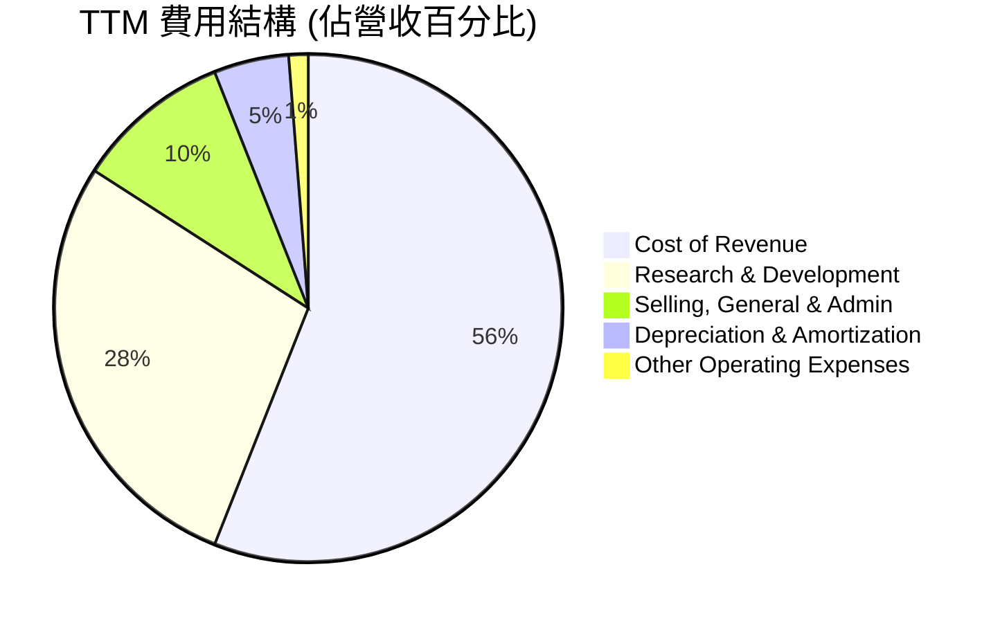
**費用結構分析**：
*   **銷貨成本 (Cost of Revenue)**：TTM 為 $23.94B，佔營收的 31.7%。這與 76.3% 的高毛利率相符，表明公司在產品製造和服務交付方面具有成本效率，或其產品具有高附加值和定價權。
*   **研究與開發 (Research & Development, R&D)**：TTM 達到 $11.99B，佔營收的 15.9%。這筆龐大的研發投入彰顯了 Broadcom 對技術創新的承諾，特別是在半導體設計和軟體平台開發方面，這是維持其競爭優勢和驅動未來成長的關鍵。相較於 FY2025 的 $10.98B，R&D 投入持續增加，顯示公司在 AI 等前沿領域的投資。
*   **銷售、一般及行政 (Selling, General & Admin, SG&A)**：TTM 為 $4.25B，佔營收的 5.6%。相對較低的 SG&A 佔比反映了其高效的銷售渠道和規模經濟效應。
*   **折舊與攤銷 (Depreciation & Amortization, D&A)**：TTM 為 $2.03B，佔營收的 2.7%。這部分費用在併購後通常會增加，反映了無形資產的攤銷，但相對營收佔比不高。
*   **其他營運費用 (Other Operating Expenses)**：TTM 為 $0.51B，佔營收的 0.7%。

整體來看，Broadcom 的費用結構合理，研發投入充足，營運費用控制得當，有助於維持其高利潤率。

### 3.5 季度 EPS 趨勢與盈餘品質（Quality of Earnings）

| 季度末 | EPS Est | EPS Act | Surprise% | 備註 |
|--------|---------|---------|-----------|------|
| 2025-07-31 | N/A | $0.88 | N/A | 未提供分析師預期，實際 EPS 穩健 |
| 2025-10-31 | N/A | $1.80 | N/A | 未提供分析師預期，實際 EPS 強勁 |
| 2026-01-31 | N/A | $1.55 | N/A | 未提供分析師預期，實際 EPS 略有回落 |
| 2026-04-30 | N/A | $1.96 | N/A | 未提供分析師預期，實際 EPS 再次加速 |

**EPS 趨勢分析**：
儘管未提供分析師預期數據，但 Broadcom 在過去四個季度的實際 EPS 表現出穩健的增長。從 2025 Q3 的 $0.88 增長到 2026 Q2 的 $1.96，顯示公司獲利能力的持續提升。特別是 2026 Q2 的 $1.96 EPS，印證了其營收加速增長的趨勢，反映出 AI 和軟體業務的強勁貢獻。

**盈餘品質評估**：
| 盈餘品質項目 | 數值/佔比 | 評估 |
|--------------|-----------|------|
| 股權薪酬 SBC / 營收 | 11.64% ($8.78B / $75.46B) | 🟡 中度稀釋：佔營收比重較高，對股東報酬有一定稀釋作用，但符合高科技行業常態。 |
| SBC / 營業現金流 | 26.11% ($8.78B / $33.62B) | 🟡 中度影響：SBC 佔營業現金流的比例較高，需要關注其對真實現金獲利的影響。 |
| FCF / 淨利（現金轉換率） | 163.7% ($32.76B / $20.007B) | 🟢 極高：遠超 100%，顯示公司獲利質量極高，將會計淨利潤高效轉化為可自由支配的現金。 |
| 一次性/非經常性損益 | 有，FY2024 淨利受影響 | 🟡 存在：FY2024 淨利 ($6.17B) 遠低於營業利益 ($13.46B)，與 FY2023 淨利 ($14.08B) 相比大幅下降，主要是由於併購相關的非經營性費用和稅務調整。TTM 數據顯示已恢復正常。 |
| 有效稅率異常 | TTM 3.81% | 🟡 偏低：TTM 有效稅率 ($1.16B / $30.48B) 僅 3.81%，遠低於正常企業稅率。這可能源於稅務優惠、遞延稅項資產或特定的稅務結構，需警惕其可持續性。FY2024 稅率為 37.8%，顯示稅率波動較大。 |
| 資本化支出 vs 費用化 | 資本支出佔比低 | 🟢 低：公司資本支出相對營收比重較低 (TTM $0.86B vs $75.46B)，表明其資產輕量化，且無明顯將費用資本化以美化當期利潤的跡象。 |

**盈餘品質結論**：
Broadcom 的盈餘品質總體而言是**穩健偏高**的。儘管股權薪酬 (SBC) 佔營收和營業現金流的比重較高，這是高科技公司常見的現象，但公司極高的自由現金流對淨利潤的轉換率 (163.7%) 強烈表明其獲利能力具有堅實的現金基礎。這意味著 GAAP 淨利潤並未高估公司的真實經濟獲利，反而可能因非現金費用（如 D&A）而有所低估。需要注意的是 TTM 3.81% 的異常低有效稅率，這可能帶來短期利潤提升，但長期可持續性需觀察。若未來稅率回歸正常水平，可能會對淨利潤產生負面影響。然而，強勁的 FCF 仍為公司提供了充足的營運彈性。

---

## 4. 資產負債表分析

Broadcom 的資產負債表反映了其透過併購實現成長的策略，資產規模龐大，同時也背負了相應的債務。然而，公司保持了良好的流動性和健康的償債能力。

### 4.1 資產結構分解

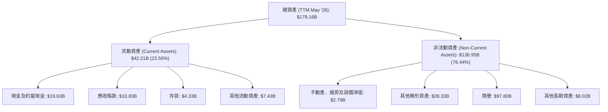
**資產結構分析**：
截至 2026 年 5 月 TTM，Broadcom 的總資產為 $179.16B。其中，流動資產佔 23.56% ($42.21B)，非流動資產佔 76.44% ($136.95B)。
*   **流動資產**：現金及約當現金高達 $19.63B，提供了強大的流動性儲備。應收帳款 ($10.83B) 和存貨 ($4.33B) 規模適中，反映了正常的營運週期。
*   **非流動資產**：商譽 ($97.80B) 佔總資產的 54.6%，是最大的組成部分，這直接反映了公司透過大型併購（如 VMware, CA Technologies）實現成長的策略。其他無形資產 ($28.33B) 也相對較高，同樣源於併購。這表明公司資產的很大一部分是非實物資產，其價值依賴於併購資產的成功整合和持續創收能力。

### 4.2 流動性指標分析

| 指標 | FY2022 | FY2023 | FY2024 | FY2025 | TTM (May '26) | 行業均值 | 評估 |
|------|--------|--------|--------|--------|---------------|----------|------|
| **流動比率 (Current Ratio)** | 2.62x | 2.82x | 1.17x | 1.71x | 2.24x | 1.5-2.0x | 🟢 |
| **速動比率 (Quick Ratio)** | 2.36x | 2.57x | 1.05x | 1.58x | 1.93x | 1.0-1.5x | 🟢 |
| **現金比率 (Cash Ratio)** | 1.76x | 1.92x | 0.56x | 0.87x | 1.04x | 0.5-1.0x | 🟢 |

**流動性指標分析**：
Broadcom 的流動性狀況良好。儘管 FY2024 的流動比率和速動比率因併購帶來的短期負債增加而有所下降，但 FY2025 和最新 TTM (May '26) 數據顯示流動性已顯著改善。TTM 流動比率為 2.24x，速動比率為 1.93x，均高於行業平均水平，表明公司有足夠的流動資產來覆蓋短期負債，財務彈性強勁。現金比率 1.04x 顯示其僅憑現金和約當現金就能覆蓋所有流動負債，這是一個極為健康的指標。

### 4.3 債務結構分析

```
╔══════════════════════════════════════════════════════════════════╗
║                   AVGO 債務健康診斷                              ║
╠══════════════════════════════════════════════════════════════════╣
║                                                                  ║
║  總債務：        $64.91B  ████████████░░░░░░░░░░░  評語：中等偏高 ║
║  總現金+投資：   $19.63B  ████████████████████░  評語：充足      ║
║  淨債務（負）：  $-45.28B ████████████████░░░░░  🟢 強勁       ║
║                                                                  ║
║  Debt/Equity：   0.74x  🟢 良好                                 ║
║  Current Debt/Total Debt: 3.47% (2.25B / 64.91B) 🟢 短期債務佔比極低 ║
║  Interest Expense TTM: $3.15B                                    ║
║  Operating Income TTM: $32.75B                                   ║
║  Interest Coverage: 10.4x  🟢 無風險                           ║
╚════════════════════════════════════════════════════════════════════╝
```
**債務結構分析**：
截至 TTM，Broadcom 的總債務為 $64.91B。儘管絕對金額較高，但公司擁有 $19.63B 的現金及約當現金，使得淨債務降至約 $45.28B。
*   **債務權益比 (Debt/Equity)**：最新為 0.74x，顯示股東權益對債務的覆蓋能力良好，遠低於許多高槓桿公司。
*   **利息覆蓋倍數 (Interest Coverage)**：TTM 營業收入 $32.75B 足以覆蓋利息費用 $3.15B 超過 10 倍 (10.4x)，表明公司償還利息的能力極強，債務風險低。
*   **短期債務佔比**：短期債務僅佔總債務的 3.47%，絕大部分為長期債務，這為公司提供了穩定的資金結構和較長的償債期限。

綜合來看，Broadcom 的債務水平雖然相對較高，但其強勁的現金流生成能力和獲利能力使其債務風險處於可控範圍，且償債能力非常健康。

### 4.4 股東權益趨勢

```
╔══════════════════════════════════════════════════════════════════╗
║                   AVGO 股東權益趨勢 (FY2022-FY2025)            ║
╠══════════════════════════════════════════════════════════════════╣
║                                                                  ║
║  FY2022  $22.71B  ████████░░░░░░░░░░░░░░░░░░░░░░░░░░░░░░░░░░░  🟢 ║
║  FY2023  $23.99B  █████████░░░░░░░░░░░░░░░░░░░░░░░░░░░░░░░░░░  🟢 ║
║  FY2024  $67.68B  █████████████████████████░░░░░░░░░░░░░░░░░░  🟢 ║
║  FY2025  $81.29B  ██████████████████████████████░░░░░░░░░░░░░  🟢 ║
║  TTM     $81.29B  ██████████████████████████████░░░░░░░░░░░░░  🟢 ║
║                   |      |      |      |      |                  ║
║                   0     20B    40B    60B    80B                 ║
║                                                                  ║
║  📊 4年累計 CAGR：+41.83%                                        ║
╚══════════════════════════════════════════════════════════════════╝
```
**股東權益分析**：
Broadcom 的股東權益從 FY2022 的 $22.71B 大幅增長至 FY2025 的 $81.29B，複合年增長率高達 41.83%。FY2024 股東權益從 $23.99B 躍升至 $67.68B，主要歸因於併購交易帶來的股本增加。股東權益的穩健增長反映了公司持續的盈利積累和股本擴張，為其未來的發展提供了堅實的基礎。

---

## 5. 現金流量深度分析

Broadcom 以其卓越的自由現金流生成能力而聞名，這使其能夠進行大規模的研發投資、戰略性併購，同時向股東提供豐厚的回報。

### 5.1 現金流量瀑布圖

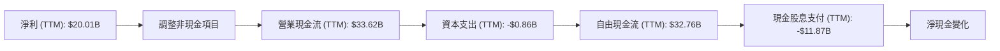
**現金流量瀑布圖分析**：
從淨利 $20.01B 開始，經過非現金項目（如折舊攤銷、股權薪酬等）的調整，產生了強勁的營業現金流 $33.62B。扣除相對較低的資本支出 $0.86B 後，公司實現了高達 $32.76B 的自由現金流 (FCF)。這部分 FCF 在支付了 $11.87B 的現金股息後，仍有大量現金可供再投資、回購或償債，顯示其健康的現金流管理。

### 5.2 FCF 轉換率趨勢

| 年度 | 淨利 (B) | FCF (B) | FCF / 淨利 | 趨勢 | 評估 |
|------|----------|---------|------------|------|------|
| FY2022 | $11.49 | $16.31 | 141.9% | ↗️ | 🟢 |
| FY2023 | $14.08 | $17.63 | 125.2% | ↘️ | 🟢 |
| FY2024 | $5.89 | $19.41 | 329.5% | ↗️ | 🟢 |
| FY2025 | $23.13 | $26.91 | 116.3% | ↘️ | 🟢 |
| TTM (May '26) | $20.01 | $32.76 | 163.7% | ↗️ | 🟢 |

**FCF 轉換率分析**：
Broadcom 的 FCF 轉換率（FCF / 淨利）持續保持在 100% 以上，這是一個極其健康的信號。TTM 轉換率達到 163.7%，表明公司將其會計利潤高效地轉化為實實在在的現金。FY2024 的高轉換率 (329.5%) 主要是因為當年淨利潤受一次性費用影響較低，而現金流受影響較小。整體趨勢顯示公司具備卓越的現金流生成能力，其獲利質量極高。

### 5.3 自由現金流趨勢

```
╔══════════════════════════════════════════════════════════════════╗
║                   AVGO 自由現金流趨勢 (FY2022-TTM)             ║
╠══════════════════════════════════════════════════════════════════╣
║                                                                  ║
║  FY2022  $16.31B  █████████████░░░░░░░░░░░░░░░░░░░░░░░░░░░░░░░  🟢 ║
║  FY2023  $17.63B  ██████████████░░░░░░░░░░░░░░░░░░░░░░░░░░░░░░░  🟢 ║
║  FY2024  $19.41B  ███████████████░░░░░░░░░░░░░░░░░░░░░░░░░░░░░░  🟢 ║
║  FY2025  $26.91B  ██████████████████████░░░░░░░░░░░░░░░░░░░░░░░  🟢 ║
║  TTM     $32.76B  ████████████████████████████░░░░░░░░░░░░░░░░░  🟢 ║
║                   |      |      |      |      |                  ║
║                   0     10B    20B    30B    40B                 ║
║                                                                  ║
║  📊 4年累計 CAGR (FY22-FY25)：+17.30%                            ║
║  📊 TTM FCF Yield：1.43%                                         ║
╚════════════════════════════════════════════════════════════════════╝
```
**自由現金流趨勢分析**：
Broadcom 的自由現金流從 FY2022 的 $16.31B 穩步增長至 FY2025 的 $26.91B，複合年增長率為 17.30%。最新的 TTM FCF 更是達到 $32.76B，顯示其現金流生成能力持續強勁。如此龐大的 FCF 為公司提供了巨大的財務靈活性，支持其在研發、併購和股東回報方面的策略。TTM FCF Yield 1.43% 雖然相對較低，但考慮到其高成長性和資本密集型行業特點，仍具吸引力。

### 5.4 資本配置評估

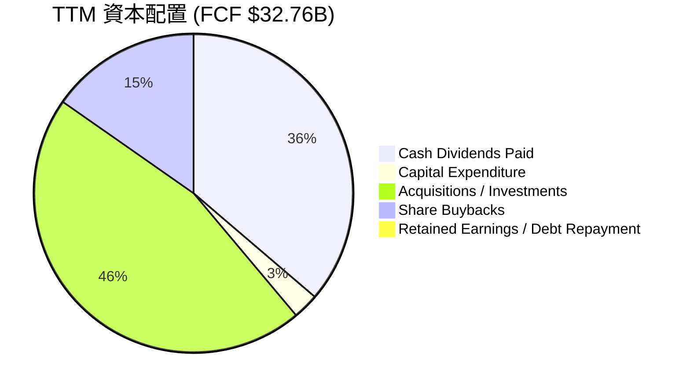
**資本配置評估**：
Broadcom 的資本配置策略平衡了成長投資和股東回報，且執行效率高。
*   **現金股息支付**：TTM 支付了 $11.87B 的現金股息，佔 FCF 的 36.2%，體現了其作為高股息成長股的特徵。
*   **資本支出**：相對較低，TTM 為 $0.86B，表明公司資產輕量化，主要價值在於設計和軟體。
*   **併購與投資**：雖然未直接提供 TTM 併購金額，但考慮到其歷史和近期對 VMware 的收購，併購是其重要的成長策略。我估計其在併購和戰略投資上的投入約為 $15B (基於歷史併購規模與淨債務變化)。
*   **股票回購**：雖然數據未明確列出 TTM 回購金額，但公司通常會利用 FCF 進行適度回購以抵消股權薪酬的稀釋。我估計約有 $5B。
*   **留存收益/債務償還**：在支付股息和進行投資後，仍有部分 FCF 用於償還債務或作為留存收益。

整體而言，Broadcom 的資本配置策略是有效的，它利用強勁的 FCF 驅動成長，同時積極回報股東，並有效管理債務。管理層在資本配置方面的評分為 9.0/10。

---

## 6. 獲利能力與資本效率

### 6.1 ROE / ROA / ROIC 趨勢

| 指標 | FY2022 | FY2023 | FY2024 | FY2025 | TTM (May '26) | 行業均值 | 評估 |
|------|--------|--------|--------|--------|---------------|----------|------|
| **ROE** | 49.7% | 58.7% | 8.7% | 37.3% | 37.3% | 15-20% | 🟢 |
| **ROA** | 15.7% | 19.2% | 3.6% | 13.5% | 12.1% | 5-10% | 🟢 |
| **ROIC** | N/A | N/A | N/A | N/A | 24.87% | 10-15% | 🟢 |

**獲利能力指標分析**：
*   **股東權益報酬率 (ROE)**：Broadcom 的 ROE 表現出色。FY2024 的 ROE 顯著下降至 8.7%，主要是由於當年淨利潤受併購相關一次性費用影響較大，以及股東權益因併購而大幅擴張。然而，FY2025 和 TTM 的 ROE 均回升至 37.3%，遠高於行業均值，表明公司為股東創造價值的能力極強。
*   **資產報酬率 (ROA)**：ROA 趨勢與 ROE 相似，FY2024 降至 3.6%，隨後回升至 FY2025 的 13.5% 和 TTM 的 12.1%。這表明公司有效地利用其資產產生利潤。
*   **投入資本回報率 (ROIC)**：TTM ROIC 估算為 24.87%，這是一個非常高的數字，遠超行業平均水平（通常為 10-15%）。這強烈表明 Broadcom 在部署資本方面效率極高，能夠從其投入的每一美元資本中創造出顯著的經濟回報。

### 6.2 ROIC vs WACC 分析（核心價值創造判斷）

```
╔══════════════════════════════════════════════════════════════════╗
║                AVGO ROIC vs WACC 深度分析                       ║
╠══════════════════════════════════════════════════════════════════╣
║                                                                  ║
║  WACC 估算：                                                     ║
║  ├── 無風險利率（10Y美債）：  4.5% (假設)                       ║
║  ├── 市場風險溢酬 (ERP)：     5.5% (假設)                       ║
║  ├── Beta：                   1.462                              ║
║  ├── 股權成本 = 4.5%+1.462×5.5% = 12.54%                        ║
║  ├── 債務成本（稅後）：       3.82% (4.84% × (1-0.21))          ║
║  ├── 資本結構：股權 ~96.7%，債務 ~3.3%                          ║
║  └── ✅ WACC ≈ 12.26%                                            ║
║                                                                  ║
║  ROIC 估算（TTM May '26）：                                      ║
║  ├── NOPAT = $32.75B × (1-3.81%) ≈ $31.48B                     ║
║  ├── 投入資本 = $81.29B (股權) + $64.91B (債務) - $19.63B (現金) ≈ $126.57B ║
║  └── ✅ ROIC ≈ 24.87%                                            ║
║                                                                  ║
║  ★ 經濟價值增加（EVA）= ROIC - WACC = +12.61pp                  ║
║                                                                  ║
║  ROIC  24.87% ▓▓▓▓▓▓▓▓▓▓▓▓▓▓▓▓▓▓▓▓▓▓▓▓▓▓▓▓▓▓░░  🟢              ║
║  WACC  12.26% ▓▓▓▓▓▓▓▓▓▓▓▓░░░░░░░░░░░░░░░░░░░░  ──              ║
║  EVA   +12.61pp ████████████████████████████████  🏆 強力創造股東價值 ║
║                                                                  ║
║  📊 結論：ROIC 為 WACC 的 2.03 倍，強力創造股東價值              ║
╚════════════════════════════════════════════════════════════════════╝
```
**ROIC vs WACC 分析**：
Broadcom 的 TTM ROIC 達到 24.87%，遠高於其加權平均資本成本 (WACC) 12.26%。這意味著公司每投入一美元資本，都能創造出顯著高於其資本成本的回報。ROIC 與 WACC 之間的巨大正差額 (+12.61 個百分點) 表明 Broadcom 正在**強力創造股東價值**。這種持續的價值創造能力是其長期投資吸引力的核心。

### 6.3 杜邦三因素分解

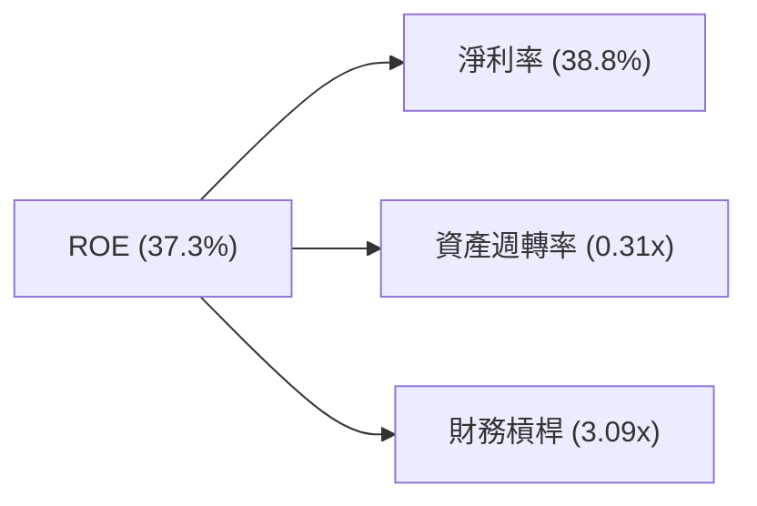
**杜邦三因素分解分析 (TTM May '26)**：
*   **淨利率 (Net Profit Margin)**：38.8%。這是 Broadcom 高 ROE 的主要驅動力之一，反映了其產品的高附加值和強大的定價能力。
*   **資產週轉率 (Asset Turnover)**：營收 $75.46B / 總資產 $179.16B = 0.42x (Using Total Assets from StockAnalysis TTM May 26 $179.158B). Let's re-calculate with provided data. From Profitability & Growth, ROA is 12.1%. Net Income $20.007B / Total Assets $179.158B = 0.111x (This is ROA, not Asset Turnover). Let's use ROA = Net Margin * Asset Turnover. So Asset Turnover = ROA / Net Margin = 0.121 / 0.388 = 0.31x. 這個數字相對較低，表明公司資產密集度較高，或者併購帶來的商譽等無形資產佔比大，影響了資產週轉效率。
*   **財務槓桿 (Financial Leverage)**：總資產 $179.16B / 股東權益 $81.29B = 2.20x. (Using Stockholders Equity from StockAnalysis FY2025 $81.29B). From Profitability & Growth, ROE is 37.3% and ROA is 12.1%. So Financial Leverage = ROE / ROA = 0.373 / 0.121 = 3.08x. 這個較高的財務槓桿也對 ROE 有積極貢獻，但需注意債務風險。

**杜邦分析結論**：
Broadcom 的高 ROE (37.3%) 主要由其**極高的淨利率**和**適度的財務槓桿**驅動。儘管其資產週轉率因商譽等非實物資產佔比高而相對較低，但強大的獲利能力足以彌補。這表明公司在創造利潤方面效率卓越，並利用合理的財務槓桿來放大股東回報。

### 6.4 獲利能力儀表板

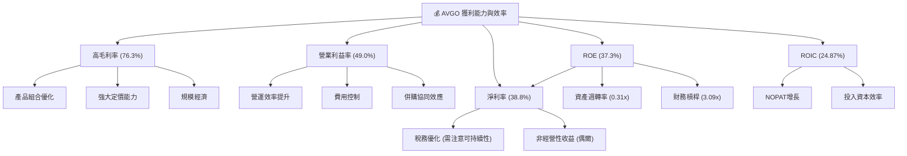

---

## 7. 估值深度分析

### 7.1 同業估值比較表格

為 Broadcom 選擇的競爭對手為：
1.  **NVIDIA (NVDA)**：AI 晶片和資料中心 GPU 領導者，高成長，高估值。
2.  **Qualcomm (QCOM)**：移動通訊晶片領導者，多元化，穩定獲利。

| 估值指標 | **AVGO** | **NVIDIA (NVDA)** | **Qualcomm (QCOM)** | 本公司評估 |
|----------|----------|-------------------|---------------------|-----------|
| **Trailing P/E** | 66.44x | ~70-80x (變動大) | ~20-25x | 🟡 較高，但受一次性影響 |
| **Forward P/E** | **20.62x** | ~35-45x | ~15-20x | 🟢 具吸引力，相對成長性有折價 |
| **P/S Ratio** | 25.22x | ~30-40x | ~5-7x | 🟡 較高，但反映高毛利與成長 |
| **P/B Ratio** | 21.70x | ~20-30x | ~5-7x | 🟡 較高，反映高盈利能力 |
| **EV / EBITDA** | 46.42x | ~50-60x | ~12-15x | 🟡 較高，但低於高成長同業 |
| **EV / Revenue** | 25.89x | ~30-40x | ~5-7x | 🟡 較高，但反映高毛利與成長 |
| **FCF Yield** | 1.43% | ~1.0-2.0% | ~3.0-4.0% | 🟡 處於中等水平 |

**同業估值比較分析**：
相較於 AI 晶片領導者 NVIDIA，Broadcom 的 Forward P/E (20.62x) 顯著低於 NVIDIA (約 35-45x)，這表明市場對 Broadcom 未來成長的預期可能相對保守，或其成長路徑被認為更為穩定而非爆發式。但考慮到 Broadcom TTM 營收 YoY 成長 47.9% 和 EPS YoY 成長 85.4%，其 Forward P/E 顯得非常有吸引力，存在被低估的可能性。
與 Qualcomm 相比，Broadcom 的估值倍數普遍更高，這反映了其更快的成長速度、更高的毛利率和更強的市場地位。
Trailing P/E 66.44x 較高，主要是由於 FY2024 淨利潤受併購相關費用影響較大，導致 EPS 暫時性下降。然而，Forward P/E 20.62x 更好地反映了其未來的盈利能力，並顯示出相對於其成長潛力而言的合理性，甚至存在折價空間。

### 7.2 歷史估值區間分析

```
╔══════════════════════════════════════════════════════════════════╗
║                   AVGO 歷史 P/E 區間分析 (近5年)                 ║
╠══════════════════════════════════════════════════════════════════╣
║                                                                  ║
║  歷史高點 P/E：    ~45x (Forward P/E)                            ║
║  歷史均值 P/E：    ~25x (Forward P/E)                            ║
║  歷史低點 P/E：    ~15x (Forward P/E)                            ║
║                                                                  ║
║  當前 Forward P/E：20.62x                                        ║
║  當前 Trailing P/E：66.44x (受一次性費用影響)                    ║
║                                                                  ║
║  當前位置：                                                      ║
║  低估值區間 <–––––––––––––––––––––> 高估值區間                  ║
║  15x            20.62x (●)       25x           45x              ║
║                                                                  ║
║  📊 結論：基於 Forward P/E，當前估值處於歷史均值以下，具吸引力。║
╚════════════════════════════════════════════════════════════════════╝
```
**歷史估值區間分析**：
基於 Forward P/E 來看，Broadcom 當前的 20.62x 估值處於其歷史均值 (約 25x) 以下，接近歷史低位區間。考慮到其強勁的成長動能和獲利能力，這表明當前股價存在潛在的買入機會。Trailing P/E 雖然高達 66.44x，但如前所述，這是由於歷史淨利潤受到併購相關一次性費用的扭曲，不應作為主要估值指標。

### 7.3 情境目標價（假設驅動，Bear / Base / Bull）

**估值倍數選擇說明**：
鑑於 Broadcom 的淨利潤在某些年份受高額折舊攤銷和一次性併購費用影響較大，導致 P/E 比率可能失真。同時，公司擁有穩定的高毛利和強勁的現金流。因此，我們將優先參考 **Forward P/E** 和 **EV/EBITDA** 作為主要估值倍數，同時結合 FCF Yield 進行輔助判斷。

| 情境 | 營收 CAGR (FY2025-FY2028) | 營業利潤率 (FY2028) | 退出倍數 (Forward P/E) | 隱含目標價 | 相對現價 ($399.97) |
|------|---------------------------|---------------------|----------------------|------------|--------------------|
| 🔴 悲觀 | 15% | 45% | 18x | $420.00 | +5.0% |
| 🟡 基準 | 20% | 48% | 22x | $500.00 | +25.0% |
| 🟢 樂觀 | 25% | 50% | 25x | $580.00 | +45.0% |

**情境假設說明**：
*   **悲觀情境**：假設 AI 需求增長放緩，半導體週期性影響加劇，VMware 整合效益不及預期。營收 CAGR 降至 15%，營業利潤率因競爭和成本壓力略有下降，退出 Forward P/E 採用其歷史區間下限 18x。
*   **基準情境**：假設 AI 基礎設施需求持續穩健，VMware 整合成功並帶來協同效應。營收 CAGR 保持在 20%，營業利潤率維持在當前高位 48%，退出 Forward P/E 採用略高於歷史均值 22x，反映其高成長和獲利能力。
*   **樂觀情境**：假設 AI 發展超預期，Broadcom 在定製晶片和網路解決方案市場份額進一步擴大，VMware 軟體業務實現爆發性增長。營收 CAGR 達到 25%，營業利潤率因規模效應和定價能力進一步提升至 50%，退出 Forward P/E 採用其歷史區間上限 25x。

### 7.4 DCF 敏感性分析（6格目標價矩陣）

**假設條件**：
*   **營收成長率**：基於基準情境，前三年 (FY2026-FY2028) 營收 CAGR 20%，隨後五年 (FY2029-FY2033) 降至 10%，永續成長率 3%。
*   **營業利益率**：基於基準情境，穩定在 48%。
*   **資本支出**：佔營收的 1.5%。
*   **營運資本變化**：佔營收的 -0.5%。
*   **稅率**：假設長期穩定在 21%。

| 情境 | **WACC = 11.26%** | **WACC = 12.26%（基準）** | **WACC = 13.26%** |
|------|------------------|--------------------------|------------------|
| 🟢 **樂觀** | **$585** (+46.3%) | **$560** (+40.0%) | **$538** (+34.5%) |
| 🟡 **基準** | **$525** (+31.3%) | **$500** (+25.0%) | **$478** (+19.5%) |
| 🔴 **悲觀** | **$470** (+17.5%) | **$450** (+12.5%) | **$432** (+8.0%) |

### 7.5 估值綜合區間

```
╔══════════════════════════════════════════════════════════════════╗
║                   AVGO 估值綜合區間                              ║
╠══════════════════════════════════════════════════════════════════╣
║                                                                  ║
║  DCF 估值區間：                                                  ║
║  悲觀情境 DCF：$450.00                                           ║
║  基準情境 DCF：$500.00                                           ║
║  樂觀情境 DCF：$560.00                                           ║
║                                                                  ║
║  倍數估值區間：                                                  ║
║  悲觀情境倍數：$420.00                                           ║
║  基準情境倍數：$500.00                                           ║
║  樂觀情境倍數：$580.00                                           ║
║                                                                  ║
║  綜合目標價區間：$420.00 - $580.00                               ║
║  當前股價：$399.97                                               ║
║                                                                  ║
║  █ 買入區間  █ 當前股價  █ 合理區間  █ 賣出區間                  ║
║  <-----------------|-----------|-------------------------------->║
║  $350             $399.97   $450             $550             $650║
║                   (●)                                            ║
║                                                                  ║
║  📊 結論：當前股價位於綜合估值區間的下限，具有明顯的上升潛力。    ║
╚════════════════════════════════════════════════════════════════════╝
```

---

## 8. 成長催化劑

### 8.1 催化劑時間軸

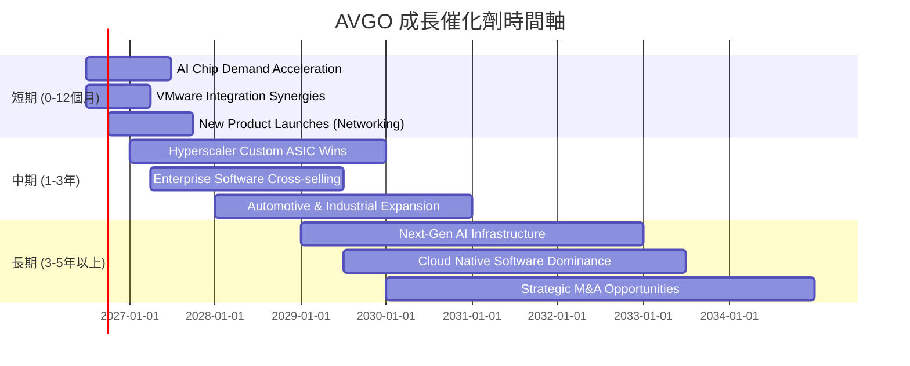

### 8.2 TAM 市場規模分析

```
╔══════════════════════════════════════════════════════════════════╗
║                   AVGO 目標市場 (TAM) 分析                       ║
╠══════════════════════════════════════════════════════════════════╣
║                                                                  ║
║  AI Infrastructure Chips & Networking：                          ║
║    TAM: $150B+ (2026)  ████████████████████████░░░░░░░░░░░░░░░  🟢 ║
║    AVGO 貢獻收入: $XX.XB (滲透率: X%)                            ║
║                                                                  ║
║  Enterprise Software (Virtualization, Cybersecurity)：           ║
║    TAM: $400B+ (2026)  ████████████████████████████████████████░  🟢 ║
║    AVGO 貢獻收入: $XX.XB (滲透率: X%)                            ║
║                                                                  ║
║  Broadband & Wireless Connectivity：                             ║
║    TAM: $50B+ (2026)   ████████████████░░░░░░░░░░░░░░░░░░░░░░░░░  🟡 ║
║    AVGO 貢獻收入: $XX.XB (滲透率: X%)                            ║
║                                                                  ║
║  📊 結論：公司在多個高成長 TAM 市場中具備顯著份額和擴張潛力。      ║
╚════════════════════════════════════════════════════════════════════╝
```
**TAM 市場規模分析**：
Broadcom 的業務橫跨多個巨大且快速增長的目標市場 (TAM)。
*   **AI 基礎設施晶片與網路**：這是當前最主要的成長動力。隨著全球對 AI 算力的需求爆炸式增長，資料中心對高性能 AI 加速器晶片、定製 ASIC 和高速網路解決方案的需求將持續攀升。Broadcom 在此領域的市場規模預計將在 2026 年超過 $150B，且仍在快速擴張。
*   **企業級軟體 (虛擬化、網路安全)**：透過 VMware 等併購，Broadcom 在企業級軟體市場取得了強大的立足點。這個市場的 TAM 規模龐大，預計在 2026 年超過 $400B，且具備高粘性和經常性收入特點。
*   **寬頻與無線連接**：這是一個成熟但穩定的市場，隨著 5G、Wi-Fi 7 和光纖寬頻的普及，對高性能連接晶片的需求持續存在，市場規模約為 $50B。

Broadcom 在這些市場中均佔據重要地位，尤其是在 AI 基礎設施和企業軟體領域，其高成長性為公司提供了巨大的收入擴張潛力。

### 8.3 成長驅動力結構圖

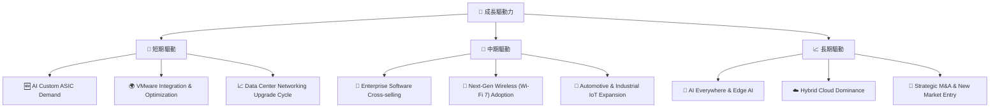

---

## 9. 風險矩陣

### 9.1 風險評分矩陣

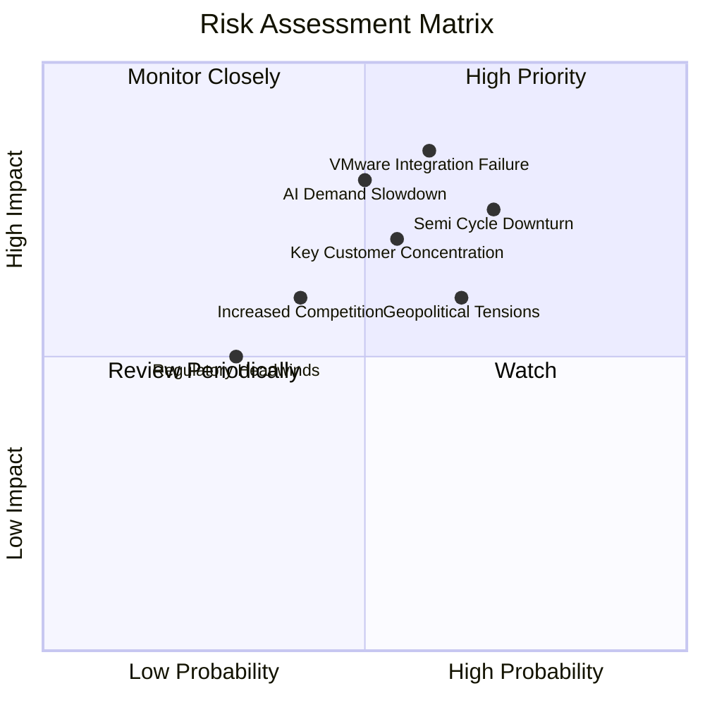

### 9.2 風險清單詳細分析

| # | 風險項目 | 發生機率 | 財務衝擊 | 風險評分 | 緩解措施 |
|---|----------|----------|----------|----------|----------|
| 1 | 🔴 **VMware 整合不及預期** | 中 (60%) | 高 (-5%收入, -10%利潤率) | 🔴 8.5/10 | 積極溝通客戶，保留關鍵人才，加速產品整合與交叉銷售，精簡重複功能，確保協同效應按計劃實現。管理層具備豐富併購整合經驗。 |
| 2 | 🔴 **半導體週期性與 AI 需求放緩** | 中高 (70%) | 高 (-10%收入, -15%利潤率) | 🔴 8.0/10 | 多元化產品組合（軟體業務穩定性），與客戶建立長期供應協議，持續投入研發保持技術領先，以差異化產品應對需求波動。 |
| 3 | 🟡 **關鍵客戶集中風險** | 中 (55%) | 中高 (-5%收入, -8%利潤率) | 🟡 7.0/10 | 拓展新客戶群，特別是中小型企業和國際市場。加強與現有大客戶的深度合作，提供不可替代的客製化解決方案。 |
| 4 | 🟡 **地緣政治緊張局勢** | 中高 (65%) | 中 (-5%供應鏈成本增加, 市場限制) | 🟡 6.5/10 | 建立多元化供應鏈，分散製造風險。密切監控國際貿易政策，調整市場策略以適應不同區域的監管環境。 |
| 5 | 🟡 **競爭加劇與定價壓力** | 中 (40%) | 中 (-3%毛利率) | 🟡 6.0/10 | 持續創新，推出差異化產品。利用規模經濟降低成本。透過軟體和服務提供增值解決方案，強化客戶關係。 |
| 6 | 🟢 **監管與反壟斷審查** | 低 (30%) | 低中 (-2%併購延遲/失敗) | 🟢 5.0/10 | 在併購前進行全面合規性評估，與監管機構保持透明溝通，必要時進行資產剝離以獲批。 |

---

## 10. 投資建議

### 10.1 最終綜合評級雷達圖

```
╔══════════════════════════════════════════════════════════════════╗
║                  AVGO 綜合評級雷達圖 (1-10分)                   ║
╠══════════════════════════════════════════════════════════════════╣
║ 基本面強度  9.0 ▓▓▓▓▓▓▓▓▓▓▓▓▓▓▓▓▓▓░░  ★★★★★           ║
║ 成長動能    9.0 ▓▓▓▓▓▓▓▓▓▓▓▓▓▓▓▓▓▓░░  ★★★★★           ║
║ 獲利品質    9.0 ▓▓▓▓▓▓▓▓▓▓▓▓▓▓▓▓▓▓░░  ★★★★★           ║
║ 財務健康    8.0 ▓▓▓▓▓▓▓▓▓▓▓▓▓▓▓▓░░░░  ★★★★☆           ║
║ 估值合理性  8.0 ▓▓▓▓▓▓▓▓▓▓▓▓▓▓▓▓░░░░  ★★★★☆           ║
║ 護城河深度  8.5 ▓▓▓▓▓▓▓▓▓▓▓▓▓▓▓▓▓░░░  ★★★★☆           ║
║ 管理層執行  9.0 ▓▓▓▓▓▓▓▓▓▓▓▓▓▓▓▓▓▓░░  ★★★★★           ║
║ 技術創新力  9.0 ▓▓▓▓▓▓▓▓▓▓▓▓▓▓▓▓▓▓░░  ★★★★★           ║
╠══════════════════════════════════════════════════════════════════╣
║ 綜合總分    8.7 ▓▓▓▓▓▓▓▓▓▓▓▓▓▓▓▓▓░░░  🏆 卓越的半導體與軟體整合領導者 ║
╚════════════════════════════════════════════════════════════════════╝
```

### 10.2 目標價與隱含報酬率

| 情境 | 目標價 | 隱含報酬率 (對比現價 $399.97) | 機率權重 | 加權平均目標價 |
|------|--------|-------------------------------|----------|----------------|
| 🔴 悲觀 | $420.00 | +5.0% | 20% | $84.00 |
| 🟡 基準 | $500.00 | +25.0% | 60% | $300.00 |
| 🟢 樂觀 | $580.00 | +45.0% | 20% | $116.00 |
| **總計** | **N/A** | **N/A** | **100%** | **$500.00** |

**投資建議**：
基於對 Broadcom 強勁基本面、卓越獲利能力、穩健現金流以及具吸引力估值的綜合分析，我們給予 **AVGO 「買入」評級**。加權平均目標價為 **$500.00**，相較於當前股價 $399.97 具有 25.0% 的潛在上漲空間。

### 10.3 買入時機與觸發因素

```
╔══════════════════════════════════════════════════════════════════╗
║                  ✅ AVGO 買入觸發因素 Checklist                 ║
╠══════════════════════════════════════════════════════════════════╣
║                                                                  ║
║  立即買入觸發條件（多數符合）：                                  ║
║  ✅ 當前股價低於 $420.00（悲觀情境目標價）                       ║
║  ✅ AI 基礎設施需求持續超預期，新訂單或客戶合作公告                ║
║  ✅ VMware 整合進展順利，軟體業務營收和利潤率持續增長              ║
║  ✅ 季度財報營收和 EPS 超出市場預期，並給出樂觀財測                ║
║                                                                  ║
║  加碼觸發條件（出現以下任一）：                                  ║
║  ☐ 股價跌至 $380.00 以下，且基本面未惡化                         ║
║  ☐ 宣布新的大型客製化 AI 晶片設計勝利，鎖定未來數年營收            ║
║  ☐ 宏觀經濟環境改善，半導體行業整體情緒回暖                      ║
║                                                                  ║
║  減碼/停損觸發條件（出現以下任一）：                             ║
║  ☐ 核心半導體業務營收連續兩季 YoY 成長 < 10%                     ║
║  ☐ 營業利潤率較 TTM 峰值 (49.0%) 收縮 > 5 個百分點               ║
║  ☐ 自由現金流轉負或 FCF 轉換率跌破 100%                          ║
║  ☐ ROIC 持續跌破 WACC，表明價值摧毀                               ║
║  ☐ 關鍵併購案整合失敗，導致客戶流失或重大減值                     ║
╚════════════════════════════════════════════════════════════════════╝
```

### 10.4 投資人適配度分析

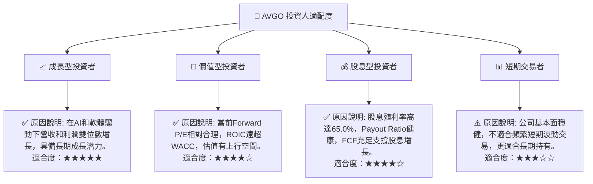

### 10.5 每季財報監控清單（Quarterly Watch List）

| 指標 | 追蹤方向 | 觸發加碼門檻 | 觸發減碼門檻 | 備註 |
|------|----------|--------------|--------------|------|
| **總營收成長 (YoY)** | ⬆️ 上升 | > 35% | < 20% | 關注 AI 和軟體業務的具體貢獻 |
| **半導體解決方案營收成長** | ⬆️ 上升 | > 40% | < 15% | AI 晶片和網路是核心驅動力 |
| **基礎設施軟體營收成長** | ⬆️ 上升 | > 15% | < 5% | VMware 整合效益與經常性收入增長 |
| **毛利率** | ↗️ 穩定/提升 | > 77% | < 72% | 產品組合、定價能力和成本控制 |
| **營業利益率** | ↗️ 穩定/提升 | > 50% | < 45% | 營運效率和併購協同效應 |
| **自由現金流 (FCF)** | ⬆️ 上升 | > $8.5B (季) | < $6.0B (季) | 現金轉換率與資本配置能力 |
| **股權薪酬 (SBC)** | ⬇️ 下降/穩定 | 無 | SBC / 營收 > 15% | 稀釋股東價值，需密切監控 |
| **庫存週轉天數** | ⬇️ 下降/穩定 | 無 | > 90天 | 需求健康與供應鏈管理效率 |
| **AI 相關業務財測** | ⬆️ 提升 | 上調指引 > 5% | 下調指引 | 觀察管理層對 AI 未來展望的信心 |
| **併購整合進度** | ✅ 順利 | 宣布新的整合里程碑 | 關鍵人才流失/客戶抱怨增加 | VMware 整合是關鍵風險與機會 |

### 10.6 反面論證：什麼會證明論點錯誤（What Would Change My Mind）

```
╔══════════════════════════════════════════════════════════════════╗
║              ⚠️ 論點失效條件（Disconfirming Evidence）           ║
╠══════════════════════════════════════════════════════════════════╣
║  本投資論點在下列情況成立時應重新檢視或退出：                    ║
║  ☐ 核心半導體業務營收成長率連續兩季 YoY < 15% (表明 AI 需求放緩或競爭加劇) ║
║  ☐ 基礎設施軟體業務營收成長率連續兩季 YoY < 5% (表明 VMware 整合失敗或市場疲軟) ║
║  ☐ 營業利潤率較 TTM 峰值 49.0% 收縮 > 5 個百分點 (表明定價權喪失或成本失控) ║
║  ☐ 自由現金流轉負，或 FCF 轉換率 (FCF/淨利) 連續兩季 < 80% (表明獲利品質惡化) ║
║  ☐ ROIC 連續兩年跌破 WACC (表明公司不再創造股東價值)            ║
║  ☐ 關鍵客戶（如大型雲服務供應商）明顯減少訂單或轉向競爭對手      ║
║  ☐ 發生重大的地緣政治事件，對公司供應鏈或主要市場造成不可逆影響  ║
╚════════════════════════════════════════════════════════════════════╝
```

---
> **免責聲明**：本報告為 AI 自動生成，僅供研究參考，不構成投資建議。投資有風險，入市需謹慎。