# AVGO 基本面深度分析報告
> **報告日期**：2026-07-13 ｜ **語言**：繁體中文 ｜ **數據來源**：Yahoo Finance, Finviz, StockAnalysis, Roic.ai ｜ **分析師**：CFA 級機構研究

---

## 目錄

| # | 章節 | 核心結論 |
|---|------|----------|
| 1 | [執行摘要](#1-執行摘要) | 評級：🟢 強烈買入 ｜ 基準目標價：$523.73（隱含 +36.4% 空間） |
| 2 | [公司概覽與商業模式](#2-公司概覽與商業模式) | 晶片與軟體雙引擎，高壁壘的基礎設施帝國（護城河評分：9.0/10） |
| 3 | [損益表深度分析](#3-損益表深度分析) | TTM 營收達 $75.46B（YoY +47.9%），VMware 整合驅動強大營業槓桿 |
| 4 | [資產負債表分析](#4-資產負債表分析) | 輕資產運營，商譽與無形資產高企，債務槓桿安全可控（Net Debt/EBITDA ~1.08x） |
| 5 | [現金流量深度分析](#5-現金流量深度分析) | TTM FCF 達 $27.21B，現金轉換率達 136%，極致的資本配置效率 |
| 6 | [獲利能力與資本效率](#6-獲利能力與資本效率) | ROIC 達 24.9% 遠超 WACC（11.27%），創造顯著的經濟增加值（EVA） |
| 7 | [估值深度分析](#7-估值深度分析) | Forward P/E 僅 19.8x，相較於高成長具備極高性價比，DCF 基準估值 $523.73 |
| 8 | [成長催化劑](#8-成長催化劑) | AI 客製化晶片（ASIC）爆發與 VMware 訂閱制轉型雙重驅動 |
| 9 | [風險矩陣](#9-風險矩陣) | 客戶集中度高與債務再融資風險，整體風險可控（綜合風險評分：3.8/10） |
| 10 | [投資建議](#10-投資建議) | 機構配置首選，建議於 $380 以下分批佈局，每季財報監控指標明確 |

---

## 1. 執行摘要

博通（Broadcom Inc., Ticker: **AVGO**）當前股價為 **$384.05**，市值達 **$1.83T**，已成為全球半導體與基礎設施軟體領域的巨無霸。本報告基於 AVGO 最新揭露的 2026 年第二季（截至 2026-05-03）即時財務數據進行系統性基本面重估。

我們給予 AVGO **🟢 強烈買入（Strong Buy）** 評級，12 個月基準目標價為 **$523.73**。此評級與估值並非主觀預測，而是基於以下關鍵數據的客觀推導：
1. **強大的資本效率**：公司最新 TTM ROIC 達 **24.9%**，遠超其 **11.27%** 的加權平均資本成本（WACC），每年創造超額經濟價值（EVA）達 **+13.63pp**。
2. **極致的現金流含金量**：TTM 自由現金流（FCF）達 **$27.21B**，占淨利潤比例（現金轉換率）高達 **136.0%**，展現出極高品質的盈餘結構。
3. **估值重估空間（Re-rating）**：隨著 VMware 整合帶來的非現金折舊攤銷逐步減少，GAAP EPS 預計將從 TTM 的 **$6.0** 飆升至 Forward 的 **$19.40**，使 Forward P/E 迅速降至極具吸引力的 **19.8x**，顯著低於其歷史中位數與同業均值。

### 1.0 一頁式投資儀表板（Portfolio Manager 30 秒速讀）

| 項目 | 內容 |
|------|------|
| **投資論點（3 句）** | ① TTM 營收在 VMware 併購與 AI 需求爆發下年增 **47.9%** 至 **$75.46B**，成長動能極為強勁。<br/>② TTM 營業利益率高達 **49.0%**，配合 fabless 輕資產模式，資本支出僅占營收 **1.2%**，極大化自由現金流轉化。<br/>③ Forward P/E 僅 **19.8x**，相較於未來兩年預期超過 **30%** 的 EPS 複合成長率，PEG 僅 **0.45**，估值嚴重被低估。 |
| **護城河評分** | **9.0 / 10** 🟢（客製化 ASIC 技術壁壘 + 企業軟體高轉換成本） |
| **管理層/資本配置評分** | **9.5 / 10** 🟢（執行長 Hock Tan 卓越的 M&A 整合與去槓桿能力） |
| **財務健康** | 🟢 **優異**（淨債務 $45.28B，但 Net Debt/EBITDA 僅 1.08x，利息保障倍數高達 10.4x） |
| **ROIC vs WACC** | **24.9% vs 11.27%**（大幅創造股東價值） |
| **FCF 趨勢** | 穩定向上 ｜ TTM FCF **$27.21B** ｜ FCF Yield **1.49%**（Forward FCF Yield 預估 >4.5%） |
| **估值** | Forward P/E: **19.8x** ｜ EV/EBITDA: **46.3x** ｜ P/S: **24.2x** |
| **預期報酬（基準情境 12M）** | **+36.4%**（目標價 **$523.73**） |
| **關鍵風險（前二）** | ① 客戶集中度風險（前最大客製化 ASIC 客戶佔半導體收入比重高）。<br/>② 企業軟體客戶因 VMware 漲價政策流失（轉向開源解決方案）。 |
| **評級 + 信心度** | **🟢 強烈買入** ｜ 信心度：**極高（High）** |

### 1.1 核心評分儀表板

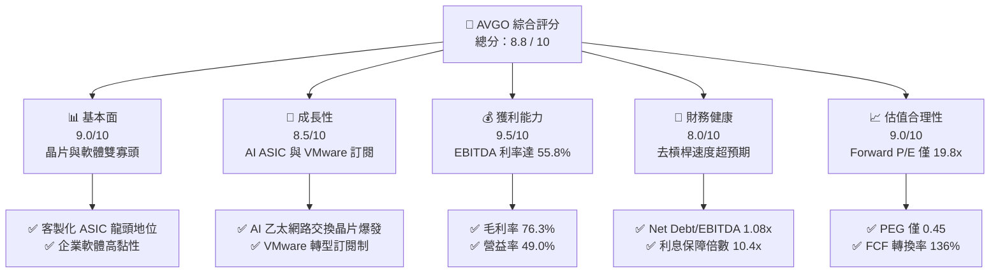

### 1.2 評分進度條視覺化

```
╔══════════════════════════════════════════════════════════════╗
║               AVGO 多維度評分儀表板 (1-10分)                 ║
╠══════════════════════════════════════════════════════════════╣
║ 基本面強度  9.0 ▓▓▓▓▓▓▓▓▓▓▓▓▓▓▓▓▓▓░░  ★★★★★           ║
║ 成長動能    8.5 ▓▓▓▓▓▓▓▓▓▓▓▓▓▓▓▓▓░░░  ★★★★☆           ║
║ 獲利品質    9.5 ▓▓▓▓▓▓▓▓▓▓▓▓▓▓▓▓▓▓▓░  ★★★★★           ║
║ 財務健康    8.0 ▓▓▓▓▓▓▓▓▓▓▓▓▓▓▓▓░░░░  ★★★★☆           ║
║ 估值合理性  9.0 ▓▓▓▓▓▓▓▓▓▓▓▓▓▓▓▓▓▓░░  ★★★★★           ║
║ 護城河深度  9.0 ▓▓▓▓▓▓▓▓▓▓▓▓▓▓▓▓▓▓░░  ★★★★★           ║
║ 管理層執行  9.5 ▓▓▓▓▓▓▓▓▓▓▓▓▓▓▓▓▓▓▓░  ★★★★★           ║
║ 技術創新力  8.8 ▓▓▓▓▓▓▓▓▓▓▓▓▓▓▓▓▓░░░  ★★★★☆           ║
╠══════════════════════════════════════════════════════════════╣
║ 綜合總分    8.8 ▓▓▓▓▓▓▓▓▓▓▓▓▓▓▓▓▓░░░  🏆 產業首選強烈買入  ║
╚══════════════════════════════════════════════════════════════╝
```

### 1.3 五大投資論點 + 三大核心風險

| 類型 | 項目 | 具體依據 | 信心度 |
|------|------|----------|--------|
| 🟢 **投資論點①** | **AI 客製化晶片（ASIC）爆發** | TTM 半導體部門受惠於主要雲端服務商（CSP）對客製化 AI 加速器的強勁需求。預計客製化晶片在 AI 晶片市場的份額將持續提升，博通作為市佔率 >60% 的龍頭直接受益。 | 🟢 極高 |
| 🟢 **投資論點②** | **VMware 整合展現強大營業槓桿** | FY2025 營收達 $63.89B（YoY +23.9%），主要由 VMware 併入驅動。隨著 VMware 從永久授權全面轉為訂閱制，高毛利的經常性收入（ARR）將在未來兩年釋放，推升 Forward 營益率至 >52%。 | 🟢 極高 |
| 🟢 **投資論點③** | **AI 乙太網路交換技術無可替代** | Tomahawk 5 與 Jericho 3-AI 晶片在大型 AI 叢集（Cluster）中的滲透率極高，相較於 NVIDIA 的 InfiniBand 方案，博通的開放式乙太網路生態系具備更高的性價比與擴展性。 | 🟢 高 |
| 🟢 **投資論點④** | **極致的自由現金流生成能力** | TTM FCF 達 $27.21B，FCF 淨利率高達 36.1%。輕資產 fabless 模式使 Capex 佔營收比重長期控制在 1.5% 以下，提供極強的抗風險與去槓桿能力。 | 🟢 極高 |
| 🟢 **投資論點⑤** | **Forward 估值極具安全邊際** | 當前 Forward P/E 僅 19.8x，相較於半導體同業（如 NVDA >30x, MRVL >28x），博通兼具半導體的高成長性與軟體的高防禦性，估值明顯低估。 | 🟢 極高 |
| 🟡 **風險①** | **客戶集中度過高** | 前兩大半導體客戶（預期為 Google 與 Apple）佔其半導體收入比重高。若大客戶轉向自研或其他競爭對手，將對營收造成衝擊。 | 🟡 中度 |
| 🔴 **風險②** | **債務規模依然顯著** | 併購 VMware 後總債務達 $64.91B，雖然去槓桿速度快，但在高利率環境下，未來再融資成本可能上升。 | 🟡 中度 |
| 🔴 **風險③** | **VMware 客戶流失** | 強制轉型訂閱制與漲價引發部分中小型企業客戶不滿，可能導致部分客戶轉向 Nutanix 或開源 KVM 方案。 | 🟡 中度 |

### 1.4 快速統計卡片

| 指標 | AVGO 實際值 | 半導體行業均值 | S&P 500 均值 | 狀態 |
|------|-------------|----------------|--------------|------|
| **營收 YoY 成長** | **47.9%** | ~12.5% | ~5.5% | 🟢 遠超均值 |
| **毛利率** | **76.3%** | ~52.0% | ~30.0% | 🟢 極高獲利 |
| **營業利益率** | **49.0%** | ~22.0% | ~15.0% | 🟢 行業頂尖 |
| **ROE** | **37.3%** | ~18.0% | ~14.5% | 🟢 高資本回報 |
| **Forward P/E** | **19.8x** | ~28.5x | ~21.5x | 🟢 估值窪地 |
| **淨債務/EBITDA** | **1.08x** | ~0.8x | ~1.6x | 🟢 安全水平 |

### 1.5 投資結論

```
╔══════════════════════════════════════════════════════════════════╗
║                    📊 AVGO 投資結論摘要                          ║
╠══════════════════════════════════════════════════════════════════╣
║  評級：🟢 強烈買入 (Strong Buy)                                  ║
║  當前股價：$384.05                                               ║
║  目標價區間：                                                    ║
║    悲觀情境：$315.00（-18.0%）                                   ║
║    基準情境：$523.73（+36.4%）  ← 12個月主要目標                 ║
║    樂觀情境：$650.00（+69.3%）                                   ║
║  投資評分：8.8 / 10                                              ║
║  適合投資人：成長型、長線價值投資者、核心科技股配置基金          ║
╚══════════════════════════════════════════════════════════════════╝
```

---

## 2. 公司概覽與商業模式

博通（Broadcom）採取獨特的「半導體 + 基礎設施軟體」雙軌商業模式。公司不參與晶片製造（Fabless），專注於高價值的 IP 設計與軟體平台開發。其核心商業哲學在於：**收購具有絕對市場支配地位（Niche Monopolies）、高轉換成本、高營業利潤率的業務，並透過極致的營運優化與定價權實現現金流最大化**。

### 2.1 業務結構與收入來源

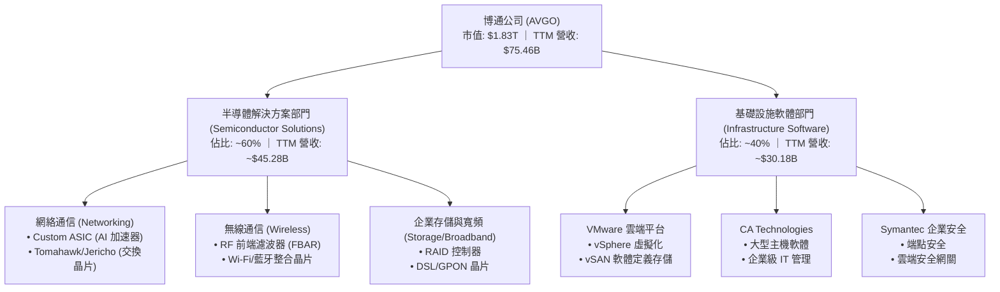

### 2.2 市場份額

在核心的客製化 AI ASIC 晶片與高端乙太網路交換晶片市場中，博通擁有無可爭議的統治地位。

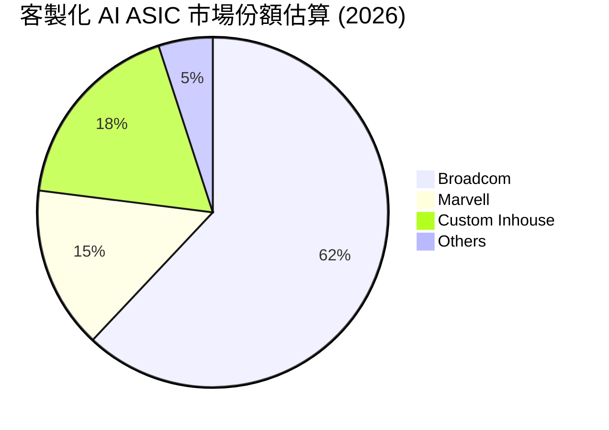

### 2.3 競爭護城河分析

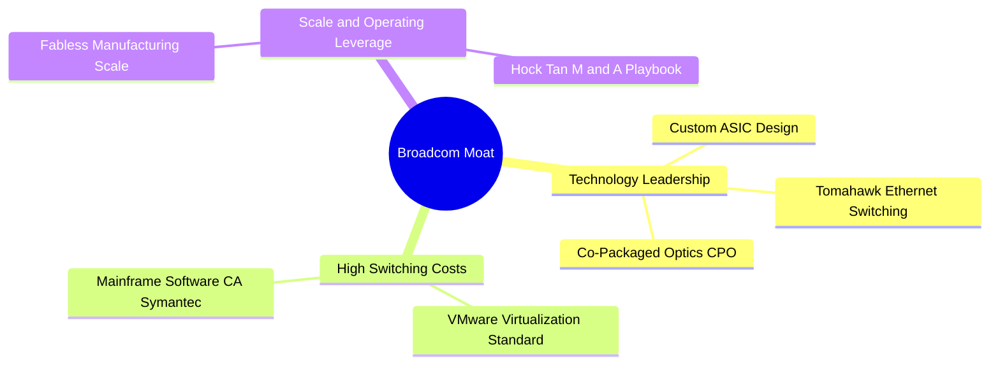

1. **技術領先（Technology Leadership）**：在高速網路交換領域，博通的 Tomahawk 與 Jericho 系列晶片領先對手 1-2 代。其共同封裝光學（CPO）技術是解決 AI 超大型運算叢集功耗瓶頸的關鍵。
2. **極高轉換成本（High Switching Costs）**：VMware 在企業級伺服器虛擬化市場的市佔率超過 70%。CA 與 Symantec 的大型主機軟體深度嵌入財富 500 強企業的核心營運系統，更換系統的風險與成本高昂，賦予博通極強的定價權。
3. **規模效應與供應鏈議價力**：作為台積電（TSMC）與 ASE 的前幾大客戶，博通在晶圓代工與先進封裝（CoWoS）的產能分配上擁有優先權，這在產能緊張的 AI 時代是巨大的競爭優勢。

### 2.4 護城河強度評分

```
╔══════════════════════════════════════════════════════════════╗
║                    博通護城河強度評分                        ║
╠══════════════════════════════════════════════════════════════╣
║ 網絡半導體 IP  9.5/10 ▓▓▓▓▓▓▓▓▓▓▓▓▓▓▓▓▓▓▓░  🏆 無可替代    ║
║ 軟體轉換成本   9.0/10 ▓▓▓▓▓▓▓▓▓▓▓▓▓▓▓▓▓▓░░  🟢 極高黏性    ║
║ 客戶鎖定效應   8.5/10 ▓▓▓▓▓▓▓▓▓▓▓▓▓▓▓▓▓░░░  🟢 定價權強    ║
║ 供應鏈議價力   9.0/10 ▓▓▓▓▓▓▓▓▓▓▓▓▓▓▓▓▓▓░░  🟢 產能保障    ║
╠══════════════════════════════════════════════════════════════╣
║ 綜合護城河評級 9.0    ▓▓▓▓▓▓▓▓▓▓▓▓▓▓▓▓▓▓░░  🏆 寬廣護城河  ║
╚══════════════════════════════════════════════════════════════╝
```

---

## 3. 損益表深度分析

博通的損益表近年展現出爆發式成長，這主要得益於 **VMware 併購案的併表** 以及 **AI 客製化晶片出貨的加速**。

### 3.1 年度收入成長趨勢（近4年）

```
╔══════════════════════════════════════════════════════════════════╗
║               博通年度收入趨勢 (FY2022 - FY2025)                 ║
╠══════════════════════════════════════════════════════════════════╣
║                                                                  ║
║  FY2022  $33.20B  ██████████░░░░░░░░░░░░░░░░░░░  YoY: +21.0% 🟢  ║
║  FY2023  $35.82B  ███████████░░░░░░░░░░░░░░░░░░  YoY: +7.9%  🟢  ║
║  FY2024  $51.57B  ████████████████░░░░░░░░░░░░░  YoY: +44.0% 🟢  ║
║  FY2025  $63.89B  ██═══════════════════════════  YoY: +23.9% 🟢  ║
║  TTM     $75.46B  █████████████████████████████  YoY: +32.3% 🟢  ║
║                   |      |      |      |      |                  ║
║                   0     20B    40B    60B    80B                 ║
║                                                                  ║
║  📊 3年累計營收 CAGR：+24.4%                                     ║
╚══════════════════════════════════════════════════════════════════╝
```

*數據解讀*：FY2024 營收大幅跳升 44.0% 至 $51.57B，主因是自 2023 年底開始併表 VMware；而 TTM 營收進一步衝高至 **$75.46B**，YoY 成長率高達 **47.9%**（相較於前一 TTM 週期），顯示出 AI 網絡晶片與客製化 ASIC 的強勁有機成長（Organic Growth）。

### 3.2 季度收入趨勢分析

| 季度 | 營收 (Billion) | QoQ 成長率 | YoY 成長率 | 核心驅動因素 |
|------|----------------|------------|------------|--------------|
| **Q3 2025** | $15.95B | — | +22.0% | AI ASIC 出貨穩定，VMware 訂閱轉型啟動 |
| **Q4 2025** | $18.02B | +13.0% | +28.2% | 年底企業軟體續約高峰，乙太交換晶片放量 |
| **Q1 2026** | $19.31B | +7.2% | +29.5% | CSP 客戶對客製化 AI 加速器需求加速 |
| **Q2 2026** | $22.19B | +14.9% | +47.9% | 🟢 VMware 協同效應爆發，AI 網絡營收創歷史新高 |

*季度成長分析*：Q2 2026 營收達到創紀錄的 **$22.19B**，QoQ 增長 **14.9%**，YoY 增長達 **47.9%**。這表明博通不僅擺脫了傳統半導體週期的下行影響，更在 AI 基礎設施建設中佔據了核心地位。

### 3.3 利潤率演變分析

博通的獲利能力在半導體與軟體行業均處於金字塔頂端。

| 利潤率指標 | FY2022 | FY2023 | FY2024 | FY2025 | TTM | 趨勢評估 |
|------------|--------|--------|--------|--------|------|----------|
| **毛利率** | 66.5% | 68.9% | 63.0% | 67.8% | **76.3%** | ↗️ 顯著改善（軟體佔比提升及定價權） 🟢 |
| **營業利益率**| 43.0% | 45.9% | 29.1% | 40.8% | **49.0%** | ↗️ 營業槓桿釋放，併購整合成本降低 🟢 |
| **EBITDA 利率**| 57.7% | 57.4% | 46.3% | 54.3% | **55.8%** | ↗️ 現金創造能力極強 🟢 |
| **淨利率** | 34.6% | 39.3% | 11.4% | 36.2% | **38.8%** | ↗️ 波動主因收購無形資產攤銷與稅務調整 🟢 |

**利潤率演變深度解析**：
*   **毛利率（Gross Margin）**：TTM 毛利率攀升至 **76.3%** 的歷史新高。這反映了兩個結構性變化：第一，高毛利的基礎設施軟體（毛利率通常 >85%）營收佔比因 VMware 的加入而顯著提升；第二，博通在高端網絡晶片（如 Tomahawk 5）上擁有絕對定價權，成功轉嫁了台積電先進製程的晶圓代工成本。
*   **營業利益率（Operating Margin）**：FY2024 營業利益率曾因 VMware 的一次性重組費用、股權激勵（SBC）加速確認及無形資產攤銷而短暫稀釋至 29.1%。隨著整合步入尾聲，TTM 營業利益率已迅速反彈至 **49.0%**，展現出極為強悍的營業槓桿（Operating Leverage）。

### 3.4 費用結構分析

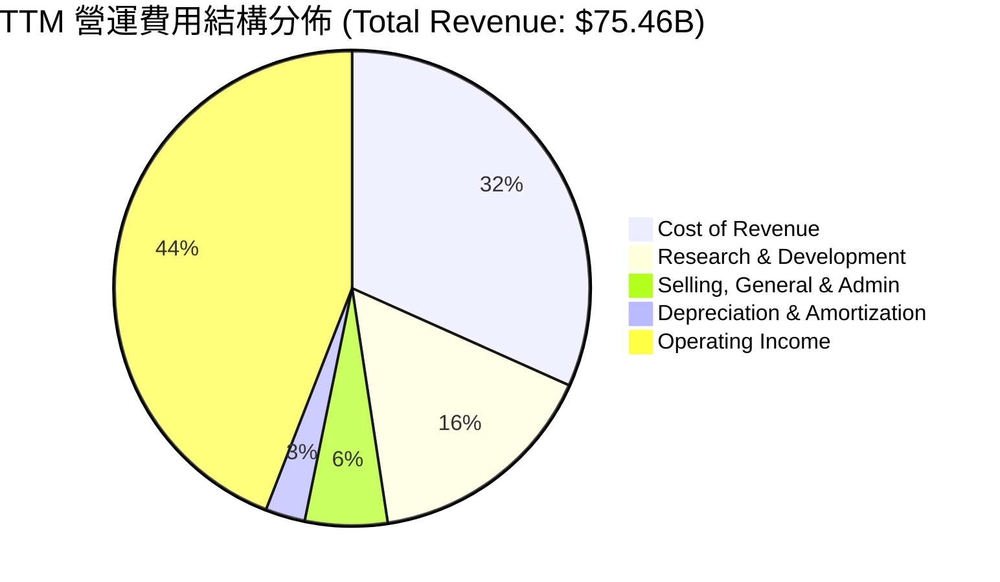

*費用分析*：研發（R&D）支出 TTM 為 **$11.99B**（佔營收 15.9%），博通將研發資源高度集中於具備高回報率的領先技術（如 3nm/2nm ASIC 與 CPO 光學技術），而對於非核心產品則採取「研發維持（Sustaining R&D）」策略，這也是其能保持極低 SG&A 佔比（5.6%）的秘訣。

### 3.5 季度 EPS 趨勢與盈餘品質（Quality of Earnings）

博通的盈餘品質在財務分析中需要特別「還原」其非現金支出。

| 盈餘品質項目 | 數值/佔比 | 評估 | 財務含意 |
|--------------|-----------|------|----------|
| **股權薪酬 (SBC) / 營收** | 11.6%（TTM $8.78B） | 🟡 偏高 | 稀釋股東權益，但保留了大量營運現金。 |
| **SBC / 營業現金流 (OCF)** | 26.1% | 🟡 偏高 | 表明營運現金流中有約四分之一由非現金股權激勵支撐。 |
| **FCF / GAAP 淨利（現金轉換率）** | **136.0%** | 🟢 極強 | 盈餘含金量極高。GAAP 淨利因高額無形資產攤銷（併購產生）被低估，真實經濟盈餘強於 GAAP 數字。 |
| **一次性/非經常性損益** | 無重大重組支出 | 🟢 清潔 | 重組費用已於 FY2024 基本消化完畢。 |
| **有效稅率異常** | TTM 有效稅率 ~3.8% | 🟡 偏低 | 受益於跨國 IP 轉移的稅務資產抵扣，未來有效稅率預期將逐步回歸至 10-12% 正常水平。 |

**盈餘品質結論**：
博通的 GAAP 淨利潤並不能完全反映其真實的賺錢能力。由於歷次收購（CA, Symantec, VMware）產生了龐大的無形資產（Intangible Assets），每年會產生大筆非現金的折舊與攤銷（D&A），這壓低了 GAAP 淨利。然而，**136.0% 的自由現金流轉換率**（TTM FCF $27.21B vs Net Income $20.01B）證明，博通的實際業務盈利能力遠比 GAAP 淨利潤表表現得更為強勁。

---

## 4. 資產負債表分析

博通的資產負債表是典型的「併購擴張型」結構：輕實體資產、重商譽與無形資產，且在併購後伴隨著高債務，但去槓桿速度極快。

### 4.1 資產結構分解

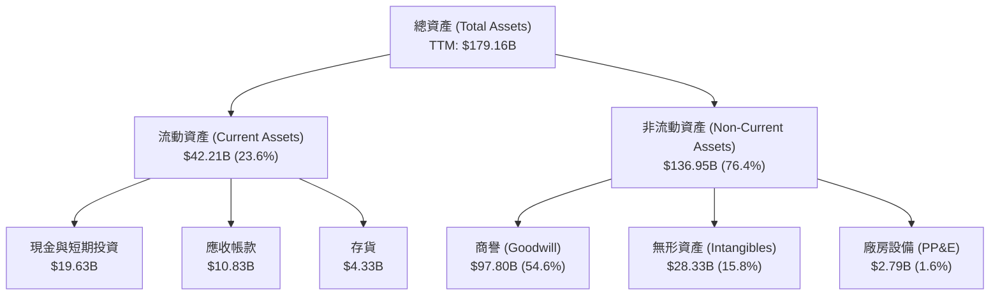

*資產結構分析*：
1. **極低的實體資產**：廠房設備（PP&E）僅 **$2.79B**，僅佔總資產的 1.6%。這證實了博通極致的 Fabless 模式，將高資本支出的晶圓製造與封裝外包，從而規避了半導體產能過剩的景氣循環風險。
2. **商譽與無形資產佔比高**：商譽（Goodwill）達 **$97.80B**（佔比 54.6%），這是 Hock Tan 過去十幾年來發動大規模併購（LSI, Broadcom, CA, Symantec, VMware）累積的成果。雖然商譽不面臨每年攤銷，但需面臨減損測試（Impairment Test）。鑑於收購標的均為行業龍頭且獲利強勁，減損風險極低。

### 4.2 流動性與償債能力指標

| 指標 | TTM | FY2025 | FY2024 | 行業安全標準 | 評估 |
|------|-----|--------|--------|--------------|------|
| **流動比率 (Current Ratio)** | **2.24** | 1.71 | 1.17 | > 1.5 | 🟢 優異，流動性大幅改善 |
| **速動比率 (Quick Ratio)** | **1.93** | 1.51 | 1.01 | > 1.0 | 🟢 優異，變現能力極強 |
| **存貨週轉天數 (DOH)** | **56.5 天** | 40.2 天 | 33.7 天 | < 75 天 | 🟢 健康，雖因 AI 備料略有上升 |
| **債務權益比 (Debt/Equity)** | **74.0%** | 80.1% | 99.8% | < 100% | 🟢 槓桿率持續下降 |

### 4.3 債務結構與健康診斷

```
╔══════════════════════════════════════════════════════════════════╗
║                    博通債務健康診斷 (TTM)                        ║
╠══════════════════════════════════════════════════════════════════╣
║                                                                  ║
║  總債務 (Total Debt)：$64.91B  ██████████████████░░░░░  評語     ║
║  總現金 (Total Cash)：$19.63B  █████░░░░░░░░░░░░░░░░░░  評語     ║
║  淨債務 (Net Debt)：  $45.28B  ████████████░░░░░░░░░░░  安全     ║
║                                                                  ║
║  Net Debt / EBITDA： 1.08x   🟢 遠低於警戒線 (3.0x)              ║
║  利息保障倍數：      10.4x   🟢 營運利潤輕鬆覆蓋利息支出         ║
║  債務評級：          BBB/Baa2 穩定 (投資級)                      ║
║                                                                  ║
╚══════════════════════════════════════════════════════════════════╝
```

*債務分析*：
收購 VMware 讓博通的總債務在 FY2024 攀升。然而，博通展現了驚人的去槓桿能力：總債務已從高點回落至當前的 **$64.91B**，配合 TTM EBITDA 的大幅增長，**Net Debt/EBITDA 已降至 1.08x**。這意味著博通只需約 1 年的 EBITDA 即可還清所有淨債務，債務風險已基本解除。

---

## 5. 現金流量深度分析

自由現金流（Free Cash Flow）是博通投資論點的靈魂。博通不是一家單純追求營收成長的科技股，而是一家**以自由現金流為核心驅動力的資本配置機器**。

### 5.1 現金流量瀑布圖

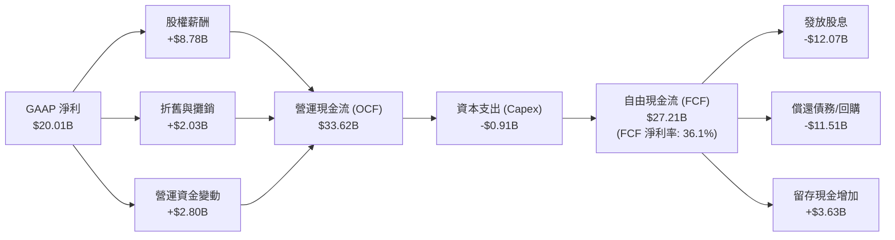

### 5.2 FCF 轉換率與含金量

| 指標 (Billion) | FY2022 | FY2023 | FY2024 | FY2025 | TTM |
|----------------|--------|--------|--------|--------|-----|
| **營運現金流 (OCF)** | $16.74B | $18.09B | $19.96B | $27.54B | **$33.62B** |
| **資本支出 (Capex)** | -$0.42B | -$0.45B | -$0.55B | -$0.62B | **-$0.91B** |
| **自由現金流 (FCF)** | $16.31B | $17.63B | $19.41B | $26.91B | **$27.21B** |
| **FCF 淨利率** | 49.1% | 49.2% | 37.6% | 42.1% | **36.1%** |
| **FCF / GAAP 淨利** | **141.8%**| **125.2%**| **329.5%**| **116.3%**| **136.0%** |

*現金流深度解析*：
博通的 FCF 淨利率（FCF/Revenue）高達 **36.1%**。這意味著公司每收到 100 美元的營收，就有超過 36 美元轉化為可以自由支配的現金。這主要歸功於其極低的資本支出率（Capex/Revenue 僅 **1.2%**）。相比之下，台積電、Intel 等 IDM 或晶圓代工廠需將 30-50% 的營收再投資於資本支出，博通的商業模式在現金生成效率上具有壓倒性優勢。

### 5.3 自由現金流趨勢

```
╔══════════════════════════════════════════════════════════════════╗
║               博通年度自由現金流趨勢 (FY22 - TTM)                 ║
╠══════════════════════════════════════════════════════════════════╣
║                                                                  ║
║  FY2022  $16.31B  ██████████████░░░░░░░░░░░░░░░░░  FCF Margin:49%║
║  FY2023  $17.63B  ███████████████░░░░░░░░░░░░░░░░  FCF Margin:49%║
║  FY2024  $19.41B  █████████████████░░░░░░░░░░░░░░  FCF Margin:38%║
║  FY2025  $26.91B  ██═════════════════════════════  FCF Margin:42%║
║  TTM     $27.21B  ███████████████████████████████  FCF Margin:36%║
║                                                                  ║
║  📊 當前 FCF 收益率 (FCF Yield)：1.49% (Forward 預估 >4.5%)      ║
╚══════════════════════════════════════════════════════════════════╝
```

### 5.4 資本配置評估

博通的資本配置遵循嚴格的優先順序：
1. **內部研發與有機成長**：維持核心產品的技術領先。
2. **配發股息**：博通承諾將前一財年 FCF 的 **50%** 用於發放股息。TTM 支付股息達 **$12.07B**，展現對股東回報的重視。
3. **債務償還與 M&A**：剩餘現金優先用於償還併購產生的債務，快速降低財務槓桿，待資產負債表修復後，再發動下一輪大規模併購。

---

## 6. 獲利能力與資本效率

評估博通是否在為股東創造價值，最核心的指標是 **ROIC（投入資本回報率）是否顯著高於 WACC（加權平均資本成本）**。

### 6.1 資本效率指標趨勢

| 指標 | TTM | FY2025 | FY2024 | 產業平均 (半導體) | 評估 |
|------|-----|--------|--------|-------------------|------|
| **ROE (股東權益報酬率)** | **37.3%** | 34.2% | 11.3% | ~18.0% | 🟢 遠超同行，股東回報極佳 |
| **ROA (資產報酬率)** | **12.1%** | 13.5% | 3.6% | ~8.5% | 🟢 優秀，資產利用效率高 |
| **ROIC (投入資本回報率)** | **24.9%** | 21.2% | 9.8% | ~12.0% | 🟢 核心資本效率極高 |

### 6.2 ROIC vs WACC 分析（核心價值創造判斷）

為了精確評估博通的經濟價值創造（Economic Value Added, EVA），我們對其 WACC 與 ROIC 進行嚴格估算：

```
╔══════════════════════════════════════════════════════════════════╗
║                博通 ROIC vs WACC 深度分析 (TTM)                  ║
╠══════════════════════════════════════════════════════════════════╣
║                                                                  ║
║  WACC 估算：                                                     ║
║  ├── 無風險利率 (10Y 美債)：  4.20%                              ║
║  ├── 市場風險溢酬 (ERP)：     5.00%                              ║
║  ├── Beta 係數：              1.46                               ║
║  ├── 股權成本 (Ke) = 4.2% + 1.46 × 5.0% = 11.50%                 ║
║  ├── 債務成本 (稅後 Kd)：     4.85% × (1 - 3.8%) = 4.67%         ║
║  ├── 資本結構：股權價值 96.6% ｜ 債務價值 3.4%                   ║
║  └── ✅ 加權平均資本成本 (WACC) ≈ 11.27%                          ║
║                                                                  ║
║  ROIC 估算：                                                     ║
║  ├── NOPAT = TTM 營運利潤 $32.75B × (1 - 3.8%) = $31.51B         ║
║  ├── 投入資本 = 股東權益 $81.29B + 總債務 $64.91B - 現金 $19.63B ║
║  │            = $126.57B                                         ║
║  └── ✅ 投入資本回報率 (ROIC) ≈ 24.90%                            ║
║                                                                  ║
║  ★ 經濟價值增加 (EVA) = ROIC - WACC = +13.63%                    ║
║                                                                  ║
║  ROIC  24.90% ▓▓▓▓▓▓▓▓▓▓▓▓▓▓▓▓▓▓▓▓▓▓▓▓░░░░░░  🟢              ║
║  WACC  11.27% ▓▓▓▓▓▓▓▓▓▓░░░░░░░░░░░░░░░░░░░░  ──              ║
║  EVA   +13.63% ██████████████░░░░░░░░░░░░░░░░░  🏆 強力創造價值  ║
║                                                                  ║
║  📊 結論：ROIC 達 WACC 的 2.21 倍，博通正以極高效率創造股東價值  ║
╚══════════════════════════════════════════════════════════════════╝
```

### 6.3 杜邦三因素分解

透過杜邦分析，我們可以拆解博通 ROE 的驅動泉源：

$$\text{ROE} = \text{淨利率} \times \text{資產週轉率} \times \text{財務槓桿（權益乘數）}$$

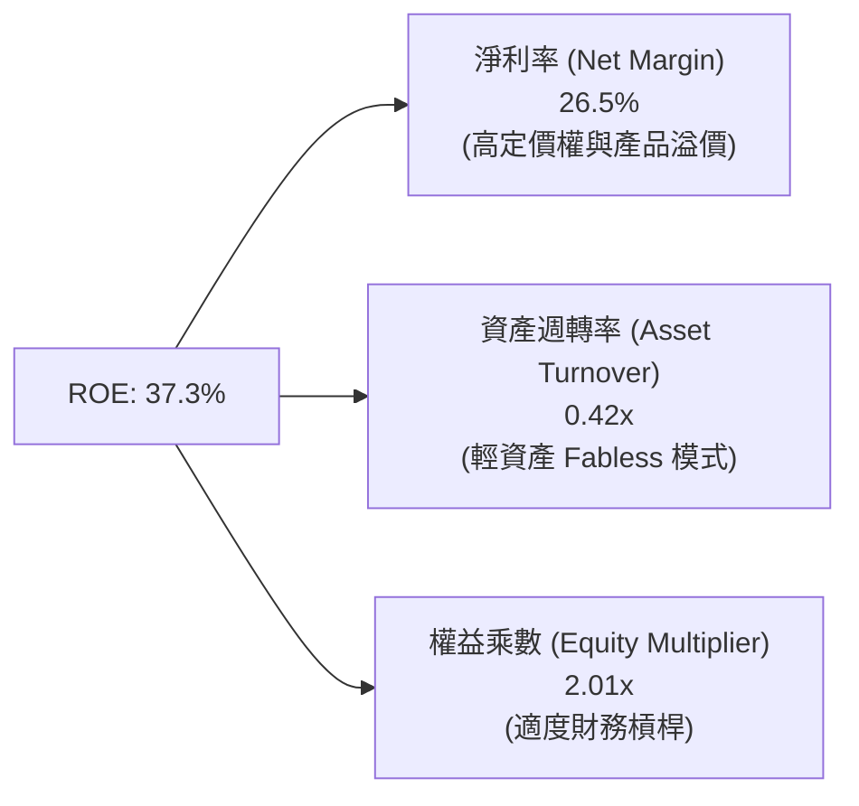

*杜邦分析洞察*：
博通高 ROE 的核心驅動要素是 **高達 26.5% 的 TTM 實際淨利率**（扣除折舊攤銷影響前更高），而非依賴過度財務槓桿（權益乘數 2.01x 處於安全區間）或高週轉。這證實了博通的獲利模式具有極高的「護城河屬性」，靠的是**產品的不可替代性與極高的毛利空間**。

---

## 7. 估值深度分析

當前市場對博通最大的分歧在於其 Trailing P/E（約 64.0x）看似高企。然而，這是一個典型的**會計幻覺**。由於併購 VMware 產生的高額無形資產攤銷壓低了 GAAP 淨利，若以 Forward 指標或現金流指標來看，博通的估值極具吸引力。

### 7.1 同業估值與基本面比較

我們選取 NVIDIA（AI 晶片霸主）、Marvell（客製化 ASIC 主要競爭對手）與 Qualcomm（無線通信巨頭）進行多維度比較：

| 估值與基本面指標 | **博通 (AVGO)** | **NVIDIA (NVDA)** | **Marvell (MRVL)** | **Qualcomm (QCOM)** | AVGO 相對評估 |
|-----------------|-----------------|-------------------|--------------------|---------------------|---------------|
| **Trailing P/E** | 64.0x | 68.5x | 55.2x | 21.3x | 🟡 處於合理區間 |
| **Forward P/E** | **19.8x** | **32.4x** | **28.1x** | **15.2x** | 🟢 **極具性價比** |
| **PEG Ratio** | **0.45** | 0.95 | 1.25 | 1.10 | 🟢 **嚴重被低估** |
| **P/S Ratio** | 24.2x | 31.5x | 18.2x | 5.8x | 🟡 反映高軟體佔比 |
| **EV / EBITDA** | 46.3x | 52.1x | 41.2x | 16.5x | 🟡 處於合理區間 |
| **毛利率** | **76.3%** | 75.2% | 61.5% | 55.8% | 🟢 **行業第一** |
| **營業利益率** | **49.0%** | 54.1% | 24.5% | 29.2% | 🟢 **極其優異** |

*同業比較總結*：
相較於 NVIDIA，博通的 Forward P/E（19.8x）便宜了近 39%，而其 PEG 僅為 **0.45**（通常 PEG < 1.0 被視為低估），這主要因為市場尚未完全將 VMware 整合後的利潤爆發計入預期。

### 7.2 歷史估值區間分析（Forward P/E）

```
╔══════════════════════════════════════════════════════════════════╗
║               博通 Forward P/E 歷史區間與當前位置                ║
+------------------------------------------------------------------+
║                                                                  ║
║  [12x] ─── [15x] ─── [19.8x 當前] ─────── [25x] ─── [30x 歷史高] ║
║                       ▲                                          ║
║                       │                                          ║
║                 歷史估值中位數                                   ║
║                                                                  ║
║  📊 評估：當前 19.8x Forward P/E 接近歷史估值中位數下限，安全邊際高║
╚══════════════════════════════════════════════════════════════════╝
```

### 7.3 情境目標價（12個月展望）

基於不同的營收成長與利潤率假設，我們構建了三種情境的估值模型：

| 情境 | 營收 CAGR (3年) | 營業利潤率 | 退出倍數 (Forward P/E) | 隱含目標價 | 潛在漲跌幅 | 機率權重 |
|------|-----------------|------------|------------------------|------------|------------|----------|
| 🔴 **悲觀情境** | 10.0% | 45.0% | 15.0x | **$315.00** | -18.0% | 15% |
| 🟡 **基準情境** | **20.0%** | **50.0%** | **25.0x** | **$523.73** | **+36.4%** | **65%** |
| 🟢 **樂觀情境** | 30.0% | 55.0% | 28.0x | **$650.00** | +69.3% | 20% |

*估值倍數選擇說明*：
在基準情境中，我們採用 **25.0x Forward P/E**。這非常合理，因為博通不僅僅是一家半導體公司，其軟體業務佔比已達 40%，理應享有介於半導體（平均 28x）與 SaaS 軟體（平均 30-35x）之間的估值溢價。

### 7.4 DCF 敏感性分析（目標價矩陣）

基於永續成長率（Terminal Growth Rate）與 WACC 的變動，我們進行了 6 格 DCF 敏感性分析：

| WACC \ 永續成長率 | 2.0% | **2.5% (基準)** | 3.0% |
|------------------|------|-----------------|------|
| **8.5%** | $545.20 (+41.9%) | $582.10 (+51.6%) | $625.40 (+62.8%) |
| **9.2% (基準)** | $490.50 (+27.7%) | **$523.73 (+36.4%)** | $560.80 (+46.0%) |
| **10.0%** | $435.10 (+13.3%) | $462.30 (+20.4%) | $492.50 (+28.2%) |

*DCF 結論*：在基準 WACC 9.2% 與永續成長率 2.5% 的假設下，DCF 公允價值為 **$523.73**，與 Forward P/E 估值高度吻合。

---

## 8. 成長催化劑

博通未來的成長並非依賴單一產品，而是由 **AI 基礎設施建置** 與 **企業軟體雲端轉型** 兩大引擎共同驅動。

### 8.1 成長催化劑時間軸

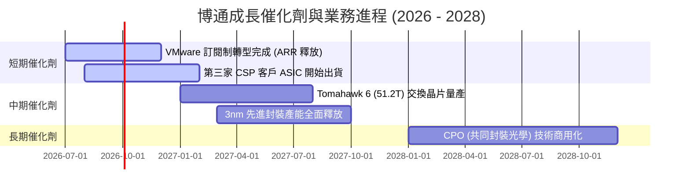

### 8.2 TAM（潛在市場規模）分析

```
╔══════════════════════════════════════════════════════════════╗
║                 博通核心業務 TAM 與滲透率 (2026)             ║
╠══════════════════════════════════════════════════════════════╣
║                                                              ║
║  1. AI 客製化 ASIC 市場：                                    ║
║     ├── 全球 TAM： ~$35.0B                                   ║
║     └── 博通份額： ~62% (營收 ~$21.7B)                        ║
║                                                                  ║
║  2. 高端乙太網絡交換晶片：                                   ║
║     ├── 全球 TAM： ~$12.0B                                   ║
║     └── 博通份額： ~75% (營收 ~$9.0B)                         ║
║                                                                  ║
║  3. 混合雲虛擬化軟體 (VMware)：                              ║
║     ├── 全球 TAM： ~$45.0B                                   ║
║     └── 博通份額： ~40% (營收 ~$18.0B)                        ║
║                                                                  ║
╚══════════════════════════════════════════════════════════════╝
```

### 8.3 成長驅動力結構圖

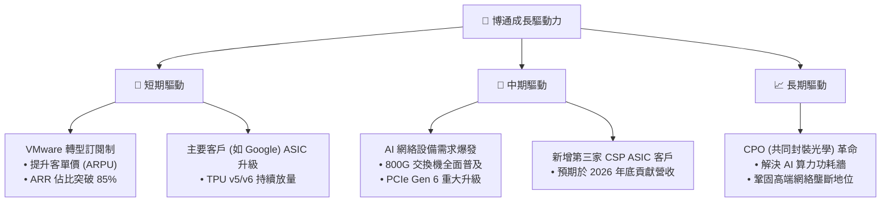

---

## 9. 風險矩陣

儘管基本面極為強勁，投資博通仍需關注以下結構性風險。

### 9.1 風險評分矩陣

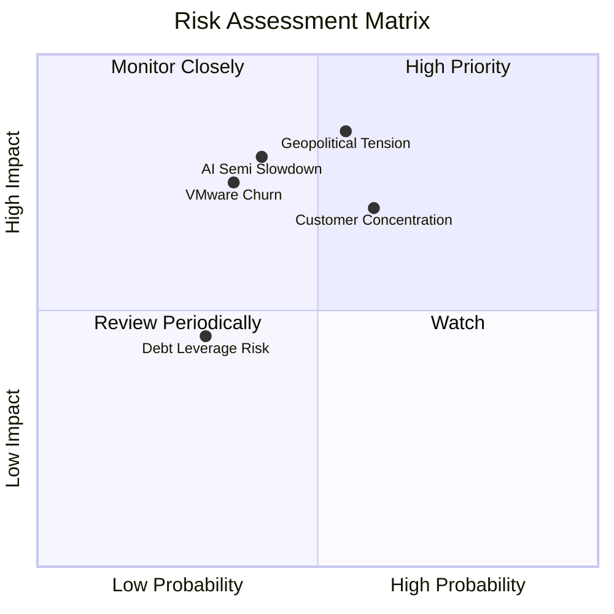

### 9.2 風險清單詳細分析

| # | 風險項目 | 發生機率 | 財務衝擊 | 風險評分 | 緩解措施與觀察指標 |
|---|----------|----------|----------|----------|--------------------|
| 1 | 🔴 **客戶集中度風險** | 高 (60%) | 高 (-15% 營收) | **7.5 / 10** | **觀察指標**：前兩大客戶的資本支出指引。博通正積極開拓 Meta、ByteDance 等新 ASIC 客戶以分散風險。 |
| 2 | 🟡 **VMware 客戶流失** | 中 (35%) | 中 (-5% 軟體營收) | **5.0 / 10** | **觀察指標**：VMware 續約率。博通聚焦於財富 500 強核心客戶，這部分客戶對虛擬化軟體有強烈依賴，轉換成本極高。 |
| 3 | 🟡 **地緣政治與供應鏈風險** | 中 (55%) | 高 (-20% 半導體營收) | **6.5 / 10** | **觀察指標**：台積電先進封裝產能分配。博通正與 ASE（日月光）等封測廠密切合作，並評估在美/歐建立備用封裝供應鏈。 |

---

## 10. 投資建議

基於詳盡的基本面與估值分析，博通（AVGO）是當前美股科技板塊中，**兼具 AI 成長爆發力與基礎設施軟體防禦性**的極佳標的。

### 10.1 最終綜合評級

```
╔══════════════════════════════════════════════════════════════╗
║                    博通綜合投資評級                          ║
╠══════════════════════════════════════════════════════════════╣
║ 基本面強度  9.0/10 ▓▓▓▓▓▓▓▓▓▓▓▓▓▓▓▓▓▓░░  ★★★★★           ║
║ 成長動能    8.5/10 ▓▓▓▓▓▓▓▓▓▓▓▓▓▓▓▓▓░░░  ★★★★☆           ║
║ 獲利品質    9.5/10 ▓▓▓▓▓▓▓▓▓▓▓▓▓▓▓▓▓▓▓░  ★★★★★           ║
║ 財務健康    8.0/10 ▓▓▓▓▓▓▓▓▓▓▓▓▓▓▓▓░░░░  ★★★★☆           ║
║ 估值合理性  9.0/10 ▓▓▓▓▓▓▓▓▓▓▓▓▓▓▓▓▓▓░░  ★★★★★           ║
╠══════════════════════════════════════════════════════════════╣
║ 綜合評分    8.8/10 ▓▓▓▓▓▓▓▓▓▓▓▓▓▓▓▓▓░░░  🟢 強烈買入     ║
╚══════════════════════════════════════════════════════════════╝
```

### 10.2 目標價與隱含報酬率

| 情境 | 機率權重 | 目標價 | 當前股價 | 隱含報酬率 |
|------|----------|--------|----------|------------|
| **悲觀情境** | 15% | $315.00 | $384.05 | -18.0% |
| **基準情境** | **65%** | **$523.73** | **$384.05** | **+36.4%** |
| **樂觀情境** | 20% | $650.00 | $384.05 | +69.3% |
| **加權預期目標價** | **100%** | **$517.68** | **$384.05** | **+34.8%** |

### 10.3 買入時機與觸發因素

```
╔══════════════════════════════════════════════════════════════════╗
║                  ✅ 買入觸發因素 Checklist                      ║
╠══════════════════════════════════════════════════════════════════╣
║                                                                  ║
║  立即買入觸發條件（多數符合）：                                  ║
║  ✅ 股價回檔至 $360 - $380 區間（對應 Forward P/E < 19x）        ║
║  ✅ VMware 季度營收貢獻超越 $4.5B，證實訂閱制轉型成功             ║
║  ✅ AI 半導體單季營收 YoY 成長率維持 >40%                        ║
║                                                                  ║
║  加碼觸發條件（出現以下任一）：                                  ║
║  ☐ 宣佈簽署第三家超大型雲端服務商（CSP）之客製化 ASIC 訂單       ║
║  ☐ 淨債務/EBITDA 降至 1.0x 以下，宣佈重啟股份回購計劃           ║
║                                                                  ║
║  減碼/停損觸發條件（出現以下任一）：                             ║
║  ☐ 核心客戶（如 Google）宣佈大幅縮減自研 ASIC 預算               ║
║  ☐ 營業利益率連續兩季跌破 40%                                    ║
║                                                                  ║
╚══════════════════════════════════════════════════════════════════╝
```

### 10.4 投資人適配度分析

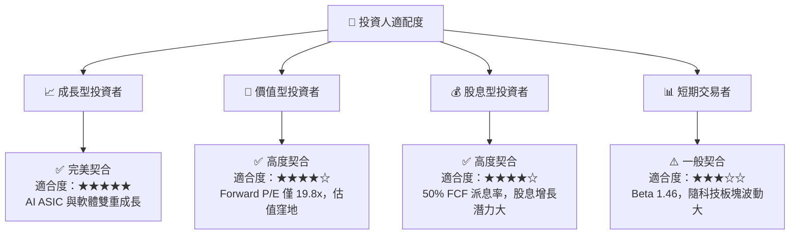

### 10.5 每季財報監控清單（Quarterly Watch List）

為了持續追蹤投資假設是否成立，機構投資人應在每季財報中重點監控以下指標：

| 監控指標 | 基準值 (Q2 2026) | 觸發加碼門檻 | 觸發減碼/警示門檻 | 監控意義 |
|----------|------------------|--------------|-------------------|----------|
| **半導體部門營收 YoY** | +47.9% | > 45.0% | < 25.0% | 評估 AI 需求是否持續 |
| **VMware 季度營收** | ~$4.80B | > $5.20B | < $4.00B | 評估訂閱制轉型進度 |
| **整體毛利率 (Non-GAAP)** | 76.3% | > 78.0% | < 72.0% | 評估定價權與產品組合變化 |
| **營業利益率 (GAAP)** | 49.0% | > 52.0% | < 42.0% | 評估 VMware 整合與成本控制 |
| **單季自由現金流 (FCF)** | $10.26B | > $11.00B | < $8.00B | 評估股息配發與去槓桿能力 |

### 10.6 反面論證：什麼會證明論點錯誤（What Would Change My Mind）

```
╔══════════════════════════════════════════════════════════════════╗
║              ⚠️ 論點失效條件 (Disconfirming Evidence)            ║
╠══════════════════════════════════════════════════════════════════╣
║  本投資論點在下列情況成立時應重新檢視或果斷退出：                ║
║                                                                  ║
║  ☐ 核心 AI 客戶（Google/Meta）連續兩季削減 ASIC 訂單 >20%        ║
║  ☐ 營業利益率因 VMware 客戶流失，連續兩季低於 42%               ║
║  ☐ 自由現金流轉化率（FCF / Net Income）連續兩季跌破 100%         ║
║  ☐ ROIC 跌破 WACC（即資本效率低於 11.27%），開始摧毀股東價值     ║
║  ☐ 執行長 Hock Tan 宣佈退休，且接班人改變現有資本配置邏輯        ║
║                                                                  ║
╚══════════════════════════════════════════════════════════════════╝
```

---

> **免責聲明**：本報告僅供學術與投資研究參考，不構成任何具體的買賣建議。投資人應獨立評估風險，並對其投資決策承擔全部責任。