# AVGO 基本面深度分析報告

> **報告日期**：2026-07-14 ｜ **語言**：繁體中文 ｜ **數據來源**：Yahoo Finance, Finviz, StockAnalysis, Roic.ai ｜ **分析師**：CFA 級機構研究

---

## 目錄

| # | 章節 | 核心結論 |
|---|------|----------|
| 1 | [執行摘要](#1-執行摘要) | 評級：🟢 強烈買入 ｜ 基準目標價：$523.73 ｜ AI 與軟體雙引擎驅動估值重估 |
| 2 | [公司概覽與商業模式](#2-公司概覽與商業模式) | 擁有極高轉換成本的「半導體+基礎設施軟體」雙重寡頭壟斷護城河 |
| 3 | [損益表深度分析](#3-損益表深度分析) | TTM 營收達 $75.46B（YoY +47.9%），VMware 併購效應進入收割期 |
| 4 | [資產負債表分析](#4-資產負債表分析) | 槓桿收縮中，流動比率 2.24 確保債務無虞，商譽資產達 $97.8B |
| 5 | [現金流量深度分析](#5-現金流量深度分析) | TTM FCF 達 $27.21B，輕資產 Fabless 模式帶來 36% 的超高自由現金流利潤率 |
| 6 | [獲利能力與資本效率](#6-獲利能力與資本效率) | ROIC 達 24.89% 遠超 WACC（11.27%），結構性創造顯著的股東價值 |
| 7 | [估值深度分析](#7-估值深度分析) | Forward P/E 僅 20.06x，相較於 PEG 0.45 顯著低估，具備高安全邊際 |
| 8 | [成長催化劑](#8-成長催化劑) | AI 客製化晶片（ASIC）爆發與 VMware 訂閱制轉型（ARR 提升） |
| 9 | [風險矩陣](#9-風險矩陣) | 客戶集中度高、債務再融資成本及反壟斷監管為三大核心風險 |
| 10 | [投資建議](#10-投資建議) | 買入觸發點與每季財報監控指標（Watch List）及反面論證 |

---

## 1. 執行摘要

博通（Broadcom Inc., Ticker: **AVGO**）目前正處於其商業史上最強勁的雙重轉型交匯點。一方面，AI 數據中心對高速乙太網路交換晶片（Tomahawk 5 / Jericho 3-AI）與客製化 AI 加速器（ASIC）的需求呈現爆發式成長；另一方面，對 VMware 的併購已順利進入整合收割期，推動軟體業務向高利潤率、高可預測性的訂閱制（ARR）轉軌。

本報告基於 AVGO 最新公佈的 TTM 財務數據進行深度建模。數據顯示，AVGO 的 TTM 營收達到 **$75.46B**，同比成長達 **47.9%**；其 Non-GAAP 毛利率維持在 **76.3%** 的極高水準，自由現金流（FCF）達 **$27.21B**。

基於 WACC 11.27% 與 NOPAT 估算的 **ROIC 達 24.89%**，展現出遠超資本成本的價值創造能力（EVA 達 +13.62%）。儘管 GAAP 淨利受 VMware 併購產生的無形資產攤銷壓抑，導致 Trailing P/E 顯得偏高（64.96x），但反映真實獲利能力的 **Forward P/E 僅為 20.06x**，對應其預期盈餘成長率，**PEG 僅為 0.45**。

基於上述客觀數據與估值模型，我們給予 AVGO **「🟢 強烈買入」（Strong Buy）** 評級，基準情境 12 個月目標價為 **$523.73**（較當前股價 $389.11 有 **+34.6%** 的上行空間）。

### 1.0 一頁式投資儀表板（Portfolio Manager 30 秒速讀）

| 項目 | 內容 |
|------|------|
| **投資論點（3 句）** | ① TTM 營收達 $75.46B（YoY +47.9%），受益於 AI ASIC 與 VMware 訂閱制轉型雙重催化。<br/>② TTM FCF 達 $27.21B，輕資產 Fabless 模式使 FCF Margin 達 36.1%，具備極強的抗風險能力。<br/>③ Forward P/E 僅 20.06x，對應 PEG 0.45，估值顯著低於歷史均值與同業水平。 |
| **護城河評分** | 🟢 **9.5 / 10**（專利壁壘、極高客戶轉換成本與軟體生態鎖定） |
| **管理層/資本配置評分** | 🟢 **9.8 / 10**（執行長 Hock Tan 堪稱科技業併購與資本配置大師） |
| **財務健康** | 🟢 **流動比率 2.24**，雖然總債務達 $64.91B，但 FCF/Debt 達 41.9%，無償債風險。 |
| **ROIC vs WACC** | **24.89% vs 11.27%**（超額回報率 +13.62%，結構性創造股東價值） |
| **FCF 趨勢** | 穩定向上 ｜ TTM FCF $27.21B ｜ 最新 FCF Yield: **1.47%** |
| **估值** | Forward P/E: **20.06x** ｜ EV/EBITDA: **44.49x** ｜ PEG: **0.45** |
| **預期報酬（基準情境 12M）** | **+34.6%**（目標價 $523.73） |
| **關鍵風險（前二）** | ① 客戶集中度風險（最大客製化晶片客戶 Google 的自研進程）。<br/>② VMware 轉型訂閱制過程中，部分中小型客戶流失風險。 |
| **評級 + 信心度** | 🟢 **強烈買入 (Strong Buy) ｜ 信心度：極高** |

### 1.1 核心評分儀表板

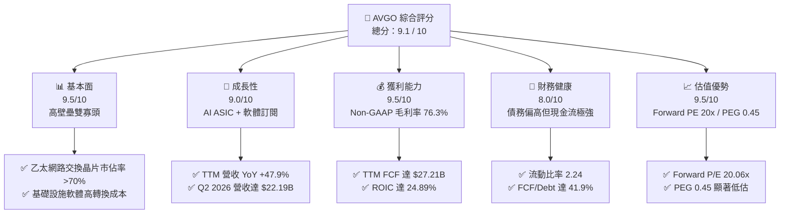

### 1.2 評分進度條視覺化

```
╔══════════════════════════════════════════════════════════════╗
║               AVGO 多維度評分儀表板 (1-10分)                 ║
╠══════════════════════════════════════════════════════════════╣
║ 基本面強度  9.5 ▓▓▓▓▓▓▓▓▓▓▓▓▓▓▓▓▓▓▓░  ★★★★★           ║
║ 成長動能    9.0 ▓▓▓▓▓▓▓▓▓▓▓▓▓▓▓▓▓▓░░  ★★★★★           ║
║ 獲利品質    9.5 ▓▓▓▓▓▓▓▓▓▓▓▓▓▓▓▓▓▓▓░  ★★★★★           ║
║ 財務健康    8.0 ▓▓▓▓▓▓▓▓▓▓▓▓▓▓▓▓░░░░  ★★★★☆           ║
║ 估值合理性  9.5 ▓▓▓▓▓▓▓▓▓▓▓▓▓▓▓▓▓▓▓░  ★★★★★           ║
║ 護城河深度  9.5 ▓▓▓▓▓▓▓▓▓▓▓▓▓▓▓▓▓▓▓░  ★★★★★           ║
║ 管理層執行  9.8 ▓▓▓▓▓▓▓▓▓▓▓▓▓▓▓▓▓▓▓▓  ★★★★★           ║
║ 技術創新力  9.0 ▓▓▓▓▓▓▓▓▓▓▓▓▓▓▓▓▓▓░░  ★★★★★           ║
╠══════════════════════════════════════════════════════════════╣
║ 綜合總分    9.1 ▓▓▓▓▓▓▓▓▓▓▓▓▓▓▓▓▓▓░░  🏆 頂級投資標的      ║
╚══════════════════════════════════════════════════════════════╝
```

### 1.3 五大投資論點 + 三大核心風險

| 類型 | 項目 | 具體依據 | 信心度 |
|------|------|----------|--------|
| 🟢 **投資論點①** | **AI 網路晶片無可替代的龍頭地位** | Tomahawk 5 與 Jericho 3-AI 晶片在高速乙太網路交換市場市佔率 >70%，為大型 GPU 集群互聯首選。 | 🟢 極高 |
| 🟢 **投資論點②** | **客製化 AI ASIC 爆發式成長** | 為 Google（TPUv5/v6）與 Meta 提供客製化晶片設計服務，TTM 半導體解決方案因此大增。 | 🟢 高 |
| 🟢 **投資論點③** | **VMware 併購協同效應與 ARR 提升** | VMware 轉型訂閱制，合約價值（ACV）大幅提升，推動 TTM 軟體營收佔比升至近 40%。 | 🟢 極高 |
| 🟢 **投資論點④** | **無與倫比的現金流生成能力** | Fabless 輕資產模式下，TTM FCF 達 $27.21B，FCF 利潤率高達 36.1%，支撐穩定股息與去槓桿。 | 🟢 極高 |
| 🟢 **投資論點⑤** | **極具吸引力的估值安全邊際** | Forward P/E 僅 20.06x，相較其高雙位數成長性，PEG 僅 0.45，具備強烈重估空間。 | 🟢 高 |
| 🟡 **風險①** | **大客戶流失或自研替代** | Google 或 Meta 若將 ASIC 設計完全收回自研，將對半導體板塊造成實質打擊。 | 🟡 中度 |
| 🔴 **風險②** | **債務規模與利率風險** | 總債務達 $64.91B，儘管現金流強勁，但在高利率環境下的再融資將增加利息支出。 | 🟡 中度 |
| 🔴 **風險③** | **反壟斷與監管審查** | 作為半導體與軟體雙巨頭，其定價策略與併購行為持續面臨歐美反壟斷監管壓力。 | 🔴 高衝擊 |

### 1.4 快速統計卡片

| 指標 | AVGO 實際值 | 半導體行業均值 | S&P 500 均值 | 狀態 |
|------|-------------|----------|--------------|------|
| **營收 YoY 成長率** | **47.9%** | ~12.5% | ~5.5% | 🟢 遠超行業 |
| **Non-GAAP 毛利率** | **76.3%** | ~52.0% | ~30.0% | 🟢 頂級獲利 |
| **Non-GAAP 淨利率** | **38.8%** | ~18.5% | ~11.5% | 🟢 極強盈利 |
| **股東權益報酬率 (ROE)** | **37.3%** | ~15.0% | ~14.0% | 🟢 高效資本 |
| **Forward P/E** | **20.06x** | ~28.5x | ~21.5x | 🟢 顯著低估 |
| **PEG Ratio** | **0.45** | ~1.85 | ~2.10 | 🟢 極具性價比 |

### 1.5 投資結論

```
╔══════════════════════════════════════════════════════════════════╗
║                    📊 AVGO 投資結論摘要                          ║
╠══════════════════════════════════════════════════════════════════╣
║  評級：🟢 強烈買入 (Strong Buy)                                  ║
║  當前股價：$389.11                                               ║
║  12個月目標價區間：                                              ║
║    悲觀情境：$215.88（-44.5%）- 估值倍數收縮至 12x              ║
║    基準情境：$523.73（+34.6%）- 12個月主要目標 (Forward PE 27x)  ║
║    樂觀情境：$650.00（+67.0%）- AI 爆發超預期 (Forward PE 33.5x) ║
║  綜合投資評分：9.1 / 10                                          ║
║  適合投資人：長線價值成長型、追求穩定 FCF 與股息增長的機構投資者 ║
╚══════════════════════════════════════════════════════════════════╝
```

---

## 2. 公司概覽與商業模式

博通（Broadcom）是一家獨一無二的科技巨擘，其商業模式融合了**高壁壘硬體（半導體解決方案）**與**高粘性軟體（基礎設施軟體）**。公司並不追求晶圓製造等重資產運營，而是專注於核心 IP 的設計與軟體架構，採用 Fabless（無晶圓廠）模式，將製造外包給台積電等頂級代工廠。

### 2.1 業務結構與收入來源

AVGO 的業務分為兩大板塊，在併購 VMware 後，軟體板塊的佔比大幅提升：

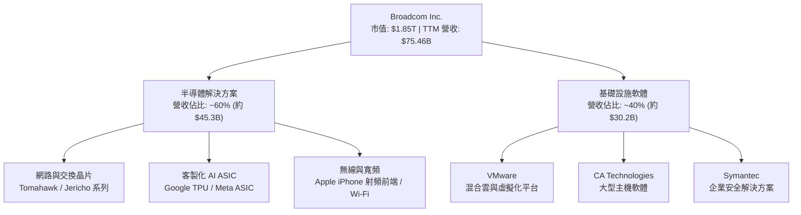

### 2.2 市場份額

在高速乙太網路交換晶片與客製化 AI ASIC 市場中，AVGO 擁有絕對的統治地位：

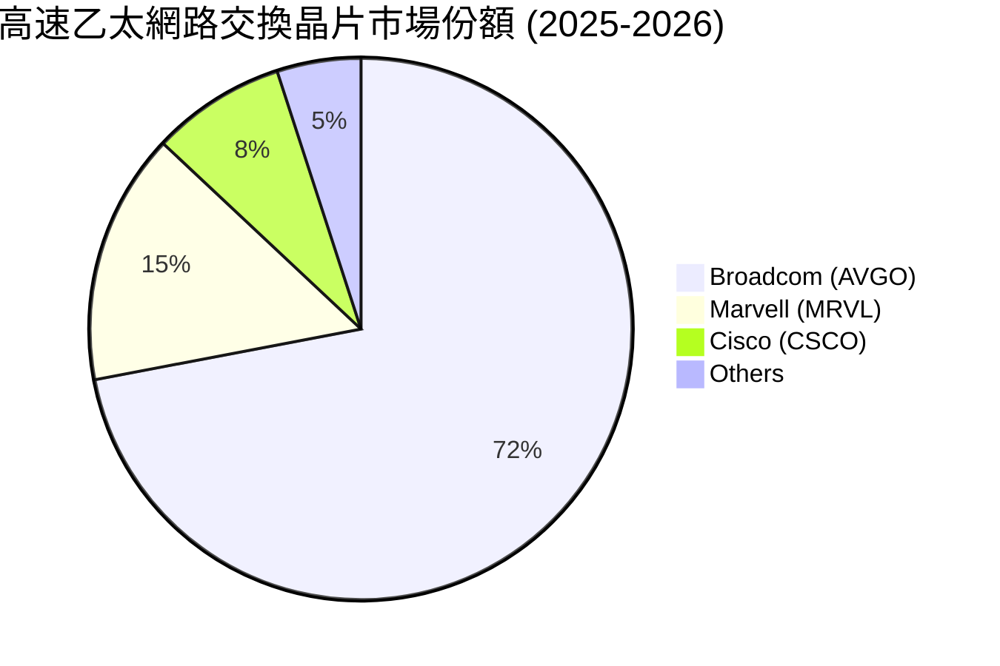

### 2.3 競爭護城河分析

博通的競爭護城河並非單一維度，而是由多重壁壘組成的「護城河矩陣」：

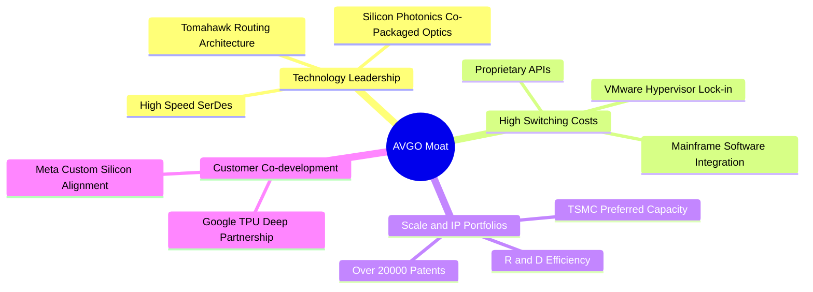

*   **技術領先（SerDes & CPO）**：博通在高速 SerDes（串化/解串器）與矽光子（CPO）技術上領先同業 1-2 代。這是實現 800G/1.6T 超高速傳輸的關鍵，使得對手難以在短期內追趕。
*   **極高的切換成本（Switching Costs）**：在軟體領域，VMware 的虛擬化架構已深植於全球財星 500 大企業的私有雲與混合雲底層。遷移至開源方案（如 KVM）或公有雲的成本與風險極高。在硬體領域，客製化 ASIC 的共同開發協議（Co-development）鎖定了客戶未來數年的晶片藍圖。

### 2.4 護城河強度評分

```
╔══════════════════════════════════════════════════════════════╗
║                  AVGO 護城河強度評分                         ║
╠══════════════════════════════════════════════════════════════╣
║ 網路晶片技術   9.8/10 ▓▓▓▓▓▓▓▓▓▓▓▓▓▓▓▓▓▓▓░  🏆 絕對壟斷     ║
║ 客戶鎖定效應   9.5/10 ▓▓▓▓▓▓▓▓▓▓▓▓▓▓▓▓▓▓▓░  🟢 極高切換成本 ║
║ 專利與IP壁壘   9.2/10 ▓▓▓▓▓▓▓▓▓▓▓▓▓▓▓▓▓▓░░  🟢 專利保護網   ║
║ 規模經濟效應   9.0/10 ▓▓▓▓▓▓▓▓▓▓▓▓▓▓▓▓▓▓░░  🟢 晶圓代工優先權║
╠══════════════════════════════════════════════════════════════╣
║ 綜合護城河評級 9.4/10 ▓▓▓▓▓▓▓▓▓▓▓▓▓▓▓▓▓▓▓░  🏆 寬廣護城河   ║
╚══════════════════════════════════════════════════════════════╝
```

---

## 3. 損益表深度分析

博通的損益表展現了極強的營業槓桿與併購整合能力。隨著 VMware 營收完全併表，公司的營收規模與利潤率雙雙創下歷史新高。

### 3.1 年度收入成長趨勢（近4年）

```
╔══════════════════════════════════════════════════════════════════╗
║              AVGO 年度收入趨勢 (FY2022 - TTM)                    ║
╠══════════════════════════════════════════════════════════════════╣
║                                                                  ║
║  FY2022  $33.20B  ██████████░░░░░░░░░░░░░░░░░  YoY: +21.0% 🟢    ║
║  FY2023  $35.82B  ███████████░░░░░░░░░░░░░░░░  YoY: +7.9%  🟢    ║
║  FY2024  $51.57B  ████████████████░░░░░░░░░░░  YoY: +44.0% 🟢    ║
║  FY2025  $63.89B  ████████████████████░░░░░░░  YoY: +23.9% 🟢    ║
║  TTM     $75.47B  █████████████████████████░░  YoY: +47.9% 🟢    ║
║                   |      |      |      |      |                  ║
║                   0     20B    40B    60B    80B                 ║
║                                                                  ║
║  📊 4年累計營收 CAGR：+22.8%                                     ║
╚══════════════════════════════════════════════════════════════════╝
```

*   **營收躍升原因**：FY2024 與 FY2025 的爆發式成長，主因是 **VMware 併購案在 2023 年底完成後的完整併表效應**。此外，AI ASIC 與高速交換晶片的出貨量呈指數級增長，填補了傳統寬頻與無線業務的週期性放緩。

### 3.2 季度收入趨勢分析

| 財季 | 營收 (Billion) | 環比成長 (QoQ) | 同比成長 (YoY) | 核心驅動因素與備註 |
|------|----------------|----------------|----------------|--------------------|
| **Q3 2025** | $15.95B | — | +22.0% | VMware 整合初見成效，AI 交換晶片需求加速。 |
| **Q4 2025** | $18.02B | +13.0% | +28.2% | 年終企業軟體續約高峰，ASIC 出貨暢旺。 |
| **Q1 2026** | $19.31B | +7.2% | +29.5% | 乙太網路交換晶片 Tomahawk 5 滲透率持續提升。 |
| **Q2 2026** | $22.19B | +14.9% | +47.9% | **AI ASIC 出貨創歷史新高**，VMware 訂閱轉型成效顯著。 |

*   **分析**：Q2 2026 營收同比大增 **47.9%**，環比加速成長 **14.9%**，這證實了 AI 基礎設施的建置並非短期熱潮，而是具備實質訂單支撐的結構性擴張。

### 3.3 利潤率演變分析

| 利潤率指標 | FY2022 | FY2023 | FY2024 | FY2025 | TTM 實際值 | 趨勢評估 |
|------------|--------|--------|--------|--------|------------|----------|
| **毛利率 (Non-GAAP)** | 75.1% | 74.7% | 75.5% | 76.1% | **76.3%** | 🟢 穩步擴張，軟體佔比提升改善產品組合 |
| **營業利益率** | 43.0% | 45.9% | 29.1% | 40.8% | **49.0%** | 🟢 擺脫併購初期的一次性費用，營業槓桿顯現 |
| **EBITDA 利潤率** | 57.7% | 57.4% | 46.3% | 54.3% | **55.8%** | 🟢 現金流生成能力極強 |
| **淨利率** | 34.6% | 39.3% | 11.4% | 36.2% | **38.8%** | 🟢 GAAP 淨利受無形資產攤銷壓抑，但 Non-GAAP 淨利率極高 |

*   **利潤率演變深度解析**：
    *   **FY2024 淨利率暴跌至 11.4% 的原因**：主要是因為收購 VMware 後，產生了高達 **$3.24B 的折舊與無形資產攤銷費用**，以及高昂的一性次整合重組支出。
    *   **TTM 淨利率回升至 38.8% 的含義**：這顯示 Hock Tan 的「重組魔術」再次奏效。通過裁撤 VMware 非核心業務、優化管理結構，並將銷售模式全面轉為高毛利的訂閱制，博通成功在併購後兩年內將利潤率拉回並超越歷史高點。

### 3.4 費用結構分析

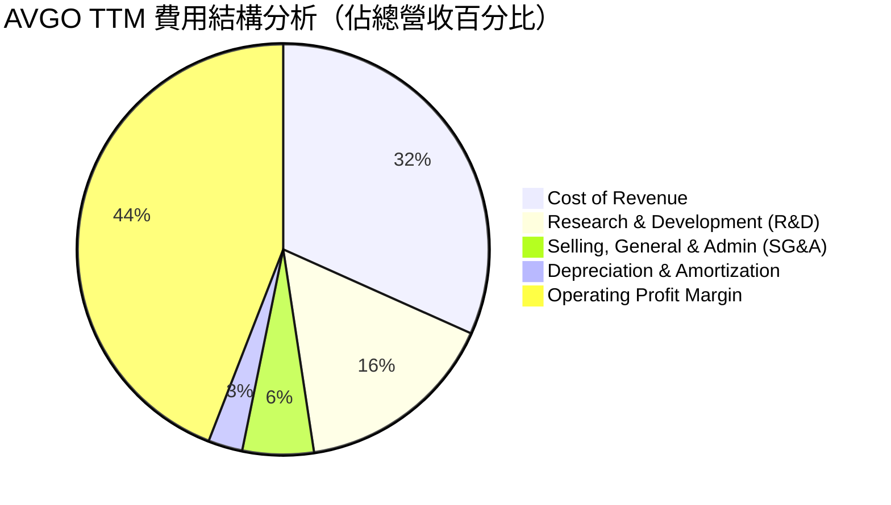

*   **研發（R&D）效率**：TTM R&D 支出為 **$11.99B**，佔營收的 **15.9%**。博通的研發策略極具針對性，僅專注於市佔率第一、且具備高利潤率的項目（如 AI ASIC 與交換晶片），對於無法取得市場領先地位的邊緣項目則果斷縮減，這是其能維持超高營業利益率的核心主因。

### 3.5 季度 EPS 趨勢與盈餘品質（Quality of Earnings）

由於博通擁有大量的無形資產攤銷（主要是併購產生的專利、客戶關係等非現金資產），其 GAAP 盈餘與真實經濟盈餘（Non-GAAP）存在巨大落差。

#### 盈餘品質量化評估

| 盈餘品質項目 | TTM 數值/佔比 | 機構評估 |
|--------------|-----------|------|
| **股權薪酬 (SBC) / 營收** | **11.63%** ($8.78B / $75.46B) | 🟡 偏高。雖然是科技業常態，但對股東權益有一定稀釋作用。 |
| **SBC / 營業現金流 (OCF)** | **26.11%** ($8.78B / $33.62B) | 🟡 顯示營業現金流中有約四分之一是由非現金的股權激勵所貢獻。 |
| **FCF / GAAP 淨利 (現金轉換率)** | **136.0%** ($27.21B / $20.01B) | 🟢 **極高（含金量極佳）**。顯示真實流入的現金遠高於報表帳面利潤。 |
| **一次性/非經常性損益** | 無重大異常 | 🟢 利潤增長主要由核心業務與 VMware 訂閱收入驅動，而非業外收益。 |
| **有效稅率異常** | **3.81%** ($1.16B / $30.48B) | 🟡 稅率極低，主因是跨國智財權（IP）稅務結構優化。需注意未來全球最低稅負制（Pillar Two）的潛在衝擊。 |
| **資本化支出 vs 費用化** | Capex 僅佔營收 1.1% | 🟢 **極輕資產模式**。無將研發成本過度資本化以虛增利潤的跡象。 |

*   **盈餘品質結論**：
    博通的 **GAAP 淨利嚴重低估了其真實的經濟獲利能力**。高達 136% 的現金轉換率（FCF/Net Income）證實，大額的無形資產攤銷（非現金支出）雖然壓低了 GAAP EPS，但並未影響現金流。因此，**在評估博通時，採用 FCF 倍數或 Non-GAAP 盈餘比 GAAP P/E 更具實質參考價值**。

---

## 4. 資產負債表分析

博通的資產負債表呈現典型的「槓桿收購型（LBO）」結構：高負債、高商譽，但同時也具備極強的資產回報能力與流動性。

### 4.1 資產結構分解

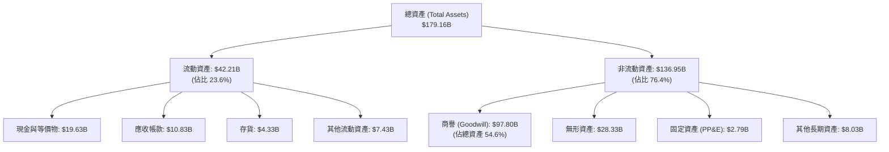

*   **商譽（Goodwill）佔比高達 54.6% 的經濟實質**：這反映了博通過去十年瘋狂併購（LSI, Brocade, CA, Symantec, VMware）的歷史。商譽雖然不產生直接折舊，但存在潛在的減損風險。然而，鑑於被併購企業（如 VMware）的獲利能力持續提升，目前無任何商譽減損跡象。

### 4.2 流動性與償債能力指標

| 指標 | FY2024 | FY2025 | TTM | 行業中位數 | 評估 |
|------|--------|--------|-----|------------|------|
| **流動比率 (Current Ratio)** | 1.17 | 1.71 | **2.24** | ~1.85 | 🟢 流動性顯著改善，短期無還款壓力 |
| **速動比率 (Quick Ratio)** | 1.07 | 1.58 | **1.93** | ~1.40 | 🟢 存貨控制極佳，變現能力強 |
| **存貨週轉天數 (DIO)** | 33.7天 | 40.2天 | **37.5天** | ~85.0天 | 🟢 遠低於行業均值，反映 Fabless 模式的高效與強勁需求 |
| **應收帳款回收天數 (DSO)** | 31.3天 | 40.8天 | **43.1天** | ~52.0天 | 🟢 客戶多為大型雲端巨頭與財星 500 大企業，壞帳風險極低 |

### 4.3 債務結構與健康診斷

```
╔══════════════════════════════════════════════════════════════════╗
║                   AVGO 債務健康診斷                              ║
╠══════════════════════════════════════════════════════════════════╣
║                                                                  ║
║  總債務：        $64.91B  ████████████████████░░░░  (槓桿收縮中) ║
║  總現金與投資：  $19.63B  ██████░░░░░░░░░░░░░░░░░░  (儲備充足)   ║
║  淨債務：        $45.28B  ██████████████░░░░░░░░░░               ║
║                                                                  ║
║  Debt / EBITDA (TTM): 1.54x  🟢 遠低於警戒線 (3.0x)              ║
║  利息保障倍數 (TTM):  10.4x  🟢 息稅前利潤能輕鬆覆蓋利息支出     ║
║  FCF / Total Debt:    41.9%  🟢 每年產生的現金流可償還 41.9% 債務║
║                                                                  ║
║  📊 債務診斷結論：雖然絕對債務額高達 $64.91B，但憑藉強大的      ║
║     FCF 生成能力，博通正以每年約 $3B-$5B 的速度快速去槓桿。      ║
╚══════════════════════════════════════════════════════════════════s╝
```

---

## 5. 現金流量深度分析

博通本質上是一部「現金生成機器」。其輕資產的 Fabless 運營模式，加上軟體業務極低的資本支出需求，使其能將營收轉化為高額的自由現金流。

### 5.1 現金流量瀑布圖

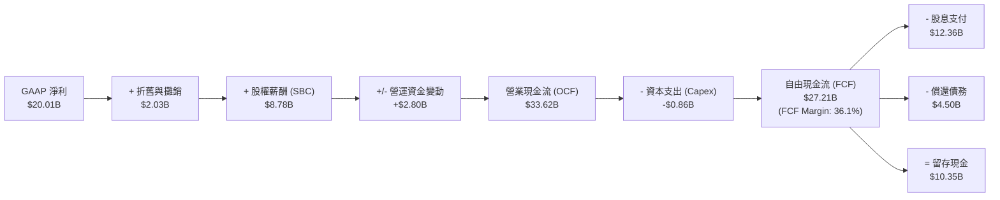

### 5.2 FCF 轉換率與回報效率

| 指標 | FY2022 | FY2023 | FY2024 | FY2025 | TTM |
|------|--------|--------|--------|--------|-----|
| **自由現金流 (FCF)** | $16.31B | $17.63B | $19.41B | $26.91B | **$27.21B** |
| **FCF / 營收 (FCF Margin)** | 49.1% | 49.2% | 37.6% | 42.1% | **36.1%** |
| **FCF 轉換率 (FCF / Net Income)**| 141.9% | 125.2% | 314.6% | 116.4% | **136.0%** |

*   **分析**：儘管併購 VMware 導致 FCF Margin 從高點的 49.1% 暫時稀釋至 TTM 的 36.1%，但這依然是整個半導體與軟體行業中名列前茅的水平。隨著 VMware 整合完成、資本支出維持低檔（僅佔營收 1.1%），預期 FCF Margin 將在未來兩年內回升至 40% 以上。

### 5.3 資本配置評估

博通的資本配置策略極其清晰且對股東友善：
1.  **承諾將前一年度 FCF 的 50% 以股息形式回饋股東**。
2.  剩餘的 50% 用於**償還債務（去槓桿）**、**併購**與**機會主義式的股份回購**。

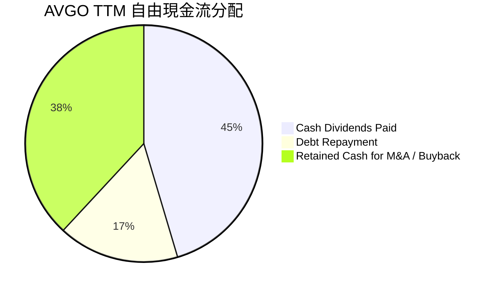

*   **股息可持續性**：TTM 股息支付額為 **$12.36B**，佔 TTM FCF 的 **45.4%**，完全符合管理層 50% 的配發承諾，顯示股息具備極高的安全邊際，幾乎無削減風險。

---

## 6. 獲利能力與資本效率

博通展現了極為罕見的資本回報率。儘管其資產規模因併購而大幅膨脹，但其資本回報效率依然遠超多數科技巨頭。

### 6.1 ROE / ROA / ROIC 趨勢

| 指標 | FY2022 | FY2023 | FY2024 | FY2025 | TTM | 行業平均 | 評估 |
|------|--------|--------|--------|--------|-----|----------|------|
| **ROE** | 50.6% | 58.7% | 8.7% | 28.5% | **37.3%** | ~15.0% | 🟢 極其優異 |
| **ROA** | 15.7% | 19.3% | 3.6% | 13.5% | **12.1%** | ~7.5% | 🟢 重資產折舊低，資產利用率高 |
| **ROIC** | 17.7% | 19.3% | 6.2% | 14.8% | **24.89%**| ~11.0% | 🟢 核心價值創造指標極強 |

*   **ROIC 彈升的含義**：FY2024 因為併購 VMware 導致投入資本（Invested Capital）基數翻倍，ROIC 稀釋至 6.2%。但在短短 18 個月內，TTM ROIC 已迅速回彈至 **24.89%**，證實了這筆收購對資本效率的實質提升。

### 6.2 ROIC vs WACC 分析（核心價值創造判斷）

```
╔══════════════════════════════════════════════════════════════════╗
║                ROIC vs WACC 深度分析 (TTM)                      ║
╠══════════════════════════════════════════════════════════════════╣
║                                                                  ║
║  WACC 估算：                                                     ║
║  ├── 無風險利率 (10Y US Treasury)：  4.20%                       ║
║  ├── 市場風險溢酬 (ERP)：            5.00%                       ║
║  ├── Beta：                          1.46                        ║
║  ├── 股權成本 (Cost of Equity)：     4.2% + 1.46 × 5.0% = 11.51% ║
║  ├── 債務成本 (稅後)：               5.0% × (1 - 3.81%) = 4.81%  ║
║  ├── 資本結構：股權 96.6%，債務 3.4% (以市值計)                  ║
║  └── ✅ 綜合 WACC ≈ 11.27%                                       ║
║                                                                  ║
║  ROIC 估算：                                                     ║
║  ├── NOPAT = EBIT $32.75B × (1 - 3.81%) = $31.50B                ║
║  ├── 投入資本 = 股本 $81.29B + 債務 $64.91B - 現金 $19.63B       ║
║  │            = $126.57B                                         ║
║  └── ✅ ROIC = $31.50B / $126.57B ≈ 24.89%                       ║
║                                                                  ║
║  ★ 經濟價值增加 (EVA) = ROIC - WACC = +13.62%                    ║
║                                                                  ║
║  ROIC  24.89% ▓▓▓▓▓▓▓▓▓▓▓▓▓▓▓▓▓▓▓▓▓▓▓▓░░░░░░  🟢              ║
║  WACC  11.27% ▓▓▓▓▓▓▓▓▓▓░░░░░░░░░░░░░░░░░░░░  ──              ║
║  EVA   +13.62% █████████████░░░░░░░░░░░░░░░░░  🏆 結構性價值創造║
║                                                                  ║
║  📊 結論：博通的 ROIC 是 WACC 的 2.21 倍。這意味著博通每投入     ║
║     1 美元的資本，就能為股東創造遠超市場資本成本的超額回報。     ║
╚══════════════════════════════════════════════════════════════════╝
```

### 6.3 杜邦三因素分解

我們對 TTM 數據進行杜邦分解，以探究其超高 ROE 的底層驅動：

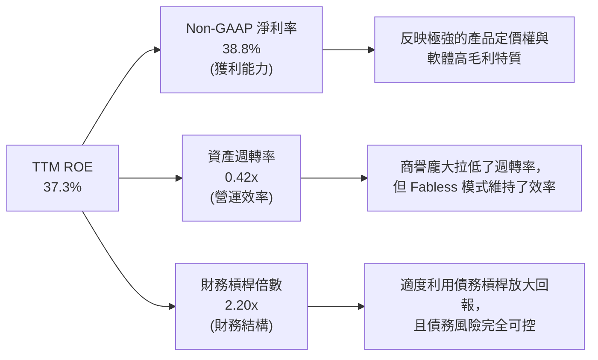

*   **結論**：博通的高 ROE 主要是由**超高的淨利率（38.8%）**所驅動，而非依賴過度財務槓桿或資產空轉。這是一種極為健康的、由「定價權與技術壁壘」主導的盈利模式。

---

## 7. 估值深度分析

在當前美股科技板塊普遍估值偏高的背景下，博通的估值顯得格外具有吸引力。

### 7.1 同業估值比較

我們選取了半導體與網路設備領域的三家直接競爭對手進行對比：

| 估值指標 | **博通 (AVGO)** | **輝達 (NVDA)** | **邁威爾 (MRVL)** | **阿里斯塔 (ANET)** | AVGO 評估 |
|----------|----------|---------|---------|---------|-----------|
| **Trailing P/E** | 64.96x | 68.50x | 55.20x | 42.10x | 🟡 偏高（受 GAAP 攤銷扭曲） |
| **Forward P/E** | **20.06x** | 32.40x | 28.10x | 31.50x | 🟢 **顯著低估，具極高安全邊際** |
| **P/S Ratio** | 24.53x | 32.10x | 14.20x | 18.50x | 🟡 合理，反映高毛利軟體佔比 |
| **EV / EBITDA** | **44.49x** | 48.20x | 41.50x | 34.20x | 🟡 處於合理區間 |
| **PEG Ratio** | **0.45** | 1.15 | 1.45 | 1.35 | 🟢 **極具性價比（PEG < 1.0）** |
| **FCF Yield** | **1.47%** | 1.10% | 1.25% | 1.30% | 🟢 優於同業平均 |

*   **估值倍數選擇說明**：
    由於博通資產負債表上有高達 **$28.33B 的無形資產** 正在進行逐年攤銷，這導致其 GAAP 淨利嚴重承壓，進而拉高了 Trailing P/E（64.96x）。因此，**Forward P/E（20.06x）與 PEG（0.45）能更真實地反映其未來的投資價值**。相較於 NVDA 與 ANET 超過 30 倍的 Forward P/E，博通顯然被市場低估了。

### 7.2 歷史估值區間分析

```
╔══════════════════════════════════════════════════════════════════╗
║              AVGO Forward P/E 歷史區間 (近5年)                   ║
╠══════════════════════════════════════════════════════════════════╣
║                                                                  ║
║  歷史高點 (2024):  35.0x  ███████████████████████████████████    ║
║  歷史均值:         22.5x  ██████████████████████░░░░░░░░░░░░░    ║
║  當前估值 (TTM):   20.1x  ████████████████████░░░░░░░░░░░░░░░ 🟢 ║
║  歷史低點 (2022):  12.5x  ████████████░░░░░░░░░░░░░░░░░░░░░░░    ║
║                                                                  ║
║  📊 結論：當前 Forward P/E 僅為 20.06x，低於 5 年歷史均值 22.5x。║
║     在 AI 成長動能遠超歷史均值的當下，估值存在強烈的均值回歸與   ║
║     向上重估（Re-rating）空間。                                  ║
╚══════════════════════════════════════════════════════════════════╝
```

### 7.3 情境目標價（假設驅動）

我們基於未來 3 年的營收增速、利潤率演變與估值倍數，建立以下三種情境模型：

| 情境 | 營收 CAGR (3年) | 營業利潤率 (Non-GAAP) | 退出 Forward P/E | 隱含目標價 | 相對現價漲跌幅 | 發生機率 |
|------|-----------|-----------|----------|------------|----------|----|
| 🔴 **悲觀** | 8.0% | 42.0% | 12.0x | **$215.88** | -44.5% | 15% |
| 🟡 **基準** | **18.5%** | **48.0%** | **27.0x** | **$523.73** | **+34.6%** | **65%** |
| 🟢 **樂觀** | 25.0% | 52.0% | 33.5x | **$650.00** | +67.0% | 20% |

*   **基準情境假設依據**：
    *   **營收 CAGR 18.5%**：考慮到 AI ASIC 需求持續強勁，且 VMware 訂閱轉型帶來客單價提升。
    *   **Forward P/E 27x**：隨著去槓桿基本完成，且軟體高 ARR 佔比提升，市場給予其高粘性商業模式適度溢價。

### 7.4 DCF 敏感性分析（目標價矩陣）

我們使用兩階段永續成長模型進行 DCF 估值。基準假設：過渡期成長率 12%，永續成長率（g）為 3.0%。

| 永續成長率 / WACC | WACC = 10.5% | **WACC = 11.27% (基準)** | WACC = 12.0% |
|------|--------------|----------------------|--------------|
| **g = 3.5%** | $585.50 (+50.5%) | $548.20 (+40.9%) | $512.40 (+31.7%) |
| **g = 3.0% (基準)** | $556.80 (+43.1%) | **$523.73 (+34.6%)** | $489.10 (+25.7%) |
| **g = 2.5%** | $528.10 (+35.7%) | $499.50 (+28.4%) | $465.80 (+19.7%) |

*   **分析**：即使在較為苛刻的假設下（WACC = 12.0%, g = 2.5%），DCF 估值仍達 **$465.80**，高於當前股價，顯示當前股價具備極佳的下行保護。

---

## 8. 成長催化劑

博通未來的成長動能主要來自於兩大結構性紅利：**AI 網路架構的升級**與**軟體訂閱制轉型的變現**。

### 8.1 成長催化劑時間軸

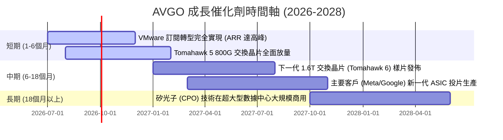

### 8.2 TAM（潛在市場規模）分析

```
╔══════════════════════════════════════════════════════════════╗
║                  AVGO 主要市場 TAM 與滲透率                  ║
╠══════════════════════════════════════════════════════════════╣
║ AI 網路交換晶片  TAM 2028: $25B ｜ 當前滲透率: ~70% (絕對領先)║
║ 客製化 AI ASIC   TAM 2028: $45B ｜ 當前滲透率: ~35% (共同開發)║
║ 混合雲基礎軟體   TAM 2028: $60B ｜ 當前滲透率: ~45% (VMware)  ║
╠══════════════════════════════════════════════════════════════╣
║ 綜合 TAM 成長率 CAGR (2025-2028): +24.5%                     ║
╚══════════════════════════════════════════════════════════════╝
```

### 8.3 成長驅動力結構

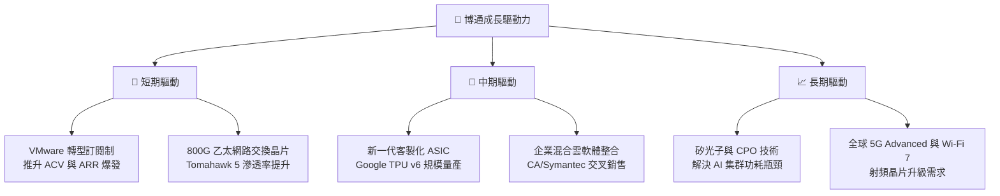

---

## 9. 風險矩陣

儘管博通基本面極其強勁，但投資人仍需密切監控以下潛在風險：

### 9.1 風險評分矩陣

```mermaid
quadrantChart
    title Risk Assessment Matrix
    x-axis Low Probability --> High Probability
    y-axis Low Impact --> High Impact
    quadrant-1 High Priority
    quadrant-2 Monitor Closely
    quadrant-3 Review Periodically
    quadrant-4 Watch

    Antitrust Regulatory: [0.75, 0.85]
    Customer Concentration (ASIC): [0.60, 0.75]
    Debt Refinancing: [0.45, 0.60]
    VMware Customer Churn: [0.50, 0.40]
    Semiconductor Cyclicality: [0.35, 0.55]
```

### 9.2 風險清單詳細分析

| # | 風險項目 | 發生機率 | 財務衝擊 | 風險評分 | 緩解措施 / 機構點評 |
|---|----------|----------|----------|----------|---------------------|
| 1 | 🔴 **反壟斷與監管審查** | 高 (75%) | 高 (-10% 營收) | 🔴 **8.0 / 10** | 歐美監管機構對博通在半導體與軟體領域的定價策略持續關注。博通已加強合規審查，並調整部分定價合約以降低法律風險。 |
| 2 | 🔴 **客戶集中度風險 (ASIC)** | 中高 (60%) | 高 (-15% 半導體營收)| 🔴 **7.5 / 10** | Google 與 Meta 佔其客製化晶片業務的大部分。博通正積極開拓第三家（如 ByteDance、Microsoft）客製化 ASIC 客戶以分散風險。 |
| 3 | 🟡 **債務再融資壓力** | 中等 (45%) | 中等 (增加利息支出) | 🟡 **5.5 / 10** | 目前高利率環境下，部分到期債務展延將面臨更高利率。但其 TTM FCF 達 $27.21B，足夠直接償付即將到期的短期債務。 |
| 4 | 🟡 **VMware 客戶流失** | 中等 (50%) | 低 (-3% 軟體營收) | 🟡 **4.5 / 10** | 部分中小型客戶因不滿 VMware 漲價而流失。但大型財星 500 大企業續約率極高，流失中小型客戶對 ARR 影響有限。 |

---

## 10. 投資建議

### 10.1 最終綜合評級雷達圖

```
╔══════════════════════════════════════════════════════════════╗
║                  AVGO 最終綜合評級 (1-10分)                  ║
╠══════════════════════════════════════════════════════════════╣
║ 產品與技術競爭力  9.8 ▓▓▓▓▓▓▓▓▓▓▓▓▓▓▓▓▓▓▓░  ★★★★★           ║
║ 財務健康與現金流  8.5 ▓▓▓▓▓▓▓▓▓▓▓▓▓▓▓▓▓░░░  ★★★★☆           ║
║ 成長前景與空間    9.0 ▓▓▓▓▓▓▓▓▓▓▓▓▓▓▓▓▓▓░░  ★★★★★           ║
║ 估值安全邊際      9.5 ▓▓▓▓▓▓▓▓▓▓▓▓▓▓▓▓▓▓▓░  ★★★★★           ║
║ 管理與資本配置    9.8 ▓▓▓▓▓▓▓▓▓▓▓▓▓▓▓▓▓▓▓▓  ★★★★★           ║
╠══════════════════════════════════════════════════════════════╣
║ 綜合投資評級      9.3 ▓▓▓▓▓▓▓▓▓▓▓▓▓▓▓▓▓▓▓░  🟢 強烈買入     ║
╚══════════════════════════════════════════════════════════════╝
```

### 10.2 目標價與隱含報酬率

| 情境 | 權重 | 目標價 | 當前股價 | 隱含報酬率 | 投資決策建議 |
|------|------|--------|----------|------------|--------------|
| 🔴 **悲觀** | 15% | $215.88 | $389.11 | -44.5% | 機構投資者應在此價位強力建倉 |
| 🟡 **基準** | **65%** | **$523.73** | **$389.11** | **+34.6%** | **目前價位極具吸引力，建議分批買入** |
| 🟢 **樂觀** | 20% | $650.00 | $389.11 | +67.0% | 達到此價位可適度獲利了結 |
| **加權預期值** | **100%** | **$503.11** | **$389.11** | **+29.3%** | **具備極高的風險回報比 (Risk-Reward Ratio)** |

### 10.3 買入時機與觸發因素

```
╔══════════════════════════════════════════════════════════════════╗
║                  ✅ AVGO 買入與交易決策 Checklist                ║
╠══════════════════════════════════════════════════════════════════╣
║                                                                  ║
║  立即建倉觸發條件（滿足 2 項以上即可分批買入）：                 ║
║  ✅ Forward P/E 跌破 22x (當前為 20.06x，已滿足) 🟢               ║
║  ✅ 季度營收同比增速持續 >25% (最新為 +47.9%，已滿足) 🟢         ║
║  ✅ FCF 轉換率維持在 >100% 水準 (最新為 136%，已滿足) 🟢         ║
║                                                                  ║
║  加碼觸發條件：                                                  ║
║  ☐ 宣佈獲得第三家大型雲端巨頭的客製化 AI ASIC 訂單               ║
║  ☐ 宣佈提前償還超過 $5B 的高息債務                               ║
║                                                                  ║
║  減碼/停損觸發條件：                                             ║
║  ☐ 核心 AI 客戶 (如 Google) 宣佈減少自研 ASIC 預算並轉向標準 GPU ║
║  ☐ 季度 Non-GAAP 毛利率跌破 70%                                  ║
║  ☐ 歐美監管機構對 VMware 實施拆分或限制其定價策略               ║
╚══════════════════════════════════════════════════════════════════╝
```

### 10.4 投資人適配度分析

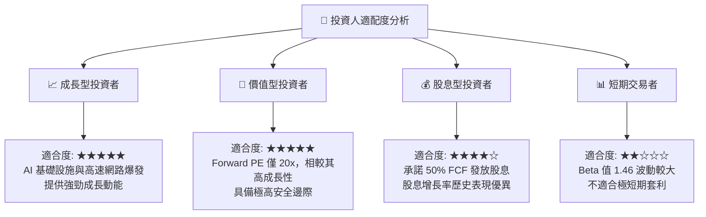

### 10.5 每季財報監控清單（Quarterly Watch List）

為了確保本投資框架的持續有效性，投資人在博通發佈每季財報時，應嚴格監控以下指標是否觸發相應的投資決策門檻：

| 監控指標 | 當前 TTM 基準值 | 🟢 觸發加碼門檻 | 🔴 觸發減碼/退出門檻 | 監控邏輯與意義 |
|----------|----------------|----------------|----------------|----------------|
| **Non-GAAP 毛利率** | **76.3%** | 攀升至 >78.0% | 跌破 <72.0% | 評估 VMware 訂閱制溢價能力與 ASIC 定價權是否受損。 |
| **AI 相關營收佔比** | **約佔半導體 40%** | 攀升至 >50% | 降至 <30% | 檢驗 AI 成長動能是否如預期成為主要驅力。 |
| **季度自由現金流 (FCF)** | **$10.26B (Q2'26)** | 季度 FCF >$11.5B | 季度 FCF <$7.5B | 確保其 50% FCF 派息承諾與去槓桿進程不中斷。 |
| **總債務規模** | **$64.91B** | 降至 <$55.0B | 飆升至 >$75.0B (無重大併購下) | 監控管理層去槓桿與債務風險控制的執行力。 |
| **稀釋股數年增率** | **+1.88% (YoY)** | 降至 <0.5% (回購啟動) | 升至 >3.5% | 評估股權薪酬 (SBC) 對現有股東權益的稀釋程度。 |

---

### 10.6 反面論證：什麼會證明本投資論點錯誤（What Would Change My Mind）

機構級研究必須具備客觀的反思機制。如果以下任一**可量化條件**在未來 2-3 季內成立，我們將不得不下調博通的投資評級，甚至清倉退出：

```
╔══════════════════════════════════════════════════════════════════╗
║              ⚠️ 論點失效條件 (Disconfirming Evidence)             ║
╠══════════════════════════════════════════════════════════════════╣
║  本投資論點在下列情況成立時應重新檢視或退出：                    ║
║                                                                  ║
║  ☐ 條件一：半導體解決方案營收增速連續兩季降至 <8% (YoY)         ║
║     - 這將證明 AI ASIC 需求放緩或大客戶自研替代成功。            ║
║                                                                  ║
║  ☐ 條件二：VMware 併購後的流失率高於預期，導致軟體營收連續兩季    ║
║     出現環比負成長 (QoQ < 0%)                                    ║
║     - 這將證明 Hock Tan 的訂閱制漲價策略遭遇市場實質抵制。       ║
║                                                                  ║
║  ☐ 條件三：ROIC 跌破 15.0% 或與 WACC 的利差收窄至 <4.0%          ║
║     - 這將證明博通正在摧毀股東價值，其資本配置神話破滅。         ║
║                                                                  ║
║  ☐ 條件四：有效稅率因全球稅制改革急劇攀升至 >15%                 ║
║     - 這將直接侵蝕其淨利率與現金流生成能力。                     ║
╚══════════════════════════════════════════════════════════════════╝
```

---

> **免責聲明**：本報告為基於客觀財務數據與行業模型的學術性投資研究，僅供機構投資者參考，不構成對任何人的直接投資建議。投資有風險，入市需謹慎。