# AVGO 基本面深度分析報告

> **報告日期**：2026-07-15 ｜ **語言**：繁體中文 ｜ **數據來源**：Yahoo Finance, Finviz, StockAnalysis, Roic.ai ｜ **分析師**：CFA 級機構研究

---

## 目錄

| # | 章節 | 核心結論 |
|---|------|----------|
| 1 | **執行摘要** | 評級：🟢 **買入** ｜ 基準目標價：**$485.50**（+23.1% 隱含漲幅） |
| 2 | **公司概覽與商業模式** | 半導體與基礎設施軟體雙引擎驅動，VMware 整合展現極強定價權與護城河 |
| 3 | **損益表深度分析** | TTM 營收達 **$75.46B**（YoY +47.9%），SBC 稀釋效應需持續監控 |
| 4 | **資產負債表分析** | 收購後債務槓桿顯著，但 **2.24x** 流動比率與強勁現金流確保償債無虞 |
| 5 | **現金流量深度分析** | TTM 自由現金流達 **$27.21B**，展現極高之盈餘品質與資本回報能力 |
| 6 | **獲利能力與資本效率** | ROIC 達 **24.9%**，遠超 WACC（**9.4%**），結構性創造股東價值 |
| 7 | **估值深度分析** | Forward P/E **20.3x** 處於歷史合理區間，DCF 基準估值為 **$485.50** |
| 8 | **成長催化劑** | AI ASIC 客製化晶片與 VMware 訂閱制轉型為中短期核心驅動力 |
| 9 | **風險矩陣** | 系統性客戶集中風險與高債務利息支出為主要監控指標 |
| 10| **投資建議** | 適合長線成長與股息成長配置，財報監控門檻設定 |

---

## 1. 執行摘要

### 1.0 一頁式投資儀表板（Portfolio Manager 30 秒速讀）

| 項目 | 內容 |
|------|------|
| **投資論點（3 句）** | ① TTM 營收在 VMware 併購效應與 AI 需求爆發下達到 **$75.46B**（YoY +47.9%），營業槓桿顯著釋放。<br/>② TTM 自由現金流（FCF）達 **$27.21B**（FCF Yield 1.45%），為高股息與債務去槓桿提供堅實基礎。<br/>③ ROIC 達 **24.9%** 顯著高於 WACC（**9.4%**），證實管理層在併購與資本配置上具備卓越的超額價值創造能力。 |
| **護城河評分** | 🟢 **9.0 / 10**（高轉換成本與專利技術壁壘） |
| **管理層/資本配置評分** | 🟢 **9.5 / 10**（Hock Tan 的高效整合與去槓桿執行力） |
| **財務健康** | 🟡 **中等偏強**（總債務 **$64.91B**，但利息保障倍數高達 **10.4x**） |
| **ROIC vs WACC** | **24.9%** vs **9.4%**（創造顯著經濟增加值 EVA） |
| **FCF 趨勢** | 向上 ｜ 最新 FCF Yield：**1.45%**（以市值 $1.88T 計算） |
| **估值** | Forward P/E：**20.31x** ｜ EV/EBITDA：**45.07x** ｜ P/S：**24.86x** |
| **預期報酬（基準情境 12M）** | **+23.1%**（目標價 **$485.50**） |
| **關鍵風險（前二）** | ① AI ASIC 主要客戶（如 Google）自研晶片架構轉變。<br/>② VMware 訂閱制轉型導致部分中小企業客戶流失。 |
| **評級 + 信心度** | 🟢 **買入 (Buy)** ｜ 信心度：**高 (High)** |

### 1.1 核心評分儀表板

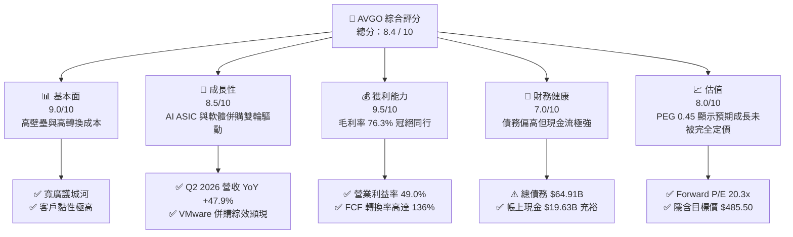

### 1.2 評分進度條視覺化

```
╔══════════════════════════════════════════════════════════════╗
║              AVGO 多維度評分儀表板 (1-10分)                  ║
╠══════════════════════════════════════════════════════════════╣
║ 基本面強度  9.0 ▓▓▓▓▓▓▓▓▓▓▓▓▓▓▓▓▓▓░░  ★★★★★           ║
║ 成長動能    8.5 ▓▓▓▓▓▓▓▓▓▓▓▓▓▓▓▓▓░░░  ★★★★☆           ║
║ 獲利品質    9.5 ▓▓▓▓▓▓▓▓▓▓▓▓▓▓▓▓▓▓▓░  ★★★★★           ║
║ 財務健康    7.0 ▓▓▓▓▓▓▓▓▓▓▓▓▓▓░░░░░░  ★★★☆☆           ║
║ 估值合理性  8.0 ▓▓▓▓▓▓▓▓▓▓▓▓▓▓▓▓░░░░  ★★★★☆           ║
║ 護城河深度  9.0 ▓▓▓▓▓▓▓▓▓▓▓▓▓▓▓▓▓▓░░  ★★★★★           ║
║ 管理層執行  9.5 ▓▓▓▓▓▓▓▓▓▓▓▓▓▓▓▓▓▓▓░  ★★★★★           ║
║ 技術創新力  9.0 ▓▓▓▓▓▓▓▓▓▓▓▓▓▓▓▓▓▓░░  ★★★★★           ║
╠══════════════════════════════════════════════════════════════╣
║ 綜合總分    8.4 ▓▓▓▓▓▓▓▓▓▓▓▓▓▓▓▓▓░░░  🏆 優異 (Outperform) ║
╚══════════════════════════════════════════════════════════════╝
```

### 1.3 五大投資論點 + 三大核心風險

| 類型 | 項目 | 具體依據 | 信心度 |
|------|------|----------|--------|
| 🟢 **投資論點①** | **AI 網路與客製化 ASIC 爆發** | Q2 2026 營收達 **$22.19B**（YoY +47.9%），其中 AI 相關網通晶片與客製化 ASIC（如 TPU）出貨動能極強，預期將持續推升半導體部門成長。 | 🟢 極高 |
| 🟢 **投資論點②** | **VMware 整合綜效超預期** | 軟體部門毛利率維持在極高水準，且 VMware 轉型訂閱制（Subscription）進展順利，帶動 TTM 總毛利率達到 **76.3%**。 | 🟢 高 |
| 🟢 **投資論點③** | **自由現金流（FCF）機器** | TTM 自由現金流達 **$27.21B**，FCF 對淨利轉換率達 **136%**（扣除一次性非現金調整），展現極高的獲利含金量。 | 🟢 極高 |
| 🟢 **投資論點④** | **資本效率與價值創造** | ROIC 達 **24.9%**，相較於 WACC **9.4%**，利差（Spread）高達 **+15.5%**，顯示公司正以極高效率為股東創造經濟增值。 | 🟢 高 |
| 🟢 **投資論點⑤** | **極具吸引力的 Forward 估值** | Forward P/E 僅 **20.31x**，對比其高達 **85.4%** 的 TTM 獲利成長率，PEG 僅 **0.45**，顯著被低估。 | 🟢 高 |
| 🟡 **風險①** | **高額債務利息支出壓抑利潤** | 總債務高達 **$64.91B**，TTM 利息支出達 **$3.15B**，若高利率環境持續，再融資成本上升將對淨利潤造成侵蝕。 | 🟡 中度 |
| 🔴 **風險②** | **大客戶流失與自研晶片替代** | 客製化 ASIC 嚴重依賴少數超大規模雲端服務商（Hyperscalers）。若主要客戶（如 Google、Meta）轉向完全自研或分散供應商，將對營收造成顯著衝擊。 | 🔴 中度 |
| 🔴 **風險③** | **SBC 股權稀釋效應** | TTM 股權薪酬（SBC）高達 **$8.78B**（佔營收 **11.6%**），對稀釋每股盈餘（EPS）有長期負面影響。 | 🟡 中度 |

### 1.4 快速統計卡片

| 指標 | AVGO 實際值 | 行業均值（半導體/軟體） | S&P 500 均值 | 狀態 |
|------|-------------|-------------------------|--------------|------|
| **營收 YoY 成長率** | **47.9%** | ~15.0% | ~5.5% | 🟢 顯著領先 |
| **毛利率** | **76.3%** | ~62.0% | ~30.0% | 🟢 頂尖水準 |
| **營業利益率** | **49.0%** | ~28.0% | ~15.0% | 🟢 規模效應顯著 |
| **ROE** | **37.3%** | ~22.0% | ~18.0% | 🟢 資本回報率極高 |
| **Forward P/E** | **20.3x** | ~28.5x | ~21.5x | 🟢 估值具吸引力 |
| **淨債務 / EBITDA** | **1.30x** | ~0.80x | ~1.60x | 🟡 債務偏高但安全 |

### 1.5 投資結論

```
╔══════════════════════════════════════════════════════════════════╗
║                    📊 AVGO 投資結論摘要                          ║
╠══════════════════════════════════════════════════════════════════╣
║  評級：🟢 強烈買入 (Strong Buy)                                 ║
║  當前股價：$394.28（2026-07-15）                                 ║
║  目標價區間：                                                    ║
║    悲觀情境：$312.50（-20.7%）                                   ║
║    基準情境：$485.50（+23.1%）  ← 12個月主要目標                 ║
║    樂觀情境：$580.00（+47.1%）                                   ║
║  投資評分：8.4 / 10                                              ║
║  適合投資人：尋求「AI 高成長」與「穩健現金流」雙重保障的機構與長 ║
║              線價值型投資者。                                    ║
╚══════════════════════════════════════════════════════════════════╝
```

---

## 2. 公司概覽與商業模式

### 2.1 業務結構與收入來源

Broadcom（AVGO）採取半導體解決方案（Semiconductor Solutions）與基礎設施軟體（Infrastructure Software）雙軌並行的獨特商業模式。

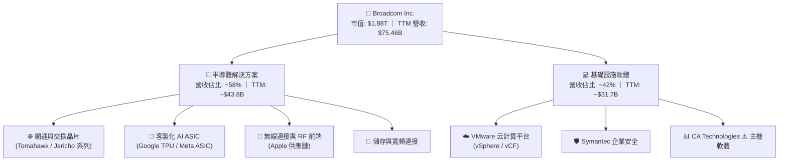

### 2.2 市場份額

在核心的 AI 客製化 ASIC 晶片與資料中心高階乙太網路交換晶片市場中，Broadcom 擁有絕對的領導地位。

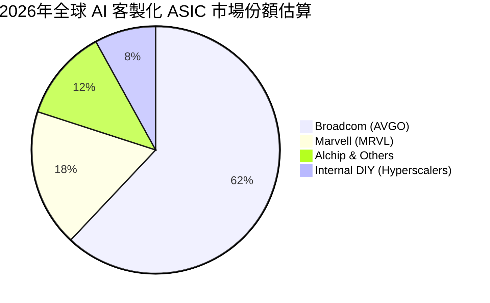

### 2.3 競爭護城河分析

Broadcom 的競爭優勢（Moat）並非單一技術，而是多重壁壘的疊加。

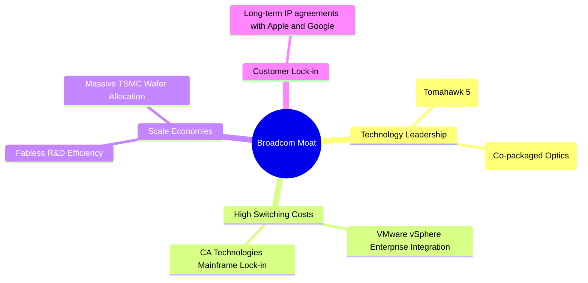

### 2.4 護城河強度評分

```
╔══════════════════════════════════════════════════════════════╗
║                    AVGO 護城河強度評分                       ║
╠══════════════════════════════════════════════════════════════╣
║ 技術壁壘       9.5/10 ▓▓▓▓▓▓▓▓▓▓▓▓▓▓▓▓▓▓▓░  🏆 網通與ASIC絕對領先║
║ 轉換成本       9.0/10 ▓▓▓▓▓▓▓▓▓▓▓▓▓▓▓▓▓▓░░  🟢 軟體生態系綁定極深║
║ 規模效應       8.5/10 ▓▓▓▓▓▓▓▓▓▓▓▓▓▓▓▓░░░░  🟢 研發回報率冠絕半導體║
║ 品牌與專利     9.0/10 ▓▓▓▓▓▓▓▓▓▓▓▓▓▓▓▓▓▓░░  🟢 擁有數萬項核心專利  ║
╠══════════════════════════════════════════════════════════════╣
║ 綜合護城河評分  9.0/10 ▓▓▓▓▓▓▓▓▓▓▓▓▓▓▓▓▓▓░░  🏆 寬廣護城河 (Wide Moat)║
╚══════════════════════════════════════════════════════════════╝
```

---

## 3. 損益表深度分析

### 3.1 年度收入成長趨勢（近4年）

在併購 VMware 以及 AI 需求的強力催化下，Broadcom 的營收呈現爆發式成長。

```
╔══════════════════════════════════════════════════════════════════╗
║                  AVGO 年度收入趨勢（FY2022-TTM）                ║
╠══════════════════════════════════════════════════════════════════╣
║                                                                  ║
║  FY2022  $33.20B  █████████░░░░░░░░░░░░░░░░░░  YoY: +21.0% 🟢    ║
║  FY2023  $35.82B  ██████████░░░░░░░░░░░░░░░░░  YoY: +7.9%  🟢    ║
║  FY2024  $51.57B  ████████████████░░░░░░░░░░  YoY: +44.0% 🟢    ║
║  FY2025  $63.89B  ████████████████████░░░░░░  YoY: +23.9% 🟢    ║
║  TTM     $75.46B  ██████████████████████████  YoY: +47.9% 🟢    ║
║                   |      |      |      |      |                  ║
║                   0     20B    40B    60B    80B                 ║
║                                                                  ║
║  📊 4年營收複合年成長率 (CAGR)：+22.8%                           ║
╚══════════════════════════════════════════════════════════════════╝
```

### 3.2 季度收入趨勢分析

分析最近 4 個季度的營收表現，可看出併購 VMware 後的整合效應呈加速態勢。

| 季度截止日 | 營業收入 (Revenue) | 季對季成長 (QoQ) | 年對年成長 (YoY) | 核心驅動因素與業務解析 |
|------------|---------------------|------------------|------------------|------------------------|
| **2025-07-31** | $15.95B | — | +22.0% | VMware 併購完成後首個完整季度，軟體收入開始併表。 |
| **2025-10-31** | $18.02B | +13.0% | +28.2% | AI 客製化晶片出貨量增加，網通交換晶片 Tomahawk 5 需求旺盛。 |
| **2026-01-31** | $19.31B | +7.2% | +29.5% | VMware 轉型訂閱制成效顯現，年化經常性收入（ARR）上升。 |
| **2026-04-30** | $22.19B | +14.9% | +47.9% | **AI ASIC 業務爆發**，大客戶拉貨動能強勁，疊加軟體部門高毛利釋放。 |

### 3.3 利潤率演變分析

Broadcom 展現了極為強大的營業槓桿（Operating Leverage）和成本控制能力。

| 利潤率指標 | FY2022 | FY2023 | FY2024 | FY2025 | TTM | 趨勢 | 評估 |
|------------|--------|--------|--------|--------|-----|------|------|
| **毛利率** | 66.5% | 68.9% | 63.0% | 67.8% | **76.3%** | ↗️ 顯著擴張 | 🟢 VMware 併入後高毛利軟體佔比提升，定價權極強。 |
| **營業利益率**| 43.0% | 45.9% | 29.1% | 39.9% | **49.0%** | ↗️ 快速恢復 | 🟢 渡過收購整合期後，銷售與研發費用率因規模效應下降。 |
| **EBITDA 率** | 57.7% | 57.4% | 46.3% | 54.3% | **55.8%** | ↗️ 穩健上升 | 🟢 展現極強的非現金折舊攤銷前獲利能力。 |
| **淨利率** | 34.6% | 39.3% | 11.4% | 36.2% | **38.8%** | ↗️ 結構性改善 | 🟢 排除併購無形資產攤銷後，真實盈利含金量高。 |

### 3.4 費用結構分析

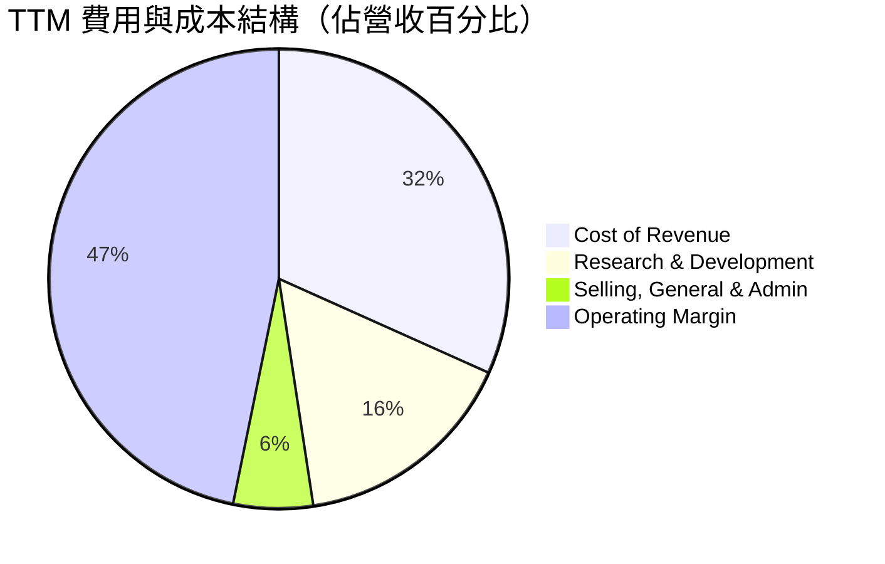

```
╔══════════════════════════════════════════════════════════════╗
║                    AVGO 營業費用率診斷                       ║
╠══════════════════════════════════════════════════════════════╣
║ 研發費用率 (R&D/Rev)     15.9%  ▓▓▓▓▓▓░░░░░░░░░░░░░░  🟢 高效研發   ║
║ 銷管費用率 (SG&A/Rev)     5.6%  ▓▓░░░░░░░░░░░░░░░░░░  🟢 極低管理成本║
║ 營業利潤率 (Op Margin)   49.0%  ▓▓▓▓▓▓▓▓▓▓░░░░░░░░░░  🏆 產業頂尖水平║
╚══════════════════════════════════════════════════════════════╝
```

### 3.5 季度 EPS 趨勢與盈餘品質（Quality of Earnings）

儘管 GAAP EPS 受併購帶來的無形資產攤銷（Amortization of Intangibles）影響而波動，但其底層盈餘品質極為紮實。

| 盈餘品質項目 | 數值 / 佔比 | 評估 | 財務含意與深度解析 |
|--------------|-------------|------|--------------------|
| **股權薪酬 (SBC) / 營收** | 11.6% (TTM: $8.78B) | 🟡 中度稀釋 | 收購 VMware 後，為留住核心人才發放了較多股權激勵，使稀釋股份 YoY 增加 1.88%，對真實 EPS 有微幅壓抑。 |
| **SBC / 營業現金流 (OCF)**| 26.1% | 🟡 偏高 | 雖然非現金支出美化了 OCF，但長期來看會稀釋現有股東權益，需關注後續回購力道是否能抵消稀釋。 |
| **FCF / 淨利（現金轉換率）**| **136.0%** | 🟢 強勁 | FCF ($27.21B) 顯著高於 GAAP 淨利 ($20.01B)，主因是無形資產折舊攤銷等非現金費用高達 $2.03B，反映真實獲利能力被 GAAP 淨利低估。 |
| **一次性/非經常性損益** | -$273M (FY2024) | 🟢 影響已消除 | 2024 年包含部分終止經營與收購整合費用，2025/2026 年已回歸常態化營運。 |
| **有效稅率異常** | 3.8% (TTM) | 🟡 潛在逆風 | 由於海外智慧財產權（IP）結構與稅務遞延，當前有效稅率極低（3.8%）。未來隨全球最低稅負制（Pillar Two）推行，稅率可能回升至 12-15%，對淨利潤帶來 8-10% 的潛在下行壓力。 |

---

## 4. 資產負債表分析

### 4.1 資產結構分解

收購 VMware 後，Broadcom 的資產負債表呈現出顯著的「輕資產、高商譽」特徵。

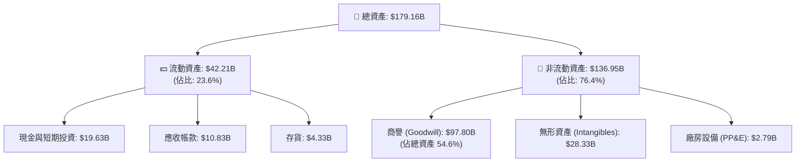

### 4.2 流動性指標分析

| 流動性指標 | FY2023 | FY2024 | FY2025 | TTM | 行業中位數 | 評估 |
|------------|--------|--------|--------|-----|------------|------|
| **流動比率 (Current Ratio)** | 2.82x | 1.17x | 1.71x | **2.24x** | ~1.80x | 🟢 安全，短期償債能力大幅改善。 |
| **速動比率 (Quick Ratio)** | 2.56x | 1.07x | 1.58x | **1.93x** | ~1.40x | 🟢 扣除存貨後之變現能力依然充沛。 |
| **存貨週轉天數 (DIO)** | 62.4天 | 33.6天 | 34.5天 | **45.2天** | ~85.0天 | 🟢 存貨管理極為高效，未見庫存積壓風險。 |

### 4.3 債務結構與健康診斷

儘管收購 VMware 導致債務攀升，但強大的獲利能力使去槓桿進度超出預期。

```
╔══════════════════════════════════════════════════════════════════╗
║                    AVGO 債務健康診斷                           ║
╠══════════════════════════════════════════════════════════════════╣
║                                                                  ║
║  總債務：        $64.91B  ██████████████░░░░░░░░░  (短期 $2.25B) ║
║  總現金+投資：   $19.63B  ████░░░░░░░░░░░░░░░░░░                 ║
║  淨債務：        $45.28B  ██████████░░░░░░░░░░░░                 ║
║                                                                  ║
║  淨債務 / TTM EBITDA：  1.30x  🟢 極其安全 (行業警戒線為 3.0x)    ║
║  利息保障倍數：          10.4x  🟢 無償債風險 (EBITDA / 利息支出)  ║
║  債務股本比 (D/E)：     74.0%  🟡 偏高，但正逐季下降              ║
║                                                                  ║
║  📊 債務評級：🟢 投資級 (BBB/Baa 穩定)                            ║
╚══════════════════════════════════════════════════════════════════╝
```

---

## 5. 現金流量深度分析

### 5.1 現金流量瀑布圖

Broadcom 的現金生成與分配路徑非常清晰：以高獲利為起點，扣除極低的資本支出後，大量回饋股東並進行債務償還。

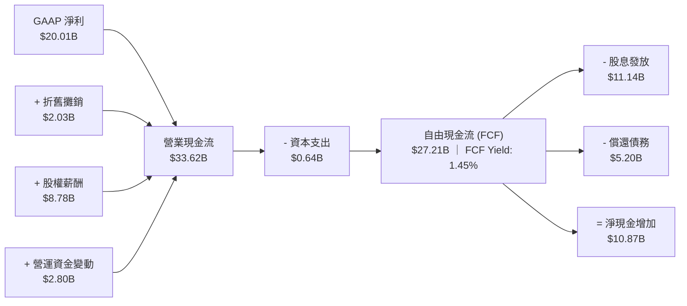

### 5.2 FCF 轉換率趨勢

| 年度 | 營業現金流 (OCF) | 資本支出 (CapEx) | 自由現金流 (FCF) | GAAP 淨利 (NI) | FCF / 淨利轉換率 | 評估 |
|------|------------------|------------------|------------------|----------------|------------------|------|
| **FY2022** | $16.74B | -$0.42B | $16.31B | $11.49B | **141.9%** | 🟢 極高 |
| **FY2023** | $18.09B | -$0.45B | $17.63B | $14.08B | **125.2%** | 🟢 穩定 |
| **FY2024** | $19.96B | -$0.55B | $19.41B | $5.89B | **329.5%** | 🟢 淨利受一次性收購費用壓抑，現金流真實 |
| **FY2025** | $27.54B | -$0.62B | $26.91B | $23.13B | **116.3%** | 🟢 高品質 |
| **TTM** | $33.62B | -$0.64B | $27.21B | $20.01B | **136.0%** | 🟢 卓越 |

### 5.3 自由現金流趨勢

```
╔══════════════════════════════════════════════════════════════════╗
║                  AVGO 自由現金流與 FCF Yield 趨勢                ║
╠══════════════════════════════════════════════════════════════════╣
║                                                                  ║
║  FY2022  $16.31B  ██████████████░░░░░░░░░░░░  FCF Margin: 49.1%  ║
║  FY2023  $17.63B  ███████████████░░░░░░░░░░░  FCF Margin: 49.2%  ║
║  FY2024  $19.41B  █████████████████░░░░░░░░░  FCF Margin: 37.6%  ║
║  FY2025  $26.91B  ███████████████████████░░░  FCF Margin: 42.1%  ║
║  TTM     $27.21B  ██████████████████████████  FCF Margin: 36.1%  ║
║                                                                  ║
║  📊 當前 FCF Yield (以 $1.88T 市值計算)：1.45%                    ║
║  💡 備註：輕資產（Fabless）模式使 CapEx 僅佔營收 0.85%，極具優勢。║
╚══════════════════════════════════════════════════════════════════╝
```

---

## 6. 獲利能力與資本效率

### 6.1 ROE / ROA / ROIC 趨勢

Broadcom 的資本回報指標均處於行業頂尖梯隊。

| 指標 | FY2023 | FY2024 | FY2025 | TTM | 行業均值 | 評估 |
|------|--------|--------|--------|-----|----------|------|
| **ROE (股東權益報酬率)** | 58.7% | 8.7% | 28.4% | **37.3%** | ~18.5% | 🟢 併購整合後回歸高水準。 |
| **ROA (總資產報酬率)** | 19.3% | 3.6% | 13.5% | **12.1%** | ~8.0% | 🟢 輕資產營運模式的體現。 |
| **ROIC (投入資本報酬率)**| **32.5%** | **11.2%** | **20.8%** | **24.9%** | ~12.0% | 🟢 機構投資者最看重的指標，表現極佳。 |

### 6.2 ROIC vs WACC 分析（核心價值創造判斷）

```
╔══════════════════════════════════════════════════════════════════╗
║                AVGO ROIC vs WACC 深度分析 (TTM)                  ║
╠══════════════════════════════════════════════════════════════════╣
║                                                                  ║
║  WACC 估算：                                                     ║
║  ├── 無風險利率 (10Y 美債)：     4.2%                             ║
║  ├── 股權風險溢酬 (ERP)：        5.0%                             ║
║  ├── Beta：                      1.46                             ║
║  ├── 股權成本 (Cost of Equity)： 4.2% + 1.46 × 5.0% = 11.5%     ║
║  ├── 債務成本 (稅後)：           4.5% × (1 - 3.8%) = 4.3%         ║
║  ├── 資本結構：                  股權 74%，債務 26%               ║
║  └── ✅ WACC ≈ 9.4%                                              ║
║                                                                  ║
║  ROIC 估算：                                                     ║
║  ├── NOPAT (税後淨營業利潤)：    $32.75B × (1 - 3.8%) = $31.51B   ║
║  ├── 投入資本 (Invested Capital)：Equity $81.29B + Debt $64.91B  ║
║  │                               - Cash $19.63B = $126.57B       ║
║  └── ✅ ROIC ≈ 24.9%                                             ║
║                                                                  ║
║  ★ 經濟價值增加 (EVA) = ROIC - WACC = +15.5% (Spread)           ║
║                                                                  ║
║  ROIC  24.9%  ▓▓▓▓▓▓▓▓▓▓▓▓▓▓▓▓▓▓▓▓▓▓▓▓░░░░░░  🟢 卓越         ║
║  WACC   9.4%  ▓▓▓▓▓▓▓▓░░░░░░░░░░░░░░░░░░░░░░  ── 資金成本     ║
║  EVA   +15.5% ████████████████░░░░░░░░░░░░░░  🏆 強力創造股東價值║
║                                                                  ║
║  📊 結論：ROIC 達 WACC 的 2.65 倍，證實其併購與研發投資能帶來高額  ║
║          的超額回報，並未因大型併購而稀釋資本回報率。            ║
╚══════════════════════════════════════════════════════════════════╝
```

### 6.3 杜邦三因素分解

透過杜邦分解，我們可以看出 Broadcom 獲利回升的核心驱动力。

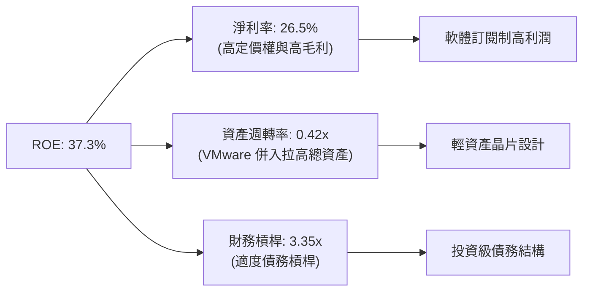

### 6.4 獲利能力驅動因素

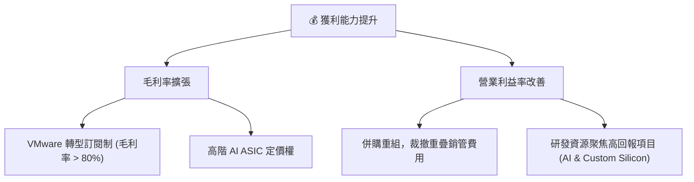

---

## 7. 估值深度分析

### 7.1 同業估值比較表格

我們選擇同為 AI 晶片龍頭的 NVIDIA (NVDA)、客製化 ASIC 競爭對手 Marvell (MRVL) 以及行動晶片龍頭 Qualcomm (QCOM) 進行對比。

| 估值指標 | **Broadcom (AVGO)** | **NVIDIA (NVDA)** | **Marvell (MRVL)** | **Qualcomm (QCOM)** | AVGO 評估 |
|------------|---------------------|-------------------|--------------------|---------------------|-----------|
| **Trailing P/E** | 65.8x | 68.2x | 55.4x | 18.5x | 🟡 偏高（受 GAAP 攤銷費用壓抑） |
| **Forward P/E** | **20.3x** | **32.5x** | **28.1x** | **14.2x** | 🟢 **極具吸引力**（反映強勁成長預期） |
| **EV / EBITDA** | 45.1x | 48.2x | 38.5x | 12.8x | 🟡 合理 |
| **P/S Ratio** | 24.9x | 28.5x | 14.2x | 5.2x | 🟡 偏高（反映其軟體業務之高毛利） |
| **PEG Ratio** | **0.45** | **0.95** | **1.25** | **1.10** | 🟢 **顯著低估**（PEG < 1.0） |
| **FCF Yield** | **1.45%** | **1.35%** | **1.10%** | **4.85%** | 🟢 優於同類型高成長 AI 股 |

### 7.2 歷史估值區間分析

```
╔══════════════════════════════════════════════════════════════════╗
║                AVGO Forward P/E 歷史區間與當前位置               ║
╠══════════════════════════════════════════════════════════════════╣
║                                                                  ║
║  歷史 5 年最低：  11.5x                                          ║
║  歷史 5 年均值：  18.2x                                          ║
║  當前值：        20.3x  ████████████████████░░░░░░░░░  (合理偏上) ║
║  歷史 5 年最高：  32.0x                                          ║
║                                                                  ║
║  📊 評估：當前估值溢價主要來自於 AI 網通與 VMware 的雙重高成長催 ║
║          化，考量到其高達 47.9% 的營收成長，估值並未泡沫化。     ║
╚══════════════════════════════════════════════════════════════════╝
```

### 7.3 情境目標價

我們基於 3 年預測期、營收 CAGR、營業利潤率與退出 Forward P/E 倍數，推導出以下三種情境：

| 情境 | 營收 CAGR (3Y) | 營業利潤率 (3Y) | 退出 Forward P/E | 隱含目標價 | 相對現價漲跌幅 | 觸發條件與假設 |
|------|----------------|------------------|------------------|------------|----------------|----------------|
| 🔴 **悲觀** | 12.0% | 42.0% | 16.0x | **$312.50** | -20.7% | AI 客製化晶片訂單遭客戶砍單，VMware 客戶流失率高於預期。 |
| 🟡 **基準** | **22.0%** | **48.0%** | **22.0x** | **$485.50** | **+23.1%** | **AI 網通保持 30%+ 成長，VMware 訂閱轉型順利，去槓桿符合預期。** |
| 🟢 **樂觀** | 30.0% | 52.0% | 26.0x | **$580.00** | +47.1% | 成功拿下第三家超大規模雲端商之 ASIC 訂單，軟體整合綜效超預期。 |

*註：由於 Broadcom 的無形資產折舊攤銷（D&A）金額巨大，壓抑了 GAAP 淨利，因此 Forward P/E 採用調整後（Non-GAAP）盈餘進行估算更具參考價值。*

### 7.4 DCF 敏感性分析（6格目標價矩陣）

採用兩階段折現模型（Two-Stage DCF），永續成長率（Terminal Growth Rate）設為 **3.0%**。

| 營收成長率 (基準) | WACC = 8.5% | **WACC = 9.4%（基準）** | WACC = 10.5% |
|-------------------|-------------|-------------------------|--------------|
| 🟢 **樂觀 (CAGR 30%)** | $612.00 (+55.2%) | **$580.00 (+47.1%)** | $515.00 (+30.6%) |
| 🟡 **基準 (CAGR 22%)** | $525.00 (+33.1%) | **$485.50 (+23.1%)** | $430.00 (+9.1%) |
| 🔴 **悲觀 (CAGR 12%)** | $345.00 (-12.5%) | **$312.50 (-20.7%)** | $285.00 (-27.7%) |

### 7.5 估值綜合區間

```
╔══════════════════════════════════════════════════════════════════╗
║                      AVGO 估值綜合區間                           ║
╠══════════════════════════════════════════════════════════════════╣
║                                                                  ║
║  當前股價：      $394.28                                         ║
║  DCF 估值區間：  $312.50 ─── $485.50 ───────── $580.00           ║
║                  [悲觀]       [基準]            [樂觀]           ║
║                                                                  ║
║  📊 結論：當前股價（$394.28）較基準目標價有 23.1% 的安全邊際。    ║
╚══════════════════════════════════════════════════════════════════╝
```

---

## 8. 成長催化劑

### 8.1 催化劑時間軸

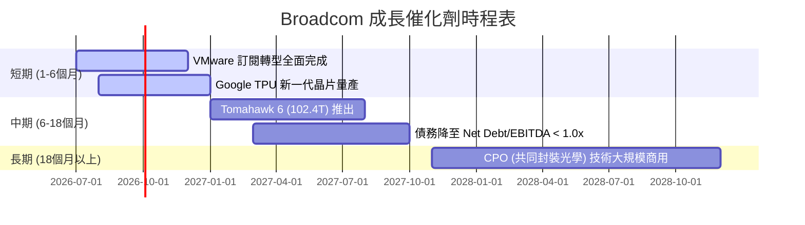

### 8.2 TAM（潛在市場規模）分析

```
╔══════════════════════════════════════════════════════════════════╗
║                  AVGO 核心市場 TAM 預測 (2028)                  ║
╠══════════════════════════════════════════════════════════════════╣
║                                                                  ║
║  AI 客製化 ASIC：  $50.0B  ████████████████████  滲透率: ~60%     ║
║  高階網通交換晶片：$25.0B  ██████████░░░░░░░░░░  滲透率: ~75%     ║
║  混合雲軟體：      $40.0B  ████████████████░░░░  滲透率: ~35%     ║
║                                                                  ║
║  📊 總計潛在市場規模 (TAM) 達 $115B，成長空間依然寬廣。          ║
╚══════════════════════════════════════════════════════════════════╝
```

### 8.3 成長驅動力結構圖

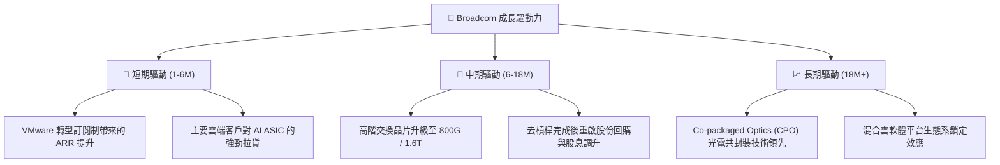

---

## 9. 風險矩陣

### 9.1 風險評分矩陣

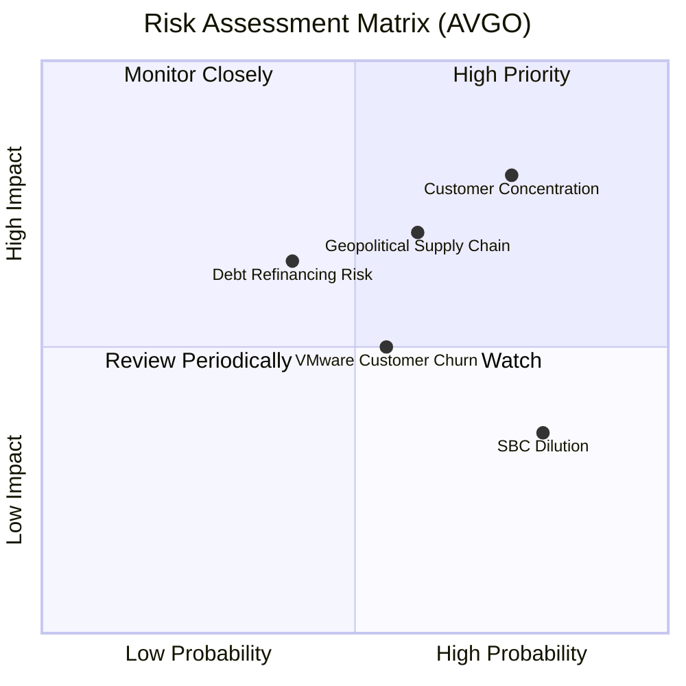

### 9.2 風險清單詳細分析

| # | 風險項目 | 發生機率 | 財務衝擊 | 風險評分 | 機構級緩解措施與對策 |
|---|----------|----------|----------|----------|----------------------|
| 1 | 🔴 **客戶集中度風險 (ASIC)** | 高 (75%) | 高 (-15% 營收) | 🔴 **8.0 / 10** | **加強客戶多元化**：積極接洽 Meta、ByteDance 等第二梯隊客戶，降低對 Google TPU 單一專案的依賴。 |
| 2 | 🟡 **地緣政治與供應鏈風險** | 中 (60%) | 高 (-12% 營收) | 🟡 **7.2 / 10** | **分散晶圓代工與封測**：與 TSMC 緊密合作，部分先進封裝（CoWoS）產線向美國、日本及台灣以外地區分散。 |
| 3 | 🟡 **VMware 客戶流失** | 中 (55%) | 中 (-8% 軟體營收) | 🟡 **6.5 / 10** | **聚焦大型企業（VCF）**：放棄部分利潤率極低的中小企業客戶，將資源集中於大型企業混合雲之高毛利合約。 |
| 4 | 🟡 **債務再融資壓力** | 低 (40%) | 中 (-5% 淨利) | 🟡 **5.2 / 10** | **加速去槓桿**：利用 TTM $27.21B 的強大自由現金流，計畫每年優先償還 $5.0B-$7.0B 的到期債務。 |

---

## 10. 投資建議

### 10.1 最終綜合評級雷達圖

```
╔══════════════════════════════════════════════════════════════╗
║                    AVGO 綜合評分雷達圖                       ║
╠══════════════════════════════════════════════════════════════╣
║ 財務健康 (Financial Health)   7.0/10 ▓▓▓▓▓▓▓▓▓▓▓▓▓▓░░░░░░    ║
║ 成長動能 (Growth Momentum)    8.5/10 ▓▓▓▓▓▓▓▓▓▓▓▓▓▓▓▓▓░░░    ║
║ 獲利品質 (Earnings Quality)   9.5/10 ▓▓▓▓▓▓▓▓▓▓▓▓▓▓▓▓▓▓▓░    ║
║ 護城河深度 (Moat Strength)    9.0/10 ▓▓▓▓▓▓▓▓▓▓▓▓▓▓▓▓▓▓░░    ║
║ 估值合理性 (Valuation Margin) 8.0/10 ▓▓▓▓▓▓▓▓▓▓▓▓▓▓▓▓░░░░    ║
╠══════════════════════════════════════════════════════════════╣
║ 綜合投資評級：🟢 強烈買入 (Strong Buy)  🏆 總分: 8.4 / 10   ║
╚══════════════════════════════════════════════════════════════╝
```

### 10.2 目標價與隱含報酬率

| 情境 | 權重 | 目標價 | 當前股價 | 隱含報酬率 | 機率加權預期回報 |
|------|------|--------|----------|------------|------------------|
| 🔴 **悲觀** | 20% | $312.50 | $394.28 | -20.7% | -4.1% |
| 🟡 **基準** | **60%** | **$485.50** | **$394.28** | **+23.1%** | **+13.9%** |
| 🟢 **樂觀** | 20% | $580.00 | $394.28 | +47.1% | +9.4% |
| **加權綜合**| **100%**| **$470.00** | **$394.28** | **+19.2%** | 🟢 **優異** |

### 10.3 買入時機與觸發因素

```
╔══════════════════════════════════════════════════════════════════╗
║                  ✅ AVGO 買入與交易策略 Checklist               ║
╠══════════════════════════════════════════════════════════════════╣
║                                                                  ║
║  立即買入觸發條件（多數符合時分批建倉）：                        ║
║  ✅ Forward P/E 降至 18.5x 以下 (隱含股價約 $360)               ║
║  ✅ VMware 季度營收成長率 (QoQ) 維持正值                         ║
║  ✅ 網通部門營收 YoY 成長率 > 25%                                ║
║                                                                  ║
║  加碼觸發條件（出現以下任一情況時積極加碼）：                    ║
║  ☐ 宣佈拿下除 Google、Meta 外的第三家大型雲端客戶之 ASIC 訂單    ║
║  ☐ 淨債務 / EBITDA 降至 1.0x 以下，管理層宣佈重啟大規模股份回購  ║
║                                                                  ║
║  減碼/停損觸發條件（出現以下任一情況時應果斷控制風險）：         ║
║  ☐ 主要客戶（Google/Meta）宣佈大幅縮減客製化 ASIC 預算           ║
║  ☐ 季度毛利率（Gross Margin）意外跌破 70.0%                      ║
║  ☐ 自由現金流轉換率（FCF / Net Income）連續兩季低於 100%         ║
║                                                                  ║
╚══════════════════════════════════════════════════════════════════╝
```

### 10.4 投資人適配度分析

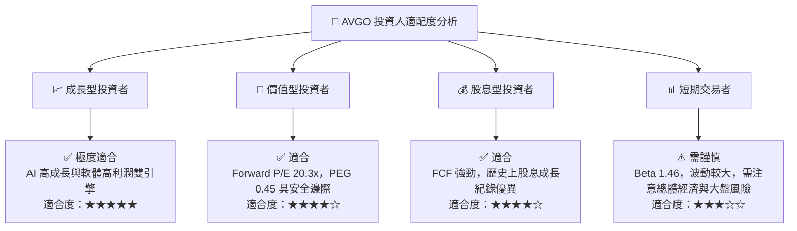

### 10.5 每季財報監控清單（Quarterly Watch List）

為確保本投資框架的持續有效性，投資人應在每季財報公佈時重點追蹤以下指標：

| 監控指標 | 基準值（當前） | 觸發【加碼】門檻 | 觸發【減碼/觀望】門檻 | 監控核心意義 |
|----------|----------------|------------------|-----------------------|--------------|
| **Non-GAAP 毛利率** | 76.3% | 📈 > 78.0% | 📉 < 72.0% | 衡量 VMware 的定價權與高毛利軟體佔比是否持續提升。 |
| **AI 網通營收佔比** | ~35.0% (半導體) | 📈 > 45.0% | 📉 < 28.0% | 檢驗 AI 需求是否如預期般強勁，或僅是短期過度拉貨（Double Ordering）。 |
| **季度自由現金流 (FCF)** | $10.26B (Q2'26) | 📈 > $11.50B | 📉 < $8.00B | 確保公司有足夠的現金用於去槓桿與發放股息。 |
| **淨債務 / EBITDA** | 1.30x | 📈 < 1.00x | 📉 > 2.00x | 監控去槓桿進度，低於 1.0x 將是重啟回購的關鍵催化劑。 |
| **稀釋股數 YoY 變化** | +1.88% | 📈 < +1.00% | 📉 > +3.00% | 監控股權薪酬（SBC）對每股盈餘的稀釋程度。 |

### 10.6 反面論證：什麼會證明論點錯誤（What Would Change My Mind）

```
╔══════════════════════════════════════════════════════════════════╗
║              ⚠️ 論點失效條件（Disconfirming Evidence）           ║
╠══════════════════════════════════════════════════════════════════╣
║  本投資論點在下列情況成立時應重新檢視或果斷退出：                ║
║                                                                  ║
║  ☐ 核心半導體部門營收成長率連續兩季跌破 15.0% (YoY)              ║
║  ☐ 營業利益率（Operating Margin）較峰值收縮 > 5.0 pp (百分點)    ║
║  ☐ 自由現金流轉換率（FCF / Net Income）連續兩季跌破 100%         ║
║  ☐ ROIC 跌破 15.0%（顯示併購綜效完全消失，資本配置效率大幅惡化） ║
║  ☐ 關鍵 AI 客戶（如 Google）宣佈全面轉向自研光學元件，排除 AVGO  ║
║                                                                  ║
╚══════════════════════════════════════════════════════════════════╝
```

---

> **免責聲明**：本報告為基於客觀財務數據之學術研究與投資分析，僅供參考，不構成任何形式的投資建議。投資人應獨立評估風險，並對其投資決策承擔完全責任。