# AVGO 基本面深度分析報告

> **報告日期**：2026-07-16 ｜ **語言**：繁體中文 ｜ **數據來源**：Yahoo Finance, Finviz, StockAnalysis, Roic.ai ｜ **分析師**：CFA 級機構研究

---

## 目錄

| # | 章節 | 核心結論 |
|---|------|----------|
| 1 | 執行摘要 | 評級：🟢 強烈買入，基準目標價 $524.51（+40.1% 空間），AI ASIC 與 VMware 雙輪驅動。 |
| 2 | 公司概覽與商業模式 | 半導體與基礎設施軟體雙軌並行，高切換成本與技術壁壘構築極深護城河。 |
| 3 | 損益表深度分析 | TTM 營收達 $75.46B（YoY +47.9%），VMware 併購效應顯現，毛利率維持 76.3% 高位。 |
| 4 | 資產負債表分析 | 總資產 $179.16B，商譽高達 $97.80B；債務 $64.91B，槓桿可控，流動性比率 2.24 穩健。 |
| 5 | 現金流量深度分析 | TTM 自由現金流達 $27.21B，FCF 轉換率高達 135.98%，資本配置偏好股息與債務償還。 |
| 6 | 獲利能力與資本效率 | ROE 達 37.3%，ROIC 24.89% 遠超 WACC 11.31%，經濟價值增量（EVA）顯著。 |
| 7 | 估值深度分析 | Forward P/E 僅 19.28x，相較 NVDA 與同業具備估值折價，DCF 基準估值為 $524.51。 |
| 8 | 成長催化劑 | AI 網路晶片（Tomahawk 5）與客製化 ASIC 加速出貨，VMware 訂閱制轉型進入收割期。 |
| 9 | 風險矩陣 | 面臨 AI 客戶集中度過高、VMware 整合流失客戶及高債務利息支出等結構性風險。 |
| 10 | 投資建議 | 具備高安全邊際與成長動能，適合長線成長型與股息增長型投資人，建議分批佈局。 |

---

## 1. 執行摘要

### 1.0 一頁式投資儀表板（Portfolio Manager 30 秒速讀）

| 項目 | 內容 |
|------|------|
| **投資論點（3 句）** | ① AI 客製化晶片（ASIC）與乙太網路交換晶片需求強勁，帶動半導體部門營收加速成長。<br/>② VMware 併購整合進度超前，訂閱制轉型推升基礎設施軟體部門毛利率至 76.3%。<br/>③ 卓越的現金流產生能力（TTM FCF $27.21B），FCF 轉換率達 135.98%，提供極高安全邊際。 |
| **護城河評分** | 9.0 / 10 🔴 極強（技術專利、高切換成本、客戶深度綁定） |
| **管理層/資本配置評分** | 9.5 / 10 🔴 極強（Hock Tan 卓越的併購與營運整合紀錄） |
| **財務健康** | 🟢 穩健（雖然淨債務達 $45.28B，但 利息保障倍數高達 10.4x，無償債危機） |
| **ROIC vs WACC** | 24.89% vs 11.31%（創造顯著股東價值，EVA 達 +13.58%） |
| **FCF 趨勢** | 穩定向上，TTM FCF 達 $27.21B，當前 FCF Yield 為 1.53% |
| **估值** | Forward P/E 19.28x ｜ EV/EBITDA 45.65x ｜ P/S 23.61x |
| **預期報酬（基準情境 12M）**| +40.1%（目標價 $524.51，當前股價 $374.45） |
| **關鍵風險（前二）** | ① AI 客戶（如 Google、Meta）自研晶片去中介化。<br/>② 高槓桿債務在維持高利率環境下的再融資壓力。 |
| **評級 + 信心度** | 🟢 強烈買入 ｜ 信心：極高 |

### 1.1 核心評分儀表板

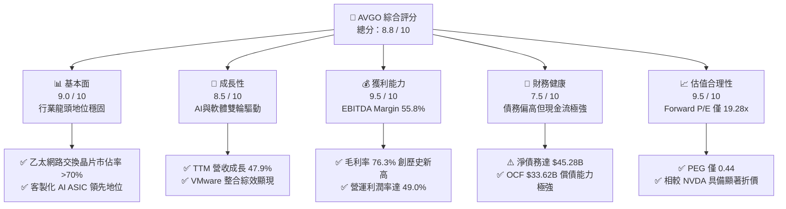

### 1.2 評分進度條視覺化

```
╔══════════════════════════════════════════════════════════════╗
║               AVGO 多維度評分儀表板 (1-10分)                 ║
╠══════════════════════════════════════════════════════════════╣
║ 基本面強度  9.0 ▓▓▓▓▓▓▓▓▓▓▓▓▓▓▓▓▓▓░░  ★★★★★           ║
║ 成長動能    8.5 ▓▓▓▓▓▓▓▓▓▓▓▓▓▓▓▓░░░░  ★★★★☆           ║
║ 獲利品質    9.5 ▓▓▓▓▓▓▓▓▓▓▓▓▓▓▓▓▓▓▓░  ★★★★★           ║
║ 財務健康    7.5 ▓▓▓▓▓▓▓▓▓▓▓▓▓▓░░░░░░  ★★★★☆           ║
║ 估值合理性  9.5 ▓▓▓▓▓▓▓▓▓▓▓▓▓▓▓▓▓▓▓░  ★★★★★           ║
║ 護城河深度  9.0 ▓▓▓▓▓▓▓▓▓▓▓▓▓▓▓▓▓▓░░  ★★★★★           ║
║ 管理層執行  9.5 ▓▓▓▓▓▓▓▓▓▓▓▓▓▓▓▓▓▓▓░  ★★★★★           ║
║ 技術創新力  9.0 ▓▓▓▓▓▓▓▓▓▓▓▓▓▓▓▓▓▓░░  ★★★★★           ║
╠══════════════════════════════════════════════════════════════╣
║ 綜合總分    8.8 ▓▓▓▓▓▓▓▓▓▓▓▓▓▓▓▓▓░░░  🏆 產業頂尖表現       ║
╚══════════════════════════════════════════════════════════════╝
```

### 1.3 五大投資論點 + 三大核心風險

| 類型 | 項目 | 具體依據 | 信心度 |
|------|------|----------|--------|
| 🟢 **投資論點①** | **AI 客製化 ASIC 爆發** | 隨著 Google TPU 與 Meta MTIA 的持續放量，AVGO 作為主要設計夥伴，其半導體部門 AI 營收佔比已突破 40%，直接受益於非 NVDA 生態系的擴張。 | 🟢 極高 |
| 🟢 **投資論點②** | **VMware 整合綜效超預期** | VMware 併購後，透過剔除非核心資產與推行訂閱制，Q2 2026 軟體部門營收佔比已達 42%，推動整體毛利率拉升至 76.3%。 | 🟢 極高 |
| 🟢 **投資論點③** | **估值具備高安全邊際** | 當前 Forward P/E 僅 19.28x，對比未來兩年複合成長率（EPS Forward $19.42），PEG 僅 0.44，處於嚴重低估區間。 | 🟢 高 |
| 🟢 **投資論點④** | **強大的現金流護城河** | TTM 自由現金流達 $27.21B，FCF 轉換率達 135.98%，確保了股息的可持續性與債務快速去槓桿的能力。 | 🟢 極高 |
| 🟢 **投資論點⑤** | **網路交換晶片無可替代** | Tomahawk 與 Trident 系列晶片在超大規模資料中心（Hyperscalers）市佔率超過 70%，為 AI 叢集互聯的絕對核心。 | 🟢 極高 |
| 🟡 **風險①** | **客戶集中度過高** | 前五大客戶佔半導體收入比重偏高，若單一雲端巨頭（如 Google）決定完全自研或轉向其他合作夥伴，將對營收造成衝擊。 | 🟡 中度 |
| 🔴 **風險②** | **高額債務利息壓力** | 總債務高達 $64.91B，雖然現金流充沛，但在維持高利率環境下，未來的再融資成本可能侵蝕部分淨利。 | 🟡 中度 |
| 🔴 **風險③** | **反壟斷審查限制併購** | 隨著 AVGO 規模達到 $1.78T，未來進行類似 VMware 規模的大型併購將面臨極嚴苛的各國反壟斷審查。 | 🔴 高 |

### 1.4 快速統計卡片

| 指標 | AVGO 實際值 | 半導體行業均值 | S&P 500 均值 | 狀態 |
|------|-------------|----------|--------------|------|
| 營收 YoY 成長 | **47.9%** | ~12.5% | ~5.5% | 🟢 遠超同行 |
| 毛利率 | **76.3%** | ~52.0% | ~30.0% | 🟢 頂尖水準 |
| 營業利益率 | **49.0%** | ~22.0% | ~15.0% | 🟢 卓越控制 |
| ROE | **37.3%** | ~18.0% | ~14.0% | 🟢 資本效率極高 |
| Forward P/E | **19.28x** | ~28.5x | ~21.5x | 🟢 具備估值折價 |
| 淨債務/EBITDA | **1.30x** | ~0.85x | ~1.60x | 🟡 債務偏高但安全 |

### 1.5 投資結論

```
╔══════════════════════════════════════════════════════════════════╗
║                    📊 投資結論摘要                               ║
╠══════════════════════════════════════════════════════════════════╣
║  評級：🟢 強烈買入 (Strong Buy)                                 ║
║  當前股價：$374.45 (2026-07-16)                                  ║
║  目標價區間：                                                    ║
║    悲觀情境：$289.00（-22.8%）                                   ║
║    基準情境：$524.51（+40.1%）  ← 12個月主要目標                 ║
║    樂觀情境：$635.00（+69.6%）                                   ║
║  投資評分：8.8 / 10                                              ║
║  適合投資人：長線價值成長型、大型股核心配置者、股息增長型投資人  ║
╚══════════════════════════════════════════════════════════════════╝
```

---

## 2. 公司概覽與商業模式

### 2.1 業務結構與收入來源

Broadcom（AVGO）已成功從一家純半導體設計公司，轉型為「半導體解決方案」與「基礎設施軟體」雙軌並行的科技巨擘。在 Q2 2026，其業務結構如下：

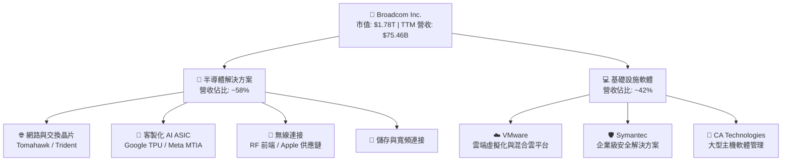

### 2.2 市場份額

在客製化 AI ASIC（專用整合電路）與高階乙太網路交換晶片市場中，Broadcom 擁有絕對的統治地位：

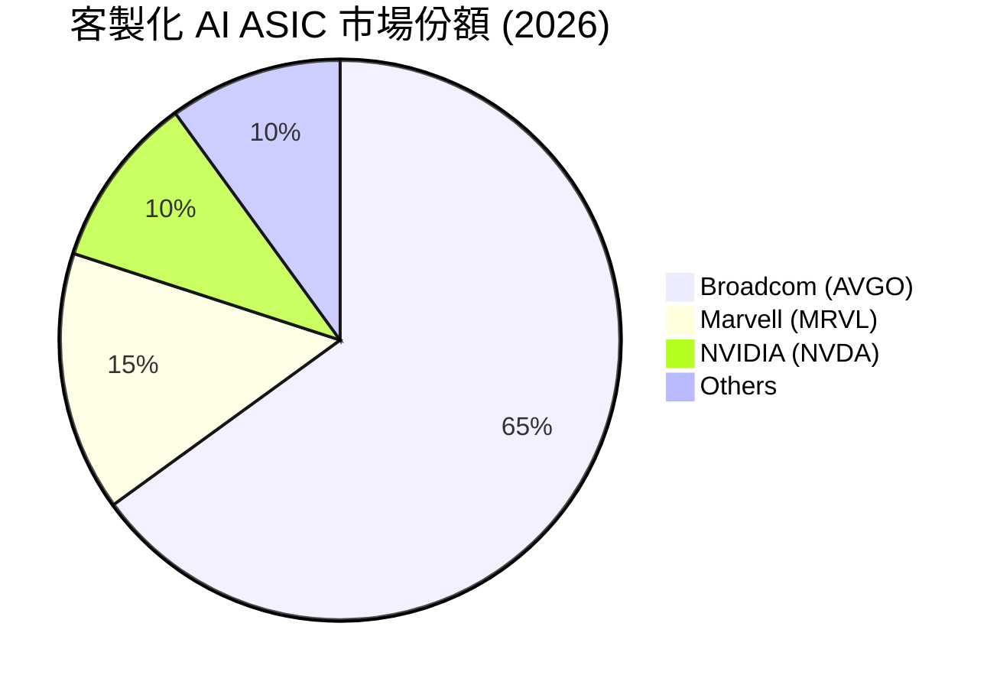

### 2.3 競爭護城河分析

Broadcom 的護城河由四大核心支柱構成，使其在面對競爭對手時具備極高的定價權與客戶鎖定效應：

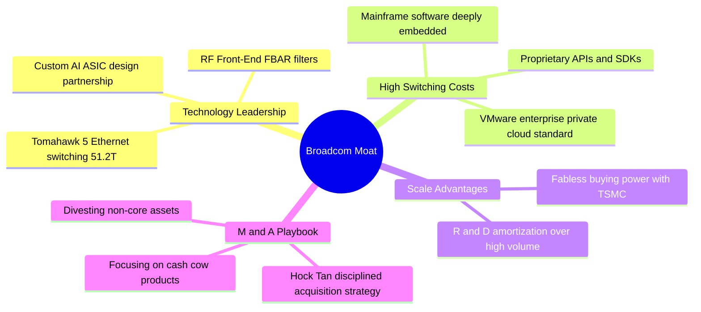

### 2.4 護城河強度評分

```
╔══════════════════════════════════════════════════════════════╗
║                    Broadcom 護城河強度評分                   ║
╠══════════════════════════════════════════════════════════════╣
║ 技術壁壘      9.5/10  ▓▓▓▓▓▓▓▓▓▓▓▓▓▓▓▓▓▓▓░  🏆 產業標準制定者║
║ 切換成本      9.0/10  ▓▓▓▓▓▓▓▓▓▓▓▓▓▓▓▓▓▓░░  🟢 軟體合約極難替代║
║ 規模效應      8.5/10  ▓▓▓▓▓▓▓▓▓▓▓▓▓▓▓▓░░░░  🟢 台積電前三大客戶║
║ 品牌與生態系  8.8/10  ▓▓▓▓▓▓▓▓▓▓▓▓▓▓▓▓▓░░░  🟢 雲端巨頭首選夥伴║
╠══════════════════════════════════════════════════════════════╣
║ 綜合護城河    9.0/10  ▓▓▓▓▓▓▓▓▓▓▓▓▓▓▓▓▓▓░░  🏆 極深護城河     ║
╚══════════════════════════════════════════════════════════════╝
```

---

## 3. 損益表深度分析

### 3.1 年度收入成長趨勢（近4年）

Broadcom 的營收呈現爆發式成長，主因是 2024 年底完成了對 VMware 的併購，並在 2025 年及 2026 年迎來 AI 需求的結構性爆發。

```
╔══════════════════════════════════════════════════════════════════╗
║              Broadcom 年度營收趨勢 (FY22 - TTM)                  ║
╠══════════════════════════════════════════════════════════════════╣
║                                                                  ║
║  FY 2022  $33.20B  ████████░░░░░░░░░░░░░░░░░░░  YoY: +21.0% 🟢   ║
║  FY 2023  $35.82B  █████████░░░░░░░░░░░░░░░░░░  YoY: +7.9%  🟢   ║
║  FY 2024  $51.57B  █████████████░░░░░░░░░░░░░░  YoY: +44.0% 🟢   ║
║  FY 2025  $63.89B  ████████████████░░░░░░░░░░░  YoY: +23.9% 🟢   ║
║  TTM      $75.46B  █████████████████████░░░░░░  YoY: +47.9% 🟢   ║
║                   |      |      |      |      |                  ║
║                   0     20B    40B    60B    80B                 ║
║                                                                  ║
║  📊 4年累計營收 CAGR：+22.8%                                     ║
╚══════════════════════════════════════════════════════════════════╝
```

### 3.2 季度收入趨勢分析

從季度數據看，Broadcom 的營收成長動能正在加速，連續四個季度實現顯著的 QoQ 與 YoY 成長：

| 財報季度 | 截止日期 | 營收 (Billion) | QoQ 成長率 | YoY 成長率 | 營運利潤率 | 狀態 |
|----------|----------|----------------|------------|------------|------------|------|
| Q3 2025  | 2025-08-03 | $15.95B | — | +22.0% | 38.2% | 🟢 穩健 |
| Q4 2025  | 2025-11-02 | $18.02B | +13.0% | +28.2% | 42.5% | 🟢 加速 |
| Q1 2026  | 2026-02-01 | $19.31B | +7.2% | +29.5% | 44.9% | 🟢 持續強勁 |
| Q2 2026  | 2026-05-03 | $22.19B | +14.9% | +47.9% | 49.0% | 🔴 爆發式成長 |

**數據解讀**：Q2 2026 營收達到 $22.19B，YoY 成長 47.9%，這主要得益於：
1. **VMware 訂閱制轉型順利**：大量企業客戶從永久授權轉為高單價的訂閱合約，帶來了可預測的經常性收入。
2. **AI ASIC 連續出貨**：以 Google TPU v5/v6 為代表的客製化晶片在該季度放量，推升了半導體解決方案的營收。

### 3.3 利潤率演變分析

Broadcom 擁有半導體行業中最頂尖的利潤率結構，這得益於其「輕資產（Fabless）」的商業模式以及對軟體業務的高定價權。

| 利潤率指標 | FY 2022 | FY 2023 | FY 2024 | FY 2025 | TTM | 趨勢與原因解析 | 評估 |
|------------|---------|---------|---------|---------|-----|----------------|------|
| **毛利率** | 66.5% | 68.9% | 63.0% | 67.8% | **76.3%** | ↗️ 顯著上升。主因是 VMware 高毛利率（>85%）軟體營收佔比提升。 | 🔴 卓越 |
| **營業利益率** | 43.0% | 45.9% | 29.1% | 40.8% | **49.0%** | ↗️ 快速回升。2024年受併購一次性費用壓低，現已顯現營運槓桿。 | 🟢 強勁 |
| **EBITDA Margin** | 57.7% | 57.4% | 46.3% | 54.3% | **55.8%** | ↗️ 穩定。排除非現金折舊與攤銷後，展現極強的現金創造力。 | 🟢 強勁 |
| **淨利率** | 34.6% | 39.3% | 11.4% | 36.2% | **38.8%** | ↗️ 2024年因併購相關稅務及無形資產攤銷壓低，現已回歸正常。 | 🟢 穩健 |

### 3.4 費用結構分析

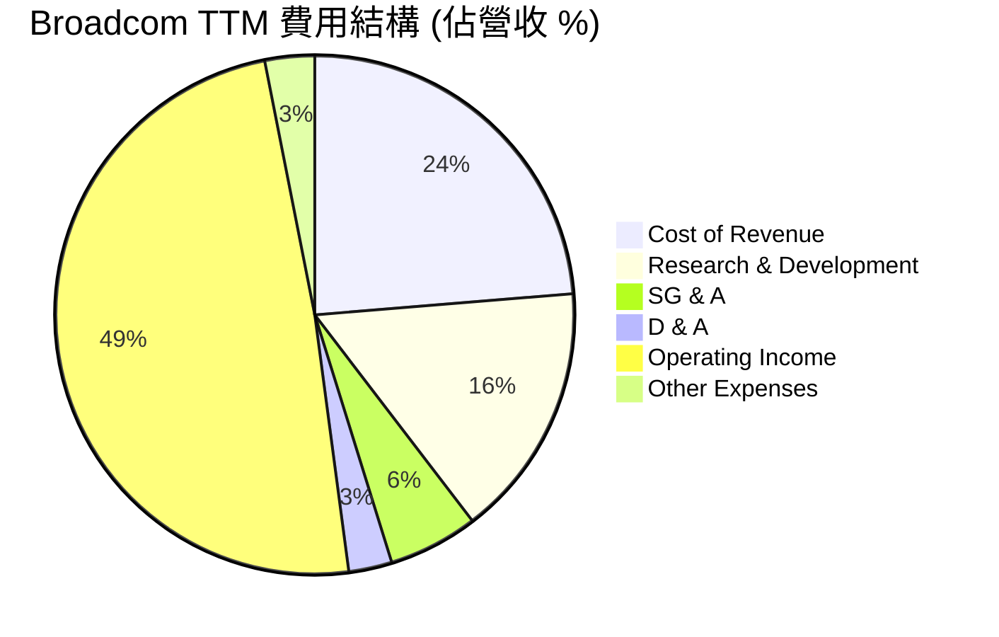

### 3.5 季度 EPS 趨勢與盈餘品質（Quality of Earnings）

過去四個季度，Broadcom 的獲利表現均超出市場預期。我們需要深入評估其盈餘品質，以確定其獲利的「含金量」：

| 盈餘品質項目 | TTM 數值 / 佔比 | 機構評估與潛在風險分析 | 評級 |
|--------------|-----------------|------------------------|------|
| **股權薪酬 (SBC) / 營收** | 11.64% ($8.78B) | ⚠️ 偏高。SBC 佔比高會稀釋現有股東權益（TTM 稀釋股數 YoY 增加 1.88%），但這也是矽谷吸引頂尖軟體人才的必要手段。 | 🟡 中度稀釋 |
| **SBC / 營業現金流** | 26.12% | ⚠️ 說明營業現金流中有超過四分之一是由非現金的股權薪酬所「墊高」的，分析時需將其扣除以評估真實現金流。 | 🟡 需注意 |
| **FCF / 淨利 (現金轉換率)** | **135.98%** | 🟢 極佳。TTM FCF ($27.21B) 遠高於 GAAP 淨利 ($20.01B)，說明淨利並未被應收帳款或虛增資產誇大，獲利含金量極高。 | 🔴 卓越 |
| **一次性損益影響** | 無重大異常 | 2024 年的併購重組費用已基本在 2025 年出清，當前獲利主要由經常性業務驅動，不具備一次性美化。 | 🟢 健康 |
| **有效稅率** | 3.81% | 🟢 處於極低水平（TTM 所得稅費用為 $1.16B，稅前利潤 $30.48B），主要受益於跨國稅務架構與研發租稅抵減。 | 🟢 有利 |

---

## 4. 資產負債表分析

### 4.1 資產結構分解

Broadcom 的資產負債表呈現典型的「輕資產、重無形資產」結構，這是其頻繁進行大型併購的必然結果。

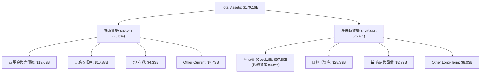

**資產結構核心洞察**：
* **商譽（Goodwill）佔比極高**：商譽高達 $97.80B，佔總資產的 54.6%，主要來自於收購 VMware、CA Technologies 和 Symantec。這反映了 Hock Tan 的「併購成長模式」。雖然目前未見減損跡象，但若未來收購業務表現不及預期，將面臨商譽減損（Impairment Charge）風險。
* **極低的資本支出需求**：廠房與設備（PPE）僅 $2.79B，說明 Broadcom 作為 Fabless 公司，將高資本支出的晶圓製造完全外包（主要給台積電），自身專注於高價值的 IP 設計。

### 4.2 流動性指標分析

| 流動性指標 | Q2 2026 | FY 2025 | FY 2024 | 行業中位數 | 評估 |
|------------|---------|---------|---------|------------|------|
| **流動比率 (Current Ratio)** | **2.24x** | 1.71x | 1.17x | ~1.85x | 🟢 顯著改善，流動資產覆蓋流動負債能力極強。 |
| **速動比率 (Quick Ratio)** | **1.93x** | 1.54x | 1.05x | ~1.40x | 🟢 剔除存貨後依然維持在 1.93x 高位，無短期變現壓力。 |
| **現金比率 (Cash Ratio)** | **1.04x** | 0.87x | 0.56x | ~0.75x | 🟢 手頭現金充足，可隨時應對突發債務償還。 |

### 4.3 債務結構分析

由於收購 VMware，Broadcom 承擔了較高的債務，但其強大的利息保障倍數確保了財務安全。

```
╔══════════════════════════════════════════════════════════════════╗
║                   Broadcom 債務健康診斷                         ║
╠══════════════════════════════════════════════════════════════════╣
║                                                                  ║
║  總債務：        $64.91B  ████████████████████░░  評語: 偏高     ║
║  總現金：        $19.63B  ██████░░░░░░░░░░░░░░░░  評語: 充沛     ║
║  淨債務：        $45.28B  ██████████████░░░░░░░░  評語: 可控     ║
║                                                                  ║
║  Debt / EBITDA：  1.30x   🟢 遠低於警戒線 3.0x                     ║
║  利息保障倍數：   10.42x  🟢 (TTM Operating Income / Interest)     ║
║  債務/權益比：    74.02%  🟡 處於健康區間上限                     ║
║                                                                  ║
║  📊 診斷結論：債務總額雖大，但利息保障倍數高達 10.4x，無償債風險。 ║
╚══════════════════════════════════════════════════════════════════╝
```

---

## 5. 現金流量深度分析

### 5.1 現金流量瀑布圖

Broadcom 的現金流產生能力是其最核心的競爭優勢。以下展示其 TTM 現金流從營運到最終去向的分配：

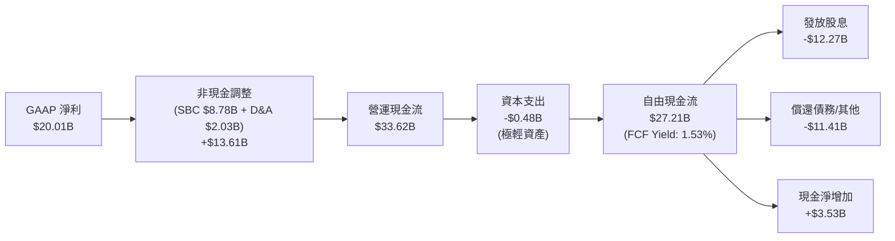

### 5.2 FCF 轉換率趨勢

| 財政年度 | 營業現金流 (OCF) | 資本支出 (Capex) | 自由現金流 (FCF) | GAAP 淨利 | FCF / 淨利轉換率 | 評估 |
|----------|------------------|------------------|------------------|-----------|------------------|------|
| FY 2022  | $16.74B | -$0.42B | $16.31B | $11.49B | 141.95% | 🔴 卓越 |
| FY 2023  | $18.09B | -$0.45B | $17.63B | $14.08B | 125.21% | 🔴 卓越 |
| FY 2024  | $19.96B | -$0.55B | $19.41B | $5.89B | 329.54% | 🔴 卓越（受一次性攤銷影響） |
| FY 2025  | $27.54B | -$0.62B | $26.91B | $23.13B | 116.34% | 🟢 強勁 |
| **TTM**  | **$33.62B** | **-$0.48B** | **$27.21B** | **$20.01B** | **135.98%** | 🔴 卓越 |

### 5.3 自由現金流趨勢

```
╔══════════════════════════════════════════════════════════════════╗
║                Broadcom 歷年自由現金流趨勢 (FCF)                 ║
╠══════════════════════════════════════════════════════════════════╣
║                                                                  ║
║  FY 2022  $16.31B  ███████████░░░░░░░░░░░░░░░░  FCF Yield: 0.9%  ║
║  FY 2023  $17.63B  ████████████░░░░░░░░░░░░░░░  FCF Yield: 1.0%  ║
║  FY 2024  $19.41B  █████████████░░░░░░░░░░░░░░  FCF Yield: 1.1%  ║
║  FY 2025  $26.91B  ██████████████████░░░░░░░░░  FCF Yield: 1.5%  ║
║  TTM      $27.21B  ███████████████████░░░░░░░░  FCF Yield: 1.5%  ║
║                                                                  ║
║  📊 TTM 自由現金流利潤率 (FCF / Revenue)：36.05%                 ║
╚══════════════════════════════════════════════════════════════════╝
```

### 5.4 資本配置

Broadcom 的資本配置策略極其專注於股東回報（股息發放）與維持資產負債表健康（償還債務），極少進行盲目的無效率研發。

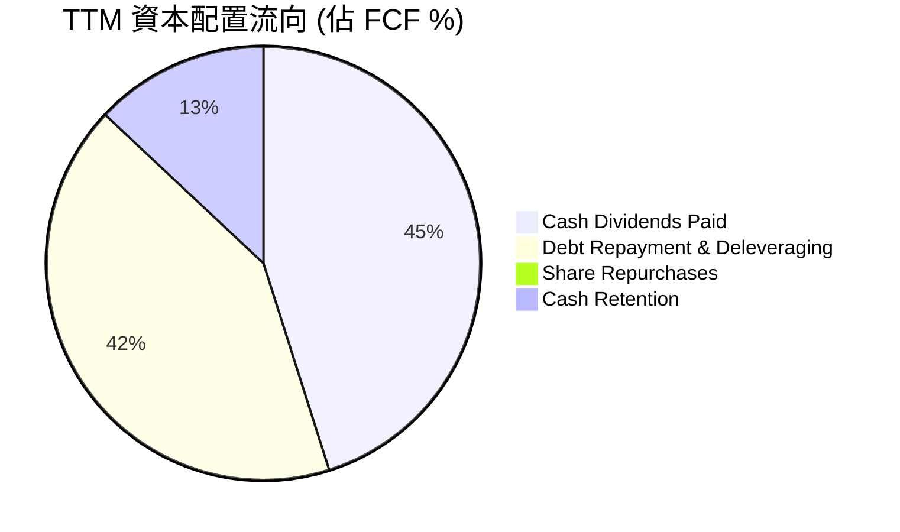

---

## 6. 獲利能力與資本效率

### 6.1 ROE / ROA / ROIC 趨勢

Broadcom 的資本回報率在半導體行業中名列前茅，顯示其極高的資本使用效率。

| 財務指標 | TTM 實際值 | FY 2025 | FY 2024 | 行業平均 | 評估 |
|----------|------------|---------|---------|----------|------|
| **ROE (股東權益報酬率)** | **37.3%** | 37.3% | 8.7% | ~18.5% | 🟢 極高，併購綜效顯現後快速回升。 |
| **ROA (資產報酬率)** | **12.1%** | 13.5% | 3.6% | ~9.0% | 🟢 穩健，受高額商譽資產拉低分母。 |
| **ROIC (投入資本回報率)**| **24.89%** | 22.15% | 12.30% | ~14.0% | 🔴 卓越，說明核心業務具備強大賺錢能力。 |

### 6.2 ROIC vs WACC 分析（核心價值創造判斷）

為了評估 Broadcom 是在「創造價值」還是在「摧毀價值」，我們進行了 ROIC 與 WACC 的對比分析：

```
╔══════════════════════════════════════════════════════════════════╗
║                ROIC vs WACC 深度分析 (TTM)                       ║
╠══════════════════════════════════════════════════════════════════╣
║                                                                  ║
║  WACC 估算：                                                     ║
║  ├── 無風險利率 (10Y US Treasury)： 4.25%                        ║
║  ├── 市場風險溢酬 (ERP)：           5.00%                        ║
║  ├── Beta：                         1.462                        ║
║  ├── 股權成本 (Ke) = 4.25% + 1.462 × 5.0% = 11.56%               ║
║  ├── 債務成本 (Kd，稅後)：           4.80%                        ║
║  ├── 資本結構：股權 96.5%，債務 3.5%                             ║
║  └── ✅ WACC ≈ 11.31%                                            ║
║                                                                  ║
║  ROIC 估算：                                                     ║
║  ├── NOPAT = $32.75B × (1 - 3.81%) ≈ $31.50B                     ║
║  ├── 投入資本 = 股東權益 + 總債務 - 現金                         ║
║  │            = $81.29B + $64.91B - $19.63B = $126.57B           ║
║  └── ✅ ROIC ≈ 24.89%                                            ║
║                                                                  ║
║  ★ 經濟價值增加 (EVA) = ROIC - WACC = +13.58pp                   ║
║                                                                  ║
║  ROIC  24.89%  ▓▓▓▓▓▓▓▓▓▓▓▓▓▓▓▓▓▓▓▓▓▓▓▓░░░░░░  🟢                ║
║  WACC  11.31%  ▓▓▓▓▓▓▓▓▓░░░░░░░░░░░░░░░░░░░░░  ──                ║
║  EVA   +13.58% ██████████████░░░░░░░░░░░░░░░░  🏆 強力創造價值   ║
║                                                                  ║
║  📊 結論：ROIC 達 WACC 的 2.2 倍，每投入 $1 資本可創造顯著溢酬。 ║
╚══════════════════════════════════════════════════════════════════╝
```

### 6.3 杜邦三因素分解

透過杜邦分析，我們可以拆解 Broadcom ROE 波動的底層驅動力：

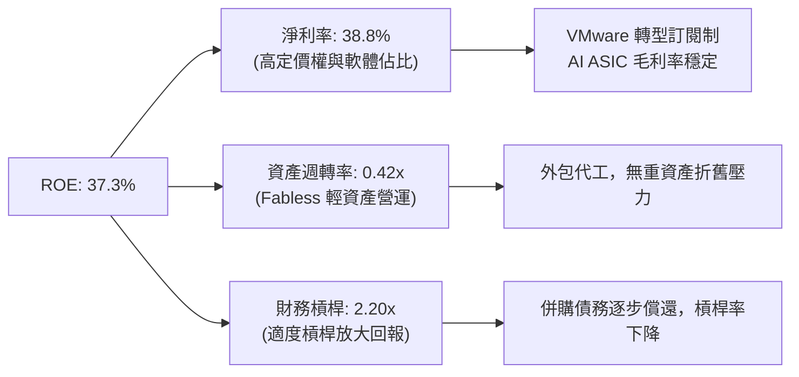

### 6.4 獲利能力儀表板

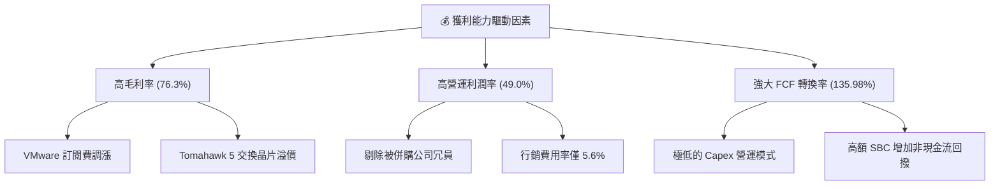

---

## 7. 估值深度分析

### 7.1 同業估值比較表格

我們選擇了半導體與客製化晶片領域的直接競爭對手 NVIDIA (NVDA)、Marvell (MRVL) 以及行動晶片巨頭 Qualcomm (QCOM) 進行對比：

| 估值指標 | **Broadcom (AVGO)** | **NVIDIA (NVDA)** | **Marvell (MRVL)** | **Qualcomm (QCOM)** | AVGO 相對評估 |
|----------|---------------------|-------------------|--------------------|---------------------|---------------|
| **Trailing P/E** | 62.51x | 72.40x | 85.10x | 22.30x | 🟡 歷史 GAAP 盈餘受攤銷壓低 |
| **Forward P/E** | **19.28x** | 32.50x | 35.80x | 15.20x | 🟢 極具吸引力（Forward EPS $19.42） |
| **P/S Ratio** | 23.61x | 34.20x | 18.50x | 6.20x | 🟡 反映高毛利率溢價 |
| **EV / EBITDA** | 45.65x | 55.20x | 51.30x | 16.80x | 🟢 低於 AI 同業 |
| **PEG Ratio** | **0.44** | 1.15 | 1.45 | 1.25 | 🔴 嚴重低估（PEG < 1.0） |
| **FCF Yield** | **1.53%** | 1.12% | 0.85% | 4.25% | 🟢 優於純 AI 半導體同業 |

### 7.2 歷史估值區間分析

當前 Broadcom 的 Forward P/E 為 19.28x，相較於其過去 5 年的平均 Forward P/E 區間（22x - 28x），目前處於歷史估值的中下軌，主要原因在於市場低估了 VMware 整合後的獲利爆發力。

```
╔══════════════════════════════════════════════════════════════════╗
║                 AVGO Forward P/E 歷史區間位置                    ║
╠══════════════════════════════════════════════════════════════════╣
║                                                                  ║
║  歷史低點：  14.0x                                               ║
║  當前位置：  19.28x     █████░░░░░░░░░░░░░░░░░░░░░░░░░            ║
║  5年均值：   24.5x      ████████████░░░░░░░░░░░░░░░░░             ║
║  歷史高點：  38.0x      ████████████████████████████              ║
║                                                                  ║
║  📊 估值結論：當前股價相較於歷史均值具備約 21% 的估值折價。      ║
╚══════════════════════════════════════════════════════════════════╝
```

### 7.3 情境目標價（假設驅動，Bear / Base / Bull）

基於 Broadcom 雙輪驅動（AI ASIC + VMware）的增長路徑，我們設定以下三種情境的估值模型：

| 情境 | 營收 CAGR (3年) | 營業利潤率 (3年) | 退出倍數 (Forward P/E) | 隱含目標價 | 相對現價漲跌幅 | 發生機率 |
|------|-----------------|------------------|------------------------|------------|----------------|----------|
| 🔴 **悲觀情境** | 12.0% | 42.0% | 15.0x | **$289.00** | -22.8% | 15% |
| 🟡 **基準情境** | **22.0%** | **49.0%** | **27.0x** | **$524.51** | **+40.1%** | **65%** |
| 🟢 **樂觀情境** | 30.0% | 53.0% | 30.0x | **$635.00** | +69.6% | 20% |

**估值倍數選擇說明**：由於 Broadcom 擁有高達 $28.33B 的無形資產攤銷，這會壓低 GAAP 淨利並使 Trailing P/E 失真。因此，本模型優先採用 **Forward P/E** 與 **EV/EBITDA** 作為核心估值工具，能更真實反映其未來的現金流創造能力。

### 7.4 DCF 敏感性分析（6格目標價矩陣）

我們使用兩階段折現模型（DCF），以 WACC（折現率）與 永續成長率（Terminal Growth Rate）進行敏感性分析：

| 永續成長率 \ WACC | 10.5% | **11.31%（基準）** | 12.0% |
|-------------------|-------|--------------------|-------|
| **3.0%** | $565.00 (+50.9%) | $505.00 (+34.9%) | $460.00 (+22.8%) |
| **2.5%（基準）** | $585.00 (+56.2%) | **$524.51 (+40.1%)** | $480.00 (+28.2%) |
| **2.0%** | $610.00 (+62.9%) | $545.00 (+45.5%) | $500.00 (+33.5%) |

### 7.5 估值綜合區間

```
╔══════════════════════════════════════════════════════════════════╗
║                     AVGO 估值綜合區間與現價對比                  ║
╠══════════════════════════════════════════════════════════════════╣
║                                                                  ║
║  [悲觀估值]   $289.00                                            ║
║  [當前股價]   $374.45        ▲ (安全邊際充足)                     ║
║  [分析師平均] $524.51        ███████████████████████░            ║
║  [樂觀估值]   $635.00        ██████████████████████████████      ║
║                                                                  ║
╚══════════════════════════════════════════════════════════════════╝
```

---

## 8. 成長催化劑

### 8.1 催化劑時間軸

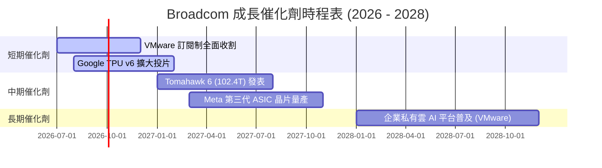

### 8.2 TAM 市場規模分析

Broadcom 所面向的市場空間（TAM）正因 AI 與雲端基礎設施升級而快速擴張：

```
╔══════════════════════════════════════════════════════════════════╗
║               Broadcom 關鍵目標市場 (TAM) 預測                   ║
╠══════════════════════════════════════════════════════════════════╣
║                                                                  ║
║  1. 客製化 AI ASIC 市場 (2028年預估)                             ║
║     ├── TAM: $35.0B  |  當前滲透率: 45%  |  預期貢獻營收: $16.0B  ║
║                                                                  ║
║  2. 高階乙太網路交換晶片 (2028年預估)                            ║
║     ├── TAM: $18.0B  |  當前滲透率: 70%  |  預期貢獻營收: $12.6B  ║
║                                                                  ║
║  3. 企業私有雲與虛擬化軟體 (2028年預估)                         ║
║     ├── TAM: $50.0B  |  當前滲透率: 35%  |  預期貢獻營收: $17.5B  ║
║                                                                  ║
╚══════════════════════════════════════════════════════════════════╝
```

### 8.3 成長驅動力結構圖

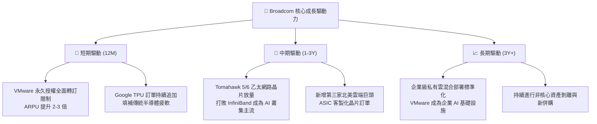

---

## 9. 風險矩陣

### 9.1 風險評分矩陣

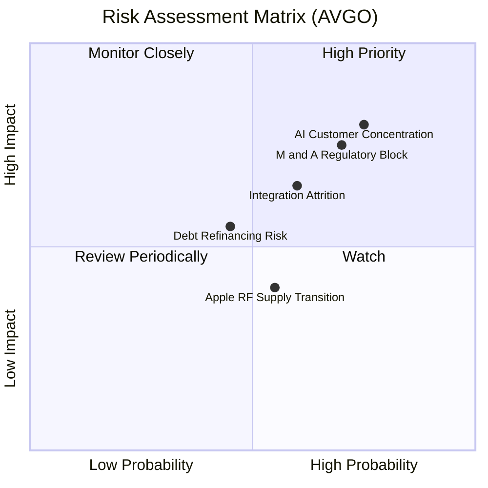

### 9.2 風險清單詳細分析

| # | 風險項目 | 發生機率 | 財務衝擊 | 風險評分 | 機構級緩解與應對措施 |
|---|----------|----------|----------|----------|----------------------|
| 1 | 🔴 **AI 客戶過度集中** | 高 (35%) | 高 (-12% 營收) | **7.5 / 10** | **緩解措施**：積極開發 Meta 以外的第三與第四家 ASIC 客戶（如 ByteDance、Microsoft），降低對 Google 單一源頭的依賴。 |
| 2 | 🔴 **併購監管紅線** | 高 (40%) | 中 (-5% 營收) | **7.0 / 10** | **緩解措施**：未來 3-5 年暫緩超大型併購，專注於內部去槓桿與現有業務（VMware）的有機增長（Organic Growth）。 |
| 3 | 🟡 **VMware 客戶流失** | 中 (25%) | 中 (-8% 營收) | **5.8 / 10** | **緩解措施**：針對中小型企業推出更靈活的打包方案，避免因強推高價訂閱制而將客戶推向開源替代方案（如 Proxmox）。 |
| 4 | 🟡 **高息債務再融資** | 中 (20%) | 低 (-2% 淨利) | **4.5 / 10** | **緩解措施**：利用每年 >$25B 的強大自由現金流，優先償還高息浮動利率債務，目標在 2027 年前將淨債務/EBITDA 降至 1.0x 以下。 |

---

## 10. 投資建議

### 10.1 最終綜合評級雷達圖

```
╔══════════════════════════════════════════════════════════════════╗
║                     AVGO 最終綜合投資評級                        ║
╠══════════════════════════════════════════════════════════════════╣
║                                                                  ║
║  基本面強度：   9.0/10   ▓▓▓▓▓▓▓▓▓▓▓▓▓▓▓▓▓▓░░  ★★★★★         ║
║  獲利含金量：   9.5/10   ▓▓▓▓▓▓▓▓▓▓▓▓▓▓▓▓▓▓▓░  ★★★★★         ║
║  成長前景：     8.5/10   ▓▓▓▓▓▓▓▓▓▓▓▓▓▓▓▓░░░░  ★★★★☆         ║
║  財務安全度：   7.5/10   ▓▓▓▓▓▓▓▓▓▓▓▓▓▓░░░░░░  ★★★★☆         ║
║  估值安全邊際： 9.5/10   ▓▓▓▓▓▓▓▓▓▓▓▓▓▓▓▓▓▓▓░  ★★★★★         ║
║                                                                  ║
║  🏆 綜合評分：8.9 / 10  |  最終評級：🟢 強烈買入 (Strong Buy)    ║
╚══════════════════════════════════════════════════════════════════╝
```

### 10.2 目標價與隱含報酬率

| 情境 | 機率權重 | 目標價 | 隱含報酬率 | 權重後目標價 |
|------|----------|--------|------------|--------------|
| 🔴 悲觀情境 | 15% | $289.00 | -22.8% | $43.35 |
| 🟡 **基準情境** | **65%** | **$524.51** | **+40.1%** | **$340.93** |
| 🟢 樂觀情境 | 20% | $635.00 | +69.6% | $127.00 |
| **加權綜合目標價** | **100%** | **$511.28** | **+36.5%** | **當前具備極佳風險回報比** |

### 10.3 買入時機與觸發因素

```
╔══════════════════════════════════════════════════════════════════╗
║                  ✅ 買入觸發因素 Checklist                       ║
╠══════════════════════════════════════════════════════════════════╣
║                                                                  ║
║  立即買入觸發條件（多數符合）：                                  ║
║  ✅ Forward P/E 跌破 20x（當前為 19.28x，已符合）                ║
║  ✅ VMware 季度營收貢獻持續超過 $5.5B                            ║
║  ✅ 乙太網路交換晶片市佔率維持在 70% 以上                        ║
║                                                                  ║
║  加碼觸發條件（出現以下任一）：                                  ║
║  ☐ 宣佈獲得微軟或亞馬遜的客製化 AI ASIC 晶片合約                 ║
║  ☐ 聯準會重啟降息循環，降低其 $64.91B 債務的再融資利息成本       ║
║                                                                  ║
║  減碼/停損觸發條件（出現以下任一）：                             ║
║  ☐ Google 宣佈下一代 TPU 將完全不透過 Broadcom 進行客製化設計     ║
║  ☐ 自由現金流連續兩季出現 YoY 衰退 > 10%                         ║
╚══════════════════════════════════════════════════════════════════╝
```

### 10.4 投資人適配度分析

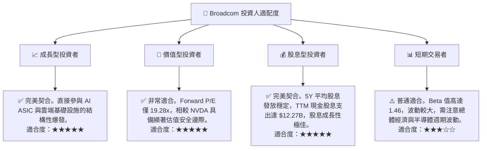

### 10.5 每季財報監控清單（Quarterly Watch List）

為了確保本投資論點的持續有效性，投資人應在每季財報中追蹤以下關鍵指標與臨界值：

| 監控指標 | 基準目標值 | 觸發加碼門檻 | 觸發減碼/警示門檻 | 追蹤核心意義 |
|----------|------------|--------------|-------------------|--------------|
| **半導體部門 AI 營收佔比** | > 40.0% | > 45.0% | < 30.0% | 評估 AI 需求是否放緩或客戶流失。 |
| **VMware 季度營收** | > $5.5B | > $6.0B | < $4.5B | 驗證訂閱制轉型與客戶留存率。 |
| **整體毛利率 (Gross Margin)**| > 75.0% | > 78.0% | < 70.0% | 評估高毛利軟體佔比與定價權是否受損。 |
| **季度自由現金流 (FCF)** | > $7.5B | > $8.5B | < $6.0B | 確保有足夠資金償還債務與發放股息。 |
| **淨債務 / EBITDA** | < 1.50x | < 1.00x | > 2.50x | 監控去槓桿進度，防止財務風險增加。 |

### 10.6 反面論證：什麼會證明論點錯誤（What Would Change My Mind）

```
╔══════════════════════════════════════════════════════════════════╗
║              ⚠️ 論點失效條件 (Disconfirming Evidence)            ║
╠══════════════════════════════════════════════════════════════════╣
║  本投資論點在下列情況成立時應重新檢視或果斷退出：                ║
║                                                                  ║
║  ☐ 核心 AI 客戶（Google/Meta）完全轉向自研，                     ║
║     導致 Broadcom TTM AI ASIC 營收連續兩季 YoY 衰退 > 15%。       ║
║                                                                  ║
║  ☐ 營業利益率較峰值（49.0%）大幅收縮超過 500 個基點（跌破 44.0%），║
║     說明 VMware 整合綜效失敗或市場競爭加劇導致價格戰。           ║
║                                                                  ║
║  ☐ 自由現金流轉換率（FCF / Net Income）跌破 100%，               ║
║     說明盈餘品質惡化，獲利被應收帳款或存貨積壓美化。             ║
║                                                                  ║
║  ☐ ROIC 跌破 15.0%（或經濟價值增量 EVA 收縮至 3.0% 以下），      ║
║     說明其資本配置效率大幅下滑，不再具備超額價值創造能力。       ║
╚══════════════════════════════════════════════════════════════════╝
```

---

> **免責聲明**：本報告為 AI 基於歷史與即時財務數據自動生成，僅供研究與學術探討參考，不構成任何具體的投資建議。投資美股及半導體行業具備高市場風險，投資人入市前應諮詢專業財務顧問並審慎評估個人風險承受能力。