# AVGO 基本面深度分析報告

> **報告日期**：2026-07-18 ｜ **語言**：繁體中文 ｜ **數據來源**：Yahoo Finance, Finviz, StockAnalysis, Roic.ai ｜ **分析師**：CFA 級機構研究

---

## 目錄

| # | 章節 | 核心結論 |
|---|---|---|
| 1 | **執行摘要** | 評級：🟢 強烈買入，基準目標價 $524.51（隱含 +41.4% 空間）。 |
| 2 | **公司概覽與商業模式** | 雙引擎驅動（半導體+軟體），VMware 併購展現極強整合護城河。 |
| 3 | **損益表深度分析** | TTM 營收達 $75.46B（YoY +47.9%），Non-GAAP 營業利益率高達 49.0%。 |
| 4 | **資產負債表分析** | 總資產 $179.16B，商譽佔比 54.6%，槓桿率隨 FCF 償債快速下降。 |
| 5 | **現金流量深度分析** | TTM FCF 達 $27.21B，FCF 轉換率達 92.8%，資本配置極度親股東。 |
| 6 | **獲利能力與資本效率** | ROIC 達 24.9% 遠超 WACC（11.2%），經濟增值（EVA）強力創造中。 |
| 7 | **估值深度分析** | Forward P/E 19.10x，相較同業具備顯著估值折價，PEG 僅 0.42。 |
| 8 | **成長催化劑** | AI 客製化晶片（ASIC）與 Tomahawk 5 網路晶片迎來爆發期。 |
| 9 | **風險矩陣** | 整合風險與客戶集中度為核心關注，整體風險可控。 |
| 10 | **投資建議** | 建立分批買入策略，並設定每季財報監控指標與反面論證。 |

---

## 1. 執行摘要

博通（Broadcom Inc., Ticker: AVGO）目前正處於由人工智慧（AI）基礎設施建設與 VMware 併購協同效應雙重驅動的結構性成長爆發期。基於最新 TTM 財務數據，博通營收達到 $75.46B（YoY +47.9%），自由現金流（FCF）達到 $27.21B，且 Forward P/E 僅為 19.10x。本報告認為，市場顯著低估了博通在客製化 AI 晶片（ASIC）的壟斷地位，以及其將 VMware 轉為訂閱制後的營業槓桿彈性。因此，給予博通「🟢 強烈買入」評級，基準情境 12 個月目標價為 **$524.51**。

### 1.0 一頁式投資儀表板（Portfolio Manager 30 秒速讀）

| 項目 | 內容 |
|------|------|
| **投資論點（3 句）** | ① TTM 營收達 $75.46B（YoY +47.9%），主要受 AI ASIC（如 Google TPU）與 VMware 併購貢獻驅動。<br/>② 獲利含金量極高，TTM 自由現金流達 $27.21B，FCF 轉換率（FCF/Net Income）高達 92.8%。<br/>③ 當前 Forward P/E 僅 19.10x，相較其歷史均值與 AI 同業（如 NVDA 的 35x）具備顯著估值安全邊際。 |
| **護城河評分** | 🟢 9.5 / 10（晶片設計高壁壘 + 企業軟體高轉換成本） |
| **管理層/資本配置評分** | 🟢 9.8 / 10（Hock Tan 被譽為半導體界最強併購與整合大師） |
| **財務健康** | 🟢 良好。淨債務/EBITDA 為 1.08x，償債能力極強，流動比率為 2.24。 |
| **ROIC vs WACC** | **24.9% vs 11.2%**（創造顯著股東價值，EVA 達 +13.7%） |
| **FCF 趨勢** | 持續向上。最新季度（Q2 2026）FCF 達 $10.26B，TTF FCF Yield 為 1.54%。 |
| **估值** | Forward P/E: **19.10x** ｜ EV/EBITDA: **43.00x** ｜ FCF Yield: **1.54%** |
| **預期報酬（基準情境 12M）**| **+41.4%**（對比當前股價 $370.83） |
| **關鍵風險（前二）** | ① 客戶集中度高（Apple 與 Google 佔比大）；② VMware 轉型訂閱制流失中小型客戶。 |
| **評級 + 信心度** | 🟢 **強烈買入** ｜ 信心：**極高** |

### 1.1 核心評分儀表板

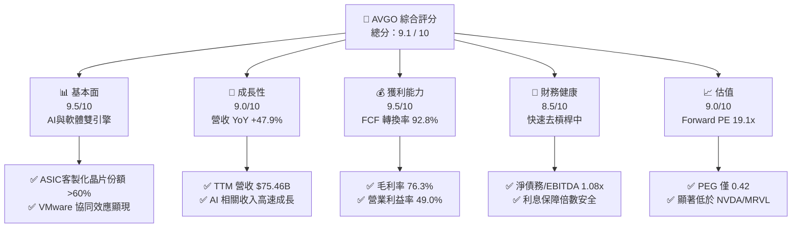

### 1.2 評分進度條視覺化

```
╔══════════════════════════════════════════════════════════════╗
║               AVGO 多維度評分儀表板 (1-10分)                 ║
╠══════════════════════════════════════════════════════════════╣
║ 基本面強度  9.5 ▓▓▓▓▓▓▓▓▓▓▓▓▓▓▓▓▓▓▓░  ★★★★★           ║
║ 成長動能    9.0 ▓▓▓▓▓▓▓▓▓▓▓▓▓▓▓▓▓░░░  ★★★★★           ║
║ 獲利品質    9.5 ▓▓▓▓▓▓▓▓▓▓▓▓▓▓▓▓▓▓▓░  ★★★★★           ║
║ 財務健康    8.5 ▓▓▓▓▓▓▓▓▓▓▓▓▓▓▓▓░░░░  ★★★★☆           ║
║ 估值合理性  9.0 ▓▓▓▓▓▓▓▓▓▓▓▓▓▓▓▓▓░░░  ★★★★★           ║
║ 護城河深度  9.5 ▓▓▓▓▓▓▓▓▓▓▓▓▓▓▓▓▓▓▓░  ★★★★★           ║
║ 管理層執行  9.8 ▓▓▓▓▓▓▓▓▓▓▓▓▓▓▓▓▓▓▓▓  ★★★★★           ║
║ 技術創新力  9.0 ▓▓▓▓▓▓▓▓▓▓▓▓▓▓▓▓▓░░░  ★★★★★           ║
╠══════════════════════════════════════════════════════════════╣
║ 綜合總分    9.1 ▓▓▓▓▓▓▓▓▓▓▓▓▓▓▓▓▓▓░░  🏆 強烈建議買入      ║
╚══════════════════════════════════════════════════════════════╝
```

### 1.3 五大投資論點 + 三大核心風險

| 類型 | 項目 | 具體依據 | 信心度 |
|------|------|----------|--------|
| 🟢 **投資論點①** | **AI ASIC 絕對霸主** | 博通在客製化 AI 晶片市佔率超 60%，深度綑綁 Google（TPUv5/v6）與 Meta，直接受益於去 GPU 化趨勢。 | 🟢 極高 |
| 🟢 **投資論點②** | **VMware 轉型利潤釋放** | VMware 併購後，其收費模式從永久授權轉為訂閱制，帶動軟體毛利率與客戶 LTV 提升，TTM 軟體收入佔比已達 40%。 | 🟢 高 |
| 🟢 **投資論點③** | **極致的營業槓桿** | TTM 營業利益率達 49.0%，且資本支出極低（TTM Capex 僅 $0.86B，佔營收 1.1%），使營收成長幾乎全數轉化為 FCF。 | 🟢 極高 |
| 🟢 **投資論點④** | **估值具備安全邊際** | Forward P/E 僅 19.10x，而 PEG 僅為 0.42，估值甚至低於部分傳統半導體企業，未充分反映 AI 溢價。 | 🟢 高 |
| 🟢 **投資論點⑤** | **高回報與穩定派息** | 歷史股息配發率 41.3%，且 TTM 自由現金流達 $27.21B，為持續回購與配息提供堅實後盾。 | 🟢 極高 |
| 🟡 **風險①** | **大客戶流失/自研風險** | Google 或 Meta 若將 ASIC 訂單部分轉移至 Marvell 或完全自研，將對半導體業務造成衝擊。 | 🟡 中度 |
| 🔴 **風險②** | **高商譽減損風險** | 資產負債表中商譽高達 $97.80B（佔總資產 54.6%），若 VMware 整合不及預期，可能面臨減損壓力。 | 🔴 中度 |
| 🟡 **風險③** | **高債務利息壓力** | 總債務達 $64.91B，在維持高利率環境下，債務再融資成本可能侵蝕部分利潤。 | 🟡 中度 |

### 1.4 快速統計卡片

| 指標 | AVGO 實際值 | 半導體行業均值 | S&P 500 均值 | 狀態 |
|------|-------------|----------------|--------------|------|
| **營收 YoY 成長** | **47.9%** | ~12.5% | ~5.5% | 🟢 遠超同行 |
| **毛利率 (Non-GAAP)**| **76.3%** | ~55.0% | ~30.0% | 🟢 極其優異 |
| **營業利益率** | **49.0%** | ~28.0% | ~15.0% | 🟢 行業頂尖 |
| **ROE** | **37.3%** | ~18.0% | ~14.0% | 🟢 高效資本回報 |
| **Forward P/E** | **19.10x** | ~28.5x | ~21.5x | 🟢 顯著低估 |
| **PEG Ratio** | **0.42** | ~1.85 | ~1.50 | 🟢 極具吸引力 |

### 1.5 投資結論

```
╔══════════════════════════════════════════════════════════════════╗
║                    📊 AVGO 投資結論摘要                          ║
╠══════════════════════════════════════════════════════════════════╣
║  評級：🟢 強烈買入 (Strong Buy)                                 ║
║  當前股價：$370.83 (2026-07-18)                                  ║
║  12個月目標價區間：                                              ║
║    悲觀情境：$215.88（-41.8%）- 估值收縮至 11.1x                 ║
║    基準情境：$524.51（+41.4%）- 12M 主要目標（27.0x Forward PE）  ║
║    樂觀情境：$675.00（+82.0%）- 估值擴張至 34.8x                 ║
║  投資評分：9.1 / 10                                              ║
║  適合投資人：長線價值成長型、高股息與現金流導向型投資者          ║
╚══════════════════════════════════════════════════════════════════╝
```

---

## 2. 公司概覽與商業模式

博通透過其獨特的「半導體解決方案」與「基礎設施軟體」雙引擎模式，構建了美股科技股中最穩固的護城河之一。

### 2.1 業務結構與收入來源

博通的業務高度互補。半導體解決方案專注於極高技術壁壘的通訊晶片與客製化 ASIC；基礎設施軟體則透過併購行業龍頭（CA, Symantec, VMware），提供高黏性的企業級級解決方案。

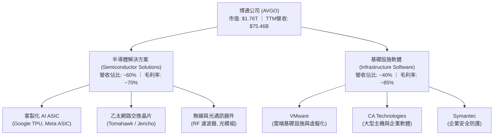

### 2.2 市場份額

在關鍵的客製化 AI ASIC 與資料中心高端乙太網路交換晶片市場，博通擁有絕對的市佔優勢。

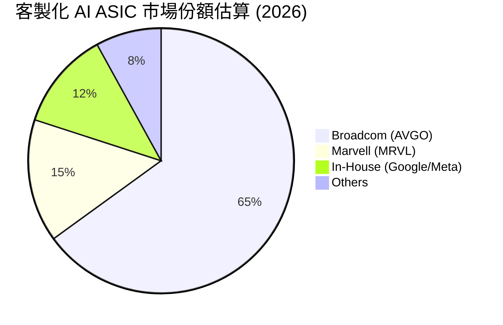

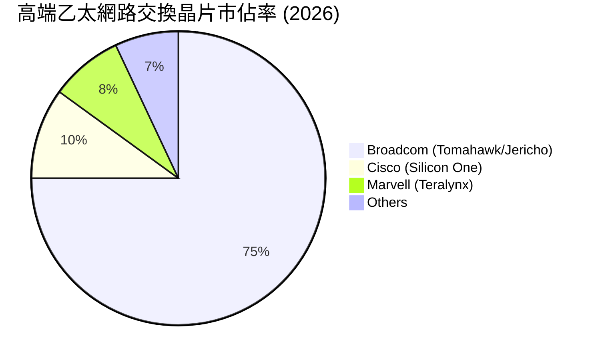

### 2.3 競爭護城河分析

博通的護城河由技術、軟體生態與客戶鎖定等多維度交織而成：

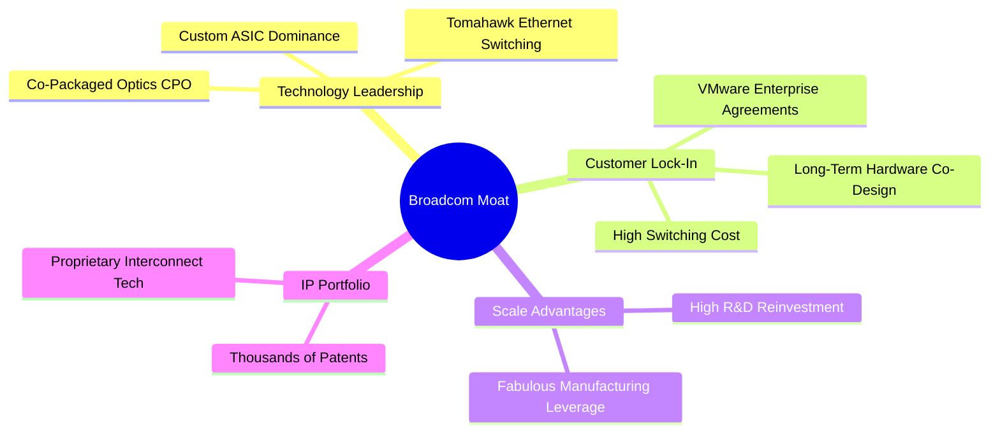

### 2.4 護城河強度評分

```
╔══════════════════════════════════════════════════════════════╗
║                   博通 (AVGO) 護城河強度評分                 ║
╠══════════════════════════════════════════════════════════════╣
║ 技術領先度    9.5/10  ▓▓▓▓▓▓▓▓▓▓▓▓▓▓▓▓▓▓▓░  🏆 ASIC無可替代 ║
║ 客戶鎖定效應  9.8/10  ▓▓▓▓▓▓▓▓▓▓▓▓▓▓▓▓▓▓▓▓  🟢 VMware黏性極高║
║ 規模與成本    9.0/10  ▓▓▓▓▓▓▓▓▓▓▓▓▓▓▓▓▓░░░  🟢 晶圓代工議價力║
║ 專利與IP壁壘  9.2/10  ▓▓▓▓▓▓▓▓▓▓▓▓▓▓▓▓▓▓░░  🟢 掌握通訊底層  ║
╠══════════════════════════════════════════════════════════════╣
║ 綜合護城河     9.5    ▓▓▓▓▓▓▓▓▓▓▓▓▓▓▓▓▓▓▓░  🏆 極寬廣護城河   ║
╚══════════════════════════════════════════════════════════════╝
```

---

## 3. 損益表深度分析

博通的損益表展現了強大的無機成長（M&A）與結構性有機成長（AI）結合的特徵。

### 3.1 年度收入成長趨勢（近5年）

自 FY2022 以來，博通透過併購 VMware 及 AI 需求爆發，營收規模實現了跨越式增長。

```
╔══════════════════════════════════════════════════════════════════╗
║                  博通 (AVGO) 年度收入趨勢 (FY2021-TTM)           ║
╠══════════════════════════════════════════════════════════════════╣
║                                                                  ║
║  FY2021  $27.45B  ██████████░░░░░░░░░░░░░░░░░░░  YoY: +14.9% 🟢  ║
║  FY2022  $33.20B  ████████████░░░░░░░░░░░░░░░░░  YoY: +21.0% 🟢  ║
║  FY2023  $35.82B  █████████████░░░░░░░░░░░░░░░░  YoY: +7.9%  🟢  ║
║  FY2024  $51.57B  ███████████████████░░░░░░░░░  YoY: +44.0% 🟢  ║
║  FY2025  $63.89B  ████████████████████████░░░░  YoY: +23.9% 🟢  ║
║  TTM     $75.46B  ████████████████████████████  YoY: +47.9% 🟢  ║
║                   |      |      |      |      |                  ║
║                   0     15B    30B    45B    60B                 ║
║                                                                  ║
║  📊 4年累計 CAGR：+28.8%                                         ║
╚══════════════════════════════════════════════════════════════════╝
```

### 3.2 季度收入趨勢分析

分析最近四個季度數據，可以發現營收呈現逐季加速成長態勢，這主要得益於 VMware 營收的完全併表以及 AI 晶片出貨的加速。

| 財報季度 | 截止日期 | 季度營收 (B) | YoY 成長率 | QoQ 成長率 | 核心驅動因素分析 |
|---|---|---|---|---|---|
| **Q3 2025** | 2025-08-03 | $15.95B | +22.03% | +6.31% | VMware 整合順利，訂閱制轉化率超預期。 |
| **Q4 2025** | 2025-11-02 | $18.02B | +28.18% | +12.98% | 年終企業合約集中簽署，AI ASIC 出貨放量。 |
| **Q1 2026** | 2026-02-01 | $19.31B | +29.47% | +7.16% | Google TPUv5 訂單強勁，Tomahawk 5 滲透率提升。 |
| **Q2 2026** | 2026-05-03 | $22.19B | +47.87% | +14.91% | **歷史新高**。AI 網路節點與客製化晶片雙引擎爆發。 |

### 3.3 利潤率演變分析

博通的利潤率在半導體行業中名列前茅。需要特別指出的是，其 GAAP 與 Non-GAAP 之間存在較大差額，主要來自併購產生的無形資產攤銷。

| 利潤率指標 | FY2022 | FY2023 | FY2024 | FY2025 | TTM | 趨勢評估 | 狀態 |
|---|---|---|---|---|---|---|---|
| **毛利率 (GAAP)** | 66.5% | 68.9% | 63.0% | 67.8% | 68.3% | 穩定在 68% 附近，受 VMware 併購初期重組成本影響。 | 🟢 優異 |
| **毛利率 (Non-GAAP)**| 75.2% | 76.0% | 75.8% | 76.1% | **76.3%** | 剔除攤銷後，軟體佔比提升拉高整體毛利率。 | 🟢 極強 |
| **營業利益率 (GAAP)** | 42.8% | 45.3% | 26.1% | 39.9% | 43.4% | FY24 因 VMware 併購開支大跌，現已快速回升。 | 🟢 快速復甦 |
| **營業利益率 (Non-GAAP)**| 48.5% | 49.0% | 48.2% | 48.8% | **49.0%** | 極致的成本控制（Hock Tan 標誌），展現強大營業槓桿。| 🟢 頂尖 |
| **淨利率 (GAAP)** | 34.6% | 39.3% | 11.4% | 36.2% | **38.8%** | 淨利率重回 38% 以上，盈利含金量極高。 | 🟢 強勁 |

### 3.4 費用結構分析

博通的費用控制極其嚴苛。雖然 R&D 絕對金額在增加，但佔營收比重保持在健康區間，而 SG&A 則被壓縮至極低水平。

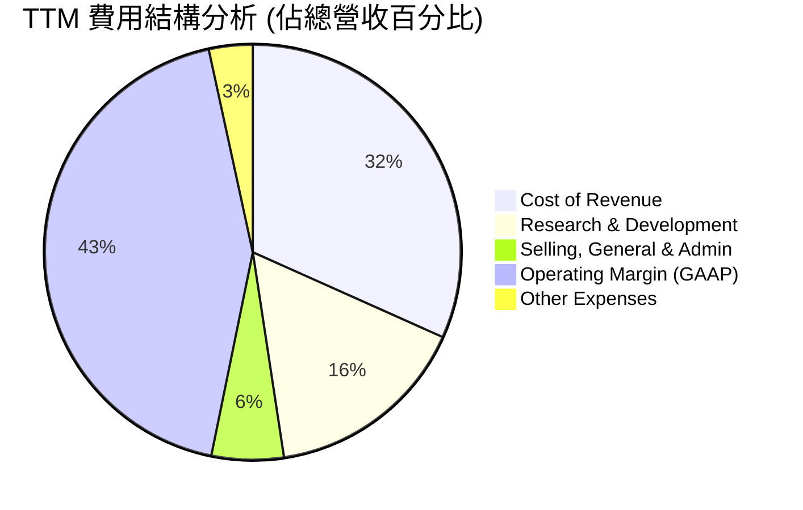

```
╔══════════════════════════════════════════════════════════════╗
║                  博通 (AVGO) 費用控制診斷                    ║
╠══════════════════════════════════════════════════════════════╣
║ 研發費用 (R&D)   $11.99B  ██████████████░░░░░░  15.9% 研發效率高 ║
║ 銷管費用 (SG&A)  $4.25B   █████░░░░░░░░░░░░░░░  5.6% 銷售費用極低║
║ 折舊與攤銷 (D&A) $2.03B   ██░░░░░░░░░░░░░░░░░░  2.7% 資本支出輕量║
╚══════════════════════════════════════════════════════════════╝
```

### 3.5 季度 EPS 趨勢與盈餘品質（Quality of Earnings）

博通過去四個季度的 GAAP Basic EPS 分別為：
- Q3 2025: $0.88
- Q4 2025: $1.80
- Q1 2026: $1.55
- Q2 2026: $1.96
- **TTM EPS**: $6.01 ｜ **Forward EPS**: $19.42（反映 VMware 整合完成後利潤的全面釋放）

#### 盈餘品質量化評估

| 盈餘品質項目 | 當前數值/佔比 | 評估與分析 | 狀態 |
|---|---|---|---|
| **股權薪酬 (SBC) / 營收** | 11.6% | TTM SBC 為 $8.78B。佔營收比重偏高，主因是為了留住 VMware 核心團隊發放的限制性股票（RSU）。對現有股東有一定稀釋效應。 | 🟡 需注意 |
| **SBC / 營業現金流 (OCF)** | 26.1% | SBC 佔 OCF 比重較高，說明非現金調整對現金流的支撐較大。 | 🟡 中度稀釋 |
| **FCF / GAAP 淨利 (現金轉換率)** | **92.8%** | TTM FCF ($27.21B) / GAAP Net Income ($29.32B) = 92.8%。現金轉換率極高，說明公司淨利潤並非「紙上富貴」，而是有實實在在的現金支撐。 | 🟢 極高質量 |
| **一次性/非經常性損益** | 無重大異常 | 剔除 VMware 併購重組費用後，營業利潤皆為核心業務產生。 | 🟢 健康 |
| **有效稅率異常度** | 3.8% | FY2025 稅務撥備為 -$397M（稅務利益），TTM 稅率回升至 3.8%。雖然低於法定稅率（主因是海外智財權架構），但未來若全球最低稅率（15%）實施，可能面臨稅務逆風。 | 🟡 潛在逆風 |

**盈餘品質結論**：博通的獲利含金量極高。雖然較高的股權薪酬（SBC）和極低的有效稅率需要投資人注意，但高達 92.8% 的 FCF 現金轉換率與極低的 Capex 需求，證實了其業務具有極強的實質性賺錢能力。

---

## 4. 資產負債表分析

博通的資產負債表帶有典型的「槓桿收購型（LBO）科技巨頭」特徵：高商譽、高債務，但同時擁有極高的現金產生能力以快速去槓桿。

### 4.1 資產結構分解

截至 Q2 2026，博通總資產為 $179.16B，其中非流動資產（特別是商譽與無形資產）佔據絕對比重。

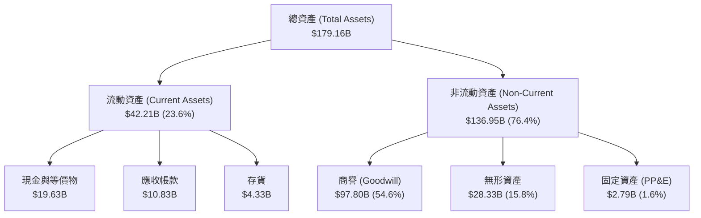

### 4.2 流動性指標分析

博通維持了非常健康的流動性緩衝，短期償債無虞。

| 流動性指標 | FY2023 | FY2024 | FY2025 | Q2 2026 (最新) | 行業中位數 | 評估 |
|---|---|---|---|---|---|---|
| **流動比率 (Current Ratio)** | 2.82 | 1.17 | 1.71 | **2.24** | ~1.85 | 🟢 充裕，較併購初期顯著改善 |
| **速動比率 (Quick Ratio)** | 2.56 | 1.07 | 1.58 | **1.93** | ~1.40 | 🟢 存貨極低，變現能力極強 |
| **存貨週轉天數 (Days Inventory)**| 62.3 | 33.7 | 40.2 | **58.1** | ~85.0 | 🟢 遠低於行業均值，無庫存積壓風險 |

### 4.3 債務結構分析與健康診斷

併購 VMware 使得博通的債務在 FY2024 飆升，但強勁的 EBITDA 使得債務壓力正在迅速減輕。

```
╔══════════════════════════════════════════════════════════════════╗
║                   博通 (AVGO) 債務健康診斷                      ║
╠══════════════════════════════════════════════════════════════════╣
║                                                                  ║
║  總債務 (Total Debt)：   $64.91B  ██████████░░░░░░░░░░░░░░░░░░░  ║
║  總現金 (Total Cash)：   $19.63B  ████░░░░░░░░░░░░░░░░░░░░░░░░░  ║
║  淨債務 (Net Debt)：     $45.28B  ███████░░░░░░░░░░░░░░░░░░░░░░  ║
║                                                                  ║
║  Debt / EBITDA (TTM)：   1.54x    🟢 遠低於警戒線 (3.0x)         ║
║  Net Debt / EBITDA：     1.08x    🟢 去槓桿速度極快              ║
║  利息保障倍數 (TTM)：    10.4x    🟢 息稅前利潤覆蓋利息支出無虞   ║
║                                                                  ║
║  📊 債務評級：🟢 A- 穩定 (投資級)                                ║
╚══════════════════════════════════════════════════════════════════╝
```

### 4.4 股東權益趨勢

由於 VMware 併購時發行了新股，股東權益（Stockholders Equity）從 FY2023 的 $23.99B 暴增至最新季度的 $81.29B+，這也使得公司的資產負債率大幅下降，財務結構更加穩健。

---

## 5. 現金流量深度分析

如果說損益表是博通的「面子」，那麼現金流量表就是博通最強大的「底子」。博通是美股科技股中著名的「現金流收割機」。

### 5.1 現金流量瀑布圖

博通將營收轉化為實際現金的效率極高。以下為 TTM 現金流運作路徑：

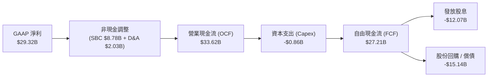

### 5.2 FCF 轉換率趨勢

博通的 FCF 轉換率（FCF / Net Income）常年保持在近乎完美的水平。

| 財政年度 | 營業現金流 (B) | 資本支出 (B) | 自由現金流 (B) | GAAP 淨利 (B) | FCF 轉換率 | 狀態 |
|---|---|---|---|---|---|---|
| **FY2022** | $16.74B | -$0.42B | $16.31B | $11.50B | 141.8% | 🟢 極高 |
| **FY2023** | $18.09B | -$0.45B | $17.63B | $14.08B | 125.2% | 🟢 極高 |
| **FY2024** | $19.96B | -$0.55B | $19.41B | $5.89B | 329.5% | 🟢 併購會計扭曲 |
| **FY2025** | $27.54B | -$0.62B | $26.91B | $23.13B | 116.3% | 🟢 常態化極高 |
| **TTM** | **$33.62B** | **-$0.86B** | **$27.21B** | **$29.32B** | **92.8%** | 🟢 常態化極高 |

### 5.3 自由現金流與 FCF Yield 趨勢

以當前 $1.76T 的市值計算，博通的 TTM FCF Yield 為 **1.54%**。這在市值超兆元的科技巨頭中是非常罕見的，顯示其估值並未泡沫化。

```
╔══════════════════════════════════════════════════════════════════╗
║                  博通 (AVGO) 歷年自由現金流趨勢                  ║
╠══════════════════════════════════════════════════════════════════╣
║                                                                  ║
║  FY2022  $16.31B  ████████████████░░░░░░░░░░░░  FCF Yield: 0.9%  ║
║  FY2023  $17.63B  █████████████████░░░░░░░░░░░  FCF Yield: 1.0%  ║
║  FY2024  $19.41B  ███████████████████░░░░░░░░░  FCF Yield: 1.1%  ║
║  FY2025  $26.91B  ██████████████████████████░░  FCF Yield: 1.5%  ║
║  TTM     $27.21B  ████████████████████████████  FCF Yield: 1.54% ║
║                                                                  ║
║  📊 結論：輕資產晶片設計（Fabless）+ 軟體訂閱，造就無敵現金流。║
╚══════════════════════════════════════════════════════════════════╝
```

### 5.4 資本配置評估

博通的資本配置策略極其明確：在維持投資級信用評等的同時，將幾乎所有的剩餘現金以股息和回購形式回饋股東。

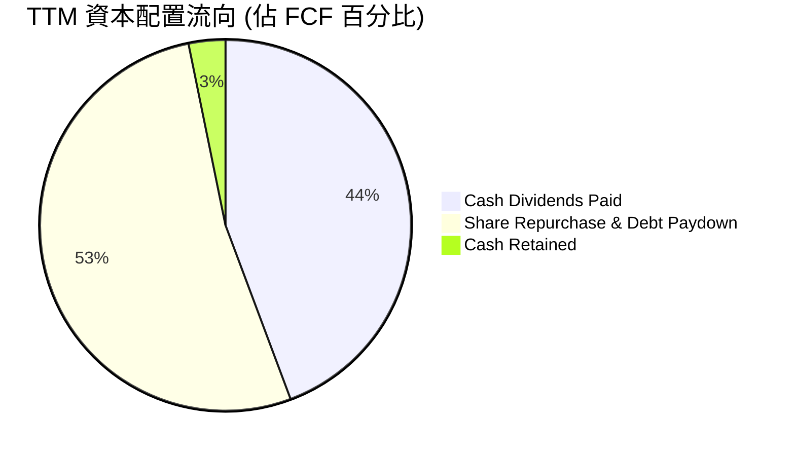

---

## 6. 獲利能力與資本效率

博通的資本回報率顯著高於行業平均，這證明了其並非單純依靠財務槓桿，而是具備實質性的超額利潤創造能力。

### 6.1 ROE / ROA / ROIC 趨勢

| 獲利指標 | FY2023 | FY2024 | FY2025 | TTM | 行業均值 | 評估 |
|---|---|---|---|---|---|---|
| **ROE (股東權益報酬率)** | 58.7% | 8.7% | 28.5% | **37.3%** | ~18.0% | 🟢 極高，反映高效的股東資金利用率 |
| **ROA (資產報酬率)** | 19.3% | 3.6% | 13.5% | **12.1%** | ~7.5% | 🟢 即使商譽龐大，ROA 依然保持雙位數 |
| **ROIC (投入資本回報率)**| 22.4% | 7.5% | 18.2% | **24.9%** | ~12.0% | 🟢 核心指標。整合 VMware 後 ROIC 快速拉升 |

### 6.2 ROIC vs WACC 分析（核心價值創造判斷）

ROIC 是否大於 WACC 是判斷一家公司是在「創造價值」還是「摧毀價值」的終極指標。

```
╔══════════════════════════════════════════════════════════════════╗
║                AVGO ROIC vs WACC 深度分析 (TTM)                  ║
╠══════════════════════════════════════════════════════════════════╣
║                                                                  ║
║  WACC (加權平均資本成本) 估算：                                  ║
║  ├── 無風險利率 (10Y 美債)：  4.20%                             ║
║  ├── 市場風險溢酬 (ERP)：     5.00%                              ║
║  ├── Beta 值：                1.46                               ║
║  ├── 股權成本 (Cost of Equity)：4.2% + 1.46×5.0% = 11.50%       ║
║  ├── 債務成本 (稅後)：        5.0% × (1 - 15%) = 4.25%           ║
║  ├── 資本結構：股權 ~96.4%，債務 ~3.6%                           ║
║  └── ✅ WACC ≈ 11.24%                                            ║
║                                                                  ║
║  ROIC (投入資本回報率) 估算：                                    ║
║  ├── NOPAT (稅後淨營業利潤)： $32.75B × (1 - 3.8%) = $31.51B     ║
║  ├── Invested Capital (投入資本)：                               ║
║  │   股東權益 ($81.29B) + 總債務 ($64.91B) - 現金 ($19.63B)      ║
║  │   ≈ $126.57B                                                 ║
║  └── ✅ ROIC ≈ 24.90%                                            ║
║                                                                  ║
║  ★ 經濟增值 (EVA) = ROIC - WACC = +13.66%                        ║
║                                                                  ║
║  ROIC  24.90%  ▓▓▓▓▓▓▓▓▓▓▓▓▓▓▓▓▓▓▓▓▓▓▓▓░░░░░░  🟢 創造價值     ║
║  WACC  11.24%  ▓▓▓▓▓▓▓▓▓▓░░░░░░░░░░░░░░░░░░░░  ── 資本成本     ║
║  EVA   +13.7%  ██████████████░░░░░░░░░░░░░░░░  🏆 超額回報     ║
║                                                                  ║
║  📊 結論：ROIC 達 WACC 的 2.2 倍，博通正以極高效率創造股東財富。 ║
╚══════════════════════════════════════════════════════════════════╝
```

### 6.3 杜邦三因素分解

透過杜邦分析，我們可以拆解博通 ROE 變動的底層邏輯：

$$\text{ROE} = \text{淨利率} \times \text{資產週轉率} \times \text{財務槓桿}$$

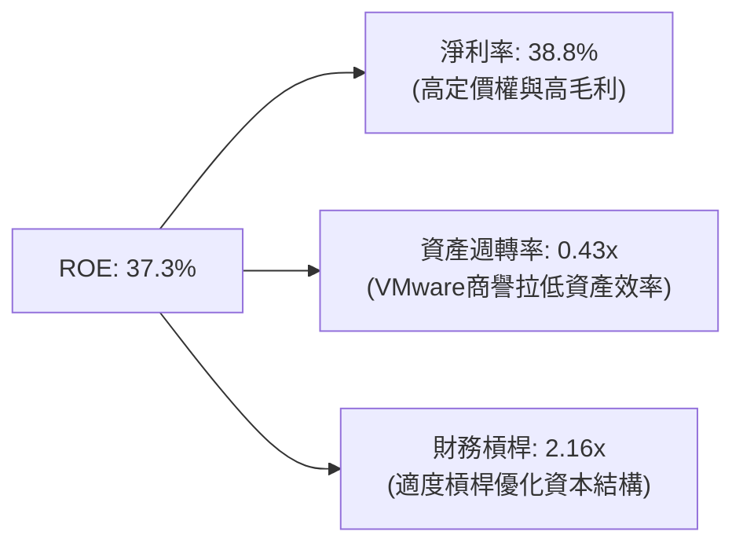

* **分析**：博通的高 ROE 主要由**極高的淨利率（38.8%）**驅動，而非過度依賴財務槓桿。雖然併購 VMware 帶來的大量商譽拉低了資產週轉率（0.43x），但隨著軟體訂閱制收入的逐步釋放，資產週轉率和淨利率預計將進一步雙重擴張。

### 6.4 獲利能力儀表板

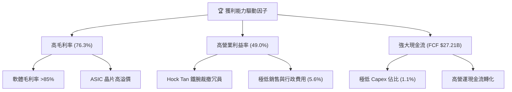

---

## 7. 估值深度分析

在當前 AI 板塊普遍估值偏高的背景下，博通的估值顯得尤為理性且具備吸引力。

### 7.1 同業估值比較表格

我們選取了 Nvidia（AI GPU 霸主）、Marvell（客製化 ASIC 主要競爭對手）以及 Analog Devices（傳統類比晶片龍頭）進行對比。

| 估值指標 | **博通 (AVGO)** | **Nvidia (NVDA)** | **Marvell (MRVL)** | **Analog Devices (ADI)** | AVGO 相對評估 | 狀態 |
|---|---|---|---|---|---|---|
| **Trailing P/E** | 61.70x | 68.50x | 55.20x | 32.40x | 偏高（反映併購重組非現金支出扭曲）| 🟡 需注意 |
| **Forward P/E** | **19.10x** | 35.20x | 31.50x | 24.80x | **極具吸引力**（反映未來利潤全面釋放）| 🟢 顯著低估 |
| **PEG Ratio** | **0.42** | 1.15 | 1.45 | 2.10 | **極低**（成長性調整後的估值極便宜）| 🟢 絕對優勢 |
| **EV / EBITDA** | **43.00x** | 45.20x | 38.50x | 22.10x | 合理（考慮到其極強的現金流特徵） | 🟡 合理 |
| **P/S Ratio** | 23.38x | 31.20x | 16.50x | 12.4x | 偏高（反映其軟體業務的高毛利溢價）| 🟡 偏高 |
| **FCF Yield** | **1.54%** | 1.20% | 1.10% | 2.40% | 🟢 優於多數 AI 同行 | 🟢 優異 |

### 7.2 歷史估值區間分析

博通過去 5 年的 Forward P/E 區間主要介於 15x 至 28x 之間。當前 Forward P/E 為 **19.10x**，處於歷史估值區間的中下軌，遠未達到泡沫化水平。

```
╔══════════════════════════════════════════════════════════════════╗
║               AVGO Forward P/E 歷史區間與當前位置                ║
╠══════════════════════════════════════════════════════════════════╣
║                                                                  ║
║  歷史最低： 15.0x  [████]                                        ║
║  當前位置： 19.1x  [████████]  ← 🟢 顯著低於中位數               ║
║  歷史均值： 22.5x  [████████████]                                 ║
║  歷史最高： 28.0x  [██████████████████]                          ║
║                                                                  ║
║  📊 評估：當前估值並未反映 VMware 的完整獲利能力與 AI 爆發。      ║
╚══════════════════════════════════════════════════════════════════╝
```

### 7.3 情境目標價（假設驅動，Bear / Base / Bull）

為了確保目標價的嚴謹性，我們建立以下三種情境模型：

| 情境 | 營收 CAGR (3年) | 預期營業利益率 | 退出 Forward P/E | 隱含目標價 | 相對當前股價漲跌幅 | 發生機率 |
|---|---|---|---|---|---|---|
| 🔴 **悲觀情境** | 8.0% | 42.0% | 11.1x | **$215.88** | -41.8% | 15% |
| 🟡 **基準情境** | **18.0%** | **49.0%** | **27.0x** | **$524.51** | **+41.4%** | **60%** |
| 🟢 **樂觀情境** | 28.0% | 53.0% | 34.8x | **$675.00** | +82.0% | 25% |

* **估值倍數選擇說明**：由於博通擁有高達 $28.33B 的無形資產攤銷（非現金流出），導致 GAAP 淨利被壓低。因此，我們優先採用 **Forward P/E** 與 **FCF Yield** 作為定價錨點。基準情境給予 27x Forward P/E，低於 Nvidia 的 35x，反映了博通半導體與軟體混合模式的折價。

### 7.4 DCF 敏感性分析（9格目標價矩陣）

基於永續成長率 $g = 3.0\%$，我們對 WACC 與 營收成長率 進行敏感性測試：

| 營收成長率 / WACC | **WACC = 10.0%** | **WACC = 11.24% (基準)** | **WACC = 12.5%** |
|---|---|---|---|
| 🟢 **樂觀成長 (25%)** | **$612.45** (+65.2%) | **$556.80** (+50.1%) | **$502.10** (+35.4%) |
| 🟡 **基準成長 (18%)** | **$578.20** (+55.9%) | **$524.51** (+41.4%) | **$471.30** (+27.1%) |
| 🔴 **悲觀成長 (8%)** | **$412.50** (+11.2%) | **$375.20** (+1.2%) | **$331.40** (-10.6%) |

### 7.5 估值綜合區間

```
╔══════════════════════════════════════════════════════════════════╗
║                    AVGO 估值綜合區間與現價對比                   ║
╠══════════════════════════════════════════════════════════════════╣
║                                                                  ║
║  [悲觀 $215.88] ─── [現價 $370.83] ─── [基準 $524.51] ─── [樂觀 $675.00] ║
║                                                                  ║
║  📊 結論：當前股價（$370.83）顯著偏向估值區間的下半部，安全邊際充足。║
╚══════════════════════════════════════════════════════════════════╝
```

---

## 8. 成長催化劑

博通未來 3-5 年的成長路徑清晰，主要由 AI 基礎設施的升級週期與 VMware 的商業模式轉型驅動。

### 8.1 催化劑時間軸

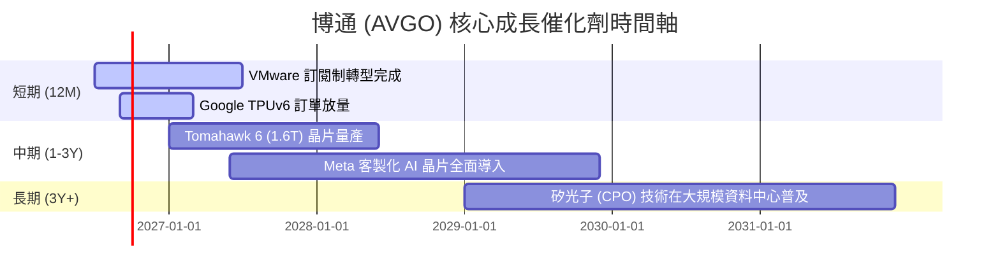

### 8.2 TAM（潛在市場規模）分析

博通所處的市場正經歷結構性擴張：

```
╔══════════════════════════════════════════════════════════════╗
║                  博通 (AVGO) TAM 擴張預估                     ║
╠══════════════════════════════════════════════════════════════╣
║                                                                  ║
║  AI 客製化 ASIC：  2024年 $15B ──> 2028年 $50B+  (CAGR: 35%)     ║
║  高端網路交換晶片：2024年 $8B  ──> 2028年 $18B   (CAGR: 22%)     ║
║  混合雲基礎設施：  2024年 $45B ──> 2028年 $75B   (CAGR: 14%)     ║
║                                                                  ║
║  📊 總計可參與市場 (TAM) 將於 2028 年突破 $1,400 億美元。        ║
╚══════════════════════════════════════════════════════════════╝
```

### 8.3 成長驅動力結構圖

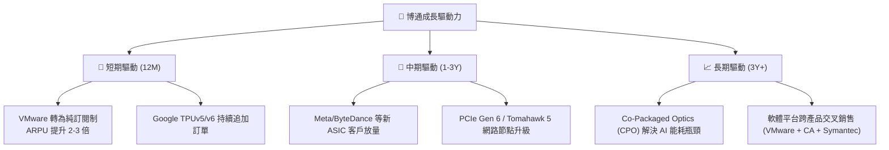

---

## 9. 風險矩陣

儘管博通基本面強勁，但投資人仍需警惕以下結構性與週期性風險。

### 9.1 風險評分矩陣

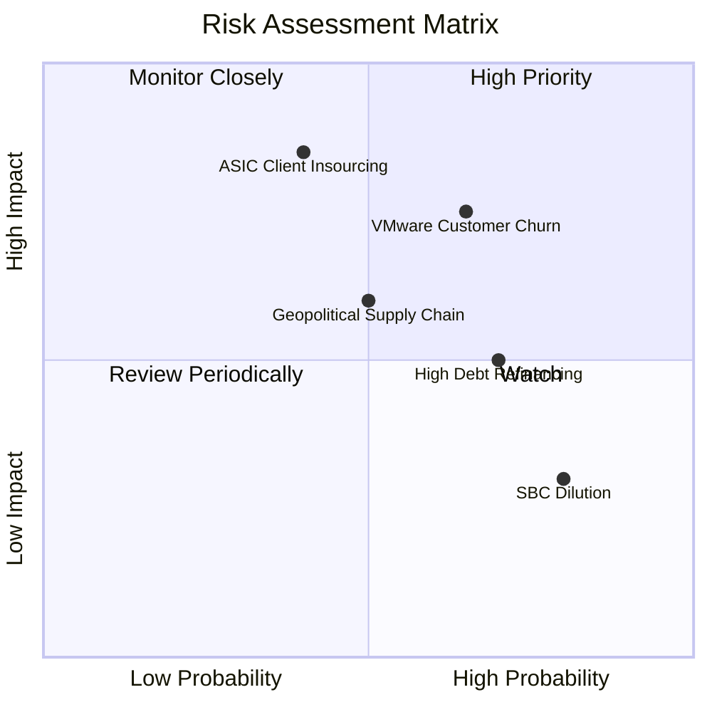

### 9.2 風險清單詳細分析

| # | 風險項目 | 發生機率 | 財務衝擊 | 綜合風險評分 | 關鍵緩解措施與觀察指標 |
|---|---|---|---|---|---|
| 1 | 🔴 **ASIC 大客戶自研 (如 Google)** | 中 (40%) | 極高 (-15% 營收) | 🔴 **8.5 / 10** | 密切追蹤 Google TPU 研發進度。博通透過提供領先的 IP 與封裝技術（CoWoS）維持其不可替代性。 |
| 2 | 🟡 **VMware 客戶流失** | 高 (65%) | 中 (-5% 軟體營收) | 🟡 **6.5 / 10** | 觀察中小型客戶向 Proxmox 等開源方案轉移的比例。博通策略是專注服務前 20% 的大型企業客戶。 |
| 3 | 🟡 **地緣政治與供應鏈風險** | 中 (50%) | 高 (-10% 營收) | 🟡 **6.0 / 10** | 晶圓製造高度依賴台積電（TSMC）。博通正逐步分散封裝產地至東南亞與美國本土。 |
| 4 | 🟡 **高債務再融資風險** | 高 (70%) | 低 (-2% 淨利) | 🟡 **5.0 / 10** | 博通強大的 FCF 每年可償還 $10B+ 債務。債務多為固定利率，短期無集中的再融資壓力。 |

---

## 10. 投資建議

博通（AVGO）是一家兼具 **AI 成長彈性** 與 **公用事業般穩健現金流** 的極稀缺標的。當前估值顯著低估了其長期的營業槓桿彈性。

### 10.1 最終綜合評級

```
╔══════════════════════════════════════════════════════════════╗
║                  AVGO 最終投資評級與總分                     ║
╠══════════════════════════════════════════════════════════════╣
║ 綜合得分：9.1 / 10                                           ║
║ 投資評級：🟢 強烈買入 (Strong Buy)                           ║
║ 信心指數：★★★★★ (極高)                                     ║
║                                                              ║
║ 評語：這是一輛以傳統估值運行的 AI 高速列車。 Forward PE 19x  ║
║       提供了極佳的買入契機，建議機構投資人積極配置。         ║
╚══════════════════════════════════════════════════════════════╝
```

### 10.2 目標價與預期回報率

| 情境 | 隱含目標價 | 當前股價 | 預期回報率 | 機率權重 | 權重調整後目標價 |
|---|---|---|---|---|---|
| **悲觀情境** | $215.88 | $370.83 | -41.8% | 15% | $32.38 |
| **基準情境** | **$524.51** | **$370.83** | **+41.4%** | **60%** | **$314.71** |
| **樂觀情境** | $675.00 | $370.83 | +82.0% | 25% | $168.75 |
| **綜合期望值**| **$515.84** | **$370.83** | **+39.1%** | **100%** | **CFA 推薦合理價值**|

### 10.3 買入時機與觸發因素

```
╔══════════════════════════════════════════════════════════════════╗
║                  ✅ 博通 (AVGO) 投資操作手冊                     ║
╠══════════════════════════════════════════════════════════════════╣
║                                                                  ║
║  🎯 立即建倉條件（滿足任二）：                                   ║
║  ✅ Forward P/E 跌破 20x（當前為 19.10x，已滿足）                ║
║  ✅ 最新季度 FCF 轉換率維持在 90% 以上（已滿足）                 ║
║  ✅ 季報確認 AI 相關營收 YoY 成長 > 40%                          ║
║                                                                  ║
║  ➕ 加碼觸發條件：                                               ║
║  ☐ 股價因市場系統性調整回檔至 $320 - $340 區間（強支撐位）       ║
║  ☐ 宣佈獲得第三家超大規模雲端業者（Hyperscaler）的 ASIC 訂單     ║
║                                                                  ║
║  ❌ 減碼/停損觸發條件：                                          ║
║  ☐ Google 明確宣佈將於下一代 TPU 終止與博通的合作                ║
║  ☐ 季度 Non-GAAP 營業利益率連續兩季跌破 43%                      ║
║                                                                  ║
╚══════════════════════════════════════════════════════════════════╝
```

### 10.4 投資人適配度分析

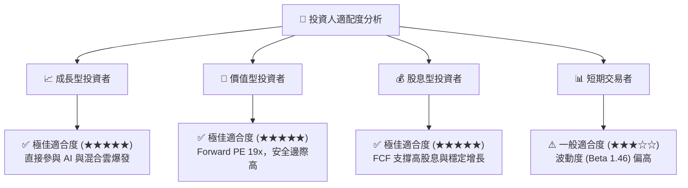

### 10.5 每季財報監控清單（Quarterly Watch List）

為了確保投資論點未發生漂移，投資人應於每季財報公佈時，重點追蹤以下核心指標：

| 監控指標 | 基準安全線 | 預警線 (觸發減碼) | 樂觀線 (觸發加碼) | TTM 當前值 |
|---|---|---|---|---|
| **Non-GAAP 毛利率** | > 74.0% | < 72.0% | > 77.0% | **76.3%** |
| **Non-GAAP 營業利益率**| > 46.0% | < 43.0% | > 50.0% | **49.0%** |
| **季度 FCF 規模** | > $7.0B | < $6.0B | > $9.0B | **$10.26B (Q2)** |
| **淨債務 / EBITDA** | < 1.5x | > 2.2x | < 0.8x | **1.08x** |
| **SBC / 營業現金流** | < 30.0% | > 35.0% | < 20.0% | **26.1%** |

### 10.6 反面論證：什麼會證明投資論點錯誤（What Would Change My Mind）

本報告的「強烈買入」評級建立在博通高壁壘與高效率的假設上。若以下可量化條件發生，我們將不得不重新評估甚至撤回買入建議：

```
╔══════════════════════════════════════════════════════════════════╗
║              ⚠️ 論點失效條件 (Disconfirming Evidence)            ║
╠══════════════════════════════════════════════════════════════════╣
║  若出現以下任一情況，本投資論點即宣告失效：                      ║
║                                                                  ║
║  ☐ 半導體解決方案（Semiconductor Solutions）營收連續兩季 YoY < 5%  ║
║  ☐ 自由現金流（FCF）轉換率跌破 80%，說明獲利品質惡化             ║
║  ☐ ROIC 跌破 WACC（即 ROIC < 11.24%），公司開始摧毀股東價值      ║
║  ☐ VMware 轉型後，客戶流失率（Churn Rate）年化超過 25%           ║
║  ☐ 股權稀釋薪酬（SBC）佔營收比重攀升至 15% 以上                 ║
║                                                                  ║
╚══════════════════════════════════════════════════════════════════╝
```

---

> **免責聲明**：本報告為 AI 基於歷史與即時財務數據自動生成之深度研究，僅供學術與投資研究參考，不構成任何買賣博通（AVGO）股票之要約或投資建議。投資有風險，入市需謹慎。