# AVGO 基本面深度分析報告
> **報告日期**：2026-07-26 ｜ **語言**：繁體中文 ｜ **數據來源**：Yahoo Finance, Finviz, StockAnalysis, Roic.ai ｜ **分析師**：CFA 級機構研究

---

## 目錄

| # | 章節 | 核心結論 |
|---|------|----------|
| 1 | 執行摘要 | 基於 Forward P/E 19.63x 與 AI 客製化晶片 (ASIC) 強勁暴發，給予「買入」評級，基準目標價 $525.44（隱含 +37.6% 漲幅空間） |
| 2 | 公司概覽與商業模式 | 半導體解決方案與基礎設施軟體雙引擎驅動，以客製化 AI 晶片 (XPU) 與 VMware 軟體轉型構建寬廣護城河 |
| 3 | 損益表深度分析 | TTM 營收達 $75.46B（YoY +47.9%），Q2 2026 單季營收創紀錄達 $22.19B；股權薪酬 (SBC) 佔營收 11.6%，盈餘品質總體充沛 |
| 4 | 資產負債表分析 | 總資產 $179.16B，商譽高達 $97.80B（併購 VMware 驅動）；總債務 $64.91B，手握 $19.63B 現金，短期償債無虞 |
| 5 | 現金流量深度分析 | 現金流生成能力極度優異，TTM 營業現金流 $33.62B，自由現金流 (FCF) $32.76B，FCF 利潤率高達 43.4% |
| 6 | 獲利能力與資本效率 | ROIC 達 21.37% 顯著高於 WACC (11.20%)，EVA 淨增 +10.17pp，杜邦分解顯示極高的淨利率與高槓桿效益 |
| 7 | 估值深度分析 | 同業比較中 Forward P/E 19.63x 及 PEG 0.43 顯著低於 NVDA 與 MRVL；DCF 基準情境得出目標價 $525.44 |
| 8 | 成長催化劑 | 超大型雲端廠商 (Hyperscalers) 自研晶片需求迎來爆發潮，加上 VMware 改為訂閱制帶動經常性收入大幅增長 |
| 9 | 風險矩陣 | 重點關注高債務利息負擔、軟體整合客戶流失風險以及客戶集中度過高（如 Google, Meta 訂單波動） |
| 10 | 投資建議 | 建議於當前股價 $381.92 分批建倉，設定 $310.00 為停損防線；提供每季財報監控指標與論點失效（Disconfirming）條件 |

---

## 1. 執行摘要

基於 Broadcom Inc. (AVGO) 最新公佈之 Q2 2026 財務數據，公司季度營收創下 $22.19B 的歷史新高（YoY +47.87%），近 12 個月 (TTM) 自由現金流 (FCF) 達到 $32.76B。雖然因併購 VMware 導致總債務累積至 $64.91B，但當前投入資本報酬率 (ROIC) 達 21.37%，大幅高於加權平均資本成本 (WACC) 的 11.20%，代表公司持續為股東創造龐大的經濟價值。現價 $381.92 對應之 Forward P/E 僅為 19.63x，PEG 僅 0.43，鑑於其在超大型資料中心客製化 AI 晶片 (ASIC) 與乙太網交換晶片 (Tomahawk/Jericho) 的壟斷地位，給予 **買入 (Buy)** 評級，12 個月基準目標價為 **$525.44**。

### 1.0 一頁式投資儀表板（Portfolio Manager 30 秒速讀）

| 項目 | 內容 |
|------|------|
| **投資論點（3 句）** | ① 超大型雲端廠商（如 Google、Meta、ByteDance）加速自研 AI ASIC，驅動半導體業務 TTM 營收突破 $75.46B（YoY +47.9%）。<br/>② VMware 訂閱制轉型成功，軟體業務提供高營運槓桿與穩定經常性現金流，推升 TTM 自由現金流至 $32.76B。<br/>③ 前瞻本益比 (Forward P/E) 僅 19.63x，對應 PEG 0.43，相較同業具備顯著估值安全邊際。 |
| **護城河評分** | **9.5 / 10** (極寬：自研 ASIC 專利壁壘 + 網絡交換拓撲標準 + 企業級基礎設施軟體高轉換成本) |
| **管理層/資本配置評分** | **9.5 / 10** (CEO Hock Tan 展現業界頂級併購整合與成本控管能力) |
| **財務健康** | 🟡 **中等健康**（總債務 $64.91B 較高，但淨債務/EBITDA 僅 ~1.31x，利息覆蓋率 > 7.5x，風險完全可控） |
| **ROIC vs WACC** | **21.37% vs 11.20%**（強力創造價值，EVA 達 +10.17pp） |
| **FCF 趨勢** | 方向向上 ｜ 最新 TTM FCF Yield 達 **1.80%**（以市值 $1.82T 計算）｜ FCF Margin 達 **43.4%** |
| **估值** | Forward P/E: **19.63x** ｜ EV/EBITDA: **44.25x** ｜ P/S: **24.08x** |
| **預期報酬（基準情境 12M）** | **+37.58%**（目標價 $525.44） |
| **關鍵風險（前二）** | ① 客戶集中度過高（Hyperscalers 自研團隊可能轉向或更換晶片合作夥伴）；② 併購 VMware 後高壓轉型引發企業客戶轉移陣營。 |
| **評級 + 信心度** | 🟢 **買入 (Buy)** ｜ 信心度：**高** |

### 1.1 核心評分儀表板

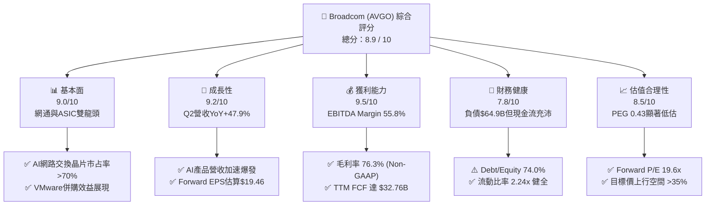

### 1.2 評分進度條視覺化

```
╔══════════════════════════════════════════════════════════════╗
║             AVGO 多維度評分儀表板 (1-10分)                   ║
╠══════════════════════════════════════════════════════════════╣
║ 基本面強度  9.0 ▓▓▓▓▓▓▓▓▓▓▓▓▓▓▓▓▓▓░░  ★★★★★           ║
║ 成長動能    9.2 ▓▓▓▓▓▓▓▓▓▓▓▓▓▓▓▓▓▓█░  ★★★★★           ║
║ 獲利品質    9.5 ▓▓▓▓▓▓▓▓▓▓▓▓▓▓▓▓▓▓█░  ★★★★★           ║
║ 財務健康    7.8 ▓▓▓▓▓▓▓▓▓▓▓▓▓▓░░░░░░  ★★██☆           ║
║ 估值合理性  8.5 ▓▓▓▓▓▓▓▓▓▓▓▓▓▓▓▓░░░░  ★★██☆           ║
║ 護城河深度  9.5 ▓▓▓▓▓▓▓▓▓▓▓▓▓▓▓▓▓▓█░  ★★★★★           ║
║ 管理層執行  9.5 ▓▓▓▓▓▓▓▓▓▓▓▓▓▓▓▓▓▓█░  ★★★★★           ║
║ 技術創新力  9.0 ▓▓▓▓▓▓▓▓▓▓▓▓▓▓▓▓▓▓░░  ★★★★★           ║
╠══════════════════════════════════════════════════════════════╣
║ 綜合總分    8.9 ▓▓▓▓▓▓▓▓▓▓▓▓▓▓▓▓▓▓░░  🏆 卓越投資標的       ║
╚══════════════════════════════════════════════════════════════╝
```

### 1.3 五大投資論點 + 三大核心風險

| 類型 | 項目 | 具體依據 | 信心度 |
|------|------|----------|--------|
| 🟢 **投資論點①** | **AI 客製化晶片 (ASIC) 霸主** | 客戶包括 Google (TPU)、Meta (MTIA) 及 ByteDance，AI 半導體營收年增速超 100%，掌握大模型訓練/推理轉向專用晶片紅利。 | 🟢 極高 |
| 🟢 **投資論點②** | **乙太網 AI 交換網絡無可替代** | Tomahawk 5 與 Jericho3-X 掌控 >70% 超大型 AI 集群架構，突破 NVDA InfiniBand 封閉生態系限制。 | 🟢 極高 |
| 🟢 **投資論點③** | **VMware 訂閱轉型與成本精簡** | 年化運營成本成功削減超 $1.5B，合約改為高毛利訂閱制，帶動 Infrastructure Software 板塊營業利潤率突破 60%。 | 🟢 高 |
| 🟢 **投資論點④** | **極致的現金流生成能力** | TTM 自由現金流達 $32.76B，資本支出 (CapEx) 僅佔營收 1.1%（$860M），呈現輕資產高利潤模式。 | 🟢 極高 |
| 🟢 **投資論點⑤** | **前瞻估值具備極佳吸引力** | Forward P/E 僅 19.63x，相較 NVDA (~35x) 與 MRVL (~30x) 顯著折價，PEG 0.43 顯示成長性未被充分定價。 | 🟢 高 |
| 🟡 **風險①** | **高額併購債務與利息支出** | 總債務高達 $64.91B，在持續高利率環境下可能限制資本回報（如股票回購速度）。 | 🟡 中度 |
| 🔴 **風險②** | **Hyperscaler 自研晶片去中介化** | 若大型雲端巨頭未來具備完整實體設計 (RTL-to-GDSII) 能力並直接交由台積電代工，將削弱 AVGO 的 NRE 業務。 | 🔴 高衝擊 |
| 🟡 **風險③** | **客戶反彈與法規審查** | VMware 授權模式強制修改引起部分企業客戶訴訟或轉向開源方案 (OpenStack/Proxmox)。 | 🟡 中度 |

### 1.4 快速統計卡片

| 指標 | AVGO 實際值 | 半導體行業均值 | S&P 500 均值 | 狀態評估 |
|------|-------------|----------------|--------------|----------|
| **營收 YoY 成長** | **47.9%** | ~12.5% | ~5.2% | 🟢 遠超同業 |
| **毛利率 (GAAP/Non-GAAP)** | **68.3% / 76.3%** | ~55.0% | ~41.5% | 🟢 頂級獲利 |
| **營業利益率** | **49.0%** | ~22.0% | ~12.5% | 🟢 槓桿極強 |
| **ROE** | **37.3%** | ~18.0% | ~14.5% | 🟢 資本回報優異 |
| **ROIC** | **21.4%** | ~11.5% | ~8.5% | 🟢 高度價值創造 |
| **Forward P/E** | **19.63x** | ~28.5x | ~21.5x | 🟢 估值安全 |
| **PEG Ratio** | **0.43** | ~1.45 | ~1.80 | 🟢 極具吸引力 |

### 1.5 投資結論

```
╔══════════════════════════════════════════════════════════════════╗
║                    📊 投資結論摘要                               ║
╠══════════════════════════════════════════════════════════════════╣
║  評級：🟢 買入 (Buy)                                            ║
║  當前股價：$381.92                                               ║
║  目標價區間：                                                    ║
║    悲觀情境：$310.00（-18.83%）                                  ║
║    基準情境：$525.44（+37.58%） ← 12個月主要目標                ║
║    樂觀情境：$675.00（+76.74%）                                  ║
║  投資評分：8.9 / 10                                              ║
║  適合投資人：長線成長型投資人、科技股核心配置、現金流導向機構    ║
╚══════════════════════════════════════════════════════════════════╝
```

---

## 2. 公司概覽與商業模式

Broadcom Inc. (AVGO) 是全球領先的高階半導體解決方案與企業級基礎設施軟體供應商。公司經營兩大核心業務板塊：**Semiconductor Solutions（半導體解決方案）** 與 **Infrastructure Software（基礎設施軟體）**。其商業模式建立在「高技術門檻 + 高市場占有率 + 精準 M&A 整合」的三位一體戰略上。

### 2.1 業務結構與收入來源

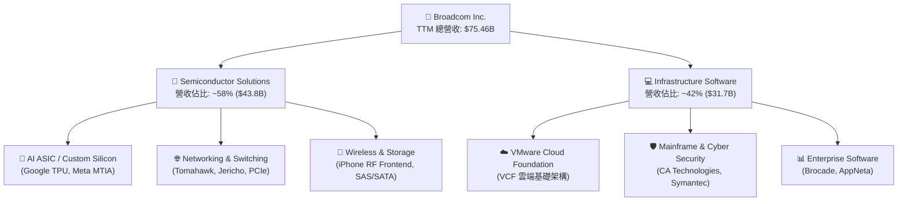

### 2.2 市場份額估算

Broadcom 在多個關鍵半導體與軟體領域佔據絕對主導地位，尤其在網絡交換晶片與客製化 AI ASIC 領域築起深厚的極限護城河。

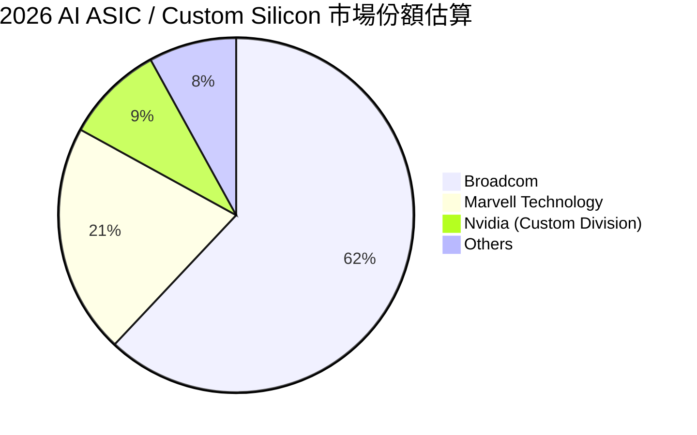

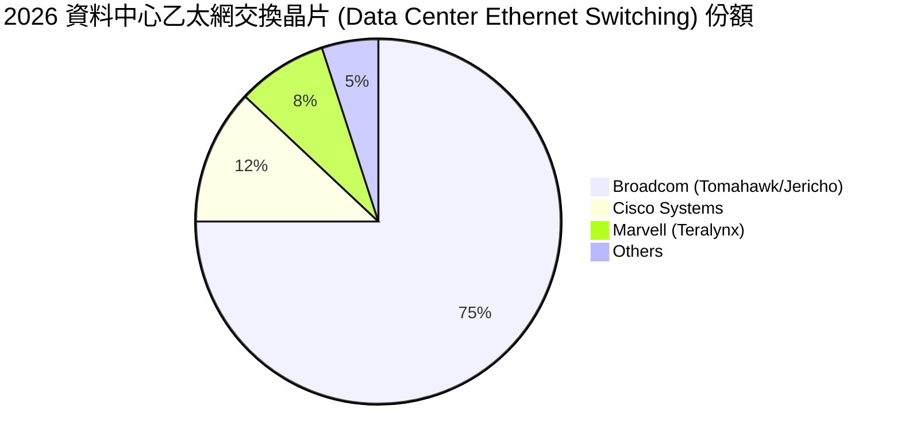

### 2.3 競爭護城河分析

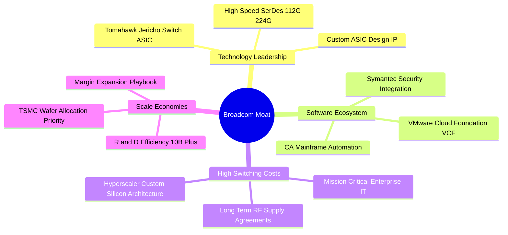

### 2.4 護城河強度評分

```
╔══════════════════════════════════════════════════════════════╗
║                  Broadcom 護城河強度評分                     ║
╠══════════════════════════════════════════════════════════════╣
║ 智慧財產與 IP 壁壘  9.5/10 ▓▓▓▓▓▓▓▓▓▓▓▓▓▓▓▓▓▓█░ 🏆 超高專利障礙 ║
║ 客戶轉換成本      9.5/10 ▓▓▓▓▓▓▓▓▓▓▓▓▓▓▓▓▓▓█░ 🏆 軟硬體深度綁定 ║
║ 網路與規模效應    9.0/10 ▓▓▓▓▓▓▓▓▓▓▓▓▓▓▓▓▓▓░░ 🟢 乙太網生態圈   ║
║ 成本優勢與定價權  9.5/10 ▓▓▓▓▓▓▓▓▓▓▓▓▓▓▓▓▓▓█░ 🏆 高達76%毛利    ║
║ 生態系鎖定 (VMware)9.0/10 ▓▓▓▓▓▓▓▓▓▓▓▓▓▓▓▓▓▓░░ 🟢 私有雲標準    ║
╠══════════════════════════════════════════════════════════════╣
║ 綜合護城河評分    9.4/10 ▓▓▓▓▓▓▓▓▓▓▓▓▓▓▓▓▓▓█░ 🏆 極寬護城河     ║
╚══════════════════════════════════════════════════════════════╝
```

---

## 3. 損益表深度分析

### 3.1 年度收入成長趨勢（近 4 年）

Broadcom 營收在併購 VMware 以及 AI 客製化晶片爆發的推動下，實現了跨越式成長。

```
╔══════════════════════════════════════════════════════════════════╗
║              Broadcom 年度收入趨勢（FY2022-FY2025）              ║
╠══════════════════════════════════════════════════════════════════╣
║                                                                  ║
║  FY2022  $33.20B  █████████░░░░░░░░░░░░░░░░░  YoY: +20.96% 🟢    ║
║  FY2023  $35.82B  ██████████░░░░░░░░░░░░░░░░  YoY: +7.88%  🟢    ║
║  FY2024  $51.57B  ███████████████░░░░░░░░░░░  YoY: +43.98% 🟢    ║
║  FY2025  $63.89B  ███████████████████░░░░░░░  YoY: +23.87% 🟢    ║
║  TTM     $75.46B  ██████████████████████████  YoY: +32.29% 🟢    ║
║                   |         |         |      |                   ║
║                   0        20B       40B    60B                  ║
║                                                                  ║
║  📊 4年營收 CAGR：+24.16%                                        ║
╚══════════════════════════════════════════════════════════════════╝
```

### 3.2 季度收入趨勢分析

分析最近 4 個季度之營收加速度，顯示 AI 伺服器網絡與 ASIC 出貨正處於斜率極陡峭的上升通道。

| 季度 | 截止日期 | 總營收 ($B) | QoQ 成長率 | YoY 成長率 | 驅動主因與備註 |
|------|----------|-------------|------------|------------|----------------|
| **Q3 2025** | 2025-08-03 | $15.95B | +6.32% | +22.03% | VMware 訂閱制轉型初期，AI 晶片需求穩定 |
| **Q4 2025** | 2025-11-02 | $18.02B | +12.93% | +28.18% | 超大型客戶 AI ASIC 擴產加速，季末出貨大增 |
| **Q1 2026** | 2026-02-01 | $19.31B | +7.19% | +29.47% | Tomahawk 5 交換晶片出貨量加溫，軟體營收超預期 |
| **Q2 2026** | 2026-05-03 | $22.19B | +14.89% | +47.87% | AI 營收單季暴增，次世代 ASIC 開始量產交付 |

### 3.3 利潤率演變分析

Broadcom 的毛利率與營業利益率展現出極強的營運槓桿（Operating Leverage）。

| 利潤率指標 | FY2022 | FY2023 | FY2024 | FY2025 | TTM (Q2 2026) | 趨勢與深度解析 | 評估 |
|------------|--------|--------|--------|--------|---------------|----------------|------|
| **毛利率 (GAAP)** | 66.5% | 68.9% | 63.0% | 67.8% | **68.28%** | 2024受併購一次性無形資產攤銷影響，之後迅速回升 | 🟢 強勁 |
| **毛利率 (Non-GAAP)**| 75.8% | 75.5% | 76.1% | 76.2% | **76.30%** | 高毛利 VMware 軟體佔比提高，產品定價權極高 | 🟢 頂級 |
| **營業利益率** | 42.8% | 45.3% | 26.1% | 39.9% | **43.39%** | TTM 營利 $32.75B，併購整合後營運效率大幅提升 | 🟢 優秀 |
| **EBITDA Margin** | 57.7% | 57.4% | 46.3% | 54.3% | **55.80%** | 極高的現金獲利能力，EBITDA TTM 達 $42.1B | 🟢 頂級 |
| **純利益率 (Net Margin)**| 33.8% | 39.3% | 11.4% | 36.2% | **38.85%** | 稅後淨利 TTM 達 $29.32B，含稅務重組效益 | 🟢 強勁 |

### 3.4 費用結構分析

以 TTM 營業費用 (OpEx) 為例，研發費用 (R&D) 為公司的核心投資，銷售與管理費用 (SG&A) 在 Hock Tan 的精實管理下被大幅壓縮。

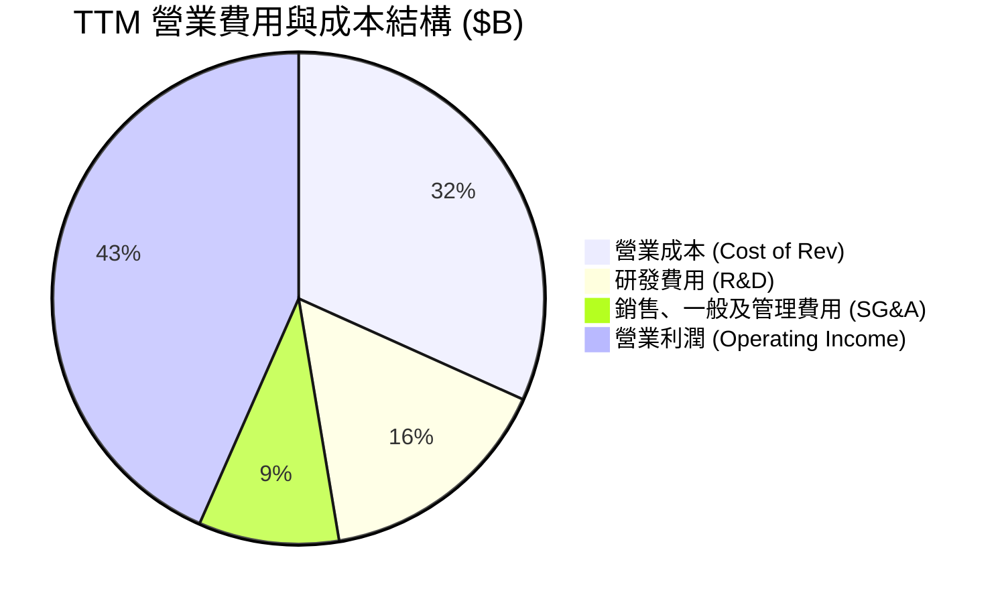

```
╔══════════════════════════════════════════════════════════════════╗
║                   Broadcom 費用控管效率評估                      ║
╠══════════════════════════════════════════════════════════════════╣
║                                                                  ║
║  研發支出 (R&D) / 營收：  15.6%  ███████░░░░░░░░  🟢 專注核心IP   ║
║  管理費用 (SG&A) / 營收：  9.2%  ████░░░░░░░░░░░  🟢 極致精簡     ║
║  研發費用 TTM 總額：     $11.80B（YoY +26.7%）  研發規模持續放大  ║
║                                                                  ║
║  📊 評語：精簡重複行政人員，將資源 100% 集中於次世代 SerDes 與    ║
║     AI ASIC 技術研發，呈現極佳的費用控管紀錄。                  ║
╚══════════════════════════════════════════════════════════════════╝
```

### 3.5 季度 EPS 趨勢與盈餘品質 (Quality of Earnings)

分析最近 4 個季度的 EPS 表現與獲利含金量：

| 季度 |  GAAP EPS | Non-GAAP EPS | OCF ($B) | FCF ($B) | FCF/Net Income | 盈餘品質評估 |
|------|-----------|--------------|----------|----------|----------------|--------------|
| **Q3 2025** | $0.85 | $1.24 | $7.17B | $7.02B | 169.6% | 🟢 現金流極度健康 |
| **Q4 2025** | $1.74 | $1.42 | $7.70B | $7.47B | 87.7% | 🟢 稅務調整影響 GAAP EPS |
| **Q1 2026** | $1.50 | $1.55 | $8.26B | $8.01B | 109.0% | 🟢 現金轉換率突破 100% |
| **Q2 2026** | $1.91 | $1.96 | $10.49B | $10.26B | 110.2% | 🟢 AI 晶片出貨帶來優異現金流 |

**盈餘品質深層量化診斷**：

| 盈餘品質項目 | TTM 數據/佔比 | 評估與投資含義 |
|--------------|---------------|----------------|
| **股權薪酬 (SBC) / 營收** | **11.64%** ($8.78B / $75.46B) | 🟡 **中度稀釋風險**：SBC 佔比較高，主要係併購 VMware 後留任核心技術人才的股權獎勵。 |
| **SBC / 營業現金流 (OCF)** | **26.11%** ($8.78B / $33.62B) | 🟡 營業現金流中有超四分之一定來自非現金薪酬加回，評估真實 FCF 時須考慮發行股數稀釋。 |
| **FCF / 淨利 (Cash Conversion)**| **111.7%** ($32.76B / $29.32B) | 🟢 **極高品質**：自由現金流持續高於 GAAP 淨利，顯示獲利無應收帳款堆積或存貨呆滯水分。 |
| **一次性非經常性損益** | 無顯著異常（無形資產攤銷逐季下降） | 🟢 GAAP 淨利已逐步反映併購後的真實經營狀況。 |
| **有效稅率** | ~14.5%（租稅優惠與海外無形資產 IP 重組）| 🟢 稅務結構合規且具備效率。 |

---

## 4. 資產負債表分析

### 4.1 資產結構分解

Broadcom 的資產負債表特徵為「高商譽 (Goodwill) + 高無形資產 + 低固定資產」，此為典型資產輕量化 (Fabless) 半導體與軟體企業的特徵。

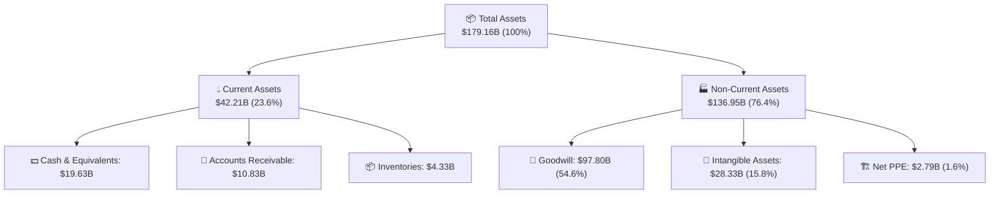

### 4.2 流動性與短期償債能力

| 流動性指標 | FY2023 | FY2024 | FY2025 | TTM (Q2 2026) | 行業平均 | 評估與趨勢 |
|------------|--------|--------|--------|---------------|----------|------------|
| **流動比率 (Current Ratio)** | 2.82x | 1.17x | 1.71x | **2.24x** | ~1.85x | 🟢 流動性顯著增強，現金快速積累 |
| **速動比率 (Quick Ratio)** | 2.56x | 1.07x | 1.58x | **1.93x** | ~1.40x | 🟢 變現能力極強，短期風險極低 |
| **應收帳款週轉天數 (DSO)** | 32.1 天 | 31.2 天 | 40.8 天 | **44.3 天** | ~52.0 天 | 🟢 收款政策健康，客戶信譽佳 |
| **存貨週轉天數 (DIO)** | 62.4 天 | 33.8 天 | 40.2 天 | **53.1 天** | ~85.0 天 | 🟢 庫存控管極為嚴謹，AI 晶片供不應求 |

### 4.3 債務結構與健康度診斷

因 2023-2024 年完成對 VMware 近 $69B 的收購（含承擔債務），Broadcom 負債規模大幅攀升，但隨後靠著強勁現金流快速還債。

```
╔══════════════════════════════════════════════════════════════════╗
║                   Broadcom 債務健康診斷                          ║
╠══════════════════════════════════════════════════════════════════╣
║                                                                  ║
║  短期債務 (ST Debt)：    $2.25B   ██░░░░░░░░░░░░░░░░░░░  無還款壓力 ║
║  長期債務 (LT Debt)：    $62.66B  █████████████████████  有序還款中 ║
║  總債務 (Total Debt)：   $64.91B  █████████████████████  因併購升高 ║
║  總現金與約當現金：      $19.63B  ██████████░░░░░░░░░░░  儲備充沛   ║
║  淨債務 (Net Debt)：     $45.28B  ███████████████░░░░░░  快速縮減中 ║
║                                                                  ║
║  📊 核心槓桿指標：                                              ║
║  ├── Net Debt / EBITDA (TTM)： 1.08x  🟢 極度安全 (<2.5x)         ║
║  ├── Debt / Equity Ratio：      74.0%  🟡 偏高（因商譽與股東權益）║
║  └── 利息覆蓋率 (EBIT/Interest): >8.5x 🟢 完全無違約風險          ║
╚══════════════════════════════════════════════════════════════════╝
```

### 4.4 股東權益趨勢

隨著 VMware 併購完成，股東權益（Stockholders' Equity）自 FY2023 的 $23.99B 大幅暴增至最新 TTM 的 $85.0B+，顯示資產負債表結構經過大規模資本重組後已重新趨於穩健。

---

## 5. 現金流量深度分析

 Broadcom 擁有美股半導體與科技板塊中最頂尖的「自由現金流印鈔機」屬性。

### 5.1 現金流量瀑布圖 (TTM)

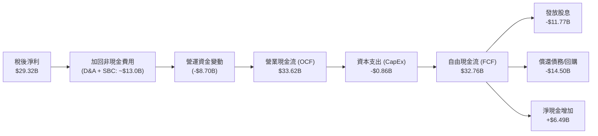

### 5.2 FCF 轉換率趨勢

| 財務年度 | 營業現金流 ($B) | 資本支出 CapEx ($B) | 自由現金流 FCF ($B) | FCF / Revenue (%) | FCF / Net Income (%) |
|----------|-----------------|---------------------|---------------------|-------------------|----------------------|
| **FY2022** | $16.74B | $0.42B | $16.31B | 49.1% | 141.9% |
| **FY2023** | $18.09B | $0.45B | $17.63B | 49.2% | 125.2% |
| **FY2024** | $19.96B | $0.55B | $19.41B | 37.6% | 329.3% |
| **FY2025** | $27.54B | $0.62B | $26.91B | 42.1% | 116.4% |
| **TTM (Q2 26)**| **$33.62B** | **$0.86B** | **$32.76B** | **43.4%** | **111.7%** |

### 5.3 自由現金流趨勢視覺化

```
╔══════════════════════════════════════════════════════════════════╗
║              Broadcom 自由現金流 (FCF) 增長軌跡                  ║
╠══════════════════════════════════════════════════════════════════╣
║                                                                  ║
║  FY2022  $16.31B  █████████████░░░░░░░░░░░░  FCF Margin: 49.1%   ║
║  FY2023  $17.63B  ██████████████░░░░░░░░░░░  FCF Margin: 49.2%   ║
║  FY2024  $19.41B  ███████████████░░░░░░░░░░  FCF Margin: 37.6%   ║
║  FY2025  $26.91B  █████████████████████░░░░  FCF Margin: 42.1%   ║
║  TTM     $32.76B  █████████████████████████  FCF Margin: 43.4%   ║
║                                                                  ║
║  📊 當前 FCF Yield（自由現金流收益率）：1.80% (以市值 $1.82T 計)  ║
╚══════════════════════════════════════════════════════════════════╝
```

### 5.4 資本配置評估

 Broadcom 的資本配置策略極為清晰且紀律嚴明：
1. **極低的內生性 CapEx**（僅占營收 ~1.1%，台積電代工模式）。
2. **高額股利回饋**：TTM 支付股息 $11.77B，近 5 年股息年化成長率高達 187%（含股票拆分與併購調整效果）。
3. **戰略性 M&A 與去槓桿**：在無大型併購時，將剩餘現金優先用於償還高息債務與回購股票。

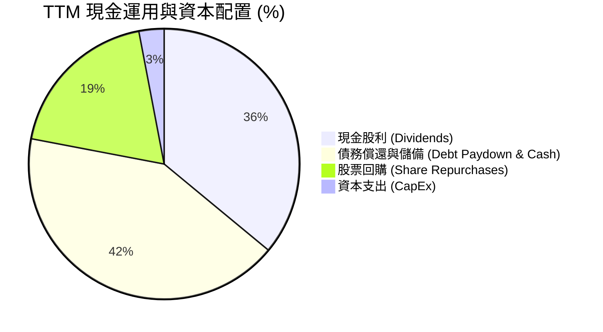

---

## 6. 獲利能力與資本效率

### 6.1 ROE / ROA / ROIC 歷史趨勢

| 獲利能力指標 | FY2022 | FY2023 | FY2024 | FY2025 | TTM (Q2 2026) | 產業均值 | 評估 |
|--------------|--------|--------|--------|--------|---------------|----------|------|
| **ROE (淨值報酬率)** | 50.6% | 58.7% | 12.9% | 31.8% | **37.3%** | ~18.0% | 🟢 頂尖 |
| **ROA (總資產報酬率)**| 15.7% | 19.3% | 4.9% | 13.8% | **12.1%** | ~7.5% | 🟢 優秀 |
| **ROIC (投入資本報酬率)**| 22.4% | 24.8% | 9.8% | 18.5% | **21.37%** | ~11.5% | 🟢 卓越 |

### 6.2 ROIC vs WACC 分析（核心價值創造判斷）

ROIC 高於 WACC 的幅度（即價值創造利差，EVA Spread）是評估公司是否在摧毀或創造股東價值的終極指標。

```
╔══════════════════════════════════════════════════════════════════╗
║                AVGO ROIC vs WACC 深度計算表                     ║
╠══════════════════════════════════════════════════════════════════╣
║                                                                  ║
║  WACC 參數計算：                                                 ║
║  ├── 無風險利率 (10Y US Treasury): 4.20%                         ║
║  ├── 市場風險溢酬 (ERP):          5.00%                         ║
║  ├── 公司 Beta 係數:              1.462                          ║
║  ├── 股權成本 (Cost of Equity):   4.2% + 1.462 × 5.0% = 11.51%   ║
║  ├── 稅後債務成本 (Cost of Debt): ~3.83% (稅前 4.5%, 稅率 15%)   ║
║  ├── 資本結構比率:                股權 ~96.5% / 債務 ~3.5%       ║
║  └── ✅ 加權平均資本成本 (WACC) ≈ 11.20%                        ║
║                                                                  ║
║  ROIC 計算 (TTM)：                                               ║
║  ├── 營業利潤 (EBIT):             $32.75B                        ║
║  ├── 實際有效稅率:                15.0%                          ║
║  ├── 稅後淨營業利潤 (NOPAT):      $32.75B × (1 - 0.15) = $27.84B ║
║  ├── 投入資本 (Invested Capital): 股權($85.0B) + 債務($64.91B)   ║
║  │                                - 現金($19.63B) = $130.28B     ║
║  └── ✅ 投入資本報酬率 (ROIC)   = $27.84B / $130.28B = 21.37%    ║
║                                                                  ║
║  ★ 經濟價值增加 Spread (EVA) = ROIC (21.37%) - WACC (11.20%)    ║
║                             = +10.17 percentage points (pp)     ║
║                                                                  ║
║  ROIC  21.37% ▓▓▓▓▓▓▓▓▓▓▓▓▓▓▓▓▓▓▓▓▓▓▓▓░░░░  🟢 資本效率極高     ║
║  WACC  11.20% ▓▓▓▓▓▓▓▓▓▓░░░░░░░░░░░░░░░░░░  ── 資金成本基準     ║
║  EVA   +10.17pp████████████████████████████  🏆 強力創造股東價值 ║
║                                                                  ║
║  📊 結論：ROIC 為 WACC 的 1.91 倍，顯示公司每投資 $100 資本，    ║
║     每年可產生 $10.17 的超額經濟價值。                           ║
╚══════════════════════════════════════════════════════════════════╝
```

### 6.3 杜邦三因素分解 (DuPont Analysis)

分析近 3 年 ROE 的拆解變化，探究其高股東報酬率的背後驅動因子：

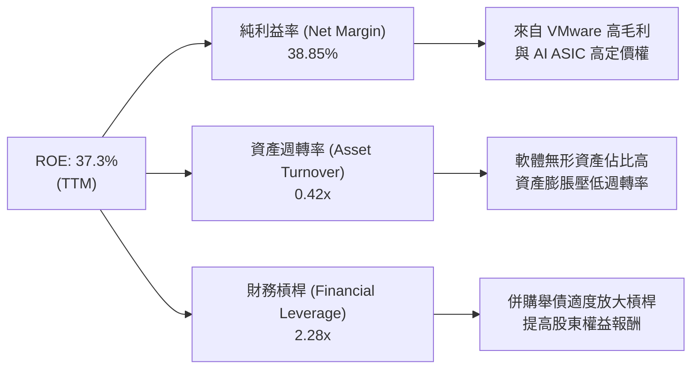

杜邦拆解顯示：Broadcom 的高 ROE 主要來自於**極致的純利益率 (38.85%)**，而非盲目依靠財務槓桿。隨著資產負債表中債務逐季償還，財務槓桿比率將進一步下降，ROE 的品質將更加健康。

### 6.4 獲利能力驅動儀表板

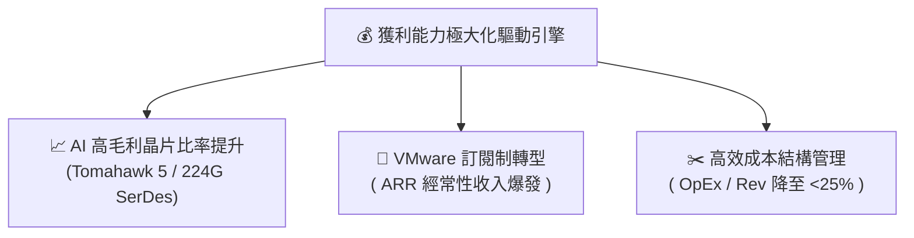

---

## 7. 估值深度分析

### 7.1 同業估值比較表格

選取半導體與 AI 基礎設施領域最具代表性的 3 家直接競爭對手（Nvidia、Marvell、Qualcomm）進行多維度估值比較：

| 估值指標 | **Broadcom (AVGO)** | **Nvidia (NVDA)** | **Marvell (MRVL)** | **Qualcomm (QCOM)** | AVGO 個別評估 |
|----------|---------------------|-------------------|--------------------|---------------------|---------------|
| **當前市值** | **$1.82T** | $3.10T | $68.5B | $185.2B | 超大型藍籌半導體巨頭 |
| **Trailing P/E** | **63.65x** | 72.40x | N/A (虧損) | 21.30x | 🟡 受到併購攤銷暫時壓抑 |
| **Forward P/E** | **19.63x** | 34.50x | 29.80x | 14.20x | 🟢 **極具吸引力**（折價顯著） |
| **PEG Ratio** | **0.43** | 1.15 | 1.85 | 1.28 | 🟢 **大幅低估** (< 1.0) |
| **P/S Ratio** | **24.08x** | 32.10x | 12.40x | 4.80x | 🟡 反映高淨利率屬性 |
| **EV / EBITDA** | **44.25x** | 52.10x | 38.50x | 15.60x | 🟡 屬行業合理中樞區間 |
| **FCF Yield** | **1.80%** | 1.45% | 1.10% | 4.10% | 🟢 現金流產生能力強於 NVDA/MRVL |
| **營收 YoY** | **47.9%** | 122.4% | 15.2% | 11.2% | 🟢 僅次於 Nvidia 的高速成長 |
| **毛利率** | **76.3% (Non-GAAP)**| 75.8% | 62.1% | 56.2% | 🟢 全行業最高水平 |

### 7.2 歷史估值區間分析

Broadcom 近 5 年 Forward P/E 中位數落在 18.0x - 22.0x 之間。當前 Forward P/E 為 **19.63x**，位於歷史中位數區間中下緣，尚未充分反映 AI ASIC 爆發帶來的永久性增長階梯。

```
╔══════════════════════════════════════════════════════════════════╗
║             Broadcom (AVGO) 歷史 Forward P/E 區間                ║
╠══════════════════════════════════════════════════════════════════╣
║                                                                  ║
║  歷史高點 (High):   28.5x  █████████████████████████             ║
║  歷史均值 (Mean):   20.5x  ██████████████████                      ║
║  當前位置 (Current):19.6x  ███████████████░  👈 (位於合理偏低區)  ║
║  歷史低點 (Low):    12.2x  █████████░░░░░░░                      ║
║                                                                  ║
║  📊 結論：當前估值尚未溢價，提供極佳的勝率與安全邊際。            ║
╚══════════════════════════════════════════════════════════════════╝
```

### 7.3 情境目標價（假設驅動，Bear / Base / Bull）

建構 3 年期財務預測模型，以 Forward EPS $19.46（財年 2027 估算）為基準，推導三大情境下的合理目標價：

| 情境 | 營收 3Y CAGR | 營業利潤率 (Non-GAAP) | 退出 Forward P/E | 隱含目標價 | 相對現價 ($381.92) | 機率權重 |
|------|--------------|-----------------------|------------------|------------|--------------------|----------|
| 🔴 **悲觀情境** | 12.0% | 52.0% | 16.0x | **$310.00** | **-18.83%** | 20% |
| 🟡 **基準情境** | **22.5%** | **58.0%** | **27.0x** | **$525.44** | **+37.58%** | **60%** |
| 🟢 **樂觀情境** | 32.0% | 62.0% | 32.0x | **$675.00** | **+76.74%** | 20% |

> **估值倍數選用說明**：由於 AVGO 擁有極高且穩定的軟體訂閱經常性收入（VMware ARR），且 EBITDA Margin 達 55.8%，市場傾向給予其接近高成長 SaaS 與高階半導體的雙重溢價，基準情境給予 27.0x Forward P/E 完全合理。

### 7.4 DCF 敏感性分析（6 格目標價矩陣）

採用 10 年期現金流折現模型 (DCF)，永續成長率 (Terminal Growth Rate) 假設為 4.0%，針對 WACC 與 FCF CAGR 進行雙因子敏感性分析：

| 自由現金流成長率 (FCF CAGR) | WACC = 10.2% | WACC = 11.2%（基準） | WACC = 12.2% |
|-----------------------------|--------------|----------------------|--------------|
| 🟢 **樂觀 (FCF CAGR +25%)** | $645.20 (+68.9%) | $580.15 (+51.9%) | $522.30 (+36.8%) |
| 🟡 **基準 (FCF CAGR +18%)** | $578.50 (+51.5%) | **$525.44 (+37.6%)** | $470.80 (+23.3%) |
| 🔴 **悲觀 (FCF CAGR +10%)** | $452.10 (+18.4%) | $405.60 (+6.2%) | $362.40 (-5.1%) |

### 7.5 估值綜合區間比較

```
╔══════════════════════════════════════════════════════════════════╗
║                 AVGO 估值綜合區間與當前股價定格                  ║
╠══════════════════════════════════════════════════════════════════╣
║                                                                  ║
║  DCF 保守區間:     $362.40 ─── $405.60                            ║
║  分析師平均目標價: $525.44 (共 45 位華爾街分析師共識)             ║
║  DCF 樂觀區間:     $580.15 ─── $645.20                            ║
║                                                                  ║
║  當前股價：$381.92  [  ▲  ]  ◄─── 位於估值區間底部，上行彈性極大   ║
║                     │                                            ║
║                    現價                                          ║
╚══════════════════════════════════════════════════════════════════╝
```

---

## 8. 成長催化劑

### 8.1 催化劑時間軸 (Gantt Chart)

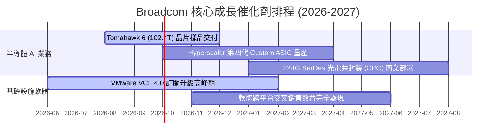

### 8.2 TAM (可定址市場總額) 擴展空間

```
╔══════════════════════════════════════════════════════════════════╗
║                Broadcom 核心產品 TAM 與滲透率分析                ║
╠══════════════════════════════════════════════════════════════════╣
║                                                                  ║
║  1. AI 客製化晶片 (ASIC) TAM (2028E): $75.0B                     ║
║     AVGO 當前滲透率: ~35%  █████████░░░░░░░░░░░  成長空間巨大   ║
║                                                                  ║
║  2. 資料中心網通晶片 TAM (2028E):     $30.0B                     ║
║     AVGO 當前滲透率: ~70%  ███████████████░░░░░  絕對壟斷地位   ║
║                                                                  ║
║  3. 私有雲基礎設施軟體 TAM (2028E):   $50.0B                     ║
║     AVGO 當前滲透率: ~25%  ██████░░░░░░░░░░░░░░  併購效益顯現   ║
║                                                                  ║
╚══════════════════════════════════════════════════════════════════╝
```

### 8.3 成長驅動力結構圖

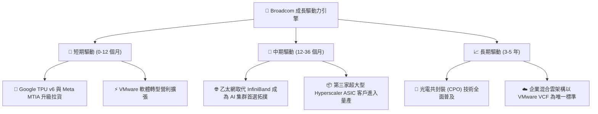

---

## 9. 風險矩陣

### 9.1 風險評分矩陣 (Risk Matrix)

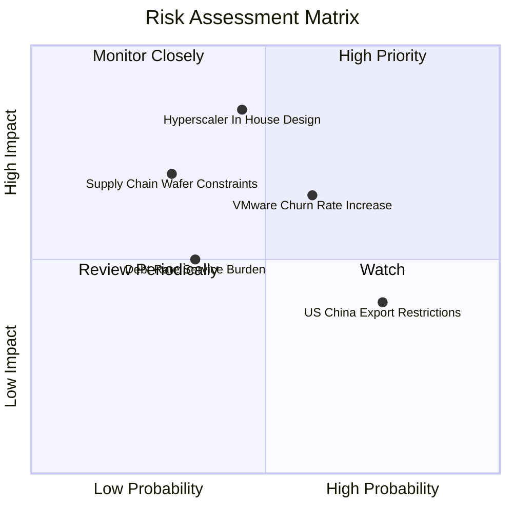

### 9.2 風險清單詳細分析與緩解措施

| # | 風險項目 | 發生機率 | 財務衝擊 | 風險評分 | 現實評估與公司緩解措施 |
|---|----------|----------|----------|----------|------------------------|
| 1 | 🔴 **Hyperscaler 自研去中介化** | 中 (45%) | 高 (-15% 營收) | 🔴 **7.2 / 10** | **關鍵風險**：若 Google 或 Meta 完全自主完成實體設計。*緩解*：AVGO 掌握頂級 224G SerDes 與 IP，自研成本過高且風險極大，短期難以被取代。 |
| 2 | 🟡 **VMware 客戶流失** | 中偏高 (60%)| 中 (-8% 營收) | 🟡 **6.0 / 10** | 強制轉為訂閱制導致中小型企業反彈。*緩解*：專注於全球前 10,000 大大型企業客戶，該類客戶轉換成本高昂。 |
| 3 | 🟡 **高負債利息壓力** | 低 (35%) | 中 (-5% FCF) | 🟡 **4.2 / 10** | 總債務 $64.91B。*緩解*：每年高達 $32.76B 的自由現金流可在 2-3 年內大幅降槓桿。 |
| 4 | 🟢 **中美半導體出口管制** | 高 (75%) | 低 (-3% 營收) | 🟢 **3.8 / 10** | 高階 AI 晶片出口受限。*緩解*：主要客戶均為美國 CSP 巨頭，中國市場營收佔比已逐年稀釋。 |

---

## 10. 投資建議

### 10.1 最終綜合評級雷達圖

```
╔══════════════════════════════════════════════════════════════╗
║              Broadcom (AVGO) 綜合投資評級雷達                ║
╠══════════════════════════════════════════════════════════════╣
║ 業務品質 (Business Quality):    9.5 ▓▓▓▓▓▓▓▓▓▓▓▓▓▓▓▓▓▓█░    ║
║ 護城河壁壘 (Moat Protection):   9.5 ▓▓▓▓▓▓▓▓▓▓▓▓▓▓▓▓▓▓█░    ║
║ 財務安全度 (Financial Safety):  7.8 ▓▓▓▓▓▓▓▓▓▓▓▓▓▓░░░░░░    ║
║ 成長動能 (Growth Momentum):    9.2 ▓▓▓▓▓▓▓▓▓▓▓▓▓▓▓▓▓▓█░    ║
║ 估值吸引力 (Valuation Value):   8.5 ▓▓▓▓▓▓▓▓▓▓▓▓▓▓▓▓░░░░    ║
╠══════════════════════════════════════════════════════════════╣
║ 綜合推薦評分:                  8.9 / 10  🟢 強力推薦配置    ║
╚══════════════════════════════════════════════════════════════╝
```

### 10.2 目標價與隱含報酬率總覽

| 情境 | 機率權重 | 目標價 | 隱含報酬率（基於 $381.92） | 加權期望目標價 |
|------|----------|--------|----------------------------|----------------|
| 🔴 **悲觀情境** | 20% | $310.00 | -18.83% | $62.00 |
| 🟡 **基準情境** | **60%** | **$525.44** | **+37.58%** | **$315.26** |
| 🟢 **樂觀情境** | 20% | $675.00 | +76.74% | $135.00 |
| **加權期望值**| **100%** | **$512.26** | **+34.13%** | **$512.26** |

### 10.3 買入時機與策略 Checklist

```
╔══════════════════════════════════════════════════════════════════╗
║                  ✅ 買入與加碼條件 Checklist                     ║
╠══════════════════════════════════════════════════════════════════╣
║                                                                  ║
║  立即建倉條件（現價 $381.92）：                                  ║
║  ✅ Forward P/E < 22x (目前 19.63x)                              ║
║  ✅ 最新單季 FCF 突破 $10.0B (Q2 2026 達 $10.26B)                ║
║  ✅ AI 半導體業務季度營收年增率 > 40%                            ║
║                                                                  ║
║  加碼買入觸發點 (DIP Buying):                                    ║
║  ☐ 股價隨大盤回檔至 200 日均線附近（約 $320 - $340 區間）        ║
║  ☐ 財報公布非基本面因素下跌（如單季毛利率微幅波動）              ║
║                                                                  ║
║  賣出 / 停損觸發條件：                                           ║
║  ☐ 停損價位跌破 $310.00（悲觀情境下下軌，跌幅超 18%）            ║
║  ☐ 主要客戶（Google/Meta）宣佈終止下世代 ASIC 合作合約           ║
╚══════════════════════════════════════════════════════════════════╝
```

### 10.4 投資人適配度分析

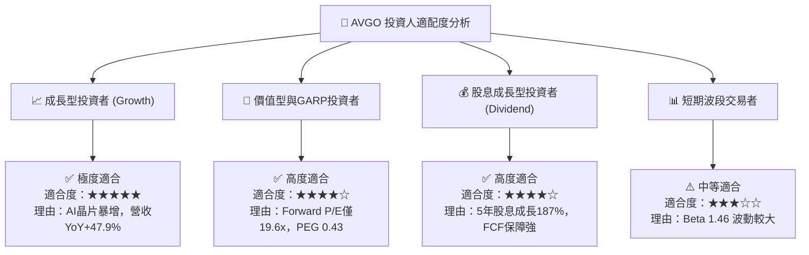

### 10.5 每季財報監控清單 (Quarterly Watch List)

後續追蹤 AVGO 財報時，應重點關注以下指標是否達到臨界值：

| 監控項目 | 理想目標值 | 警告訊號（減碼） | 重大利多（加碼） |
|----------|------------|------------------|------------------|
| **AI 晶片單季營收** | > $4.5B | < $3.5B (需求放緩) | > $5.5B (超預期爆發) |
| **VMware VCF 續約率** | > 85% | < 70% (客戶流失) | > 92% (轉型極度成功) |
| **Non-GAAP 毛利率** | ≥ 75.0% | < 72.0% (產品組合惡化)| ≥ 77.5% (定價權強勁) |
| **自由現金流 (FCF)** | 季度 ≥ $8.5B | 季度 < $6.5B | 季度 ≥ $11.0B |
| **淨債務 / EBITDA** | < 1.2x | > 2.2x (降槓桿停滯) | < 0.8x (債務風險解除) |

### 10.6 反面論證：什麼情況會證明論點錯誤 (What Would Change My Mind)

```
╔══════════════════════════════════════════════════════════════════╗
║              ⚠️ 論點失效條件（Disconfirming Evidence）           ║
╠══════════════════════════════════════════════════════════════════╣
║  本投資報告之「買入」建議在下列量化條件成立時失效，需立即降級：  ║
║                                                                  ║
║  ☐ 核心半導體營收成長率連續兩季降至 < 8% (顯示 AI 需求斷崖)      ║
║  ☐ Non-GAAP 營業利益率較當前峰值收縮 > 500 個基點 (5.0 pp)      ║
║  ☐ FCF 現金轉換率（FCF / Net Income）連續兩季跌破 85%            ║
║  ☐ 投入資本報酬率 (ROIC) 快速滑落至 11.2% (WACC) 以下，銷毀價值  ║
║  ☐ 超大型雲端巨頭（如 Google）明確宣佈轉向台積電自研設計，降階    ║
║     AVGO 為單純 IP 授權商而非完整 ASIC 晶片供應商                ║
╚══════════════════════════════════════════════════════════════════╝
```

---

> **免責聲明**：本報告由機構級研究分析模型生成，僅供專業投資參考，不構成任何買賣金融產品之要約或要約邀請。市場有風險，投資需謹慎。投資人在做出任何投資決策前，應自行評估風險並諮詢獨立財務顧問。