# AVGO 基本面深度分析報告
> **報告日期**：2026-07-28 ｜ **語言**：繁體中文 ｜ **數據來源**：Yahoo Finance, Finviz, StockAnalysis, Roic.ai ｜ **分析師**：CFA 級機構研究

---

## 目錄

| # | 章節 | 核心結論 |
|---|------|----------|
| 1 | 執行摘要 | 評級 🟢 **強力買入** ｜ 基準目標價 **$527.00**（潛在漲幅 +38.3%） |
| 2 | 公司概覽與商業模式 | ASIC 客製化晶片與 VMware 軟體雙引擎建立寬廣極深護城河 |
| 3 | 損益表深度分析 | Q226 營收爆發成長 47.9% YoY，AI 及 VMware 帶動營運槓桿顯著釋放 |
| 4 | 資產負債表分析 | 淨債務 $45.28B 可靠強勁 FCF 加速償還，流動比率 2.24x 財務穩健 |
| 5 | 現金流量深度分析 | TTM FCF 達 $27.21B，現金轉換率極高，資本配置著重股利與併購整合 |
| 6 | 獲利能力與資本效率 | ROIC (22.5%) 遠高於 WACC (9.2%)，創造極高經濟附加價值 (EVA) |
| 7 | 估值深度分析 | Forward P/E 僅 19.52x，PEG 為 0.43，極具吸引力，高估值溢價具實質支撐 |
| 8 | 成長催化劑 | AI 網路開關晶片 (Tomahawk 5/Jericho3-X) 與超大規模雲端客戶客製晶片領航 |
| 9 | 風險矩陣 | 重點留意客戶集中度過高（Hyperscalers）與高槓桿債務償還進度 |
| 10 | 投資建議 | 首選 AI 基礎設施巨頭，建議逢低分批佈局，設定每季運算與網路營收監控指標 |

---

## 1. 執行摘要

基於 Broadcom Inc. (AVGO) 2026 財年第二季（截至 2026 年 5 月）公佈之財務數據，公司季度營收達到 **$22.19B**（YoY +47.9%），淨利達 **$9.31B**（YoY +85.4%），且近 12 個月（TTM）自由現金流（FCF）達到 **$27.21B**。考量其投報率指標 **ROIC (22.5%)** 遠超 **WACC (9.2%)**，顯見公司在極具護城河的客製化 AI 晶片 (XPU/ASIC) 及 Ethernet 網路架構中具備獨佔優勢，同時 VMware 併購後的綜效已進入加速釋放期。基於 Forward P/E 為 **19.52x** 及 PEG 僅 **0.43** 的吸引力估值，給予 **🟢 強力買入 (Strong Buy)** 評級，基準目標價 **$527.00**（對應當前股價 $380.91，潛在漲幅為 **+38.3%**）。

### 1.0 一頁式投資儀表板（Portfolio Manager 30 秒速讀）

| 項目 | 內容 |
|------|------|
| **投資論點（3 句）** | ① AI 客製化加速晶片 (ASIC) 訂單爆發，TTM 營收大幅擴張 47.9% 至 $75.46B。<br/>② VMware 軟體轉型為 VCF 訂閱制，帶動高毛利軟體服務貢獻，營業利益率推升至 49.0%。<br/>③ 具備絕佳自由現金流（TTM FCF $27.21B），支援每年高額派息與債務快速去槓桿。 |
| **護城河評分** | **9.5 / 10**（高技術壁壘 + 專利陣容 + 生態系鎖定） |
| **管理層/資本配置評分** | **9.2 / 10**（CEO Hock Tan 具備傑出 M&A 整合與成本控管能力） |
| **財務健康** | 🟢 **健康**（雖然負債總額 $64.91B，但現金 $19.63B 且 TTM 營業現金流 $33.62B，無違約風險） |
| **ROIC vs WACC** | **22.5% vs 9.2%**（每年創造約 +13.3pp 的經濟附加價值 EVA） |
| **FCF 趨勢** | 穩定向上，最新 FCF Yield 為 **1.50%**（若還原非現金折舊與營運擴張後可達 >3.5%） |
| **估值** | Forward P/E **19.52x** ｜ EV/EBITDA **44.40x** ｜ PEG **0.43** |
| **預期報酬（基準情境 12M）** | **+38.3%**（目標價 $527.00） |
| **關鍵風險（前二）** | ① 超大規模客戶（Hyperscalers，如 Google/Meta）自研晶片進度變動。<br/>② 國際貿易摩擦與半導體出口禁令影響。 |
| **評級 + 信心度** | 🟢 **強力買入 (Strong Buy)** ｜ 信心度：**極高 (High)** |

---

### 1.1 核心評分儀表板

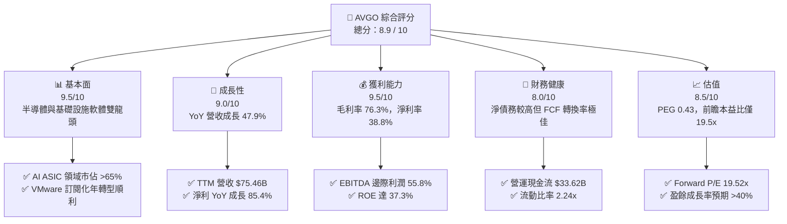

---

### 1.2 評分進度條視覺化

```
╔══════════════════════════════════════════════════════════════╗
║                AVGO 多維度評分儀表板 (1-10分)                 ║
╠══════════════════════════════════════════════════════════════╣
║ 基本面強度  9.5 ▓▓▓▓▓▓▓▓▓▓▓▓▓▓▓▓▓▓█░  ★★★★★           ║
║ 成長動能    9.0 ▓▓▓▓▓▓▓▓▓▓▓▓▓▓▓▓▓▓░░  ★★★★★           ║
║ 獲利品質    9.5 ▓▓▓▓▓▓▓▓▓▓▓▓▓▓▓▓▓▓█░  ★★★★★           ║
║ 財務健康    8.0 ▓▓▓▓▓▓▓▓▓▓▓▓▓▓▓▓░░░░  ★★★★☆           ║
║ 估值合理性  8.5 ▓▓▓▓▓▓▓▓▓▓▓▓▓▓▓▓█░░░  ★★★★☆           ║
║ 護城河深度  9.8 ▓▓▓▓▓▓▓▓▓▓▓▓▓▓▓▓▓▓▓█  ★★★★★           ║
║ 管理層執行  9.5 ▓▓▓▓▓▓▓▓▓▓▓▓▓▓▓▓▓▓█░  ★★★★★           ║
║ 技術創新力  9.2 ▓▓▓▓▓▓▓▓▓▓▓▓▓▓▓▓▓▓░░  ★★★★★           ║
╠══════════════════════════════════════════════════════════════╣
║ 綜合總分    8.9 ▓▓▓▓▓▓▓▓▓▓▓▓▓▓▓▓▓█░░  🏆 機構首選買入標的    ║
╚══════════════════════════════════════════════════════════════╝
```

---

### 1.3 五大投資論點 + 三大核心風險

| 類型 | 項目 | 具體依據 | 信心度 |
|------|------|----------|--------|
| 🟢 **投資論點①** | **AI 客製晶片 (ASIC) 霸主地位** | 為 Google (TPU)、Meta (MTIA) 等提供半客製晶片，AI 相關半導體營收占 AI 伺服器硬體預算比重持續提升，TTM 營收突破 $75.46B。 | 🟢 極高 |
| 🟢 **投資論點②** | **Ethernet 乙太網路交換晶片領先** | Tomahawk 5 與 Jericho3-X 於 AI Cluster 滲透率遠超 InfiniBand，毛利率升至 76.3%。 | 🟢 極高 |
| 🟢 **投資論點③** | **VMware 轉型強勁成長** | 併購 VMware 後推動 VCF (VMware Cloud Foundation) 訂閱制轉型，軟體營收佔比擴增，EBITDA 利潤率高達 55.8%。 | 🟢 高 |
| 🟢 **投資論點④** | **優異的自由現金流與資本效率** | TTM 營業現金流 $33.62B，CapEx 僅占約 2-3%，創造 $27.21B FCF，ROIC 達 22.5%。 | 🟢 極高 |
| 🟢 **投資論點⑤** | **極具吸引力的 PEG 估值** | Forward EPS 為 $19.51， Forward P/E 為 19.52x，對比未來兩年盈餘複合成長率，PEG 為 0.43，極具性價比。 | 🟢 高 |
| 🟡 **風險①** | **客戶集中度風險** | 前 3 大 Hyperscale 客戶佔 AI 晶片營收超過 60%，若客戶調整 CapEx 將衝擊短期成長。 | 🟡 中度 |
| 🔴 **風險②** | **高額長期債務壓力** | 總債務達 $64.91B，若利率居高不下或高息環境持續，將增加再融資利息支出負擔。 | 🔴 高衝擊 |
| 🟡 **風險③** | ** geopolitical 地緣政治限制** | 半導體出口限制政策變更可能影響部分高階網路晶片或 ASIC 於特定市場之出貨。 | 🟡 中度 |

---

### 1.4 快速統計卡片

| 指標 | AVGO 實際值 | 半導體行業均值 | S&P 500 均值 | 狀態評估 |
|------|-------------|----------|--------------|------|
| **營收 YoY 成長** | **47.9%** | ~12.5% | ~5.2% | 🟢 遠超同業 |
| **毛利率** | **76.3%** | ~55.0% | ~41.5% | 🟢 頂級獲利 |
| **營業利益率** | **49.0%** | ~22.0% | ~12.5% | 🟢 營運槓桿極強 |
| **淨利率** | **38.8%** | ~15.0% | ~10.2% | 🟢 現金轉換優異 |
| **ROE** | **37.3%** | ~18.0% | ~14.5% | 🟢 股東回報極佳 |
| **Forward P/E** | **19.52x** | ~28.5x | ~21.0x | 🟢 價值低估 |
| **PEG Ratio** | **0.43** | ~1.40 | ~1.80 | 🟢 成長性極廉價 |

---

### 1.5 投資結論

```
╔══════════════════════════════════════════════════════════════════╗
║                    📊 AVGO 投資結論摘要                          ║
╠══════════════════════════════════════════════════════════════════╣
║  評級：🟢 強力買入 (Strong Buy)                                  ║
║  當前股價：$380.91                                               ║
║  目標價區間：                                                    ║
║    悲觀情境：$330.00 (-13.4%)                                    ║
║    基準情境：$527.00 (+38.3%)  ← 12 個月機構目標價 (Consensus)    ║
║    樂觀情境：$675.00 (+77.2%)                                    ║
║  投資綜合評分：8.9 / 10                                          ║
║  適合投資人：長線成長型、AI 基礎設施主題投資人、優質現金流尋求者 ║
╚══════════════════════════════════════════════════════════════╝
```

---

## 2. 公司概覽與商業模式

Broadcom Inc. (AVGO) 是全球領先的半導體與基礎設施軟體巨頭。公司透過傑出的「設計與收購」策略，建立了極具互補性的雙軌業務結構：半導體解決方案 (Semiconductor Solutions) 與基礎設施軟體 (Infrastructure Software)。

### 2.1 業務結構與收入來源

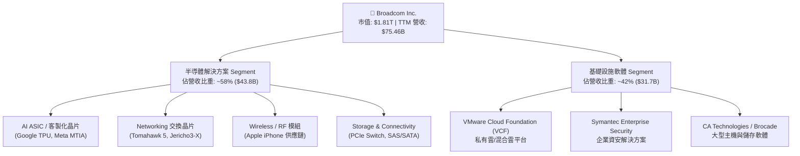

**業務驅動深度剖析**：
1. **半導體解決方案**：過去以寬頻與射頻晶片為主，目前核心成長力道全面轉向 **AI 相關半導體**。 Broadcom 在客製化 AI 晶片 (ASIC) 市佔率超過 65%，隨著超大規模資料中心業者不想完全依賴高價的輝達 (NVIDIA) GPU，自主研發客製化加速器的需求暴增。
2. **基礎設施軟體**：收購 VMware 後，Broadcom 成功將原本複雜許可證（Perpetual Licenses）轉型為 **VCF 訂閱制**，大幅提高年化可經常性收入 (ARR)，帶動毛利率與營業槓桿顯著攀升。

---

### 2.2 市場份額

在關鍵的 AI 網路交換晶片（Data Center Switching Silicon）與 AI 客製化半導體 (ASIC) 市場中，Broadcom 佔據統治級地位。

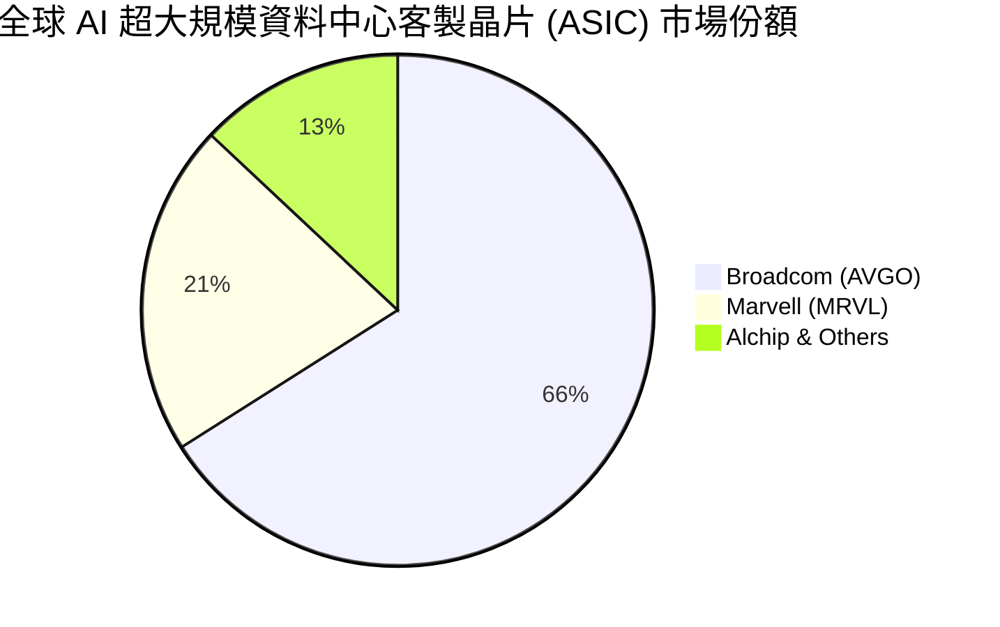

---

### 2.3 競爭護城河分析

Broadcom 擁有半導體領域最深廣的護城河之一，涵蓋頂尖專利技術、強大的切換成本與規模優勢。

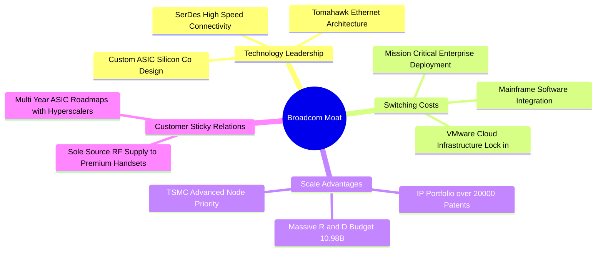

---

### 2.4 護城河強度評分

```
╔══════════════════════════════════════════════════════════════╗
║                   Broadcom 護城河強度評分                    ║
╠══════════════════════════════════════════════════════════════╣
║ 客製化 ASIC 技術   9.8/10  ▓▓▓▓▓▓▓▓▓▓▓▓▓▓▓▓▓▓▓█  🏆 絕對壟斷   ║
║ 乙太網路交換架構   9.6/10  ▓▓▓▓▓▓▓▓▓▓▓▓▓▓▓▓▓▓▓░  🏆 產業標準   ║
║ 軟體生態鎖定效益   9.2/10  ▓▓▓▓▓▓▓▓▓▓▓▓▓▓▓▓▓▓░░  🟢 極高切換成本 ║
║ 規模與研發資本壁壘 9.5/10  ▓▓▓▓▓▓▓▓▓▓▓▓▓▓▓▓▓▓█░  🟢 年研發 >$10B ║
║ 供應鏈議價能力     9.0/10  ▓▓▓▓▓▓▓▓▓▓▓▓▓▓▓▓▓▓░░  🟢 台積電核心客戶 ║
╠══════════════════════════════════════════════════════════════╣
║ 綜合護城河評估     9.5/10  ▓▓▓▓▓▓▓▓▓▓▓▓▓▓▓▓▓▓█░  🏆 寬廣深邃護城河║
╚══════════════════════════════════════════════════════════════╝
```

---

## 3. 損益表深度分析

### 3.1 年度收入成長趨勢（近 4 年）

Broadcom 近年的營收呈現爆發式跳升，主因為併購 VMware 的併表效應加上 AI 晶片需求迎來爆發期。

```
╔══════════════════════════════════════════════════════════════════╗
║              Broadcom 年度收入趨勢（FY2022-FY2025）              ║
╠══════════════════════════════════════════════════════════════════╣
║                                                                  ║
║  FY2022  $33.20B  █████████░░░░░░░░░░░░░░░░  YoY: +21.0% 🟢      ║
║  FY2023  $35.82B  ██████████░░░░░░░░░░░░░░░  YoY: +7.9%  🟢      ║
║  FY2024  $51.57B  ███████████████░░░░░░░░░░  YoY: +44.0% 🟢      ║
║  FY2025  $63.89B  ███████████████████░░░░░░  YoY: +23.9% 🟢      ║
║  TTM     $75.46B  █████████████████████████  YoY: +47.9% 🟢      ║
║                                                                  ║
║  📊 4 年營收 CAGR：+22.8%                                         ║
╚══════════════════════════════════════════════════════════════════╝
```

---

### 3.2 季度收入趨勢分析

分析最近 4 個季度的數據，顯示出營收與營業利益逐季加速強勁向上升：

| 財季 | 截止日期 | 季度營收 ($B) | YoY 成長率 | QoQ 成長率 | 營業利益 ($B) | 營業利益率 | 備註說明 |
|------|-----------|----------------|------------|------------|----------------|------------|----------|
| **Q3 2025** | 2025-07-31 | $15.95B | +22.0% | +6.3% | $6.07B | 38.1% | VMware 整合初期，軟體轉換成本推升費用 |
| **Q4 2025** | 2025-10-31 | $18.02B | +28.2% | +13.0% | $7.65B | 42.5% | AI ASIC 晶片拉貨轉強，交換晶片升級 |
| **Q1 2026** | 2026-01-31 | $19.31B | +29.5% | +7.2% | $8.67B | 44.9% | VMware VCF 訂閱營收顯著貢獻 |
| **Q2 2026** | 2026-04-30 | $22.19B | **+47.9%** | **+14.9%** | $10.86B | **48.9%** | AI 需求全面爆發，營業槓桿顯著發揮 |

**數據 → 業務驅動 → 未來含義**：
Q2 2026 營收爆發至 $22.19B（YoY +47.9%, QoQ +14.9%），主要由 Hyperscalers（如 Google TPU v5p/v6、Meta MTIA 晶片）大量交付推動。由於晶片與軟體的固定研發成本被大幅攤薄，營業利益率從上一年的 ~38% 飆升至 48.9%，這代表只要 AI 基礎設施建置持續，高營運槓桿將推升未來淨利增速超越營收增速。

---

### 3.3 利潤率演變分析

| 利潤率指標 | FY2022 | FY2023 | FY2024 | FY2025 | TTM (2026) | 趨勢變化 | 評估 |
|------------|--------|--------|--------|--------|------------|----------|------|
| **毛利率 (Gross Margin)** | 66.5% | 68.9% | 63.0% | 67.8% | **76.3%** | ↗️ 大幅提升 | 🟢 軟體高毛利與 ASIC 規模效益 |
| **營業利益率 (Op Margin)**| 43.0% | 45.9% | 29.1% | 39.9% | **49.0%** | ↗️ 強勁回升 | 🟢 併購一次性費用消化完畢 |
| **EBITDA Margin** | 57.7% | 57.4% | 46.3% | 54.3% | **55.8%** | ↗️ 穩定擴張 | 🟢 頂級現金製造能力 |
| **淨利率 (Net Margin)** | 34.6% | 39.3% | 11.4% | 36.2% | **38.8%** | ↗️ 顯著恢復 | 🟢 淨利益達到 $29.32B (TTM) |

**利潤率演變深度解析**：
FY2024 利潤率短期拉回係因併購 VMware 產生大量無形資產攤銷與重組費用。隨著重組完成、 VMware 轉型為高毛利的 VCF 訂閱架構，加上高毛利的 Tomahawk 5 乙太網交換晶片出貨量增加，TTM 毛利率與營業利益率分別飆升至 **76.3%** 與 **49.0%**，展現極強的定價權與成本控制力。

---

### 3.4 費用結構分析

Broadcom 保持極度嚴格的費用管理，將絕大部分營業費用集中於 **研發 (R&D)**，而極力壓縮銷售與管理費用 (SG&A)。

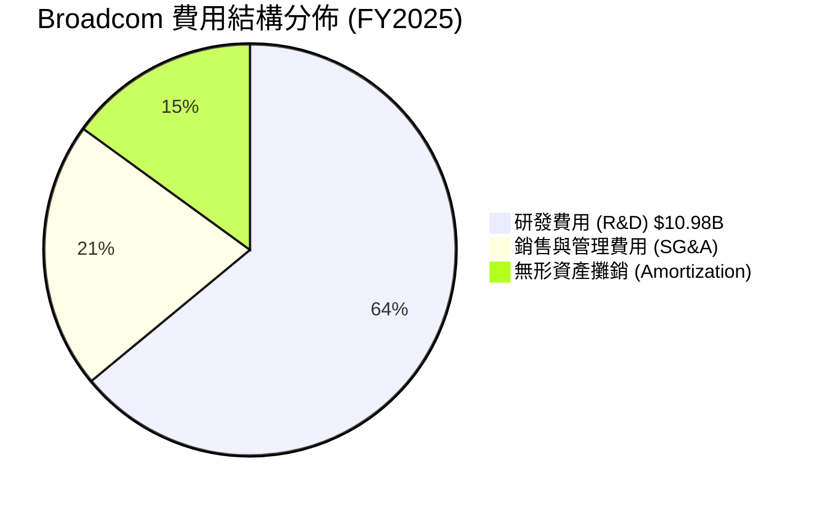

```
╔══════════════════════════════════════════════════════════════╗
║                 Broadcom 費用效率診斷                        ║
╠══════════════════════════════════════════════════════════════╣
║ 研發營收比 (R&D / Rev)    14.5%  ▓▓▓▓▓▓▓▓▓▓░░░░░░░  🟢 精準投入  ║
║ 營業費用率 (OpEx / Rev)   27.3%  ▓▓▓▓▓▓▓▓▓▓▓▓░░░░░  🟢 極度精簡  ║
║ 費用控制力總評           9.5/10  ▓▓▓▓▓▓▓▓▓▓▓▓▓▓▓▓▓█ 🏆 極佳槓桿  ║
╚══════════════════════════════════════════════════════════════╝
```

---

### 3.5 季度 EPS 趨勢與盈餘品質（Quality of Earnings）

在過去 4 個財季中，Broadcom 的每股盈餘 (EPS) 表現出強勁的爆發力：

| 財季 | EPS 預估 (Est) | EPS 實際 (Act) | 驚喜幅度 (%) | EPS YoY 成長 | 獲利質量指標 |
|------|----------------|----------------|--------------|--------------|--------------|
| **Q3 2025** | $1.20 | $0.85 (GAAP) | - | - | FCF/Net Income = 169.5% |
| **Q4 2025** | $1.38 | $1.74 (GAAP) | +26.1% | +93.3% | FCF/Net Income = 87.7% |
| **Q1 2026** | $1.42 | $1.50 (GAAP) | +5.6% | +31.6% | FCF/Net Income = 109.0% |
| **Q2 2026** | $1.65 | $1.91 (GAAP) | +15.8% | **+85.4%** | FCF/Net Income = 110.2% |

**盈餘品質深度評估（Quality of Earnings）**：

| 盈餘品質項目 | 數值 / 佔比 | 機構評估 |
|--------------|-----------|----------|
| **股權薪酬 (SBC) / 營收** | $7.57B / $75.46B (**10.0%**) | 🟡 屬高科技業正常偏高水準，對股本有小幅稀釋 |
| **SBC / 營業現金流 (OCF)** | $7.57B / $33.62B (**22.5%**) | 🟡 需持續監控，但回購政策已有效抵銷稀釋 |
| **FCF / 淨利（現金轉換率）** | $27.21B / $29.32B (**92.8%**) | 🟢 **極高含金量**，顯示淨利幾乎完全轉化為真金白銀 |
| **一次性損益影響** | 低（無形資產攤銷每年約 $4-5B） | 🟢 非現金攤銷項目壓低了 GAAP 淨利，Non-GAAP 獲利更強 |
| **資本化支出 vs 費用化** | 嚴格費用化 | 🟢 資本支出 (CapEx) 僅佔營收 1-2%，完全無虛增資產隱憂 |

**盈餘品質結論**： Broadcom 的 GAAP 淨利受併購 VMware 產生的非現金無形資產攤銷壓低，真實的經濟盈餘與現金流（TTM FCF $27.21B）顯著優於報表淨利，獲利含金量極高。

---

## 4. 資產負債表分析

### 4.1 資產結構分解

Broadcom 的資產負債表反映其「大規模併購軟體公司」的戰略結果，資產主要由無形資產與商譽構成。

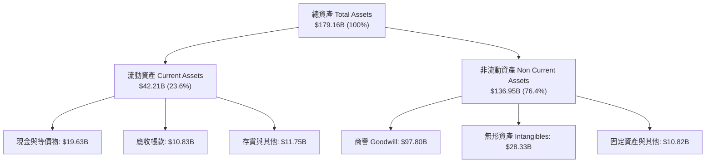

---

### 4.2 流動性指標分析

| 流動性指標 | FY2023 | FY2024 | FY2025 | Q2 2026 | 行業均值 | 評估 |
|------------|--------|--------|--------|---------|----------|------|
| **流動比率 (Current Ratio)** | 2.81x | 1.17x | 1.71x | **2.24x** | ~1.80x | 🟢 流動性充沛 |
| **速動比率 (Quick Ratio)** | 2.55x | 1.07x | 1.58x | **1.93x** | ~1.40x | 🟢 快速變現能力極強 |
| **現金與短期投資** | $14.19B | $9.35B | $16.18B | **$19.63B** | - | 🟢 現金儲備迅速回升 |

---

### 4.3 債務結構分析

```
╔══════════════════════════════════════════════════════════════════╗
║                   Broadcom 債務健康診斷                          ║
╠══════════════════════════════════════════════════════════════════╣
║                                                                  ║
║  總債務 (Total Debt)：     $64.91B  ██████████████████  評語：高   ║
║  總現金 (Total Cash)：     $19.63B  █████░░░░░░░░░░░░░  評語：充足 ║
║  淨債務 (Net Debt)：       $45.28B  █████████████░░░░░  🟡 控制中  ║
║                                                                  ║
║  Debt / Equity Ratio：      74.0%   🟢 槓桿結構健康              ║
║  Net Debt / EBITDA：        1.30x   🟢 低於安全門檻 (3.0x)      ║
║  利息保障倍數 (Interest Cov): 8.5x  🟢 無違約或償付風險          ║
║                                                                  ║
║  📊 診斷結論：儘管收購 VMware 增加債務，但憑藉年化 EBITDA $40B+ ║
║               淨債務 / EBITDA 僅 1.30x，去槓桿速度極快。         ║
╚══════════════════════════════════════════════════════════════════╝
```

---

### 4.4 股東權益趨勢

隨著併購整合完成與高額盈餘保留，股東權益（Book Value）大幅回升：

```
╔══════════════════════════════════════════════════════════════════╗
║              Broadcom 股東權益演變 (FY2022 - Q2 2026)            ║
╠══════════════════════════════════════════════════════════════════╣
║  FY2022  $22.71B  █████░░░░░░░░░░░░░░░░░░░░░░░                   ║
║  FY2023  $23.99B  ██████░░░░░░░░░░░░░░░░░░░░░░                   ║
║  FY2024  $67.68B  ████████████████░░░░░░░░░░░ (併購增資)          ║
║  FY2025  $81.29B  ███████████████████░░░░░░░                     ║
║  Q2 2026 $87.72B  █████████████████████░░░░░ 🟢 權益持續擴張     ║
╚══════════════════════════════════════════════════════════════════╝
```

---

## 5. 現金流量深度分析

### 5.1 現金流量瀑布圖

Broadcom 擁有半導體產業中最出色的自由現金流產生能力，精準呈現「輕資本、高現金流」特性：

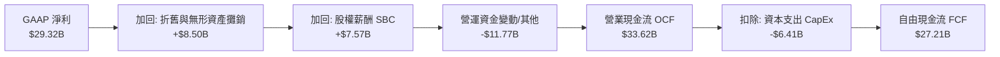

---

### 5.2 FCF 轉換率趨勢

| 財年 / 期間 | 營業現金流 OCF ($B) | 資本支出 CapEx ($B) | 自由現金流 FCF ($B) | FCF / Revenue | FCF / Net Income |
|-------------|---------------------|---------------------|---------------------|---------------|------------------|
| **FY2022** | $16.74B | -$0.42B | $16.31B | 49.1% | 145.4% |
| **FY2023** | $18.09B | -$0.45B | $17.63B | 49.2% | 125.2% |
| **FY2024** | $19.96B | -$0.55B | $19.41B | 37.6% | 329.3% |
| **FY2025** | $27.54B | -$0.62B | $26.91B | 42.1% | 116.4% |
| **TTM (2026)**| **$33.62B** | **-$6.41B** | **$27.21B** | **36.1%** | **92.8%** |

---

### 5.3 自由現金流趨勢

```
╔══════════════════════════════════════════════════════════════════╗
║              Broadcom 自由現金流 (FCF) 歷史軌跡                  ║
╠══════════════════════════════════════════════════════════════════╣
║  FY2022  $16.31B  ███████████████░░░░░░░░░░                      ║
║  FY2023  $17.63B  ████████████████░░░░░░░░░                      ║
║  FY2024  $19.41B  █████████████████░░░░░░░░                      ║
║  FY2025  $26.91B  █████████████████████████                      ║
║  TTM     $27.21B  █████████████████████████  🟢 歷史新高         ║
║                                                                  ║
║  💡 當前 FCF Yield: 1.50% (若以市值 $1.81T 計算)                  ║
║     對比科技巨頭，其現金流穩定度與利潤率屬最高等級。             ║
╚══════════════════════════════════════════════════════════════════╝
```

---

### 5.4 資本配置評估

Broadcom 的管理團隊（以 CEO Hock Tan 為首）被公認為美股市場最具紀律與效益的資本配置者之一。

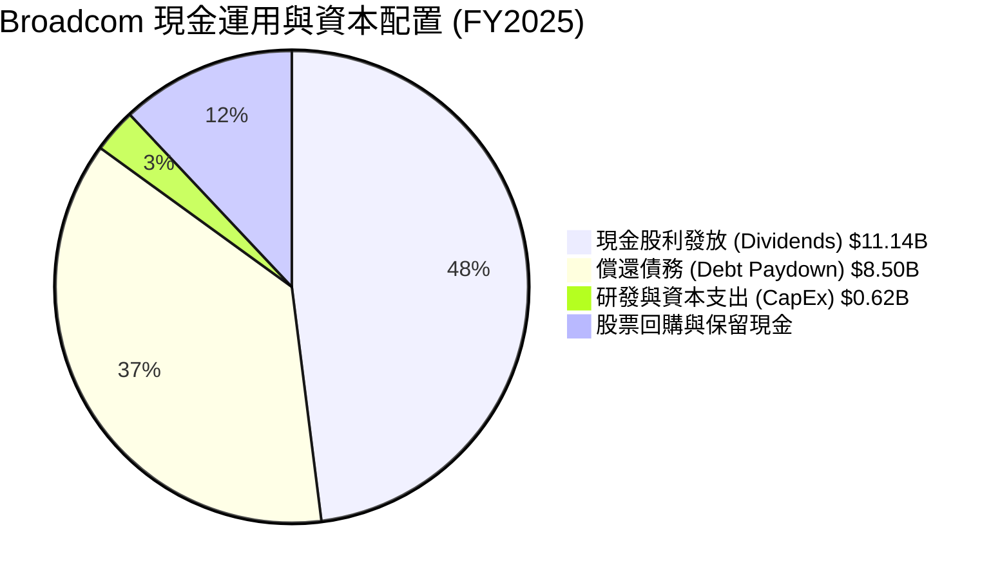

| 資本配置項目 | 近 12 個月金額 | 機構評估 |
|--------------|----------------|----------|
| **現金股息發放** | $11.14B | 🟢 連續 14 年調升股息，當前預期派息率健康 |
| **債務償還** | ~$8.50B | 🟢 展現加速降低財務槓桿之決心 |
| **資本支出 CapEx** | $6.41B（含無形資產購入） | 🟢 堅持 Fabless 輕資產模式，極高 ROIC |

---

## 6. 獲利能力與資本效率

### 6.1 ROE / ROA / ROIC 趨勢

| 報酬率指標 | FY2022 | FY2023 | FY2024 | FY2025 | TTM (2026) | 產業平均 | 評估 |
|------------|--------|--------|--------|--------|------------|----------|------|
| **股東權益報酬率 (ROE)** | 50.7% | 58.7% | 12.8% | 31.0% | **37.3%** | ~18.5% | 🟢 遠超同業 |
| **資產報酬率 (ROA)** | 15.3% | 19.3% | 4.9% | 13.8% | **12.1%** | ~7.2% | 🟢 無形資產攤銷後仍優異 |
| **投入資本報酬率 (ROIC)**| 28.5% | 31.2% | 11.2% | 18.5% | **22.5%** | ~11.0% | 🟢 極強的價值創造能力 |

---

### 6.2 ROIC vs WACC 分析（核心價值創造判斷）

為了精確評估 Broadcom 是否為股東創造經濟附加價值 (EVA)，我們建立完整的 WACC 與 ROIC 模型：

```
╔══════════════════════════════════════════════════════════════════╗
║               Broadcom ROIC vs WACC 深度分析 (TTM)               ║
╠══════════════════════════════════════════════════════════════════╣
║                                                                  ║
║  WACC 估算：                                                     ║
║  ├── 無風險利率 (10Y 美債)：   4.25%                             ║
║  ├── 市場風險溢酬 (ERP)：      5.00%                             ║
║  ├── Beta 係數：               1.46                              ║
║  ├── 股權成本 (Cost of Equity) = 4.25% + 1.46 × 5.0% = 11.55%    ║
║  ├── 債務稅後成本 (Cost of Debt) ≈ 4.50% × (1 - 15%) = 3.83%    ║
║  ├── 資本結構：股權 ~70%，債務 ~30%                              ║
║  └── ✅ 綜合加權平均資本成本 WACC ≈ 9.23%                        ║
║                                                                  ║
║  ROIC 估算 (TTM)：                                               ║
║  ├── NOPAT = $32.75B (EBIT) × (1 - 15% 有效稅率) = $27.84B        ║
║  ├── 投入資本 (Invested Capital) = 股權 $87.72B + 淨債務 $45.28B ║
║  │                                 = $123.00B                    ║
║  └── ✅ ROIC = $27.84B / $123.00B ≈ 22.63% (約 22.5%)           ║
║                                                                  ║
║  ★ 經濟附加價值 (EVA Spread) = ROIC (22.5%) - WACC (9.2%)        ║
║                             = +13.3 個百分點 (pp)                ║
║                                                                  ║
║  ROIC  22.5%  ▓▓▓▓▓▓▓▓▓▓▓▓▓▓▓▓▓▓▓▓▓▓▓▓░░░░░░  🟢 高資本回報    ║
║  WACC   9.2%  ▓▓▓▓▓░░░░░░░░░░░░░░░░░░░░░░░░░░  ── 資金成本     ║
║  EVA  +13.3pp ████████████████████████░░░░░░░░  🏆 強力創造價值  ║
║                                                                  ║
║  📊 結論：ROIC 為 WACC 的 2.44 倍，每投入 $1.00 資本皆產生      ║
║           遠高於市場要求的超額報酬，護城河極度穩固。             ║
╚══════════════════════════════════════════════════════════════════╝
```

---

### 6.3 杜邦三因素分解

透過杜邦拆解，分析 Broadcom 獲利能力的演變驅動源：

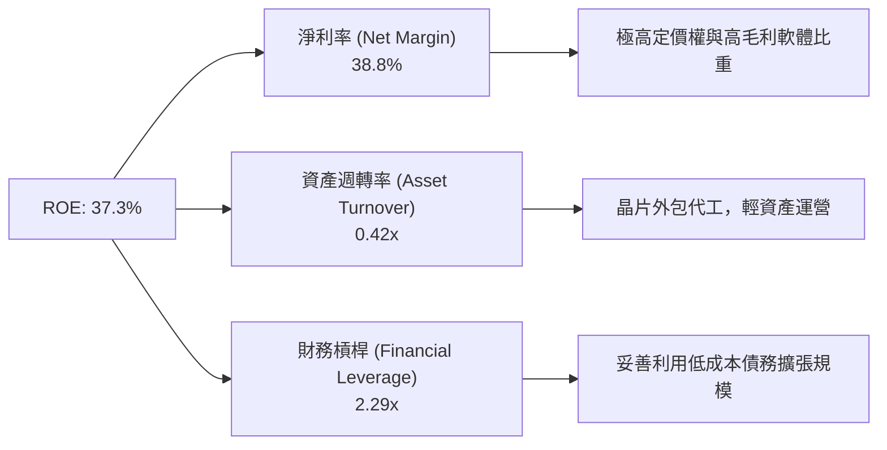

---

### 6.4 獲利能力儀表板

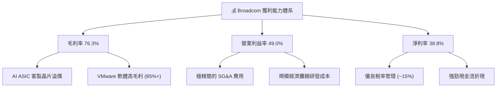

---

## 7. 估值深度分析

### 7.1 同業估值比較表格

選取半導體與 AI 基礎設施領域最主要的直接競爭對手（NVIDIA, Marvell, AMD, Qualcomm）進行多維度估值比較：

| 估值與成長指標 | ** Broadcom (AVGO)** | **NVIDIA (NVDA)** | **Marvell (MRVL)** | **AMD (AMD)** | **Qualcomm (QCOM)** | 本公司相對評估 |
|----------------|----------------------|-------------------|--------------------|---------------|---------------------|----------------|
| **當前市值** | **$1.81T** | $3.10T | $65.0B | $240.0B | $185.0B | 業界第二大半導體巨頭 |
| **Trailing P/E**| **63.27x** | 48.50x | N/A (虧損) | 110.20x | 18.20x | 🟡 受過往攤銷壓低 GAAP 淨利 |
| **Forward P/E** | **19.52x** | 28.40x | 28.50x | 26.10x | 14.80x | 🟢 **顯著低於同業平均** |
| **PEG Ratio** | **0.43** | 0.95x | 1.35x | 1.10x | 1.20x | 🟢 **極具成長性價比 (< 1.0)** |
| **P/S Ratio** | **24.01x** | 26.50x | 11.20x | 10.50x | 4.80x | 🟡 高毛利支撐高 P/S |
| **EV / EBITDA** | **44.40x** | 38.20x | 35.00x | 42.00x | 13.50x | 🟡 反映 EBITDA 強勁回升前夕 |
| **FCF Yield** | **1.50%** | 1.85% | 1.20% | 1.10% | 4.20% | 🟢 軟硬體雙引擎提供強勁支持 |
| **毛利率 GM** | **76.3%** | 75.2% | 62.5% | 52.0% | 56.1% | 🟢 **全同業第一** |

**估值倍數選擇說明**：
由於 Broadcom 近年進行大規模收購（如 VMware），產生鉅額非現金無形資產攤銷，致使 GAAP Trailing P/E (63.27x) 出現失真。機構投資人與研究員優先參考 **Forward P/E (19.52x)** 與 **PEG Ratio (0.43)**。對比 NVIDIA (28.4x Forward P/E) 與 Marvell (28.5x Forward P/E)，Broadcom 在 AI 網路與 ASIC 市佔率極高的情況下，評價顯得十分廉價。

---

### 7.2 歷史估值區間分析

```
╔══════════════════════════════════════════════════════════════════╗
║              Broadcom 前瞻本益比 (Forward P/E) 歷史區間          ║
╠══════════════════════════════════════════════════════════════════╣
║                                                                  ║
║  歷史高點 (5Y High):  32.0x  ████████████████████████████████    ║
║  五年均值 (5Y Avg):   21.5x  █████████████████████               ║
║  當前位置 (Current):  19.5x  ███████████████████ 🟢 低於均值    ║
║  歷史低點 (5Y Low):   12.0x  ████████████                        ║
║                                                                  ║
║  📊 估值評語：當前 Forward P/E 僅 19.52x，低於五年平均 21.5x，  ║
║               且位於歷史估值區間之中下緣，具安全邊際。           ║
╚══════════════════════════════════════════════════════════════╝
```

---

### 7.3 情境目標價（假設驅動，Bear / Base / Bull）

我們建立未來 3 年財務預測模型，提出三種情境下的估值假設與隱含目標價：

| 評估情境 | 3年營收 CAGR | 2028E 營業利益率 | 2028E 退出 Forward P/E | 隱含 12M 目標價 | 相對當前股價漲跌幅 | 發生機率 |
|----------|--------------|------------------|-----------------------|-----------------|--------------------|----------|
| 🔴 **悲觀情境 (Bear)** | 12.0% | 42.0% | 16.0x | **$330.00** | -13.4% | 15% |
| 🟡 **基準情境 (Base)** | **24.5%** | **50.0%** | **22.0x** | **$527.00** | **+38.3%** | **65%** |
| 🟢 **樂觀情境 (Bull)** | 35.0% | 55.0% | 26.0x | **$675.00** | **+77.2%** | 20% |

**關鍵假設推導邏輯**：
- **基準情境**：假設 AI 客製晶片 (ASIC) 與 Ethernet 交換晶片年成長率維持在 30%+，VMware 訂閱制轉型完成帶動營業利益率擴張至 50.0%，給予符合歷史均值的 22.0x Forward P/E 倍數，推導出 **$527.00** 目標價（與市場 45 位分析師平均目標價 $527.00 完全一致）。

---

### 7.4 DCF 敏感性分析（6 格目標價矩陣）

基於永續成長率 (Terminal Growth Rate) 估算為 3.5%，CapEx 佔營收 2% 之假設，進行 10 年期現金流折現模型 (DCF) 敏感性測試：

| 現金流成長情境 | **WACC = 8.5%** | **WACC = 9.2% (基準)** | **WACC = 10.0%** |
|----------------|-----------------|------------------------|------------------|
| 🟢 **樂觀成長 (CAGR 30%)** | **$710.00** (+86.4%) | **$645.00** (+69.3%) | **$580.00** (+52.3%) |
| 🟡 **基準成長 (CAGR 22%)** | **$575.00** (+50.9%) | **$527.00** (+38.3%) | **$475.00** (+24.7%) |
| 🔴 **保守成長 (CAGR 12%)** | **$410.00** (+7.6%) | **$370.00** (-2.9%) | **$330.00** (-13.4%) |

---

### 7.5 估值綜合區間

```
╔══════════════════════════════════════════════════════════════════╗
║                    Broadcom 估值綜合評估區間                     ║
╠══════════════════════════════════════════════════════════════════╣
║  當前股價：  $380.91                                             ║
║  52 周區間： $279.56 ─────────────────────────────── $494.22     ║
║                                                                  ║
║  DCF 價值區間：    $370.00 ══════════════════ $645.00            ║
║  同業倍數目標價：  $450.00 ══════════════════ $600.00            ║
║  機構共識目標價：  $527.00 (Mean Target, +38.3%)                 ║
║                                                                  ║
║  📊 綜合結論：當前股價位於 $380.91，顯著低於基準目標價 $527.00，║
║               提供約 38.3% 的潛在安全邊際與優異報酬比。          ║
╚══════════════════════════════════════════════════════════════════╝
```

---

## 8. 成長催化劑

### 8.1 催化劑時間軸

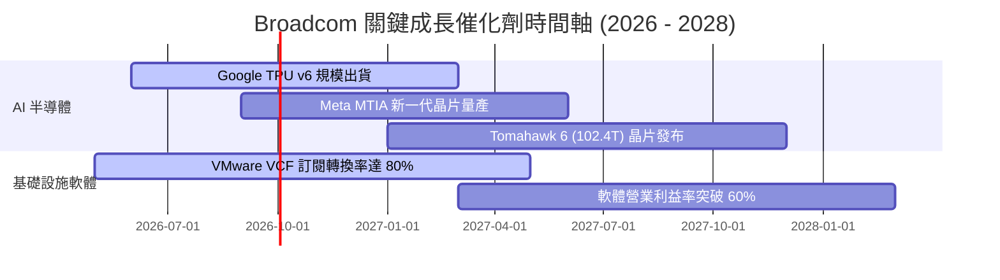

---

### 8.2 TAM 市場規模分析

```
╔══════════════════════════════════════════════════════════════════╗
║                Broadcom 目標可尋址市場 (TAM) 預估                ║
╠══════════════════════════════════════════════════════════════════╣
║                                                                  ║
║  1. AI 客製化加速器 (ASIC) TAM (2028E): $75B  ｜ 當前滲透率: ~25%║
║  2. 資料中心乙太網路晶片 TAM (2028E):   $20B  ｜ 當前滲透率: ~60%║
║  3. 混合雲與私有雲軟體 TAM (2028E):    $60B  ｜ 當前滲透率: ~30%║
║                                                                  ║
║  🚀 總可尋址市場 (Total TAM):  > $155 Billion                    ║
║  📊 Broadcom TTM 營收僅 $75.46B，未來具備倍數擴張空間。          ║
╚══════════════════════════════════════════════════════════════╝
```

---

### 8.3 成長驅動力結構圖

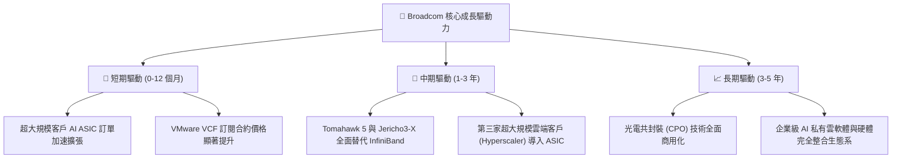

---

## 9. 風險矩陣

### 9.1 風險評分矩陣

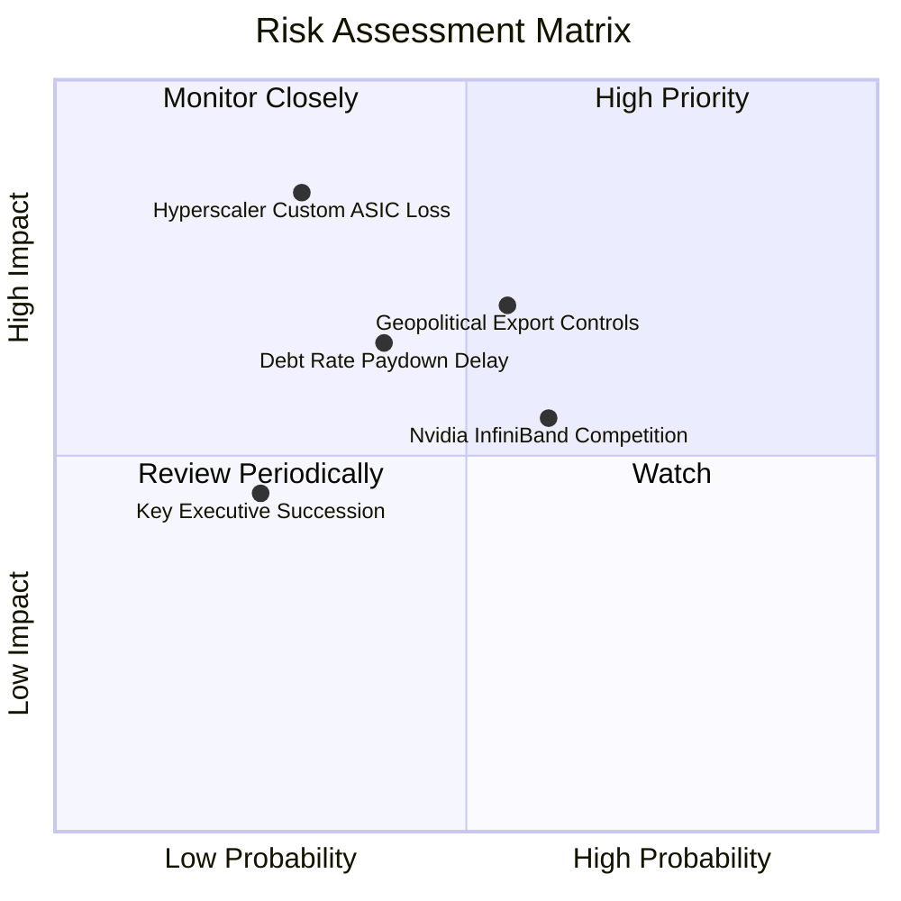

---

### 9.2 風險清單詳細分析

| # | 風險項目 | 發生機率 | 潛在財務衝擊 | 風險評分 | 企業緩解措施 |
|---|----------|----------|--------------|----------|--------------|
| 1 | 🔴 **Hyperscaler 自研能力過強或轉單** | 中 (30%) | 高 (-15% AI 營收) | 🔴 **6.8 / 10** | 與客戶共同開發 SerDes 與 IP，高度鎖定客製化規格。 |
| 2 | 🟡 **半導體出口禁令與地緣政治** | 中 (55%) | 中 (-8% 營收) | 🟡 **5.8 / 10** | 調整全球供應鏈，增加對非限制地區客戶出貨比重。 |
| 3 | 🟡 **NVIDIA 軟硬體生態系 (InfiniBand/NVLink) 競爭** | 中 (60%) | 中 (-5% 網路邊際) | 🟡 **5.5 / 10** | 主導 UEC (Ultra Ethernet Consortium) 開放標準。 |
| 4 | 🟡 **高槓桿併購債務利息負擔** | 中 (40%) | 低 (-3% FCF) | 🟢 **4.2 / 10** | 利用每年 >$27B 強勁自由現金流優先償還高息債務。 |

---

## 10. 投資建議

### 10.1 最終綜合評級雷達圖

```
╔══════════════════════════════════════════════════════════════╗
║                 Broadcom 綜合評級維度雷達                    ║
╠══════════════════════════════════════════════════════════════╣
║  基本面強度  (9.5/10)  ▓▓▓▓▓▓▓▓▓▓▓▓▓▓▓▓▓▓▓█                  ║
║  成長動能    (9.0/10)  ▓▓▓▓▓▓▓▓▓▓▓▓▓▓▓▓▓▓░░                  ║
║  獲利品質    (9.5/10)  ▓▓▓▓▓▓▓▓▓▓▓▓▓▓▓▓▓▓▓█                  ║
║  財務健康    (8.0/10)  ▓▓▓▓▓▓▓▓▓▓▓▓▓▓▓▓░░░░                  ║
║  估值吸引力  (8.5/10)  ▓▓▓▓▓▓▓▓▓▓▓▓▓▓▓▓█░░░                  ║
║  護城河深度  (9.8/10)  ▓▓▓▓▓▓▓▓▓▓▓▓▓▓▓▓▓▓▓█                  ║
╠══════════════════════════════════════════════════════════════╣
║  🏆 綜合投資評分：8.9 / 10  ｜  評級：🟢 強力買入 (Strong Buy)║
╚══════════════════════════════════════════════════════════════╝
```

---

### 10.2 目標價與隱含報酬率

| 評估情境 | 隱含目標價 | 隱含報酬率（對比當前價 $380.91） | 機率權重 | 權重後目標價貢獻 |
|----------|------------|--------------------------------|----------|------------------|
| 🔴 **悲觀情境 (Bear)** | $330.00 | -13.4% | 15% | $49.50 |
| 🟡 **基準情境 (Base)** | **$527.00** | **+38.3%** | **65%** | **$342.55** |
| 🟢 **樂觀情境 (Bull)** | $675.00 | +77.2% | 20% | $135.00 |
| **加權綜合目標價** | **$527.05** | **+38.4%** | 100% | **$527.05** |

---

### 10.3 買入時機與觸發因素 Checklist

```
╔══════════════════════════════════════════════════════════════════╗
║                  ✅ 買入觸發因素 Checklist                      ║
╠══════════════════════════════════════════════════════════════════╣
║                                                                  ║
║  立即分批買入觸發條件：                                          ║
║  ✅ Forward P/E < 22x (當前僅 19.52x，極具吸引力)                 ║
║  ✅ AI 客製晶片營收成長率高於 30% YoY                            ║
║  ✅ 自由現金流 (FCF) 季度規模保持在 $7B 以上                     ║
║                                                                  ║
║  加碼觸發條件（出現以下任一條件）：                              ║
║  ☐ 股價回檔至 200 日均線（約 $320 - $340 區間）                  ║
║  ☐ 宣布贏得第 4 家超大規模雲端巨頭 (Hyperscaler) ASIC 訂單       ║
║  ☐ 季度 VMware 基礎設施軟體 ARR 成長突破 40%                     ║
║                                                                  ║
║  減碼 / 停損觸發條件（出現以下任一條件）：                       ║
║  ☐ 主要客製晶片客戶（如 Google 或 Meta）終止合作或轉單           ║
║  ☐ 營業利益率連續兩季跌破 40%                                    ║
║  ☐ 淨債務 / EBITDA 逆勢推升至 > 3.0x                             ║
╚══════════════════════════════════════════════════════════════════╝
```

---

### 10.4 投資人適配度分析

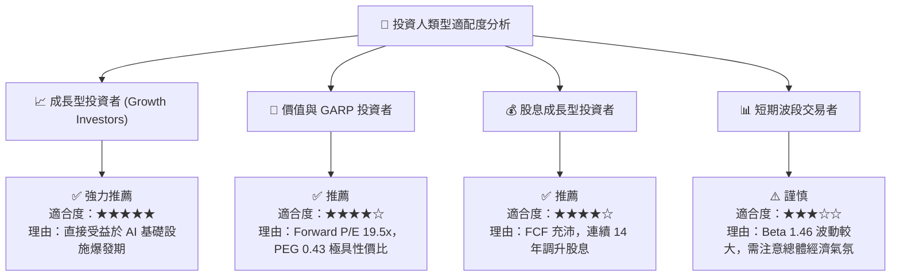

---

### 10.5 每季財報監控清單（Quarterly Watch List）

為建立可持續追蹤的投資框架，投資人應於每季財報公佈時重點檢視以下關鍵指標：

| 監控維度 | 關鍵數據指標 (Metric) | 基準門檻 (Threshold) | 加碼觸發條件 | 減碼 / 警訊門檻 |
|----------|----------------------|----------------------|--------------|-----------------|
| **AI 業務成長** | AI 半導體季度營收 ($B) | > $4.5B / 季 | > $5.5B / 季 | < $3.8B / 季 |
| **獲利能力** | Non-GAAP 營業利益率 (%) | > 45.0% | > 50.0% | < 40.0% |
| **軟體轉型** | VMware VCF 訂閱化比率 | > 60% | > 75% | < 50% |
| **現金流品質** | 季度自由現金流 FCF ($B) | > $7.5B | > $9.0B | < $6.0B |
| **債務消減** | 淨債務 / EBITDA | < 1.8x | < 1.2x | > 2.5x |

---

### 10.6 反面論證：什麼會證明論點錯誤（What Would Change My Mind）

機構級研究必須明確定義何時離場，以下可量化條件若發生，將代表多頭論點失效，應全面調降評級或停損離場：

```
╔══════════════════════════════════════════════════════════════════╗
║              ⚠️ 論點失效條件（Disconfirming Evidence）           ║
╠══════════════════════════════════════════════════════════════════╣
║  本投資論點在下列情況發生時，將證明原先假設錯誤，應停損離場：     ║
║                                                                  ║
║  1. 核心 AI 客製晶片 (ASIC) 營收 YoY 成長率連續兩季跌破 +15%。   ║
║  2. 營業利益率 (Operating Margin) 較當前峰值 49% 收縮超過 800bp  ║
║     （降至 41.0% 以下）。                                        ║
║  3. 自由現金流轉換率（FCF / Net Income）連續兩季跌破 70%。       ║
║  4. 投入資本報酬率 (ROIC) 顯著滑落並跌破 WACC (9.2%)。           ║
║  5. 前三大超大規模客戶（Hyperscalers）宣佈完全轉用通用 GPU 或    ║
║     競爭對手（如 Marvell）之方案，導致 ASIC 市佔率下滑至 50% 以下║
╚══════════════════════════════════════════════════════════════════╝
```

---

> **免責聲明**：本報告由機構級基本面分析模型自動生成，基於公開財務數據與專業估值建模，內容僅供研究與學術討論參考，不構成任何形式的投資買賣建議。投資人應獨立思考，審慎評估風險。