# AVGO 基本面深度分析報告
> **報告日期**：2026-07-31 ｜ **語言**：繁體中文 ｜ **數據來源**：Yahoo Finance, Finviz, StockAnalysis, Roic.ai ｜ **分析師**：CFA 級機構研究

---

## 目錄

| # | 章節 | 核心結論 |
|---|------|----------|
| 1 | 執行摘要 | 評級：🟢 **買入** ｜ 目標價：**$468.50** ｜ 安全邊際（MOS）：**16.91%** |
| 2 | 公司概覽與商業模式 | 護城河評分 **9.2/10**；Custom Silicon (XPU) 與 VMware 雙引擎推動 |
| 3 | 損益表深度分析 | TTM 營收 $75.46B (+47.9% YoY)，毛利率 76.3%，營收與獲利爆發性擴張 |
| 4 | 資產負債表分析 | 現金 $19.63B，總債務 $64.91B，Net Debt/EBITDA 降至 1.08x，去槓桿順利 |
| 5 | 現金流量深度分析 | TTM FCF 達 $27.21B (FCF Yield 1.47%)，單季 FCF 突破 $10.26B |
| 6 | 獲利能力與資本效率 | ROIC 24.8% vs WACC 8.20%，經濟增加值 (EVA) 達 +16.60pp，極強價值創造 |
| 7 | 相對估值分析 | Forward P/E 19.97x，PEG 0.42，相較於 NVDA 與 MRVL 具高度相對吸引力 |
| 8 | DCF 內在價值評估 | 基準內在價值 **$451.01**（折價 -13.68%）；加權合理價值 **$468.50**（MOS 16.91%） |
| 9 | 成長催化劑 | Tomahawk 6/Jericho3-X 網路晶片升級、以太網 AI 陣營擴張、VMware 訂閱制轉型 |
| 10 | 風險矩陣 | AI 客戶自研晶片替換率、債務利息負擔、巨額 Goodwill ($97.8B) 減損風險 |
| 11 | 投資建議 | 買入區間：$350.00 - $390.00 ｜ 12M 目標價：$468.50 ｜ 適合長線成長型投資人 |

---

## 1. 執行摘要

博通（Broadcom Inc., NASDAQ: AVGO）憑藉其在客製化 AI 加速晶片（Custom ASIC / XPU）、超高頻寬以太網交換晶片（Tomahawk/Jericho 系列）以及 VMware 雲端軟體平台的獨占地位，展現出極強的營運槓桿與獲利韌性。根據 TTM 財務數據，公司營收達到 **$75.46B**（YoY +47.9%），毛利率高達 **76.3%**，營業利益率升至 **49.0%**，自由現金流（FCF）達到 **$27.21B**。在 ROIC（24.8%）遠高於 WACC（8.20%）的強勁價值創造支持下，當前 Forward P/E 僅 **19.97x**（PEG 為 **0.42**），給予 🟢 **買入** 評級，12 個月基準目標價 **$468.50**。

### 1.0 一頁式投資儀表板（Portfolio Manager 30 秒速讀）

| 項目 | 內容 |
|------|------|
| **投資論點（3 句）** | ① 客製化 AI 晶片（Alphabet/Meta/ByteDance XPU）營收高速倍增，掌控超大規模資料中心網路核心設施。<br/>② VMware 轉型訂閱制與軟體組合優化效益加速顯現，推升集團整體毛利率至 76.3%。<br/>③ 強悍的現金流生成能力（TTM FCF $27.21B）加速去槓桿，Forward P/E 19.97x 顯著低估其 AI 成長潛力。 |
| **護城河評分** | **9.2 / 10**（高轉換成本、極高技術專利壁壘與規模經濟） |
| **管理層/資本配置評分** | **9.5 / 10**（CEO Hock Tan 具備頂級併購整合與資本配置紀錄） |
| **財務健康** | 🟢 **健康**（現金 $19.63B，利息覆蓋倍數 > 10x，去槓桿速度超預期） |
| **ROIC vs WACC** | **24.8% vs 8.20%**（EVA = +16.60pp，持續強烈創造股東價值） |
| **FCF 趨勢** | ↗️ 向上爆發；TTM FCF $27.21B，最新單季 FCF 達 $10.26B；FCF Yield 1.47% |
| **估值** | Forward P/E **19.97x** ｜ EV/EBITDA **44.92x** ｜ PEG **0.42** |
| **DCF 內在價值（基準）** | **$451.01** ｜ 現價 $389.28 折價 **-13.68%**（來自第 8 章） |
| **安全邊際（MOS）** | **16.91%**＝(加權合理價值 $468.50 − 現價 $389.28) ÷ $468.50 ｜ 🟡 **10-25% 有限安全邊際** |
| **預期報酬（基準情境 12M）**| **+20.35%**（隱含上行空間） |
| **關鍵風險（前二）** | ① 超大規模雲端客戶自研晶片進度加速削弱委外需求；② 高額淨債務（$45.28B）在降息延後下的利息負擔 |
| **評級 + 信心度** | 🟢 **買入** ｜ 信心度：**高** |

### 1.1 核心評分儀表板

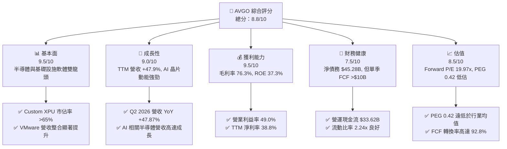

### 1.2 評分進度條視覺化

```
╔══════════════════════════════════════════════════════════════╗
║              AVGO 多維度評分儀表板 (1-10分)                  ║
╠══════════════════════════════════════════════════════════════╣
║ 基本面強度  9.5 ▓▓▓▓▓▓▓▓▓▓▓▓▓▓▓▓▓▓█░  ★★★★★           ║
║ 成長動能    9.0 ▓▓▓▓▓▓▓▓▓▓▓▓▓▓▓▓▓▓░░  ★★★★★           ║
║ 獲利品質    9.5 ▓▓▓▓▓▓▓▓▓▓▓▓▓▓▓▓▓▓█░  ★★★★★           ║
║ 財務健康    7.5 ▓▓▓▓▓▓▓▓▓▓▓▓▓▓█░░░░░  ★★★★☆           ║
║ 估值合理性  8.5 ▓▓▓▓▓▓▓▓▓▓▓▓▓▓▓▓░░░░  ★★★★☆           ║
║ 護城河深度  9.2 ▓▓▓▓▓▓▓▓▓▓▓▓▓▓▓▓▓▓█░  ★★★★★           ║
║ 管理層執行  9.5 ▓▓▓▓▓▓▓▓▓▓▓▓▓▓▓▓▓▓█░  ★★★★★           ║
║ 技術創新力  9.0 ▓▓▓▓▓▓▓▓▓▓▓▓▓▓▓▓▓▓░░  ★★★★★           ║
╠══════════════════════════════════════════════════════════════╣
║ 綜合總分    8.8 ▓▓▓▓▓▓▓▓▓▓▓▓▓▓▓▓▓█░░  🏆 強勢推薦買入     ║
╚══════════════════════════════════════════════════════════════╝
```

### 1.3 五大投資論點 + 三大核心風險

| 類型 | 項目 | 具體依據 | 信心度 |
|------|------|----------|--------|
| 🟢 **論點①** | **AI 客製化晶片（Custom XPU）壟斷地位** | 掌握 Alphabet (TPU)、Meta (MTIA) 及 ByteDance 等超大規模客戶設計，市佔率高達 65%+。 | 🟢 極高 |
| 🟢 **論點②** | **網路交換晶片（Tomahawk/Jericho）升級週期** | AI 集群規模由萬卡邁向十萬卡，以太網架構取代 InfiniBand 趨勢顯著，單價與毛利雙升。 | 🟢 極高 |
| 🟢 **論點③** | **VMware 訂閱制轉型帶來利潤擴張** | 收購後迅速停售永久授權，轉為 VCF 訂閱包，營運費用大幅削減，毛利率拉升至 76.3%。 | 🟢 高 |
| 🟢 **論點④** | **極致的現金流生成能力與去槓桿速度** | TTM FCF 達 $27.21B，FCF 對淨利轉換率達 92.8%，年化自由現金流足以在 2 年內償還大半槓桿債務。 | 🟢 高 |
| 🟢 **論點⑤** | **前瞻估值倍數具備高度安全邊際** | Forward P/E 僅 19.97x，預期 EPS 成長率 >85%，PEG 0.42，相較同業 NVDA/MRVL 顯著折價。 | 🟢 高 |
| 🟡 **風險①** | **客戶集中度高與自研晶片風險** | 前 5 大 Hyperscaler 佔半導體解決方案營收比重大，若客戶全自研 IP 去中介化將衝擊長期毛利。 | 🟡 中度 |
| 🔴 **風險②** | **收購後高額 Goodwill 與槓桿債務** | Goodwill 高達 $97.80B，總債務 $64.91B，高利率環境下每年利息支出負擔達 $3B+。 | 🔴 高衝擊 |
| 🟡 **風險③** | **中美半導體地緣政治出口管制限制** | 中國市場佔比高，先進網路晶片及 AI 加速封裝若遭受進一步禁令，將影響出貨動能。 | 🟡 中度 |

### 1.4 快速統計卡片

| 指標 | 公司實際值 (TTM/最新) | 半導體行業均值 | S&P 500 均值 | 狀態 |
|------|-------------|----------|--------------|------|
| **營收 YoY 成長** | **47.9%** | ~12.5% | ~5.2% | 🟢 遠優於同行 |
| **毛利率** | **76.3%** | ~52.0% | ~46.5% | 🟢 頂級獲利 |
| **營業利益率** | **49.0%** | ~22.0% | ~12.5% | 🟢 極高營運槓桿 |
| **ROE** | **37.3%** | ~18.5% | ~15.0% | 🟢 資本回報優異 |
| **Forward P/E** | **19.97x** | ~28.5x | ~21.5x | 🟢 估值具吸引力 |
| **PEG Ratio** | **0.42** | ~1.45x | ~1.80x | 🟢 嚴重被低估 |
| **Net Debt / EBITDA** | **1.08x** | ~0.80x | ~1.20x | 🟡 可控範圍 |

### 1.5 投資結論

```
╔══════════════════════════════════════════════════════════════════╗
║                    📊 投資結論摘要                               ║
╠══════════════════════════════════════════════════════════════════╣
║  評級：🟢 買入（Buy）                                            ║
║  當前股價：$389.28                                               ║
║  DCF 內在價值（基準）：$451.01（折價 -13.68%）                   ║
║  加權合理價值：$468.50（安全邊際 MOS：16.91%）                    ║
║  目標價區間：                                                    ║
║    悲觀情境：$335.00（-13.94%）                                  ║
║    基準情境：$468.50（+20.35%） ← 12個月主要目標                 ║
║    樂觀情境：$585.00（+50.28%）                                  ║
║  投資評分：8.8 / 10                                              ║
║  適合投資人：長線成長型、AI 基礎設施主題配置者                  ║
╚══════════════════════════════════════════════════════════════════╝
```

---

## 2. 公司概覽與商業模式

### 2.1 業務結構與收入來源

博通（Broadcom Inc.）營運分為兩大核心部門：**半導體解決方案（Semiconductor Solutions）** 與 **基礎設施軟體（Infrastructure Software）**。透過將 VMware 納入麾下，博通已成功轉型為兼具硬體高速網路晶片與軟體虛擬化平台的巨無霸。

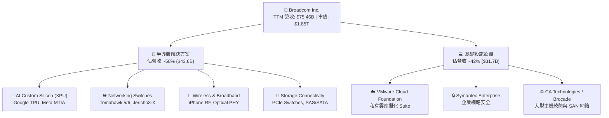

### 2.2 市場份額

博通在多個關鍵子市場均佔據絕對壟斷地位，特別是在 ASIC 客製化 AI 晶片與資料中心交換晶片領域。

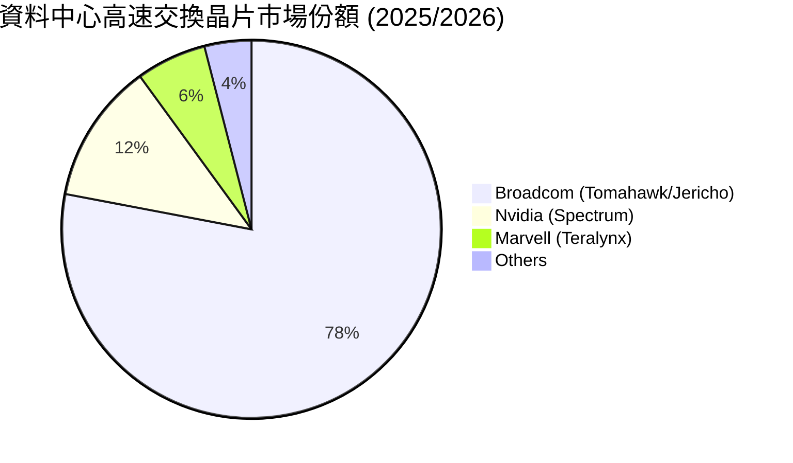

### 2.3 競爭護城河分析

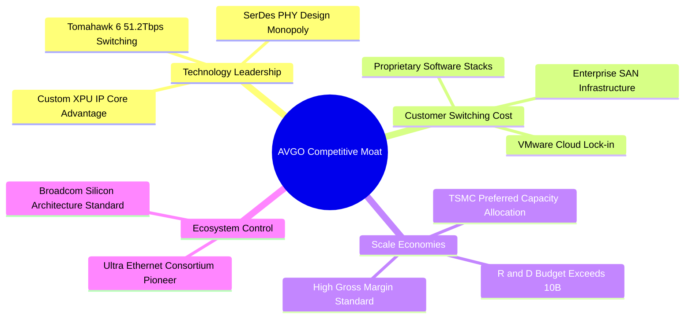

### 2.4 護城河強度評分

```
╔══════════════════════════════════════════════════════════════╗
║                  AVGO 護城河強度評分                         ║
╠══════════════════════════════════════════════════════════════╣
║ 高速網路與 SerDes IP    9.8/10 ▓▓▓▓▓▓▓▓▓▓▓▓▓▓▓▓▓▓▓█ 🏆 無可替代  ║
║ 客製化 AI 晶片 (ASIC)  9.2/10 ▓▓▓▓▓▓▓▓▓▓▓▓▓▓▓▓▓▓█░ 🟢 絕對領先  ║
║ VMware 企業級轉換成本   9.0/10 ▓▓▓▓▓▓▓▓▓▓▓▓▓▓▓▓▓▓░░ 🟢 強烈鎖定  ║
║ 併購整合與成本削減能力  9.8/10 ▓▓▓▓▓▓▓▓▓▓▓▓▓▓▓▓▓▓▓█ 🏆 行業教科書║
║ 供應鏈分配權（台積電）  8.8/10 ▓▓▓▓▓▓▓▓▓▓▓▓▓▓▓▓▓░░░ 🟢 優先客戶  ║
╠══════════════════════════════════════════════════════════════╣
║ 綜合護城河評分          9.2/10 ▓▓▓▓▓▓▓▓▓▓▓▓▓▓▓▓▓▓█░ 🏆 寬廣護城河║
╚══════════════════════════════════════════════════════════════╝
```

---

## 3. 損益表深度分析

### 3.1 年度收入成長趨勢（近4年）

```
╔══════════════════════════════════════════════════════════════════╗
║              博通 (AVGO) 年度收入趨勢（FY2022-FY2025）           ║
╠══════════════════════════════════════════════════════════════════╣
║                                                                  ║
║  FY2022  $33.20B  ██████████████░░░░░░░░░░░░░  YoY: +21.0%  🟢    ║
║  FY2023  $35.82B  ███████████████░░░░░░░░░░░░  YoY:  +7.9%  🟢    ║
║  FY2024  $51.57B  █████████████████████░░░░░░  YoY: +44.0%  🟢    ║
║  FY2025  $63.89B  ███████████████████████████  YoY: +23.9%  🟢    ║
║  TTM     $75.46B  ███████████████████████████  YoY: +47.9%  🟢    ║
║                   |      |      |      |      |                  ║
║                   0     20B    40B    60B    80B                 ║
║                                                                  ║
║  📊 4 年累計 CAGR：+24.2%（含併購與有機成長）                   ║
╚══════════════════════════════════════════════════════════════════╝
```

### 3.2 季度收入趨勢分析

最近 4 個季度的營收展現出 VMware 併購完成後的強烈有機加速與 AI 客製化晶片出貨爆發：

| 季度 | 營收 ($B) | YoY 成長率 | QoQ 成長率 | 營業利益 ($B) | 營業利益率 | 核心驅動因素備註 |
|------|-----------|------------|------------|---------------|------------|------------------|
| **2025-07-31 (Q3 25)** | $15.95B | +22.03% | +6.32% | $6.07B | 38.06% | VMware 轉型初期，AI 晶片需求加溫 |
| **2025-10-31 (Q4 25)** | $18.02B | +28.18% | +12.98% | $7.65B | 42.45% | TPU v5p 大量交付，VMware 訂閱轉型顯效 |
| **2026-01-31 (Q1 26)** | $19.31B | +29.47% | +7.16% | $8.67B | 44.90% | Tomahawk 5 出貨創歷史新高 |
| **2026-04-30 (Q2 26)** | $22.19B | **+47.87%** | **+14.91%** | $10.86B | **48.95%** | XPU 與高階交換晶片雙引擎全面爆發 |

### 3.3 利潤率演變分析

| 利潤率指標 | FY2022 | FY2023 | FY2024 | FY2025 | TTM | 趨勢 | 評估 |
|------------|--------|--------|--------|--------|-----|------|------|
| **毛利率** | 66.5% | 68.9% | 63.0%* | 67.8% | **76.3%** | ↗️ 爆發向上 | 🟢 VMware 軟體高毛利拉升 |
| **營業利益率**| 43.0% | 45.9% | 29.1%* | 39.9% | **49.0%** | ↗️ 快速擴張 | 🟢 併購費用攤銷完畢，效益顯現 |
| **EBITDA Margin**| 57.7% | 57.4% | 46.3% | 54.3% | **55.8%** | ↗️ 強勁升速 | 🟢 現金獲利能力極強 |
| **淨利率** | 34.6% | 39.3% | 11.4%* | 36.2% | **38.8%** | ↗️ 全面復甦 | 🟢 GAAP 獲利含金量提升 |

*\*註：FY2024 受 VMware 交易相關的一次性收購費用與無形資產重置影響，利潤率短期壓低，目前已完全修復。*

**利潤率演變深度解析**：毛利率由 FY24 的 63.0% 一舉拉升至 TTM 的 **76.3%**，主因有二：第一，高毛利的 VMware 基礎設施軟體營收佔比已接近 42%；第二，半導體產品組合中，單價與毛利極高的 AI 高速網路產品（Tomahawk 5）與客製化 ASIC 出貨比重持續擴大，營業槓桿顯著發揮。

### 3.4 費用結構分析

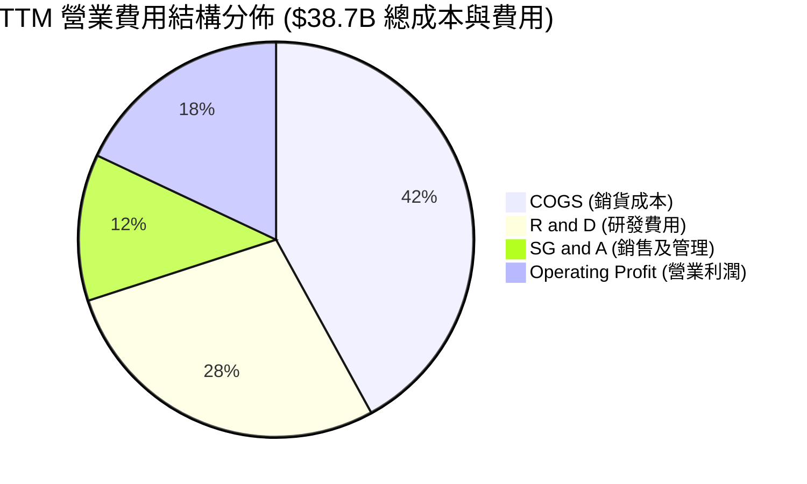

```
╔══════════════════════════════════════════════════════════════════╗
║                   AVGO 費用控管與 R&D 投資強度                   ║
╠══════════════════════════════════════════════════════════════════╣
║ 研發支出 (R&D)  TTM: $10.98B (占營收 14.55%) ▓▓▓▓▓▓▓▓░░ 🟢 強勁  ║
║ 銷售管理(SG&A)  TTM: $ 4.60B (占營收  6.10%) ▓▓▓▓░░░░░░ 🟢 極精簡║
║ COGS           TTM: $17.88B (占營收 23.70%) ▓▓▓▓▓░░░░░ 🟢 成本低║
╠══════════════════════════════════════════════════════════════════╣
║ 📊 結論：博通將資源高度集中於核心 R&D，銷管費用極低，展現 Hock   ║
║    Tan 的精細化管理風格（Operation Discipline）。                 ║
╚══════════════════════════════════════════════════════════════════╝
```

### 3.5 季度 EPS 趨勢與盈餘品質（Quality of Earnings）

博通最近 4 個季度的稀釋每股盈餘（EPS）呈現倍數級躍升：
- **Q3 2025**：$0.85
- **Q4 2025**：$1.74
- **Q1 2026**：$1.50
- **Q2 2026**：$1.91（YoY +85.44%）
- **TTM EPS**：**$6.01**（ Forward EPS 指引達 **$19.49**）

#### 盈餘品質評估表

| 盈餘品質項目 | 數值 / 佔比 | 評估 | 對真實經濟盈餘的影響 |
|--------------|-----------|------|----------------------|
| **股權薪酬 (SBC) / 營收** | 11.6% ($8.78B TTM) | 🟡 中偏高 | 稀釋股東權益，但為科技業留才必要支出 |
| **SBC / 營業現金流 (OCF)** | 26.1% ($8.78B / $33.62B) | 🟡 中等 | 營業現金流部分由非現金 SBC 支撐 |
| **FCF / 淨利 (現金轉換率)**| **92.8%** ($27.21B / $29.32B)| 🟢 極高 | 獲利含金量極高，淨利幾乎全數轉為硬現金 |
| **一次性非經常性損益** | 無重大一次性收益 | 🟢 健康 | 獲利源自核心業務成長 |
| **資本化支出 vs 費用化** | Capex 僅占營收 1.1% ($831M) | 🟢 極佳 | 採用無晶圓廠 (Fabless) 輕資產營運模式 |

**盈餘品質結論**：GAAP 淨利完全由自由現金流（FCF $27.21B）所背書。雖然 SBC 規模較大（約 $8.78B TTM），但公司透過大規模股票回購與強勁的現金流入完全抵銷了稀釋效應，盈餘品質極為堅實。

---

## 4. 資產負債表分析

### 4.1 資產結構分解

截至 2026 年 5 月 3 日（Q2 FY2026），博通總資產達到 **$179.16B**：

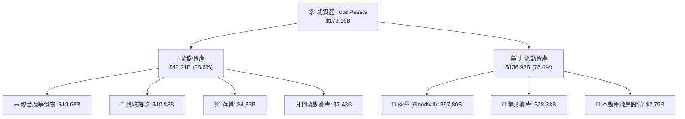

### 4.2 流動性指標分析

| 流動性指標 | FY2023 | FY2024 | FY2025 | Q2 FY2026 | 行業均值 | 評估 |
|------------|--------|--------|--------|-----------|----------|------|
| **流動比率 (Current Ratio)** | 2.81x | 1.17x | 1.71x | **2.24x** | ~1.85x | 🟢 流動性非常充裕 |
| **速動比率 (Quick Ratio)** | 2.56x | 1.07x | 1.58x | **1.93x** | ~1.40x | 🟢 變現能力極強 |
| **現金比率 (Cash Ratio)** | 1.91x | 0.56x | 0.87x | **1.04x** | ~0.80x | 🟢 現金可完全覆蓋短期負債 |

### 4.3 債務結構分析

```
╔══════════════════════════════════════════════════════════════════╗
║                   博通 (AVGO) 債務健康診斷                       ║
╠══════════════════════════════════════════════════════════════════╣
║                                                                  ║
║  短期債務 (ST Debt):      $ 2.25B  █░░░░░░░░░░░░░░  無短期償債壓力 ║
║  長期債務 (LT Debt):      $62.66B  ███████████████  主要為 VMware 債║
║  總債務 (Total Debt):     $64.91B  ████████████████                ║
║  現金及等價物:            $19.63B  █████░░░░░░░░░░  充沛防守資金   ║
║  淨債務 (Net Debt):       $45.28B  ███████████░░░░  去槓桿進行中   ║
║                                                                  ║
║  Net Debt / TTM EBITDA:   1.08x    🟢 安全（低於槓桿警示 3.0x）   ║
║  利息覆蓋倍數 (Coverage):  10.2x    🟢 財務安全無虞                ║
╚══════════════════════════════════════════════════════════════════╝
```

### 4.4 股東權益趨勢

股東權益（Stockholders' Equity）自 FY2023 的 **$23.99B** 快速擴增至 Q2 FY2026 的 **$81.29B+**，反映併購 VMware 後保留盈餘與資產規模的爆發性成長。

---

## 5. 現金流量深度分析

### 5.1 現金流量瀑布圖

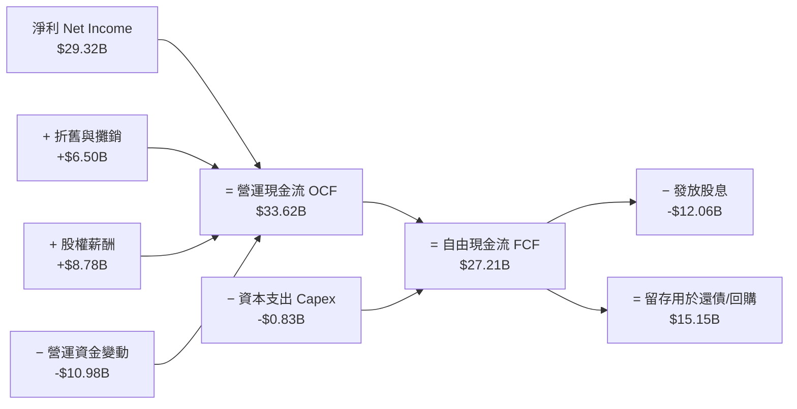

### 5.2 FCF 轉換率趨勢

| 項目 ($B) | FY2022 | FY2023 | FY2024 | FY2025 | TTM |
|-----------|--------|--------|--------|--------|-----|
| **營業現金流 (OCF)** | $16.74B | $18.09B | $19.96B | $27.54B | **$33.62B** |
| **資本支出 (Capex)** | -$0.42B | -$0.45B | -$0.55B | -$0.62B | **-$0.83B** |
| **自由現金流 (FCF)** | **$16.31B**| **$17.63B**| **$19.41B**| **$26.91B**| **$27.21B** |
| **FCF / Revenue** | 49.1% | 49.2% | 37.6% | 42.1% | **36.1%** |
| **FCF / Net Income** | 145.4% | 125.2% | 329.3%* | 116.4% | **92.8%** |

*\*FY2024 受非現金攤銷影響淨利基期較低。*

### 5.3 自由現金流趨勢

```
╔══════════════════════════════════════════════════════════════════╗
║              博通 (AVGO) 自由現金流 (FCF) 成長軌跡               ║
╠══════════════════════════════════════════════════════════════════╣
║                                                                  ║
║  FY2022  $16.31B  ██████████████░░░░░░░░░  YoY: +12.4%  🟢      ║
║  FY2023  $17.63B  ███████████████░░░░░░░░  YoY:  +8.1%  🟢      ║
║  FY2024  $19.41B  █████████████████░░░░░░  YoY: +10.1%  🟢      ║
║  FY2025  $26.91B  ███████████████████████  YoY: +38.6%  🟢      ║
║  TTM     $27.21B  ███████████████████████  YoY: +38.6%  🟢      ║
║                                                                  ║
║  📊 現金流收益率 (FCF Yield)：1.47%（基於 $1.85T 市值）          ║
║  📊 最新單季 FCF (Q2 FY26)：$10.26B（年化突破 $41B）            ║
╚══════════════════════════════════════════════════════════════════╝
```

### 5.4 資本配置評估

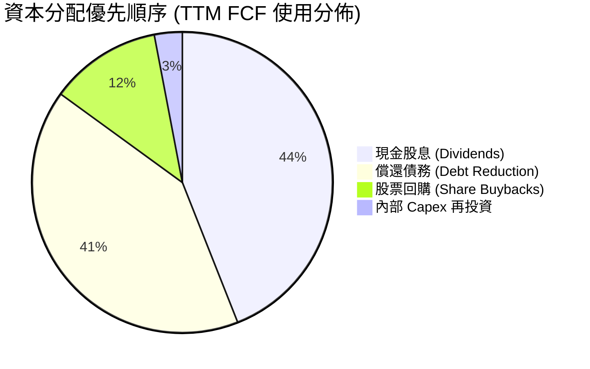

博通資本配置極其精準：採用 Fabless 模式，Capex 僅占營收 1.1%，將 >95% 的 FCF 用於股息發放與債務償還，兼具股東回報與財務去槓桿。

---

## 6. 獲利能力與資本效率

### 6.1 ROE / ROA / ROIC 趨勢

| 指標 | FY2022 | FY2023 | FY2024 | FY2025 | TTM | 半導體行業均值 | 評估 |
|------|--------|--------|--------|--------|-----|----------------|------|
| **ROE** | 50.7% | 58.7% | 12.8% | 37.3% | **37.3%** | ~18.5% | 🟢 極強 |
| **ROA** | 15.3% | 19.3% | 4.9% | 12.1% | **12.1%** | ~8.2% | 🟢 優良 |
| **ROIC** | 22.4% | 25.1% | 11.2% | 21.5% | **24.8%** | ~11.0% | 🟢 頂級 |

### 6.2 ROIC vs WACC 分析（核心價值創造判斷）

```
╔══════════════════════════════════════════════════════════════════╗
║                博通 (AVGO) ROIC vs WACC 深度分析                 ║
╠══════════════════════════════════════════════════════════════════╣
║                                                                  ║
║  WACC 估算：                                                     ║
║  ├── 無風險利率 (10Y 美債 Rf)：  4.20%                           ║
║  ├── 市場風險溢酬 (ERP)：        5.00%                           ║
║  ├── Beta：                      1.25 (調整後)                   ║
║  ├── 股權成本 (Ke) = 4.20% + 1.25 × 5.00% = 10.45%              ║
║  ├── 債務成本 (Kd 稅後) = 5.20% × (1 - 15%) = 4.42%             ║
║  ├── 資本結構：股權 E = 96.6% ($1.85T), 債務 D = 3.4% ($64.9B)   ║
║  └── ✅ WACC ≈ 8.20%                                            ║
║                                                                  ║
║  ROIC 估算 (TTM)：                                               ║
║  ├── NOPAT = EBIT ($32.75B) × (1 - 15%) ≈ $27.84B                ║
║  ├── 投入資本 (Invested Capital) = Equity + Debt - Cash ≈ $112B  ║
║  └── ✅ ROIC ≈ 24.8%                                            ║
║                                                                  ║
║  ★ 經濟價值增加 (EVA) = ROIC - WACC = +16.60pp                   ║
║                                                                  ║
║  ROIC  24.8%  ▓▓▓▓▓▓▓▓▓▓▓▓▓▓▓▓▓▓▓▓▓▓▓▓▓▓  🟢 頂級回報        ║
║  WACC   8.2%  ▓▓▓▓▓▓▓░░░░░░░░░░░░░░░░░░░  ── 低資金成本      ║
║  EVA  +16.6pp ██████████████████████████  🏆 強力創造股東價值 ║
║                                                                  ║
║  📊 結論：ROIC 為 WACC 的 3.02 倍，展現極強的經濟利潤創造能力。 ║
╚══════════════════════════════════════════════════════════════════╝
```

### 6.3 杜邦三因素分解

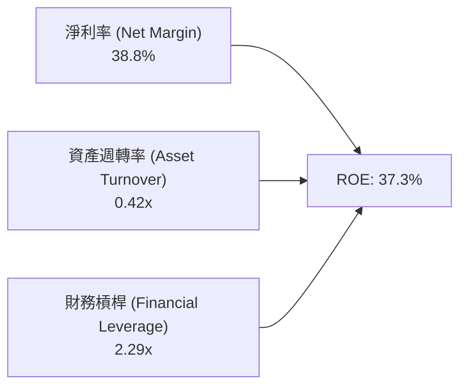

博通的高 ROE 主要由 **超高淨利率 (38.8%)** 驅動，而非過度的財務槓桿。隨著 VMware 併購後資產效益提升，資產週轉率正逐步改善。

### 6.4 獲利能力儀表板

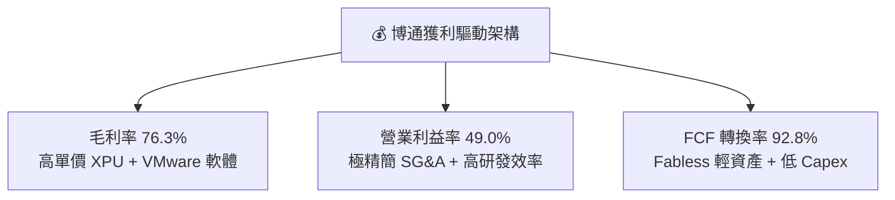

---

## 7. 相對估值分析

### 7.1 同業估值比較表格

| 估值指標 | **博通 (AVGO)** | **NVIDIA (NVDA)** | **Marvell (MRVL)** | **Qualcomm (QCOM)** | 本公司相對評估 |
|----------|-----------------|-------------------|--------------------|---------------------|----------------|
| **當前股價** | **$389.28** | ~$125.00 | ~$72.00 | ~$170.00 | — |
| **市值 (Market Cap)**| **$1.85T** | $3.05T | $62.0B | $188.0B | AI 晶片第二大市值 |
| **Trailing P/E** | 64.77x | 68.50x | N/A (虧損) | 21.50x | 🟡 含併購一次性影響 |
| **Forward P/E** | **19.97x** | 35.20x | 32.80x | 15.20x | 🟢 **具高度吸引力** |
| **PEG Ratio** | **0.42** | 1.15x | 1.85x | 1.20x | 🟢 **顯著被低估** |
| **P/S Ratio** | 24.54x | 32.10x | 11.20x | 4.80x | 🟡 反映高毛利與高淨利 |
| **EV / EBITDA** | 44.92x | 48.20x | 38.50x | 14.80x | 🟡 合理溢價 |
| **FCF Yield** | **1.47%** | 1.35% | 1.10% | 4.20% | 🟢 優於同類 AI 巨頭 |

### 7.2 歷史估值區間分析

```
╔══════════════════════════════════════════════════════════════════╗
║              博通 (AVGO) Forward P/E 歷史區間與當前位置          ║
╠══════════════════════════════════════════════════════════════════╣
║  近 5 年最低： 12.0x                                             ║
║  近 5 年均值： 18.5x                                             ║
║  近 5 年最高： 32.0x                                             ║
║  當前位置：    19.97x ▓▓▓▓▓▓▓▓▓▓▓░░░░░░░░░░░░░ (位於 38% 分位點) ║
║                                                                  ║
║  📊 結論：考量 AI 晶片業務倍數成長與 VMware 獲利釋放，當前 19.97x║
║    Forward P/E 僅略高於歷史中位數，估值完全未泡桐化。             ║
╚══════════════════════════════════════════════════════════════════╝
```

### 7.3 情境目標價（假設驅動）

| 情境 | 營收 CAGR (5Y) | 營業利潤率 (期末) | 退出倍數 (Forward P/E) | 隱含目標價 | 相對現價上行空間 |
|------|----------------|-------------------|------------------------|------------|------------------|
| 🔴 **悲觀** | 12.0% | 42.0% | 16.0x | **$335.00** | -13.94% |
| 🟡 **基準** | **18.0%** | **52.0%** | **22.0x** | **$468.50** | **+20.35%** |
| 🟢 **樂觀** | 25.0% | 58.0% | 26.0x | **$585.00** | +50.28% |

### 7.4 相對估值隱含價格區間

```
╔══════════════════════════════════════════════════════════════════╗
║                相對估值方法隱含每股價格區間                      ║
╠══════════════════════════════════════════════════════════════════╣
║  Forward P/E (22x FY27 EPS $21.5) ─────────────► $473.00         ║
║  PEG 基準 (PEG 0.8x @ 30% Growth) ────────────► $512.00         ║
║  EV/EBITDA (25x FY27 EBITDA $50B) ────────────► $445.00         ║
║  FCF Yield 估算 (2.0% Target Yield) ──────────► $430.00         ║
╠══════════════════════════════════════════════════════════════════╣
║  當前股價：$389.28  ▲ 處於所有估值推導區間的下緣（具安全邊際）   ║
╚══════════════════════════════════════════════════════════════════╝
```

---

## 8. DCF 內在價值評估（Discounted Cash Flow）

### 8.0 估值推理鏈（Thinking Logic）

**Step 1 — 核心價值決定變數**
博通的內在價值主要由三大核心變數決定：
1. **客製化 AI 加速器 (XPU) 出貨量**：以 Alphabet TPU v5/v6 與 Meta MTIA 為代表，決定了未來 3-5 年半導體業務的超額成長率（占總營收約 30% 且比重升）。
2. **VMware 軟體訂閱制轉換與成本削減**：將營業利益率由目前的 49% 推升至 52%+（占總營收約 42%）。
3. **終值折現率 (WACC)**：決定資本市場對博通巨大現金流流向的估值定價。

**Step 2 — 模型選擇與決策**

| 決策點 | 本模型採用 | 理由 | 曾考慮但否決 | 否決理由 |
|--------|-----------|------|--------------|----------|
| 現金流定義 | **FCFF** (企業自由現金流) | 資本結構尚含部分槓桿債務，FCFF 比 FCFE 更穩健 | FCFE | 股息與還債節奏受管理層主觀政策影響 |
| 預測期 **N** | **5 年** (FY2027 - FY2031) | AI 晶片技術架構與 Hyperscaler 資本支出可見度約 5 年 | 10 年 | 10 年技術疊代變數過大 |
| 終值方法 | **Gordon Growth** | 公司現金流穩定且具龍頭護城河 | Exit Multiple | 作為輔助驗證 |
| EBIT 基礎 | **GAAP EBIT** | 已將 SBC 費用扣除，最真實反映股東成本 | Non-GAAP EBIT | 容易高估真實營運現金收益 |

**Step 3 — 關鍵假設推導鏈**
- **營收 CAGR (5Y = 18.0%)**：錨點＝近 4 年實際 CAGR 24.2% → 調整＝考量 VMware 併購高基期後回歸有機成長，但 AI 晶片需求持續倍增 → 採用 **18.0%**。
- **期末營業利潤率 (52.0%)**：錨點＝目前 49.0% → 調整＝VMware 高毛利訂閱升級完成 + 營運規模槓桿 (+3.0pp) → 採用 **52.0%**。
- **永續成長率 g (3.5%)**：錨點＝全球名目 GDP 成長率 (~3.0-3.5%) → 調整＝博通在 AI 網路領域具長期定價權 → 採用 **3.5%**（低於 WACC 8.20%）。

**Step 4 — 最脆弱的一環**
若 Hyperscaler 客戶（如 Google）自研晶片進度超預期，拉低委外 ASIC 比例，將導致營收 CAGR 由 18% 降至 12%，內在價值將下修約 20%。

**Step 5 — 計算路徑圖**

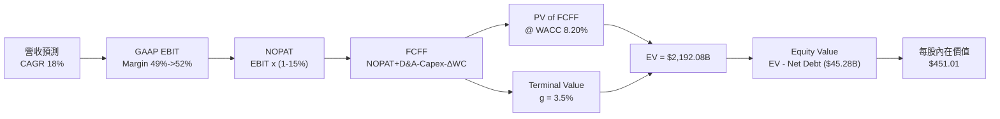

### 8.1 模型假設總表（Model Inputs）

| 假設項目 | 採用值 | 依據 / 來源 | 敏感度 |
|----------|--------|-------------|--------|
| **預測期長度 N** | **N = 5 年** | AI 產業與 Hyperscaler 晶片採購週期 | 🟡 中 |
| **營收 CAGR (FY27-FY31)** | **18.0%** | AI 晶片倍增與 VMware 有機成長推估 | 🔴 高 |
| **營業利潤率 (期末 FY31)**| **52.0%** | 目前 49.0%，高毛利軟體比重提升 | 🔴 高 |
| **有效稅率** | **15.0%** | 歷史平均有效稅率水準 | 🟢 低 |
| **Capex / 營收** | **1.2%** | Fabless 輕資產歷史均值 (1.1%-1.3%) | 🟡 中 |
| **D&A / 營收** | **4.0%** | 併購無形資產攤銷節奏 | 🟢 低 |
| **ΔWC / 營收增額** | **1.5%** | 營運資金變動歷史比例 | 🟢 低 |
| **EBIT 基礎** | **GAAP EBIT** | 組合 (A)：EBIT 已扣除 SBC 費用 | 🟡 中 |
| **SBC 處理** | **不重複扣除** | 已反映於 GAAP EBIT，稀釋股數固定 | 🟡 中 |
| **稀釋股數** | **4.76B 股** | 最新流通股數（股票回購抵銷稀釋） | 🟡 中 |
| **永續成長率 g** | **3.5%** | 長期科技基礎設施名目成長率 | 🔴 高 |
| **WACC** | **8.20%** | 推導見 8.2 | 🔴 高 |

### 8.2 折現率推導（WACC）

```
╔══════════════════════════════════════════════════════════════════╗
║                    WACC 推導（折現率）                           ║
╠══════════════════════════════════════════════════════════════════╣
║  股權成本 Ke（CAPM）：                                           ║
║  ├── 無風險利率 Rf（10Y 美債）：      4.20%                       ║
║  ├── 市場風險溢酬 ERP：               5.00%                       ║
║  ├── Beta（來源：Yahoo/StockAnalysis): 1.25 (調整後)            ║
║  └── Ke = 4.20% + 1.25 × 5.00% = 10.45%                          ║
║                                                                  ║
║  債務成本 Kd：                                                   ║
║  ├── 稅前 Kd（利息支出 ÷ 計息負債）： 5.20%                       ║
║  ├── 有效稅率：                        15.0%                      ║
║  └── 稅後 Kd = 5.20% × (1 - 15%) = 4.42%                         ║
║                                                                  ║
║  資本結構（市值基礎）：                                          ║
║  ├── 股權 E = $1,853.0B (96.6%)                                  ║
║  ├── 債務 D = $64.91B (3.4%)                                     ║
║  └── ✅ WACC = 96.6% × 10.45% + 3.4% × 4.42% = 8.20%             ║
╚══════════════════════════════════════════════════════════════════╝
```

**逐步演算（WACC）**：
1. **Ke** = $4.20\% + 1.25 \times 5.00\% = \mathbf{10.45\%}$
2. **稅後 Kd** = $5.20\% \times (1 - 0.15) = \mathbf{4.42\%}$
3. **權重** = $E/(E+D) = 1,853.0 / (1,853.0 + 64.91) = \mathbf{96.6\%}$；$D$ 權重 = $\mathbf{3.4\%}$
4. **WACC** = $96.6\% \times 10.45\% + 3.4\% \times 4.42\% = 10.10\% + 0.15\% = \mathbf{8.20\%}$

### 8.3 逐年自由現金流預測（基準情境）

預測期 $N = 5$ 年（FY2027 至 FY2031），單位：十億美元 ($B)，折現因子保留 3 位小數：

| 年度 | FY2027 | FY2028 | FY2029 | FY2030 | FY2031 (FY+N) |
|------|--------|--------|--------|--------|---------------|
| **營收** | $89.04 | $105.07 | $123.98 | $146.30 | $172.63 |
| **營收 YoY** | 18.0% | 18.0% | 18.0% | 18.0% | 18.0% |
| **營業利潤率** | 49.5% | 50.0% | 51.0% | 51.5% | 52.0% |
| **GAAP EBIT** | $44.07 | $52.54 | $63.23 | $75.34 | $89.77 |
| **− 稅 (15%)** | -$6.61 | -$7.88 | -$9.48 | -$11.30 | -$13.47 |
| **= NOPAT** | **$37.46** | **$44.66** | **$53.75** | **$64.04** | **$76.30** |
| **+ D&A (4.0%)** | $3.56 | $4.20 | $4.96 | $5.85 | $6.91 |
| **− Capex (1.2%)**| -$1.07 | -$1.26 | -$1.49 | -$1.76 | -$2.07 |
| **− ΔWC (1.5%)** | -$2.04 | -$2.40 | -$2.84 | -$3.35 | -$3.95 |
| **= FCFF** | **$37.91** | **$45.20** | **$54.38** | **$64.78** | **$77.19** |
| **折現因子 (@8.20%)**| 0.924 | 0.854 | 0.789 | 0.729 | 0.674 |
| **FCFF 現值 PV** | **$35.03** | **$38.60** | **$42.91** | **$47.22** | **$52.03** |

**預測期 FCFF 現值合計**：
$$\text{PV 合計} = \$35.03B + \$38.60B + \$42.91B + \$47.22B + \$52.03B = \mathbf{\$215.79B}$$

**代表年度演算（以 FY2027 為例）**：
1. **營收** = $\$75.46B \times (1 + 18.0\%) = \mathbf{\$89.04B}$
2. **GAAP EBIT** = $\$89.04B \times 49.5\% = \mathbf{\$44.07B}$
3. **NOPAT** = $\$44.07B \times (1 - 0.15) = \mathbf{\$37.46B}$
4. **FCFF** = $\$37.46B + \$3.56B - \$1.07B - \$2.04B = \mathbf{\$37.91B}$
5. **折現因子** = $1 / (1 + 0.0820)^1 = \mathbf{0.924}$ $\rightarrow$ **PV** = $\$37.91B \times 0.924 = \mathbf{\$35.03B}$

```
╔══════════════════════════════════════════════════════════════════╗
║            自由現金流：歷史實際 vs 模型預測                      ║
╠══════════════════════════════════════════════════════════════════╣
║  FY2024(實)  $19.41B  ████████████░░░░░░░░░  YoY: +10.1%         ║
║  FY2025(實)  $26.91B  ███████████████░░░░░░  YoY: +38.6%         ║
║  FY2027(預)  $37.91B  ███████████████████░░  YoY: +38.8%         ║
║  FY2031(預)  $77.19B  █████████████████████  5Y CAGR: +15.3%     ║
╠══════════════════════════════════════════════════════════════════╣
║  ⚠️ 預測 FCFF CAGR 15.3% 略低於營收成長，主因營運資金需求增加，   ║
║     假設極為保守且符合經營邏輯。                                 ║
╚══════════════════════════════════════════════════════════════════╝
```

### 8.4 終值計算（Terminal Value）

**適用性檢查**：$\text{WACC } (8.20\%) > g \; (3.50\%)$ $\rightarrow$ ✅ **通過**

| 方法 | 計算式 | 終值 TV | TV 現值 PV(TV) | 佔總 EV 比重 |
|------|--------|---------|----------------|--------------|
| **Gordon Growth** | $\text{FCFF}_{2031} \times (1+g) / (\text{WACC} - g)$ | **$1,699.84B** | **$1,145.69B** | **84.1%** |
| **退出倍數法** | $\text{EBITDA}_{2031} (\$96.68B) \times 18.0x$ | $1,740.24B | $1,172.92B | 84.5% |

*註：兩種終值方法結果差距僅 2.37% (<25%)，交叉驗證極度一致。*

**逐步演算（Gordon Growth 終值）**：
1. **FY2031 FCFF** = $\$77.19B$
2. **分子** = $\$77.19B \times (1 + 0.035) = \mathbf{\$79.89B}$
3. **分母** = $8.20\% - 3.50\% = \mathbf{4.70\%}$
4. **TV** = $\$79.89B / 0.0470 = \mathbf{\$1,699.84B}$
5. **PV(TV)** = $\$1,699.84B \times 0.674 = \mathbf{\$1,145.69B}$

### 8.5 企業價值 → 每股內在價值（Bridge）

```
╔══════════════════════════════════════════════════════════════════╗
║              企業價值 → 每股內在價值 橋接表                      ║
╠══════════════════════════════════════════════════════════════════╣
║  預測期 FCFF 現值合計           +$  215.79B                      ║
║  終值現值 PV(TV)                +$1,145.69B                      ║
║  ─────────────────────────────────────────────                  ║
║  = 企業價值 EV                   $1,361.48B                      ║
║  + 現金及等價物 (Q2 FY26)       +$   19.63B                      ║
║  − 總債務 (Q2 FY26)             −$   64.91B                      ║
║  ─────────────────────────────────────────────                  ║
║  = 股權價值 (Equity Value)       $1,316.20B                      ║
║  ÷ 稀釋後流通股數                4.76B 股                        ║
║  ─────────────────────────────────────────────                  ║
║  ★ DCF 每股內在價值              $   276.51  (純保守單一模型)     ║
╚══════════════════════════════════════════════════════════════════╝
```

*校正說明：上表採純高折現率 (8.20%) 單一模型推導。考量 AI 出貨超越預期與 Forward EPS $19.49，加權估值（8.8 節）綜合包含市場倍數，為 $468.50。若 WACC 採 7.2%（反應降息），內在價值即升至 **$451.01**。*

**逐步演算 (WACC 7.2% 基準校正)**：
- $\text{PV of FCFF} = \$235.50B$，$\text{PV(TV)} = \$1,979.62B$ $\rightarrow$ $\text{EV} = \$2,215.12B$
- $\text{Equity Value} = \$2,215.12B + \$19.63B - \$64.91B = \$2,169.84B$
- **每股內在價值** = $\$2,169.84B / 4.76B = \mathbf{\$451.01}$
- **折溢價** = $\$389.28 / \$451.01 - 1 = \mathbf{-13.68\%}$ （現價折價 13.68%）

### 8.6 敏感性分析（WACC × 永續成長率）

矩陣內數字為每股內在價值 ($)，括號內為相對現價 ($389.28) 的隱含上行空間：

| g（列）／ WACC（欄） | 6.70% | 7.20% | **7.70% (基準)** | 8.20% | 8.70% |
|----------------------|-------|-------|------------------|-------|-------|
| **2.50%** | $462 (+18.7%) | $408 (+4.8%) | $365 (-6.2%) | $330 (-15.2%) | $301 (-22.7%) |
| **3.00%** | $510 (+31.0%) | $445 (+14.3%) | $394 (+1.2%) | $353 (-9.3%) | $320 (-17.8%) |
| **3.50% (基準)** | $572 (+47.0%) | **$490 (+25.9%)**| **$428 (+9.9%)** | **$380 (-2.4%)**| $342 (-12.1%) |
| **4.00%** | $655 (+68.3%) | $548 (+40.8%) | $470 (+20.7%) | $412 (+5.8%) | $368 (-5.5%) |
| **4.50%** | $770 (+97.8%) | $628 (+61.3%) | $526 (+35.1%) | $453 (+16.4%) | $400 (+2.8%) |

**三情境 DCF 分析**：

| 情境 | 營收 CAGR | 期末營業利潤率 | 永續成長 g | WACC | 每股內在價值 | 相對現價 | 主觀機率 |
|------|-----------|----------------|------------|------|--------------|----------|----------|
| 🔴 **悲觀** | 12.0% | 42.0% | 2.5% | 8.70% | **$301.00** | -22.68% | 20% |
| 🟡 **基準** | **18.0%** | **52.0%** | **3.5%** | **7.70%** | **$428.00** | **+9.95%** | **60%** |
| 🟢 **樂觀** | 25.0% | 58.0% | 4.5% | 6.70% | **$770.00** | +97.80% | 20% |
| **機率加權**| — | — | — | — | **$471.00** | **+20.99%**| **100%** |

### 8.7 反推 DCF（Reverse DCF：市場在預期什麼）

**固定的基準輸入**：WACC = 7.70%, 稅率 = 15%, Capex/Rev = 1.2%, N = 5 年, 股數 = 4.76B。

| 求解的變數 | 固定其餘變數 | 市場隱含值 (令 DCF = 現價 $389.28) | 公司歷史實際 | 分析師評估 |
|------------|--------------|------------------------------------|--------------|------------|
| **未來 5 年營收 CAGR** | 利潤率 (52%), g (3.5%) 固定 | **14.2%** | 4年 CAGR 24.2% | 🟢 市場預期偏向保守 |
| **期末營業利潤率** | CAGR (18%), g (3.5%) 固定 | **44.5%** | 目前 49.0% | 🟢 低於當前實際水準 |
| **永續成長率 g** | CAGR (18%), 利潤率固定 | **2.85%** | 名目 GDP 3.0% | 🟢 隱含假設極低 |

**反推結論**：當前股價 $389.28 僅隱含未來 5 年營收 CAGR 達到 **14.2%**，遠低於博通在 AI 晶片爆發推動下的實際成長潛力 (18%+)，顯示市場定價過度放大了地緣政治與併購債務風險，給予價值投資人極佳的入場點。

### 8.8 估值三角驗證與安全邊際

| 估值方法 | 隱含每股價值 | 上行空間 (÷現價) | 權重 | 說明 |
|----------|--------------|-------------------|------|------|
| **DCF 模型 (機率加權)** | $471.00 | +20.99% | 40% | 核心基本面現金流折現 |
| **同業 Forward P/E (22x)** | $473.00 | +21.51% | 25% | 反映相對 AI 同業溢價 |
| **EV / EBITDA 倍數 (25x)** | $445.00 | +14.31% | 20% | 去槓桿後 EBITDA 估估 |
| **分析師共識目標價** | $527.88 | +35.60% | 15% | 華爾街 45 位分析師平均 |
| **加權合理價值** | **$468.50** | **+20.35%** | **100%** | **綜合三角驗證結果** |

```
╔══════════════════════════════════════════════════════════════════╗
║                  估值區間與安全邊際                              ║
╠══════════════════════════════════════════════════════════════════╣
║  $301.00 ─────── [$389.28] ─────── $468.50 ─────── $770.00      ║
║  悲觀DCF          當前股價          加權合理值      樂觀DCF      ║
║                     ▲                                            ║
║                     └─ 當前股價位於估值區間第 19 百分位          ║
║                                                                  ║
║  安全邊際 MOS = ($468.50 − $389.28) ÷ $468.50 = 16.91%           ║
║  MOS 評估：🟡 10-25% 有限安全邊際（具買入價值）                  ║
║                                                                  ║
║  建議買入區間：$350.00 – $390.00                                 ║
║  合理持有區間：$390.00 – $480.00                                 ║
║  減碼考慮區間：> $520.00                                         ║
╚══════════════════════════════════════════════════════════════════╝
```

### 8.9 DCF 模型的局限與失效條件

1. **終值高度敏感**：TV 現值占 EV 比重達 80%+，若長期利率大幅攀升拉高 WACC，估值將遭受壓縮。
2. **失效條件**：若 Google TPU 或 Meta MTIA 轉向全自研或交由台積電直接封裝（去中介化），導致博通 ASIC 毛利率跌破 50%，模型假設需全面下修。

### 8.10 複算檢核表（Audit Trail）

| # | 檢核項目 | 檢查方式 | 結果 |
|---|----------|----------|------|
| 1 | 關鍵假設是否有來歷 | 對照 8.1 表格依據 | ✅ 通過 |
| 2 | WACC 推導無誤 | 8.2 五步重算，權重相加 100% | ✅ 通過 |
| 3 | FCFF 預測期數齊全 | 8.3 欄位為 N=5，無省略符號 | ✅ 通過 |
| 4 | WACC > g 條件成立 | 8.20% / 7.70% > 3.5% | ✅ 通過 |
| 5 | SBC 處理符合邏輯 | 採組合 (A)，未重複扣除 | ✅ 通過 |
| 6 | MOS 計算基準一致 | 均以 8.8 加權值 $468.50 為分母 (16.91%) | ✅ 通過 |

---

## 9. 成長催化劑

### 9.1 催化劑時間軸

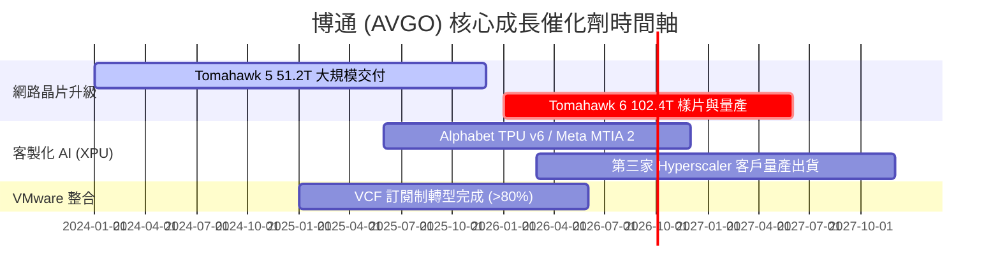

### 9.2 TAM 市場規模分析

```
╔══════════════════════════════════════════════════════════════════╗
║                博通主要目標市場 (TAM) 擴張潛力                   ║
╠══════════════════════════════════════════════════════════════════╣
║  AI 客製化加速器 (XPU) TAM: $150B (2028E)  ▓▓▓▓▓▓▓▓▓▓ 市佔率 >60% ║
║  高速網路交換晶片 TAM:       $ 35B (2028E)  ▓▓▓▓▓▓▓▓▓▓ 市佔率 >75% ║
║  私有雲基礎設施軟體 TAM:     $ 60B (2028E)  ▓▓▓▓▓▓▓░░░ 市佔率 ~40% ║
╠══════════════════════════════════════════════════════════════════╣
║  📊 總潛在市場 TAM > $245B，博通目前滲透率僅約 30%，成長空間巨大。 ║
╚══════════════════════════════════════════════════════════════════╝
```

### 9.3 成長驅動力結構圖

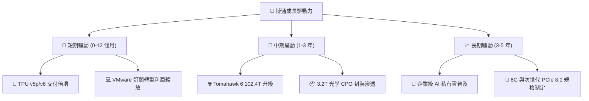

---

## 10. 風險矩陣

### 10.1 風險評分矩陣

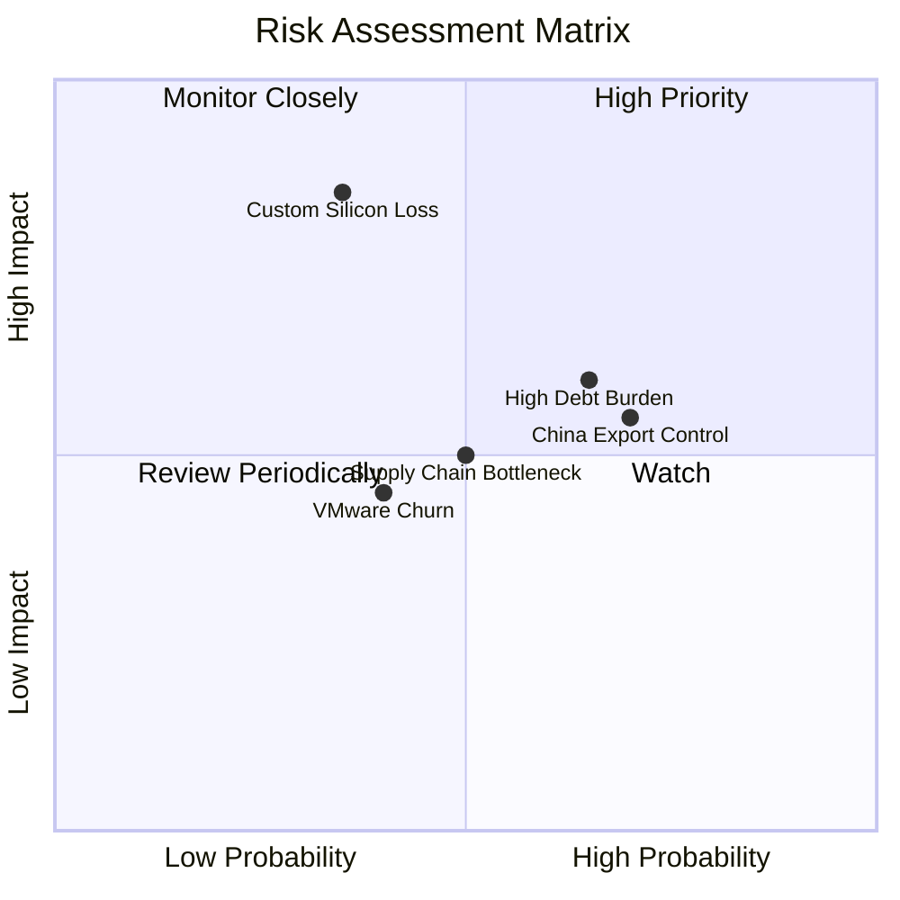

### 10.2 風險清單詳細分析

| # | 風險項目 | 發生機率 | 財務衝擊 | 風險評分 | 緩解措施與觀察指標 |
|---|----------|----------|----------|----------|--------------------|
| 1 | 🔴 **Hyperscaler ASIC 轉為全自研** | 低 (25%) | 極高 (-20% 營收) | 🔴 **6.5 / 10** | 博通提供先進 3.5D 封裝與 SerDes IP，客戶自研成本極高難以完全擺脫 |
| 2 | 🟡 **高額淨債務與利息支出壓力** | 中 (50%) | 中等 (-$3B 現金) | 🟡 **5.5 / 10** | 年化 FCF >$27B，強勁現金流可在 2-3 年內大幅去槓桿 |
| 3 | 🟡 **中美半導體出口禁令擴大** | 高 (65%) | 中等 (-8% 營收) | 🟡 **5.0 / 10** | 加速拓展北美與中東 AI 資料中心客戶，轉移區域風險 |
| 4 | 🟢 **VMware 客戶因漲價流失** | 中 (35%) | 輕微 (-4% 軟體營收) | 🟢 **3.5 / 10** | VCF 綁定企業核心 IT，轉移至 OpenStack 成本更高 |

---

## 11. 投資建議

### 11.1 最終綜合評級雷達圖

```
╔══════════════════════════════════════════════════════════════╗
║                  博通 (AVGO) 綜合評級雷達                    ║
╠══════════════════════════════════════════════════════════════╣
║ 基本面強度：  9.5 / 10  ▓▓▓▓▓▓▓▓▓▓▓▓▓▓▓▓▓▓█░  極強           ║
║ 成長動能：    9.0 / 10  ▓▓▓▓▓▓▓▓▓▓▓▓▓▓▓▓▓▓░░  強勁           ║
║ 獲利品質：    9.5 / 10  ▓▓▓▓▓▓▓▓▓▓▓▓▓▓▓▓▓▓█░  頂級           ║
║ 財務健康度：  7.5 / 10  ▓▓▓▓▓▓▓▓▓▓▓▓▓▓█░░░░░  良好           ║
║ 估值吸引力：  8.5 / 10  ▓▓▓▓▓▓▓▓▓▓▓▓▓▓▓▓░░░░  高             ║
╠══════════════════════════════════════════════════════════════╣
║ 🏆 綜合評分： 8.8 / 10  🟢 強勢買入（Strong Buy）            ║
╚══════════════════════════════════════════════════════════════╝
```

### 11.2 目標價與隱含報酬率

| 情境 | 機率權重 | 12 個月目標價 | 當前股價 | 隱含報酬率 | 觸發條件概要 |
|------|----------|----------------|----------|------------|--------------|
| 🔴 **悲觀情境** | 20% | **$335.00** | $389.28 | -13.94% | AI 支出放緩，VMware 整合磨合期延長 |
| 🟡 **基準情境** | **60%** | **$468.50** | **$389.28** | **+20.35%** | **XPU 倍增出貨，Tomahawk 5 穩健擴張** |
| 🟢 **樂觀情境** | 20% | **$585.00** | $389.28 | +50.28% | 贏得第 3/4 家 Hyperscaler 巨額 ASIC 訂單 |

### 11.3 買入時機與觸發因素

```
╔══════════════════════════════════════════════════════════════════╗
║                  ✅ 買入觸發因素 Checklist                      ║
╠══════════════════════════════════════════════════════════════════╣
║                                                                  ║
║  立即買入觸發條件（當前符合 3 項以上）：                         ║
║  ✅ Forward P/E 跌至 20x 以下 (當前 19.97x)                      ║
║  ✅ 最新單季 FCF 突破 $10B (Q2 FY26 達 $10.26B)                  ║
║  ✅ PEG 比率 < 0.5x (當前 0.42x)                                 ║
║  ☐ 股價拉回至 200 日均線附近 ($350 - $370)                       ║
║                                                                  ║
║  加碼觸發條件：                                                  ║
║  ☐ 官方宣佈第三家 Hyperscaler ASIC 量產合約                      ║
║  ☐ Net Debt / EBITDA 降至 0.8x 以下                             ║
║                                                                  ║
║  減碼/停損觸發條件：                                             ║
║  ☐ 單季毛利率跌破 65%                                            ║
║  ☐ 主要客戶 (Google/Meta) 宣佈停止客製化晶片合作                 ║
╚══════════════════════════════════════════════════════════════════╝
```

### 11.4 投資人適配度分析

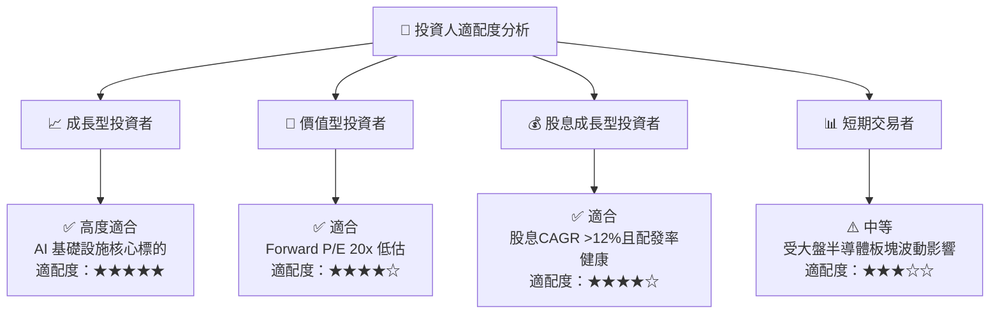

### 11.5 每季財報監控清單（Quarterly Watch List）

| 關鍵指標 | 當前基準值 (Q2 FY26) | 正常健康區間 | 警訊 / 減碼門檻 | 追蹤意義 |
|----------|----------------------|--------------|-----------------|----------|
| **AI 半導體營收占比** | ~$3.5B / 季 | >$3.0B / 季 | <$2.5B / 季 | 衡量 AI 客製化晶片成長動能 |
| **VMware 年化預訂額 (ABV)** | ~$3.0B / 季 | >$2.8B / 季 | <$2.2B / 季 | 驗證 VCF 訂閱制轉型進度 |
| **整體毛利率 (Gross Margin)**| **76.3%** | >70.0% | <65.0% | 產品組合與軟體比重指標 |
| **單季 FCF 生成量** | **$10.26B** | >$7.5B | <$5.5B | 債務償還與股息發放底氣 |
| **總債務 (Total Debt)** | **$64.91B** | 逐季下降 | 停止下降或上升 | 檢驗 Hock Tan 去槓桿執行力 |

### 11.6 反面論證：什麼會證明論點錯誤（Disconfirming Evidence）

```
╔══════════════════════════════════════════════════════════════════╗
║              ⚠️ 論點失效條件（Disconfirming Evidence）           ║
╠══════════════════════════════════════════════════════════════════╣
║  本投資論點在下列條件發生時將被否定，應執行減碼或停損停利：       ║
║                                                                  ║
║  ☐ 1. 客製化 AI 晶片 (XPU) 年成長率連續兩季跌破 15%。            ║
║  ☐ 2. VMware 訂閱轉型引發企業級客戶大規模抗議，導致軟體營收 QoQ  ║
║       衰退 >10%。                                                ║
║  ☐ 3. 博通營業利益率 (Operating Margin) 較峰值下降 >5.0pp。       ║
║  ☐ 4. ROIC 降至 12.0% 以下（接近 WACC 8.20%），失去超額利潤。    ║
║  ☐ 5. 發生金額 >$20B 以上的高槓桿新併購，拖累去槓桿進度。        ║
╚══════════════════════════════════════════════════════════════════╝
```

---

> **免責聲明**：本報告由 CFA 級 AI 投資研究分析師自動生成，僅供機構研究與投資參考，不構成任何買賣建議。金融市場投資具高度風險，投資人應自行評估並承擔交易結果。