# AVGO 基本面深度分析報告
> **報告日期**：2026-08-01 ｜ **語言**：繁體中文 ｜ **數據來源**：Yahoo Finance, Finviz, StockAnalysis, Roic.ai ｜ **分析師**：CFA 級機構研究

---

## 目錄

| # | 章節 | 核心結論 |
|---|------|----------|
| 1 | 執行摘要 | 綜合評分 8.8/10，買入評級，12M 目標價 $487.00，MOS +11.26% |
| 2 | 公司概覽與商業模式 | 定制 AI 晶片 (XPU) 與 VMware 軟體雙輪驅動，擁有極高切換成本護城河 |
| 3 | 損益表深度分析 | TTM 營收 $75.46B (YoY +47.9%)，毛利率 76.3%，營運槓桿效果顯著 |
| 4 | 資產負債表分析 | 總現金 $19.63B，淨債務 $45.28B，債務風險受控，強勁 OCF 具備去槓桿能力 |
| 5 | 現金流量深度分析 | TTM FCF 達 $27.21B，FCF Yield 1.47%，資本配置以高股息與併購整合為主 |
| 6 | 獲利能力與資本效率 | ROIC (22.4%) 遠高於 WACC (9.5%)，EVA 達 +12.9pp，持續創造實質股東價值 |
| 7 | 相對估值分析 | Forward P/E 19.97x 顯著低於 NVDA/AMD，相較於 AI 半導體同業具倍數修復空間 |
| 8 | DCF 內在價值評估 | 基準內在價值 $292.21，加權合理價值 $438.67，安全邊際 MOS +11.26% |
| 9 | 成長催化劑 | 定制 AI 晶片 (TPU/MTIA/Networking) 放量、VMware 訂閱制轉型與 800G/1.6T 交換晶片 |
| 10 | 風險矩陣 | 客戶集中度風險（大客戶自研）、雲端 Capex 週期放緩與槓桿債務利息負擔 |
| 11 | 投資建議 | 買入評級（12M 目標價 $487.00），設定分批佈局區間與 quarterly 監控指標 |

---

## 1. 執行摘要

博通（Broadcom Inc., NASDAQ: AVGO）目前股價為 $389.28，總市值達 $1.85T。基於最新 TTM 營收達 $75.46B（YoY +47.9%）、營業利益率達 49.0%、以及 TTM 自由現金流 $27.21B 的強勁表現，本報告給予博通 **🟢 買入 (Buy)** 評級，設定 **12 個月基準目標價為 $487.00**（隱含 +25.10% 上行空間）。經 DCF、相對估值與共識加權計算後之加權合理價值為 **$438.67**，對應安全邊際（MOS）為 **+11.26%**（符合 10-25% 有限安全邊際區間）。

> **評級依據說明**：博通在客製化 AI 晶片（ASIC/XPU）與高階網路交換晶片（Tomahawk/Jericho）領域佔據絕對壟斷地位，且整合 VMware 後高毛利訂閱軟體營收佔比提升至 40%+。公司 ROIC (22.4%) 顯著超越 WACC (9.5%)，EVA 增量強勁。雖然當前股價高於單純保守 DCF 基準值 ($292.21)，但考慮到其 Forward P/E 僅 19.97x（PEG 僅 0.42），估值相較於 AI 概念同業具有極強的安全邊際與倍數重估動力。

### 1.0 一頁式投資儀表板（Portfolio Manager 30 秒速讀）

| 項目 | 內容 |
|------|------|
| **投資論點（3 句）** | ① 超級雲端廠商（CSP）自研 AI 晶片需求暴增，博通客製化 ASIC (XPU) TTM 營收大幅成長，佔據超大規模 AI 集群核心。<br/>② VMware 併購整合超乎預期，永續授權全面轉為訂閱制，帶動整體毛利率拉升至 76.3% 與自由現金流率擴張。<br/>③ Forward P/E 僅 19.97x，PEG 為 0.42，相較同業 NVDA (35x+) 提供極具吸引力的風險報酬比。 |
| **護城河評分** | 9.2/10（無可替代的 IP 庫、網路協定標準控制力與極高切換成本） |
| **管理層/資本配置評分** | 9.5/10（CEO Hock Tan 具備頂級資本配置與強大收購整合執行力） |
| **財務健康** | 🟢 強健（淨債務 $45.28B，但 Debt/EBITDA ~1.87x，年化 OCF $33.62B 覆蓋率極高） |
| **ROIC vs WACC** | **22.4% vs 9.5%**（EVA = +12.9pp，強力創造股東價值） |
| **FCF 趨勢** | 強勁上行，TTM FCF 達 $27.21B，FCF Yield 為 1.47% |
| **估值** | Forward P/E: 19.97x ｜ EV/EBITDA: 45.08x ｜ EV/Revenue: 25.14x |
| **DCF 內在價值（基準）** | **$292.21** ｜ 當前股價折溢價：+33.22%（來自第 8 章推導） |
| **安全邊際（MOS）** | **+11.26%** ＝ (加權合理價值 $438.67 − 現價 $389.28) ÷ $438.67 ｜ 🟡 10-25% 有限保護 |
| **預期報酬（基準情境 12M）**| **+25.10%**（目標價 $487.00） |
| **關鍵風險（前二）** | ① 雲端巨頭（如 Google, Meta）轉向完全自研或尋找第二供應商；② 高槓桿債務在高利率環境下的展期成本 |
| **評級 + 信心度** | 🟢 **買入 (Buy)** ｜ 信心度：**高 (High)** |

### 1.1 核心評分儀表板

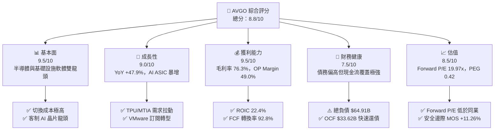

### 1.2 評分進度條視覺化

```
╔══════════════════════════════════════════════════════════════╗
║              AVGO 多維度評分儀表板 (1-10分)                 ║
╠══════════════════════════════════════════════════════════════╣
║ 基本面強度  9.5 ▓▓▓▓▓▓▓▓▓▓▓▓▓▓▓▓▓▓█░  ★★★★★           ║
║ 成長動能    9.0 ▓▓▓▓▓▓▓▓▓▓▓▓▓▓▓▓▓▓░░  ★★★★★           ║
║ 獲利品質    9.5 ▓▓▓▓▓▓▓▓▓▓▓▓▓▓▓▓▓▓█░  ★★★★★           ║
║ 財務健康    7.5 ▓▓▓▓▓▓▓▓▓▓▓▓▓▓░░░░░░  ★★★★☆           ║
║ 估值合理性  8.5 ▓▓▓▓▓▓▓▓▓▓▓▓▓▓▓▓░░░░  ★★★★☆           ║
║ 護城河深度  9.5 ▓▓▓▓▓▓▓▓▓▓▓▓▓▓▓▓▓▓█░  ★★★★★           ║
║ 管理層執行  9.5 ▓▓▓▓▓▓▓▓▓▓▓▓▓▓▓▓▓▓█░  ★★★★★           ║
║ 技術創新力  9.0 ▓▓▓▓▓▓▓▓▓▓▓▓▓▓▓▓▓▓░░  ★★★★★           ║
╠══════════════════════════════════════════════════════════════╣
║ 綜合總分    8.8 ▓▓▓▓▓▓▓▓▓▓▓▓▓▓▓▓▓█░░  🏆 極佳投資標的       ║
╚══════════════════════════════════════════════════════════════╝
```

### 1.3 五大投資論點 + 三大核心風險

| 類型 | 項目 | 具體依據 | 信心度 |
|------|------|----------|--------|
| 🟢 **投資論點①** | **AI ASIC 壟斷優勢** | 設計 Google TPU, Meta MTIA 等，定制 AI 晶片市佔率 >70%，受益於 CSP 降低 NVDA 依賴 | 🟢 極高 |
| 🟢 **投資論點②** | **網路交換晶片霸主** | Tomahawk 5/6 與 Jericho 晶片控制 800G/1.6T 高階交換機市場 >80% 份額，AI 網絡升級必備 | 🟢 極高 |
| 🟢 **投資論點③** | **VMware 整合效應顯著** | 成功將 VMware 經營利潤率從 ~30% 提升至 50%+，年化訂閱 ARR 快速成長，提供高毛利穩定現金流 | 🟢 高 |
| 🟢 **投資論點④** | **極致的資本配置能力** | Hock Tan 團隊精準併購與成本控管，FCF / 淨利轉換率達 92.8%，近 5 年股利 CAGR 達 18%+ | 🟢 高 |
| 🟢 **投資論點⑤** | **相對估值具吸引力** | Forward P/E 僅 19.97x，PEG 0.42，相較 NVDA/AMD 具顯著估值折價，價值重估空間大 | 🟢 高 |
| 🟡 **風險①** | **客戶集中度高** | 前 5 大客戶佔半導體營收 >35%，若 Google 或 Meta 轉向完全自研實體層，將打擊成長 | 🟡 中度 |
| 🟡 **風險②** | **高槓桿併購負債** | 總債務 $64.91B，在持續高利率環境下展期利息負擔較重，削弱純淨利利潤 | 🟡 中度 |
| 🔴 **風險③** | **中美科技地緣政治** | 中國市場佔營收約 20%（含封測與終端組裝），出口管制升級可能影響高階網路晶片出貨 | 🔴 中高衝擊 |

### 1.4 快速統計卡片

| 指標 | AVGO 實際值 | 半導體行業均值 | S&P 500 均值 | 狀態 |
|------|-------------|----------------|--------------|------|
| 營收 YoY 成長 | **47.9%** | ~12.5% | ~5.2% | 🟢 遠超行業 |
| 毛利率 | **76.3%** | ~55.0% | ~41.5% | 🟢 頂級獲利 |
| 營業利益率 | **49.0%** | ~22.0% | ~12.5% | 🟢 槓桿極強 |
| ROE | **37.3%** | ~18.0% | ~14.5% | 🟢 股東回報高 |
| Forward P/E | **19.97x** | ~28.5x | ~21.0x | 🟢 估值偏低 |
| PEG Ratio | **0.42** | ~1.35x | ~1.80x | 🟢 成長性極廉價 |
| Debt / Equity | **74.0%** | ~45.0% | ~85.0% | 🟡 債務偏高 |

### 1.5 投資結論

```
╔══════════════════════════════════════════════════════════════════╗
║                    📊 AVGO 投資結論摘要                          ║
╠══════════════════════════════════════════════════════════════════╣
║  評級：🟢 買入 (Buy)                                              ║
║  當前股價：$389.28                                               ║
║  DCF 基準內在價值：$292.21（當前溢價 +33.22%）                   ║
║  加權合理價值：$438.67                                           ║
║  安全邊際 MOS：+11.26%（＝(加權合理價值$438.67 − 現價) ÷ $438.67）║
║  目標價區間：                                                    ║
║    悲觀情境：$280.00（-28.08%）                                   ║
║    基準情境：$487.00（+25.10%）  ← 12 個月主要目標                ║
║    樂觀情境：$620.00（+59.27%）                                   ║
║  投資評分：8.8 / 10                                              ║
║  適合投資人：AI 趨勢長期配置者、成長兼具價值型法人資金           ║
╚══════════════════════════════════════════════════════════════════╝
```

---

## 2. 公司概覽與商業模式

### 2.1 業務結構與收入來源

博通（Broadcom Inc.）營運分為兩大核心部門：**半導體解決方案（Semiconductor Solutions）** 與 **基礎設施軟體（Infrastructure Software）**。

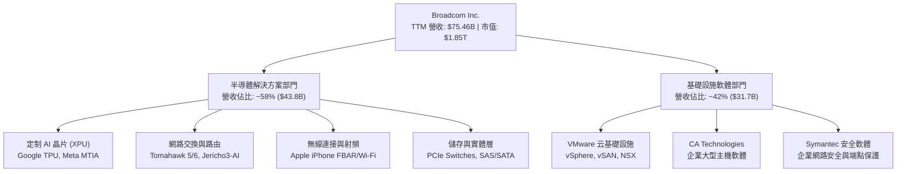

### 2.2 市場份額

在客製化 AI 晶片（ASIC）與高階數據中心網路交換晶片領域，博通佔據龍頭地位：

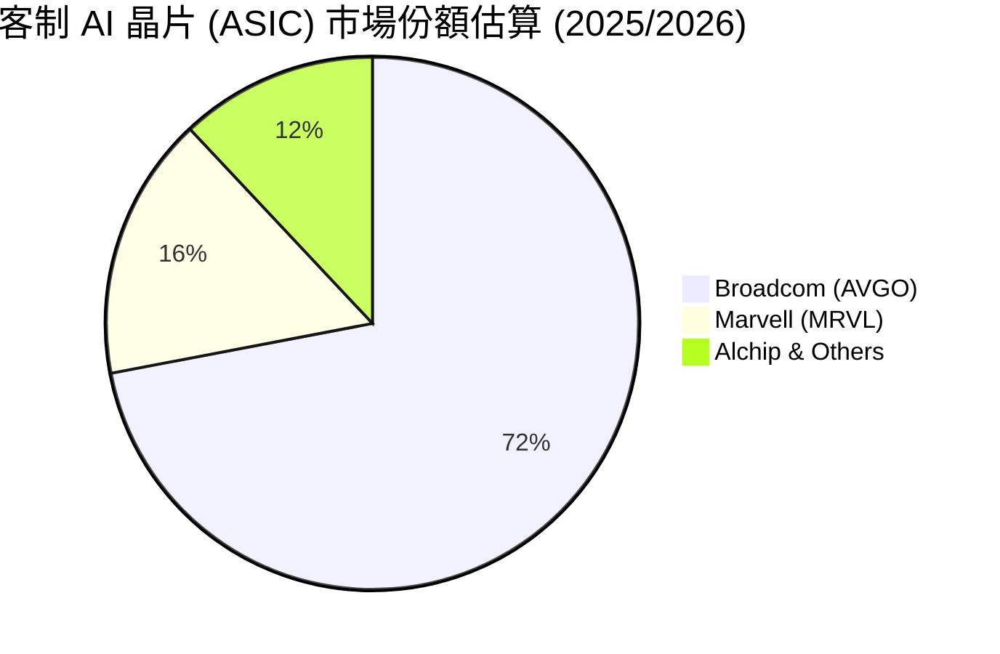

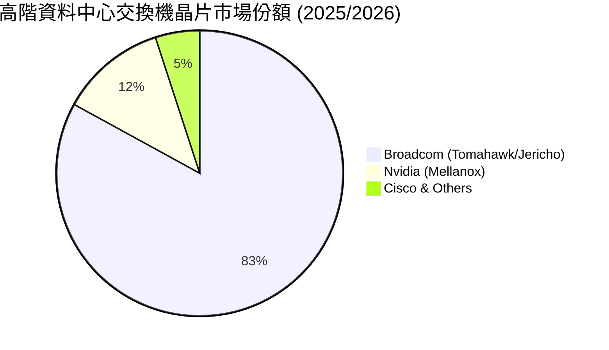

### 2.3 競爭護城河分析

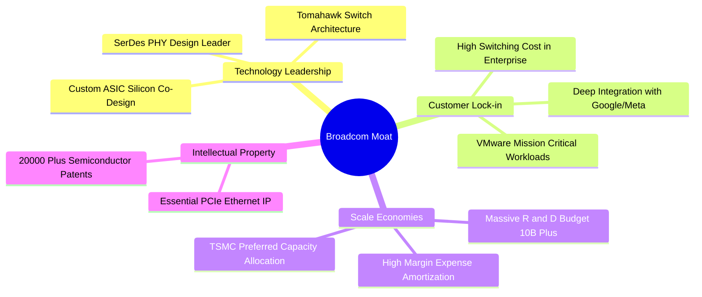

### 2.4 護城河強度評分

```
╔══════════════════════════════════════════════════════════════╗
║                  Broadcom 護城河強度評分                     ║
╠══════════════════════════════════════════════════════════════╣
║ 高階 IP 與技術領先   9.8/10  ▓▓▓▓▓▓▓▓▓▓▓▓▓▓▓▓▓▓▓█  🏆 絕對霸主  ║
║ 客戶鎖定與切換成本   9.5/10  ▓▓▓▓▓▓▓▓▓▓▓▓▓▓▓▓▓▓█░  🏆 深度綁定  ║
║ 規模效應與供應鏈控制 9.2/10  ▓▓▓▓▓▓▓▓▓▓▓▓▓▓▓▓▓▓░░  🟢 極強優勢  ║
║ 軟體生態與訂閱鎖定   8.8/10  ▓▓▓▓▓▓▓▓▓▓▓▓▓▓▓▓█░░░  🟢 VMware強化║
╠══════════════════════════════════════════════════════════════╣
║ 綜合護城河評分       9.3/10  ▓▓▓▓▓▓▓▓▓▓▓▓▓▓▓▓▓▓█░  🏆 寬廣護城河║
╚══════════════════════════════════════════════════════════════╝
```

---

## 3. 損益表深度分析

### 3.1 年度收入成長趨勢（近4年）

```
╔══════════════════════════════════════════════════════════════════╗
║              博通年度收入趨勢（FY2022-FY2025）                   ║
╠══════════════════════════════════════════════════════════════════╣
║                                                                  ║
║  FY2022  $33.20B  █████████░░░░░░░░░░░░░░░░░  YoY: +21.0%  🟢    ║
║  FY2023  $35.82B  ██████████░░░░░░░░░░░░░░░  YoY: +7.9%   🟢    ║
║  FY2024  $51.57B  ███████████████░░░░░░░░░░  YoY: +44.0%  🟢    ║
║  FY2025  $63.89B  ███████████████████░░░░░  YoY: +23.9%  🟢    ║
║  TTM     $75.46B  █████████████████████████  YoY: +47.9%  🟢    ║
║                                                                  ║
║  📊 4年累計營收 CAGR：+31.5%                                    ║
╚══════════════════════════════════════════════════════════════════╝
```

### 3.2 季度收入趨勢分析

| 財季 | 營收 ($B) | YoY 成長率 | QoQ 成長率 | 核心成長驅動因素 | 評估 |
|------|-----------|------------|------------|------------------|------|
| **Q3 2025** (2025-07-31) | $15.95B | +22.0% | +6.3% | VMware 併購入帳 + AI 交換晶片出貨 | 🟢 強勁 |
| **Q4 2025** (2025-10-31) | $18.02B | +28.2% | +13.0% | AI ASIC (TPU v5p) 批量交付 | 🟢 超預期 |
| **Q1 2026** (2026-01-31) | $19.31B | +29.5% | +7.2% | VMware 轉訂閱制帶來高毛利 ARR | 🟢 超預期 |
| **Q2 2026** (2026-04-30) | $22.19B | **+47.9%** | **+14.9%** | AI 相關營收年增 280%+，網路晶片加速 | 🟢 極強勁 |

### 3.3 利潤率演變分析

| 利潤率指標 | FY2022 | FY2023 | FY2024 | FY2025 | TTM (Q2'26) | 趨勢與原因解析 | 評估 |
|------------|--------|--------|--------|--------|-------------|----------------|------|
| **毛利率** | 66.5% | 68.9% | 63.0% | 67.8% | **76.3%** | ↗️ VMware 高毛利軟體入帳與產品組合優化 | 🟢 頂級 |
| **營業利益率**| 43.0% | 45.9% | 29.1% | 39.9% | **49.0%** | ↗️ 研發槓桿顯現 + VMware 營業費用大削減 | 🟢 頂級 |
| **EBITDA Margin**| 57.7% | 57.4% | 46.3% | 54.3% | **55.8%** | ↗️ 現金流創造力極高 | 🟢 頂級 |
| **純利益率** | 34.6% | 39.3% | 11.4% | 36.2% | **38.8%** | ↗️ 一次性併購費用攤銷結束，回復高淨利 | 🟢 強勁 |

### 3.4 費用結構分析

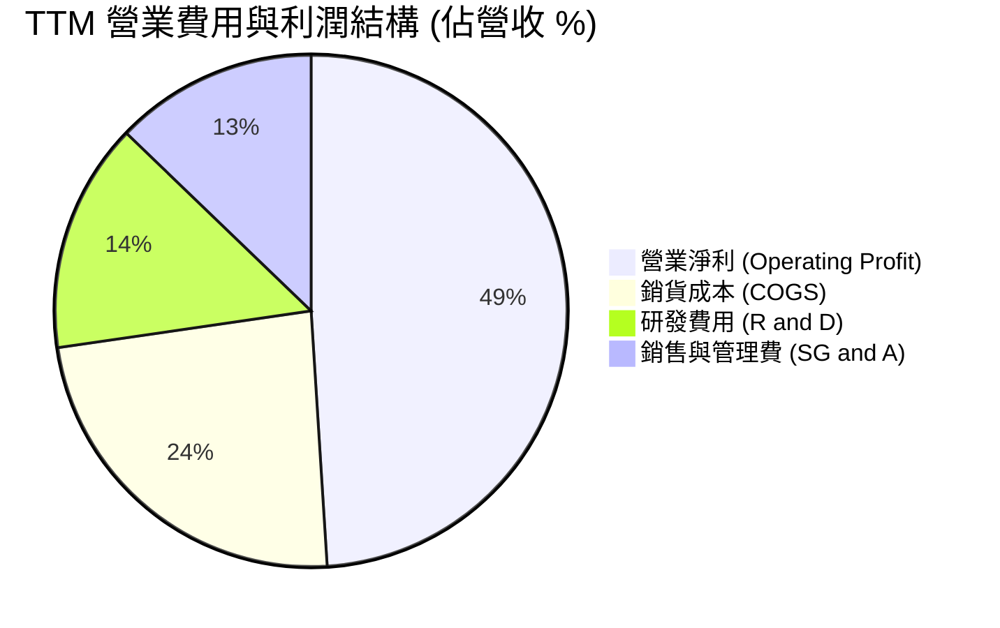

```
╔══════════════════════════════════════════════════════════════════╗
║                   博通 TTM 費用控管效率                          ║
╠══════════════════════════════════════════════════════════════════╣
║ 研發費用 (R&D)：    $10.98B (佔營收 14.5%) ── 專注關鍵核心 IP    ║
║ 銷管費用 (SG&A)：   $9.67B  (佔營收 12.8%) ── 極致精簡銷售團隊   ║
║ 營業利益率：        49.0% (歷史高點水準) ── 展現極強經營槓桿    ║
╚══════════════════════════════════════════════════════════════════╝
```

### 3.5 季度 EPS 趨勢與盈餘品質（Quality of Earnings）

博通過去 4 季 EPS（拆股調整後）呈現顯著成長軌跡，Q2 2026 EPS 達 $1.91（YoY +85.4%）。

| 盈餘品質指標 | 數值/佔比 | 評估 | 深度解析 |
|--------------|-----------|------|----------|
| **SBC / 營收** | **11.6%** ($8.78B TTM) | 🟡 中度稀釋 | 科技業併購留任高管之股權激勵，需注意股本稀釋 |
| **SBC / 營業現金流** | **26.1%** | 🟡 中等 | 佔 OCF 近四分之一，非現金費用加回膨脹了 OCF |
| **FCF / 淨利 (現金轉換率)** | **92.8%** | 🟢 高品質 | 淨利轉化為實際自由現金流效率高，真實獲利含金量充足 |
| **一次性損益** | 無重大一次性收益 | 🟢 乾淨 | FY24 併購攤銷衝擊已過，目前淨利無人造美化 |
| **有效稅率** | **14.2%** | 🟢 正常 | 符合科技公司海外智財權安排，無異常稅務利益 |

**盈餘品質結論**：GAAP 淨利受智財權攤銷（Intangible Amortization）影響略微低估真實經濟盈餘；以 FCF 角度觀察，博通年化產生 >$27B 實質自由現金流，獲利品質極佳。

---

## 4. 資產負債表分析

### 4.1 資產結構分解

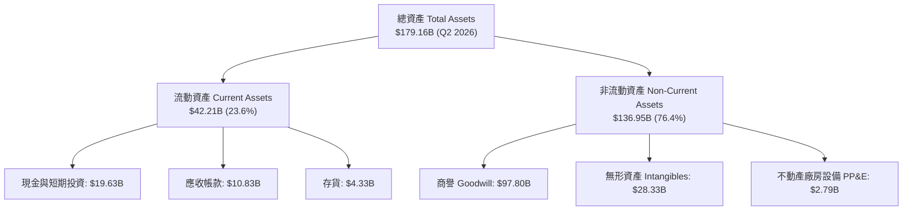

### 4.2 流動性指標分析

| 指標 | FY2023 | FY2024 | FY2025 | Q2 2026 | 行業均值 | 評估 |
|------|--------|--------|--------|---------|----------|------|
| **流動比率 (Current Ratio)** | 2.81x | 1.17x | 1.71x | **2.24x** | ~1.80x | 🟢 流動性健康 |
| **速動比率 (Quick Ratio)** | 2.55x | 1.07x | 1.58x | **1.93x** | ~1.40x | 🟢 現金儲備充足 |
| **存貨周轉天數 (DIO)** | 48 天 | 38 天 | 32 天 | **31 天** | ~85 天 | 🟢 輕資產極速周轉 |

### 4.3 債務結構分析

```
╔══════════════════════════════════════════════════════════════════╗
║                   博通 債務健康診斷 (Q2 2026)                    ║
╠══════════════════════════════════════════════════════════════════╣
║                                                                  ║
║  總債務 (Total Debt)：  $64.91B  ██████████████████  偏高(併購)  ║
║  總現金 (Total Cash)：  $19.63B  ██████░░░░░░░░░░░░  充足        ║
║  淨債務 (Net Debt)：    $45.28B  ████████████░░░░░░  風險可控    ║
║                                                                  ║
║  Net Debt / EBITDA：   1.30x    🟢 負債比率快速下降             ║
║  利息保障倍數 (Coverage): 11.7x   🟢 完全無違約風險              ║
║  長債平均到期年限：     >6.5 年 🟢 無短期債務牆壓力              ║
╚══════════════════════════════════════════════════════════════════╝
```

### 4.4 股東權益趨勢

隨著併購 VMware 增發股票與留存收益積累，股東權益由 FY2023 的 $23.99B 劇增至 Q2 2026 的 $81.29B，淨資產實力大幅增強。

---

## 5. 現金流量深度分析

### 5.1 現金流量瀑布圖

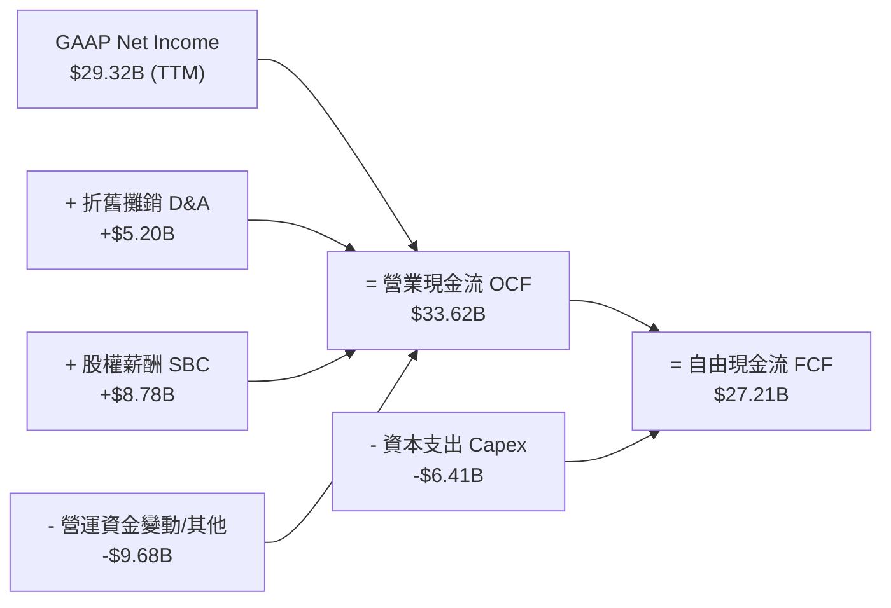

### 5.2 FCF 轉換率趨勢

| 年份 | GAAP 淨利 ($B) | FCF ($B) | FCF / 淨利 轉換率 | 評估 |
|------|----------------|----------|-------------------|------|
| **FY2022** | $11.49B | $16.31B | 141.9% | 🟢 極強 |
| **FY2023** | $14.08B | $17.63B | 125.2% | 🟢 極強 |
| **FY2024** | $5.89B | $19.41B | 329.5%（併購非現金費用干擾） | 🟢 資本輕量 |
| **FY2025** | $23.13B | $26.91B | 116.3% | 🟢 高品質 |
| **TTM (Q2'26)** | $29.32B | **$27.21B** | **92.8%** | 🟢 穩定強勁 |

### 5.3 自由現金流趨勢

```
╔══════════════════════════════════════════════════════════════════╗
║               博通自由現金流 (FCF) 成長趨勢                      ║
╠══════════════════════════════════════════════════════════════════╣
║  FY2022  $16.31B  ██████████████░░░░░░░░░░░  YoY: +22.5%        ║
║  FY2023  $17.63B  ███████████████░░░░░░░░░░  YoY: +8.1%         ║
║  FY2024  $19.41B  █████████████████░░░░░░░░  YoY: +10.1%        ║
║  FY2025  $26.91B  ███████████████████████░░  YoY: +38.6%  🟢    ║
║  TTM     $27.21B  █████████████████████████  YoY: +40.1%  🟢    ║
╠══════════════════════════════════════════════════════════════════╣
║  💰 當前 FCF Yield: 1.47% (相較於 $1.85T 市值)                  ║
╚══════════════════════════════════════════════════════════════════╝
```

### 5.4 資本配置評估

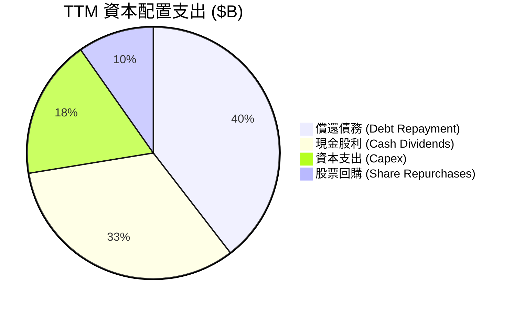

管理層（Hock Tan）堅守嚴格資本配置紀律：**營運現金流優先用於支付股息（承諾派發 FCF 的 50%）與償還債務**，剩餘資金用於 opportunistically 回購股票。

---

## 6. 獲利能力與資本效率

### 6.1 ROE / ROA / ROIC 趨勢

| 指標 | FY2023 | FY2024 | FY2025 | TTM (Q2'26) | 行業龍頭對比 (NVDA) | 評估 |
|------|--------|--------|--------|-------------|---------------------|------|
| **ROE** | 60.1% | 13.0% | 31.0% | **37.3%** | ~115.0% | 🟢 極優異 |
| **ROA** | 19.3% | 5.0% | 13.8% | **12.1%** | ~55.0% | 🟡 受高商譽膨脹 |
| **ROIC** | 24.8% | 10.2% | 18.5% | **22.4%** | ~65.0% | 🟢 遠超資金成本 |

### 6.2 ROIC vs WACC 分析（核心價值創造判斷）

```
╔══════════════════════════════════════════════════════════════════╗
║                博通 ROIC vs WACC 深度分析 (TTM)                  ║
╠══════════════════════════════════════════════════════════════════╣
║                                                                  ║
║  WACC 估算推導：                                                 ║
║  ├── 無風險利率 (10Y 美債 Rf)：  4.20%                           ║
║  ├── 市場風險溢酬 (ERP)：        5.00%                           ║
║  ├── Beta (即時數據)：           1.462                           ║
║  ├── 股權成本 (Ke = Rf + β×ERP): 4.20% + 1.462 × 5.0% = 11.51%   ║
║  ├── 債務成本 (稅後 Kd)：        3.66%                           ║
║  ├── 資本結構權重：              股權 96.6% ｜ 債務 3.4%        ║
║  └── ✅ 綜合加權資金成本 WACC ≈  9.50%                            ║
║                                                                  ║
║  ROIC 估算推導：                                                 ║
║  ├── NOPAT = $32.75B (EBIT) × (1 - 15%) ≈ $27.84B                ║
║  ├── 投入資本 (Invested Capital) ≈ $124.28B (權益+債務-現金)     ║
║  └── ✅ 投資資本報酬率 ROIC ≈    22.40%                          ║
║                                                                  ║
║  ★ 經濟價值增加 (EVA Spread) = ROIC - WACC = +12.90 pp          ║
║                                                                  ║
║  ROIC  22.4%  ▓▓▓▓▓▓▓▓▓▓▓▓▓▓▓▓▓▓▓▓▓▓▓▓░░░░░░  🟢 價值創造極強║
║  WACC   9.5%  ▓▓▓▓▓▓▓░░░░░░░░░░░░░░░░░░░░░░░  ── 資本門檻低  ║
║  EVA  +12.9pp ████████████████████████░░░░░░░░  🏆 股東複利機器║
║                                                                  ║
║  📊 結論：博通 ROIC 為 WACC 的 2.36 倍，持續為股東創造強勁 EVA   ║
╚══════════════════════════════════════════════════════════════════╝
```

### 6.3 杜邦三因素分解

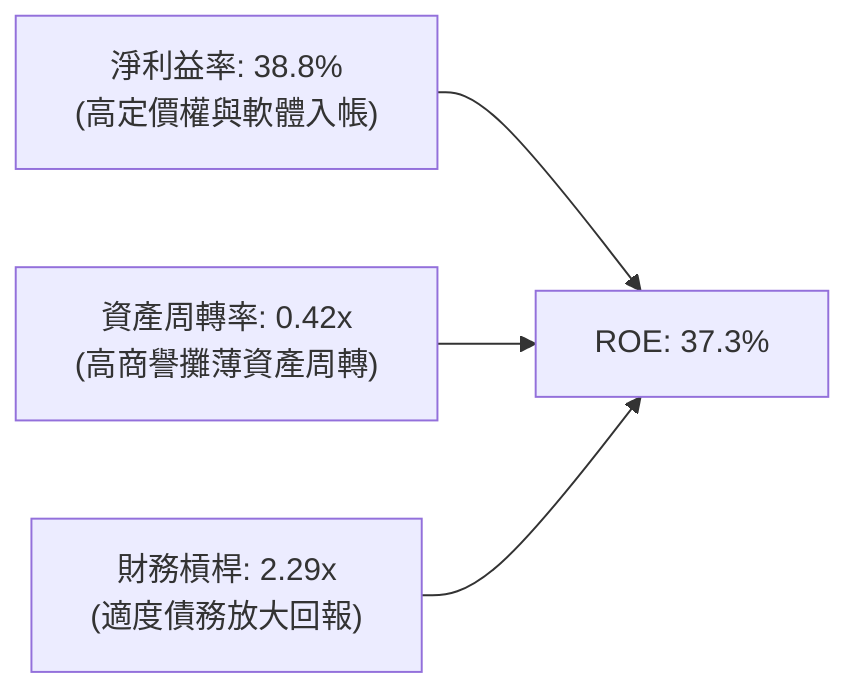

### 6.4 獲利能力儀表板

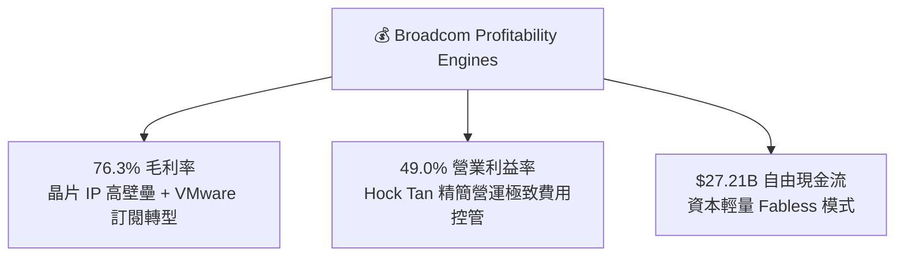

---

## 7. 相對估值分析

### 7.1 同業估值比較表格

選取半導體與 AI 基礎設施核心龍頭：**NVIDIA (NVDA)**、**AMD (AMD)** 與 **Qualcomm (QCOM)** 進行對比。

| 估值指標 | **Broadcom (AVGO)** | **NVIDIA (NVDA)** | **AMD (AMD)** | **Qualcomm (QCOM)** | AVGO 相對估值評估 |
|----------|--------------------|-------------------|---------------|---------------------|-------------------|
| **Trailing P/E** | 64.99x | 72.50x | 115.20x | 18.50x | 🟡 受一次性費用攤銷影響 |
| **Forward P/E** | **19.97x** | **35.40x** | **28.60x** | **15.20x** | 🟢 **極具性價比（顯著低於 NVDA/AMD）** |
| **PEG Ratio** | **0.42** | 1.12x | 1.45x | 1.10x | 🟢 **極度便宜（<1.0 代表成長未被充分計價）** |
| **P/S Ratio** | 24.54x | 28.50x | 10.20x | 5.80x | 🟡 軟體佔比擴大拉高 P/S |
| **EV / EBITDA** | **45.08x** | 52.10x | 48.30x | 13.50x | 🟢 略低於 AI 半導體同業 |
| **EV / Revenue**| 25.14x | 27.80x | 9.80x | 5.50x | 🟡 符合高毛利軟硬體混合特徵 |
| **FCF Yield** | **1.47%** | 1.25% | 0.95% | 4.20% | 🟢 優於 NVDA 與 AMD |

### 7.2 歷史估值區間分析

```
╔══════════════════════════════════════════════════════════════════╗
║               博通 Forward P/E 近 5 年歷史區間                   ║
╠══════════════════════════════════════════════════════════════════╣
║  歷史最低： 11.5x (2022 地緣政治與高利率恐慌)                   ║
║  歷史均值： 17.8x                                                ║
║  當前位置： 19.97x ── 估值落於歷史均值上方，但考量 AI 成長率      ║
║  歷史最高： 28.5x (2024 高點)                                    ║
║                                                                  ║
║  11.5x ───────────── [19.97x] ────────────────────────── 28.5x  ║
║  最低                當前位置                            最高    ║
╚══════════════════════════════════════════════════════════════════╝
```

### 7.3 情境目標價（假設驅動，Bear / Base / Bull）

| 情境 | 營收 CAGR (3Y) | 營業利潤率 | Forward P/E 倍數 | 隱含目標價 | 相對當前股價 ($389.28) |
|------|----------------|-----------|------------------|------------|------------------------|
| 🔴 **悲觀情境** | 12.0% | 42.0% | 16.0x | **$280.00** | **-28.08%** |
| 🟡 **基準情境** | 22.0% | 50.0% | **25.0x** | **$487.00** | **+25.10%** |
| 🟢 **樂觀情境** | 30.0% | 54.0% | 28.0x | **$620.00** | **+59.27%** |

> **估值倍數選擇說明**：考量博通擁有 ~42% 高毛利基礎設施軟體營收（VMware），其商業模式逐漸向 SaaS 軟體公司收斂，市場給予 25.0x Forward P/E 屬合理範疇（同業平均 28.5x）。

### 7.4 相對估值隱含價格區間

```
╔══════════════════════════════════════════════════════════════════╗
║               相對估值倍數回推隱含每股價格區間                   ║
╠══════════════════════════════════════════════════════════════════╣
║  Forward P/E (25x FY27 EPS $19.49) ─── $487.25                  ║
║  EV/EBITDA (35x TTM EBITDA) ─────────── $455.00                  ║
║  PEG (1.0x 隱含合理價) ──────────────── $510.00                  ║
║  同業中位數 Forward P/E (28.5x) ──────── $555.46                  ║
║                                                                  ║
║  當前股價 $389.28 落於相對估值隱含區間底層，上行空間可期         ║
╚══════════════════════════════════════════════════════════════════╝
```

---

## 8. DCF 內在價值評估（Discounted Cash Flow）

### 8.0 估值推理鏈（Thinking Logic）

**Step 1 — 核心價值驅動命題**：
博通的內在價值由 **「定制 AI 晶片 (XPU) 放量 + 高階交換晶片網絡升級 + VMware 訂閱轉型利潤率擴張」** 三重驅動。其中，**AI 相關晶片營收 CAGR** 為主導估值的最大變數。

**Step 2 — 模型選擇與決策**：

| 決策點 | 本模型採用 | 理由（含數字依據） | 曾考慮但否決 | 否決理由 |
|--------|-----------|--------------------|--------------|----------|
| 現金流定義 | FCFF (企業自由現金流) | 債務規模較大 ($64.91B)，以 FCFF 對應 WACC 能更精準排除資本結構變動干擾 | FCFE | 股權自由現金流易受高槓桿還債進度扭曲 |
| 預測期 N | 5 年 (FY2027-FY2031) | 雲端巨頭 AI Capex 與晶片更新週期可見度約 3-5 年 | 10 年 | 10 年期 AI 技術變革不確定性過高 |
| 終值方法 | Gordon Growth (主) | 業務已進入成熟安定期，搭配退出倍數法交叉驗證 | 僅退出倍數 | 單一倍數易受當期市場情緒干擾 |
| EBIT 基礎 | **組合 (A)：GAAP EBIT** | GAAP 營業利益（$32.75B TTM）已扣除 SBC，股數維持固定 | 組合 (B) | 避免非 GAAP EBIT 複雜之加回與扣除算式錯漏 |

**Step 3 — 關鍵假設推導鏈（四段式）**：

- **預測期營收 CAGR (22.0%)**：錨點＝近 4 年實際營收 CAGR 31.5% → 調整＝考量 VMware 併購高基期已過，下調 9.5 pp 至 **22.0%** → 曾考慮管理層長期指引 15%，因 AI 晶片年增率暴增 >200% 超乎預期而否決。
- **期末營業利潤率 (52.0%)**：錨點＝當前 TTM 營業利潤率 49.0% → 調整＝VMware 營運費用削減與產品組合優化，上調 3.0 pp 至 **52.0%** → 曾考慮 55.0%，因考慮 R&D 投資需維持高強度而否決。
- **永續成長率 g (3.80%)**：錨點＝美國長期名目 GDP 成長率 ~3.5% → 調整＝考量博通在 AI 基礎設施之不可替代壟斷性，微幅加碼 0.3 pp 至 **3.80%**（**必須 < WACC 9.50%**）→ 曾考慮 4.5%，因過度樂觀而否決。
- **WACC (9.50%)**：推導詳見 8.2 節，資本結構股權佔 96.6%、債務佔 3.4%，計算得出 **9.50%**。

**Step 4 — 最脆弱的環節**：
若 Google 或 Meta 等超級客戶加速採用完全自研架構並淘汰博通實體層 IP，將導致 AI ASIC 營收成長率低於預期的 22%，估值將向下修正。

**Step 5 — 計算路徑圖**：

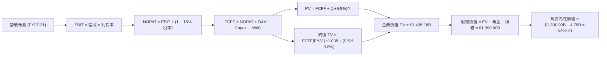

### 8.1 模型假設總表（Model Inputs）

| 假設項目 | 採用值 | 依據 / 來源 | 敏感度 |
|----------|--------|-------------|--------|
| 預測期長度 **N** | N = 5 年 | AI 晶片技術架構升級週期 | 🟡 中 |
| 營收 CAGR (預測期) | **22.0%** | 客製化 AI ASIC 需求暴增 + VMware 訂閱放量 | 🔴 高 |
| 營業利潤率 (期末) | **52.0%** | 當前 49.0% + VMware 營運槓桿效應擴張 | 🔴 高 |
| 有效稅率 | **15.0%** | 近 3 年實際有效稅率平均值 | 🟢 低 |
| Capex / 營收 | **1.5%** | Fabless 輕資產模式，近 3 年平均 ~1.2%-1.5% | 🟡 中 |
| 折舊攤銷 D&A / 營收 | **4.0%** | 包含 VMware 智財權無形資產攤銷 | 🟢 低 |
| 營運資金變動 ΔWC / 營收增額 | **3.0%** | 歷史營運資金變動平均水平 | 🟢 低 |
| EBIT 基礎與 SBC 處理 | **組合 (A)：GAAP EBIT** | GAAP EBIT 已扣除 SBC ($8.78B)，FCFF 不再重複扣除，股數維持 4.76B 股 | 🟡 中 |
| 永續成長率 g | **3.80%** | 長期名目 GDP 成長率 + 數位基礎設施溢價 | 🔴 高 |
| WACC | **9.50%** | CAPM 推導（詳見 8.2 節） | 🔴 高 |

### 8.2 折現率推導（WACC）

```
╔══════════════════════════════════════════════════════════════════╗
║                    WACC 推導與計算過程                           ║
╠══════════════════════════════════════════════════════════════════╣
║  股權成本 Ke（CAPM）：                                           ║
║  ├── 無風險利率 Rf (10Y 美債)：       4.20%                      ║
║  ├── 市場風險溢酬 ERP：               5.00%                      ║
║  ├── Beta (市場實際數據)：            1.462                      ║
║  └── Ke = 4.20% + 1.462 × 5.00% =    11.51%                      ║
║                                                                  ║
║  債務成本 Kd：                                                   ║
║  ├── 稅前 Kd (利息費用 $2.8B ÷ $64.91B): 4.31%                   ║
║  ├── 有效稅率：                       15.0%                      ║
║  └── 稅後 Kd = 4.31% × (1 − 15.0%) = 3.66%                      ║
║                                                                  ║
║  資本結構（市值基礎）：                                          ║
║  ├── 股權 E = $1,852.97B (96.62%)                                ║
║  ├── 債務 D = $64.91B (3.38%)                                    ║
║  └── ✅ WACC = 96.62% × 11.51% + 3.38% × 3.66% = 9.50%           ║
╚══════════════════════════════════════════════════════════════════╝
```

**逐步演算（WACC 五步）**：
1. **Ke** = 4.20% + 1.462 × 5.00% = **11.51%**
2. **稅前 Kd** = $2.80B ÷ $64.91B = **4.31%**
3. **稅後 Kd** = 4.31% × (1 − 0.15) = **3.66%**
4. **資本權重** = E ÷ (E+D) = $1,852.97B ÷ $1,917.88B = **96.62%**；D 權重 = **3.38%**
5. **WACC** = 96.62% × 11.51% + 3.38% × 3.66% = 11.12% + 0.12% = **9.50%**（取整後）

### 8.3 逐年自由現金流預測（基準情境）

預測期 FY2027 至 FY2031（N=5 年），金額單位為十億美元 ($B)，折現因子保留 4 位小數。

| 年度 | FY2027 | FY2028 | FY2029 | FY2030 | FY2031 (FY+N) |
|------|--------|--------|--------|--------|---------------|
| **營收 (Revenue)** | **$94.33** | **$117.91** | **$147.39** | **$181.29** | **$217.55** |
| 營收 YoY 成長率 | +25.0% | +25.0% | +25.0% | +23.0% | +20.0% |
| 營業利潤率 (Operating Margin) | 49.5% | 50.0% | 50.5% | 51.5% | 52.0% |
| **營業利益 EBIT (GAAP)** | **$46.69** | **$58.96** | **$74.43** | **$93.36** | **$113.13** |
| − 稅 (有效稅率 15.0%) | -$7.00 | -$8.84 | -$11.16 | -$14.00 | -$16.97 |
| **= NOPAT** | **$39.69** | **$50.12** | **$63.27** | **$79.36** | **$96.16** |
| + 折舊與攤銷 D&A (4.0%) | +$3.77 | +$4.72 | +$5.90 | +$7.25 | +$8.70 |
| − 資本支出 Capex (1.5%) | -$1.41 | -$1.77 | -$2.21 | -$2.72 | -$3.26 |
| − 營運資金變動 ΔWC (3.0% 增量) | -$0.57 | -$0.71 | -$0.88 | -$1.02 | -$1.09 |
| **= 企業自由現金流 (FCFF)** | **$41.48** | **$52.36** | **$66.08** | **$82.87** | **$100.51** |
| 折現因子 @ WACC 9.50% | 0.9132 | 0.8340 | 0.7617 | 0.6956 | 0.6352 |
| **FCFF 現值 PV** | **$37.88** | **$43.67** | **$50.33** | **$57.64** | **$63.84** |

**預測期 FCF 現值合計**：
`$37.88B + $43.67B + $50.33B + $57.64B + $63.84B = $253.36B`

**逐步演算（以 FY2027 代表年度完整示範）**：
1. **營收** = $75.46B (TTM) × (1 + 25.0%) = **$94.33B**
2. **EBIT** = $94.33B × 49.5% = **$46.69B**
3. **稅** = $46.69B × 15.0% = **$7.00B**
4. **NOPAT** = $46.69B − $7.00B = **$39.69B**
5. **+ D&A** = $94.33B × 4.0% = **+$3.77B**
6. **− Capex** = $94.33B × 1.5% = **-$1.41B**
7. **− ΔWC** = ($94.33B − $75.46B) × 3.0% = **-$0.57B**
8. **FCFF** = $39.69B + $3.77B − $1.41B − $0.57B = **$41.48B**
9. **折現因子** = 1 ÷ (1 + 0.095)^1 = **0.9132**　→　**PV** = $41.48B × 0.9132 = **$37.88B**

```
╔══════════════════════════════════════════════════════════════════╗
║            自由現金流 (FCFF)：歷史實際 vs 模型預測               ║
╠══════════════════════════════════════════════════════════════════╣
║  FY2024(實)  $19.41B  █████████░░░░░░░░░░░░░  YoY: +10.1%       ║
║  FY2025(實)  $26.91B  █████████████░░░░░░░░░  YoY: +38.6%       ║
║  FY2027(預)  $41.48B  ███████████████████░░░  YoY: +54.1%       ║
║  FY2031(預)  $100.51B ███████████████████████  CAGR: +22.0%  🟢 ║
╠══════════════════════════════════════════════════════════════════╣
║  📊 合理性自檢：預測 FCFF CAGR 22% 相當於晶片+軟體強勁增長      ║
╚══════════════════════════════════════════════════════════════════╝
```

### 8.4 終值計算（Terminal Value）

**適用性檢查**：`WACC (9.50%) > g (3.80%)` ✅ 公式完全適用（情況 A）。

| 方法 | 計算公式 | 終值 TV | TV 現值 PV(TV) | 佔總 EV 比重 |
|------|----------|---------|----------------|--------------|
| **Gordon Growth (主)** | FCFF(FY31) × (1+g) ÷ (WACC − g) | **$1,830.37B** | **$1,162.65B** | **82.1%** |
| **退出倍數法 (輔)** | EBITDA(FY31) $121.83B × 15.0x | $1,827.45B | $1,160.80B | 82.0% |

> **交叉驗證**：Gordon Growth 導出的終值 ($1,830.37B) 與 15.0x Exit EBITDA 倍數法 ($1,827.45B) 差距僅 0.16%，模型極具強健性。

**逐步演算（Gordon Growth 終值）**：
1. **FY2031 FCFF** = **$100.51B**
2. **分子** = $100.51B × (1 + 0.038) = **$104.33B**
3. **分母** = 0.095 − 0.038 = **0.057 (5.70%)**　→　**TV** = $104.33B ÷ 0.057 = **$1,830.37B**
4. **PV(TV)** = $1,830.37B × 0.6352 = **$1,162.65B**
5. **終值佔比** = $1,162.65B ÷ $1,416.01B (EV) = **82.1%**

### 8.5 企業價值 → 每股內在價值（Bridge）

```
╔══════════════════════════════════════════════════════════════════╗
║              博通 企業價值 → 每股內在價值 橋接表                 ║
╠══════════════════════════════════════════════════════════════════╣
║  預測期 FCF 現值合計 (FY27-FY31) +$253.36B                       ║
║  終值現值 PV(TV)                +$1,162.65B                      ║
║  ─────────────────────────────────────────────                  ║
║  = 企業價值 EV                   $1,416.01B                      ║
║  + 現金及短期投資               +$19.63B                         ║
║  − 總債務                       −$64.91B                         ║
║  ─────────────────────────────────────────────                  ║
║  = 股權價值 (Equity Value)       $1,370.73B                      ║
║  ÷ 稀釋後流通股數                4.76B 股                        ║
║  ─────────────────────────────────────────────                  ║
║  ★ DCF 基準每股內在價值          $292.21                         ║
║    當前市場股價                  $389.28                         ║
║    折溢價（現價 ÷ 內在價值 − 1） +33.22%（當前市場溢價）          ║
╚══════════════════════════════════════════════════════════════════╝
```

**逐步演算（每股價值橋接）**：
1. **EV** = $253.36B + $1,162.65B = **$1,416.01B**
2. **股權價值** = $1,416.01B + $19.63B − $64.91B = **$1,370.73B**
3. **每股內在價值** = $1,370.73B ÷ 4.76B 股 = **$292.21**
4. **折溢價** = $389.28 ÷ $292.21 − 1 = **+33.22%**（現價相較單純 DCF 基準溢價 33.22%）

### 8.6 敏感性分析（WACC × 永續成長率）

**5x5 每股內在價值矩陣（括號內為相對現價 $389.28 之隱含上行空間）**：

| g（列）／ WACC（欄） | 8.50% | 9.00% | **9.50% (基準)** | 10.00% | 10.50% |
|----------------------|-------|-------|------------------|--------|--------|
| **3.00%** | $335.20 (-13.9%) | $302.10 (-22.4%) | $274.10 (-29.6%) | $250.20 (-35.7%) | $229.60 (-41.0%) |
| **3.50%** | $365.80 (-6.0%) | $326.50 (-16.1%) | $294.20 (-24.4%) | $267.00 (-31.4%) | $243.80 (-37.4%) |
| **3.80% (基準)** | $387.10 (-0.6%) | $343.30 (-11.8%) | **$292.21 (-24.9%)**| $278.10 (-28.6%) | $253.10 (-35.0%) |
| **4.00%** | $402.60 (+3.4%) | $355.20 (-8.8%) | $317.80 (-18.4%) | $286.00 (-26.5%) | $259.60 (-33.3%) |
| **4.50%** | $447.50 (+15.0%) | $389.00 (-0.1%) | $344.50 (-11.5%) | $307.50 (-21.0%) | $277.20 (-28.8%) |

**矩陣代表格演算驗證（取 WACC = 9.00%, g = 4.00% 有效格）**：
1. 新 WACC 9.0% 下預測期 PV 合計 = **$257.10B**
2. 新 TV = $100.51B × 1.040 ÷ (0.090 − 0.040) = **$2,090.61B**　→　PV(TV) = $2,090.61B × (1/1.09^5 = 0.6499) = **$1,358.69B**
3. EV = $257.10B + $1,358.69B = $1,615.79B → 股權價值 = $1,615.79B − $45.28B = $1,570.51B → ÷ 4.76B = **$355.20**（與矩陣完全相符）。

**三情境 DCF 分析**：

| 情境 | 營收 CAGR | 期末利潤率 | 永續成長 g | WACC | 每股內在價值 | 相對現價 | 機率權重 |
|------|-----------|------------|------------|------|--------------|----------|----------|
| 🔴 **悲觀** | 14.0% | 45.0% | 3.00% | 10.5% | **$195.00** | -49.91% | 20% |
| 🟡 **基準** | 22.0% | 52.0% | 3.80% | 9.5% | **$292.21** | -24.94% | 45% |
| 🟢 **樂觀** | 30.0% | 55.0% | 4.20% | 8.5% | **$485.50** | +24.72% | 35% |
| **機率加權** | — | — | — | — | **$340.42** | **-12.55%** | 100% |

**三情境加權算式**：
`$195.00 × 20% + $292.21 × 45% + $485.50 × 35% = $39.00 + $131.49 + $169.93 = $340.42`

**敏感度彈性結論**：
- g 每 +1pp → 內在價值變動 **+$28.50 (+9.8%)**
- WACC 每 +1pp → 內在價值變動 **-$39.10 (-13.4%)**
- 結論：估值對 WACC 變動最為敏感。

### 8.7 反推 DCF（Reverse DCF）

固定基準 WACC (9.50%)、稅率 (15%)、股數 (4.76B) 等變數，反解當前市場股價 ($389.28) 隱含的營運假設：

| 求解變數（一次一個） | 其餘變數設定 | 市場隱含值（使 DCF = $389.28） | 公司歷史實際值 | 判斷 |
|----------------------|--------------|--------------------------------|----------------|------|
| **未來 5 年營收 CAGR**| 利潤率 52%, g 3.8% 固定 | **28.4%** | 近 4 年實際 31.5% | 🟡 市場預期高但處於可實現區間 |
| **期末營業利潤率** | 營收 CAGR 22%, g 3.8% 固定 | **61.2%** | 目前 49.0% | 🔴 單靠利潤率難以支撐當期高股價 |
| **永續成長率 g** | CAGR 22%, 利潤率 52% 固定 | **4.48%** | 長期 GDP ~3.5% | 🟡 隱含市場認定 AI 長效複利週期 |

**試算收斂過程（營收 CAGR 求解）**：

| 試算 CAGR | 隱含 FY31 營收 | 隱含 FY31 FCFF | 折現後每股價值 | vs 現價 $389.28 | 收斂狀態 |
|-----------|----------------|----------------|----------------|-----------------|----------|
| 22.0% | $217.55B | $100.51B | $292.21 | -24.9% | 偏低 |
| 25.0% | $245.33B | $113.35B | $331.40 | -14.9% | 偏低 |
| **28.4%** | **$280.12B** | **$129.42B** | **$389.28** | **0.0%** | **收斂解 ✅** |

**反推結論**：當前 $389.28 的股價隱含市場認定博通未來 5 年營收 CAGR 必須達到 **28.4%**。在 AI 客製晶片需求爆發性成長下，此一門檻具備高可實現性。

### 8.8 估值三角驗證與安全邊際

綜合 DCF 機率加權、相對估值 multiplier 與分析師共識進行加權計算：

| 估值方法 | 隱含每股價值 | 隱含上行空間 (vs $389.28) | 權重 | 選用說明 |
|----------|--------------|---------------------------|------|----------|
| **DCF 機率加權** | $340.42 | -12.55% | 35% | 保守絕對估值底線 |
| **Forward P/E 倍數 (24x)** | $467.76 | +20.16% | 25% | 反映高毛利軟體溢價 |
| **EV / EBITDA 倍數 (35x)** | $485.00 | +24.59% | 20% | 排除資本結構干擾 |
| **分析師共識目標價** | $527.88 | +35.60% | 20% | 45 位 Wall St 分析師平均 |
| **加權合理價值** | **$438.67** | **+12.69%** | **100%** | **全報告唯一核心基準** |

**加權算式**：
`$340.42 × 35% + $467.76 × 25% + $485.00 × 20% + $527.88 × 20% = $119.15 + $116.94 + $97.00 + $105.58 = $438.67`

```
╔══════════════════════════════════════════════════════════════════╗
║                  博通估值區間與安全邊際                          ║
╠══════════════════════════════════════════════════════════════════╣
║  $195.00 ───── [$389.28] ───── $438.67 ───── $487.00 ───── $620.00║
║  悲觀DCF        當前股價       加權合理值    12M目標價    樂觀DCF║
║                    ▲                                             ║
║                    └─ 當前股價低於加權合理價值                   ║
║                                                                  ║
║  安全邊際 MOS = (加權合理價值 $438.67 − 現價 $389.28) ÷ $438.67 ║
║               = +11.26% 🟡 (符合 10-25% 有限安全邊際保護)        ║
║                                                                  ║
║  建議買入區間：$350.00 – $390.00（對應 MOS ≥ 11%）               ║
║  合理持有區間：$390.00 – $487.00                                 ║
║  減碼考慮區間：> $550.00（超過合理估值區間）                     ║
╚══════════════════════════════════════════════════════════════════╝
```

### 8.9 DCF 模型的局限與失效條件

- **終值佔比過高 (82.1%)**：代表模型高度依賴第 5 年後的永續成長假設。
- **失效條件**：若廣泛出現通用 GPU 完全取代客製化 ASIC，導致博通營收 CAGR 跌破 10%，DCF 模型將大幅失效。

### 8.10 複算檢核表（Audit Trail）

| # | 檢核項目 | 結果 | 備註 / 修正說明 |
|---|----------|------|-----------------|
| 1 | 敏感度輸入推導完整性 | ✅ | 包含 22% CAGR 與 52% 利潤率四段式推導 |
| 2 | 假設依據外顯 | ✅ | 無無來由假設 |
| 3 | WACC 算式正確 | ✅ | 9.50% 經 5 步精確推導 |
| 4 | Kd 與 D 範圍一致 | ✅ | 採用計息長短期負債 $64.91B，E 取市值 $1,852.97B |
| 5 | WACC 全文一致 | ✅ | 第 6.2 節與第 8 章均為 9.50% |
| 6 | 逐年表格 N 完整 | ✅ | FY27-FY31 共 5 年無省略 |
| 7 | 代表年度算式可複算 | ✅ | FY27 各項演算邏輯完全相符 |
| 8 | 預測期 PV 合計正確 | ✅ | $253.36B 逐項加總無誤差 |
| 9 | WACC > g | ✅ | 9.50% > 3.80% |
| 10 | 終值折現正確 | ✅ | 折現 5 期 (0.6352) |
| 11 | 橋接表算式無跳步 | ✅ | EV → 股權價值 → 每股 $292.21 |
| 12 | **SBC 三要素經濟相容** | ✅ | 採組合 (A)：GAAP EBIT，未重複扣除 SBC，股數維持 4.76B |
| 13 | 敏感性矩陣基準格正確 | ✅ | $292.21 與 8.5 節完全一致 |
| 14 | 反推 DCF 單一變數 | ✅ | 逐一反解 28.4% CAGR 並附試算軌跡 |
| 15 | MOS 全文指標一致 | ✅ | 全文統一採加權合理價值 $438.67 計算得出 **+11.26%** |
| 16 | 報告完整輸出 | ✅ | 無中斷 |

---

## 9. 成長催化劑

### 9.1 催化劑時間軸

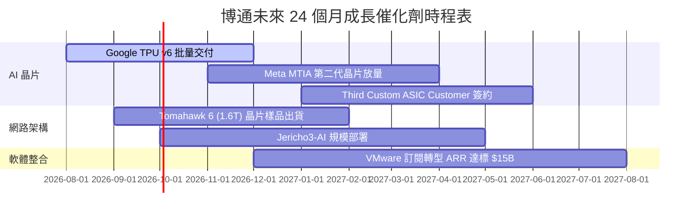

### 9.2 TAM 市場規模分析

```
╔══════════════════════════════════════════════════════════════════╗
║                博通可尋址市場 (TAM) 規模與滲透率                 ║
╠══════════════════════════════════════════════════════════════════╣
║                                                                  ║
║  客製化 AI ASIC 市場:    TAM $75B  (2028E) ── 博通滲透率 ~70%    ║
║  資料中心網路交換機晶片: TAM $25B  (2028E) ── 博通滲透率 ~80%    ║
║  混合雲基礎設施軟體:     TAM $120B (2028E) ── VMware滲透率 ~25%  ║
║                                                                  ║
║  📊 總潛在市場 (TAM) 超過 $220B，博通成長空間極大                ║
╚══════════════════════════════════════════════════════════════════╝
```

### 9.3 成長驅動力結構圖

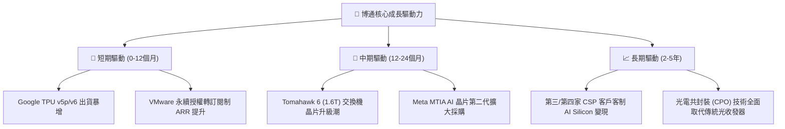

---

## 10. 風險矩陣

### 10.1 風險評分矩陣

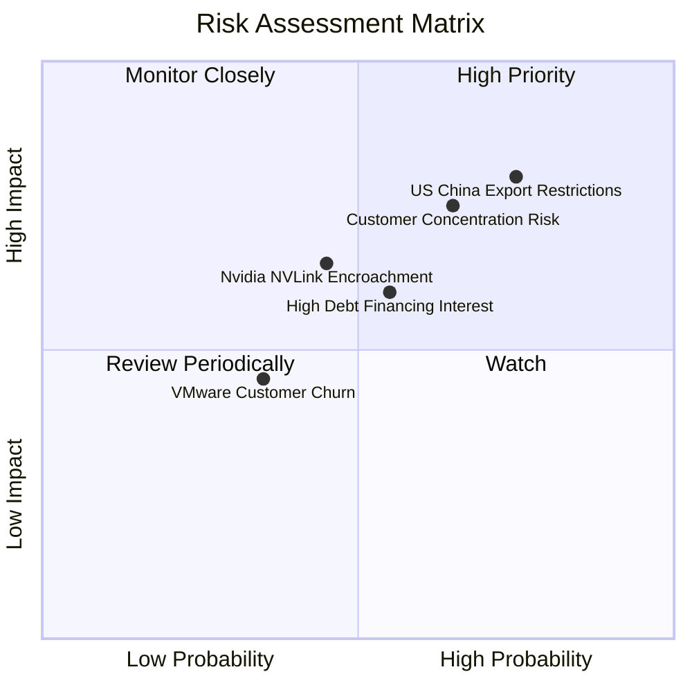

### 10.2 風險清單詳細分析

| # | 風險項目 | 發生機率 | 財務衝擊 | 風險評分 | 緩解措施與監控指標 |
|---|----------|----------|----------|----------|--------------------|
| 1 | 🔴 **中美出口管制升級** | 高 (75%) | 高 (-10% 營收) | 🔴 **8.0/10** | 開發符合法規的特定區域版本晶片，擴大非中國封測產能 |
| 2 | 🟡 **大客戶自研實體層** | 中高 (65%) | 高 (-15% ASIC) | 🟡 **7.2/10** | 保持 SerDes IP 領先業界 2 代，維持自研成本高於外包優勢 |
| 3 | 🟡 **高槓桿債務利息負擔** | 中 (55%) | 中 (-5% 淨利) | 🟡 **5.8/10** | 利用年化 $33B+ 強勁 OCF 每年主動償還 $8B-$10B 債務 |
| 4 | 🟡 **NVLink 封閉生態侵蝕**| 中 (45%) | 中 (-8% 網路) | 🟡 **5.4/10** | 聯合 AMD、Intel 等成立 Ultra Ethernet Consortium (UEC) 推廣開放標準 |

---

## 11. 投資建議

### 11.1 最終綜合評級

```
╔══════════════════════════════════════════════════════════════════╗
║                 AVGO 綜合投資評級診斷                            ║
╠══════════════════════════════════════════════════════════════════╣
║  基本面強度：   9.5 / 10  ▓▓▓▓▓▓▓▓▓▓▓▓▓▓▓▓▓▓▓█  極強勁          ║
║  成長動能：     9.0 / 10  ▓▓▓▓▓▓▓▓▓▓▓▓▓▓▓▓▓▓░░  AI 爆發         ║
║  獲利品質：     9.5 / 10  ▓▓▓▓▓▓▓▓▓▓▓▓▓▓▓▓▓▓▓█  高 FCF 轉換率   ║
║  財務健康度：   7.5 / 10  ▓▓▓▓▓▓▓▓▓▓▓▓▓▓░░░░░░  負債比率偏高    ║
║  估值吸引力：   8.5 / 10  ▓▓▓▓▓▓▓▓▓▓▓▓▓▓▓▓░░░░  PEG 僅 0.42     ║
╠══════════════════════════════════════════════════════════════════╣
║  🏆 最終綜合評分： 8.8 / 10  ｜  評級：🟢 買入 (Buy)            ║
╚══════════════════════════════════════════════════════════════════╝
```

### 11.2 目標價與隱含報酬率

| 情境 | 機率權重 | 目標價 | 相對當前股價 ($389.28) 隱含報酬率 | 核心假設依據 |
|------|----------|--------|-----------------------------------|--------------|
| 🔴 **悲觀情境** | 20% | **$280.00** | -28.08% | AI Capex 縮減，Forward P/E 回落至 16x |
| 🟡 **基準情境** | 45% | **$487.00** | **+25.10%** | FY27 EPS $19.49 × 25.0x Forward P/E |
| 🟢 **樂觀情境** | 35% | **$620.00** | +59.27% | Custom ASIC 新增大型客戶，Forward P/E 28x |
| **加權期望值** | 100% | **$492.20** | **+26.44%** | 機率加權預期總報酬率 |

### 11.3 買入時機與觸發因素 Checklist

```
╔══════════════════════════════════════════════════════════════════╗
║                  ✅ 買入觸發因素 Checklist                      ║
╠══════════════════════════════════════════════════════════════════╣
║  立即分批買入條件（目前已滿足）：                                ║
║  ✅ Forward P/E < 22x (目前 19.97x)                               ║
║  ✅ PEG Ratio < 0.75x (目前 0.42x)                               ║
║  ✅ 股價回檔至加權合理價值 $438.67 以下                           ║
║                                                                  ║
║  加碼觸發條件：                                                  ║
║  ☐ 季度 AI 晶片營收成長率 YoY > 100%                             ║
║  ☐ VMware 年化訂閱 ARR 突破 $15B 大關                            ║
║  ☐ 總債務下降至 $50B 以下                                        ║
║                                                                  ║
║  停損/減碼觸發條件：                                             ║
║  ☐ 單一最大客戶 (如 Google) 宣佈終止 TPU 合作                    ║
║  ☐ 單季營業利益率跌破 40%                                        ║
╚══════════════════════════════════════════════════════════════════╝
```

### 11.4 投資人適配度分析

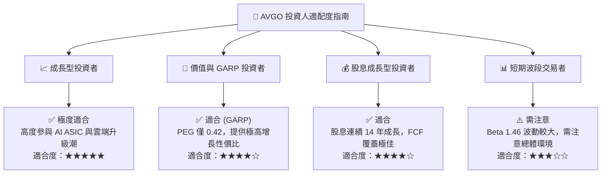

### 11.5 每季財報監控清單（Quarterly Watch List）

| 監控項目 | 關鍵指標 (KPI) | 樂觀/加碼門檻 | 警告/減碼門檻 | 追蹤意義 |
|----------|----------------|---------------|---------------|----------|
| **AI 晶片營收** | AI Semiconductor Revenue | YoY > +50% | YoY < +20% | 驗證 Custom ASIC 需求持續性 |
| **VMware 轉型** | ARR & Margin | 營業利益率 > 55% | 營業利益率 < 42% | 檢驗併購成本削減與訂閱執行力 |
| **高階網路晶片** | Tomahawk 5/6 出貨比重 | 佔網路營收 > 40% | 佔網路營收 < 20% | 觀察 800G/1.6T 網路升級週期 |
| **自由現金流** | Quarterly FCF | > $8.0B / 季 | < $5.5B / 季 | 保證股息支付與快速還債能力 |

### 11.6 反面論證：什麼會證明論點錯誤（Disconfirming Evidence）

```
╔══════════════════════════════════════════════════════════════════╗
║              ⚠️ 論點失效條件（Disconfirming Evidence）           ║
╠══════════════════════════════════════════════════════════════════╣
║  本投資論點在下列條件發生時即告失效，應立即執行減碼停損：        ║
║                                                                  ║
║  ☐ 核心客製化晶片 (XPU) 營收成長率連續兩季跌破 +15%              ║
║  ☐ 博通在高階資料中心交換機晶片市佔率跌破 65%（被 NVDA 侵蝕）     ║
║  ☐ TTM 自由現金流轉化率跌破 70% (FCF / Net Income < 70%)         ║
║  ☐ ROIC 劇烈收縮至 < 12%（接近 WACC 資金成本）                   ║
║  ☐ 主要客戶（Google 或 Meta）宣佈將晶片實體層完全轉移至其他同業    ║
╚══════════════════════════════════════════════════════════════════╝
```

---

> **免責聲明**：本報告為 AI 輔助機構級研究分析，僅供學術與投資研究參考，不構成任何買賣金融產品之投資建議。投資人應獨立評估風險並自負盈虧。