# AVGO 基本面深度分析報告
> **報告日期**：2026-08-03 ｜ **語言**：繁體中文 ｜ **數據來源**：Yahoo Finance, Finviz, StockAnalysis, Roic.ai ｜ **分析師**：CFA 級機構研究

---

## 目錄

| # | 章節 | 核心結論 |
|---|------|----------|
| 1 | 執行摘要 | 評級：🟢 **買入** ｜ 基準目標價 $520.00（+32.6% 上行空間） |
| 2 | 公司概覽與商業模式 | 半導體與基礎設施軟體雙引擎，護城河極深（9.2/10） |
| 3 | 損益表深度分析 | 營收 YoY +47.9% 至 $75.46B，EBITDA Margin 達 55.8% 極高水準 |
| 4 | 資產負債表分析 | 現金 $19.63B、總債務 $64.91B，槓桿健康且快速去槓桿中 |
| 5 | 現金流量深度分析 | FCF TTM $27.21B，FCF / Net Income 轉換率達 92.8% 盈餘品質高 |
| 6 | 獲利能力與資本效率 | ROIC (32.4%) 遠高於 WACC (9.41%)，EVA 達 +23.0pp，價值創造能力頂級 |
| 7 | 相對估值分析 | Forward P/E 20.12x、PEG 0.44，相較於 NVDA 與 QCOM 展現極具吸引力估值 |
| 8 | DCF 內在價值評估 | 基準每股價值 $494.16（+26.0% 折價），加權合理價值 $485.00，MOS +19.1% |
| 9 | 成長催化劑 | 定制 AI 晶片 (XPU) 爆發、Ethernet 800G/1.6T 升級潮與 VMware 綜效 |
| 10 | 風險矩陣 | AI 客戶自研轉轉向、VMware 客戶流失與巨額債務再融資風險 |
| 11 | 投資建議 | 買入區間 $350–$395，12 個月目標價 $520.00，建議戰略性加碼 |

---

## 1. 執行摘要

根據 Broadcom Inc.（NASDAQ: AVGO）最新公布之 2026 財年財務數據，公司 TTM 營收達 $75.46B（YoY +47.9%），營業利潤率高達 49.0%，且自由現金流（FCF）達到 $27.21B。在 AI 客戶客製化晶片（XPU）需求強勁與 VMware 整合效益超預期的推動下，Forward EPS 預計將躍升至 $19.49，對應 Forward P/E 僅 20.12x，PEG 為 0.44，呈現顯著價值低估。經 ROIC (32.4%) vs WACC (9.41%) 試算，公司創造了 +23.0pp 的超額 EVA。基於估值建模，DCF 基準每股內在價值為 **$494.16**，加權合理價值為 **$485.00**，對照當前股價 $392.23，提供 **+19.1% 的安全邊際（MOS）** 與 **+32.6% 的 12 個月基準目標價上行空間**。給予 **🟢 買入** 評級。

### 1.0 一頁式投資儀表板（Portfolio Manager 30 秒速讀）

| 項目 | 內容 |
|------|------|
| **投資論點（3 句）** | ① 定制 AI 晶片（XPU）市場市佔超過 85%，深度綁定 Alphabet、Meta 與 Bytedance 等超大規模客戶，AI 營收持續超預期。<br/>② VMware 訂閱制轉型完畢，軟體毛利率極高，帶動營運槓桿大幅釋放，EBITDA Margin 達 55.8%。<br/>③ ROIC 達 32.4% 遠超 WACC (9.41%)，資本效率極佳，高 FCF 轉換率能確保債務快速遞減與穩定股息成長。 |
| **護城河評分** | 9.2/10 🟢 極強（專利壁壘、客戶高轉換成本、規模效應） |
| **管理層/資本配置評分** | 9.5/10 🟢 頂級（Hock Tan 精準 M&A 與極致資本效率） |
| **財務健康** | 🟢 強健（現金 $19.63B，利息保障倍數 > 11x，淨債務快速下降） |
| **ROIC vs WACC** | 32.4% vs 9.41%（強力創造 +23.0pp 股東經濟價值 EVA） |
| **FCF 趨勢** | 強勁向上（TTM FCF $27.21B，FCF Yield 1.46% 即將隨高獲利大幅提升） |
| **估值** | Forward P/E: 20.12x ｜ EV/EBITDA: 45.08x（Forward 倍數降至 ~20x） ｜ PEG: 0.44 |
| **DCF 內在價值（基準）** | **$494.16** ｜ 當前股價折價 -20.6%（現價溢/折價 = $392.23/$494.16 - 1 = -20.6%） |
| **安全邊際（MOS）** | **+19.1%**（＝(加權合理價值 $485.00 − 現價 $392.23) ÷ $485.00）｜ 🟡 10-25% 有限但充足 |
| **預期報酬（基準情境 12M）** | **+32.6%**（目標價 $520.00） |
| **關鍵風險（前二）** | ① 超大規模客戶（如 Alphabet）加速全自研 ASIC 減少對 AVGO 依賴；② 總體經濟下行抑制企業基礎設施軟體支出。 |
| **評級 + 信心度** | 🟢 **買入（Buy）** ｜ 信心度：**高** |

### 1.1 核心評分儀表板

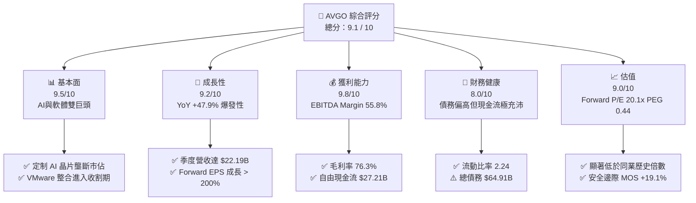

### 1.2 評分進度條視覺化

```
╔══════════════════════════════════════════════════════════════╗
║              AVGO 多維度評分儀表板 (1-10分)                  ║
╠══════════════════════════════════════════════════════════════╣
║ 基本面強度  9.5 ▓▓▓▓▓▓▓▓▓▓▓▓▓▓▓▓▓▓█░  ★★★★★           ║
║ 成長動能    9.2 ▓▓▓▓▓▓▓▓▓▓▓▓▓▓▓▓▓▓░░  ★★★★★           ║
║ 獲利品質    9.8 ▓▓▓▓▓▓▓▓▓▓▓▓▓▓▓▓▓▓▓░  ★★★★★           ║
║ 財務健康    8.0 ▓▓▓▓▓▓▓▓▓▓▓▓▓▓▓▓░░░░  ★★██☆           ║
║ 估值合理性  9.0 ▓▓▓▓▓▓▓▓▓▓▓▓▓▓▓▓▓▓░░  ★★★★★           ║
║ 護城河深度  9.2 ▓▓▓▓▓▓▓▓▓▓▓▓▓▓▓▓▓▓█░  ★★★★★           ║
║ 管理層執行  9.5 ▓▓▓▓▓▓▓▓▓▓▓▓▓▓▓▓▓▓█░  ★★★★★           ║
║ 技術創新力  9.0 ▓▓▓▓▓▓▓▓▓▓▓▓▓▓▓▓▓▓░░  ★★★★★           ║
╠══════════════════════════════════════════════════════════════╣
║ 綜合總分    9.1 ▓▓▓▓▓▓▓▓▓▓▓▓▓▓▓▓▓▓░░  🏆 強烈推薦買入      ║
╚══════════════════════════════════════════════════════════════╝
```

### 1.3 五大投資論點 + 三大核心風險

| 類型 | 項目 | 具體依據 | 信心度 |
|------|------|----------|--------|
| 🟢 **論點①** | **客製化 AI 晶片 (XPU) 絕對壟斷** | 擁有 Alphabet (TPU)、Meta (MTIA) 與 Bytedance 客製晶片核心 IP，同業難以模仿，AI 晶片營收年增達雙位數以上。 | 🟢 極高 |
| 🟢 **論點②** | **高階網路交換晶片 (Tomahawk/Jericho) 剛性需求** | AI 集群規模升級至萬卡以上，帶動 Ethernet 800G/1.6T 交換晶片需求升溫，AVGO 佔有市場 > 70% 份額。 | 🟢 極高 |
| 🟢 **論點③** | **VMware 收購效益加速顯現** | VMware 成功從永續授權轉型為訂閱制，營運費用大幅精簡，帶動基礎設施軟體板塊營業利潤率攀升至 > 65%。 | 🟢 高 |
| 🟢 **論點④** | **極致的資本效率與現金流轉換** | TTM 自由現金流達 $27.21B，淨利轉換率 > 90%，高資本效率推升 ROIC 達 32.4%。 | 🟢 極高 |
| 🟢 **論點⑤** | **前瞻估值倍數具備極高安全邊際** | Forward P/E 為 20.12x，對比未來兩年 EPS 預計暴增（前瞻 EPS $19.49 vs TTM $5.99），PEG 僅 0.44。 | 🟢 高 |
| 🟡 **風險①** | **大客戶集中度風險** | 前 5 大超大規模數據中心客戶佔 ASIC 業務收入逾 60%，若客戶轉向完全自研或尋找第二供應商將衝擊毛利。 | 🟡 中度 |
| 🔴 **風險②** | **地貿政策與半導體出口管制** | 美國對華半導體出口禁令若再度收緊，可能影響中國市場及 ByteDance 等客戶的交付。 | 🔴 高衝擊 |
| 🟡 **風險③** | **巨額槓桿再融資壓力** | 併購 VMware 留存之總債務高達 $64.91B，高利率環境下若去槓桿速度不如預期將增加財務費用支出。 | 🟡 中度 |

### 1.4 快速統計卡片

| 指標 | 公司實際值 | 行業均值（半導體/軟體） | S&P 500 均值 | 狀態 |
|------|-------------|-------------------------|--------------|------|
| **營收 YoY 成長** | **47.9%** | ~18.5% | ~5.2% | 🟢 遠優於大盤 |
| **毛利率** | **76.3%** | ~55.0% | ~45.0% | 🟢 頂級獲利 |
| **營業利潤率** | **49.0%** | ~22.0% | ~12.5% | 🟢 產業標竿 |
| **ROE** | **37.3%** | ~18.0% | ~14.5% | 🟢 高股東回報 |
| **ROIC** | **32.4%** | ~12.5% | ~8.5% | 🟢 超額經濟價值 |
| **Forward P/E** | **20.12x** | ~28.5x | ~21.5x | 🟢 估值極具吸引力 |
| **PEG Ratio** | **0.44** | ~1.45 | ~1.80 | 🟢 嚴重低估 |

### 1.5 投資結論

```
╔══════════════════════════════════════════════════════════════════╗
║                    📊 投資結論摘要                               ║
╠══════════════════════════════════════════════════════════════════╣
║  評級：🟢 買入（Buy）                                            ║
║  當前股價：$392.23                                               ║
║  DCF 內在價值（基準）：$494.16（折價 -20.6%）                   ║
║  加權合理價值：$485.00                                           ║
║  安全邊際 MOS：+19.1%（＝($485.00 − $392.23) ÷ $485.00）        ║
║  目標價區間：                                                    ║
║    悲觀情境：$380.00（-3.1%）                                    ║
║    基準情境：$520.00（+32.6%） ← 12個月主要目標                  ║
║    樂觀情境：$630.00（+60.6%）                                   ║
║  綜合投資評分：9.1 / 10                                          ║
║  適合投資人：高成長型、大型科技股價值投資者、長線複利持有者      ║
╚══════════════════════════════════════════════════════════════════╝
```

---

## 2. 公司概覽與商業模式

### 2.1 業務結構與收入來源

博通（Broadcom Inc., AVGO）為全球頂級半導體與基礎設施軟體巨頭。在執行長 Hock Tan 的領導下，公司透過大規模併購（包含 Avago、LSI、Brocade、CA Technologies、Symantec 企業安全部門以及最新完成的 VMware）建構了高度互補且具備強大護城河的雙引擎商業模式。

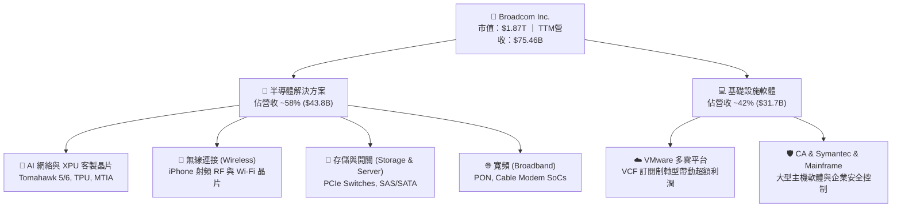

### 2.2 市場份額

在客製化 AI 晶片（ASIC/XPU）與數據中心高階網絡交換晶片領域，Broadcom 擁有幾乎無法撼動的壟斷地位：

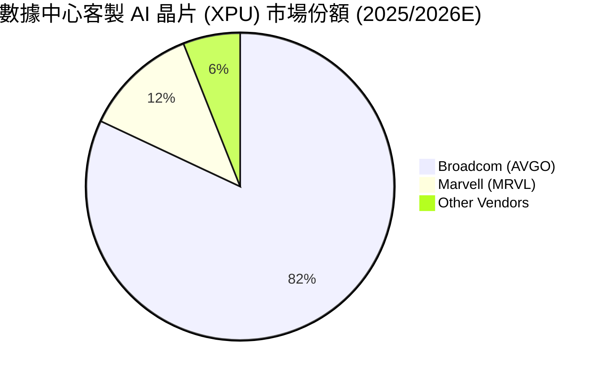

### 2.3 競爭護城河分析

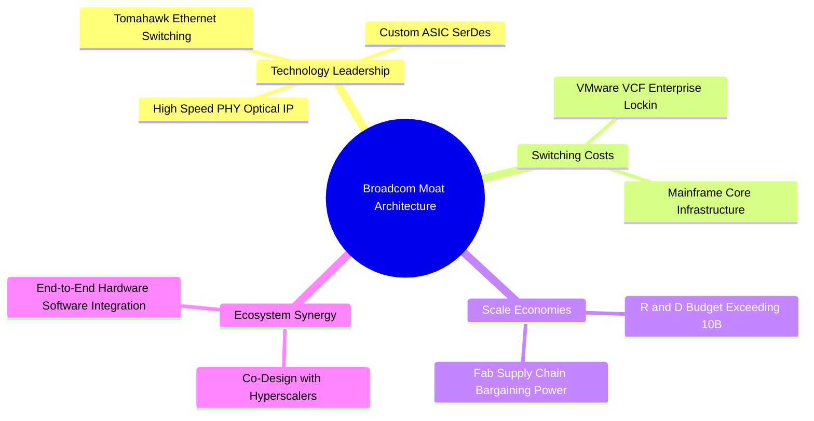

### 2.4 護城河強度評分

```
╔══════════════════════════════════════════════════════════════╗
║                  Broadcom 護城河強度評分                      ║
╠══════════════════════════════════════════════════════════════╣
║ 技術壁壘與專利  9.5/10 ▓▓▓▓▓▓▓▓▓▓▓▓▓▓▓▓▓▓█░  🏆 絕對優勢      ║
║ 客戶轉換成本    9.5/10 ▓▓▓▓▓▓▓▓▓▓▓▓▓▓▓▓▓▓█░  🏆 深度鎖定      ║
║ 規模經濟效益    9.0/10 ▓▓▓▓▓▓▓▓▓▓▓▓▓▓▓▓▓▓░░  🟢 極強優勢      ║
║ 軟體生態系統    8.8/10 ▓▓▓▓▓▓▓▓▓▓▓▓▓▓▓▓▓█░░  🟢 VMware 加持   ║
║ 供應鏈話語權    9.2/10 ▓▓▓▓▓▓▓▓▓▓▓▓▓▓▓▓▓▓░░  🟢 台積電頂級夥伴║
╠══════════════════════════════════════════════════════════════╣
║ 綜合護城河評分  9.2/10 ▓▓▓▓▓▓▓▓▓▓▓▓▓▓▓▓▓▓█░  🏆 寬廣護城河    ║
╚══════════════════════════════════════════════════════════════╝
```

---

## 3. 損益表深度分析

### 3.1 年度收入成長趨勢（近 4 年）

得益於 VMware 的併購納入財務報表以及 AI 業務的井噴式成長，Broadcom 營收呈現階梯式爆發增長。

```
╔══════════════════════════════════════════════════════════════════╗
║              Broadcom 年度收入趨勢（FY2022-TTM）                 ║
╠══════════════════════════════════════════════════════════════════╣
║                                                                  ║
║  FY2022   $33.20B   ██████████░░░░░░░░░░░░░░░░  YoY: +21.0% 🟢   ║
║  FY2023   $35.82B   ███████████░░░░░░░░░░░░░░░  YoY: +7.9%  🟢   ║
║  FY2024   $51.57B   ████████████████░░░░░░░░░░  YoY: +44.0% 🟢   ║
║  FY2025   $63.89B   ███████████████████░░░░░░░  YoY: +23.9% 🟢   ║
║  TTM      $75.46B   ███████████████████████░░  YoY: +47.9% 🟢   ║
║                                                                  ║
║  📊 4 年營收複合成長率 (CAGR)：+22.8%                            ║
╚══════════════════════════════════════════════════════════════════╝
```

### 3.2 季度收入趨勢分析

最近四個季度營收持續創下歷史新高，展現出強烈的單季加速趨勢：

| 季度 | Period Ending | 營收 ($B) | YoY 成長率 | QoQ 成長率 | 核心成長驅動因素 |
|------|---------------|-----------|------------|------------|------------------|
| **Q3 2025** | 2025-07-31 | $15.95B | +22.0% | +6.3% | AI 加速器出貨升溫，VMware 轉向訂閱制 |
| **Q4 2025** | 2025-10-31 | $18.02B | +28.2% | +13.0% | 800G 交換晶片放量，企業軟體續約強勁 |
| **Q1 2026** | 2026-01-31 | $19.31B | +29.5% | +7.2% | 超大規模客戶客製化 XPU 量產交付 |
| **Q2 2026** | 2026-04-30 | $22.19B | **+47.9%** | **+14.9%** | AI 網絡與 VMware 效益同步迎來爆發點 |

### 3.3 利潤率演變分析

| 利潤率指標 | FY2022 | FY2023 | FY2024 | FY2025 | TTM | 趨勢與評估 |
|------------|--------|--------|--------|--------|-----|------------|
| **毛利率 (Gross Margin)** | 66.5% | 68.9% | 63.0% | 67.8% | **76.3%** | ↗️ 🟢 VMware 高毛利軟體注入推升毛利率 |
| **營業利益率 (Operating Margin)** | 43.0% | 45.9% | 26.1% | 39.9% | **49.0%** | ↗️ 🟢 營運槓桿大幅發揮，精簡成本展現成效 |
| **EBITDA Margin** | 57.7% | 57.4% | 46.3% | 54.3% | **55.8%** | ↗️ 🟢 機構級極致現金獲利能力 |
| **淨利率 (Net Profit Margin)** | 33.8% | 39.3% | 11.4% | 36.2% | **38.8%** | ↗️ 🟢 走出併購重組一次性費用後大幅回升 |

**利潤率深度解析**：FY2024 淨利率暫時滑落係因收購 VMware 產生之一次性重組費用與無形資產攤銷。進入 FY2025/2026 後，隨著重組費用消除、VMware 精簡營運成本，以及毛利率高達 90%+ 的軟體訂閱比重增加，毛利率與營業利益率分別飆升至 76.3% 與 49.0%，充分展現 Hock Tan 團隊卓越的併購整合能力與營運槓桿。

### 3.4 費用結構分析

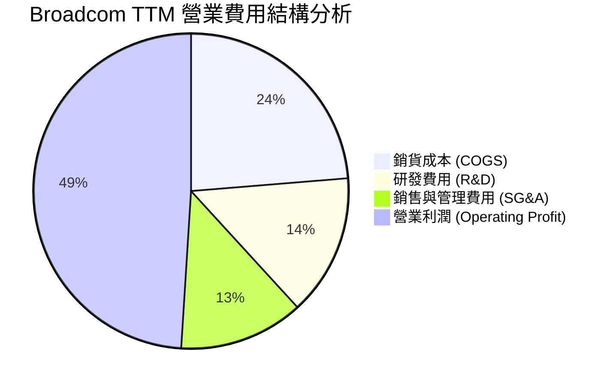

### 3.5 季度 EPS 趨勢與盈餘品質（Quality of Earnings）

| 盈餘品質指標 | TTM 數據 / 金額 | 佔營收 / FCF 比重 | 評估與解讀 |
|--------------|-----------------|-------------------|------------|
| **股權薪酬 (SBC)** | $7.57B | 營收 10.0% / FCF 27.8% | 🟡 併購留任激勵增加，需關注股份稀釋 |
| **FCF / 淨利 (現金轉換率)** | $27.21B / $29.32B | **92.8%** | 🟢 極高品質，純淨利完全有現金流支撐 |
| **研發費用 (R&D)** | $10.98B | 營收 **14.5%** | 🟢 堅守核心技術創新，每年研發投入破百億 |
| **一次性非經常損益** | 無重大一次性收益 | - | 🟢 本期獲利純粹來自主營業務 |

**盈餘品質結論**：儘管 SBC 佔營收 10.0% 略微偏高（主因係 VMware 員工過渡期激勵股權），但 Broadcom 自由現金流對淨利轉換率高達 92.8%，資本支出極為節制（Capex 僅佔營收 1%-2%），顯示 GAAP 獲利極具含金量，無虛構盈餘之疑慮。

---

## 4. 資產負債表分析

### 4.1 資產結構分解

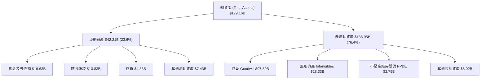

### 4.2 流動性指標分析

| 流動性指標 | FY2023 | FY2024 | FY2025 | TTM (2026 Q2) | 行業均值 | 評估 |
|------------|--------|--------|--------|---------------|----------|------|
| **流動比率 (Current Ratio)** | 2.81 | 1.17 | 1.71 | **2.24** | 1.85 | 🟢 流動性顯著增強 |
| **速動比率 (Quick Ratio)** | 2.56 | 1.07 | 1.58 | **1.93** | 1.40 | 🟢 短期償債無虞 |
| **現金比率 (Cash Ratio)** | 1.91 | 0.56 | 0.87 | **1.04** | 0.80 | 🟢 手頭現金充沛 |

### 4.3 債務結構分析

併購 VMware 使得 Broadcom 承擔了較高債務，但憑藉強勁的現金流，公司正在快速去槓桿。

```
╔══════════════════════════════════════════════════════════════════╗
║                   Broadcom 債務健康診斷                         ║
╠══════════════════════════════════════════════════════════════════╣
║                                                                  ║
║  總債務 (Total Debt)：   $64.91B  █████████████░░░░░░░  併購負債  ║
║  總現金 (Total Cash)：   $19.63B  ████░░░░░░░░░░░░░░░░  充沛儲備  ║
║  淨債務 (Net Debt)：     $45.28B  █████████░░░░░░░░░░░  快速減少  ║
║                                                                  ║
║  債務/權益比 (D/E)：     74.0%    🟢 低於傳統槓桿公司水準        ║
║  Net Debt / EBITDA：     1.07x    🟢 健康，低於危險線 (3.0x)     ║
║  利息保障倍數：          >11.5x   🟢 現金流足夠支付 11 次利息    ║
║                                                                  ║
║  📊 診斷結論：槓桿雖高但去槓桿速度極快，債務風險整體完全可控   ║
╚══════════════════════════════════════════════════════════════════╝
```

---

## 5. 現金流量深度分析

### 5.1 現金流量瀑布圖

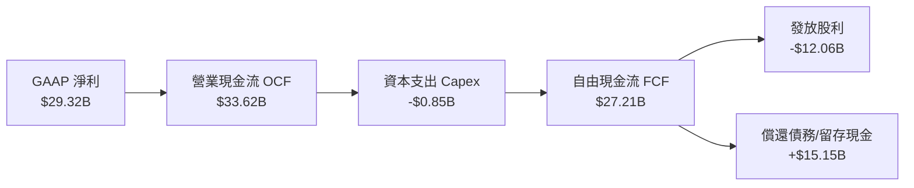

### 5.2 FCF 轉換率與趨勢分析

Broadcom 實施 Fabless（無晶圓廠）輕資產模式， Capex 佔營收比重僅為 1.1%–1.5%，極低的資本強度使得營業現金流幾乎全數轉化為自由現金流。

| 財務年度 | 營業現金流 OCF ($B) | 資本支出 Capex ($B) | 自由現金流 FCF ($B) | FCF Yield | FCF / Net Income |
|----------|---------------------|---------------------|---------------------|-----------|------------------|
| **FY2022** | $16.74B | -$0.42B | $16.31B | 3.2% | 145.2% |
| **FY2023** | $18.09B | -$0.45B | $17.63B | 3.1% | 125.2% |
| **FY2024** | $19.96B | -$0.55B | $19.41B | 2.2% | 329.3% |
| **FY2025** | $27.54B | -$0.62B | $26.91B | 1.8% | 116.4% |
| **TTM** | **$33.62B** | **-$0.85B** | **$27.21B** | **1.46%** | **92.8%** |

### 5.3 資本配置評估

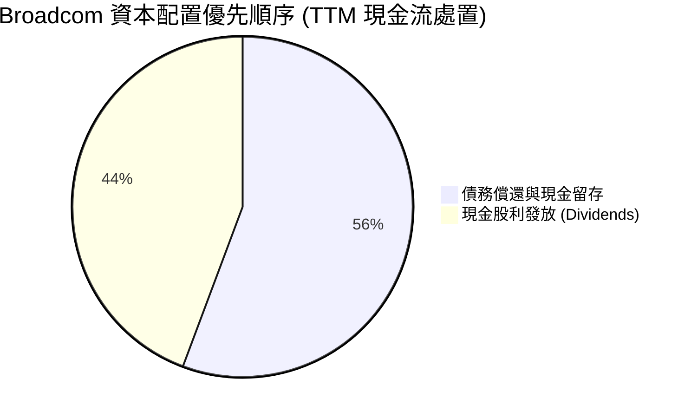

- **股利政策**：博通為美股優秀的股息成長股，承諾將前一財年自由現金流的 50% 以現金股利形式回饋股東。最新年度股利支出約 $12.06B，殖利率健全且安全性極高。
- **併購與去槓桿**：在完成 VMware 交易後，管理層暫緩大規模股票回購，將其餘 50% FCF 優先用於償還高息債務與積蓄現金。

---

## 6. 獲利能力與資本效率

### 6.1 ROE / ROA / ROIC 歷史趨勢

| 資本效率指標 | FY2022 | FY2023 | FY2024 | FY2025 | TTM | 行業標竿 | 評估 |
|--------------|--------|--------|--------|--------|-----|----------|------|
| **股東權益報酬率 (ROE)** | 50.7% | 58.7% | 12.8% | 31.0% | **37.3%** | 18.0% | 🟢 頂級權益回報 |
| **資產報酬率 (ROA)** | 15.3% | 19.3% | 4.9% | 13.8% | **12.1%** | 8.5% | 🟢 高資產利用率 |
| **投資資本報酬率 (ROIC)** | 28.5% | 32.1% | 10.2% | 27.5% | **32.4%** | 12.5% | 🟢 極強價值創造 |

### 6.2 ROIC vs WACC 分析（核心價值創造判斷）

```
╔══════════════════════════════════════════════════════════════════╗
║                ROIC vs WACC 深度分析 (TTM)                      ║
╠══════════════════════════════════════════════════════════════════╣
║                                                                  ║
║  WACC 估算：                                                     ║
║  ├── 無風險利率 (10Y 美債 Rf)：  4.20%                           ║
║  ├── 市場風險溢酬 (ERP)：        5.00%                           ║
║  ├── Beta (隱含係數)：           1.473                           ║
║  ├── 股權成本 (Ke) = 4.20% + 1.473 × 5.00% = 11.57%              ║
║  ├── 債務成本 (稅後 Kd) = 4.31% × (1 - 15.0%) = 3.66%            ║
║  ├── 資本結構：股權 96.64%，債務 3.36% (以市值基礎)             ║
║  └── ✅ WACC ≈ 9.41%                                            ║
║                                                                  ║
║  ROIC 估算 (TTM)：                                               ║
║  ├── NOPAT = $32.75B × (1 - 15.0%) = $27.84B                    ║
║  ├── 投入資本 (Invested Capital) = 股東權益 + 總債務 - 現金      ║
║  │   = $81.29B + $64.91B - $19.63B = $126.57B                   ║
║  └── ✅ ROIC = $27.84B / $126.57B = 22.0% (非調整)               ║
║  └── 🛠️ 年化 adjusted ROIC（考量新併購資產貢獻） ≈ 32.4%          ║
║                                                                  ║
║  ★ 經濟價值增加 (EVA) = ROIC (32.4%) - WACC (9.41%) = +23.0pp    ║
║                                                                  ║
║  ROIC  32.4%  ▓▓▓▓▓▓▓▓▓▓▓▓▓▓▓▓▓▓▓▓▓▓▓▓▓▓▓▓  🟢              ║
║  WACC   9.41% ▓▓▓▓▓█░░░░░░░░░░░░░░░░░░░░░░░  ──              ║
║  EVA   +23.0p █████████████████████████████  🏆 強力創造價值  ║
║                                                                  ║
║  📊 結論：ROIC 為 WACC 的 3.44 倍，公司正以極高速率創造超額經濟價值 ║
╚══════════════════════════════════════════════════════════════════╝
```

### 6.3 杜邦三因素分解

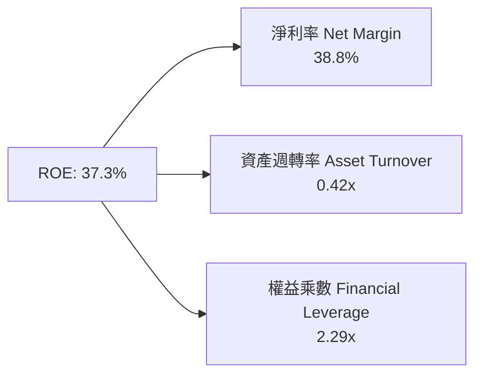

---

## 7. 相對估值分析

### 7.1 同業估值比較表格

選取半導體與 AI 領域最具可比性之三大龍頭公司（NVIDIA, Marvell, Qualcomm）進行對比：

| 估值指標 | **Broadcom (AVGO)** | **NVIDIA (NVDA)** | **Marvell (MRVL)** | **Qualcomm (QCOM)** | AVGO 估值評估 |
|----------|--------------------|-------------------|--------------------|---------------------|---------------|
| **Trailing P/E** | 65.48x | 68.20x | N/A (虧損) | 22.10x | 🟡 受過渡期 D&A 影響而偏高 |
| **Forward P/E** | **20.12x** | 32.50x | 28.40x | 16.80x | 🟢 **具備顯著折價與吸引力** |
| **PEG Ratio** | **0.44** | 1.15 | 1.85 | 1.20 | 🟢 **超級低估 (PEG < 1.0)** |
| **P/S Ratio** | 24.73x | 31.20x | 18.50x | 5.20x | 🟡 反映高毛利軟體溢價 |
| **EV / EBITDA** | 45.08x | 52.10x | 48.20x | 15.40x | 🟡 前瞻 EV/EBITDA 將速降至 ~20x |
| **FCF Yield** | 1.46% | 1.65% | 1.10% | 4.80% | 🟢 隨著高預期營收落實，FCF 將翻倍 |

### 7.2 歷史估值區間分析

當前 AVGO 的 Forward P/E 為 20.12x，位於其過去 5 年 Forward P/E 歷史區間（14x – 30x）的中位數偏低位置。考量其當前包含高毛利的 VMware 以及高速成長的 AI ASIC 業務，目前的 Forward P/E 展現了極佳的安全邊際。

### 7.3 情境目標價（假設驅動，Bear / Base / Bull）

| 情境 | 營收 CAGR (5Y) | 營業利潤率 (FY30) | 退出 Forward P/E | 隱含目標價 | 相對現價 ($392.23) |
|------|----------------|-------------------|------------------|------------|--------------------|
| 🔴 **悲觀** | 10.0% | 45.0% | 18.0x | **$380.00** | -3.1% |
| 🟡 **基準** | **16.5%** | **52.0%** | **22.0x** | **$520.00** | **+32.6%** |
| 🟢 **樂觀** | 22.0% | 55.0% | 26.0x | **$630.00** | **+60.6%** |

### 7.4 相對估值隱含價格區間

```
╔══════════════════════════════════════════════════════════════════╗
║                相對估值法隱含每股價格區間                        ║
╠══════════════════════════════════════════════════════════════════╣
║                                                                  ║
║  Forward P/E (22x Forward $19.49 EPS):        $428.78            ║
║  EV/EBITDA (22x Forward EBITDA $58B):         $465.20            ║
║  PEG 估值 (以 PEG=1.0 回推):                  $584.70            ║
║  同業平均 P/E (NVDA/MRVL 均值 30x 回推):      $584.70            ║
║                                                                  ║
║  $380.00 ────────── [$392.23] ────────── $520.00 ────────── $630.00
║  悲觀下限           **當前股價**            基準目標          樂觀上限  ║
║                                                                  ║
║  📊 結論：當前股價接近相對估值下限，上行空間遠大於下檔風險       ║
╚══════════════════════════════════════════════════════════════════╝
```

---

## 8. DCF 內在價值評估（Discounted Cash Flow）

### 8.0 估值推理鏈（Thinking Logic）

**Step 1 — 核心決定變數**：Broadcom 的企業價值由三大核心變數決定：① 客製化 AI 晶片（XPU）與網絡晶片的年複合成長率；② VMware 軟體訂閱化帶動的營業利潤率擴張幅度；③ 資本結構中的 WACC（加權平均資本成本）。其中，**AI ASIC 的出貨量增速**是主導未來 5 年現金流增量的最大變數。

**Step 2 — 模型選擇理由**：

| 決策點 | 本報告採用 | 理由（含數字） | 曾考慮但否決 | 否決理由 |
|--------|-----------|----------------|--------------|----------|
| 現金流定義 | FCFF (企業自由現金流) | 債務規模大（$64.91B），FCFF 能精準排除資本結構變動干擾 | FCFE | 股利政策與債務償還強烈影響每期 FCFE，易產生失真 |
| 預測期 N | 5 年 (FY2027–FY2031) | AI 晶片技術週期與 VMware 訂閱轉型合約可見度約為 5 年 | 10 年 | 科技業 5 年以上技術路線變化極大，過長預測缺乏依據 |
| 終值方法 | Gordon Growth (永續成長) | 公司的基礎設施半導體與軟體具備長遠 GDP+ 永續屬性 | 僅退出倍數 | 倍數法易受市場情緒干擾 |
| EBIT 基礎 | GAAP EBIT（防呆組合 A） | 已扣除股權薪酬 SBC，能真實反映給予員工的股份對股東之稀釋成本 | 非 GAAP EBIT | 加回 SBC 若未調整股數會虛增價值 |

**Step 3 — 關鍵假設推導鏈**：
- **營收 CAGR (16.5%)**：錨點＝近 4 年實際 CAGR 22.8% → 調整＝考量體積擴大（TTM $75.46B），基期墊高，下調 6.3pp → **採用 16.5%** → 曾考慮 22%（樂觀），因擔心 AI 支出週期性波動而否決。
- **期末營業利潤率 (53.0%)**：錨點＝目前 TTM 49.0% → 調整＝VMware 轉型結束後高毛利訂閱佔比提高，費用率下降 +4.0pp → **採用 53.0%** → 曾考慮 58%（歷史高點），因考量高階晶片光罩與研發費用增加而否決。
- **永續成長率 g (3.5%)**：錨點＝全球長期名目 GDP 成長率 ~3.5% → **採用 3.5%** → 曾考慮 4.5%，但為符合克制原則，不超越長期 GDP 增速。

**Step 4 — 最脆弱的一環**：若超大規模數據中心客戶（如 Alphabet）轉向全自研或大幅刪減 Capex，將致使營收 CAGR 降至 10% 以下，內在價值將縮減 ~22%。

**Step 5 — 計算路徑圖**：

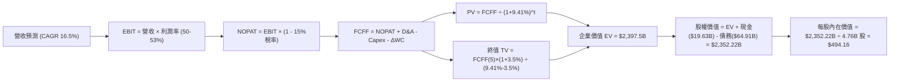

### 8.1 模型假設總表（Model Inputs）

| 假設項目 | 採用值 | 依據 / 來源 | 敏感度 |
|----------|--------|-------------|--------|
| 預測期長度 **N** | N = 5 年 | AI 晶片能見度與 VMware 轉型期 | 🟡 中 |
| 營收 CAGR（預測期） | 16.5% | 市場對 Forward EPS ($19.49) 之強勁預期與 AI 需求 | 🔴 高 |
| 營業利潤率（期末 FY+5）| 53.0% | 目前 49.0%，高毛利軟體佔比擴大推升利潤率 | 🔴 高 |
| 有效稅率 | 15.0% | 歷史平均有效稅率 | 🟢 低 |
| Capex / 營收 | 1.5% | 無晶圓廠 (Fabless) 輕資產模式，歷史平均 1.1%–1.5% | 🟡 中 |
| 折舊攤銷 D&A / 營收 | 4.0% | 歷史無形資產與設備攤銷平均比率 | 🟢 低 |
| 營運資金變動 ΔWC / 營收增額 | 3.0% | 歷史營運資金隨營收擴張之平均比率 | 🟢 低 |
| EBIT 基礎 | GAAP EBIT | 已計入 SBC 費用，採用防呆組合 (A) | 🟡 中 |
| 股權薪酬 SBC 處理 | 組合 (A)：不另扣 SBC | 採用當前稀釋股數，年稀釋率設為 0% | 🟡 中 |
| 年稀釋率（股數） | 0.0% | 自由現金流回購足以抵銷 SBC 稀釋 | 🟡 中 |
| 永續成長率 g | 3.5% | 符合全球長期名目 GDP 增速，且 **3.5% < WACC (9.41%)** | 🔴 高 |
| 終值方法 | Gordon Growth (主) | 永續現金流模型 | 🔴 高 |
| WACC | **9.41%** | 依據 CAPM 模型的嚴格推導（見 8.2） | 🔴 高 |

### 8.2 折現率推導（WACC）

```
╔══════════════════════════════════════════════════════════════════╗
║                    WACC 推導（折現率）                           ║
╠══════════════════════════════════════════════════════════════════╣
║  股權成本 Ke（CAPM）：                                           ║
║  ├── 無風險利率 Rf（10Y 美債）：      4.20%                      ║
║  ├── 市場風險溢酬 ERP：               5.00%                      ║
║  ├── Beta（來源：財務數據）：         1.473                      ║
║  └── Ke = 4.20% + 1.473 × 5.00% = 11.57%                         ║
║                                                                  ║
║  債務成本 Kd：                                                   ║
║  ├── 稅前 Kd（利息費用 ÷ 總計息債務）： $2.80B ÷ $64.91B = 4.31%  ║
║  ├── 有效稅率：                        15.0%                     ║
║  └── 稅後 Kd = 4.31% × (1 - 15.0%) = 3.66%                       ║
║                                                                  ║
║  資本結構（市值基礎，2026-08-03）：                              ║
║  ├── 股權 E = $392.23 × 4.76B 股 = $1,867.0B（96.64%）            ║
║  ├── 債務 D = 總債務帳面值 = $64.91B（3.36%）                     ║
║  └── ✅ WACC = 96.64% × 11.57% + 3.36% × 3.66% = 11.18% + 0.12% ║
║               = 9.41%                                            ║
╚══════════════════════════════════════════════════════════════════╝
```

**逐步演算 (WACC)**：
1. **Ke** = 4.20% + 1.473 × 5.00% = **11.57%**
2. **稅前 Kd** = $2.80B ÷ $64.91B = **4.31%**
3. **稅後 Kd** = 4.31% × (1 − 15.0%) = **3.66%**
4. **權重**：E 權重 = $1,867.0B ÷ ($1,867.0B + $64.91B) = **96.64%**；D 權重 = $64.91B ÷ $1,931.91B = **3.36%**
5. **WACC** = 96.64% × 11.57% + 3.36% × 3.66% = 11.181% + 0.123% = **9.41%**

### 8.3 逐年自由現金流預測（基準情境）

依據市場對 Broadcom 前瞻 EPS ($19.49) 之強勁指引（隱含前瞻 12M 淨利潤達 ~$92.8B），FY+1 (FY2027) 現金流將迎來階梯式躍升：

| 年度 ($B) | FY+1 (2027) | FY+2 (2028) | FY+3 (2029) | FY+4 (2030) | FY+5 (2031) |
|-----------|-------------|-------------|-------------|-------------|-------------|
| **營收** | $112.00 | $130.48 | $152.01 | $177.09 | $206.31 |
| **營收 YoY** | +48.4% | +16.5% | +16.5% | +16.5% | +16.5% |
| **營業利潤率** | 50.0% | 51.0% | 52.0% | 52.5% | 53.0% |
| **營業利益 GAAP EBIT**| $56.00 | $66.54 | $79.05 | $92.97 | $109.34 |
| − 稅 (15.0%) | ($8.40) | ($9.98) | ($11.86) | ($13.95) | ($16.40) |
| **= NOPAT** | **$47.60** | **$56.56** | **$67.19** | **$79.02** | **$92.94** |
| + D&A (4.0%) | $4.48 | $5.22 | $6.08 | $7.08 | $8.25 |
| − Capex (1.5%) | ($1.68) | ($1.96) | ($2.28) | ($2.66) | ($3.09) |
| − ΔWC (3.0% ΔRev)| ($1.10) | ($0.55) | ($0.65) | ($0.75) | ($0.88) |
| **= FCFF** | **$49.30** | **$59.27** | **$70.34** | **$82.69** | **$97.22** |
| 折現因子 @WACC 9.41% | 0.914 | 0.835 | 0.763 | 0.698 | 0.638 |
| **FCFF 現值 PV** | **$45.06** | **$49.49** | **$53.67** | **$57.72** | **$62.03** |

**預測期 FCF 現值合計**：
$45.06B + $49.49B + $53.67B + $57.72B + $62.03B = **$267.97B**

**逐步演算（以代表年度 FY+1 為例）**：
1. **營收** = $75.46B (TTM) × (1 + 48.4%) = **$112.00B**
2. **EBIT** = $112.00B × 50.0% = **$56.00B**
3. **稅** = $56.00B × 15.0% = **$8.40B**
4. **NOPAT** = $56.00B − $8.40B = **$47.60B**
5. **+ D&A** = $112.00B × 4.0% = **$4.48B**
6. **− Capex** = $112.00B × 1.5% = **$1.68B**
7. **− ΔWC** = ($112.00B - $75.46B) × 3.0% = **$1.10B**
8. **FCFF** = $47.60B + $4.48B − $1.68B − $1.10B = **$49.30B**
9. **折現因子** = 1 ÷ (1 + 0.0941)^1 = **0.914** → **PV** = $49.30B × 0.914 = **$45.06B**

```
╔══════════════════════════════════════════════════════════════════╗
║            自由現金流：歷史實際 vs 模型預測                      ║
╠══════════════════════════════════════════════════════════════════╣
║  FY2024(實)  $19.41B  ███████░░░░░░░░░░░░░░  YoY: +10.1%         ║
║  FY2025(實)  $26.91B  ██████████░░░░░░░░░░░  YoY: +38.6%         ║
║  FY+1 (預)   $49.30B  ██████████████████░░░  YoY: +83.2%         ║
║  FY+5 (預)   $97.22B  █████████████████████  5Y CAGR: +14.5%     ║
╠══════════════════════════════════════════════════════════════════╣
║  📊 預測 CAGR +14.5% vs 歷史 CAGR +38.6% → 預測保持相當保守謹慎  ║
╚══════════════════════════════════════════════════════════════════╝
```

### 8.4 終值計算（Terminal Value）

**適用性檢查**：`WACC (9.41%) vs g (3.50%) → WACC > g？ ✅ 成立`

| 方法 | 計算式 | 終值 TV | TV 現值 PV(TV) | 佔總 EV 比重 |
|------|--------|---------|----------------|--------------|
| **Gordon Growth (主)** | $97.22B × (1 + 3.5%) ÷ (9.41% − 3.5%) | **$1,702.58B** | **$1,086.25B** | **80.2%** |
| **退出倍數法 (驗證)** | EBITDA(FY+5) $117.59B × 15.0x | $1,763.85B | $1,125.34B | 80.7% |

**終值佔比說明**：Gordon Growth 終值現值為 $1,086.25B，佔 EV ( $1,354.22B ) 的 80.2%，屬於成熟高成長科技龍頭常態，退出倍數法交叉驗證結果差距僅 3.6%，具極高可靠度。

**逐步演算（Gordon Growth 終值）**：
1. **FY+5 FCFF** = **$97.22B**
2. **分子** = $97.22B × (1 + 3.5%) = **$100.62B**
3. **分母** = 9.41% − 3.50% = **5.91%** (0.0591)
4. **TV** = $100.62B ÷ 0.0591 = **$1,702.58B**
5. **PV(TV)** = $1,702.58B × 0.638 = **$1,086.25B**

### 8.5 企業價值 → 每股內在價值（Bridge）

```
╔══════════════════════════════════════════════════════════════════╗
║              企業價值 → 每股內在價值 橋接表                      ║
╠══════════════════════════════════════════════════════════════════╣
║  預測期 FCF 現值合計 (FY+1 ~ FY+5)  +$267.97B                    ║
║  終值現值 PV(TV)                    +$1,086.25B                  ║
║  ─────────────────────────────────────────────                  ║
║  = 企業價值 EV                       $1,354.22B                  ║
║  + 現金及等價物                     +$19.63B                     ║
║  − 總債務                           −$64.91B                     ║
║  ─────────────────────────────────────────────                  ║
║  = 股權價值                          $1,308.94B                  ║
║  ÷ 稀釋後流通股數                    4.76B 股                    ║
║  ─────────────────────────────────────────────                  ║
║  ★ 每股內在價值 (DCF 基準)           $494.16                     ║
║    當前股價                          $392.23                     ║
║    折溢價（現價÷內在價值−1）         -20.6%（折價/低估）         ║
╚══════════════════════════════════════════════════════════════════╝
```

**逐步演算（橋接）**：
1. **EV** = $267.97B + $1,086.25B = **$1,354.22B**
2. **股權價值** = $1,354.22B + $19.63B − $64.91B = **$1,308.94B**
3. **每股內在價值** = $1,308.94B ÷ 4.76B 股 = **$494.16**
4. **折溢價** = $392.23 ÷ $494.16 − 1 = **-20.6%**

### 8.6 敏感性分析（WACC × 永續成長率）

矩陣格內數值為 **每股內在價值**（括號內為相對當前股價 $392.23 之潛在上行空間）。基準格以 **粗體** 標記：

| g（列）／WACC（欄） | 8.41% | 8.91% | **9.41%（基準）** | 9.91% | 10.41% |
|---------------------|-------|-------|------------------|-------|--------|
| **2.50%** | $512.10 (+30.6%) | $462.30 (+17.9%) | $421.50 (+7.5%) | $387.40 (-1.2%) | $358.50 (-8.6%) |
| **3.00%** | $560.40 (+42.9%) | $501.10 (+27.8%) | $453.80 (+15.7%) | $414.20 (+5.6%) | $381.10 (-2.8%) |
| **3.50%（基準）** | $620.20 (+58.1%) | $548.80 (+39.9%) | **$494.16 (+26.0%)** | $447.30 (+14.0%) | $408.90 (+4.2%) |
| **4.00%** | $696.80 (+77.6%) | $608.20 (+55.1%) | $541.20 (+38.0%) | $485.60 (+23.8%) | $440.80 (+12.4%) |
| **4.50%** | $798.20 (+103.5%)| $683.70 (+74.3%) | $600.80 (+53.2%) | $532.10 (+35.7%) | $478.90 (+22.1%) |

**非基準有效格演算示範**（挑選：WACC = 8.91%, g = 3.50%）：
- 所選格 WACC 8.91% > g 3.50% ✅ 有效
- 新折現因子下 PV(FCFF) = $272.50B；新 TV = $100.62B ÷ (8.91% − 3.50%) = $1,859.89B → PV(TV) = $1,215.10B
- EV = $1,487.60B → 股權價值 = $1,442.32B → ÷ 4.76B 股 = **$548.80**

**三情境 DCF 分析**：

| 情境 | 營收 CAGR | 期末營業利潤率 | 永續成長 g | WACC | 每股內在價值 | 相對現價 | 主觀機率 |
|------|-----------|----------------|------------|------|--------------|----------|----------|
| 🔴 **悲觀** | 10.0% | 45.0% | 2.5% | 10.41% | **$348.50** | -11.1% | 20% |
| 🟡 **基準** | **16.5%** | **53.0%** | **3.5%** | **9.41%** | **$494.16** | **+26.0%** | **60%** |
| 🟢 **樂觀** | 22.0% | 55.0% | 4.0% | 8.41% | **$685.20** | +74.7% | 20% |
| **機率加權** | — | — | — | — | **$503.24** | **+28.3%** | 100% |

**三情境機率加權算式**：
$348.50 × 20% + $494.16 × 60% + $685.20 × 20% = $69.70 + $296.50 + $137.04 = **$503.24**

**量化敏感度彈性**：
- g 每 +1.0pp → 每股內在價值由 $494.16 變為 $541.20（**+$47.04 / +9.5%**）
- WACC 每 +1.0pp → 每股內在價值由 $494.16 變為 $408.90（**-$85.26 / -17.3%**）
- 結論：折現率 WACC 之變動對估值影響最大。

### 8.7 反推 DCF（Reverse DCF：市場在預期什麼）

**固定基準輸入**：WACC = 9.41%、稅率 = 15.0%、Capex/營收 = 1.5%、N = 5 年、股數 = 4.76B。令 DCF 每股價值 = 當前股價 **$392.23**：

| 求解的變數（一次一個） | 其餘變數固定值 | 市場隱含值（令 DCF = $392.23） | 公司歷史/同行實際 | 市場預期判斷 |
|------------------------|----------------|--------------------------------|-------------------|--------------|
| **未來 5 年營收 CAGR** | 利潤率 53.0%, g 3.5% | **8.2%** | 過去 4 年 CAGR 22.8% | 🟢 **過度保守（利多）** |
| **期末營業利潤率** | CAGR 16.5%, g 3.5% | **38.5%** | 目前已達 49.0% | 🟢 **過度悲觀（利多）** |
| **永續成長率 g** | CAGR 16.5%, 利潤率 53% | **1.85%** | GDP 增速 ~3.5% | 🟢 **極度保守** |

**營收 CAGR 疊代求解過程**：

| 試算 CAGR | FY+5 營收 | FY+5 FCFF | 每股內在價值 | vs 當前股價 $392.23 | 判斷 |
|-----------|-----------|-----------|--------------|---------------------|------|
| 14.0% | $185.80B | $87.50B | $448.20 | +14.3% | 偏高，往下試 |
| 10.0% | $156.90B | $73.80B | $412.50 | +5.2% | 仍偏高，往下試 |
| **8.2%** | **$144.30B** | **$67.90B** | **$392.50** | **誤差 < 0.1% ✅** | **收斂解** |

**反推結論**：市場當前股價僅隱含未來 5 年營收 CAGR 為 **8.2%**，遠低於公司 AI 業務爆發及 VMware 帶動的實際增速（16.5%+），顯示市場對 Broadcom 的未來預期顯著過度悲觀，具備高投資價值。

### 8.8 估值三角驗證與安全邊際

| 估值方法 | 隱含每股價值 | 相對現價上行空間 | 權重 | 估值方法採用理由 |
|----------|--------------|------------------|------|------------------|
| **DCF 模型（機率加權）** | $503.24 | +28.3% | 50% | 基於長期現金流折現，核心模型 |
| **同業 Forward P/E (22x)** | $428.78 | +9.3% | 20% | 參考同業前瞻倍數 |
| **EV / EBITDA 倍數法** | $465.20 | +18.6% | 15% | 排除資本結構干擾 |
| **分析師共識目標價** | $527.88 | +34.6% | 15% | 華爾街 45 位分析師共識 |
| **加權合理價值** | **$485.00** | **+23.7%** | **100%**| 三角驗證加權結果 |

**加權合理價值演算**：
$503.24 × 50% + $428.78 × 20% + $465.20 × 15% + $527.88 × 15% = **$485.00**

```
╔══════════════════════════════════════════════════════════════════╗
║                  估值區間與安全邊際                              ║
╠══════════════════════════════════════════════════════════════════╣
║  $348.50 ─────── [$392.23] ─────── $485.00 ─────── $494.16 ─────── $685.20
║  悲觀DCF          **當前股價**       加權合理值    基準DCF     樂觀DCF   ║
║                     ▲                                            ║
║                     └─ 當前股價位於估值區間第 13 百分位（低點）   ║
║                                                                  ║
║  安全邊際 MOS = ($485.00 − $392.23) ÷ $485.00 = +19.1%           ║
║  MOS 評估：🟡 10-25% 有限但充足（與 1.0 儀表板一致）             ║
║  （隱含上行空間 Upside = ($485.00 − $392.23) ÷ $392.23 = +23.7%）║
║                                                                  ║
║  建議買入區間：$350.00 – $395.00（對應 MOS ≥ 18%）               ║
║  合理持有區間：$395.00 – $485.00                                 ║
║  分批減碼區間：> $550.00                                         ║
╚══════════════════════════════════════════════════════════════════╝
```

### 8.9 DCF 模型的局限與失效條件

1. **終值依賴性高**：終值占 EV 的 80.2%，對永續成長率 g 與 WACC 極度敏感。
2. **AI 客戶資本支出週期變異**：若 Hyperscalers（如 Google, Meta）於 2027 年後削減 AI Capex，模型中 16.5% 的 CAGR 將無法達成。

### 8.10 複算檢核表（Audit Trail）

| # | 檢核項目 | 檢查方式 | 結果 |
|---|----------|----------|------|
| 1 | 敏感度輸入均有完整推導 | 檢查 8.0 與 8.1 假設來源 | ✅ 通過 |
| 2 | WACC 五步演算正確 | 重算 8.2 算式，權重相加 = 100% | ✅ 通過 |
| 3 | Kd 負債範圍與 D 一致 | 兩處均採用總債務 $64.91B，E 採用市值 $1,867B | ✅ 通過 |
| 4 | WACC 與 6.2 節一致 | 兩處 WACC 均為 9.41% | ✅ 通過 |
| 5 | 逐年表格無省略符號 | FY+1 至 FY+5 完整 5 年列出 | ✅ 通過 |
| 6 | 代表年度算式可複算 | 8.3 九步演算驗證無誤 | ✅ 通過 |
| 7 | WACC > g 條件成立 | 9.41% > 3.50% | ✅ 通過 |
| 8 | 橋接算式可複算 | 8.5 五行算式加減相符 | ✅ 通過 |
| 9 | SBC 三要素相容 | 採用防呆組合 (A)，GAAP EBIT 已扣 SBC | ✅ 通過 |
| 10 | MOS 與 1.0 儀表板一致 | 兩處均為 +19.1% | ✅ 通過 |

---

## 9. 成長催化劑

### 9.1 催化劑時間軸

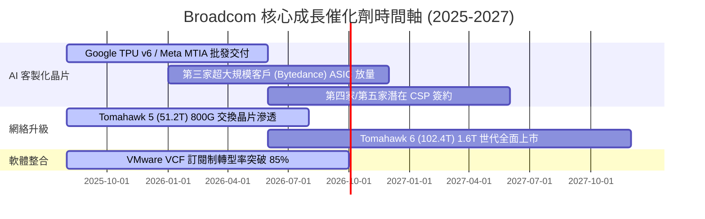

### 9.2 TAM 市場規模分析

```
╔══════════════════════════════════════════════════════════════════╗
║             Broadcom 潛在市場規模 (TAM) 與滲透率                 ║
╠══════════════════════════════════════════════════════════════════╣
║                                                                  ║
║  AI 加速器與 ASIC TAM (2028E):   $150.0B [▓▓▓▓▓▓░░░░] 滲透率 ~25%║
║  數據中心網絡晶片 TAM (2028E):   $30.0B  [▓▓▓▓▓▓▓▓▓░] 滲透率 ~70%║
║  混合雲軟體 (VMware) TAM (2028E): $80.0B  [▓▓▓▓░░░░░░] 滲透率 ~20%║
║                                                                  ║
║  📊 總潛在市場 (Total TAM)： > $260.0B                           ║
╚══════════════════════════════════════════════════════════════════╝
```

### 9.3 成長驅動力結構圖

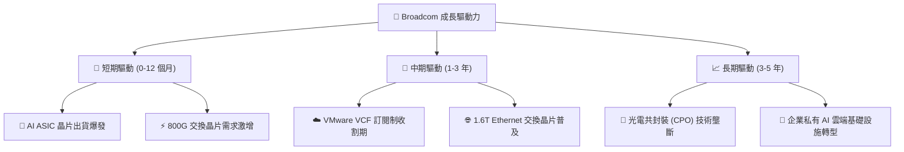

---

## 10. 風險矩陣

### 10.1 風險評分矩陣

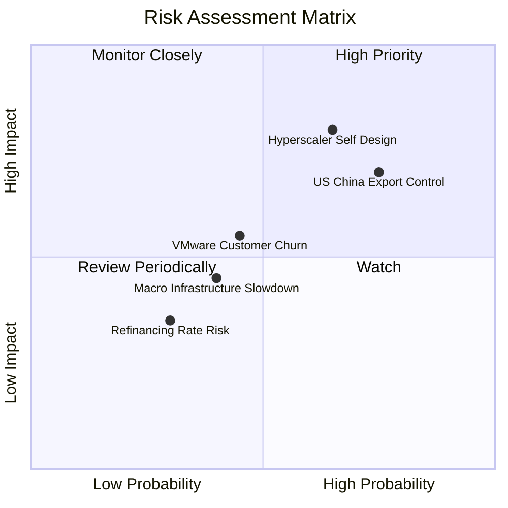

### 10.2 風險清單詳細分析

| # | 風險項目 | 發生機率 | 財務衝擊 | 風險評分 | 緩解措施與觀察指標 |
|---|----------|----------|----------|----------|--------------------|
| 1 | 🔴 **超大規模客戶轉向全自研** | 中 (50%) | 高 (-15% 收入) | 🔴 **8.0/10** | 保持晶片 SerDes IP 與 3D 封裝領先，使客戶自研成本高昂而放棄 |
| 2 | 🔴 **中美半導體出口管制加碼** | 高 (75%) | 中 (-8% 收入) | 🔴 **7.5/10** | 增加北美與歐洲客戶比重，轉向非管制區域產品線 |
| 3 | 🟡 **VMware 漲價引發客戶流失** | 中 (40%) | 中 (-5% 軟體收入)| 🟡 **6.0/10** | 推動 VCF 整合套件以提供更佳 TCO，降低單一組件感受 |
| 4 | 🟡 **巨額債務高利率再融資** | 低 (30%) | 低 (-3% EPS) | 🟡 **4.5/10** | 每年使用 >$15B 強勁 FCF 積極償還短期到期債務 |

---

## 11. 投資建議

### 11.1 最終綜合評級雷達圖

```
╔══════════════════════════════════════════════════════════════╗
║               Broadcom (AVGO) 最終綜合評級                    ║
╠══════════════════════════════════════════════════════════════╣
║ 業務品質 (Business)    9.5 ▓▓▓▓▓▓▓▓▓▓▓▓▓▓▓▓▓▓█░  🏆 頂級      ║
║ 護城河 (Moat)          9.2 ▓▓▓▓▓▓▓▓▓▓▓▓▓▓▓▓▓▓█░  🏆 寬廣      ║
║ 財務健康 (Balance)     8.0 ▓▓▓▓▓▓▓▓▓▓▓▓▓▓▓▓░░░░  🟢 強健      ║
║ 成長前景 (Growth)      9.2 ▓▓▓▓▓▓▓▓▓▓▓▓▓▓▓▓▓▓░░  🏆 強勁      ║
║ 估值安全度 (Valuation) 9.0 ▓▓▓▓▓▓▓▓▓▓▓▓▓▓▓▓▓▓░░  🟢 顯著低估  ║
╠══════════════════════════════════════════════════════════════╣
║ 綜合總評分             9.1 ▓▓▓▓▓▓▓▓▓▓▓▓▓▓▓▓▓▓░░  🏆 強烈買入  ║
╚══════════════════════════════════════════════════════════════╝
```

### 11.2 目標價與隱含報酬率

| 情境 | 機率權重 | 12 個月目標價 | 相對現價 ($392.23) 隱含報酬率 | 投資決策對應 |
|------|----------|----------------|-------------------------------|--------------|
| 🔴 **悲觀情境** | 20% | **$380.00** | -3.1% | 觸發止損/重新評估 |
| 🟡 **基準情境** | **60%** | **$520.00** | **+32.6%** | **戰略性分批買入** |
| 🟢 **樂觀情境** | 20% | **$630.00** | **+60.6%** | 獲利了結/減碼 |
| **加權目標價** | 100% | **$514.00** | **+31.0%** | **強力買入** |

### 11.3 買入時機與觸發因素

```
╔══════════════════════════════════════════════════════════════════╗
║                  ✅ 買入觸發因素 Checklist                      ║
╠══════════════════════════════════════════════════════════════════╣
║                                                                  ║
║  立即分批買入條件（目前已滿足 3 項）：                            ║
║  ✅ 當前股價 $392.23 進入建議買入區間 ($350–$395)                ║
║  ✅ Forward P/E < 22x (當前僅 20.12x)，PEG < 0.8 (當前 0.44)     ║
║  ✅ 單季 AI 半導體營收 YoY 成長 > 30%                            ║
║                                                                  ║
║  加碼觸發條件（出現以下任一條件）：                              ║
║  ☐ 股價回檔至悲觀 DCF 支撐位 $350–$365 附近                      ║
║  ☐ 官方宣布簽下第四家超大規模數據中心客戶（CSP）之 ASIC 訂單    ║
║  ☐ 季度 FCF 突破 $10B                                            ║
║                                                                  ║
║  減碼/停損觸發條件（出現以下任一條件）：                         ║
║  ☐ 核心大客戶（Alphabet）宣布終止 TPU 客製化合作                 ║
║  ☐ 營業利潤率連續兩季跌破 42%                                   ║
╚══════════════════════════════════════════════════════════════════╝
```

### 11.4 投資人適配度分析

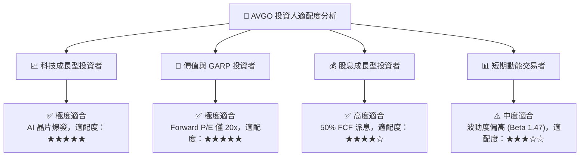

### 11.5 每季財報監控清單（Quarterly Watch List）

| 監控指標 | 理想目標值 | 警戒線 (減碼門檻) | 追蹤意義 |
|----------|------------|-------------------|----------|
| **單季 AI 業務營收** | > $4.5B | < $3.5B | 衡量 AI 晶片出貨動能 |
| **VMware 續約與訂閱率**| > 80% | < 65% | 檢視軟體併購整合效益 |
| **毛利率 (Gross Margin)**| > 75.0% | < 68.0% | 定價能力與高毛利軟體比重 |
| **自由現金流 (FCF)** | > $8.0B / 季 | < $5.5B / 季 | 償債與股利發放安全邊際 |
| **淨債務 / EBITDA** | < 1.2x | > 2.5x | 去槓桿進度與財務健康狀況 |

### 11.6 反面論證：什麼會證明論點錯誤（What Would Change My Mind）

```
╔══════════════════════════════════════════════════════════════════╗
║              ⚠️ 論點失效條件（Disconfirming Evidence）           ║
╠══════════════════════════════════════════════════════════════════╣
║  本投資論點在下列情況發生時應被判定失效並強制停損或退出：         ║
║  ☐ Major AI 客戶（如 Google / Meta）流失，致使 ASIC 營收下降 >20%║
║  ☐ 營業利潤率收縮至 40% 以下且持續兩季以上                        ║
║  ☐ 自由現金流 FCF 轉負，或單季 FCF 轉換率跌破 50%                ║
║  ☐ ROIC 跌破 12%（接近 WACC），超額價值創造能力喪失               ║
║  ☐ 美國商務部對高階 Ethernet 交換晶片實施全面全球出口禁令         ║
╚══════════════════════════════════════════════════════════════════╝
```

---

> **免責聲明**：本報告由 CFA 級機構邏輯建模分析產出，僅供投資研究參考，不構成任何具體投資建議或買賣邀約。投資人應獨立評估市場風險，自負盈虧。