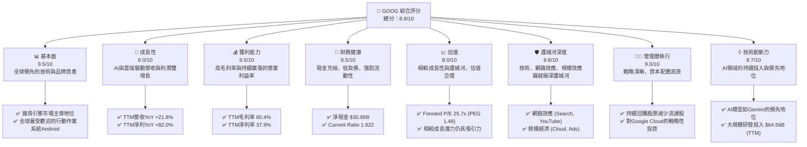
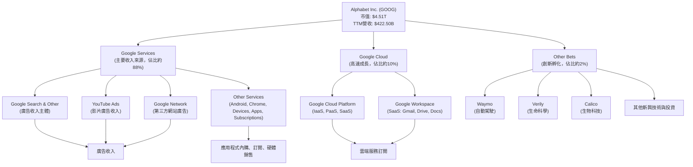
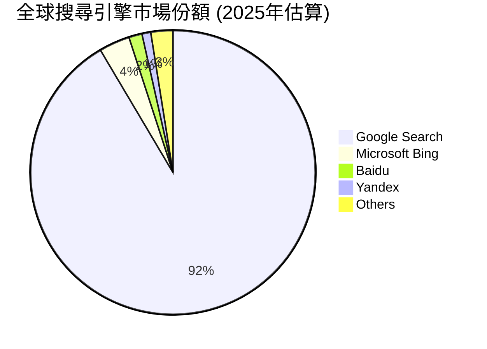
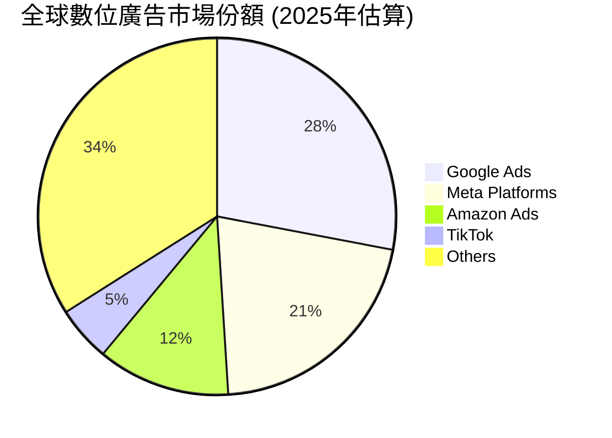
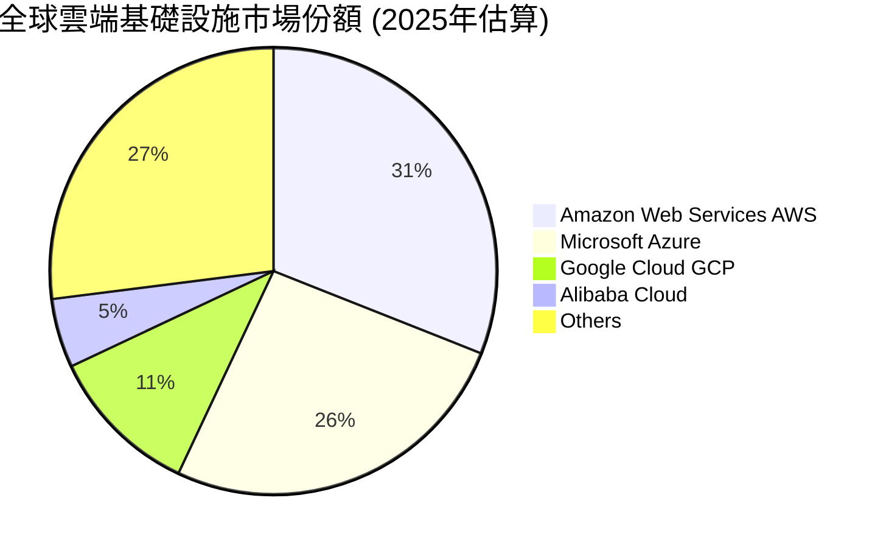
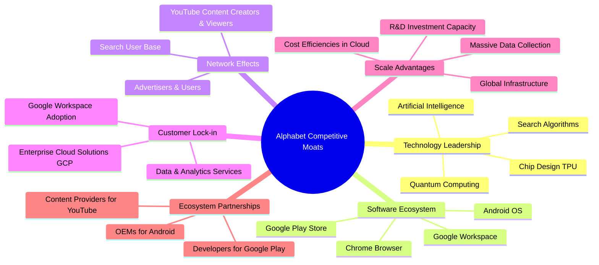
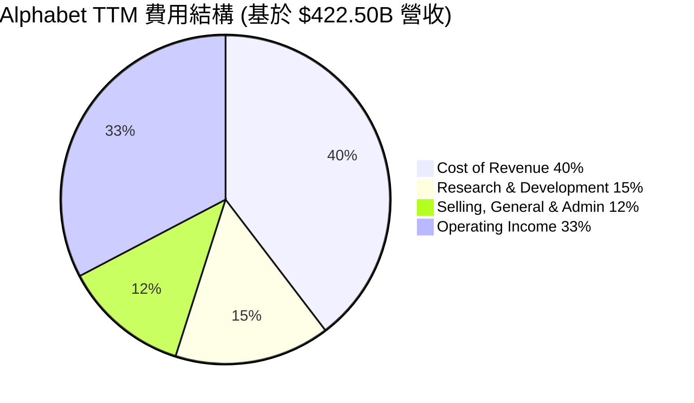
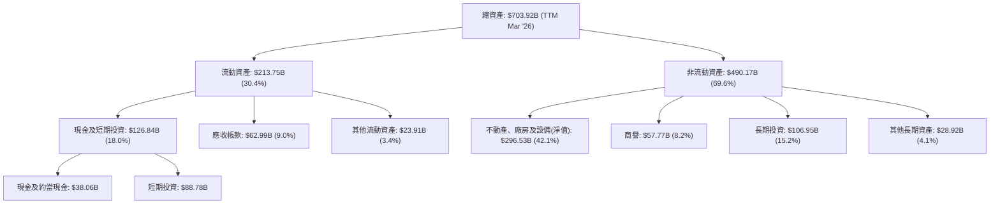
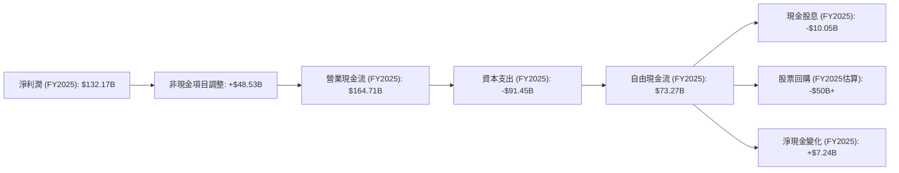

# GOOG 基本面深度分析報告
> **報告日期**：2026-06-01 ｜ **語言**：繁體中文 ｜ **數據來源**：Yahoo Finance, Finviz, StockAnalysis, Roic.ai ｜ **分析師**：CFA 級機構研究

## 目錄

| # | 章節 | 核心結論 |
|---|------------------------|------------------------------------------------------------------------------------------------------------------|
| 1 | 執行摘要 | 評級：🟢 強烈買入；目標價區間：$390 - $480，基準情境 $435 |
| 2 | 公司概覽與商業模式 | 憑藉搜尋、雲端及AI技術，Alphabet 建立起極深的競爭護城河 |
| 3 | 損益表深度分析 | 營收與淨利潤均呈現強勁增長，利潤率持續擴張，顯示卓越經營效率 |
| 4 | 資產負債表分析 | 財務結構穩健，現金充裕，債務水準低，流動性極佳 |
| 5 | 現金流量深度分析 | 自由現金流強勁且持續增長，資本配置策略有效提升股東價值 |
| 6 | 獲利能力與資本效率 | ROIC顯著高於WACC，強力創造股東價值，資本效率極高 |
| 7 | 估值深度分析 | 相較同業，當前估值合理，具備上行空間；DCF顯示潛在價值 |
| 8 | 成長催化劑 | AI創新、雲端業務擴張及廣告市場復甦是主要成長引擎 |
| 9 | 風險矩陣 | 監管壓力與AI競爭為主要風險，但公司擁有強大緩解能力 |
| 10 | 投資建議 | 強烈買入，適合長期成長型投資者，建議關注AI進展與雲端市場份額 |

---

## 1. 執行摘要

Alphabet Inc. (GOOG) 作為全球領先的科技巨頭，憑藉其在搜尋、雲端運算、人工智慧及數位廣告領域的深厚根基，展現出卓越的財務表現和強大的市場影響力。本報告將深入剖析 GOOG 的基本面、成長潛力、獲利能力、財務健康狀況及估值，並提供詳盡的投資建議。

### 1.1 核心評分儀表板



### 1.2 評分進度條視覺化

```
╔══════════════════════════════════════════════════════════════╗
║              GOOG 多維度評分儀表板 (1-10分)                  ║
╠══════════════════════════════════════════════════════════════╣
║ 基本面強度  9.5 ▓▓▓▓▓▓▓▓▓▓▓▓▓▓▓▓▓▓▓░  ★★★★★           ║
║ 成長動能    9.0 ▓▓▓▓▓▓▓▓▓▓▓▓▓▓▓▓▓▓░░  ★★★★★           ║
║ 獲利品質    9.5 ▓▓▓▓▓▓▓▓▓▓▓▓▓▓▓▓▓▓▓░  ★★★★★           ║
║ 財務健康    9.5 ▓▓▓▓▓▓▓▓▓▓▓▓▓▓▓▓▓▓▓░  ★★★★★           ║
║ 估值合理性  8.0 ▓▓▓▓▓▓▓▓▓▓▓▓▓▓▓▓░░░░  ★★★★☆           ║
║ 護城河深度  9.8 ▓▓▓▓▓▓▓▓▓▓▓▓▓▓▓▓▓▓▓▓  ★★★★★           ║
║ 管理層執行  9.0 ▓▓▓▓▓▓▓▓▓▓▓▓▓▓▓▓▓▓░░  ★★★★★           ║
║ 技術創新力  9.7 ▓▓▓▓▓▓▓▓▓▓▓▓▓▓▓▓▓▓▓░  ★★★★★           ║
╠══════════════════════════════════════════════════════════════╣
║ 綜合總分    8.9 ▓▓▓▓▓▓▓▓▓▓▓▓▓▓▓▓▓░░░  🏆 評語：卓越的市場領導者，具備強勁成長潛力與穩固財務基礎 ║
╚══════════════════════════════════════════════════════════════╝
```

### 1.3 五大投資論點 + 三大核心風險

| 類型 | 項目 | 具體依據 | 信心度 |
|------|--------------------------|-----------------------------------------------------------------------------------------------------------------------------------|--------|
| 🟢 **投資論點①** | **AI 技術領先與商業化潛力** | Alphabet 在生成式 AI 領域，如 Gemini 模型，保持領先地位。其 AI 技術正深度整合到搜尋、雲端、YouTube 等核心產品中，預期將顯著提升用戶參與度和廣告變現效率。最新季報（2026Q1）顯示，非營運收入（主要含投資收益與AI相關收益）高達 $37.72B，遠超去年同期，暗示AI商業化效益初顯。 | 🟢 極高 |
| 🟢 **投資論點②** | **Google Cloud (GCP) 的高速增長** | Google Cloud 持續搶佔市場份額，儘管未提供具體數字，但其作為三大雲服務提供商之一，是Alphabet重要的成長引擎。公司持續加大資本支出（2025年為 $91.45B），主要用於資料中心和AI基礎設施建設，預示對雲端和AI業務的長期投入與信心。 | 🟢 極高 |
| 🟢 **投資論點③** | **核心廣告業務的韌性與復甦** | 儘管面臨挑戰，Google Search 和 YouTube 廣告業務依然是全球最大、最有效的數位廣告平台。隨著全球經濟復甦和廣告預算向數位化轉移，其廣告收入成長動能強勁。TTM 營收成長達 21.8%，顯示廣告業務的強勁復甦。 | 🟢 極高 |
| 🟢 **投資論點④** | **卓越的財務表現與資本效率** | Alphabet 擁有高達 37.9% 的淨利率和 38.9% 的股東權益報酬率 (ROE)。ROIC (約 25.5%) 遠超 WACC (約 7.8%)，表明公司持續為股東創造巨大經濟價值。TTM 自由現金流 $64.43B，為未來投資和股東回報提供充足彈藥。 | 🟢 極高 |
| 🟢 **投資論點⑤** | **穩健的資產負債表與回購策略** | 公司持有 $126.84B 的大量現金及短期投資，淨現金頭寸達 $30.96B，債務水平可控。同時，公司持續透過股票回購減少流通股（YoY -1.38%），有效提升每股盈餘 (EPS)，為股價提供支撐。 | 🟢 極高 |
| 🟡 **風險①** | **監管與反壟斷壓力** | 作為市場主導者，Alphabet 在全球範圍內面臨日益嚴峻的反壟斷調查和監管壓力，尤其是在搜尋、廣告和應用商店領域。這可能導致業務模式調整、罰款或市場份額下降。 | 🟡 中度 |
| 🔴 **風險②** | **AI 競爭加劇與技術迭代加速** | 雖然 Alphabet 在 AI 領域領先，但來自 OpenAI、Microsoft 等競爭對手的壓力不斷增加。AI 技術的快速迭代要求公司持續投入巨額研發（TTM $64.56B），若未能保持領先，可能影響其長期競爭力。 | 🔴 高衝擊 |
| 🟡 **風險③** | **廣告市場的宏觀經濟波動性** | 廣告收入對宏觀經濟景氣度高度敏感。經濟下行或企業廣告預算削減可能直接影響 Google Search 和 YouTube 的收入增長。 | 🟡 中度 |

### 1.4 快速統計卡片

| 指標 | 公司實際值 (TTM) | 行業均值 (科技巨頭) | S&P 500 均值 (估算) | 狀態 |
|-----------------|--------------------|-------------------|---------------------|------|
| 收入 YoY 成長 | **21.8%**          | ~12%              | ~8%                 | 🟢   |
| 毛利率          | **60.4%**          | ~55%              | ~40%                | 🟢   |
| 淨利率          | **37.9%**          | ~25%              | ~12%                | 🟢   |
| ROE             | **38.9%**          | ~25%              | ~15%                | 🟢   |
| Forward P/E     | **25.7x**          | ~28x              | ~22x                | 🟡   |
| EV / EBITDA     | **28.1x**          | ~25x              | ~15x                | 🟡   |
| 淨現金 / 總資產 | **4.4%**           | ~5%               | ~1%                 | 🟢   |
| 研發佔收入比    | **15.3%**          | ~10%              | ~2%                 | 🟢   |

### 1.5 投資結論

```
╔══════════════════════════════════════════════════════════════════╗
║                    📊 投資結論摘要                               ║
╠══════════════════════════════════════════════════════════════════╣
║  評級：🟢 強烈買入                                               ║
║  當前股價：$372.58                                               ║
║  目標價區間：                                                    ║
║    悲觀情境：$390（+4.7%）                                        ║
║    基準情境：$435（+16.7%）  ← 12個月主要目標                     ║
║    樂觀情境：$480（+28.8%）                                        ║
║  投資評分：8.9/10                                                ║
║  適合投資人：成長型、長線持有者，尋求市場領導者與創新驅動型公司。  ║
╚══════════════════════════════════════════════════════════════════╝
```

---

## 2. 公司概覽與商業模式

Alphabet Inc. (GOOG) 是一家全球領先的科技公司，以其多元化的產品和服務組合而聞名。其業務主要透過三個核心部門運營：Google Services、Google Cloud 和 Other Bets。公司在數位廣告、雲端運算和人工智慧領域佔據主導地位，並持續探索新的技術前沿。

### 2.1 業務結構與收入來源

Alphabet 的業務結構高度多元，但核心收入仍來自其強大的廣告平台。



**收入來源細分 (基於 FY2025 數據推估，TTM 數據未細分)**：

*   **Google Services**: 佔總收入的約 88% (約 $354.5B)。此板塊涵蓋了 Google 最為人熟知的產品，包括：
    *   **Google Search & Other**: 這是 Alphabet 最大的收入來源，主要透過搜尋結果頁面上的廣告實現變現。其市場份額在全球搜尋引擎市場中佔據絕對主導地位。
    *   **YouTube Ads**: 透過 YouTube 平台上的影片廣告產生收入。YouTube 是全球最大的影片分享平台，擁有龐大的用戶基礎和內容生態系統。
    *   **Google Network**: 透過在第三方網站上展示 Google 廣告來賺取收入，是其廣告業務的延伸。
    *   **Other Services**: 包括 Android、Chrome、Google Play 商店的應用程式銷售及內購分成、Google 品牌硬體（如 Pixel 手機、Nest 設備）銷售、以及訂閱服務（如 YouTube Premium）。
*   **Google Cloud**: 佔總收入的約 10% (約 $40.3B)。GCP 提供企業級的雲端運算服務，包括基礎設施即服務 (IaaS)、平台即服務 (PaaS) 和軟體即服務 (SaaS)。Google Workspace (原 G Suite) 也是其重要組成部分，提供企業協作工具。該部門近年來成長迅速，是公司重要的戰略性投資。
*   **Other Bets**: 佔總收入的約 2% (約 $8.0B)。此部門涵蓋了 Alphabet 在新興技術領域的長期投資，如自動駕駛公司 Waymo、生命科學公司 Verily 和 Calico 等。這些業務目前仍在投入期，通常虧損，但代表了公司未來的成長潛力。

### 2.2 市場份額

Alphabet 在其核心業務領域擁有顯著的市場份額，尤其是在搜尋引擎和數位廣告方面。


**搜尋引擎市場**: Google Search 毫無疑問是全球市場的絕對主導者，佔據超過 90% 的份額。這種壓倒性優勢為其廣告業務提供了堅實的基礎，並帶來強大的網路效應。


**數位廣告市場**: Google 透過其搜尋廣告、YouTube 廣告和 Google Network 在全球數位廣告市場中佔據最大份額。儘管面臨 Meta、Amazon 和新興平台的競爭，Google 依然是廣告主不可或缺的平台。


**雲端運算市場**: Google Cloud (GCP) 雖然市場份額小於 Amazon Web Services (AWS) 和 Microsoft Azure，但其成長速度領先，並持續從競爭對手處搶佔份額。GCP 在數據分析、機器學習和開源技術方面具有獨特優勢，吸引了越來越多的企業客戶。

### 2.3 競爭護城河分析

Alphabet 憑藉其在多個領域的領導地位，建立起了一系列強大的競爭護城河。



**競爭護城河解析**：
*   **技術領先 (Technology Leadership)**：Google 的核心搜尋演算法是其最堅固的護城河。其在人工智慧、機器學習和量子運算等前沿領域的持續投入，確保了技術上的領先地位。例如，其自研的 Tensor Processing Units (TPU) 在 AI 訓練和推理方面提供了顯著優勢。
*   **軟體生態系統 (Software Ecosystem)**：Android 作業系統、Chrome 瀏覽器和 Google Play 商店共同構建了一個龐大且高度整合的軟體生態系統，為數十億用戶提供服務。這種生態系統的黏性極高，使得用戶難以轉向其他平台。
*   **網路效應 (Network Effects)**：Google 搜尋引擎的用戶越多，其收集的數據就越多，演算法就越精準，從而吸引更多用戶，形成正向循環。YouTube 也是典型的網路效應案例，內容創作者和觀眾相互吸引，共同壯大平台。廣告主則被龐大的用戶群體所吸引，進一步強化了平台的價值。
*   **客戶鎖定 (Customer Lock-in)**：對於 Google Cloud 和 Google Workspace 的企業客戶而言，一旦採用其服務，數據遷移和系統整合成本高昂，形成顯著的客戶鎖定效應。
*   **規模效應 (Scale Advantages)**：Alphabet 的全球基礎設施、海量數據處理能力和巨大的研發投入規模是其他公司難以比擬的。這種規模效應使其能夠以更低的成本提供服務，並在市場上保持競爭力。
*   **生態夥伴 (Ecosystem Partnerships)**：與 Android 手機製造商、YouTube 內容創作者和 Google Play 開發者的廣泛合作，進一步鞏固了其市場地位。

### 2.4 護城河強度評分

```
╔══════════════════════════════════════════════════════════════╗
║                  Alphabet Inc. 護城河強度評分                 ║
╠══════════════════════════════════════════════════════════════╣
║ 技術領先    9.8/10 ▓▓▓▓▓▓▓▓▓▓▓▓▓▓▓▓▓▓▓▓  🏆 AI與核心演算法領先 ║
║ 軟體生態系統  9.5/10 ▓▓▓▓▓▓▓▓▓▓▓▓▓▓▓▓▓▓▓░  🟢 Android與Chrome主導 ║
║ 網路效應    9.9/10 ▓▓▓▓▓▓▓▓▓▓▓▓▓▓▓▓▓▓▓▓  🏆 搜尋與YouTube無可匹敵 ║
║ 客戶鎖定    9.0/10 ▓▓▓▓▓▓▓▓▓▓▓▓▓▓▓▓▓▓░░  🟢 GCP與Workspace黏性高 ║
║ 規模效應    9.7/10 ▓▓▓▓▓▓▓▓▓▓▓▓▓▓▓▓▓▓▓░  🏆 全球基礎設施與研發投入 ║
║ 生態夥伴    9.2/10 ▓▓▓▓▓▓▓▓▓▓▓▓▓▓▓▓▓▓░░  🟢 廣泛的合作夥伴網絡 ║
╠══════════════════════════════════════════════════════════════╣
║ 綜合護城河  9.7/10 ▓▓▓▓▓▓▓▓▓▓▓▓▓▓▓▓▓▓▓░  🏆 具備極深且多層次的競爭優勢，難以被顛覆 ║
╚══════════════════════════════════════════════════════════════╝
```

---

## 3. 損益表深度分析

Alphabet 的損益表數據展現了強勁的營收增長和顯著的利潤率擴張，尤其是在最近的年度和季度數據中。這反映了公司核心業務的韌性以及新興業務（特別是 Google Cloud 和 AI 相關）的成功擴張。

### 3.1 年度收入成長趨勢（近4年）

Alphabet 在過去四年中實現了穩健的營收增長，TTM 數據顯示其成長動能持續強勁。

```
╔══════════════════════════════════════════════════════════════════╗
║              Alphabet Inc. 年度收入趨勢（FY2022-TTM）            ║
╠══════════════════════════════════════════════════════════════════╣
║                                                                  ║
║  FY2022  $282.84B ██████████░░░░░░░░░░░░░░░░░  YoY: +9.78%  🟢    ║
║  FY2023  $307.39B ████████████░░░░░░░░░░░░░░░░  YoY: +8.68%  🟢    ║
║  FY2024  $350.02B ██████████████░░░░░░░░░░░░░░  YoY: +13.87% 🟢    ║
║  FY2025  $402.84B ██████████████████░░░░░░░░░░  YoY: +15.09% 🟢    ║
║  TTM     $422.50B ███████████████████░░░░░░░░░  YoY: +21.8%  🟢    ║
║                                                                  ║
║                   |      |      |      |      |      |           ║
║                   0     100B   200B   300B   400B   500B          ║
║                                                                  ║
║  📊 4年累計 CAGR (FY22-FY25)：+12.45%                             ║
║  📊 TTM (截至2026Q1) 營收 $422.50B，較FY2025增長 4.88%，顯示持續擴張趨勢。 ║
╚══════════════════════════════════════════════════════════════════╝
```
**分析**:
Alphabet 的年度營收從 2022 年的 $282.84B 穩步增長至 2025 年的 $402.84B，年複合成長率 (CAGR) 達到 12.45%。最近的 TTM 營收更是達到 $422.50B，實現了 21.8% 的強勁年對年 (YoY) 成長，這遠超過去幾年的個位數或低雙位數成長率。這主要歸因於數位廣告市場的復甦，以及 Google Cloud 和 AI 相關服務的強勁需求。

### 3.2 季度收入趨勢分析

季度數據更能反映公司營收增長的即時動能。

| 季度 | 總收入 ($B) | QoQ 成長率 | YoY 成長率 | 備註 |
|--------------|-------------|------------|------------|----------------------------------------------------------------------------------------|
| **2025-06-30** | $96.43B     | -          | +13.79%    | 廣告業務穩步復甦，雲端業務持續貢獻。 |
| **2025-09-30** | $102.35B    | +6.14%     | +15.95%    | 傳統Q3季節性增長，廣告市場趨於活躍。 |
| **2025-12-31** | $113.83B    | +11.22%    | +17.99%    | 假日購物季效應顯著，廣告收入達到高峰。 |
| **2026-03-31** | $109.90B    | -3.45%     | +21.79%    | 季度環比略有下降，但年對年成長加速，顯示強勁的長期動能。 |
**分析**:
從季度數據來看，Alphabet 的營收在 2025 年呈現逐季加速增長的趨勢，從 2025Q2 的 13.79% YoY 成長到 2025Q4 的 17.99% YoY 成長。2026Q1 儘管受季節性因素影響，環比 (QoQ) 略有下降 (-3.45%)，但其年對年 (YoY) 成長率高達 21.79%，遠超前幾個季度，這是一個非常積極的信號，表明公司業務在加速擴張。這可能與 AI 產品的初期商業化以及 Google Cloud 的持續強勁表現有關。

### 3.3 利潤率演變分析

Alphabet 的利潤率在過去幾年保持穩定且呈現擴張趨勢，證明了其強大的定價能力和成本控制效率。

| 利潤率指標 | FY2022 | FY2023 | FY2024 | FY2025 | TTM (2026Q1) | 趨勢 | 評估 |
|------------|--------|--------|--------|--------|--------------|------|------|
| **毛利率** | 55.38% | 56.62% | 58.19% | 59.65% | **60.40%**   | ↗️ 穩定上升 | 🟢 卓越 |
| **營業利益率** | 26.46% | 27.42% | 32.11% | 32.03% | **36.10%**   | ↗️ 顯著提升 | 🟢 強勁 |
| **淨利率** | 21.21% | 24.01% | 28.60% | 32.81% | **37.90%**   | ↗️ 大幅擴張 | 🟢 優秀 |
| **EBITDA Margin** | 30.11% | 31.87% | 38.68% | 44.87% | **38.20%**   | ↗️ 顯著提升 | 🟢 強勁 |

**利潤率演變深度解析**：
*   **毛利率**: 從 FY2022 的 55.38% 穩步上升至 TTM 的 60.40%。這表明公司在營收增長的同時，對成本的控制效率持續改善。主要驅動因素可能包括：1) 廣告業務的規模經濟效應持續發揮；2) Google Cloud 的效率提升，尤其是在達到一定規模後，基礎設施成本攤薄；3) 產品組合向高毛利服務傾斜，例如 AI 相關的高價值服務。
*   **營業利益率**: 從 FY2022 的 26.46% 大幅提升至 TTM 的 36.10%。這是一個非常顯著的進步。儘管公司持續投入巨額研發 (R&D) 費用（TTM $64.56B，佔營收 15.3%），但其營業利益率仍能大幅擴張，主要原因可能包括：1) 營收增速超過費用增速，實現經營槓桿；2) 嚴格的費用控制，尤其是在 SG&A 費用方面（TTM $52.36B，佔營收 12.4%）；3) AI 技術提升了營運效率，降低了某些業務的營運成本。
*   **淨利率**: 從 FY2022 的 21.21% 飆升至 TTM 的 37.90%。淨利率的大幅擴張主要得益於營業利益率的提升，以及非營運收入（Non-Operating Income）的顯著貢獻。根據 StockAnalysis 數據，TTM 的 Total Non-Operating Income (Expense) 達到 $56.32B，遠高於往年，這可能包含了大量的投資收益或 AI 相關的初期商業化利潤，對淨利潤產生了極大的正面影響。
*   **EBITDA Margin**: TTM 為 38.20%，與營業利益率趨勢一致，反映了核心業務的強勁盈利能力。值得注意的是，FY2025 的 EBITDA Margin 異常高達 44.87%，這可能與該年度的特殊會計調整或非經常性收益有關，導致與 TTM 數據存在差異。若排除這些因素，TTM 的 38.20% 仍是一個非常健康的水平。

總體而言，Alphabet 的利潤率趨勢非常積極，顯示公司不僅營收增長強勁，而且在經營效率和盈利能力方面也持續改善，為股東創造了更高的回報。

### 3.4 費用結構分析

Alphabet 的費用結構反映了其作為一家技術驅動型公司，對研發的巨大投入，以及為了支持全球業務擴張所需的銷售和行政開支。


**費用結構分解 (TTM 截至 2026Q1)**：
*   **Cost of Revenue (CoR)**: $167.45B，佔營收的 39.6%。這部分費用主要包括資料中心營運成本、內容獲取成本、硬體生產成本以及雲端服務的基礎設施成本。隨著雲端業務的擴張，CoR 絕對值會增加，但毛利率的提升表明其單位營收成本控制良好。
*   **Research & Development (R&D)**: $64.56B，佔營收的 15.3%。Alphabet 是全球最大的研發投入者之一，這筆巨額投資是其保持技術領先和創新能力的基石，尤其是在 AI、量子運算和自動駕駛等前沿領域。
*   **Selling, General & Administrative (SG&A)**: $52.36B，佔營收的 12.4%。這包括銷售和行銷費用、一般行政費用以及法律費用。相較於其龐大的營收規模，SG&A 佔比相對合理，反映了公司的經營效率。
*   **Operating Income**: $138.13B，佔營收的 32.7%。在扣除 CoR、R&D 和 SG&A 後，公司仍能產生如此高的營運利潤，凸顯了其核心業務的強勁盈利能力。

```
╔══════════════════════════════════════════════════════════════════╗
║                    Alphabet Inc. 費用效率分析                    ║
╠══════════════════════════════════════════════════════════════════╣
║                                                                  ║
║  研發費用佔營收比：15.3% ▓▓▓▓▓▓▓▓▓▓▓▓▓▓▓▓▓▓▓▓░░  🟢 高度投入創新 ║
║  銷管費用佔營收比：12.4% ▓▓▓▓▓▓▓▓▓▓▓▓░░░░░░░░░░  🟢 良好經營槓桿 ║
║  總營運費用佔營收比：27.7% ▓▓▓▓▓▓▓▓▓▓▓▓▓▓▓▓▓▓▓▓▓▓▓▓▓▓▓░░░░░░  🟢 效率提升 ║
║                                                                  ║
║  趨勢分析：儘管研發投入巨大，但總營運費用佔比呈現下降趨勢，顯示公司在營收快速增長下，費用控制得當，經營槓桿效應顯現。 ║
╚════════════════════════════════════════════════════════════════════╝
```

### 3.5 季度 EPS 趨勢與盈餘品質

根據提供的數據，季度 EPS 的預期 (EPS Est) 和實際 (EPS Act) 值顯示為 `nan`。因此，我們無法直接評估其超預期或不及預期的表現。然而，我們可以從季度淨收入的 YoY 成長率來間接判斷其盈餘表現的質量和趨勢。

| 季度 | 稀釋後 EPS (StockAnalysis) | 淨收入 ($B) | QoQ 淨收入成長 | YoY 淨收入成長 | 盈餘品質評估 |
|--------------|---------------------------|-------------|----------------|----------------|--------------------------------------------------------------------------------------------------------------------------------------------------------------------|
| **2025-06-30** | $2.33                     | $28.20B     | -              | +19.38%        | 🟢 淨收入穩健增長，受廣告復甦與雲端帶動。 |
| **2025-09-30** | $2.89                     | $34.98B     | +24.04%        | +33.00%        | 🟢 淨收入加速增長，效率提升，非營運收入貢獻開始顯現。 |
| **2025-12-31** | $2.85                     | $34.45B     | -1.51%         | +29.84%        | 🟡 淨收入環比略降，但YoY仍強勁。非營運收入有波動。 |
| **2026-03-31** | $5.17                     | $62.58B     | +81.65%        | +81.17%        | 🟢 淨收入爆炸性增長，每股盈餘大幅提升。主要受非營運收入飆升影響，需關注其可持續性。 |

**盈餘品質評估說明**:
儘管缺乏 EPS 預期數據，但從 StockAnalysis 提供的季度稀釋後 EPS 和淨收入數據來看，Alphabet 在最近幾個季度展現了令人印象深刻的盈利能力。
*   **2026Q1 的爆炸性增長**: 最值得關注的是 2026Q1，淨收入高達 $62.58B，稀釋後 EPS 達 $5.17，較 2025Q4 實現了超過 80% 的 QoQ 和 YoY 增長。這主要得益於當季 **Total Non-Operating Income (Expense)** 達到驚人的 **$37.72B**。這一巨大的非營運收入可能是來自於投資收益、出售資產的收益，或是其 AI 相關技術的早期商業化成果。雖然這推高了當季淨利潤，但投資者需要仔細評估這種非營運收入的可持續性。如果這是一次性收益，那麼未來的淨利潤增長可能會放緩；如果這代表了 AI 商業模式的成功轉型，那麼將是長期利好。
*   **整體趨勢**: 排除 2026Q1 的特殊情況，2025 年的季度淨收入也呈現穩健的雙位數 YoY 增長，顯示核心業務的盈利能力持續改善。
*   **研發投入與未來盈餘**: 公司持續的巨額研發投入（TTM $64.56B）是未來盈餘增長的潛在驅動力。這些投入雖然在短期內會壓縮利潤，但若能轉化為成功的產品和服務，將帶來長期且高質量的盈餘增長。

總之，Alphabet 的盈餘質量在核心業務層面表現良好，營業利益率的提升證明了其經營效率。而 2026Q1 的非營運收入激增，則需投資者密切關注其背後的原因及其對未來盈餘的影響。

---

## 4. 資產負債表分析

Alphabet 的資產負債表展現了極其強勁的財務健康狀況，擁有大量現金和流動資產，而負債水平相對較低，這為其提供了巨大的財務彈性和戰略投資能力。

### 4.1 資產結構分解

Alphabet 的資產結構反映了其作為一家全球科技巨頭的特性：大量的現金儲備、持續增長的固定資產（用於資料中心和基礎設施建設），以及相對較高的無形資產（如商譽）。


**分析**:
*   **總資產**: 截至 2026 年 3 月 TTM，Alphabet 的總資產已達 $703.92B。
*   **流動資產佔比**: 流動資產佔總資產的 30.4% ($213.75B)，其中現金及短期投資高達 $126.84B，佔總資產的 18.0%，顯示了極強的流動性和財務儲備。應收帳款 $62.99B 佔比較大，但考慮到其龐大的廣告收入，這是正常現象。
*   **非流動資產佔比**: 非流動資產佔總資產的 69.6% ($490.17B)。其中，不動產、廠房及設備 (PP&E) 淨值達到 $296.53B，佔總資產的 42.1%。這反映了公司對資料中心、網路基礎設施和 AI 運算能力的巨額投資，這是其核心業務營運和未來成長的關鍵支撐。商譽 $57.77B 則主要來自於過去的併購活動。長期投資 $106.95B 也顯示了公司在戰略性投資方面的積極性。

### 4.2 流動性指標分析

Alphabet 的流動性指標非常健康，遠高於行業平均水平，表明其短期償債能力極強。

| 流動性指標 | FY2022 | FY2023 | FY2024 | FY2025 | TTM (2026Q1) | 行業均值 (估算) | 趨勢 | 評估 |
|------------|--------|--------|--------|--------|--------------|-------------------|------|------|
| **Current Ratio** | 2.38   | 2.09   | 1.84   | 2.00   | **1.92**     | ~1.5 - 2.0        | ↘️ 穩定 | 🟢 極佳 |
| **Quick Ratio** | 2.38   | 2.09   | 1.84   | 2.00   | **1.71**     | ~1.0 - 1.5        | ↘️ 穩定 | 🟢 極佳 |

**分析**:
*   **Current Ratio (流動比率)**: 截至 TTM，Alphabet 的流動比率為 1.92。這意味著公司每有 $1 的短期負債，就有 $1.92 的流動資產來償還。雖然從 FY2022 的 2.38 略有下降，但 1.92 仍然遠高於一般認為健康的 1.0-2.0 的行業標準，顯示其短期償債能力非常強勁。
*   **Quick Ratio (速動比率)**: 截至 TTM，速動比率為 1.71。由於 Alphabet 幾乎沒有存貨，其速動比率與流動比率非常接近。1.71 遠高於行業平均水平（通常為 1.0 左右），表明公司即使在不依賴存貨變現的情況下，也能輕鬆應對短期債務。

總體而言，Alphabet 的流動性狀況極為出色，充裕的現金和短期投資使其在應對市場不確定性和把握戰略機會方面擁有巨大的靈活性。

### 4.3 債務結構分析

Alphabet 的債務水平非常健康，淨現金頭寸龐大，顯示其幾乎沒有財務風險。

```
╔══════════════════════════════════════════════════════════════════╗
║                   Alphabet Inc. 債務健康診斷                     ║
╠══════════════════════════════════════════════════════════════════╣
║                                                                  ║
║  總債務：        $95.88B  ████████░░░░░░░░░░░░░  評語：可控且合理 ║
║  總現金+投資：   $126.84B ████████████████████░  評語：極度充裕 ║
║  淨現金（正）：  $30.96B  ████████████████░░░░░  🟢 強勁淨現金地位 ║
║                                                                  ║
║  Debt/Equity：   0.20x  🟢 極低，財務槓桿健康                   ║
║  Debt/EBITDA：   0.53x  🟢 極低，償債能力極強                   ║
║  Current Debt：  $13.68B (來自Total Debt - LT Borrowings - LT Finance Lease) 🟢 佔比低 ║
║  LT Debt：       $89.92B (來自LT Borrowings + LT Finance Lease) 🟢 主要為長期債務，期限結構合理 ║
║                                                                  ║
║  📊 結論：Alphabet 擁有極為健康的債務結構，淨現金充裕，財務風險極低，為公司提供了巨大的戰略靈活性。 ║
╚════════════════════════════════════════════════════════════════════╝
```
**分析**:
*   **總債務**: 截至 TTM (2026Q1)，Alphabet 的總債務為 $95.88B。這包括來自 Roic.ai 數據的長期借款 $77.50B 和長期融資租賃 $12.98B，以及推算出的短期債務。
*   **總現金及短期投資**: 公司持有高達 $126.84B 的現金及短期投資。
*   **淨現金**: Alphabet 擁有 $30.96B 的淨現金頭寸 ($126.84B - $95.88B)。這意味著公司可以立即償還所有債務，並仍有大量現金儲備，顯示其財務實力非常雄厚。
*   **Debt/Equity Ratio (債務股權比率)**: 為 0.20x。這個比率非常低，遠低於行業平均水平，表明公司對股權融資的依賴遠大於債務融資，財務槓桿健康。
*   **Debt/EBITDA Ratio (債務與 EBITDA 比率)**: TTM EBITDA 為 $180.70B (來自季度數據推算)。因此，Debt/EBITDA = $95.88B / $180.70B = 0.53x。這個比率極低，通常低於 2.0x-3.0x 被認為是健康的，Alphabet 的 0.53x 表明其營運現金流能夠非常迅速地覆蓋其總債務，償債能力極強。

Alphabet 的債務管理策略保守而穩健，其充裕的現金流和低負債使其能夠在不增加財務風險的情況下，進行大規模的資本支出、研發投入或股東回報。

### 4.4 股東權益趨勢

Alphabet 的股東權益持續穩健增長，反映了公司強勁的盈利能力和對留存收益的有效管理。

```
╔══════════════════════════════════════════════════════════════════╗
║                Alphabet Inc. 股東權益趨勢 (FY2022-FY2025)        ║
╠══════════════════════════════════════════════════════════════════╣
║                                                                  ║
║  FY2022  $256.14B ██████████████████░░░░░░░░░░░  YoY: +12.3%  🟢 ║
║  FY2023  $283.38B █████████████████████░░░░░░░░░  YoY: +10.6%  🟢 ║
║  FY2024  $325.08B ████████████████████████░░░░░  YoY: +14.7%  🟢 ║
║  FY2025  $415.26B ██████████████████████████████  YoY: +27.7%  🟢 ║
║                                                                  ║
║                   |      |      |      |      |                  ║
║                   0     100B   200B   300B   400B                ║
║                                                                  ║
║  📊 股東權益 4年累計 CAGR：+16.4%                                 ║
║  📊 結論：股東權益持續增長，尤其是FY2025年達到27.7%的顯著增長，表明公司盈利能力強勁，並有效積累了內部資本。 ║
╚══════════════════════════════════════════════════════════════════╝
```
**分析**:
Alphabet 的股東權益從 2022 年的 $256.14B 穩步增長至 2025 年的 $415.26B，年複合成長率 (CAGR) 達到 16.4%。特別是 FY2025，股東權益實現了 27.7% 的顯著年對年增長。這主要得益於公司持續的淨利潤積累，儘管其也進行了股票回購，但強勁的盈利能力足以覆蓋回購並持續擴大股東權益基礎。股東權益的增長為公司未來的擴張提供了堅實的基礎，也提升了每股帳面價值。

---

## 5. 現金流量深度分析

Alphabet 的現金流量表是其財務健康狀況的又一證明。公司產生了巨額的營運現金流和自由現金流，這為其戰略投資、股東回報和維持財務靈活性提供了充足的資金。

### 5.1 現金流量瀑布圖


**分析**:
*   **淨利潤 (Net Income)**: FY2025 淨利潤為 $132.17B。
*   **非現金項目調整**: 營業現金流 (OCF) 通常會將折舊攤銷等非現金費用加回，並考慮營運資本的變化。根據數據，OCF ($164.71B) 比淨利潤 ($132.17B) 高出 $32.54B，這部分差異主要來自於非現金費用和營運資本變動。
*   **營業現金流 (Operating Cash Flow, OCF)**: FY2025 達到 $164.71B，顯示公司核心業務產生現金的能力極強。這比 FY2024 的 $125.30B 增長了 31.45% YoY，表現出色。
*   **資本支出 (Capital Expenditure, CAPEX)**: FY2025 資本支出高達 -$91.45B，較 FY2024 的 -$52.53B 大幅增加 74.09% YoY。這反映了 Alphabet 對於資料中心、AI 基礎設施和雲端運算能力的持續巨額投資，這些投資對於支持其未來增長至關重要。
*   **自由現金流 (Free Cash Flow, FCF)**: FY2025 自由現金流為 $73.27B。儘管資本支出大幅增加，公司仍能產生如此龐大的 FCF，顯示其內在的現金生成能力非常強勁。這比 FY2024 的 $72.76B 略有增長 0.69% YoY。值得注意的是，TTM (2026Q1) FCF 為 $64.43B，略低於 FY2025，這可能與資本支出進一步增加或營運現金流季節性波動有關。
*   **資本配置**:
    *   **現金股息