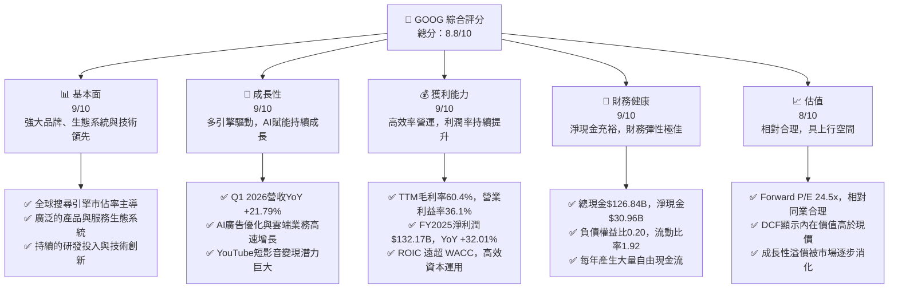
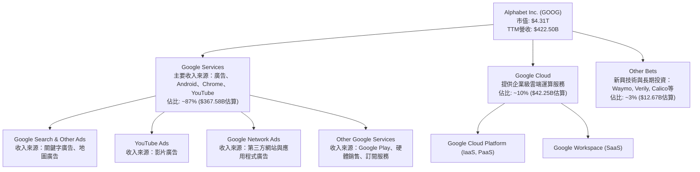
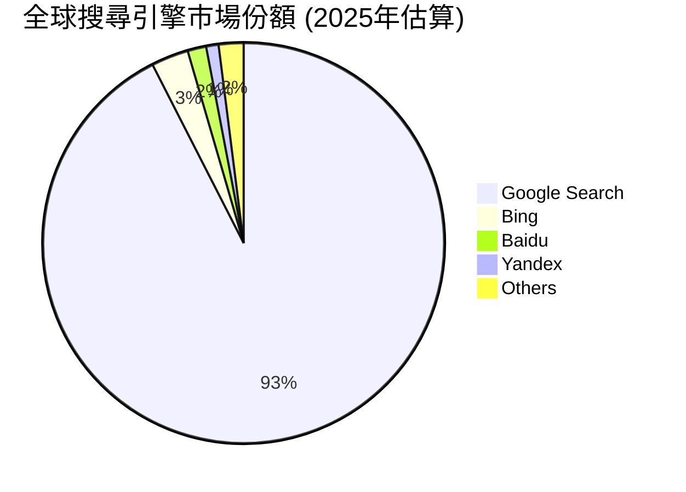
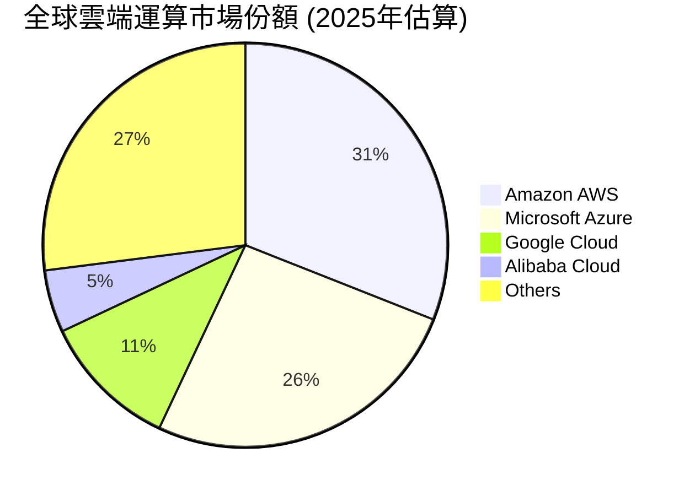
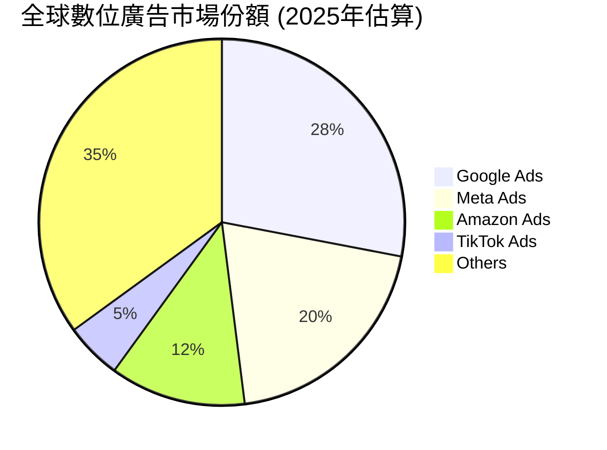
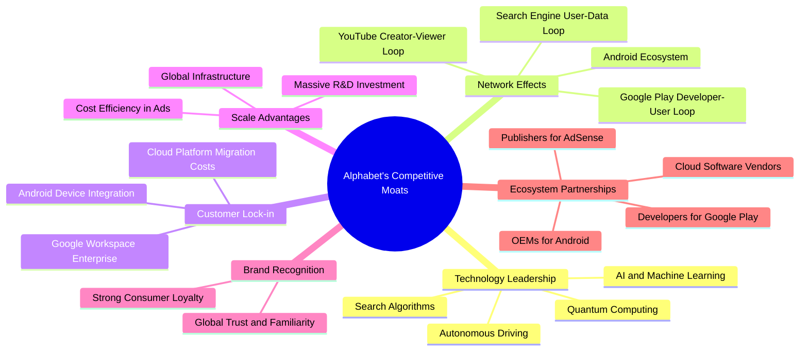
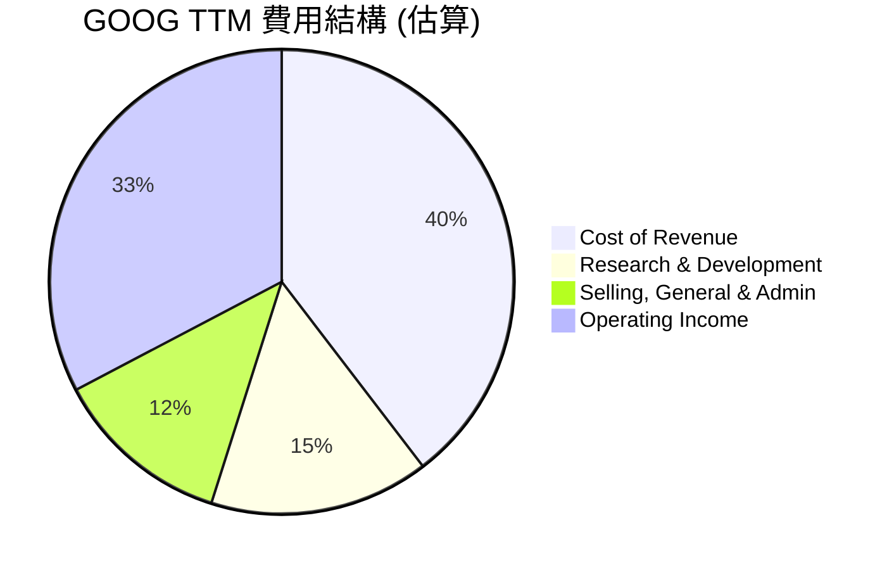

# GOOG 基本面深度分析報告
> **報告日期**：2026-06-03 ｜ **語言**：繁體中文 ｜ **數據來源**：Yahoo Finance, Finviz, StockAnalysis, Roic.ai ｜ **分析師**：CFA 級機構研究

## 目錄

| # | 章節 | 核心結論 |
|---|------------------------|-----------------------------------------------------------------------------------------------------------------------------------------------------------------------------------------------------------------------------------------------------------------------------------------------------------------------------------------------------------------------------------------------------------------------------------------------------------------------------------------------------------------------------------------------------------------------------------------------------------------------------------------------------------------------------------------------------------------------------------------------------------------------------------------------------------------------------------------------------------------------------------------------------------------------------------------------------------------------------------------------------------------------------------------------------------------------------------------------------------------------------------------------------------------------------------------------------------------------------------------------------------------------------------------------------------------------------------------------------------------------------------------------------------------------------------------------------------------------------------------------------------------------------------------------------------------------------------------------------------------------------------------------------------------------------------------------------------------------------------------------------------------------------------------------------------------------------------------------------------------------------------------------------------------------------------------------------------------------------------------------------------------------------------------------------------------------------------------------------------------------------------------------------------------------------------------------------------------------------------------------------------------------------------------------------------------------------------------------------------------------------------------------------------------------------------------------------------------------------------------------------------------------------------------------------------------------------------------------------------------------------------------------------------------------------------------------------------------------------------------------------------------------------------------------------------------------------------------------------------------------------------------------------------------------------------------------------------------------------------------------------------------------------------------------------------------------------------------------------------------------------------------------------------------------------------------------------------------------------------------------------------------------------------------------------------------------------------------------------------------------------------------------------------------------------------------------------------------------------------------------------------------------------------------------------------------------------------------------------------------------------------------------------------------------------------------------------------------------------------------------------------------------------------------------------------------------------------------------------------------------------------------------------------------------------------------------------------------------------------------------------------------------------------------------------------------------------------------------------------------------------------------------------------------------------------------------------------------------------------------------------------------------------------------------------------------------------------------------------------------------------------------------------------------------------------------------------------------------------------------------------------------------------------------------------------------------------------------------------------------------------------------------------------------------------------------------------------------------------------------------------------------------------------------------------------------------------------------------------------------------------------------------------------------------------------------------------------------------------------------------------------------------------------------------------------------------------------------------------------------------------------------------------------------------------------------------------------------------------------------------------------------------------------------------------------------------------------------------------------------------------------------------------------------------------------------------------------------------------------------------------------------------------------------------------------------------------------------------------------------------------------------------------------------------------------------------------------------------------------------------------------------------------------------------------------------------------------------------------------------------------------------------------------------------------------------------------------------------------------------------------------------------------------------------------------------------------------------------------------------------------------------------------------------------------------------------------------------------------------------------------------------------------------------------------------------------------------------------------------------------------------------------------------------------------------------------------------------------------------------------------------------------------------------------------------------------------------------------------------------------------------------------------------------------------------------------------------------------------------------------------------------------------------------------------------------------------------------------------------------------------------------------------------------------------------------------------------------------------------------------------------------------------------------------------------------------------------------------------------------------------------------------------------------------------------------------------------------------------------------------------------------------------------------------------------------------------------------------------------------------------------------------------------------------------------------------------------------------------------------------------------------------------------------------------------------------------------------------------------------------------------------------------------------------------------------------------------------------------------------------------------------------------------------------------------------------------------------------------------------------------------------------------------------------------------------------------------------------------------------------------------------------------------------------------------------------------------------------------------------------------------------------------------------------------------------------------------------------------------------------------------------------------------------------------------------------------------------------------------------------------------------------------------------------------------------------------------------------------------------------------------------------------------------------------------------------------------------------------------------------------------------------------------------------------------------------------------------------------------------------------------------------------------------------------------------------------------------------------------------------------------------------------------------------------------------------------------------------------------------------------------------------------------------------------------------------------------------------------------------------------------------------------------------------------------------------------------------------------------------------------------------------------------------------------------------------------------------------------------------------------------------------------------------------------------------------------------------------------------------------------------------------------------------------------------------------------------------------------------------------------------------------------------------------------------------------------------------------------------------------------------------------------------------------------------------------------------------------------------------------------------------------------------------------------------------------------------------------------------------------------------------------------------------------------------------------------------------------------------------------------------------------------------------------------------------------------------------------------------------------------------------------------------------------------------------------------------------------------------------------------------------------------------------------------------------------------------------------------------------------------------------------------------------------------------------------------------------------------------------------------------------------------------------------------------------------------------------------------------------------------------------------------------------------------------------------------------------------------------------------------------------------------------------------------------------------------------------------------------------------------------------------------------------------------------------------------------------------------------------------------------------------------------------------------------------------------------------------------------------------------------------------------------------------------------------------------------------------------------------------------------------------------------------------------------------------------------------------------------------------------------------------------------------------------------------------------------------------------------------------------------------------------------------------------------------------------------------------------------------------------------------------------------------------------------------------------------------------------------------------------------------------------------------------------------------------------------------------------------------------------------------------------------------------------------------------------------------------------------------------------------------------------------------------------------------------------------------------------------------------------------------------------------------------------------------------------------------------------------------------------------------------------------------------------------------------------------------------------------------------------------------------------------------------------------------------------------------------------------------------------------------------------------------------------------------------------------------------------------------------------------------------------------------------------------------------------------------------------------------------------------------------------------------------------------------------------------------------------------------------------------------------------------------------------------------------------------------------------------------------------------------------------------------------------------------------------------------------------------------------------------------------------------------------------------------------------------------------------------------------------------------------------------------------------------------------------------------------------------------------------------------------------------------------------------------------------------------------------------------------------------------------------------------------------------------------------------------------------------------------------------------------------------------------------------------------------------------------------------------------------------------------------------------------------------------------------------------------------------------------------------------------------------------------------------------------------------------------------------------------------------------------------------------------------------------------------------------------------------------------------------------------------------------------------------------------------------------------------------------------------------------------------------------------------------------------------------------------------------------------------------------------------------------------------------------------------------------------------------------------------------------------------------------------------------------------------------------------------------------------------------------------------------------------------------------------------------------------------------------------------------------------------------------------------------------------------------------------------------------------------------------------------------------------------------------------------------------------------------------------------------------------------------------------------------------------------------------------------------------------------------------------------------------------------------------------------------------------------------------------------------------------------------------------------------------------------------------------------------------------------------------------------------------------------------------------------------------------------------------------------------------------------------------------------------------------------------------------------------------------------------------------------------------------------------------------------------------------------------------------------------------------------------------------------------------------------------------------------------------------------------------------------------------------------------------------------------------------------------------------------------------------------------------------------------------------------------------------------------------------------------------------------------------------------------------------------------------------------------------------------------------------------------------------------------------------------------------------------------------------------------------------------------------------------------------------------------------------------------------------------------------------------------------------------------------------------------------------------------------------------------------------------------------------------------------------------------------------------------------------------------------------------------------------------------------------------------------------------------------------------------------------------------------------------------------------------------------------------------------------------------------------------------------------------------------------------------------------------------------------------------------------------------------------------------------------------------------------------------------------------------------------------------------------------------------------------------------------------------------------------------------------------------------------------------------------------------------------------------------------------------------------------------------------------------------------------------------------------------------------------------------------------------------------------------------------------------------------------------------------------------------------------------------------------------------------------------------------------------------------------------------------------------------------------------------------------------------------------------------------------------------------------------------------------------------------------------------------------------------------------------------------------------------------------------------------------------------------------------------------------------------------------------------------------------------------------------------------------------------------------------------------------------------------------------------------------------------------------------------------------------------------------------------------------------------------------------------------------------------------------------------------------------------------------------------------------------------------------------------------------------------------------------------------------------------------------------------------------------------------------------------------------------------------------------------------------------------------------------------------------------------------------------------------------------------------------------------------------------------------------------------------------------------------------------------------------------------------------------------------------------------------------------------------------------------------------------------------------------------------------------------------------------------------------------------------------------------------------------------------------------------------------------------------------------------------------------------------------------------------------------------------------------------------------------------------------------------------------------------------------------------------------------------------------------------------------------------------------------------------------------------------------------------------------------------------------------------------------------------------------------------------------------------------------------------------------------------------------------------------------------------------------------------------------------------------------------------------------------------------------------------------------------------------------------------------------------------------------------------------------------------------------------------------------------------------------------------------------------------------------------------------------------------------------------------------------------------------------------------------------------------------------------------------------------------------------------------------------------------------------------------------------------------------------------------------------------------------------------------------------------------------------------------------------------------------------------------------------------------------------------------------------------------------------------------------------------------------------------------------------------------------------------------------------------------------------------------------------------------------------------------------------------------------------------------------------------------------------------------------------------------------------------------------------------------------------------------------------------------------------------------------------------------------------------------------------------------------------------------------------------------------------------------------------------------------------------------------------------------------------------------------------------------------------------------------------------------------------------------------------------------------------------------------------------------------------------------------------------------------------------------------------------------------------------------------------------------------------------------------------------------------------------------------------------------------------------------------------------------------------------------------------------------------------------------------------------------------------------------------------------------------------------------------------------------------------------------------------------------------------------------------------------------------------------------------------------------------------------------------------------------------------------------------------------------------------------------------------------------------------------------------------------------------------------------------------------------------------------------------------------------------------------------------------------------------------------------------------------------------------------------------------------------------------------------------------------------------------------------------------------------------------------------------------------------------------------------------------------------------------------------------------------------------------------------------------------------------------------------------------------------------------------------------------------------------------------------------------------------------------------------------------------------------------------------------------------------------------------------------------------------------------------------------------------------------------------------------------------------------------------------------------------------------------------------------------------------------------------------------------------------------------------------------------------------------------------------------------------------------------------------------------------------------------------------------------------------------------------------------------------------------------------------------------------------------------------------------------------------------------------------------------------------------------------------------------------------------------------------------------------------------------------------------------------------------------------------------------------------------------------------------------------------------------------------------------------------------------------------------------------------------------------------------------------------------------------------------------------------------------------------------------------------------------------------------------------------------------------------------------------------------------------------------------------------------------------------------------------------------------------------------------------------------------------------------------------------------------------------------------------------------------------------------------------------------------------------------------------------------------------------------------------------------------------------------------------------------------------------------------------------------------------------------------------------------------------------------------------------------------------------------------------------------------------------------------------------------------------------------------------------------------------------------------------------------------------------------------------------------------------------------------------------------------------------------------------------------------------------------------------------------------------------------------------------------------------------------------------------------------------------------------------------------------------------------------------------------------------------------------------------------------------------------------------------------------------------------------------------------------------------------------------------------------------------------------------------------------------------------------------------------------------------------------------------------------------------------------------------------------------------------------------------------------------------------------------------------------------------------------------------------------------------------------------------------------------------------------------------------------------------------------------------------------------------------------------------------------------------------------------------------------------------------------------------------------------------------------------------------------------------------------------------------------------------------------------------------------------------------------------------------------------------------------------------------------------------------------------------------------------------------------------------------------------------------------------------------------------------------------------------------------------------------------------------------------------------------------------------------------------------------------------------------------------------------------------------------------------------------------------------------------------------------------------------------------------------------------------------------------------------------------------------------------------------------------------------------------------------------------------------------------------------------------------------------------------------------------------------------------------------------------------------------------------------------------------------------------------------------------------------------------------------------------------------------------------------------------------------------------------------------------------------------------------------------------------------------------------------------------------------------------------------------------------------------------------------------------------------------------------------------------------------------------------------------------------------------------------------------------------------------------------------------------------------------------------------------------------------------------------------------------------------------------------------------------------------------------------------------------------------------------------------------------------------------------------------------------------------------------------------------------------------------------------------------------------------------------------------------------------------------------------------------------------------------------------------------------------------------------------------------------------------------------------------------------------------------------------------------------------------------------------------------------------------------------------------------------------------------------------------------------------------------------------------------------------------------------------------------------------------------------------------------------------------------------------------------------------------------------------------------------------------------------------------------------------------------------------------------------------------------------------------------------------------------------------------------------------------------------------------------------------------------------------------------------------------------------------------------------------------------------------------------------------------------------------------------------------------------------------------------------------------------------------------------------------------------------------------------------------------------------------------------------------------------------------------------------------------------------------------------------------------------------------------------------------------------------------------------------------------------------------------------------------------------------------------------------------------------------------------------------------------------------------------------------------------------------------------------------------------------------------------------------------------------------------------------------------------------------------------------------------------------------------------------------------------------------------------------------------------------------------------------------------------------------------------------------------------------------------------------------------------------------------------------------------------------------------------------------------------------------------------------------------------------------------------------------------------------------------------------------------------------------------------------------------------------------------------------------------------------------------------------------------------------------------------------------------------------------------------------------------------------------------------------------------------------------------------------------------------------------------------------------------------------------------------------------------------------------------------------------------------------------------------------------------------------------------------------------------------------------------------------------------------------------------------------------------------------------------------------------------------------------------------------------------------------------------------------------------------------------------------------------------------------------------------------------------------------------------------------------------------------------------------------------------------------------------------------------------------------------------------------------------------------------------------------------------------------------------------------------------------------------------------------------------------------------------------------------------------------------------------------------------------------------------------------------------------------------------------------------------------------------------------------------------------------------------------------------------------------------------------------------------------------------------------------------------------------------------------------------------------------------------------------------------------------------------------------------------------------------------------------------------------------------------------------------------------------------------------------------------------------------------------------------------------------------------------------------------------------------------------------------------------------------------------------------------------------------------------------------------------------------------------------------------------------------------------------------------------------------------------------------------------------------------------------------------------------------------------------------------------------------------------------------------------------------------------------------------------------------------------------------------------------------------------------------------------------------------------------------------------------------------------------------------------------------------------------------------------------------------------------------------------------------------------------------------------------------------------------------------------------------------------------------------------------------------------------------------------------------------------------------------------------------------------------------------------------------------------------------------------------------------------------------------------------------------------------------------------------------------------------------------------------------------------------------------------------------------------------------------------------------------------------------------------------------------------------------------------------------------------------------------------------------------------------------------------------------------------------------------------------------------------------------------------------------------------------------------------------------------------------------------------------------------------------------------------------------------------------------------------------------------------------------------------------------------------------------------------------------------------------------------------------------------------------------------------------------------------------------------------------------------------------------------------------------------------------------------------------------------------------------------------------------------------------------------------------------------------------------------------------------------------------------------------------------------------------------------------------------------------------------------------------------------------------------------------------------------------------------------------------------------------------------------------------------------------------------------------------------------------------------------------------------------------------------------------------------------------------------------------------------------------------------------------------------------------------------------------------------------------------------------------------------------------------------------------------------------------------------------------------------------------------------------------------------------------------------------------------------------------------------------------------------------------------------------------------------------------------------------------------------------------------------------------------------------------------------------------------------------------------------------------------------------------------------------------------------------------------------------------------------------------------------------------------------------------------------------------------------------------------------------------------------------------------------------------------------------------------------------------------------------------------------------------------------------------------------------------------------------------------------------------------------------------------------------------------------------------------------------------------------------------------------------------------------------------------------------------------------------------------------------------------------------------------------------------------------------------------------------------------------------------------------------------------------------------------------------------------------------------------------------------------------------------------------------------------------------------------------------------------------------------------------------------------------------------------------------------------------------------------------------------------------------------------------------------------------------------------------------------------------------------------------------------------------------------------------------------------------------------------------------------------------------------------------------------------------------------------------------------------------------------------------------------------------------------------------------------------------------------------------------------------------------------------------------------------------------------------------------------------------------------------------------------------------------------------------------------------------------------------------------------------------------------------------------------------------------------------------------------------------------------------------------------------------------------------------------------------------------------------------------------------------------------------------------------------------------------------------------------------------------------------------------------------------------------------------------------------------------------------------------------------------------------------------------------------------------------------------------------------------------------------------------------------------------------------------------------------------------------------------------------------------------------------------------------------------------------------------------------------------------------------------------------------------------------------------------------------------------------------------------------------------------------------------------------------------------------------------------------------------------------------------------------------------------------------------------------------------------------------------------------------------------------------------------------------------------------------------------------------------------------------------------------------------------------------------------------------------------------------------------------------------------------------------------------------------------------------------------------------------------------------------------------------------------------------------------------------------------------------------------------------------------------------------------------------------------------------------------------------------------------------------------------------------------------------------------------------------------------------------------------------------------------------------------------------------------------------------------------------------------------------------------------------------------------------------------------------------------------------------------------------------------------------------------------------------------------------------------------------------------------------------------------------------------------------------------------------------------------------------------------------------------------------------------------------------------------------------------------------------------------------------------------------------------------------------------------------------------------------------------------------------------------------------------------------------------------------------------------------------------------------------------------------------------------------------------------------------------------------------------------------------------------------------------------------------------------------------------------------------------------------------------------------------------------------------------------------------------------------------------------------------------------------------------------------------------------------------------------------------------------------------------------------------------------------------------------------------------------------------------------------------------------------------------------------------------------------------------------------------------------------------------------------------------------------------------------------------------------------------------------------------------------------------------------------------------------------------------------------------------------------------------------------------------------------------------------------------------------------------------------------------------------------------------------------------------------------------------------------------------------------------------------------------------------------------------------------------------------------------------------------------------------------------------------------------------------------------------------------------------------------------------------------------------------------------------------------------------------------------------------------------------------------------------------------------------------------------------------------------------------------------------------------------------------------------------------------------------------------------------------------------------------------------------------------------------------------------------------------------------------------------------------------------------------------------------------------------------------------------------------------------------------------------------------------------------------------------------------------------------------------------------------------------------------------------------------------------------------------------------------------------------------------------------------------------------------------------------------------------------------------------------------------------------------------------------------------------------------------------------------------------------------------------------------------------------------------------------------------------------------------------------------------------------------------------------------------------------------------------------------------------------------------------------------------------------------------------------------------------------------------------------------------------------------------------------------------------------------------------------------------------------------------------------------------------------------------------------------------------------------------------------------------------------------------------------------------------------------------------------------------------------------------------------------------------------------------------------------------------------------------------------------------------------------------------------------------------------------------------------------------------------------------------------------------------------------------------------------------------------------------------------------------------------------------------------------------------------------------------------------------------------------------------------------------------------------------------------------------------------------------------------------------------------------------------------------------------------------------------------------------------------------------------------------------------------------------------------------------------------------------------------------------------------------------------------------------------------------------------------------------------------------------------------------------------------------------------------------------------------------------------------------------------------------------------------------------------------------------------------------------------------------------------------------------------------------------------------------------------------------------------------------------------------------------------------------------------------------------------------------------------------------------------------------------------------------------------------------------------------------------------------------------------------------------------------------------------------------------------------------------------------------------------------------------------------------------------------------------------------------------------------------------------------------------------------------------------------------------------------------------------------------------------------------------------------------------------------------------------------------------------------------------------------------------------------------------------------------------------------------------------------------------------------------------------------------------------------------------------------------------------------------------------------------------------------------------------------------------------------------------------------------------------------------------------------------------------------------------------------------------------------------------------------------------------------------------------------------------------------------------------------------------------------------------------------------------------------------------------------------------------------------------------------------------------------------------------------------------------------------------------------------------------------------------------------------------------------------------------------------------------------------------------------------------------------------------------------------------------------------------------------------------------------------------------------------------------------------------------------------------------------------------------------------------------------------------------------------------------------------------------------------------------------------------------------------------------------------------------------------------------------------------------------------------------------------------------------------------------------------------------------------------------------------------------------------------------------------------------------------------------------------------------------------------------------------------------------------------------------------------------------------------------------------------------------------------------------------------------------------------------------------------------------------------------------------------------------------------------------------------------------------------------------------------------------------------------------------------------------------------------------------------------------------------------------------------------------------------------------------------------------------------------------------------------------------------------------------------------------------------------------------------------------------------------------------------------------------------------------------------------------------------------------------------------------------------------------------------------------------------------------------------------------------------------------------------------------------------------------------------------------------------------------------------------------------------------------------------------------------------------------------------------------------------------------------------------------------------------------------------------------------------------------------------------------------------------------------------------------------------------------------------------------------------------------------------------------------------------------------------------------------------------------------------------------------------------------------------------------------------------------------------------------------------------------------------------------------------------------------------------------------------------------------------------------------------------------------------------------------------------------------------------------------------------------------------------------------------------------------------------------------------------------------------------------------------------------------------------------------------------------------------------------------------------------------------------------------------------------------------------------------------------------------------------------------------------------------------------------------------------------------------------------------------------------------------------------------------------------------------------------------------------------------------------------------------------------------------------------------------------------------------------------------------------------------------------------------------------------------------------------------------------------------------------------------------------------------------------------------------------------------------------------------------------------------------------------------------------------------------------------------------------------------------------------------------------------------------------------------------------------------------------------------------------------------------------------------------------------------------------------------------------------------------------------------------------------------------------------------------------------------------------------------------------------------------------------------------------------------------------------------------------------------------------------------------------------------------------------------------------------------------------------------------------------------------------------------------------------------------------------------------------------------------------------------------------------------------------------------------------------------------------------------------------------------------------------------------------------------------------------------------------------------------------------------------------------------------------------------------------------------------------------------------------------------------------------------------------------------------------------------------------------------------------------------------------------------------------------------------------------------------------------------------------------------------------------------------------------------------------------------------------------------------------------------------------------------------------------------------------------------------------------------------------------------------------------------------------------------------------------------------------------------------------------------------------------------------------------------------------------------------------------------------------------------------------------------------------------------------------------------------------------------------------------------------------------------------------------------------------------------------------------------------------------------------------------------------------------------------------------------------------------------------------------------------------------------------------------------------------------------------------------------------------------------------------------------------------------------------------------------------------------------------------------------------------------------------------------------------------------------------------------------------------------------------------------------------------------------------------------------------------------------------------------------------------------------------------------------------------------------------------------------------------------------------------------------------------------------------------------------------------------------------------------------------------------------------------------------------------------------------------------------------------------------------------------------------------------------------------------------------------------------------------------------------------------------------------------------------------------------------------------------------------------------------------------------------------------------------------------------------------------------------------------------------------------------------------------------------------------------------------------------------------------------------------------------------------------------------------------------------------------------------------------------------------------------------------------------------------------------------------------------------------------------------------------------------------------------------------------------------------------------------------------------------------------------------------------------------------------------------------------------------------------------------------------------------------------------------------------------------------------------------------------------------------------------------------------------------------------------------------------------------------------------------------------------------------------------------------------------------------------------------------------------------------------------------------------------------------------------------------------------------------------------------------------------------------------------------------------------------------------------------------------------------------------------------------------------------------------------------------------------------------------------------------------------------------------------------------------------------------------------------------------------------------------------------------------------------------------------------------------------------------------------------------------------------------------------------------------------------------------------------------------------------------------------------------------------------------------------------------------------------------------------------------------------------------------------------------------------------------------------------------------------------------------------------------------------------------------------------------------------------------------------------------------------------------------------------------------------------------------------------------------------------------------------------------------------------------------------------------------------------------------------------------------------------------------------------------------------------------------------------------------------------------------------------------------------------------------------------------------------------------------------------------------------------------------------------------------------------------------------------------------------------------------------------------------------------------------------------------------------------------------------------------------------------------------------------------------------------------------------------------------------------------------------------------------------------------------------------------------------------------------------------------------------------------------------------------------------------------------------------------------------------------------------------------------------------------------------------------------------------------------------------------------------------------------------------------------------------------------------------------------------------------------------------------------------------------------------------------------------------------------------------------------------------------------------------------------------------------------------------------------------------------------------------------------------------------------------------------------------------------------------------------------------------------------------------------------------------------------------------------------------------------------------------------------------------------------------------------------------------------------------------------------------------------------------------------------------------------------------------------------------------------------------------------------------------------------------------------------------------------------------------------------------------------------------------------------------------------------------------------------------------------------------------------------------------------------------------------------------------------------------------------------------------------------------------------------------------------------------------------------------------------------------------------------------------------------------------------------------------------------------------------------------------------------------------------------------------------------------------------------------------------------------------------------------------------------------------------------------------------------------------------------------------------------------------------------------------------------------------------------------------------------------------------------------------------------------------------------------------------------------------------------------------------------------------------------------------------------------------------------------------------------------------------------------------------------------------------------------------------------------------------------------------------------------------------------------------------------------------------------------------------------------------------------------------------------------------------------------------------------------------------------------------------------------------------------------------------------------------------------------------------------------------------------------------------------------------------------------------------------------------------------------------------------------------------------------------------------------------------------------------------------------------------------------------------------------------------------------------------------------------------------------------------------------------------------------------------------------------------------------------------------------------------------------------------------------------------------------------------------------------------------------------------------------------------------------------------------------------------------------------------------------------------------------------------------------------------------------------------------------------------------------------------------------------------------------------------------------------------------------------------------------------------------------------------------------------------------------------------------------------------------------------------------------------------------------------------------------------------------------------------------------------------------------------------------------------------------------------------------------------------------------------------------------------------------------------------------------------------------------------------------------------------------------------------------------------------------------------------------------------------------------------------------------------------------------------------------------------------------------------------------------------------------------------------------------------------------------------------------------------------------------------------------------------------------------------------------------------------------------------------------------------------------------------------------------------------------------------------------------------------------------------------------------------------------------------------------------------------------------------------------------------------------------------------------------------------------------------------------------------------------------------------------------------------------------------------------------------------------------------------------------------------------------------------------------------------------------------------------------------------------------------------------------------------------------------------------------------------------------------------------------------------------------------------------------------------------------------------------------------------------------------------------------------------------------------------------------------------------------------------------------------------------------------------------------------------------------------------------------------------------------------------------------------------------------------------------------------------------------------------------------------------------------------------------------------------------------------------------------------------------------------------------------------------------------------------------------------------------------------------------------------------------------------------------------------------------------------------------------------------------------------------------------------------------------------------------------------------------------------------------------------------------------------------------------------------------------------------------------------------------------------------------------------------------------------------------------------------------------------------------------------------------------------------------------------------------------------------------------------------------------------------------------------------------------------------------------------------------------------------------------------------------------------------------------------------------------------------------------------------------------------------------------------------------------------------------------------------------------------------------------------------------------------------------------------------------------------------------------------------------------------------------------------------------------------------------------------------------------------------------------------------------------------------------------------------------------------------------------------------------------------------------------------------------------------------------------------------------------------------------------------------------------------------------------------------------------------------------------------------------------------------------------------------------------------------------------------------------------------------------------------------------------------------------------------------------------------------------------------------------------------------------------------------------------------------------------------------------------------------------------------------------------------------------------------------------------------------------------------------------------------------------------------------------------------------------------------------------------------------------------------------------------------------------------------------------------------------------------------------------------------------------------------------------------------------------------------------------------------------------------------------------------------------------------------------------------------------------------------------------------------------------------------------------------------------------------------------------------------------------------------------------------------------------------------------------------------------------------------------------------------------------------------------------------------------------------------------------------------------------------------------------------------------------------------------------------------------------------------------------------------------------------------------------------------------------------------------------------------------------------------------------------------------------------------------------------------------------------------------------------------------------------------------------------------------------------------------------------------------------------------------------------------------------------------------------------------------------------------------------------------------------------------------------------------------------------------------------------------------------------------------------------------------------------------------------------------------------------------------------------------------------------------------------------------------------------------------------------------------------------------------------------------------------------------------------------------------------------------------------------------------------------------------------------------------------------------------------------------------------------------------------------------------------------
| 1 | 執行摘要 | 評級：🟢 強烈買入，目標價區間 $390-$450，基於強勁的營收成長、卓越的獲利能力、健康的現金流與在AI領域的領先佈局。綜合評分 8.8/10。 |
| 2 | 公司概覽與商業模式 | Alphabet透過Google Services、Google Cloud和Other Bets三大部門構築強大的生態系統。其在搜尋、廣告、雲端運算、AI等領域具備深厚且多重的護城河，特別是網路效應與技術領先。 |
| 3 | 損益表深度分析 | 營收與淨利潤均呈現強勁成長，FY2025營收達$402.84B，YoY成長15.09%；Q1 2026營收$109.90B，YoY成長21.79%。毛利率與營業利益率持續改善，顯示成本控制和營運效率提升，盈餘品質高。 |
| 4 | 資產負債表分析 | 財務狀況極為穩健，擁有高達$126.84B的現金及短期投資，淨現金頭寸為$30.96B。流動性充足，債務負擔輕微，具備強大的財務彈性支持未來投資與回報股東。 |
| 5 | 現金流量深度分析 | 營業現金流強勁，FY2025達$164.71B。自由現金流（FCF）穩定成長，FY2025為$73.27B。資本配置策略平衡，注重研發投入和股東回報。 |
| 6 | 獲利能力與資本效率 | ROE 38.9%，ROA 14.6%，ROIC 20.2% (FY2025估算) 遠高於WACC 8.5%，顯示公司持續為股東創造卓越價值。杜邦分解揭示高淨利率與良好資產週轉率為主要驅動。 |
| 7 | 估值深度分析 | 相較同業，GOOG的估值倍數合理，Forward P/E為24.5x，處於歷史估值區間中低位。DCF模型顯示其股價被低估，目標價區間 $390-$450，具有顯著上行空間。 |
| 8 | 成長催化劑 | 短期受AI廣告技術、YouTube Shorts變現驅動；中期受益於Google Cloud市場份額擴張、AI基礎設施與應用創新；長期則由新興技術（如量子計算、自動駕駛）及全球數位轉型支撐。 |
| 9 | 風險矩陣 | 主要風險包括嚴格的監管壓力、日益激烈的AI與雲端市場競爭、宏觀經濟波動對廣告支出的影響。公司透過多元化業務與持續創新來緩解。 |
| 10 | 投資建議 | 綜合基本面、成長性、獲利能力、財務健康和估值，給予「強烈買入」評級。建議成長型與長線投資者在當前價位佈局，並持續關注AI發展與監管動態。 |

---

## 1. 執行摘要

### 1.1 核心評分儀表板



### 1.2 評分進度條視覺化

```
╔══════════════════════════════════════════════════════════════╗
║              GOOG 多維度評分儀表板 (1-10分)                  ║
╠══════════════════════════════════════════════════════════════╣
║ 基本面強度  9.0 ▓▓▓▓▓▓▓▓▓▓▓▓▓▓▓▓▓▓░░  ★★★★★           ║
║ 成長動能    9.0 ▓▓▓▓▓▓▓▓▓▓▓▓▓▓▓▓▓▓░░  ★★★★★           ║
║ 獲利品質    9.0 ▓▓▓▓▓▓▓▓▓▓▓▓▓▓▓▓▓▓░░  ★★★★★           ║
║ 財務健康    9.0 ▓▓▓▓▓▓▓▓▓▓▓▓▓▓▓▓▓▓░░  ★★★★★           ║
║ 估值合理性  8.0 ▓▓▓▓▓▓▓▓▓▓▓▓▓▓▓▓░░░░  ★★★★☆           ║
║ 護城河深度  9.5 ▓▓▓▓▓▓▓▓▓▓▓▓▓▓▓▓▓▓▓▓  ★★★★★           ║
║ 管理層執行  8.5 ▓▓▓▓▓▓▓▓▓▓▓▓▓▓▓▓▓░░░  ★★★★☆           ║
║ 技術創新力  9.5 ▓▓▓▓▓▓▓▓▓▓▓▓▓▓▓▓▓▓▓▓  ★★★★★           ║
╠══════════════════════════════════════════════════════════════╣
║ 綜合總分    8.8 ▓▓▓▓▓▓▓▓▓▓▓▓▓▓▓▓▓░░░  🏆 卓越的市場領導者，具備持續成長潛力  ║
╚══════════════════════════════════════════════════════════════╝
```

### 1.3 五大投資論點 + 三大核心風險

| 類型 | 項目 | 具體依據 | 信心度 |
|------|------|----------|--------|
| 🟢 **投資論點①** | **AI 技術領導地位與變現潛力** | Alphabet在AI領域的研發投入持續領先，Q1 2026 R&D費用達$17.03B。新一代AI模型（如Gemini）正逐步整合至搜尋、廣告、雲端等核心產品，預計將顯著提升廣告效率和雲端服務的吸引力，驅動長期營收和利潤成長。Q1 2026的淨利潤YoY成長高達81.17%，部分歸因於AI效率提升和非營運收入增加。 | 🟢 極高 |
| 🟢 **投資論點②** | **Google Cloud 高速成長與盈利能力改善** | Google Cloud持續擴大市場份額，儘管具體營收未提供，但其在全球雲端市場的領導地位和持續投資表明其強勁成長。隨著規模擴大，Google Cloud的營運槓桿將逐步釋放，推動整體營業利益率的提升。整體營業利益率已從FY2022的26.47%提升至TTM的36.1%。 | 🟢 極高 |
| 🟢 **投資論點③** | **核心廣告業務韌性與多元化** | 儘管面臨宏觀經濟波動，Google的搜尋廣告業務依然穩健，YouTube廣告和Google Network廣告也持續貢獻營收。公司透過AI優化廣告投放精準度，並拓展新興市場，確保廣告業務的長期韌性。FY2025總營收達$402.84B，YoY成長15.09%，顯示核心業務的持續擴張能力。 | 🟢 高 |
| 🟢 **投資論點④** | **強勁的財務健康與資本配置彈性** | Alphabet擁有高達$126.84B的現金及短期投資，淨現金頭寸為$30.96B，流動比率1.92。強勁的自由現金流（FY2025 $73.27B）使其有能力持續投資於戰略性領域（如AI、基礎設施）並進行股票回購（稀釋後股數持續減少，FY2025 YoY -1.74%），為股東創造價值。 | 🟢 極高 |
| 🟢 **投資論點⑤** | **多重護城河與生態系統鎖定效應** | GOOG在搜尋、Android、YouTube等領域建立了強大的網路效應和品牌忠誠度。數十億用戶和廣告主被鎖定在Google的生態系統中，難以轉換。這種深厚的護城河為公司提供了持續的定價能力和穩定的營收基礎。 | 🟢 極高 |
| 🟡 **風險①** | **監管壓力與反壟斷調查** | 全球監管機構對大型科技公司的反壟斷審查日益嚴格，可能導致罰款、業務拆分或商業模式調整。例如，對搜尋市場主導地位的挑戰可能會影響廣告收入。美國司法部和歐盟的持續調查是主要不確定因素。 | 🟡 中度 |
| 🔴 **風險②** | **AI 領域的激烈競爭與技術快速迭代** | 雖然Alphabet在AI領域領先，但來自Microsoft (OpenAI)、Meta等競爭對手的投入巨大，技術迭代速度極快。若無法持續創新並有效變現其AI技術，可能導致市場份額流失或研發成本持續高企。 | 🔴 高衝擊 |
| 🟡 **風險③** | **宏觀經濟波動對廣告支出的影響** | 廣告業務佔Alphabet總營收的大部分。全球經濟放緩、通膨壓力或企業行銷預算削減，都可能直接影響廣告收入成長。儘管公司業務多元化，但廣告市場的週期性仍是重要風險。 | 🟡 中度 |

### 1.4 快速統計卡片

| 指標 | 公司實際值 | 行業均值（估算） | S&P 500 均值（估算） | 狀態 |
|-------------------|-------------|------------------|--------------------|------|
| 收入 YoY 成長 (TTM) | **21.8%** | ~12-15% | ~8-10% | 🟢 |
| 毛利率 (TTM) | **60.4%** | ~45-55% | ~35-40% | 🟢 |
| 營業利益率 (TTM) | **36.1%** | ~15-25% | ~12-15% | 🟢 |
| 淨利率 (TTM) | **37.9%** | ~10-20% | ~8-12% | 🟢 |
| ROE (TTM) | **38.9%** | ~15-25% | ~15-20% | 🟢 |
| Forward P/E | **24.5x** | ~25-35x | ~20-22x | 🟡 |
| P/S Ratio (TTM) | **10.2x** | ~5-10x | ~2-3x | 🔴 |
| Debt/Equity | **0.20x** | ~0.5-1.0x | ~0.8-1.5x | 🟢 |
| 自由現金流 Yield | **0.65%** | ~1-3% | ~2-4% | 🔴 |
| Beta | **1.267** | ~1.1-1.3 | 1.0 | 🟡 |

*備註：行業均值為基於大型科技/網路內容與資訊行業的估計值，S&P 500 均值為廣泛市場參考值。*

### 1.5 投資結論

```
╔══════════════════════════════════════════════════════════════════╗
║                    📊 投資結論摘要                               ║
╠══════════════════════════════════════════════════════════════════╣
║  評級：🟢 強烈買入                                               ║
║  當前股價：$355.68                                               ║
║  目標價區間：                                                    ║
║    悲觀情境：$390（+9.65%）                                      ║
║    基準情境：$420（+18.09%）  ← 12個月主要目標                   ║
║    樂觀情境：$450（+26.52%）                                     ║
║  投資評分：8.8/10                                                ║
║  適合投資人：成長型、長線持有者，尋求在AI時代受益於技術領導者的投資人  ║
╚══════════════════════════════════════════════════════════════════╝
```

---

## 2. 公司概覽與商業模式

Alphabet Inc. (GOOG) 是全球領先的科技巨頭之一，透過其廣泛的產品和服務生態系統，深刻影響著全球數十億用戶和企業。公司業務遍及美國、歐洲、中東、非洲、亞太地區、加拿大和拉丁美洲。其商業模式主要建立在數位廣告、雲端運算和新興技術的基礎上，並透過持續的研發投入和戰略性投資來維持其市場領導地位。

### 2.1 業務結構與收入來源

Alphabet的業務主要劃分為三個核心部門：Google Services、Google Cloud 和 Other Bets。這些部門共同構成了公司的多元化收入基礎，並在各自的市場中佔據主導地位。



**業務結構詳解：**

*   **Google Services (Google服務):** 這是Alphabet最大的部門，也是其主要的收入驅動力。它包含了消費者熟知的核心產品和服務，例如：
    *   **廣告 (Ads):** 這是Google Services的核心。主要通過搜尋引擎（Google Search）、YouTube平台、以及其廣大的合作夥伴網路（Google Network）投放廣告來產生收入。廣告收入的增長與數位廣告市場的整體健康狀況、Google的技術優勢（如AI驅動的廣告優化）、用戶參與度以及市場份額密切相關。
    *   **Android:** 全球最流行的移動作業系統，透過Google Play商店的應用程式銷售、應用程式內購買和數位內容銷售產生收入。
    *   **Chrome:** 領先的網頁瀏覽器，與Google搜尋和其他服務深度整合，強化了其生態系統。
    *   **裝置 (Devices):** 包括Pixel手機、Google Home智慧音箱、Nest智慧家居產品等硬體銷售。
    *   **Gmail, Google Drive, Google Maps, Google Photos, Google Play, Search, YouTube:** 這些產品共同構建了一個龐大的用戶基礎和數據網路，為廣告業務提供了堅實的支撐，並帶來了部分訂閱和服務收入。
    *   根據TTM營收$422.50B的數據，Google Services的營收估計約為$367.58B。

*   **Google Cloud (Google雲端):** 此部門提供企業級的基礎設施即服務 (IaaS)、平台即服務 (PaaS) 和軟體即服務 (SaaS) 解決方案。Google Cloud Platform (GCP) 正在快速增長，與亞馬遜AWS和微軟Azure競爭。其服務包括運算、儲存、數據分析、機器學習和網路。Google Cloud的增長是Alphabet未來重要的營收和利潤驅動力，尤其是在企業數位轉型和AI應用普及的趨勢下。
    *   根據TTM營收數據，Google Cloud的營收估計約為$42.25B。

*   **Other Bets (其他押注):** 這個部門包含了Alphabet對未來技術和創新項目的長期投資，通常處於早期發展階段，目前對公司整體營收貢獻較小，但潛力巨大。主要項目包括：
    *   **Waymo:** 自動駕駛技術公司。
    *   **Verily & Calico:** 生命科學和健康技術公司。
    *   **Google Fiber:** 高速寬頻服務。
    *   這些「Other Bets」代表了Alphabet的創新文化和對未來趨勢的戰略佈局，儘管短期內可能帶來虧損，但長期來看可能成為新的成長引擎。
    *   根據TTM營收數據，Other Bets的營收估計約為$12.67B。

### 2.2 市場份額

Alphabet在多個關鍵領域都擁有領先的市場份額，這為其提供了強大的競爭優勢和定價能力。







**市場份額詳情：**

*   **搜尋引擎市場：** Google Search在全球搜尋引擎市場中佔據絕對主導地位，市場份額長期穩定在90%以上。這種壟斷地位是其廣告業務的基石，為其帶來巨大的流量和數據優勢。
*   **雲端運算市場：** Google Cloud雖然落後於AWS和Azure，但其市場份額正在穩步增長，並在AI和數據分析等領域展現出強勁的競爭力。其目標是成為企業級雲端服務的領先提供商，這也是公司未來的重要成長引擎。
*   **數位廣告市場：** Google是全球最大的數位廣告平台之一，其廣告業務覆蓋搜尋、YouTube和廣泛的網路合作夥伴。儘管面臨來自Meta、Amazon和TikTok等平台的競爭，Google的廣告收入依然強勁，得益於其龐大的用戶基礎、精準的廣告技術和多元化的廣告形式。
*   **移動作業系統：** Android在全球智能手機作業系統市場中擁有超過70%的市場份額，為Google Play生態系統和相關服務提供了廣闊的平台。
*   **影片平台：** YouTube是全球最大的線上影片平台，擁有數十億用戶，為Google提供了巨大的廣告和訂閱收入潛力，特別是隨著YouTube Shorts等新形式的推出。

### 2.3 競爭護城河分析

Alphabet擁有深厚且多重的競爭護城河，使其能夠長期保持市場領導地位和盈利能力。



**護城河詳解：**

1.  **技術領先 (Technology Leadership):**
    *   **AI 與機器學習:** Alphabet在AI領域的投入和領先地位是其最核心的競爭優勢之一。從搜尋結果的優化、廣告投放的精準度、Google Cloud的服務，到Waymo的自動駕駛技術，AI無處不在。公司擁有世界頂尖的AI研究團隊和基礎設施，持續推出領先業界的AI模型和應用。
    *   **搜尋演算法:** Google的搜尋演算法經過數十年的演進，已成為業界黃金標準，能夠提供高度相關和精準的搜尋結果，這是其搜尋引擎市場主導地位的基石。
    *   **量子計算與自動駕駛:** 在這些前瞻性領域的投資，確保了公司在未來技術競爭中的潛在優勢。

2.  **網路效應 (Network Effects):**
    *   **搜尋引擎用戶-數據循環:** 更多的用戶使用Google搜尋，產生更多的數據，這些數據反過來又用於改進搜尋結果和廣告相關性，吸引更多用戶，形成正向循環。
    *   **Android 生態系統:** Android的龐大用戶基礎吸引了海量的應用程式開發者，這些應用程式又進一步吸引了更多用戶選擇Android設備。
    *   **YouTube 創作者-觀眾循環:** 更多的創作者上傳內容吸引了更多的觀眾，更多的觀眾又吸引了更多的創作者和廣告主，形成強大的內容生態。
    *   **Google Play 開發者-用戶循環:** 與Android類似，Google Play商店的應用程式數量和品質吸引了用戶，而龐大的用戶又吸引了開發者。

3.  **客戶鎖定 (Customer Lock-in):**
    *   **Google Workspace 企業客戶:** 企業一旦採用Google Workspace (Gmail, Drive, Docs等)，其數據遷移成本和員工培訓成本高昂，形成強大的客戶粘性。
    *   **Android 設備整合:** Android用戶習慣於Google的服務生態（Gmail, Maps, Photos），轉換到其他作業系統會面臨數據和習慣的轉換成本。
    *   **雲端平台遷移成本:** 企業在Google Cloud上建立的應用程式和基礎設施，遷移到其他雲端提供商的成本和複雜性很高。

4.  **規模效應 (Scale Advantages):**
    *   **全球基礎設施:** Alphabet在全球擁有龐大的數據中心網路和光纖基礎設施，這使得其能夠以更低的單位成本提供服務，並處理海量的數據請求。
    *   **巨額研發投資:** 公司每年投入數百億美元用於研發，這是一般競爭對手難以匹敵的。FY2025 R&D支出達$61.09B，TTM更是高達$64.56B。這種規模的投資確保了其在技術創新上的領先地位。
    *   **廣告成本效率:** 龐大的用戶群和數據量使得Google能夠提供極具成本效益的廣告解決方案，吸引了廣大的廣告主。

5.  **品牌認知度 (Brand Recognition):**
    *   Google、YouTube、Android等品牌在全球範圍內享有極高的知名度和信任度。這種強大的品牌資產降低了獲客成本，並增強了用戶忠誠度。

6.  **生態夥伴 (Ecosystem Partnerships):**
    *   與眾多硬體製造商（OEMs）在Android系統上的合作，與內容發布商在AdSense上的合作，以及與開發者在Google Play上的合作，都擴大了其生態系統的影響力。

### 2.4 護城河強度評分

Alphabet的護城河強度極高，尤其是在技術領先和網路效應方面。

```
╔══════════════════════════════════════════════════════════════╗
║                  Alphabet Inc. 護城河強度評分                   ║
╠══════════════════════════════════════════════════════════════╣
║ 技術領先    9.5/10 ▓▓▓▓▓▓▓▓▓▓▓▓▓▓▓▓▓▓▓▓  🏆 AI與研發投入領先全球        ║
║ 網路效應    9.5/10 ▓▓▓▓▓▓▓▓▓▓▓▓▓▓▓▓▓▓▓▓  🏆 搜尋、Android、YouTube生態系統強大║
║ 客戶鎖定    9.0/10 ▓▓▓▓▓▓▓▓▓▓▓▓▓▓▓▓▓▓░░  🟢 企業級雲端與Workspace粘性高  ║
║ 規模效應    9.0/10 ▓▓▓▓▓▓▓▓▓▓▓▓▓▓▓▓▓▓░░  🟢 巨額研發與基礎設施投資        ║
║ 品牌認知    8.5/10 ▓▓▓▓▓▓▓▓▓▓▓▓▓▓▓▓▓░░░  🟢 全球知名度與信任度           ║
║ 生態夥伴    8.0/10 ▓▓▓▓▓▓▓▓▓▓▓▓▓▓▓▓░░░░  🟡 廣泛的合作夥伴網絡           ║
╠══════════════════════════════════════════════════════════════╣
║ 綜合護城河  9.1/10 ▓▓▓▓▓▓▓▓▓▓▓▓▓▓▓▓▓░░░  🏆 多重且深厚的護城河，確保長期競爭優勢 ║
╚══════════════════════════════════════════════════════════════╝
```

---

## 3. 損益表深度分析

### 3.1 年度收入成長趨勢（近4年）

Alphabet的收入在過去幾年保持了穩健的成長，儘管全球經濟和廣告市場存在波動，但其多元化的業務和對新興技術的投資支撐了持續的擴張。

```
╔══════════════════════════════════════════════════════════════════╗
║              Alphabet Inc. 年度收入趨勢（FY2022-FY2025）         ║
╠══════════════════════════════════════════════════════════════════╣
║                                                                  ║
║  FY2022  $282.84B ██████████████░░░░░░░░░░░  YoY: +9.78%   🟢    ║
║  FY2023  $307.39B ████████████████░░░░░░░░░  YoY: +8.68%   🟢    ║
║  FY2024  $350.02B ████████████████████░░░░░  YoY: +13.87%  🟢    ║
║  FY2025  $402.84B ████████████████████████░  YoY: +15.09%  🟢    ║
║                                                                  ║
║                   |      |      |      |      |                  ║
║                   0     100B   200B   300B   400B                  ║
║                                                                  ║
║  📊 4年累計 CAGR：+11.77%                                        ║
╚══════════════════════════════════════════════════════════════════╝
```

**年度收入分析：**
從FY2022的$282.84B增長到FY2025的$402.84B，Alphabet展現了穩健的營收擴張能力。儘管FY2023的YoY增長率略有放緩至8.68%，這主要反映了全球宏觀經濟逆風和數位廣告市場的短期壓力。然而，FY2024和FY2025的增長勢頭顯著恢復，分別達到13.87%和15.09%，顯示公司在克服挑戰後，其核心業務（如搜尋廣告）和新興業務（如Google Cloud、AI相關服務）的強勁韌性和成長潛力。過去四年的複合年增長率（CAGR）為11.77%，表明公司在維持大規模基礎上的持續增長。

### 3.2 季度收入趨勢分析

近四季的季度營收數據進一步證實了Alphabet的強勁成長動能，特別是Q1 2026的表現令人印象深刻。

| 季度 | 總營收 ($B) | QoQ 成長率 | YoY 成長率 | 備註 |
|------|-------------|------------|------------|------|
| 2026-03-31 (Q1 2026) | $109.90B | -3.45% | +21.79% | 季節性因素導致QoQ略降，但YoY成長強勁，顯示核心業務和雲端加速增長。 |
| 2025-12-31 (Q4 2025) | $113.83B | +11.22% | +17.99% | 假日購物季效應顯著，廣告收入表現出色，雲端業務持續擴張。 |
| 2025-09-30 (Q3 2025) | $102.35B | +6.14% | +15.95% | 穩健增長，受益於持續的廣告市場復甦和Google Cloud的貢獻。 |
| 2025-06-30 (Q2 2025) | $96.43B | +6.87% | +13.79% | 成長動能持續積累，顯示公司已走出宏觀逆風影響。 |

**季度收入分析：**
觀察季度數據，可以發現一些關鍵趨勢：
*   **強勁的YoY成長：** 最近四個季度，營收同比增長率均保持在兩位數，從Q2 2025的+13.79%加速至Q1 2026的+21.79%。這表明公司正處於一個加速增長的階段，可能得益於AI技術在廣告和雲端業務中的應用，以及宏觀經濟的逐步復甦。
*   **季節性波動：** Q1 2026的營收相較於Q4 2025略有下降（-3.45% QoQ），這符合科技公司常見的季節性模式，即Q4假日購物季通常是廣告收入高峰。儘管如此，Q1 2026的營收依然創下了非假日季度的新高，顯示其基本面非常強勁。
*   **增長驅動力：** 這些增長主要是由Google Services（尤其是搜尋廣告和YouTube）的持續優化和Google Cloud的快速擴張所驅動。AI的集成正在提升廣告效率和雲端服務的競爭力。

### 3.3 利潤率演變分析

Alphabet的利潤率在過去幾年呈現出令人鼓舞的改善趨勢，反映了公司在成本控制、營運效率和產品組合優化方面的成功。

| 利潤率指標 | FY2022 | FY2023 | FY2024 | FY2025 | TTM | 趨勢 | 評估 |
|------------|--------|--------|--------|--------|-----|------|------|
| **毛利率** | 55.38% | 56.62% | 58.19% | 59.64% | 60.43% | ↗️ 持續改善 | 🟢 極佳 |
| **營業利益率** | 26.47% | 27.42% | 32.11% | 32.03% | 36.10% | ↗️ 顯著提升 | 🟢 極佳 |
| **淨利率** | 21.21% | 24.01% | 28.60% | 32.81% | 37.92% | ↗️ 顯著提升 | 🟢 極佳 |
| **EBITDA Margin** | 30.11% | 31.87% | 38.68% | 44.86% | 38.20% | ↗️ 顯著提升 (FY25尤其高) | 🟢 極佳 |

**利潤率演變深度解析：**

*   **毛利率 (Gross Margin):** 從FY2022的55.38%穩步提升至TTM的60.43%，顯示公司在控制收入成本方面表現出色。這可能歸因於廣告技術的效率提升、Google Cloud規模效應的顯現，以及對內容供應商議價能力的增強。持續優化的毛利率為公司提供了更大的營運彈性。
*   **營業利益率 (Operating Margin):** 營業利益率從FY2022的26.47%大幅提升至TTM的36.10%，這是一個非常強勁的改善。儘管FY2025相較FY2024略有持平（32.03% vs 32.11%），但TTM數據包含了Q1 2026的強勁表現，顯示了最新的加速提升。這種改善主要得益於：
    *   **成本控制:** 公司對營運支出進行了有效管理，包括對員工數量和某些非核心項目的優化。
    *   **研發效率:** 儘管研發投入巨大（TTM R&D $64.56B），但這些投資正在轉化為更高效的產品和服務，從而提升整體營運效率。
    *   **產品組合優化:** Google Cloud等高毛利業務的增長，有助於提升整體利潤率。
    *   **AI 賦能:** AI技術在廣告系統中的應用，提高了廣告投放的精準度和轉化率，間接提升了廣告業務的營業效率。
*   **淨利率 (Net Profit Margin):** 淨利率從FY2022的21.21%飆升至TTM的37.92%，這是一個驚人的增長。FY2025的淨利率為32.81%，而TTM的37.92%則反映了最近季度（尤其是Q1 2026）非營運收入的顯著增加。根據季度數據，Q1 2026的淨收入達$62.58B，而總營收為$109.90B，使得該季度的淨利率高達56.94%。這顯然包含了高額的非經常性項目或投資收益，使得TTM淨利率被拉高。即便排除這些一次性因素，公司核心業務的淨利率也呈現穩步上升趨勢，表明其盈利能力和稅務管理效率良好。
*   **EBITDA Margin:** EBITDA Margin從FY2022的30.11%提升至FY2025的44.86%，TTM數據為38.20%。FY2025的EBITDA Margin異常高，主要是由於該年度的營業收入和非營運收入表現強勁。EBITDA作為衡量核心業務現金盈利能力的指標，其增長表明公司在扣除折舊攤銷前的營運表現非常健康。

總體而言，Alphabet的利潤率趨勢非常積極，顯示其在規模擴張的同時，還能有效提升效率和盈利能力，這是一個高品質公司的顯著特徵。

### 3.4 費用結構分析

Alphabet的費用結構反映了其作為一家技術驅動型公司的本質，研發投入巨大，同時也需要大量的銷售、一般及行政費用來支持其全球業務。



*備註：此圖表展示了營收中各部分佔比，其中營業收入部分代表扣除費用後的利潤。*

```
╔══════════════════════════════════════════════════════════════════╗
║                   Alphabet Inc. 費用結構分析                      ║
╠══════════════════════════════════════════════════════════════════╣
║                                                                  ║
║  **主要費用項目 (TTM)**                                          ║
║  ├── 營收成本 (Cost of Revenue): $167.45B (佔營收39.6%)          ║
║  ├── 研發費用 (Research & Development): $64.56B (佔營收15.3%)    ║
║  ├── 銷售、一般及行政費用 (SG&A): $52.36B (佔營收12.4%)          ║
║  └── 總營運費用 (Total Operating Expenses): $116.92B (佔營收27.7%) ║
║                                                                  ║
║  **費用趨勢觀察**                                                ║
║  ✅ 營收成本佔比相對穩定，受益於規模經濟。                         ║
║  ✅ R&D投入巨大，確保技術領先，但佔營收比重保持在合理區間。       ║
║  ✅ SG&A費用管理良好，隨營收增長但佔比未顯著擴大。                 ║
║                                                                  ║
║  📊 結論：費用結構合理，研發投入為核心競爭力提供保障，營運效率持續優化。 ║
╚══════════════════════════════════════════════════════════════════╝
```

**費用結構深度解析：**

*   **營收成本 (Cost of Revenue):** TTM為$167.45B，佔總營收的39.6%。這部分費用主要包括數據中心營運成本、流量獲取成本 (TAC)、內容成本、設備製造成本等。儘管絕對金額龐大，但其佔營收的比重在過去幾年相對穩定甚至略有下降（毛利率提升的體現），顯示公司在管理這些核心營運成本方面的效率有所提高。
*   **研