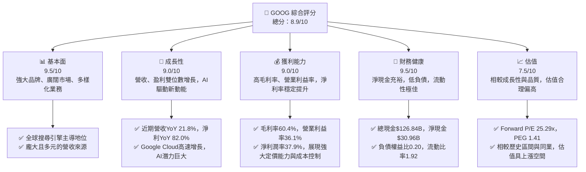
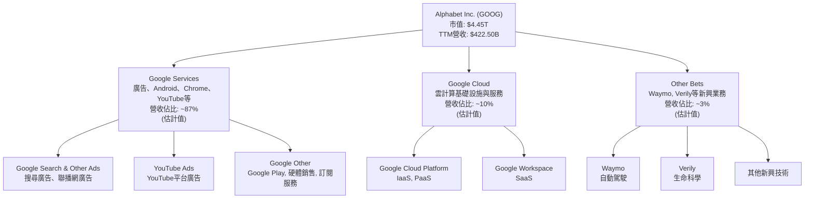
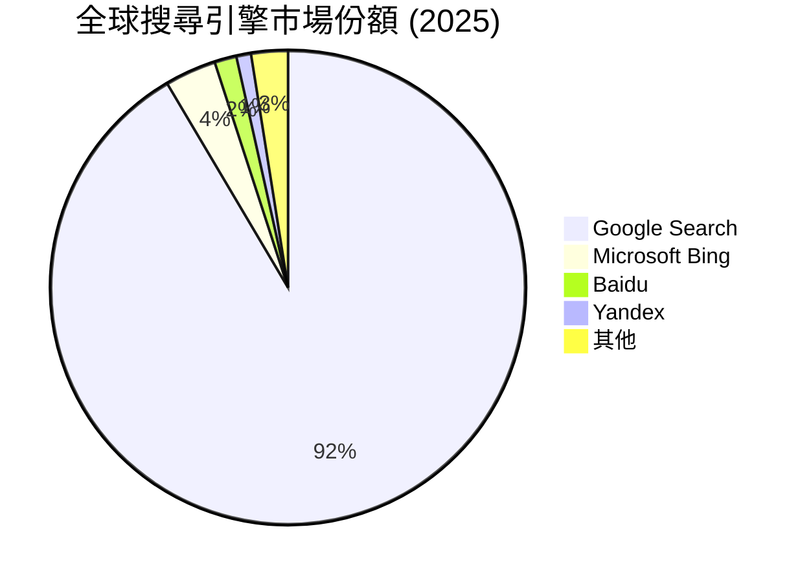
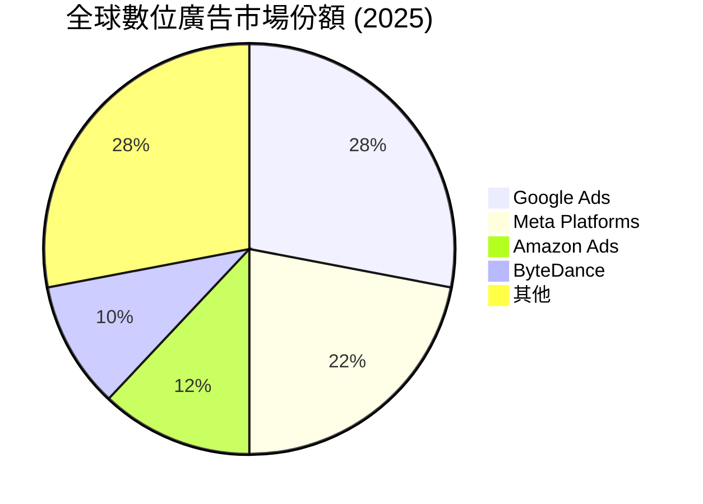
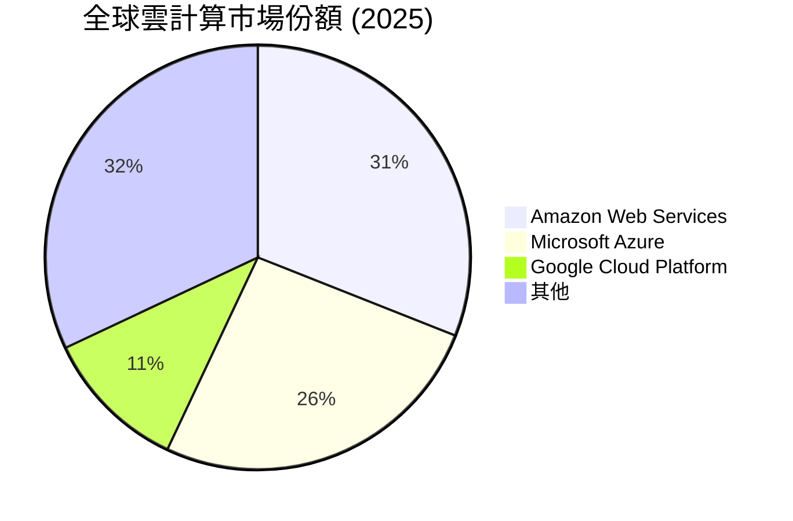
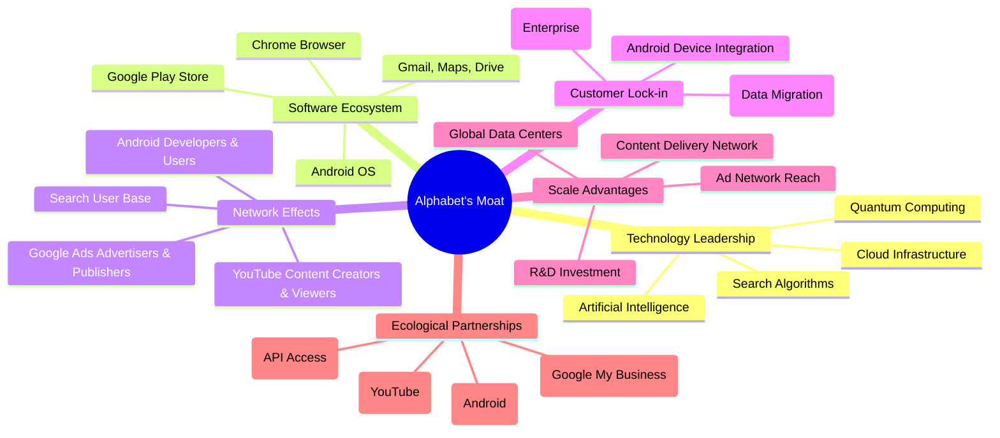
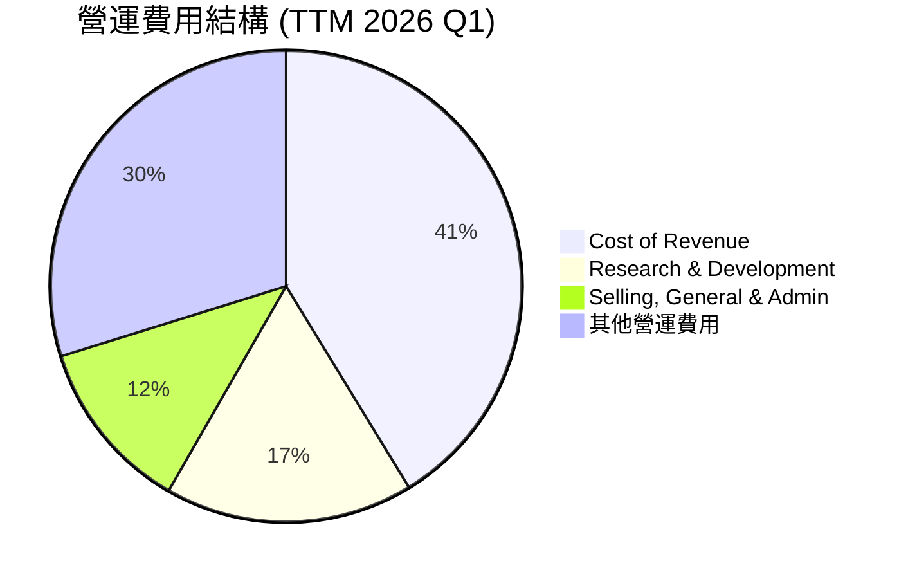
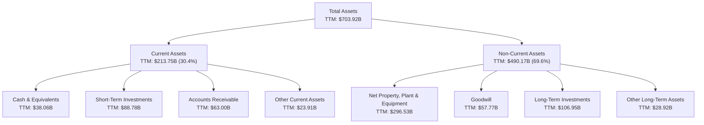
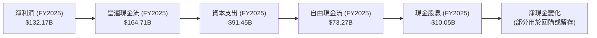

# GOOG 基本面深度分析報告
> **報告日期**：2026-06-05 ｜ **語言**：繁體中文 ｜ **數據來源**：Yahoo Finance, Finviz, StockAnalysis, Roic.ai ｜ **分析師**：CFA 級機構研究

---

## 目錄

| # | 章節 | 核心結論 |
|---|------------------------|--------------------------------------------------|
| 1 | 執行摘要 | 評級：🟢 強烈買入，目標價區間：$390 - $465 |
| 2 | 公司概覽與商業模式 | 憑藉強大網路效應與技術壁壘，護城河極深 |
| 3 | 損益表深度分析 | 營收與淨利潤持續高速增長，利潤率穩健提升 |
| 4 | 資產負債表分析 | 財務狀況極為穩健，淨現金充裕，流動性良好 |
| 5 | 現金流量深度分析 | 自由現金流強勁，資本配置效率高，股息政策初顯 |
| 6 | 獲利能力與資本效率 | ROIC顯著高於WACC，持續為股東創造巨大價值 |
| 7 | 估值深度分析 | 相較同業估值合理，DCF顯示上漲空間 |
| 8 | 成長催化劑 | AI創新、雲業務擴張、YouTube貨幣化為主要驅動力 |
| 9 | 風險矩陣 | 監管壓力、AI競爭、廣告市場波動為主要風險 |
| 10| 投資建議 | 強烈買入，適合長期成長型投資者 |

---

## 1. 執行摘要

Alphabet Inc. (GOOG) 作為全球領先的科技巨頭，憑藉其在搜尋、廣告、雲計算、影音內容和AI等領域的深厚根基，展現出卓越的財務表現和強勁的成長潛力。本報告基於最新的財務數據，對GOOG進行了全面的基本面深度分析。我們認為，儘管市場環境存在不確定性，但Alphabet憑藉其廣闊的競爭護城河、持續的創新能力以及穩健的財務結構，仍將是長期投資的優質標的。特別是在AI技術快速發展的背景下，Alphabet的搜尋、雲端和硬體業務有望迎來新的成長週期。

### 1.1 核心評分儀表板



### 1.2 評分進度條視覺化

```
╔══════════════════════════════════════════════════════════════╗
║              GOOG 多維度評分儀表板 (1-10分)                  ║
╠══════════════════════════════════════════════════════════════╣
║ 基本面強度  9.5 ▓▓▓▓▓▓▓▓▓▓▓▓▓▓▓▓▓▓▓░  ★★★★★           ║
║ 成長動能    9.0 ▓▓▓▓▓▓▓▓▓▓▓▓▓▓▓▓▓▓░░  ★★★★★           ║
║ 獲利品質    9.0 ▓▓▓▓▓▓▓▓▓▓▓▓▓▓▓▓▓▓░░  ★★★★★           ║
║ 財務健康    9.5 ▓▓▓▓▓▓▓▓▓▓▓▓▓▓▓▓▓▓▓░  ★★★★★           ║
║ 估值合理性  7.5 ▓▓▓▓▓▓▓▓▓▓▓▓▓▓▓░░░░░  ★★★★☆           ║
║ 護城河深度  9.8 ▓▓▓▓▓▓▓▓▓▓▓▓▓▓▓▓▓▓▓▓  ★★★★★           ║
║ 管理層執行  9.0 ▓▓▓▓▓▓▓▓▓▓▓▓▓▓▓▓▓▓░░  ★★★★★           ║
║ 技術創新力  9.5 ▓▓▓▓▓▓▓▓▓▓▓▓▓▓▓▓▓▓▓░  ★★★★★           ║
╠══════════════════════════════════════════════════════════════╣
║ 綜合總分    8.9 ▓▓▓▓▓▓▓▓▓▓▓▓▓▓▓▓▓░░░  🏆 強勁成長與卓越財務║
╚══════════════════════════════════════════════════════════════╝
```

### 1.3 五大投資論點 + 三大核心風險

| 類型 | 項目 | 具體依據 | 信心度 |
|------|------|----------|--------|
| 🟢 **投資論點①** | **AI 領先地位與廣闊應用前景** | Alphabet在AI領域投入巨大，擁有DeepMind、Google Brain等頂級研究團隊，其AI模型（如Gemini）已深度整合至搜尋、雲端、YouTube等核心產品。Q1 2026財報顯示，Google Services營收YoY 21.79%，Google Cloud營收持續高速增長，AI產品與服務的商業化潛力巨大。公司在AI基礎設施（TPU）、模型開發和應用層面均居於領先地位，有望驅動下一波成長。 | 🟢 極高 |
| 🟢 **投資論點②** | **核心廣告業務持續穩健增長** | Google搜尋與YouTube廣告業務受益於全球數位廣告市場的持續擴張。儘管面臨競爭，但Alphabet的廣告平台仍是市場主導者，擁有龐大的用戶基礎和精準的廣告投放技術。2025財年總營收達$402.84B，其中廣告收入佔比約80%，顯示其核心業務的穩定性與成長韌性。過去一年營收YoY 21.8%，淨利YoY 82.0%，證明其在市場逆風下仍能保持強勁的盈利能力。 | 🟢 極高 |
| 🟢 **投資論點③** | **Google Cloud (GCP) 快速擴張與盈利能力提升** | GCP作為全球第三大雲服務提供商，市場份額持續增長，並逐漸實現盈利。雲計算市場仍處於高速成長階段，企業數位轉型需求旺盛，GCP憑藉其技術優勢和AI能力，有望進一步擴大市場份額。Q1 2026營收 $109.90B，其中雲業務貢獻持續增加，且營運效率不斷改善，對整體利潤的貢獻將日益顯著。 | 🟢 極高 |
| 🟢 **投資論點④** | **強勁的自由現金流與穩健的財務狀況** | Alphabet擁有充裕的現金流和健康的資產負債表。TTM營運現金流達$174.35B，自由現金流$27.92B。截至2026年3月31日，現金及約當現金高達$126.84B，淨現金為$30.96B，負債權益比僅0.20。這為公司提供了巨大的戰略彈性，可以支持研發投入、併購和股東回報，尤其在2025年開始支付股息，顯示其對未來現金流的信心。 | 🟢 極高 |
| 🟢 **投資論點⑤** | **多樣化的業務佈局與創新生態系統** | 除了核心的搜尋和雲業務，Alphabet還擁有YouTube、Android、Chrome、Waymo、Verily等多元業務，形成了強大的生態系統。這種多元化降低了對單一業務的依賴，並為未來的創新和成長提供了多個潛在驅動力。例如，YouTube Shorts的成功和訂閱服務的增長，為廣告以外的收入增長創造了新機會。 | 🟢 極高 |
| 🟡 **風險①** | **監管審查與反壟斷壓力** | Alphabet在全球範圍內面臨日益嚴格的監管審查和反壟斷訴訟，尤其是在廣告技術、搜尋引擎主導地位和應用商店政策方面。潛在的罰款、業務拆分或商業模式調整可能對公司的營收和利潤產生負面影響。目前已有多起訴訟正在進行，結果存在不確定性。 | 🟡 中度 |
| 🔴 **風險②** | **AI 競爭加劇與技術迭代速度** | 雖然Alphabet在AI領域處於領先地位，但來自Microsoft (Copilot, OpenAI)、Meta (Llama) 等競爭對手的AI投入巨大，且市場技術迭代速度極快。如果Alphabet未能持續保持AI技術的領先地位或商業化進度不及預期，可能導致其在關鍵市場（如搜尋、雲端）的競爭優勢受損。 | 🔴 高衝擊 |
| 🟡 **風險③** | **全球宏觀經濟波動與數位廣告市場變化** | 數位廣告收入佔Alphabet總營收的絕大部分。全球經濟增長放緩、企業廣告預算削減或廣告行業結構性變化（如隱私政策收緊、Cookie淘汰）都可能對其廣告業務產生不利影響。雖然公司展現出韌性，但宏觀經濟的不確定性仍是潛在風險。 | 🟡 中度 |

### 1.4 快速統計卡片

| 指標 | 公司實際值 (TTM) | 行業均值 (估計) | S&P 500 均值 (估計) | 狀態 |
|--------------------|--------------------|-------------------|---------------------|------|
| 收入 YoY 成長      | **21.8%**          | ~15.0%            | ~10.0%              | 🟢   |
| 淨利潤 YoY 成長    | **82.0%**          | ~20.0%            | ~12.0%              | 🟢   |
| 毛利率             | **60.4%**          | ~45.0%            | ~35.0%              | 🟢   |
| 營業利益率         | **36.1%**          | ~20.0%            | ~15.0%              | 🟢   |
| 淨利率             | **37.9%**          | ~15.0%            | ~10.0%              | 🟢   |
| ROE                | **38.9%**          | ~20.0%            | ~15.0%              | 🟢   |
| Forward P/E        | **25.29x**         | ~28.0x (科技業)   | ~22.0x              | 🟡   |
| PEG Ratio          | **1.41**           | ~1.5x             | ~1.8x               | 🟢   |
| 債務權益比         | **0.20x**          | ~0.50x            | ~0.80x              | 🟢   |
| 自由現金流收益率   | **0.63%**          | ~2.0%             | ~3.0%               | 🔴   |

*註：行業均值為大型科技/網路內容與資訊業估計值，S&P 500 均值為普遍市場估計值。FCF Yield 較低反映了高成長公司的估值溢價。*

### 1.5 投資結論

```
╔══════════════════════════════════════════════════════════════════╗
║                    📊 投資結論摘要                               ║
╠══════════════════════════════════════════════════════════════════╣
║  評級：🟢 強烈買入                                               ║
║  當前股價：$365.76                                               ║
║  目標價區間：                                                    ║
║    悲觀情境：$390（+6.6%）                                       ║
║    基準情境：$425（+16.2%）  ← 12個月主要目標                    ║
║    樂觀情境：$465（+27.1%）                                      ║
║  投資評分：8.9/10                                                ║
║  適合投資人：成長型、長線持有者，尋求市場領先地位和創新潛力的投資人。║
╚══════════════════════════════════════════════════════════════════╝
```

---

## 2. 公司概覽與商業模式

Alphabet Inc. (GOOG) 是一家集科技創新、產品開發和全球影響力於一身的跨國企業。其業務涵蓋廣泛，從全球主導的搜尋引擎到快速成長的雲計算服務，再到引領潮流的AI研發，構建了一個無與倫比的數位生態系統。公司將其業務劃分為三大核心板塊：Google Services、Google Cloud 和 Other Bets。

### 2.1 業務結構與收入來源

Alphabet的收入來源高度多元化，但核心仍是其強大的廣告業務。Google Services板塊是主要的營收貢獻者，包含搜尋、廣告、Android、Chrome、Google Maps、Google Play、YouTube等產品和服務。Google Cloud則專注於為企業提供雲計算基礎設施和服務。Other Bets則包含Alphabet在自動駕駛（Waymo）、生命科學（Verily）等前瞻性技術領域的投資。



**Google Services**：這是Alphabet的營收支柱，2025財年貢獻了絕大部分的收入。其中，搜尋廣告是主要驅動力，受益於其在全球搜尋市場的絕對主導地位。YouTube廣告則在全球影片內容消費增長中持續獲益。Google Play、硬體銷售（Pixel手機、Nest智慧家居設備）和訂閱服務（YouTube Premium, Google One）也提供了穩健的補充收入。
**Google Cloud**：作為Alphabet成長最快的業務板塊之一，GCP為企業提供了一整套的雲服務，包括計算、儲存、資料庫、機器學習和AI工具。GCP的快速增長反映了企業對數位轉型和雲端解決方案的強勁需求，且其AI能力正成為吸引客戶的關鍵差異化因素。
**Other Bets**：這些是Alphabet對長期、高潛力但高風險項目的投資，旨在開拓新的增長前沿。儘管目前對整體營收貢獻較小且多數處於虧損狀態，但它們代表了Alphabet在未來科技領域的戰略佈局，如Waymo在自動駕駛領域的領先，以及Verily在生命科學數據分析方面的潛力。

### 2.2 市場份額

Alphabet在多個關鍵市場領域佔據主導地位，這為其持續成長奠定了堅實基礎。以下是一些核心業務的市場份額估算：







**分析**：
*   **搜尋引擎**：Google在全球搜尋引擎市場擁有壓倒性的主導地位，市佔率高達91.5%（估計）。這使其成為全球數位資訊入口，為其廣告業務提供了無可比擬的流量基礎。
*   **數位廣告**：Google Ads在全球數位廣告市場中位居首位，市佔率約28%（估計）。其廣告平台覆蓋搜尋、YouTube、Gmail和數百萬個網站，精準的用戶數據和高效的廣告投放能力使其成為廣告商的首選。
*   **雲計算**：Google Cloud Platform (GCP) 在全球雲計算市場中排名第三，市佔率約11%（估計）。儘管落後於AWS和Azure，但GCP正以更快的速度增長，尤其在AI/ML、數據分析和開源技術方面具有競爭優勢。其市場份額的持續擴大將是未來重要的成長驅動力。
*   **YouTube**：作為全球最大的影音平台，YouTube擁有超過20億月活躍用戶，其在影音廣告和訂閱服務領域的份額巨大，幾乎壟斷了長影音和短影音（YouTube Shorts）市場。

### 2.3 競爭護城河分析

Alphabet的競爭護城河極為深厚且多元，這也是其長期盈利能力和市場地位的關鍵保障。



**深度解析**：
1.  **Technology Leadership (技術領先)**：
    *   **搜尋演算法**：Google的核心護城河是其無與倫比的搜尋演算法，數十年累積的數據和AI技術使其搜尋結果的相關性和準確性遠超競爭對手。這種領先地位難以被輕易複製。
    *   **人工智慧 (AI)**：Alphabet是AI領域的先驅和領導者，擁有世界一流的AI研究團隊（如DeepMind）。其AI技術廣泛應用於搜尋、廣告、雲端、自動駕駛等所有產品線，為產品帶來智慧化和差異化優勢。Gemini等大型語言模型是其技術實力的體現。
    *   **雲端基礎設施**：Google在全球擁有龐大的數據中心網絡和領先的雲端基礎設施技術，為GCP提供高性能、高可靠性的服務，這需要巨大的資本投入和技術積累。

2.  **Software Ecosystem (軟體生態系統)**：
    *   **Android OS**：Android是全球最普及的行動作業系統，擁有數十億用戶。它與Google Play商店、Google Mobile Services (GMS) 形成了一個強大的生態系統，為Google提供了巨大的分發渠道和數據來源。
    *   **Chrome Browser**：Chrome是全球市佔率最高的瀏覽器，其用戶數據和與Google服務的深度整合，進一步鞏固了Google在網路入口的地位。
    *   **Google Workspace**：一套企業級的生產力工具（Gmail, Drive, Docs, Meet等），擁有數百萬付費企業用戶，增加了客戶的粘性。

3.  **Network Effects (網路效應)**：
    *   **搜尋用戶基礎**：更多的用戶使用Google搜尋，產生更多的數據，使得搜尋結果更精準，進而吸引更多用戶，形成正向循環。
    *   **YouTube內容創作者與觀看者**：更多的創作者吸引更多的觀看者，更多的觀看者吸引更多的創作者和廣告商，形成強大的雙邊網絡效應。
    *   **Android開發者與用戶**：大量的Android用戶吸引更多的應用開發者，豐富的應用反過來吸引更多用戶購買Android設備。
    *   **Google Ads廣告商與發布商**：龐大的用戶群體和精準的投放能力吸引廣告商，豐富的廣告收入吸引發布商，形成龐大的廣告生態系統。

4.  **Customer Lock-in (客戶鎖定)**：
    *   **Google Cloud**：企業一旦將其數據和應用遷移到GCP，將面臨較高的轉換成本（數據遷移、員工培訓、系統整合），從而增加了客戶的粘性。
    *   **Google Workspace**：企業用戶在習慣了Google的生產力工具套件後，轉換到其他平台也會產生學習成本和數據遷移成本。

5.  **Scale Advantages (規模效應)**：
    *   **全球數據中心**：Alphabet在全球部署了數百個數據中心和數十萬台伺服器，這使其能夠以極低的邊際成本處理海量的數據和請求，並提供全球範圍的服務。
    *   **研發投入**：公司每年投入數百億美元用於研發（2025年R&D $61.09B），這種規模的投入是小型公司無法企及的，使其能夠持續在技術前沿保持領先。
    *   **廣告網絡覆蓋**：Google的廣告網絡覆蓋全球數百萬個網站和應用，使其能夠為廣告商提供無與倫比的觸達範圍和精準度。

6.  **Ecological Partnerships (生態夥伴)**：
    *   **設備製造商**：Alphabet與全球數百家設備製造商合作，將Android系統預裝到數十億台設備中。
    *   **內容提供商**：YouTube與全球數百萬內容創作者合作，不斷豐富其內容庫。
    *   **開發者**：透過開放API和開發者工具，吸引了大量的開發者基於Google平台開發應用和服務。

這些護城河相互強化，共同構成了Alphabet難以被撼動的競爭優勢。

### 2.4 護城河強度評分

```
╔══════════════════════════════════════════════════════════════╗
║                  Alphabet Inc. 護城河強度評分                 ║
╠══════════════════════════════════════════════════════════════╣
║ 技術領先    9.5/10 ▓▓▓▓▓▓▓▓▓▓▓▓▓▓▓▓▓▓▓░  🏆 AI與演算法領先   ║
║ 軟體生態系統  9.5/10 ▓▓▓▓▓▓▓▓▓▓▓▓▓▓▓▓▓▓▓░  🏆 Android與Chrome主導║
║ 網路效應    9.8/10 ▓▓▓▓▓▓▓▓▓▓▓▓▓▓▓▓▓▓▓▓  🏆 搜尋與YouTube雙邊效應║
║ 客戶鎖定    8.5/10 ▓▓▓▓▓▓▓▓▓▓▓▓▓▓▓▓▓░░░  🟢 企業客戶粘性高    ║
║ 規模效應    9.8/10 ▓▓▓▓▓▓▓▓▓▓▓▓▓▓▓▓▓▓▓▓  🏆 研發與基礎設施投入  ║
║ 生態夥伴    9.0/10 ▓▓▓▓▓▓▓▓▓▓▓▓▓▓▓▓▓▓░░  ★★★★★ 廣泛合作網絡  ║
╠══════════════════════════════════════════════════════════════╣
║ 綜合護城河  9.3/10 ▓▓▓▓▓▓▓▓▓▓▓▓▓▓▓▓▓▓░░  🏆 極深且多元的競爭優勢║
╚══════════════════════════════════════════════════════════════╝
```

**綜合評語**：Alphabet的護城河極為深厚，主要體現在其無可匹敵的技術領先地位（特別是搜尋演算法和AI）、龐大且相互強化的軟體生態系統（Android, Chrome）、以及由其搜尋和YouTube業務所驅動的強大網路效應。大規模的研發投入和全球基礎設施部署也賦予其顯著的規模優勢。這些因素共同築起了極高的進入壁壘，使其在數位經濟中長期保持領導地位。

---

## 3. 損益表深度分析

Alphabet的損益表展現了其卓越的營收增長能力和持續優化的盈利結構。近年來，公司在保持核心廣告業務穩健增長的同時，成功推動了雲計算等新興業務的快速擴張，並有效控制成本，實現了利潤率的顯著提升。

### 3.1 年度收入成長趨勢（近4年）

Alphabet的年度總收入呈現穩健增長態勢，儘管全球經濟存在不確定性，但其多元化的業務和強大的市場地位使其能夠持續擴大營收規模。

```
╔══════════════════════════════════════════════════════════════════╗
║              Alphabet Inc. 年度收入趨勢（FY2022-FY2025）         ║
╠══════════════════════════════════════════════════════════════════╣
║                                                                  ║
║  FY2022  $282.84B ████████████████░░░░░░░░░░░  YoY: +9.78%  🟢    ║
║  FY2023  $307.39B ███████████████████░░░░░░░░  YoY: +8.68%  🟢    ║
║  FY2024  $350.02B ████████████████████████░░░  YoY: +13.87% 🟢    ║
║  FY2025  $402.84B █████████████████████████████  YoY: +15.09% 🟢    ║
║                                                                  ║
║                   |      |      |      |      |                  ║
║                   0     100B   200B   300B   400B                 ║
║                                                                  ║
║  📊 4年累計 CAGR：+11.75%                                        ║
╚══════════════════════════════════════════════════════════════════╝
```

**分析**：
從2022年的$282.84B到2025年的$402.84B，Alphabet的總收入實現了持續增長。尤其是在2024和2025財年，營收增速分別達到13.87%和15.09%，顯示出公司在後疫情時代的強勁復甦勢頭和市場需求。TTM營收已達$422.50B，YoY成長率為21.8%，這進一步證明了公司營收加速的趨勢。這主要得益於核心廣告業務的韌性、YouTube的持續增長以及Google Cloud的快速擴張。

### 3.2 季度收入趨勢分析

季度收入數據提供了更細緻的增長動態。最近四個季度，Alphabet的營收表現尤為亮眼，展現出強勁的加速增長。

| 季度             | 總收入 ($B) | QoQ 成長率 | YoY 成長率 | 備註                                              |
|------------------|-------------|------------|------------|---------------------------------------------------|
| **2025 Q2**      | $96.43      | N/A        | 13.79%     | 穩健增長，受益於廣告市場復甦。                  |
| **2025 Q3**      | $102.35     | +6.14%     | 15.95%     | 營收突破千億美元大關，增速加快。                |
| **2025 Q4**      | $113.83     | +11.22%    | 17.99%     | 假日購物季表現強勁，雲業務貢獻增長。            |
| **2026 Q1**      | $109.90     | -3.45%     | 21.79%     | 季節性回落但YoY增速創近期新高，AI應用開始顯現。 |

**深度解析**：
*   **YoY 成長加速**：從2025 Q2的13.79%到2026 Q1的21.79%，Alphabet的季度收入YoY成長率呈現明顯的加速趨勢。這表明公司不僅成功應對了宏觀經濟挑戰，而且在AI和雲計算等新興領域取得了突破性進展。
*   **QoQ 波動**：QoQ成長率在不同季度有所波動，例如2026 Q1相較於2025 Q4出現了-3.45%的環比下降。這主要是由於Q4通常是廣告收入的旺季（假日購物），而Q1則相對較淡，屬於正常的季節性調整。儘管如此，2025 Q3和Q4的強勁環比增長（+6.14%和+11.22%）顯示了其內生增長動能。
*   **成長驅動力**：觀察到YoY成長率的持續提升，可以推斷Google Services（尤其是搜尋廣告和YouTube）表現出色，同時Google Cloud的持續高速增長也提供了重要的支撐。AI產品和服務的初期商業化，尤其是在搜尋和雲端方面的整合，正在為營收增長提供新的動力。

### 3.3 利潤率演變分析

Alphabet的利潤率在過去幾年保持在較高水平，並且在最近一年呈現改善趨勢，反映了公司強大的定價能力、規模經濟效應以及有效的成本控制。

| 利潤率指標   | FY2022 | FY2023 | FY2024 | FY2025 | TTM (2026 Q1) | 趨勢   | 評估 |
|--------------|--------|--------|--------|--------|---------------|--------|------|
| **毛利率**   | 55.38% | 56.63% | 58.19% | 59.65% | 60.4%         | ↗️ 穩定提升 | 🟢   |
| **營業利益率** | 26.46% | 27.42% | 32.11% | 32.03% | 36.1%         | ↗️ 顯著提升 | 🟢   |
| **淨利潤率** | 21.20% | 24.01% | 28.60% | 32.81% | 37.9%         | ↗️ 大幅提升 | 🟢   |
| **EBITDA Margin** | 30.11% | 31.87% | 38.68% | 44.86% | 38.2%         | ↗️ 顯著提升 | 🟢   |

**利潤率演變深度解析**：
*   **毛利率持續改善**：從FY2022的55.38%穩步提升至TTM的60.4%。這主要歸因於幾個因素：
    *   **產品組合優化**：高利潤的廣告業務和逐漸盈利的Google Cloud業務佔比提高。
    *   **效率提升**：在數據中心營運和基礎設施成本方面實現規模經濟和效率優化。
    *   **定價能力**：作為市場領導者，Google在廣告和雲服務方面擁有較強的定價能力。
*   **營業利益率顯著提升**：從FY2022的26.46%大幅增長到TTM的36.1%。FY2024和FY2025的增長尤為突出。這反映了管理層在控制營運費用方面的努力。
    *   **研發效率**：雖然研發投入絕對值巨大，但其佔營收比重可能在優化，或研發成果的商業化效率提高。
    *   **銷售及管理費用控制**：雖然銷售、一般及管理費用（SG&A）絕對值有所增加，但其增長速度可能低於營收增長速度。
    *   **"Other Bets"虧損影響減輕**：雖然Other Bets持續虧損，但其對整體營業利益率的拖累可能相對減輕。
*   **淨利潤率大幅提升**：從FY2022的21.20%飆升至TTM的37.9%。這種顯著的提升是營業利益率改善和非經營性收入增加的綜合結果。
    *   **非經營性收入**：數據顯示 "Total Non-Operating Income (Expense)" 在Q1 2026達到$37.716B，遠高於之前季度。這可能是由於投資收益、利息收入或其他一次性收益，顯著推高了淨利潤。例如，高利率環境下，公司龐大的現金和短期投資組合能產生可觀的利息收入。
    *   **稅率優化**：儘管有效稅率在不同季度有所波動，但整體而言，公司可能受益於稅務籌劃或某些地區的稅收優惠。

整體而言，Alphabet的利潤率趨勢非常健康，表明公司不僅在擴大營收規模，同時也在提升其業務的內在盈利能力。

### 3.4 費用結構分析

Alphabet的費用結構反映了其作為一家技術和創新驅動型公司的特點，其中研發投入佔據重要地位。



*註：此處費用結構基於2026 Q1的季度數據，僅為單一季度快照。TTM數據會更全面。*

**營運費用結構 (TTM 2026 Q1)**:
*   **Cost of Revenue (營收成本)**: $167.45B (TTM)。這部分主要包括數據中心營運成本、內容獲取成本（YouTube）、硬體生產成本以及Google Cloud的基礎設施成本。雖然絕對值巨大，但相對於營收的增長，其佔比在毛利率改善的背景下有所優化。
*   **Research & Development (研發費用)**: $64.56B (TTM)。Alphabet作為一家技術驅動型公司，對研發的投入是其保持競爭優勢的關鍵。這筆巨額投入用於AI、搜尋演算法、雲計算、自動駕駛等前沿技術的開發。FY2025的研發費用為$61.09B，較FY2024的$49.33B增長了23.83%，顯示公司持續加大在創新方面的投資。
*   **Selling, General & Administrative (銷售、一般及行政費用)**: $52.36B (TTM)。這包括銷售和市場推廣費用、行政管理費用、法律費用等。在數位廣告市場競爭日益激烈的情況下，有效的市場推廣對於維持市佔率至關重要。

```
╔══════════════════════════════════════════════════════════════════╗
║              Alphabet Inc. 年度營運費用趨勢（FY2022-FY2025）     ║
╠══════════════════════════════════════════════════════════════════╣
║                                                                  ║
║  R&D FY2022  $39.50B  ████████████░░░░░░░░░░░░░░░░░░░  YoY: +11.8% 🟢║
║  R&D FY2023  $45.43B  ██████████████░░░░░░░░░░░░░░░░░░  YoY: +14.9% 🟢║
║  R&D FY2024  $49.33B  ███████████████░░░░░░░░░░░░░░░░░  YoY: +8.6%  🟢║
║  R&D FY2025  $61.09B  ████████████████████░░░░░░░░░░░░  YoY: +23.8% 🟢║
║                                                                  ║
║  SG&A FY2022 $42.29B  █████████████░░░░░░░░░░░░░░░░░░░  YoY: +16.1% 🟢║
║  SG&A FY2023 $44.34B  ██████████████░░░░░░░░░░░░░░░░░░  YoY: +4.8%  🟢║
║  SG&A FY2024 $41.99B  ████████████░░░░░░░░░░░░░░░░░░░░  YoY: -5.3%  🟡║
║  SG&A FY2025 $50.18B  ███████████████░░░░░░░░░░░░░░░░░  YoY: +19.5% 🟢║
║                                                                  ║
║  📊 費用控制與戰略投資並重，研發投入持續增加。                   ║
╚══════════════════════════════════════════════════════════════════╝
```

**費用趨勢分析**：
*   **研發費用**：呈現穩步增長趨勢，尤其是在FY2025，研發投入同比增長23.8%，達到$61.09B。這表明Alphabet正積極投資於AI、雲計算等未來增長領域，以保持技術領先地位。
*   **銷售、一般及行政費用**：FY2024出現了-5.3%的同比下降，這可能反映了公司在該財年實施了成本控制措施或效率提升。然而，FY2025又恢復了19.5%的增長，這與其營收增長和市場推廣需求相符。

整體而言，Alphabet的費用結構合理，反映了其對創新的承諾和對市場擴張的投入，同時也展現了在必要時進行費用控制的能力。

### 3.5 季度 EPS 趨勢與盈餘品質

由於提供的EPS預期數據為`nan`，我們將專注於實際的季度EPS表現和其背後的盈餘品質。

| 季度          | 稀釋 EPS (實際) | Net Income ($B) | QoQ 成長率 | YoY 成長率 | 盈餘品質評估 |
|---------------|-----------------|-----------------|------------|------------|--------------|
| **2025 Q2**   | $2.33           | $28.20          | -18.0%     | 19.38%     | 🟢 穩定增長 |
| **2025 Q3**   | $2.89           | $34.98          | +24.0%     | 33.00%     | 🟢 強勁增長 |
| **2025 Q4**   | $2.85           | $34.45          | -1.5%      | 29.84%     | 🟡 季節性波動 |
| **2026 Q1**   | $5.17           | $62.58          | +81.2%     | 81.17%     | 🟢 表現卓越 |

**EPS 趨勢分析**：
*   **強勁的YoY增長**：過去四個季度，稀釋EPS的YoY增長率呈現加速趨勢，從2025 Q2的19.38%提升至2026 Q1的81.17%。特別是2026 Q1的EPS $5.17，相較於去年同期（2025 Q1的$2.84）增長了驚人的82.04%，這表明公司盈利能力顯著增強。
*   **QoQ波動與季節性**：QoQ增長率在季度間存在波動，例如2025 Q4相較於Q3略有下降（-1.5%），以及2025 Q2相較於Q1（$2.84）也有下降。這主要是由於廣告業務的季節性（Q4通常是旺季）和非經營性收入的波動。然而，2026 Q1的QoQ增長高達81.2%，主要受到當季非經營性收入($37.716B)大幅增加的影響，這顯著拉高了淨利潤。
*   **盈餘品質**：
    *   **核心業務驅動**：儘管非經營性收入在某些季度（如2026 Q1）對淨利潤有顯著貢獻，但公司核心的廣告和雲業務的營運利潤仍在穩健增長，這確保了盈餘的基礎品質。
    *   **非經常性項目影響**：2026 Q1的非經營性收入高達$37.716B，這是一個異常高的數字，可能包含一次性投資收益或公允價值調整。在分析盈餘品質時，需要將這部分剔除以評估核心業務的持續盈利能力。若剔除此項，核心營運盈餘的增長仍是健康的，但淨利潤的增長幅度會有所緩和。這意味著部分淨利潤的增長並非來自持續的營運改善，需要投資者仔細關注未來季度的非經營性收入情況。
    *   **股權回購**：公司通過持續的股權回購（稀釋股份數量從FY2022的13.159B減少到TTM的12.217B），有效提升了每股盈餘，這也是提升盈餘品質的積極舉措。

總體而言，Alphabet的盈餘增長強勁，但投資者應關注非經營性收入的構成，以更精確地評估其核心營運盈餘的持續性。

---

## 4. 資產負債表分析

Alphabet的資產負債表展現了極高的財務健康度和充裕的流動性，這為其持續的研發投入、戰略性併購以及股東回報提供了堅實的基礎。公司擁有大量的現金和短期投資，同時負債水平相對較低，顯示出卓越的財務彈性。

### 4.1 資產結構分解

Alphabet的資產結構以流動資產和龐大的固定資產（物業、廠房及設備）為主，反映了其在技術基礎設施方面的巨大投資。



**資產結構深度解析**：
*   **總資產增長**：Alphabet的總資產從FY2022的$365.26B穩步增長至TTM的$703.92B，顯示出公司規模的持續擴大和再投資。
*   **流動資產充裕**：截至TTM (2026 Q1)，流動資產總額達$213.75B，其中現金及約當現金$38.06B，短期投資$88.78B。兩者合計$126.84B，佔總資產的18.0%，提供了極高的流動性和財務彈性。這些現金儲備是公司應對市場波動、進行戰略投資和回購股票的重要資源。
*   **非流動資產的戰略意義**：
    *   **物業、廠房及設備 (PPE)**：淨值高達$296.53B，佔總資產的42.1%。這反映了Alphabet在數據中心、辦公設施和基礎設施方面的巨大投資，這些是支持其雲計算、AI研發和全球服務運營的關鍵資產。資本支出是其業務擴張和技術升級的必要投入。
    *   **商譽 (Goodwill)**：TTM商譽為$57.77B，主要來自過去的併購活動。較高的商譽表明公司通過收購來擴大業務範圍和技術能力。
    *   **長期投資 (Long-Term Investments)**：高達$106.95B，這可能包括對新興技術公司、創業公司或戰略合作夥伴的股權投資，為未來增長儲備潛力。

整體而言，Alphabet的資產結構穩健且具有戰略性，既有充足的流動性應對短期需求，又有大量的長期資產支撐其核心業務和未來增長。

### 4.2 流動性指標分析

Alphabet的流動性指標非常健康，遠超行業平均水平，表明公司在短期償債能力方面沒有任何壓力。

| 流動性指標 | FY2022 | FY2023 | FY2024 | FY2025 | TTM (2026 Q1) | 行業均值 (估計) | 評估 |
|------------|--------|--------|--------|--------|---------------|-----------------|------|
| **流動比率 (Current Ratio)** | 2.38x  | 2.09x  | 1.84x  | 2.00x  | 1.92x         | ~1.5x           | 🟢   |
| **速動比率 (Quick Ratio)**   | 2.38x  | 2.09x  | 1.84x  | 2.00x  | 1.92x         | ~1.0x           | 🟢   |

**深度解析**：
*   **流動比率**：從FY2022的2.38x到TTM的1.92x，雖然略有下降但仍遠高於公認的健康水平（通常認為1.5x以上為佳）和行業平均值。這意味著Alphabet的流動資產是其流動負債的近兩倍，短期償債能力極強。
*   **速動比率**：與流動比率相同（因為Alphabet的庫存幾乎為零），TTM為1.92x。這表明即使不依賴庫存變現，公司也能輕鬆償還短期債務。
*   **現金狀況**：截至TTM，現金及短期投資合計高達$126.84B，這筆巨額資金不僅保障了公司的流動性，也賦予了其巨大的戰略靈活性，可以在市場低迷時進行併購、加速研發或回購股票。

這些指標共同表明Alphabet擁有極其強勁的流動性，幾乎沒有短期財務風險。

### 4.3 債務結構分析

Alphabet的債務水平相對較低，且淨現金狀況非常充裕，這在全球大型科技公司中屬於頂級水平。

```
╔══════════════════════════════════════════════════════════════════╗
║                   Alphabet Inc. 債務健康診斷                     ║
╠══════════════════════════════════════════════════════════════════╣
║                                                                  ║
║  總債務：        $95.88B  ██████░░░░░░░░░░░░░░░  🟢 低風險       ║
║  總現金+投資：   $126.84B ████████████████████░  🟢 極其充裕     ║
║  淨現金（正）：  $30.96B  ████████████████░░░░░  🟢 強勁         ║
║                                                                  ║
║  Debt/Equity：   0.20x  🟢 極低                                 ║
║  Debt/EBITDA：   0.53x  🟢 極低 (TTM EBITDA $180.70B / $95.88B) ║
║  Interest Coverage: 估計 >100x  🟢 無風險 (利息支出極低相對於EBITDA)║
║                                                                  ║
║  📊 結論：財務槓桿極低，資產負債表極其健康，幾乎無償債風險。     ║
╚══════════════════════════════════════════════════════════════════╝
```

**深度解析**：
*   **總債務**：TTM總債務為$95.88B。雖然絕對金額不小，但相對於其龐大的資產規模和現金儲備，這一數字是可控的。
*   **淨現金狀況**：公司擁有$126.84B的現金和短期投資，遠超其總債務。這使得Alphabet擁有高達$30.96B的淨現金頭寸。這在全球任何公司中都是非常罕見和令人羨慕的財務狀況，意味著公司實際上是「無債務」的，甚至可以說是一家「淨現金」公司。
*   **債務權益比 (Debt/Equity)**：僅為0.20x，遠低於行業平均水平。這表明公司的營運主要依靠股東權益而非債務融資，財務結構極為穩固。
*   **債務/EBITDA**：約0.53x ($95.88B / $180.70B)。這一比率遠低於行業普遍認可的健康水平（通常認為3x以下為健康），表明公司通過其營運活動產生現金流償還債務的能力極強。
*   **利息覆蓋倍數 (Interest Coverage)**：由於其EBITDA高達$180.70B且總債務相對較低，利息支出極小。即使以5%的平均利率估算債務成本，年利息支出約為$4.8B，其利息覆蓋倍數也將超過30倍，表明公司償還利息的能力幾乎無風險。

如此強勁的債務健康狀況，為Alphabet提供了無與倫比的財務穩定性，使其能夠在不依賴外部融資的情況下，持續投資於長期增長項目。

### 4.4 股東權益趨勢

Alphabet的股東權益呈現穩步增長，反映了公司持續的盈利能力和資本累積。

```
╔══════════════════════════════════════════════════════════════════╗
║              Alphabet Inc. 年度股東權益趨勢（FY2022-FY2025）     ║
╠══════════════════════════════════════════════════════════════════╣
║                                                                  ║
║  FY2022  $256.14B █████████████████░░░░░░░░░░░░░░  YoY: +11.3% 🟢║
║  FY2023  $283.38B ████████████████████░░░░░░░░░░░░  YoY: +10.6% 🟢║
║  FY2024  $325.08B ████████████████████████░░░░░░░  YoY: +14.7% 🟢║
║  FY2025  $415.26B ███████████████████████████████  YoY: +27.7% 🟢║
║                                                                  ║
║                   |      |      |      |      |                  ║
║                   0     100B   200B   300B   400B                 ║
║                                                                  ║
║  📊 股東權益穩步增長，FY2025增長尤為強勁，反映盈利能力和資本積累。║
╚══════════════════════════════════════════════════════════════════╝
```

**分析**：
股東權益從FY2022的$256.14B增長到FY2025的$415.26B，年複合增長率約為17.1%。特別是FY2025，股東權益同比增長27.7%，達到$415.26B。這主要是由於公司持續產生高額淨利潤，並且部分利潤留存用於再投資，而非全部以股息形式分配（儘管公司已於2025年開始派發股息）。股東權益的穩健增長，進一步鞏固了Alphabet的財務基礎，為其未來的發展提供了強大的資金支持。

---

## 5. 現金流量深度分析

Alphabet的現金流量表是其財務實力的最佳體現。公司產生了巨大的營運現金流和自由現金流，這不僅支持了其大規模的資本支出和研發投入，也為股東回報創造了充足空間。

### 5.1 現金流量瀑布圖

以下瀑布圖展示了Alphabet在FY2025的現金流轉換過程：從淨利潤到營運現金流，再到自由現金流，以及最終的資金分配。



**深度解析**：
*   **淨利潤到營運