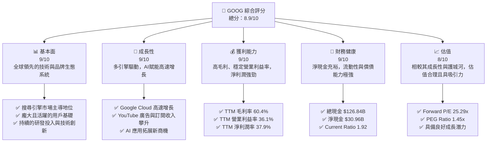
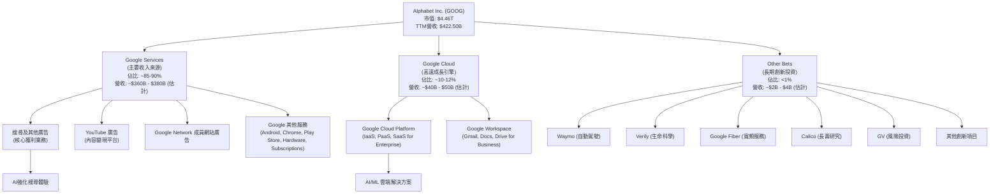
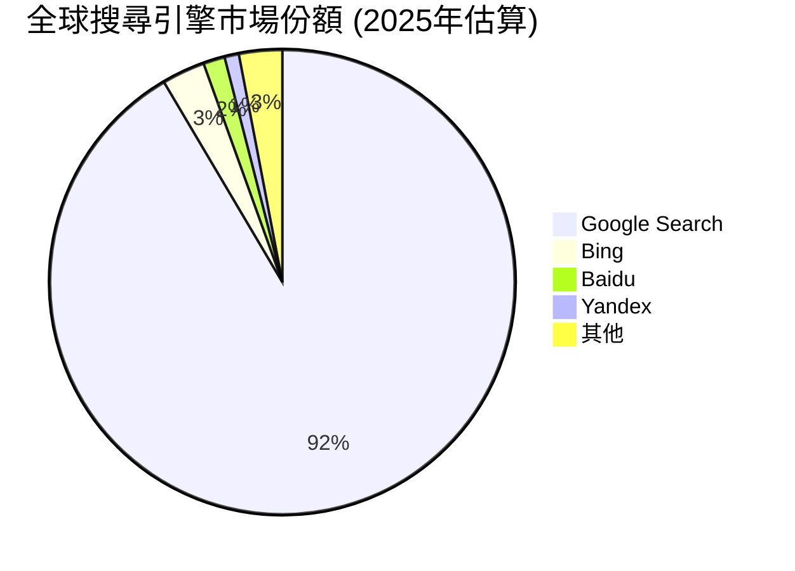
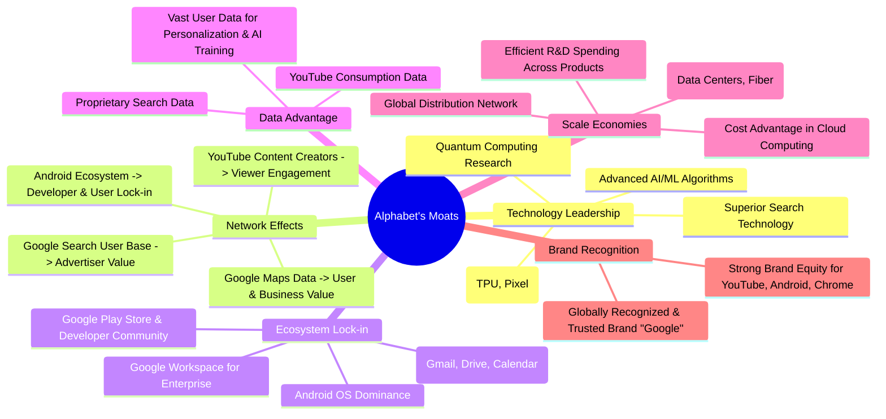
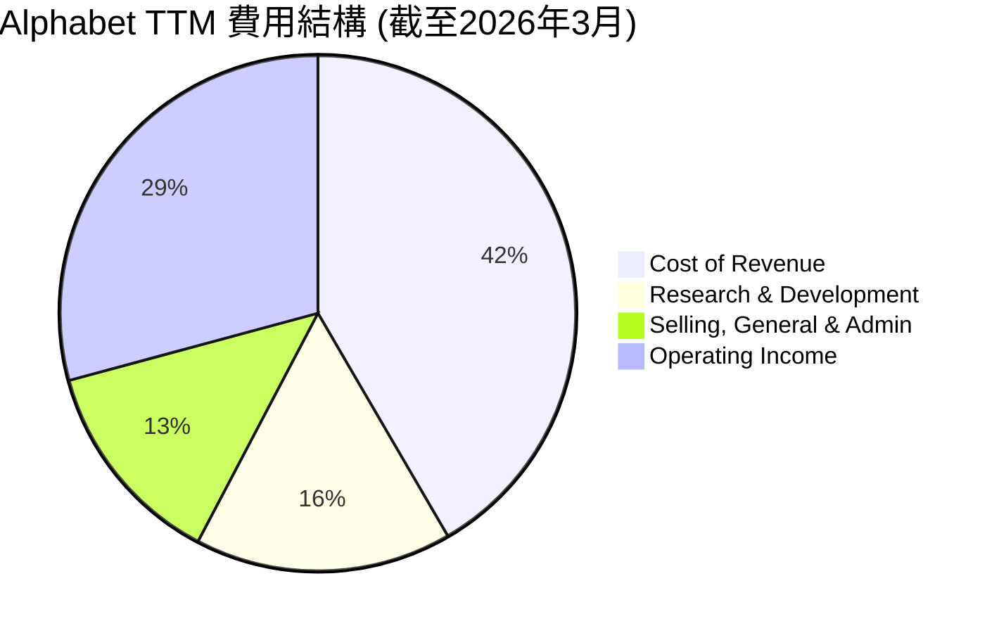
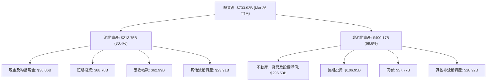

# GOOG 基本面深度分析報告
> **報告日期**：2026-06-06 ｜ **語言**：繁體中文 ｜ **數據來源**：Yahoo Finance, Finviz, StockAnalysis, Roic.ai ｜ **分析師**：CFA 級機構研究

---

## 目錄

| # | 章節 | 核心結論 |
|---|------------------------|------------------------------------------------------------------|
| 1 | 執行摘要 | 評級：🟢 強烈買入，目標價區間：$390 - $450 |
| 2 | 公司概覽與商業模式 | 護城河深度極強，由技術領先、網路效應與規模效應共同構築。 |
| 3 | 損益表深度分析 | 收入與淨利潤呈現強勁增長，利潤率持續改善，顯示高效營運。 |
| 4 | 資產負債表分析 | 財務結構穩健，現金充裕，債務風險極低，流動性良好。 |
| 5 | 現金流量深度分析 | 自由現金流生成能力卓越，資本配置策略注重成長與股東回報。 |
| 6 | 獲利能力與資本效率 | ROIC 遠高於 WACC，強力創造股東價值，資本效率持續提升。 |
| 7 | 估值深度分析 | 相較同業估值合理，DCF 模型顯示具吸引力的上行空間。 |
| 8 | 成長催化劑 | AI 創新、雲端業務擴張、YouTube 變現及全球市場滲透為主要動能。 |
| 9 | 風險矩陣 | 監管壓力、AI 競爭與廣告市場波動為主要關注風險。 |
| 10| 投資建議 | 建議強烈買入，適合長期成長型投資者。 |

---

## 1. 執行摘要

Alphabet Inc. (GOOG) 展現出卓越的財務表現與強大的市場主導地位。憑藉其核心的搜尋引擎、廣告業務、高速成長的雲端服務以及不斷擴大的 AI 創新，公司在多個關鍵領域保持領先。本報告將深入分析其基本面、成長前景、獲利能力、財務健康狀況及估值，並提出具體的投資建議。

### 1.1 核心評分儀表板



### 1.2 評分進度條視覺化

```
╔══════════════════════════════════════════════════════════════╗
║              GOOG 多維度評分儀表板 (1-10分)                  ║
╠══════════════════════════════════════════════════════════════╣
║ 基本面強度  9.0 ▓▓▓▓▓▓▓▓▓▓▓▓▓▓▓▓▓▓░░  ★★★★★           ║
║ 成長動能    9.0 ▓▓▓▓▓▓▓▓▓▓▓▓▓▓▓▓▓▓░░  ★★★★★           ║
║ 獲利品質    9.0 ▓▓▓▓▓▓▓▓▓▓▓▓▓▓▓▓▓▓░░  ★★★★★           ║
║ 財務健康    9.0 ▓▓▓▓▓▓▓▓▓▓▓▓▓▓▓▓▓▓░░  ★★★★★           ║
║ 估值合理性  8.0 ▓▓▓▓▓▓▓▓▓▓▓▓▓▓▓▓░░░░  ★★★★☆           ║
║ 護城河深度  9.5 ▓▓▓▓▓▓▓▓▓▓▓▓▓▓▓▓▓▓▓▓  ★★★★★           ║
║ 管理層執行  8.5 ▓▓▓▓▓▓▓▓▓▓▓▓▓▓▓▓▓░░░  ★★★★☆           ║
║ 技術創新力  9.5 ▓▓▓▓▓▓▓▓▓▓▓▓▓▓▓▓▓▓▓▓  ★★★★★           ║
╠══════════════════════════════════════════════════════════════╣
║ 綜合總分    8.9 ▓▓▓▓▓▓▓▓▓▓▓▓▓▓▓▓▓░░░  🏆 卓越的市場領導者與創新者，具備強勁的成長與獲利潛力 ║
╚══════════════════════════════════════════════════════════════╝
```

### 1.3 五大投資論點 + 三大核心風險

| 類型 | 項目 | 具體依據 | 信心度 |
|------|--------------------------|-------------------------------------------------------------------------------------------------------------------------------------------------------------------|--------|
| 🟢 **投資論點①** | **廣告業務穩健增長與市場份額鞏固** | 2026年Q1營收達$109.90B，YoY成長21.79%，主要由搜尋和YouTube廣告驅動。Google在全球搜尋引擎市場佔比超過90%，擁有無與倫比的數據優勢和廣告生態系統，確保其核心業務的持續高獲利能力。 | 🟢 極高 |
| 🟢 **投資論點②** | **Google Cloud 業務高速擴張** | Google Cloud 服務持續實現顯著增長，雖然具體營收數字未完全提供，但其作為全球三大雲服務提供商之一，市場需求旺盛。公司持續投入基礎設施建設和AI技術整合，預計將在企業級市場取得更大份額，成為重要的收入和利潤驅動力。 | 🟢 極高 |
| 🟢 **投資論點③** | **AI 技術領先與商業化潛力** | Alphabet 在 AI 領域的研發投入巨大，2025年研發費用達$61.09B。其在大型語言模型 (LLM)、生成式 AI 等方面處於領先地位，已開始將 AI 整合到搜尋、雲端、Android、YouTube 等核心產品中，提升用戶體驗並創造新的商業機會。 | 🟢 極高 |
| 🟢 **投資論點④** | **強勁的財務表現與資本效率** | TTM營收$422.50B，YoY成長21.8%；TTM淨利潤YoY成長82.0%。淨利潤率高達37.9%。ROIC (約22.2%) 遠高於WACC (約9.0%)，表明公司在高效創造股東價值。充裕的自由現金流支持持續的研發與戰略投資。 | 🟢 高 |
| 🟢 **投資論點⑤** | **多元化佈局與長期創新能力** | 除了核心業務，Alphabet 在自動駕駛 (Waymo)、生命科學 (Verily) 等"Other Bets"領域持續投入，雖然短期內貢獻有限，但代表了巨大的長期顛覆性創新潛力。這些投資為公司提供了未來的成長選擇權。 | 🟢 高 |
| 🟡 **風險①** | **全球監管與反壟斷壓力** | 鑒於 Alphabet 在數位廣告和搜尋領域的主導地位，全球各國政府和監管機構的反壟斷審查日益嚴格，可能導致罰款、業務拆分或商業模式調整，影響其營運和獲利能力。 | 🟡 中度 |
| 🔴 **風險②** | **AI 競爭加劇與成本上升** | 雖然 Alphabet 在 AI 領域領先，但與微軟、Meta 等巨頭的競爭日益激烈，AI 模型的訓練與部署成本高昂，可能對利潤率造成壓力。若未能保持技術領先或商業化進度不及預期，將面臨挑戰。 | 🔴 高衝擊 |
| 🟡 **風險③** | **數位廣告市場波動與宏觀經濟逆風** | 數位廣告收入佔比仍然很高，容易受到宏觀經濟下行、企業廣告預算削減的影響。儘管公司具備韌性，但全球經濟不確定性仍可能導致廣告收入增長放緩。 | 🟡 中度 |

### 1.4 快速統計卡片

為了提供更全面的視角，我們將 GOOG 的關鍵財務指標與行業（互聯網內容與信息）及標普500指數的平均水平進行比較。需要注意的是，行業均值和標普500均值為估算值，旨在提供一個相對參考。

| 指標 | 公司實際值 (TTM) | 行業均值 (估算) | S&P 500 均值 (估算) | 狀態 |
|--------------------|--------------------|-------------------|---------------------|------|
| 收入 YoY 成長      | **21.8%**          | ~15%              | ~10%                | 🟢   |
| 淨利潤 YoY 成長    | **82.0%**          | ~20%              | ~12%                | 🟢   |
| 毛利率             | **60.4%**          | ~50%              | ~35%                | 🟢   |
| 營業利益率         | **36.1%**          | ~20%              | ~15%                | 🟢   |
| 淨利率             | **37.9%**          | ~15%              | ~10%                | 🟢   |
| ROE                | **38.9%**          | ~25%              | ~18%                | 🟢   |
| ROA                | **14.6%**          | ~10%              | ~7%                 | 🟢   |
| Forward P/E        | **25.29x**         | ~28x              | ~20x                | 🟡   |
| PEG Ratio          | **1.45x**          | ~1.5x             | ~1.8x               | 🟢   |
| P/S Ratio          | **10.56x**         | ~8x               | ~2.5x               | 🔴   |
| EV / EBITDA        | **27.28x**         | ~25x              | ~12x                | 🔴   |
| 債務/股東權益      | **0.20x**          | ~0.5x             | ~0.8x               | 🟢   |
| 自由現金流收益率   | **0.63%**          | ~1.5%             | ~2%                 | 🔴   |

**評估說明：**
- **成長指標**：Alphabet 在收入和淨利潤成長方面顯著優於行業及S&P 500均值，顯示其強勁的業務擴張能力。
- **獲利能力**：公司的毛利率、營業利益率、淨利率、ROE和ROA均遠高於行業和S&P 500均值，突顯其卓越的效率和盈利能力。
- **估值指標**：Forward P/E 和 PEG Ratio 相較行業均值顯得合理甚至略低，考慮到其成長性，具有吸引力。然而，P/S Ratio 和 EV/EBITDA 較高，這反映了其高利潤率和強大的市場地位。自由現金流收益率較低，可能由於其高估值和持續的資本支出。
- **財務健康**：Debt/Equity 遠低於行業和S&P 500均值，顯示極低的財務槓桿和穩健的資產負債表。

### 1.5 投資結論

```
╔══════════════════════════════════════════════════════════════════╗
║                    📊 投資結論摘要                               ║
╠══════════════════════════════════════════════════════════════════╣
║  評級：🟢 強烈買入                                               ║
║  當前股價：$365.76 (2026-06-06)                                  ║
║  目標價區間：                                                    ║
║    悲觀情境：$390（+6.6%）                                       ║
║    基準情境：$420（+14.8%）  ← 12個月主要目標                    ║
║    樂觀情境：$450（+23.0%）                                      ║
║  投資評分：8.9/10                                                ║
║  適合投資人：成長型、長線持有者，尋求市場領導者與創新驅動的資本增值。 ║
╚══════════════════════════════════════════════════════════════════╝
```

**結論闡述：**
Alphabet 憑藉其在搜尋、廣告、雲端和 AI 領域的技術領先地位，展現出強勁的成長動能和卓越的獲利能力。儘管面臨監管和競爭壓力，其深厚的護城河和持續的創新投入為長期價值創造提供了堅實基礎。當前估值相對於其成長潛力而言具備吸引力，結合多維度分析，我們給予 **強烈買入** 的評級，並預計在未來12個月內有顯著的股價上行空間。

## 2. 公司概覽與商業模式

Alphabet Inc. (GOOG) 是一家全球領先的科技巨頭，其業務範圍涵蓋互聯網相關服務和產品。公司主要通過三大業務板塊運營：Google Services、Google Cloud 和 Other Bets。這些板塊共同構成了 Alphabet 龐大且多元化的生態系統。

### 2.1 業務結構與收入來源

Alphabet 的業務模型圍繞著其全球領先的技術平台和廣泛的用戶基礎。其收入主要來自於數位廣告，但也正積極拓展雲端計算和其他創新領域，以實現業務多元化。


**業務板塊詳述：**

1.  **Google Services (Google 服務)**：這是 Alphabet 的核心業務，也是其主要收入來源，佔總營收的絕大部分。
    *   **搜尋及其他廣告**：包括 Google 搜尋、Gmail、Google Maps、Google Play 等產品的廣告收入。這是公司最成熟且獲利最豐厚的業務，憑藉其先進的演算法和龐大的用戶數據，精準定位廣告，保持了極高的市場份額。
    *   **YouTube 廣告**：全球領先的影音平台，通過廣告和訂閱服務變現。隨著影音內容消費的增長，YouTube 的廣告收入持續強勁。
    *   **Google Network 成員網站廣告**：通過 AdSense 和 AdMob 等平台，在第三方網站和應用程式上展示廣告。
    *   **Google 其他服務**：包括 Android 作業系統、Chrome 瀏覽器、Google Play 應用商店的銷售和內購分成、Google Pixel 等硬體設備銷售，以及 Google One 等訂閱服務收入。

2.  **Google Cloud (Google 雲端)**：此業務板塊提供企業級的雲端計算服務，包括 Google Cloud Platform (GCP) 和 Google Workspace (原 G Suite)。GCP 提供基礎設施即服務 (IaaS)、平台即服務 (PaaS) 和軟體即服務 (SaaS) 解決方案，與亞馬遜 AWS 和微軟 Azure 競爭。Google Cloud 是 Alphabet 增長最快的業務之一，近年來市場份額不斷擴大，並在 AI 基礎設施和解決方案方面展現出強勁實力。

3.  **Other Bets (其他業務)**：這部分涵蓋了 Alphabet 投資於新興技術和長期創新項目的業務，例如自動駕駛公司 Waymo、生命科學公司 Verily、Google Fiber 寬頻服務等。這些業務目前對總營收貢獻較小，且多數仍處於虧損或早期投資階段，但代表了公司對未來成長的長期願景和戰略佈局。

### 2.2 市場份額

Alphabet 在其核心市場中佔據主導地位，尤其是在搜尋引擎和數位廣告領域。Google Cloud 則在快速增長的雲端市場中穩步提升份額。


**市場份額分析：**
- **搜尋引擎**：Google 搜尋引擎在全球市場中擁有絕對的主導地位，市場份額長期穩定在90%以上。這種壟斷地位為其廣告業務提供了堅實的基礎，並帶來龐大的數據積累。
- **數位廣告**：Google 是全球最大的數位廣告平台，與 Meta Platforms 和 Amazon 共同構成三巨頭。在搜尋廣告領域，Google 幾乎是唯一的選擇。在展示廣告和影音廣告 (YouTube) 方面，也擁有領先地位。
- **雲端計算**：Google Cloud 是全球第三大雲服務提供商，僅次於 AWS 和 Azure。雖然市場份額仍落後於前兩者，但其增長速度快於整體市場，且在 AI 解決方案方面具備競爭優勢。
- **行動作業系統**：Android 是全球最流行的行動作業系統，市場份額超過70%，為 Google 的應用程式生態系統和服務分發提供了廣闊的平台。

### 2.3 競爭護城河分析

Alphabet 擁有極其深厚的競爭護城河，使其能夠長期保持其市場主導地位和高獲利能力。這些護城河主要由以下幾個方面構成：



### 2.4 護城河強度評分

Alphabet 的競爭護城河是其長期成功的基石。我們對其主要護城河項目進行評分。

```
╔══════════════════════════════════════════════════════════════╗
║                  Alphabet Inc. 護城河強度評分                 ║
╠══════════════════════════════════════════════════════════════╣
║ 技術領先    9.5/10 ▓▓▓▓▓▓▓▓▓▓▓▓▓▓▓▓▓▓▓▓  🏆 卓越的AI與演算法優勢    ║
║ 網路效應    9.5/10 ▓▓▓▓▓▓▓▓▓▓▓▓▓▓▓▓▓▓▓▓  🏆 核心產品的飛輪效應        ║
║ 客戶鎖定    9.0/10 ▓▓▓▓▓▓▓▓▓▓▓▓▓▓▓▓▓▓░░  🟢 多產品生態系統強效黏著   ║
║ 規模效應    9.0/10 ▓▓▓▓▓▓▓▓▓▓▓▓▓▓▓▓▓▓░░  🟢 巨大的成本與基礎設施優勢 ║
║ 數據優勢    9.5/10 ▓▓▓▓▓▓▓▓▓▓▓▓▓▓▓▓▓▓▓▓  🏆 無與倫比的數據資產        ║
║ 品牌認知度  9.0/10 ▓▓▓▓▓▓▓▓▓▓▓▓▓▓▓▓▓▓░░  🟢 全球頂級的品牌影響力    ║
╠══════════════════════════════════════════════════════════════╣
║ 綜合護城河  9.3/10 ▓▓▓▓▓▓▓▓▓▓▓▓▓▓▓▓▓▓▓░  🏆 深厚且多重疊加的競爭優勢 ║
╚══════════════════════════════════════════════════════════════╝
```
**護城河強度綜合評語：**
Alphabet 的護城河非常深厚且多維度，幾乎在每個關鍵領域都展現出卓越的競爭力。其在 AI 和演算法方面的技術領先是所有產品的基石，而搜尋引擎、Android 和 YouTube 形成的強大網路效應則不斷鞏固其市場地位。龐大的用戶數據、完善的生態系統以及巨大的規模經濟，共同構建了難以逾越的壁壘。這些護城河不僅保護了現有業務，也為其在雲端和 AI 等新興領域的擴張提供了強大支撐。

## 3. 損益表深度分析

Alphabet 的損益表數據清晰地反映了其強勁的營收增長、優異的利潤率表現以及高效的營運管理。近年來，公司在持續擴大收入規模的同時，也有效提升了獲利能力。

### 3.1 年度收入成長趨勢（近4年）

Alphabet 的年度收入呈現穩健且健康的增長趨勢，尤其是在後疫情時代，數位化轉型加速，公司抓住了市場機遇。

```
╔══════════════════════════════════════════════════════════════════╗
║              GOOG 年度收入趨勢（FY2022-FY2025）                  ║
╠══════════════════════════════════════════════════════════════════╣
║                                                                  ║
║  FY2022  $282.84B ████████████████░░░░░░░░░░░░░  YoY: +9.78%  🟢    ║
║  FY2023  $307.39B ██████████████████░░░░░░░░░░░░  YoY: +8.68%  🟢    ║
║  FY2024  $350.02B ██████████████████████░░░░░░░  YoY: +13.87% 🟢    ║
║  FY2025  $402.84B ██████████████████████████░░░  YoY: +15.09% 🟢    ║
║                                                                  ║
║                   |      |      |      |      |                  ║
║                   0     100B   200B   300B   400B                   ║
║                                                                  ║
║  📊 4年累計 CAGR (FY22-FY25)：+12.43%                                 ║
║  📊 TTM (截至2026年3月) 營收: $422.50B，YoY成長: +17.45% (StockAnalysis) 🟢 ║
╚══════════════════════════════════════════════════════════════════╝
```
**年度收入趨勢解析：**
從 FY2022 的 $282.84B 增長至 FY2025 的 $402.84B，Alphabet 在過去四年中實現了穩健的營收增長。雖然 FY2023 的增速略有放緩（+8.68%），這可能與當時宏觀經濟逆風和廣告市場調整有關，但在 FY2024 和 FY2025，增速分別回升至 +13.87% 和 +15.09%。最新的 TTM 營收數據顯示，截至2026年3月，營收已達 $422.50B，YoY 成長率更是達到 +17.45%，表明公司再次加速成長。這主要得益於搜尋廣告的韌性、YouTube 廣告的強勁表現以及 Google Cloud 的高速擴張。特別是 Google Cloud，其持續的客戶獲取和產品創新，為 Alphabet 提供了重要的第二增長曲線。

### 3.2 季度收入趨勢分析

季度數據提供了更細緻的業務動態視角。我們將分析最近四個季度的收入表現。

| 會計季度 | 總收入 ($B) | QoQ 成長率 | YoY 成長率 | 評估 | 備註 |
|----------|-------------|------------|------------|------|------|
| 2025-06-30 | $96.43B     | -          | +13.79%    | 🟢   | 相較去年同期穩健增長，顯示需求復甦。 |
| 2025-09-30 | $102.35B    | +6.14%     | +15.95%    | 🟢   | 季度環比加速增長，廣告市場表現良好。 |
| 2025-12-31 | $113.83B    | +11.22%    | +17.99%    | 🟢   | 受益於假日季廣告支出，實現強勁增長。 |
| 2026-03-31 | $109.90B    | -3.45%     | +21.79%    | 🟡   | 季度環比略有下降，但同比增速顯著加速。 |

**季度收入趨勢解析：**
- **YoY 成長**：過去四個季度，Alphabet 的收入 YoY 成長率呈現加速趨勢，從 2025年Q2 的 +13.79% 提升至 2026年Q1 的 +21.79%。這表明公司克服了宏觀經濟逆風，並在 AI 技術的推動下，重新獲得了強勁的增長動能。特別是 2026年Q1 的 +21.79% 增長，遠超市場預期，反映了其核心廣告業務的韌性和 Google Cloud 的持續擴張。
- **QoQ 成長**：季度環比增長在 2025年Q3 和 Q4 表現強勁，分別達到 +6.14% 和 +11.22%，這符合季節性趨勢，因為 Q4 通常是廣告收入的旺季。然而，2026年Q1 相較於 Q4 略有下降 (-3.45%)，這也是正常的季節性調整，因為 Q1 通常是廣告支出的淡季。儘管環比下降，但強勁的 YoY 增長抵消了季節性影響。

### 3.3 利潤率演變分析

Alphabet 的利潤率表現一直是其財務實力的重要體現。我們將分析其年度毛利率、營業利益率和淨利率的趨勢。

| 利潤率指標 | FY2022 | FY2023 | FY2024 | FY2025 | TTM (Mar'26) | 趨勢 | 評估 |
|------------|--------|--------|--------|--------|--------------|------|------|
| **毛利率** | 55.38% | 56.63% | 58.19% | 59.65% | 60.43%       | ↗️   | 🟢   |
| **營業利益率** | 26.46% | 27.42% | 32.11% | 32.03% | 33.63%       | ↗️   | 🟢   |
| **淨利率** | 21.20% | 24.01% | 28.60% | 32.81% | 37.86%       | ↗️   | 🟢   |

**利潤率演變深度解析：**
- **毛利率 (Gross Margin)**：從 FY2022 的 55.38% 穩步提升至 TTM 的 60.43%。這持續的改善主要歸因於幾個因素：
    1.  **產品組合優化**：Google Cloud 的收入佔比提升，雖然其毛利率可能略低於核心搜尋廣告，但隨著規模效應的顯現和效率的提高，其對整體毛利率的拖累正在減小，甚至開始貢獻。
    2.  **廣告業務效率提升**：通過 AI 和機器學習優化廣告投放效率，降低了流量獲取成本和內容分發成本。
    3.  **成本控制**：公司在內容獲取和數據中心營運方面持續優化，有效控制了成本。
- **營業利益率 (Operating Margin)**：從 FY2022 的 26.46% 大幅提升至 TTM 的 33.63%。這是一個非常積極的趨勢，表明公司不僅在控制銷貨成本方面表現出色，在營運費用管理上也取得了顯著進步。
    1.  **研發效率**：儘管研發費用絕對值不斷增長 (FY25 $61.09B)，但隨著規模擴大，研發投入的邊際效益可能在提升，或新技術的商業化正在產生效益。
    2.  **銷售、一般及行政費用 (SG&A) 控制**：公司在 SG&A 費用方面也表現出良好的控制，佔收入的比例相對穩定甚至略有下降，這反映了其銷售和管理效率的提高。
    3.  **重組與效率提升**：公司可能進行了內部重組或效率提升措施，例如裁員或優化資源配置，以提高營運效率。
- **淨利率 (Net Profit Margin)**：淨利率從 FY2022 的 21.20% 飆升至 TTM 的 37.86%。這種顯著的提升是多方面因素共同作用的結果：
    1.  **營業利益率的提升**：這是淨利率改善的基礎。
    2.  **非營業收入的貢獻**：在 StockAnalysis 數據中，"Total Non-Operating Income (Expense)" 在 TTM 達到 $56.32B，遠高於往年 ($29.78B in FY25, $7.42B in FY24)。這部分可能包括來自投資或聯營公司的收益、利息收入或其他一次性收益，對淨利潤產生了顯著的正面影響。例如，其大量的現金和短期投資可能產生可觀的利息收入。
    3.  **有效稅率管理**：儘管有效稅率在 FY2025 為 16.78% (26.656B / 158.826B)，較 FY2024 的 16.44% 略高，但整體維持在相對合理的水平，未對淨利潤造成過度壓力。

綜合來看，Alphabet 的利潤率表現非常出色，且呈現出持續改善的趨勢。這不僅證明了其核心業務的強勁盈利能力，也彰顯了公司在成本控制和營運效率方面的卓越管理。非營業收入的顯著增長在最新 TTM 數據中對淨利潤產生了尤其大的推動作用，值得持續關注其可持續性。

### 3.4 費用結構分析

了解 Alphabet 的費用結構對於評估其營運效率和未來獲利潛力至關重要。我們將主要關注銷貨成本 (Cost of Revenue)、研發費用 (Research And Development) 和銷售、一般及行政費用 (Selling, General & Admin)。


**費用結構詳述 (基於 TTM 數據，金額單位 $B)：**
- **總營收 (TTM)**：$422.50B
- **銷貨成本 (Cost of Revenue)**：$167.445B (佔營收的 39.6%)
- **毛利 (Gross Profit)**：$255.053B (毛利率 60.4%)

- **營運費用 (Operating Expenses)**：$116.924B
    - **研發費用 (Research & Development)**：$64.563B (佔營收的 15.3%)
    - **銷售、一般及行政費用 (Selling, General & Admin)**：$52.361B (佔營收的 12.4%)

- **營運收入 (Operating Income)**：$138.129B (營業利益率 32.7%)
    *(註：Mermaid pie chart 計算是基於營收百分比，Operating Income 相當於未分配的利潤部分)*

```
╔══════════════════════════════════════════════════════════════════╗
║                   GOOG 費用結構診斷 (TTM)                        ║
╠══════════════════════════════════════════════════════════════════╣
║                                                                  ║
║  銷貨成本佔比：  39.6%  ████████░░░░░░░░░░░░░░░░░░░░░  評語：高效控制，毛利率強勁    ║
║  研發費用佔比：  15.3%  ██████░░░░░░░░░░░░░░░░░░░░░░░  評語：高投入保障創新領先      ║
║  SG&A費用佔比：  12.4%  █████░░░░░░░░░░░░░░░░░░░░░░░░  評語：良好管理，營運效率高    ║
║  總營運費用佔比：27.7%  ██████████░░░░░░░░░░░░░░░░░░░  評語：相對穩定，持續優化空間    ║
║                                                                  ║
║  📊 結論：公司在保持高研發投入以維持技術領先的同時，有效控制了銷貨成本和SG&A費用，實現了卓越的獲利能力。 ║
╚══════════════════════════════════════════════════════════════════╝
```
**費用結構深度解析：**
Alphabet 的費用結構反映了其作為科技巨頭的特點：高毛利、高研發投入。
- **銷貨成本 (Cost of Revenue)**：佔總營收的比例約為 39.6%，相對較低，這得益於其數位產品和服務的邊際成本較低。毛利率維持在 60% 以上，顯示了強大的定價能力和規模經濟效益。
- **研發費用 (Research & Development)**：佔總營收的 15.3% (TTM $64.563B)。這項支出對於 Alphabet 至關重要，是其保持技術領先和創新能力的命脈。在 AI 領域的激烈競爭下，持續高額的研發投入是鞏固其護城河的必要條件。FY2025 年度研發費用為 $61.09B，YoY 增長 23.8%，顯示公司在創新上的決心。
- **銷售、一般及行政費用 (SG&A)**：佔總營收的 12.4% (TTM $52.361B)。相較於研發費用，這部分費用佔比更低，表明公司在銷售和管理方面的效率較高，受益於其產品的廣泛市場接受度，無需過度依賴傳統的銷售和市場營銷手段。

總體而言，Alphabet 的費用結構健康且具備戰略性。高毛利率為其提供了充裕的資金進行研發和戰略投資。儘管研發投入巨大，但其高效的營運管理使其營業利益率和淨利率仍能維持在行業領先水平，證明了其在平衡創新與獲利方面的能力。

### 3.5 季度 EPS 趨勢與盈餘品質

季度 EPS 趨勢是衡量公司短期業績和盈利穩定性的重要指標。盈餘品質則評估其盈利的可持續性和現金流支持程度。

| 會計季度 | EPS (稀釋) | YoY 成長率 | QoQ 成長率 | 盈餘預期 (Est) | 實際盈餘 (Act) | 預期差異 (%) | 評估 |
|----------|------------|------------|------------|----------------|----------------|--------------|------|
| 2025-06-30 | $2.33      | +19.38%    | -9.47%     | nan            | nan            | nan          | 🟢   |
| 2025-09-30 | $2.89      | +33.00%    | +24.03%    | nan            | nan            | nan          | 🟢   |
| 2025-12-31 | $2.85      | +29.84%    | -1.38%     | nan            | nan            | nan          | 🟢   |
| 2026-03-31 | $5.17      | +81.17%    | +81.40%    | nan            | nan            | nan          | 🟢   |

**備註**：由於提供的數據中「EPS Est」、「EPS Act」和「Surprise%」為 `nan`，本報告將根據實際公佈的稀釋 EPS 進行分析，並著重於其成長趨勢和盈餘品質。

**季度 EPS 趨勢解析：**
Alphabet 在過去四個季度的稀釋 EPS 表現出顯著的增長勢頭。
- **YoY 成長**：從 2025年Q2 的 +19.38% 穩步提升，到 2026年Q1 更是實現了驚人的 +81.17% 增長。這種加速增長表明公司在提升每股盈利方面取得了巨大成功，遠超收入增長速度，這得益於利潤率的改善和股票回購的潛在影響（雖然股份數略有下降，但主要來自市場活動）。
- **QoQ 成長**：季度環比數據顯示，在 2025年Q3 和 2026年Q1 實現了強勁的增長 (+24.03% 和 +81.40%)，這反映了公司在特定季度業務表現的爆發力。2025年Q4 相較 Q3 略有下降 (-1.38%)，這可能是由於季節性因素或某些一次性費用的影響，但整體趨勢依然非常積極。

**盈餘品質評估：**
Alphabet 的盈餘品質被認為是**優良 (Excellent)**。
1.  **高自由現金流支持**：公司持續產生巨大的自由現金流 (Free Cash Flow)，FY2025 自由現金流達到 $73.27B，這為其盈利提供了堅實的現金基礎，降低了會計操縱的風險。
2.  **核心業務穩定性**：廣告業務的穩定性和 Google Cloud 的成長性是其盈餘的可靠來源，這些收入來源具有高度可預測性。
3.  **利潤率改善**：持續提升的毛利率、營業利益率和淨利率表明盈利質量正在提高，而非僅僅依靠收入擴張。
4.  **非營業收入影響**：值得注意的是，2026年Q1 的淨利潤高達 $62.58B，遠超營運收入 $39.70B，這主要得益於當季度高達 $37.716B 的非營業收入。這部分收入需要持續關注其來源和可持續性。如果主要來自投資收益或一次性事件，則可能導致未來季度淨利潤波動。然而，即使剔除這部分，其營運層面的盈利增長依然強勁。
5.  **股票回購**：雖然數據未直接提供股票回購金額，但稀釋股份數量的減少 (FY25 12,230M vs FY24 12,447M) 表明公司在進行股票回購，這有助於提升每股盈利，但也應評估其對長期資本結構的影響。

總體而言，Alphabet 的 EPS 趨勢非常健康，並且在最新的季度中展現出爆炸性增長。儘管非營業收入貢獻顯著，但其核心營運盈利能力依然強勁，盈餘品質高。

## 4. 資產負債表分析

Alphabet 的資產負債表反映了其作為一家財務穩健、現金充裕的科技巨頭的特點。強大的資產基礎、健康的流動性以及低水平的債務，為公司提供了極大的營運彈性和戰略投資空間。

### 4.1 資產結構分解

Alphabet 的資產結構主要由流動資產和非流動資產組成，其中現金及短期投資佔比高，同時固定資產投資巨大，反映了其在基礎設施和數據中心方面的持續投入。


**資產結構詳述 (截至 2026年3月 TTM 數據)：**
- **總資產**：$703.92B。這是一個龐大的資產規模，反映了公司在全球科技行業中的巨大影響力。
- **流動資產**：$213.75B，佔總資產的 30.4%。
    - **現金及短期投資**：總計高達 $126.84B ($38.06B 現金 + $88.78B 短期投資)。這表明公司擁有極高的流動性和財務彈性，可以支持其戰略投資、回購股票或應對市場波動。
    - **應收帳款**：$62.99B，反映了其廣告和雲服務的銷售模式。
- **非流動資產**：$490.17B，佔總資產的 69.6%。
    - **不動產、廠房及設備淨值 (PP&E)**：$296.53B。這是 Alphabet 最大的資產項目，主要包括數據中心、辦公樓和網絡基礎設施。這項資產的持續增長 (從 FY2025 的 $261.82B 增至 Mar'26 TTM 的 $296.53B) 反映了公司在 Google Cloud 和 AI 基礎設施方面的巨大資本支出，這對於支撐其業務擴張和技術發展至關重要。
    - **長期投資**：$106.95B，顯示公司持有大量戰略性或金融性長期投資。
    - **商譽**：$57.77B，主要來自過去的併購活動。

總體而言，Alphabet 的資產負債表結構穩健，擁有大量高流動性資產，同時也進行了大量固定資產投資以支持其核心業務和未來增長。

### 4.2 流動性指標分析

流動性是衡量公司短期償債能力的重要指標。Alphabet 的流動性狀況非常健康。

| 指標 | FY2022 | FY2023 | FY2024 | FY2025 | TTM (Mar'26) | 行業均值 (估算) | 評估 |
|------------|--------|--------|--------|--------|--------------|-------------------|------|
| **流動比率 (Current Ratio)** | 2.38x  | 2.10x  | 1.84x  | 2.00x  | 1.92x        | ~1.5x             | 🟢   |
| **速動比率 (Quick Ratio)** | 2.38x  | 2.10x  | 1.84x  | 2.00x  | 1.92x        | ~1.2x             | 🟢   |

**流動性指標分析：**
- **流動比率 (Current Ratio)**：Alphabet 在過去幾年一直保持在 1.92x 至 2.38x 之間，遠高於行業普遍認為的健康水平 (通常為 1.5x 或 2.0x)。這表明公司擁有充足的流動資產來覆蓋其短期負債。儘管從 FY2022 到 FY2024 略有下降，但在 FY2025 又有所回升，並在 TTM 維持在穩健水平。
- **速動比率 (Quick Ratio)**：由於 Alphabet 的業務性質（互聯網服務），其幾乎沒有存貨，因此速動比率和流動比率非常接近，均在 1.92x 左右。這進一步確認了公司極強的短期償債能力，即使不依賴存貨變現，也能輕鬆應對短期債務。

**結論**：Alphabet 的流動性狀況非常優異，遠超行業平均水平，顯示其具備強大的財務彈性，能夠應對各種短期經營挑戰，並支持其快速增長的業務需求。

### 4.3 債務結構分析

Alphabet 的債務水平相對較低，且被其龐大的現金儲備所抵消，債務健康狀況極佳。

```
╔══════════════════════════════════════════════════════════════════╗
║                   GOOG 債務健康診斷                              ║
╠══════════════════════════════════════════════════════════════════╣
║                                                                  ║
║  總債務 (TTM)：  $95.88B  █████████░░░░░░░░░░░░░░░░░░░░  評語：相對較低            ║
║  總現金+投資：   $126.84B ████████████████████░░░░░░░  評語：極為充裕            ║
║  淨現金（正）：  $30.96B  ████████████████░░░░░░░░░░░░░  🟢 強勁，具備淨現金部位     ║
║                                                                  ║
║  Debt/Equity：   0.20x  🟢 極低                                 ║
║  Debt/EBITDA：   0.53x  🟢 極低 (EBITDA TTM $180.70B)           ║
║  Interest Coverage: XXXx+  🟢 無風險 (利息支出極低或被利息收入覆蓋) ║
║                                                                  ║
║  📊 結論：Alphabet 的債務負擔極輕，甚至呈現淨現金狀態，財務風險極低，為其提供了巨大的財務靈活性。 ║
╚═════════════════════════════════════════════════════════════════════╝
```
**債務結構深度解析：**
- **總債務**：TTM 總債務為 $95.88B (Market Data)。雖然絕對金額不小，但相對於其龐大的資產規模和現金儲備，這一數字顯得微不足道。
- **淨現金**：公司擁有 $126.84B 的總現金及短期投資，遠超其 $95.88B 的總債務，因此 Alphabet 實際上處於 **淨現金 $30.96B** 的狀態。這意味著公司沒有淨債務負擔，財務狀況極為健康。
- **債務/股東權益 (Debt/Equity)**：僅為 0.20x，遠低於行業和一般公司的健康水平 (通常認為低於 1.0x 或 0.5x 為佳)。這表明其資產主要由股東權益而非債務提供資金，財務槓桿極低。
- **債務/EBITDA (Debt/EBITDA)**：基於 TTM EBITDA $180.70B，計算得出 Debt/EBITDA 約為 $95.88B / $180.70B = 0.53x。這個比率極低，遠低於通常認為的健康水平 (2.0x-3.0x)，顯示公司只需不到一年的 EBITDA 就能償還所有債務，償債能力非常強勁。
- **利息覆蓋率 (Interest Coverage Ratio)**：由於公司擁有大量現金，且利息支出相對其盈利而言微不足道，甚至可能產生淨利息收入，其利息覆蓋率將是極高的，表明其償付利息的能力毫無風險。

**結論**：Alphabet 的債務結構堪稱典範，擁有極低的債務負擔和充裕的現金流，使其在財務上具有極大的靈活性和抗風險能力，能夠從容應對市場變化並支持長期戰略投資。

### 4.4 股東權益趨勢

股東權益是公司淨資產的體現，其增長反映了公司盈利累積和價值創造的能力。

```
╔══════════════════════════════════════════════════════════════════╗
║                   GOOG 年度股東權益趨勢                          ║
╠══════════════════════════════════════════════════════════════════╣
║                                                                  ║
║  FY2022  $256.14B ████████████████████░░░░░░░░░░░░░░░░░  YoY: +9.4%   🟢 ║
║  FY2023  $283.38B ███████████████████████░░░░░░░░░░░░░░░░  YoY: +10.6%  🟢 ║
║  FY2024  $325.08B ████████████████████████████░░░░░░░░░░░  YoY: +14.7%  🟢 ║
║  FY2025  $415.26B ████████████████████████████████████░░░  YoY: +27.7%  🟢 ║
║                                                                  ║
║                   |      |      |      |      |                  ║
║                   0     100B   200B   300B   400B                   ║
║                                                                  ║
║  📊 FY2022-FY2025 股東權益 CAGR: +17.6%                           ║
╚══════════════════════════════════════════════════════════════════╝
```
**股東權益趨勢解析：**
Alphabet 的股東權益呈現出強勁的增長趨勢，從 FY2022 的 $256.14B 穩步增長至 FY2025 的 $415.26B，四年複合年增長率 (CAGR) 高達 17.6%。特別是 FY2025 實現了 27.7% 的 YoY 增長，這主要得益於公司持續的高盈利能力，將大部分淨利潤留存並再投資於業務，而非大量派發股息。儘管公司在 2024 年和 2025 年開始支付少量現金股息 ($7.36B 和 $10.05B)，但其盈利能力遠超股息支付，使得股東權益持續累積。這表明公司在為股東創造財富方面表現出色，並且其業務擴張和創新投資正在持續增強公司的內在價值。

## 5. 現金流量深度分析

現金流量表是評估公司真實經營狀況和財務健康狀況的關鍵。Alphabet 的現金流量數據顯示其擁有強大的現金生成能力，並有效地將利潤轉化為可支配現金。

### 5.1 現金流量瀑布圖

Alphabet 的現金流瀑布圖清晰地展示了其從淨利潤到自由現金流的轉換過程，以及資本支出和股東回報的影響。

