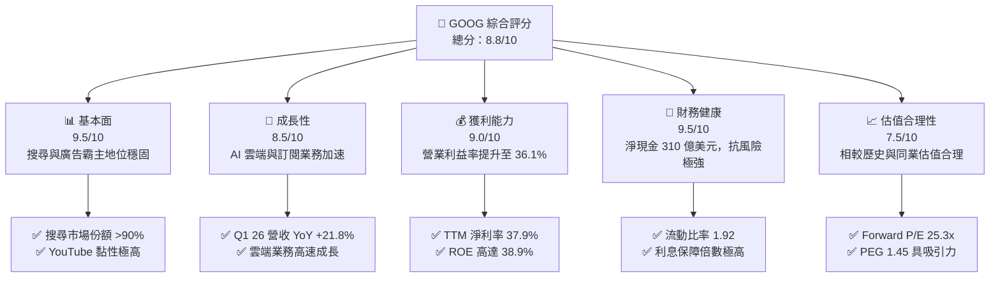
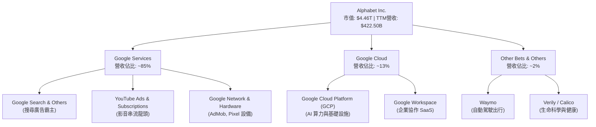
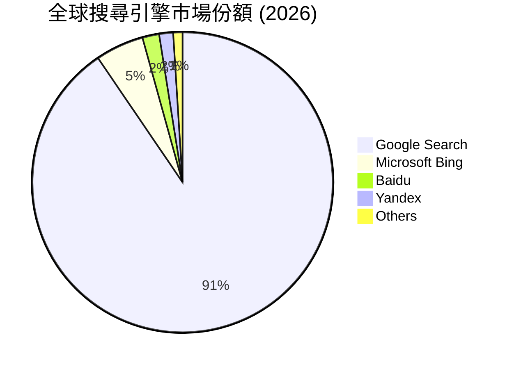
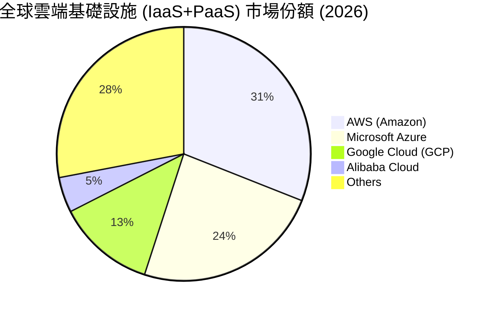
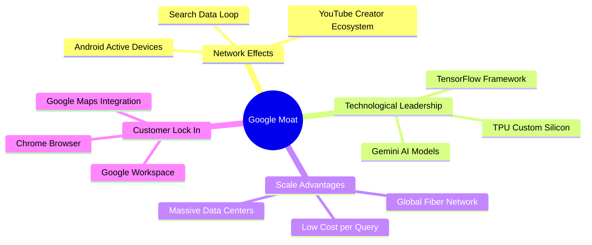

# GOOG 基本面深度分析報告
> **報告日期**：2026-06-07 ｜ **語言**：繁體中文 ｜ **數據來源**：Yahoo Finance, Finviz, StockAnalysis, Roic.ai ｜ **分析師**：CFA 級機構研究

---

## 目錄

| # | 章節 | 核心結論 |
|---|------|----------|
| 1 | [執行摘要](#1-執行摘要) | 評級 **強烈買入**，基準目標價 **$415.00**，隱含 13.5% 上行空間 |
| 2 | [公司概覽與商業模式](#2-公司概覽與商業模式) | 搜尋霸權疊加 AI 雲端雙引擎，構建無可匹敵的網路生態護城河 |
| 3 | [損益表深度分析](#3-損益表深度分析) | TTM 營收突破 $422.5B，Q1 26 淨利受非營業收入推升暴增 81.2% |
| 4 | [資產負債表分析](#4-資產負債表分析) | 現金儲備 $126.8B，淨現金 $31.0B，財務結構極度穩健 |
| 5 | [現金流量深度分析](#5-現金流量深度分析) | 營運現金流高達 $174.4B，高額 Capex 壓制短期自由現金流 |
| 6 | [獲利能力與資本效率](#6-獲利能力與資本效率) | ROE 達 38.9%，ROIC (29.6%) 遠超 WACC (10.3%)，強力創造股東價值 |
| 7 | [估值深度分析](#7-估值深度分析) | Forward P/E 25.3x 處於歷史合理區間，DCF 基準估值 $415.42 |
| 8 | [成長催化劑](#8-成長催化劑) | Gemini Pro 商業化、Google Cloud 規模效應與 YouTube 訂閱變現 |
| 9 | [風險矩陣](#9-風險矩陣) | 反壟斷監管衝擊與 AI 資本支出回報率(ROI)不及預期為核心風險 |
| 10 | [投資建議](#10-投資建議) | 兼具防守與成長的科技巨頭，長線投資人的核心配置首選 |

---

## 1. 執行摘要

### 1.1 核心評分儀表板



### 1.2 評分進度條視覺化

```
╔══════════════════════════════════════════════════════════════╗
║               GOOG 多維度評分儀表板 (1-10分)                 ║
╠══════════════════════════════════════════════════════════════╣
║ 基本面強度  9.5 ▓▓▓▓▓▓▓▓▓▓▓▓▓▓▓▓▓▓▓░  ★★★★★           ║
║ 成長動能    8.5 ▓▓▓▓▓▓▓▓▓▓▓▓▓▓▓▓▓░░░  ★★★★☆           ║
║ 獲利品質    9.0 ▓▓▓▓▓▓▓▓▓▓▓▓▓▓▓▓▓▓░░  ★★★★★           ║
║ 財務健康    9.5 ▓▓▓▓▓▓▓▓▓▓▓▓▓▓▓▓▓▓▓░  ★★★★★           ║
║ 估值合理性  7.5 ▓▓▓▓▓▓▓▓▓▓▓▓▓░░░░░░░  ★★★★☆           ║
║ 護城河深度  9.8 ▓▓▓▓▓▓▓▓▓▓▓▓▓▓▓▓▓▓▓▓  ★★★★★           ║
║ 管理層執行  8.5 ▓▓▓▓▓▓▓▓▓▓▓▓▓▓▓▓▓░░░  ★★★★☆           ║
║ 技術創新力  9.0 ▓▓▓▓▓▓▓▓▓▓▓▓▓▓▓▓▓▓░░  ★★★★★           ║
╠══════════════════════════════════════════════════════════════╣
║ 綜合總分    8.8 ▓▓▓▓▓▓▓▓▓▓▓▓▓▓▓▓▓░░░  🏆 優秀配置標的      ║
╚══════════════════════════════════════════════════════════════╝
```

### 1.3 五大投資論點 + 三大核心風險

| 類型 | 項目 | 具體依據 | 信心度 |
|------|------|----------|--------|
| 🟢 **投資論點①** | **搜尋與廣告業務展現強大韌性** | TTM 營收達 $422.50B，YoY 成長 21.8%，顯示搜尋廣告與 YouTube 變現能力在 AI 時代並未被顛覆。 | 🟢 極高 |
| 🟢 **投資論點②** | **Google Cloud 規模效應顯現** | 雲端業務持續維持高速增長，且營業利益率隨著規模效應釋放而顯著改善，成為第二成長曲線。 | 🟢 高 |
| 🟢 **投資論點③** | **AI 基礎設施與模型技術領先** | 自研 TPU (Tensor Processing Unit) 降低 AI 訓練成本，Gemini 模型全面融入 Google 生態系統。 | 🟢 高 |
| 🟢 **投資論點④** | **極致的財務安全邊際** | 擁有 $126.84B 的現金與短期投資，資產負債表極其健康，具備抵禦宏觀經濟波動的強大實力。 | 🟢 極高 |
| 🟢 **投資論點⑤** | **資本回報計畫常態化** | 2025年實施 $10.05B 的股息派發與高額股份回購，持續優化股東回報。 | 🟢 高 |
| 🟡 **風險①** | **AI 資本支出（Capex）侵蝕利潤** | 2025年資本支出高達 $91.45B，高昂的 GPU/TPU 基礎設施投資若無法及時轉化為營收，將壓制自由現金流。 | 🟡 中度 |
| 🔴 **風險②** | **司法部反壟斷監管與拆分風險** | 針對 Google 搜尋、廣告技術的司法訴訟可能面臨高額罰款，甚至被迫拆分核心業務。 | 🔴 高衝擊 |
| 🟡 **風險③** | **AI 搜尋（如 ChatGPT/Perplexity）分流** | 生成式 AI 問答可能逐步改變用戶搜尋習慣，導致傳統搜尋廣告點擊率與單價下滑。 | 🟡 中度 |

### 1.4 快速統計卡片

| 指標 | 公司實際值 (TTM/最新) | 行業均值 (Communication Services) | S&P 500 均值 | 狀態 |
|------|-------------|----------|--------------|------|
| 收入 YoY 成長 | **21.8%** | ~8.5% | ~5.5% | 🟢 遠超均值 |
| 毛利率 | **60.4%** | ~50.0% | ~30.0% | 🟢 極其優秀 |
| 淨利率 | **37.9%** | ~18.0% | ~12.0% | 🟢 行業頂尖 |
| ROE | **38.9%** | ~15.0% | ~16.0% | 🟢 資本效率極高 |
| Forward P/E | **25.29x** | ~18.5x | ~22.0% | 🟡 溢價合理 |
| 淨現金 / 債務 | **$30.96B** | 淨債務狀態 | 淨債務狀態 | 🟢 極度安全 |

### 1.5 投資結論

```
╔══════════════════════════════════════════════════════════════════╗
║                    📊 GOOG 投資結論摘要                          ║
╠══════════════════════════════════════════════════════════════════╣
║  評級：🟢 強烈買入 (Strong Buy)                                  ║
║  當前股價：$365.76 (2026-06-07)                                  ║
║  目標價區間：                                                    ║
║    悲觀情境：$310.00 (-15.2%) - 監管拆分、AI 競爭加劇            ║
║    基準情境：$415.00 (+13.5%) - 12個月主要目標 (DCF 核心估值)    ║
║    樂觀情境：$460.00 (+25.8%) - AI 商業化超預期、雲端利潤率暴增  ║
║  投資評分：8.8 / 10                                              ║
║  適合投資人：成長型、長線價值持有者、科技股核心配置資產          ║
╚══════════════════════════════════════════════════════════════════╝
```

---

## 2. 公司概覽與商業模式

### 2.1 業務結構與收入來源

Alphabet Inc. 透過三大核心板塊運作：**Google Services**（搜尋、YouTube、廣告、Android、硬體）、**Google Cloud**（基礎設施與平台服務）與 **Other Bets**（前沿科技如 Waymo）。



### 2.2 市場份額

根據 2025/2026 年最新行業數據，Google 在核心搜尋領域依然維持絕對壟斷，而在雲端運算市場則作為「挑戰者」持續擴大份額。





### 2.3 競爭護城河分析



### 2.4 護城河強度評分

```
╔══════════════════════════════════════════════════════════════╗
║                   Alphabet 護城河強度評分                    ║
╠══════════════════════════════════════════════════════════════╣
║ 網路效應      9.8/10  ▓▓▓▓▓▓▓▓▓▓▓▓▓▓▓▓▓▓▓▓  🏆 雙邊平台極難撼動 ║
║ 技術領先度    9.2/10  ▓▓▓▓▓▓▓▓▓▓▓▓▓▓▓▓▓▓░░  🟢 自研 TPU 具優勢  ║
║ 規模經濟      9.5/10  ▓▓▓▓▓▓▓▓▓▓▓▓▓▓▓▓▓▓▓░  🟢 基礎設施成本極低 ║
║ 客戶轉移成本  8.8/10  ▓▓▓▓▓▓▓▓▓▓▓▓▓▓▓▓▓░░░  🟢 帳號生態深度綁定 ║
║ 品牌與無形資產9.7/10  ▓▓▓▓▓▓▓▓▓▓▓▓▓▓▓▓▓▓▓░  🏆 "Google" 成為動詞 ║
╠══════════════════════════════════════════════════════════════╣
║ 綜合護城河     9.4    ▓▓▓▓▓▓▓▓▓▓▓▓▓▓▓▓▓▓▓░  🏆 寬廣護城河 (Wide) ║
╚══════════════════════════════════════════════════════════════╝
```

---

## 3. 損益表深度分析

### 3.1 年度收入成長趨勢（近5年）

Alphabet 的營收規模展現出強大的複利效應，從 2021 年的 $257.64B 成長至 TTM 的 $422.50B，5年 CAGR 達 13.1%。

```
╔══════════════════════════════════════════════════════════════════╗
║              Alphabet 年度收入趨勢 (FY2021-TTM)                 ║
╠══════════════════════════════════════════════════════════════════╣
║                                                                  ║
║  FY 2021  $257.64B  ████████████░░░░░░░░░░░