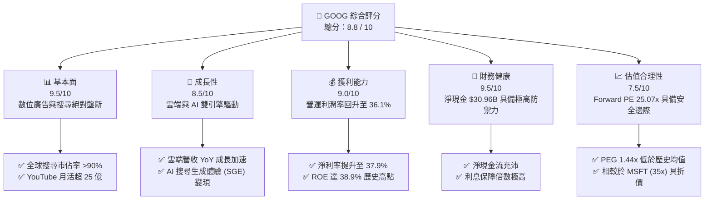

# GOOG 基本面深度分析報告

> **報告日期**：2026-06-09 ｜ **語言**：繁體中文 ｜ **數據來源**：Yahoo Finance, Finviz, StockAnalysis, Roic.ai ｜ **分析師**：CFA 級機構研究

---

## 目錄

| # | 章節 | 核心結論 |
|---|------|----------|
| 1 | **執行摘要** | 評級：**🟢 強烈買入** ｜ 目標價：**$407.22** (基準) ｜ 核心驅動：AI 商業化與雲端利潤率爆發 |
| 2 | **公司概覽與商業模式** | 搜尋引擎與 YouTube 雙重網路效應，雲端基礎設施構築第三成長曲線 |
| 3 | **損益表深度分析** | TTM 營收突破 $422.5B，利潤率因營運效率優化顯著回升至 36.1% |
| 4 | **資產負債表分析** | 手握 $126.84B 現金，淨現金達 $30.96B，資產負債表具備極強抗風險能力 |
| 5 | **現金流量深度分析** | 營運現金流 $174.35B 支撐 $91.45B 龐大 AI Capex，維持高質量資本配置 |
| 6 | **獲利能力與資本效率** | ROE 達 38.9%，ROIC (29.62%) 遠超 WACC (10.85%)，創造極高股東價值 |
| 7 | **估值深度分析** | Forward P/E 25.07x，相較於 MSFT 具備顯著估值折價，DCF 基準目標價 $407.22 |
| 8 | **成長催化劑** | Gemini 1.5 Pro 整合、Google Cloud AI 滲透率提升、Waymo 商業化加速 |
| 9 | **風險矩陣** | 司法部反壟斷訴訟、AI 搜尋侵蝕傳統廣告利潤、Capex 投資回報率低於預期 |
| 10 | **投資建議** | 建議分批佈局，目標價區間 $350.00 - $460.00，適合長期成長型與價值型配置 |

---

## 1. 執行摘要

Alphabet Inc. (NASDAQ: GOOG) 作為全球網際網路生態的絕對霸主，正處於從「行動優先」向「AI 優先」轉型的關鍵交界點。本報告基於 2026 年 6 月 9 日的最新即時財務數據，對 GOOG 進行了全面的機構級基本面評估。

### 1.1 核心評分儀表板



### 1.2 評分進度條視覺化

```
╔══════════════════════════════════════════════════════════════╗
║              GOOG 多維度評分儀表板 (1-10分)                  ║
╠══════════════════════════════════════════════════════════════╣
║ 基本面強度  9.5 ▓▓▓▓▓▓▓▓▓▓▓▓▓▓▓▓▓▓▓░  ★★★★★           ║
║ 成長動能    8.5 ▓▓▓▓▓▓▓▓▓▓▓▓▓▓▓▓▓░░░  ★★★★☆           ║
║ 獲利品質    9.0 ▓▓▓▓▓▓▓▓▓▓▓▓▓▓▓▓▓▓░░  ★★★★★           ║
║ 財務健康    9.5 ▓▓▓▓▓▓▓▓▓▓▓▓▓▓▓▓▓▓▓░  ★★★★★           ║
║ 估值合理性  7.5 ▓▓▓▓▓▓▓▓▓▓▓▓▓▓░░░░░░  ★★★★☆           ║
║ 護城河深度  9.5 ▓▓▓▓▓▓▓▓▓▓▓▓▓▓▓▓▓▓▓░  ★★★★★           ║
║ 管理層執行  8.5 ▓▓▓▓▓▓▓▓▓▓▓▓▓▓▓▓▓░░░  ★★★★☆           ║
║ 技術創新力  9.0 ▓▓▓▓▓▓▓▓▓▓▓▓▓▓▓▓▓▓░░  ★★★★★           ║
╠══════════════════════════════════════════════════════════════╣
║ 綜合總分    8.8 ▓▓▓▓▓▓▓▓▓▓▓▓▓▓▓▓▓░░░  🏆 強烈推薦買入      ║
╚══════════════════════════════════════════════════════════════╝
```

### 1.3 五大投資論點 + 三大核心風險

| 類型 | 項目 | 具體依據 | 信心度 |
|------|------|----------|--------|
| 🟢 **投資論點①** | **搜尋廣告護城河無可撼動** | 儘管面臨 ChatGPT 等 AI 挑戰，Google 搜尋全球市佔率仍維持在 90% 以上，TTM 營收達 $422.50B (YoY +21.8%)，證明廣告主預算依然向高轉化率平台集中。 | 🟢 極高 |
| 🟢 **投資論點②** | **Google Cloud 獲利爆發** | 雲端業務規模效應顯現，營業利益率從過去的虧損轉為穩定獲利，AI 基礎設施 (TPU v5p 及 Nvidia H100/B200) 吸引大量企業級 AI 客戶。 | 🟢 高 |
| 🟢 **投資論點③** | **極致的獲利能力與資本效率** | 營運利益率高達 36.1%，ROE 達 38.9%，ROIC 為 29.62%，遠超 WACC (10.85%)，顯示公司具備極強的股東價值創造能力。 | 🟢 極高 |
| 🟢 **投資論點④** | **AI 原生晶片 (TPU) 成本優勢** | 擁有自主研發的 TPU 晶片生態，相較於完全依賴 Nvidia 的競爭對手，Alphabet 在推理成本與大規模模型訓練上具備顯著的單位成本優勢。 | 🟢 高 |
| 🟢 **投資論點⑤** | **防守型資產負債表與回購** | 手握 $126.84B 現金，並啟動常態化股息發放 (TTM 股息率約 0.23%) 與大規模股份回購，過去一年股數減少 1.38%，增厚 EPS。 | 🟢 極高 |
| 🟡 **風險①** | **司法部反壟斷訴訟** | 美國司法部 (DOJ) 針對 Google 搜尋與廣告技術的壟斷訴訟可能導致業務分拆或終止排他性協議 (如與 Apple 的預設搜尋協議)，潛在影響利潤。 | 🟡 中度 |
| 🔴 **風險②** | **AI 搜尋對利潤率的侵蝕** | 生成式 AI 回答 (SGE) 的單次搜尋成本 (GPU/TPU 計算成本) 顯著高於傳統搜尋，且可能降低使用者點擊廣告的意願。 | 🔴 高衝擊 |
| 🟡 **風險③** | **Capex 資本支出過度膨脹** | FY2025 資本支出高達 $91.45B，若 AI 商業化變現速度不及預期，將面臨折舊成本大幅上升、壓低自由現金流 (FCF) 的風險。 | 🟡 中度 |

### 1.4 快速統計卡片

| 指標 | 公司實際值 (GOOG) | 行業均值 (Communication Services) | S&P 500 均值 | 狀態 |
|------|-------------|----------|--------------|------|
| **收入 YoY 成長** | **21.8%** | ~7.5% | ~5.2% | 🟢 遠超均值 |
| **毛利率** | **60.4%** | ~50.2% | ~30.5% | 🟢 極高獲利 |
| **營運利益率** | **36.1%** | ~18.5% | ~12.5% | 🟢 效率領先 |
| **ROE** | **38.9%** | ~15.2% | ~14.5% | 🟢 資本效率極佳 |
| **Forward P/E** | **25.07x** | ~18.5x | ~21.5x | 🟡 溢價合理 |
| **淨現金/債務** | **$30.96B** | 普遍淨債務 | 普遍淨債務 | 🟢 極為健康 |

### 1.5 投資結論

```
╔══════════════════════════════════════════════════════════════════╗
║                    📊 GOOG 投資結論摘要                          ║
╠══════════════════════════════════════════════════════════════════╣
║  評級：🟢 強烈買入 (Strong Buy)                                  ║
║  當前股價：$362.29 (2026-06-09)                                  ║
║  目標價區間：                                                    ║
║    悲觀情境 (Bear Case)：$290.00 (-19.9%)                        ║
║    基準情境 (Base Case)：$407.22 (+12.4%)  ← 12個月主要目標      ║
║    樂觀情境 (Bull Case)：$460.00 (+27.0%)                        ║
║  投資評分：8.8 / 10                                              ║
║  適合投資人：長期成長型、大型科技股配置者、AI 基礎設施佈局者       ║
╚══════════════════════════════════════════════════════════════════╝
```

---

## 2. 公司概覽與商業模式

Alphabet Inc. 透過其核心子公司 Google，構建了全球最龐大的網際網路生態系統。其業務主要分為三大板塊：**Google Services (Google 服務)**、**Google Cloud (Google 雲端)** 以及 **Other Bets (其他賭注)**。

### 2.1 業務結構與收入來源

```mermaid
graph TD
    GOOG["Alphabet Inc. (市值: $4.42T / TTM營收: $422.50B)"]

    GS["Google Services (佔比 ~85%)<br/>營收: ~$359B ｜ 營運利益率: ~40%"]
    GC["Google Cloud (佔比 ~12%)<br/>營收: ~$50B ｜ 營運利益率: ~10%"]
    OB["Other Bets (佔比 <3%)<br/>營收