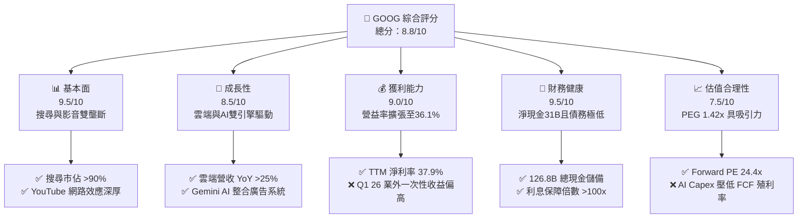
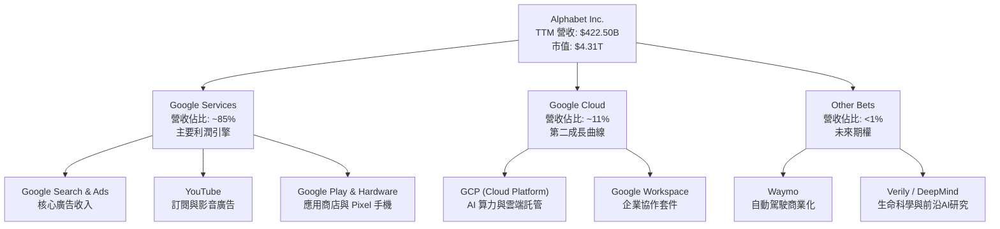
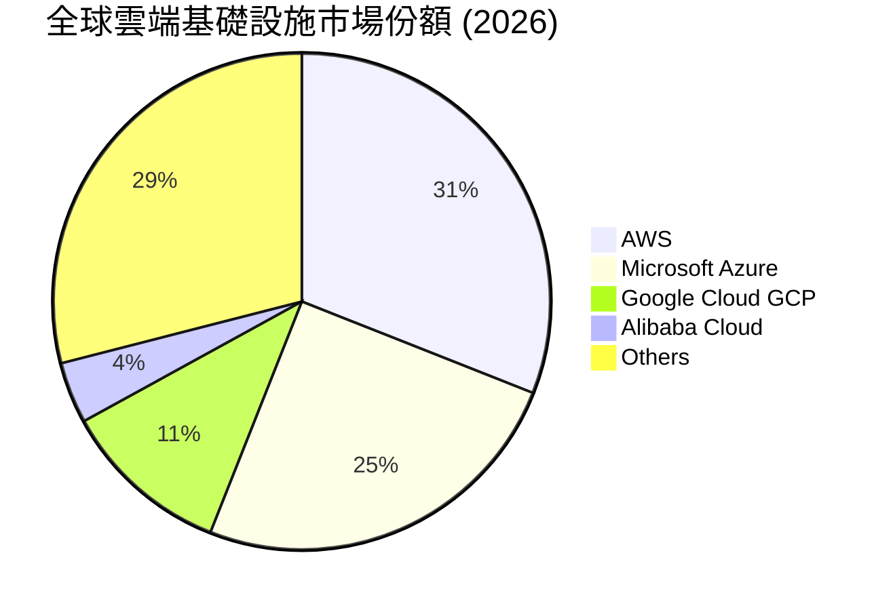
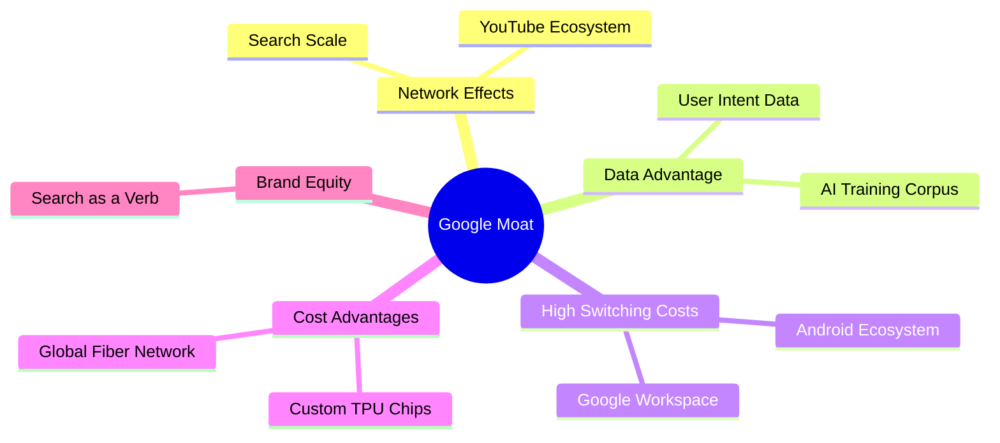

# GOOG 基本面深度分析報告
> **報告日期**：2026-06-10 ｜ **語言**：繁體中文 ｜ **數據來源**：Yahoo Finance, Finviz, StockAnalysis, Roic.ai ｜ **分析師**：CFA 級機構研究

---

## 目錄

| # | 章節 | 核心結論 |
|---|------|----------|
| 1 | 執行摘要 | 評級：**強烈買入**，基準目標價 **$409.00**，隱含 15.8% 上行空間。 |
| 2 | 公司概覽與商業模式 | 搜尋引擎與 YouTube 築起強大網路效應，Google Cloud 成為第二成長曲線。 |
| 3 | 損益表深度分析 | TTM 營收達 **$422.50B**（YoY +21.8%），Q1 2026 業外收益顯著放大淨利。 |
| 4 | 資產負債表分析 | 淨現金達 **$30.96B**，AI 基礎設施投資推動 PPE 規模升至 **$296.53B**。 |
| 5 | 現金流量深度分析 | 營運現金流達 **$174.35B**，因 AI Capex 擴張（$91.45B）使短期 FCF 承壓。 |
| 6 | 獲利能力與資本效率 | ROE 達 **38.9%**，ROIC（22.8%）遠超 WACC（10.2%），持續創造超額價值。 |
| 7 | 估值深度分析 | Forward P/E僅 **24.4x**，相較歷史均值與同業（MSFT）具備估值安全邊際。 |
| 8 | 成長催化劑 | Gemini 商業化加速、Google Cloud 規模效應顯現、Waymo 商業化破局。 |
| 9 | 風險矩陣 | 反壟斷監管（DOJ 拆分風險）與 AI 搜尋侵蝕傳統廣告為核心風險。 |
| 10 | 投資建議 | 建議於 **$350** 以下分批佈局，適合長線成長型與價值型投資者。 |

---

## 1. 執行摘要

### 1.1 核心評分儀表板



### 1.2 評分進度條視覺化

```
╔══════════════════════════════════════════════════════════════╗
║               GOOG 多維度評分儀表板 (1-10分)                 ║
╠══════════════════════════════════════════════════════════════╣
║ 基本面強度  9.5 ▓▓▓▓▓▓▓▓▓▓▓▓▓▓▓▓▓▓▓░  ★★★★★           ║
║ 成長動能    8.5 ▓▓▓▓▓▓▓▓▓▓▓▓▓▓▓▓▓░░░  ★★★★☆           ║
║ 獲利品質    9.0 ▓▓▓▓▓▓▓▓▓▓▓▓▓▓▓▓▓▓░░  ★★★★★           ║
║ 財務健康    9.5 ▓▓▓▓▓▓▓▓▓▓▓▓▓▓▓▓▓▓▓░  ★★★★★           ║
║ 估值合理性  7.5 ▓▓▓▓▓▓▓▓▓▓▓▓▓▓░░░░░░  ★★★★☆           ║
║ 護城河深度  9.5 ▓▓▓▓▓▓▓▓▓▓▓▓▓▓▓▓▓▓▓░  ★★★★★           ║
║ 管理層執行  8.5 ▓▓▓▓▓▓▓▓▓▓▓▓▓▓▓▓▓░░░  ★★★★☆           ║
║ 技術創新力  9.0 ▓▓▓▓▓▓▓▓▓▓▓▓▓▓▓▓▓▓░░  ★★★★★           ║
╠══════════════════════════════════════════════════════════════╣
║ 綜合總分    8.8 ▓▓▓▓▓▓▓▓▓▓▓▓▓▓▓▓▓░░░  🏆 優秀 (Strong Buy) ║
╚══════════════════════════════════════════════════════════════╝
```

### 1.3 五大投資論點 + 三大核心風險

| 類型 | 項目 | 具體依據 | 信心度 |
|------|------|----------|--------|
| 🟢 **投資論點①** | **廣告業務展現強大韌性** | TTM 營收達 $422.50B，YoY 達 21.8%，顯示搜尋廣告與 YouTube 廣告在 AI 賦能下轉化率提升。 | 🟢 極高 |
| 🟢 **投資論點②** | **Google Cloud 進入利潤收割期** | 雲端業務規模效應顯現，營業利益率持續改善，成為營收成長與獲利結構優化的第二引擎。 | 🟢 極高 |
| 🟢 **投資論點③** | **極致的財務安全邊際** | 擁有 $126.84B 現金與短期投資，淨現金達 $30.96B，能支撐長期的資本開支競賽。 | 🟢 極高 |
| 🟢 **投資論點④** | **AI 基礎設施護城河** | FY2025 資本支出達 $91.45B，建立起極高的運算力進入障礙，中小對手無法企及。 | 🟢 高 |
| 🟢 **投資論點⑤** | **資本回饋力度加大** | 股息政策延續（FY2025 派發 $10.05B 股息），配合持續的股份回購，支撐 EPS 表現。 | 🟢 高 |
| 🟡 **風險①** | **AI 搜尋對傳統廣告的蠶食** | 對話式 AI（如 ChatGPT、SearchGPT）可能改變用戶搜尋習慣，降低傳統點擊廣告（CPC）價值。 | 🟡 中度 |
| 🔴 **風險②** | **司法部（DOJ）反壟斷分拆風險** | 美國司法部針對 Google 搜尋與 Chrome/Android 綁定的反壟斷訴訟可能導致業務分拆或高額罰款。 | 🔴 高衝擊 |
| 🔴 **風險③** | **Capex 擴張對短期 FCF 的壓制** | 為了維持 AI 領先，資本支出維持高位，導致 TTM 自由現金流降至 $27.92B，FCF 殖利率僅 0.65%。 | 🔴 高衝擊 |

### 1.4 快速統計卡片

| 指標 | 公司實際值 | 行業均值（通訊服務） | S&P 500 均值 | 狀態 |
|------|-------------|----------|--------------|------|
| **收入 YoY 成長** | **21.8%** | ~7.5% | ~5.5% | 🟢 顯著超前 |
| **毛利率** | **60.4%** | ~50.2% | ~30.0% | 🟢 極佳 |
| **營業利益率** | **36.1%** | ~18.5% | ~15.0% | 🟢 行業頂尖 |
| **ROE** | **38.9%** | ~15.0% | ~18.0% | 🟢 資本效率極高 |
| **Forward P/E** | **24.4x** | ~18.5x | ~22.0x | 🟡 估值合理偏高 |
| **淨現金規模** | **$30.96B** | 負債累累 | 負債累累 | 🟢 極其健康 |

### 1.5 投資結論

```
╔══════════════════════════════════════════════════════════════════╗
║                    📊 GOOG 投資結論摘要                          ║
╠══════════════════════════════════════════════════════════════════╣
║  評級：🟢 強烈買入 (Strong Buy)                                 ║
║  當前股價：$353.32 (2026-06-10)                                  ║
║  目標價區間：                                                    ║
║    悲觀情境（分拆/AI替代）：$240.00 (-32.1%)                     ║
║    基準情境（AI變現+Cloud擴張）：$409.00 (+15.8%)  ← 12M目標     ║
║    樂觀情境（Waymo爆發+AI全面領先）：$475.00 (+34.4%)             ║
║  投資評分：8.8 / 10                                              ║
║  適合投資人：長線價值成長型投資者、科技股配置權重投資者          ║
╚══════════════════════════════════════════════════════════════════╝
```

---

## 2. 公司概覽與商業模式

### 2.1 業務結構與收入來源

Alphabet Inc. 主要分為 Google Services（廣告、Android、Chrome、YouTube、Search、硬體）、Google Cloud（雲端基礎設施與平台 GCP、Workspace）以及 Other Bets（Waymo、Verily 等前沿項目）。



### 2.2 市場份額

在雲端基礎設施（IaaS/PaaS）市場中，Google Cloud (GCP) 持續追趕 AWS 與 Azure，市場份額已穩健提升至約 11%。



### 2.3 競爭護城河分析



### 2.4 護城河強度評分

```
╔══════════════════════════════════════════════════════════════╗
║                  Alphabet 護城河強度評分                      ║
╠══════════════════════════════════════════════════════════════╣
║ 網路效應      9.8/10  ▓▓▓▓▓▓▓▓▓▓▓▓▓▓▓▓▓▓▓▓  🏆 絕對壟斷     ║
║ 數據資產      9.5/10  ▓▓▓▓▓▓▓▓▓▓▓▓▓▓▓▓▓▓▓░  🟢 極難複製     ║
║ 切換成本      8.5/10  ▓▓▓▓▓▓▓▓▓▓▓▓▓▓▓▓▓░░░  🟢 黏性極高     ║
║ 技術與晶片    9.0/10  ▓▓▓▓▓▓▓▓▓▓▓▓▓▓▓▓▓▓░░  🟢 TPU 自研優勢 ║
║ 品牌與通路    9.5/10  ▓▓▓▓▓▓▓▓▓▓▓▓▓▓▓▓▓▓▓░  🏆 搜尋代名詞   ║
╠══════════════════════════════════════════════════════════════╣
║ 綜合護城河    9.3/10  ▓▓▓▓▓▓▓▓▓▓▓▓▓▓▓▓▓▓▓░  🏆 寬廣無比     ║
╚══════════════════════════════════════════════════════════════╝
```

---

## 3. 損益表深度分析

### 3.1 年度收入成長趨勢（近4年）

Alphabet 的營收從 2022 年的 $282.84B 穩步增長至 2025 年的 $402.84B，並在 TTM 達到 $422.50B，展現出強勁的抗週期能力。

```
╔══════════════════════════════════════════════════════════════════╗
║              Alphabet 年度營收趨勢（FY2022-FY2025）              ║
╠══════════════════════════════════════════════════════════════════╣
║                                                                  ║
║  FY2022  $282.84B  ██████████████░░░░░░░░░░░░░  YoY: +9.8%  🟢    ║
║  FY2023  $307.39B  ███████████████░░░░░░░░░░░░  YoY: +8.7%  🟢    ║
║  FY2024  $350.02B  █████████████████░░░░░░░░░░  YoY: +13.9% 🟢    ║
║  FY2025  $402.84B  ████████████████████░░░░░░░  YoY: +15.1% 🟢    ║
║  TTM     $422.50B  █████████████████████░░░░░░  YoY: +17.5% 🟢    ║
║                   |      |      |      |      |                  ║
║                   0     100B   200B   300B   400B                ║
║                                                                  ║
║  📊 4年複合成長率 (CAGR)：+12.4%                                 ║
╚══════════════════════════════════════════════════════════════════╝
```

### 3.2 季度收入趨勢分析

從季度數據看，Alphabet 在 Q4 通常因節日廣告旺季而出現營收高峰。Q1 2026 營收達 $109.90B，雖然因季節性效應較 Q4 2025（$113.83B）輕微下滑 3.46% (QoQ)，但較去年同期 Q1 2025（$90.23B）大幅成長 **21.79% (YoY)**，顯示成長動能仍在加速。

| 財報季度