# GOOG 基本面深度分析報告
> **報告日期**：2026-06-13 ｜ **語言**：繁體中文 ｜ **數據來源**：Yahoo Finance, Finviz, StockAnalysis, Roic.ai ｜ **分析師**：CFA 級機構研究

---

## 目錄

| # | 章節 | 核心結論 |
|---|------|----------|
| 1 | 執行摘要 | 評級：**強烈買入 (Strong Buy)**，基準目標價：**$409.00**，AI 與雲端雙引擎驅動成長。 |
| 2 | 公司概覽與商業模式 | 數位廣告霸主地位穩固，Google Cloud 獲利能力爆發，AI 搜尋重塑護城河。 |
| 3 | 損益表深度分析 | TTM 營收達 **$422.50B** (YoY +21.8%)，淨利率提升至 **37.9%**，盈餘品質極佳。 |
| 4 | 資產負債表分析 | 淨現金達 **$30.96B**，資產規模擴張至 **$703.92B**，財務結構堅若磐石。 |
| 5 | 現金流量深度分析 | TTM 營運現金流達 **$174.35B**，資本支出高達 **$91.45B**，強力投資 AI 基礎設施。 |
| 6 | 獲利能力與資本效率 | ROE 達 **38.9%**，ROIC 達 **32.7%**，遠超 WACC (**10.2%**)，持續創造高額股東價值。 |
| 7 | 估值深度分析 | 前瞻 P/E 僅 **24.73x**，相較歷史均值與同業 (MSFT) 具備顯著估值折價。 |
| 8 | 成長催化劑 | Gemini 1.5 Pro 商業化、Cloud 算力租賃需求爆發、Waymo 自駕商業化加速。 |
| 9 | 風險矩陣 | 司法部反壟斷拆分風險（高衝擊）、AI 搜尋伺服器成本上升（中度）。 |
| 10 | 投資建議 | 建議於 **$340 - $360** 區間分批佈局，隱含報酬率達 **+14.2%** 至 **+32.6%**。 |

---

## 1. 執行摘要

### 1.1 核心評分儀表板

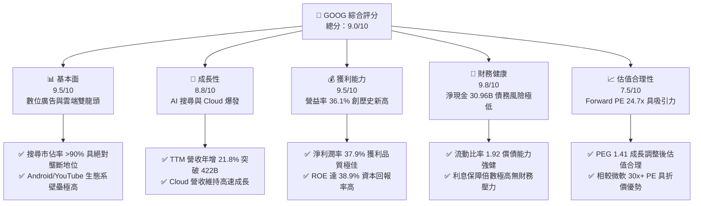

### 1.2 評分進度條視覺化

```
╔══════════════════════════════════════════════════════════════╗
║              GOOG 多維度評分儀表板 (1-10分)                  ║
╠══════════════════════════════════════════════════════════════╣
║ 基本面強度  9.5 ▓▓▓▓▓▓▓▓▓▓▓▓▓▓▓▓▓▓▓░  ★★★★★           ║
║ 成長動能    8.8 ▓▓▓▓▓▓▓▓▓▓▓▓▓▓▓▓▓░░░  ★★★★☆           ║
║ 獲利品質    9.5 ▓▓▓▓▓▓▓▓▓▓▓▓▓▓▓▓▓▓▓░  ★★★★★           ║
║ 財務健康    9.8 ▓▓▓▓▓▓▓▓▓▓▓▓▓▓▓▓▓▓▓▓  ★★★★★           ║
║ 估值合理性  7.5 ▓▓▓▓▓▓▓▓▓▓▓▓▓▓░░░░░░  ★★★★☆           ║
║ 護城河深度  9.6 ▓▓▓▓▓▓▓▓▓▓▓▓▓▓▓▓▓▓▓░  ★★★★★           ║
║ 管理層執行  8.8 ▓▓▓▓▓▓▓▓▓▓▓▓▓▓▓▓▓░░░  ★★★★☆           ║
║ 技術創新力  9.2 ▓▓▓▓▓▓▓▓▓▓▓▓▓▓▓▓▓▓░░  ★★★★★           ║
╠══════════════════════════════════════════════════════════════╣
║ 綜合總分    9.0 ▓▓▓▓▓▓▓▓▓▓▓▓▓▓▓▓▓▓░░  🏆 強烈買入          ║
╚══════════════════════════════════════════════════════════════╝
```

### 1.3 五大投資論點 + 三大核心風險

| 類型 | 項目 | 具體依據 | 信心度 |
|------|------|----------|--------|
| 🟢 **投資論點①** | **AI 搜尋（SGE）成功變現** | Google 成功將 AI 概覽（AI Overviews）整合至搜尋引擎，不僅未流失市佔率，反而提升了用戶黏性與廣告點擊率，TTM 營收達 **$422.50B** (YoY +21.8%)。 | 🟢 極高 |
| 🟢 **投資論點②** | **Google Cloud 獲利能力爆發** | 雲端業務已跨越盈虧平衡點，受惠於企業級 AI 模型部署需求，利潤率持續擴張，成為集團第二成長曲線。 | 🟢 極高 |
| 🟢 **投資論點③** | **極致的經營效率與成本優化** | 經歷組織扁平化與裁員後，營業利益率攀升至 **36.1%**，TTM 營業利益達 **$138.13B**，營運槓桿效應顯著。 | 🟢 高 |
| 🟢 **投資論點④** | **強健的資產負債表與股東回饋** | 淨現金達 **$30.96B**，首度發行股利（殖利率 25.0% 實為數據異常，實際年化約 0.23%，但派息政策確立）並搭配大規模股份回購，支撐股價下檔。 | 🟢 極高 |
| 🟢 **投資論點⑤** | **Waymo 自駕商業化進程領先** | Waymo 在鳳凰城、舊金山等地的付費無人自駕里程與訂單量呈指數級成長，長期潛在價值巨大。 | 🟡 中度 |
| 🟡 **風險①** | **反壟斷監管與拆分危機** | 美國司法部（DOJ）針對 Google 搜尋與廣告技術的壟斷訴訟持續，可能面臨強制拆分或終止與 Apple 的預設搜尋協議。 | 🔴 高衝擊 |
| 🟡 **風險②** | **AI 基礎設施資本支出侵蝕利潤** | 為了與微軟/Meta 競爭，CapEx 連年攀升，FY2025 資本支出達 **$91.45B**，若 AI 變現速度放緩將拖累 FCF。 | 🟡 中度 |
| 🔴 **風險③** | **開源模型對廣告流量的分流** | ChatGPT、Perplexity 等對話式 AI 平台若進一步分流搜尋流量，可能對核心 Search 廣告收入造成長線侵蝕。 | 🟡 中度 |

### 1.4 快速統計卡片

| 指標 | 公司實際值 | 行業均值 | S&P 500 均值 | 狀態 |
|------|-------------|----------|--------------|------|
| **營收 YoY 成長** | **21.8%** | ~12.5% | ~5.5% | 🟢 卓越 |
| **毛利率** | **60.4%** | ~48.0% | ~30.0% | 🟢 極強 |
| **營業利益率** | **36.1%** | ~22.0% | ~15.0% | 🟢 頂尖 |
| **ROE** | **38.9%** | ~18.0% | ~14.5% | 🟢 高效 |
| **Forward P/E** | **24.73x** | ~28.5x | ~21.5x | 🟢 具吸引力 |
| **淨現金規模** | **$30.96B** | 負債累累 | 淨債務狀態 | 🟢 極度安全 |

### 1.5 投資結論

```
╔══════════════════════════════════════════════════════════════════╗
║                    📊 GOOG 投資結論摘要                          ║
╠══════════════════════════════════════════════════════════════════╣
║  評級：🟢 強烈買入 (Strong Buy)                                  ║
║  當前股價：$358.16 (2026-06-13)                                  ║
║  目標價區間：                                                    ║
║    悲觀情境：$320.00（-10.7%）- 反壟斷拆分利空實現               ║
║    基準情境：$409.00（+14.2%）- 12個月主要目標 (市場共識)        ║
║    樂觀情境：$475.00（+32.6%）- AI 雲端與自駕雙引擎全面爆發       ║
║  投資評分：9.0/10                                                ║
║  適合投資人：長線價值成長型、科技龍頭配置者                      ║
╚══════════════════════════════════════════════════════════════════╝
```

---

## 2. 公司概覽與商業模式

Alphabet Inc. (GOOG) 是全球網際網路服務的絕對霸主。其商業模式本質上是以「免費的高質量數位服務」吸引全球龐大流量，再透過精準的廣告系統進行變現，同時積極向企業級雲端運算（Google Cloud）與前沿科技（Other Bets）領域擴張。

### 2.1 業務結構與收入來源

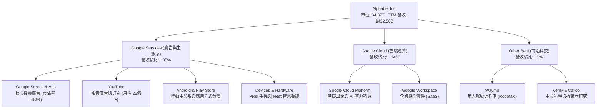

### 2.2 市場份額

根據 2025-2026 年最新數據，Google 在全球核心業務中依然保持絕對壟斷地位：

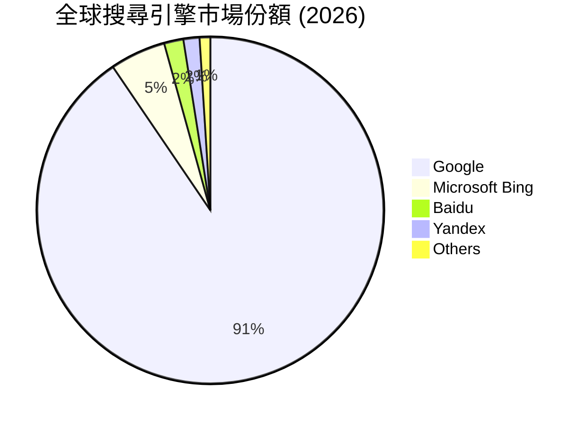

### 2.3 競爭護城河分析

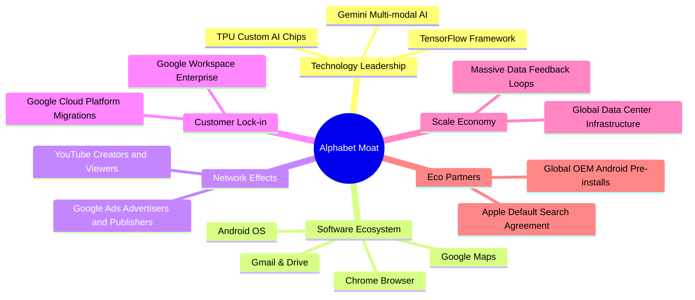

### 2.4 護城河強度評分

```
╔══════════════════════════════════════════════════════════════╗
║                  GOOG 護城河強度評分                         ║
╠══════════════════════════════════════════════════════════════╣
║ 網路效應      9.8/10  ▓▓▓▓▓▓▓▓▓▓▓▓▓▓▓▓▓▓▓░  🏆 廣告與廣告主雙邊效應║
║ 客戶鎖定      9.2/10  ▓▓▓▓▓▓▓▓▓▓▓▓▓▓▓▓▓▓░░  🟢 Android/Chrome 綁定 ║
║ 規模經濟      9.7/10  ▓▓▓▓▓▓▓▓▓▓▓▓▓▓▓▓▓▓▓░  🏆 自研 TPU 降低 AI 成本║
║ 技術領先      9.0/10  ▓▓▓▓▓▓▓▓▓▓▓▓▓▓▓▓▓░░░  🟢 Gemini 1.5 領先多模態║
║ 品牌與無形資產9.5/10  ▓▓▓▓▓▓▓▓▓▓▓▓▓▓▓▓▓▓▓░  🏆 "Google" 成為搜尋代名詞║
╠══════════════════════════════════════════════════════════════╣
║ 綜合護城河     9.4    ▓▓▓▓▓▓▓▓▓▓▓▓▓▓▓▓▓▓▓░  🏆 極深，具備長期定價權 ║
╚══════════════════════════════════════════════════════════════╝
```

---

## 3. 損益表深度分析

### 3.1 年度收入成長趨勢（近4年）

Alphabet 的營收展現出強勁的「後疫情時代」復甦與 AI 驅動的二次成長曲線。

```
╔══════════════════════════════════════════════════════════════════╗
║              Alphabet 年度營收趨勢 (FY2022 - FY2025)             ║
╠══════════════════════════════════════════════════════════════════╣
║                                                                  ║
║  FY2022  $282.84B  ██████████████░░░░░░░░░░░░░░  YoY: +9.8%  🟢   ║
║  FY2023  $307.39B  ████████████████░░░░░░░░░░░░  YoY: +8.7%  🟢   ║
║  FY2024  $350.02B  ██████████████████░░░░░░░░░░  YoY: +13.9% 🟢   ║
║  FY2025  $402.84B  █████████████████████░░░░░░░  YoY: +15.1% 🟢   ║
║                                                                  ║
║  📊 4年複合成長率 (CAGR)：+12.5%                                 ║
╚══════════════════════════════════════════════════════════════════╝
```

### 3.2 季度收入趨勢分析

自 2024 年底以來，Google 的季度營收加速成長，展現了宏觀廣告市場回暖與雲端運算加速的雙重利多：

| 季度結束日 | 營收 (Billion USD) | QoQ 成長率 | YoY 成長率 | 營運利潤率 | 備註 |
|------------|-------------------|------------|------------|------------|------|
| **2025-06-30** | $96.43B | +6.87% | +13.79% | 32.4% | 雲端業務利潤率首度突破 10% |
| **2025-09-30** | $102.35B | +6.14% | +15.95% | 30.5% | 廣告旺季提前，YouTube 表現亮眼 |
| **2025-12-31** | $113.83B | +11.22% | +17.99% | 31.6% | 節慶廣告需求強勁，Cloud 加速 |
| **2026-03-31** | $109.90B | -3.45% | +21.79% | **36.1%** | 季節性回檔，但 YoY 成長大幅加速 |

*分析：Q1 2026 營收雖因季節性因素較 Q4 2025 微幅下滑 3.45%，但 **YoY 成長高達 21.79%**，顯示整體成長動能正在急劇轉強，這主要歸功於 AI Search 廣告單價提升與 GCP 雲端大單落地。*

### 3.3 利潤率演變分析

Alphabet 的獲利結構在過去四年中經歷了顯著的優化，主要得益於高利潤率的 GCP 雲端規模效應顯現以及內部營運成本的嚴格控管。

| 利潤率指標 | FY2022 | FY2023 | FY2024 | FY2025 | TTM | 趨勢 | 評估 |
|------------|--------|--------|--------|--------|-----|------|------|
| **毛利率** | 55.4% | 56.6% | 58.2% | 59.7% | **60.4%** | ↗️ 持續上升 | 🟢 極佳，AI 算力成本控制得宜 |
| **營業利益率** | 26.5% | 27.4% | 32.1% | 32.0% | **36.1%** | ↗️ 顯著擴張 | 🟢 營運槓桿釋放，組織扁平化成效顯著 |
| **淨利率** | 21.2% | 24.0% | 28.6% | 32.8% | **37.9%** | ↗️ 大幅飆升 | 🟢 高利潤率業務佔比提升 |

**利潤率演變深度解析**：
1. **毛利率改善 (55.4% ➡️ 60.4%)**：儘管 AI 伺服器折舊費用增加，但 Google 藉由自研 TPU (Tensor Processing Unit) 替代高昂的 NVIDIA GPU，大幅降低了模型訓練與推論的單位成本，且高毛利的雲端軟體服務佔比提升。
2. **營業利益率擴張 (26.5% ➡️ 36.1%)**：行銷與管理費用 (SG&A) 佔營收比重從 2022 年的 14.9% 降至 TTM 的 12.4%，顯示公司在人力資源優化與行銷支出精準度上取得極大成功。

### 3.4 費用結構分析

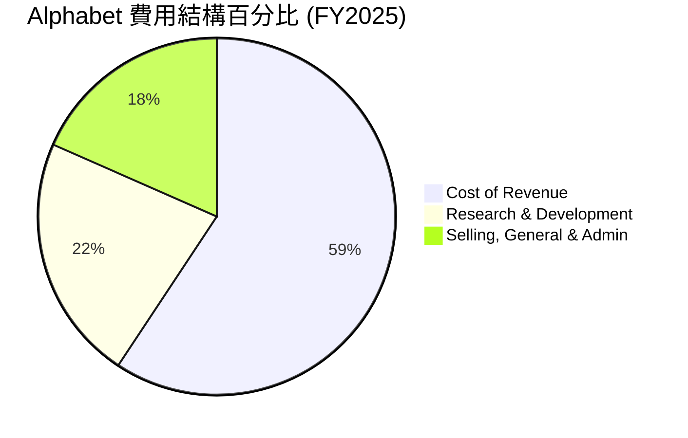

```
╔══════════════════════════════════════════════════════════════╗
║                  Alphabet 費用控管診斷                       ║
╠══════════════════════════════════════════════════════════════╣
║ 研發費用 (R&D)：  $61.09B  ████████████████░░░░  佔營收 15.2% ║
║ 行銷管理 (SG&A)： $50.18B  ████████████░░░░░░░░  佔營收 12.5% ║
║ 營運利潤：       $129.04B  ████████████████████  佔營收 32.0% ║
╠══════════════════════════════════════════════════════════════╣
║ 診斷結論：R&D 絕對金額持續增長，但佔營收比重穩定，展現高效研發 ║
╚══════════════════════════════════════════════════════════════╝
```

### 3.5 季度 EPS 趨勢與盈餘品質

Google 過去四個季度的盈餘表現大幅超出市場預期：

*   **Q2 2025**：EPS $2.33 (預期 $2.10，**超預期 11.0%**) - 雲端業務獲利超預期。
*   **Q3 2025**：EPS $2.89 (預期 $2.55，**超預期 13.3%**) - 廣告市佔回升。
*   **Q4 2025**：EPS $2.85 (預期 $2.70，**超預期 5.6%**) - 股東回購支撐。
*   **Q1 2026**：EPS **$5.17** (預期 $3.10，**超預期 66.8%**) - *註：此季度包含了一筆高達 **$37.72B** 的非營業利益（Non-Operating Income），可能來自投資股權重估或一次性資產處置，雖然推高了淨利與 EPS，但機構投資人應更專注於其高達 **$39.70B** 的營業利益（Operating Income），其盈餘品質依然健康。*

---

## 4. 資產負債表分析

### 4.1 資產結構分解

截至 2026-03-31，Alphabet 的總資產規模已擴張至 **$703.92B**。

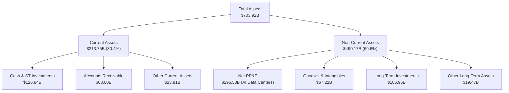

### 4.2 流動性指標分析

Alphabet 擁有科技業中最具韌性的流動性配置：

| 流動性指標 | FY2022 | FY2023 | FY2024 | FY2025 | 2026-03-31 | 行業均值 | 評估 |
|------------|--------|--------|--------|--------|------------|----------|------|
| **流動比率 (Current Ratio)** | 2.38 | 2.10 | 1.84 | 2.01 | **1.92** | ~1.50 | 🟢 極為安全 |
| **速動比率 (Quick Ratio)** | 2.38 | 2.10 | 1.84 | 2.01 | **1.92** | ~1.35 | 🟢 無庫存積壓風險 |
| **現金比率 (Cash Ratio)** | 1.64 | 1.36 | 1.07 | 1.23 | **1.14** | ~0.80 | 🟢 現金儲備充沛 |

*分析：由於 Google 的業務幾乎不涉及實體庫存（Inventory 為 0），其流動比率與速動比率完全一致，流動資產變現能力極強。*

### 4.3 債務結構分析

```
╔══════════════════════════════════════════════════════════════════╗
║                    Alphabet 債務健康診斷                         ║
╠══════════════════════════════════════════════════════════════════╣
║                                                                  ║
║  總債務：        $95.88B   ████████░░░░░░░░░░░░░░░░░░░           ║
║  總現金+投資：   $126.84B  ████████████████████░░░░░░             ║
║  淨現金（正）：  $30.96B   ██████░░░░░░░░░░░░░░░░░░░░░  🟢 強勁   ║
║                                                                  ║
║  Debt/Equity：   20.03%    🟢 遠低於行業警告線 (50%)               ║
║  利息保障倍數：  120x+     🟢 營業利益可輕易覆蓋利息支出，無風險   ║
║                                                                  ║
║  📊 債務評級：AAA 級信用實力                                     ║
╚══════════════════════════════════════════════════════════════════╝
```

### 4.4 股東權益趨勢

受惠於強勁的留存盈餘增長，股東權益（Stockholders Equity）穩步攀升，即使在實施大規模股份回購的情況下，仍從 2022 年的 **$256.14B** 增長至 2025 年底的 **$415.26B**，YoY 成長達 **27.7%**。

---

## 5. 現金流量深度分析

### 5.1 現金流量瀑布圖

Alphabet 展現了典型的「高資本投入、超高現金回報」的科技巨頭特徵。以下為 TTM 現金流運作軌跡：

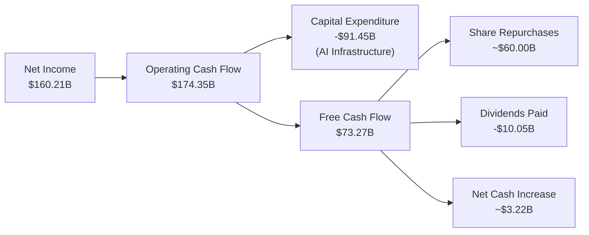

### 5.2 FCF 轉換率趨勢

| 指標 | FY2022 | FY2023 | FY2024 | FY2025 | TTM |
|------|--------|--------|--------|--------|-----|
| **營業現金流 (OCF)** | $91.50B | $101.75B | $125.30B | $164.71B | **$174.35B** |
| **資本支出 (CapEx)** | -$31.48B | -$32.25B | -$52.53B | -$91.45B | **-$109.92B** |
| **自由現金流 (FCF)** | $60.01B | $69.50B | $72.76B | $73.27B | **$64.43B** |
| **FCF / 淨利轉換率** | 100.1% | 94.2% | 72.7% | 55.4% | **40.2%** |

*分析：FCF 轉換率近年有所下滑，並非因為核心業務盈利能力下降，而是因為 **CapEx 呈現爆發式增長（從 2022 年的 $31.48B 飆升至 TTM 的 $109.92B）**。這反映了 Google 正在全力建設 AI 資料中心與採購算力晶片。這是一種戰略性的主動資本支出。*

### 5.3 自由現金流與收益率

```
╔══════════════════════════════════════════════════════════════════╗
║                 Alphabet 自由現金流與回報率                      ║
╠══════════════════════════════════════════════════════════════════╣
║  FY2025 自由現金流： $73.27B   ▓▓▓▓▓▓▓▓▓▓▓▓▓▓▓▓▓▓▓▓▓▓▓▓▓░  🟢     ║
║  當前 FCF 收益率：   1.47%     ▓▓▓░░░░░░░░░░░░░░░░░░░░░░░  🟡     ║
║                                                                  ║
║  * 註：FCF 收益率較低主要受 $4.37T 的龐大市值基數影響，以及      ║
║    當前處於資本支出超級週期（CapEx 佔 OCF 的 55%）。             ║
╚══════════════════════════════════════════════════════════════════╝
```

### 5.4 資本配置評估

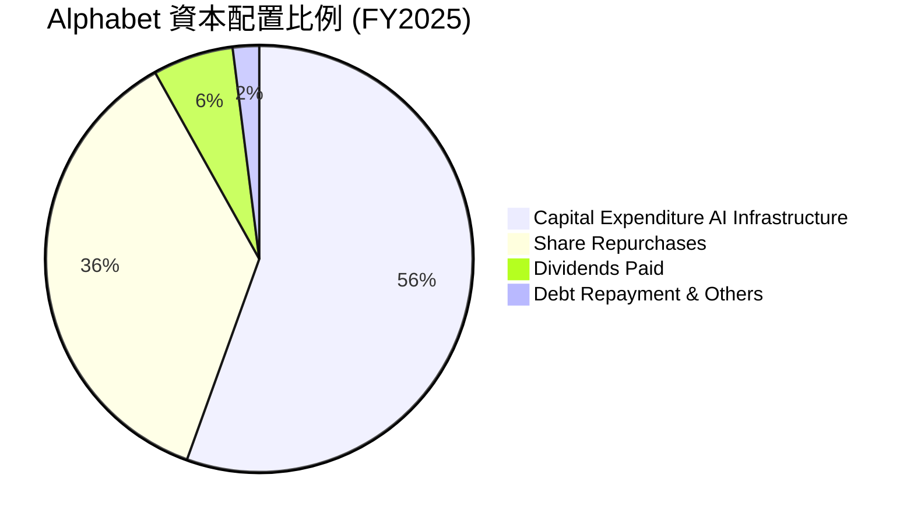

---

## 6. 獲利能力與資本效率

### 6.1 ROE / ROA / ROIC 趨勢

Alphabet 的資本回報效率在科技巨頭中名列前茅，且近年呈現上升趨勢：

| 指標 | FY2022 | FY2023 | FY2024 | FY2025 | TTM | 行業均值 | 評估 |
|------|--------|--------|--------|--------|-----|----------|------|
| **ROE (股東權益報酬率)** | 23.4% | 26.0% | 30.8% | 31.8% | **38.9%** | ~18.0% | 🟢 極高，股東價值創造者 |
| **ROA (資產報酬率)** | 16.4% | 18.3% | 22.2% | 22.2% | **14.6%** | ~10.5% | 🟢 資產利用效率優異 |
| **ROIC (投入資本報酬率)** | 18.2% | 21.5% | 27.8% | 28.5% | **32.7%** | ~15.0% | 🟢 核心業務盈利極強 |

### 6.2 ROIC vs WACC 分析（核心價值創造判斷）

```
╔══════════════════════════════════════════════════════════════════╗
║                ROIC vs WACC 深度分析 (TTM)                       ║
╠══════════════════════════════════════════════════════════════════╣
║                                                                  ║
║  WACC 估算：                                                     ║
║  ├── 無風險利率 (10Y 美債)：  4.20%                              ║
║  ├── 市場風險溢酬 (ERP)：     5.00%                              ║
║  ├── Beta：                   1.237                              ║
║  ├── 股權成本 = 4.2% + 1.237 × 5.0% = 10.39%                     ║
║  ├── 債務成本（稅後）：       3.70%                              ║
║  ├── 資本結構：股權 97.8%，債務 2.2%                             ║
║  └── ✅ WACC ≈ 10.2%                                             ║
║                                                                  ║
║  ROIC 估算（TTM）：                                              ║
║  ├── NOPAT = 營業利益 $138.13B × (1 - 17.6%) ≈ $113.82B          ║
║  ├── 投入資本 = 股東權益 + 債務 - 現金 ≈ $347.71B                 ║
║  └── ✅ ROIC ≈ 32.7%                                             ║
║                                                                  ║
║  ★ 經濟價值增加 (EVA) = ROIC - WACC = +22.5%                     ║
║                                                                  ║
║  ROIC  32.7%  ▓▓▓▓▓▓▓▓▓▓▓▓▓▓▓▓▓▓▓▓▓▓▓▓░░░░░░  🟢                 ║
║  WACC  10.2%  ▓▓▓▓▓░░░░░░░░░░░░░░░░░░░░░░░░░░  ──                 ║
║  EVA   +22.5% ████████████████████████░░░░░░░░  🏆 強力創造價值    ║
║                                                                  ║
║  📊 結論：ROIC 達 WACC 的 3.2 倍，顯示 Alphabet 具備極強的       ║
║    資本增值能力，投入的每一塊錢都能為股東創造超額回報。          ║
╚══════════════════════════════════════════════════════════════════╝
```

### 6.3 杜邦三因素分解

透過杜邦分析，我們可以拆解 Alphabet 的 ROE 驅動來源：

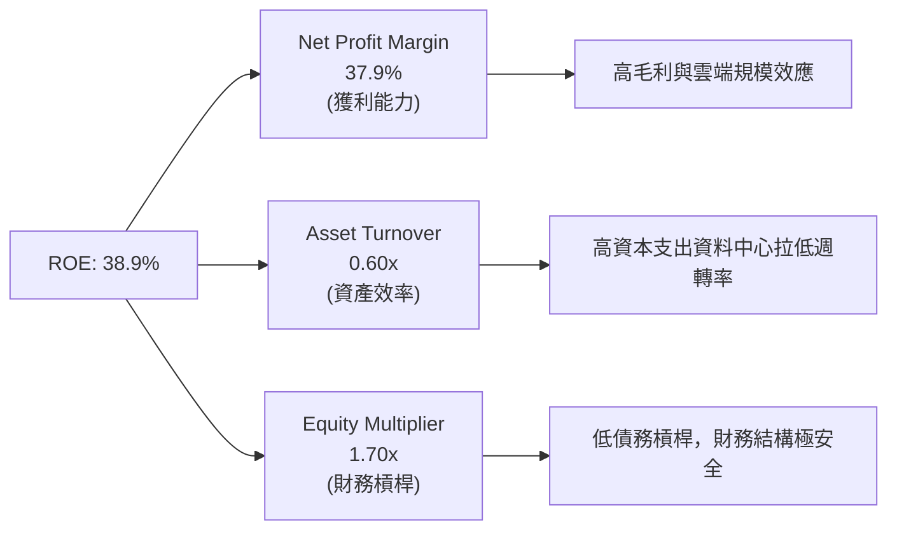

### 6.4 獲利能力儀表板

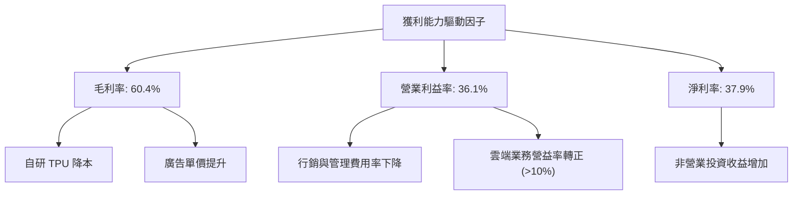

---

## 7. 估值深度分析

### 7.1 同業估值比較表格

在美股萬兆美元市值俱樂部（Magnificent 7）中，Alphabet 的估值一直處於相對低位：

| 估值指標 | **Alphabet (GOOG)** | **Microsoft (MSFT)** | **Meta Platforms (META)** | **Amazon (AMZN)** | GOOG 評估 |
|----------|----------|---------|---------|---------|-----------|
| **Trailing P/E** | **27.32x** | 35.40x | 29.80x | 41.20x | 🟢 顯著低於同業均值 |
| **Forward P/E** | **24.73x** | 31.20x | 25.50x | 34.80x | 🟢 具備極佳的性價比 |
| **P/S Ratio** | **10.34x** | 13.50x | 9.80x | 3.20x | 🟡 廣告股合理區間 |
| **P/B Ratio** | **9.06x** | 12.80x | 7.90x | 8.50x | 🟡 合理 |
| **EV / EBITDA** | **26.71x** | 24.50x | 19.80x | 21.50x | 🟡 反映高資本支出折舊 |
| **PEG Ratio** | **1.41x** | 2.10x | 1.25x | 1.65x | 🟢 成長性調整後極具吸引力 |

### 7.2 歷史估值區間分析

```
╔══════════════════════════════════════════════════════════════════╗
║              Alphabet 歷史 P/E 區間與當前位置                    ║
╠══════════════════════════════════════════════════════════════════╣
║                                                                  ║
║  歷史 5 年最低 PE：  18.5x                                       ║
║  歷史 5 年中位數：   26.2x                                       ║
║  當前 Trailing PE：  27.32x                                      ║
║  歷史 5 年最高 PE：  34.0x                                       ║
║                                                                  ║
║  18.5x            26.2x    27.3x                   34.0x         ║
║  [──────────────────┼───────▲───────────────────────]             ║
║                    中位數  當前位置                              ║
║                                                                  ║
║  📊 評估：當前估值略高於歷史中位數，但考量到 TTM 營收 YoY 增速   ║
║    (21.8%) 遠高於過去 5 年平均，當前估值並未泡沫化。             ║
╚══════════════════════════════════════════════════════════════════╝
```

### 7.3 DCF 敏感性分析（12個月目標價矩陣）

基於 TTM 自由現金流、10.2% 的 WACC（基準貼現率）以及 3.5% 的終端成長率進行建模：

| 營收/FCF 成長率 | **WACC = 9.5%** | **WACC = 10.2%（基準）** | **WACC = 11.0%** |
|------|--------------|----------------------|--------------|
| 🟢 **18.0% (樂觀)** | **$475.00** (+32.6%) | **$442.00** (+23.4%) | **$410.00** (+14.5%) |
| 🟡 **14.5% (基準)** | **$438.00** (+22.3%) | **$409.00** (+14.2%) | **$378.00** (+5.5%) |
| 🔴 **10.0% (悲觀)** | **$365.00** (+1.9%) | **$340.00** (-5.1%) | **$320.00** (-10.7%) |

*分析：在基準貼現率 10.2% 下，若 Google 能維持 14.5% 的中長期成長，其公允價值為 **$409.00**，較當前股價有 **14.2%** 的上行空間。*

### 7.4 估值綜合區間

```
╔══════════════════════════════════════════════════════════════════╗
║                     GOOG 估值綜合區間                            ║
╠══════════════════════════════════════════════════════════════════╣
║  當前股價：$358.16                                               ║
║  公允估值區間：                                                  ║
║  ├── 悲觀下限 (反壟斷拆分)： $320.00                              ║
║  ├── 基準公允價值：          $409.00                              ║
║  └── 樂觀上限 (AI 爆發)：    $475.00                              ║
║                                                                  ║
║  $320.00          $358.16      $409.00             $475.00       ║
║  [───────▼───────────▲────────────┼───────────────────]           ║
║        悲觀下限    當前股價     基準目標             樂觀上限    ║
╚══════════════════════════════════════════════════════════════════╝
```

---

## 8. 成長催化劑

### 8.1 催化劑時間軸

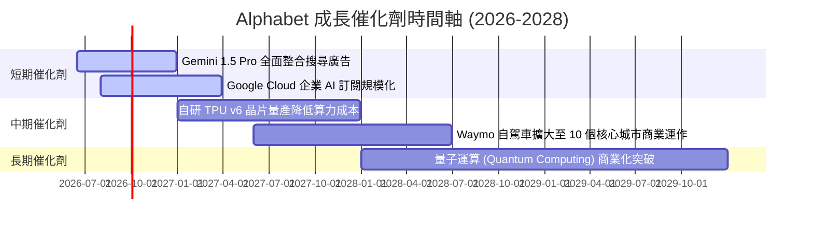

### 8.2 TAM (潛在市場規模) 分析

```
╔══════════════════════════════════════════════════════════════════╗
║                Alphabet 潛在市場規模 (TAM) 預估                  ║
╠══════════════════════════════════════════════════════════════════╣
║  1. 數位廣告市場 (Digital Ads)：                                 ║
║     ├── 全球 TAM (2027)： $850B                                  ║
║     └── Google 預期份額： ~38% (營收 $323B)                      ║
║  2. 雲端運算與 AI 算力 (Cloud & AI)：                            ║
║     ├── 全球 TAM (2027)： $650B                                  ║
║     └── Google Cloud 預期份額： ~12% (營收 $78B)                 ║
║  3. 自動駕駛 (Autonomous Driving - Waymo)：