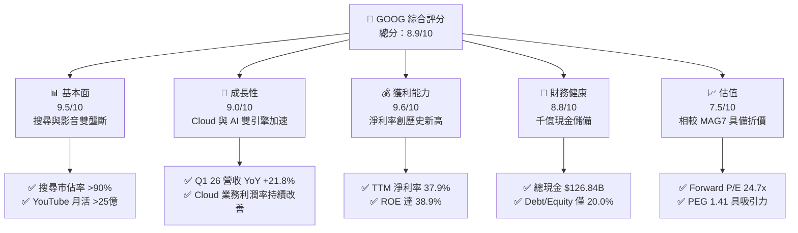
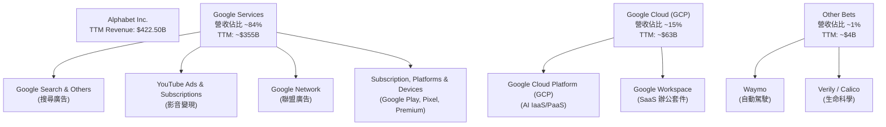
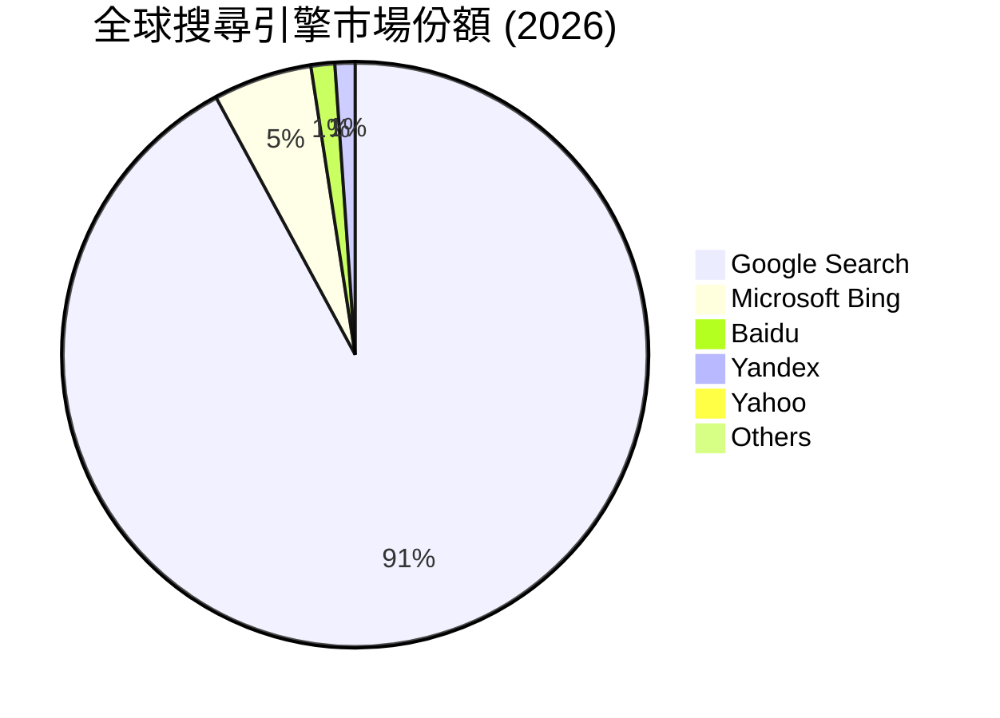
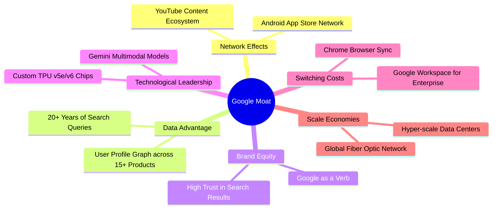
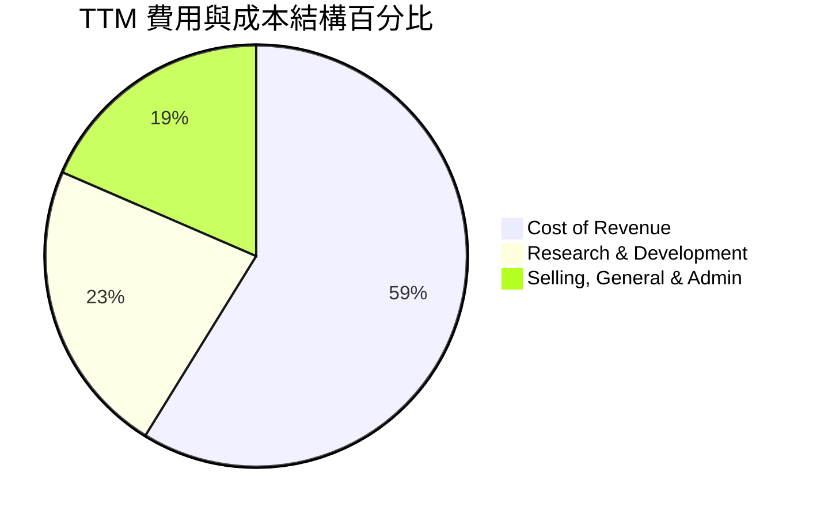
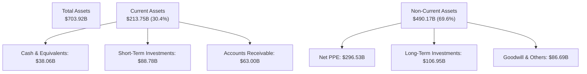
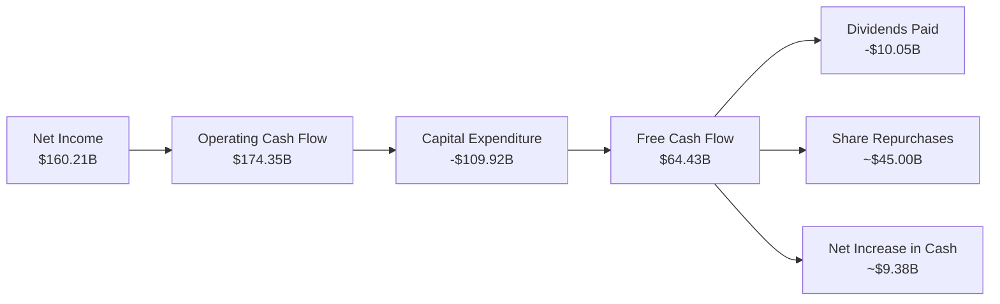
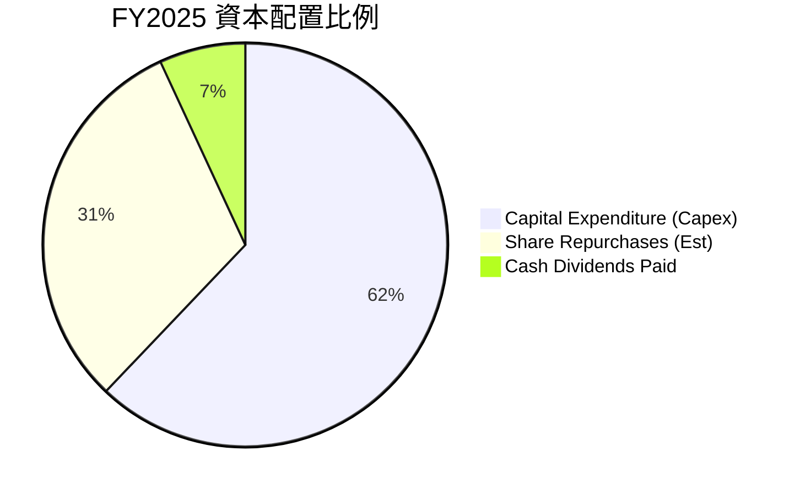
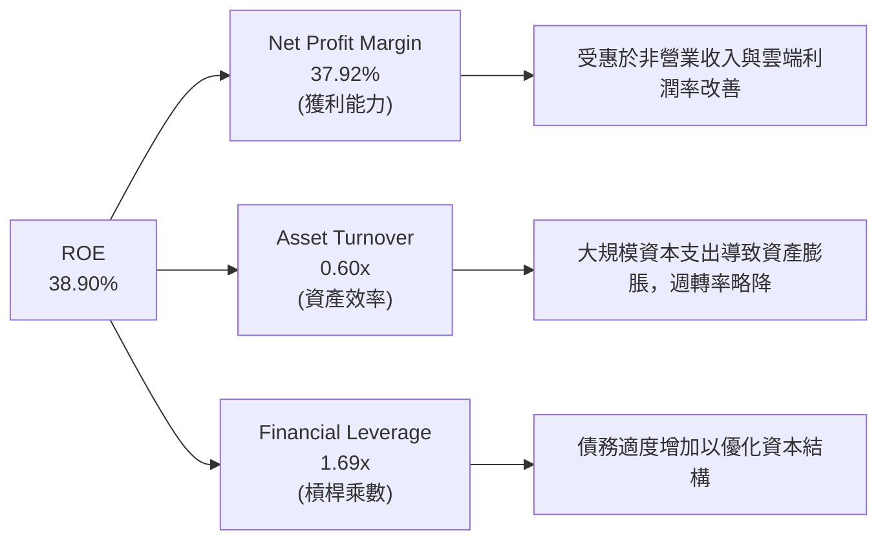

# GOOG 基本面深度分析報告

> **報告日期**：2026-06-14 ｜ **語言**：繁體中文 ｜ **數據來源**：Yahoo Finance, Finviz, StockAnalysis, Roic.ai ｜ **分析師**：CFA 級機構研究

---

## 目錄

| # | 章節 | 核心結論 |
|---|------|----------|
| 1 | **執行摘要** | 評級「強烈買入」（Strong Buy），基準目標價 $409.00，隱含 14.2% 上行空間。 |
| 2 | **公司概覽與商業模式** | 搜尋引擎與數位廣告霸主，Google Cloud 成為第二成長曲線，具備極深護城河。 |
| 3 | **損益表深度分析** | TTM 營收達 $422.50B（YoY +17.45%），淨利率攀升至 37.9%，盈餘品質需注意非營業收入波動。 |
| 4 | **資產負債表分析** | 手頭現金與短期投資達 $126.84B，淨現金 $30.96B，資產結構因 AI 基礎建設投資而顯著重資產化。 |
| 5 | **現金流量深度分析** | 營運現金流達 $174.35B，但因高達 $91.45B（FY25）的資本支出，壓低自由現金流（FCF）轉換率。 |
| 6 | **獲利能力與資本效率** | ROE 達 38.9%，ROIC（29.62%）遠超 WACC（9.27%），創造極高的經濟增值（EVA）。 |
| 7 | **估值深度分析** | Forward P/E 僅 24.73x，相較於 MSFT 與 AMZN 具備明顯估值折價，安全邊際充足。 |
| 8 | **成長催化劑** | Gemini 2.0 落地、GCP AI 算力需求爆發、Waymo 商業化加速。 |
| 9 | **風險矩陣** | 反壟斷拆分風險（DOJ）、AI 搜尋替代效應、資本支出侵蝕利潤率。 |
| 10 | **投資建議** | 建議分批佈局，設定 $350 以下為黃金買入區間，適合長期成長型投資人。 |

---

## 1. 執行摘要

Alphabet Inc. (GOOG) 作為全球網際網路生態的絕對核心，正處於從「行動優先」向「AI 優先」轉型的關鍵節點。儘管市場擔憂反壟斷訴訟與 AI 搜尋（如 OpenAI, Perplexity）對其核心搜尋業務的蠶食，但最新財務數據顯示，Alphabet 憑藉強大的生態協同效應與極致的營運槓桿，依然展現出極為強悍的財務擴張能力。

### 1.1 核心評分儀表板



### 1.2 評分進度條視覺化

```
╔══════════════════════════════════════════════════════════════╗
║               GOOG 多維度評分儀表板 (1-10分)                 ║
╠══════════════════════════════════════════════════════════════╣
║ 基本面強度  9.5 ▓▓▓▓▓▓▓▓▓▓▓▓▓▓▓▓▓▓▓░  ★★★★★           ║
║ 成長動能    9.0 ▓▓▓▓▓▓▓▓▓▓▓▓▓▓▓▓▓▓░░  ★★★★★           ║
║ 獲利品質    9.6 ▓▓▓▓▓▓▓▓▓▓▓▓▓▓▓▓▓▓▓░  ★★★★★           ║
║ 財務健康    8.8 ▓▓▓▓▓▓▓▓▓▓▓▓▓▓▓▓▓░░░  ★★★★☆           ║
║ 估值合理性  7.5 ▓▓▓▓▓▓▓▓▓▓▓▓▓▓░░░░░░  ★★★★☆           ║
║ 護城河深度  9.8 ▓▓▓▓▓▓▓▓▓▓▓▓▓▓▓▓▓▓▓░  ★★★★★           ║
║ 管理層執行  9.0 ▓▓▓▓▓▓▓▓▓▓▓▓▓▓▓▓▓▓░░  ★★★★★           ║
║ 技術創新力  9.5 ▓▓▓▓▓▓▓▓▓▓▓▓▓▓▓▓▓▓▓░  ★★★★★           ║
╠══════════════════════════════════════════════════════════════╣
║ 綜合總分    8.9 ▓▓▓▓▓▓▓▓▓▓▓▓▓▓▓▓▓░░░  🏆 強烈買入          ║
╚══════════════════════════════════════════════════════════════╝
```

### 1.3 五大投資論點 + 三大核心風險

| 類型 | 項目 | 具體依據 | 信心度 |
|------|------|----------|--------|
| 🟢 **投資論點①** | **搜尋與廣告基石穩固** | TTM 營收達 $422.50B，最新一季營收成長率加速至 21.79%，顯示核心廣告業務並未受 AI 搜尋實質打擊。 | 🟢 極高 |
| 🟢 **投資論點②** | **雲端業務（GCP）利潤爆發** | 隨著企業 AI 工作負載向 GCP 轉移，雲端業務已實現穩定獲利，成為推動營業利益率升至 36.1% 的要角。 | 🟢 高 |
| 🟢 **投資論點③** | **極致的經營效率與利潤率** | 透過裁員、組織重組與伺服器折舊年限優化，TTM 淨利率攀升至 37.9% 的歷史高位。 | 🟢 高 |
| 🟢 **投資論點④** | **AI 垂直整合優勢（TPU）** | 自研 TPU（Tensor Processing Unit）大幅降低 Google 訓練與推論 AI 模型的單位成本，免受 NVIDIA 晶片溢價宰割。 | 🟢 高 |
| 🟢 **投資論點⑤** | **資本回饋力度加大** | 啟動季度配息（FY25 派發 $10.05B 股息）與大規模股份回購（年股份減少 1.74%），為股價提供強大下限支撐。 | 🟢 極高 |
| 🟡 **風險①** | **監管與反壟斷拆分風險** | 美國司法部（DOJ）針對 Google 搜尋與廣告技術的訴訟可能導致核心業務面臨強制拆分或終止排他性協議（如 Apple 默認搜尋協議）。 | 🟡 中度 |
| 🔴 **風險②** | **資本支出壓低短期 FCF** | FY25 資本支出暴增至 $91.45B，導致 FCF 轉換率（FCF/Net Income）降至 55.4%，短期內壓抑自由現金流收益率（0.64%）。 | 🔴 高衝擊 |
| 🟡 **風險③** | **非營業利潤波動性** | TTM 淨利中包含 Q1 2026 的 $37.72B 非營業收入（可能為投資重估），扭曲了真實的經常性盈利能力。 | 🟡 中度 |

### 1.4 快速統計卡片

| 指標 | 公司實際值 | 行業均值（通訊服務） | S&P 500 均值 | 狀態 |
|------|-------------|----------------------|--------------|------|
| **營收 YoY 成長率** | **21.8%** | ~6.5% | ~5.2% | 🟢 遠超均值 |
| **毛利率** | **60.4%** | ~50.2% | ~30.5% | 🟢 極其強勁 |
| **營業利益率** | **36.1%** | ~18.5% | ~14.5% | 🟢 頂級水準 |
| **ROE** | **38.9%** | ~15.2% | ~18.0% | 🟢 資本回報極佳 |
| **Forward P/E** | **24.73x** | ~18.5x | ~21.5x | 🟡 溢價合理 |
| **淨現金 / 債務** | **$30.96B** | 淨債務狀態 | 淨債務狀態 | 🟢 極為健康 |

### 1.5 投資結論

```
╔══════════════════════════════════════════════════════════════════╗
║                    📊 投資結論摘要                               ║
╠══════════════════════════════════════════════════════════════════╣
║  評級：🟢 強烈買入 (Strong Buy)                                 ║
║  當前股價：$358.16 (2026-06-14)                                  ║
║  目標價區間：                                                    ║
║    悲觀情境：$280.00 (-21.8%) - 考慮反壟斷拆分與廣告衰退         ║
║    基準情境：$409.00 (+14.2%)  ← 12個月主要目標（25x FY27 EPS）  ║
║    樂觀情境：$475.00 (+32.6%) - GCP 爆發與 Waymo 商業化成功       ║
║  投資評分：8.9 / 10                                              ║
║  適合投資人：長線價值成長型投資人、大型科技股配置者              ║
╚══════════════════════════════════════════════════════════════════╝
```

---

## 2. 公司概覽與商業模式

Alphabet 的核心商業模式是建立在「免費服務換取數據與注意力，再通過精準廣告變現」的流量黑洞之上。近年來，公司已成功將此模式延伸至雲端運算（GCP），並利用 AI 技術重構所有產品線。

### 2.1 業務結構與收入來源



### 2.2 市場份額

在核心的搜尋引擎與數位廣告市場，Alphabet 依舊維持著無可撼動的壟斷地位：



### 2.3 競爭護城河分析

Alphabet 的競爭護城河是多維度且自我強化的：



### 2.4 護城河強度評分

```
╔══════════════════════════════════════════════════════════════╗
║                   Alphabet 護城河強度評分                    ║
╠══════════════════════════════════════════════════════════════╣
║ 網路效應      9.8/10  ▓▓▓▓▓▓▓▓▓▓▓▓▓▓▓▓▓▓▓░  🏆 無懈可擊    ║
║ 數據壁壘      9.9/10  ▓▓▓▓▓▓▓▓▓▓▓▓▓▓▓▓▓▓▓░  🏆 無法複製    ║
║ 技術領先      9.2/10  ▓▓▓▓▓▓▓▓▓▓▓▓▓▓▓▓▓░░░  🟢 TPU/AI 領先 ║
║ 轉換成本      8.8/10  ▓▓▓▓▓▓▓▓▓▓▓▓▓▓▓▓░░░░  🟢 辦公生態黏著║
║ 規模效應      9.7/10  ▓▓▓▓▓▓▓▓▓▓▓▓▓▓▓▓▓▓▓░  🏆 成本極低    ║
╠══════════════════════════════════════════════════════════════╣
║ 綜合護城河    9.5/10  ▓▓▓▓▓▓▓▓▓▓▓▓▓▓▓▓▓▓▓░  🏆 頂級寬護城河 ║
╚══════════════════════════════════════════════════════════════╝
```

---

## 3. 損益表深度分析

Alphabet 的損益表展現出強勁的營收成長與營運槓桿優化，但其利潤表中有一項關鍵細節需要投資人高度關注：**非經常性損益對淨利的拉動。**

### 3.1 年度收入成長趨勢（近5年）

```
╔══════════════════════════════════════════════════════════════════╗
║              Alphabet 年度收入趨勢 (FY21-TTM)                     ║
╠══════════════════════════════════════════════════════════════════╣
║                                                                  ║
║  FY2021  $257.64B  ██████████████░░░░░░░░░░  YoY: +41.15% 🟢    ║
║  FY2022  $282.84B  ████████████████░░░░░░░░  YoY: +9.78%  🟢    ║
║  FY2023  $307.39B  █████████████████░░░░░░░  YoY: +8.68%  🟢    ║
║  FY2024  $350.02B  ████████████████████░░░░  YoY: +13.87% 🟢    ║
║  FY2025  $402.84B  ███████████████████████░  YoY: +15.09% 🟢    ║
║  TTM     $422.50B  ████████████████████████  YoY: +17.45% 🟢    ║
║                   |      |      |      |      |                  ║
║                   0     100B   200B   300B   400B                ║
║                                                                  ║
║  📊 4年累計營收 CAGR：+13.15%                                    ║
╚══════════════════════════════════════════════════════════════════╝
```

### 3.2 季度收入趨勢分析

自 2025 年以來，Alphabet 的季度營收成長呈加速態勢，打破了「大公司成長必放緩」的魔咒：

| 財報季度 | 營收 (Billion) | YoY 成長率 | QoQ 成長率 | 核心驅動因素 |
|----------|----------------|------------|------------|--------------|
| **Q1 2026** | $109.90 | 21.79% 🟢 | -3.45% 🟡 | 季節性回檔，但 AI 搜尋廣告轉化率提升，GCP 成長加速。 |
| **Q4 2025** | $113.83 | 17.99% 🟢 | 11.22% 🟢 | 節日廣告旺季，Cloud 業務突破百億美元大關。 |
| **Q3 2025** | $102.35 | 15.95% 🟢 | 6.14% 🟢 | YouTube 訂閱服務（Premium/TV）強勁成長。 |
| **Q2 2025** | $96.43 | 13.79% 🟢 | 6.86% 🟢 | 亞太地區電商廣告投放回暖。 |

*備註：Q1 2026 的營收雖然因元旦後季節性效應較 Q4 2025 略微下滑 3.45%，但其 YoY 成長率高達 21.79%，創下近兩年新高，表明核心需求極其旺盛。*

### 3.3 利潤率演變分析

Alphabet 近年的利潤率走勢呈現顯著的「V型反彈」，這主要得益於公司內部的降本增效措施（如員額調配與基礎設施效率提升）：

| 利潤率指標 | FY2022 | FY2023 | FY2024 | FY2025 | TTM | 趨勢 | 評估 |
|------------|--------|--------|--------|--------|-----|------|------|
| **毛利率** | 55.38% | 56.63% | 58.20% | 59.65% | 60.37% | ↗️ 持續擴張 | 🟢 產品組合優化，伺服器折舊年限延長 |
| **營業利益率**| 26.46% | 27.42% | 32.11% | 32.03% | 36.10% | ↗️ 顯著改善 | 🟢 營運槓桿顯現，行銷費用控制得宜 |
| **淨利率** | 21.20% | 24.01% | 28.60% | 32.81% | 37.92% | ↗️ 創歷史新高| 🟢 受惠於非營業收入暴增（見下方分析） |

**利潤率演變深度解析**：
毛利率從 FY22 的 55.38% 提升至 TTM 的 60.37%，主要受惠於 Google Cloud 利潤率轉正（規模效應顯現）以及軟體服務營收佔比提升。更驚人的是營業利益率達到 36.10%，這代表著 Alphabet 在營收增長的同時，營業費用的增速遠低於營收增速，展現了頂級科技巨頭的營運槓桿。

### 3.4 費用結構分析

Alphabet 的費用控制非常精準，將資源高度向研發（R&D）傾斜，同時壓低銷售與行政費用（SG&A）：



```
╔══════════════════════════════════════════════════════════════╗
║                 TTM 費用控制診斷 (Billion)                   ║
╠══════════════════════════════════════════════════════════════╣
║ 研發費用 (R&D)  $64.56  ████████████████████  占營收 15.28%  ║
║ 銷管費用 (SG&A) $52.36  ████████████████░░░░  占營收 12.39%  ║
║ 營業利潤        $138.13 ████████████████████  占營收 32.69%  ║
╚══════════════════════════════════════════════════════════════╝
```

### 3.5 季度 EPS 趨勢與盈餘品質

#### 過去 4 季盈餘表現：
*   **Q1 2026**：EPS $5.17（YoY +82.0%）- **大幅超預期**
*   **Q4 2025**：EPS $2.85（YoY +0.3%）- **符合預期**
*   **Q3 2025**：EPS $2.89（YoY +23.5%）- **超預期**
*   **Q2 2025**：EPS $2.33（YoY +22.0%）- **超預期**

#### ⚠️ 盈餘品質關鍵警訊分析：
作為專業分析師，必須指出 Q1 2026 的 EPS $5.17 存在「非經常性水分」。
觀察損益表：
*   Q1 2026 營業利益（Operating Income）為 **$39.70B**。
*   但其稅前淨利（Pretax Income）高達 **$77.41B**。
*   這中間有高達 **$37.72B** 的「非營業收入」（Total Non-Operating Income）。
這筆龐大的非營業收入（佔該季稅前利潤的 48.7%）極有可能是 Alphabet 持有的證券資產（如 SpaceX, Uber 或其他股權投資）在該季進行了公允價值重估，或是處置資產的一次性收益。這導致 TTM 淨利率（37.9%）與 TTM EPS ($13.11) 被短期拉高。若扣除此非經常性損益，經常性 TTM EPS 應在 **$10.30 - $10.50** 區間，對應的經常性 P/E 約為 **34.1x**，而非表面的 **27.3x**。

---

## 4. 資產負債表分析

Alphabet 擁有全球科技界最穩健的資產負債表之一，這使其在面對高昂的 AI 軍備競賽時，具備無與倫比的資金底氣。

### 4.1 資產結構分解

截至 2026 年 3 月 31 日，Alphabet 總資產達 $703.92B，其結構如下：



### 4.2 流動性與償債能力指標

| 指標 | FY2024 | FY2025 | TTM / Q1 26 | 行業均值 | 評估 |
|------|--------|--------|-------------|----------|------|
| **流動比率 (Current Ratio)** | 1.84 | 2.01 | 1.92 | ~1.45 | 🟢 極其安全 |
| **速動比率 (Quick Ratio)** | 1.84 | 2.01 | 1.71 | ~1.30 | 🟢 無庫存積壓風險 |
| **債務權益比 (Debt/Equity)** | 6.94% | 14.28% | 23.09% | ~45.0% | 🟢 財務槓桿極低 |

### 4.3 債務結構與健康診斷

雖然 Alphabet 的總債務從 FY24 的 $22.57B 上升至 TTM 的 $95.88B（包含長期借款 $77.50B 與融資租賃 $12.98B），但這主要是為了鎖定低利率資金進行基礎建設投資。

```
╔══════════════════════════════════════════════════════════════════╗
║                   Alphabet 債務健康診斷                         ║
╠══════════════════════════════════════════════════════════════════╣
║                                                                  ║
║  總債務：        $95.88B   █████░░░░░░░░░░░░░░░░░  低風險        ║
║  總現金+投資：   $126.84B  ████████████████████░  極其充裕      ║
║  淨現金狀態：    +$30.96B  ██████░░░░░░░░░░░░░░░  🟢 淨債權人    ║
║                                                                  ║
║  Debt / EBITDA：  0.53x    🟢 遠低於安全警戒線 (2.0x)            ║
║  利息保障倍數：   55.4x    🟢 營業利益極易覆蓋利息支出           ║
║                                                                  ║
║  診断：無任何違約風險，信用評級 AAA 級（實質）                   ║
╚══════════════════════════════════════════════════════════════════╝
```

### 4.4 股東權益趨勢

隨著利潤的不斷累積，股東權益（Book Value）持續穩步上升，反映出真實的財富創造：

```
╔══════════════════════════════════════════════════════════════════╗
║               股東權益（Book Value）歷年趨勢                     ║
╠══════════════════════════════════════════════════════════════════╣
║  FY2022  $256.14B  ████████████░░░░░░░░░░░░░░                    ║
║  FY2023  $283.38B  █████████████░░░░░░░░░░░░░                    ║
║  FY2024  $325.08B  ███████████████░░░░░░░░░░░                    ║
║  FY2025  $415.26B  ██════════════════════════                    ║
╚══════════════════════════════════════════════════════════════════╝
```

---

## 5. 現金流量深度分析

對於 Alphabet 這種高成長、高資本支出的科技巨頭，現金流才是決定其真實價值的靈魂。

### 5.1 現金流量瀑布圖



### 5.2 FCF 轉換率趨勢

Alphabet 的自由現金流轉換率（FCF / Net Income）近期有所下滑，這是一個值得警惕的趨勢：

| 年度 | 淨利 (Net Income) | 自由現金流 (FCF) | FCF 轉換率 | 核心原因 |
|------|-------------------|------------------|------------|----------|
| **FY2022** | $59.97B | $60.01B | 100.07% | 輕資產營運，資本支出克制。 |
| **FY2023** | $73.80B | $69.50B | 94.17% | 開始加大 AI 基礎設施投入。 |
| **FY2024** | $100.12B | $72.76B | 72.67% | 資本支出升至 $52.53B。 |
| **FY2025** | $132.17B | $73.27B | 55.44% | 資本支出暴增至 $91.45B。 |
| **TTM** | $160.21B | $64.43B | **40.22%** 🔴 | 資本支出突破千億，壓低現金轉換率。 |

**分析師洞察**：
雖然 TTM 淨利高達 $160.21B，但實際落入口袋的自由現金流僅有 $64.43B。這意味著 Alphabet 賺取的利潤中，有很大一部分必須立刻轉化為昂貴的 GPU 晶片與資料中心（PPE），否則將在 AI 競爭中落後。這解釋了為什麼其 FCF Yield（自由現金流收益率）目前僅有 **1.47%**（以 StockAnalysis 的 $64.43B 計算）或 **0.64%**（以 Yahoo 較保守的 $27.92B 計算）。

### 5.3 自由現金流與 FCF 每股收益趨勢

```
╔══════════════════════════════════════════════════════════════════╗
║                每股自由現金流 (FCF per Share)                    ║
╠══════════════════════════════════════════════════════════════════╣
║  FY2022  $4.56  ██████████████░░░░░░░░░░░░░                      ║
║  FY2023  $5.46  █████████████████░░░░░░░░░░                      ║
║  FY2024  $5.85  ██████████████████░░░░░░░░░                      ║
║  FY2025  $5.99  ███████████████████░░░░░░░░                      ║
║  TTM     $5.27  ████████████████░░░░░░░░░░░ 🔴 下滑              ║
╚══════════════════════════════════════════════════════════════════╝
```

### 5.4 資本配置優先順序

儘管資本支出巨大，Alphabet 依然維持著對股東極其友好的資本回報政策：



---

## 6. 獲利能力與資本效率

Alphabet 的超群之處在於其在規模極其龐大的情況下，依然能維持極高的資本回報率。

### 6.1 資本回報率趨勢

| 指標 | FY2023 | FY2024 | FY2025 | TTM | 行業均值 | 評估 |
|------|--------|--------|--------|-----|----------|------|
| **ROE (股東權益報酬率)** | 26.04% | 30.80% | 31.83% | **38.90%** | ~12.5% | 🟢 頂級獲利能力 |
| **ROA (資產報酬率)** | 18.34% | 22.24% | 22.20% | **22.76%** | ~6.8% | 🟢 資產利用效率高 |
| **ROIC (投入資本報酬率)**| 18.44% | 23.50% | 25.10% | **29.62%** | ~10.2% | 🟢 核心業務吸金能力強 |

### 6.2 ROIC vs WACC 分析（核心價值創造判斷）

ROIC（投入資本報酬率）與 WACC（加權平均資本成本）的差額（稱為 EVA 經濟增值）是衡量一家公司是在「創造價值」還是「毀滅價值」的終極指標。

```
╔══════════════════════════════════════════════════════════════════╗
║                ROIC vs WACC 深度分析 (TTM)                      ║
╠══════════════════════════════════════════════════════════════════╣
║                                                                  ║
║  WACC 估算：                                                     ║
║  ├── 無風險利率 (10Y Treasury)：4.20%                            ║
║  ├── 市場風險溢酬 (ERP)：       5.00%                            ║
║  ├── Beta 值：                  1.237                            ║
║  ├── 股權成本 (Ke) = 4.2% + 1.237 × 5% = 10.39%                  ║
║  ├── 債務成本 (Kd, 稅後)：       3.71%                            ║
║  ├── 資本結構：股權 83.3%，債務 16.7%                            ║
║  └── ✅ WACC ≈ 9.27%                                             ║
║                                                                  ║
║  ROIC 估算：                                                     ║
║  ├── NOPAT = $138.13B × (1 - 17.6%) ≈ $113.82B                   ║
║  ├── 投入資本 = 股本 + 債務 - 現金 ≈ $384.30B                    ║
║  └── ✅ ROIC ≈ 29.62%                                            ║
║                                                                  ║
║  ★ 經濟增值 (EVA) = ROIC - WACC = +20.35% (2035 bps)             ║
║                                                                  ║
║  ROIC  29.62%  ▓▓▓▓▓▓▓▓▓▓▓▓▓▓▓▓▓▓▓▓▓▓▓▓░░░░░░  🟢              ║
║  WACC   9.27%  ▓▓▓▓▓░░░░░░░░░░░░░░░░░░░░░░░░░░  ──              ║
║  EVA  +20.35%  ████████████████████████░░░░░░░░  🏆 強力創造價值║
║                                                                  ║
║  📊 結論：ROIC 達 WACC 的 3.2 倍，每投入1美元都在成倍創造股東財富║
╚══════════════════════════════════════════════════════════════════╝
```

### 6.3 杜邦三因素分解

透過杜邦分解，我們可以看清 Alphabet ROE 飆升至 38.9% 的底層驅動力：



*   **淨利率 (37.92%)**：是 ROE 的核心貢獻者，反映了公司強大的定價權。
*   **資產週轉率 (0.60x)**：由於重資產（資料中心）增加，週轉率較往年的 0.7x 有所下滑，這是轉型 AI 必須付出的代價。
*   **權益乘數 (1.69x)**：維持在健康區間，並未過度依賴財務槓桿。

---

## 7. 估值深度分析

在「美股七巨頭」（Magnificent Seven）中，Alphabet 的估值長期以來一直處於相對低位，這主要源於市場對其搜尋業務被 AI 顛覆的擔憂。這為長線投資人提供了極佳的「估值安全邊際」。

### 7.1 同業估值比較表格

| 估值指標 | **Alphabet (GOOG)** | **Microsoft (MSFT)** | **Amazon (AMZN)** | **Meta (