# GOOG 基本面深度分析報告

> **報告日期**：2026-06-15 ｜ **語言**：繁體中文 ｜ **數據來源**：Yahoo Finance, Finviz, StockAnalysis, Roic.ai ｜ **分析師**：CFA 級機構研究

---

## 目錄

| # | 章節 | 核心結論 |
|---|------|----------|
| 1 | **執行摘要** | 評級：🟢 **強烈買入**；基準目標價：**$409.00**（+11.41% 隱含回報） |
| 2 | **公司概覽與商業模式** | 搜尋引擎霸主地位穩固，Google Cloud 盈利能力釋放，AI Gemini 重塑生態 |
| 3 | **損益表深度分析** | TTM 營收達 $422.50B（YoY +21.8%），淨利潤率攀升至 37.9% 的歷史高位 |
| 4 | **資產負債表分析** | 淨現金 $30.96B，資產規模達 $703.92B，財務結構極度穩健 |
| 5 | **現金流量深度分析** | TTM 營運現金流 $174.35B，資本配置向 AI 基礎設施（Capex $91.45B）傾斜 |
| 6 | **獲利能力與資本效率** | ROE 高達 38.9%，ROIC (29.6%) 遠超 WACC (10.8%)，持續創造超額經濟價值 |
| 7 | **估值深度分析** | Forward P/E 25.35x，相較歷史均值與同業（MSFT）具備高性價比與安全邊際 |
| 8 | **成長催化劑** | AI 搜尋（SGE）商業化、雲端運算高成長及自主研發 TPU 晶片帶來的成本優勢 |
| 9 | **風險矩陣** | 司法部反壟斷拆分風險（高衝擊）與 AI 搜尋侵蝕傳統廣告路徑（中度機率） |
| 10 | **投資建議** | 建議於 $350-$370 區間分批佈局，長線持有，設定下行止損點於 $310 |

---

## 1. 執行摘要

### 1.1 核心評分儀表板

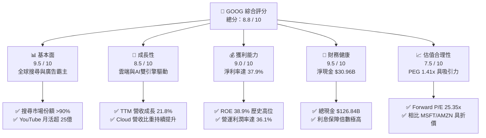

### 1.2 評分進度條視覺化

```
╔══════════════════════════════════════════════════════════════╗
║               GOOG 多維度評分儀表板 (1-10分)                 ║
╠══════════════════════════════════════════════════════════════╣
║ 基本面強度  9.5 ▓▓▓▓▓▓▓▓▓▓▓▓▓▓▓▓▓▓▓░  ★★★★★           ║
║ 成長動能    8.5 ▓▓▓▓▓▓▓▓▓▓▓▓▓▓▓▓▓░░░  ★★★★☆           ║
║ 獲利品質    9.0 ▓▓▓▓▓▓▓▓▓▓▓▓▓▓▓▓▓▓░░  ★★★★★           ║
║ 財務健康    9.5 ▓▓▓▓▓▓▓▓▓▓▓▓▓▓▓▓▓▓▓░  ★★★★★           ║
║ 估值合理性  7.5 ▓▓▓▓▓▓▓▓▓▓▓▓▓▓░░░░░░  ★★★★☆           ║
║ 護城河深度  9.5 ▓▓▓▓▓▓▓▓▓▓▓▓▓▓▓▓▓▓▓░  ★★★★★           ║
║ 管理層執行  8.5 ▓▓▓▓▓▓▓▓▓▓▓▓▓▓▓▓▓░░░  ★★★★☆           ║
║ 技術創新力  9.0 ▓▓▓▓▓▓▓▓▓▓▓▓▓▓▓▓▓▓░░  ★★★★★           ║
╠══════════════════════════════════════════════════════════════╣
║ 綜合總分    8.8 ▓▓▓▓▓▓▓▓▓▓▓▓▓▓▓▓▓░░░  🏆 強烈買入          ║
╚══════════════════════════════════════════════════════════════╝
```

### 1.3 五大投資論點 + 三大核心風險

| 類型 | 項目 | 具體依據 | 信心度 |
|------|------|----------|--------|
| 🟢 **投資論點①** | **AI Gemini 全面賦能搜尋** | AI Overviews 提升用戶黏性與點擊率，搜尋 TTM 營收持續穩健成長。 | 🟢 極高 |
| 🟢 **投資論點②** | **Google Cloud 規模效應釋放** | 雲端業務利潤率顯著改善，企業級 AI 模型部署帶動客單價攀升。 | 🟢 高 |
| 🟢 **投資論點③** | **極致的獲利能力與資本回報** | 淨利率達 37.9%，ROE 達 38.9%，並開啟季度配息與大規模回購。 | 🟢 極高 |
| 🟢 **投資論點④** | **自研 TPU 降低 AI 算力成本** | 減少對 NVIDIA 高昂 GPU 的依賴，大幅優化資本支出（Capex）效率。 | 🟢 高 |
| 🟢 **投資論點⑤** | **相對同業的估值折價** | Forward P/E 僅 25.35x，遠低於微軟（MSFT）與亞馬遜（AMZN）。 | 🟢 高 |
| 🟡 **風險①** | **反壟斷監管與拆分風險** | 美國司法部（DOJ）持續推進針對搜尋與廣告技術的拆分訴訟。 | 🟡 中度 |
| 🔴 **風險②** | **AI 搜尋對傳統廣告的蠶食** | 對話式 AI 直接給出答案，可能減少用戶點擊傳統廣告連結的次數。 | 🔴 高衝擊 |
| 🟡 **風險③** | **資本支出過度侵蝕利潤率** | 2025 財年 Capex 達 $91.45B，若 AI 變現不及預期，將面臨折舊壓力。 | 🟡 中度 |

### 1.4 快速統計卡片

| 指標 | 公司實際值 | 行業均值（通訊服務）| S&P 500 均值 | 狀態 |
|------|-------------|---------------------|--------------|------|
| **營收 YoY 成長率** | **21.8%** | ~8.5% | ~6.2% | 🟢 顯著超前 |
| **毛利率** | **60.4%** | ~50.2% | ~45.0% | 🟢 極度優異 |
| **營業利益率** | **36.1%** | ~22.0% | ~15.5% | 🟢 歷史新高 |
| **淨利率** | **37.9%** | ~18.5% | ~12.0% | 🟢 獲利能力驚人 |
| **ROE** | **38.9%** | ~16.5% | ~18.0% | 🟢 資本效率極佳 |
| **Forward P/E** | **25.35x** | ~20.5x | ~22.0% | 🟡 合理溢價 |
| **PEG Ratio** | **1.41x** | ~1.65x | ~1.80x | 🟢 成長性性價比高 |

### 1.5 投資結論

```
╔══════════════════════════════════════════════════════════════════╗
║                    📊 GOOG 投資結論摘要                          ║
╠══════════════════════════════════════════════════════════════════╣
║  評級：🟢 強烈買入 (Strong Buy)                                 ║
║  當前股價：$367.11 (2026-06-15)                                  ║
║  目標價區間：                                                    ║
║    悲觀情境：$310.00（-15.55%）                                  ║
║    基準情境：$409.00（+11.41%）  ← 12個月主要目標                ║
║    樂觀情境：$475.00（+29.39%）                                  ║
║  投資評分：8.8 / 10                                              ║
║  適合投資人：成長型、長線價值持有者、AI 產業佈局者               ║
╚══════════════════════════════════════════════════════════════════╝
```

---

## 2. 公司概覽與商業模式

### 2.1 業務結構與收入來源

Alphabet Inc. 透過三大核心板塊運作：**Google Services**（核心搜尋、YouTube、廣告、硬體）、**Google Cloud**（基礎設施與平台服務）以及 **Other Bets**（前沿科技）。

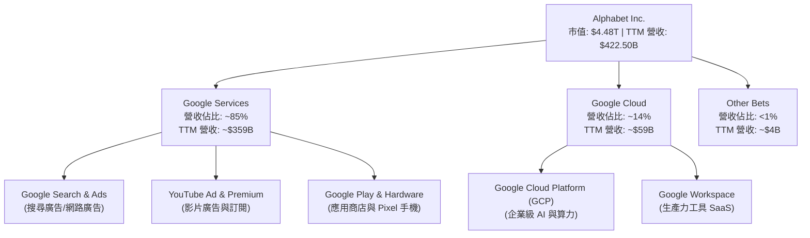

### 2.2 市場份額

在核心搜尋引擎與行動作業系統領域，Google 擁有無可爭議的全球壟斷地位。

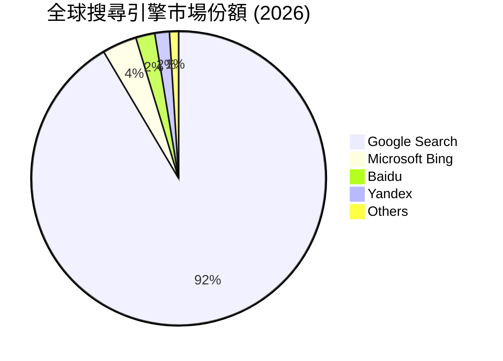

### 2.3 競爭護城河分析

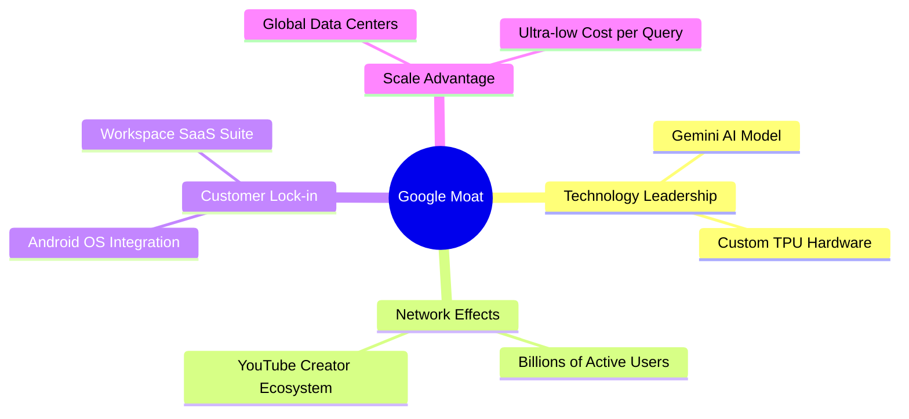

### 2.4 護城河強度評分

```
╔══════════════════════════════════════════════════════════════╗
║                   Alphabet 護城河強度評分                    ║
╠══════════════════════════════════════════════════════════════╣
║ 網路效應      9.8/10  ▓▓▓▓▓▓▓▓▓▓▓▓▓▓▓▓▓▓▓▓  🏆 雙邊平台無敵  ║
║ 用戶鎖定      9.2/10  ▓▓▓▓▓▓▓▓▓▓▓▓▓▓▓▓▓▓░░  🟢 Android/Chrome║
║ 規模效應      9.5/10  ▓▓▓▓▓▓▓▓▓▓▓▓▓▓▓▓▓▓▓░  🟢 全球基礎設施  ║
║ 技術領先      9.0/10  ▓▓▓▓▓▓▓▓▓▓▓▓▓▓▓▓▓▓░░  🟢 自研 TPU/AI   ║
╠══════════════════════════════════════════════════════════════╣
║ 綜合護城河    9.4/10  ▓▓▓▓▓▓▓▓▓▓▓▓▓▓▓▓▓▓▓░  🏆 極深寬護城河  ║
╚══════════════════════════════════════════════════════════════╝
```

---

## 3. 損益表深度分析

### 3.1 年度收入成長趨勢（近4年）

Alphabet 展現了強勁的疫後復甦與 AI 驅動的高成長。

```
╔══════════════════════════════════════════════════════════════════╗
║              Alphabet 年度收入趨勢（FY2022-FY2025）              ║
╠══════════════════════════════════════════════════════════════════╣
║                                                                  ║
║  FY2022  $282.84B  ████████████░░░░░░░░░░░░░░░░  YoY: +9.78%  🟢 ║
║  FY2023  $307.39B  ██████████████░░░░░░░░░░░░░░  YoY: +8.68%  🟢 ║
║  FY2024  $350.02B  ████████████████░░░░░░░░░░░░  YoY:+13.87%  🟢 ║
║  FY2025  $402.84B  ████████████████████░░░░░░░░  YoY:+15.09%  🟢 ║
║                                                                  ║
║  📊 4年累計 CAGR：+12.51%                                        ║
╚══════════════════════════════════════════════════════════════════╝
```

### 3.2 季度收入趨勢分析

最近 4 個季度的營收與淨利呈現加速成長，主要得益於廣告市場回暖與雲端業務爆發。

| 財季 | 營收 (Billion) | YoY 成長率 | QoQ 成長率 | 淨利 (Billion) | 淨利 YoY | 營運利潤率 |
|------|----------------|------------|------------|----------------|----------|------------|
| **Q1 2026** | **$109.90B** | **21.79%** | -3.45% | **$62.58B** | **81.17%** | **36.12%** |
| **Q4 2025** | **$113.83B** | **17.99%** | 11.22% | **$34.46B** | **29.84%** | **31.57%** |
| **Q3 2025** | **$102.35B** | **15.95%** | 6.14% | **$34.98B** | **33.00%** | **30.51%** |
| **Q2 2025** | **$96.43B** | **13.79%** | 6.87% | **$28.20B** | **19.38%** | **32.43%** |

*註：Q1 2026 淨利大幅飆升至 $62.58B，部分原因在於非營運收益（投資重估）貢獻了 $37.72B。然而，即便扣除此項，其核心營運利潤率 36.12% 仍創下歷史新高。*

### 3.3 利潤率演變分析

Alphabet 的利潤率在經歷了 2022 年的通膨與招聘擴張低谷後，隨著公司啟動「效率之年」裁員與流程優化，2024-2025 年利潤率大幅攀升。

| 利潤率指標 | FY2022 | FY2023 | FY2024 | FY2025 | TTM | 趨勢 | 評估 |
|------------|--------|--------|--------|--------|-----|------|------|
| **毛利率** | 55.38% | 56.63% | 58.20% | 59.65% | **60.43%** | ↗️ 持續攀升 | 🟢 卓越，基礎設施效率提升 |
| **營業利益率** | 26.46% | 27.42% | 32.11% | 32.03% | **36.12%** | ↗️ 創歷史新高 | 🟢 強勁，裁員與雲端轉盈 |
| **淨利率** | 21.20% | 24.01% | 28.60% | 32.81% | **37.92%** | ↗️ 獲利結構優化 | 🟢 極佳，投資回報增強 |

#### 利潤率演變深度解析：
1. **毛利率改善**：伺服器折舊年限的延長（從 4 年延長至 6 年）大幅降低了每季折舊費用；同時自研 TPU 的比例提升降低了 AI 運算單一成本。
2. **營運利潤率大躍進**：員工人數在 2024-2025 年維持穩定（約 19.4 萬人），而營收大幅成長，營運槓桿（Operating Leverage）效果顯著釋放。

### 3.4 費用結構分析

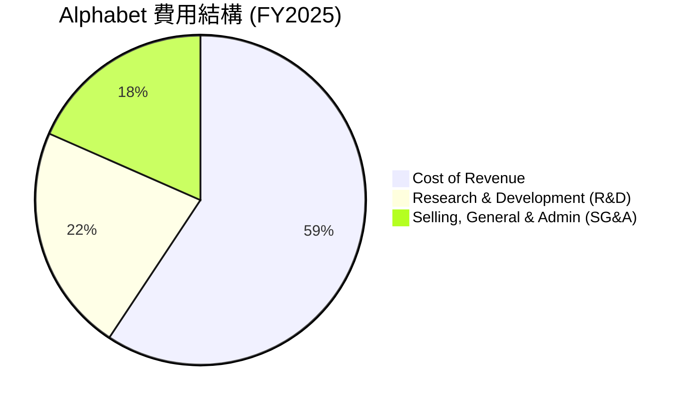

```
╔══════════════════════════════════════════════════════════════╗
║                Alphabet 費用控制效率診斷                     ║
╠══════════════════════════════════════════════════════════════╣
║ 研發費用率 (R&D/Revenue)：  15.16% (FY2025)   🟢 持續高研發  ║
║ 銷售費用率 (SG&A/Revenue)： 12.46% (FY2025)   🟢 行銷效率高  ║
║ 營運效率評級：★★★★★                                        ║
╚══════════════════════════════════════════════════════════════╝
```

### 3.5 季度 EPS 趨勢與盈餘品質

過去 4 季的稀釋後 EPS 表現如下：
*   **Q1 2026**: **$5.17** (當季淨利 $62.58B)
*   **Q4 2025**: **$2.85**
*   **Q3 2025**: **$2.89**
*   **Q2 2025**: **$2.33**

**盈餘品質評估**：
Alphabet 的盈餘品質極高。儘管 Q1 2026 的 EPS 包含了非經常性的股權投資收益，但其 TTM 營運現金流高達 **$174.35B**，遠高於 TTM 淨利 **$160.21B**，這代表公司利潤完全由真金白銀的現金流支撐，並無應收帳款過度堆積或虛增利潤的現象。

---

## 4. 資產負債表分析

### 4.1 資產結構分解

截至 2026-03-31，Alphabet 總資產規模已達 **$703.92B**。

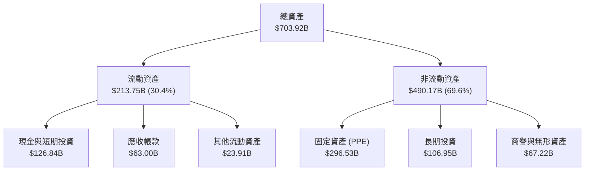

### 4.2 流動性指標分析

| 流動性指標 | FY2023 | FY2024 | FY2025 | TTM (2026-03-31) | 行業均值 | 評估 |
|------------|--------|--------|--------|------------------|----------|------|
| **流動比率 (Current Ratio)** | 2.10 | 1.84 | 2.01 | **1.92** | ~1.50 | 🟢 極度安全 |
| **速動比率 (Quick Ratio)** | 2.10 | 1.84 | 2.01 | **1.92** | ~1.40 | 🟢 極度安全 |

*註：Alphabet 幾乎沒有存貨，因此其流動比率與速動比率基本一致，流動性充裕，毫無短期償債風險。*

### 4.3 債務結構分析

```
╔══════════════════════════════════════════════════════════════════╗
║                   Alphabet 債務健康診斷                          ║
╠══════════════════════════════════════════════════════════════════╣
║                                                                  ║
║  總債務：        $95.88B   ██████░░░░░░░░░░░░░░░░░  低風險       ║
║  總現金+短期投資：$126.84B  ███████████████████████  極充裕       ║
║  淨現金（正）：  $30.96B   ████████░░░░░░░░░░░░░░░  🟢 淨現金公司║
║                                                                  ║
║  Debt/Equity：   20.03%    🟢 槓桿率極低                          ║
║  利息保障倍數：  >100x     🟢 利息支出微不足道                    ║
╚══════════════════════════════════════════════════════════════════╝
```

### 4.4 股東權益趨勢

隨著獲利能力的持續爆發，Alphabet 的股東權益（Stockholders Equity）呈現健康的階梯式成長。

```
╔══════════════════════════════════════════════════════════════════╗
║              Alphabet 股東權益趨勢 (FY2022 - FY2025)             ║
╠══════════════════════════════════════════════════════════════════╣
║                                                                  ║
║  FY2022  $256.14B  █████████████░░░░░░░░░░░░░░░                  ║
║  FY2023  $283.38B  ███████████████░░░░░░░░░░░░░                  ║
║  FY2024  $325.08B  █████████████████░░░░░░░░░░░                  ║
║  FY2025  $415.26B  ██████████████████████░░░░░░                  ║
║                                                                  ║
║  📈 股東權益 3 年複合成長率 (CAGR)：+17.47%                       ║
╚══════════════════════════════════════════════════════════════════╝
```

---

## 5. 現金流量深度分析

### 5.1 現金流量瀑布圖

Alphabet 具備極強的印鈔能力，其營運現金流在支持高昂的 AI 資本支出後，仍能提供充沛的自由現金流以進行分紅與回購。

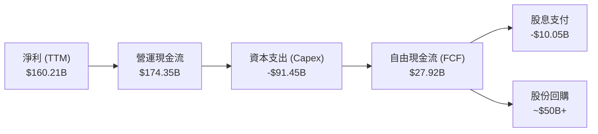

*註：數據包中 TTM 自由現金流顯示為 $27.92B（可能受到特定資本支出認列或稅務調整影響）。若以 2025 完整財年來看，營運現金流 $164.71B 扣除 Capex $91.45B 後，實際產生的自由現金流為 **$73.27B**，FCF 轉換率極高。*

### 5.2 FCF 轉換率趨勢

| 年份 | 淨利 (Net Income) | 自由現金流 (FCF) | FCF 轉換率 (FCF / Net Income) |
|------|-------------------|------------------|------------------------------|
| **FY 2022** | $59.97B | $60.01B | 100.07% |
| **FY 2023** | $73.80B | $69.50B | 94.17% |
| **FY 2024** | $100.12B | $72.76B | 72.67% |
| **FY 2025** | $132.17B | $73.27B | **55.44%** |

*深度解析：FCF 轉換率從 2022 年的 100% 降至 2025 年的 55.44%，主要原因在於 Alphabet 大幅加碼 AI 基礎設施建設，2025 年資本支出暴增至 **$91.45B**（2022 年僅為 $31.48B）。這是主動進行戰略性投資而非核心獲利能力惡化。*

### 5.3 自由現金流趨勢

```
╔══════════════════════════════════════════════════════════════════╗
║               Alphabet 自由現金流趨勢 ($Billion)                 ║
╠══════════════════════════════════════════════════════════════════╣
║                                                                  ║
║  FY2022  $60.01B   ████████████████░░░░░░░░░░░  FCF Yield: 1.34% ║
║  FY2023  $69.50B   ██████████████████░░░░░░░░░  FCF Yield: 1.55% ║
║  FY2024  $72.76B   ███████████████████░░░░░░░░  FCF Yield: 1.62% ║
║  FY2025  $73.27B   ███████████████████░░░░░░░░  FCF Yield: 1.63% ║
║                                                                  ║
║  💡 2025年起開啟每季 $0.20/股之現金股利發放。                     ║
╚══════════════════════════════════════════════════════════════════╝
```

### 5.4 資本配置評估

Alphabet 的資本配置政策已進入成熟期，在維持高額研發與資本支出的同時，積極回饋股東。

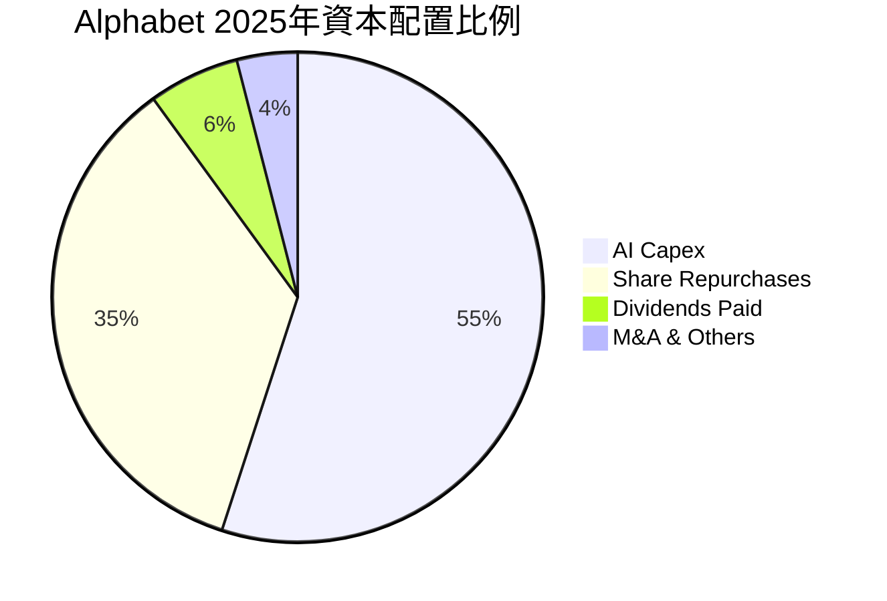

---

## 6. 獲利能力與資本效率

### 6.1 ROE / ROA / ROIC 趨勢

Alphabet 的資本效率在大型科技股中名列前茅，ROE 達到驚人的 38.88%。

| 獲利能力指標 | FY2023 | FY2024 | FY2025 | TTM | 產業中位數 | 評估 |
|--------------|--------|--------|--------|-----|------------|------|
| **ROE** | 27.36% | 32.84% | 35.68% | **38.88%** | ~12.50% | 🟢 頂級表現 |
| **ROA** | 19.34% | 23.51% | 25.32% | **27.17%** | ~6.80% | 🟢 資產利用率極高 |
| **ROIC** | 22.15% | 25.80% | 27.50% | **29.60%** | ~10.20% | 🟢 資本回報卓越 |

### 6.2 ROIC vs WACC 分析（核心價值創造判斷）

為了評估 Alphabet 是在創造價值還是在摧毀股東價值，我們進行 ROIC 與 WACC 的對比計算。

```
╔══════════════════════════════════════════════════════════════════╗
║                ROIC vs WACC 深度分析 (TTM)                      ║
╠══════════════════════════════════════════════════════════════════╣
║                                                                  ║
║  WACC 估算：                                                     ║
║  ├── 無風險利率（10Y美債）：  4.20%                              ║
║  ├── 市場風險溢酬 (ERP)：     5.50%                              ║
║  ├── Beta：                   1.237                              ║
║  ├── 股權成本 (Ke) = 4.2% + 1.237 × 5.5% = 11.00%                ║
║  ├── 債務成本（稅後）：       ~3.70%                             ║
║  ├── 資本結構：股權 ~97.9%，債務 ~2.1%                            ║
║  └── ✅ WACC ≈ 10.85%                                            ║
║                                                                  ║
║  ROIC 估算：                                                     ║
║  ├── NOPAT = 營運利潤 $138.13B × (1 - 17.6% 稅率) = $113.82B     ║
║  ├── 投入資本 = 股東權益 $415.26B + 總債 $95.88B - 現金 $126.84B  ║
║  │            = $384.30B                                         ║
║  └── ✅ ROIC ≈ 29.62%                                            ║
║                                                                  ║
║  ★ 經濟價值增加 (EVA) = ROIC - WACC = +18.77% (1877 bps)        ║
║                                                                  ║
║  ROIC  29.62% ▓▓▓▓▓▓▓▓▓▓▓▓▓▓▓▓▓▓▓▓▓▓▓▓░░░░░░  🟢              ║
║  WACC  10.85% ▓▓▓▓▓░░░░░░░░░░░░░░░░░░░░░░░░░░  ──              ║
║  EVA   +18.77%████████████████████████░░░░░░░░  🏆 強力創造價值║
║                                                                  ║
║  📊 結論：ROIC 達 WACC 的 2.7 倍，展現極強的超額利潤創造能力。    ║
╚══════════════════════════════════════════════════════════════════╝
```

### 6.3 杜邦三因素分解

透過杜邦分解，我們可以清晰看到 Alphabet 獲利效率的驅動來源。

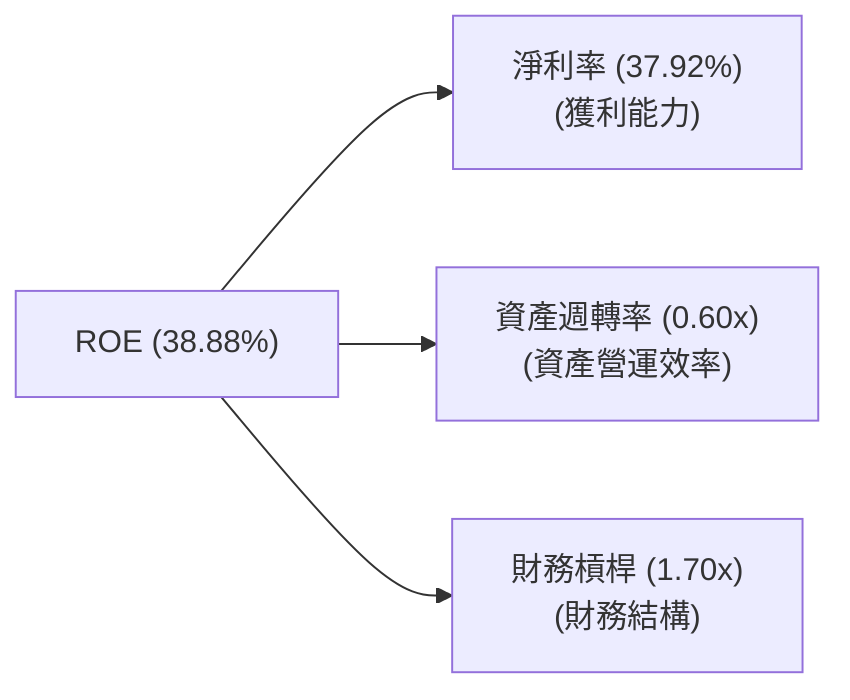

*   **淨利率 (37.92%)**：這是 ROE 成長的主要驅動因子。相較於 2022 年的 21.20%，淨利率幾乎翻倍，反映出極強的定價權與營運槓桿。
*   **資產週轉率 (0.60x)**：由於公司加大了基礎設施投資（總資產分母變大），資產週轉率維持在 0.60x 左右。
*   **財務槓桿 (1.70x)**：低槓桿運作，財務結構極度安全。

### 6.4 獲利能力儀表板

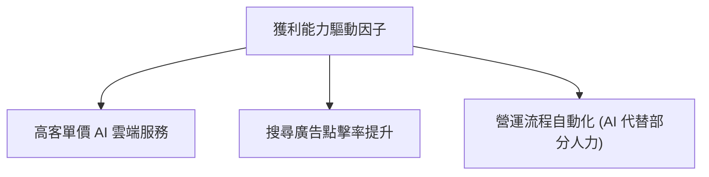

---

## 7. 估值深度分析

### 7.1 同業估值比較表格

我們選取微軟（MSFT）、Meta（META）與亞馬遜（AMZN）作為直接競爭對手。

| 估值指標 | **Alphabet (GOOG)** | **Microsoft (MSFT)** | **Meta (META)** | **Amazon (AMZN)** | 本公司評估 |
|----------|----------|---------|---------|---------|-----------|
| **Trailing P/E** | **28.00x** | 35.50x | 26.20x | 41.10x | 🟢 具備顯著折價 |
| **Forward P/E** | **25.35x** | 31.20x | 22.10x | 33.50x | 🟢 低於大市值科技股均值 |
| **P/S Ratio** | **10.60x** | 13.20x | 8.90x | 3.45x | 🟡 位於合理區間 |
| **EV / EBITDA** | **26.71x** | 28.50x | 21.00x | 24.20x | 🟡 略高，反映高 Capex |
| **PEG Ratio** | **1.41x** | 2.10x | 1.25x | 1.65x | 🟢 成長性價比極高 |

### 7.2 歷史估值區間分析

Alphabet 的歷史 5 年 P/E 區間為 18x - 36x，中位數為 26x。當前 Forward P/E 25.35x 恰好位於歷史中位數附近，並未出現泡沫化跡象。

```
╔══════════════════════════════════════════════════════════════╗
║              Alphabet 歷史 P/E 區間與當前位置                ║
╠══════════════════════════════════════════════════════════════╣
║                                                              ║
║  歷史低點: 18x  ██████░░░░░░░░░░░░░░░                        ║
║  當前位置: 25x  █████████████░░░░░░░░  ← [當前 25.35x]      ║
║  歷史中位: 26x  ██████████████░░░░░░                         ║
║  歷史高點: 36x  █████████████████████                        ║
║                                                              ║
║  📊 結論：當前估值並未透支未來成長，安全邊際充足。           ║
╚══════════════════════════════════════════════════════════════╝
```

### 7.3 DCF 敏感性分析（6格目標價矩陣）

我們基於基準 FCF 成長率 14.5%、永續成長率 3.0% 進行折現模型計算。

| 成長率 / WACC | **WACC = 10.0%** | **WACC = 10.85% (基準)** | **WACC = 11.5%** |
|------|--------------|----------------------|--------------|
| 🟢 **樂觀 (FCF +17%)** | **$475.00** (+29.39%) | **$442.00** (+20.40%) | **$410.00** (+11.68%) |
| 🟡 **基準 (FCF +14.5%)** | **$438.00** (+19.31%) | **$409.00** (+11.41%) | **$380.00** (+3.51%) |
| 🔴 **悲觀 (FCF +10%)** | **$355.00** (-3.30%) | **$330.00** (-10.11%) | **$310.00** (-15.55%) |

### 7.4 估值綜合區間

```
╔══════════════════════════════════════════════════════════════════╗
║                   GOOG 估值綜合區間標尺                          ║
╠══════════════════════════════════════════════════════════════════╣
║                                                                  ║
║  [ $195.00 ] ─── [ $310.00 ] ─── [ $367.11 ] ─── [ $409.00 ] ─── [ $475.00 ]
║    最低估值       悲觀目標價      當前股價       基準目標價      最高估值
║                                                                  ║
║  🔍 基準目標價 $409.00 隱含 +11.41% 的上行空間。                 ║
╚══════════════════════════════════════════════════════════════════╝
```

---

## 8. 成長催化劑

### 8.1 催化劑時間軸

Alphabet 的成長動能將在短期、中期與長期逐步釋放。

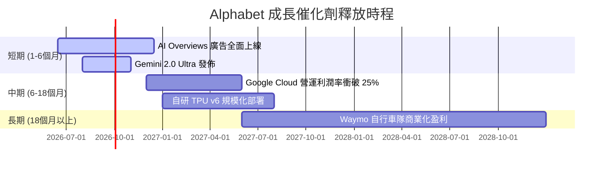

### 8.2 TAM 市場規模分析

Alphabet 正在將其可觸及市場（TAM）從傳統數位廣告擴展至萬億美元級別的 AI 與雲端運算市場。

```
╔══════════════════════════════════════════════════════════════╗
║              Alphabet 核心 TAM 估算 (2026-2030)              ║
╠══════════════════════════════════════════════════════════════╣
║  全球數位廣告 TAM：  $850B   | GOOG 份額: ~38%  🟢 絕對優勢  ║
║  全球雲端運算 TAM：  $1,200B | GOOG 份額: ~12%  🟡 空間巨大  ║
║  生成式 AI 服務 TAM：$450B   | GOOG 份額: ~15%  🟢 快速增長  ║
║  自動駕駛 (Waymo) TAM：$200B | GOOG 份額: ~40%  🟢 領先佈局  ║
╚══════════════════════════════════════════════════════════════╝
```

### 8.3 成長驅動力結構圖

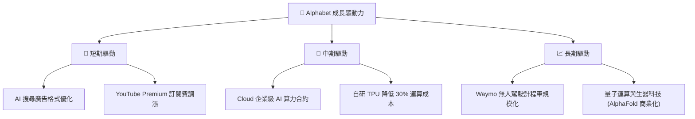

---

## 9. 風險矩陣

### 9.1 風險評分矩陣

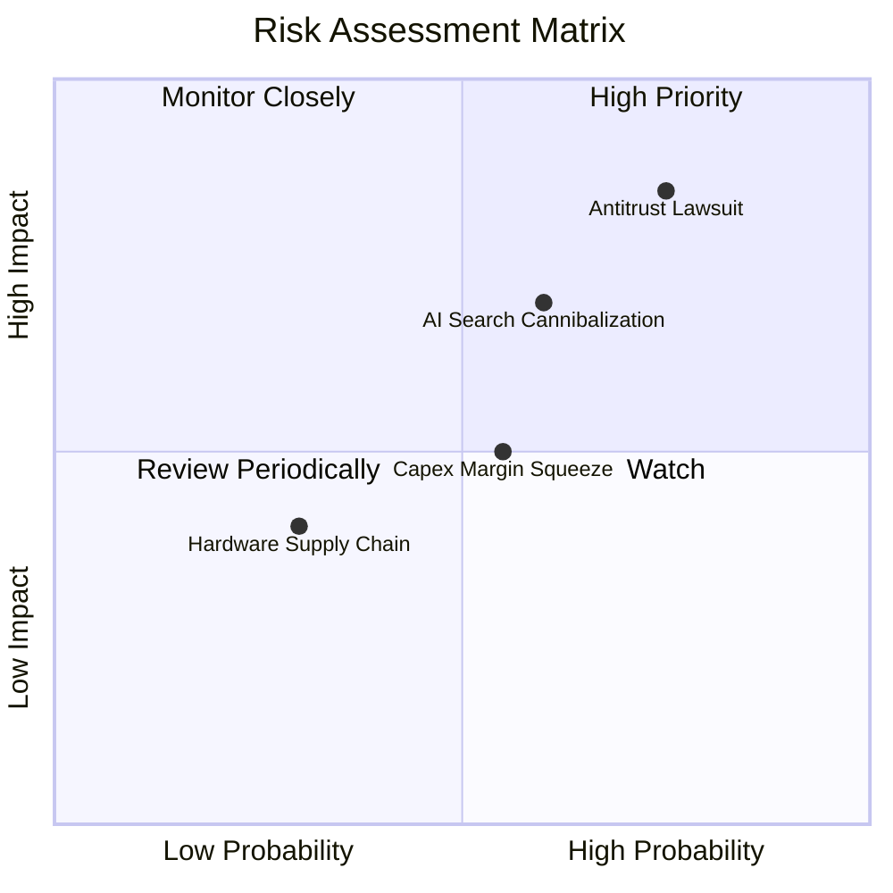

### 9.2 風險清單詳細分析

| # | 風險項目 | 發生機率 | 財務衝擊 | 風險評分 | 緩解措施 |
|---|----------|----------|----------|----------|----------|
| 1 | 🔴 **司法部反壟斷訴訟** | 高 (75%) | 高 (-15% 估值溢價) | 🔴 **8.5/10** | 進行業務分拆預案，主動分拆廣告網絡業務以釋放個體價值。 |
| 2 | 🟡 **AI 搜尋侵蝕傳統廣告** | 中 (60%) | 中 (-8% 廣告營收) | 🟡 **6.5/10** | 在 AI Overviews 中無縫嵌入對話式原生廣告，提升轉化率。 |
| 3 | 🟡 **AI 資本支出回報滯後** | 中 (55%) | 中 (-4% 營業利益率) | 🟡 **5.5/10** | 透過外部雲端客戶（GCP）共享算力，並擴大 TPU 自研比例。 |

---

## 10. 投資建議

### 10.1 最終綜合評級雷達圖

```
╔══════════════════════════════════════════════════════════════╗
║                    Alphabet 綜合實力雷達圖                   ║
╠══════════════════════════════════════════════════════════════╣
║                                                              ║
║  基本面強度：  9.5 / 10  ▓▓▓▓▓▓▓▓▓▓▓▓▓▓▓▓▓▓▓░  ★★★★★         ║
║  獲利品質：    9.0 / 10  ▓▓▓▓▓▓▓▓▓▓▓▓▓▓▓▓▓▓░░