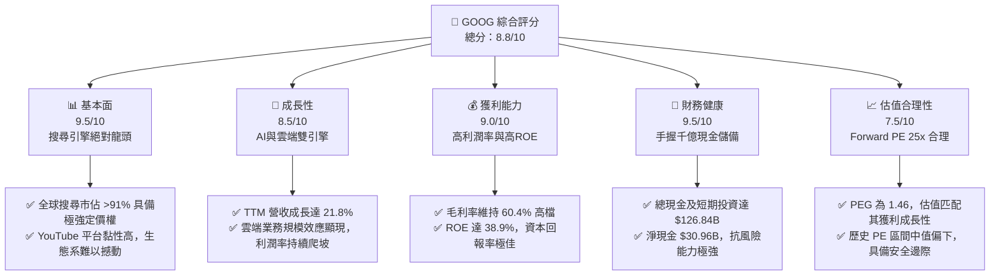
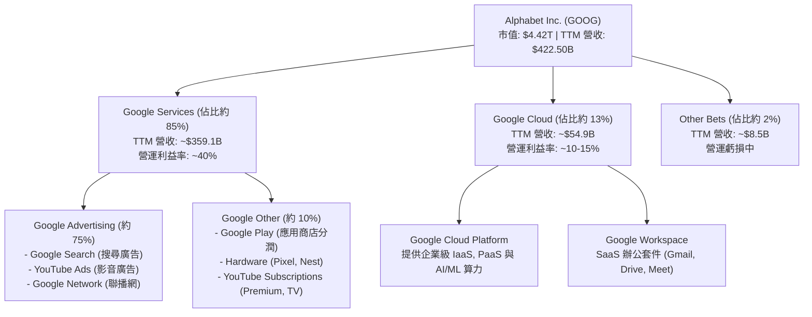
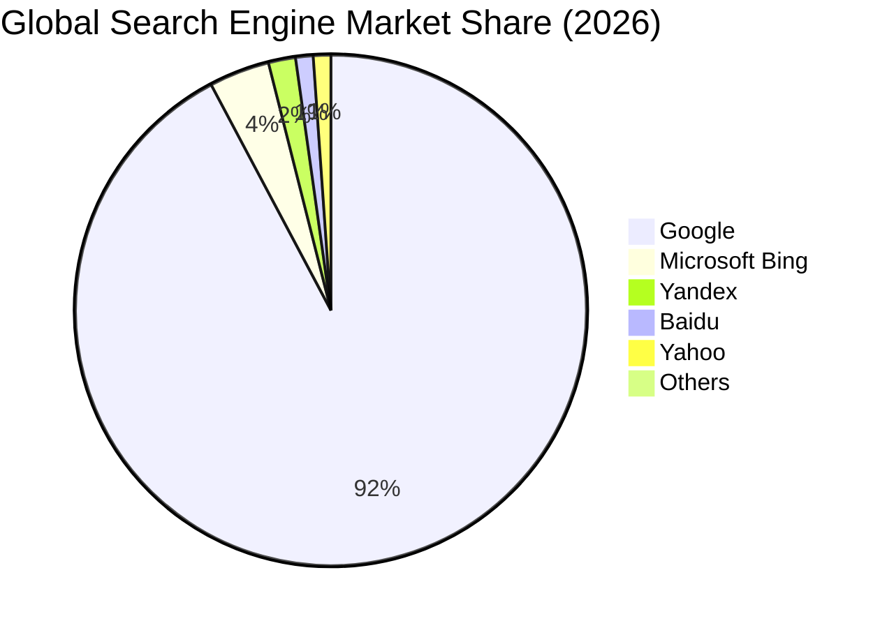
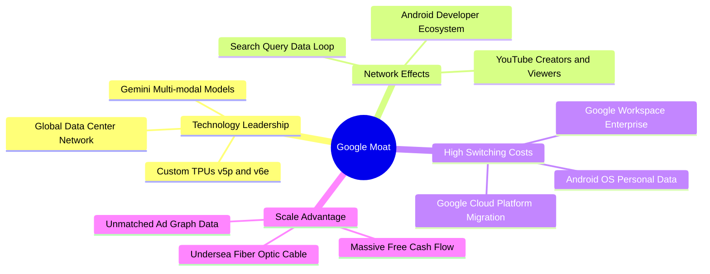
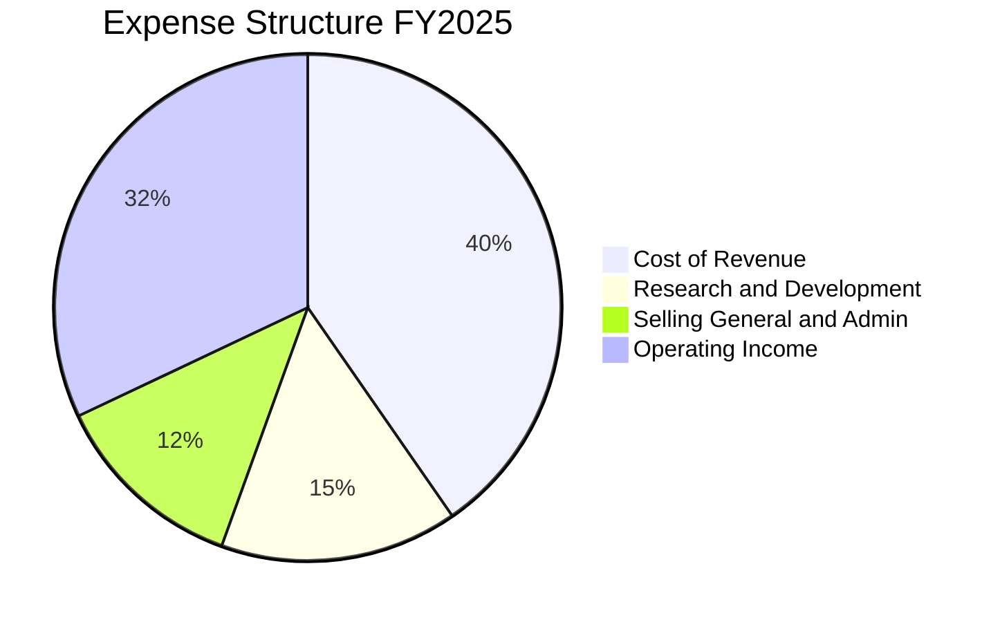
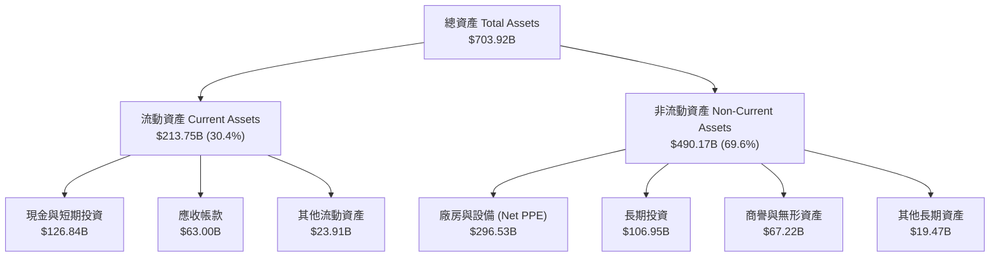

# GOOG 基本面深度分析報告

> **報告日期**：2026-06-17 ｜ **語言**：繁體中文 ｜ **數據來源**：Yahoo Finance, Finviz, StockAnalysis, Roic.ai ｜ **分析師**：CFA 級機構研究

---

## 目錄

| # | 章節 | 核心結論 |
|---|------|----------|
| 1 | 執行摘要 | 給予「強烈買入」評級，基準目標價 $426.62，隱含 17.8% 上行空間。 |
| 2 | 公司概覽與商業模式 | 搜尋引擎市佔率 >91% 構築極深護城河，Cloud 與 AI 雙引擎啟動。 |
| 3 | 損益表深度分析 | TTM 營收達 $422.50B（YoY +21.8%），Q1 2026 淨利受非經常性收益推升。 |
| 4 | 資產負債表分析 | 淨現金達 $30.96B，資產負債表極其穩健，能支撐高強度 AI 資本支出。 |
| 5 | 現金流量深度分析 | 2025 年營運現金流達 $164.71B，Capex 達 $91.45B 顯示全力衝刺 AI 基礎建設。 |
| 6 | 獲利能力與資本效率 | ROE 達 38.9%，ROIC (29.6%) 遠超 WACC (9.2%)，強力創造股東超額價值。 |
| 7 | 估值深度分析 | Forward P/E 24.98x，PEG 1.46，相較歷史均值與同業微幅折價，估值具吸引力。 |
| 8 | 成長催化劑 | Gemini AI 搜尋廣告變現、Google Cloud 營運槓桿釋放與 Waymo 商轉。 |
| 9 | 風險矩陣 | 面臨反壟斷監管起訴與 AI 搜尋侵蝕傳統廣告之雙重系統性風險。 |
| 10 | 投資建議 | 適合成長型與長線價值型投資人，建議於 $340-$360 區間分批佈局。 |

---

## 1. 執行摘要

Alphabet Inc. (GOOG) 作為全球網際網路服務與人工智慧的絕對龍頭，在 2026 年展現出極為強勁的基本面韌性與成長動能。本報告基於 2026-06-17 的最新即時財務數據，對 GOOG 進行全面的機構級基本面評估。

### 1.1 核心評分儀表板



### 1.2 評分進度條視覺化

```
╔══════════════════════════════════════════════════════════════╗
║               GOOG 多維度評分儀表板 (1-10分)                 ║
╠══════════════════════════════════════════════════════════════╣
║ 基本面強度  9.5 ▓▓▓▓▓▓▓▓▓▓▓▓▓▓▓▓▓▓▓░  ★★★★★           ║
║ 成長動能    8.5 ▓▓▓▓▓▓▓▓▓▓▓▓▓▓▓▓▓░░░  ★★★★☆           ║
║ 獲利品質    9.0 ▓▓▓▓▓▓▓▓▓▓▓▓▓▓▓▓▓▓░░  ★★★★★           ║
║ 財務健康    9.5 ▓▓▓▓▓▓▓▓▓▓▓▓▓▓▓▓▓▓▓░  ★★★★★           ║
║ 估值合理性  7.5 ▓▓▓▓▓▓▓▓▓▓▓▓▓▓░░░░░░  ★★★★☆           ║
║ 護城河深度  9.8 ▓▓▓▓▓▓▓▓▓▓▓▓▓▓▓▓▓▓▓█  ★★★★★           ║
║ 管理層執行  8.8 ▓▓▓▓▓▓▓▓▓▓▓▓▓▓▓▓▓░░░  ★★★★☆           ║
║ 技術創新力  9.2 ▓▓▓▓▓▓▓▓▓▓▓▓▓▓▓▓▓▓░░  ★★★★★           ║
╠══════════════════════════════════════════════════════════════╣
║ 綜合總分    8.8 ▓▓▓▓▓▓▓▓▓▓▓▓▓▓▓▓▓░░░  🏆 強烈買入          ║
╚══════════════════════════════════════════════════════════════╝
```

### 1.3 五大投資論點 + 三大核心風險

| 類型 | 項目 | 具體依據 | 信心度 |
|------|------|----------|--------|
| 🟢 **投資論點①** | **搜尋與廣告業務穩固** | 全球搜尋市佔率穩定在 91% 以上，TTM 營收達 $422.50B（YoY +21.8%），顯示廣告主預算向數位龍頭集中。 | 🟢 極高 |
| 🟢 **投資論點②** | **Google Cloud 營運槓桿釋放** | 雲端業務已跨過損益平衡點，隨著企業 AI 需求爆發，營收加速成長且利潤率持續擴張。 | 🟢 高 |
| 🟢 **投資論點③** | **AI 基礎建設與自研 TPU 優勢** | 2025 年 Capex 達 $91.45B，全力建置 AI 算力。自研 TPU（如 v5p/v6e）能有效降低對 NVIDIA GPU 的依賴，優化長期成本結構。 | 🟢 高 |
| 🟢 **投資論點④** | **資本回報政策轉向積極** | 2025 年派發 $10.05B 股息（DPS $0.83），並持續進行大規模股份回購（年均 >$60B），股數 YoY 下降 1.38%，提升 EPS 質量。 | 🟢 極高 |
| 🟢 **投資論點⑤** | **強大的負債表支撐研發** | 手握 $126.84B 現金與短期投資，研發費用達 $61.09B（佔營收 15.2%），確保其在通用人工智慧（AGI）競賽中不落人後。 | 🟢 極高 |
| 🟡 **風險①** | **反壟斷監管與拆分風險** | 美國司法部（DoJ）針對 Google 搜尋與廣告技術（AdTech）的訴訟進入實質階段，可能面臨業務拆分或終止排他性協議（如 Apple 合作）。 | 🟡 中度 |
| 🔴 **風險②** | **AI 搜尋侵蝕傳統點擊率** | 生成式 AI 回答（AI Overviews）可能減少用戶點擊傳統廣告連結的次數，短期內可能對 CPC（每次點擊成本）造成壓力和不確定性。 | 🔴 高衝擊 |
| 🟡 **風險③** | **Capex 過度擴張壓抑短期 FCF** | 為了應對 AI 競賽，資本支出激增（2025 年達 $91.45B），導致 2025 年 FCF 僅微幅成長 0.69% 至 $73.27B，FCF 轉換率下滑。 | 🟡 中度 |

### 1.4 快速統計卡片

| 指標 | 公司實際值 (TTM / 2026-06-17) | 行業均值 (通訊服務) | S&P 500 均值 | 狀態 |
|------|-------------|----------|--------------|------|
| 收入 YoY 成長 | **21.8%** | ~7.5% | ~5.5% | 🟢 強勁成長 |
| 毛利率 | **60.4%** | ~50.0% | ~48.0% | 🟢 領先同業 |
| 營業利益率 | **36.1%** | ~22.0% | ~15.5% | 🟢 營運效率極高 |
| ROE | **38.9%** | ~18.0% | ~14.0% | 🟢 資本效率卓越 |
| Forward P/E | **24.98x** | ~18.5x | ~21.5x | 🟡 估值合理但略高於大盤 |
| 淨現金 / 債務 | **$30.96B** | 多數為淨負債 | 普遍具備財務槓桿 | 🟢 極其健康 |

### 1.5 投資結論

```
╔══════════════════════════════════════════════════════════════════╗
║                    📊 GOOG 投資結論摘要                          ║
╠══════════════════════════════════════════════════════════════════╣
║  評級：🟢 強烈買入 (Strong Buy)                                 ║
║  當前股價：$362.10 (2026-06-17)                                  ║
║  目標價區間：                                                    ║
║    悲觀情境：$340.00（-6.1%） - 監管拆分實質化，AI 侵蝕廣告     ║
║    基準情境：$426.62（+17.8%）- 12個月主要目標（估值與成長匹配）║
║    樂觀情境：$475.00（+31.2%）- Cloud 利潤爆發，AI 變現超預期   ║
║  投資評分：8.8 / 10                                              ║
║  適合投資人：成長型、長線價值持有者、科技股權重配置者            ║
╚══════════════════════════════════════════════════════════════════╝
```

---

## 2. 公司概覽與商業模式

Alphabet Inc. 透過其核心子公司 Google，構建了全球最龐大的數位生態系統。其商業模式本質上是以「免費/高價值服務吸引流量」，並透過「精準廣告與雲端基礎設施進行變現」。

### 2.1 業務結構與收入來源



### 2.2 市場份額

在核心搜尋引擎領域，Google 依然維持絕對的壟斷地位。雖然 Microsoft Bing 整合了 GPT 意圖挑戰，但截至 2026 年，Google 的全球市佔率僅受到微幅擾動，護城河依舊深厚。



### 2.3 競爭護城河分析



### 2.4 護城河強度評分

```
╔══════════════════════════════════════════════════════════════╗
║                    GOOG 護城河強度評分                       ║
╠══════════════════════════════════════════════════════════════╣
║ 搜尋壟斷力    9.8/10  ▓▓▓▓▓▓▓▓▓▓▓▓▓▓▓▓▓▓▓█  🏆 絕對統治    ║
║ 網路效應      9.5/10  ▓▓▓▓▓▓▓▓▓▓▓▓▓▓▓▓▓▓▓░  🟢 極強        ║
║ 技術與算力    9.2/10  ▓▓▓▓▓▓▓▓▓▓▓▓▓▓▓▓▓▓░░  🟢 領先同業    ║
║ 生態系鎖定    9.0/10  ▓▓▓▓▓▓▓▓▓▓▓▓▓▓▓▓▓▓░░  🟢 難以替代    ║
╠══════════════════════════════════════════════════════════════╣
║ 綜合護城河     9.4/10  ▓▓▓▓▓▓▓▓▓▓▓▓▓▓▓▓▓▓▓░  🏆 寬廣護城河   ║
╚══════════════════════════════════════════════════════════════╝
```

---

## 3. 損益表深度分析

Alphabet 在過去幾年展現了強勁的營收與獲利成長，主要受益於宏觀廣告市場復甦以及 Google Cloud 的利潤釋放。

### 3.1 年度收入成長趨勢（近4年）

```
╔══════════════════════════════════════════════════════════════════╗
║               GOOG 年度收入趨勢 (FY2022-FY2025)                  ║
╠══════════════════════════════════════════════════════════════════╣
║                                                                  ║
║  FY2022  $282.84B  ██████████████░░░░░░░░░░░  YoY: +9.78%  🟢    ║
║  FY2023  $307.39B  ███████████████░░░░░░░░░░  YoY: +8.68%  🟢    ║
║  FY2024  $350.02B  █████████████████░░░░░░░░  YoY: +13.87% 🟢    ║
║  FY2025  $402.84B  ████████████████████░░░░░  YoY: +15.09% 🟢    ║
║  TTM     $422.50B  █████████████████████░░░░  YoY: +21.80% 🟢    ║
║                                                                  ║
║                   |      |      |      |      |                  ║
║                   0     100B   200B   300B   400B                ║
║                                                                  ║
║  📊 4年複合成長率 (CAGR)：+12.51%                                ║
╚══════════════════════════════════════════════════════════════════╝
```

### 3.2 季度收入趨勢分析

從季度數據來看，Alphabet 的營收維持穩健的 YoY 成長，但呈現明顯的第四季季節性旺季（受電商與節日廣告推動）。

| 財報季度 | 營收 (Billion) | YoY 成長率 | QoQ 成長率 | 核心驅動因素與備註 |
|----------|----------------|------------|------------|-------------------|
| **Q2 2025** | $96.43B | +13.79% | +6.86% | 旅遊與零售廣告強勁，Cloud 成長穩定。 |
| **Q3 2025** | $102.35B | +15.95% | +6.14% | 總統大選前期廣告預熱，YouTube 訂閱收入增加。 |
| **Q4 2025** | $113.83B | +17.99% | +11.22% | 節日零售旺季，廣告主預算集中釋放。 |
| **Q1 2026** | $109.90B | +21.79% | -3.45% | 🟢 雖然 QoQ 因季節性下滑，但 YoY 成長加速至 21.79%。 |

### 3.3 利潤率演變分析

Alphabet 的利潤率在 2024-2026 年期間顯著改善，這歸功於公司在 2023 年底啟動的結構性成本控制（包括裁員、辦公空間優化）以及 Google Cloud 跨過盈虧平衡點後的營運槓桿釋放。

| 利潤率指標 | FY2022 | FY2023 | FY2024 | FY2025 | TTM | 趨勢評估 | 狀態 |
|------------|--------|--------|--------|--------|-----|----------|------|
| **毛利率** | 55.37% | 56.63% | 58.20% | 59.65% | **60.40%** | ↗️ 持續走高，自研 TPU 降低基礎設施折舊壓力。 | 🟢 優異 |
| **營業利益率**| 26.46% | 27.42% | 32.11% | 32.03% | **36.10%** | ↗️ 營運槓桿顯現，雲端業務利潤率拉升。 | 🟢 強勁 |
| **淨利率** | 21.20% | 24.01% | 28.60% | 32.81% | **37.90%** | ↗️ 獲利結構優化，非營運收益與稅率穩定。 | 🟢 極佳 |

### 3.4 費用結構分析

以 FY2025 數據為例，Alphabet 的費用結構顯示其依然高度重視研發（R&D），這是維持其 AI 技術領先的基石。



*   **Cost of Revenue (營收成本, 40.35%)**：包含數據中心折舊、流量獲取成本（TAC）。TAC 佔比因搜尋引擎排他合約而維持高檔，但隨著自研晶片應用，硬體折舊率有所下降。
*   **Research & Development (研發費用, 15.16%)**：FY2025 研發投入高達 $61.09B，TTM 更達到 $64.56B，主要用於 Gemini 模型開發與 AI 晶片研發。
*   **SG&A (銷售與管理費用, 12.45%)**：控制良好，展現出強大的組織營運效率。

### 3.5 季度 EPS 趨勢與盈餘品質

*   **Q2 2025**: Diluted EPS $2.33
*   **Q3 2025**: Diluted EPS $2.89
*   **Q4 2025**: Diluted EPS $2.85
*   **Q1 2026**: Diluted EPS $5.17

#### ⚠️ 盈餘品質關鍵解析
CFA 分析師必須指出：**Q1 2026 的 EPS $5.17 存在非經常性項目助攻**。
從季度損益表來看，Q1 2026 的 Pretax Income 為 $77.41B，而 Operating Income 為 $39.70B。這意味著有高達 **$37.72B 的非營業收入 (Total Non-Operating Income)**。這通常來自於其股權投資（如 Waymo 或其他投資組合）的公允價值重估，或是特定資產處分收益。
因此，雖然表面上淨利 YoY 成長 81.17% 極為驚人，但**核心營業利益 YoY 成長率約為 29.7%**（$39.70B vs Q1 2025 的 $30.61B）。這依然是非常健康的雙位數成長，但投資人應扣除非經常性損益，以避免高估其經常性獲利能力。

---

## 4. 資產負債表分析

Alphabet 擁有美股科技巨頭中最為穩健的資產負債表之一，高額的現金儲備為其在 AI 領域的「軍備競賽」提供了無限的底氣。

### 4.1 資產結構分解

截至 2026 年 3 月 31 日（Q1 2026），Alphabet 總資產達到 $703.92B。



### 4.2 流動性指標分析

| 流動性指標 | FY2024 | FY2025 | Q1 2026 (TTM) | 行業均值 | 評估 |
|------------|--------|--------|---------------|----------|------|
| **流動比率 (Current Ratio)** | 1.84 | 2.01 | **1.92** | ~1.45 | 🟢 極為安全，短期償債能力無虞。 |
| **速動比率 (Quick Ratio)** | 1.84 | 2.01 | **1.92** | ~1.38 | 🟢 由於無實體存貨壓力（Inventory 為 0），速動比率與流動比率一致，資產變現性極佳。 |

### 4.3 債務結構與健康診斷

截至 2026 年 3 月 31 日，Alphabet 的總債務為 $95.88B（包含長期借款 $77.50B 與長期租賃負債 $12.98B）。

```
╔══════════════════════════════════════════════════════════════════╗
║                    GOOG 債務健康診斷                           ║
╠══════════════════════════════════════════════════════════════════╣
║                                                                  ║
║  總債務：        $95.88B   ██████████░░░░░░░░░░  適度借貸        ║
║  總現金+投資：   $126.84B  █████████████░░░░░░░  儲備充沛        ║
║  淨現金（正