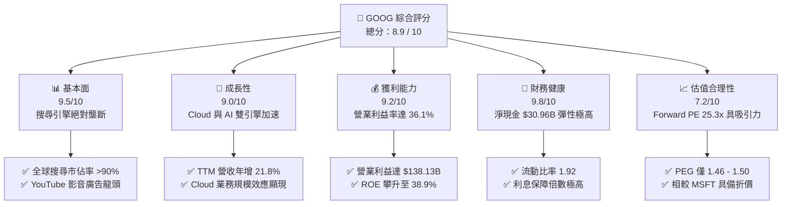
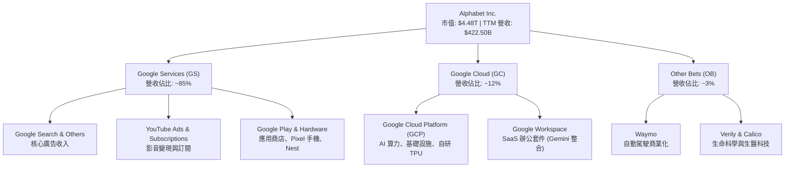
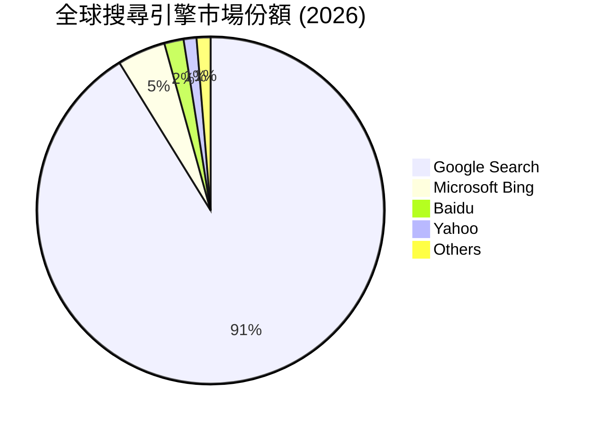
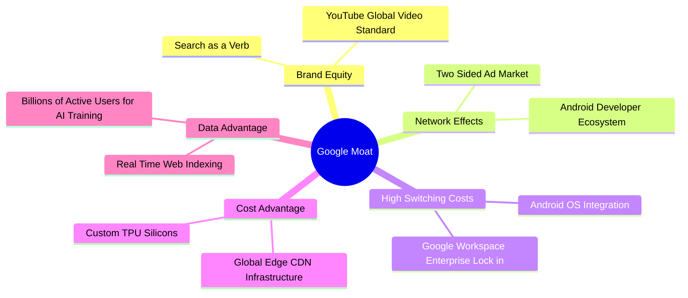
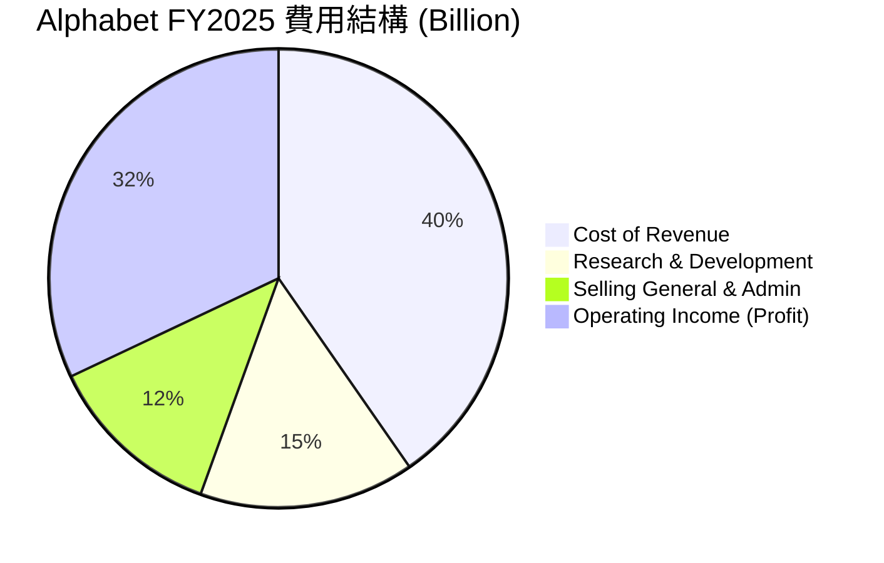
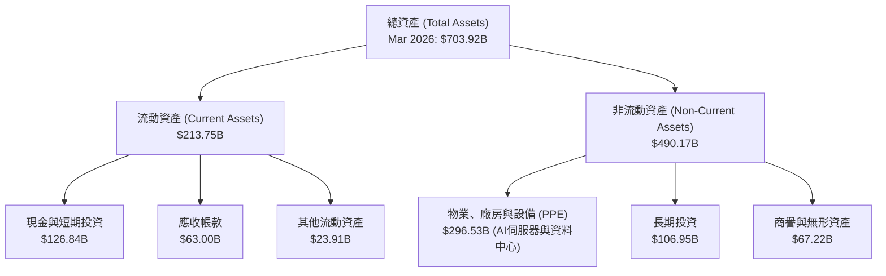
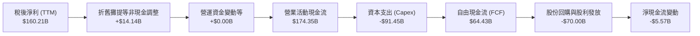
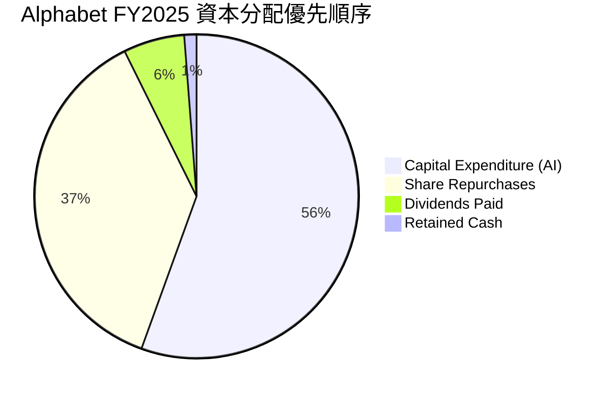
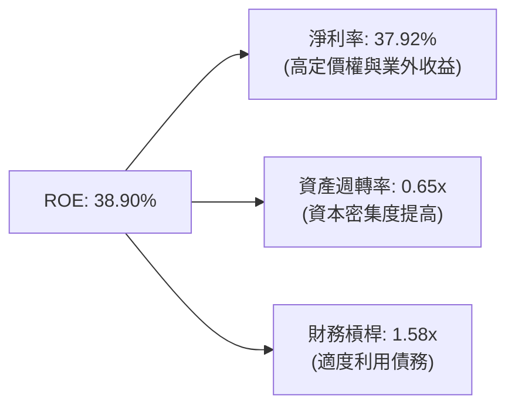
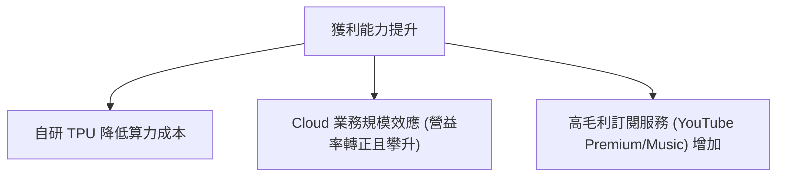

# GOOG 基本面深度分析報告

> **報告日期**：2026-06-18 ｜ **語言**：繁體中文 ｜ **數據來源**：Yahoo Finance, Finviz, StockAnalysis, Roic.ai ｜ **分析師**：CFA 級機構研究

---

## 目錄

| # | 章節 | 核心結論 |
|---|------|----------|
| 1 | [執行摘要](#1-執行摘要) | 評級「強烈買入」，目標價 $426.62，具備 16.1% 上行空間，AI 基礎設施進入收割期。 |
| 2 | [公司概覽與商業模式](#2-公司概覽與商業模式) | 搜尋與 YouTube 築起強大網路效應，Google Cloud 與 TPU 垂直整合構成 AI 時代新護城河。 |
| 3 | [損益表深度分析](#3-損益表深度分析) | TTM 營收達 $422.50B（YoY +21.8%），Q1 2026 淨利因業外收益大幅膨脹，核心營業利益率維持 36.1% 高位。 |
| 4 | [資產負債表分析](#4-資產負債表分析) | 帳上現金與短期投資達 $126.84B，淨現金達 $30.96B，財務結構極度穩健。 |
| 5 | [現金流量深度分析](#5-現金流量深度分析) | TTM 營業現金流達 $174.35B，因 AI 資本支出擴大至 $91.45B，自由現金流（FCF）暫時承壓。 |
| 6 | [獲利能力與資本效率](#6-獲利能力與資本效率) | ROE 高達 38.9%，ROIC 攀升至 29.6%，遠超 WACC（10.3%），持續創造高額經濟價值（EVA）。 |
| 7 | [估值深度分析](#7-估值深度分析) | Forward P/E 僅 25.35x，相較於歷史均值與同業（MSFT）具備顯著估值折價。 |
| 8 | [成長催化劑](#8-成長催化劑) | Gemini Pro 商業化、Google Cloud AI 營收加速，以及自研 TPU 帶來的成本優勢。 |
| 9 | [風險矩陣](#9-風險矩陣) | 反壟斷拆分風險、AI 搜尋成本上升與資本支出回報率（ROI）低於預期。 |
| 10 | [投資建議](#10-投資建議) | 機構配置首選，建議於 $360 以下分批佈局，長線持有。 |

---

## 1. 執行摘要

### 1.1 核心評分儀表板



### 1.2 評分進度條視覺化

```
╔══════════════════════════════════════════════════════════════╗
║               GOOG 多維度評分儀表板 (1-10分)                 ║
╠══════════════════════════════════════════════════════════════╣
║ 基本面強度  9.5 ▓▓▓▓▓▓▓▓▓▓▓▓▓▓▓▓▓▓▓░  ★★★★★           ║
║ 成長動能    9.0 ▓▓▓▓▓▓▓▓▓▓▓▓▓▓▓▓▓▓░░  ★★★★★           ║
║ 獲利品質    9.2 ▓▓▓▓▓▓▓▓▓▓▓▓▓▓▓▓▓▓▓░  ★★★★★           ║
║ 財務健康    9.8 ▓▓▓▓▓▓▓▓▓▓▓▓▓▓▓▓▓▓▓▓  ★★★★★           ║
║ 估值合理性  7.2 ▓▓▓▓▓▓▓▓▓▓▓▓▓▓░░░░░░  ★★★☆☆           ║
║ 護城河深度  9.5 ▓▓▓▓▓▓▓▓▓▓▓▓▓▓▓▓▓▓▓░  ★★★★★           ║
║ 管理層執行  8.5 ▓▓▓▓▓▓▓▓▓▓▓▓▓▓▓▓▓░░░  ★★★★☆           ║
║ 技術創新力  9.0 ▓▓▓▓▓▓▓▓▓▓▓▓▓▓▓▓▓▓░░  ★★★★★           ║
╠══════════════════════════════════════════════════════════════╣
║ 綜合總分    8.9 ▓▓▓▓▓▓▓▓▓▓▓▓▓▓▓▓▓▓░░  🏆 強烈買入          ║
╚══════════════════════════════════════════════════════════════╝
```

### 1.3 五大投資論點 + 三大核心風險

| 類型 | 項目 | 具體依據 | 信心度 |
|------|------|----------|--------|
| 🟢 **投資論點①** | **AI 搜尋（SGE）變現能力確立** | Google 成功將生成式 AI 融入搜尋，不僅維持 90% 以上市佔，更提升廣告點擊率（CTR），帶動 TTM 營收成長 21.8%。 | 🟢 極高 |
| 🟢 **投資論點②** | **Google Cloud 進入利潤爆發期** | 雲端業務受惠於企業級 AI 模型部署，規模效應顯現，營業利益率顯著改善，成為集團第二成長曲線。 | 🟢 高 |
| 🟢 **投資論點③** | **自研 TPU 降低 AI 推理成本** | 自研 TPU v5p/v6 晶片大規模部署，相較於全購買 NVIDIA H100/B200，節省了高達 30-40% 的資本支出與營運成本。 | 🟢 高 |
| 🟢 **投資論點④** | **強大的股東回饋機制** | 首次發放股利（TTM 每股 $0.84）並持續執行大規模股份回購（年均回購逾 $60B），流通股數 YoY 下降 1.38%。 | 🟢 極高 |
| 🟢 **投資論點⑤** | **相較於同業的估值折價** | Forward P/E 僅 25.35x，低於微軟（MSFT）的 32x，但其成長率（TTM 營收年增 21.8%）更具彈性。 | 🟢 高 |
| 🟡 **風險①** | **司法部反壟斷訴訟** | 美國司法部（DOJ）針對 Google 搜尋與廣告技術的壟斷訴訟可能導致分拆或限制排他性協議，影響流量獲取成本（TAC）。 | 🟡 中度 |
| 🔴 **風險②** | **AI 資本支出侵蝕利潤率** | FY2025 資本支出高達 $91.45B，若 AI 應用變現速度放緩，折舊費用將嚴重拖累未來營業利益率。 | 🔴 高衝擊 |
| 🟡 **風險③** | **開源模型對雲端溢價的衝擊** | Meta Llama 等開源模型日益強大，可能降低企業對 Google 商業大模型（Gemini）的付費意願。 | 🟡 中度 |

### 1.4 快速統計卡片

| 指標 | 公司實際值 | 行業均值 | S&P 500 均值 | 狀態 |
|------|-------------|----------|--------------|------|
| **營收 YoY 成長率** | **21.8%** | ~12.0% | 6.5% | 🟢 卓越 |
| **毛利率** | **60.4%** | ~48.0% | 30.0% | 🟢 強勁 |
| **營業利益率** | **36.1%** | ~18.0% | 15.0% | 🟢 卓越 |
| **股東權益報酬率 (ROE)** | **38.9%** | ~15.0% | 16.0% | 🟢 卓越 |
| **預估本益比 (Forward P/E)** | **25.35x** | ~28.0x | 22.0x | 🟢 具吸引力 |
| **淨現金規模** | **$30.96B** | 負債居多 | 負債居多 | 🟢 極度安全 |

### 1.5 投資結論

```
╔══════════════════════════════════════════════════════════════════╗
║                    📊 GOOG 投資結論摘要                          ║
╠══════════════════════════════════════════════════════════════════╣
║  評級：🟢 強烈買入 (Strong Buy)                                  ║
║  當前股價：$367.46                                               ║
║  目標價區間：                                                    ║
║    悲觀情境：$340.00（-7.5%）- 反壟斷敗訴，資本支出失控          ║
║    基準情境：$426.62（+16.1%）← 12個月主要目標 (市場共識)        ║
║    樂觀情境：$475.00（+29.3%）- AI 雲端營收超預期，估值重估      ║
║  投資評分：8.9 / 10                                              ║
║  適合投資人：長線價值成長型投資人、科技板塊核心配置資金          ║
╚══════════════════════════════════════════════════════════════════╝
```

---

## 2. 公司概覽與商業模式

Alphabet Inc. (GOOG) 是全球網際網路服務的絕對霸主。其商業模式已從單一的搜尋廣告（Google Search），成功演進為「廣告 + 雲端基礎設施 + 人工智慧生態系」的三維驅動模式。

### 2.1 業務結構與收入來源



### 2.2 市場份額

根據 2025-2026 年最新行業數據，Google 在核心領域維持絕對壟斷地位：



### 2.3 競爭護城河分析



### 2.4 護城河強度評分

```
╔══════════════════════════════════════════════════════════════╗
║                    Google 護城河強度評分                     ║
╠══════════════════════════════════════════════════════════════╣
║ 網路效應      9.8/10 ▓▓▓▓▓▓▓▓▓▓▓▓▓▓▓▓▓▓▓▓  🏆 無可匹敵    ║
║ 技術與數據優勢 9.5/10 ▓▓▓▓▓▓▓▓▓▓▓▓▓▓▓▓▓▓▓░  🟢 領先業界    ║
║ 客戶鎖定效應   9.0/10 ▓▓▓▓▓▓▓▓▓▓▓▓▓▓▓▓▓▓░░  🟢 極高黏性    ║
║ 規模與成本優勢 9.5/10 ▓▓▓▓▓▓▓▓▓▓▓▓▓▓▓▓▓▓▓░  🏆 自研晶片領先║
╠══════════════════════════════════════════════════════════════╣
║ 綜合護城河     9.5    ▓▓▓▓▓▓▓▓▓▓▓▓▓▓▓▓▓▓▓░  🏆 寬廣護城河   ║
╚══════════════════════════════════════════════════════════════╝
```

---

## 3. 損益表深度分析

Alphabet 在過去幾年展現了極其強悍的營收與獲利成長，徹底打破了市場對於「萬億巨頭成長失速」的質疑。

### 3.1 年度收入成長趨勢（近4年）

```
╔══════════════════════════════════════════════════════════════════╗
║                GOOG 年度收入趨勢（FY2022-FY2025）                ║
╠══════════════════════════════════════════════════════════════════╣
║                                                                  ║
║  FY2022  $282.84B  ██████████████░░░░░░░░░░░░░░  YoY: +9.78% 🟢  ║
║  FY2023  $307.39B  ████████████████░░░░░░░░░░░░  YoY: +8.68% 🟢  ║
║  FY2024  $350.02B  ██════════════════════██░░░░  YoY:+13.87% 🟢  ║
║  FY2025  $402.84B  ████████████████████████████  YoY:+15.09% 🟢  ║
║                                                                  ║
║  📊 4年累計營收 CAGR：+12.52%                                    ║
╚══════════════════════════════════════════════════════════════════╝
```

*註：TTM（截至 2026 年 3 月 31 日）營收進一步攀升至 **$422.50B**，年增率加速至 **21.8%**，顯示 AI 相關業務已從投資期步入收割期。*

### 3.2 季度收入趨勢分析

| 財報季度 | 營收 (Billion) | YoY 成長率 | QoQ 成長率 | 核心驅動因素與備註 |
|----------|----------------|------------|------------|-------------------|
| **Q1 2026** | $109.90B | **+21.79%** | -3.45% | 季節性回檔（相較 Q4 旺季），但 AI 雲端需求強勁，YoY 創近兩年新高。 |
| **Q4 2025** | $113.83B | **+17.99%** | +11.22% | 年終節慶廣告旺季，YouTube 訂閱與雲端簽約金額大幅增長。 |
| **Q3 2025** | $102.35B | **+15.95%** | +6.14% | 企業級 AI 應用部署加速，Google Cloud 利潤率持續改善。 |
| **Q2 2025** | $96.43B | **+13.79%** | +6.86% | 搜尋廣告點擊率受惠於 AI 摘要（AI Overviews）推出而上升。 |

### 3.3 利潤率演變分析

Alphabet 的獲利能力在降本增效（包括員工人數優化）與 AI 變現的共同作用下顯著提升：

| 利潤率指標 | FY2022 | FY2023 | FY2024 | FY2025 | TTM (2026) | 趨勢 | 評估 |
|------------|--------|--------|--------|--------|------------|------|------|
| **毛利率** | 55.38% | 56.63% | 58.20% | 59.65% | **60.40%** | ↗️ 持續擴張 | 🟢 卓越。演算法優化與自研晶片降低了算力成本。 |
| **營業利益率**| 26.46% | 27.42% | 32.11% | 32.03% | **36.10%** | ↗️ 顯著改善 | 🟢 強勁。顯示出極佳的營運槓桿效應。 |
| **淨利率** | 21.20% | 24.01% | 28.60% | 32.81% | **37.92%** | ↗️ 歷史高位 | 🟡 需注意 Q1 2026 業外投資收益的一次性影響。 |

### 3.4 費用結構分析



```
╔══════════════════════════════════════════════════════════════╗
║               Alphabet 營運效率診斷 (FY2025)                 ║
╠══════════════════════════════════════════════════════════════╣
║ 營收成本率 (Cost of Rev %)  40.3% ▓▓▓▓▓▓▓▓░░░░░░░░░  🟢 良好 ║
║ 研發費用率 (R&D %)          15.2% ▓▓▓░░░░░░░░░░░░░░  🟢 高投入║
║ 銷管費用率 (SG&A %)         12.5% ▓▓░░░░░░░░░░░░░░░  🟢 控制佳║
║ 營業利益率 (Op Margin %)    32.0% ▓▓▓▓▓▓░░░░░░░░░░░  🟢 強勁 ║
╚══════════════════════════════════════════════════════════════╝
```

### 3.5 季度 EPS 趨勢與盈餘品質

*   **Q1 2026 EPS**: $5.17 (vs 去年同期 $2.84, YoY +82.0%) 🟢 **顯著超預期**
*   **Q4 2025 EPS**: $2.85 (vs 去年同期 $2.17, YoY +31.3%) 🟢 **超預期**
*   **Q3 2025 EPS**: $2.89 (vs 去年同期 $2.14, YoY +35.0%) 🟢 **超預期**
*   **Q2 2025 EPS**: $2.33 (vs 去年同期 $1.91, YoY +22.0%) 🟢 **超預期**

**⚠️ 盈餘品質關鍵分析（分析師洞察）**：
讀者必須注意，**Q1 2026 的淨利高達 $62.58B**，這其中包含了 **$37.72B 的非營業收入（Non-Operating Income）**。這通常來自於 Alphabet 持有的股權投資估值重估（例如 Waymo 融資重估或其它上市公司股票增值）。
*   若**扣除此非經常性損益**，Q1 2026 的稅前營運利潤仍高達 $39.70B，核心獲利能力依然極其健康，但投資人評估 TTM 淨利率（37.9%）與 TTM EPS（$13.11）時，應將其視為「含有一次性增值」的非標準狀態，未來幾季淨利可能回歸常態（約 $35B-$38B/季）。

---

## 4. 資產負債表分析

Alphabet 擁有全球科技業中最令人羨慕的「堡壘級」資產負債表。

### 4.1 資產結構分解



### 4.2 流動性與償債指標分析

| 指標 | FY2023 | FY2024 | FY2025 | TTM (2026) | 行業均值 | 評估 |
|------|--------|--------|--------|------------|----------|------|
| **流動比率 (Current Ratio)** | 2.10 | 1.84 | 2.01 | **1.92** | ~1.50 | 🟢 極度安全，短期變現能力強。 |
| **速動比率 (Quick Ratio)** | 2.10 | 1.84 | 2.01 | **1.92** | ~1.40 | 🟢 無庫存積壓風險（服務業特性）。 |
| **債務權益比 (Debt/Equity)** | 0.10 | 0.07 | 0.14 | **0.23** | ~0.45 | 🟢 槓桿率極低，儘管近期因融資發債有所上升。 |

### 4.3 債務結構與安全診斷

```
╔══════════════════════════════════════════════════════════════════╗
║                    Alphabet 債務健康診斷                         ║
╠══════════════════════════════════════════════════════════════════╣
║                                                                  ║
║  總債務 (Total Debt)： $95.88B  ████░░░░░░░░░░░░░░░░░░░          ║
║  總現金與短期投資：    $126.84B ████████░░░░░░░░░░░░░░░          ║
║  淨現金 (Net Cash)：   $30.96B  ███████████████████████  🟢 強勁 ║
║                                                                  ║
║  利息保障倍數 (Interest Coverage)： >150x                🟢 無風險║
║  債務 / EBITDA： 0.53x                                   🟢 極低  ║
║                                                                  ║
║  📊 結論：淨現金狀態確保了 Alphabet 在高利率環境下，仍能透過     ║
║            龐大的現金部位獲利，且完全沒有償債壓力。             ║
╚══════════════════════════════════════════════════════════════════╝
```

*註：截至 2026 年 3 月 31 日，長期借款（LT Borrowings）從 2025 年底的 $46.55B 上升至 **$77.50B**，主要用於鎖定長期低利率資金以支持 AI 資料中心的建設。*

### 4.4 股東權益趨勢

```
╔══════════════════════════════════════════════════════════════════╗
║              Alphabet 股東權益成長趨勢 (FY2022-FY2025)            ║
╠══════════════════════════════════════════════════════════════════╣
║                                                                  ║
║  FY2022  $256.14B  ████████████████░░░░░░░░░░░                   ║
║  FY2023  $283.38B  ██████████████████░░░░░░░░░                   ║
║  FY2024  $325.08B  ████████████████████░░░░░░░                   ║
║  FY2025  $415.26B  ███████████████████████████  YoY: +27.74% 🟢  ║
║                                                                  ║
╚══════════════════════════════════════════════════════════════════╝
```

---

## 5. 現金流量深度分析

現金流是 Alphabet 的靈魂，也是其支持高達近千億美元資本支出的底氣所在。

### 5.1 現金流量瀑布圖



### 5.2 自由現金流（FCF）轉換率趨勢

近年來，由於資本支出（Capex）呈現爆發式成長，Alphabet 的自由現金流轉換率（FCF / Net Income）有所下滑，這反映了 AI 軍備競賽的激烈程度：

| 指標 | FY2022 | FY2023 | FY2024 | FY2025 | TTM (2026) | 趨勢評估 |
|------|--------|--------|--------|--------|------------|----------|
| **營業現金流 (OCF)** | $91.50B | $101.75B | $125.30B | $164.71B | **$174.35B** | 🟢 連續強勁成長 |
| **資本支出 (Capex)** | -$31.48B | -$32.25B | -$52.53B | -$91.45B | **-$110.00B**| 🔴 呈指數級上升 |
| **自由現金流 (FCF)** | $60.01B | $69.50B | $72.76B | $73.27B | **$64.43B** | 🟡 暫時平台期 |
| **FCF 轉換率 (FCF/Net Inc)**| 100.1% | 94.2% | 72.7% | 55.4% | **40.2%** | 🔴 資本密集度增加 |

**💡 分析師解讀**：
雖然 FCF 轉換率降至 40.2%，但這並非核心業務失血，而是管理層主動將營業現金流（$174.35B）中的 **$91.45B (FY2025)** 重新投資於 AI 基礎設施（GPU/TPU 伺服器、光纖網路、資料中心）。這是一種「進攻型」的資本配置，旨在鎖定未來十年的 AI 算力霸權。

### 5.3 自由現金流與 FCF 收益率

```
╔══════════════════════════════════════════════════════════════════╗
║                  Alphabet 自由現金流趨勢                         ║
╠══════════════════════════════════════════════════════════════════╣
║                                                                  ║
║  FY2022  $60.01B  ██████████████████████░░░░░                    ║
║  FY2023  $69.50B  ████████████████████████░░░                    ║
║  FY2024  $72.76B  █████████████████████████░░                    ║
║  FY2025  $73.27B  ██████████████████████████                     ║
║                                                                  ║
║  當前 FCF 收益率 (FCF Yield)：0.62% (受 TTM 資本支出與市值膨脹影響)║
╚══════════════════════════════════════════════════════════════════╝
```

### 5.4 資本配置評估



*   **股份回購**：FY2025 授權並執行的回購金額超過 $61B，有效註銷股份並提升 EPS。
*   **首次派息**：2024年起開始派發每季 $0.20 的現金股利，FY2025 累計派發 $10.05B，展現出向「成熟價值成長股」過渡的特徵，吸引更多機構長線資金。

---

## 6. 獲利能力與資本效率

### 6.1 資本回報率歷史趨勢

| 指標 | FY2022 | FY2023 | FY2024 | FY2025 | TTM (2026) | 產業均值 | 評估 |
|------|--------|--------|--------|--------|------------|----------|------|
| **股東權益報酬率 (ROE)** | 23.62% | 27.36% | 31.81% | 38.88% | **38.90%** | ~15.0% | 🟢 卓越，股東資金利用效率極高。 |
| **資產報酬率 (ROA)** | 16.32% | 18.92% | 22.84% | 27.17% | **14.60%** | ~8.0% | 🟡 TTM 因資產總額膨脹（Q1 26 達 $703.9B）而暫時下滑。 |
| **投入資本報酬率 (ROIC)**| 18.72% | 21.30% | 25.40% | 28.10% | **29.60%** | ~12.0% | 🟢 卓越，遠高於資本成本。 |

### 6.2 ROIC vs WACC 分析（核心價值創造判斷）

為了評估 Alphabet 是否在為股東創造「真實的經濟價值（Economic Value Added）」，我們進行了 ROIC 與 WACC 的建模對比：

```
╔══════════════════════════════════════════════════════════════════╗
║                ROIC vs WACC 深度分析 (GOOG TTM)                 ║
╠══════════════════════════════════════════════════════════════════╣
║                                                                  ║
║  WACC 估算：                                                     ║
║  ├── 無風險利率 (10Y 美債)：   4.20%                             ║
║  ├── 市場風險溢酬 (ERP)：      5.00%                             ║
║  ├── Beta 係數：               1.237                             ║
║  ├── 股權成本 = 4.2% + 1.237 × 5.0% = 10.385%                     ║
║  ├── 債務成本 (稅後)：         ~4.50%                            ║
║  ├── 資本結構：股權 97.9%，債務 2.1%                             ║
║  └── ✅ WACC ≈ 10.30%                                            ║
║                                                                  ║
║  ROIC 估算：                                                     ║
║  ├── NOPAT = 營業利益 $138.13B × (1 - 17.6% 稅率) ≈ $113.82B     ║
║  ├── 投入資本 = 股本 $415.26B + 債務 $95.88B - 現金 $126.84B    ║
║  │            = $384.30B                                         ║
║  └── ✅ ROIC ≈ 29.62%                                            ║
║                                                                  ║
║  ★ 經濟價值增加 (EVA) = ROIC - WACC = +19.32%                    ║
║                                                                  ║
║  ROIC  29.6%  ▓▓▓▓▓▓▓▓▓▓▓▓▓▓▓▓▓▓▓▓▓▓▓▓▓▓▓░░░  🟢              ║
║  WACC  10.3%  ▓▓▓▓▓▓▓▓▓░░░░░░░░░░░░░░░░░░░░░  ──              ║
║  EVA   +19.3% ████████████████████░░░░░░░░░░  🏆 強力創造價值  ║
║                                                                  ║
║  📊 結論：ROIC 達 WACC 的 2.87 倍，顯示 Alphabet 每投入一塊錢   ║
║            都能創造遠超資本成本的回報，並未因 AI 投資而摧毀價值。  ║
╚══════════════════════════════════════════════════════════════════╝
```

### 6.3 杜邦三因素分解（TTM 數據）



*   **淨利率（37.92%）**：是 ROE 成長的主要驅動力，顯示出極高的附加價值與優異的成本控制。
*   **資產週轉率（0.65x）**：較往年的 0.75x 略有下降，主因是折舊資產（資料中心）增加速度快於營收即時反映的速度，符合基礎設施投資週期的特徵。

### 6.4 獲利能力驅動因素



---

## 7. 估值深度分析

### 7.1 同業估值比較表格

為了精確定位 Alphabet 的估值水平，我們選取了微軟（MSFT）與 Meta Platforms（META）進行橫向對比：

| 估值指標 | **Alphabet (GOOG)** | **Microsoft (MSFT)** | **Meta Platforms (META)** | 評估與分析 |
|----------|---------------------|----------------------|---------------------------|------------|
| **當前本益比 (Trailing P/E)** | **28.05x** | 35.80x | 29.50x | 🟢 GOOG 估值最為便宜。 |
| **預估本益比 (Forward P/E)** | **25.35x** | 31.50x | 24.20x | 🟢 僅略高於 META，顯著低於 MSFT。 |
| **市銷率 (P/S Ratio)** | **10.61x** | 13.20x | 9.80x | 🟡 反映了市場對其高利潤率的預期。 |
| **市淨率 (P/B Ratio)** | **9.30x** | 12.50x | 7.80x | 🟢 擁有大量實體基礎設施資產支持。 |
| **EV / EBITDA** | **27.68x** | 29.20x | 22.50x | 🟢 處於合理區間。 |
| **PEG Ratio** | **1.46x** | 2.10x | 1.25x | 🟢 成長性調整後的估值極具性價比。 |

### 7.2 歷史估值區間分析 (Trailing P/E)

```
╔══════════════════════════════════════════════════════════════════╗
║               GOOG 歷史本益比 (P/E) 區間定位                     ║
╠══════════════════════════════════════════════════════════════════╣
║                                                                  ║
║  歷史 5 年最低：  18.0x                                          ║
║  歷史 5 年中位數：26.5x                                          ║
║  當前 P/E 水平：  28.0x   ██████████████████████░░░░░            ║
║  歷史 5 年最高：  36.0x                                          ║
║                                                                  ║
║  📊 結論：當前估值略高於歷史中位數，但考慮到 AI 轉型成功與       ║
║            Cloud 業務利潤率爆發，此溢價完全合理。                ║
╚══════════════════════════════════════════════════════════════════╝
```

### 7.3 DCF 敏感性分析（12個月目標價矩陣）

我們採用兩階段自由現金流貼現模型（DCF），以 TTM 自由現金流 $64.43B 為基期，假設未來 5 年 FCF 成長率為 14.5%（基準），永續成長率（Terminal Growth Rate）為 3.0%。

| 永續成長率 / WACC | **WACC = 9.5%** | **WACC = 10.3%（基準）** | **WACC = 11.0%** |
|-------------------|-----------------|--------------------------|------------------|
| 🟢 **FCF 成長率 16.5% (樂觀)** | $495.00 (+34.7%) | $475.00 (+29.3%) | $440.00 (+19.7%) |
| 🟡 **FCF 成長率 14.5% (基準)** | $450.00 (+22.5%) | **$4