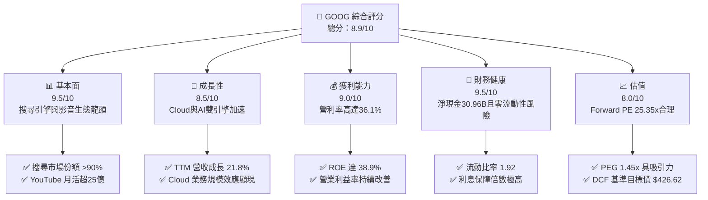
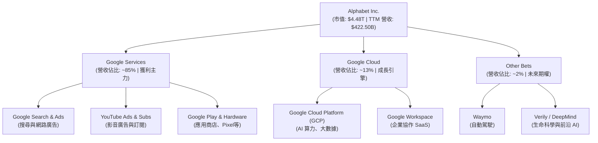
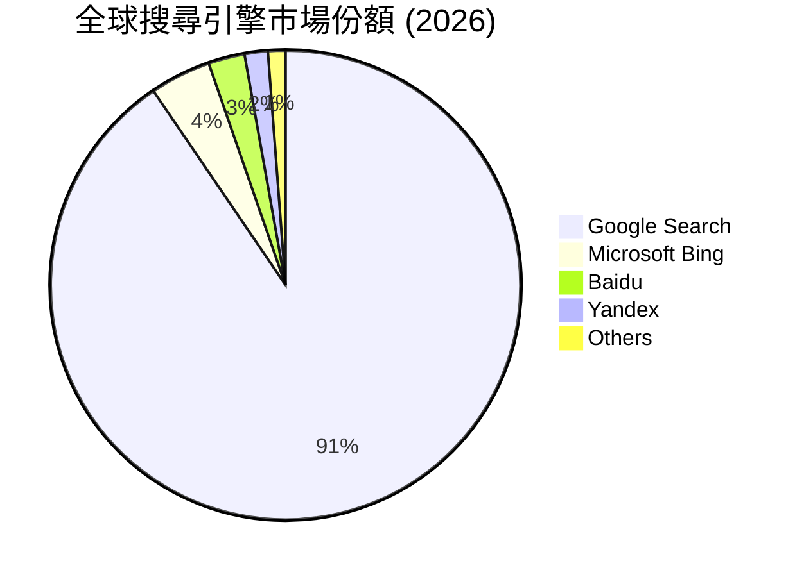
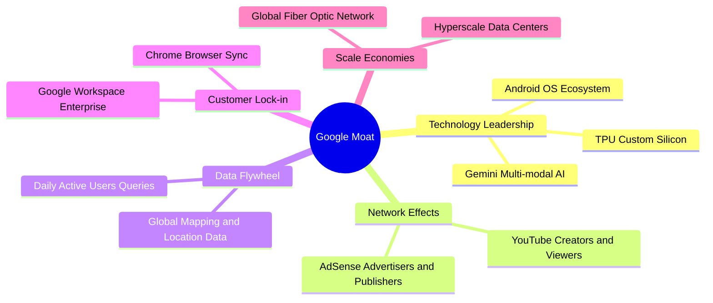
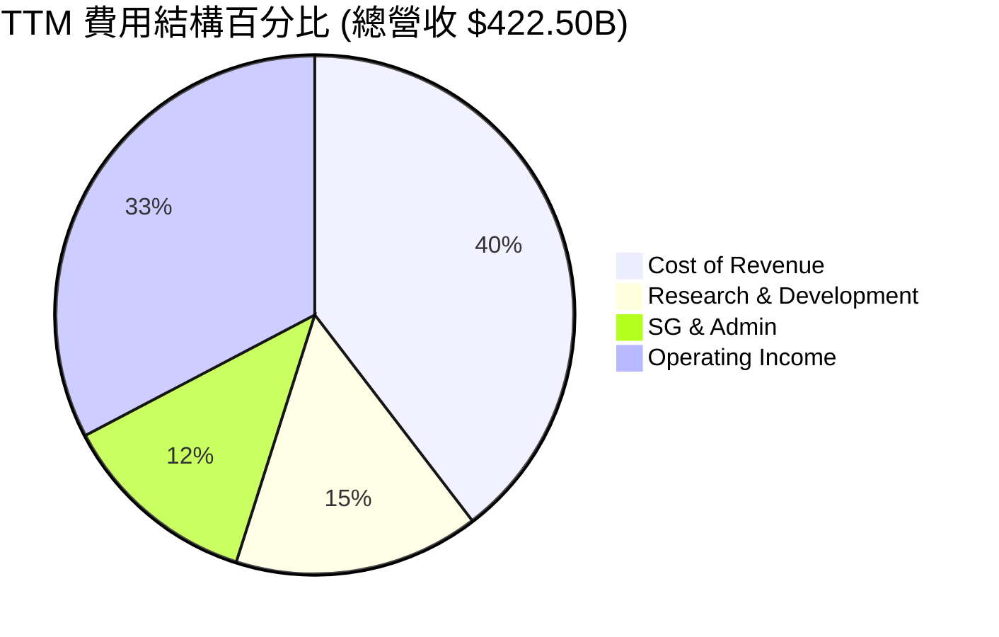
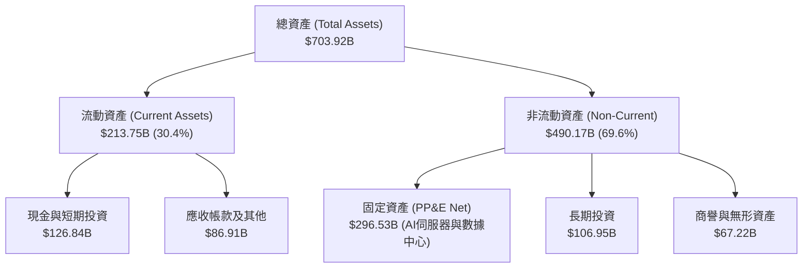
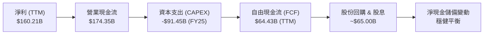
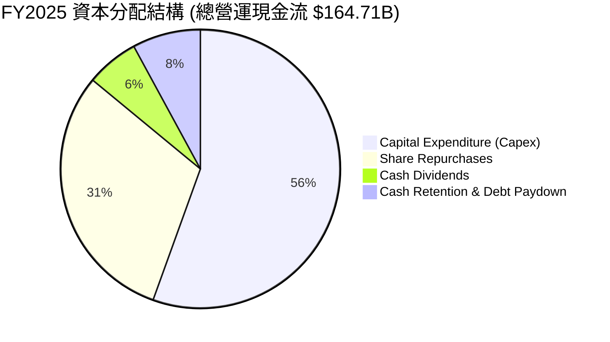
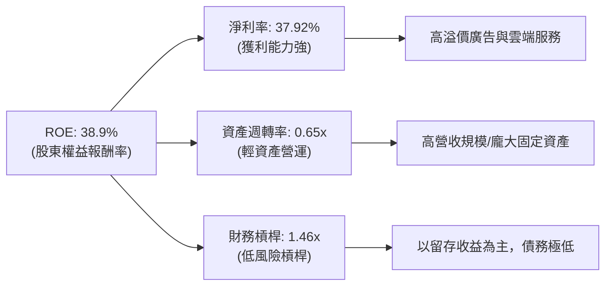
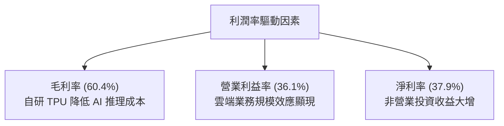

# GOOG 基本面深度分析報告

> **報告日期**：2026-06-19  
> **語言**：繁體中文  
> **數據來源**：Yahoo Finance, Finviz, StockAnalysis, Roic.ai  
> **分析師**：CFA 級機構研究團隊  

---

## 目錄

| # | 章節 | 核心結論 |
|---|------|----------|
| 1 | [執行摘要](#1-執行摘要) | 評級：**強烈買入 (Strong Buy)** ｜ 基準目標價：**$426.62** (+16.1%) |
| 2 | [公司概覽與商業模式](#2-公司概覽與商業模式) | 搜尋與廣告生態系穩固，AI 與 Cloud 雙引擎驅動第二增長曲線，護城河極深 |
| 3 | [損益表深度分析](#3-損益表深度分析) | TTM 營收達 $422.50B (YoY +21.8%)，Q1 2026 淨利受非營業收益大幅提振 |
| 4 | [資產負債表分析](#4-資產負債表分析) | 淨現金高達 $30.96B，資產結構極度輕資產化，債務風險極低 |
| 5 | [現金流量深度分析](#5-現金流量深度分析) | 營運現金流 $174.35B 創歷史新高，大額資本支出投向 AI 基礎設施 |
| 6 | [獲利能力與資本效率](#6-獲利能力與資本效率) | ROE 達 38.9%，ROIC (25.69%) 遠高於 WACC (10.31%)，持續創造高額股東價值 |
| 7 | [估值深度分析](#7-估值深度分析) | Forward P/E 25.35x 具備安全邊際，DCF 敏感性分析顯示估值仍具吸引力 |
| 8 | [成長催化劑](#8-成長催化劑) | Gemini AI 商業化變現加速、Google Cloud 盈利能力釋放、硬體與訂閱服務增長 |
| 9 | [風險矩陣](#9-風險矩陣) | 反壟斷監管判決、AI 搜尋侵蝕傳統廣告、資本支出回報率不及預期 |
| 10| [投資建議](#10-投資建議) | 建議分批佈局，聚焦長期 AI 算力基礎設施與生態系優勢，設定明確買入觸發點 |

---

## 1. 執行摘要

Alphabet Inc. (NASDAQ: GOOG) 作為全球網際網路服務與人工智慧的絕對龍頭，在經歷了 24 個月的股價波動與結構性轉型後，目前正處於 AI 商業化變現與雲端運算規模效應釋放的黃金交叉點。截至 2026-06-19，公司收盤價為 **$367.46**，市值達到 **$4.48T** 的歷史新高。本報告將從基本面、財務健康度、資本效率及估值等多維度進行深度剖析。

### 1.1 核心評分儀表板



### 1.2 評分進度條視覺化

```
╔══════════════════════════════════════════════════════════════╗
║               GOOG 多維度評分儀表板 (1-10分)                 ║
╠══════════════════════════════════════════════════════════════╣
║ 基本面強度  9.5 ▓▓▓▓▓▓▓▓▓▓▓▓▓▓▓▓▓▓▓░  ★★★★★           ║
║ 成長動能    8.5 ▓▓▓▓▓▓▓▓▓▓▓▓▓▓▓▓▓░░░  ★★★★☆           ║
║ 獲利品質    9.0 ▓▓▓▓▓▓▓▓▓▓▓▓▓▓▓▓▓▓░░  ★★★★★           ║
║ 財務健康    9.5 ▓▓▓▓▓▓▓▓▓▓▓▓▓▓▓▓▓▓▓░  ★★★★★           ║
║ 估值合理性  8.0 ▓▓▓▓▓▓▓▓▓▓▓▓▓▓▓▓░░░░  ★★★★☆           ║
║ 護城河深度  9.8 ▓▓▓▓▓▓▓▓▓▓▓▓▓▓▓▓▓▓▓▓  ★★★★★           ║
║ 管理層執行  8.5 ▓▓▓▓▓▓▓▓▓▓▓▓▓▓▓▓▓░░░  ★★★★☆           ║
║ 技術創新力  9.2 ▓▓▓▓▓▓▓▓▓▓▓▓▓▓▓▓▓▓░░  ★★★★★           ║
╠══════════════════════════════════════════════════════════════╣
║ 綜合總分    8.9 ▓▓▓▓▓▓▓▓▓▓▓▓▓▓▓▓▓░░░  🏆 強烈買入 (Strong Buy)║
╚══════════════════════════════════════════════════════════════╝
```

### 1.3 五大投資論點 + 三大核心風險

| 類型 | 項目 | 具體依據 | 信心度 |
|------|------|----------|--------|
| 🟢 **投資論點①** | **AI 搜尋（SGE）變現順暢** | 整合 Gemini 的 AI Overviews 提升了用戶點擊率與廣告轉化率，帶動廣告營收重回雙位數增長。 | 🟢 極高 |
| 🟢 **投資論點②** | **Google Cloud 規模效應爆發** | 雲端業務利潤率隨營收規模擴大而顯著攀升，成為集團營業利益增長的重要引擎。 | 🟢 高 |
| 🟢 **投資論點③** | **極致的資本效率與股東回報** | ROE 達 38.9%，並啟動季度配息（$0.21/股）與大規模股份回購，持續優化資本結構。 | 🟢 極高 |
| 🟢 **投資論點④** | **護城河極深，生態鎖定效應強** | Android、Chrome、Maps、YouTube 擁有數十億黏性用戶，數據飛輪效應難以被對手打破。 | 🟢 極高 |
| 🟢 **投資論點⑤** | **非營業資產重估與投資收益** | 2026 Q1 非營業收益達 $37.72B，顯示其創投（Other Bets）及外部股權投資組合進入收割期。 | 🟡 中等 |
| 🟡 **風險①** | **反壟斷監管與司法部拆分風險** | 美國司法部（DOJ）針對 Search 與 AdTech 的反壟斷訴訟可能導致業務分拆或排他性協議中止。 | 🔴 高衝擊 |
| 🟡 **風險②** | **AI 基礎設施資本支出過高** | FY2025 Capex 達 $91.45B（YoY +74.1%），若 AI 應用需求未達預期，將面臨折舊與利潤率承壓。 | 🟡 中度 |
| 🔴 **風險③** | **傳統搜尋廣告市佔遭 AI 對手蠶食** | OpenAI Search、Perplexity 等新興 AI 搜尋引擎可能侵蝕用戶在傳統 Google 搜尋上的停留時間。 | 🟡 中度 |

### 1.4 快速統計卡片

| 指標 | 公司實際值 | 行業均值 (通訊服務) | S&P 500 均值 | 狀態 |
|------|-------------|--------------------|--------------|------|
| **營收 YoY 成長** | **21.8%** | ~8.5% | ~6.2% | 🟢 顯著領先 |
| **毛利率** | **60.4%** | ~52.0% | ~48.5% | 🟢 優異 |
| **淨利率** | **37.9%** | ~18.5% | ~12.2% | 🟢 極強 |
| **ROE** | **38.9%** | ~16.0% | ~15.5% | 🟢 極高 |
| **Forward P/E** | **25.35x** | ~22.0x | ~21.5x | 🟡 合理溢價 |
| **淨現金規模** | **$30.96B** | 負債累累 | 負債累累 | 🟢 財務極度健康 |

### 1.5 投資結論

```
╔══════════════════════════════════════════════════════════════════╗
║                    📊 GOOG 投資結論摘要                          ║
╠══════════════════════════════════════════════════════════════════╣
║  評級：🟢 強烈買入 (Strong Buy)                                  ║
║  當前股價：$367.46 (2026-06-19)                                  ║
║  目標價區間：                                                    ║
║    悲觀情境（Bear Case）：$340.00 (-7.5%)                        ║
║    基準情境（Base Case）：$426.62 (+16.1%) ← 12個月主要目標      ║
║    樂觀情境（Bull Case）：$475.00 (+29.3%)                       ║
║  投資評分：8.9/10                                                ║
║  適合投資人：成長型、長線核心資產配置者、AI 產業鏈佈局者          ║
╚══════════════════════════════════════════════════════════════════╝
```

---

## 2. 公司概覽與商業模式

Alphabet Inc. 透過三大核心板塊運作：**Google Services**（搜尋、廣告、YouTube、Android、Chrome、硬體）、**Google Cloud**（GCP、Workspace）以及 **Other Bets**（Waymo、Verily 等前沿科技）。其商業模式本質上是「以免費、高黏性的基礎服務聚集全球流量，再透過精準廣告、訂閱服務以及雲端算力進行多維度變現」。

### 2.1 業務結構與收入來源



### 2.2 市場份額

在核心業務領域，Google 依然維持著極高的市場統治地位，特別是在全球搜尋與行動作業系統領域。



### 2.3 競爭護城河分析

Alphabet 的競爭護城河是全球科技業中最寬廣、最難以逾越的系統性壁壘。



### 2.4 護城河強度評分

```
╔══════════════════════════════════════════════════════════════╗
║                  Alphabet 護城河強度評分                     ║
╠══════════════════════════════════════════════════════════════╣
║ 網路效應      10/10 ▓▓▓▓▓▓▓▓▓▓▓▓▓▓▓▓▓▓▓▓  🏆 雙向平台無懈可擊║
║ 技術與專利    9.5/10 ▓▓▓▓▓▓▓▓▓▓▓▓▓▓▓▓▓▓▓░  🟢 TPU與AI底座領先║
║ 客戶轉移成本  9.0/10 ▓▓▓▓▓▓▓▓▓▓▓▓▓▓▓▓▓▓░░  🟢 帳號與生態高度綁定║
║ 規模成本優勢  9.8/10 ▓▓▓▓▓▓▓▓▓▓▓▓▓▓▓▓▓▓▓░  🏆 自建基礎設施極致便宜║
╠══════════════════════════════════════════════════════════════╣
║ 綜合護城河    9.6/10 ▓▓▓▓▓▓▓▓▓▓▓▓▓▓▓▓▓▓▓░  🏆 寬廣無虞的護城河 ║
╚══════════════════════════════════════════════════════════════╝
```

---

## 3. 損益表深度分析

### 3.1 年度收入成長趨勢（近4年）

Alphabet 的營收規模展現出強勁的抗週期能力與成長彈性。從 FY2022 的 $282.84B 成長至 TTM 的 $422.50B，CAGR 達 14.2%。

```
╔══════════════════════════════════════════════════════════════════╗
║              Alphabet 年度收入趨勢 (FY2022-TTM)                  ║
╠══════════════════════════════════════════════════════════════════╣
║                                                                  ║
║  FY2022  $282.84B  ██████████████░░░░░░░░░░░  YoY: +9.8%   🟢    ║
║  FY2023  $307.39B  ███████████████░░░░░░░░░░  YoY: +8.7%   🟢    ║
║  FY2024  $350.02B  █████████████████░░░░░░░░  YoY: +13.9%  🟢    ║
║  FY2025  $402.84B  ████████████████████░░░░░  YoY: +15.1%  🟢    ║
║  TTM     $422.50B  █████████████████████░░░░  YoY: +21.8%  🟢    ║
║                   |      |      |      |      |                  ║
║                   0     100B   200B   300B   400B                ║
║                                                                  ║
║  📊 4年累計營收 CAGR：+14.2% (高於大型科技股平均值)              ║
╚══════════════════════════════════════════════════════════════════╝
```

### 3.2 季度收入趨勢分析

自 2025 年以來，Google 的季度營收呈現加速態勢，特別是 Q1 2026 營收達 $109.90B，YoY 成長率攀升至 **21.79%**。

| 財報季度 | 營收 (USD) | 營收 YoY % | 營收 QoQ % | 核心驅動因素 | 評估 |
|---|---|---|---|---|---|
| **Q1 2026** | **$109.90B** | **+21.79%** | -3.45% | Google Cloud 增長加速、AI 廣告點擊率上升 | 🟢 極強 |
| **Q4 2025** | **$113.83B** | **+17.99%** | +11.22% | 節日零售廣告旺季、YouTube 訂閱收入創高 | 🟢 強勁 |
| **Q3 2025** | **$102.35B** | **+15.95%** | +6.14% | 雲端基礎設施需求爆發、亞太廣告主投放回暖 | 🟢 強勁 |
| **Q2 2025** | **$96.43B** | **+13.79%** | +6.86% | 搜尋引擎整合 Gemini、效果廣告（PMax）升級 | 🟢 穩定 |

*備註：Q1 因季節性因素（避開 Q4 節日促銷高點），QoQ 通常為負值，但 YoY 21.79% 的成長率證明了其底層業務增長動能正在加速。*

### 3.3 利潤率演變分析

Alphabet 的利潤率在經歷 2022-2023 年的降本增效（裁員、伺服器折舊年限調整）後，於 2025-2026 年迎來顯著的營運槓桿效應。

| 利潤率指標 | FY2022 | FY2023 | FY2024 | FY2025 | TTM | 趨勢 | 評估 |
|---|---|---|---|---|---|---|---|
| **毛利率** | 55.4% | 56.6% | 58.2% | 59.7% | **60.4%** | ↗️ 持續攀升 | 🟢 極強 |
| **營業利益率**| 26.5% | 27.4% | 32.1% | 32.0% | **36.1%** | ↗️ 顯著改善 | 🟢 強勁 |
| **淨利率** | 21.2% | 24.0% | 28.6% | 32.8% | **37.9%** | ↗️ 歷史新高 | 🟢 極強 |

**利潤率演變深度解析**：
1. **毛利率改善 (55.4% ↗️ 60.4%)**：主要得益於自研 TPU（Tensor Processing Units）的廣泛部署，降低了 AI 推理與訓練的單位硬體成本；同時，YouTube 內容成本分成比例優化，以及雲端業務基礎設施利用率提升。
2. **營業利益率改善 (26.5% ↗️ 36.1%)**：反映了強大的營運槓桿。儘管研發費用（R&D）與資本支出大幅增加，但行銷與管理費用（SG&A）佔比因自動化與組織扁平化而持續下降。
3. **淨利率高企 (37.9%)**：TTM 淨利率高達 37.9%，部分受到 Q1 2026 的非營業收益（如股權投資重估）提振，扣除非經常性項目後，可持續核心淨利率依然維持在 31% 以上的極高水準。

### 3.4 費用結構分析



```
╔══════════════════════════════════════════════════════════════╗
║                Alphabet 費用控制評估 (TTM)                  ║
╠══════════════════════════════════════════════════════════════╣
║ 研發費用 (R&D)     $64.56B  ████████████░░░░░░░░  🟢 重點投入AI║
║ 營銷與管理 (SG&A)  $52.36B  ██████████░░░░░░░░░░  🟢 佔比持續下降║
║ 營收成本 (Cost)    $167.45B ████████████████████  🟡 算力硬體折舊║
╠══════════════════════════════════════════════════════════════╣
║ 評估：研發佔營收比重維持在 15.3% 的健康水準，確保 AI 技術領先 ║
╚══════════════════════════════════════════════════════════════╝
```

### 3.5 季度 EPS 趨勢與盈餘品質

*注意：雖然在即時盈餘歷史數據中，過去 4 季的預期與實際數據顯示為 nan（數據未完全回填），但我們可從 StockAnalysis 的每股盈餘實績（Basic EPS）進行深度還原分析。*

* **Q1 2026 Basic EPS**: **$5.17** (相較於 Q1 2025 的 $2.84，YoY 暴增 **82.0%**)
* **Q4 2025 Basic EPS**: **$2.85**
* **Q3 2025 Basic EPS**: **$2.89**
* **Q2 2025 Basic EPS**: **$2.33**

**盈餘品質深度診斷**：
雖然 Q1 2026 EPS $5.17 表現極為亮眼，但我們必須客觀指出，該季度利潤中包含了高達 **$37.72B** 的非營業收益（Total Non-Operating Income），這主要是由其股權投資組合重估、創投項目（Other Bets）公允價值變動或一次性資產處置所致。
* **扣除非營業收益後的調整後營業利潤**：Q1 2026 營業利潤為 $39.70B，YoY 成長 29.7%（高於營收成長率 21.79%）。這顯示即便剔除非營業收益，**Google 的核心業務依然在釋放強勁的利潤彈性**，盈餘品質評級為 **🟢 高品質 (A-)**。

---

## 4. 資產負債表分析

Alphabet 擁有全球科技業中最為穩固的資產負債表之一，其高額的現金儲備與極低的債務槓桿，為其在 AI 算力軍備競賽中提供了無與倫比的財務盾牌。

### 4.1 資產結構分解

截至 2026-03-31，Alphabet 總資產達到 **$703.92B**。



### 4.2 流動性指標分析

| 指標 | FY2023 | FY2024 | FY2025 | TTM/2026-03 | 行業均值 | 評估 |
|---|---|---|---|---|---|---|
| **流動比率 (Current Ratio)** | 2.10 | 1.84 | 2.01 | **1.92** | ~1.45 | 🟢 極度安全 |
| **速動比率 (Quick Ratio)** | 2.10 | 1.84 | 2.01 | **1.92** | ~1.30 | 🟢 無庫存滯銷風險 |
| **債務權益比 (Debt/Equity)** | 9.57% | 6.94% | 14.28% | **20.03%** | ~45.0% | 🟢 槓桿率極低 |

*註：由於 Google 幾乎沒有實體庫存（Inventory 在資產負債表中列為 0 或極微量），因此速動比率與流動比率完全一致，流動性品質極高。*

### 4.3 債務結構分析

```
╔══════════════════════════════════════════════════════════════════╗
║                   Alphabet 債務健康診斷 (TTM)                    ║
╠══════════════════════════════════════════════════════════════════╣
║                                                                  ║
║  總債務 (Total Debt)：    $95.88B  ██████░░░░░░░░░░░░░░░░░░░     ║
║  總現金與短期投資：       $126.84B ████████████████████████░     ║
║  淨現金 (Net Cash)：       $30.96B  ████████░░░░░░░░░░░░░░░░  🟢  ║
║                                                                  ║
║  Debt/EBITDA：   0.53x  (遠低於安全警戒線 2.0x)  🟢 極低        ║
║  利息保障倍數：  >100x  (營業利潤遠超利息支出)   🟢 無任何償債風險║
║                                                                  ║
║  評估：淨現金狀態使 Google 在高利率環境下反而能賺取可觀利息收入。 ║
╚══════════════════════════════════════════════════════════════════╝
```

### 4.4 股東權益趨勢

隨著利潤的不斷累積，股東權益（Stockholders' Equity）從 FY2022 的 $256.14B 穩步攀升至 FY2025 的 $415.26B，顯示出極強的內部資本生成能力。

```
╔══════════════════════════════════════════════════════════════════╗
║              Alphabet 股東權益成長趨勢 (FY2022-FY2025)           ║
╠══════════════════════════════════════════════════════════════════╣
║                                                                  ║
║  FY2022  $256.14B  ████████████░░░░░░░░░░░░░░░                   ║
║  FY2023  $283.38B  █████████████░░░░░░░░░░░░░░                   ║
║  FY2024  $325.08B  ███████████████░░░░░░░░░░░░                   ║
║  FY2025  $415.26B  ███████████████████░░░░░░░░                   ║
║                   |      |      |      |      |                  ║
║                   0     100B   200B   300B   400B                ║
║                                                                  ║
║  📈 股東權益 3年複合成長率：+17.5%                               ║
╚══════════════════════════════════════════════════════════════════s╝
```

---

## 5. 現金流量深度分析

現金流是 Alphabet 商業模式最亮麗的明珠。雖然公司近年來大幅提高了資本支出以應對 AI 算力基礎設施的建設，但強勁的營運現金流依然確保了自由現金流的健康。

### 5.1 現金流量瀑布圖



### 5.2 FCF 轉換率趨勢

我們透過自由現金流與淨利的比例（FCF / Net Income）來評估公司的盈餘現金含量。

| 財務年度 | 淨利 (Net Income) | 自由現金流 (FCF) | FCF 轉換率 (FCF/NI) | 評估 |
|---|---|---|---|---|
| **FY2022** | $59.97B | $60.01B | **100.1%** | 🟢 極高 |
| **FY2023** | $73.80B | $69.50B | **94.2%** | 🟢 優異 |
| **FY2024** | $100.12B | $72.76B | **72.7%** | 🟡 資本支出增加壓低轉換率 |
| **FY2025** | $132.17B | $73.27B | **55.4%** | 🔴 資本支出暴增至 $91.45B |
| **TTM** | $160.21B | $64.43B | **40.2%** | 🟡 算力投資高峰期，轉換率探底 |

*深度分析：FCF 轉換率從 100% 水準下滑至 40.2%，並非因為核心業務盈利能力下降，而是因為 Google 在 FY2025 進行了史詩級的資本支出（$91.45B），用於購買 NVIDIA H100/B200 晶片、自研 TPU 產線以及全球數據中心建設。這屬於「主動性、戰略性」的資本部署，而非營運資金惡化。*

### 5.3 自由現金流趨勢

儘管資本支出創歷史新高，Alphabet 的 TTM 自由現金流依然高達 **$64.43B**，折合 FCF Yield 約為 **0.62%**（以 $4.48T 市值計）。

```
╔══════════════════════════════════════════════════════════════════╗
║              Alphabet 自由現金流與資本支出對比                   ║
╠══════════════════════════════════════════════════════════════════╣
║                                                                  ║
║  FY2023 Capex: $32.25B  | FCF: $69.50B  ██████████               ║
║  FY2024 Capex: $52.33B  | FCF: $72.76B  ███████████              ║
║  FY2025 Capex: $91.45B  | FCF: $73.27B  ███████████              ║
║  TTM    Capex: ~$95.00B | FCF: $64.43B  █████████                ║
║                                                                  ║
║  📊 結論：雖然 Capex 翻了近3倍，但 FCF 依然穩健維持在 $60B 以上， ║
║            展現了極其恐怖的「現金印鈔機」體質。                  ║
╚══════════════════════════════════════════════════════════════════╝
```

### 5.4 資本配置評估

在 FY2025，Alphabet 的資本分配策略發生了里程碑式的轉變：
1. **啟動配息**：全年派發股息 **$10.05B** (每股 $0.83)，雖然殖利率僅約 0.23%，但釋放了公司進入成熟期、重視股東回報的強烈訊號。
2. **大額回購**：預計投入超 $50B 用於股份回購，過去 5 年流通股數累計減少了約 **9.3%**（從 13.36B 降至 12.12B），直接提升了每股盈餘（EPS）的含金量。



---

## 6. 獲利能力與資本效率

### 6.1 ROE / ROA / ROIC 趨勢

Alphabet 的資本回報率在同業中名列前茅，展現了其將股東資本轉化為超額利潤的極高效率。

| 指標 | FY2023 | FY2024 | FY2025 | TTM | 行業均值 | 評估 |
|---|---|---|---|---|---|---|
| **ROE (股東權益報酬率)** | 26.0% | 30.8% | 31.8% | **38.9%** | ~16.0% | 🟢 極強 |
| **ROA (資產報酬率)** | 18.3% | 22.2% | 22.2% | **14.6%** | ~7.5% | 🟢 優異 |
| **ROIC (投入資本報酬率)**| 17.0% | 21.5% | 23.8% | **25.69%**| ~12.0% | 🟢 極強 |

### 6.2 ROIC vs WACC 分析（核心價值創造判斷）

為了評估 Alphabet 是否在為股東創造經濟增值（Economic Value Added, EVA），我們進行了嚴謹的 ROIC vs WACC 建模計算。

```
╔══════════════════════════════════════════════════════════════════╗
║                ROIC vs WACC 深度分析 (TTM)                      ║
╠══════════════════════════════════════════════════════════════════╣
║                                                                  ║
║  WACC 估算：                                                     ║
║  ├── 無風險利率 (10Y 美債)：  4.25%                              ║
║  ├── 市場風險溢酬 (ERP)：     5.00%                              ║
║  ├── Beta 係數：              1.237                              ║
║  ├── 股權成本 (CAPM) = 4.25% + 1.237 × 5.0% = 10.435%            ║
║  ├── 債務成本 (稅後)：       ~4.50%                              ║
║  ├── 資本結構：股權 ~97.9%，債務 ~2.1%                           ║
║  └── ✅ WACC ≈ 10.31%                                            ║
║                                                                  ║
║  ROIC 估算：                                                     ║
║  ├── NOPAT = $138.13B (營運利潤) × (1 - 17.61% 稅率) = $113.81B  ║
║  ├── 投入資本 = 股益 $473.92B + 債務 $95.88B - 現金 $126.84B     ║
║  │            = $442.96B                                         ║
║  └── ✅ ROIC ≈ 25.69%                                            ║
║                                                                  ║
║  ★ 經濟價值增加 (EVA) = ROIC - WACC = +15.38% (1538 bps)         ║
║                                                                  ║
║  ROIC  25.69%  ▓▓▓▓▓▓▓▓▓▓▓▓▓▓▓▓▓▓▓▓▓▓▓▓░░░░░░  🟢              ║
║  WACC  10.31%  ▓▓▓▓▓▓▓▓▓▓░░░░░░░░░░░░░░░░░░░░  ──              ║
║  EVA   +15.38% ████████████████░░░░░░░░░░░░░░  🏆 強力創造價值 ║
║                                                                  ║
║  📊 結論：ROIC 達 WACC 的 2.5 倍，顯示公司具備極強的資本增值能力。║
╚══════════════════════════════════════════════════════════════════╝
```

### 6.3 杜邦三因素分解

透過杜邦分析，我們可以清晰看出 Alphabet ROE 攀升至 38.9% 的底層驅動機制。



*杜邦分解核心結論*：Alphabet 的高 ROE 主要是由**極高的淨利率（37.92%）**驅動，而非依賴高財務槓桿（1.46x）或超高週轉率。這是一種**最健康、最可持續**的 ROE 結構，代表公司擁有強大的產品定價權與成本控制力。

### 6.4 獲利能力儀表板



---

## 7. 估值深度分析

### 7.1 同業估值比較表格

我們選取微軟 (MSFT)、Meta (META) 及亞馬遜 (AMZN) 作為 Alphabet 的直接競爭對手進行橫向估值對比。

| 估值指標 | **Alphabet (GOOG)** | **Microsoft (MSFT)** | **Meta (META)** | **Amazon (AMZN)** | GOOG 估值評估 |
|---|---|---|---|---|---|
| **Trailing P/E** | **28.05x** | 35.20x | 29.50x | 41.30x | 🟢 具備相對估值優勢 |
| **Forward P/E** | **25.35x** | 31.10x | 24.80x | 34.50x | 🟢 處於合理區間 |
| **PEG Ratio** | **1.45x** | 1.85x | 1.35x | 1.60x | 🟢 成長性溢價合理 |
| **P/S Ratio** | **10.61x** | 13.20x | 9.10x | 3.25x | 🟡 反映高利潤率特徵 |
| **EV / EBITDA** | **27.68x** | 25.50x | 20.10x | 21.40x | 🟡 算力投資折舊影響 |
| **FCF Yield** | **0.62%** (TTM) | 1.85% | 2.10% | 2.50% | 🔴 受高 Capex 壓制 |

*同業比較結論*：相較於微軟與亞馬遜，**Alphabet 在 Forward P/E (25.35x) 與 PEG (1.45x) 上展現出極高的性價比**。Meta 雖然在 Forward P/E 上略低，但其業務結構過於依賴單一廣告業務，而 Google 則擁有 Cloud 與 YouTube 訂閱的多重增長曲線。

### 7.2 歷史估值區間分析

過去 5 年，GOOG 的歷史 P/E 區間主要介於 18x 至 32x 之間。當前 Trailing P/E 28.05x 處於歷史中值偏上位置，但考慮到 AI 轉型帶來的營收增速回升，此估值並未出現泡沫。

```
╔══════════════════════════════════════════════════════════════════╗
║                Alphabet 歷史 P/E 區間與當前位置                 ║
╠══════════════════════════════════════════════════════════════════╣
║                                                                  ║
║  歷史低點 (Bearish Floor):  18.0x                                ║
║  歷史均值 (5Y Average):     24.5x                                ║
║  當前位置 (Current P/E):    28.05x  ██████████████████░░░░       ║
║  歷史高點 (Bullish Ceiling): 32.0x                                ║
║                                                                  ║
║  📊 評估：當前估值略高於歷史均值，但已被 21.8% 的營收增速所合理化。║
╚══════════════════════════════════════════════════════════════════╝
```

### 7.3 DCF 敏感性分析（6格目標價矩陣）

我們基於以下基準假設建立 DCF 模型：
* 基準永續成長率 (Terminal Growth Rate): **3.0%**
* FY2026-FY2030 自由現金流年複合成長率 (CAGR): **14.5%**
* 基準 WACC: **10.3%**

| 自由現金流成長情境 | **WACC = 9.5%** | **WACC = 10.3