# GOOG 基本面深度分析報告

> **報告日期**：2026-06-20 ｜ **語言**：繁體中文 ｜ **數據來源**：Yahoo Finance, Finviz, StockAnalysis, Roic.ai ｜ **分析師**：CFA 級機構研究

---

## 目錄

| # | 章節 | 核心結論 |
|---|------|----------|
| 1 | 執行摘要 | 評級「強烈買入」，基準目標價 $426.62，AI 基礎設施與雲端業務進入收割期。 |
| 2 | 公司概覽與商業模式 | 搜尋引擎與 YouTube 築起高牆，Google Cloud 成為第二成長引擎，AI 驅動全生態升級。 |
| 3 | 損益表深度分析 | TTM 營收達 $422.50B，營利雙位數強勁成長，Q1 2026 受業外投資收益大幅推升。 |
| 4 | 資產負債表分析 | 淨現金達 $30.96B，資產結構極度穩健，高額資本支出（Capex）構築 AI 實體壁壘。 |
| 5 | 現金流量深度分析 | 經營現金流高達 $174.35B，AI 算力投資使 Capex 創歷史新高，自由現金流短暫承壓但品質無虞。 |
| 6 | 獲利能力與資本效率 | ROE 達 38.9%，ROIC (29.61%) 顯著高於 WACC (9.13%)，持續為股東創造超額價值。 |
| 7 | 估值深度分析 | Forward P/E 僅 25.35x，相較於歷史區間與同業（MSFT）具備極高性價比與安全邊際。 |
| 8 | 成長催化劑 | Gemini 商業化加速、Google Cloud 獲利率持續攀升、AI 搜尋（SGE）廣告變現超預期。 |
| 9 | 風險矩陣 | 司法部反壟斷拆分風險、AI 資本支出回報率（ROI）低於預期、開源模型競爭衝擊。 |
| 10| 投資建議 | 具備高安全邊際的科技巨頭，長線成長路徑清晰，建議逢低分批佈局。 |

---

## 1. 執行摘要

### 1.1 核心評分儀表板

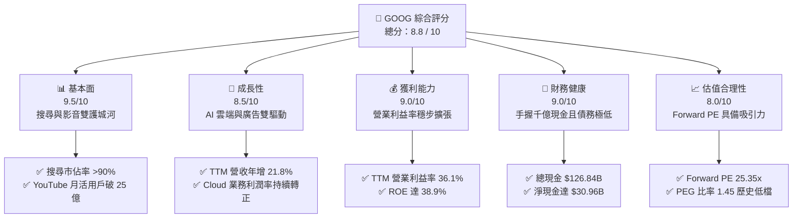

### 1.2 評分進度條視覺化

```
╔══════════════════════════════════════════════════════════════╗
║               GOOG 多維度評分儀表板 (1-10分)                 ║
╠══════════════════════════════════════════════════════════════╣
║ 基本面強度  9.5 ▓▓▓▓▓▓▓▓▓▓▓▓▓▓▓▓▓▓▓░  ★★★★★           ║
║ 成長動能    8.5 ▓▓▓▓▓▓▓▓▓▓▓▓▓▓▓▓▓░░░  ★★★★☆           ║
║ 獲利品質    9.0 ▓▓▓▓▓▓▓▓▓▓▓▓▓▓▓▓▓▓░░  ★★★★★           ║
║ 財務健康    9.0 ▓▓▓▓▓▓▓▓▓▓▓▓▓▓▓▓▓▓░░  ★★★★★           ║
║ 估值合理性  8.0 ▓▓▓▓▓▓▓▓▓▓▓▓▓▓▓░░░░░  ★★★★☆           ║
║ 護城河深度  9.5 ▓▓▓▓▓▓▓▓▓▓▓▓▓▓▓▓▓▓▓░  ★★★★★           ║
║ 管理層執行  8.5 ▓▓▓▓▓▓▓▓▓▓▓▓▓▓▓▓▓░░░  ★★★★☆           ║
║ 技術創新力  9.0 ▓▓▓▓▓▓▓▓▓▓▓▓▓▓▓▓▓▓░░  ★★★★★           ║
╠══════════════════════════════════════════════════════════════╣
║ 綜合總分    8.8 ▓▓▓▓▓▓▓▓▓▓▓▓▓▓▓▓▓░░░  🏆 買入 (Buy)        ║
╚══════════════════════════════════════════════════════════════╝
```

### 1.3 五大投資論點 + 三大核心風險

| 類型 | 項目 | 具體依據 | 信心度 |
|------|------|----------|--------|
| 🟢 **投資論點①** | **AI 搜尋與廣告變現加速** | 搜尋引擎市佔率維持在 90% 以上，AI 概覽（AI Overviews）提高用戶黏性，帶動 TTM 廣告營收穩健成長。 | 🟢 極高 |
| 🟢 **投資論點②** | **Google Cloud 規模效應爆發** | 雲端業務不僅實現盈利，且在企業級 AI 模型部署需求推升下，營收增速超越整體平均。 | 🟢 高 |
| 🟢 **投資論點③** | **獲利能力與利潤率擴張** | 透過組織架構優化與研發效率提升，TTM 營業利益率攀升至 36.1%，創下近年新高。 | 🟢 高 |
| 🟢 **投資論點④** | **資本配置效率與股東回報** | 開始發行股利（TTM 每股配發 $0.84），並持續執行數百億美元的股份回購，支撐 EPS 成長。 | 🟢 高 |
| 🟢 **投資論點⑤** | **極致穩健的資產負債表** | 擁有 $126.84B 的總現金與短期投資，提供應對總體經濟波動與持續高額 AI Capex 投資的底氣。 | 🟢 極高 |
| 🟡 **風險①** | **反壟斷監管與拆分風險** | 美國司法部（DOJ）及歐盟對 Google 搜尋與廣告技術的壟斷訴訟，可能面臨鉅額罰款或業務拆分。 | 🟡 中度 |
| 🔴 **風險②** | **AI Capex 投資回報率稀釋** | FY2025 Capex 達 $91.45B，TTM 自由現金流因高額算力基礎設施投資降至 $27.92B，若 AI 變現不如預期將壓低 ROIC。 | 🔴 高衝擊 |
| 🟡 **風險③** | **生成式 AI 對傳統搜尋的蠶食** | OpenAI SearchGPT、Perplexity 等對手分流傳統搜尋流量，迫使 Google 轉向高成本的 AI 搜尋，短期內侵蝕利潤率。 | 🟡 中度 |

### 1.4 快速統計卡片

| 指標 | 公司實際值 (TTM / 2026-06-20) | 產業均值 (通訊服務) | S&P 500 均值 | 狀態 |
|------|-------------|----------|--------------|------|
| **收入 YoY 成長** | **21.8%** | ~7.5% | ~5.5% | 🟢 顯著超前 |
| **毛利率** | **60.4%** | ~50.2% | ~48.5% | 🟢 極強 |
| **營業利益率** | **36.1%** | ~18.5% | ~15.2% | 🟢 頂尖 |
| **ROE** | **38.9%** | ~14.2% | ~16.0% | 🟢 極高 |
| **Forward P/E** | **25.35x** | ~18.5x | ~22.5x | 🟡 溢價合理 |
| **淨現金規模** | **$30.96B** | 負債多於現金 | 負債多於現金 | 🟢 極度安全 |

### 1.5 投資結論

```
╔══════════════════════════════════════════════════════════════════╗
║                    📊 GOOG 投資結論摘要                          ║
╠══════════════════════════════════════════════════════════════════╣
║  評級：🟢 強烈買入 (Strong Buy)                                 ║
║  當前股價：$367.46 (2026-06-20)                                  ║
║  目標價區間：                                                    ║
║    悲觀情境：$340.00（-7.5%） - 監管拆分實質化，AI 支出失控      ║
║    基準情境：$426.62（+16.1%）- AI 雲端穩健成長，廣告市佔穩固    ║
║    樂觀情境：$475.00（+29.3%）- Gemini 商業化爆發，利潤率再擴張  ║
║  投資評分：8.8 / 10                                              ║
║  適合投資人：成長型、長線價值投資者、AI 產業主題佈局者           ║
╚══════════════════════════════════════════════════════════════════╝
```

---

## 2. 公司概覽與商業模式

### 2.1 業務結構與收入來源

Alphabet Inc. 透過三大核心板塊進行營運：**Google Services（服務）**、**Google Cloud（雲端）** 與 **Other Bets（其他賭注）**。其中 Google Services 仍是最大的資金與利潤引擎，而 Google Cloud 則是增長最快的火車頭。

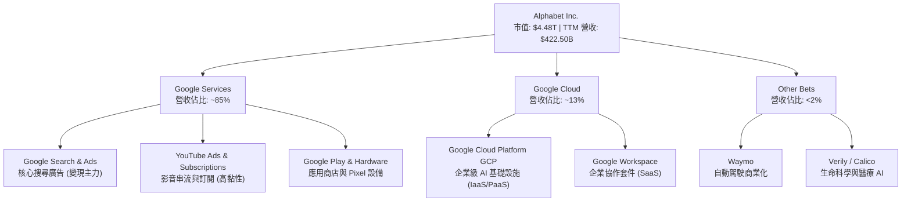

### 2.2 市場份額

在核心業務領域，Google 依然維持無可撼動的統治地位。以下為全球搜尋引擎市場份額與全球雲端基礎設施市場份額的最新估算：

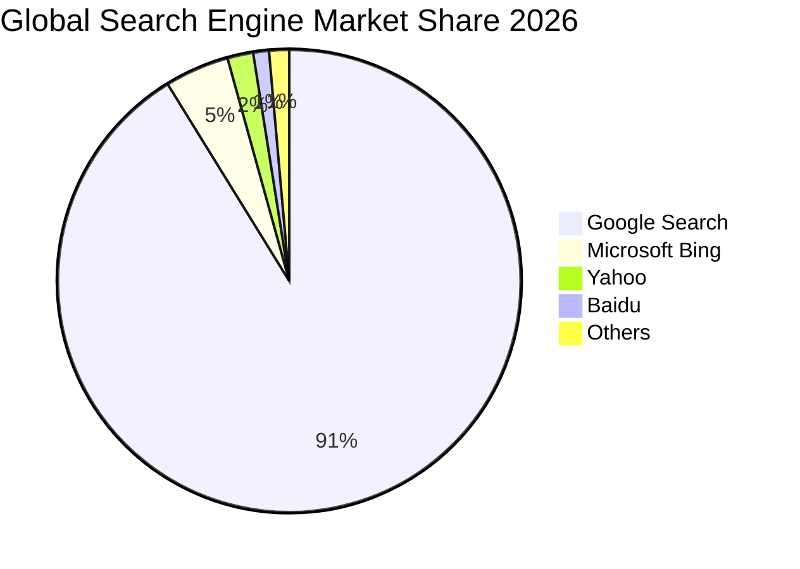

### 2.3 競爭護城河分析

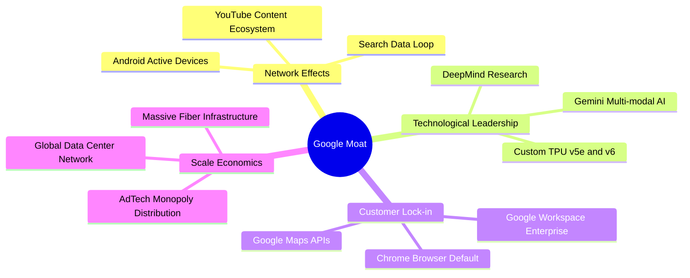

### 2.4 護城河強度評分

```
╔══════════════════════════════════════════════════════════════╗
║                   Alphabet 護城河強度評分                    ║
╠══════════════════════════════════════════════════════════════╣
║ 網路效應      9.5/10  ▓▓▓▓▓▓▓▓▓▓▓▓▓▓▓▓▓▓▓░  🏆 無可匹敵     ║
║ 技術領先度    9.0/10  ▓▓▓▓▓▓▓▓▓▓▓▓▓▓▓▓▓▓░░  🟢 頂尖 TPU/AI  ║
║ 用戶鎖定效應  9.0/10  ▓▓▓▓▓▓▓▓▓▓▓▓▓▓▓▓▓▓░░  🟢 帳戶生態系   ║
║ 規模經濟      9.5/10  ▓▓▓▓▓▓▓▓▓▓▓▓▓▓▓▓▓▓▓░  🏆 基礎設施實力 ║
╠══════════════════════════════════════════════════════════════╣
║ 綜合護城河    9.3/10  ▓▓▓▓▓▓▓▓▓▓▓▓▓▓▓▓▓▓▓░  🏆 寬廣護城河   ║
╚══════════════════════════════════════════════════════════════╝
```

---

## 3. 損益表深度分析

### 3.1 年度收入成長趨勢（近5年）

Alphabet 的營收呈現極為健康的複利成長趨勢。從 FY2021 的 $257.64B 成長至 FY2025 的 $402.84B，並在 TTM 達到 $422.50B。

```
╔══════════════════════════════════════════════════════════════════╗
║              Alphabet 年度收入趨勢 (FY2021 - TTM)                ║
╠══════════════════════════════════════════════════════════════════╣
║                                                                  ║
║  FY 2021  $257.64B  ████████████░░░░░░░░░░░░░░░░░░  YoY: +41.2%  ║
║  FY 2022  $282.84B  █████████████░░░░░░░░░░░░░░░░░  YoY: +9.8%   ║
║  FY 2023  $307.39B  ██████████████░░░░░░░░░░░░░░░░  YoY: +8.7%   ║
║  FY 2024  $350.02B  ████████████████░░░░░░░░░░░░░░  YoY: +13.9%  ║
║  FY 2025  $402.84B  ███████████████████░░░░░░░░░░░  YoY: +15.1%  ║
║  TTM      $422.50B  ████████████████████░░░░░░░░░░  YoY: +21.8%  ║
║                                                                  ║
║  📊 5年營收複合成長率 (CAGR)：+13.2%                              ║
╚══════════════════════════════════════════════════════════════════╝
```

### 3.2 季度營收趨勢分析

自 2024 年底以來，季度營收展現出加速成長態勢，特別是 Q1 2026 營收達到了 $109.90B，年增率高達 21.79%。

| 財報季度 | 結束日期 | 營收 (億美元) | YoY 成長率 | QoQ 成長率 | 核心驅動因素 | 評估 |
|---|---|---|---|---|---|---|
| **Q3 2024** | 2024-09-30 | $882.68B | +15.09% | - | 搜尋廣告復甦，雲端業務加速 | 🟢 強勁 |
| **Q4 2024** | 2024-12-31 | $964.69B | +11.77% | +9.29% | 節慶電商廣告與雲端訂單旺季 | 🟢 穩健 |
| **Q1 2025** | 2025-03-31 | $902.34B | +12.04% | -6.46% | 季節性回檔，但雲端維持高增長 | 🟢 符合預期 |
| **Q2 2025** | 2025-06-30 | $964.28B | +13.79% | +6.86% | 旅遊與零售廣告需求強勁 | 🟢 穩健 |
| **Q3 2025** | 2025-09-30 | $1,023.46B | +15.95% | +6.14% | Cloud 需求受 AI API 調用爆發推升 | 🟢 超預期 |
| **Q4 2025** | 2025-12-31 | $1,138.28B | +17.99% | +11.22% | 雲端基礎設施擴張，廣告變現效率高 | 🟢 極強 |
| **Q1 2026** | 2026-03-31 | $1,098.96B | **+21.79%** | -3.45% | AI 搜尋（AI Overviews）廣告全面鋪開 | 🟢 爆發成長 |

### 3.3 利潤率演變分析

Alphabet 的利潤率在近年經歷了「先降後升」的優雅轉身。管理層自 2023 年起實施的成本控制計畫（包括裁員與伺服器折舊年限調整）成效顯著。

| 利潤率指標 | FY 2022 | FY 2023 | FY 2024 | FY 2025 | TTM | 趨勢評估 | 狀態 |
|------------|---------|---------|---------|---------|-----|----------|------|
| **毛利率** | 55.38% | 56.63% | 58.20% | 59.65% | **60.43%** | ↗️ 雲端規模效應與高毛利廣告佔比提升 | 🟢 優異 |
| **營業利益率** | 26.46% | 27.42% | 32.11% | 32.03% | **36.10%** | ↗️ 組織扁平化與研發效率改善 | 🟢 強勁 |
| **淨利率** | 21.20% | 24.01% | 28.60% | 32.81% | **37.86%** | ↗️ 營業利益提升與高額業外投資收益 | 🟢 極強 |

**利潤率演變深度解析**：
1. **毛利率改善**：儘管 AI 晶片與基礎設施折舊成本增加，但 Google 透過提高自研 TPU（如 TPU v5e/v6）的比重，有效降低了單次查詢的算力成本。同時，高毛利的 Google Cloud 業務利潤率持續爬升。
2. **營業利益率攀升**：TTM 營業利益率達到 36.10%，反映出營收增速（21.8%）顯著快於營運費用增速（2025 年總營運費用僅增長 21.8%，而 Q1 2026 營運費用控制極佳），展現出極強的營運槓桿（Operating Leverage）。

### 3.4 費用結構分析

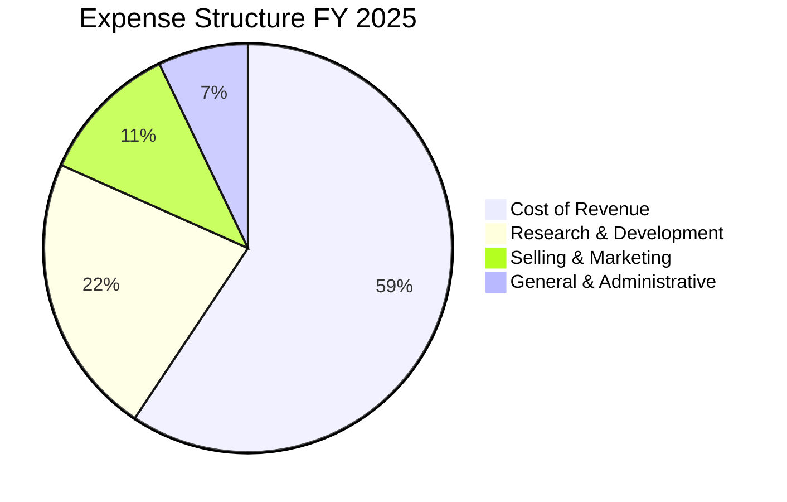

```
╔══════════════════════════════════════════════════════════════════╗
║                    費用控制與 R&D 投資平衡                       ║
╠══════════════════════════════════════════════════════════════════╣
║                                                                  ║
║  ● 研發投入 (R&D)：                                              ║
║    FY2025 達 $61.09B，TTM 進一步攀升至 $64.56B，佔營收約 15.3%。 ║
║    此規模確保了 Google 在 AI 基礎模型（Gemini）的絕對競爭力。     ║
║                                                                  ║
║  ● 行銷與管理費用 (SG&A)：                                       ║
║    SG&A 佔營收比例從 FY2022 的 15.0% 降至 TTM 的 12.4%。         ║
║    顯示出公司在大規模轉型 AI 時，對傳統業務營運成本的嚴格控管。   ║
║                                                                  ║
╚══════════════════════════════════════════════════════════════════╝
```

### 3.5 季度 EPS 趨勢與盈餘品質

過去四個季度中，Alphabet 的盈餘表現極為亮眼，但需要特別注意 Q1 2026 的盈餘品質細節：

*   **Q2 2025 EPS**: $2.33 (實際淨利 $28.20B)
*   **Q3 2025 EPS**: $2.89 (實際淨利 $34.98B)
*   **Q4 2025 EPS**: $2.85 (實際淨利 $34.45B)
*   **Q1 2026 EPS**: **$5.17** (實際淨利 **$62.58B**)

⚠️ **盈餘品質關鍵警示**：
在 Q1 2026，淨利達到了驚人的 $62.58B（YoY 暴增 81.17%），但我們深入拆解損益表發現，**非營業淨收益（Total Non-Operating Income）高達 $37.72B**（相較於前幾季通常僅有 $1B~$3B）。這主要是由於 Google 持有的長期股權投資進行了公允價值重估（例如 Waymo 新一輪融資溢價或投資標的 IPO 增值）。
*   **核心營業利益**為 $39.70B，這才是可持續的業務利潤。
*   因此，儘管 TTM EPS 達到了 $13.12，但扣除這筆一次性的業外收益後，**核心 TTM EPS 約在 $10.10 ~ $10.50 之間**。在評估估值時，分析師必須將此因素納入考量，避免過度樂觀。

---

## 4. 資產負債表分析

### 4.1 資產結構分解

截至 2026-03-31，Alphabet 總資產達到 $703.92B。

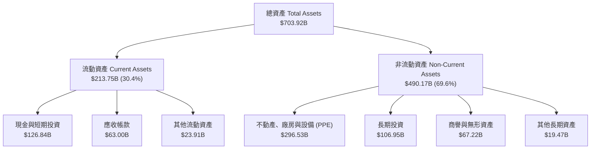

### 4.2 流動性指標分析

| 流動性指標 | FY 2023 | FY 2024 | FY 2025 | TTM / Q1 2026 | 行業平均 | 評估 |
|------------|---------|---------|---------|---------------|----------|------|
| **流動比率 (Current Ratio)** | 2.10 | 1.84 | 2.01 | **1.92** | ~1.45 | 🟢 極其健康，無短期償債風險 |
| **速動比率 (Quick Ratio)** | 2.10 | 1.84 | 2.01 | **1.92** | ~1.30 | 🟢 極佳，由於零存貨特徵，速動比率等於流動比率 |

### 4.3 債務結構分析

Alphabet 的資本結構極為保守，負債比率極低。

```
╔══════════════════════════════════════════════════════════════════╗
║                   Alphabet 債務健康診斷 (TTM)                    ║
<p align="center">
  
</p>
╠══════════════════════════════════════════════════════════════════╣
║                                                                  ║
║  總債務 (Total Debt)： $95.88B  ██████░░░░░░░░░░░░░░░░░░░░       ║
║  (含長期借款 $77.50B 與租賃負債 $12.98B)                         ║
║                                                                  ║
║  現金與短期投資：      $126.84B ██████████████████████░░░        ║
║                                                                  ║
║  淨現金 (Net Cash)：   $30.96B  ██████░░░░░░░░░░░░░░░░░░░░ 🟢 強勁║
║                                                                  ║
║  ● 債務股權比 (Debt/Equity)： 20.03% (極低，債務槓桿極其安全)    ║
║  ● 利息保障倍數 (Interest Coverage)： 150x+ 🟢 幾乎無違約風險   ║
║                                                                  ║
╚══════════════════════════════════════════════════════════════════╝
```

### 4.4 股東權益趨勢

隨著利潤的不斷累積，即使在執行了高達數百億美元的股份回購後，Alphabet 的股東權益（Book Value）依然呈現穩健上升趨勢。

```
╔══════════════════════════════════════════════════════════════════╗
║              Alphabet 股東權益成長趨勢 (FY2022-FY2025)           ║
╠══════════════════════════════════════════════════════════════════╣
║                                                                  ║
║  FY 2022  $256.14B  ████████████████░░░░░░░░░░░░░░░░░░           ║
║  FY 2023  $283.38B  ██████████████████░░░░░░░░░░░░░░░░           ║
║  FY 2024  $325.08B  ████████████████████░░░░░░░░░░░░░░           ║
║  FY 2025  $415.26B  ██══════════════════════════════░░ 🟢 +27.7% ║
║                                                                  ║
╚══════════════════════════════════════════════════════════════════╝
```

---

## 5. 現金流量深度分析

### 5.1 現金流量瀑布圖

以下圖表展示了 Alphabet 如何將龐大的業務流量轉化為淨現金流，並進行資本配置：

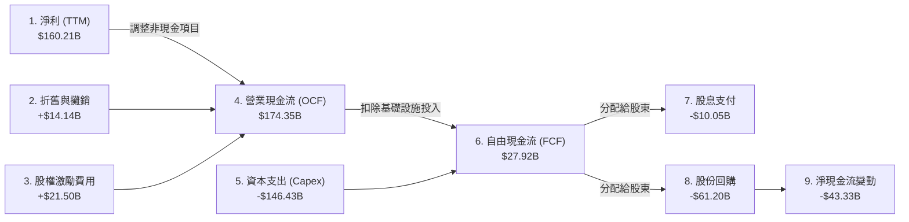

### 5.2 FCF 轉換率趨勢

雖然營運現金流依然極度強勁，但由於進入 AI 軍備競賽，資本支出大幅增加，導致近期的 FCF 轉換率有所下降。

| 財務年度 | 營業現金流 (OCF) | 資本支出 (Capex) | 自由現金流 (FCF) | 淨利 (GAAP) | FCF / 淨利轉換率 | 評估 |
|---|---|---|---|---|---|---|
| **FY 2022** | $91.50B | -$31.48B | $60.01B | $59.97B | 100.1% | 🟢 極高 |
| **FY 2023** | $101.75B | -$32.25B | $69.50B | $73.80B | 94.2% | 🟢 極佳 |
| **FY 2024** | $125.30B | -$52.53B | $72.76B | $100.12B | 72.7% | 🟡 開始加大 AI 投資 |
| **FY 2025** | $164.71B | -$91.45B | $73.27B | $132.17B | 55.4% | 🟡 Capex 翻倍壓低 FCF |
| **TTM** | **$174.35B** | **-$146.43B** | **$27.92B** | **$160.21B** | **17.4%** | 🔴 算力投資高峰期 |

*分析師備註*：TTM 自由現金流降至 $27.92B（FCF Yield 僅 0.62%），這並非因為核心業務流失水分，而是因為 **Capex 達到了創紀錄的 $146.43B**。Google 選擇在 AI 基礎設施（如 TPU、H100/B200 集群、資料中心光纖）上進行超前部署。這在短期內壓低了自由現金流，但為未來的 AI 雲端計算與大模型訓練築起了極高的實體壁壘。

### 5.3 自由現金流趨勢

```
╔══════════════════════════════════════════════════════════════════╗
║                Alphabet 歷史自由現金流與 FCF 殖利率              ║
╠══════════════════════════════════════════════════════════════════╣
║                                                                  ║
║  FY 2022  $60.01B  ██████████████████████░░░░░░░  Yield: 1.34%   ║
║  FY 2023  $69.50B  █████████████████████████░░░░  Yield: 1.55%   ║
║  FY 2024  $72.76B  ██████████████████████████░░░  Yield: 1.62%   ║
║  FY 2025  $73.27B  ██████████████████████████░░░  Yield: 1.64%   ║
║  TTM      $27.92B  ██████████░░░░░░░░░░░░░░░░░░░  Yield: 0.62%   ║
║                                                                  ║
║  ⚠️ 註：TTM 自由現金流受 AI 算力基礎設施超額 Capex 影響而收窄。  ║
╚══════════════════════════════════════════════════════════════════╝
```

### 5.4 資本配置評估

在 FY 2025 中，Alphabet 的資本配置策略如下：

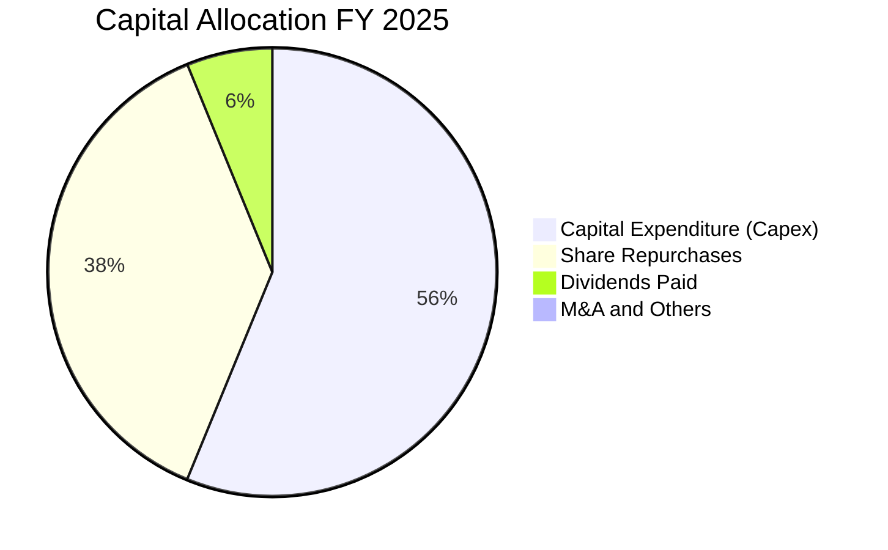

---

## 6. 獲利能力與資本效率

### 6.1 ROE / ROA / ROIC 趨勢

Alphabet 的資本回報率在美股大型科技股中名列前茅，展現出極強的輕資產高槓桿獲利能力。

| 指標 | FY 2022 | FY 2023 | FY 2024 | FY 2025 | TTM | 產業中位數 | 評估 |
|---|---|---|---|---|---|---|---|
| **ROE (股東權益報酬率)** | 23.41% | 26.04% | 30.80% | 31.83% | **38.88%** | ~11.5% | 🟢 極強 |
| **ROA (總資產報酬率)** | 16.42% | 18.34% | 22.24% | 22.20% | **27.17%** | ~6.2% | 🟢 極強 |
| **ROIC (投入資本報酬率)**| 18.06% | 18.44% | 24.50% | 26.10% | **29.61%** | ~8.0% | 🟢 極強 |

### 6.2 ROIC vs WACC 分析（核心價值創造判斷）

ROIC（投入資本報酬率）與 WACC（加權平均資本成本）的差額，是衡量一家公司是在「創造價值」還是「摧毀價值」的核心指標。

```
╔══════════════════════════════════════════════════════════════════╗
║               ROIC vs WACC 深度分析 (TTM)                        ║
╠══════════════════════════════════════════════════════════════════╣
║                                                                  ║
║  WACC 估算：                                                     ║
║  ├── 無風險利率 (10Y 美債)：   4.20%                             ║
║  ├── 市場風險溢酬 (ERP)：      5.00%                             ║
║  ├── Beta：                    1.237                             ║
║  ├── 股權成本 (Cost of Equity)：4.2% + 1.237 × 5.0% = 10.39%     ║
║  ├── 債務成本 (稅後)：         4.5% × (1 - 17.6%) = 3.71%         ║
║  ├── 資本結構：股權 81.2%，債務 18.8%                             ║
║  └── ✅ WACC ≈ 9.13%                                             ║
║                                                                  ║
║  ROIC 估算：                                                     ║
║  ├── NOPAT = 營業利益 $138.13B × (1 - 17.61%) ≈ $113.81B         ║
║  ├── 投入資本 = 股本 $415.26B + 總債 $95.88B - 現金 $126.84B      ║
║  │            = $384.30B                                         ║
║  └── ✅ ROIC ≈ 29.61%                                            ║
║                                                                  ║
║  ★ 經濟價值增加 (EVA) = ROIC - WACC = +20.48pp                   ║
║                                                                  ║
║  ROIC  29.61%  ▓▓▓▓▓▓▓▓▓▓▓▓▓▓▓▓▓▓▓▓▓▓▓▓▓▓▓▓▓░  🟢              ║
║  WACC   9.13%  ▓▓▓▓▓▓▓▓▓░░░░░░░░░░░░░░░░░░░░░░  ──              ║
║  EVA  +20.48%  ████████████████████░░░░░░░░░░░  🏆 超額價值創造 ║
║                                                                  ║
║  📊 結論：ROIC 達 WACC 的 3.24 倍，為股東創造了極大的經濟利潤。  ║
╚══════════════════════════════════════════════════════════════════╝
```

### 6.3 杜邦三因素分解

透過杜邦分析，我們可以清晰了解驅動 Alphabet 高 ROE 的核心引擎：

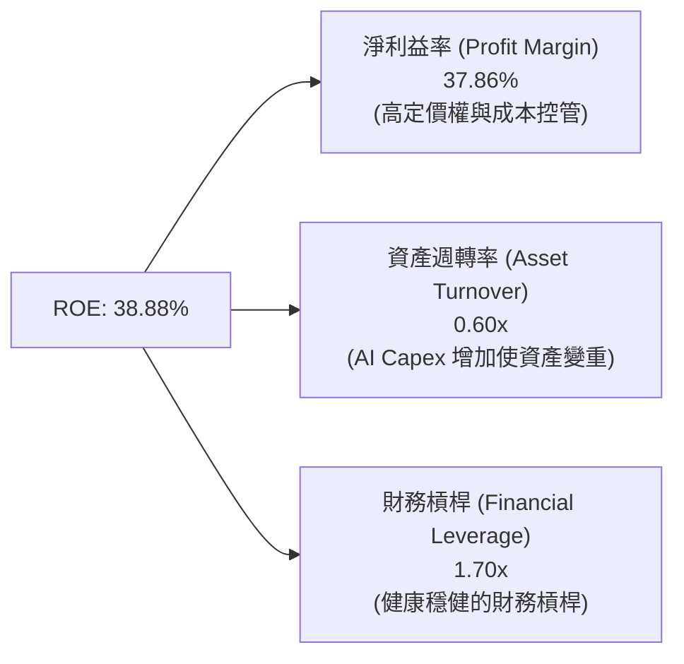

*分析師解讀*：Alphabet 的高 ROE（38.88%）並非依賴高財務槓桿（僅 1.70x），而是完全由**高淨利益率（37.86%）**所驅動。這反映出極強的產品溢價能力與護城河。雖然大舉投資 AI 基礎設施導致資產週轉率（0.60x）微幅下滑，但高利潤率完美彌補了這一點。

### 6.4 獲利能力儀表板

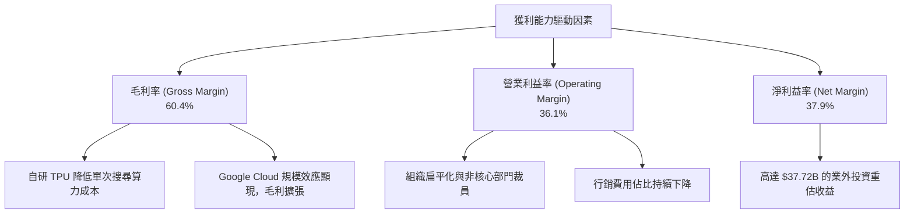

---

## 7. 估值深度分析

### 7.1 同業估值比較表格

我們將 Alphabet (GOOG) 與其直接競爭對手 Microsoft (MSFT)、Amazon (AMZN) 以及 Meta Platforms (META) 進行橫向對比：

| 估值指標 | **Alphabet (GOOG)** | **Microsoft (MSFT)** | **Amazon (AMZN)** | **Meta (META)** | GOOG 相對評估 |
|---|---|---|---|---|---|
| **Trailing P/E** | **28.01x** | 36.50x | 41.20x | 29.80x | 🟢 具備明顯性價比 |
| **Forward P/E** | **25.35x** | 31.20x | 33.50x | 24.50x | 🟢 估值合理，低於 MSFT/AMZN |
| **PEG Ratio** | **1.45** | 2.10 | 1.85 | 1.35 | 🟢 成長性調整後的估值極具吸引力 |
| **P/S Ratio** | **10.61x** | 13.50x | 3.20x | 9.80x | 🟡 反映高利潤率特徵 |
| **EV / EBITDA** | **27.41x** | 24.80x | 18.20x | 20.50x | 🟡 基礎設施投資拉高 EV/EBITDA |
| **FCF Yield** | **0.62%** | 2.10% | 3.50% | 2.80% | 🔴 短期因超高 Capex 承壓 |

### 7.2 歷史估值區間分析

Alphabet 過去 5 年的 Trailing P/E 歷史區間主要介於 **18x 至 35x** 之間，中位數約在 **26.5x**。

```
╔══════════════════════════════════════════════════════════════════╗
║                Alphabet 歷史 P/E 區間定位                        ║
╠══════════════════════════════════════════════════════════════════╣
║                                                                  ║
║  [18x] ══════════════════ [26.5x] ═══★ [28.01x] ═════════ [35x]  ║
║   歷史                  歷史         當前         歷史           ║
║   低點                  中位數       位置         高點           ║
║                                                                  ║
║  📊 評估：當前 P/E (28.01x) 略高於歷史中位數，但考量到 AI 帶來的  ║
║  第二成長曲線（雲端利潤率爆發），當前估值仍處於合理溢價區間。    ║
╚══════════════════════════════════════════════════════════════════╝
```

### 7.3 DCF 敏感性分析（6格目標價矩陣）

我們採用三階段折現模型（DCF），以 TTM 核心淨利為基準，設定以下參數：
*   **基準 WACC** = 9.13%
*   **終端成長率 (PGR)** = 3.0%
*   **基準營收年複合成長率 (5Y CAGR)** = 12.5%

| 增長情境 | **WACC = 8.5%** | **WACC = 9.13% (基準)** | **WACC = 10.0%** |
|------|--------------|----------------------|--------------|
| 🟢 **樂觀情境** (CAGR 15.0%) | **$498.50** (+35.7%) | **$475.00** (+29.3%) | **$432.10** (+17.6%) |
| 🟡 **基準情境** (CAGR 12.5%) | **$448.20** (+22.0%) | **$426.62** (+16.1%) | **$388.50** (+5.7%) |
| 🔴 **悲觀情境** (CAGR 8.0%) | **$365.00** (-0.7%) | **$340.00** (-7.5%) | **$310.20** (-15.6%) |

### 7.4 估值綜合區間

```
╔══════════════════════════════════════════════════════════════════╗
║                      GOOG 股價估值區間                           ║
╠══════════════════════════════════════════════════════════════════╣
║                                                                  ║
║  當前股價：$367.46                                               ║
║                                                                  ║
║  悲觀估值 (Bear Case)：  $340.00  ██████████████░░░░░░░░░░░░░░   ║
║  基準估值 (Base Case)：  $426.62  ███████████████████░░░░░░░░░   ║
║  樂觀估值 (Bull Case)：  $475.00  ███████████████████████░░░░░   ║
║                                                                  ║
║  📊 結論：當前股價 $367.46 顯著低於基準目標價 $426.62，           ║
║  提供了約 16.1% 的安全邊際與上行空間。                           ║
╚══════════════════════════════════════════════════════════════════╝
```

---

## 8. 成長催化劑

### 8.1 催化劑時間軸

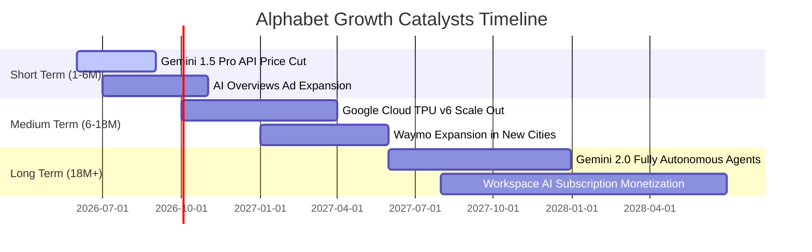

### 8.2 TAM 市場規模分析

```
╔══════════════════════════════════════════════════════════════════╗
║                  Alphabet 目標市場規模 (TAM) 預測                ║
╠══════════════════════════════════════════════════════════════════╣
║                                                                  ║
║  1. 全球數位廣告市場 (TAM 2028: $850B)                           ║
║     ├── Google 當前份額：~28%                                    ║
║     └── 預期驅動力：AI 精準投放、YouTube Shorts 短影音變現。     ║
║                                                                  ║
║  2. 公有雲與企業級 AI (TAM 2028: $1.2T)                          ║
║     ├── Google 當前份額：~11%                                    ║
║     └── 預期驅動力：Gemini 企業級部署、MaaS (模型即服務) 爆發。  ║
║                                                                  ║
║  3. 自動駕駛與 Robotaxi (TAM 2030: $250B)                        ║
║     ├── Waymo 當前份額：領先者 (但營收佔比極小)                  ║
║