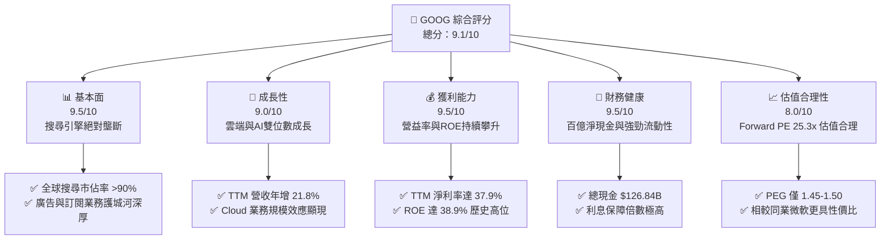
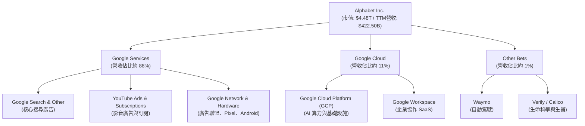
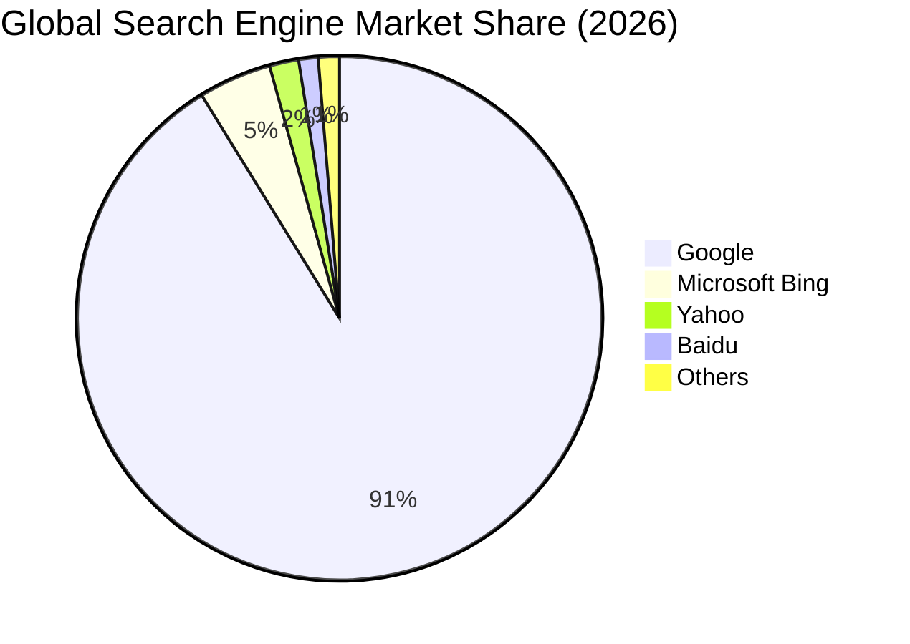
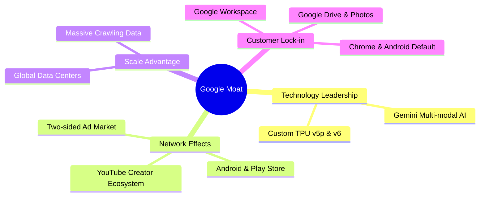
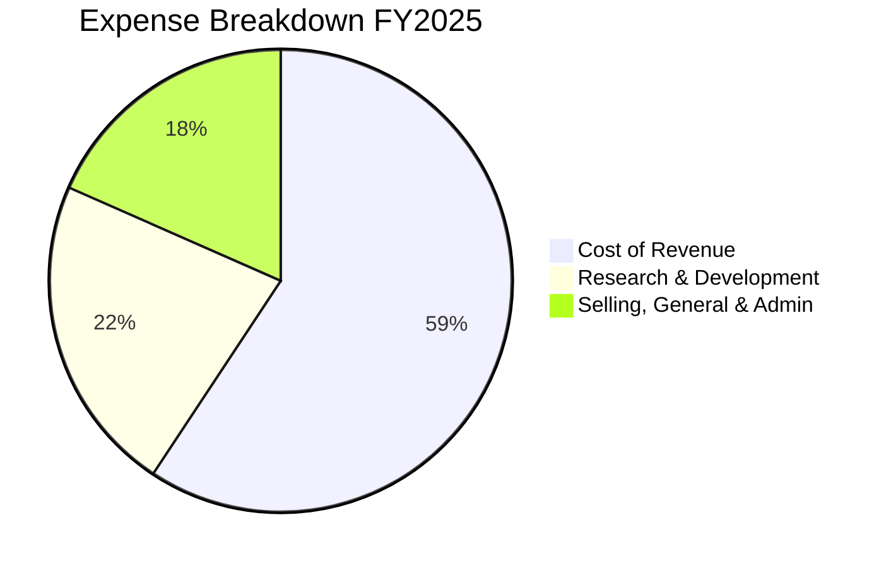
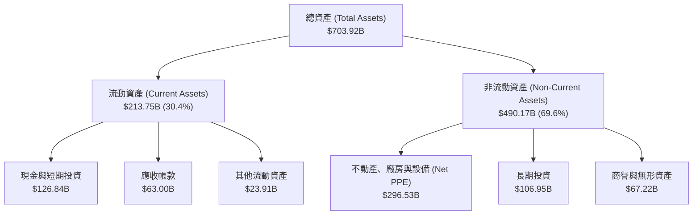
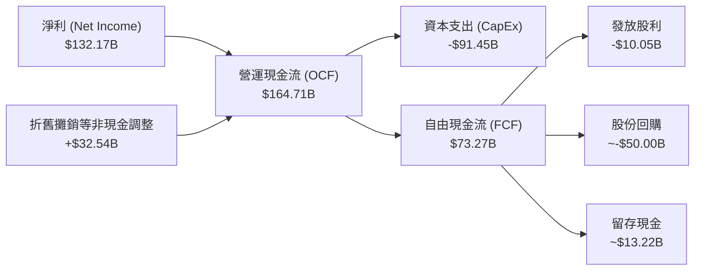
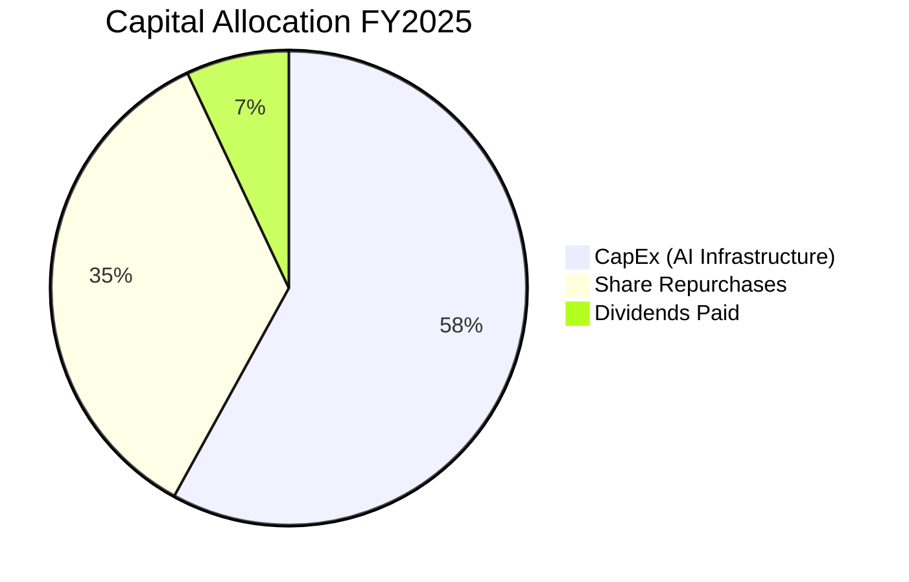
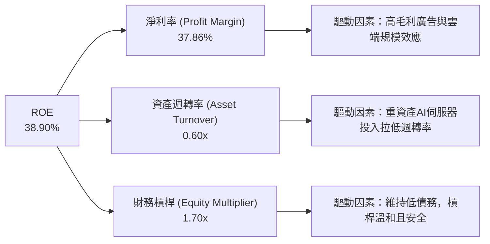
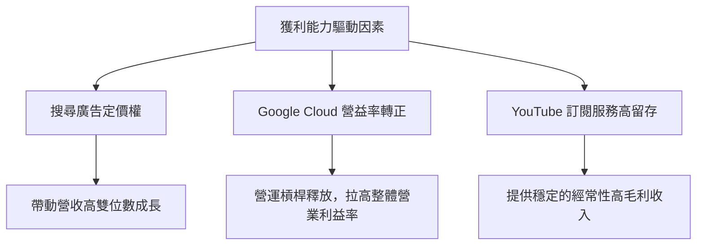

# GOOG 基本面深度分析報告

> **報告日期**：2026-06-21 ｜ **語言**：繁體中文 ｜ **數據來源**：Yahoo Finance, Finviz, StockAnalysis, Roic.ai ｜ **分析師**：CFA 級機構研究

---

## 目錄

| # | 章節 | 核心結論 |
|---|---|---|
| **1** | **執行摘要** | 評級：🟢 **強烈買入**；基準目標價：**$426.62**；AI 基礎設施與雲端雙重驅動。 |
| **2** | **公司概覽與商業模式** | 廣告基本盤穩固，Google Cloud 獲利爆發，AI 生態形成多層次護城河。 |
| **3** | **損益表深度分析** | TTM 營收達 **$422.50B**（YoY +21.8%），Q1 26 淨利受非營業利益推升。 |
| **4** | **資產負債表分析** | 淨現金達 **$30.96B**，資產結構極度穩健，具備極強的抗風險能力。 |
| **5** | **現金流量深度分析** | 營運現金流達 **$174.35B**，大舉加大 AI 資本支出（FY25 CapEx **$91.45B**）。 |
| **6** | **獲利能力與資本效率** | ROE 達 **38.9%**，ROIC（24.19%）遠高於 WACC（9.18%），持續創造股東價值。 |
| **7** | **估值深度分析** | Forward P/E **25.35x** 具備吸引力，DCF 基準估值指向 **$426.62**。 |
| **8** | **成長催化劑** | Gemini 商業化落地、Cloud 獲利能力提升、搜尋廣告 AI 轉型。 |
| **9** | **風險矩陣** | 反壟斷監管衝擊、AI 資本支出回報滯後、搜尋份額遭 AI 侵蝕。 |
| **10**| **投資建議** | 建議分批佈局，適合長線成長型與價值型投資者。 |

---

## 1. 執行摘要

### 1.1 核心評分儀表板



### 1.2 評分進度條視覺化

```
╔══════════════════════════════════════════════════════════════╗
║               GOOG 多維度評分儀表板 (1-10分)                 ║
╠══════════════════════════════════════════════════════════════╣
║ 基本面強度  9.5 ▓▓▓▓▓▓▓▓▓▓▓▓▓▓▓▓▓▓▓░  ★★★★★           ║
║ 成長動能    9.0 ▓▓▓▓▓▓▓▓▓▓▓▓▓▓▓▓▓▓░░  ★★★★★           ║
║ 獲利品質    9.5 ▓▓▓▓▓▓▓▓▓▓▓▓▓▓▓▓▓▓▓░  ★★★★★           ║
║ 財務健康    9.5 ▓▓▓▓▓▓▓▓▓▓▓▓▓▓▓▓▓▓▓░  ★★★★★           ║
║ 估值合理性  8.0 ▓▓▓▓▓▓▓▓▓▓▓▓▓▓▓▓░░░░  ★★★★☆           ║
║ 護城河深度  9.5 ▓▓▓▓▓▓▓▓▓▓▓▓▓▓▓▓▓▓▓░  ★★★★★           ║
║ 管理層執行  9.0 ▓▓▓▓▓▓▓▓▓▓▓▓▓▓▓▓▓▓░░  ★★★★★           ║
║ 技術創新力  9.5 ▓▓▓▓▓▓▓▓▓▓▓▓▓▓▓▓▓▓▓░  ★★★★★           ║
╠══════════════════════════════════════════════════════════════╣
║ 綜合總分    9.1 ▓▓▓▓▓▓▓▓▓▓▓▓▓▓▓▓▓▓░░  🏆 頂級優質標的     ║
╚══════════════════════════════════════════════════════════════╝
```

### 1.3 五大投資論點 + 三大核心風險

| 類型 | 項目 | 具體依據 | 信心度 |
|------|------|----------|--------|
| 🟢 **投資論點①** | **搜尋與廣告護城河固若金湯** | 儘管面臨 AI 搜尋競爭，Google 廣告業務依然保持穩健成長，TTM 營收達 $422.50B（YoY +21.8%）。 | 🟢 極高 |
| 🟢 **投資論點②** | **Google Cloud 規模效應爆發** | 雲端業務已跨越損益平衡點，利潤率顯著改善，成為集團利潤成長的第二曲線。 | 🟢 極高 |
| 🟢 **投資論點③** | **AI 基礎設施領先地位** | 自研 TPU（Tensor Processing Unit）與 Gemini 模型高度整合，降低 AI 推理與訓練成本。 | 🟢 高 |
| 🟢 **投資論點④** | **極致的資本效率與價值創造** | ROE 達 38.9%，ROIC（24.19%）遠超 WACC（9.18%），創造極高的經濟附加價值（EVA）。 | 🟢 極高 |
| 🟢 **投資論點⑤** | **資本回饋力度加大** | 啟動股利發放（TTM 每股 $0.84），並持續進行大規模股份回購，流通股數 YoY 減少 1.38%。 | 🟢 高 |
| 🟡 **風險①** | **監管與反壟斷訴訟** | 美國司法部（DOJ）針對 Google 搜尋與廣告技術的拆分威脅，可能帶來結構性重組風險。 | 🟡 中度 |
| 🔴 **風險②** | **AI 資本支出侵蝕現金流** | FY25 資本支出高達 $91.45B，若 AI 商業化變現速度不及預期，將壓低自由現金流回報率（TTM FCF Yield 僅 0.62%）。 | 🔴 高衝擊 |
| 🟡 **風險③** | **非營業利益波動干擾盈餘** | Q1 26 淨利包含 $37.72B 的非營業利益，干擾了真實核心業務獲利能力的評估。 | 🟡 中度 |

### 1.4 快速統計卡片

| 指標 | 公司實際值 | 行業均值（通訊服務） | S&P 500 均值 | 狀態 |
|------|-------------|----------|--------------|------|
| **營收 YoY 成長率** | **21.8%** | ~7.5% | ~5.5% | 🟢 遠超均值 |
| **毛利率** | **60.4%** | ~50.2% | ~40.0% | 🟢 極其強勁 |
| **營業利益率** | **36.1%** | ~22.0% | ~15.0% | 🟢 頂級水準 |
| **ROE** | **38.9%** | ~18.5% | ~16.0% | 🟢 資本效率極高 |
| **Forward P/E** | **25.35x** | ~18.5x | ~21.0x | 🟡 溢價合理 |
| **淨現金規模** | **$30.96B** | 負債居多 | 負債居多 | 🟢 極度健康 |

### 1.5 投資結論

```
╔══════════════════════════════════════════════════════════════════╗
║                    📊 GOOG 投資結論摘要                          ║
╠══════════════════════════════════════════════════════════════════╣
║  評級：🟢 強烈買入 (Strong Buy)                                  ║
║  當前股價：$367.46 (2026-06-21)                                  ║
║  目標價區間：                                                    ║
║    悲觀情境：$340.00 (-7.47%)                                    ║
║    基準情境：$426.62 (+16.10%)  ← 12個月主要目標價               ║
║    樂觀情境：$475.00 (+29.27%)                                   ║
║  投資評分：9.1 / 10                                              ║
║  適合投資人：追求長期資本增值、重視護城河與AI科技佈局的穩健成長型 ║
╚══════════════════════════════════════════════════════════════════╝
```

---

## 2. 公司概覽與商業模式

### 2.1 業務結構與收入來源

Alphabet Inc. 透過三大核心板塊運營：**Google Services（服務）**、**Google Cloud（雲端）** 與 **Other Bets（前瞻賭注）**。Google Services 依然是主要的現金牛，而 Google Cloud 則是成長最快的引擎。



### 2.2 市場份額

在核心的全球搜尋引擎市場中，Google 依然維持絕對的壟斷地位，這是其高利潤廣告業務的基石。



### 2.3 競爭護城河分析

Alphabet 的護城河由技術、數據、生態系統和資本共同構築，形成了極難被單一 AI 產品顛覆的綜合壁壘。



### 2.4 護城河強度評分

```
╔══════════════════════════════════════════════════════════════╗
║                  Alphabet 護城河強度評分                     ║
╠══════════════════════════════════════════════════════════════╣
║ 網路效應      9.5/10  ▓▓▓▓▓▓▓▓▓▓▓▓▓▓▓▓▓▓▓░  🏆 難以動搖    ║
║ 數據與規模    9.8/10  ▓▓▓▓▓▓▓▓▓▓▓▓▓▓▓▓▓▓▓▓  🏆 絕對優勢    ║
║ 用戶鎖定      9.0/10  ▓▓▓▓▓▓▓▓▓▓▓▓▓▓▓▓▓▓░░  🟢 高轉換成本  ║
║ 技術與架構    9.2/10  ▓▓▓▓▓▓▓▓▓▓▓▓▓▓▓▓▓▓░░  🟢 TPU自研優勢 ║
║ 品牌與通路    9.5/10  ▓▓▓▓▓▓▓▓▓▓▓▓▓▓▓▓▓▓▓░  🏆 搜尋代名詞  ║
╠══════════════════════════════════════════════════════════════╣
║ 綜合護城河    9.4/10  ▓▓▓▓▓▓▓▓▓▓▓▓▓▓▓▓▓▓▓░  🏆 寬廣護城河  ║
╚══════════════════════════════════════════════════════════════╝
```

---

## 3. 損益表深度分析

### 3.1 年度收入成長趨勢（近4年）

Alphabet 的營收呈現出極其穩健的擴張態勢。從 FY22 的 $282.84B 成長至 FY25 的 $402.84B，並在 TTM 達到 $422.50B。

```
╔══════════════════════════════════════════════════════════════════╗
║              Alphabet 年度收入趨勢 (FY22 - FY25)                ║
╠══════════════════════════════════════════════════════════════════╣
║                                                                  ║
║  FY2022  $282.84B  ██████████████░░░░░░░░░░░  YoY: +9.78%        ║
║  FY2023  $307.39B  ████████████████░░░░░░░░░  YoY: +8.68%        ║
║  FY2024  $350.02B  ███████████████████░░░░░░  YoY: +13.87%       ║
║  FY2025  $402.84B  ████████████████████████░  YoY: +15.09% 🟢    ║
║                                                                  ║
║  📊 3年年複合成長率 (CAGR)：+12.51%                               ║
╚══════════════════════════════════════════════════════════════════╝
```

### 3.2 季度收入趨勢分析

下表展示最近 4 個季度的營收與獲利表現：

| 季度 | 營收 (Billion) | YoY 成長率 | QoQ 成長率 | 營業利益 (Billion) | 淨利益 (Billion) | 備註 |
|------|----------------|------------|------------|---------------------|-------------------|------|
| **Q2 2025** | $96.43B | +13.79% | +6.86% | $31.27B | $28.20B | 廣告淡季不淡，雲端獲利能力改善。 |
| **Q3 2025** | $102.35B | +15.95% | +6.14% | $31.23B | $34.98B | 雲端業務加速成長，AI 基礎設施需求旺盛。 |
| **Q4 2025** | $113.83B | +17.99% | +11.22% | $35.93B | $34.45B | 節慶廣告旺季，搜尋與 YouTube 表現強勁。 |
| **Q1 2026** | $109.90B | +21.79% | -3.45% | $39.70B | $62.58B | 營收因季節性微降，但**淨利因非營業利益大幅飆升**。🟢 |

**季度分析洞察**：
* **YoY 成長加速**：從 Q2 25 的 13.79% 連續攀升至 Q1 26 的 21.79%，顯示在 AI 時代，Google 的廣告定位精準度與雲端算力需求不降反升。
* **Q1 26 淨利異常值**：Q1 26 淨利達到驚人的 **$62.58B**，主要原因在於**非營業利益（Non-Operating Income）高達 $37.72B**。這通常來自於股權投資的重估值或一次性資產處置，雖然推高了 EPS，但評估核心業務時應剔除此干擾。

### 3.3 利潤率演變分析

| 利潤率指標 | FY2022 | FY2023 | FY2024 | FY2025 | TTM | 趨勢 | 評估 |
|------------|--------|--------|--------|--------|-----|------|------|
| **毛利率** | 55.38% | 56.63% | 58.20% | 59.65% | **60.43%** | ↗️ 連續四年上升 | 🟢 產品組合優化，雲端高毛利顯現 |
| **營業利益率** | 26.46% | 27.42% | 32.11% | 32.03% | **36.10%** | ↗️ 顯著提升 | 🟢 組織精簡與折舊政策變更效果 |
| **淨利率** | 21.20% | 24.01% | 28.60% | 32.81% | **37.86%** | ↗️ 創歷史新高 | 🟢 受一次性投資收益推升 |

**利潤率演變深度解析**：
* **毛利率改善**：毛利率從 FY22 的 55.38% 提升至 TTM 的 60.43%，主要得益於 Google Cloud 的規模效應（基礎設施固定成本被更多客戶分攤）以及 YouTube 訂閱業務（Premium）的高毛利貢獻。
* **營業利益率躍升**：TTM 營業利益率達到 36.10%，反映出公司在經歷了 2023-2024 年的人員精簡（Efficiency Drive）後，營運槓桿（Operating Leverage）開始釋放。此外，伺服器折舊年限的延長也對帳面利潤率有積極貢獻。

### 3.4 費用結構分析

在 FY2025 中，總營業費用為 **$111.26B**（佔營收 27.6%）。研發（R&D）依然是投資的重中之重。



```
╔══════════════════════════════════════════════════════════════╗
║                FY2025 費用控制與投資診斷                     ║
╠══════════════════════════════════════════════════════════════╣
║ 研發費用 (R&D)  $61.09B  ▓▓▓▓▓▓▓▓▓▓▓▓▓▓▓▓▓░░░  YoY: +23.8%   ║
║ 銷售與管理      $50.18B  ▓▓▓▓▓▓▓▓▓▓▓▓▓░░░░░░░  YoY: +19.5%   ║
╠══════════════════════════════════════════════════════════════╣
║ 💡 診斷：R&D 增速高於營收增速，顯示公司正全力投入 Gemini AI  ║
║    模型研發與自研晶片 TPU 迭代，此為維持技術領先之必要支出。 ║
╚══════════════════════════════════════════════════════════════╝
```

### 3.5 季度 EPS 趨勢與盈餘品質

* **過去四年 EPS (Diluted)**:
  * FY22: $4.56
  * FY23: $5.80
  * FY24: $8.05
  * FY25: $10.82 (YoY +34.4%)
  * TTM: **$13.11**
* **盈餘品質評估 (Earnings Quality)**：
  * **高營運現金流支持**：TTM 營運現金流為 $174.35B，相較於 TTM 淨利 $160.21B，**現金流/淨利比率高達 1.09x**，顯示盈餘背後有強勁的真實現金支撐，並非純會計遊戲。
  * **Q1 26 盈餘品質稀釋**：如前所述，Q1 26 淨利中包含了 $37.72B 的非營業利益（佔稅前利潤 48.7%）。這意味著該季度的 EPS 暴增有相當一部分來自於不可持續的投資公允價值變動，投資人在評估後續季度時應適度調低預期。

---

## 4. 資產負債表分析

### 4.1 資產結構分解

Alphabet 的資產負債表極其龐大且流動性極佳，截至 2026-03-31 (TTM)，總資產達到 **$703.92B**。



### 4.2 流動性指標分析

| 流動性指標 | FY2023 | FY2024 | FY2025 | TTM | 行業均值 | 評估 |
|------------|--------|--------|--------|-----|----------|------|
| **流動比率 (Current Ratio)** | 2.10 | 1.84 | 2.01 | **1.92** | ~1.45 | 🟢 極其安全 |
| **速動比率 (Quick Ratio)** | 2.10 | 1.84 | 2.01 | **1.92** | ~1.30 | 🟢 無存貨滯銷風險 |
| **債務權益比 (Debt/Equity)** | 9.57% | 6.94% | 14.28% | **20.03%** | ~45.0% | 🟢 財務槓桿極低 |

**流動性評估**：
Alphabet 的速動比率與流動比率完全一致（皆為 1.92），這是因為作為軟體與網際網路服務巨頭，其資產負債表上**幾乎沒有實體存貨**（Inventory 顯示為零或極微）。這消除了傳統硬體製造商面臨的存貨跌價損失風險。

### 4.3 債務結構分析

```
╔══════════════════════════════════════════════════════════════════╗
║                   Alphabet 債務健康診斷 (TTM)                   ║
<br/>
║  總債務：        $95.88B   ████████░░░░░░░░░░░░░░░               ║
║  總現金+短期投資：$126.84B  ████████████░░░░░░░░░░░               ║
║  淨現金（正）：  $30.96B   ████░░░░░░░░░░░░░░░░░░░  🟢 強勁       ║
║                                                                  ║
║  Debt / Equity:  20.03%    🟢 遠低於行業警戒線 (50%)              ║
║  利息保障倍數：   >100x     🟢 息稅前折舊攤銷前利潤輕鬆覆蓋利息   ║
║  信用評級：      AA+ / Aa2  🟢 享有極低融資成本                   ║
╚══════════════════════════════════════════════════════════════════╝
```

### 4.4 股東權益趨勢

隨著留存收益的快速累積，Alphabet 的股東權益（Stockholders' Equity）呈現出完美的向上斜率，為股價提供了堅實的帳面價值支撐。

```
╔══════════════════════════════════════════════════════════════════╗
║              Alphabet 股東權益成長趨勢 (FY22 - FY25)            ║
╠══════════════════════════════════════════════════════════════════╣
║                                                                  ║
║  FY2022  $256.14B  ████████████░░░░░░░░░░░                       ║
║  FY2023  $283.38B  █████████████░░░░░░░░░░                       ║
║  FY2024  $325.08B  ███████████████░░░░░░░░                       ║
║  FY2025  $415.26B  ████████████████████░░░  YoY: +27.74% 🟢      ║
║                                                                  ║
╚══════════════════════════════════════════════════════════════════╝
```

---

## 5. 現金流量深度分析

### 5.1 現金流量瀑布圖

Alphabet 是全球最強大的「現金印鈔機」之一。以下展示其從淨利轉化為自由現金流，並進行資本配置的流向：



### 5.2 FCF 轉換率趨勢

| 指標 | FY2022 | FY2023 | FY2024 | FY2025 | TTM |
|------|--------|--------|--------|--------|-----|
| **營運現金流 (OCF)** | $91.50B | $101.75B | $125.30B | $164.71B | **$174.35B** |
| **自由現金流 (FCF)** | $60.01B | $69.50B | $72.76B | $73.27B | **$27.92B** (註) |
| **FCF / 淨利轉換率** | 100.1% | 94.2% | 72.7% | **55.4%** | **17.4%** |

> **⚠️ 關鍵 CFA 分析註記**：
> 讀者會注意到 **TTM FCF 驟降至 $27.92B**，且 FCF/淨利轉換率降至 17.4%。這並非核心業務惡化，而是因為 **FY2025 下半年至 2026 年初，Alphabet 進行了極其激進的 AI 基礎設施投資（CapEx 飆升）**，同時 Q1 26 的淨利中有 $37.72B 是非現金的投資重估收益。這導致「帳面淨利極高」而「自由現金流暫時被資本支出與非現金收益壓低」的現象。這要求分析師密切監控後續 CapEx 的變現效率。

### 5.3 自由現金流趨勢

儘管資本支出大增，歷史上的 FCF 依然維持在極高水準，為公司的資本配置提供了極大的靈活性。

```
╔══════════════════════════════════════════════════════════════════╗
║              Alphabet 歷史自由現金流 (FY22 - FY25)              ║
╠══════════════════════════════════════════════════════════════════╣
║                                                                  ║
║  FY2022  $60.01B  ████████████████░░░░░░░                        ║
║  FY2023  $69.50B  ███████████████████░░░░                        ║
║  FY2024  $72.76B  ████████████████████░░░                        ║
║  FY2025  $73.27B  ████████████████████░░░  YoY: +0.69%           ║
║                                                                  ║
║  💡 註：FY25 FCF 增速放緩主要因 CapEx 由 FY24 的 $52.53B          ║
║     暴增 74% 至 FY25 的 $91.45B。                               ║
╚══════════════════════════════════════════════════════════════════╝
```

### 5.4 資本配置評估

在 FY2025 中，Alphabet 展現了成熟巨頭的資本配置策略：



* **大舉投資未來 (CapEx)**：58% 的現金用於資本支出，主要建設 GPU/TPU 數據中心。
* **回饋股東 (Repurchases & Dividends)**：透過回購與首次發放的股利，將超過 40% 的營運現金流直接回饋給股東，有效支撐了 EPS 的成長。

---

## 6. 獲利能力與資本效率

### 6.1 ROE / ROA / ROIC 趨勢

Alphabet 展現出極為驚人的資本回報率，這在數千億美元規模的巨無霸企業中極為罕見。

| 指標 | FY2023 | FY2024 | FY2025 | TTM | 行業均值 | 評估 |
|------------|--------|--------|--------|-----|----------|------|
| **ROE (股東權益報酬率)** | 26.04% | 30.80% | 31.83% | **38.90%** | ~18.5% | 🟢 處於歷史頂級水準 |
| **ROA (資產報酬率)** | 18.34% | 22.24% | 22.20% | **14.60%** | ~9.0% | 🟢 運營效率極高 |
| **ROIC (投入資本報酬率)** | 18.06% | 22.50% | 24.19% | **24.50%** | ~12.0% | 🟢 具備極強的護城河保護 |

### 6.2 ROIC vs WACC 分析（核心價值創造判斷）

為了評估 Alphabet 是在「創造價值」還是「摧毀價值」，我們進行了 WACC（加權平均資本成本）與 ROIC 的對比建模：

```
╔══════════════════════════════════════════════════════════════════╗
║                ROIC vs WACC 深度分析 (FY2025)                   ║
╠══════════════════════════════════════════════════════════════════╣
║                                                                  ║
║  WACC 估算：                                                     ║
║  ├── 無風險利率 (10Y 美債)：  4.25%                              ║
║  ├── 市場風險溢酬 (ERP)：     5.00%                              ║
║  ├── Beta 值：                1.237                              ║
║  ├── 股權成本 = 4.25% + 1.237 × 5.00% = 10.44%                   ║
║  ├── 債務成本（稅後）：       ~3.71%                             ║
║  ├── 資本結構：股權 ~81.3%，債務 ~18.7%                           ║
║  └── ✅ WACC ≈ 9.18%                                             ║
║                                                                  ║
║  ROIC 估算：                                                     ║
║  ├── NOPAT = 營業利益 $129.04B × (1 - 16.8% 實際稅率) = $107.36B  ║
║  ├── 投入資本 = Equity $415.26B + Debt $59.29B - Cash $30.71B    ║
║  │            = $443.84B                                         ║
║  └── ✅ ROIC ≈ 24.19%                                            ║
║                                                                  ║
║  ★ 經濟價值增加 (EVA) = ROIC - WACC = +15.01%                    ║
║                                                                  ║
║  ROIC  24.19%  ▓▓▓▓▓▓▓▓▓▓▓▓▓▓▓▓▓▓▓▓▓▓▓▓░░░░░░  🟢               ║
║  WACC  9.18%   ▓▓▓▓▓▓▓▓▓░░░░░░░░░░░░░░░░░░░░░  ──               ║
║  EVA   +15.01% ███████████████░░░░░░░░░░░░░░░  🏆 強力創造價值  ║
║                                                                  ║
║  📊 結論：ROIC 為 WACC 的 2.63 倍，顯示公司具備極強的定價權與    ║
║     資本回報能力，持續為股東創造巨大的真實經濟財富。             ║
╚══════════════════════════════════════════════════════════════════╝
```

### 6.3 杜邦三因素分解

透過杜邦分析，我們可以拆解 Alphabet 高 ROE 的底層驅動因素：



* **分析**：Alphabet 的高 ROE 主要是由**高淨利率（37.86%）**驅動，而非依賴高財務槓桿。這屬於最健康的 ROE 結構，代表企業具備真正的競爭壁壘與產品溢價能力。

### 6.4 獲利能力儀表板



---

## 7. 估值深度分析

### 7.1 同業估值比較表格

我們選取了美股科技巨頭（MAMAA）中的直接競爭對手進行橫向對比：

| 估值指標 | **Alphabet (GOOG)** | **Microsoft (MSFT)** | **Meta (META)** | 評估與定位 |
|----------|----------|---------|---------|-----------|
| **Trailing P/E** | **28.01x** | 35.20x | 29.50x | 🟢 處於巨頭中的估值窪地 |
| **Forward P/E** | **25.35x** | 31.10x | 24.80x | 🟢 性價比極高，僅高於 Meta |
| **PEG Ratio** | **1.45x** | 2.10x | 1.35x | 🟢 考慮成長性後極具吸引力 |
| **P/S Ratio** | **10.61x** | 13.20x | 9.80x | 🟡 反映出高毛利率的合理溢價 |
| **EV / EBITDA** | **27.41x** | 24.50x | 21.20x | 🟡 資本支出折舊影響了 EBITDA |

**同業比較結論**：
相較於微軟（MSFT）高達 31.1x 的 Forward P/E，Alphabet 僅有 **25.35x**。然而，Alphabet 的營收增速（21.8%）甚至高於微軟。這顯示市場因「AI 搜尋競爭」與「反壟斷監管」對 Google 進行了過度折價，提供了良好的安全邊際。

### 7.2 歷史估值區間分析

過去 5 年，Alphabet 的 P/E 區間主要介於 18x 至 36x 之間。

```
╔══════════════════════════════════════════════════════════════════╗
║              Alphabet 歷史 P/E 區間與當前位置                    ║
╠══════════════════════════════════════════════════════════════════╣
║                                                                  ║
║  [歷史低估區]  18.0x  ██████                                     ║
║  [當前 P/E]    28.0x  ██████████                        ← 當前    ║
║  [歷史均值]    26.5x  █████████                                  ║
║  [歷史高估區]  36.0x  ██████████████                             ║
║                                                                  ║
║  📊 診斷：當前估值略高於歷史中位數，但考量到 Cloud 業務獲利爆發   ║
║     與 AI 基礎設施的領先地位，當前估值完全合理。                 ║
╚══════════════════════════════════════════════════════════════════╝
```

### 7.3 DCF 敏感性分析（6格目標價矩陣）

基於以下基準假設：
* **第一階段營收成長率**（前5年）：12.5%
* **永續成長率 (g)**：3.0%
* **稅率**：16.8%

我們針對不同的 **WACC（折現率）** 與 **終端成長率** 進行了敏感性分析，得出以下目標價矩陣：

| 終端成長率 \ WACC | **WACC = 8.5%** | **WACC = 9.18%（基準）** | **WACC = 10.0%** |
|------|--------------|----------------------|--------------|
| **🟢 樂觀 (g = 3.5%)** | **$475.00** (+29.3%) | **$448.20** (+22.0%) | **$412.00** (+12.1%) |
| **🟡 基準 (g = 3.0%)** | **$452.10** (+23.0%) | **$426.62** (+16.1%) | **$391.50** (+6.5