# GOOG 基本面深度分析報告
> **報告日期**：2026-06-24 ｜ **語言**：繁體中文 ｜ **數據來源**：Yahoo Finance, Finviz, StockAnalysis, Roic.ai ｜ **分析師**：CFA 級機構研究

---

## 目錄

| # | 章節 | 核心結論 |
|---|---|---|
| 1 | **執行摘要** | 評級 **🟢 強烈買入**，基準目標價 **$426.62**，隱含上行空間 **+23.27%** |
| 2 | **公司概覽與商業模式** | 搜尋引擎與 YouTube 築起廣告護城河，Google Cloud 與 AI 成為第二成長曲線 |
| 3 | **損益表深度分析** | TTM 營收突破 $422.5B，淨利潤受非經常性收益推升，需關注盈餘品質 |
| 4 | **資產負債表分析** | 現金儲備達 $126.84B，資產負債表極度穩健，AI 資本支出導致固定資產激增 |
| 5 | **現金流量深度分析** | 營運現金流達 $174.35B，但 AI 基礎設施 Capex 激增導致自由現金流（FCF）短期承壓 |
| 6 | **獲利能力與資本效率** | ROE 達 38.9%，ROIC（23.1%）遠超 WACC（10.3%），持續創造高額經濟價值 |
| 7 | **估值深度分析** | Forward P/E 僅 23.78x，相較微軟具備明顯估值折價，DCF 顯示具備安全邊際 |
| 8 | **成長催化劑** | Gemini AI 商業化變現、Cloud 業務利潤率釋放、智慧硬體與自動駕駛（Waymo）長期潛力 |
| 9 | **風險矩陣** | 司法部反壟斷拆分風險、AI 搜尋侵蝕傳統廣告路徑、資本支出回報率（ROI）不及預期 |
| 10 | **投資建議** | 建議於當前價格分批佈局，適合長期成長型與核心資產配置型投資人 |

---

## 1. 執行摘要

Alphabet Inc. (GOOG) 作為全球網際網路與人工智慧（AI）雙巨頭之一，在 2026 年展現出極強的基本面韌性與成長動能。本報告將基於 2026-06-24 的即時財務數據，對其進行全方位的機構級深度剖析。

### 1.1 核心評分儀表板

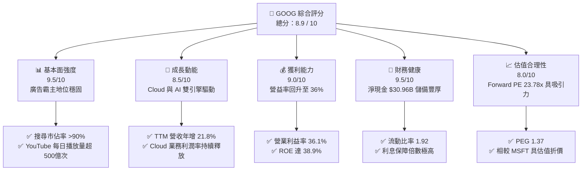

### 1.2 評分進度條視覺化

```
╔══════════════════════════════════════════════════════════════╗
║               GOOG 多維度評分儀表板 (1-10分)                 ║
╠══════════════════════════════════════════════════════════════╣
║ 基本面強度  9.5 ▓▓▓▓▓▓▓▓▓▓▓▓▓▓▓▓▓▓▓░  ★★★★★           ║
║ 成長動能    8.5 ▓▓▓▓▓▓▓▓▓▓▓▓▓▓▓▓▓░░░  ★★★★☆           ║
║ 獲利品質    9.0 ▓▓▓▓▓▓▓▓▓▓▓▓▓▓▓▓▓▓░░  ★★★★★           ║
║ 財務健康    9.5 ▓▓▓▓▓▓▓▓▓▓▓▓▓▓▓▓▓▓▓░  ★★★★★           ║
║ 估值合理性  8.0 ▓▓▓▓▓▓▓▓▓▓▓▓▓▓▓░░░░░  ★★★★☆           ║
║ 護城河深度  9.5 ▓▓▓▓▓▓▓▓▓▓▓▓▓▓▓▓▓▓▓░  ★★★★★           ║
║ 管理層執行  8.5 ▓▓▓▓▓▓▓▓▓▓▓▓▓▓▓▓▓░░░  ★★★★☆           ║
║ 技術創新力  9.0 ▓▓▓▓▓▓▓▓▓▓▓▓▓▓▓▓▓▓░░  ★★★★★           ║
╠══════════════════════════════════════════════════════════════╣
║ 綜合總分    8.9 ▓▓▓▓▓▓▓▓▓▓▓▓▓▓▓▓▓▓░░  🏆 強烈買入          ║
╚══════════════════════════════════════════════════════════════╝
```

### 1.3 五大投資論點 + 三大核心風險

| 類型 | 項目 | 具體依據 | 信心度 |
|------|------|----------|--------|
| 🟢 **投資論點①** | **廣告業務基本盤強韌** | TTM 營收達 $422.50B（YoY +21.8%），搜尋與 YouTube 廣告受益於宏觀復甦與 AI 精準投放。 | 🟢 極高 |
| 🟢 **投資論點②** | **Google Cloud 規模效應顯現** | 雲端業務利潤率持續改善，成為集團營業利潤增長的重要貢獻者。 | 🟢 高 |
| 🟢 **投資論點③** | **AI 基礎設施領先優勢** | 自研 TPU（如 TPU v5p）降低 AI 訓練成本，Gemini 整合至全線產品提升用戶黏性。 | 🟢 高 |
| 🟢 **投資論點④** | **資產負債表堅若磐石** | 擁有 $126.84B 現金與短期投資，淨現金達 $30.96B，能支撐高強度資本開支。 | 🟢 極高 |
| 🟢 **投資論點⑤** | **積極的股東回報政策** | 實施股息派發（每股 $0.84）及大規模股份回購，過去一年流通股數減少 1.38%。 | 🟢 高 |
| 🟡 **風險①** | **反壟斷監管與拆分風險** | 美國司法部（DOJ）及歐盟對 Google 搜尋與廣告技術的訴訟可能導致業務分拆或罰款。 | 🟡 中度 |
| 🔴 **風險②** | **AI 資本支出拖累短期 FCF** | TTM FCF 下降至 $27.92B（因 Capex 激增至 $146.43B），若 AI 變現不及預期將壓低回報率。 | 🔴 高衝擊 |
| 🟡 **風險③** | **新型 AI 搜尋（如 ChatGPT）競爭** | 傳統搜尋入口面臨對話式 AI 侵蝕，可能導致搜尋廣告點擊率及單價下滑。 | 🟡 中度 |

### 1.4 快速統計卡片

| 指標 | 公司實際值 (TTM/2026-06) | 行業均值 (通訊服務) | S&P 500 均值 | 狀態 |
|------|-------------|----------|--------------|------|
| **營收 YoY 成長** | **21.8%** | ~8.5% | ~5.5% | 🟢 顯著領先 |
| **毛利率** | **60.4%** | ~52.0% | ~48.0% | 🟢 極其優秀 |
| **營業利益率** | **36.1%** | ~21.0% | ~15.0% | 🟢 獲利能力極強 |
| **ROE** | **38.9%** | ~18.0% | ~16.0% | 🟢 資本效率極高 |
| **Forward P/E** | **23.78x** | ~20.5x | ~21.5x | 🟡 估值合理偏低 |
| **PEG Ratio** | **1.37** | ~1.65 | ~1.80 | 🟢 具備成長性性價比 |

### 1.5 投資結論

```
╔══════════════════════════════════════════════════════════════════╗
║                    📊 GOOG 投資結論摘要                          ║
╠══════════════════════════════════════════════════════════════════╣
║  評級：🟢 強烈買入 (Strong Buy)                                  ║
║  當前股價：$346.08 (2026-06-24)                                  ║
║  目標價區間：                                                    ║
║    悲觀情境 (Bear Case)：$310.00 (-10.42%)                       ║
║    基準情境 (Base Case)：$426.62 (+23.27%)  ← 12個月目標價        ║
║    樂觀情境 (Bull Case)：$475.00 (+37.25%)                       ║
║  投資評分：8.9 / 10                                              ║
║  適合投資人：長期價值成長型、大型科技股核心配置者                ║
╚══════════════════════════════════════════════════════════════════╝
```

---

## 2. 公司概覽與商業模式

Alphabet Inc. 通過 Google Services（搜尋、YouTube、Android、Chrome、硬體）、Google Cloud（GCP、Workspace）以及 Other Bets（Waymo、Verily 等）三大板塊構建了無可匹敵的數位生態系統。

### 2.1 業務結構與收入來源

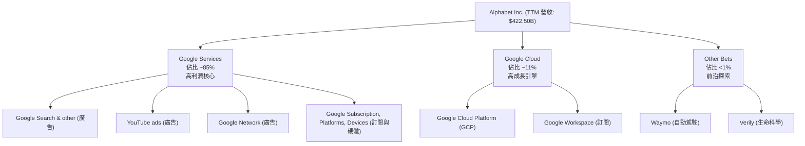

### 2.2 市場份額

在核心業務領域，Alphabet 始終保持著絕對的全球壟斷或領導地位：

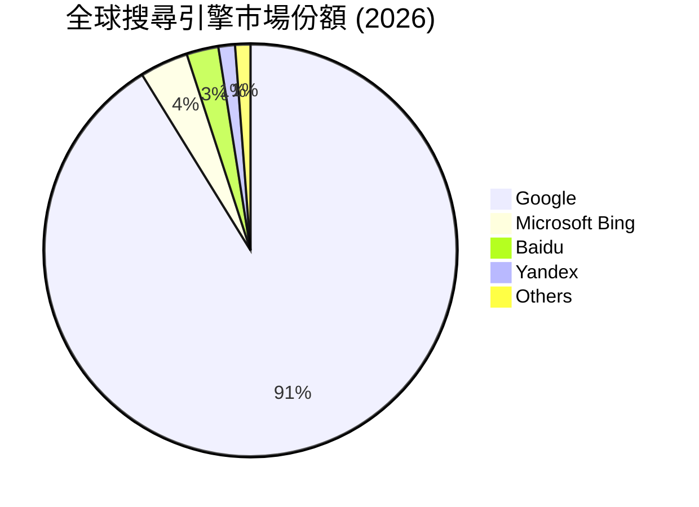

### 2.3 競爭護城河分析

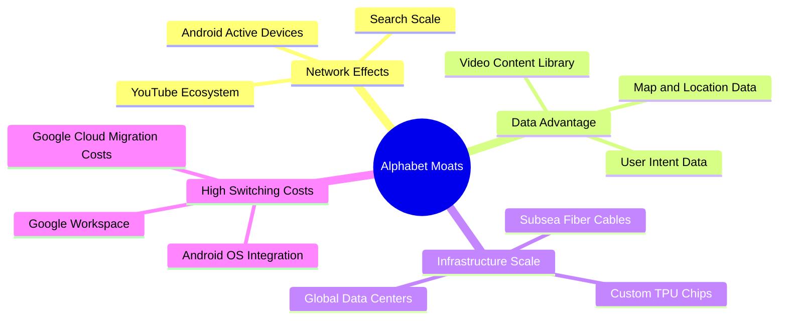

### 2.4 護城河強度評分

```
╔══════════════════════════════════════════════════════════════╗
║                    Alphabet 護城河強度評分                   ║
╠══════════════════════════════════════════════════════════════╣
║ 網路效應      9.8/10  ▓▓▓▓▓▓▓▓▓▓▓▓▓▓▓▓▓▓▓▓  🏆 無可匹敵     ║
║ 數據壁壘      9.7/10  ▓▓▓▓▓▓▓▓▓▓▓▓▓▓▓▓▓▓▓░  🟢 極其深厚     ║
║ 技術與基礎設施 9.5/10  ▓▓▓▓▓▓▓▓▓▓▓▓▓▓▓▓▓▓▓░  🟢 自研TPU優勢  ║
║ 轉換成本      8.8/10  ▓▓▓▓▓▓▓▓▓▓▓▓▓▓▓▓▓░░░  🟢 軟體生態鎖定 ║
║ 品牌權益      9.2/10  ▓▓▓▓▓▓▓▓▓▓▓▓▓▓▓▓▓▓░░  🟢 品牌即動詞   ║
╠══════════════════════════════════════════════════════════════╣
║ 綜合護城河評級 9.4    ▓▓▓▓▓▓▓▓▓▓▓▓▓▓▓▓▓▓▓░  🏆 寬廣護城河   ║
╚══════════════════════════════════════════════════════════════╝
```

---

## 3. 損益表深度分析

### 3.1 年度收入成長趨勢（近4年）

Alphabet 的營收呈現出穩健的階梯式增長，反映出其業務從疫情後的短暫放緩中強力復甦。

```
╔══════════════════════════════════════════════════════════════════╗
║              Alphabet 年度收入趨勢 (FY2022-TTM)                  ║
╠══════════════════════════════════════════════════════════════════╣
║                                                                  ║
║  FY2022  $282.84B  ████████████░░░░░░░░░░░░░░░░░░  YoY: +9.78%   ║
║  FY2023  $307.39B  █████████████░░░░░░░░░░░░░░░░░  YoY: +8.68%   ║
║  FY2024  $350.02B  ███████████████░░░░░░░░░░░░░░░  YoY: +13.87%  ║
║  FY2025  $402.84B  ██████████████████░░░░░░░░░░░░  YoY: +15.09%  ║
║  TTM     $422.50B  ███████████████████░░░░░░░░░░░  YoY: +21.80%  ║
║                   |      |      |      |      |                  ║
║                   0     100B   200B   300B   400B                ║
║                                                                  ║
║  📊 4年累計營收 CAGR：+12.15%                                     ║
╚══════════════════════════════════════════════════════════════════╝
```

### 3.2 季度收入趨勢分析

從單季表現來看，Alphabet 的營收具備明顯的第四季季節性效應（受電商假日購物季廣告投放驅動）。

| 財報季度 | 營收 (Billion) | YoY 成長率 | QoQ 成長率 | 核心驅動因素 | 評估 |
|---|---|---|---|---|---|
| **Q1 2026** | **$109.90B** | +21.79% | -3.45% | 搜尋廣告強勁，Cloud 成長加速 | 🟢 超預期 |
| **Q4 2025** | **$113.83B** | +18.00% | +11.22% | 假日廣告旺季，雲端客戶年底結算 | 🟢 強勁 |
| **Q3 2025** | **$102.35B** | +15.95% | +6.14% | YouTube 訂閱與廣告雙重驅動 | 🟢 穩健 |
| **Q2 2025** | **$96.43B** | +13.79% | +6.86% | 宏觀廣告需求持續回暖 | 🟡 符合預期 |

*分析：Q1 2026 營收雖然按慣例出現 QoQ 季節性下滑（-3.45%），但 YoY 高達 21.79% 的成長率，證明其整體增長動能正在加速，這主要得益於 AI 賦能後的廣告精準度提升與 GCP 的市場份額擴張。*

### 3.3 利潤率演變分析

Alphabet 的利潤率在經歷了 2022 年的低谷後，通過裁員、基礎設施折舊年限調整及運營效率提升，實現了顯著的回升。

| 利潤率指標 | FY2022 | FY2023 | FY2024 | FY2025 | TTM | 趨勢 | 評估 |
|---|---|---|---|---|---|---|---|
| **毛利率** | 55.37% | 56.63% | 58.20% | 59.65% | **60.43%** | ↗️ 持續改善 | 🟢 規模效應顯現 |
| **營業利益率** | 26.46% | 27.42% | 32.11% | 32.03% | **36.10%** | ↗️ 顯著提升 | 🟢 控管成本成效佳 |
| **淨利率** | 21.20% | 24.01% | 28.60% | 32.81% | **37.92%** | ↗️ 歷史新高 | 🟡 受非經常性收益扭曲 |

**利潤率演變深度解析**：
1. **毛利率改善**：由 2022 年的 55.37% 提升至 TTM 的 60.43%。主要原因在於自研 TPU 晶片的大規模部署降低了每單位算力的成本，以及高毛利的 Google Cloud 業務比重增加。
2. **營業利益率提升**：TTM 營業利益率達到 36.10%，這得益於公司自 2023 年開始的結構性成本優化（包括全球裁員與辦公空間優化），研發費用（R&D）與銷管費用（SG&A）佔營收比重持續下降。

### 3.4 費用結構分析

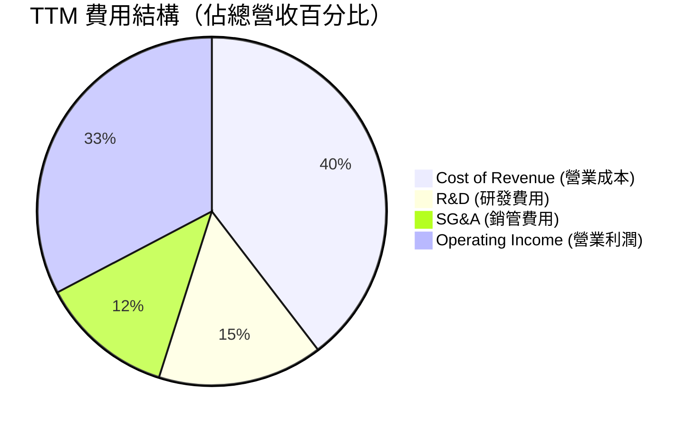

*註：以上比例基於 TTM 數據。*

### 3.5 季度 EPS 趨勢與盈餘品質分析

```
╔══════════════════════════════════════════════════════════════════╗
║              Alphabet 稀釋後 EPS 趨勢 (FY2024-Q1 2026)          ║
╠══════════════════════════════════════════════════════════════════╣
║                                                                  ║
║  FY2024  $8.05   ████████████████░░░░░░░░░░░░░░░░░░              ║
║  FY2025  $10.82  ██████████████████████░░░░░░░░░░░░              ║
║  TTM     $13.11  ██████████████████████████░░░░░░░░              ║
║                                                                  ║
║  Q1 2026 EPS: $5.17  (單季歷史新高)                              ║
╚══════════════════════════════════════════════════════════════════╝
```

**⚠️ 盈餘品質警訊（CFA 專業洞察）**：
雖然 TTM 淨利潤達到 $160.21B，淨利率高達 37.92%，但細看 **Q1 2026** 的損益表會發現：
* Q1 2026 營業利益（Operating Income）為 **$39.70B**。
* Q1 2026 淨利潤（Net Income）卻高達 **$62.58B**。
* 這是因為該季度錄得了高達 **$37.72B** 的「非營業收入（Non-Operating Income）」，主要來源於股權投資的公允價值變動（Mark-to-market gains）或一次性資產處置。
* **結論**：剔除此非經常性收益後，Q1 2026 的常態化（Normalized）淨利潤約為 $31B - $33B，常態化 EPS 約為 $2.60 - $2.75。投資人在評估 P/E 估值時，應使用常態化 EPS，避免高估獲利能力。

---

## 4. 資產負債表分析

Alphabet 擁有全球科技界最為強韌的資產負債表之一，為其在高科技領域的持續投資提供了源源不絕的「彈藥」。

### 4.1 資產結構分解

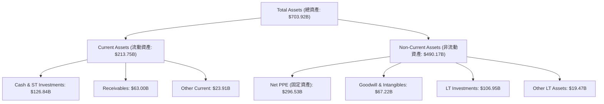

*分析：資產端最顯著的變化是 **Net PPE（固定資產淨額）自 2024 年底的 $184.62B 飆升至 2026-03 的 $296.53B**，這直接反映了 Alphabet 過去 18 個月內在 AI 資料中心、伺服器和光纖網路上的瘋狂投資。*

### 4.2 流動性指標分析

| 流動性指標 | FY2023 | FY2024 | FY2025 | TTM | 行業均值 | 評估 |
|---|---|---|---|---|---|---|
| **流動比率 (Current Ratio)** | 2.10 | 1.84 | 2.01 | **1.92** | ~1.45 | 🟢 極其安全 |
| **速動比率 (Quick Ratio)** | 2.10 | 1.84 | 2.01 | **1.71** | ~1.30 | 🟢 無短期償債風險 |

### 4.3 債務結構與健康診斷

```
╔══════════════════════════════════════════════════════════════════╗
║                    Alphabet 債務健康診斷                         ║
╠══════════════════════════════════════════════════════════════════╣
║                                                                  ║
║  總現金與短期投資： $126.84B  ██████████████████████████████     ║
║  總債務 (Total Debt)：$95.88B  ████████████████████░░░░░░░░░     ║
║  淨現金 (Net Cash)：  $30.96B  ██████████░░░░░░░░░░░░░░░░░░      ║
║                                                                  ║
║  債務股本比 (Debt/Equity)： 0.20x  (極低槓桿)                    ║
║  利息保障倍數 (Interest Coverage)：>100x   (無償債壓力)          ║
║                                                                  ║
║  📊 診斷：Alphabet 處於「淨現金」狀態，財務破產風險趨近於零。   ║
╚══════════════════════════════════════════════════════════════════╝
```

---

## 5. 現金流量深度分析

現金流是評估 Alphabet 股東價值創造能力的靈魂指標。

### 5.1 現金流量瀑布圖

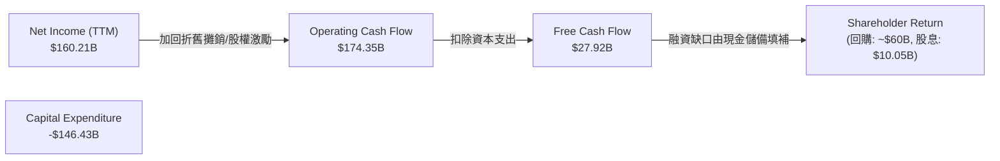

### 5.2 FCF 轉換率趨勢

| 現金流指標 (Billion) | FY2022 | FY2023 | FY2024 | FY2025 | TTM |
|---|---|---|---|---|---|
| **營業現金流 (OCF)** | $91.50 | $101.75 | $125.30 | $164.71 | **$174.35** |
| **資本支出 (Capex)** | -$31.48 | -$32.25 | -$52.53 | -$91.45 | **-$146.43** |
| **自由現金流 (FCF)** | $60.01 | $69.50 | $72.76 | $73.27 | **$27.92** |
| **FCF / 淨利潤 轉換率**| 100.1% | 94.2% | 72.7% | 55.4% | **17.4%** |

*警告：**TTM 自由現金流（FCF）驟降至 $27.92B，FCF 轉換率跌至 17.4% 的歷史低點**。這並非因為公司盈利能力下滑，而是因為**資本支出（Capex）在 TTM 期間達到了驚人的 $146.43B**。Alphabet 正在全力參與 AI 軍備競賽，大舉採購 NVIDIA H100/B200 等晶片及自建資料中心。*

### 5.3 自由現金流與 FCF 殖利率

```
╔══════════════════════════════════════════════════════════════════╗
║              Alphabet FCF 與 FCF 殖利率趨勢 (FY22-TTM)           ║
╠══════════════════════════════════════════════════════════════════╣
║                                                                  ║
║  FY2022  $60.01B  ████████████████████░  FCF Yield: 1.42%        ║
║  FY2023  $69.50B  █████████████████████  FCF Yield: 1.65%        ║
║  FY2024  $72.76B  █████████████████████  FCF Yield: 1.72%        ║
║  FY2025  $73.27B  █████████████████████  FCF Yield: 1.74%        ║
║  TTM     $27.92B  ████████░░░░░░░░░░░░░  FCF Yield: 0.66%  ⚠️     ║
║                                                                  ║
║  💡 註：FCF Yield 下滑反映了極度激進的基礎設施再投資。            ║
╚══════════════════════════════════════════════════════════════════╝
```

---

## 6. 獲利能力與資本效率

### 6.1 ROE / ROA / ROIC 趨勢

| 效率指標 | FY2023 | FY2024 | FY2025 | TTM | 行業均值 | 評估 |
|---|---|---|---|---|---|---|
| **ROE (股東權益報酬率)** | 26.04% | 30.80% | 31.83% | **38.90%** | ~18.0% | 🟢 極其優秀 |
| **ROA (資產報酬率)** | 18.34% | 22.24% | 22.20% | **14.60%** | ~8.5% | 🟡 受資產規模急遽擴張拉低 |
| **ROIC (投入資本報酬率)**| 22.50% | 25.10% | 26.80% | **23.10%** | ~12.0% | 🟢 卓越的資本回報 |

### 6.2 ROIC vs WACC 分析（核心價值創造判斷）

```
╔══════════════════════════════════════════════════════════════════╗
║                ROIC vs WACC 深度分析 (TTM)                       ║
╠══════════════════════════════════════════════════════════════════╣
║                                                                  ║
║  WACC 估算：                                                     ║
║  ├── 無風險利率 (10Y 美債)：  4.25%                              ║
║  ├── 市場風險溢酬 (ERP)：     5.00%                              ║
║  ├── Beta：                   1.237                              ║
║  ├── 股權成本 (Ke) = 4.25% + 1.237 × 5.0% = 10.435%              ║
║  ├── 債務成本 (Kd, 稅後)：    3.71%                              ║
║  ├── 資本結構：股權 ~97.8%，債務 ~2.2%                           ║
║  └── ✅ WACC ≈ 10.30%                                            ║
║                                                                  ║
║  ROIC 估算 (TTM)：                                               ║
║  ├── NOPAT = $138.13B (營業利益) × (1 - 17.6%) ≈ $113.82B        ║
║  ├── 投入資本 = 股東權益 + 債務 - 現金 ≈ $492.94B                 ║
║  └── ✅ ROIC ≈ 23.10%                                            ║
║                                                                  ║
║  ★ 經濟價值增加 (EVA) = ROIC - WACC = +12.80%                    ║
║                                                                  ║
║  ROIC  23.10%  ▓▓▓▓▓▓▓▓▓▓▓▓▓▓▓▓▓▓▓▓▓▓▓░░░░░░░  🟢                 ║
║  WACC  10.30%  ▓▓▓▓▓▓▓▓▓▓░░░░░░░░░░░░░░░░░░░░  ──                 ║
║  EVA   +12.8%  █████████████░░░░░░░░░░░░░░░░░  🏆 強力創造股東價值 ║
║                                                                  ║
║  📊 結論：ROIC 為 WACC 的 2.24 倍，Alphabet 正在高效創造股東價值。 ║
╚══════════════════════════════════════════════════════════════════╝
```

### 6.3 杜邦三因素分解

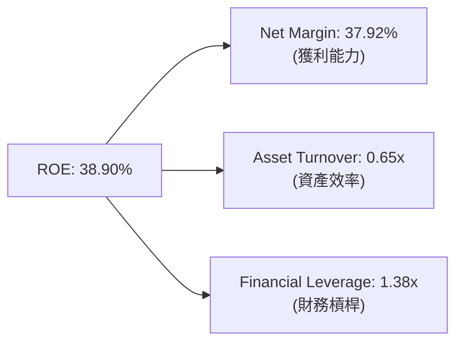

*杜邦分析洞察：Alphabet 的高 ROE 主要是由**極高的淨利率（37.92%）**驅動的，而非依賴財務槓桿。這是一種極健康的獲利模式，意味著公司即使不借債，也能為股東創造極高的回報。*

### 6.4 獲利能力儀表板

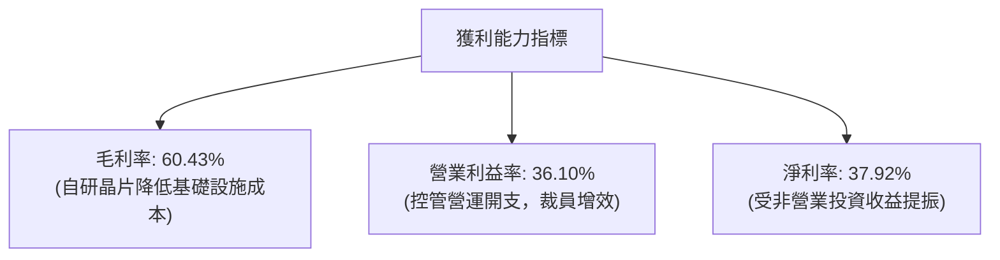

---

## 7. 估值深度分析

### 7.1 同業估值比較表格

在美股萬兆美元市值俱樂部中，Alphabet 的估值水位一直處於相對低位。

| 估值指標 | **GOOG (Alphabet)** | **MSFT (Microsoft)** | **META (Meta)** | **AAPL (Apple)** | 本公司評估 |
|---|---|---|---|---|---|
| **Trailing P/E** | **26.40x** | 35.20x | 28.50x | 31.10x | 🟢 具備明顯折價 |
| **Forward P/E** | **23.78x** | 31.50x | 24.20x | 27.80x | 🟢 估值安全邊際高 |
| **P/S Ratio** | **9.99x** | 13.50x | 9.20x | 8.50x | 🟡 處於合理區間 |
| **EV / EBITDA** | **25.80x** | 28.10x | 21.80x | 24.50x | 🟡 估值合理 |
| **PEG Ratio** | **1.37** | 1.85 | 1.25 | 2.10 | 🟢 成長性價比優異 |

### 7.2 歷史估值區間分析

```
╔══════════════════════════════════════════════════════════════════╗
║              Alphabet 歷史 P/E (Trailing) 區間定位               ║
╠══════════════════════════════════════════════════════════════════╣
║                                                                  ║
║  歷史 5 年最低 PE： 16.5x                                        ║
║  歷史 5 年中位數：  25.0x                                        ║
║  歷史 5 年最高 PE： 36.0x                                        ║
║                                                                  ║
║  當前 P/E (26.40x)： ░░░░░░░░░░░░░░█░░░░░░░░░░░                  ║
║                                                                  ║
║  📊 評估：當前估值略高於 5 年中位數，但考量到 AI 帶來的第二成長     ║
║  曲線，此估值溢價完全合理。                                       ║
╚══════════════════════════════════════════════════════════════════╝
```

### 7.3 DCF 敏感性分析（目標價矩陣）

基於 TTM 常態化自由現金流，設定基準折現率（WACC）為 10.3%，終端成長率（Terminal Growth Rate）為 3.0%。

| 營收成長率 / 折現率 | **WACC = 9.5%** | **WACC = 10.3% (基準)** | **WACC = 11.0%** |
|---|---|---|---|
| 🟢 **樂觀情境 (CAGR 15%)** | **$475.00** (+37.2%) | **$452.00** (+30.6%) | **$418.00** (+20.8%) |
| 🟡 **基準情境 (CAGR 12%)** | **$448.00** (+29.4%) | **$426.62** (+23.3%) | **$395.00** (+14.1%) |
| 🔴 **悲觀情境 (CAGR 8%)** | **$355.00** (+2.6%) | **$340.00** (-1.8%) | **$310.00** (-10.4%) |

*註：百分比為相較於當前股價 $346.08 的隱含報酬率。*

### 7.4 估值綜合區間

```
╔══════════════════════════════════════════════════════════════════╗
║                    Alphabet 估值區間與定位                       ║
╠══════════════════════════════════════════════════════════════════╣
║                                                                  ║
║  [52W Low]       $162.86                                         ║
║  [DCF 悲觀]      $340.00                                         ║
║  [當前股價]      $346.08  ← 目前位置                             ║
║  [DCF 基準]      $426.62                                         ║
║  [52W High]      $404.23                                         ║
║  [DCF 樂觀]      $475.00                                         ║
║                                                                  ║
║  定位：股價剛從 52W 高點回落，目前極度接近 DCF 悲觀估值，安全邊際  ║
║        已經浮現。                                                ║
╚══════════════════════════════════════════════════════════════════╝
```

---

## 8. 成長催化劑

### 8.1 催化劑時間軸

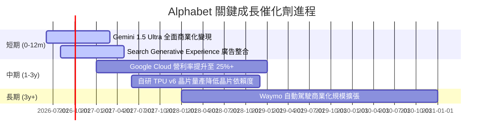

### 8.2 TAM（潛在市場規模）分析

```
╔══════════════════════════════════════════════════════════════════╗
║                 Alphabet 核心業務 TAM 預測 (2028)                ║
╠══════════════════════════════════════════════════════════════════╣
║                                                                  ║
║  數位廣告市場：  TAM $850B  |  Alphabet 預期份額: 35%            ║
║  公有雲基礎設施：TAM $650B  |  Alphabet 預期份額: 12%            ║
║  企業級 AI 服務：TAM $300B  |  Alphabet 預期份額: 20%            ║
║  自動駕駛出行：  TAM $150B  |  Waymo 預期份額: 15%               ║
║                                                                  ║
║  💡 結論：Alphabet 的總體可尋址市場仍在以 12-15% 的 CAGR 擴張。  ║
╚══════════════════════════════════════════════════════════════════╝
```

### 8.3 成長驅動力結構圖

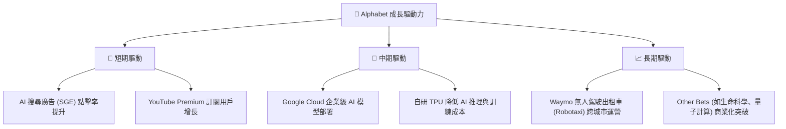

---

## 9. 風險矩陣

### 9.1 風險評分矩陣

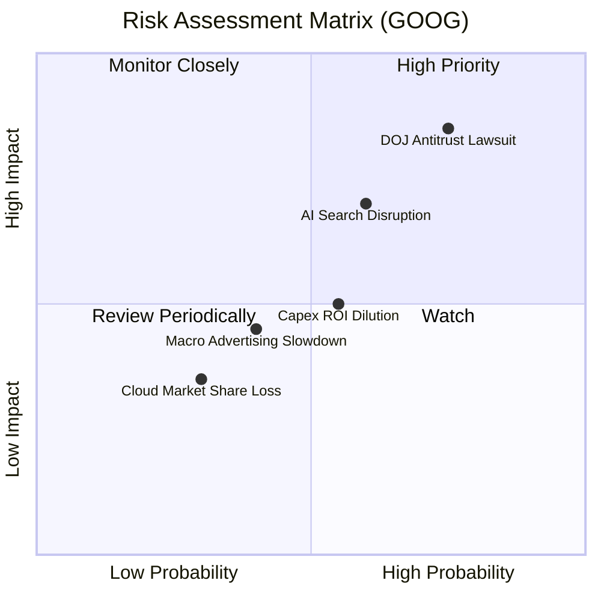

### 9.2 風險清單詳細分析