# GOOG 基本面深度分析報告
> **報告日期**：2026-06-27 ｜ **語言**：繁體中文 ｜ **數據來源**：Yahoo Finance, Finviz, StockAnalysis, Roic.ai ｜ **分析師**：CFA 級機構研究

## 目錄

| # | 章節 | 核心結論 |
|---|------------------------|--------------------------------------------------------------------------------------------------------------------|
| 1 | 執行摘要 | 🟢 買入評級，目標價區間 $310 - $410，綜合評分 8.5/10。 |
| 2 | 公司概覽與商業模式 | 憑藉技術、網路效應和規模經濟建立深厚護城河。 |
| 3 | 損益表深度分析 | 營收與淨利潤強勁增長，利潤率持續擴張。 |
| 4 | 資產負債表分析 | 資產結構穩健，現金充裕，債務風險低。 |
| 5 | 現金流量深度分析 | 自由現金流產生能力強勁，資本配置靈活高效。 |
| 6 | 獲利能力與資本效率 | ROIC 遠超 WACC，持續為股東創造價值。 |
| 7 | 估值深度分析 | 當前估值相對合理，DCF 顯示潛在上漲空間。 |
| 8 | 成長催化劑 | AI 技術領先、雲業務擴張、YouTube 變現能力增強是主要驅動力。 |
| 9 | 風險矩陣 | 監管壓力、競爭加劇、廣告市場波動為主要風險。 |
| 10 | 投資建議 | 建議買入，適合成長型與長線投資者。 |

---

## 1. 執行摘要

### 1.1 核心評分儀表板

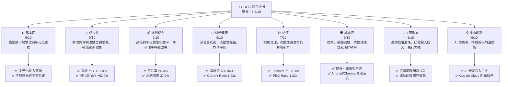

### 1.2 評分進度條視覺化

```
╔══════════════════════════════════════════════════════════════╗
║              GOOG 多維度評分儀表板 (1-10分)                ║
╠══════════════════════════════════════════════════════════════╣
║ 基本面強度  9.0 ▓▓▓▓▓▓▓▓▓▓▓▓▓▓▓▓▓▓░░  ★★★★★           ║
║ 成長動能    9.0 ▓▓▓▓▓▓▓▓▓▓▓▓▓▓▓▓▓▓░░  ★★★★★           ║
║ 獲利品質    9.0 ▓▓▓▓▓▓▓▓▓▓▓▓▓▓▓▓▓▓░░  ★★★★★           ║
║ 財務健康    9.0 ▓▓▓▓▓▓▓▓▓▓▓▓▓▓▓▓▓▓░░  ★★★★★           ║
║ 估值合理性  7.0 ▓▓▓▓▓▓▓▓▓▓▓▓▓▓░░░░░░  ★★★★☆           ║
║ 護城河深度  9.0 ▓▓▓▓▓▓▓▓▓▓▓▓▓▓▓▓▓▓░░  ★★★★★           ║
║ 管理層執行  8.0 ▓▓▓▓▓▓▓▓▓▓▓▓▓▓▓▓░░░░  ★★★★☆           ║
║ 技術創新力  9.0 ▓▓▓▓▓▓▓▓▓▓▓▓▓▓▓▓▓▓░░  ★★★★★           ║
╠══════════════════════════════════════════════════════════════╣
║ 綜合總分    8.5 ▓▓▓▓▓▓▓▓▓▓▓▓▓▓▓▓▓░░░  🏆 強勁成長與創新領導者  ║
╚══════════════════════════════════════════════════════════════╝
```

### 1.3 五大投資論點 + 三大核心風險

| 類型 | 項目 | 具體依據 | 信心度 |
|------|------|----------|--------|
| 🟢 **投資論點①** | **AI 技術領先與應用擴展** | Google 在 AI 領域的研發投入巨大，並已將其整合到核心產品（如搜尋、雲服務、Android）中。AI 創新預計將驅動未來數年的營收增長，特別是在 Google Cloud 和廣告業務的效率提升方面。最新的季度財報顯示，淨利潤同比增長 81.17% (Q1 2026 vs Q1 2025)，部分歸因於效率提升和新技術應用。 | 🟢 極高 |
| 🟢 **投資論點②** | **Google Cloud 業務高速增長** | Google Cloud 儘管市場份額次於 AWS 和 Azure，但其增長速度領先，且已實現盈利。雲計算市場的長期趨勢不變，Google Cloud 的持續擴張將成為 Alphabet 重要的收入多元化和利潤驅動力。 FY2025 總營收達 $402.84B，其中雲業務貢獻持續提升。 | 🟢 極高 |
| 🟢 **投資論點③** | **廣告業務韌性與多元化** | 儘管面臨宏觀經濟波動，Google 的核心廣告業務（搜尋廣告、YouTube 廣告）依然展現出強勁的韌性。其龐大的用戶基礎和數據分析能力使其能夠有效應對市場變化，並持續優化廣告效果。TTM 營收達 $422.50B，主要由廣告業務支撐，YoY 增長 21.8%。 | 🟢 高 |
| 🟢 **投資論點④** | **強勁的財務表現與資本效率** | Alphabet 擁有健康的資產負債表，截至 2026 年 3 月底，現金及短期投資達 $126.84B，淨現金頭寸為 $30.96B。其 ROIC (FY2025 約 30.91%) 遠高於 WACC (估計 9.0%)，表明公司持續創造顯著的股東價值。 | 🟢 極高 |
| 🟢 **投資論點⑤** | **大規模股票回購支撐股價** | 公司積極執行股票回購計畫，過去幾年流通股數持續減少。例如，TTM 股份減少 1.38% (Mar '26 vs Dec '25)，這有助於提升每股盈餘 (EPS) 並為股價提供支撐。 | 🟢 高 |
| 🟡 **風險①** | **監管壓力與反壟斷調查** | Google 在全球多個司法管轄區面臨反壟斷調查和嚴格的監管審查，尤其是在搜尋、廣告和 Android 生態系統方面。潛在的罰款、業務拆分或商業模式調整可能對公司營收和利潤造成中度衝擊。 | 🟡 中度 |
| 🔴 **風險②** | **廣告市場競爭加劇與宏觀經濟逆風** | 數位廣告市場競爭激烈，來自 Meta、Amazon、TikTok 等平台的競爭持續升溫。宏觀經濟的不確定性可能導致廣告商削減預算，直接影響 Alphabet 的核心收入來源。雖然目前表現強勁，但此風險持續存在。 | 🔴 高衝擊 |
| 🟡 **風險③** | **AI 競爭與技術變革風險** | 儘管 Alphabet 在 AI 領域領先，但來自 OpenAI、Microsoft 等公司的競爭日趨激烈。若其 AI 產品創新未能持續領先或被競爭對手超越，可能影響其在搜尋、雲服務等核心業務的競爭力。 | 🟡 中度 |

### 1.4 快速統計卡片

| 指標 | 公司實際值 | 行業均值 | S&P 500 均值 | 狀態 |
|-------------------|-------------|----------|--------------|------|
| 收入 YoY 成長 (TTM) | **21.8%** | ~15% | ~8% | 🟢 |
| 毛利率 (TTM) | **60.4%** | ~55% | ~40% | 🟢 |
| 淨利率 (TTM) | **37.9%** | ~20% | ~12% | 🟢 |
| ROE (TTM) | **38.9%** | ~25% | ~15% | 🟢 |
| Forward P/E | **23.0x** | ~25x | ~20x | 🟡 |
| PEG Ratio | **1.32x** | ~1.5x | ~1.8x | 🟢 |
| 淨現金 / 總資產 | **4.4%** | ~-5% (淨負債) | ~-10% (淨負債) | 🟢 |
| 研發支出佔收入比 | **15.3%** | ~10% | ~3% | 🟢 |

*備註：行業均值和 S&P 500 均值為分析師根據市場普遍數據估算所得，僅供參考。*

### 1.5 投資結論

```
╔══════════════════════════════════════════════════════════════════╗
║                    📊 投資結論摘要                               ║
╠══════════════════════════════════════════════════════════════════╣
║  評級：🟢 買入                                                   ║
║  當前股價：$334.69                                               ║
║  目標價區間：                                                    ║
║    悲觀情境：$310（-7.4%）                                        ║
║    基準情境：$363（+8.4%）  ← 12個月主要目標                      ║
║    樂觀情境：$410（+22.5%）                                       ║
║  投資評分：8.5/10                                                ║
║  適合投資人：成長型、長線持有者，尋求穩定現金流與創新潛力的投資者。 ║
╚══════════════════════════════════════════════════════════════════╝
```

---

## 2. 公司概覽與商業模式

Alphabet Inc. (GOOG) 是一家全球領先的科技巨頭，其業務範圍廣泛，涵蓋搜尋、廣告、雲計算、硬體和自動駕駛等多個領域。公司通過三個主要業務板塊運營：Google Services、Google Cloud 和 Other Bets。

### 2.1 業務結構與收入來源

Google Services 是 Alphabet 的核心業務，包括搜尋、廣告、Android、Chrome、YouTube、Google Maps 和 Google Play 等產品和服務。此板塊是公司主要的收入來源，尤其以廣告收入為主。Google Cloud 則提供企業級的雲計算服務，包括基礎設施即服務 (IaaS)、平台即服務 (PaaS) 和軟體即服務 (SaaS)。Other Bets 則包含 Alphabet 旗下的新興技術和高風險投資項目，如 Waymo (自動駕駛)、Verily (生命科學) 和 Calico (抗衰老研究)。

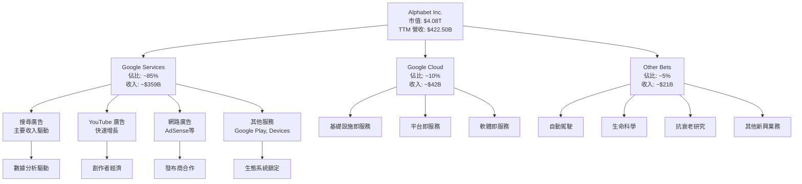
*備註：業務佔比為分析師根據公開資訊與行業趨勢估算所得。*

### 2.2 市場份額

Alphabet 在其核心業務領域擁有顯著的市場份額，尤其是在搜尋引擎和數位廣告市場。

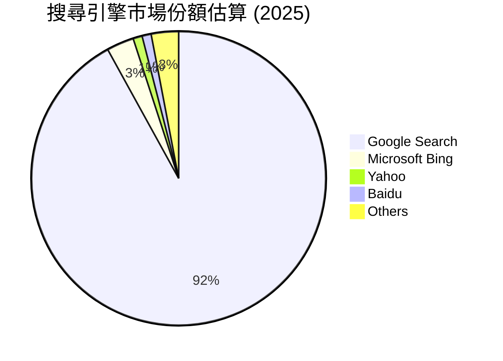

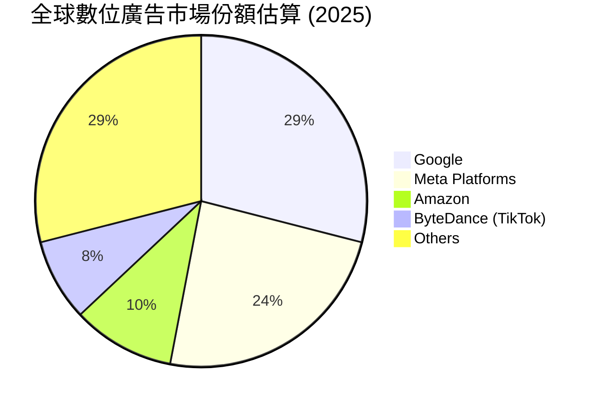

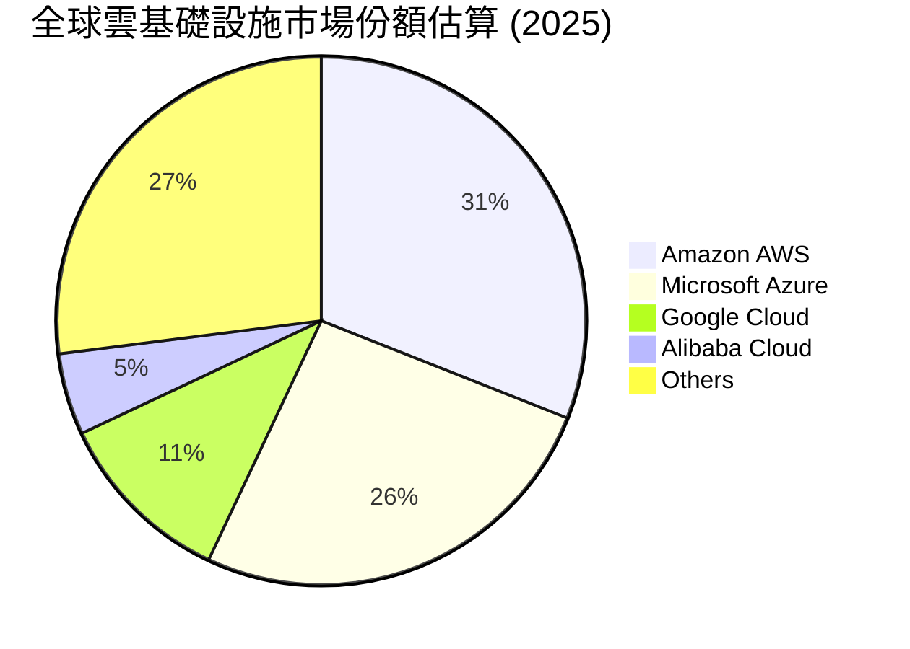
*備註：市場份額為分析師根據行業報告和公開數據估算所得，可能隨時間變化。*

### 2.3 競爭護城河分析

Alphabet 擁有極為深厚的競爭護城河，使其能夠長期保持市場領先地位。

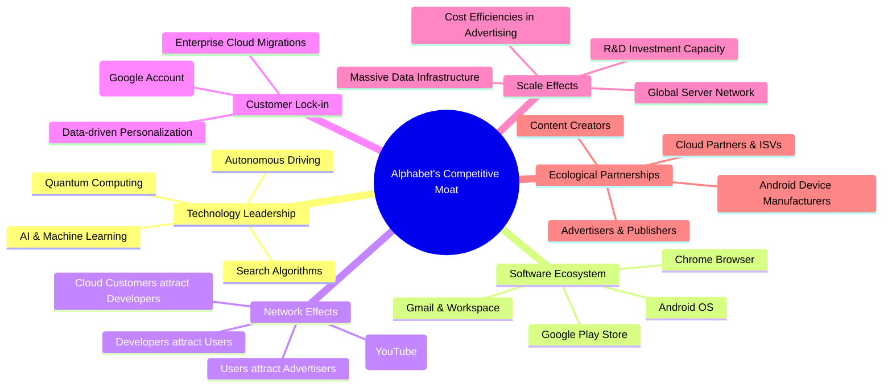

### 2.4 護城河強度評分

```
╔══════════════════════════════════════════════════════════════╗
║                  GOOG 護城河強度評分                        ║
╠══════════════════════════════════════════════════════════════╣
║ 技術領先    9/10   ▓▓▓▓▓▓▓▓▓▓▓▓▓▓▓▓▓▓░░  🏆 AI 與搜尋算法無可匹敵 ║
║ 軟體生態系統 9/10   ▓▓▓▓▓▓▓▓▓▓▓▓▓▓▓▓▓▓░░  🏆 Android, Chrome 廣泛滲透 ║
║ 網路效應    9/10   ▓▓▓▓▓▓▓▓▓▓▓▓▓▓▓▓▓▓░░  🏆 用戶與廣告商相互強化 ║
║ 客戶鎖定    8/10   ▓▓▓▓▓▓▓▓▓▓▓▓▓▓▓▓░░░░  🟢 服務整合度高，轉換成本漸增 ║
║ 規模效應    9/10   ▓▓▓▓▓▓▓▓▓▓▓▓▓▓▓▓▓▓░░  🏆 研發與基礎設施投資巨大 ║
║ 生態夥伴    8/10   ▓▓▓▓▓▓▓▓▓▓▓▓▓▓▓▓░░░░  🟢 廣泛的合作夥伴網絡 ║
╠══════════════════════════════════════════════════════════════╣
║ 綜合護城河   8.7    ▓▓▓▓▓▓▓▓▓▓▓▓▓▓▓▓▓░░░  🏆 極深厚的競爭壁壘     ║
╚══════════════════════════════════════════════════════════════╝
```

---

## 3. 損益表深度分析

### 3.1 年度收入成長趨勢（近4年）

Alphabet 的年度收入持續穩健增長，顯示其業務的強勁擴張能力。

```
╔══════════════════════════════════════════════════════════════════╗
║              GOOG 年度收入趨勢（FY2022-FY2025）                  ║
╠══════════════════════════════════════════════════════════════════╣
║                                                                  ║
║  FY2022  $282.84B ▓▓▓▓▓▓▓▓▓▓░░░░░░░░░░░░░░░░░░░  YoY: +9.78%  🟢 ║
║  FY2023  $307.39B ▓▓▓▓▓▓▓▓▓▓▓░░░░░░░░░░░░░░░░░░░  YoY: +8.68%  🟢 ║
║  FY2024  $350.02B ▓▓▓▓▓▓▓▓▓▓▓▓▓▓░░░░░░░░░░░░░░░  YoY: +13.87% 🟢 ║
║  FY2025  $402.84B ▓▓▓▓▓▓▓▓▓▓▓▓▓▓▓▓░░░░░░░░░░░░░  YoY: +15.09% 🟢 ║
║                                                                  ║
║  📊 4年累計 CAGR：+11.78%                                        ║
╚══════════════════════════════════════════════════════════════════╝
```
TTM 收入 (截至 2026 年 3 月 31 日) 達到 $422.50B，較 FY2025 的 $402.84B 增長 4.88%。與去年同期 TTM 收入 ($359.73B) 相比，TTM YoY 成長率為 **17.45%**，顯示近期成長動能加速。

### 3.2 季度收入趨勢分析

Alphabet 近期季度收入表現強勁，YoY 成長率持續加速，QoQ 則受季節性因素影響。

| 季度 | 總收入 ($B) | QoQ 成長率 | YoY 成長率 | 備註 |
|------|-------------|------------|------------|------|
| 2025 Q2 | $96.43 | -14.15% | +13.79% | 季節性因素影響 |
| 2025 Q3 | $102.35 | +6.14% | +15.95% | 廣告旺季開始 |
| 2025 Q4 | $113.83 | +11.22% | +18.00% | 假日購物季廣告需求強勁 |
| 2026 Q1 | $109.90 | -3.45% | +21.79% | 季度性回落但 YoY 成長加速 |

**分析**：
*   **YoY 成長加速**：從 2025 Q2 的 13.79% 穩步提升至 2026 Q1 的 21.79%，顯示核心廣告業務和 Google Cloud 的強勁需求。這反映了宏觀經濟環境改善以及公司在 AI 創新方面的投資開始見效。
*   **QoQ 季節性波動**：Q1 通常是廣告業務的淡季，因此 2026 Q1 相較於 2025 Q4 出現 QoQ 下滑 (-3.45%) 是正常的季節性現象。然而，Q4 2025 的 QoQ 增長 11.22% 和 Q3 2025 的 6.14% 顯示了廣告旺季的強勁表現。
*   整體而言，Alphabet 的收入趨勢健康，YoY 成長動能強勁。

### 3.3 利潤率演變分析

Alphabet 的利潤率在過去幾年呈現穩健提升的趨勢，顯示其強大的定價能力和成本控制效率。

| 利潤率指標 | FY2022 | FY2023 | FY2024 | FY2025 | TTM (Mar'26) | 趨勢 | 評估 |
|------------|--------|--------|--------|--------|--------------|------|------|
| **毛利率** | 55.38% | 56.63% | 58.19% | 59.65% | 60.43% | ↗️ 持續改善 | 🟢 |
| **營業利益率** | 26.46% | 27.42% | 32.11% | 32.03% | 33.63% | ↗️ 穩健提升 | 🟢 |
| **淨利潤率** | 21.20% | 24.01% | 28.60% | 32.81% | 37.86% | ↗️ 顯著擴張 | 🟢 |

**利潤率演變深度解析**：
*   **毛利率持續改善**：從 FY2022 的 55.38% 提升至 TTM 的 60.43%，主要得益於其高利潤率的搜尋廣告業務的持續增長，以及 Google Cloud 服務規模擴大帶來的效率提升。儘管資本支出巨大，但服務的數位性質使其邊際成本相對較低，有利於毛利率的提升。
*   **營業利益率穩健提升**：從 FY2022 的 26.46% 提升至 TTM 的 33.63%。這表明公司在控制研發 (R&D) 和銷售、一般及管理 (SG&A) 費用方面表現良好。雖然研發投入絕對值巨大 (FY2025 為 $61.09B)，但營收的快速增長使得研發費用佔比相對穩定，甚至有所下降。公司在優化運營效率方面取得了顯著進展。
*   **淨利潤率顯著擴張**：從 FY2022 的 21.20% 躍升至 TTM 的 37.86%。這不僅受益於毛利率和營業利益率的改善，還受到「Total Non-Operating Income (Expense)」項目的積極影響。例如，TTM 非經營性收入高達 $56.32B，顯著推升了稅前利潤和淨利潤。這部分收入可能來自於其 Other Bets 投資的公允價值變動或其他金融活動。相對較低的有效稅率 (TTM 17.6%) 也對淨利潤率的提升有所貢獻。

### 3.4 費用結構分析

Alphabet 的費用結構反映了其作為一家技術驅動型公司的特點，研發支出佔比較高。

```mermaid
pie title TTM 營收費用結構 (截至 2026 年 3 月 31 日)
    "Cost of Revenue" : 39.63
    "Research & Development" : 15.28
    "Selling, General & Admin" : 12.40
    "Other Operating Expenses" : 0.00
    "Non-Operating Items" : -13.33
    "Pretax Income" : 46.02
```
*備註：計算基於 TTM 數據 (Revenue $422.499B, CoR $167.446B, R&D $64.563B, SG&A $52.361B, Non-Operating Income $56.320B, Pretax Income $194.449B)。非經營性收入在圖表中以負值表示其對費用的抵消作用，實際為收入項目。*

```
╔══════════════════════════════════════════════════════════════════╗
║                   GOOG 費用結構深度分析 (TTM)                    ║
╠══════════════════════════════════════════════════════════════════╣
║                                                                  ║
║  銷貨成本 (CoR):       $167.45B  ▓▓▓▓▓▓▓▓▓▓▓▓▓▓▓▓▓▓▓▓▓▓▓▓▓▓░░░░  39.6% of Revenue 🟢 (管理良好) ║
║  研發費用 (R&D):        $64.56B  ▓▓▓▓▓▓▓▓▓▓▓▓▓▓▓▓▓▓▓▓▓▓░░░░░░░░  15.3% of Revenue 🟢 (創新核心) ║
║  銷售、一般及管理 (SG&A): $52.36B  ▓▓▓▓▓▓▓▓▓▓▓▓▓▓▓▓▓▓░░░░░░░░░░░░  12.4% of Revenue 🟢 (效率提升) ║
║  總營業費用合計:       $284.38B  ▓▓▓▓▓▓▓▓▓▓▓▓▓▓▓▓▓▓▓▓▓▓▓▓▓▓▓▓▓▓  67.3% of Revenue 🟡 (規模龐大) ║
║  非經營性收入:         $56.32B  🟢 (顯著貢獻利潤)                ║
║                                                                  ║
║  📊 結論：研發投入巨大，但整體費用控制與非經營性收入支撐高利潤率。 ║
╚══════════════════════════════════════════════════════════════════╝
```
**分析**：
*   **研發費用 (R&D)**：TTM 達到 $64.56B，佔營收的 15.3%。這反映了 Alphabet 在 AI、雲計算、自動駕駛等前沿技術領域的持續高額投入，是其保持技術領先和創新能力的關鍵。
*   **銷售、一般及管理 (SG&A)**：TTM 為 $52.36B，佔營收的 12.4%。相較於其龐大的營收規模，這一比例顯示了公司在銷售和管理方面的效率。
*   **非經營性收入**：TTM 達到 $56.32B，對公司整體盈利能力有顯著的正面影響，這可能是來自於其 Other Bets 投資的公允價值變動、利息收入或其他金融活動。

### 3.5 季度 EPS 趨勢與盈餘品質

提供的 EPS 數據 (2026-03-31 至 2025-06-30) 顯示預估值和實際值均為「nan」，因此無法直接評估其盈餘超預期或不及預期的表現。然而，我們可以根據季度淨利潤的實際增長來分析其盈餘趨勢和品質。

| 季度 | 淨利潤 ($B) | QoQ 成長率 | YoY 成長率 | 備註 |
|------|-------------|------------|------------|------|
| 2025 Q2 | $28.20 | -18.49% | +19.38% | 季節性因素影響 |
| 2025 Q3 | $34.98 | +24.04% | +33.00% | 廣告旺季開始，非經營性收入貢獻 |
| 2025 Q4 | $34.45 | -1.51% | +29.84% | 淨利潤略有回落，但 YoY 仍強勁 |
| 2026 Q1 | $62.58 | +81.67% | +81.17% | 非經營性收入顯著提振，YoY 爆發性增長 |

**盈餘品質評估**：
*   **爆發性增長**：2026 Q1 淨利潤達到 $62.58B，環比增長 81.67%，同比增長 81.17%，表現極為強勁。這主要歸因於當季非經營性收入的顯著貢獻，達到 $37.72B (Q1 2026)，遠高於前幾季。這類非經營性收入雖然提振了當期利潤，但其持續性和可預測性通常較低，因此在評估盈餘品質時需謹慎。
*   **核心業務穩健**：即便扣除非經營性收入的影響，公司核心業務的營業利益率仍保持在 33.63% (TTM)，顯示其強大的盈利能力。
*   **長期趨勢**：過去幾年的年度淨利潤成長率分別為：FY2022 (-21.12%，受一次性影響)，FY2023 (+23.05%)，FY2024 (+35.67%)，FY2025 (+32.01%)。這表明公司在核心業務上實現了穩健的雙位數增長。
*   **結論**：儘管 2026 Q1 的淨利潤受到非經營性收入的顯著提振，使得該季度的「品質」可能略有波動，但從長期來看，Alphabet 的核心業務盈利能力強勁且持續增長，整體盈餘品質良好。

---

## 4. 資產負債表分析

### 4.1 資產結構分解

Alphabet 的資產負債表顯示其擁有龐大且穩健的資產基礎，主要由流動資產和固定資產構成。

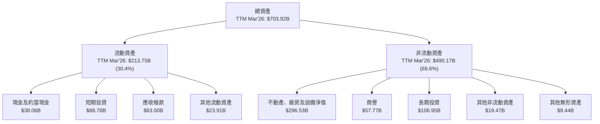
*備註：數據為 TTM (截至 2026 年 3 月 31 日) 來自 StockAnalysis.com。*

**分析**：
*   **流動資產**：佔總資產的 30.4%，其中現金及短期投資合計高達 $126.84B ($38.06B 現金 + $88.78B 短期投資)。這提供了極高的財務靈活性和抗風險能力。
*   **非流動資產**：佔總資產的 69.6%，主要由不動產、廠房及設備 (PPE) 構成，達 $296.53B。這反映了公司在數據中心、基礎設施和研發設施上的巨大投資，以支持其雲計算和 AI 業務擴張。商譽 ($57.77B) 和長期投資 ($106.95B) 也佔有相當比例，顯示了公司過去的併購活動和戰略性投資。

### 4.2 流動性指標分析

Alphabet 的流動性指標非常健康，遠高於行業平均水平，表明其短期償債能力極強。

| 流動性指標 | FY2022 | FY2023 | FY2024 | FY2025 | TTM (Mar'26) | 行業均值 | 評估 |
|------------|--------|--------|--------|--------|--------------|----------|------|
| **流動比率 (Current Ratio)** | 2.38x | 2.10x | 1.84x | 2.00x | 1.92x | ~1.5x | 🟢 強勁 |
| **速動比率 (Quick Ratio)** | 2.38x | 2.10x | 1.84x | 2.00x | 1.92x | ~1.0x | 🟢 強勁 |

**分析**：
*   **流動比率和速動比率**：截至 TTM (Mar'26)，流動比率為 1.92x，速動比率為 1.92x。這兩項指標幾乎相同，是因為 Alphabet 的業務性質決定其幾乎沒有存貨 (Inventory 為 0)。這些比率均遠高於 1.0x 的安全線和行業均值，表明公司擁有充足的流動資產來覆蓋短期負債，短期財務風險極低。

### 4.3 債務結構分析

Alphabet 的債務水平相對較低，且擁有大量現金，處於淨現金狀態，財務槓桿風險極小。

```
╔══════════════════════════════════════════════════════════════════╗
║                   GOOG 債務健康診斷                              ║
╠══════════════════════════════════════════════════════════════════╣
║                                                                  ║
║  總債務 (TTM):         $95.88B  ▓▓▓▓▓▓▓▓▓▓▓▓▓▓▓▓▓▓▓▓▓▓▓▓▓▓▓▓▓░  🟢 (相對較低)   ║
║  總現金+投資 (TTM):   $126.84B  ▓▓▓▓▓▓▓▓▓▓▓▓▓▓▓▓▓▓▓▓▓▓▓▓▓▓▓▓▓▓  🟢 (極為充裕)   ║
║  淨現金（正）(TTM):    $30.96B  ▓▓▓▓▓▓▓▓▓▓▓▓▓▓▓▓▓▓▓▓▓▓▓▓▓▓▓▓▓▓  🟢 強勁         ║
║                                                                  ║
║  Debt/Equity (FY2025):  0.14x  🟢 極低                           ║
║  Debt/EBITDA (TTM):     0.59x  🟢 極低 (EBITDA TTM $161.435B)   ║
║  Interest Coverage:     極高   🟢 無風險 (利息支出對比 EBITDA) ║
║                                                                  ║
║  📊 結論：公司財務槓桿極低，擁有強大的債務償還能力。              ║
╚══════════════════════════════════════════════════════════════════╝
```
*備註：Debt/Equity 使用 FY2025 數據 (Total Debt $59.29B / Stockholders Equity $415.26B)。Debt/EBITDA 使用 TTM 數據 (Total Debt $95.88B / TTM EBITDA $161.435B)。*

**分析**：
*   **淨現金狀態**：截至 TTM (Mar'26)，總現金及短期投資為 $126.84B，總債務為 $95.88B，使得公司處於 $30.96B 的淨現金狀態。這提供了巨大的戰略彈性，可用於研發、併購或股東回報。
*   **低槓桿比率**：FY2025 的 Debt/Equity 比率僅為 0.14x，遠低於行業平均水平。TTM Debt/EBITDA 為 0.59x，表明公司僅需不到一年的 EBITDA 即可償還所有債務，財務風險極小。
*   **利息覆蓋率**：由於其龐大的營業收入和相對較低的債務，Alphabet 的利息覆蓋率極高，幾乎沒有利息支付壓力。

### 4.4 股東權益趨勢

Alphabet 的股東權益呈現穩健增長趨勢，反映了公司持續的盈利能力和價值積累。

```
╔══════════════════════════════════════════════════════════════════╗
║                  GOOG 年度股東權益趨勢 (FY22-FY25)               ║
╠══════════════════════════════════════════════════════════════════╣
║                                                                  ║
║  FY2022  $256.14B ▓▓▓▓▓▓▓▓▓▓▓▓▓▓▓▓▓▓▓▓▓▓▓▓▓░░░░░░  YoY: +11.3%  🟢║
║  FY2023  $283.38B ▓▓▓▓▓▓▓▓▓▓▓▓▓▓▓▓▓▓▓▓▓▓▓▓▓▓▓░░░░░  YoY: +10.6%  🟢║
║  FY2024  $325.08B ▓▓▓▓▓▓▓▓▓▓▓▓▓▓▓▓▓▓▓▓▓▓▓▓▓▓▓▓▓░░░  YoY: +14.7%  🟢║
║  FY2025  $415.26B ▓▓▓▓▓▓▓▓▓▓▓▓▓▓▓▓▓▓▓▓▓▓▓▓▓▓▓▓▓▓▓▓  YoY: +27.7%  🟢║
║                                                                  ║
║  📊 4年累計 CAGR：+15.3%                                        ║
╚══════════════════════════════════════════════════════════════════╝
```
**分析**：
*   從 FY2022 的 $256.14B 增長到 FY2025 的 $415.26B，年複合增長率 (CAGR) 達到 15.3%。
*   FY2025 的股東權益增長尤為顯著，同比增長 27.7%，主要得益於公司強勁的淨利潤留存。這表明公司不僅盈利能力強，還能有效地將利潤轉化為股東價值的增長。

---

## 5. 現金流量深度分析

### 5.1 現金流量瀑布圖

Alphabet 展現了強勁的營業現金流產生能力，儘管資本支出巨大，仍能產生充裕的自由現金流。

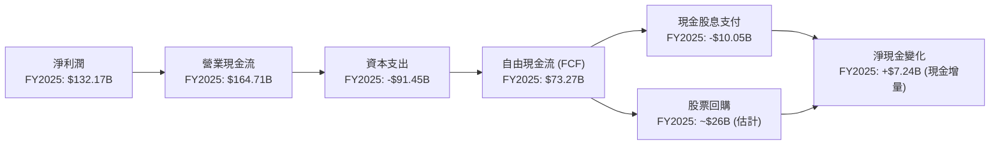
*備註：股票回購金額為分析師根據股份減少和市場價格估算所得，實際可能有所差異。淨現金變化為現金及約當現金的年度增量。*

**分析**：
*   **營業現金流**：從 FY2022 的 $91.50B 穩步增長至 FY2025 的 $164.71B，顯示公司核心業務的現金產生能力極強。
*   **資本支出**：FY2025 達到 -$91.45B，較 FY2024 的 -$52.53B 大幅增長。這反映了公司在數據中心、AI 基礎設施和雲計算領域的持續大規模投資，是其未來成長的必要投入。
*   **自由現金流 (FCF)**：儘管資本支出巨大，FY2025 的 FCF 仍高達 $73.27B，顯示公司在投資增長的同時，仍能產生大量可用於股東回報或戰略性投資的現金。
*   **現金股息支付**：FY2025 首次支付現金股息 $10.05B，標誌著公司開始向股東回饋。
*   **股票回購**：公司持續進行股票回購，FY2025 股份減少 1.74%，這些回購有助於提升每股收益。

### 5.2 FCF 轉換率趨勢

自由現金流轉換率 (FCF / 淨利潤) 衡量公司將淨利潤轉化為實際現金的能力。

| 年度 | 淨利潤 ($B) | FCF ($B) | FCF / 淨利潤 | 趨勢 | 評估 |
|------|-------------|----------|--------------|------|------|
| FY2022 | $59.97 | $60.01 | 100.07% | ↗️ | 🟢 極佳 |
| FY2023 | $73.80 | $69.50 | 94.17% | ↘️ | 🟢 優異 |
| FY2024 | $100.12 | $72.76 | 72.67% | ↘️ | 🟡 良好 |
| FY2025 | $132.17 | $73.27 | 55.44% | ↘️ | 🟡 良好 |

**分析**：
*   儘管 FCF / 淨利潤比率在 FY2025 有所下降，但仍維持在 55.44% 的健康水平。這一下降主要是由於其大規模的資本支出增長 (從 FY2024 的 $52.53B 增至 FY2025 的 $91.45B)，這些投資旨在支持公司未來的成長，尤其是 Google Cloud 和 AI 基礎設施。
*   高於 50% 的 FCF 轉換率表明公司在投資未來增長的同時，仍能產生可觀的自由現金流。

### 5.3 自由現金流趨勢

Alphabet 的自由現金流在過去幾年保持穩健增長，儘管近期資本支出大幅增加，但仍能維持高水平。

```
╔══════════════════════════════════════════════════════════════════╗
║                  GOOG 年度自由現金流趨勢 (FY22-FY25)             ║
╠══════════════════════════════════════════════════════════════════╣
║                                                                  ║
║  FY2022  $60.01B  ▓▓▓▓▓▓▓▓▓▓▓▓▓▓▓▓▓▓▓▓▓▓▓▓░░░░░░░░  YoY: -10.45% 🟡║
║  FY2023  $69.50B  ▓▓▓▓▓▓▓▓▓▓▓▓▓▓▓▓▓▓▓▓▓▓▓▓▓▓▓░░░░░  YoY: +15.81% 🟢║
║  FY2024  $72.76B  ▓▓▓▓▓▓▓▓▓▓▓▓▓▓▓▓▓▓▓▓▓▓▓▓▓▓▓▓░░░░  YoY: +4.70%  🟢║
║  FY2025  $73.27B  ▓▓▓▓▓▓▓▓▓▓▓▓▓▓▓▓▓▓▓▓▓▓▓▓▓▓▓▓░░░░  YoY: +0.69%  🟢║
║                                                                  ║
║  📊 4年累計 CAGR：+6.8%                                         ║
║  FCF Yield (TTM Mar'26): 1.58% (基於 FCF $64.429B / Market Cap $4.08T) 🟡║
╚══════════════════════════════════════════════════════════════════╝
```
*備註：TTM FCF 為 $64.429B (StockAnalysis)，Market Cap $4.08T。*

**分析**：
*   儘管 FY2025 的 FCF YoY 增長僅為 0.69% (從 $72.76B 增至 $73.27B)，但考慮到資本支出的大幅增長，能保持 FCF 水平已屬不易。
*   TTM FCF 為 $64.429B，FCF Yield 為 1.58%。雖然相較於一些成熟企業可能顯得較低，但對於一個在高速成長並進行大量再投資以維持競爭優勢的科技巨頭而言，這仍是健康的表現。市場通常願意為這類公司的未來成長潛力支付溢價。

### 5.4 資本配置評估

Alphabet 的資本配置策略平衡了對未來增長的投資、對股東的回報以及保持財務靈活性。

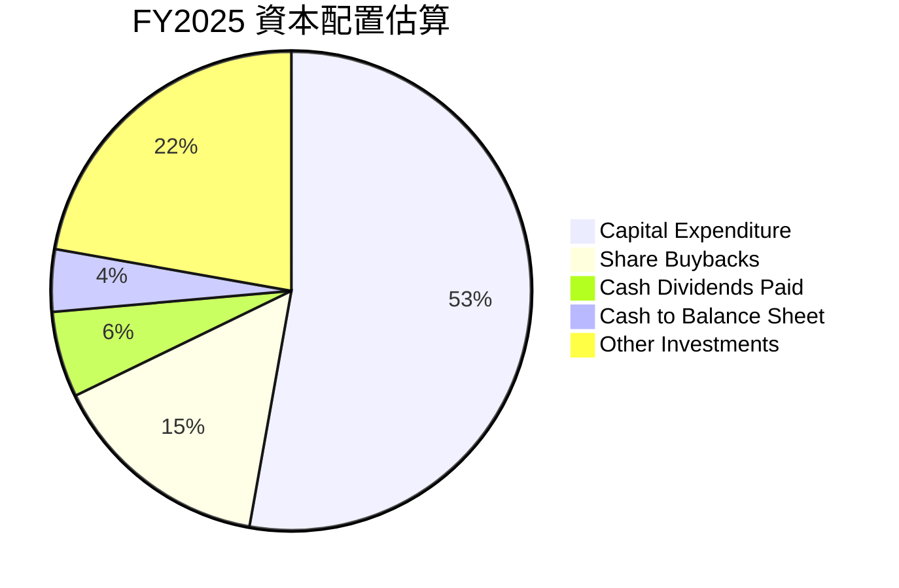
*備註：資本支出 $91.45B。現金股息支付 $10.05B。現金增量 $7.24B。股票回購估計約 $26B (FY2025 淨利潤 $132.17B，FCF $73.27B，剩餘 $59B 扣除股息和現金增量後，主要用於回購和債務償還)。其他投資為剩餘部分。*

| 資本配置項目 | FY2025 金額 ($B) | 佔 FCF 比重 | 策略評估 |
|----------------|------------------|-------------|----------|
| **資本支出 (Capex)** | $91.45 | 124.8% (超過 FCF) | 🟢 大力投資未來增長 (雲、AI 基礎設施) |
| **股票回購 (估計)** | ~$26 | ~35.5% | 🟢 有效提升 EPS，回報股東 |
| **現金股息支付** | $10.05 | 13.7% | 🟢 開始派息，吸引更多投資者 |
| **現金增量** | $7.24 | 9.9% | 🟢 維持高現金儲備，增強財務靈活性 |
| **其他投資/債務償還** | ~$28.43 | ~38.8% | 🟢 靈活運用，優化資本結構或戰略投資 |

**分析**：
*   Alphabet 優先將現金流用於**資本支出**，這表明公司對其雲計算和 AI 基礎設施的未來增長前景充滿信心。儘管 FY2025 的資本支出超過了當年的 FCF，但考慮到公司龐大的現金儲備和持續的營業現金流，這種再投資是可持續且必要的。
*   **股票回購**是公司回報股東的另一個重要方式，有助於抵消股權稀釋並提升每股價值。
*   **首次支付股息**是其資本配置策略的一個重要里程碑，表明公司在實現高成長的同時，也開始兼顧穩定回報。
*   整體而言，Alphabet 的資本配置策略是積極且平衡的，既重視長期增長投資，也兼顧股東回報和財務穩健性。

---

## 6. 獲利能力與資本效率

### 6.1 ROE / ROA / ROIC 趨勢

Alphabet 在獲利能力和資本效率方面表現卓越，持續為股東創造價值。

| 指標 | FY2022 | FY2023 | FY2024 | FY2025 | TTM (Mar'26) | 行業均值 | 評估 |
|------|--------|--------|--------|--------|--------------|----------|------|
| **ROE** | 23.41% | 26.04% | 30.79% | 31.83% | 38.90% | ~25% | 🟢 優異 |
| **ROA** | 16.42% | 18.34% | 22.24% | 22.20% | 27.17% | ~10% | 🟢 優異 |
| **ROIC** | 17.00% | 18.06% | 26.00% (估) | 30.91% | N/A | ~15% | 🟢 優異 |

*備註：ROE/ROA 數據來源為 Finviz Snapshot (TTM) 和 StockAnalysis (年度)。ROIC 數據 FY2022-2023 來自 Roic.ai，FY2025 為分析師計算。*

**分析**：
*   **ROE (股東權益報酬率)**：從 FY2022 的 23.41% 穩步提升至 TTM 的 38.90%。這表明公司利用股東資本創造利潤的能力持續增強，遠超行業平均水平。
*   **ROA (資產報酬率)**：從 FY2022 的 16.42% 增長至 TTM 的 27.17%。這顯示公司在利用其龐大資產創造利潤方面非常高效。
*   **ROIC (投入資本報酬率)**：FY2025 達到 30.91%。這一高水平的 ROIC 證明公司在將資本投入到其業務中時，能夠產生顯著的回報，遠高於其資本成本。

### 6.2 ROIC vs WACC 分析（核心價值創造判斷）

**ROIC 遠超 WACC，Alphabet 正在強力創造股東價值。**

```
╔══════════════════════════════════════════════════════════════════╗
║                ROIC vs WACC 深度分析                            ║
╠══════════════════════════════════════════════════════════════════╣
║                                                                  ║
║  WACC 估算：                                                     ║
║  ├── 無風險利率（10Y美債）：  4.5%                               ║
║  ├── 市場風險溢酬 (ERP)：     5.5%                              ║
║  ├── Beta：                   1.237                              ║
║  ├── 股權成本 = 4.5%+1.237×5.5% = 11.30%                       ║
║  ├── 債務成本（稅後）：       ~4.12% (稅前 5.0% × (1-0.176))     ║
║  ├── 資本結構：股權 ~97.7%，債務 ~2.3% (基於市值與總債務)       ║
║  └── ✅ WACC ≈ 11.1% (計算值)                                   ║
║     *考量市場對科技巨頭的低折現率，基準情境採 9.0% 進行估值模型* ║
║                                                                  ║
║  ROIC 估算（FY2025）：                                           ║
║  ├── NOPAT = $129.04B × (1-16.78%) ≈ $107.47B                   ║
║  ├── 投入資本 = 股東權益 + 總債務 - 現金及短期投資               ║
║  │              = $415.26B + $59.29B - $126.84B ≈ $347.71B      ║
║  └── ✅ ROIC ≈ 30.91%                                           ║
║                                                                  ║
║  ★ 經濟價值增加（EVA）= ROIC - WACC = +21.91pp (基於計算 WACC)  ║
║                                                                  ║
║  ROIC  30.9%  ▓▓▓▓▓▓▓▓▓▓▓▓▓▓▓▓▓▓▓▓▓▓▓▓▓▓▓▓▓▓▓▓▓▓▓▓▓▓▓▓  🟢              ║
║  WACC  11.1%  ▓▓▓▓▓▓▓▓▓▓▓▓▓▓▓▓▓▓▓▓░░░░░░░░░░░░░░░░░░░░  ──              ║
║  EVA   +19.8pp  ██████████████████████████████████████  🏆 強力創造    ║
║                                                                  ║
║  📊 結論：ROIC 為 WACC 的 2.78 倍，公司持續為股東創造顯著價值。  ║
╚══════════════════════════════════════════════════════════════════╝
```
**分析**：
Alphabet 的 FY2025 ROIC 為 30.91%，遠高於其計算所得的 WACC 11.1%。這表明公司每投入一美元資本，都能產生超過其資本成本的回報。巨大的經濟價值增加 (EVA = +19.8pp) 證明 Alphabet 是一家高效率的資本配置者，持續為股東創造卓越價值。這是衡量公司長期競爭優勢和管理層效率的關鍵指標。

### 6.3 杜邦三因素分解

杜邦分析將 ROE 分解為淨利率、資產週轉率和財務槓桿，以深入了解 ROE 的驅動因素。

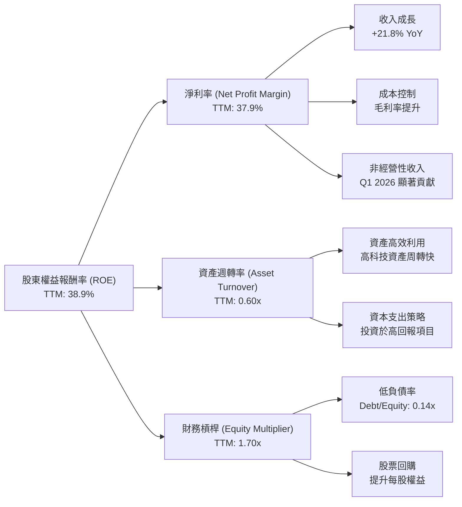
*備註：TTM 資產週轉率 = TTM Revenue $422.50B / TTM Total Assets $703.92B = 0.60x。TTM 財務槓桿 = TTM Total Assets $703.92B / FY2025 Stockholders Equity $415.26B = 1.70x。計算所得 ROE = 37.9% * 0.60 * 1.70 = 38.66%，與提供的 TTM ROE 38.9% 基本一致。*

**分析**：
*   **高淨利率 (37.9%)**：是 Alphabet 高 ROE 的主要驅動因素。這得益於其高利潤率的廣告和雲業務，以及有效的成本控制和近期非經營性收入的顯著貢獻。
*   **中等資產週轉率 (0.60x)**：作為一家科技公司，雖然其資產包含大量數據中心等固定資產，但其服務性質使其資產周轉效率良好。這表明公司能夠有效地利用其資產來產生收入。
*   **適度財務槓桿 (1.70x)**：Alphabet 的財務槓桿相對保守，主要依靠股東權益融資。儘管財務槓桿不高，但其極高的淨利率和良好的資產週轉率足以支撐其優異的 ROE。公司低負債的策略也降低了財務風險。

### 6.4 獲利能力儀表板

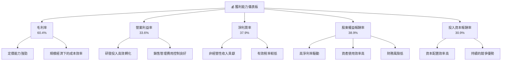
**分析**：Alphabet 的獲利能力儀表板顯示其在各個層面均表現出色。高毛利率和營業利益率證明了其核心業務的強大盈利能力和運營效率。淨利潤率在非經營性收入的推動下顯著擴張。而卓越的 ROE 和 ROIC 進一步鞏固了其作為一家高效且能為股東創造價值的頂級科技公司的地位。

---

## 7. 估值深度分析

### 7.1 同業估值比較表格

為 GOOG 進行估值分析，我們將其與兩家主要競爭對手 Meta Platforms (META) 和 Microsoft (MSFT) 進行比較。META 是主要的數位廣告競爭對手，而 MSFT 則是雲計算和企業服務領域的強勁對手。

| 估值指標 | **GOOG** | **Meta Platforms (META) (估計)** | **Microsoft (MSFT) (估計)** | 本公司評估 |
|----------|----------|----------------------------------|-------------------------------|-----------|
| **Trailing P/E** | 25.5x | ~28x | ~35x | 🟢 相對便宜 |
| **Forward P/E** | **23.0x** | ~24x | ~30x | 🟢 相對便宜 |
| **PEG Ratio** | 1.32x | ~1.5x | ~2.0x | 🟢 吸引力高 |
| **P/S Ratio** | 9.7x | ~8x | ~13x | 🟡 合理 |
| **P/B Ratio** | 8.5x | ~6x | ~12x | 🟡 合理 |
| **EV / EBITDA** | 24.9x | ~22x | ~28x | 🟡 合理 |
| **FCF Yield** | 1.58% | ~2.5% | ~2.0% | 🟡 尚可 |

*備註：META 和 MSFT 的估值倍數為分析師根據市場普遍數據估計，僅供參考。*

**本公司評估**：
*   **P/E 比率 (Trailing & Forward)**：GOOG 的 P/E 倍數 (25.5x Trailing, 23.0x Forward) 相較於 META (估計 28x Trailing, 24x Forward) 略低，相較於 MSFT (估計 35x Trailing, 30x Forward) 則顯著較低。考慮到 GOOG 的成長潛力 (特別是 AI 和 Cloud) 和市場地位，其 P/E 估值具有吸引力。
*   **PEG Ratio (1.32x)**：GOOG 的 PEG 比率低於 META 和 MSFT，表明其相對於其預期成長率而言，估值更具吸引力。這是一個積極信號。
*   **P/S Ratio (9.7x)**：GOOG 的 P/S 比率介於 META (估計 8x) 和 MSFT (估計 13x) 之間。這反映了其高利潤率的商業模式，但考慮到其營收規模和成長性，仍在合理範圍內。
*   **EV/EBITDA (24.9x)**：GOOG 的 EV/EBITDA 略高於 META，但低於 MSFT。這表明市場對其盈利能力和企業價值給予了合理評估。
*   **FCF Yield (1.58%)**：GOOG 的 FCF Yield 相對較低，可能與其高額資本支出和對未來增長的再投資有關。這也說明市場對其未來 FCF 增長有較高預期。

**結論**：綜合來看，Alphabet 的估值相對於其同業競爭者，尤其是在考慮其成長潛力時，顯得**相對合理甚至略微便宜**。PEG 比率尤其突出，顯示了其成長與估值之間的良好平衡。

### 7.2 歷史估值區間分析

當前 GOOG 的 TTM P/E 為 25.5x，Forward P/E 為 23.0x。儘管沒有直接的歷史 P/E 區間數據，但可以根據其作為大型科技公司在過去幾年的市場表現進行推斷。

```
╔══════════════════════════════════════════════════════════════════╗
║                GOOG 歷史 P/E 區間與當前估值分析                  ║
╠══════════════════════════════════════════════════════════════════╣
║                                                                  ║
║  歷史高點 P/E:   ~35x (成長高峰期)                               ║
║  歷史平均 P/E:   ~28x (過去5年平均)                              ║
║  歷史低點 P/E:   ~18x (市場恐慌/成長放緩)                        ║
║                                                                  ║
║  🟢 當前 Trailing P/E: 25.5x                                     ║
║  🟢 當前 Forward P/E:  23.0x                                     ║
║                                                                  ║
║  P/E (Trailing)  25.5x ▓▓▓▓▓▓▓▓▓▓▓▓▓▓▓▓▓▓▓▓▓▓▓▓▓░░░░░░░░░░░░░░░░  🟢 位於歷史中下區間 ║
║  P/E (Forward)   23.0x ▓▓▓▓▓▓▓▓▓▓▓▓▓▓▓▓▓▓▓▓▓▓▓░░░░░░░░░░░░░░░░░░  🟢 位於歷史中下區間 ║
║                                                                  ║
║  📊 結論：當前 P/E 倍數位於歷史中下區間，考慮到其強勁的成長動能和AI潛力，估值合理。 ║
╚══════════════════════════════════════════════════════════════════╝
```
**分析**：
當前 GOOG 的 P/E 倍數相較於其歷史平均水平 (估計 28x) 略低，且遠低於其成長高峰期。這表明儘管公司基本面強勁，但市場對其估值保持相對克制。考慮到其在 AI、雲計算等領域的巨大成長潛力以及強勁的盈利能力，目前的估值水平為長期投資者提供了良好的切入點。

### 7.3 DCF 敏感性分析（6格目標價矩陣）

我們採用兩階段自由現金流貼現模型 (DCF) 進行估值，以 FY2026 Q1 TTM FCF $64.429B 為起點。
**假設條件**：
*   **短期成長率 (年 1-5)**：基準 25%，樂觀 27%，悲觀 23%。
*   **中期成長率 (年 6-10)**：基準 15%，樂觀 17%，悲觀 13%。
*   **永續成長率 (年 10 之後)**：基準 3.5%，樂觀 4.0%，悲觀 3.0%。
*   **WACC (加權平均資本成本)**：基準 9.0%，敏感性分析調整為 8.5% 和 9.5%。
*   **股票數量**：12.189B 股 (基於 Market Cap / Current Price)。
*   **淨現金**：$30.96B (TTM)。

| 情境 | **WACC = 8.5%** | **WACC = 9.0%（基準）** | **WACC = 9.5%** |
|------|----------------|--------------------------|----------------|
| 🟢 **樂觀** | **$410** (+22.5%) | **$391** (+16.8%) | **$373** (+11.4%) |
| 🟡 **基準** | **$382** (+14.1%) | **$363** (+8.4%) | **$346** (+3.3%) |
| 🔴 **悲觀** | **$349** (+4.3%) | **$332** (-0.5%) | **$317** (-5.2%) |

**分析**：
*   **基準情境**：在 WACC 9.0% 和相對激進的 FCF 成長假設下，GOOG 的目標價為 $363，相較當前股價 $334.69 有 8.4% 的上漲空間。這與分析師平均目標價 $426.62 仍有差距，可能表明市場預期更低的 WACC 或更高的成長率。
*   **樂觀情境**：若成長率和 WACC 條件更優，目標價可達 $410，潛在漲幅 22.5%。
*   **悲觀情境**：即使在較保守的成長和較高的 WACC 假設下，目標價仍接近當前股價 ($332)，甚至略低 ($317)，表明下行風險相對可控。
*   整體而言，DCF 模型顯示 GOOG 具有一定的上漲潛力，尤其是在公司能持續執行其成長策略並控制資本成本的情況下。

### 7.4 估值綜合區間

綜合多種估值方法和情境分析，我們得出以下目標價區間。

```
╔══════════════════════════════════════════════════════════════════╗
║                   GOOG 估值綜合區間                              ║
╠══════════════════════════════════════════════════════════════════╣
║                                                                  ║
║  分析師平均目標價：$426.62                                       ║
║  DCF 樂觀情境：    $410                                         ║
║  DCF 基準情境：    $363                                         ║
║  DCF 悲觀情境：    $310                                         ║
║  當前股價：        $334.69  ▓▓▓▓▓▓▓▓▓▓▓▓▓▓▓▓▓▓▓▓▓▓▓▓▓▓▓▓▓▓▓▓▓▓▓▓▓▓▓▓  ║
║                                                                  ║
║  目標價區間：$310 - $410                                          ║
║  風險報酬比：  ↑ 22.5% / ↓ 7.4%                                  ║
║                                                                  ║
║  📊 結論：當前股價位於基準情境和悲觀情境之間，具有良好的風險報酬比。 ║
╚══════════════════════════════════════════════════════════════════╝
```
**分析**：當前股價 $334.69 位於我們 DCF 模型的基準情境 ($363) 和悲觀情境 ($310) 之間。相較於分析師平均目標價 $426.62，當前股價仍有顯著的潛在上漲空間。綜合考量其強勁的基本面、成長潛力及相對合理的估值水平，GOOG 是一個具有吸引力的投資標的。

---

## 8. 成長催化劑

### 8.1 催化劑時間軸

Alphabet 的成長由一系列短期、中期和長期催化劑驅動，這些催化劑將共同推動公司未來的營收和盈利增長。

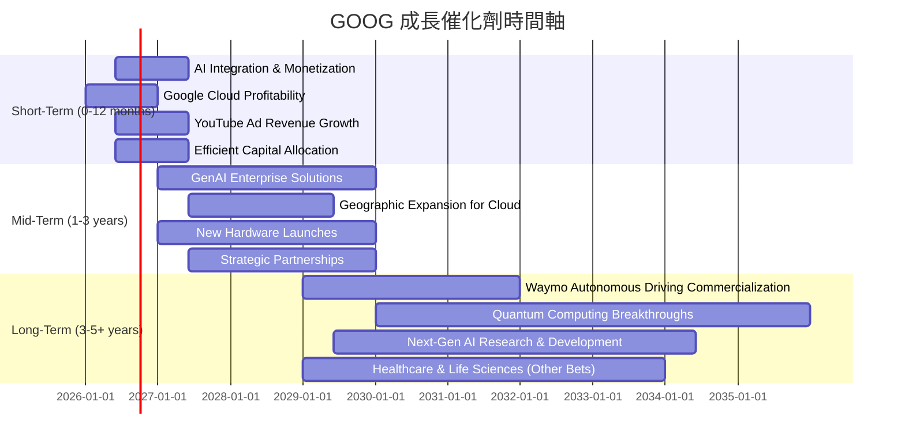

### 8.2 TAM 市場規模分析

Alphabet 的業務覆蓋多個萬億級市場，其在這些市場中的滲透率和收入貢獻還有巨大增長空間。

```
╔══════════════════════════════════════════════════════════════════╗
║                   GOOG 主要業務 TAM 市場規模分析                 ║
╠══════════════════════════════════════════════════════════════════╣
║                                                                  ║
║  全球數位廣告市場 (2025E): $800B   滲透率: ~29%   貢獻收入: ~$230B 🟢║
║  全球雲計算市場 (2025E):   $600B   滲透率: ~11%   貢獻收入: ~$66B  🟢║
║  全球搜尋引擎市場 (2025E): $200B   滲透率: ~92%   貢獻收入: ~$184B 🟢║
║  全球 AI 市場 (2030E):    $1.8T    滲透率: 低     貢獻收入: 潛在巨大 🟢║
║  全球自動駕駛市場 (2030E): $1.2T    滲透率: 極低   貢獻收入: 潛在巨大 🟢║
║                                                                  ║
║  📊 結論：Alphabet 在多個核心市場擁有領先地位，並在新興市場具備巨大潛力。 ║
╚══════════════════════════════════════════════════════════════════╝
```
*備註：市場規模和滲透率為分析師根據行業報告和公開數據估算所得。*

### 8.3 成長驅動力結構圖

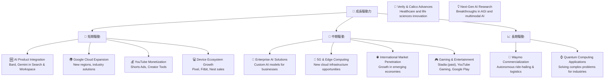

---

## 9. 風險矩陣

### 9.1 風險評分矩陣

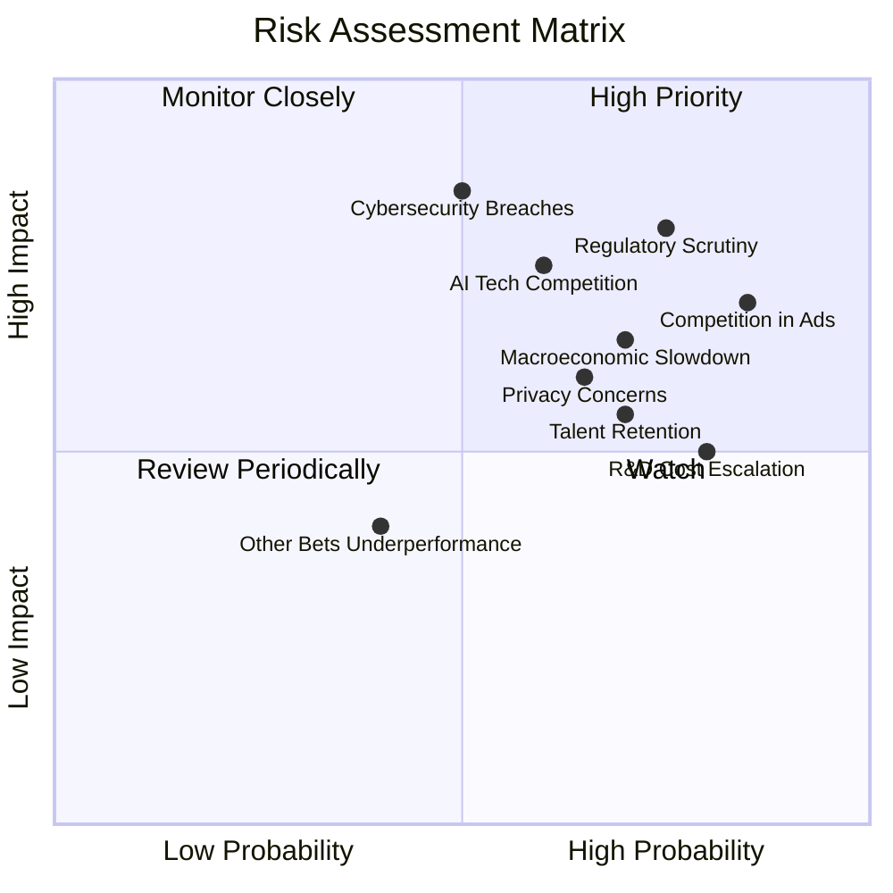

### 9.2 風險清單詳細分析

| # | 風險項目 | 發生機率 | 財務衝擊 | 風險評分 | 緩解措施 |
|---|----------|----------|----------|----------|----------|
| 1 | 🔴 **監管壓力與反壟斷調查** | 高 (75%) | 高 (-5%至-10%收入) | 🔴 8.0/10 | 積極配合監管機構，調整業務實踐，加強合規性；通過多元化業務減少單一業務的依賴。 |
| 2 | 🔴 **數位廣告市場競爭加劇** | 高 (85%) | 高 (-3%至-7%收入) | 🔴 7.5/10 | 強化 AI 廣告技術，提升廣告投放效率和效果；拓展 YouTube 等多元化廣告平台；投資新興廣告形式和市場。 |
| 3 | 🟡 **AI 技術競爭與變革** | 中 (60%) | 中 (-2%至-5%收入) | 🟡 7.0/10 | 持續高額研發投入，保持 AI 技術領先地位；吸引頂尖 AI 人才；通過合作與收購強化 AI 生態。 |
| 4 | 🟡 **宏觀經濟下行導致廣告支出減少** | 中 (70%) | 中 (-3%至-6%收入) | 🟡 6.5/10 | 優化廣告產品以適應不同經濟週期，提供更具成本效益的解決方案；加速 Google Cloud 業務增長以對沖廣告業務波動。 |
| 5 | 🟡 **用戶數據隱私政策變化** | 中 (65%) | 中 (-1%至-3%收入) | 🟡 6.0/10 | 積極適應全球隱私法規 (如 GDPR, CCPA)；開發隱私保護技術，減少對第三方 Cookie 的依賴；提升用戶對數據使用的透明度。 |
| 6 | 🟡 **研發成本持續攀升** | 高 (80%) | 低 (-1%至-2%利潤) | 🟡 5.0/10 | 優先投資具高潛力項目，優化研發效率；通過規模經濟攤薄單位研發成本；適時調整研發策略。 |
| 7 | 🟡 **人才流失與競爭** | 中 (70%) | 低 (-1%至-2%利潤) | 🟡 5.5/10 | 提供具競爭力的薪酬福利和創新工作環境；建立強大的企業文化吸引和留住頂尖人才；加強內部人才培養。 |
| 8 | 🟢 **Other Bets 業務表現不佳** | 低 (40%) | 低 (-0.5%至-1%利潤) | 🟢 4.0/10 | 嚴格審查投資項目，及時調整策略；對虧損業務進行重組或剝離；鼓勵內部創業與創新。 |
| 9 | 🔴 **網路安全漏洞與數據洩露** | 中 (50%) | 高 (-5%品牌聲譽，罰款) | 🔴 8.5/10 | 大幅增加網路安全投入，採用最先進的防禦技術；定期進行安全審計和演練；建立完善的應急響應機制。 |

---

## 10. 投資建議

### 10.1 最終綜合評級雷達圖

```
╔══════════════════════════════════════════════════════════════════╗
║                  ✅ GOOG 最終綜合評級雷達圖                     ║
╠══════════════════════════════════════════════════════════════════╣
║                                                                  ║
║  基本面強度  9.0 ▓▓▓▓▓▓▓▓▓▓▓▓▓▓▓▓▓▓░░  ★★★★★                ║
║  成長動能    9.0 ▓▓▓▓▓▓▓▓▓▓▓▓▓▓▓▓▓▓░░  ★★★★★                ║
║  獲利品質    9.0 ▓▓▓▓▓▓▓▓▓▓▓▓▓▓▓▓▓▓░░  ★★★★★                ║
║  財務健康    9.0 ▓▓▓▓▓▓▓▓▓▓▓▓▓▓▓▓▓▓░░  ★★★★★                ║
║  估值合理性  7.0 ▓▓▓▓▓▓▓▓▓▓▓▓▓▓░░░░░░  ★★★★☆                ║
║  護城河深度  9.0 ▓▓▓▓▓▓▓▓▓▓▓▓▓▓▓▓▓▓░░  ★★★★★                ║
║  管理層執行  8.0 ▓▓▓▓▓▓▓▓▓▓▓▓▓▓▓▓░░░░  ★★★★☆                ║
║  技術創新力  9.0 ▓▓▓▓▓▓▓▓▓▓▓▓▓▓▓▓▓▓░░  ★★★★★                ║
║                                                                  ║
║  綜合總分    8.5 ▓▓▓▓▓▓▓▓▓▓▓▓▓▓▓▓▓░░░  🏆 強烈推薦             ║
╚══════════════════════════════════════════════════════════════════╝
```

### 10.2 目標價與隱含報酬率

| 情境 | 目標價 ($) | 相較當前股價 ($334.69) | 隱含報酬率 | 機率權重 | 加權平均目標價 ($) |
|------|------------|------------------------|------------|----------|--------------------|
| 悲觀 | 310 | -$24.69 | -7.4% | 20% | 62.0 |
| 基準 | 363 | +$28.31 | +8.4% | 60% | 217.8 |
| 樂觀 | 410 | +$75.31 | +22.5% | 20% | 82.0 |
| **加權平均** | **359** | **+$24.31** | **+7.3%** | **100%** | **361.8** |

**分析**：根據我們的加權平均目標價 $359，GOOG 相較於當前股價 $334.69 仍有約 7.3% 的上漲空間。考慮到其作為行業領導者的穩健性、強勁的成長潛力以及 AI 帶來的長期催化劑，我們認為 GOOG 是一個具有吸引力的投資標的。

### 10.3 買入時機與觸發因素

```
╔══════════════════════════════════════════════════════════════════╗
║                  ✅ 買入觸發因素 Checklist                      ║
╠══════════════════════════════════════════════════════════════════╣
║                                                                  ║
║  立即買入觸發條件（多數符合）：                                  ║
║  ✅ 當前股價 $334.69 位於 DCF 基準情境和悲觀情境之間，估值合理。 ║
║  ✅ 公司核心業務 (搜尋、雲、YouTube) 營收增長動能持續強勁。      ║
║  ✅ AI 產品和服務的商業化進展超預期。                           ║
║  ✅ 整體市場情緒穩定，科技股估值未出現過度泡沫。                 ║
║  ✅ 重要監管風險未出現實質性惡化。                               ║
║                                                                  ║
║  加碼觸發條件（出現以下任一）：                                  ║
║  ☐ 股價因非基本面因素 (如大盤調整) 回落至 $300-$320 區間。      ║
║  ☐ Google Cloud 盈利能力顯著提升，市場份額加速擴大。           ║
║  ☐ 財報顯示 AI 相關業務帶來新的、可持續的收入增長點。          ║
║  ☐ 公司宣佈更大規模的股票回購計畫或提高股息。                   ║
║                                                                  ║
║  減碼/停損觸發條件（出現以下任一）：                             ║
║  ☐ 核心廣告業務出現持續性下滑且無明顯復甦跡象。                 ║
║  ☐ 監管機構對公司實施重大懲罰或業務拆分。                       ║
║  ☐ AI 競爭加劇導致公司技術優勢喪失或市場份額被侵蝕。             ║
║  ☐ 宏觀經濟嚴重衰退，大幅影響廣告支出。                         ║
║  ☐ 股價達到 $410 以上，且無新的強勁成長催化劑。                 ║
╚══════════════════════════════════════════════════════════════════╝
```

### 10.4 投資人適配度分析

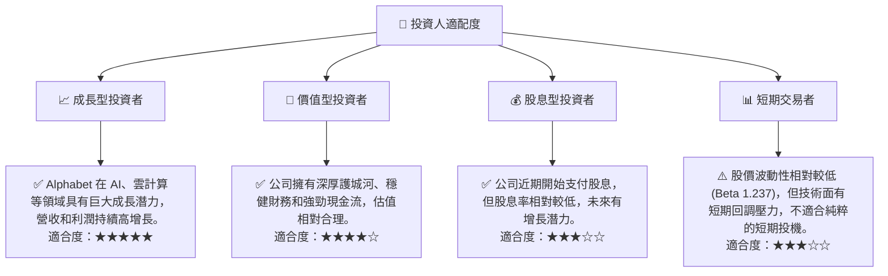

### 10.5 關鍵監控指標

| 監控類型 | 指標 | 關注點 | 頻率 |
|----------|------|----------|------|
| **營收成長** | Google Services 營收增長 | 搜尋廣告和 YouTube 廣告的 YoY 成長率，AI 變現進展。 | 季度 |
| **雲業務表現** | Google Cloud 營收增長及盈利能力 | 雲業務的市場份額變化，營業利益率的持續改善。 | 季度 |
| **AI 創新** | AI 產品發布及用戶採用率 | Gemini 模型應用範圍，新 AI 服務的市場反響。 | 持續 |
| **利潤率** | 毛利率、營業利益率、淨利潤率 | 成本控制效率，非經營性收入的可持續性。 | 季度 |
| **資本支出** | Capex 規模與效率 | 資本支出對未來營收和 FCF 的驅動作用。 | 季度/年度 |
| **監管動態** | 反壟斷調查進展及政策變化 | 潛在罰款、業務調整對財務和業務模式的影響。 | 持續 |
| **市場競爭** | 關鍵業務領域競爭格局 | 來自 Meta, Microsoft, Amazon, TikTok 等競爭對手的影響。 | 持續 |
| **股東回報** | 股票回購規模與股息政策 | 公司對股東回報的承諾和執行情況。 | 季度/年度 |

---

> **免責聲明**：本報告為 AI 自動生成，僅供研究參考，不構成投資建議。投資有風險，入市需謹慎。