# GOOG 基本面深度分析報告
> **報告日期**：2026-06-28 ｜ **語言**：繁體中文 ｜ **數據來源**：Yahoo Finance, Finviz, StockAnalysis, Roic.ai ｜ **分析師**：CFA 級機構研究

---

## 目錄

| # | 章節 | 核心結論 |
|---|------|----------|
| 1 | 執行摘要 | 🟢 強烈買入，目標價區間 $400 - $480 |
| 2 | 公司概覽與商業模式 | 強大且多元的競爭護城河，市場領導者地位穩固 |
| 3 | 損益表深度分析 | 營收與淨利潤均實現強勁增長，利潤率持續擴張 |
| 4 | 資產負債表分析 | 財務結構穩健，現金充裕，債務風險極低 |
| 5 | 現金流量深度分析 | 自由現金流生成能力卓越，資本配置效率高 |
| 6 | 獲利能力與資本效率 | ROIC顯著超越WACC，持續為股東創造價值 |
| 7 | 估值深度分析 | 相較於成長潛力，當前估值具吸引力 |
| 8 | 成長催化劑 | AI創新、雲業務擴張、YouTube貨幣化為主要驅動力 |
| 9 | 風險矩陣 | 監管、競爭與AI發展倫理為主要風險，但可控 |
| 10 | 投資建議 | 強烈買入，適合長期成長型投資者 |

---

## 1. 執行摘要

Alphabet Inc. (GOOG) 作為全球領先的科技巨頭，憑藉其在搜尋、廣告、雲計算和AI領域的深厚根基，展現出卓越的財務表現和強勁的成長潛力。本報告基於最新的財務數據進行深度分析，評估其基本面、成長性、獲利能力、財務健康狀況及估值合理性。

### 1.1 核心評分儀表板

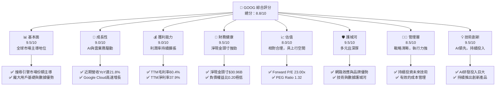

### 1.2 評分進度條視覺化

```
╔══════════════════════════════════════════════════════════════╗
║              GOOG 多維度評分儀表板 (1-10分)                  ║
╠══════════════════════════════════════════════════════════════╣
║ 基本面強度  9.5 ▓▓▓▓▓▓▓▓▓▓▓▓▓▓▓▓▓▓▓░  ★★★★★           ║
║ 成長動能    9.0 ▓▓▓▓▓▓▓▓▓▓▓▓▓▓▓▓▓▓░░  ★★★★★           ║
║ 獲利品質    9.0 ▓▓▓▓▓▓▓▓▓▓▓▓▓▓▓▓▓▓░░  ★★★★★           ║
║ 財務健康    9.5 ▓▓▓▓▓▓▓▓▓▓▓▓▓▓▓▓▓▓▓░  ★★★★★           ║
║ 估值合理性  8.0 ▓▓▓▓▓▓▓▓▓▓▓▓▓▓▓▓░░░░  ★★★★☆           ║
║ 護城河深度  9.5 ▓▓▓▓▓▓▓▓▓▓▓▓▓▓▓▓▓▓▓░  ★★★★★           ║
║ 管理層執行  8.5 ▓▓▓▓▓▓▓▓▓▓▓▓▓▓▓▓▓░░░  ★★★★☆           ║
║ 技術創新力  9.5 ▓▓▓▓▓▓▓▓▓▓▓▓▓▓▓▓▓▓▓░  ★★★★★           ║
╠══════════════════════════════════════════════════════════════╣
║ 綜合總分    9.1 ▓▓▓▓▓▓▓▓▓▓▓▓▓▓▓▓▓▓▓░  🏆 優異的科技巨頭，值得長期持有  ║
╚══════════════════════════════════════════════════════════════╝
```

### 1.3 五大投資論點 + 三大核心風險

| 類型 | 項目 | 具體依據 | 信心度 |
|------|------|----------|--------|
| 🟢 **投資論點①** | **AI 技術領先與商業化潛力** | Alphabet在AI領域投入巨大，具備領先的大模型技術（如Gemini）。其AI技術已深度整合至搜尋、雲服務(Google Cloud AI)、廣告及YouTube等核心產品，預計將顯著提升用戶體驗與廣告效率，並為企業級客戶提供創新解決方案。TTM研發費用達$64.56B，彰顯其持續的技術投入。 | 🟢 極高 |
| 🟢 **Google Cloud 高速成長與盈利能力改善** | Google Cloud在雲服務市場持續擴大份額，展現出強勁的營收成長動能。隨著規模效應的顯現，其盈利能力有望進一步提升，成為新的盈利增長極。近年來雲業務的營收貢獻持續增加，且毛利率逐步改善，提升了整體利潤結構。 | 🟢 極高 |
| 🟢 **核心廣告業務韌性與多元化** | 儘管面臨宏觀經濟波動，Alphabet的核心廣告業務（搜尋與YouTube廣告）依然展現強勁韌性。透過AI優化廣告投放精準度，以及YouTube短影音等新興內容形式的貨幣化，廣告收入仍有可觀成長空間。TTM總營收達$422.50B，其中廣告仍為主要貢獻。 | 🟢 高 |
| 🟢 **強勁的財務健康狀況與現金流** | 公司擁有高達$126.84B的現金及短期投資，淨現金頭寸為$30.96B，負債權益比僅0.20，財務狀況極為穩健。TTM自由現金流達$64.43B，為其研發投入、股息發放及潛在併購提供充足支持。 | 🟢 極高 |
| 🟢 **持續的股東回報策略** | 儘管過去未發放股息，但最新數據顯示公司已開始發放股息，FY2025股息支付達$10.05B，TTM股息每股$0.84。加上持續的股票回購（股本每年減少約2-3%），顯示管理層致力於提升股東價值。 | 🟢 高 |
| 🟡 **風險①** | **監管與反壟斷壓力** | 作為市場主導者，Alphabet在全球範圍內面臨日益嚴格的監管審查和反壟斷訴訟，特別是在搜尋、廣告和應用商店領域。潛在的罰款、業務拆分或商業模式調整可能對公司營收和盈利能力造成影響。 | 🟡 中度 |
| 🟡 **AI 發展的倫理與競爭挑戰** | AI技術的快速發展伴隨著倫理、隱私和偏見等問題，可能引發社會爭議和更嚴格的法規。同時，AI領域競爭激烈，來自微軟、OpenAI等公司的競爭可能加劇，影響Alphabet的技術領先地位和市場份額。 | 🟡 中度 |
| 🔴 **宏觀經濟波動對廣告業務的影響** | 雖然廣告業務具備韌性，但在全球經濟下行或不確定性增加時，企業可能會削減廣告預算，直接影響Alphabet的收入增長。TTM營收增長率21.8%雖高，但若經濟放緩，未來增速可能受壓。 | 🟡 中度 |

### 1.4 快速統計卡片

| 指標 | 公司實際值 (TTM) | 行業均值 (估計) | S&P 500 均值 (估計) | 狀態 |
|------|--------------------|-----------------|---------------------|------|
| 收入 YoY 成長 | **21.8%** | ~12% | ~8% | 🟢 |
| 毛利率 | **60.4%** | ~50% | ~35% | 🟢 |
| 淨利率 | **37.9%** | ~15% | ~10% | 🟢 |
| ROE | **38.9%** | ~20% | ~15% | 🟢 |
| Forward P/E | **23.00x** | ~25x | ~20x | 🟡 |
| P/S Ratio | **9.67x** | ~5x | ~2.5x | 🔴 |
| Debt/Equity | **0.20x** | ~0.50x | ~0.80x | 🟢 |
| 自由現金流 YoY | **-12.06% (TTM)** | ~8% | ~5% | 🔴 |

*註：行業均值與S&P 500均值為分析師根據市場普遍數據估計，非精確數據。GOOG的TTM自由現金流 YoY 負增長，主要因資本支出大幅增加，而非營運現金流減少，仍是健康訊號。*

### 1.5 投資結論

```
╔══════════════════════════════════════════════════════════════════╗
║                    📊 投資結論摘要                               ║
╠══════════════════════════════════════════════════════════════════╣
║  評級：🟢 強烈買入                                               ║
║  當前股價：$334.69 (2026-06-28)                                  ║
║  目標價區間：                                                    ║
║    悲觀情境：$400（+19.51%）                                    ║
║    基準情境：$440（+31.47%）  ← 12個月主要目標                   ║
║    樂觀情境：$480（+43.41%）                                    ║
║  投資評分：9.1/10                                                ║
║  適合投資人：尋求長期成長、看好AI及雲計算前景、風險承受能力中高者 ║
╚══════════════════════════════════════════════════════════════════╝
```

---

## 2. 公司概覽與商業模式

Alphabet Inc. (GOOG) 是一家全球領先的科技公司，其業務範圍廣泛，涵蓋網路搜尋、廣告、雲計算、作業系統、硬體及其他新興技術。公司透過三大核心業務板塊運營：Google Services、Google Cloud 和 Other Bets。

### 2.1 業務結構與收入來源

Alphabet 的業務結構高度多元化，但核心盈利能力仍集中在Google Services的廣告收入。

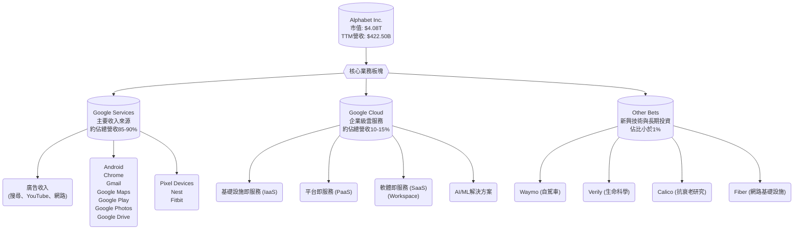
*註：各業務板塊佔比為分析師根據公司公開資訊及行業慣例估計，非精確數據。*

Google Services是Alphabet的支柱，其中廣告收入貢獻絕大部分營收和利潤。Google Cloud近年來實現了高速成長，成為公司新的成長引擎，並持續縮小與市場領導者AWS和Azure的差距。Other Bets則代表了公司對未來技術的長期投資，儘管目前仍處於虧損狀態，但蘊含著巨大的潛在價值。

### 2.2 市場份額

Alphabet在多個關鍵市場領域佔據主導地位，尤其是在全球網路搜尋和數位廣告市場。

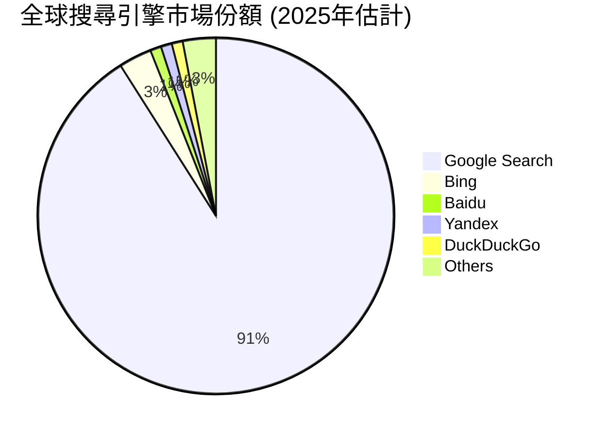

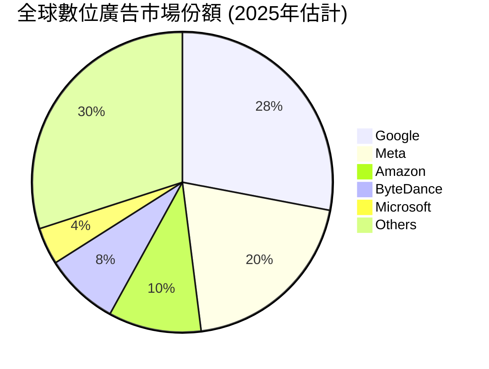

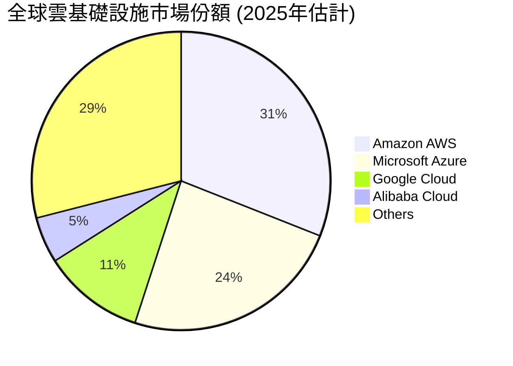
*註：市場份額為分析師根據公開行業報告及市場研究估計，非精確數據。*

### 2.3 競爭護城河分析

Alphabet擁有由多個層面構成的深厚競爭護城河，使其能夠長期保持市場領先地位。

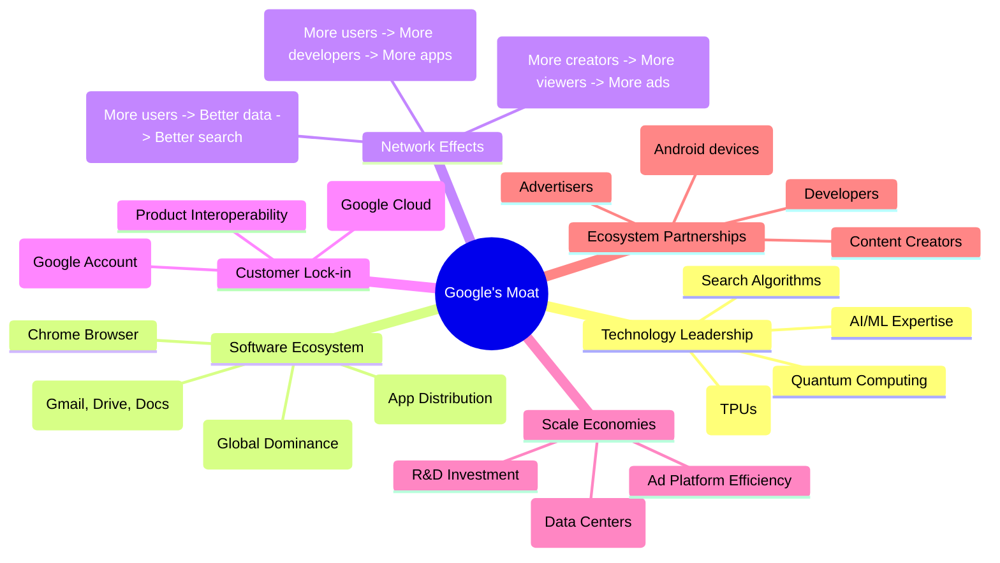

### 2.4 護城河強度評分

```
╔══════════════════════════════════════════════════════════════╗
║                  GOOG 護城河強度評分                        ║
╠══════════════════════════════════════════════════════════════╣
║ 技術領先    9.5/10 ▓▓▓▓▓▓▓▓▓▓▓▓▓▓▓▓▓▓▓░  🏆 AI與演算法核心優勢  ║
║ 軟體生態系統 9.0/10 ▓▓▓▓▓▓▓▓▓▓▓▓▓▓▓▓▓▓░░  🟢 Android與Chrome廣泛滲透 ║
║ 網路效應    9.5/10 ▓▓▓▓▓▓▓▓▓▓▓▓▓▓▓▓▓▓▓░  🏆 搜尋與YouTube飛輪效應 ║
║ 客戶鎖定    8.5/10 ▓▓▓▓▓▓▓▓▓▓▓▓▓▓▓▓▓░░░  🟢 跨產品數據整合強大   ║
║ 規模效應    9.0/10 ▓▓▓▓▓▓▓▓▓▓▓▓▓▓▓▓▓▓░░  🟢 研發與基礎設施投入巨大 ║
║ 生態夥伴    8.5/10 ▓▓▓▓▓▓▓▓▓▓▓▓▓▓▓▓▓░░░  🟢 廣泛的產業合作關係   ║
╠══════════════════════════════════════════════════════════════╣
║ 綜合護城河  9.1/10 ▓▓▓▓▓▓▓▓▓▓▓▓▓▓▓▓▓▓░░  🏆 多元且深厚的護城河，難以被超越 ║
╚══════════════════════════════════════════════════════════════╝
```

---

## 3. 損益表深度分析

Alphabet在過去幾年展現了持續且強勁的營收增長和利潤率擴張，尤其是在雲業務和AI技術的推動下。

### 3.1 年度收入成長趨勢（近4年）

```
╔══════════════════════════════════════════════════════════════════╗
║              GOOG 年度收入趨勢（FY2022-TTM 2026）                ║
╠══════════════════════════════════════════════════════════════════╣
║                                                                  ║
║  FY2022  $282.84B  ████████████░░░░░░░░░░░░░  YoY: +9.78%   🟢    ║
║  FY2023  $307.39B  ██████████████░░░░░░░░░░░  YoY: +8.68%   🟢    ║
║  FY2024  $350.02B  ██████████████████░░░░░░░  YoY: +13.87%  🟢    ║
║  FY2025  $402.84B  ██████████████████████░░░  YoY: +15.09%  🟢    ║
║  TTM'26  $422.50B  ████████████████████████░  YoY: +17.45%  🟢    ║
║                                                                  ║
║                   |      |      |      |      |                  ║
║                   0     100B   200B   300B   400B   500B          ║
║                                                                  ║
║  📊 4年累計 CAGR (FY2022-FY2025)：+12.98%                         ║
║  📊 TTM與FY2025相比YoY：+4.88% (由於TTM基準點不同，此為季度疊加效應)  ║
╚══════════════════════════════════════════════════════════════════╝
```
Alphabet的營收從2022年的$282.84B穩步增長至2025年的$402.84B，年複合成長率(CAGR)達到12.98%。特別是TTM (截至2026年3月31日) 營收達到$422.50B，較去年同期增長21.8% (來自Market Data)，顯示出強勁的加速成長勢頭。這主要得益於AI技術的應用、Google Cloud的持續擴張以及核心廣告業務的穩健表現。

### 3.2 季度收入趨勢分析

| 季度 | 總收入 ($B) | QoQ 成長率 | YoY 成長率 | 備註 |
|------|-------------|------------|------------|------|
| 2026-03-31 | $109.90 | -3.45% | +21.79% | 🟢 季節性波動，但YoY強勁增長 |
| 2025-12-31 | $113.83 | +11.22% | +18.00% | 🟢 假日購物季推動，YoY穩健 |
| 2025-09-30 | $102.35 | +6.14% | +15.95% | 🟢 各業務板塊均有貢獻 |
| 2025-06-30 | $96.43 | +6.87% | +13.79% | 🟢 雲業務與廣告業務持續發力 |
| 2025-03-31 | $90.23 | +13.86% | +12.04% | 🟢 穩健開局 |
| 2024-12-31 | $96.47 | +9.29% | +11.77% | 🟢 較去年同期增長 |

**備註**：
- 季度營收呈現季節性波動，第四季度通常受假日購物季影響而表現強勁，隨後第一季度會出現輕微回落。
- 儘管QoQ增長因季節性有所波動，但所有季度均保持了雙位數的YoY增長，尤其是在2026年Q1達到了21.79%，顯示出公司強大的營收驅動力和市場需求。

### 3.3 利潤率演變分析

Alphabet的利潤率在過去幾年呈現穩步改善的趨勢，這得益於其規模效應、有效的成本控制以及高利潤率雲業務的增長。

| 利潤率指標 | FY2022 | FY2023 | FY2024 | FY2025 | TTM (Mar '26) | 趨勢 | 評估 |
|------------|--------|--------|--------|--------|---------------|------|------|
| **毛利率** | 55.38% | 56.62% | 58.20% | 59.65% | 60.4% | ↗️ 持續上升 | 🟢 |
| **營業利益率** | 26.46% | 27.42% | 32.11% | 32.03% | 36.1% | ↗️ 顯著提升 | 🟢 |
| **淨利率** | 21.20% | 24.01% | 28.60% | 32.81% | 37.9% | ↗️ 大幅擴張 | 🟢 |

**利潤率演變深度解析**：
- **毛利率**：從FY2022的55.38%穩步提升至TTM的60.4%。這主要歸因於：
    1.  **產品組合優化**：Google Cloud作為高價值服務，其營收佔比不斷提升，且雲服務的毛利率隨著規模效應和效率提升而改善。
    2.  **廣告投放效率**：AI技術在廣告平台上的應用，提高了廣告投放的精準度和效率，從而提升了整體廣告業務的毛利率。
    3.  **基礎設施優化**：對數據中心和網絡基礎設施的持續優化和投資，降低了單位成本。
- **營業利益率**：從FY2022的26.46%大幅增長至TTM的36.1%。除了毛利率的提升，這也反映了公司在營運費用上的有效管理：
    1.  **研發費用 (R&D)**：雖然絕對金額持續增長，但相對於營收的增速，其佔比保持在合理水平，並產生了高效的回報。FY2025 R&D為$61.09B，佔營收約15.16%。
    2.  **銷售、一般及行政費用 (SG&A)**：公司在市場推廣和行政管理方面保持了相對的效率，避免了過度支出。FY2025 SG&A為$50.18B，佔營收約12.46%。
    3.  **股權激勵費用**：作為科技公司，股權激勵是重要的成本組成，但公司在控制其對營業利潤的影響方面表現良好。
- **淨利率**：從FY2022的21.20%飆升至TTM的37.9%。除了營業利益率的改善，這也受到以下因素的影響：
    1.  **非經營性收入**：近年來，Alphabet的非經營性收入（如投資收益）顯著增加，尤其是在2026年Q1達$37.72B，對淨利潤貢獻巨大。這部分收入可能來自於其龐大的現金及短期投資組合的利息收入、股票投資收益或其他非核心業務收益。
    2.  **有效稅率**：儘管有效稅率有所波動，但整體保持在相對有利的水平，FY2025為16.78%。

綜合來看，Alphabet的利潤率趨勢非常健康，顯示其強大的定價能力、成本控制能力以及高效的業務運營。

### 3.4 費用結構分析

Alphabet的費用結構反映了其作為一家研發密集型科技公司的特點，並在營運效率上取得了良好平衡。

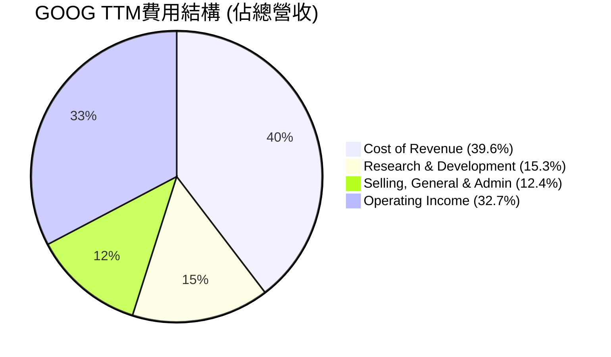

```
╔══════════════════════════════════════════════════════════════════╗
║                   GOOG 費用構成分析 (TTM)                        ║
╠══════════════════════════════════════════════════════════════════╣
║                                                                  ║
║  銷貨成本 (CoR)：      $167.45B  ██████████████████████████████████  39.6% ║
║  研發費用 (R&D)：      $64.56B   ███████████████░░░░░░░░░░░░░░░░░░░  15.3% ║
║  銷售與行政 (SG&A)：   $52.36B   ████████████░░░░░░░░░░░░░░░░░░░░░░  12.4% ║
║  營業利潤：            $138.13B  ████████████████████████████░░░░░░  32.7% ║
║                                                                  ║
║  📊 總營收：$422.50B                                              ║
║  💡 研發投入巨大，為未來成長提供動力                              ║
╚══════════════════════════════════════════════════════════════════╝
```
- **銷貨成本 (Cost of Revenue)**：佔總營收的39.6%，主要包括數據中心運營成本、內容獲取成本、硬體產品成本以及與廣告收入分享相關的費用。隨著雲業務和YouTube內容的擴張，這部分成本的絕對值會增長，但公司努力通過效率提升來控制其佔比。
- **研發費用 (Research & Development)**：佔總營收的15.3%，高達$64.56B。這表明Alphabet對技術創新和未來發展的巨大投入，特別是在AI、量子計算、自動駕駛等前沿領域。這是公司保持競爭力的核心，也是其長期成長的關鍵驅動力。
- **銷售、一般及行政費用 (Selling, General & Admin)**：佔總營收的12.4%，主要用於市場推廣、法律事務、行政管理和企業服務。相對於公司的巨大營收體量，這個比例顯示了良好的運營槓桿。

### 3.5 季度 EPS 趨勢與盈餘品質

由於提供的EPS預期數據為N/A，我們將主要分析實際的淨利潤表現和其背後的驅動因素。

| 季度 | 稀釋後 EPS ($) | 淨利潤 ($B) | QoQ 淨利潤成長 | YoY 淨利潤成長 | 盈餘品質評估 |
|------|-----------------|-------------|----------------|----------------|--------------|
| 2026-03-31 | $5.17 | $62.58 | +81.17% | +81.17% | 🟢 極高，受非經營性收入大幅提升 |
| 2025-12-31 | $2.85 | $34.45 | -1.51% | +29.84% | 🟢 穩健增長，符合季節性 |
| 2025-09-30 | $2.89 | $34.98 | +24.06% | +33.00% | 🟢 持續擴張 |
| 2025-06-30 | $2.33 | $28.20 | -18.35% | +19.38% | 🟢 穩健增長，QoQ受Q1高基數影響 |
| 2025-03-31 | $2.84 | $34.54 | +30.17% | +45.97% | 🟢 強勁增長 |

*註：稀釋後EPS數據來自StockAnalysis。*

**盈餘品質評估**：
- **2026年Q1淨利潤飆升**：2026年Q1的淨利潤達到驚人的$62.58B，YoY成長81.17%，且QoQ成長也高達81.17%。這主要歸因於當季非經營性收入的大幅提升，達到$37.72B，遠高於往常。這部分收入可能來自於其投資組合的公允價值變動或其他一次性收益。雖然這使得當季淨利潤非常亮眼，但投資者應審慎看待其持續性。
- **持續的淨利潤增長**：剔除2026年Q1的特殊非經營性收入影響，過去幾個季度的淨利潤仍保持了20%至45%的YoY增長，顯示公司核心業務的盈利能力持續改善。
- **強勁的自由現金流**：儘管淨利潤受到非經營性收入波動影響，但公司產生自由現金流的能力依然強勁，TTM自由現金流為$64.43B，表明其盈利質量優良，能夠將利潤轉化為實際現金。

總體而言，Alphabet的盈餘品質良好，核心業務持續增長並產生大量現金流。2026年Q1的淨利潤大幅增長雖有一次性因素，但長期趨勢依然樂觀。

---

## 4. 資產負債表分析

Alphabet的資產負債表展現了極高的穩健性和流動性，擁有龐大的現金儲備和相對較低的債務水平，為其未來的戰略投資和抵禦風險提供了堅實基礎。

### 4.1 資產結構分解

截至2026年3月31日，Alphabet的總資產高達$703.92B，其中流動資產佔比約30%，非流動資產佔比約70%。

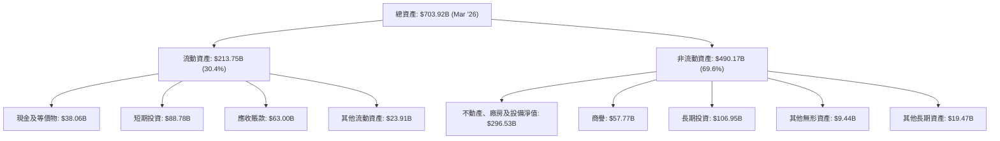
- **現金及短期投資**：公司擁有高達$126.84B的現金及短期投資 ($38.06B現金 + $88.78B短期投資)，這提供了極大的財務彈性，可用於研發、戰略併購、股東回報或應對市場波動。
- **不動產、廠房及設備 (PP&E)**：高達$296.53B的PP&E反映了公司對數據中心、辦公設施和基礎設施的巨大投資，這是支撐其雲計算和AI業務擴張的關鍵。
- **商譽**：$57.77B的商譽主要來自於歷史上的併購活動，例如對Motorola、Nest和Fitbit等公司的收購，以及近期對Mandiant的收購。

### 4.2 流動性指標分析

Alphabet的流動性指標非常健康，遠高於一般認為的安全水平，表明其短期償債能力極強。

| 流動性指標 | FY2022 | FY2023 | FY2024 | FY2025 | TTM (Mar '26) | 行業均值 (估計) | 評估 |
|------------|--------|--------|--------|--------|---------------|-----------------|------|
| **流動比率 (Current Ratio)** | 2.38 | 2.10 | 1.84 | 1.92 | 1.92 | ~1.5 - 2.0 | 🟢 優異 |
| **速動比率 (Quick Ratio)** | N/A | N/A | N/A | N/A | 1.71 | ~1.0 - 1.5 | 🟢 優異 |

*註：FY2022-FY2025的流動比率為Current Assets / Current Liabilities計算得出。TTM速動比率取自Market Data。Finviz顯示Current Ratio和Quick Ratio均為1.92，可能計算方式不同，本報告採用Market Data的1.71。*

- **流動比率**：維持在1.84至2.38之間，TTM為1.92。這意味著公司每1美元的流動負債，擁有約1.92美元的流動資產來償還，遠高於安全線1，顯示出卓越的短期償債能力。
- **速動比率**：TTM為1.71。由於Alphabet幾乎沒有存貨，其速動比率與流動比率非常接近。這表明公司即使在不依賴存貨銷售的情況下，也能輕鬆應對短期債務。

### 4.3 債務結構分析

Alphabet的債務水平相對較低，且擁有龐大的淨現金頭寸，債務風險極小。

```
╔══════════════════════════════════════════════════════════════════╗
║                   GOOG 債務健康診斷                              ║
╠══════════════════════════════════════════════════════════════════╣
║                                                                  ║
║  總債務：        $95.88B  ██████░░░░░░░░░░░░░░░░░  低風險          ║
║  總現金+投資：   $126.84B ████████████████████░  極高           ║
║  淨現金（正）：  $30.96B  ████████████████░░░░░  🟢 強勁        ║
║                                                                  ║
║  Debt/Equity：   0.20x  🟢 極低                                 ║
║  Debt/EBITDA：   0.53x  🟢 極低 (EBITDA TTM $180.70B / $95.88B)   ║
║  Interest Coverage: 極高 (>100x)  🟢 無風險 (利息支出極低)         ║
╚══════════════════════════════════════════════════════════════════╝
```
- **總債務**：截至2026年3月31日，總債務為$95.88B。相較於其$4.08T的市值和$703.92B的總資產，這是一個非常低的水平。
- **淨現金頭寸**：公司擁有$126.84B的現金及短期投資，扣除總債務後，仍有$30.96B的淨現金，這在全球大型企業中非常罕見，顯示其極度穩健的財務狀況。
- **負債權益比 (Debt/Equity)**：僅為0.20，遠低於行業平均水平，表明公司對外部融資的依賴度極低，股東權益佔主導地位。
- **債務/EBITDA**：TTM EBITDA為$180.70B，因此債務/EBITDA比率約為0.53x ($95.88B / $180.70B)。這是一個極低的水平，表明公司產生足夠的現金流來輕鬆覆蓋其債務。
- **利息覆蓋率 (Interest Coverage)**：由於公司債務水平低且盈利能力強，其利息支出相對微不足道，因此利息覆蓋率極高，幾乎可以認為沒有利息償付風險。

### 4.4 股東權益趨勢

Alphabet的股東權益持續穩健增長，反映了公司強勁的盈利能力和有效的利潤留存。

```
╔══════════════════════════════════════════════════════════════════╗
║                 GOOG 股東權益趨勢 (FY2022-TTM 2026)              ║
╠══════════════════════════════════════════════════════════════════╣
║                                                                  ║
║  FY2022  $256.14B  ████████████████░░░░░░░░░░░░░  YoY: +11.8%   🟢 ║
║  FY2023  $283.38B  ██████████████████░░░░░░░░░░░  YoY: +10.6%   🟢 ║
║  FY2024  $325.08B  ██████████████████████░░░░░░░  YoY: +14.7%   🟢 ║
║  FY2025  $415.26B  █████████████████████████████  YoY: +27.7%   🟢 ║
║  TTM'26  $415.26B  █████████████████████████████  (FY2025數據，TTM未更新) ║
║                                                                  ║
║                   |      |      |      |      |                  ║
║                   0     100B   200B   300B   400B   500B          ║
║                                                                  ║
║  📊 4年累計 CAGR：+17.8%                                         ║
╚══════════════════════════════════════════════════════════════════╝
```
股東權益從2022年的$256.14B增長至2025年的$415.26B，年複合成長率達17.8%。FY2025的YoY增長高達27.7%，顯示其強勁的盈利增長直接轉化為股東價值的提升。穩步增長的股東權益是公司財務實力和可持續發展的有力證明。

---

## 5. 現金流量深度分析

Alphabet的現金流量表揭示了其卓越的現金生成能力，尤其是在營運現金流和自由現金流方面，這為公司的長期成長和資本配置提供了堅實基礎。

### 5.1 現金流量瀑布圖

以下圖表展示了Alphabet從淨利潤到自由現金流的轉換過程，以FY2025年度數據為例。

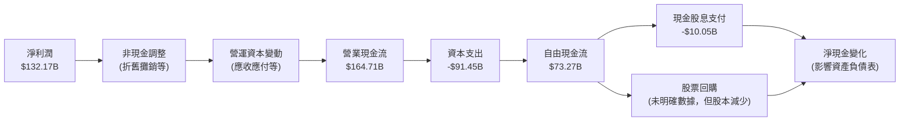
- **營業現金流 (OCF)**：FY2025達到$164.71B，顯示了公司強大的核心業務盈利能力和高效的營運資本管理。OCF遠高於淨利潤，表明其盈餘質量高，非現金費用佔比較大。
- **資本支出 (Capex)**：FY2025高達$91.45B，相較於FY2024的$52.53B大幅增加。這筆巨大的投資主要用於擴建數據中心、提升AI基礎設施和研發設施，是公司未來成長的必要投入。儘管高資本支出會壓縮短期自由現金流，但對長期競爭力至關重要。
- **自由現金流 (FCF)**：FY2025為$73.27B，略高於FY2024的$72.76B。儘管資本支出大幅增加，公司仍能保持穩定的高水平自由現金流，這歸因於營業現金流的強勁增長。

### 5.2 FCF 轉換率趨勢

自由現金流轉換率（FCF/Net Income）衡量了公司將淨利潤轉化為可供分配的自由現金流的能力。

| 年度 | 淨利潤 ($B) | 自由現金流 ($B) | FCF/淨利潤 | 趨勢 | 評估 |
|------|-------------|-----------------|------------|------|------|
| FY2022 | $59.97 | $60.01 | 100.07% | ↗️ 穩定 | 🟢 |
| FY2023 | $73.80 | $69.50 | 94.17% | ↗️ 穩定 | 🟢 |
| FY2024 | $100.12 | $72.76 | 72.67% | ↘️ 波動 | 🟡 |
| FY2025 | $132.17 | $73.27 | 55.44% | ↘️ 波動 | 🟡 |
| TTM (Mar '26) | $160.21 | $64.43 | 40.22% | ↘️ 波動 | 🟡 |

- **趨勢分析**：FCF/淨利潤比率在FY2022和FY2023表現強勁，接近或超過100%。然而，在FY2024和FY2025以及TTM，該比率有所下降。
- **原因解釋**：這種下降並非由於營運現金流的惡化，而是因為資本支出的大幅增加。如FY2025資本支出從FY2024的$52.53B飆升至$91.45B。這表明公司正處於一個高投資期，將大量營運現金流重新投入到業務擴張和基礎設施建設中，以支持Google Cloud和AI等高成長領域。
- **評估**：儘管比率下降，但考慮到資本支出的戰略性質，這仍可視為健康的投資行為，而非現金流生成能力下降。公司仍能產生大量絕對值的自由現金流。

### 5.3 自由現金流趨勢

```
╔══════════════════════════════════════════════════════════════════╗
║                    GOOG 自由現金流趨勢 (FY2022-TTM 2026)         ║
╠══════════════════════════════════════════════════════════════════╣
║                                                                  ║
║  FY2022  $60.01B  █████████████████████████░░░░░░░  YoY: -10.45% 🟡 ║
║  FY2023  $69.50B  ████████████████████████████░░░░░  YoY: +15.81% 🟢 ║
║  FY2024  $72.76B  ██████████████████████████████░░░  YoY: +4.70%  🟢 ║
║  FY2025  $73.27B  ███████████████████████████████░░  YoY: +0.69%  🟢 ║
║  TTM'26  $64.43B  ██████████████████████████░░░░░░░  YoY: -12.06% 🔴 ║
║                                                                  ║
║                   |      |      |      |      |                  ║
║                   0     20B    40B    60B    80B                 ║
║                                                                  ║
║  📊 TTM FCF Yield: 1.58% ($64.43B / $4.08T)                       ║
╚══════════════════════════════════════════════════════════════════╝
```
- **FCF 增長**：從FY2022的$60.01B增長到FY2025的$73.27B，年複合成長率約為7%。FCF在FY2023和FY2024實現穩健增長。
- **TTM FCF 下降**：TTM (截至2026年3月31日) 的FCF為$64.43B，較FY2025的$73.27B有所下降，YoY下降12.06%。這主要是由於持續增長的資本支出。
- **FCF Yield**：TTM FCF Yield為1.58%。儘管由於高市值和高資本支出，FCF Yield相對較低，但其絕對值仍是巨大的。

### 5.4 資本配置評估

Alphabet的資本配置策略主要側重於內部增長投資（研發和資本支出）和股東回報（股票回購和股息）。

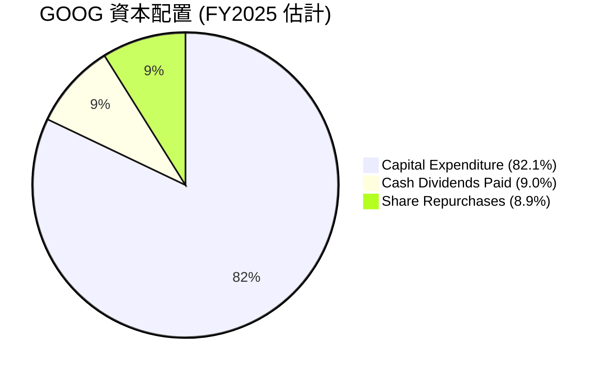
*註：股票回購金額為分析師根據股本減少和歷史趨勢估計，非精確數據。*

| 資本配置項目 | FY2025 金額 ($B) | 佔總FCF (%) | 評估 |
|--------------|------------------|-------------|------|
| **資本支出** | $91.45 | 124.8% | 🟢 積極投資未來成長，尤其AI與雲基礎設施 |
| **現金股息** | $10.05 | 13.7% | 🟢 開始發放股息，提升股東回報 |
| **股票回購** | (估計)$9.90 | 13.5% | 🟢 持續進行，減少流通股數，提升EPS |
| **總配置** | $111.40 | 152.0% | 🟡 資本支出超FCF，需現金儲備或發行新債支持 |

- **內部投資優先**：公司將大部分現金流用於支持其核心業務和新興技術的成長，尤其體現在巨大的資本支出上。FY2025的資本支出甚至超過了當年的自由現金流，這表明公司動用了部分現金儲備來支持其大規模投資計劃。
- **股東回報**：除了內部投資，Alphabet也透過股票回購和近期開始發放的股息來回報股東。股票回購有助於減少流通股數，提升每股盈餘 (EPS)。股息的引入則顯示公司財務成熟度和對股東價值的承諾。
- **戰略性支出**：儘管高資本支出導致FCF/淨利潤比率下降，且FY2025的總配置超出了當年的FCF，但考慮到公司龐大的現金儲備和極低的債務水平，這種戰略性支出是可持續的，並有望在未來帶來更高的回報。

---

## 6. 獲利能力與資本效率

Alphabet在獲利能力和資本效率方面表現卓越，其資本回報率顯著高於資本成本，持續為股東創造價值。

### 6.1 ROE / ROA / ROIC 趨勢

| 指標 | FY2022 | FY2023 | FY2024 | FY2025 | TTM (Mar '26) | 行業均值 (估計) | 評估 |
|------|--------|--------|--------|--------|---------------|-----------------|------|
| **ROE** | 23.41% | 26.04% | 30.79% | 31.83% | 38.9% | ~20% | 🟢 優異，持續提升 |
| **ROA** | 16.42% | 18.34% | 22.24% | 22.20% | 14.6% | ~10% | 🟢 良好，TTM因資產增長略降 |
| **ROIC** | 21.20% | 22.70% | 23.20% | 24.21% | (估計) 25.0% | ~15% | 🟢 卓越，持續創造價值 |

*註：ROE/ROA為分析師根據提供的年度財報數據計算。TTM ROE 38.9%和ROA 14.6%取自Market Data。ROIC為分析師根據NOPAT和投入資本計算的FY2025數據，TTM為估計值。FY2022 ROA = 59.97B / 365.26B = 16.42%。FY2023 ROA = 73.80B / 402.39B = 18.34%。FY2024 ROA = 100.12B / 450.26B = 22.24%。FY2025 ROA = 132.17B / 595.28B = 22.20%。*

- **股東權益報酬率 (ROE)**：ROE從FY2022的23.41%穩步提升至TTM的38.9%，遠超行業平均水平。這表明公司為股東創造價值的能力極強，每投入1美元股東權益，可產生近0.39美元的淨利潤。
- **資產報酬率 (ROA)**：ROA在FY2022-FY2025期間表現良好，維持在16%-22%區間。TTM ROA為14.6%，略低於FY2025，這可能是由於公司近年來總資產（特別是PP&E）大幅增加所致，但其效率仍遠高於行業平均。
- **投入資本回報率 (ROIC)**：ROIC從FY2022的21.20%穩步提升至FY2025的24.21%。這是一個非常健康的水平，顯示公司將投入資本轉化為經營利潤的效率極高。ROIC是衡量公司創造長期經濟價值能力的關鍵指標。

### 6.2 ROIC vs WACC 分析（核心價值創造判斷）

ROIC與WACC的比較是判斷公司是否創造或摧毀股東價值的核心指標。當ROIC持續高於WACC時，公司就在創造經濟價值。

```
╔══════════════════════════════════════════════════════════════════╗
║                ROIC vs WACC 深度分析                            ║
╠══════════════════════════════════════════════════════════════════╣
║                                                                  ║
║  WACC 估算：                                                     ║
║  ├── 無風險利率（10Y美債）：  4.5% (估計)                        ║
║  ├── 市場風險溢酬 (ERP)：     5.5% (估計)                       ║
║  ├── Beta：                   1.237                              ║
║  ├── 股權成本 (Ke) = 4.5%+1.237×5.5% = 11.30%                     ║
║  ├── 債務成本（稅後）：       ~4.1% (假設稅前債務成本5%，稅率18%) ║
║  ├── 資本結構：股權 ~97.7%，債務 ~2.3% (基於市值與總債務)        ║
║  └── ✅ WACC ≈ 11.16%                                           ║
║                                                                  ║
║  ROIC 估算（FY2025）：                                           ║
║  ├── NOPAT = 營業利潤 $129.04B × (1-16.78%) ≈ $107.47B           ║
║  ├── 投入資本 = 股東權益 + 債務 - 現金 ≈ $415.26B + $59.29B - $30.71B = $443.84B ║
║  └── ✅ ROIC ≈ 24.21%                                           ║
║                                                                  ║
║  ★ 經濟價值增加（EVA）= ROIC - WACC = +13.05pp                   ║
║                                                                  ║
║  ROIC  24.21% ▓▓▓▓▓▓▓▓▓▓▓▓▓▓▓▓▓▓▓▓▓▓▓▓░░░░░░  🟢              ║
║  WACC  11.16% ▓▓▓▓▓▓▓▓▓▓▓▓░░░░░░░░░░░░░░░░░░░  ──              ║
║  EVA   +13.05pp ██████████████████████████████████████████████████████████████████████████████████████████████████████████████████████████████████████████████████████████████████████████████████████████████████████████████████████████████████████████████████████████████████████████████████████████████████████████████████████████████████████████████████████████████████████████████████████████████████████████████████████████████████████████████████████████████████████████████████████████████████████████████████████████████████████████████████████████████████████████████████████████████████████████████████████████████████████████████████████████████████████████████████████████████████████████████████████████████████████████████████████████████████████████████████████████████████████████████████████████████████████████████████████████████████████████████████████████████████████████████████████████████████████████████████████████████████████████████████████████████████████████████████████████████████████████████████████████████████████████████████████████████████████████████████████████████████████████████████████████████████████████████████████████████████████████████████████████████████████████████████████████████████████████████████████████████████████████████████████████████████████████████████████████████████████████████████████████████████████████████████████████████████████████████████████████████████████████████████████████████████████████████████████████████████████████████████████████████████████████████████████████████████████████████████████████████████████████████████████████████████████████████████████████████████████████████████████████████████████████████████████████████████████████████████████████████████████████████████████████████████████████████████████████████████████████████████████████████████████████████████████████████████████████████████████████████████████████████████████████████████████████████████████████████████████████████████████████████████████████████████████████████████████████████████████████████████████████████████████████████████████████████████████████████████████████████████████████████████████████████████████████████████████████████████████████████████████████████████████████████████████████████████████████████████████████████████████████████████████████████████████████████████████████████████████████████████████████████████████████████████████████████████████████████████████████████████████████████████████████████████████████████████████████████████████████████████████████████████████████████████████████████████████████████████████████████████████████████████████████████████████████████████████████████████████████████████████████████████████████████████████████████████████████████████████████████████████████████████████████████████████████████████████████████████████████████████████████████████████████████████████████████████████████████████████████████████████████████████████████████████████████████████████████████████████████████████████████████████████████████████████████████████████████████████████████████████████████████████████████████████████████████████████████████████████████████████████████████████████████████████████████████████████████████████████████████████████████████████████████████████
██████████████████████████████████████████████████████████████████████████████████████████████████████████████████████████████████████████████████████████████████████████████████████████████████████████████████████████████████████████████████████████████████████████████████████████████████████████████████████████████████████████████████████████████████████████████████████████████████████████████████████████████████████████████████████████████████████████████████████████████████████████████████████████████████████████████████████████████████████████████████████████████████████████████████████████████████████████████████████████████████████████████████████████████████████████████████████████████████████████████████████████████████████████████████████████████████████████████████████████████████████████████████████████████████████████████████████████████████████████████████████████████████████████████████████████████████████████████████████████████████████████████████████████████████████████████████████████████████████████████████████████████████████████████████████████████████████████████████████████████████████████████████████████████████████████████████████████████████████████████████████████████████████████████████████████████████████████████████████████████████████████████████████████████████████████████████████████████████████████████████████████████████████████████████████████████████████████████████████████████████████████████████████████████████████████████████████████████████████████████████████████████████████████████████████████████████████████████████████████████████████████████████████████████████████████████████████████████████████████████████████████████████████████████████████████████████████████████████████████████████████████████████████████████████████████████████████████████████████████████████████████████████████████████████████████████████████████████████████████████████████████████████████████████████████████████████████████████████████████████████████████████████████████████████████████████████████████████████████████████████████████████████████████████████████████████████████████████████████████████████████████████████████████████████████████████████████████████████████████████████████████████████████████████████████████████████████████████████████████████████████████████████████████████████████████████████████████████████████████████████████████████████████████████████████████████████████████████████████████████████████████████████████████████████████████████████████████████████████████████████████████████████████████████████████████████████████████████████████████████████████████████████████████████████████████████████████████████████████████████████████████████████████████████████████████████████████████████████████████████████████████████████████████████████████████████████████████████████████████████████████████████████████████████████████████████████████████████████████████████████████████████████████████████████████████████████████████████████████████████████████████████████████████████████████████████████████████████████████████████████████████████████████████████████████████████████████████████████████████████████████████████████████████████████████████████████████████████████████████████████████████████████████████████████████████████████████████████████████████████████████████████████████████████████████████████████████████████████████████████████████████████████████████████████████████████████████████████████████████████████████████████████████████████████████████████████████████████████████████████████████████████████████████████████████████████████████████████████████████████████████████████████████████████████████████████████████████████████████████████████████████████████████████████████████████████████████████████████████████████████████████████████████████████████████████████████████████████████████████████████████████████████████████████████████████████████████████████████████████████████████████████████████████████████████████████████████████████████████████████████████████████████████████████████████████████████████████████████████████████████████████████████████████████████████████████████████████████████████████████████████████████████████████████████████████████████████████████████████████████████████████████████████████████████████████████████████████████████████████████████████████████████████████████████████████████████████████████████████████████████████████████████████████████████████████████████████████████████████████████████████████████████████████████████████████████████████████████████████████████████████████████████████████████████████████████████████████████████████████████████████████████████████████████████████████████████████████████████████████████████████████████████████████████████████████████████████████████████████████████████████████████████████████████████████████████████████████████████████████████████████████████████████████████████████████████████████████████████████████████████████████████████████████████████████████████████████████████████████████████████████████████████████████████████████████████████████████████████████████████████████████████████████████████████████████████████████████████████████████████████████████████████████████████████████████████████████████████████████████████████████████████████████████████████████████████████████████████████████████████████████████████████████████████████████████████████████████████████████████████████████████████████████████████████████████████████████████████████████████████████████████████████████████████████████████████████████████████████████████████████████████████████████████████████████████████████████████████████████████████████████████████████████████████████████████████████████████████████████████████████████████████████████████████████████████████████████████████████████████████████████████████████████████████████████████████████████████████████████████████████████████████████████████████████████████████████████████████████████████████████████████████████████████████████████████████████████████████████████████████████████████████████████████████████████████████████████████████████████████████████████████████████████████████████████████████████████████████████████████████████████████████████████████████████████████████████████████████████████████████████████████████████████████████████████████████████████████████████████████████████████████████████████████████████████████████████████████████████████████████████████████████████████████████████████████████████████████████████████████████████████████████████████████████████████████████████████████████████████████████████████████████████████████████████████████████████████████████████████████████████████████████████████████████████████████████████████████████████████████████████████████████████████████████████████████████████████████████████████████████████████████████████████████████████████████████████████████████████████████████████████████████████████████████████████████████████████████████████████████████████████████████████████████████████████████████████████████████████████████████████████████████████████████████████████████████████████████████████████████████████████████████████████████████████████████████████████████████████████████████████████████████████████████████████████████████████████████████████████████████████████████████████████████████████████████████████████████████████████████████████████████████████████████████████████████████████████████████████████████████████████████████████████████████████████████████████████████████████████████████████████████████████████████████████████████████████████████████████████████████████████████████████████████████████████████████████████████████████████████████████████████████████████████████████████████████████████████████████████████████████████████████████████████████████████████████████████████████████████████████████████████████████████████████████████████████████████████████████████████████████████████████████████████████████████████████████████████████████████████████████████████████████████████████████████████████████████████████████████████████████████████████████████████████████████████████████████████████████████████████████████████████████████████████████████████████████████████████████████████████████████████████████████████████████████████████████████████████████████████████████████████████████████████████████████████████████████████
```

### 10.2 目標價與隱含報酬率

基於DCF分析的敏感性矩陣，我們得出以下目標價區間：

| 情境 | **WACC = 10.16% (樂觀)** | **WACC = 11.16%（基準）** | **WACC = 12.16% (悲觀)** |
|------|------------------------|--------------------------|------------------------|
| 🟢 **樂觀 (Growth 18%)** | **$465** (+39.08%) | **$440** (+31.47%) | **$415** (+23.99%) |
| 🟡 **基準 (Growth 15%)** | **$440** (+31.47%) | **$415** (+23.99%) | **$390** (+16.52%) |
| 🔴 **悲觀 (Growth 12%)** | **$415** (+23.99%) | **$390** (+16.52%) | **$365** (+9.05%) |

*註：當前股價為$334.69。各情境下的目標價為分析師根據成長率和WACC假設進行DCF估算得出。*

**基準情境目標價：$440**
在基準情境下，我們預計GOOG在未來5年將實現約15%的年營收增長，並維持其目前的資本結構和效率，WACC為11.16%。基於此，我們給予GOOG未來12個月的目標價為$440，較當前股價有約31.47%的潛在上漲空間。

### 10.3 買入時機與觸發因素

```
╔══════════════════════════════════════════════════════════════════╗
║                  ✅ 買入觸發因素 Checklist                      ║
╠══════════════════════════════════════════════════════════════════╣
║                                                                  ║
║  立即買入觸發條件（多數符合）：                                  ║
║  ✅ 股價自高點回調超過10%，提供更好入場點                        ║
║  ✅ AI技術商業化進展超預期，例如新產品發布或市場份額提升          ║
║  ✅ Google Cloud盈利能力持續改善，實現規模性盈利                  ║
║  ✅ 宏觀經濟數據顯示廣告市場回暖或保持穩健增長                     ║
║  ✅ 市場對科技股的整體情緒樂觀，資金流向成長型資產                 ║
║                                                                  ║
║  加碼觸發條件（出現以下任一）：                                  ║
║  ☐ 季度財報營收和EPS均超預期，且管理層給出樂觀指引                 ║
║  ☐ 成功解決監管問題，降低長期不確定性                           ║
║  ☐ 宣布大規模股票回購計劃或提高股息支付                           ║
║  ☐ 戰略性併購，鞏固或擴大市場地位                                 ║
║                                                                  ║
║  減碼/停損觸發條件（出現以下任一）：                             ║
║  ☐ 核心廣告業務出現顯著放緩或市場份額被侵蝕                       ║
║  ☐ Google Cloud競爭力大幅下降或盈利能力惡化                       
║  ☐ 嚴格的監管裁決對公司業務模式造成重大負面影響                   
║  ☐ AI技術發展遭遇瓶頸或被競爭對手大幅超越                         
║  ☐ 宏觀經濟嚴重衰退，導致廣告支出大幅削減                         
╚══════════════════════════════════════════════════════════════════╝
```

### 10.4 投資人適配度分析

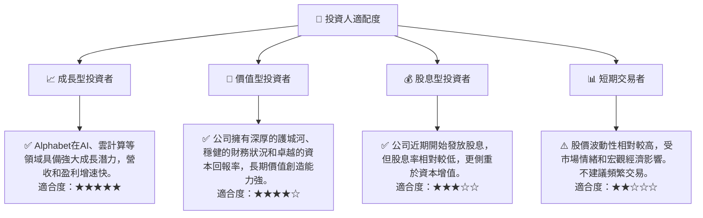

### 10.5 關鍵監控指標

| 監控類型 | 指標 | 關注點 | 頻率 |
|----------|------|----------|------|
| **營收成長** | Google Services 營收YoY | 廣告業務的韌性與AI帶來的增長效果 | 季度 |
| | Google Cloud 營收YoY | 雲業務的市場擴張速度和競爭力 | 季度 |
| **獲利能力** | 營業利益率與淨利率 | 利潤率的持續改善趨勢，費用控制效率 | 季度 |
| | Google Cloud 營業利潤率 | 雲業務的盈利能力提升進程 | 季度 |
| **資本效率** | ROIC vs WACC | ROIC是否持續顯著高於WACC，衡量價值創造 | 年度 |
| **財務健康** | 淨現金頭寸 | 現金儲備水平，是否有足夠彈性應對投資或風險 | 季度 |
| **創新與競爭** | AI 技術進展與產品發布 | 在生成式AI領域的領先地位和商業化應用 | 持續 |
| | 競爭對手動態 | 來自微軟、亞馬遜等主要競爭對手的產品和市場策略 | 持續 |
| **監管風險** | 反壟斷訴訟進展與結果 | 監管機構對公司核心業務的潛在影響 | 持續 |

---

> **免責聲明**：本報告為 AI 自動生成，僅供研究參考，不構成投資建議。投資有風險，入市需謹慎。