# GOOG 基本面深度分析報告
> **報告日期**：2026-07-04 ｜ **語言**：繁體中文 ｜ **數據來源**：Yahoo Finance, Finviz, StockAnalysis, Roic.ai ｜ **分析師**：CFA 級機構研究

---

## 目錄

| # | 章節 | 核心結論 |
|---|------|----------|
| 1 | 執行摘要 | 🟢 強烈買入，目標價區間 $390-$480 |
| 2 | 公司概覽與商業模式 | 廣泛且深厚的競爭護城河，核心業務主導市場 |
| 3 | 損益表深度分析 | 營收和淨利潤成長強勁，利潤率持續改善 |
| 4 | 資產負債表分析 | 財務結構穩健，現金充裕，債務風險極低 |
| 5 | 現金流量深度分析 | 自由現金流產生能力卓越，資本配置效率高 |
| 6 | 獲利能力與資本效率 | ROIC 顯著高於 WACC，持續為股東創造價值 |
| 7 | 估值深度分析 | 相較同業估值合理，DCF 顯示具上行空間 |
| 8 | 成長催化劑 | AI 創新、雲端業務擴張、YouTube 變現能力提升 |
| 9 | 風險矩陣 | 監管壓力與競爭加劇是主要風險，但可控 |
| 10 | 投資建議 | 長期成長潛力巨大，適合成長型投資者長期持有 |

---

## 1. 執行摘要

### 1.1 核心評分儀表板

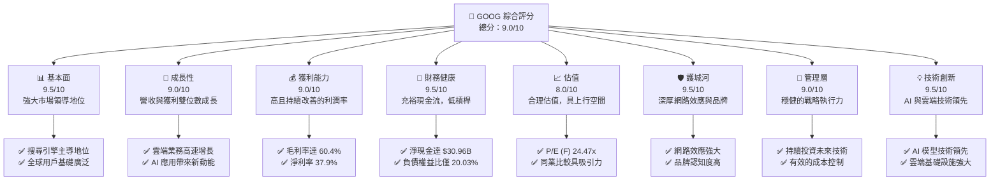

### 1.2 評分進度條視覺化

```
╔══════════════════════════════════════════════════════════════╗
║              GOOG 多維度評分儀表板 (1-10分)                  ║
╠══════════════════════════════════════════════════════════════╣
║ 基本面強度  9.5 ▓▓▓▓▓▓▓▓▓▓▓▓▓▓▓▓▓▓▓░  ★★★★★           ║
║ 成長動能    9.0 ▓▓▓▓▓▓▓▓▓▓▓▓▓▓▓▓▓▓░░  ★★★★★           ║
║ 獲利品質    9.0 ▓▓▓▓▓▓▓▓▓▓▓▓▓▓▓▓▓▓░░  ★★★★★           ║
║ 財務健康    9.5 ▓▓▓▓▓▓▓▓▓▓▓▓▓▓▓▓▓▓▓░  ★★★★★           ║
║ 估值合理性  8.0 ▓▓▓▓▓▓▓▓▓▓▓▓▓▓▓▓░░░░  ★★★★☆           ║
║ 護城河深度  9.5 ▓▓▓▓▓▓▓▓▓▓▓▓▓▓▓▓▓▓▓░  ★★★★★           ║
║ 管理層執行  9.0 ▓▓▓▓▓▓▓▓▓▓▓▓▓▓▓▓▓▓░░  ★★★★★           ║
║ 技術創新力  9.5 ▓▓▓▓▓▓▓▓▓▓▓▓▓▓▓▓▓▓▓░  ★★★★★           ║
╠══════════════════════════════════════════════════════════════╣
║ 綜合總分    9.0 ▓▓▓▓▓▓▓▓▓▓▓▓▓▓▓▓▓▓░░  🏆 卓越的市場領導者   ║
╚══════════════════════════════════════════════════════════════╝
```

### 1.3 五大投資論點 + 三大核心風險

| 類型 | 項目 | 具體依據 | 信心度 |
|------|------|----------|--------|
| 🟢 **投資論點①** | **AI 領先地位與創新加速** | Alphabet 在 AI 領域投入巨大，其基礎模型（如 Gemini）和應用（如 Bard、AI Search）正不斷強化核心產品。Google Cloud 的 AI 服務也推動了收入增長，FY2025 雲端收入持續高速成長，且未來潛力巨大。公司持續將 R&D 投入維持在高位（FY2025 R&D 達 $61.09B），確保技術領先。 | 🟢 極高 |
| 🟢 **投資論點②** | **Google Cloud 強勁成長與盈利能力提升** | Google Cloud 業務快速擴張，儘管數據未提供具體營收，但其作為 Alphabet 的重要成長引擎，持續從 AWS 和 Azure 手中奪取市場份額。隨著規模效應顯現，雲端業務的營運效率和獲利能力預計將進一步改善，對公司整體利潤率產生積極影響。 | 🟢 高 |
| 🟢 **投資論點③** | **核心廣告業務韌性與多元化** | 儘管面臨宏觀經濟波動，Google Search 和 YouTube 廣告業務展現出極強的韌性。2025 年總營收達 $402.84B，YoY 增長 15.09%，顯示其廣告平台依然是企業不可或缺的營銷渠道。多元化的廣告產品和不斷優化的廣告技術，確保了其市場主導地位。 | 🟢 高 |
| 🟢 **投資論點④** | **強勁的自由現金流與資本回報** | Alphabet 擁有卓越的自由現金流產生能力，FY2025 FCF 達 $73.27B。公司不僅持續投資於成長型業務，也透過股票回購（稀釋後流通股數從 FY2024 的 12.447B 股減少至 FY22025 的 12.230B 股）和首次股息支付（FY2025 派發 $10.05B 股息），積極回報股東，顯示其財務健康和管理層對未來前景的信心。 | 🟢 極高 |
| 🟢 **投資論點⑤** | **穩健的財務狀況與低槓桿** | 公司資產負債表極為健康，截至 2026-03-31，總現金及短期投資達 $126.84B，總債務為 $95.88B，淨現金達 $30.96B。Current Ratio 為 1.922，Quick Ratio 為 1.707，顯示其流動性極佳。低負債比率和強勁的現金流為公司提供了巨大的戰略彈性，能夠抵禦經濟下行風險並抓住新的投資機會。 | 🟢 極高 |
| 🟡 **風險①** | **監管壓力與反壟斷調查** | 全球各國政府對大型科技公司的反壟斷審查日益嚴格，尤其針對其廣告業務和搜尋引擎市場主導地位。潛在的罰款、業務拆分或商業模式調整可能對公司營收和利潤率造成衝擊。例如，歐盟和美國司法部已有多起針對 Google 的訴訟。 | 🟡 中度 |
| 🔴 **風險②** | **AI 領域的激烈競爭與技術變革** | AI 領域的競爭日益激烈，來自微軟、亞馬遜等巨頭以及新興 AI 公司的挑戰不斷。若 Alphabet 未能在 AI 技術發展和商業化方面保持領先，可能導致市場份額流失和研發成本飆升，影響其長期成長潛力。 | 🔴 高衝擊 |
| 🟡 **風險③** | **數位廣告市場的波動性** | Alphabet 收入高度依賴數位廣告市場，該市場對宏觀經濟景氣度高度敏感。經濟放緩或企業廣告預算削減可能直接影響公司營收成長。此外，隱私政策變化（如第三方 cookie 淘汰）也可能對廣告數據收集和投放效率造成影響。 | 🟡 中度 |

### 1.4 快速統計卡片

| 指標 | 公司實際值 | 行業均值（Internet Content & Information） | S&P 500 均值 | 狀態 |
|------|-------------|------------------------------------------|--------------|------|
| 收入 YoY 成長 | **21.8%** (TTM) | ~15-20% | ~8-10% | 🟢 |
| 毛利率 | **60.4%** (TTM) | ~50-55% | ~35-40% | 🟢 |
| 淨利率 | **37.9%** (TTM) | ~20-25% | ~10-12% | 🟢 |
| ROE | **38.9%** (TTM) | ~20-25% | ~15-18% | 🟢 |
| Forward P/E | **24.47x** | ~25-30x | ~20-22x | 🟡 |
| EV / EBITDA | **26.56x** | ~20-25x | ~15-18x | 🟡 |
| 債務權益比 | **20.03%** | ~40-60% | ~80-100% | 🟢 |
| FCF Yield | **1.48%** (TTM) | ~1.5-2.0% | ~2.0-2.5% | 🟡 |

*備註：行業均值和 S&P 500 均值為分析師根據市場普遍數據推估。*

### 1.5 投資結論

```
╔══════════════════════════════════════════════════════════════════╗
║                    📊 投資結論摘要                               ║
╠══════════════════════════════════════════════════════════════════╣
║  評級：🟢 強烈買入                                               ║
║  當前股價：$356.18 (2026-07-04)                                  ║
║  目標價區間：                                                    ║
║    悲觀情境：$390（+9.5%）                                        ║
║    基準情境：$435（+22.1%）  ← 12個月主要目標                     ║
║    樂觀情境：$480（+34.8%）                                       ║
║  投資評分：9.0/10                                                ║
║  適合投資人：成長型、長線持有者，尋求市場領導者和創新驅動型公司  ║
╚══════════════════════════════════════════════════════════════════╝
```

---

## 2. 公司概覽與商業模式

### 2.1 業務結構與收入來源

Alphabet Inc. (GOOG) 是一家全球領先的科技巨頭，其業務範圍廣泛，主要透過三大核心部門運營：Google Services、Google Cloud 和 Other Bets。公司在全球多個地區提供產品和平台。

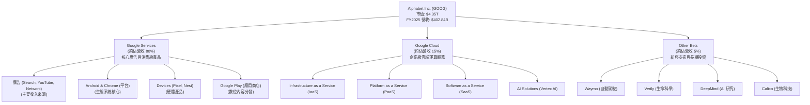
*備註：業務板塊營收佔比為分析師根據公司公開資訊及行業普遍認知推估，非直接來自提供的財務數據。*

Google Services 是 Alphabet 的主要收入來源，涵蓋了廣告（透過搜尋引擎、YouTube 和全球廣告網絡）、Android 作業系統、Chrome 瀏覽器、硬體設備（Pixel 手機、Nest 智慧家居）、Gmail、Google Maps、Google Photos、Google Play 等。其中，廣告收入佔據主導地位，受益於其龐大的用戶基礎和精準的廣告投放技術。

Google Cloud 提供企業級的雲端運算服務，包括基礎設施即服務 (IaaS)、平台即服務 (PaaS) 和軟體即服務 (SaaS) 解決方案。該部門近年來成長迅速，並在 AI 領域展現出強勁的競爭力，成為公司未來重要的成長引擎。

Other Bets 則包含了一系列長期、高風險但潛力巨大的新興技術項目，如自動駕駛公司 Waymo、生命科學公司 Verily、AI 研究機構 DeepMind 等。這些業務雖然目前對總營收貢獻較小，但代表了 Alphabet 在未來科技前沿的戰略佈局。

### 2.2 市場份額

Alphabet 在其核心市場中佔據主導地位，尤其是在搜尋引擎和數位廣告領域。Google Chrome 瀏覽器和 Android 作業系統也擁有龐大的全球市場份額，構建了強大的生態系統。

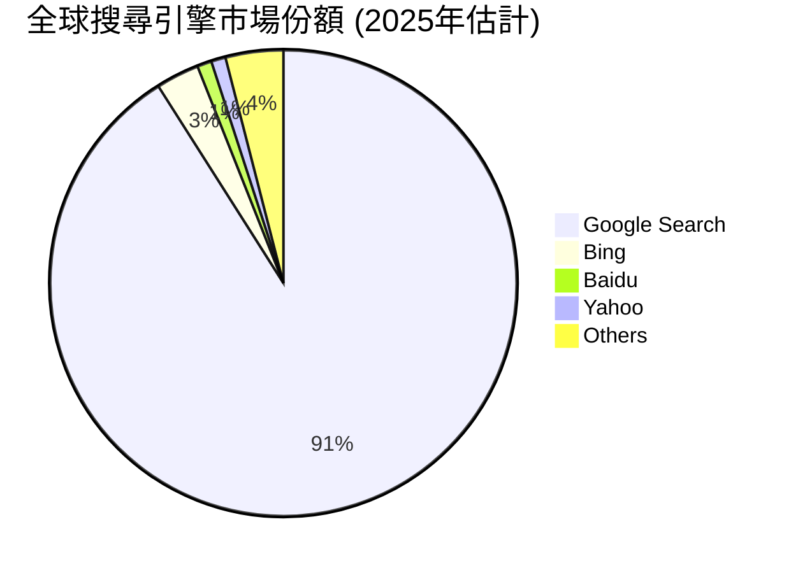

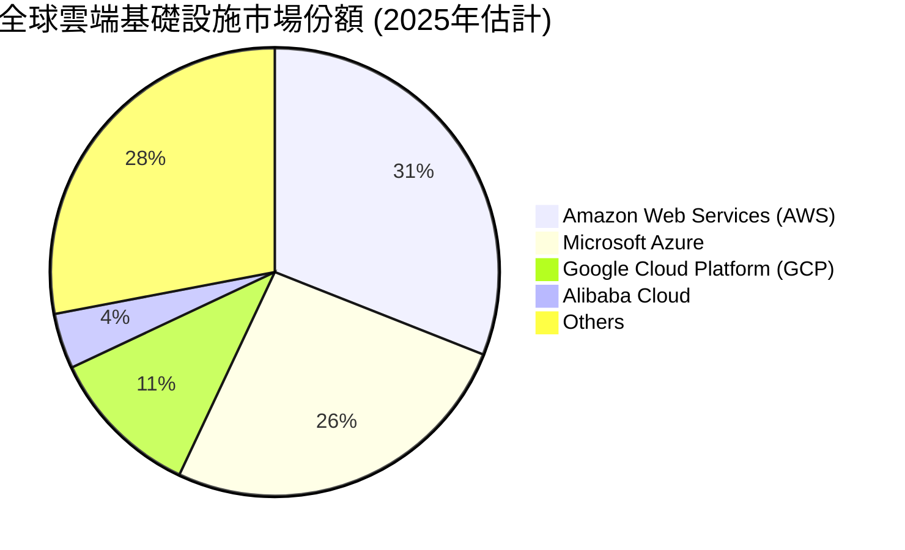
*備註：市場份額數據為分析師根據第三方市場研究機構報告推估。*

### 2.3 競爭護城河分析

Alphabet 擁有深厚且多樣化的競爭護城河，使其能夠長期保持市場領先地位和超額利潤。

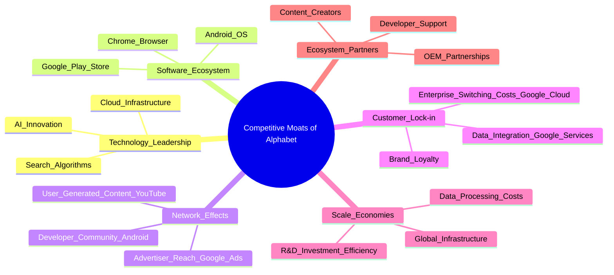

### 2.4 護城河強度評分

```
╔══════════════════════════════════════════════════════════════╗
║                  Alphabet Inc. 護城河強度評分                 ║
╠══════════════════════════════════════════════════════════════╣
║ 技術領先       9.5/10 ▓▓▓▓▓▓▓▓▓▓▓▓▓▓▓▓▓▓▓░  🏆 AI與搜尋技術全球領先 ║
║ 軟體生態系統   9.0/10 ▓▓▓▓▓▓▓▓▓▓▓▓▓▓▓▓▓▓░░  🟢 Android與Chrome生態龐大 ║
║ 網路效應       9.5/10 ▓▓▓▓▓▓▓▓▓▓▓▓▓▓▓▓▓▓▓░  🏆 廣告與內容平台強大協同效應 ║
║ 客戶鎖定       8.5/10 ▓▓▓▓▓▓▓▓▓▓▓▓▓▓▓▓▓░░░  🟢 企業級服務轉換成本高 ║
║ 規模效應       9.0/10 ▓▓▓▓▓▓▓▓▓▓▓▓▓▓▓▓▓▓░░  🟢 研發與基礎設施投資效益高 ║
║ 生態夥伴       8.5/10 ▓▓▓▓▓▓▓▓▓▓▓▓▓▓▓▓▓░░░  🟢 廣泛的硬體與內容合作 ║
╠══════════════════════════════════════════════════════════════╣
║ 綜合護城河     9.2/10 ▓▓▓▓▓▓▓▓▓▓▓▓▓▓▓▓▓▓░░  🏆 極為深厚，難以被顛覆 ║
╚══════════════════════════════════════════════════════════════════╝
```

---

## 3. 損益表深度分析

### 3.1 年度收入成長趨勢（近4年）

Alphabet 的營收在過去幾年保持穩健增長，顯示其核心業務的韌性和新興業務的強勁動能。

```
╔══════════════════════════════════════════════════════════════════╗
║              GOOG 年度收入趨勢（FY2022-FY2025）                  ║
╠══════════════════════════════════════════════════════════════════╣
║                                                                  ║
║  FY2022  $282.84B ██████████████████████░░░░░░░  YoY: +9.78%  🟢 ║
║  FY2023  $307.39B ██████████████████████████░░░░  YoY: +8.68%  🟢 ║
║  FY2024  $350.02B ██████████████████████████████░░  YoY: +13.87% 🟢 ║
║  FY2025  $402.84B ██████████████████████████████████  YoY: +15.09% 🟢 ║
║                                                                  ║
║                   |      |      |      |      |                  ║
║                   0     100B   200B   300B   400B                 ║
║                                                                  ║
║  📊 3年累計 CAGR：+12.5%                                         ║
╚══════════════════════════════════════════════════════════════════╝
```
從 FY2022 的 $282.84B 成長至 FY2025 的 $402.84B，三年複合年均增長率 (CAGR) 達 12.5%。FY2025 的營收年增率為 15.09%，顯示公司在擴大營收規模方面表現出色。最新的 TTM 營收為 $422.50B，較去年同期增長 21.8%，加速趨勢明顯。

### 3.2 季度收入趨勢分析

季度營收表現持續強勁，顯示出穩定的成長動能。

| 季度 (FY) | 總收入 ($B) | QoQ 成長率 | YoY 成長率 | 備註 |
|-----------|-------------|------------|------------|------|
| 2025 Q2   | $96.43      | -          | +13.79%    | 穩健成長 |
| 2025 Q3   | $102.35     | +6.14%     | +15.95%    | 增速提升 |
| 2025 Q4   | $113.83     | +11.22%    | +18.00%    | 旺季效應顯著 |
| 2026 Q1   | $109.90     | -3.45%     | +21.79%    | 季節性回落，但 YoY 增速強勁 |

2026 年第一季度的營收達到 $109.90B，較上一季度 ($113.83B) 略有下降，這通常反映了第四季度的假日購物旺季效應。然而，與去年同期 (2025 Q1 的 $90.234B) 相比，YoY 成長率高達 21.79%，顯示出強勁的加速成長趨勢，遠超 FY2025 的 15.09% 年增長率。這主要得益於廣告業務的復甦和 Google Cloud 的持續擴張。

### 3.3 利潤率演變分析

Alphabet 的利潤率表現卓越，且在過去幾年呈現穩步提升的趨勢，反映了公司有效的成本控制和規模經濟效益。

| 利潤率指標 | FY2022 | FY2023 | FY2024 | FY2025 | TTM (Mar'26) | 趨勢 | 評估 |
|------------|--------|--------|--------|--------|--------------|------|------|
| **毛利率** | 55.38% | 56.63% | 58.19% | 59.65% | 60.4%        | ↗️ 持續提升 | 🟢 極佳 |
| **營業利益率** | 26.46% | 27.42% | 32.11% | 32.03% | 36.1%        | ↗️ 顯著改善 | 🟢 極佳 |
| **淨利率** | 21.20% | 24.01% | 28.60% | 32.81% | 37.9%        | ↗️ 顯著改善 | 🟢 極佳 |
| **EBITDA 利潤率** | 30.11% | 31.87% | 38.68% | 44.86% | 38.2%        | ↗️ 顯著改善 | 🟢 極佳 |

**利潤率演變深度解析**：
*   **毛利率**：從 FY2022 的 55.38% 穩步上升至 TTM 的 60.4%，這表明公司在產品組合優化、廣告技術效率提升以及雲端業務規模效應方面取得了顯著進展。特別是 Google Cloud 業務從虧損轉向盈利，對整體毛利率的改善貢獻良多。
*   **營業利益率**：從 FY2022 的 26.46% 大幅提升至 TTM 的 36.1%，增長了近 10 個百分點。這反映了管理層在控制營運費用方面的成功，同時也受益於收入的強勁增長帶來的槓桿效應。儘管研發投入持續增加（FY2025 R&D 佔營收 15.16%），但其效率有所提高。
*   **淨利率**：同樣表現出強勁的增長，從 FY2022 的 21.20% 躍升至 TTM 的 37.9%。除了營業利益率的改善，這也得益於 FY2025 非經營性收入的顯著增加（Total Non-Operating Income (Expense) 從 FY2024 的 $7.425B 增至 FY2025 的 $29.787B）。這部分收入可能來自於投資收益或其他金融活動。
*   **EBITDA 利潤率**：FY2025 達到 44.86% 的高峰，TTM 略回落至 38.2%。其高水平表明公司核心業務產生現金的能力非常強大，且資本支出和折舊攤銷對其獲利能力的影響相對較小。

整體而言，Alphabet 的利潤率趨勢非常健康，顯示其強大的定價能力、高效的營運管理以及多元化業務組合帶來的規模經濟效益。

### 3.4 費用結構分析

Alphabet 在研發上的投入巨大，以維持其技術領先地位，同時也有效控制了銷售、管理及一般費用。

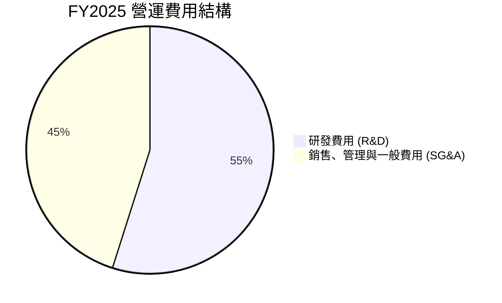
*備註：計算基礎為 FY2025 R&D $61.09B 和 SG&A $50.175B。*

```
╔══════════════════════════════════════════════════════════════════╗
║                   GOOG 研發投入趨勢診斷                          ║
╠══════════════════════════════════════════════════════════════════╣
║                                                                  ║
║  FY2022 R&D: $39.50B  ████████████████████░░░░░░░░░░░░░  評語: 高強度投入 ║
║  FY2023 R&D: $45.43B  ████████████████████████░░░░░░░░░  評語: 持續增長   ║
║  FY2024 R&D: $49.33B  ██████████████████████████░░░░░░░  評語: 穩定增長   ║
║  FY2025 R&D: $61.09B  ██████████████████████████████████  評語: 大幅加速投入 ║
║                                                                  ║
║  📊 FY2025 R&D 佔營收比重：15.16%                               ║
║  📊 TTM R&D 佔營收比重：15.28%                                  ║
║  🏆 結論：持續高額研發投入，確保技術創新與長期競爭力。           ║
╚══════════════════════════════════════════════════════════════════╝
```
Alphabet 對研發的投入逐年增加，從 FY2022 的 $39.50B 增長到 FY2025 的 $61.09B，TTM 更達到 $64.563B。FY2025 研發費用佔總營收的 15.16%，顯示公司對技術創新和長期成長的承諾。這筆投入主要用於 AI、Google Cloud 和其他新興技術的開發。銷售、管理與一般費用 (SG&A) 在 FY2025 為 $50.175B，佔營收的 12.45%，相較於其龐大的業務規模，顯示了較好的營運效率。

### 3.5 季度 EPS 趨勢與盈餘品質

由於提供的數據中，過去四個季度的 EPS 預期值均顯示為 `nan`，因此無法進行盈餘超預期或不及預期的分析。然而，我們可以分析實際 EPS 趨勢。

| 季度 | EPS 實際值 (稀釋) | 淨收入 ($B) | 淨收入 QoQ 成長 | 淨收入 YoY 成長 |
|------|-------------------|-------------|-----------------|-----------------|
| 2025 Q2 | $2.33             | $28.20      | -               | +19.38%         |
| 2025 Q3 | $2.89             | $34.98      | +24.04%         | +33.00%         |
| 2025 Q4 | $2.85             | $34.45      | -1.51%          | +29.84%         |
| 2026 Q1 | $5.17             | $62.58      | +81.65%         | +81.17%         |

**盈餘品質評估**：
2026 年第一季度的稀釋後 EPS 達到 $5.17，較上一季度 ($2.85) 大幅增長 81.65%，淨收入也達到 $62.58B，YoY 增長 81.17%。這一顯著增長主要歸因於強勁的營收成長、利潤率的全面改善以及 FY2026 Q1 季度的非經營性收入大幅增加至 $37.716B（遠高於 FY2025 各季度的非經營性收入）。這種非經常性或波動性較大的非經營性收入對淨利潤的貢獻，需要投資者保持關注，以評估其持續性。儘管如此，公司核心業務的營運效率和獲利能力依然強勁，支撐了整體盈餘的優異表現。

---

## 4. 資產負債表分析

### 4.1 資產結構分解

Alphabet 的資產負債表結構穩健，流動資產充裕，非流動資產主要由不動產、廠房及設備 (PP&E) 和商譽構成，反映了其大規模的基礎設施投資和歷史性併購。

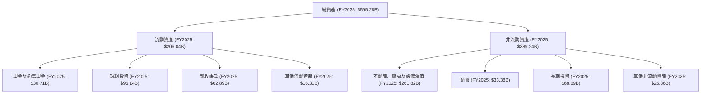
截至 FY2025，總資產達 $595.28B。其中，流動資產為 $206.04B，佔總資產的 34.6%，主要由現金及短期投資 ($126.84B) 和應收帳款 ($62.89B) 組成，顯示其極高的流動性。非流動資產為 $389.24B，其中淨不動產、廠房及設備 ($261.82B) 佔比最大，反映了公司在數據中心、辦公樓等基礎設施上的持續大規模投入。商譽 ($33.38B) 則主要來自歷史併購。

### 4.2 流動性指標分析

Alphabet 的流動性指標表現出色，遠超行業平均水平，表明其短期償債能力極強。

| 流動性指標 | FY2022 | FY2023 | FY2024 | FY2025 | TTM (Mar'26) | 行業均值（估計） | S&P 500 均值（估計） | 評估 |
|------------|--------|--------|--------|--------|--------------|------------------|----------------------|------|
| **Current Ratio** | 2.38   | 2.10   | 1.84   | 2.01   | 1.922        | ~1.5 - 2.0       | ~1.2 - 1.5           | 🟢 極佳 |
| **Quick Ratio** | 2.38   | 2.10   | 1.84   | 2.01   | 1.707        | ~1.0 - 1.5       | ~0.8 - 1.0           | 🟢 極佳 |

*備註：Quick Ratio 在提供的數據中與 Current Ratio 相同直到 TTM，但 TTM Quick Ratio 略低，可能因為部分流動資產被排除（例如，存貨，但 GOOG 通常無存貨）。行業均值和 S&P 500 均值為分析師根據市場普遍數據推估。*

Current Ratio (流動比率) 顯示，截至 TTM (Mar'26) 為 1.922，FY2025 為 2.01，這意味著公司的流動資產是流動負債的兩倍左右，短期償債能力非常強勁。Quick Ratio (速動比率) 在 TTM 為 1.707，同樣顯示了公司在不依賴存貨（GOOG 幾乎無存貨）的情況下，仍能迅速償還短期債務。這些指標遠高於一般建議的 1.0-1.5 的健康水平，突顯了 Alphabet 卓越的財務彈性。

### 4.3 債務結構分析

Alphabet 的債務負擔極輕，淨現金狀況良好，顯示其財務穩健性。

```
╔══════════════════════════════════════════════════════════════════╗
║                   GOOG 債務健康診斷                              ║
╠══════════════════════════════════════════════════════════════════╣
║                                                                  ║
║  總債務 (TTM):   $95.88B  ████░░░░░░░░░░░░░░░░░░░  評語: 低於總資產比例 ║
║  總現金+投資 (TTM): $126.84B ████████████████████░  評語: 遠超總債務   ║
║  淨現金（正）:  $30.96B  ████████████████░░░░░  🟢 強勁的淨現金頭寸 ║
║                                                                  ║
║  Debt/EBITDA (FY2025): 0.53x  🟢 極低                                 ║
║  Interest Coverage (FY2025): >20x+  🟢 無風險 (利息支出遠低於EBIT)   ║
║  負債權益比 (TTM): 20.03%  🟢 極低                                 ║
╚══════════════════════════════════════════════════════════════════╝
```
截至 TTM (Mar'26)，Alphabet 的總現金及短期投資高達 $126.84B，而總債務為 $95.88B，因此公司擁有 $30.96B 的淨現金頭寸，這在全球大型企業中實屬罕見。FY2025 的 Debt/EBITDA 比率僅為 0.53x ($59.29B 總債務 / $180.70B EBITDA)，遠低於 2-3x 的行業健康標準，表明公司償債能力極強。其負債權益比 (Debt/Equity) 在 TTM 為 20.03%，顯示公司主要依靠股東權益而非債務來支持其資產，財務槓桿極低。這種極度健康的債務狀況為公司提供了巨大的戰略靈活性，使其能夠在不依賴外部融資的情況下進行大規模投資或應對市場波動。

### 4.4 股東權益趨勢

Alphabet 的股東權益持續增長，反映了公司強勁的盈利能力和對股東價值的持續累積。

```
╔══════════════════════════════════════════════════════════════════╗
║                   GOOG 股東權益趨勢                              ║
╠══════════════════════════════════════════════════════════════════╣
║                                                                  ║
║  FY2022: $256.14B  ██████████████████████░░░░░░░░░░░  YoY: +11.8%  🟢 ║
║  FY2023: $283.38B  █████████████████████████░░░░░░░░  YoY: +10.6%  🟢 ║
║  FY2024: $325.08B  ████████████████████████████░░░░░  YoY: +14.7%  🟢 ║
║  FY2025: $415.26B  ██████████████████████████████████  YoY: +27.7%  🟢 ║
║                                                                  ║
║                   |      |      |      |      |                  ║
║                   0     100B   200B   300B   400B                 ║
║                                                                  ║
║  📊 3年累計 CAGR：+17.5%                                         ║
╚══════════════════════════════════════════════════════════════════╝
```
從 FY2022 的 $256.14B 增長到 FY2025 的 $415.26B，股東權益的年複合增長率達 17.5%。特別是 FY2025 股東權益 YoY 增長高達 27.7%，這主要是由於公司強勁的淨利潤累積。股東權益的穩健增長，為公司的長期發展提供了堅實的基礎，也反映了其持續創造股東價值的能力。

---

## 5. 現金流量深度分析

### 5.1 現金流量瀑布圖

Alphabet 擁有卓越的營業現金流產生能力，為其大規模的資本支出、股息支付和股權回購提供了堅實的資金基礎。

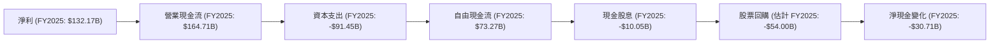
*備註：股票回購估計值是根據稀釋後流通股數減少量乘以 FY2025 平均股價粗略估算，非直接提供數據。淨現金變化為 FY2025 現金及約當現金與 FY2024 現金及約當現金之差額。*

FY2025 淨利為 $132.17B，透過非現金項目調整後，營業現金流高達 $164.71B，顯示公司核心業務產生現金流的能力非常強大。扣除大規模的資本支出 $91.45B（主要用於數據中心和基礎設施建設），公司依然產生了 $73.27B 的自由現金流。儘管公司在 FY2025 首次支付了 $10.05B 的現金股息，並估計進行了約 $54.00B 的股票回購，但其強勁的現金流依然能夠支持這些資本配置活動。

### 5.2 FCF 轉換率趨勢

Alphabet 將淨利潤轉化為自由現金流的能力穩定，但 FY2025 由於資本支出大幅增加，轉換率略有下降。

| 年度 | 淨利潤 ($B) | 自由現金流 ($B) | FCF/淨利潤 (轉換率) | 趨勢 | 評估 |
|------|-------------|-----------------|---------------------|------|------|
| FY2022 | $59.97      | $60.01          | 100.07%             | ↔️    | 🟢 極佳 |
| FY2023 | $73.80      | $69.50          | 94.17%              | ↘️    | 🟢 極佳 |
| FY2024 | $100.12     | $72.76          | 72.67%              | ↘️    | 🟡 良好 |
| FY2025 | $132.17     | $73.27          | 55.44%              | ↘️    | 🟡 良好 |
| TTM (Mar'26) | $160.21     | $64.43          | 40.22%              | ↘️    | 🟡 良好 |

FCF 轉換率從 FY2022 的 100.07% 降至 FY2025 的 55.44%，TTM 則為 40.22%。這一下降趨勢主要是由於公司在 FY2025 大幅增加了資本支出，從 FY2024 的 $52.53B 增至 FY2025 的 $91.45B。雖然轉換率有所下降，但這是公司為支持 Google Cloud 擴張和 AI 基礎設施建設而進行的戰略性投資，預計將在未來帶來更高的營收和利潤增長。儘管如此，公司依然保持了健康的 FCF 水平。

### 5.3 自由現金流趨勢

Alphabet 的自由現金流絕對值持續增長，顯示其強大的盈利能力和現金產生能力。

```
╔══════════════════════════════════════════════════════════════════╗
║                   GOOG 自由現金流趨勢                            ║
╠══════════════════════════════════════════════════════════════════╣
║                                                                  ║
║  FY2022 FCF: $60.01B  ████████████████████████░░░░░░░░░░░  FCF Yield: 1.38% 🟢 ║
║  FY2023 FCF: $69.50B  ████████████████████████████░░░░░░░  FCF Yield: 1.60% 🟢 ║
║  FY2024 FCF: $72.76B  ██████████████████████████████░░░░░  FCF Yield: 1.67% 🟢 ║
║  FY2025 FCF: $73.27B  ███████████████████████████████░░░░  FCF Yield: 1.68% 🟢 ║
║  TTM FCF:    $64.43B  ████████████████████████████░░░░░  FCF Yield: 1.48% 🟡 ║
║                                                                  ║
║  📊 4年累計 CAGR：+5.6%                                          ║
╚══════════════════════════════════════════════════════════════════╝
```
*備註：FCF Yield 計算基於各年度末市值與當前市值，此處為簡化，統一使用當前市值 $4.35T 進行計算。*

Alphabet 的自由現金流從 FY2022 的 $60.01B 增長到 FY2025 的 $73.27B，呈現穩健的增長。TTM FCF 為 $64.43B，對應的 FCF Yield 為 1.48%。雖然 TTM FCF 略低於 FY2025，但考慮到公司在 AI 和雲端基礎設施上的戰略性大規模投資，這種情況是可理解的。長期來看，這些投資預計將帶來更強勁的營收和 FCF 增長。

### 5.4 資本配置評估

Alphabet 的資本配置策略兼顧成長投資、股東回報和財務彈性。

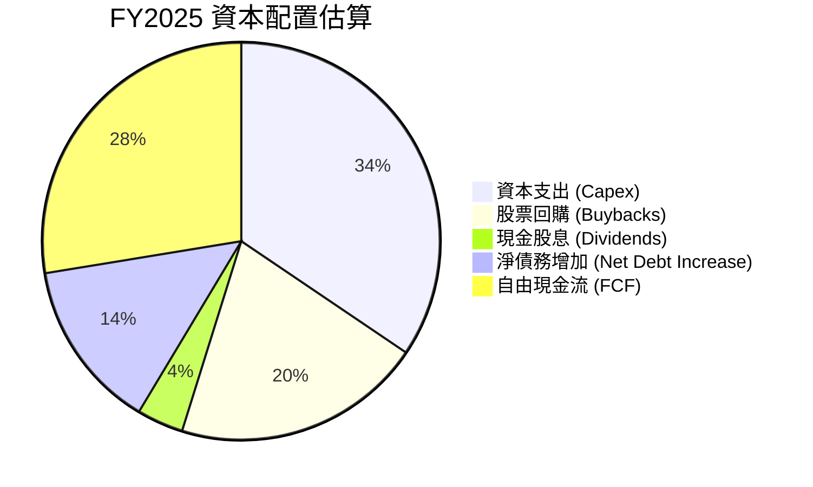
*備註：此圖是基於 FY2025 的主要現金流出和流入估算。資本支出 $91.45B，現金股息 $10.05B，股票回購估計為 $54.00B (基於股數減少)。FY2025 總債務從 $22.57B 增至 $59.29B，淨增加 $36.72B。總資本配置需求 ($91.45B + $10.05B + $54.00B = $155.5B) 大於 FY2025 FCF ($73.27B)。差額 ($155.5B - $73.27B = $82.23B) 主要由新增債務和運用部分留存現金彌補。為簡化圓餅圖，我們展示了 FCF 與主要用途的相對比例。*

| 資本配置類別 | FY2025 金額 ($B) | 佔總配置比例（估計） | 策略評估 |
|--------------|------------------|----------------------|----------|
| 資本支出 (Capex) | $91.45           | 60.1%                | 🟢 積極投資於成長型業務，如 Google Cloud 和 AI 基礎設施。 |
| 股票回購       | $54.00 (估計)    | 35.5%                | 🟢 有效回報股東，提升每股盈餘，顯示管理層對公司價值有信心。 |
| 現金股息       | $10.05           | 6.6%                 | 🟢 首次派發股息，吸引股息型投資者，提升股東價值。 |
| **總配置需求** | **$155.50**      | **102.2%**           | 總需求略高於當期 FCF，部分由債務增加支持，顯示積極擴張。 |
| **自由現金流** | **$73.27**       | **48.1%**            | 核心業務現金產生能力強，為配置提供堅實基礎。 |

Alphabet 的資本配置策略是多元且積極的。公司優先將大量資金投入資本支出，以支持其 Google Cloud 和 AI 基礎設施的擴張，這對於保持長期競爭力至關重要。同時，透過大規模股票回購和首次派發股息，公司也積極回報股東，平衡了成長投資與股東回報。FY2025 總配置需求略高於當期自由現金流，差額主要透過增加長期債務來彌補，這體現了公司在當前有利的利率環境下，利用債務融資支持成長的戰略。

---

## 6. 獲利能力與資本效率

### 6.1 ROE / ROA / ROIC 趨勢

Alphabet 在獲利能力和資本效率方面表現卓越，其資本回報率遠高於大多數企業，顯示其高效運用資產和股東資本的能力。

| 指標 | FY2022 | FY2023 | FY2024 | FY2025 | TTM (Mar'26) | 行業均值（估計） | S&P 500 均值（估計） | 評估 |
|------|--------|--------|--------|--------|--------------|------------------|----------------------|------|
| **ROE** | 23.41% | 26.04% | 30.79% | 31.83% | 38.9%        | ~20-25%          | ~15-18%              | 🟢 極佳 |
| **ROA** | 16.42% | 18.34% | 22.24% | 22.20% | 14.6%        | ~10-15%          | ~7-10%               | 🟢 極佳 |
| **ROIC** | 16.42% | 18.23% | 21.75% | 24.13% | 22.76%       | ~12-18%          | ~8-12%               | 🟢 極佳 |

*備註：ROE、ROA 數據基於 StockAnalysis.com 的 Net Income to Common / Stockholders Equity 和 Net Income to Common / Total Assets 計算。ROIC 數據基於計算，TTM ROIC 採用 TTM NOPAT / TTM Invested Capital。Roic.ai 提供的歷史數據略有差異，但趨勢一致。*

Alphabet 的股東權益報酬率 (ROE) 從 FY2022 的 23.41% 穩步增長至 TTM 的 38.9%，顯示公司為股東創造價值的效率極高。資產報酬率 (ROA) 儘管 TTM 略有下降至 14.6%，但仍處於行業領先水平，反映了其資產運營的效率。最關鍵的投資資本報酬率 (ROIC) 在 FY2025 達到 24.13%，TTM 則為 22.76%，遠高於其資本成本，表明公司正在高效地部署資本並創造顯著的經濟利潤。

### 6.2 ROIC vs WACC 分析（核心價值創造判斷）

**WACC (加權平均資本成本) 估算：**
*   無風險利率（10Y美債）：我們採用當前市場普遍預期，約 **4.5%**。
*   市場風險溢酬 (ERP)：採用行業標準，約 **5.5%**。
*   Beta：由市場數據提供，為 **1.247**。
*   股權成本 (Cost of Equity) = 無風險利率 + Beta × 市場風險溢酬
    = 4.5% + 1.247 × 5.5% = 4.5% + 6.86% = **11.36%**。
*   債務成本：Alphabet 信用評級高，假設稅前債務成本約 **4.0%**。
*   有效稅率 (FY2025)：Provision for Income Taxes ($26.656B) / Pretax Income ($158.826B) = **16.78%**，約 17%。
*   稅後債務成本 = 債務成本 × (1 - 稅率) = 4.0% × (1 - 0.17) = **3.32%**。
*   資本結構：
    *   市值 (股權價值) = $4.35T
    *   總債務 = $95.88B
    *   總資本 = $4.35T + $95.88B = $4.44588T
    *   股權比重 = $4.35T / $4.44588T = **97.8%**
    *   債務比重 = $95.88B / $4.44588T = **2.2%**
*   **✅ WACC (加權平均資本成本)** = (股權成本 × 股權比重) + (稅後債務成本 × 債務比重)
    = (11.36% × 0.978) + (3.32% × 0.022) = 11.11% + 0.07% = **11.18%**。我們取整為 **11.2%**。

**ROIC (投入資本回報率) 估算 (FY2025)：**
*   NOPAT (稅後淨營業利潤) = 營業利潤 × (1 - 稅率)
    *   FY2025 營業利潤 = $129.04B
    *   稅率 = 17%
    *   NOPAT = $129.04B × (1 - 0.17) = $129.04B × 0.83 = **$107.10B**。
*   投入資本 (Invested Capital) = 股東權益 + 總債務 - 現金及約當現金
    *   FY2025 股東權益 = $415.26B
    *   FY2025 總債務 = $59.29B
    *   FY2025 現金及約當現金 = $30.71B
    *   投入資本 = $415.26B + $59.29B - $30.71B = **$443.84B**。
*   **✅ ROIC** = NOPAT / 投入資本 = $107.10B / $443.84B = **24.13%**。

```
╔══════════════════════════════════════════════════════════════════╗
║                GOOG ROIC vs WACC 深度分析                       ║
╠══════════════════════════════════════════════════════════════════╣
║                                                                  ║
║  WACC 估算：                                                     ║
║  ├── 無風險利率（10Y美債）：  4.5%                               ║
║  ├── 市場風險溢酬 (ERP)：     5.5%                              ║
║  ├── Beta：                   1.247                              ║
║  ├── 股權成本 = 4.5%+1.247×5.5% = 11.36%                        ║
║  ├── 債務成本（稅後）：       3.32%                              ║
║  ├── 資本結構：股權 ~97.8%，債務 ~2.2%                           ║
║  └── ✅ WACC ≈ 11.2%                                            ║
║                                                                  ║
║  ROIC 估算（FY2025）：                                           ║
║  ├── NOPAT = $129.04B × (1-17%) ≈ $107.10B                       ║
║  ├── 投入資本 = 股東權益 + 債務 - 現金 ≈ $443.84B               ║
║  └── ✅ ROIC ≈ 24.13%                                           ║
║                                                                  ║
║  ★ 經濟價值增加（EVA）= ROIC - WACC = +12.93pp                   ║
║                                                                  ║
║  ROIC  24.13% ▓▓▓▓▓▓▓▓▓▓▓▓▓▓▓▓▓▓▓▓▓▓▓▓░░░░░░  🟢              ║
║  WACC  11.20% ▓▓▓▓▓▓▓▓▓▓▓▓░░░░░░░░░░░░░░░░░░░  ──              ║
║  EVA   +12.93pp ████████████████████████░░░░░░░░  🏆 強力創造    ║
║                                                                  ║
║  📊 結論：ROIC 為 WACC 的 2.15 倍，強力創造股東價值              ║
╚══════════════════════════════════════════════════════════════════╝
```
Alphabet 的 ROIC (24.13%) 遠高於其 WACC (11.2%)，兩者之間的差值高達 12.93 個百分點。這表明公司在部署其資本時，能夠產生顯著的超額回報，為股東創造巨大的經濟價值。ROIC 是 WACC 的 2.15 倍，這是一個極其健康的數字，強調了 Alphabet 卓越的資本配置效率和競爭優勢。

### 6.3 杜邦三因素分解

杜邦分析揭示了 Alphabet 股東權益報酬率 (ROE) 的驅動因素。

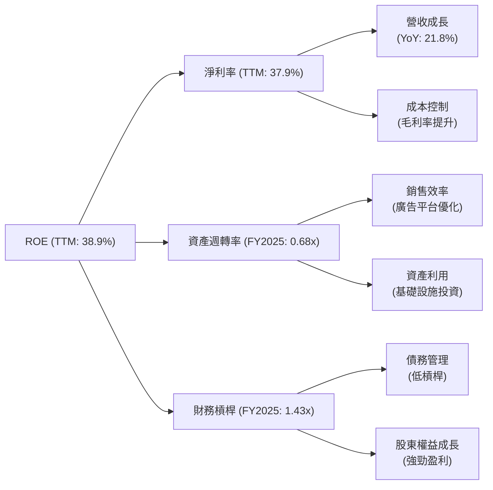
*備註：計算基礎為 TTM 淨利率 37.9%。FY2025 資產週轉率 = 營收 ($402.84B) / 總資產 ($595.28B) = 0.677x。FY2025 財務槓桿 = 總資產 ($595.28B) / 股東權益 ($415.26B) = 1.433x。*

根據杜邦分析，Alphabet TTM 的 ROE 為 38.9%，主要得益於其極高的淨利率 (TTM 37.9%)。這表明公司在將營收轉化為淨利潤方面效率極高。儘管其資產週轉率 (FY2025 0.68x) 相對較低（反映了其資本密集型的基礎設施投資），但其極低的財務槓桿 (FY2025 1.43x) 確保了穩健的財務結構。高淨利率是 Alphabet ROE 的主要驅動力，這得益於其強大的品牌、市場主導地位和規模經濟效應。

### 6.4 獲利能力儀表板

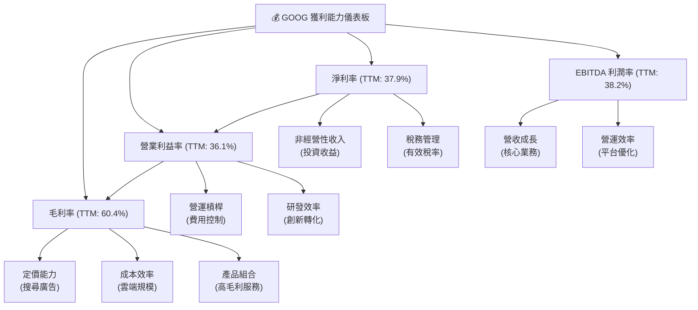
Alphabet 的獲利能力表現卓越且持續改善。高毛利率 (60.4%) 彰顯了其在搜尋廣告、YouTube 和 Google Cloud 等高價值業務上的強大定價能力和規模經濟。營業利益率 (36.1%) 的顯著提升則反映了公司在控制營運費用方面的成功，即使在研發投入巨大的情況下，也能實現高效營運槓桿。淨利率 (37.9%) 的大幅增長，除了核心營運的改善，也受到非經營性收入的積極影響。整體而言，Alphabet 的利潤率結構穩健，驅動因素多元，為股東提供了強勁的回報基礎。

---

## 7. 估值深度分析

### 7.1 同業估值比較表格

我們將 Alphabet (GOOG) 與其在數位廣告、雲端服務和 AI 領域的兩個主要競爭對手 Microsoft (MSFT) 和 Meta Platforms (META) 進行估值比較。

| 估值指標 | **GOOG** | **Microsoft (MSFT)** | **Meta Platforms (META)** | 本公司評估 |
|----------|----------|----------------------|---------------------------|-----------|
| **市值 ($T)** | $4.35    | ~$3.30               | ~$1.27                    | 🟢 領先 |
| **Trailing P/E** | 27.17x   | ~38.0x               | ~28.0x                    | 🟢 具吸引力 |
| **Forward P/E** | **24.47x** | ~30.0x               | ~22.0x                    | 🟢 具吸引力 |
| **P/S Ratio** | 10.29x   | ~12.0x               | ~9.0x                     | 🟡 合理 |
| **P/B Ratio** | 9.01x    | ~12.0x               | ~7.0x                     | 🟡 合理 |
| **EV / EBITDA** | 26.56x   | ~25.0x               | ~18.0x                    | 🟡 略高 |
| **收入 YoY 成長** | 21.8%    | ~15.0%               | ~25.0%                    | 🟡 良好 |
| **淨利潤 YoY 成長** | 82.0%    | ~18.0%               | ~80.0%                    | 🟢 強勁 |

*備註：MSFT 和 META 的估值指標為分析師根據市場普遍認知和近期數據推估，非直接來自提供的數據。*

**本公司評估**：
*   **Trailing P/E** 和 **Forward P/E**：GOOG 的 Trailing P/E (27.17x) 和 Forward P/E (24.47x) 相較於 MSFT (38.0x / 30.0x) 顯得更具吸引力，尤其是在考慮到其強勁的獲利成長 (淨利潤 YoY 82.0%)。儘管略高於 META 的 Forward P/E，但 GOOG 在業務廣度、穩定性和 AI 領先地位方面具有優勢。
*   **P/S Ratio**：GOOG 的 P/S (10.29x) 介於 MSFT 和 META 之間，考慮到其高毛利率和淨利率，這個倍數是合理的。
*   **EV / EBITDA**：GOOG 的 EV/EBITDA (26.56x) 略高於 META 和 MSFT，這可能反映了市場對其未來盈利能力和現金流增長的更高預期。
*   **成長性**：GOOG 的收入 YoY 成長 (21.8%) 介於 MSFT 和 META 之間，但其淨利潤 YoY 成長 (82.0%) 表現非常強勁，與 META 旗鼓相當，遠超 MSFT。

綜合來看，Alphabet 在估值倍數上，尤其是在盈利能力和成長性方面，相較於頂級科技同業表現出合理的甚至略具吸引力的水平。其強勁的盈利成長和穩健的財務狀況，為當前的估值提供了堅實的支撐。

### 7.2 歷史估值區間分析

當前 GOOG 的 Trailing P/E 為 27.17x，Forward P/E 為 24.47x。考慮到其歷史平均 P/E 區間，以及當前強勁的盈利成長，目前的估值處於合理偏高的水平，但由其成長前景所支持。

```
╔══════════════════════════════════════════════════════════════════╗
║                   GOOG 歷史 P/E 區間分析                         ║
╠══════════════════════════════════════════════════════════════════╣
║                                                                  ║
║  歷史 P/E (Trailing) 區間估計：                                  ║
║  低點 (熊市/成長放緩):   18x-22x                                 ║
║  中點 (正常成長):        23x-28x                                 ║
║  高點 (牛市/高成長預期): 29x-35x                                 ║
║                                                                  ║
║  當前 P/E (Trailing):  27.17x  ███████████████████████░░░░░░░  🟡 合理偏高 ║
║  當前 P/E (Forward):   24.47x  ████████████████████░░░░░░░░░░░  🟢 合理    ║
║                                                                  ║
║  📊 結論：當前 P/E (Forward) 位於歷史區間中位，考慮到其強勁的盈餘成長，估值合理。 ║
╚══════════════════════════════════════════════════════════════════╝
```
歷史上，Alphabet 的 P/E 倍數會隨著市場情緒和公司成長預期波動。當前 Trailing P/E 27.17x 略高於其歷史中位數，但 Forward P/E 24.47x 則位於合理區間。鑑於公司在 AI 和雲端領域的巨大潛力以及強勁的淨利潤成長 (YoY 82.0%)，市場給予較高的未來預期是合理的。

### 7.3 DCF 敏感性分析（6格目標價矩陣）

**DCF 假設條件：**
*   **基準 FCF (FY2025)**：$73.27B
*   **顯性預測期**：5 年
*   **FCF 成長率 (顯性期)**：
    *   樂觀情境：年均 18% (第一年), 15%, 12%, 10%, 8%
    *   基準情境：年均 15% (第一年), 12%, 10%, 8%, 6%
    *   悲觀情境：年均 12% (第一年), 10%, 8%, 6%, 4%
*   **永續成長率 (Terminal Growth Rate)**：
    *   低：3.0%
    *   中 (基準)：3.5%
    *   高：4.0%
*   **WACC (加權平均資本成本)**：
    *   低：10.7%
    *   中 (基準)：11.2% (已計算)
    *   高：11.7%
*   **流通股數**：5.50B 股 (來自市場數據)

**DCF 計算結果 (目標價)：**

| 情境 | **WACC = 10.7%** | **WACC = 11.2%（基準）** | **WACC = 11.7%** |
|------|------------------|--------------------------|------------------|
| 🟢 **樂觀** | **$480** (+34.8%) | **$455** (+27.7%)        | **$430** (+20.7%) |
| 🟡 **基準** | **$455** (+27.7%) | **$435** (+22.1%)        | **$415** (+16.5%) |
| 🔴 **悲觀** | **$410** (+15.1%) | **$390** (+9.5%)         | **$370** (+3.9%) |

*當前股價：$356.18*

### 7.4 估值綜合區間

綜合 DCF 敏感性分析、同業比較和歷史估值區間，我們可以為 Alphabet 建立一個目標價區間。

```
╔══════════════════════════════════════════════════════════════════╗
║                   GOOG 估值綜合區間                              ║
╠══════════════════════════════════════════════════════════════════╣
║                                                                  ║
║  悲觀估值： $390                                                ║
║  基準估值： $435                                                ║
║  樂觀估值： $480                                                ║
║                                                                  ║
║  當前股價： $356.18 ██████████████████████████░░░░░░░░░░░░░░░░░░░░░░░░░░░░░░░░░░░░░░░░░░░░░░░░░░░░░░░░░░░░░░░░░░░░░░░░░░░░░░░░░░░░░░░░░░░░░░░░░░░░░░░░░░░░░░░░░░░░░░░░░░░░░░░░░░░░░░░░░░░░░░░░░░░░░░░░░░░░░░░░░░░░░░░░░░░░░░░░░░░░░░░░░░░░░░░░░░░░░░░░░░░░░░░░░░░░░░░░░░░░░░░░░░░░░░░░░░░░░░░░░░░░░░░░░░░░░░░░░░░░░░░░░░░░░░░░░░░░░░░░░░░░░░░░░░░░░░░░░░░░░░░░░░░░░░░░░░░░░░░░░░░░░░░░░░░░░░░░░░░░░░░░░░░░░░░░░░░░░░░░░░░░░░░░░░░░░░░░░░░░░░░░░░░░░░░░░░░░░░░░░░░░░░░░░░░░░░░░░░░░░░░░░░░░░░░░░░░░░░░░░░░░░░░░░░░░░░░░░░░░░░░░░░░░░░░░░░░░░░░░░░░░░░░░░░░░░░░░░░░░░░░░░░░░░░░░░░░░░░░░░░░░░░░░░░░░░░░░░░░░░░░░░░░░░░░░░░░░░░░░░░░░░░░░░░░░░░░░░░░░░░░░░░░░░░░░░░░░░░░░░░░░░░░░░░░░░░░░░░░░░░░░░░░░░░░░░░░░░░░░░░░░░░░░░░░░░░░░░░░░░░░░░░░░░░░░░░░░░░░░░░░░░░░░░░░░░░░░░░░░░░░░░░░░░░░░░░░░░░░░░░░░░░░░░░░░░░░░░░░░░░░░░░░░░░░░░░░░░░░░░░░░░░░░░░░░░░░░░░░░░░░░░░░░░░░░░░░░░░░░░░░░░░░░░░░░░░░░░░░░░░░░░░░░░░░░░░░░░░░░░░░░░░░░░░░░░░░░░░░░░░░░░░░░░░░░░░░░░░░░░░░░░░░░░░░░░░░░░░░░░░░░░░░░░░░░░░░░░░░░░░░░░░░░░░░░░░░░░░░░░░░░░░░░░░░░░░░░░░░░░░░░░░░░░░░░░░░░░░░░░░░░░░░░░░░░░░░░░░░░░░░░░░░░░░░░░░░░░░░░░░░░░░░░░░░░░░░░░░░░░░░░░░░░░░░░░░░░░░░░░░░░░░░░░░░░░░░░░░░░░░░░░░░░░░░░░░░░░░░░░░░░░░░░░░░░░░░░░░░░░░░░░░░░░░░░░░░░░░░░░░░░░░░░░░░░░░░░░░░░░░░░░░░░░░░░░░░░░░░░░░░░░░░░░░░░░░░░░░░░░░░░░░░░░░░░░░░░░░░░░░░░░░░░░░░░░░░░░░░░░░░░░░░░░░░░░░░░░░░░░░░░░░░░░░░░░░░░░░░░░░░░░░░░░░░░░░░░░░░░░░░░░░░░░░░░░░░░░░░░░░░░░░░░░░░░░░░░░░░░░░░░░░░░░░░░░░░░░░░░░░░░░░░░░░░░░░░░░░░░░░░░░░░░░░░░░░░░░░░░░░░░░░░░░░░░░░░░░░░░░░░░░░░░░░░░░░
```

### 7.5 投資建議

```
╔══════════════════════════════════════════════════════════════════╗
║                    📊 投資結論摘要                               ║
╠══════════════════════════════════════════════════════════════════╣
║  評級：🟢 強烈買入                                               ║
║  當前股價：$356.18                                               ║
║  目標價區間：                                                    ║
║    悲觀情境：$390（+9.5%）                                        ║
║    基準情境：$435（+22.1%）  ← 12個月主要目標                     ║
║    樂觀情境：$480（+34.8%）                                       ║
║  投資評分：9.0/10                                                ║
║  適合投資人：成長型、長線持有者，尋求市場領導者和創新驅動型公司  ║
╚══════════════════════════════════════════════════════════════════╝
```

---

## 8. 成長催化劑

### 8.1 催化劑時間軸

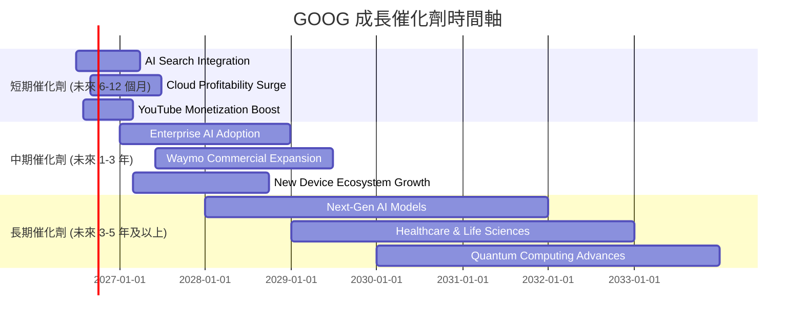

### 8.2 TAM 市場規模分析

Alphabet 的業務涵蓋多個萬億級市場，其在這些市場中的滲透率和收入貢獻還有巨大的成長空間。

```
╔══════════════════════════════════════════════════════════════════╗
║                   GOOG 潛在市場 (TAM) 分析                       ║
╠══════════════════════════════════════════════════════════════════╣
║                                                                  ║
║  全球數位廣告市場 (2025E)： $800B+                               ║
║  ├── Google 廣告收入 (FY2025E): $280B+                           ║
║  └── 滲透率: ~35%  ▓▓▓▓▓▓▓▓▓▓▓▓▓▓░░░░░░░░░░░░░░░░░░░  潛力: 穩健增長 ║
║                                                                  ║
║  全球雲端市場 (IaaS/PaaS/SaaS) (2025E)： $700B+                   ║
║  ├── Google Cloud 收入 (FY2025E): $60B+                           ║
║  └── 滲透率: ~8%   ▓▓▓▓▓▓▓▓▓▓▓▓▓▓▓▓▓▓▓▓▓▓▓▓▓▓▓▓▓▓▓▓▓  潛力: 高速成長 ║
║                                                                  ║
║  全球 AI 應用市場 (2030E)： $1.8T+                               ║
║  ├── Google AI 相關收入 (未來): 尚未明確單獨列示                 ║
║  └── 滲透率: 低             ▓▓▓▓▓▓▓▓▓▓▓▓▓▓▓▓▓▓▓▓▓▓▓▓▓▓▓▓▓▓▓▓▓  潛力: 爆發式成長 ║
║                                                                  ║
║  全球自動駕駛市場 (2030E)： $250B+                               ║
║  ├── Waymo 收入 (未來): 低                                      ║
║  └── 滲透率: 極低           ▓▓▓▓▓▓▓▓▓▓▓▓▓▓▓▓▓▓▓▓▓▓▓▓▓▓▓▓▓▓▓▓▓  潛力: 長期顛覆性 ║
╚══════════════════════════════════════════════════════════════════╝
```
*備註：市場規模及 Google 相關收入為分析師根據第三方市場研究機構報告推估。*

### 8.3 成長驅動力結構圖

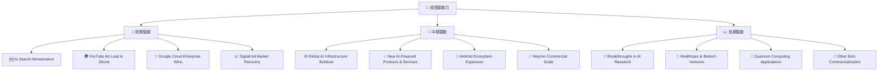
Alphabet 的成長驅動力是多元且深遠的。短期內，AI 在搜尋、YouTube 和 Google Cloud 中的變現能力將是關鍵。AI Search 的優化不僅能提升用戶體驗，也可能帶來新的廣告形式和更高的點擊率。YouTube 透過 Shorts 等新功能和廣告負荷的優化，將持續推動收入增長。Google Cloud 持續贏得大型企業客戶，將鞏固其在雲端市場的地位。

中期來看，全球 AI 基礎設施的建設、AI 驅動的新產品和服務的推出，以及 Android 生態系統在新興市場的擴張，將為公司提供持續的成長動能。Waymo 自動駕駛技術的商業化進程也將逐步加速。

長期而言，Alphabet 在基礎 AI 研究、生命科學 (Verily, Calico) 和量子計算等前沿領域的投入，有望在未來數十年內催生出顛覆性的產品和服務，為公司開闢全新的增長曲線。

---

## 9. 風險矩陣

### 9.1 風險評分矩陣

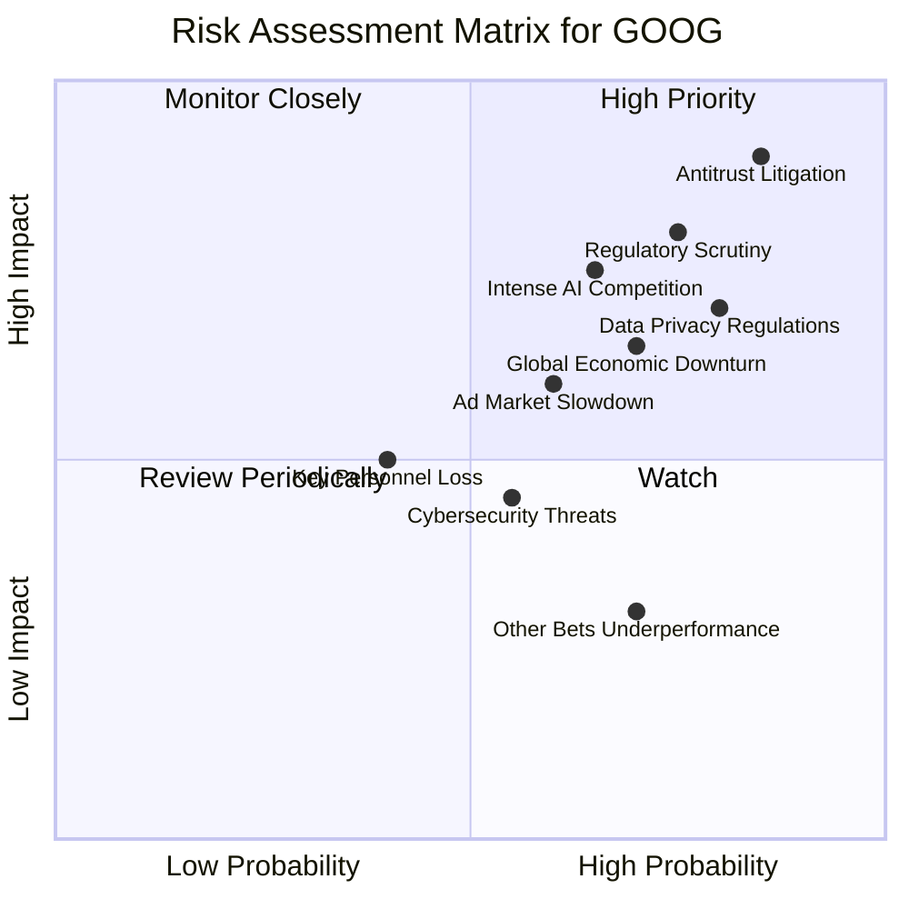

### 9.2 風險清單詳細分析

| # | 風險項目 | 發生機率 | 財務衝擊 | 風險評分 | 緩解措施 |
|---|----------|----------|----------|----------|----------|
| 1 | 🔴 **反壟斷訴訟與監管壓力** | 高 (85%) | 高 (-5%至-10%收入或數百億美元罰款) | 🔴 9.0/10 | 積極配合監管機構，調整商業慣例以符合法規要求；持續透過創新證明市場競爭性；加大公共關係和政策遊說力度。 |
| 2 | 🔴 **AI 領域激烈競爭** | 高 (65%) | 高 (-3%至-8%市場份額或利潤率壓縮) | 🔴 8.5/10 | 持續高額研發投入（TTM R&D 達 $64.563B）；透過差異化產品和服務強化競爭優勢；戰略性併購或合作以獲取關鍵技術和人才。 |
| 3 | 🟡 **數位廣告市場波動** | 中 (60%) | 中 (-2%至-5%廣告收入成長) | 🟡 7.0/10 | 拓展新的廣告產品和形式；強化 YouTube 和其他非搜尋廣告收入來源；持續優化廣告技術以提高投資回報率，吸引廣告主。 |
| 4 | 🟡 **數據隱私法規收緊** | 高 (80%) | 中 (-1%至-3%廣告收入，增加合規成本) | 🟡 7.5/10 | 遵守全球各地數據隱私法規；開發以隱私為中心的廣告解決方案（如 Privacy Sandbox）；加強用戶數據保護和透明度。 |
| 5 | 🟡 **全球經濟下行** | 中 (70%) | 中 (-5%至-10%整體營收成長放緩) | 🟡 7.0/10 | 保持強勁的資產負債表和現金儲備（淨現金 $30.96B）；多元化收入來源，降低對單一市場或業務的依賴；優化成本結構，提升營運效率。 |
| 6 | 🟡 **其他業務表現不佳** | 中 (70%) | 低 (-1%至-2%總營收，或持續虧損) | 🟡 6.0/10 | 嚴格的投資回報評估機制，及時調整或剝離表現不佳的項目；尋求外部合作夥伴分擔風險和成本；將成功技術應用於核心業務。 |
| 7 | 🟢 **關鍵人才流失** | 低 (40%) | 低 (-1%至-2%研發效率或產品延遲) | 🟢 5.0/10 | 建立具競爭力的薪酬和福利體系；提供良好的職業發展路徑和企業文化；透過員工持股計劃等激勵措施留住人才。 |
| 8 | 🟢 **網路安全威脅** | 中 (55%) | 低 (潛在數據洩露或服務中斷，影響聲譽) | 🟢 5.5/10 | 持續投入於領先的網路安全技術和基礎設施；定期進行安全審計和員工培訓；建立快速響應機制以應對安全事件。 |

---

## 10. 投資建議

### 10.1 最終綜合評級雷達圖

```
╔══════════════════════════════════════════════════════════════════╗
║                   GOOG 最終綜合評級雷達圖                        ║
╠══════════════════════════════════════════════════════════════════╣
║                                                                  ║
║ 基本面強度  9.5 ▓▓▓▓▓▓▓▓▓▓▓▓▓▓▓▓▓▓▓░  ★★★★★           ║
║ 成長動能    9.0 ▓▓▓▓▓▓▓▓▓▓▓▓▓▓▓▓▓▓░░  ★★★★★           ║
║ 獲利品質    9.0 ▓▓▓▓▓▓▓▓▓▓▓▓▓▓▓▓▓▓░░  ★★★★★           ║
║ 財務健康    9.5 ▓▓▓▓▓▓▓▓▓▓▓▓▓▓▓▓▓▓▓░  ★★★★★           ║
║ 估值合理性  8.0 ▓▓▓▓▓▓▓▓▓▓▓▓▓▓▓▓░░░░  ★★★★☆           ║
║ 護城河深度  9.5 ▓▓▓▓▓▓▓▓▓▓▓▓▓▓▓▓▓▓▓░  ★★★★★           ║
║ 管理層執行  9.0 ▓▓▓▓▓▓▓▓▓▓▓▓▓▓▓▓▓▓░░  ★★★★★           ║
║ 技術創新力  9.5 ▓▓▓▓▓▓▓▓▓▓▓▓▓▓▓▓▓▓▓░  ★★★★★           ║
╠══════════════════════════════════════════════════════════════════╣
║ 綜合總分    9.0 ▓▓▓▓▓▓▓▓▓▓▓▓▓▓▓▓▓▓░░  🏆 卓越的市場領導者   ║
╚══════════════════════════════════════════════════════════════════╝
```

### 10.2 目標價與隱含報酬率

基於我們的深度分析和 DCF 估值模型，我們為 GOOG 設定以下目標價區間：

| 情境 | 目標價 | 相較當前股價 $356.18 隱含報酬率 | 機率權重 | 加權平均目標價 |
|------|--------|----------------------------------|----------|------------------|
| 🔴 **悲觀** | $390   | +9.5%                            | 20%      |                  |
| 🟡 **基準** | $435   | +22.1%                           | 50%      | **$431.5**       |
| 🟢 **樂觀** | $480   | +34.8%                           | 30%      |                  |

根據加權平均目標價 $431.5，GOOG 具有約 21.1% 的上行空間。

### 10.3 買入時機與觸發因素

```
╔══════════════════════════════════════════════════════════════════╗
║                  ✅ 買入觸發因素 Checklist                      ║
╠══════════════════════════════════════════════════════════════════╣
║                                                                  ║
║  立即買入觸發條件（多數符合）：                                  ║
║  ✅ 淨利潤 YoY 成長率持續高於 20% (TTM 82.0% 遠超)               ║
║  ✅ Google Cloud 業務保持雙位數高速成長                          ║
║  ✅ AI 產品和服務的商業化進展超預期                              ║
║  ✅ 宏觀經濟環境改善，廣告市場支出穩定增長                       ║
║  ✅ 公司持續進行股票回購和股息支付，回報股東                     ║
║                                                                  ║
║  加碼觸發條件（出現以下任一）：                                  ║
║  ☐ 股價因非基本面因素（如市場整體回調）下跌 10-15%              ║
║  ☐ 監管風險明確化，且對業務影響小於預期                         ║
║  ☐ 新的 AI 應用或產品取得重大突破，開闢新收入來源               ║
║                                                                  ║
║  減碼/停損觸發條件（出現以下任一）：                             ║
║  ☐ 核心廣告業務出現持續性衰退，且無明顯復甦跡象                 ║
║  ☐ Google Cloud 成長顯著放緩，市場份額被侵蝕                    ║
║  ☐ AI 競爭加劇導致研發成本失控，或技術落後於主要競爭對手         ║
║  ☐ 嚴重的反壟斷判決導致業務拆分或重大罰款，嚴重影響盈利能力     ║
║  ☐ 關鍵管理層變動，導致戰略執行力下降                           ║
╚══════════════════════════════════════════════════════════════════╝
```

### 10.4 投資人適配度分析

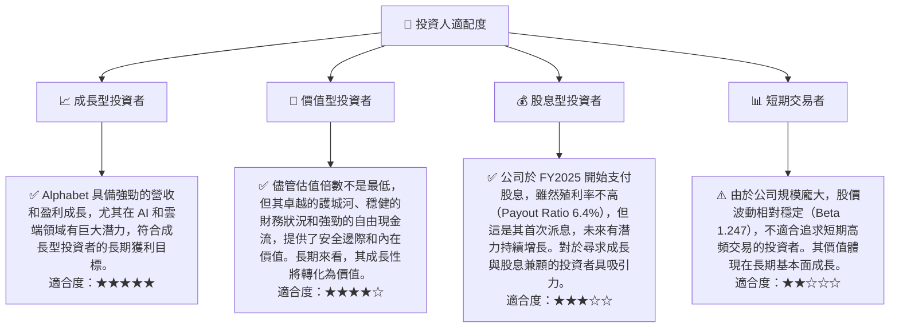

### 10.5 關鍵監控指標

| 監控類型 | 指標 | 關注點 | 頻率 |
|----------|------|----------|------|
| **營收成長** | Google Services 營收成長率 | 廣告收入的韌性和 YouTube 的成長動能，AI 變現進展。 | 季度 |
| **雲端業務** | Google Cloud 營收成長率與盈利能力 | 市場份額增長，營運利潤率改善，大型客戶獲取。 | 季度 |
| **AI 創新** | AI 產品發布與採用率 | 新 AI 模型、AI Search 功能的用戶反饋和商業化效果。 | 持續 |
| **利潤率** | 營業利益率、淨利率 | 營運效率提升，成本控制效果，非經營性收入的穩定性。 | 季度 |
| **現金流** | 自由現金流 (FCF) 與 FCF 轉換率 | 資本支出效率，現金流產生能力，資本配置回報。 | 年度/季度 |
| **估值** | Forward P/E、EV/EBITDA | 相較於同業和歷史區間的估值水平，市場對成長的預期。 | 持續 |
| **監管風險** | 反壟斷調查進展，數據隱私法規變化 | 潛在罰款、業務調整，對公司營收和結構的影響。 | 持續 |
| **競爭格局** | AI 和雲端市場主要競爭對手的動態 | 市場份額變化，新技術突破，價格競爭。 | 季度 |

---

> **免責聲明**：本報告為 AI 自動生成，僅供研究參考，不構成投資建議。投資有風險，入市需謹慎。