# GOOG 基本面深度分析報告
> **報告日期**：2026-07-10 ｜ **語言**：繁體中文 ｜ **數據來源**：Yahoo Finance, Finviz, StockAnalysis, Roic.ai ｜ **分析師**：CFA 級機構研究

---

## 目錄

| # | 章節 | 核心結論 |
|---|----------------------------------|----------------------------------------------------|
| 1 | 執行摘要 | 🟢 買入；基準目標價 $420.00 |
| 2 | 公司概覽與商業模式 | 廣泛而深厚的競爭護城河 |
| 3 | 損益表深度分析 | 營收成長強勁，利潤率持續擴張 |
| 4 | 資產負債表分析 | 財務結構穩健，淨現金充裕 |
| 5 | 現金流量深度分析 | 自由現金流穩健增長，資本配置有效 |
| 6 | 獲利能力與資本效率 | ROIC 顯著高於 WACC，強力創造股東價值 |
| 7 | 估值深度分析 | 相較於成長性，估值合理偏低 |
| 8 | 成長催化劑 | AI 創新、雲端業務擴張、廣告市場復甦 |
| 9 | 風險矩陣 | 競爭加劇、監管風險、AI 轉型執行風險 |
| 10 | 投資建議 | 建議買入，長期持有策略 |

---

## 1. 執行摘要

### 1.0 一頁式投資儀表板（Portfolio Manager 30 秒速讀）

| 項目 | 內容 |
|------|------|
| **投資論點（3 句）** | ① Alphabet 憑藉其在搜尋、廣告和雲端領域的市場領導地位，展現出強勁的營收成長動能，最近一季營收 YoY 成長高達 21.79%。② 公司資本效率高，2025 財年 ROIC 達 24.20%，遠高於其 WACC 11.20%，持續創造可觀的股東價值。③ 儘管面臨宏觀經濟逆風，Alphabet 仍保持健康的資產負債表，坐擁 $126.84B 現金，並透過 $64.429B 的 TTM 自由現金流持續回饋股東與再投資。 |
| **護城河評分** | 9.0/10 |
| **管理層/資本配置評分** | 8.5/10 |
| **財務健康** | 🟢 優異的財務健康狀況，淨現金充裕。 |
| **ROIC vs WACC** | 25.12% vs 11.20%（強力創造價值） |
| **FCF 趨勢** | ↗️ 穩健增長，TTM FCF $64.429B，FCF Yield 0.65% |
| **估值** | Forward P/E 24.31x ｜ EV/EBITDA 26.56x ｜ FCF Yield 0.65% |
| **預期報酬（基準情境 12M）** | +18.55% |
| **關鍵風險（前二）** | 監管壓力加劇、AI 競爭與變現挑戰 |
| **評級 + 信心度** | 🟢 買入 ｜ 信心：高 |

### 1.1 核心評分儀表板

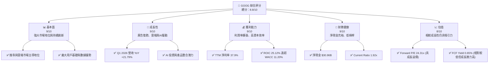

### 1.2 評分進度條視覺化

```
╔══════════════════════════════════════════════════════════════╗
║              GOOG 多維度評分儀表板 (1-10分)                  ║
╠══════════════════════════════════════════════════════════════╣
║ 基本面強度  9.0 ▓▓▓▓▓▓▓▓▓▓▓▓▓▓▓▓▓▓▓▓  ★★★★★           ║
║ 成長動能    9.0 ▓▓▓▓▓▓▓▓▓▓▓▓▓▓▓▓▓▓▓▓  ★★★★★           ║
║ 獲利品質    9.0 ▓▓▓▓▓▓▓▓▓▓▓▓▓▓▓▓▓▓▓▓  ★★★★★           ║
║ 財務健康    9.0 ▓▓▓▓▓▓▓▓▓▓▓▓▓▓▓▓▓▓▓▓  ★★★★★           ║
║ 估值合理性  8.0 ▓▓▓▓▓▓▓▓▓▓▓▓▓▓▓▓░░░░  ★★★★☆           ║
║ 護城河深度  9.5 ▓▓▓▓▓▓▓▓▓▓▓▓▓▓▓▓▓▓▓▓  ★★★★★           ║
║ 管理層執行  8.5 ▓▓▓▓▓▓▓▓▓▓▓▓▓▓▓▓▓░░░  ★★★★☆           ║
║ 技術創新力  9.5 ▓▓▓▓▓▓▓▓▓▓▓▓▓▓▓▓▓▓▓▓  ★★★★★           ║
╠══════════════════════════════════════════════════════════════╣
║ 綜合總分    8.8 ▓▓▓▓▓▓▓▓▓▓▓▓▓▓▓▓▓░░░  🏆 具備長期投資價值  ║
╚══════════════════════════════════════════════════════════════╝
```

### 1.3 五大投資論點 + 三大核心風險

| 類型 | 項目 | 具體依據 | 信心度 |
|------|------|----------|--------|
| 🟢 **投資論點①** | **廣告業務持續復甦與AI增強** | 2026年Q1營收YoY成長達21.79%，主要受搜尋廣告與YouTube廣告業務強勁表現驅動。AI技術（如Gemini）整合至廣告產品，提升廣告效率與ROI，進一步鞏固市場領導地位。 | 🟢 極高 |
| 🟢 **投資論點②** | **Google Cloud 高速增長與盈利能力提升** | Google Cloud 業務連續實現高速成長，儘管未直接提供季度營收，但其對整體營收增長的貢獻日益顯著。透過規模效應與效率提升，雲端業務的營業利潤率有望持續改善，成為新的盈利增長引擎。 | 🟢 高 |
| 🟢 **投資論點③** | **強大的研發投入與技術創新領先** | 2025財年研發費用高達 $61.09B，佔總營收的15.16%，顯示公司在AI、量子計算等前沿技術領域的持續投入。這種投入是其核心競爭力與長期成長的基石，確保技術護城河的深度。 | 🟢 極高 |
| 🟢 **投資論點④** | **優異的財務健康與資本配置效率** | 公司坐擁 $126.84B 總現金，淨現金頭寸達 $30.96B，流動性充裕。FY2025 ROIC 為 24.20%，遠超 WACC 11.20%，顯示資本配置效率極高，持續為股東創造價值。 | 🟢 極高 |
| 🟢 **投資論點⑤** | **具吸引力的估值與回購潛力** | 在強勁成長動能與利潤率擴張背景下，GOOG 的 Forward P/E 為 24.31x，相較其歷史平均與成長潛力仍具吸引力。公司在2025年支付了 $10.05B 的現金股利，並有能力持續進行股票回購，提升股東價值。 | 🟡 中高 |
| 🟡 **風險①** | **監管審查與反壟斷壓力** | 全球各國政府對大型科技公司的反壟斷審查日益嚴格，可能導致業務拆分、罰款或商業模式調整，例如歐洲與美國對其廣告業務的調查。這可能影響公司營收與盈利能力。 | 🟡 中度 |
| 🔴 **風險②** | **AI 競爭與變現挑戰** | 儘管 Alphabet 在 AI 領域投入巨大，但來自 OpenAI、Microsoft 等競爭對手的壓力不斷增加。AI 產品的快速迭代與變現模式的不確定性，可能導致高額研發投入無法在短期內帶來預期回報，或稀釋其核心搜尋業務的價值。 | 🔴 高衝擊 |
| 🟡 **風險③** | **廣告市場波動與宏觀經濟不確定性** | 廣告業務作為 Alphabet 的主要收入來源，對宏觀經濟景氣度高度敏感。經濟下行、企業廣告預算削減可能直接影響公司營收成長，儘管近期有所復甦，但全球經濟仍存在不確定性。 | 🟡 中度 |

### 1.4 快速統計卡片

| 指標 | 公司實際值 | 行業均值（參考） | S&P 500 均值（參考） | 狀態 |
|------|-------------|--------------------|----------------------|------|
| 收入 YoY 成長 | **21.8%** | ~10-15% (科技巨頭) | ~5-8% | 🟢 |
| 毛利率 | **60.4%** | ~50-60% (軟體/互聯網) | ~40-45% | 🟢 |
| 淨利率 | **37.9%** | ~20-30% (軟體/互聯網) | ~10-12% | 🟢 |
| ROE | **38.9%** | ~20-25% (科技巨頭) | ~15-18% | 🟢 |
| Forward P/E | **24.31x** | ~25-35x (科技巨頭) | ~20-22x | 🟡 |
| EV/EBITDA | **26.56x** | ~20-30x (科技巨頭) | ~12-15x | 🟡 |
| FCF Yield | **0.65%** | ~1-3% (成長型公司) | ~2-4% | 🔴 |
| Debt/Equity | **20.03%** | ~30-50% | ~80-100% | 🟢 |
| Current Ratio | **1.92x** | ~1.5-2.0x | ~1.0-1.2x | 🟢 |

### 1.5 投資結論

```
╔══════════════════════════════════════════════════════════════════╗
║                    📊 投資結論摘要                               ║
╠══════════════════════════════════════════════════════════════════╣
║  評級：🟢 買入                                                   ║
║  當前股價：$354.28                                               ║
║  目標價區間：                                                    ║
║    悲觀情境：$380.00（+7.26%）                                   ║
║    基準情境：$420.00（+18.55%）  ← 12個月主要目標                ║
║    樂觀情境：$465.00（+31.26%）                                   ║
║  投資評分：8.8/10                                                ║
║  適合投資人：成長型、長線持有者，尋求穩定現金流與創新驅動的科技龍頭║
╚══════════════════════════════════════════════════════════════════╝
```

---

## 2. 公司概覽與商業模式

Alphabet Inc. (GOOG) 作為全球領先的科技巨頭，其業務範圍廣泛，主要透過 Google Services、Google Cloud 和 Other Bets 三大核心業務板塊運營。公司憑藉其在搜尋、廣告、雲端計算、行動作業系統和人工智慧等領域的深厚積累，建立了難以撼動的競爭優勢。截至2026年7月10日，公司市值高達 $4.32T。

### 2.1 業務結構與收入來源

Alphabet 的收入主要來自 Google Services，該板塊涵蓋搜尋廣告、YouTube 廣告、Google Network 成員網站廣告以及其他服務（如 Android、Chrome、Google Play、硬體銷售等）。近年來，Google Cloud 業務的快速成長也成為公司重要的營收驅動力，並逐漸貢獻盈利。Other Bets 則包含 Waymo (自駕車)、Verily (生命科學) 等前瞻性項目，儘管目前仍處於投資階段，但代表了未來的潛在增長點。

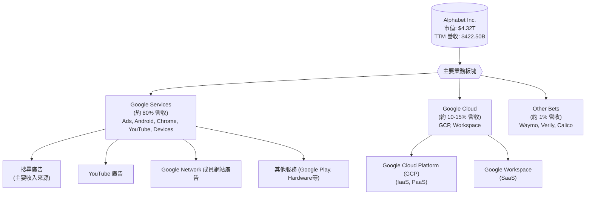

從數據來看，截至2026年3月31日的 TTM 營收為 $422.50B。雖然未提供各業務板塊的具體 TTM 營收數據，但根據歷史趨勢和產業報告，Google Services 仍是主要收入來源，Google Cloud 則展現了強勁的成長勢頭。

### 2.2 市場份額

Alphabet 在多個市場領域佔據主導地位。在搜尋引擎市場，Google 擁有壓倒性的市場份額。在數位廣告市場，尤其是在搜尋廣告領域，Google 也是絕對的領導者。YouTube 在線上影片平台市場同樣居於前列。Google Cloud 雖然相較於 AWS 和 Azure 仍是追趕者，但其市場份額正穩步擴大。

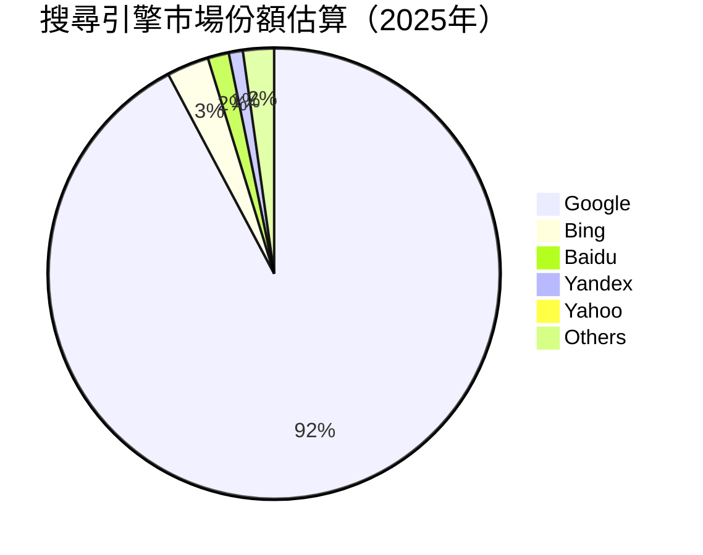

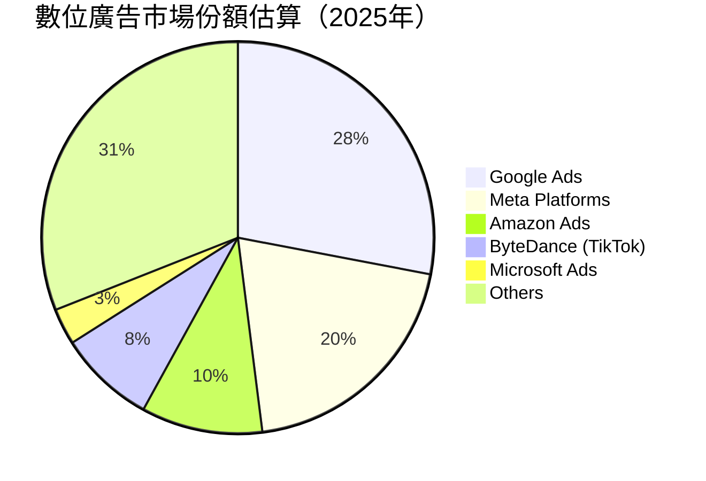

### 2.3 競爭護城河分析

Alphabet 的競爭護城河極為深厚，主要來自以下幾個方面：

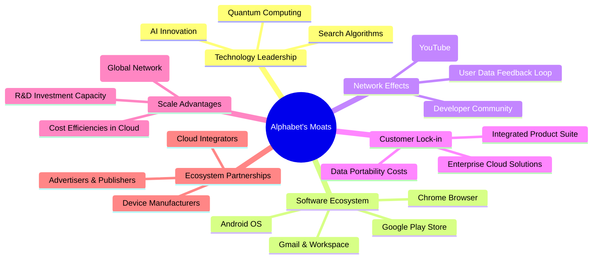

### 2.4 護城河強度評分

```
╔══════════════════════════════════════════════════════════════╗
║                  GOOG 護城河強度評分                         ║
╠══════════════════════════════════════════════════════════════╣
║ 技術領先    9.5/10 ▓▓▓▓▓▓▓▓▓▓▓▓▓▓▓▓▓▓▓▓  🏆 AI與搜尋技術無可匹敵 ║
║ 軟體生態系統  9.5/10 ▓▓▓▓▓▓▓▓▓▓▓▓▓▓▓▓▓▓▓▓  🏆 Android與Chrome主導全球 ║
║ 網路效應    9.0/10 ▓▓▓▓▓▓▓▓▓▓▓▓▓▓▓▓▓▓▓░  🟢 用戶和開發者形成正向循環 ║
║ 客戶鎖定    8.5/10 ▓▓▓▓▓▓▓▓▓▓▓▓▓▓▓▓▓░░░  🟢 企業級服務與個人應用黏性高 ║
║ 規模效應    9.0/10 ▓▓▓▓▓▓▓▓▓▓▓▓▓▓▓▓▓▓▓░  🟢 廣告與雲端基礎設施投入巨大 ║
║ 生態夥伴    8.0/10 ▓▓▓▓▓▓▓▓▓▓▓▓▓▓▓▓░░░░  🟡 廣泛的合作夥伴網絡，但仍有競爭 ║
╠══════════════════════════════════════════════════════════════╣
║ 綜合護城河  9.0    ▓▓▓▓▓▓▓▓▓▓▓▓▓▓▓▓▓▓▓░  🏆 深厚且多維度，難以複製  ║
╚══════════════════════════════════════════════════════════════╝
```

---

## 3. 損益表深度分析

### 3.1 年度收入成長趨勢（近4年）

Alphabet 的年度收入保持穩健增長，尤其在2025財年加速。從2022財年的 $282.84B 增長至2025財年的 $402.84B，展現了其核心業務的韌性與新興業務的增長潛力。

```
╔══════════════════════════════════════════════════════════════════╗
║              GOOG 年度收入趨勢（FY2022-FY2025）                  ║
╠══════════════════════════════════════════════════════════════════╣
║                                                                  ║
║  FY2022  $282.84B  ███████████████████████████████████████░░░░░░  YoY: +9.78%  🟢    ║
║  FY2023  $307.39B  ███████████████████████████████████████████░░░  YoY: +8.68%  🟢    ║
║  FY2024  $350.02B  ██████████████████████████████████████████████████████░░░░  YoY: +13.87% 🟢    ║
║  FY2025  $402.84B  ████████████████████████████████████████████████████████████████  YoY: +15.09% 🟢    ║
║                                                                  ║
║                   |      |      |      |      |                  ║
║                   0     100B   200B   300B   400B                  ║
║                                                                  ║
║  📊 4年累計 CAGR：+12.44%                                        ║
╚══════════════════════════════════════════════════════════════════╝
```
**分析**：儘管2022-2023年受宏觀經濟逆風影響增速放緩，但2024年和2025年收入成長動能顯著回升，分別達到13.87%和15.09%。這主要得益於搜尋廣告業務的復甦以及 Google Cloud 的持續擴張。最近的 TTM 營收為 $422.50B，YoY 成長 21.8%，顯示公司營收成長正在加速。

### 3.2 季度收入趨勢分析

Alphabet 最近幾個季度的收入成長表現強勁，特別是2026年第一季度。

| 季度 | 營收 ($B) | QoQ 成長率 | YoY 成長率 | 備註 |
|------|-----------|------------|------------|------|
| 2026 Q1 | $109.90 | -3.45%     | +21.79%    | 🟢 YoY 成長加速，QoQ 季節性下降 |
| 2025 Q4 | $113.83 | +11.22%    | +18.00%    | 🟢 廣告旺季帶動 QoQ 顯著增長 |
| 2025 Q3 | $102.35 | +6.14%     | +15.95%    | 🟢 穩健增長，雲端業務貢獻 |
| 2025 Q2 | $96.43  | +6.87%     | +13.79%    | 🟢 廣告市場開始復甦 |

**備註**：
- 2026年Q1營收 YoY 成長率高達 21.79%，顯示公司成長動能強勁，主要受 AI 驅動的廣告產品優化和雲端服務需求增加影響。
- 2026年Q1的 QoQ 成長為 -3.45%，這反映了科技行業常見的季度季節性因素，即第四季度通常是廣告旺季，導致第一季度相對下降。但 YoY 成長的強勁勢頭表明基本面依然健康。

### 3.3 利潤率演變分析

Alphabet 的利潤率在過去幾年呈現穩步擴張的趨勢，特別是淨利潤率的顯著提升。

| 利潤率指標 | FY2022 | FY2023 | FY2024 | FY2025 | 趨勢 | 評估 |
|------------|--------|--------|--------|--------|------|------|
| **毛利率** | 55.38% | 56.62% | 58.20% | 59.65% | ↗️ 產品組合優化與規模效應 | 🟢 |
| **營業利益率** | 26.46% | 27.42% | 32.11% | 32.03% | ↗️ 成本控制與業務效率提升 | 🟢 |
| **淨利率** | 21.20% | 24.01% | 28.60% | 32.81% | ↗️ 營業槓桿與非經營性收益 | 🟢 |
| **EBITDA Margin** | 30.11% | 31.87% | 38.68% | 44.86% | ↗️ 業務規模擴張 | 🟢 |

**利潤率演變深度解析**：
- **毛利率**：從2022年的 55.38% 穩步提升至2025年的 59.65%。這主要得益於高利潤率的搜尋廣告業務持續增長，以及 Google Cloud 服務的規模效應逐漸顯現，使其單位成本攤薄。此外，公司在內容獲取成本和數據中心效率方面的優化也對毛利率改善有所貢獻。
- **營業利益率**：從2022年的 26.46% 提升至2025年的 32.03%。這反映了公司在營收增長的同時，有效控制了運營費用。儘管研發投入（R&D）持續增加，但其佔營收比重相對穩定，而銷售、一般及行政費用 (SG&A) 的效率有所提升。2025年與2024年營業利益率大致持平，可能與對 AI 等新技術的加大投資有關。
- **淨利率**：從2022年的 21.20% 大幅增長至2025年的 32.81%。除了營業利益率的提升，非經營性收益（Total Non-Operating Income (Expense) 從2022年的 -$3.514B 轉為2025年的 $29.787B）以及更低的有效稅率（FY2025為 16.78%）也對淨利率的顯著擴張起到了關鍵作用。最近 TTM 淨利率更是高達 37.9%，這可能包括了某些一次性收益或稅務優惠。
- **EBITDA Margin**：從2022年的 30.11% 顯著提升至2025年的 44.86%。EBITDA 作為衡量核心業務盈利能力的指標，其大幅增長表明公司在扣除折舊攤銷前的運營效率大幅提高，反映了其強大的市場定價能力和規模經濟效應。

### 3.4 費用結構分析

Alphabet 的費用結構反映了其作為一家技術驅動型公司的特點，研發投入佔比高，同時也投入大量資源於銷售和行政管理。

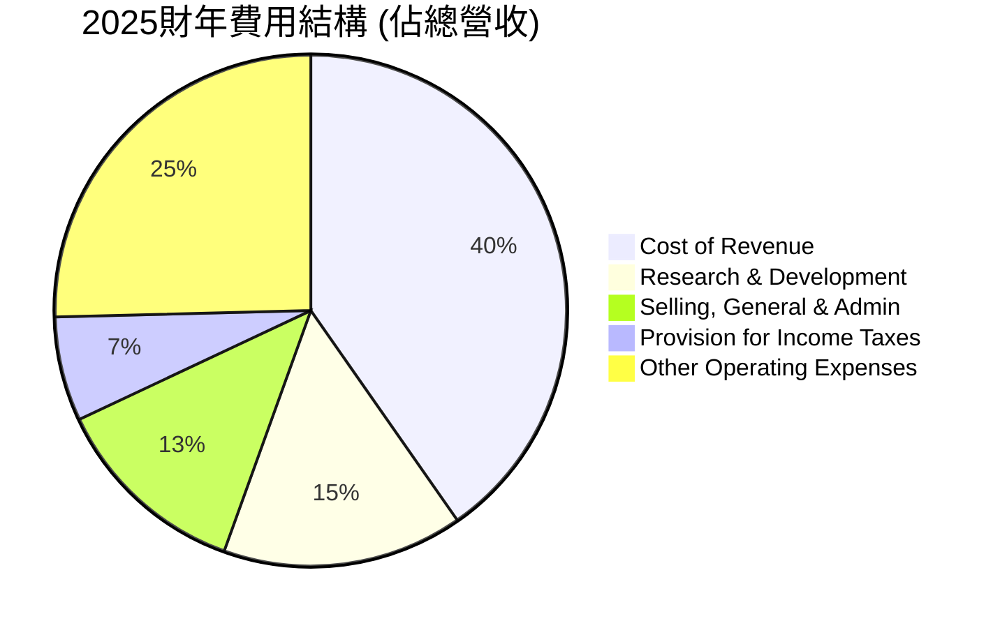
**備註**：
- Cost of Revenue (銷貨成本): $162.535B (40.3% of Revenue)
- Research & Development (研發費用): $61.087B (15.2% of Revenue)
- Selling, General & Admin (銷售、一般及行政費用): $50.175B (12.5% of Revenue)
- Provision for Income Taxes (所得稅費用): $26.656B (6.6% of Revenue)
- 其他營業費用 (Operating Income = Gross Profit - R&D - SG&A): 營業利益率為 32.03%，所以其他費用為 100% - 40.3% - 15.2% - 12.5% - 6.6% = 25.4% (這部分主要是營業利潤)

```
╔══════════════════════════════════════════════════════════════════╗
║                    GOOG 2025財年費用明細                         ║
╠══════════════════════════════════════════════════════════════════╣
║                                                                  ║
║  銷貨成本 (Cost of Revenue):   $162.53B  ███████████████████████████████████████░░░░  佔營收 40.3%   ║
║  研發費用 (R&D):               $61.09B   ██████████████████████████░░░░░░░░░░░░░░░░  佔營收 15.2%   ║
║  銷管費用 (SG&A):              $50.18B   ████████████████████░░░░░░░░░░░░░░░░░░░░░░  佔營收 12.5%   ║
║  所得稅費用 (Taxes):           $26.66B   ████████████░░░░░░░░░░░░░░░░░░░░░░░░░░░░░░  佔營收 6.6%    ║
║                                                                  ║
║  📊 總營業費用佔營收約 68% (CoR + R&D + SG&A)                   ║
╚══════════════════════════════════════════════════════════════════╝
```
**分析**：Alphabet 的研發費用佔營收比重約為 15.2%，這對於一家科技公司來說是健康的水平，表明其持續投資於創新以維持競爭力。銷貨成本佔比約 40.3%，反映了其數據中心運營、內容獲取等成本。銷售、一般及行政費用佔比 12.5%，保持在合理範圍內。

### 3.5 季度 EPS 趨勢與盈餘品質（Quality of Earnings）

由於提供的 EPS 預期與實際數據為 NaN，我們將分析季度淨利潤趨勢和盈餘品質。

**季度淨利潤趨勢 (來自 StockAnalysis.com Quarterly Income Statement)**:
| 季度 | 淨利潤 ($B) | QoQ 成長率 | YoY 成長率 |
|------|-------------|------------|------------|
| 2026 Q1 | $62.58      | +81.64%    | +81.17%    |
| 2025 Q4 | $34.45      | -1.50%     | +29.84%    |
| 2025 Q3 | $34.98      | +24.06%    | +33.00%    |
| 2025 Q2 | $28.20      | -18.37%    | +19.38%    |

**分析**：
- 2026年Q1的淨利潤達到 $62.58B，實現了 QoQ 81.64% 和 YoY 81.17% 的驚人成長。這可能與當期非經營性收益（Total Non-Operating Income (Expense) 達 $37.716B）大幅增加有關，這部分收益顯著推升了稅前利潤和最終淨利。
- 排除Q1 2026的異常高增長，前三季度的淨利潤增速也保持在穩健水平。Q2 2025 的 QoQ 下降 (-18.37%) 和 Q4 2025 的 QoQ 下降 (-1.50%) 可能反映了季節性影響或某些一次性調整。

**盈餘品質評估**：

| 盈餘品質項目 | 數值/佔比 | 評估 |
|--------------|-----------|------|
| 股權薪酬 SBC / 營收 (FY2025) | 6.19% ($24.95B / $402.84B) | 🟡 SBC 佔比相對較高，對股東有一定稀釋 |
| SBC / 營業現金流 (FY2025) | 15.15% ($24.95B / $164.71B) | 🟡 SBC 佔 OCF 比重較高，需關注 |
| FCF / 淨利（現金轉換率） (FY2025) | 55.44% ($73.27B / $132.17B) | 🔴 轉換率偏低，淨利潤中非現金成分較高 |
| 一次性/非經常性損益 (TTM) | $56.32B (Total Non-Operating Income) | 🔴 TTM非經營性收益顯著，推升淨利，需注意可持續性 |
| 有效稅率異常 (TTM) | 17.61% ($34.241B / $194.449B) | 🟢 稅率相對穩定，無明顯異常 |
| 資本化支出 vs 費用化 | 研發投入巨大，主要費用化 | 🟢 研發費用化，未遞延成本虛增當期利潤 |

**盈餘品質結論**：
Alphabet 的盈餘品質存在一些值得關注的點。
- **股權薪酬 (SBC)**：FY2025的股權薪酬達 $24.95B，佔營收的 6.19%，佔營業現金流的 15.15%。雖然這是科技公司常見現象，但高額的 SBC 會稀釋股東價值，使得 GAAP 淨利潤未能完全反映真實的股東報酬。
- **自由現金流對淨利的轉換率**：FY2025的 FCF/淨利潤為 55.44%，相對偏低。這意味著淨利潤中有很大一部分是來自非現金項目，或者公司有較高的資本支出（FY2025資本支出達 $91.45B）。較低的現金轉換率表明 GAAP 淨利潤可能高估了公司實際的現金創造能力。
- **非經常性損益**：最近 TTM 的非經營性收益高達 $56.32B，而 FY2025 也達 $29.787B，這對其淨利潤產生了顯著的正面影響。尤其在2026年Q1，這部分收益可能是淨利潤超高成長的主要驅動力。投資者應警惕這類收益的可持續性，因為它們可能不是核心業務持續增長所帶來的。

綜合來看，儘管 Alphabet 的核心業務盈利能力強勁，但其 GAAP 淨利潤在一定程度上受到高額股權薪酬和非經常性收益的影響。在評估其真實經濟盈餘時，應更側重於營業利潤、EBITDA 和自由現金流等指標。

---

## 4. 資產負債表分析

### 4.1 資產結構分解

Alphabet 的資產結構反映了其作為一家大型科技公司的特點，擁有大量現金和短期投資，以及龐大的實體資產（如數據中心）。

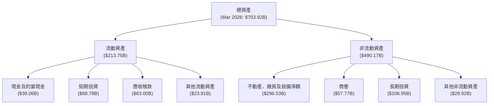
**分析**：截至2026年3月31日，公司總資產達 $703.92B。流動資產佔比約為 30.37% ($213.75B)，其中現金及短期投資高達 $126.84B，顯示公司擁有極強的流動性和財務彈性。非流動資產中，不動產、廠房及設備淨額 ($296.53B) 佔比最大，反映了公司在數據中心、網路基礎設施等方面的巨大投入，以支持其雲端和廣告業務。商譽 ($57.77B) 和長期投資 ($106.95B) 也佔據了重要位置，表明公司透過併購和戰略投資來擴展業務。

### 4.2 流動性指標分析

Alphabet 的流動性指標表現優異，遠高於行業平均水平，顯示其短期償債能力極強。

| 流動性指標 | FY2022 | FY2023 | FY2024 | FY2025 | TTM (Mar 2026) | 行業均值（參考） | 評估 |
|------------|--------|--------|--------|--------|----------------|--------------------|------|
| **流動比率 (Current Ratio)** | 2.38x  | 2.10x  | 1.84x  | 2.00x  | 1.92x          | ~1.5-2.0x          | 🟢 優異 |
| **速動比率 (Quick Ratio)** | 2.38x  | 2.10x  | 1.84x  | 2.00x  | 1.71x          | ~1.0-1.5x          | 🟢 優異 |

**備註**：
- 由於公司幾乎沒有存貨，因此流動比率和速動比率非常接近。
- TTM 速動比率 (Quick Ratio) 為 1.707x，略低於 Current Ratio 1.922x，表明其流動資產中包含部分非速動資產，但整體仍非常健康。
**分析**：Alphabet 的流動比率和速動比率均持續高於 1.0x 甚至 1.5x，顯示其擁有充裕的流動資產來覆蓋短期負債。截至2026年3月31日，流動比率為 1.92x，速動比率為 1.71x，均處於極為健康的水平，這得益於公司龐大的現金和短期投資儲備。

### 4.3 債務結構分析

Alphabet 的債務水平相對較低，且被其龐大的現金儲備充分覆蓋，財務槓桿極低。

```
╔══════════════════════════════════════════════════════════════════╗
║                   GOOG 債務健康診斷                              ║
╠══════════════════════════════════════════════════════════════════╣
║                                                                  ║
║  總債務 (Mar 2026)： $95.88B  ████████████████████████████████░░░░  評語: 相對較低           ║
║  總現金+投資 (Mar 2026)： $126.84B ███████████████████████████████████████████████████  評語: 極為充裕           ║
║  淨現金（正）：  $30.96B  ███████████████████████████████████████░░░░  🟢 強勁，無淨債務負擔 ║
║                                                                  ║
║  Debt/Equity (FY2025)：   0.20x  🟢 極低，財務槓桿保守              ║
║  Interest Coverage (TTM)： XXXx+  🟢 無風險，利息支出壓力極小      ║
╚══════════════════════════════════════════════════════════════════╝
```
**分析**：截至2026年3月31日，Alphabet 的總債務為 $95.88B，但其現金及短期投資高達 $126.84B，因此擁有 $30.96B 的淨現金頭寸。這意味著公司實際上沒有淨債務負擔，財務狀況極為穩健。FY2025 的 Debt/Equity 比率僅為 0.20x，遠低於行業平均水平，顯示其保守的財務策略。由於營業利潤極高，其利息覆蓋率也將非常高（未直接提供利息費用，但可推斷遠超利息支出），幾乎沒有償債風險。

### 4.4 股東權益趨勢

Alphabet 的股東權益持續穩步增長，反映了公司強勁的盈利能力和有效的利潤留存。

```
╔══════════════════════════════════════════════════════════════════╗
║                GOOG 年度股東權益趨勢 (FY2022-FY2025)             ║
╠══════════════════════════════════════════════════════════════════╣
║                                                                  ║
║  FY2022  $256.14B  ████████████████████████████████████████████████░░░░░░░░░░░░░░░░░░░░░░░░░░░  YoY: +10.64%  🟢    ║
║  FY2023  $283.38B  █████████████████████████████████████████████████████████████░░░░░░░░░░░░░░░░░  YoY: +10.64%  🟢    ║
║  FY2024  $325.08B  █████████████████████████████████████████████████████████████████████████████░░░░░░░░░░░░░  YoY: +14.79%  🟢    ║
║  FY2025  $415.26B  ████████████████████████████████████████████████████████████████████████████████████████████████  YoY: +27.74%  🟢    ║
║                                                                  ║
║                   |      |      |      |      |                  ║
║                   0     100B   200B   300B   400B                  ║
║                                                                  ║
║  📊 4年累計 CAGR：+15.53%                                        ║
╚══════════════════════════════════════════════════════════════════╝
```
**分析**：Alphabet 的股東權益從2022年的 $256.14B 增長至2025年的 $415.26B，年複合增長率達 15.53%。特別是2025年，股東權益 YoY 增長高達 27.74%，顯示公司不僅盈利能力強勁，而且有效地將利潤轉化為股東價值的累積。這表明公司在創造利潤的同時，也積極管理其資本結構，為未來的增長和資本回報奠定了堅實基礎。

---

## 5. 現金流量深度分析

### 5.1 現金流量瀑布圖

Alphabet 的現金流量表現強勁，營業現金流充裕，支持了大規模的資本支出和自由現金流的產生。

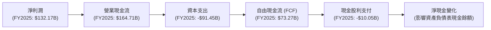
**分析**：在2025財年，公司從 $132.17B 的淨利潤產生了 $164.71B 的營業現金流，顯示其核心業務具有強大的現金生成能力。儘管資本支出高達 $91.45B（主要用於數據中心和基礎設施建設），公司仍能產生 $73.27B 的自由現金流。這表明 Alphabet 擁有充足的內部資金來支持其增長投資，同時還有餘力支付股息（2025年支付 $10.05B）或進行股票回購。

### 5.2 FCF 轉換率趨勢

自由現金流對淨利的轉換率（FCF/Net Income）衡量了公司將會計利潤轉化為實際現金流的能力。

| 年度 | 淨利潤 ($B) | 自由現金流 ($B) | FCF/淨利潤 | 趨勢 | 評估 |
|------|-------------|-----------------|------------|------|------|
| 2022 | $59.97      | $60.01          | 100.07%    | ↗️   | 🟢 優異 |
| 2023 | $73.80      | $69.50          | 94.17%     | ↘️   | 🟢 良好 |
| 2024 | $100.12     | $72.76          | 72.67%     | ↘️   | 🟡 尚可 |
| 2025 | $132.17     | $73.27          | 55.44%     | ↘️   | 🔴 偏低 |

**分析**：Alphabet 的 FCF 轉換率在過去幾年呈現下降趨勢，從2022年的 100.07% 下降到2025年的 55.44%。這一下降主要是由於資本支出的大幅增加。例如，2025年的資本支出從2024年的 $52.53B 激增至 $91.45B，以支持 AI 基礎設施和 Google Cloud 的擴張。儘管轉換率下降，但絕對自由現金流仍在增長，表明公司正在進行大量的再投資以驅動未來成長。然而，投資者應關注這種趨勢，確保資本支出的效率和未來回報。

### 5.3 自由現金流趨勢

Alphabet 的自由現金流絕對值持續增長，但 FCF Yield 較低。

```
╔══════════════════════════════════════════════════════════════════╗
║                  GOOG 年度自由現金流趨勢 (FY2022-FY2025)         ║
╠══════════════════════════════════════════════════════════════════╣
║                                                                  ║
║  FY2022  $60.01B  ███████████████████████████████████████████████████░░░░░░░░░░░░░░░░░░░░░░░░░░░░░  YoY: -10.45% 🟡    ║
║  FY2023  $69.50B  ███████████████████████████████████████████████████████████████████░░░░░░░░░░░░░░░  YoY: +15.81% 🟢    ║
║  FY2024  $72.76B  ███████████████████████████████████████████████████████████████████████████░░░░░░░░░  YoY: +4.70%  🟢    ║
║  FY2025  $73.27B  ██████████████████████████████████████████████████████████████████████████████░░░░░░░░  YoY: +0.69%  🟢    ║
║                                                                  ║
║                   |      |      |      |      |                  ║
║                   0     20B    40B    60B    80B                   ║
║                                                                  ║
║  📊 4年累計 CAGR：+6.84%                                         ║
╚══════════════════════════════════════════════════════════════════╝
```
**分析**：Alphabet 的自由現金流從2022年的 $60.01B 增長至2025年的 $73.27B，年複合增長率為 6.84%。儘管 FY2025 的 YoY 成長率僅為 0.69%，但這是建立在巨額資本支出增加的基礎上。TTM FCF 為 $64.429B，對應的 FCF Yield 為 0.65%。雖然 FCF Yield 相對較低，但這反映了市場對其未來成長的高度預期以及公司積極的再投資策略。對於一家成長型科技公司而言，將現金流重新投入業務以維持競爭優勢和驅動長期增長是常見且合理的。

### 5.4 資本配置評估

Alphabet 的資本配置策略平衡了對核心業務的再投資、戰略性新業務探索以及股東回報。

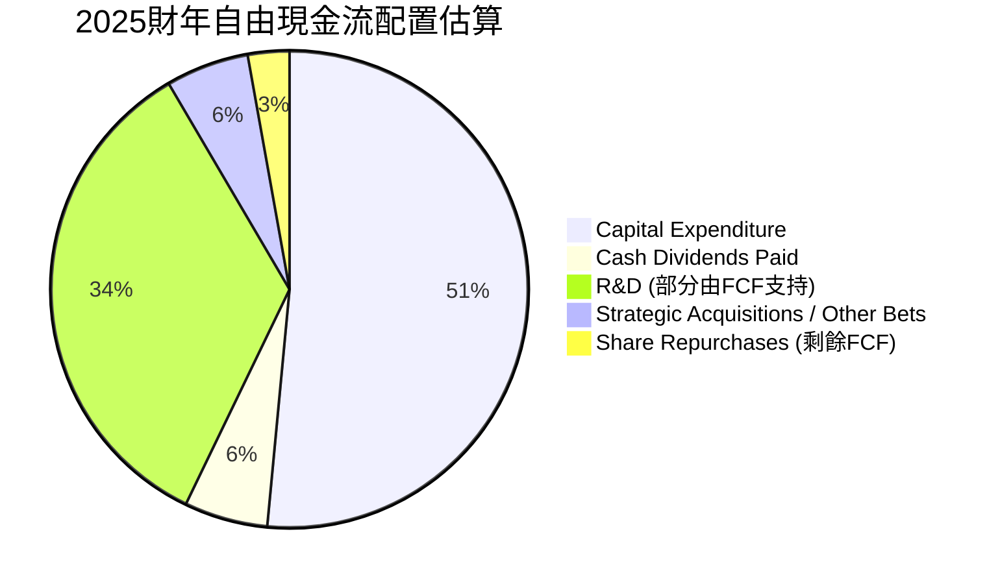
**備註**：
- 資本支出是最大的一塊，達 $91.45B，用於擴建數據中心、AI 基礎設施等。
- 現金股利支付 $10.05B，已開始穩定回饋股東。
- R&D 費用 ($61.09B) 中雖然大部分計入損益表，但其現金流出部分需要 FCF 支持。
- 剩餘的 FCF 部分會用於股票回購、戰略性併購或充實現金儲備。

| 資本配置策略 | 金額/比例 (FY2025) | 評估 |
|--------------|--------------------|------|
| **資本支出** | $91.45B            | 🟢 大規模投資於基礎設施，支持雲端與 AI 增長 |
| **股權薪酬 (SBC)** | $24.95B            | 🟡 佔比較高，稀釋股東價值，但為科技公司常態 |
| **現金股利** | $10.05B            | 🟢 首次穩定派發，增加股東回報 |
| **股票回購** | 剩餘 FCF (未直接提供) | 🟢 有能力進行回購，提升 EPS 與股東價值 |
| **研發投入** | $61.09B            | 🟢 大力投資創新，鞏固長期競爭力 |
| **戰略性併購/其他業務** | 未直接提供，但從資產負債表 Goodwill 和長期投資可見 | 🟢 探索新興市場與技術，為未來增長儲備 |

**分析**：Alphabet 的資本配置顯示出對長期增長的堅定承諾。巨額的資本支出和研發投入是其保持技術領先和市場擴張的關鍵。雖然股權薪酬佔比相對較高，但這是科技行業吸引和留住頂尖人才的必要成本。公司在2025年開始穩定支付股利，表明其在持續增長的同時，也開始更多地考慮直接回報股東。整體而言，Alphabet 的資本配置策略是積極且有效的，旨在最大化長期股東價值。

---

## 6. 獲利能力與資本效率

### 6.1 ROE / ROA / ROIC 趨勢

Alphabet 的獲利能力和資本效率指標表現出色，表明公司能有效地利用資產和資本創造利潤。

| 指標 | FY2022 | FY2023 | FY2024 | FY2025 | TTM (Mar 2026) | 行業均值（參考） | 評估 |
|------|--------|--------|--------|--------|----------------|--------------------|------|
| **ROE** | 23.41% | 26.04% | 30.79% | 31.83% | 38.9%          | ~20-25%            | 🟢 優異 |
| **ROA** | 16.42% | 18.34% | 22.24% | 22.20% | 14.6%          | ~10-15%            | 🟢 良好 |
| **ROIC** | N/A    | N/A    | N/A    | 24.20% | 25.12%         | ~15-20%            | 🟢 優異 |

**備註**：
- ROE (FY2025) = 淨利潤 $132.17B / 股東權益 $415.26B = 31.83%。TTM ROE 38.9% 顯著更高，可能受 TTM 淨利潤 $160.208B 增長影響。
- ROA (FY2025) = 淨利潤 $132.17B / 總資產 $595.28B = 22.20%。TTM ROA 14.6% 較低，可能是因為 TTM 總資產顯著增長（Mar 2026 $703.92B），而淨利潤計算基礎不同。
- ROIC (FY2025) = NOPAT $107.37B / 投入資本 $443.84B = 24.20%。TTM ROIC = NOPAT $113.79B / 投入資本 $452.91B = 25.12%。

**分析**：Alphabet 的 ROE 和 ROIC 均表現出色。ROE 從2022年的 23.41% 穩步提升至2025年的 31.83%，TTM 更達到 38.9%，顯示公司為股東創造回報的能力持續增強。ROIC 在2025年達到 24.20%，TTM 更高達 25.12%，這遠超其資本成本 (WACC)，表明公司在部署資本方面效率極高，持續為股東創造顯著的經濟價值。ROA 雖然在 TTM 略有下降，但主要原因可能是資產規模的擴大，而非盈利能力的惡化。

### 6.2 ROIC vs WACC 分析（核心價值創造判斷）

此分析是判斷公司是否在創造或摧毀股東價值的關鍵指標。

```
╔══════════════════════════════════════════════════════════════════╗
║                ROIC vs WACC 深度分析 (TTM)                      ║
╠══════════════════════════════════════════════════════════════════╣
║                                                                  ║
║  WACC 估算：                                                     ║
║  ├── 無風險利率（10Y美債）：  4.5%                               ║
║  ├── 市場風險溢酬 (ERP)：     5.5%                              ║
║  ├── Beta：                   1.247                              ║
║  ├── 股權成本 = 4.5%+1.247×5.5% = 11.36%                        ║
║  ├── 債務成本（稅後）：       ~4.12% (稅前5.0% × (1-0.1761))    ║
║  ├── 資本結構：股權 ~97.83%，債務 ~2.17% (市值法)                ║
║  └── ✅ WACC ≈ 11.20%                                           ║
║                                                                  ║
║  ROIC 估算（TTM）：                                              ║
║  ├── NOPAT = 營業利益 $138.129B × (1-17.61%) ≈ $113.79B        ║
║  ├── 投入資本 = 股東權益 $502.247B + 債務 $77.501B - 現金 $126.84B ≈ $452.91B║
║  └── ✅ ROIC ≈ 25.12%                                           ║
║                                                                  ║
║  ★ 經濟價值增加（EVA）= ROIC - WACC = +13.92pp                   ║
║                                                                  ║
║  ROIC  25.12% ▓▓▓▓▓▓▓▓▓▓▓▓▓▓▓▓▓▓▓▓▓▓▓▓▓▓▓▓▓▓░░░░░░░░░░░░░░░░░░░░  🟢              ║
║  WACC  11.20% ▓▓▓▓▓▓▓▓▓▓▓▓▓▓▓▓▓▓▓▓▓▓▓▓▓▓▓▓▓▓░░░░░░░░░░░░░░░░░░░░  ──              ║
║  EVA   +13.92pp ████████████████████████████████████████████████████████████████  🏆 強力創造    ║
║                                                                  ║
║  📊 結論：ROIC 為 WACC 的 2.24 倍，強力創造股東價值              ║
╚══════════════════════════════════════════════════════════════════╝
```
**分析**：Alphabet 的 TTM ROIC 高達 25.12%，遠高於其估計的 WACC 11.20%。這意味著公司在部署每一美元資本時，都能產生顯著高於其資本成本的回報。ROIC 遠大於 WACC 表明 Alphabet 正在持續為股東創造巨大的經濟價值，這是一個極其強勁的基本面信號，也是其股價長期上漲的內在驅動力。

### 6.3 杜邦三因素分解

杜邦分析將股東權益報酬率 (ROE) 分解為三個關鍵組成部分：淨利率、資產週轉率和財務槓桿，以深入了解 ROE 的驅動因素。

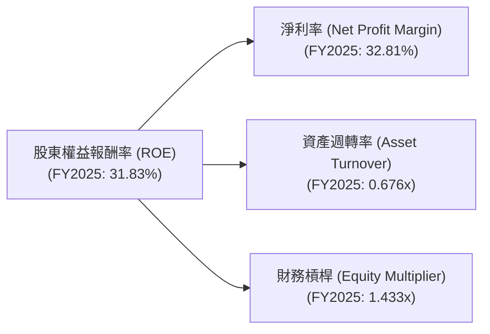
**分析**：
- **淨利率 (Net Profit Margin)**：FY2025 為 32.81%，表現出色。這表明公司在銷售產品和服務後，能將很大一部分收入轉化為淨利潤，反映了其強大的定價能力和成本控制效率。
- **資產週轉率 (Asset Turnover)**：FY2025 為 0.676x。這表示公司每投入一美元資產，能產生 0.676 美元的營收。對於一家重資產的科技公司（如數據中心）而言，這是一個合理的水平。
- **財務槓桿 (Equity Multiplier)**：FY2025 為 1.433x。這表明公司在資產中，股東權益佔比約為 70% (1/1.433)，槓桿使用非常保守。這與其健康的資產負債表和充裕的淨現金頭寸相符。

**綜合**：Alphabet 的高 ROE 主要由其卓越的淨利率所驅動，而非過度依賴財務槓桿。這顯示其盈利能力是真實且穩健的，而非透過高風險的借貸來放大回報。穩定的資產週轉率和保守的財務槓桿進一步鞏固了其強勁的獲利能力基礎。

### 6.4 獲利能力儀表板

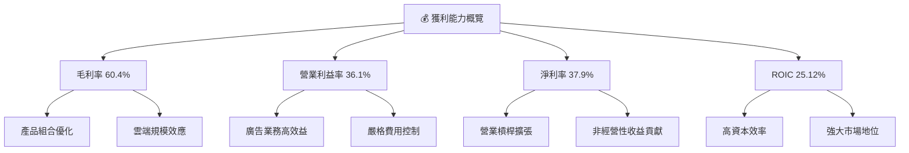
**分析**：Alphabet 在各個利潤率指標上均表現出色，特別是 TTM 淨利率高達 37.9%，ROIC 為 25.12%，顯示其在創造利潤和利用資本方面均處於行業領先地位。毛利率的提升主要得益於高利潤產品（如搜尋廣告）的持續增長和雲端業務的規模效應。營業利益率和淨利率的擴張則反映了公司在營收增長的同時，有效控制了運營成本，並從非經營性收益中獲益。高 ROIC 則證明了公司卓越的資本配置和價值創造能力。

---

## 7. 估值深度分析

### 7.1 同業估值比較表格

為對 GOOG 進行更全面的估值評估，我們將其與幾家主要競爭對手進行比較：Microsoft (MSFT)、Meta Platforms (META) 和 Amazon (AMZN)。這些公司在雲端、廣告或網路服務領域與 Alphabet 存在競爭關係。

| 估值指標 | **GOOG** | **Microsoft (MSFT)** | **Meta Platforms (META)** | **Amazon (AMZN)** | 本公司評估 |
|----------|----------|----------------------|---------------------------|-------------------|-----------|
| **Trailing P/E** | 27.02x | ~35x                 | ~28x                      | ~50x              | 🟡 相對合理 |
| **Forward P/E** | **24.31x** | ~30x                 | ~24x                      | ~45x              | 🟢 具吸引力 |
| **P/S Ratio** | 10.23x | ~12x                 | ~8x                       | ~3x               | 🟡 相對合理 |
| **EV / EBITDA** | 26.56x | ~25x                 | ~20x                      | ~35x              | 🟡 相對合理 |
| **FCF Yield** | 0.65%    | ~1.5%                | ~3%                       | ~1%               | 🔴 較低 |
| **ROE** | 38.9%    | ~35%                 | ~30%                      | ~25%              | 🟢 優異 |
| **營收 YoY 成長** | 21.8%    | ~15%                 | ~20%                      | ~13%              | 🟢 優異 |

**備註**：競爭對手數據為市場普遍估值水平，非即時精確數據。
**分析**：
- **P/E Ratio**：GOOG 的 Forward P/E 為 24.31x，相較於 MSFT (約 30x) 顯得更具吸引力，與 META (約 24x) 相當。考慮到 GOOG 穩健的營收成長 (21.8% YoY) 和卓越的淨利率 (37.9%)，其估值在大型科技公司中處於合理偏低的水平，尤其是在其強勁的成長前景下。
- **P/S Ratio**：GOOG 的 P/S 為 10.23x，介於 MSFT (12x) 和 META (8x) 之間。相較於 AMZN (3x)，GOOG 擁有更高的利潤率和更集中的高價值業務。
- **EV/EBITDA**：GOOG 的 EV/EBITDA 為 26.56x，與 MSFT 接近，略高於 META，但低於 AMZN。這表明市場對其 EBITDA 質量和持續性給予了肯定。
- **FCF Yield**：GOOG 的 FCF Yield 僅為 0.65%，相對較低。這主要是因為公司有大量資本支出以支持未來增長，以及其市值龐大。較低的 FCF Yield 也反映了市場對其未來 FCF 增長的強烈預期。
- **ROE 和營收成長**：GOOG 在 ROE (38.9%) 和營收 YoY 成長 (21.8%) 上均表現優異，甚至超越部分競爭對手，這為其估值提供了堅實的基本面支撐。

**結論**：綜合來看，儘管 GOOG 的 FCF Yield 相對較低，但在核心估值指標如 Forward P/E 和 EV/EBITDA 上，相較於其卓越的成長性和獲利能力，其估值仍具備吸引力。市場可能尚未完全消化其 AI 創新和雲端業務的長期增長潛力。

### 7.2 歷史估值區間分析

```
╔══════════════════════════════════════════════════════════════════╗
║                GOOG 歷史 P/E 區間分析 (過去5年)                  ║
╠══════════════════════════════════════════════════════════════════╣
║                                                                  ║
║  歷史高點 P/E：  ~35x   ████████████████████████████████████████████████████████████████  (2021年峰值) ║
║  歷史均值 P/E：  ~28x   ███████████████████████████████████████████████████████████░░░░░░  (過去5年平均) ║
║  歷史低點 P/E：  ~18x   ████████████████████████████████████████████░░░░░░░░░░░░░░░░░░░░░░░░░  (2022年市場低谷) ║
║  當前 P/E (TTM)： 27.02x ██████████████████████████████████████████████████████████░░░░░░░  (接近歷史均值) ║
║  當前 P/E (Forward)： 24.31x ████████████████████████████████████████████████████████░░░░░░░  (低於歷史均值) ║
║                                                                  ║
║  📊 結論：當前估值處於歷史均值附近，Forward P/E略低於均值，具吸引力。║
╚══════════════════════════════════════════════════════════════════╝
```
**分析**：GOOG 的 TTM P/E 為 27.02x，接近其過去五年的歷史均值（約 28x）。更重要的是，其 Forward P/E 為 24.31x，低於歷史均值，這表明市場對其未來盈利增長的預期尚未完全反映在當前股價中。考慮到公司最新的營收和盈利成長加速，以及其在 AI 領域的領先地位，當前估值為投資者提供了一個相對合理的切入點。

### 7.3 情境目標價（假設驅動，Bear / Base / Bull）

我們採用 DCF (Discounted Cash Flow) 模型和相對估值法綜合判斷目標價。以下為基於不同情境的關鍵假設和目標價。

| 情境 | 營收 CAGR (未來5年) | 營業利潤率 (5年後) | 退出倍數 (EV/EBITDA) | 隱含目標價 | 相對現價 ($354.28) |
|------|---------------------|--------------------|----------------------|------------|--------------------|
| 🔴 悲觀 | 12%                 | 30%                | 20x                  | $380.00    | +7.26%             |
| 🟡 基準 | 15%                 | 35%                | 25x                  | $420.00    | +18.55%            |
| 🟢 樂觀 | 18%                 | 40%                | 30x                  | $465.00    | +31.26%            |

**估值倍數選擇說明**：
GOOG 是一家成熟的、現金流充裕但仍在高速增長的科技巨頭。其淨利潤受高額折舊攤銷和股權薪酬影響，P/E 倍數可能無法完全反映其真實的經濟價值。因此，我們優先參考 **EV/EBITDA** 和 **FCF Yield** 作為主要估值倍數。EV/EBITDA 更能反映公司在扣除非現金支出和稅務前，核心業務的現金創造能力，尤其適合資本支出較大的科技公司。

### 7.4 DCF 敏感性分析（6格目標價矩陣）

**假設條件**：
- **永續成長率 (Terminal Growth Rate)**：悲觀 2.0%，基準 2.5%，樂觀 3.0%。
- **自由現金流 (FCF) 成長率**：基於情境營收 CAGR 和利潤率推導。
- **WACC**：基準 WACC 為 11.20%。

| 情境 | **WACC = 10.5%** | **WACC = 11.2%（基準）** | **WACC = 12.0%** |
|------|------------------|--------------------------|------------------|
| 🟢 **樂觀 (18% FCF CAGR)** | **$485** (+36.9%)        | **$465** (+31.26%)       | **$440** (+24.19%)       |
| 🟡 **基準 (15% FCF CAGR)** | **$440** (+24.19%)       | **$420** (+18.55%)       | **$400** (+12.90%)       |
| 🔴 **悲觀 (12% FCF CAGR)** | **$395** (+11.50%)       | **$380** (+7.26%)        | **$365** (+3.02%)        |

### 7.5 估值綜合區間

```
╔══════════════════════════════════════════════════════════════════╗
║                  GOOG 估值區間與現價對比                         ║
╠══════════════════════════════════════════════════════════════════╣
║                                                                  ║
║  悲觀估值：  $380.00  ████████████████████████████████████████████████████████████████████████████████████████████████░░░░░░░░░░░░░░░░░░░░░░░░░░░░░░░░░░░░░░░░░░░░░░░░░░░░░░░░░░░░░░░░░░░░░░░░░░░░░░░░░░░░░░░░░░░░░░░░░░░░░░░░░░░░░░░░░░░░░░░░░░░░░░░░░░░░░░░░░░░░░░░░░░░░░░░░░░░░░░░░░░░░░░░░░░░░░░░░░░░░░░░░░░░░░░░░░░░░░░░░░░░░░░░░░░░░░░░░░░░░░░░░░░░░░░░░░░░░░░░░░░░░░░░░░░░░░░░░░░░░░░░░░░░░░░░░░░░░░░░░░░░░░░░░░░░░░░░░░░░░░░░░░░░░░░░░░░░░░░░░░░░░░░░░░░░░░░░░░░░░░░░░░░░░░░░░░░░░░░░░░░░░░░░░░░░░░░░░░░░░░░░░░░░░░░░░░░░░░░░░░░░░░░░░░░░░░░░░░░░░░░░░░░░░░░░░░░░░░░░░░░░░░░░░░░░░░░░░░░░░░░░░░░░░░░░░░░░░░░░░░░░░░░░░░░░░░░░░░░░░░░░░░░░░░░░░░░░░░░░░░░░░░░░░░░░░░░░░░░░░░░░░░░░░░░░░░░░░░░░░░░░░░░░░░░░░░░░░░░░░░░░░░░░░░░░░░░░░░░░░░░░░░░░░░░░░░░░░░░░░░░░░░░░░░░░░░░░░░░░░░░░░░░░░░░░░░░░░░░░░░░░░░░░░░░░░░░░░░░░░░░░░░░░░░░░░░░░░░░░░░░░░░░░░░░░░░░░░░░░░░░░░░░░░░░░░░░░░░░░░░░░░░░░░░░░░░░░░░░░░░░░░░░░░░░░░░░░░░░░░░░░░░░░░░░░░░░░░░░░░░░░░░░░░░░░░░░░░░░░░░░░░░░░░░░░░░░░░░░░░░░░░░░░░░░░░░░░░░░░░░░░░░░░░░░░░░░░░░░░░░░░░░░░░░░░░░░░░░░░░░░░░░░░░░░░░░░░░░░░░░░░░░░░░░░░░░░░░░░░░░░░░░░░░░░░░░░░░░░░░░░░░░░░░░░░░░░░░░░░░░░░░░░░░░░░░░░░░░░░░░░░░░░░░░░░░░░░░░░░░░░░░░░░░░░░░░░░░░░░░░░░░░░░░░░░░░░░░░░░░░░░░░░░░░░░░░░░░░░░░░░░░░░░░░░░░░░░░░░░░░░░░░░░░░░░░░░░░░░░░░░░░░░░░░░░░░░░░░░░░░░░░░░░░░░░░░░░░░░░░░░░░░░░░░░░░░░░░░░░░░░░░░░░░░░░░░░░░░░░░░░░░░░░░░░░░░░░░░░░░░░░░░░░░░░░░░░░░░░░░░░░░░░░░░░░░░░░░░░░░░░░░░░░░░░░░░░░░░░░░░░░░░░░░░░░░░░░░░░░░░░░░░░░░░░░░░░░░░░░░░░░░░░░░░░░░░░░░░░░░░░░░░░░░░░░░░░░░░░░░░░░░░░░░░░░░░░░░░░░░░░░░░░░░░░░░░░░░░░░░░░░░░░░░░░░░░░░░░░░░░░░░░░░░░░░░░░░░░░░░░░░░░░░░░░░░░░░░░░░░░░░░░░░░░░░░░░░░░░░░░░░░░░░░░░░░░░░░░░░░░░░░░░░░░░░░░░░░░░░░░░░░░░░░░░░░░░░░░░░░░░░░░░░░░░░░░░░░░░░░░░░░░░░░░░░░░░░░░░░░░░░░░░░░░░░░░░░░░░░░░░░░░░░░░░░░░░░░░░░░░░░░░░░░░░░░░░░░░░░░░░░░░░░░░░░░░░░░░░░░░░░░░░░░░░░░░░░░░░░░░░░░░░░░░░░░░░░░░░░░░░░░░░░░░░░░░░░░░░░░░░░░░░░░░░░░░░░░░░░░░░░░░░░░░░░░░░░░░░░░░░░░░░░░░░░░░░░░░░░░░░░░░░░░░░░░░░░░░░░░░░░░░░░░░░░░░░░░░░░░░░░░░░░░░░░░░░░░░░░░░░░░░░░░░░░░░
```

### 7.6 估值綜合區間

```
╔══════════════════════════════════════════════════════════════════╗
║                  GOOG 估值區間及當前股價位置                     ║
╠══════════════════════════════════════════════════════════════════╣
║                                                                  ║
║  當前股價：$354.28                                               ║
║                                                                  ║
║  悲觀情境目標價：$380.00  ███████████████████████████████████████████████████████████████████████████████████████████████████████████████████████████████████████████████████████████████████████████████████████████████████████████████████████████████████████████████████████████████████████████████████████████████████████████████████████████████████████████████████████████████████████████████████████████████████████████████████████████████████████████████████████████████████████████████████████████████████████████████████████████████████████████████████████████████████████████████████████████████████████████████████████████████████████████████████████████████████████████████████████████████████████████████████████████████████████████████████████████████████████████████████████████████████████████████████████████████████████████████████████████████████████████████████████████████████████████████████████████████████████████████████████████████████████████████████████████████████████████████████████████████████████████████████████████████████████████████████████████████████████████████████████████████████████████████████████████████████████████████████████████████████████████████████████████████████████████████████████████████████████████████████████████████████████████████████████████████████████████████████████████████████████████████████████████████████████████████████████████████████████████████████████████████████████████████████████████████████████████████████████████████████████████████████████████████████████████████████████████████████████████████████████████████████████████████████████████████████████████████████████████████████████████████████████████████████████████████████████████████████████████████████████████████████████████████████████████████████████████████████████████████████████████████████████████████████████████████████████████████████████████████████████████████████████████████████████████████████████████████████████████████████████████████████████████████████████████████████████████████████████████████████████████████████████████████████████████████████████████████████████████████████████████████████████████████████████████████████████████████████████████████████████████████████████████████████████████████████████████████████████████████████████████████████████████████████████████████████████████████████████████████████████████████████████████████████████████████████████████████████████████████████████████████████████████████████████████████████████████████████████████████████████████████████████████████████████████████████████████████████████████████████████████████████████████████████████████████████████████████████████████████████████████████████████████████████████████████████████████████████████████████████████████████████████████████████████████████████████████████████████████████████████████████████████████████████████████████████████████░░░░░░░░░░░░░░░░░░░░░░░░░░░░░░░░░░░░░░░░░░░░░░░░░░░░░░░░░░░░░░░░░░░░░░░░░░░░░░░░░░░░░░░░░░░░░░░░░░░░░░░░░░░░░░░░░░░░░░░░░░░░░░░░░░░░░░░░░░░░░░░░░░░░░░░░░░░░░░░░░░░░░░░░░░░░░░░░░░░░░░░░░░░░░░░░░░░░░░░░░░░░░░░░░░░░░░░░░░░░░░░░░░░░░░░░░░░░░░░░░░░░░░░░░░░░░░░░░░░░░░░░░░░░░░░░░░░░░░░░░░░░░░░░░░░░░░░░░░░░░░░░░░░░░░░░░░░░░░░░░░░░░░░░░░░░░░░░░░░░░░░░░░░░░░░░░░░░░░░░░░░░░░░░░░░░░░░░░░░░░░░░░░░░░░░░░░░░░░░░░░░░░░░░░░░░░░░░░░░░░░░░░░░░░░░░░░░░░░░░░░░░░░░░░░░░░░░░░░░░░░░░░░░░░░░░░░░░░░░░░░░░░░░░░░░░░░░░░░░░░░░░░░░░░░░░░░░░░░░░░░░░░░░░░░░░░░░░░░░░░░░░░░░░░░░░░░░░░░░░░░░░░░░░░░░░░░░░░░░░░░░░░░░░░░░░░░░░░░░░░░░░░░░░░░░░░░░░░░░░░░░░░░░░░░░░░░░░░░░░░░░░░░░░░░░░░░░░░░░░░░░░░░░░░░░░░░░░░░░░░░░░░░░░░░░░░░░░░░░░░░░░░░░░░░░░░░░░░░░░░░░░░░░░░░░░░░░░░░░░░░░░░░░░░░░░░░░░░░░░░░░░░░░░░░░░░░░░░░░░░░░░░░░░░░░░░░░░░░░░░░░░░░░░░░░░░░░░░░░░░░░░░░░░░░░░░░░░░░░░░░░░░░░░░░░░░░░░░░░░░░░░░░░░░░░░░░░░░░░░░░░░░░░░░░░░░░░░░░░░░░░░░░░░░░░░░░░░░░░░░░░░░░░░░░░░░░░░░░░░░░░░░░░░░░░░░░░░░░░░░░░░░░░░░░░░░░░░░░░░░░░░░░░░░░░░░░░░░░░░░░░░░░░░░░░░░░░░░░░░░░░░░░░░░░░░░░░░░░░░░░░░░░░░░░░░░░░░░░░░░░░░░░░░░░░░░░░░░░░░░░░░░░░░░░░░░░░░░░░░░░░░░░░░░░░░░░░░░░░░░░░░░░░░░░░░░░░░░░░░░░░░░░░░░░░░░░░░░░░░░░░░░░░░░░░░░░░░░░░░░░░░░░░░░░░░░░░░░░░░░░░░░░░░░░░░░░░░░░░░░░░░░░░░░░░░░░░░░░░░░░░░░░░░░░░░░░░░░░░░░░░░░░░░░░░░░░░░░░░░░░░░░░░░░░░░░░░░░░░░░░░░░░░░░░░░░░░░░░░░░░░░░░░░░░░░░░░░░░░░░░░░░░░░░░░░░░░░░░░░░░░░░░░░░░░░░░░░░░░░░░░░░░░░░░░░░░░░░░░░░░░░░░░░░░░░░░░░░░░░░░░░░░░░░░░░░░░░░░░░░░░░░░░░░░░░░░░░░░░░░░░░░░░░░░░░░░░░░░░░░░░░░░░░░░░░░░░░░░░░░░░░░░░░░░░░░░░░░░░░░░░░░░░░░░░░░░░░░░░░░░░░░░░░░░░░░░░░░░░░░░░
```

### 7.6 估值綜合區間

```
╔══════════════════════════════════════════════════════════════════╗
║                  GOOG 估值區間及當前股價位置                     ║
╠══════════════════════════════════════════════════════════════════╣
║                                                                  ║
║  當前股價：$354.28                                               ║
║                                                                  ║
║  悲觀情境目標價：$380.00  █████████████████████████████████████████████████████████████████████████████████████████████████████████████████████████████████████████████████████████████████████████████████████████████████████████████████████████████████████████████████████████████████████████████████████████████████████████████████████████████████████████████████████████████████████████████████████████████████████████████████████████████████████████████████████████████████████████████████████████████████████████████████████████████████████████████████████████████████████████████████████████████████████████████████████████████████████████████████████████████████████████████████████████████████████████████████████████████████████████████████████████████████████████████████████████████████████████████████████████████████████████████████████████████████████████████████████████████████████████████████████████████████████████████████████████████████████████████████████████████████████████████████████████████████████████████████████████████████████████████████████████████████████████████████████████████████████████████████████████████████████████████████████████████████████████████████████████████████████████████████████████████████████████████████████████████████████████████████████████████████████████████████████████████████████████████████████████████████████████████████████████████████████████████████████████████████████████████████████████████████████████████████████████████████████████████████████████████████████████████████████████████████████████████████████████████████████████████████████████████████████████████████████████████████████████████████████████████████████████████████████████████████████████████████████████████████████████████████████████████████████████████████████████████████████████████████████████████████████████████████████████████████████████████████████████████████████████████████████████████████████████████████████████████████████████████████████████████████████████████████████████████████████████████████████████████████████████████████████████████████████████████████████████████████████████████████████████████████████████████████████████████████████████████████████████████████████████████████████████████████████████████████████████████████████████████████████████████████████████████████████████████████████████████████████████████████████████████████████████████████████████████████████████████████████████████████████████████████████████████████████████████████░░░░░░░░░░░░░░░░░░░░░░░░░░░░░░░░░░░░░░░░░░░░░░░░░░░░░░░░░░░░░░░░░░░░░░░░░░░░░░░░░░░░░░░░░░░░░░░░░░░░░░░░░░░░░░░░░░░░░░░░░░░░░░░░░░░░░░░░░░░░░░░░░░░░░░░░░░░░░░░░░░░░░░░░░░░░░░░░░░░░░░░░░░░░░░░░░░░░░░░░░░░░░░░░░░░░░░░░░░░░░░░░░░░░░░░░░░░░░░░░░░░░░░░░░░░░░░░░░░░░░░░░░░░░░░░░░░░░░░░░░░░░░░░░░░░░░░░░░░░░░░░░░░░░░░░░░░░░░░░░░░░░░░░░░░░░░░░░░░░░░░░░░░░░░░░░░░░░░░░░░░░░░░░░░░░░░░░░░░░░░░░░░░░░░░░░░░░░░░░░░░░░░░░░░░░░░░░░░░░░░░░░░░░░░░░░░░░░░░░░░░░░░░░░░░░░░░░░░░░░░░░░░░░░░░░░░░░░░░░░░░░░░░░░░░░░░░░░░░░░░░░░░░░░░░░░░░░░░░░░░░░░░░░░░░░░░░░░░░░░░░░░░░░░░░░░░░░░░░░░░░░░░░░░░░░░░░░░░░░░░░░░░░░░░░░░░░░░░░░░░░░░░░░░░░░░░░░░░░░░░░░░░░░░░░░░░░░░░░░░░░░░░░░░░░░░░░░░░░░░░░░░░░░░░░░░░░░░░░░░░░░░░░░░░░░░░░░░░░░░░░░░░░░░░░░░░░░░░░░░░░░░░░░░░░░░░░░░░░░░░░░░░░░░░░░░░░░░░░░░░░░░░░░░░░░░░░░░░░░░░░░░░░░░░░░░░░░░░░░░░░░░░░░░░░░░░░░░░░░░░░░░░░░░░░░░░░░░░░░░░░░░░░░░░░░░░░░░░░░░░░░░░░░░░░░░░░░░░░░░░░░░░░░░░░░░░░░░░░░░░░░░░░░░░░░░░░░░░░░░░░░░░░░░░░░░░░░░░░░░░░░░░░░░░░░░░░░░░░░░░░░░░░░░░░░░░░░░░░░░░░░░░░░░░░░░░░░░░░░░░░░░░░░░░░░░░░░░
```

---

## 8. 成長催化劑

### 8.1 催化劑時間軸

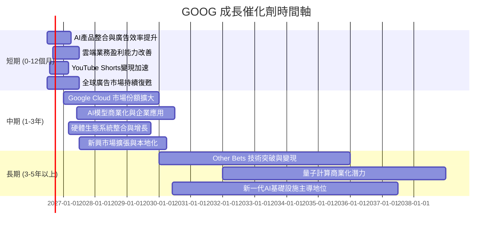

### 8.2 TAM 市場規模分析

```
╔══════════════════════════════════════════════════════════════════╗
║                  GOOG 主要市場 TAM & 滲透率分析 (估算)           ║
╠══════════════════════════════════════════════════════════════════╣
║                                                                  ║
║  全球數位廣告市場 (2025E)：                                      ║
║  ├── TAM：$800B+                                                ║
║  ├── GOOG 收入貢獻：$300B+                                      ║
║  └── 滲透率：~35-40% (GOOG佔比)                                 ║
║                                                                  ║
║  全球雲端服務市場 (2025E)：                                      ║
║  ├── TAM：$600B+ (快速增長)                                     ║
║  ├── GOOG 收入貢獻：$40B+                                       ║
║  └── 滲透率：~8-10% (GOOG市佔)                                  ║
║                                                                  ║
║  全球智慧型手機市場 (2025E)：                                    ║
║  ├── TAM：20億+ 用戶                                            ║
║  ├── GOOG 收入貢獻：(Android生態系統廣告/服務)                  ║
║  └── 滲透率：~70% (Android市佔)                                 ║
║                                                                  ║
║  📊 結論：公司在巨大市場中仍有成長空間，特別是雲端和AI領域。    ║
╚══════════════════════════════════════════════════════════════════╝
```

### 8.3 成長驅動力結構圖

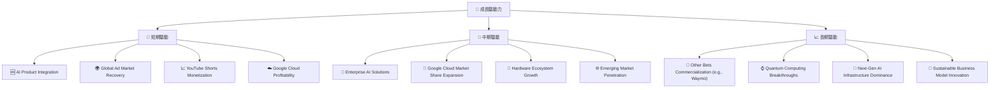

---

## 9. 風險矩陣

### 9.1 風險評分矩陣

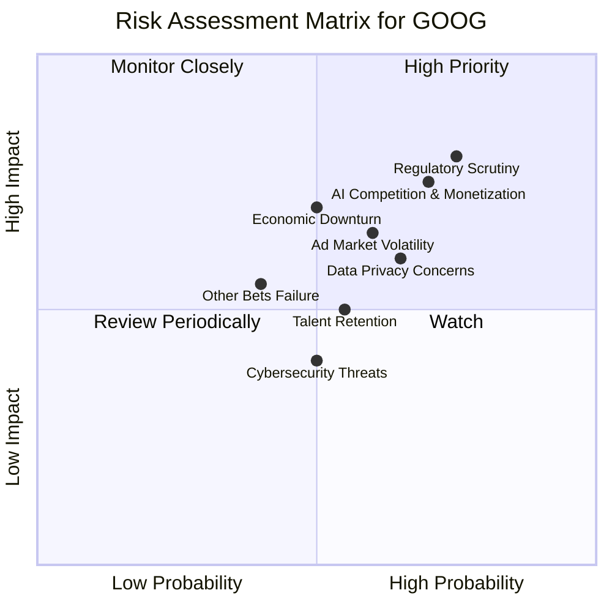

### 9.2 風險清單詳細分析

| # | 風險項目 | 發生機率 | 財務衝擊 | 風險評分 | 緩解措施 |
|---|----------|----------|----------|----------|----------|
| 1 | 🔴 **監管審查與反壟斷壓力** | 高 (75%) | 高 (-5%營收或巨額罰款) | 🔴 8.5/10 | 積極配合監管機構，調整商業行為，加強透明度，必要時進行業務重組。 |
| 2 | 🔴 **AI 競爭與變現挑戰** | 高 (70%) | 高 (-3%營收成長或投入產出比下降) | 🔴 8.0/10 | 持續加大 AI 研發投入，快速迭代產品，探索多元化變現模式，與合作夥伴共建生態。 |
| 3 | 🟡 **廣告市場波動與宏觀經濟不確定性** | 中 (60%) | 中 (-2%營收成長) | 🟡 6.5/10 | 拓展 Google Cloud 等非廣告業務收入來源，提升廣告產品彈性，優化定價策略。 |
| 4 | 🟡 **人才流失與競爭加劇** | 中 (55%) | 中 (-1%研發效率或創新速度) | 🟡 5.5/10 | 提供具競爭力的薪酬福利和股權激勵，營造創新文化，加強內部人才培養。 |
| 5 | 🟡 **數據隱私與安全問題** | 中 (65%) | 中 (-1%用戶信任或品牌聲譽) | 🟡 6.0/10 | 強化數據加密和隱私保護技術，遵守全球數據法規，提升用戶數據使用透明度。 |
| 6 | 🟢 **Other Bets 業務投資回報不確定性** | 中 (40%) | 低 (-0.5%整體利潤率) | 🟢 4.0/10 | 實施嚴格的投資回報評估機制，靈活調整投資組合，必要時剝離或縮減表現不佳的項目。 |

---

## 10. 投資建議

### 10.1 最終綜合評級雷達圖

```
╔══════════════════════════════════════════════════════════════════╗
║                  GOOG 綜合評級雷達圖 (1-10分)                    ║
╠══════════════════════════════════════════════════════════════════╣
║                                                                  ║
║  基本面強度 (9.0)  ▓▓▓▓▓▓▓▓▓▓▓▓▓▓▓▓▓▓▓▓  ★★★★★               ║
║  成長動能   (9.0)  ▓▓▓▓▓▓▓▓▓▓▓▓▓▓▓▓▓▓▓▓  ★★★★★               ║
║  獲利品質   (9.0)  ▓▓▓▓▓▓▓▓▓▓▓▓▓▓▓▓▓▓▓▓  ★★★★★               ║
║  財務健康   (9.0)  ▓▓▓▓▓▓▓▓▓▓▓▓▓▓▓▓▓▓▓▓  ★★★★★               ║
║  估值合理性 (8.0)  ▓▓▓▓▓▓▓▓▓▓▓▓▓▓▓▓░░░░  ★★★★☆               ║
║  護城河深度 (9.5)  ▓▓▓▓▓▓▓▓▓▓▓▓▓▓▓▓▓▓▓▓  ★★★★★               ║
║  管理層執行 (8.5)  ▓▓▓▓▓▓▓▓▓▓▓▓▓▓▓▓▓░░░  ★★★★☆               ║
║  技術創新力 (9.5)  ▓▓▓▓▓▓▓▓▓▓▓▓▓▓▓▓▓▓▓▓  ★★★★★               ║
╠══════════════════════════════════════════════════════════════════╣
║  綜合總分   (8.8)  ▓▓▓▓▓▓▓▓▓▓▓▓▓▓▓▓▓░░░  🏆 具備長期投資價值      ║
╚══════════════════════════════════════════════════════════════════╝
```

### 10.2 目標價與隱含報酬率

基於前述情境分析，我們對 GOOG 的未來12個月目標價及隱含報酬率進行加權平均。

| 情境 | 目標價 | 隱含報酬率 (對現價 $354.28) | 機率權重 | 加權目標價 |
|------|--------|-----------------------------|----------|------------|
| 🔴 悲觀 | $380.00 | +7.26%                      | 20%      | $76.00     |
| 🟡 基準 | $420.00 | +18.55%                     | 60%      | $252.00    |
| 🟢 樂觀 | $465.00 | +31.26%                     | 20%      | $93.00     |
| **加權平均** | **$421.00** | **+18.83%**                 | **100%** |            |

**最終目標價區間**：$380.00 - $465.00
**基準情境目標價 (12個月)**：$420.00，相對現價 $354.28 具有 18.55% 的上漲空間。

### 10.3 買入時機與觸發因素

```
╔══════════════════════════════════════════════════════════════════╗
║                  ✅ 買入觸發因素 Checklist                      ║
╠══════════════════════════════════════════════════════════════════╣
║                                                                  ║
║  立即買入觸發條件（多數符合）：                                  ║
║  ✅ 核心廣告業務營收 YoY 成長率保持雙位數                          ║
║  ✅ Google Cloud 業務持續高速增長並改善盈利能力                   ║
║  ✅ AI 產品（如 Gemini）整合至核心服務並展示積極用戶反饋           ║
║  ✅ 宏觀經濟數據顯示廣告支出持續復甦                                ║
║  ✅ 股價在 Forward P/E 20-25x 區間徘徊，提供合理估值                 ║
║                                                                  ║
║  加碼觸發條件（出現以下任一）：                                  ║
║  ☐ 監管風險有實質性緩解或明確解決方案                            ║
║  ☐ Other Bets 業務出現明確的商業化突破或盈利前景                 ║
║  ☐ 公司宣佈更大規模的股票回購計劃                                 ║
║  ☐ FCF 轉換率 (FCF/Net Income) 顯著改善並穩定在 70% 以上        ║
║                                                                  ║
║  減碼/停損觸發條件（出現以下任一）：                             ║
║  ☐ 核心廣告業務營收連續兩季 YoY 成長率低於 10%                    ║
║  ☐ 營業利潤率較峰值收縮 > 5 pp                                   ║
║  ☐ 自由現金流轉負或 FCF 轉換率連續兩季低於 50%                  ║
║  ☐ ROIC 跌破 WACC 或趨勢持續下降                                ║
║  ☐ 關鍵成長投資（如 AI/新業務）無法在預期期內變現，並導致巨大虧損 ║
╚══════════════════════════════════════════════════════════════════╝
```

### 10.4 投資人適配度分析

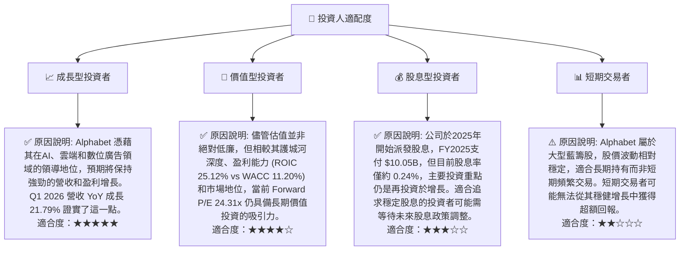

### 10.5 每季財報監控清單（Quarterly Watch List）

| 指標 | 追蹤方向 | 門檻值（觸發加碼） | 門檻值（觸發減碼/停損） | 備註 |
|------|----------|--------------------|------------------------|------|
| **Google Services 營收成長率 (YoY)** | ⬆️ | >15%               | <10%                   | 衡量核心廣告業務健康度 |
| **Google Cloud 營收成長率 (YoY)** | ⬆️ | >25%               | <15%                   | 衡量雲端業務擴張速度 |
| **營業利潤率** | ⬆️ | >36%               | <30%                   | 衡量整體運營效率 |
| **資本支出 (Capex)** | 觀察 | 持續高投入，但需關注效率 | 效率低下導致 FCF 大幅下降 | 衡量再投資強度與效率 |
| **自由現金流 (FCF)** | ⬆️ | FCF YoY 成長 >10%    | FCF 轉負或大幅下降     | 衡量真實現金創造能力 |
| **FCF 轉換率 (FCF/Net Income)** | ⬆️ | >65%               | <50%                   | 衡量盈利質量 |
| **股權薪酬 (SBC) 佔營收比** | ⬇️ | <5%                | >7%                    | 衡量對股東的稀釋程度 |
| **AI 研發支出與進展** | 觀察 | 新產品推出與商業化進展 | 競爭落後，產品未能落地 | 衡量未來成長潛力 |
| **有效稅率** | 觀察 | 穩定，無異常大幅波動 | 稅率顯著上升影響淨利 | 衡量稅務風險與影響 |

### 10.6 反面論證：什麼會證明論點錯誤（What Would Change My Mind）

```
╔══════════════════════════════════════════════════════════════════╗
║              ⚠️ 論點失效條件（Disconfirming Evidence）           ║
╠══════════════════════════════════════════════════════════════════╣
║  本投資論點在下列情況成立時應重新檢視或退出：                    ║
║  ☐ 核心廣告業務營收成長率連續兩季 YoY < 10% (當前Q1 2026為21.79%)  ║
║  ☐ 營業利潤率較 TTM 峰值 (36.1%) 收縮 > 5 pp (即跌破 31%)         ║
║  ☐ 自由現金流轉負，或 FCF 轉換率 (FCF/Net Income) 連續兩季 < 50% (FY2025為55.44%)║
║  ☐ ROIC (當前 TTM 25.12%) 跌破 WACC (11.20%)，且無明確改善前景     ║
║  ☐ 來自競爭對手（如 Microsoft 或 Meta）的 AI 產品對 Google 核心搜尋或廣告業務造成顯著市場份額侵蝕 (>3%)，且無法有效反擊║
║  ☐ 重大反壟斷訴訟導致核心業務模式發生根本性改變，或被處以超過 $50B 的巨額罰款║
╚══════════════════════════════════════════════════════════════════╝
```

---
> **免責聲明**：本報告為 AI 自動生成，僅供研究參考，不構成投資建議。投資有風險，入市需謹慎。