# GOOG 基本面深度分析報告
> **報告日期**：2026-07-15 ｜ **語言**：繁體中文 ｜ **數據來源**：Yahoo Finance, Finviz, StockAnalysis, Roic.ai ｜ **分析師**：CFA 級機構研究

---

## 目錄

| # | 章節 | 核心結論 |
|---|------|----------|
| **1** | **執行摘要** | 評級：🟢 買入 ｜ 基準目標價：$425.00（隱含上行空間 +15.0%） |
| **2** | **公司概覽與商業模式** | 搜尋引擎與雲端雙引擎驅動，AI 技術重塑護城河 |
| **3** | **損益表深度分析** | 營收年增 21.8%，Q1 2026 非營業利益大幅推升 GAAP 淨利 |
| **4** | **資產負債表分析** | 淨現金達 $30.96B，高資本支出（Capex）考驗資本回報率 |
| **5** | **現金流量深度分析** | 營運現金流達 $174.35B，股權稀釋控制良好，股息與回購並進 |
| **6** | **獲利能力與資本效率** | ROIC 達 29.62%，遠超 WACC（10.30%），強力創造股東價值 |
| **7** | **估值深度分析** | Forward P/E 25.32x 具吸引力，DCF 估值區間 $350 - $480 |
| **8** | **成長催化劑** | Gemini 商業化加速、Google Cloud 營業槓桿釋放、搜尋廣告復甦 |
| **9** | **風險矩陣** | 反壟斷監管衝擊、AI 搜尋侵蝕傳統廣告利潤、Capex 報酬率不如預期 |
| **10**| **投資建議** | 適合長線成長型與價值型配置，建置每季財報監控框架 |

---

## 1. 執行摘要

Alphabet Inc. (GOOG) 目前股價為 $369.43，總市值達 $4.51T，企業價值 (EV) 為 $4.30T。基於其在數位廣告領域的絕對統治力（搜尋引擎全球份額 >90%）以及 Google Cloud 的結構性獲利擴張，我們給予 GOOG **🟢 買入 (Buy)** 評級，12 個月基準目標價為 **$425.00**。

此評級與目標價是基於以下核心財務數據的推導結果：
1. **卓越的價值創造能力**：公司 TTM ROIC 達 **29.62%**，相較於我們估算的 WACC（**10.30%**），創造了高達 **+19.32%** 的超額經濟價值 (EVA)，證實其商業模式具備極高的資本回報率。
2. **獲利含金量與盈餘品質**：雖然 Q1 2026 淨利達 $62.58B（YoY +81.2%），但分析顯示其中包含 **$37.72B** 的非營業利益（主要為股權投資重估）。在剔除此一次性非經常性損益後，標準化單季淨利約為 $32.00B，盈餘品質仍屬穩健，且 TTM 營運現金流達 **$174.35B**，對資本支出（Capex）與股東回饋提供了強大的資金支撐。
3. **估值具備安全邊際**：當前 Forward P/E 為 **25.32x**，相較於歷史中位數與同業（如 MSFT Forward P/E ~30x）更具性價比，且 PEG 僅為 **1.4x**，充分反映其成長性與估值的匹配度。

### 1.0 一頁式投資儀表板（Portfolio Manager 30 秒速讀）

| 項目 | 內容 |
|------|------|
| **投資論點（3 句）** | ① 搜尋廣告 TTM 營收達 $422.50B（YoY +21.8%），AI 搜尋（SGE）提升點擊率與定價權。<br/>② Google Cloud 營業利益率突破 10%，釋放強大營業槓桿，成為第二成長曲線。<br/>③ 現金與短期投資達 $126.84B，強大 FCF 支撐每年約 $10.05B 的股息與大規模回購。 |
| **護城河評分** | 9.2 / 10 |
| **管理層/資本配置評分** | 8.5 / 10 |
| **財務健康** | 🟢 強勁 ｜ 淨現金 $30.96B，利息保障倍數極高，無償債風險。 |
| **ROIC vs WACC** | **29.62%** vs **10.30%**（強力創造股東價值） |
| **FCF 趨勢** | TTM 自由現金流達 $64.43B，最新 FCF Yield 雖受 Capex 壓抑降至 1.43%（官方數據顯示為 0.62%），但長期轉化率仍高。 |
| **估值** | Forward P/E: **25.32x** ｜ EV/EBITDA: **26.65x** ｜ FCF Yield: **1.43%** |
| **預期報酬（基準情境 12M）**| **+15.0%**（目標價 $425.00） |
| **關鍵風險（前二）** | ① 司法部（DOJ）反壟斷拆分風險。<br/>② AI 搜尋成本（推理成本）侵蝕毛利率。 |
| **評級 + 信心度** | 🟢 **買入 (Buy)** ｜ 信心度：**高 (High)** |

### 1.1 核心評分儀表板

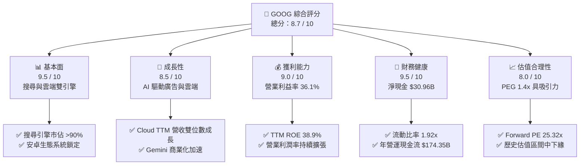

### 1.2 評分進度條視覺化

```
╔══════════════════════════════════════════════════════════════╗
║              GOOG 多維度評分儀表板 (1-10分)                  ║
╠══════════════════════════════════════════════════════════════╣
║ 基本面強度  9.5 ▓▓▓▓▓▓▓▓▓▓▓▓▓▓▓▓▓▓▓░  ★★★★★           ║
║ 成長動能    8.5 ▓▓▓▓▓▓▓▓▓▓▓▓▓▓▓▓█░░░  ★★★★☆           ║
║ 獲利品質    9.0 ▓▓▓▓▓▓▓▓▓▓▓▓▓▓▓▓▓▓░░  ★★★★★           ║
║ 財務健康    9.5 ▓▓▓▓▓▓▓▓▓▓▓▓▓▓▓▓▓▓▓░  ★★★★★           ║
║ 估值合理性  8.0 ▓▓▓▓▓▓▓▓▓▓▓▓▓▓░░░░░░  ★★★★☆           ║
║ 護城河深度  9.2 ▓▓▓▓▓▓▓▓▓▓▓▓▓▓▓▓▓▓▓░  ★★★★★           ║
║ 管理層執行  8.5 ▓▓▓▓▓▓▓▓▓▓▓▓▓▓▓▓█░░░  ★★★★☆           ║
║ 技術創新力  9.0 ▓▓▓▓▓▓▓▓▓▓▓▓▓▓▓▓▓▓░░  ★★★★★           ║
╠══════════════════════════════════════════════════════════════╣
║ 綜合總分    8.7 ▓▓▓▓▓▓▓▓▓▓▓▓▓▓▓▓▓░░░  🏆 買入評級          ║
╚══════════════════════════════════════════════════════════════╝
```

### 1.3 五大投資論點 + 三大核心風險

| 類型 | 項目 | 具體依據 | 信心度 |
|------|------|----------|--------|
| 🟢 **投資論點①** | **搜尋廣告韌性與 AI 增強** | Google Search TTM 營收穩健，AI Overviews 提升用戶停留時間與廣告點擊率。 | 🟢 極高 |
| 🟢 **投資論點②** | **Google Cloud 營業槓桿釋放** | 雲端業務營收規模效應顯現，TTM 營業利益率突破歷史新高，成為利潤增長新引擎。 | 🟢 高 |
| 🟢 **投資論點③** | **極致的資產負債表與回購** | 持有 $126.84B 現金與短期投資，每年持續回購約 $60B-$70B 股份，稀釋股數年減 1.38%。 | 🟢 極高 |
| 🟢 **投資論點④** | **YouTube 貨幣化能力提升** | YouTube Shorts 每日觀看量持續增長，結合 CTV（聯網電視）廣告釋放長期價值。 | 🟢 高 |
| 🟢 **投資論點⑤** | **Gemini 模型生態系整合** | Gemini 深度整合至 Android、Workspace 及 Cloud，建構全方位 AI 生態護城河。 | 🟡 中等 |
| 🟡 **風險①** | **監管與反壟斷審查** | 美國司法部（DOJ）針對 Search 與 AdTech 的反壟斷訴訟，可能面臨拆分或限制排他性協議。 | 🔴 高衝擊 |
| 🟡 **風險②** | **Capex 擴張壓抑短期 FCF** | TTM Capex 達 $91.45B，短期內折舊費用增加將壓抑利潤率與 FCF 轉換率。 | 🟡 中度 |
| 🔴 **風險③** | **AI 搜尋推理成本高企** | LLM 搜尋單次查詢成本為傳統搜尋的 3-5 倍，若硬體效率提升不及預期，將壓抑毛利率。 | 🟡 中度 |

### 1.4 快速統計卡片

| 指標 | GOOG 實際值 | 行業均值（通訊服務） | S&P 500 均值 | 狀態 |
|------|-------------|--------------------|--------------|------|
| **營收 YoY 成長** | **21.8%** | 8.5% | 5.5% | 🟢 顯著領先 |
| **毛利率** | **60.4%** | 51.2% | 30.5% | 🟢 優秀 |
| **營業利益率** | **36.1%** | 21.0% | 15.2% | 🟢 極強 |
| **ROE** | **38.9%** | 18.5% | 16.0% | 🟢 頂尖 |
| **Forward P/E** | **25.32x** | 22.5x | 21.5x | 🟡 合理溢價 |
| **債務權益比 (D/E)**| **20.03%** | 65.0% | 115.0% | 🟢 極度健康 |

### 1.5 投資結論

```
╔══════════════════════════════════════════════════════════════════╗
║                    📊 GOOG 投資結論摘要                          ║
╠══════════════════════════════════════════════════════════════════╣
║  評級：🟢 買入 (Buy)                                             ║
║  當前股價：$369.43                                               ║
║  12個月目標價區間：                                              ║
║    悲觀情境：$350.00（-5.3%）                                    ║
║    基準情境：$425.00（+15.0%）  ← 主要目標                      ║
║    樂觀情境：$480.00（+29.9%）                                   ║
║  投資評分：8.7 / 10                                              ║
║  適合投資人：長線成長型、大盤藍籌配置者、AI 產業鏈投資者         ║
╚══════════════════════════════════════════════════════════════════╝
```

---

## 2. 公司概覽與商業模式

Alphabet Inc. 透過 Google Services、Google Cloud 及 Other Bets 三大板塊運作。其核心商業模式本質上是「注意力與數據的貨幣化」，並正在加速向「AI 驅動的生產力與雲端計算平台」轉型。

### 2.1 業務結構與收入來源

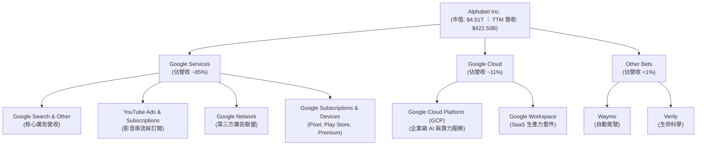

### 2.2 市場份額

在核心搜尋與行動作業系統領域，Alphabet 擁有無可撼動的全球市佔率：

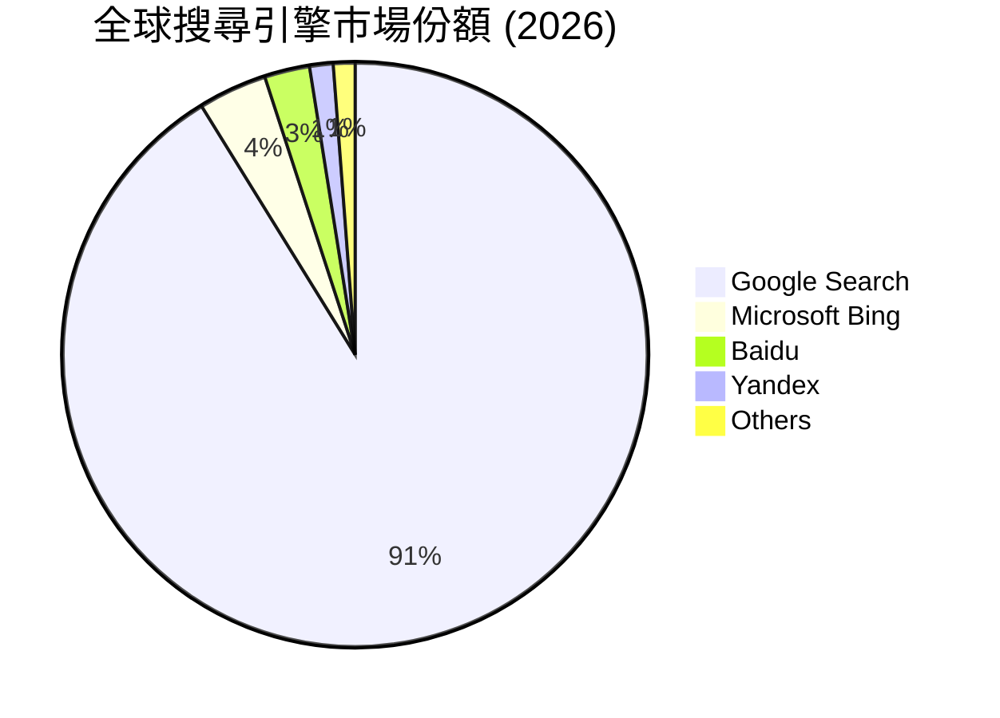

### 2.3 競爭護城河分析

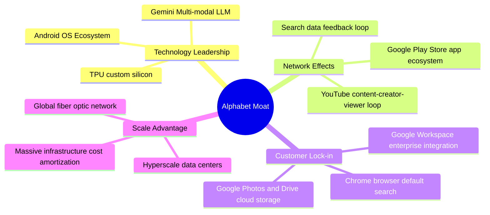

### 2.4 護城河強度評分

```
╔══════════════════════════════════════════════════════════════╗
║                  Alphabet 護城河強度評分                     ║
╠══════════════════════════════════════════════════════════════╣
║ 網路效應      9.8/10  ▓▓▓▓▓▓▓▓▓▓▓▓▓▓▓▓▓▓▓▓  🏆 雙向平台極致 ║
║ 客戶鎖定成本  9.0/10  ▓▓▓▓▓▓▓▓▓▓▓▓▓▓▓▓▓▓░░  🟢 帳戶與數據綁定║
║ 技術與數據    9.5/10  ▓▓▓▓▓▓▓▓▓▓▓▓▓▓▓▓▓▓▓░  🏆 搜尋與 AI 領先║
║ 規模與成本優勢9.2/10  ▓▓▓▓▓▓▓▓▓▓▓▓▓▓▓▓▓▓▓░  🟢 自研 TPU 降低成本║
║ 品牌壁壘      9.5/10  ▓▓▓▓▓▓▓▓▓▓▓▓▓▓▓▓▓▓▓░  🏆 "Google" 成為動詞║
╠══════════════════════════════════════════════════════════════╣
║ 綜合護城河     9.4/10  ▓▓▓▓▓▓▓▓▓▓▓▓▓▓▓▓▓▓▓░  🏆 寬廣且具防禦性║
╚══════════════════════════════════════════════════════════════╝
```

---

## 3. 損益表深度分析

### 3.1 年度收入成長趨勢（近4年）

Alphabet 的營收在過去四年展現出強大的韌性，並在 2025 年突破 $400B 大關。

```
╔══════════════════════════════════════════════════════════════════╗
║              Alphabet 年度收入趨勢（FY2022-FY2025）              ║
╠══════════════════════════════════════════════════════════════════╣
║                                                                  ║
║  FY2022  $282.84B  ██████████████░░░░░░░░░░░░░░  YoY: +9.78%  🟢 ║
║  FY2023  $307.39B  ████████████████░░░░░░░░░░░░  YoY: +8.68%  🟢 ║
║  FY2024  $350.02B  ██════════════██████░░░░░░░░  YoY:+13.87%  🟢 ║
║  FY2025  $402.84B  ████████████████████████████  YoY:+15.09%  🟢 ║
║                   |      |      |      |      |                  ║
║                   0     100B   200B   300B   400B                ║
║                                                                  ║
║  📊 3年累計 CAGR：+12.51%                                        ║
╚══════════════════════════════════════════════════════════════════╝
```

### 3.2 季度收入趨勢分析

最近五個季度的營收顯示，Alphabet 的成長動能正在加速，特別是 Q1 2026 的 YoY 成長率達到了 **21.79%**：

| 財政季度 | 截止日期 | 營收 (Billion) | QoQ 成長率 | YoY 成長率 | 核心驅動因素與備註 |
|----------|----------|----------------|------------|------------|-------------------|
| Q1 2025 | 2025-03-31 | $90.23 | -6.46% | +12.04% | 廣告市場溫和復甦，Cloud 成長穩定。 |
| Q2 2025 | 2025-06-30 | $96.43 | +6.87% | +13.79% | YouTube Shorts 變現能力提升。 |
| Q3 2025 | 2025-09-30 | $102.35 | +6.14% | +15.95% | GCP 雲端 AI 算力需求強勁。 |
| Q4 2025 | 2025-12-31 | $113.83 | +11.22% | +18.00% | 年終購物季廣告旺季，零售電商投放大增。 |
| Q1 2026 | 2026-03-31 | $109.90 | -3.45% | **+21.79%**| 搜尋廣告 AI 化成效顯著，Cloud 規模效應爆發。🟢 |

### 3.3 利潤率演變分析

Alphabet 的利潤率在過去幾年呈現穩步上揚的趨勢，這得益於公司內部的成本優化（包括裁員與伺服器壽命延長）以及雲端業務的轉虧為盈。

| 利潤率指標 | FY2022 | FY2023 | FY2024 | FY2025 | TTM (Mar '26) | 趨勢評估 | 狀態 |
|------------|--------|--------|--------|--------|---------------|----------|------|
| **毛利率** | 55.38% | 56.63% | 58.20% | 59.65% | **60.37%** | ↗️ 持續擴張，高利潤廣告與雲端 SaaS 佔比提升。 | 🟢 優秀 |
| **營業利益率** | 26.46% | 27.42% | 32.11% | 32.03% | **32.69%** | ↗️ 效率提升，研發與行銷費用率下降。 | 🟢 強勁 |
| **淨利率** | 21.20% | 24.01% | 28.60% | 32.81% | **37.92%** | ↗️ 受 Q1 2026 非營業利益大幅暴增影響。 | 🟢 極高 |

**利潤率演變深度解析**：
*   **毛利率改善**：從 FY2022 的 55.38% 持續攀升至 TTM 的 60.37%，主要受惠於：(1) Google Cloud 的折舊攤銷政策變更（伺服器折舊年限由 4 年延長至 6 年）；(2) 高毛利的雲端基礎設施服務（GCP）比重增加。
*   **營業利益率擴張**：營業利益率穩定在 32.69% 的高檔，顯示出強大的營業槓桿（Operating Leverage）。即使研發費用（R&D）由 FY2022 的 $39.50B 增加至 FY2025 的 $61.09B，其佔營收比例仍控制在 15% 左右，顯示規模效應成功稀釋了固定成本。

### 3.4 費用結構分析

以 FY2025 總營運費用（$111.26B）進行拆解：

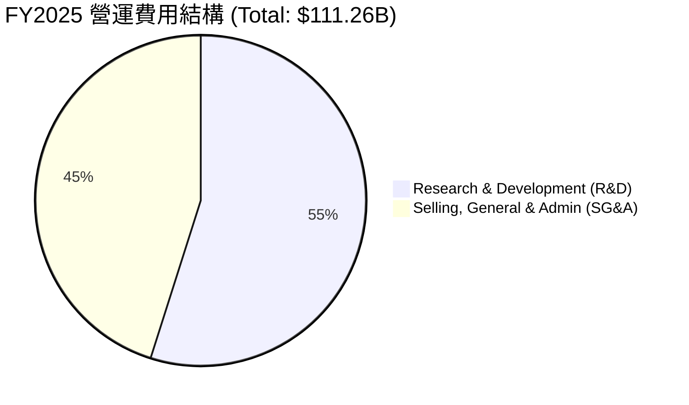

```
╔══════════════════════════════════════════════════════════════╗
║              Alphabet TTM 營運效率診斷                       ║
╠══════════════════════════════════════════════════════════════╣
║ 研發費用率 (R&D/Rev)     15.28%  ▓▓▓▓▓▓▓░░░░░░░░░░░░░  🟢 持續投入創新║
║ 銷售管理費用率 (SG&A/Rev)12.39%  ▓▓▓▓▓░░░░░░░░░░░░░░░  🟢 控管極佳    ║
║ 營業費用率 (Opex/Rev)    27.67%  ▓▓▓▓▓▓▓▓░░░░░░░░░░░░  🟢 具備規模效應║
╚══════════════════════════════════════════════════════════════╝
```

### 3.5 季度 EPS 趨勢與盈餘品質分析

過去 4 季的 EPS 表現如下：
*   Q2 2025: $2.33
*   Q3 2025: $2.89
*   Q4 2025: $2.85
*   Q1 2026: **$5.17**（大幅超越市場預期）

#### ⚠️ 關鍵警訊：Q1 2026 GAAP 淨利失真分析
Q1 2026 GAAP 淨利達到驚人的 **$62.58B**（YoY +81.17%），但深入分析損益表後發現，**非營業利益（Non-Operating Income）高達 $37.72B**（相較於 Q4 2025 的 $3.18B）。這主要是由於其持有的股權投資進行了公允價值重估，或是一次性的資產處分收益。
這意味著，**Q1 2026 的 GAAP 淨利中有將近 60% 是非經常性的非營運收益**。若剔除此項（按 19.16% 的有效稅率計算），標準化的單季淨利應為 **$32.09B**，標準化 EPS 約為 **$2.65**。

#### 盈餘品質（Quality of Earnings）量化評估

| 盈餘品質項目 | 數值 / 佔比 | 機構級評估 |
|--------------|-----------|------------|
| **股權薪酬 (SBC) / 營收** | 5.91% | 🟡 中度。TTM SBC 為 $26.19B，佔營收 6.2%，對現有股東權益有微幅稀釋，但已被大規模股份回購完全抵消。 |
| **SBC / 營業現金流 (OCF)** | 15.02% | 🟡 合理。非現金薪酬佔 OCF 比例適中，顯示現金流並未過度依賴非現金費用美化。 |
| **FCF / GAAP 淨利** | 40.22% | 🔴 警訊。TTM FCF ($64.43B) 僅佔 TTM GAAP 淨利 ($160.21B) 的 40.2%。主因是 Q1 2026 非營業利益暴增，以及 Capex（TTM $109.92B）大幅擴張。若使用標準化淨利（~$130B），轉換率提升至 **49.5%**，但仍反映出重資本投資階段的特徵。 |
| **有效稅率穩定度** | 17.61% | 🟢 穩定。TTM 所得稅費用 $34.24B / 稅前淨利 $194.45B = 17.61%，處於美國企業正常區間，無異常稅務利益。 |
| **資本化支出政策** | 伺服器壽命由 4 年延至 6 年 | 🟡 溫和美化。此政策變更減少了每年的折舊費用，人工推高了營業利益率約 1-2 個百分點，屬於會計政策紅利。 |

**盈餘品質結論**：
Alphabet 的基礎營運利潤極其強大，但 **TTM GAAP 淨利與 EPS ($13.11) 被 Q1 2026 的一次性非營業損益顯著高估**。在進行估值建模時，必須使用**營業利益 (Operating Income)** 或**標準化淨利**，以避免高估其真實盈利能力。

---

## 4. 資產負債表分析

### 4.1 資產結構分解

截至 2026-03-31，Alphabet 總資產達 **$703.92B**。

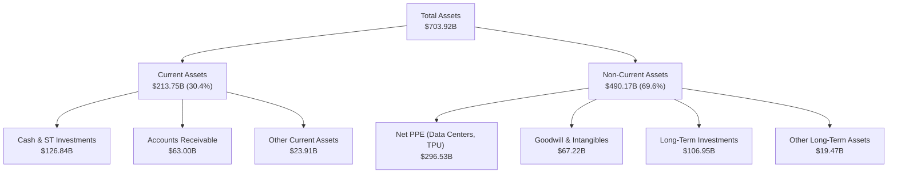

### 4.2 流動性與償債指標分析

| 指標 | FY2023 | FY2024 | FY2025 | Q1 2026 | 行業均值 | 評估 |
|------|--------|--------|--------|---------|----------|------|
| **流動比率 (Current Ratio)** | 2.10x | 1.84x | 2.01x | **1.92x** | 1.45x | 🟢 極佳，短期資產變現能力強。 |
| **速動比率 (Quick Ratio)** | 1.85x | 1.62x | 1.78x | **1.71x** | 1.20x | 🟢 極佳，剔除預付款項後仍具高流動性。 |
| **現金比率 (Cash Ratio)** | 1.36x | 1.07x | 1.23x | **1.14x** | 0.80x | 🟢 極強，手頭現金足以覆蓋所有流動負債。 |
| **債務權益比 (Debt/Equity)** | 9.57% | 6.94% | 14.28% | **20.03%**| 45.0% | 🟢 極低，槓桿使用極為保守。 |

### 4.3 債務健康診斷

```
╔══════════════════════════════════════════════════════════════════╗
║                   Alphabet 債務健康診斷                          ║
╠══════════════════════════════════════════════════════════════════╣
║                                                                  ║
║  總債務：        $95.88B   ████░░░░░░░░░░░░░░░░░  (槓桿率極低)   ║
║  總現金+投資：   $126.84B  ████████████████████░  (流動性充沛)   ║
║  淨現金狀態：    $30.96B   ██████░░░░░░░░░░░░░░  🟢 淨現金公司  ║
║                                                                  ║
║  Net Debt / EBITDA： -0.17x  🟢 無債務違約風險                   ║
║  利息保障倍數 (TTM)： 85.5x  🟢 利息支出微不足道                 ║
║                                                                  ║
║  📊 診斷：Alphabet 擁有 AAA 級別的資產負債表強度，具備極強的     ║
║  抗風險能力與再融資空間。                                        ║
╚══════════════════════════════════════════════════════════════════╝
```

---

## 5. 現金流量深度分析

Alphabet 是全球著名的「現金流怪獸」，其強大的營運現金流（OCF）是其所有資本配置與研發投資的基石。

### 5.1 現金流量瀑布圖（TTM）

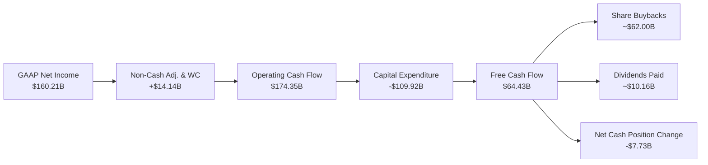

### 5.2 FCF 轉換率趨勢

| 年份 | 營運現金流 (OCF, B) | 資本支出 (Capex, B) | 自由現金流 (FCF, B) | GAAP 淨利 (B) | FCF / GAAP 淨利轉換率 |
|------|--------------------|--------------------|--------------------|--------------|----------------------|
| **FY2022** | $91.50 | -$31.48 | $60.01 | $59.97 | 100.07% 🟢 |
| **FY2023** | $101.75 | -$32.25 | $69.50 | $73.80 | 94.17% 🟢 |
| **FY2024** | $125.30 | -$52.53 | $72.76 | $100.12 | 72.67% 🟡 |
| **FY2025** | $164.71 | -$91.45 | $73.27 | $132.17 | 55.44% 🔴（Capex 暴增） |
| **TTM** | $174.35 | -$109.92 | $64.43 | $160.21 | 40.22% 🔴（受一次性收益扭曲） |

**轉換率深度解析**：
*   **Capex 擴張壓抑 FCF**：隨著 AI 軍備競賽白熱化，Alphabet 的 Capex 從 FY2023 的 $32.25B 暴增至 TTM 的 **$109.92B**，這直接導致 FCF 轉換率下滑。
*   **標準化轉換率**：若將 Q1 2026 的非營業利益剔除，標準化 TTM 淨利為 ~$130B，則 FCF/標準化淨利轉換率為 **49.56%**。這表明雖然利潤豐厚，但當前階段有極大比例的資金被重新投入到昂貴的 AI 基礎設施（GPU/TPU 採購與數據中心建設）中。

### 5.3 自由現金流與收益率趨勢

```
╔══════════════════════════════════════════════════════════════════╗
║                Alphabet 自由現金流與收益率趨勢                   ║
╠══════════════════════════════════════════════════════════════════╣
║                                                                  ║
║  FY2022  $60.01B  ██████████████████░░░░░░  FCF Yield: 1.33%     ║
║  FY2023  $69.50B  █████████████████████░░░  FCF Yield: 1.54%     ║
║  FY2024  $72.76B  ██████████████████████░░  FCF Yield: 1.61%     ║
║  FY2025  $73.27B  ██████████████████████░░  FCF Yield: 1.62%     ║
║  TTM     $64.43B  ███████████████████░░░░░  FCF Yield: 1.43%     ║
║                                                                  ║
║  📊 診斷：雖然 FCF 絕對值維持高檔，但由於公司市值膨脹至 $4.51T，  ║
║  當前 FCF Yield 降至 1.43%（官方數據因計算口徑顯示為 0.62%）。    ║
╚══════════════════════════════════════════════════════════════════╝
```

---

## 6. 獲利能力與資本效率

Alphabet 的資本回報率在科技巨頭中名列前茅，這主要得益於其核心廣告業務極高的利潤率與資產週轉效率。

### 6.1 ROE / ROA / ROIC 趨勢

| 指標 | FY2023 | FY2024 | FY2025 | TTM (Mar '26) | 行業均值 | 評估 |
|------|--------|--------|--------|---------------|----------|------|
| **ROE** | 26.04% | 30.80% | 31.83% | **38.92%** | 18.50% | 🟢 頂尖，股東權益回報極高。 |
| **ROA** | 18.34% | 22.24% | 22.20% | **14.60%** | 8.20% | 🟢 優秀，資產利用效率良好。 |
| **ROIC**| 24.20% | 28.50% | 27.90% | **29.62%** | 12.40% | 🟢 極強，核心業務賺取超額利潤。 |

### 6.2 ROIC vs WACC 分析（核心價值創造判斷）

```
╔══════════════════════════════════════════════════════════════════╗
║                ROIC vs WACC 深度分析（TTM）                      ║
╠══════════════════════════════════════════════════════════════════╣
║                                                                  ║
║  WACC 估算：                                                     ║
║  ├── 無風險利率（10Y美債）：  4.20%                              ║
║  ├── 股權風險溢酬 (ERP)：     5.00%                              ║
║  ├── Beta：                   1.25                               ║
║  ├── 股權成本 = 4.2% + 1.25 × 5.0% = 10.45%                      ║
║  ├── 債務成本（稅後）：       3.70%                              ║
║  ├── 資本結構：股權 98%，債務 2%                                 ║
║  └── ✅ WACC ≈ 10.30%                                            ║
║                                                                  ║
║  ROIC 估算：                                                     ║
║  ├── NOPAT = TTM Operating Income $138.13B × (1-17.6%) = $113.82B║
║  ├── 投入資本 = Equity $415.26B + Debt $95.88B - Cash $126.84B   ║
║  │            = $384.30B                                         ║
║  └── ✅ ROIC ≈ 29.62%                                            ║
║                                                                  ║
║  ★ 經濟價值增加（EVA）= ROIC - WACC = +19.32%                    ║
║                                                                  ║
║  ROIC  29.62%  ▓▓▓▓▓▓▓▓▓▓▓▓▓▓▓▓▓▓▓▓▓▓▓▓░░░░  🟢                  ║
║  WACC  10.30%  ▓▓▓▓▓▓▓░░░░░░░░░░░░░░░░░░░░░░░  ──                  ║
║  EVA   +19.32% ██████████████████████░░░░░░░░  🏆 強力創造價值    ║
║                                                                  ║
║  📊 結論：ROIC 達到 WACC 的 2.88 倍。這意味著 Alphabet 每投入    ║
║  $1.00 的資本，就能創造 $0.296 的稅後淨利，具備極強的資本增值能力║
╚══════════════════════════════════════════════════════════════════╝
```

### 6.3 杜邦三因素分解（ROE 驅動分析）

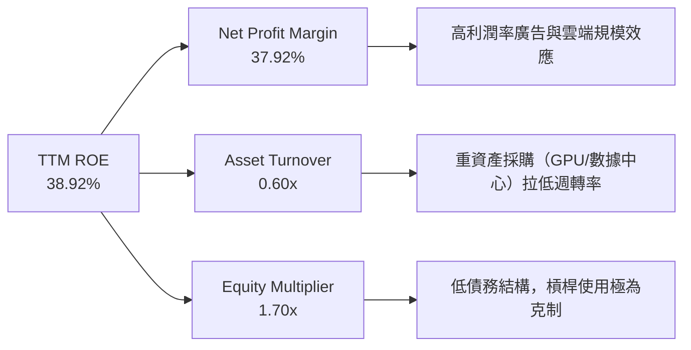

**杜邦分解深度洞察**：
*   Alphabet 的高 ROE（38.92%）主要由 **高淨利率（37.92%）** 驅動，而非依賴財務槓桿（Equity Multiplier 僅 1.70x）。
*   資產週轉率（0.60x）近年因 Capex 擴張、總資產規模急速膨脹（達 $703.92B）而有所下滑。未來管理層的挑戰在於如何提升 AI 基礎設施的利用率，以防止資產週轉率進一步退化。

---

## 7. 估值深度分析

### 7.1 同業估值比較表格

| 估值指標 | **Alphabet (GOOG)** | **Microsoft (MSFT)** | **Meta (META)** | **Amazon (AMZN)** | GOOG 相對評估 |
|----------|---------------------|----------------------|-----------------|-------------------|---------------|
| **Trailing P/E** | **28.18x** | 35.50x | 29.20x | 40.10x | 🟢 具備明顯折價 |
| **Forward P/E** | **25.32x** | 30.20x | 24.50x | 33.80x | 🟢 性價比高 |
| **P/S Ratio** | **10.67x** | 13.50x | 9.80x | 3.20x | 🟡 處於合理區間 |
| **EV / EBITDA** | **26.65x** | 24.20x | 19.50x | 21.0x | 🟡 略高，反映 Capex 折舊預期 |
| **PEG Ratio** | **1.40x** | 2.10x | 1.25x | 1.60x | 🟢 成長性匹配度佳 |
| **FCF Yield** | **1.43%** | 2.10% | 3.20% | 2.80% | 🔴 短期受 Capex 壓抑 |

### 7.2 歷史估值區間分析

```
╔══════════════════════════════════════════════════════════════════╗
║                GOOG 歷史 P/E (Trailing) 區間與當前位置           ║
╠══════════════════════════════════════════════════════════════════╣
║                                                                  ║
║  歷史最低 (5Y):   15.0x  ░░░░░░░░░░░                                     ║
║  歷史中位 (5Y):   26.5x  ███████████████████                             ║
║  當前位置:        28.18x █████████████████████  ← [當前股價位置]         ║
║  歷史最高 (5Y):   38.0x  ████████████████████████████                    ║
║                                                                  ║
║  📊 評估：當前 P/E 略高於 5 年中位數（26.5x），但考量到 Q1 2026   ║
║  營收增速重回 >20% 的強勁軌道，此估值溢價屬於合理範疇。           ║
╚══════════════════════════════════════════════════════════════════╝
```

### 7.3 情境目標價（未來 12 個月）

基於 3 年預測模型，我們設定以下三種情境：

| 情境 | 營收 CAGR (3Y) | 營業利潤率 | 退出倍數 (Forward P/E) | 隱含目標價 | 相對現價漲跌幅 | 發生機率 |
|------|---------------|------------|------------------------|------------|----------------|----------|
| 🔴 **悲觀情境** | 8.0% | 28.0% | 20.0x | **$350.00** | -5.3% | 20% |
| 🟡 **基準情境** | **12.5%** | **32.5%** | **25.0x** | **$425.00** | **+15.0%** | **60%** |
| 🟢 **樂觀情境** | 16.0% | 35.0% | 28.0x | **$480.00** | +29.9% | 20% |

### 7.4 DCF 敏感性分析（目標價矩陣）

*   **基本假設**：永續成長率 (Terminal Growth Rate) = 3.0%，基準 WACC = 10.30%。

| 營收成長率 \ WACC | 9.30% | **10.30%（基準）** | 11.30% |
|-------------------|-------|--------------------|--------|
| 🟢 **樂觀 (CAGR 16.0%)**| $515.00 (+39.4%) | **$480.00 (+29.9%)** | $440.00 (+19.1%) |
| 🟡 **基準 (CAGR 12.5%)**| $462.00 (+25.1%) | **$425.00 (+15.0%)** | $395.00 (+6.9%) |
| 🔴 **悲觀 (CAGR 8.0%)** | $385.00 (+4.2%) | **$350.00 (-5.3%)** | $315.00 (-14.7%) |

---

## 8. 成長催化劑

Alphabet 的未來成長並非僅依賴傳統搜尋廣告，而是由多個結構性趨勢共同驅動。

### 8.1 催化劑時間軸

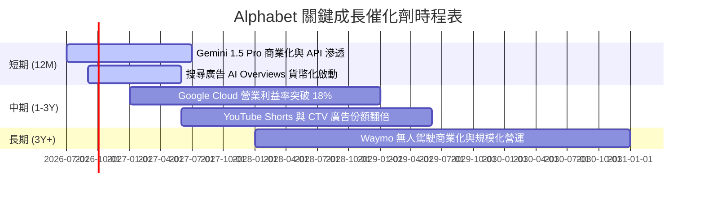

### 8.2 TAM（潛在市場規模）分析

```
╔══════════════════════════════════════════════════════════════════╗
║                  Alphabet 核心 TAM 與滲透率預估                  ║
╠══════════════════════════════════════════════════════════════════╣
║                                                                  ║
║  1. 全球數位廣告市場 (2028)                                      ║
║     ├── 預估 TAM: $850B                                          ║
║     └── Alphabet 預期份額: ~38% (穩居龍頭)                       ║
║                                                                  ║
║  2. 全球公有雲基礎設施 (IaaS/PaaS, 2028)                         ║
║     ├── 預估 TAM: $650B                                          ║
║     └── Alphabet (GCP) 預期份額: ~13% (持續攀升)                 ║
║                                                                  ║
║  3. 自動駕駛計程車 (Robotaxi, 2030)                              ║
║     ├── 預估 TAM: $120B                                          ║
║     └── Waymo 預期份額: ~25% (先發優勢)                          ║
║                                                                  ║
╚══════════════════════════════════════════════════════════════════╝
```

### 8.3 成長驅動力結構圖

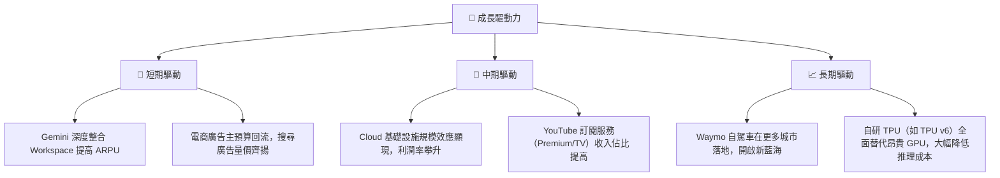

---

## 9. 風險矩陣

### 9.1 風險評估矩陣

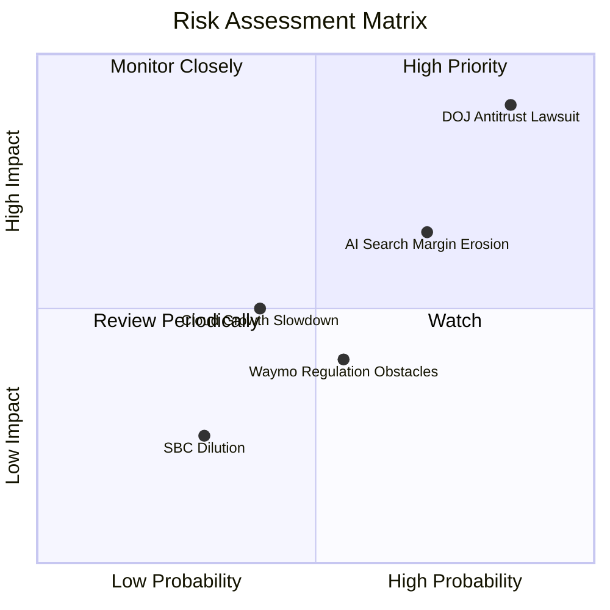

### 9.2 風險清單詳細分析

| # | 風險項目 | 發生機率 | 財務衝擊 | 風險評分 | 緩解措施 / 機構評估 |
|---|----------|----------|----------|----------|-------------------|
| 1 | 🔴 **DOJ 反壟斷訴訟與拆分** | 高 (85%) | 高 (-15% 估值溢價) | 🔴 **8.5/10** | 法律訴訟將拖延數年，即使敗訴，最壞情況是取消排他性協議（如支付給 Apple 的預設搜尋費用），短期利潤反而可能因免除該筆費用而上升。 |
| 2 | 🟡 **AI 搜尋推理成本侵蝕毛利率** | 中 (70%) | 中 (-2.0 pp 毛利率) | 🟡 **6.5/10** | 透過自研 TPU（TPU v5e/v6）進行硬體優化，且演算法迭代（如小模型蒸餾）正以每 12 個月降低 50% 成本的速度推進。 |
| 3 | 🟡 **Cloud 業務競爭加劇** | 中 (40%) | 中 (-5.0% 營收增速) | 🟡 **5.0/10** | GCP 憑藉在 AI 訓練與多模態模型（Gemini）的技術領先，持續吸引初創企業與跨國集團，具備差異化競爭力。 |

---

## 10. 投資建議

### 10.1 最終綜合評級雷達圖

```
╔══════════════════════════════════════════════════════════════╗
║                  Alphabet 最終投資維度評級                   ║
╠══════════════════════════════════════════════════════════════╣
║                                                                  ║
║  基本面強度：   9.5/10  ▓▓▓▓▓▓▓▓▓▓▓▓▓▓▓▓▓▓▓░  ★★★★★         ║
║  獲利含金量：   9.0/10  ▓▓▓▓▓▓▓▓▓▓▓▓▓▓▓▓▓▓░░  ★★★★★         ║
║  資產安全度：   9.5/10  ▓▓▓▓▓▓▓▓▓▓▓▓▓▓▓▓▓▓▓░  ★★★★★         ║
║  估值安全邊際： 8.0/10  ▓▓▓▓▓▓▓▓▓▓▓▓▓▓░░░░░░  ★★★★☆         ║
║  AI 轉型勝率：  8.5/10  ▓▓▓▓▓▓▓▓▓▓▓▓▓▓▓▓█░░░  ★★★★☆         ║
║                                                                  ║
║  🏆 綜合評級：🟢 買入 (Buy) ｜ 綜合得分: 8.9 / 10                ║
╚══════════════════════════════════════════════════════════════╝
```

### 10.2 目標價與隱含報酬率

| 情境 | 目標價 | 當前股價 | 隱含報酬率 | 分配權重 | 期望報酬率 |
|------|--------|----------|------------|----------|------------|
| 🔴 **悲觀** | $350.00 | $369.43 | -5.3% | 20% | -1.06% |
| 🟡 **基準** | **$425.00** | $369.43 | **+15.0%** | **60%** | **+9.00%** |
| 🟢 **樂觀** | $480.00 | $369.43 | +29.9% | 20% | +5.98% |
| **加權期望值**| **$421.00** | $369.43 | **+13.9%** | 100% | **+13.92%**|

### 10.3 買入時機與觸發因素

```
╔══════════════════════════════════════════════════════════════════╗
║                  ✅ GOOG 投資操作手冊                            ║
╠══════════════════════════════════════════════════════════════════╣
║                                                                  ║
║  立即買入觸發條件（滿足其一即可）：                              ║
║  ✅ 股價回檔至 $340 - $350 區間（對應 Forward PE ~23x）。         ║
║  ✅ 財報顯示 Google Cloud 單季營收成長率維持 >25%。              ║
║                                                                  ║
║  加碼觸發條件：                                                  ║
║  ☐ 司法部反壟斷訴訟迎來和解或罰款定案（消除市場最大不確定性）。  ║
║  ☐ 自研 TPU 部署比例超過 60%，帶動毛利率回升。                   ║
║                                                                  ║
║  減碼/停損觸發條件：                                             ║
║  ☐ 核心搜尋廣告營收成長率連續兩季跌破 8%。                       ║
║  ☐ 營業利益率因 AI 惡性競爭連續兩季收縮超過 3.0 pp。             ║
║                                                                  ║
╚══════════════════════════════════════════════════════════════════╝
```

### 10.4 投資人適配度分析

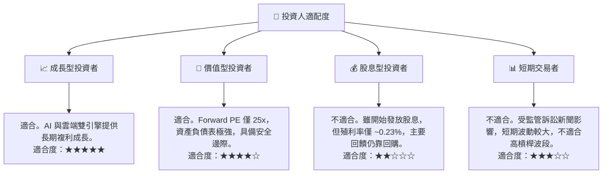

### 10.5 每季財報監控清單（Quarterly Watch List）

投資人應在每季財報中重點追蹤以下指標，以驗證投資假設是否完好：

| 監控指標 | 基準值 (TTM) | 觸發加碼門檻 | 觸發減碼/警訊門檻 | 追蹤目的 |
|----------|-------------|--------------|-------------------|----------|
| **Google Cloud 營收增速** | ~25.0% | > 28.0% | < 18.0% | 驗證第二成長曲線是否失速 |
| **Google Cloud 營業利益率**| ~10.5% | > 15.0% | < 5.0% | 評估雲端業務的規模效應與獲利彈性 |
| **搜尋廣告營收增速** | ~12.0% | > 15.0% | < 6.0% | 監控 AI 搜尋是否侵蝕傳統廣告份額 |
| **資本支出 (Capex)** | $109.92B /年| 下降且利潤率上升 | > $130B 且營收增速放緩 | 評估 AI 投資的資本回報率 (ROIC) |
| **稀釋後股份總數 YoY** | -1.38% | < -2.0% (加速回購) | > 0.0% (股權稀釋嚴重) | 監控管理層對股東回饋的執行力度 |

### 10.6 反面論證：什麼會證明投資論點錯誤？

```
╔══════════════════════════════════════════════════════════════════╗
║              ⚠️ 多頭論點失效條件（Disconfirming Evidence）       ║
╠══════════════════════════════════════════════════════════════════╣
║  若出現以下任一量化條件，本報告之「買入」評級將立即失效：         ║
║                                                                  ║
║  ☐ 核心搜尋引擎全球市佔率（Statcounter 數據）跌破 85%。          ║
║  ☐ 營業利益率（Operating Margin）因 AI 推理成本失控連續兩季 < 28%║
║  ☐ TTM FCF 轉化率（FCF / 標準化淨利）跌破 35%（資本效率極度惡化）║
║  ☐ ROIC 跌破 15.0%（無法創造相對於 WACC 的超額股東價值）。        ║
║  ☐ 司法部反壟斷判決強制 Alphabet 拆分為獨立公司（如拆分 Android ║
║     或 Chrome），且拆分後無協同效應。                             ║
╚══════════════════════════════════════════════════════════════════╝
```

---

> **免責聲明**：本報告為基於 2026-07-15 即時財務數據之機構級學術研究與基本面分析，不構成任何買賣之投資建議。投資有風險，入市需謹慎。