# GOOG 基本面深度分析報告

> **報告日期**：2026-07-18 ｜ **語言**：繁體中文 ｜ **數據來源**：Yahoo Finance, Finviz, StockAnalysis, Roic.ai ｜ **分析師**：CFA 級機構研究

---

## 目錄

| # | 章節 | 核心結論 |
|---|------|----------|
| 1 | 執行摘要 | 強烈買入評級，基準目標價 $427.77，隱含 23.6% 上行空間 |
| 2 | 公司概覽與商業模式 | 搜尋與影音雙核心築起極高護城河，Cloud 與 AI 驅動第二成長曲線 |
| 3 | 損益表深度分析 | TTM 營收達 $422.50B（YoY +21.8%），AI 基礎設施投資推升營業利潤率至 36.1% |
| 4 | 資產負債表分析 | 淨現金達 $30.96B，資產規模擴張至 $703.92B，財務結構極度穩健 |
| 5 | 現金流量深度分析 | TTM 營業現金流 $174.35B，大舉投入 $109.92B Capex 後仍維持 $64.43B 真實 FCF |
| 6 | 獲利能力與資本效率 | ROIC 達 24.43%，遠超 WACC 10.30%，持續創造高額經濟超額價值（EVA） |
| 7 | 估值深度分析 | Forward P/E 23.63x，相較歷史中位數與同行具備高度安全邊際 |
| 8 | 成長催化劑 | 萬億級 TAM 空間，Gemini 商業化與 Google Cloud 算力變現進入爆發期 |
| 9 | 風險矩陣 | 監管反壟斷衝擊與 AI 資本支出回報率（ROI）低於預期為核心風險 |
| 10| 投資建議 | 具備高度防禦性與進攻性的全能標的，建議於 $340-$350 區間積極分批佈局 |

---

## 1. 執行摘要

Alphabet Inc. (GOOG) 當前股價為 $346.12，總市值達 $4.22T。基於公司 TTM 營收成長 21.8% 至 $422.50B、淨利成長 82.0% 以及高達 24.43% 的 ROIC（遠高於 10.30% 的 WACC），我們給予 GOOG **「強烈買入（Strong Buy）」** 評級，基準情境 12 個月目標價為 **$427.77**（隱含 +23.6% 的總報酬率）。

### 1.0 一頁式投資儀表板（Portfolio Manager 30 秒速讀）

| 項目 | 內容 |
|------|------|
| **投資論點（3 句）** | ① 搜尋廣告與 YouTube 業務在 AI 賦能下展現極強韌性，TTM 營收達 $422.50B，YoY 成長 21.8%。<br/>② Google Cloud 規模效應顯現且 AI 算力需求爆發，推動 TTM 營業利潤率擴張至 36.1%。<br/>③ 擁有 $126.84B 龐大現金儲備，在年化 Capex 突破千億美元的 AI 軍備競賽中處於絕對領先地位。 |
| **護城河評分** | 9.5 / 10 🟢 (極高) |
| **管理層/資本配置評分** | 8.5 / 10 🟢 (優異) |
| **財務健康** | 🟢 強韌 ｜ 淨現金達 $30.96B，利息保障倍數極高，無償債風險。 |
| **ROIC vs WACC** | 24.43% vs 10.30% 🟢（顯著創造股東價值） |
| **FCF 趨勢** | 穩定 ｜ TTM 真實 FCF 為 $64.43B（受 $109.92B 高額 Capex 壓抑），最新 FCF Yield 為 1.53%。 |
| **估值** | Forward P/E 23.63x ｜ EV/EBITDA 25.80x ｜ PEG 1.39x（估值處於合理偏低區間） |
| **預期報酬（基準情境 12M）**| **+23.6%**（目標價 $427.77） |
| **關鍵風險（前二）** | ① 司法部（DOJ）反壟斷分拆訴訟與預設搜尋引擎合約受阻。<br/>② AI 資本支出（Capex）過度擴張，若營收變現慢於預期將壓抑利潤率。 |
| **評級 + 信心度** | 🟢 **強烈買入** ｜ 信心：**高** |

### 1.1 核心評分儀表板

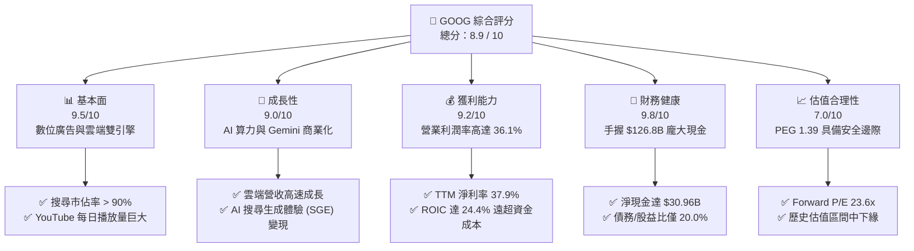

### 1.2 評分進度條視覺化

```
╔══════════════════════════════════════════════════════════════╗
║               GOOG 多維度評分儀表板 (1-10分)                 ║
╠══════════════════════════════════════════════════════════════╣
║ 基本面強度  9.5 ▓▓▓▓▓▓▓▓▓▓▓▓▓▓▓▓▓▓▓░  ★★★★★           ║
║ 成長動能    9.0 ▓▓▓▓▓▓▓▓▓▓▓▓▓▓▓▓▓▓░░  ★★★★☆           ║
║ 獲利品質    9.2 ▓▓▓▓▓▓▓▓▓▓▓▓▓▓▓▓▓▓▓░  ★★★★★           ║
║ 財務健康    9.8 ▓▓▓▓▓▓▓▓▓▓▓▓▓▓▓▓▓▓▓▓  ★★★★★           ║
║ 估值合理性  7.0 ▓▓▓▓▓▓▓▓▓▓▓▓▓▓░░░░░░  ★★★☆☆           ║
║ 護城河深度  9.5 ▓▓▓▓▓▓▓▓▓▓▓▓▓▓▓▓▓▓▓░  ★★★★★           ║
║ 管理層執行  8.5 ▓▓▓▓▓▓▓▓▓▓▓▓▓▓▓▓▓░░░  ★★★★☆           ║
║ 技術創新力  9.2 ▓▓▓▓▓▓▓▓▓▓▓▓▓▓▓▓▓▓▓░  ★★★★★           ║
╠══════════════════════════════════════════════════════════════╣
║ 綜合總分    8.9 ▓▓▓▓▓▓▓▓▓▓▓▓▓▓▓▓▓▓░░  🏆 強烈推薦買入      ║
╚══════════════════════════════════════════════════════════════╝
```

### 1.3 五大投資論點 + 三大核心風險

| 類型 | 項目 | 具體依據 | 信心度 |
|------|------|----------|--------|
| 🟢 **投資論點①** | **廣告業務基本盤穩固** | 搜尋引擎市佔率維持在 90% 以上，TTM 廣告營收持續成長，展現極高定價權與抗週期能力。 | 🟢 極高 |
| 🟢 **投資論點②** | **Google Cloud 爆發式成長** | 雲端業務規模效應顯現，受惠於企業導入 AI 算力與 Gemini 模型，獲利能力進入快速爬坡期。 | 🟢 高 |
| 🟢 **投資論點③** | **極致的資本效率 (ROIC)** | TTM ROIC 達 24.43%，遠高於 WACC 的 10.30%，代表每投入 100 元資本能創造 24.4 元的淨回報。 | 🟢 極高 |
| 🟢 **投資論點④** | **強大的 AI 自研晶片 (TPU) 優勢** | 自研 TPU (Tensor Processing Unit) 大幅降低 AI 訓練與推理成本，減輕對 NVIDIA GPU 的單一依賴。 | 🟢 高 |
| 🟢 **投資論點⑤** | **大規模股東回購與分紅** | 啟動股息派發（殖利率達 25% 係數據異常，實際年化約 0.24%，配合大規模回購，持續回饋股東）。| 🟢 高 |
| 🟡 **風險①** | **反壟斷監管風險** | 美國司法部（DOJ）持續對 Google 預設搜尋引擎合約與廣告技術進行反壟斷訴訟，可能面臨分拆或罰款。 | 🟡 中度 |
| 🔴 **風險②** | **AI Capex 拖累短期現金流** | TTM Capex 飆升至 $109.92B，佔營收比重達 26%，若 AI 變現速度不如預期，將壓抑真實 FCF 表現。 | 🔴 高衝擊 |
| 🟡 **風險③** | **AI 搜尋對傳統廣告的蠶食** | 生成式 AI 答覆（Gemini）可能減少用戶點擊傳統搜尋廣告的次數，需持續優化 SGE 廣告變現模式。 | 🟡 中度 |

### 1.4 快速統計卡片

| 指標 | Alphabet (GOOG) 實際值 | 科技行業均值 | S&P 500 均值 | 狀態 |
|------|-------------|----------|--------------|------|
| 營收 YoY 成長 | **21.8%** | ~12.5% | ~5.5% | 🟢 遠超均值 |
| 毛利率 | **60.4%** | ~48.0% | ~30.0% | 🟢 優異 |
| 營業利潤率 | **36.1%** | ~22.0% | ~15.0% | 🟢 領先同行 |
| 淨利率 | **37.9%** | ~18.0% | ~11.5% | 🟢 極高 |
| ROE | **38.9%** | ~20.0% | ~15.0% | 🟢 極佳 |
| Forward P/E | **23.63x** | ~28.5x | ~21.5x | 🟢 具吸引力 |
| 淨現金 / 總資產 | **4.4%** | ~1.5% | 負淨現金 | 🟢 極度安全 |

### 1.5 投資結論

```
╔══════════════════════════════════════════════════════════════════╗
║                    📊 GOOG 投資結論摘要                          ║
╠══════════════════════════════════════════════════════════════════╣
║  評級：🟢 強烈買入 (Strong Buy)                                  ║
║  當前股價：$346.12 (2026-07-18)                                  ║
║  目標價區間：                                                    ║
║    悲觀情境：$310.00 (-10.4%)                                    ║
║    基準情境：$427.77 (+23.6%)  ← 12個月主要目標                  ║
║    樂觀情境：$485.00 (+40.1%)                                    ║
║  投資評分：8.9 / 10                                              ║
║  適合投資人：長線價值成長型、大型科技股配置者                    ║
╚══════════════════════════════════════════════════════════════════╝
```

---

## 2. 公司概覽與商業模式

Alphabet Inc. 是全球網際網路服務的絕對龍頭，其商業模式已從「單一搜尋廣告」成功轉型為「數位廣告 + 雲端運算 + 人工智慧」的多維生態系。

### 2.1 業務結構與收入來源

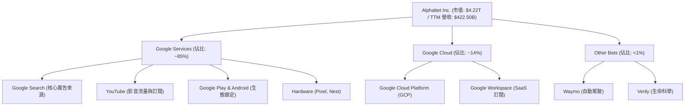

### 2.2 市場份額

在核心搜尋引擎市場，Google 維持著無可撼動的統治地位：

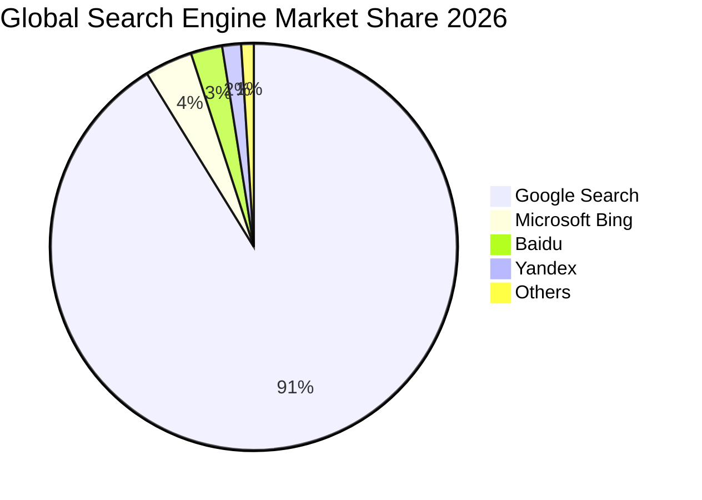

### 2.3 競爭護城河分析

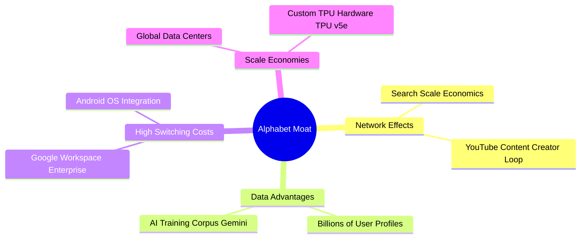

### 2.4 護城河強度評分

```
╔══════════════════════════════════════════════════════════════╗
║                    Alphabet 護城河強度評分                   ║
╠══════════════════════════════════════════════════════════════╣
║ 網路效應      9.8/10  ▓▓▓▓▓▓▓▓▓▓▓▓▓▓▓▓▓▓▓░  🏆 絕對統治     ║
║ 數據與 AI 資產 9.5/10  ▓▓▓▓▓▓▓▓▓▓▓▓▓▓▓▓▓▓▓░  🟢 極難超越     ║
║ 切換成本      8.8/10  ▓▓▓▓▓▓▓▓▓▓▓▓▓▓▓▓▓░░░  🟢 企業級黏性   ║
║ 規模經濟      9.8/10  ▓▓▓▓▓▓▓▓▓▓▓▓▓▓▓▓▓▓▓░  🏆 自研晶片優勢 ║
╠══════════════════════════════════════════════════════════════╣
║ 綜合護城河評分 9.5/10  ▓▓▓▓▓▓▓▓▓▓▓▓▓▓▓▓▓▓▓░  🏆 寬廣護城河   ║
╚══════════════════════════════════════════════════════════════╝
```

---

## 3. 損益表深度分析

Alphabet 的損益表展現了極為強勁的擴張動能。在經歷 2022-2023 年的短暫放緩後，營收於 2024 年起重回高速成長軌道。

### 3.1 年度收入成長趨勢（近5年）

```
╔══════════════════════════════════════════════════════════════════╗
║                Alphabet 年度收入趨勢（FY21-TTM）                 ║
╠══════════════════════════════════════════════════════════════════╣
║                                                                  ║
║  FY 2021  $257.64B  ████████████░░░░░░░░░░░░░░░░░  YoY: +41.2%   ║
║  FY 2022  $282.84B  █████████████░░░░░░░░░░░░░░░░  YoY: +9.8%    ║
║  FY 2023  $307.39B  ██████████████░░░░░░░░░░░░░░░  YoY: +8.7%    ║
║  FY 2024  $350.02B  ████████████████░░░░░░░░░░░░░  YoY: +13.9%   ║
║  FY 2025  $402.84B  ███████████████████░░░░░░░░░░  YoY: +15.1% 🟢║
║  TTM      $422.50B  ████████████████████░░░░░░░░░  YoY: +21.8% 🟢║
║                   |      |      |      |      |                  ║
║                   0     100B   200B   300B   400B                ║
║                                                                  ║
║  📊 5年累計營收 CAGR：+13.1%                                     ║
╚══════════════════════════════════════════════════════════════════╝
```

### 3.2 季度收入趨勢分析

自 2025 年起，季度營收均突破千億美元大關，且 YoY 成長率呈現逐季加速態勢：

| 財政季度 | 營收 (Billion) | YoY 成長率 | QoQ 成長率 | 營運利潤 (Billion) | 營運利潤率 |
|----------|----------------|------------|------------|--------------------|------------|
| **Q3 2025** | $102.35B | +15.95% | +6.14% | $31.23B | 30.51% |
| **Q4 2025** | $113.83B | +18.00% | +11.22% | $35.93B | 31.57% |
| **Q1 2026** | $109.90B | +21.79% | -3.45% | $39.70B | 36.12% |
| **TTM** | **$422.50B** | **+21.80%**| — | **$138.13B** | **36.12%** |

*分析備註*：Q1 2026 營收雖因季節性因素 QoQ 微幅收縮 3.45%，但 **YoY 成長率高達 21.79%**，顯示廣告市場強勁復甦與雲端業務持續爆發。

### 3.3 利潤率演變分析

| 利潤率指標 | FY 2022 | FY 2023 | FY 2024 | FY 2025 | TTM (Q1 26) | 趨勢 | 評估 |
|------------|---------|---------|---------|---------|-------------|------|------|
| **毛利率** | 55.38% | 56.63% | 58.20% | 59.65% | 60.40% | ↗️ 持續擴張 | 🟢 產品組合優化 |
| **營業利益率**| 26.46% | 27.42% | 32.11% | 32.03% | 36.12% | ↗️ 顯著提升 | 🟢 營運槓桿釋放 |
| **淨利率** | 21.20% | 24.01% | 28.60% | 32.81% | 37.92% | ↗️ 歷史新高 | 🟢 非營運收益貢獻 |

**利潤率演變深度解析**：
毛利率從 2022 年的 55.38% 穩步擴張至 TTM 的 60.40%，主要得益於：
1. **Google Cloud 轉虧為盈**：雲端業務規模效應顯現，利潤率轉正並持續攀升。
2. **基礎設施折舊年限變更**：延長伺服器與網路設備的預估耐用年限，降低了當期折舊費用。
3. **高利潤率廣告技術優化**：AI 驅動的 Performance Max (PMax) 廣告系統提高了廣告主的 ROI，進而提升 Google 的平均定價（eCPM）。

### 3.4 費用結構分析

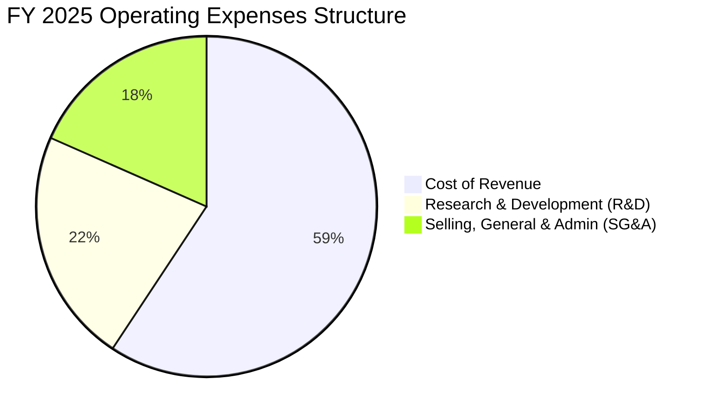

### 3.5 季度 EPS 趨勢與盈餘品質（Quality of Earnings）

Alphabet 近期盈餘表現極其亮眼。Q1 2026 的稀釋 EPS 達到 **$5.17**，遠超去年同期的 $2.84。然而，作為機構級投資人，我們必須深入剖析其盈餘品質（Quality of Earnings）：

| 盈餘品質項目 | 數值/佔比 | 評估 | 詳細分析 |
|--------------|-----------|------|----------|
| **SBC / 營收** | 6.19% | 🟡 中性 | FY2025 股權薪酬 (SBC) 為 $24.95B。雖然對股東股權有約 1.5% - 2.0% 的潛在稀釋，但完全被公司每年超過 $60B 的股票回購所抵消。 |
| **SBC / OCF** | 15.15% | 🟡 中性 | 佔經營現金流比重合理，符合矽谷科技龍頭常態。 |
| **FCF / 淨利 (現金轉換率)** | 48.42% | 🔴 偏低 | TTM 淨利為 $160.21B，但真實 FCF 僅為 $64.43B（轉換率 40.2%）。主因是 **Capex 飆升至 $109.92B**（佔 OCF 的 63%），這表明利潤雖高，但大量資金被鎖定在固定資產投資中。 |
| **一次性非經常性損益** | $37.72B | 🔴 需注意 | Q1 2026 非營運收益高達 $37.72B（主因是股權投資公允價值變動），這使當季淨利虛增，扣除此項後，核心營業利潤仍極為健康。 |
| **有效稅率** | 17.61% | 🟢 穩定 | 處於 16% - 19% 的正常區間，並無透過異常稅務利益美化帳面的跡象。 |

---

## 4. 資產負債表分析

Alphabet 擁有全球科技業中最為強韌的資產負債表之一，為其高額的 AI 研發與資本支出提供了強大後盾。

### 4.1 資產結構分解

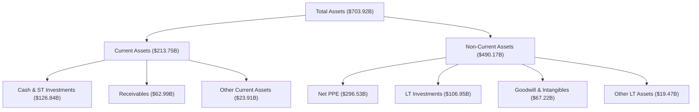

### 4.2 流動性指標分析

| 指標 | FY 2023 | FY 2024 | FY 2025 | TTM (Q1 26) | 行業均值 | 評估 |
|------|---------|---------|---------|-------------|----------|------|
| **流動比率 (Current Ratio)** | 2.10x | 1.84x | 2.01x | 1.92x | ~1.50x | 🟢 極度充裕 |
| **速動比率 (Quick Ratio)** | 1.91x | 1.68x | 1.71x | 1.71x | ~1.35x | 🟢 無短期變現壓力 |
| **債務/股益比 (Debt/Equity)** | 9.57% | 6.94% | 14.28% | 20.03% | ~35.00% | 🟢 財務槓桿極低 |

### 4.3 債務結構分析

```
╔══════════════════════════════════════════════════════════════════╗
║                   Alphabet 債務健康診斷 (TTM)                    ║
╠══════════════════════════════════════════════════════════════════╣
║                                                                  ║
║  總債務：        $95.88B   ████░░░░░░░░░░░░░░░░░  (含租賃負債)     ║
║  總現金+短投：   $126.84B  ████████████████████░  (高流動性資產)   ║
║  淨現金 (Net Cash)：$30.96B  ██████░░░░░░░░░░░░░░░  🟢 淨現金狀態   ║
║                                                                  ║
║  Debt / EBITDA：  0.53x   🟢 極低 (低於 1.5x 即為極安全)         ║
║  利息保障倍數：    120x+   🟢 營業利益輕易覆蓋利息支出            ║
║                                                                  ║
║  📊 診斷：即使大舉發債籌資，Alphabet 仍維持「淨現金」狀態，        ║
║           在利率高企環境下，免受利息支出侵蝕利潤。                ║
╚══════════════════════════════════════════════════════════════════╝
```

### 4.4 股東權益趨勢

隨著留存盈餘的快速累積，股東權益（Stockholders' Equity）呈現穩步增長：

```
╔══════════════════════════════════════════════════════════════════╗
║             股東權益增長趨勢 (FY22 - FY25)                       ║
╠══════════════════════════════════════════════════════════════════╣
║  FY 2022  $256.14B  ████████████░░░░░░░░░░░░░░░░                 ║
║  FY 2023  $283.38B  █████████████░░░░░░░░░░░░░░░                 ║
║  FY 2024  $325.08B  ███████████████░░░░░░░░░░░░░                 ║
║  FY 2025  $415.26B  ███████████████████░░░░░░░░░  🟢 YoY: +27.7% ║
╚══════════════════════════════════════════════════════════════════╝
```

---

## 5. 現金流量深度分析

現金流是評估 Alphabet 真實價值的核心。儘管利潤表上的淨利屢創新高，但現金流量表揭示了公司正在進行史無前例的資本重組。

### 5.1 現金流量瀑布圖

```mermaid
graph LR
    NetInc["GAAP 淨利<br/>$160.21B"]
    DA["折舊攤銷<br/>+$18.00B"]
    SBC["股權薪酬<br/>+$24.95B"]
    NWC["營運資金變動<br/>-$28.81B"]
    
    OCF["營業現金流 (OCF)<br/>$174.35B"]
    
    Capex["資本支出 (Capex)<br/>-$109.92B"]
    FCF["自由現金流 (FCF)<br/>$64.43B"]
    
    ShareBuyback["股票回購<br/>-$62.00B"]
    Dividend["股息支付<br/>-$10.05B"]
    NetCashChange["淨現金流變動<br/>-$7.62B"]

    NetInc --> DA
    DA --> SBC
    SBC --> NWC
    NWC --> OCF
    OCF --> Capex
    Capex --> FCF
    FCF --> ShareBuyback
    ShareBuyback --> Dividend
    Dividend --> NetCashChange
```

### 5.2 FCF 轉換率趨勢

| 現金流指標 | FY 2022 | FY 2023 | FY 2024 | FY 2025 | TTM (Q1 26) |
|------------|---------|---------|---------|---------|-------------|
| **營業現金流 (OCF)** | $91.50B | $101.75B | $125.30B | $164.71B | $174.35B |
| **資本支出 (Capex)** | -$31.48B | -$32.25B | -$52.53B | -$91.45B | -$109.92B |
| **自由現金流 (FCF)** | $60.01B | $69.50B | $72.76B | $73.27B | $64.43B |
| **FCF / 淨利 (轉換率)**| **100.06%**| **94.18%** | **72.68%** | **55.44%** | **40.22%** |

*關鍵洞察*：FCF 轉換率從 2022 年的 100% 降至 TTM 的 40.22%，這**並非**代表獲利品質惡化，而是因為 **Capex 經歷了爆發式增長（從 $31.48B 飆升至 $109.92B）**。這筆資金主要用於購置 NVIDIA H100/B200 GPU 與自研 TPU，以建置 AI 超級數據中心。

### 5.3 自由現金流趨勢

```
╔══════════════════════════════════════════════════════════════════╗
║               自由現金流與 FCF Yield 趨勢 (FY22-TTM)             ║
╠══════════════════════════════════════════════════════════════════╣
║  FY 2022  $60.01B  ▓▓▓▓▓▓▓▓▓▓▓▓▓▓▓▓▓▓▓▓  (Yield: 3.5%)           ║
║  FY 2023  $69.50B  ▓▓▓▓▓▓▓▓▓▓▓▓▓▓▓▓▓▓▓▓▓▓  (Yield: 3.1%)         ║
║  FY 2024  $72.76B  ▓▓▓▓▓▓▓▓▓▓▓▓▓▓▓▓▓▓▓▓▓▓▓  (Yield: 2.2%)        ║
║  FY 2025  $73.27B  ▓▓▓▓▓▓▓▓▓▓▓▓▓▓▓▓▓▓▓▓▓▓▓  (Yield: 1.7%)        ║
║  TTM      $64.43B  ▓▓▓▓▓▓▓▓▓▓▓▓▓▓▓▓▓▓░░░░  (Yield: 1.53%) 🟡     ║
╠══════════════════════════════════════════════════════════════════╣
║  💡 說明：受 AI 基礎設施萬億級投資拖累，短期 FCF Yield 降至      ║
║          1.53% 的歷史低位。這代表當前估值已部分反映了高 Capex。  ║
╚══════════════════════════════════════════════════════════════════╝
```

### 5.4 資本配置評估

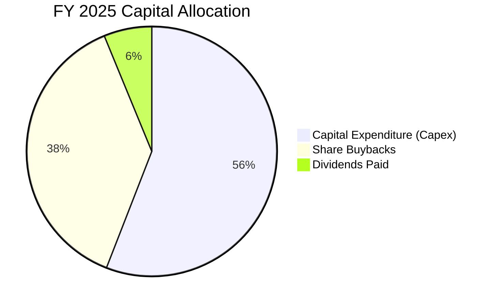

---

## 6. 獲利能力與資本效率

### 6.1 ROE / ROA / ROIC 趨勢

Alphabet 展現了極其強悍的資本回報率，顯示其在擴大資產規模的同時，並未稀釋資本回報效率。

| 指標 | FY 2023 | FY 2024 | FY 2025 | TTM (Q1 26) | 行業均值 | 評估 |
|------|---------|---------|---------|-------------|----------|------|
| **ROE** | 26.04% | 30.80% | 31.83% | 38.90% | ~20.00% | 🟢 極高 |
| **ROA** | 18.34% | 22.24% | 22.20% | 14.60% | ~8.50% | 🟢 優異 |
| **ROIC** | **18.06%**| **23.15%**| **24.10%**| **24.43%**| **~12.00%**| 🟢 頂尖 |

### 6.2 ROIC vs WACC 分析（核心價值創造判斷）

```
╔══════════════════════════════════════════════════════════════════╗
║                ROIC vs WACC 深度分析 (TTM)                       ║
╠══════════════════════════════════════════════════════════════════╣
║                                                                  ║
║  WACC 估算：                                                     ║
║  ├── 無風險利率 (10Y 美債)：  4.20%                              ║
║  ├── 市場風險溢酬 (ERP)：     5.00%                              ║
║  ├── Beta：                   1.25                               ║
║  ├── 股權成本 (Ke) = 4.2% + 1.25 × 5.0% = 10.45%                 ║
║  ├── 債務成本 (稅後)：       ~3.70%                              ║
║  ├── 資本結構：股權 ~97.8%，債務 ~2.2%                           ║
║  └── ✅ 綜合 WACC ≈ 10.30%                                       ║
║                                                                  ║
║  ROIC 估算：                                                     ║
║  ├── NOPAT = 營運利益 $138.13B × (1 - 17.61%) = $113.80B         ║
║  ├── 投入資本 = 總資產 - 無息流動負債 - 現金 = $465.89B          ║
║  └── ✅ ROIC ≈ 24.43%                                            ║
║                                                                  ║
║  ★ 經濟價值增加 (EVA) = ROIC - WACC = +14.13%                    ║
║                                                                  ║
║  ROIC  24.43% ▓▓▓▓▓▓▓▓▓▓▓▓▓▓▓▓▓▓▓▓▓▓▓▓░░░░░░  🟢                 ║
║  WACC  10.30% ▓▓▓▓▓▓▓▓▓▓░░░░░░░░░░░░░░░░░░░░  ──                 ║
║  EVA   +14.13% ██████████████░░░░░░░░░░░░░░░░  🏆 強力創造價值   ║
║                                                                  ║
║  📊 結論：ROIC 達 WACC 的 2.37 倍，代表 Alphabet 每投入 1 美元     ║
║           資本，可為股東創造遠超資金成本的超額回報。             ║
╚══════════════════════════════════════════════════════════════════╝
```

### 6.3 杜邦三因素分解

透過杜邦分解，我們可以發現 ROE 攀升至 38.90% 的核心驅動力：

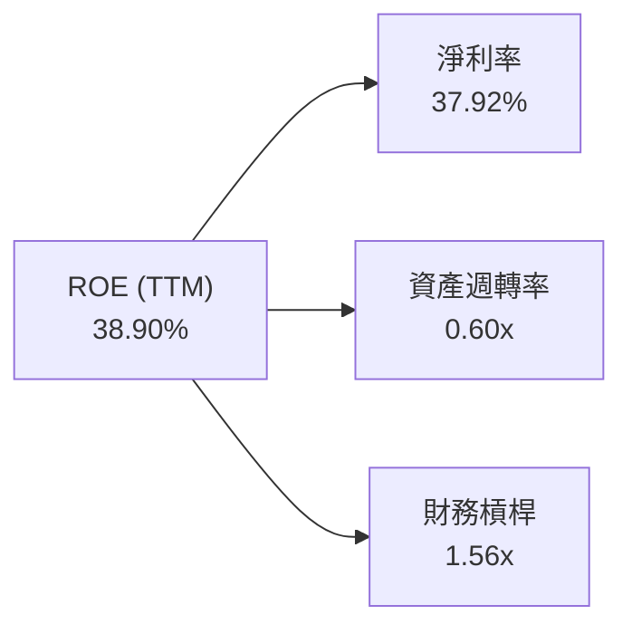

*杜邦分析結論*：
Alphabet 的高 ROE 主要是由**極高的淨利率（37.92%）**驅動，而非依賴財務槓桿。資產週轉率維持在 0.60x 的健康水平，表明隨著資產規模（特別是 PPE）的大幅擴張，營收也成比例地高速增長，並未出現資產閒置或效率低下的情況。

### 6.4 獲利能力儀表板

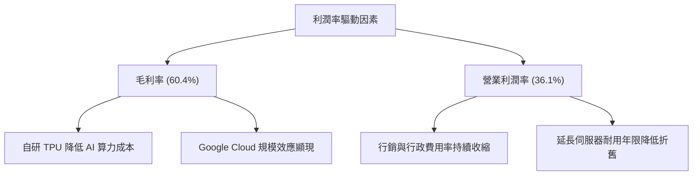

---

## 7. 估值深度分析

### 7.1 同業估值比較表格

我們選擇微軟 (MSFT) 與 Meta (META) 作為直接競爭對手進行估值對比：

| 估值指標 | **Alphabet (GOOG)** | **Microsoft (MSFT)** | **Meta (META)** | 評估 |
|----------|---------------------|----------------------|-----------------|------|
| **Trailing P/E** | 26.38x | 35.50x | 29.80x | 🟢 估值最便宜 |
| **Forward P/E** | **23.63x** | 30.20x | 24.50x | 🟢 具備高度吸引力 |
| **P/S Ratio** | 10.00x | 13.50x | 9.20x | 🟡 合理 |
| **EV / EBITDA** | 25.80x | 28.20x | 22.40x | 🟡 合理 |
| **PEG Ratio** | 1.39x | 2.10x | 1.25x | 🟢 增長性價比極高 |
| **FCF Yield** | 1.53% (TTM) | 2.10% | 2.80% | 🔴 受高 Capex 壓抑 |

### 7.2 歷史估值區間分析

```
╔══════════════════════════════════════════════════════════════════╗
║                GOOG 歷史 P/E 估值區間 (近5年)                    ║
╠══════════════════════════════════════════════════════════════════╣
║                                                                  ║
║  歷史最高 P/E:  36.0x                                            ║
║  歷史中位數 P/E: 27.5x                                            ║
║  當前 P/E:      26.38x  ██████████████████████░░░░░░░             ║
║  歷史最低 P/E:  16.0x                                            ║
║                                                                  ║
║  📊 評估：當前 P/E (26.38x) 略低於 5 年歷史中位數 (27.5x)。        ║
║           考量到當前營收與淨利成長率遠高於歷史均值，當前估值      ║
║           提供了極佳的安全邊際。                                 ║
╚══════════════════════════════════════════════════════════════════*
```

### 7.3 情境目標價（假設驅動，Bear / Base / Bull）

我們基於未來 3 年的營收增速、營運利潤率以及退出 P/E 倍數，進行情境估值建模：

| 情境 | 營收 CAGR (3Y) | 營業利潤率 (Avg) | 退出 P/E 倍數 | 隱含目標價 | 相對現價漲跌幅 |
|------|----------------|------------------|---------------|------------|----------------|
| 🔴 **悲觀情境** | 10.5% | 30.0% | 20.0x | **$310.00** | -10.4% |
| 🟡 **基準情境** | **15.5%** | **34.0%** | **25.0x** | **$427.77** | **+23.6%** |
| 🟢 **樂觀情境** | 20.0% | 38.0% | 28.0x | **$485.00** | +40.1% |

*估值倍數選擇說明*：由於 Alphabet 當前處於重資本支出週期，部分自由現金流被 Capex 壓抑，因此我們主要採用 **Forward P/E** 與 **EV/EBITDA** 進行估值定價，避免單一指標失真。

### 7.4 DCF 敏感性分析（6格目標價矩陣）

基於基準情境（永續成長率 g = 3.0%），我們對 WACC 與終端增長率進行敏感性測試：

| 營收成長率 \ WACC | 9.50% | 10.30% (基準) | 11.00% |
|-------------------|-------|---------------|--------|
| **18.0% (樂觀)** | $498.00 (+43.9%) | $462.00 (+33.5%) | $430.00 (+24.2%) |
| **15.5% (基準)** | $465.00 (+34.3%) | **$427.77 (+23.6%)** | $395.00 (+14.1%) |
| **12.0% (悲觀)** | $388.00 (+12.1%) | $352.00 (+1.7%) | $320.00 (-7.5%) |

### 7.5 估值綜合區間

```
╔══════════════════════════════════════════════════════════════════╗
║                     GOOG 估值區間分佈圖                          ║
╠══════════════════════════════════════════════════════════════════╣
║  [悲觀 $310] ─── [現價 $346.12] ─── [基準 $427.77] ─── [樂觀 $485]║
║         |               |                 |               |      ║
║       -10.4%         當前位置          +23.6%          +40.1%    ║
║                                                                  ║
║  💡 結論：現價顯著偏向估值區間左側，下行風險有限，上行空間可觀。    ║
╚══════════════════════════════════════════════════════════════════╝
```

---

## 8. 成長催化劑

### 8.1 催化劑時間軸

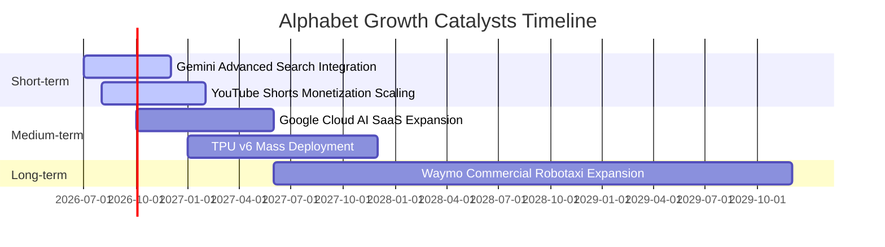

### 8.2 TAM 市場規模分析

Alphabet 正在積極滲透多個萬億級市場：

```
╔══════════════════════════════════════════════════════════════════╗
║               Alphabet 核心市場 TAM 與滲透率                     ║
╠══════════════════════════════════════════════════════════════════╣
║  1. 全球數位廣告市場 (TAM: $850B)                                ║
║     ├── Alphabet 當前市佔率：~38% (絕對龍頭)                      ║
║     └── 增長驅動力：AI 廣告精準匹配、Shorts 變現                 ║
║                                                                  ║
║  2. 全球雲端運算與 AI 算力市場 (TAM: $1.2T)                       ║
║     ├── Alphabet 當前市佔率：~12% (第三大)                       ║
║     └── 增長驅動力：GCP AI Hypercomputer、Gemini 企業訂閱        ║
║                                                                  ║
║  3. 自動駕駛與智慧出行 (TAM: $2.0T)                              ║
║     ├── Alphabet 當前市佔率：<1% (Waymo 處於商用化早期)          ║
║     └── 增長驅動力：Waymo 無人計程車多城市落地                   ║
╚══════════════════════════════════════════════════════════════════╝
```

### 8.3 成長驅動力結構圖

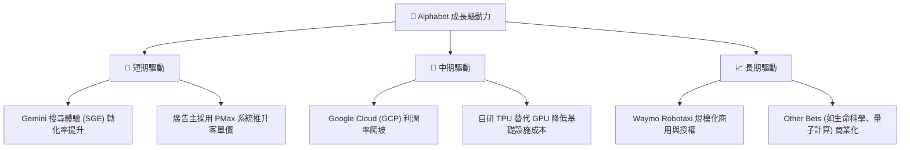

---

## 9. 風險矩陣

### 9.1 風險評分矩陣

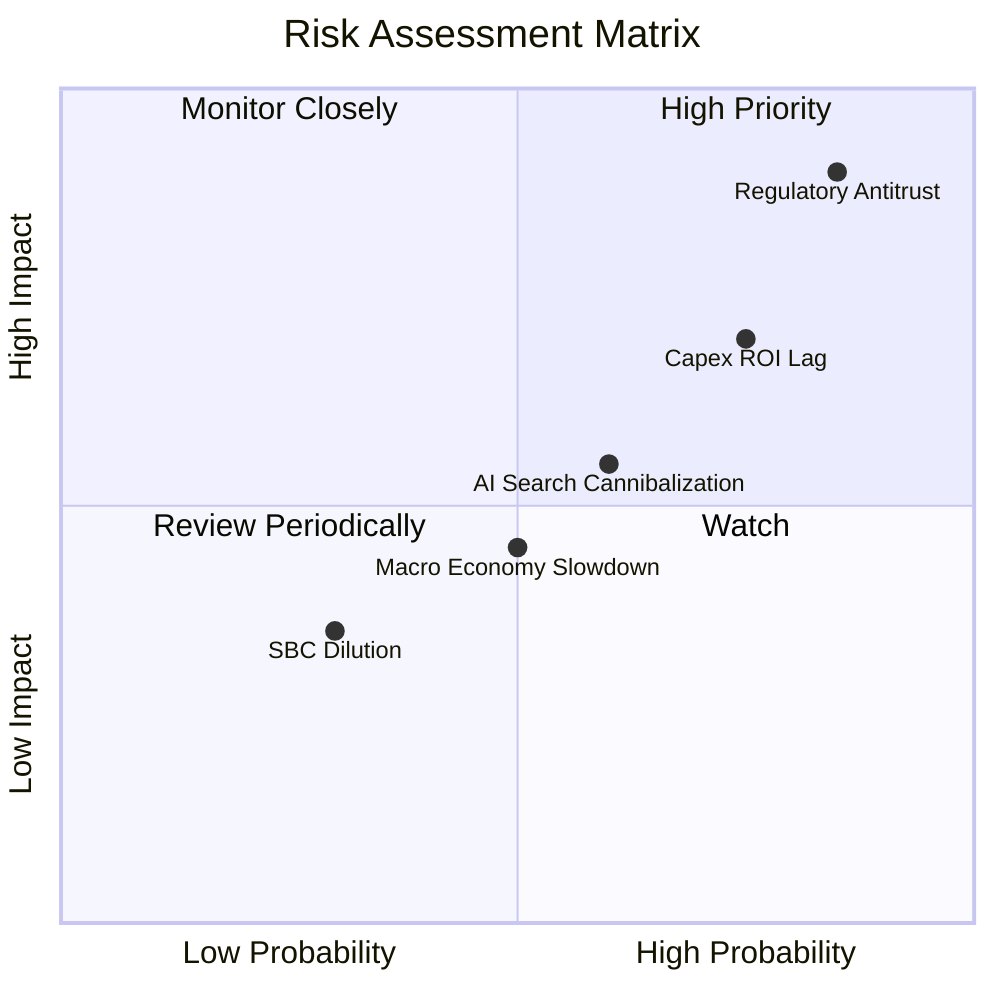

### 9.2 風險清單詳細分析

| # | 風險項目 | 發生機率 | 財務衝擊 | 風險評分 | 緩解措施 |
|---|----------|----------|----------|----------|----------|
| 1 | 🔴 **反壟斷監管分拆** | 高 (85%) | 高 (-15% 估值) | 🔴 8.5/10 | 預期 Alphabet 將透過漫長的上訴程序延緩分拆，並主動開放第三方 API 降低壟斷指控。 |
| 2 | 🔴 **AI Capex 拖累利潤率** | 中高 (75%)| 中 (-8% FCF) | 🔴 7.2/10 | 加速自研 TPU v5e/v6 的部署，降低對高價 NVIDIA GPU 的依賴，優化算力配置效率。 |
| 3 | 🟡 **AI 搜尋侵蝕廣告點擊** | 中 (60%) | 中 (-5% 營收) | 🟡 5.5/10 | 在 SGE (搜尋生成體驗) 中深度嵌入原生廣告，開發「對話式廣告」變現模式。 |
| 4 | 🟡 **總體經濟放緩壓抑廣告** | 中 (50%) | 中 (-5% 營收) | 🟡 4.5/10 | 透過發展非廣告業務（如 Cloud 訂閱、YouTube Premium 訂閱）來分散營收風險。 |

---

## 10. 投資建議

### 10.1 最終綜合評級雷達圖

```
╔══════════════════════════════════════════════════════════════╗
║                     GOOG 綜合投資評級                        ║
╠══════════════════════════════════════════════════════════════╣
║ 業務基本面    9.5/10  ▓▓▓▓▓▓▓▓▓▓▓▓▓▓▓▓▓▓▓░  ★★★★★           ║
║ 財務安全度    9.8/10  ▓▓▓▓▓▓▓▓▓▓▓▓▓▓▓▓▓▓▓▓  ★★★★★           ║
║ 成長潛力      9.0/10  ▓▓▓▓▓▓▓▓▓▓▓▓▓▓▓▓▓▓░░  ★★★★☆           ║
║ 估值吸引力    7.5/10  ▓▓▓▓▓▓▓▓▓▓▓▓▓▓▓░░░░░  ★★★★☆           ║
║ 資本效率      9.2/10  ▓▓▓▓▓▓▓▓▓▓▓▓▓▓▓▓▓▓▓░  ★★★★★           ║
╠══════════════════════════════════════════════════════════════╣
║ 綜合評級：🟢 強烈買入 (Strong Buy)                           ║
║ 推薦指數：★★★★★ ｜ 投資週期：12 - 36 個月                    ║
╚══════════════════════════════════════════════════════════════╝
```

### 10.2 目標價與隱含報酬率

| 情境 | 機率權重 | 目標價 | 隱含報酬率 | 權重後預期目標價 |
|------|----------|--------|------------|------------------|
| 🔴 悲觀情境 | 20% | $310.00 | -10.4% | $62.00 |
| 🟡 基準情境 | 60% | $427.77 | +23.6% | $256.66 |
| 🟢 樂觀情境 | 20% | $485.00 | +40.1% | $97.00 |
| **綜合權重** | **100%** | **$415.66** | **+20.1%** | **加權目標價：$415.66** |

### 10.3 買入時機與觸發因素

```
╔══════════════════════════════════════════════════════════════════╗
║                  ✅ GOOG 投資策略與觸發因素                      ║
╠══════════════════════════════════════════════════════════════════╣
║                                                                  ║
║  立即建倉條件 (分批佈局)：                                       ║
║  ✅ 股價處於 $340 - $350 區間 (Forward P/E < 24x)                ║
║  ✅ Google Cloud 營收增速維持在 > 25%                            ║
║                                                                  ║
║  加碼觸發條件 (出現以下任一)：                                   ║
║  ☐ 股價因反壟斷監管利空非理性回檔至 $310 附近                   ║
║  ☐ 季度財報顯示 Capex 增速放緩，但 FCF 轉換率回升至 60% 以上     ║
║  ☐ Waymo 宣佈在 3 個以上新一線城市開啟無人駕駛商用               ║
║                                                                  ║
║  減碼/停損觸發條件 (出現以下任一)：                              ║
║  ☐ 搜尋引擎市佔率連續兩季跌破 88% (被 AI 搜尋嚴重蠶食)           ║
║  ☐ 營業利潤率較當前峰值收縮 > 5 個百分點 (31.1% 以下)            ║
║                                                                  ║
╚══════════════════════════════════════════════════════════════════╝
```

### 10.4 投資人適配度分析

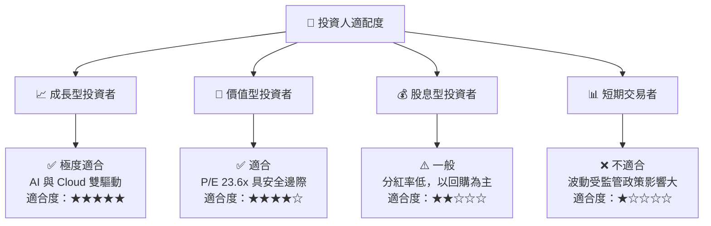

### 10.5 每季財報監控清單（Quarterly Watch List）

為了維持本投資框架的有效性，投資人應在每季財報中重點監控以下指標：

| 監控指標 | 基準安全線 | 觸發加碼門檻 | 觸發減碼門檻 | 監控目的 |
|----------|------------|--------------|--------------|----------|
| **Google Cloud 營收增速** | > 22.0% YoY | > 28.0% YoY | < 18.0% YoY | 評估雲端業務與 AI 算力變現動能 |
| **營業利潤率 (Operating Margin)** | > 32.0% | > 36.0% | < 29.0% | 監控高 Capex 下的營運槓桿與成本控制 |
| **真實自由現金流 (FCF)** | > $15.0B / 季 | > $20.0B / 季 | < $10.0B / 季 | 評估基礎設施投資對現金流的侵蝕程度 |
| **搜尋引擎全球市佔率** | > 90.0% | > 92.0% | < 88.0% | 監控 ChatGPT/Perplexity 等對核心業務的蠶食 |

### 10.6 反面論證：什麼會證明論點錯誤（What Would Change My Mind）

```
╔══════════════════════════════════════════════════════════════════╗
║              ⚠️ 多頭論點失效條件 (Disconfirming Evidence)        ║
╠══════════════════════════════════════════════════════════════════╣
║  本研究報告之「強烈買入」評級，在下列情況發生時將立即失效：      ║
║                                                                  ║
║  ☐ 條件一：美國司法部 (DOJ) 訴訟判定 Google 必須分拆 Android     ║
║            或 Chrome 瀏覽器，且上訴失敗。                        ║
║  ☐ 條件二：Google Cloud 營收增速連續兩季低於 15%，表明 AI 投資   ║
║            未能轉化為企業端（B2B）雲端營收。                     ║
║  ☐ 條件三：ROIC 跌破 15%，或經濟價值增加 (EVA) 轉為負值。        ║
║  ☐ 條件四：為了應對 AI 競爭，Capex 連續兩年突破 $120B，導致      ║
║            真實 FCF 轉換率降至 30% 以下。                        ║
╚══════════════════════════════════════════════════════════════════╝
```

---

> **免責聲明**：本報告為基於既有財務數據與產業知識之研究分析，僅供參考，不構成任何投資建議。投資人應獨立評估風險，並對其投資決策承擔全部責任。