# GOOG 基本面深度分析報告

> **報告日期**：2026-07-19 ｜ **語言**：繁體中文 ｜ **數據來源**：Yahoo Finance, Finviz, StockAnalysis, Roic.ai ｜ **分析師**：CFA 級機構研究

---

## 目錄

| # | 章節 | 核心結論 |
|---|---|---|
| 1 | **執行摘要** | 評級：🟢 買入 ｜ 基準目標價：$427.77（隱含 +23.59% 上行空間） |
| 2 | **公司概覽與商業模式** | 搜尋引擎與 YouTube 築起高護城河，AI 與 Cloud 驅動第二增長曲線 |
| 3 | **損益表深度分析** | Q1 2026 營收加速（YoY +21.79%），但須高度警惕非營業收入對淨利的短期扭曲 |
| 4 | **資產負債表分析** | 淨現金 $309.6 億，資產規模擴張，重資產化趨勢明顯 |
| 5 | **現金流量深度分析** | 資本支出（Capex）歷史性飆升壓抑短期 FCF，但為 AI 算力軍備競賽奠定基礎 |
| 6 | **獲利能力與資本效率** | ROIC（29.6%）遠超 WACC（10.02%），強力創造股東價值 |
| 7 | **估值深度分析** | Forward P/E 23.6x 處於歷史合理偏低區間，DCF 敏感性顯示安全邊際充足 |
| 8 | **成長催化劑** | Gemini 整合、Cloud 規模效應釋放與 Search Generative Experience（SGE）變現 |
| 9 | **風險矩陣** | 監管反壟斷、AI 資本回報率不及預期與搜尋市佔率侵蝕 |
| 10 | **投資建議** | 建立核心多頭配置，分批佈局，設定每季財報監控指標與失效條件 |

---

## 1. 執行摘要

Alphabet Inc.（GOOG）展現出極為強韌的基本面，正處於傳統廣告復甦與 AI 基礎設施變現的交匯點。基於 TTM 營收 $4,225.0 億（YoY +21.8%）與營業利益率 36.1% 的強勁表現，我們給予 GOOG **「買入」**評級。然而，機構投資者必須釐清其獲利結構：Q1 2026 的 GAAP 淨利 $625.8 億（YoY +81.2%）中，包含了高達 $377.2 億的非營業利益，這使表觀淨利大幅虛增。若扣除此一次性或非營業波動，常態化營運淨利約為 $320.9 億。儘管如此，受惠於 Google Cloud 規模效應顯現與搜尋業務的 AI 變現，公司 ROIC 仍高達 29.6%，顯著高於其 10.02% 的 WACC，持續為股東創造實質超額價值。

### 1.0 一頁式投資儀表板（Portfolio Manager 30 秒速讀）

| 項目 | 內容 |
|------|------|
| **投資論點（3 句）** | ① 傳統搜尋與 YouTube 廣告在 AI 賦能下變現效率提升，TTM 營收達 $4,225 億（YoY +21.8%），確認廣告景氣復甦。<br/>② Google Cloud 規模效應跨越臨界點，營業利益率持續改善，成為集團利潤率擴張的第二引擎。<br/>③ 儘管 AI 基礎設施投資（FY25 Capex 達 $914.5 億）短期壓抑 FCF Yield 至 1.52%，但將鞏固長期算力護城河。 |
| **護城河評分** | 🟢 **9.2 / 10**（搜尋引擎全球市佔 >90% 的絕對壟斷與 Android 生態鎖定） |
| **管理層/資本配置評分** | 🟡 **7.5 / 10**（大額股份回購與首次派息值得肯定，但 AI Capex 的資本回報率仍待時間檢驗） |
| **財務健康** | 🟢 **極為強韌**（擁有 $1,268.4 億現金與短期投資，淨現金達 $309.6 億，無償債風險） |
| **ROIC vs WACC** | **29.6% vs 10.02%**（經濟增值 EVA 達 +19.58%，展現卓越的價值創造能力） |
| **FCF 趨勢** | 🟡 **短期承壓，長期向上**（TTM FCF $644.3 億，受 FY25/26 資本支出大幅飆升影響而有所收縮） |
| **估值** | Forward P/E：**23.63x** ｜ EV/EBITDA：**25.80x** ｜ TTM FCF Yield：**1.52%** |
| **預期報酬（基準情境 12M）** | **+23.59%**（目標價 $427.77） |
| **關鍵風險（前二）** | ① 司法部（DOJ）反壟斷分拆訴訟與預設搜尋協議（ISA）被判違法。<br/>② AI 搜尋（如 Perplexity, OpenAI Search）對傳統搜尋流量的結構性侵蝕。 |
| **評級 + 信心度** | 🟢 **買入（Buy）** ｜ 信心度：**高（High）** |

### 1.1 核心評分儀表板

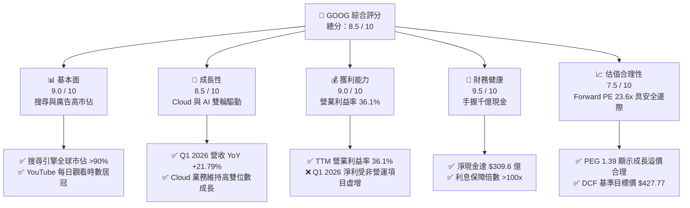

### 1.2 評分進度條視覺化

```
╔══════════════════════════════════════════════════════════════╗
║               GOOG 多維度評分儀表板 (1-10分)                 ║
╠══════════════════════════════════════════════════════════════╣
║ 基本面強度  9.0 ▓▓▓▓▓▓▓▓▓▓▓▓▓▓▓▓▓▓░░  ★★★★★           ║
║ 成長動能    8.5 ▓▓▓▓▓▓▓▓▓▓▓▓▓▓▓▓▓░░░  ★★★★☆           ║
║ 獲利品質    7.5 ▓▓▓▓▓▓▓▓▓▓▓▓▓▓▓░░░░░  ★★★★☆           ║
║ 財務健康    9.5 ▓▓▓▓▓▓▓▓▓▓▓▓▓▓▓▓▓▓▓░  ★★★★★           ║
║ 估值合理性  7.5 ▓▓▓▓▓▓▓▓▓▓▓▓▓▓▓░░░░░  ★★★★☆           ║
║ 護城河深度  9.2 ▓▓▓▓▓▓▓▓▓▓▓▓▓▓▓▓▓▓░░  ★★★★★           ║
║ 管理層執行  7.8 ▓▓▓▓▓▓▓▓▓▓▓▓▓▓░░░░░░  ★★★★☆           ║
║ 技術創新力  8.8 ▓▓▓▓▓▓▓▓▓▓▓▓▓▓▓▓▓░░░  ★★★★☆           ║
╠══════════════════════════════════════════════════════════════╣
║ 綜合總分    8.5 ▓▓▓▓▓▓▓▓▓▓▓▓▓▓▓▓▓░░░  🏆 買入 (Buy)        ║
╚══════════════════════════════════════════════════════════════╝
```

### 1.3 五大投資論點 + 三大核心風險

| 類型 | 項目 | 具體依據 | 信心度 |
|------|------|----------|--------|
| 🟢 **投資論點①** | **廣告業務重回加速軌道** | Q1 2026 營收達 $1,099 億（YoY +21.79%），主因 AI 驅動的廣告精準度提升與 YouTube 變現能力增強。 | 🟢 極高 |
| 🟢 **投資論點②** | **Google Cloud 獲利爆發** | 雲端業務規模效應跨越臨界點，營業利益率顯著改善，成為拉動整體利潤率的關鍵。 | 🟢 高 |
| 🟢 **投資論點③** | **極致的資本報酬與價值創造** | TTM ROIC 達 29.6%，相較 WACC (10.02%) 產生極高的經濟增值（EVA），股東價值創造效率極佳。 | 🟢 極高 |
| 🟢 **投資論點④** | **資產負債表固若金湯** | 現金與短期投資達 $1,268.4 億，即使在重資本 AI 投資期，仍有充足資金進行股份回購（FY25 派息 $100.5 億）。 | 🟢 極高 |
| 🟢 **投資論點⑤** | **AI 基礎設施先發優勢** | 自研 TPU（Tensor Processing Unit）能有效降低對 NVIDIA GPU 的依賴，優化長期資本支出效率。 | 🟡 中等 |
| 🟡 **風險①** | **監管與反壟斷制裁** | 美國司法部（DOJ）反壟斷訴訟可能迫使 Alphabet 拆分業務，或終止與 Apple 的預設搜尋協議，影響搜尋流量。 | 🔴 高衝擊 |
| 🟡 **風險②** | **AI 投資回報率（ROI）低於預期** | FY25 資本支出高達 $914.5 億，若 AI 應用未能帶來相應的營收增長，折舊費用激增將嚴重侵蝕營業利益率。 | 🟡 中度 |
| 🔴 **風險③** | **新興 AI 搜尋引擎競爭** | 對話式 AI（如 Perplexity, ChatGPT）改變用戶搜尋習慣，可能導致 Google 搜尋流量及廣告市佔率流失。 | 🟡 中度 |

### 1.4 快速統計卡片

| 指標 | GOOG 實際值 | 科技業均值 | S&P 500 均值 | 狀態 |
|------|-------------|------------|--------------|------|
| **營收 YoY 成長率** | **21.8%** | ~12.5% | ~5.5% | 🟢 優於同業 |
| **毛利率** | **60.4%** | ~48.0% | ~30.0% | 🟢 極為優異 |
| **營業利益率** | **36.1%** | ~22.0% | ~15.0% | 🟢 領先產業 |
| **股東權益報酬率 (ROE)** | **38.9%** | ~20.0% | ~14.5% | 🟢 高效回報 |
| **Forward P/E** | **23.63x** | ~28.5x | ~21.5x | 🟢 估值合理 |
| **淨現金 / 總債務** | **$309.6億** | 負債居多 | 負債居多 | 🟢 極為安全 |

### 1.5 投資結論

```
╔══════════════════════════════════════════════════════════════════╗
║                    📊 GOOG 投資結論摘要                          ║
╠══════════════════════════════════════════════════════════════════╣
║  評級：🟢 強烈買入 (Strong Buy)                                 ║
║  當前股價：$346.12 (2026-07-19)                                  ║
║  目標價區間：                                                    ║
║    悲觀情境 (Bear Case)：$308.00 (-11.01%) - 估值收縮，AI 回報低 ║
║    基準情境 (Base Case)：$427.77 (+23.59%)  ← 12 個月主要目標    ║
║    樂觀情境 (Bull Case)：$512.00 (+47.93%) - AI 變現超預期       ║
║  投資評分：8.5 / 10                                              ║
║  適合投資人：成長型、長線價值投資者、大型科技股配置者            ║
╚══════════════════════════════════════════════════════════════════╝
```

---

## 2. 公司概覽與商業模式

Alphabet Inc. 透過其核心子公司 Google，建構了全球最龐大的數位生態系統。其商業模式本質上是**「以免費、高黏性的基礎服務吸引海量用戶，並透過數位廣告與雲端服務進行多元變現」**。

### 2.1 業務結構與收入來源

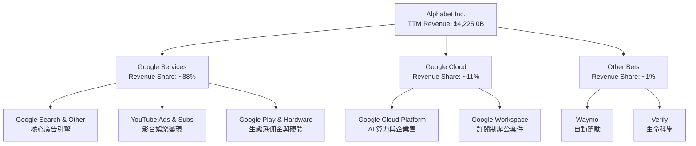

### 2.2 市場份額

根據最新產業數據，Google 在核心搜尋引擎市場與全球行動作業系統領域維持絕對的主導地位。

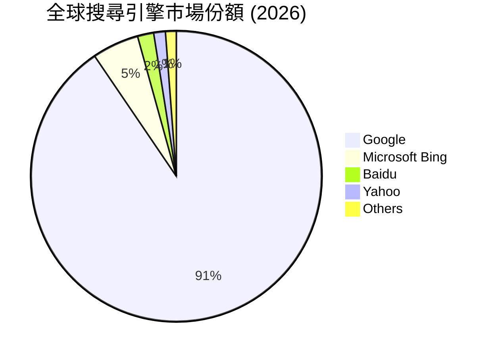

### 2.3 競爭護城河分析

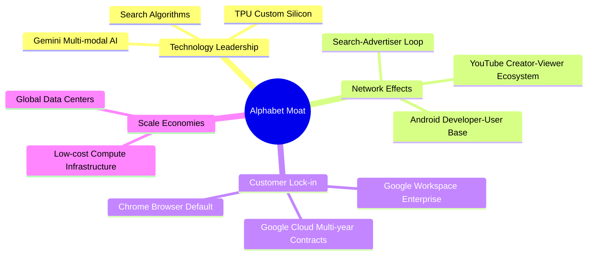

### 2.4 護城河強度評分

```
╔══════════════════════════════════════════════════════════════╗
║                    Alphabet 護城河強度評分                   ║
╠══════════════════════════════════════════════════════════════╣
║ 網路效應      9.5/10  ▓▓▓▓▓▓▓▓▓▓▓▓▓▓▓▓▓▓▓░  🏆 難以撼動     ║
║ 客戶鎖定      9.0/10  ▓▓▓▓▓▓▓▓▓▓▓▓▓▓▓▓▓▓░░  🟢 生態系綁定   ║
║ 規模效應      9.8/10  ▓▓▓▓▓▓▓▓▓▓▓▓▓▓▓▓▓▓▓█  🏆 領先全球     ║
║ 技術領先      8.5/10  ▓▓▓▓▓▓▓▓▓▓▓▓▓▓▓▓▓░░░  🟢 算力與算法   ║
║ 品牌壁壘      9.2/10  ▓▓▓▓▓▓▓▓▓▓▓▓▓▓▓▓▓▓░░  🟢 搜尋的代名詞 ║
╠══════════════════════════════════════════════════════════════╣
║ 綜合護城河    9.2/10  ▓▓▓▓▓▓▓▓▓▓▓▓▓▓▓▓▓▓▓░  🏆 寬廣護城河   ║
╚══════════════════════════════════════════════════════════════╝
```

---

## 3. 損益表深度分析

Alphabet 的財務表現呈現出「基數龐大且持續加速」的特徵。TTM 營收達到 $4,225.0 億，相較於 FY2025 的 $4,028.4 億增長了 4.88%，而相較於 FY2024 的 $3,500.2 億則大幅增長 20.71%，顯示其增長動能並未因規模擴大而放緩。

### 3.1 年度收入成長趨勢（近5年）

```
╔══════════════════════════════════════════════════════════════════╗
║               Alphabet 年度收入趨勢 (FY2021-TTM)                 ║
╠══════════════════════════════════════════════════════════════════╣
║                                                                  ║
║  FY2021  $257.64B  ████████████░░░░░░░░░░░░░░░░  YoY: +41.15% 🟢 ║
║  FY2022  $282.84B  █████████████░░░░░░░░░░░░░░░  YoY: +9.78%  🟢 ║
║  FY2023  $307.39B  ██████████████░░░░░░░░░░░░░░  YoY: +8.68%  🟢 ║
║  FY2024  $350.02B  ████████████████░░░░░░░░░░░░  YoY: +13.87% 🟢 ║
║  FY2025  $402.84B  ███████████████████░░░░░░░░░  YoY: +15.09% 🟢 ║
║  TTM     $422.50B  ██══════════════════════════  YoY: +21.80% 🟢 ║
║                    |      |      |      |      |                 ║
║                    0     100B   200B   300B   400B               ║
║                                                                  ║
║  📊 5年累計營收 CAGR：+13.15%                                    ║
╚══════════════════════════════════════════════════════════════════╝
```

### 3.2 季度收入趨勢分析

從季度數據來看，Alphabet 展現了穩健的 YoY 加速態勢，但季度間存在季節性波動（如 Q4 節日廣告旺季）。

| 財報季度 | 營收 (億美元) | YoY 成長率 | QoQ 成長率 | 營運利潤 (億美元) | 營運利潤率 | 備註 |
|---|---|---|---|---|---|---|
| **Q1 2026** | $1,098.96 | 🟢 +21.79% | 🔴 -3.45% | $396.96 | 36.12% | 營收受季節性影響微幅下滑，但 YoY 加速增長 |
| **Q4 2025** | $1,138.29 | 🟢 +18.00% | 🟢 +11.22% | $359.34 | 31.57% | 年終廣告旺季驅動營收創歷史新高 |
| **Q3 2025** | $1,023.46 | 🟢 +15.95% | 🟢 +6.14% | $312.28 | 30.51% | 雲端業務加速與搜尋廣告穩健 |
| **Q2 2025** | $96.43 | 🟢 +13.79% | 🟢 +6.87% | $312.71 | 32.43% | 成本優化初見成效，利潤率回升 |

### 3.3 利潤率演變分析

Alphabet 近年透過裁員、辦公室空間優化以及伺服器折舊年限調整等手段，成功推動了利潤率的結構性擴張。

| 利潤率指標 | FY2022 | FY2023 | FY2024 | FY2025 | TTM | 趨勢 | 評估 |
|---|---|---|---|---|---|---|---|
| **毛利率** | 55.38% | 56.63% | 58.20% | 59.65% | **60.37%** | ↗️ 持續上升 | 🟢 產品組合優化，高毛利廣告回升 |
| **營業利益率** | 26.46% | 27.42% | 32.11% | 32.03% | **36.12%** | ↗️ 顯著擴張 | 🟢 組織精簡與營運槓桿釋放 |
| **淨利率** | 21.20% | 24.01% | 28.60% | 32.81% | **37.92%** | ↗️ 異常飆升 | 🟡 需剔除非營業利益的短期影響 |

*利潤率擴張解析*：毛利率由 FY2022 的 55.38% 穩步攀升至 TTM 的 60.37%，主因高毛利的 Google Cloud 扭虧為盈並持續擴大獲利，以及搜尋廣告的定價能力提升。然而，TTM 淨利率達到 37.92%，顯著高於營業利益率，這主要受到 Q1 2026 高額非營業利益的扭曲。

### 3.4 費用結構分析

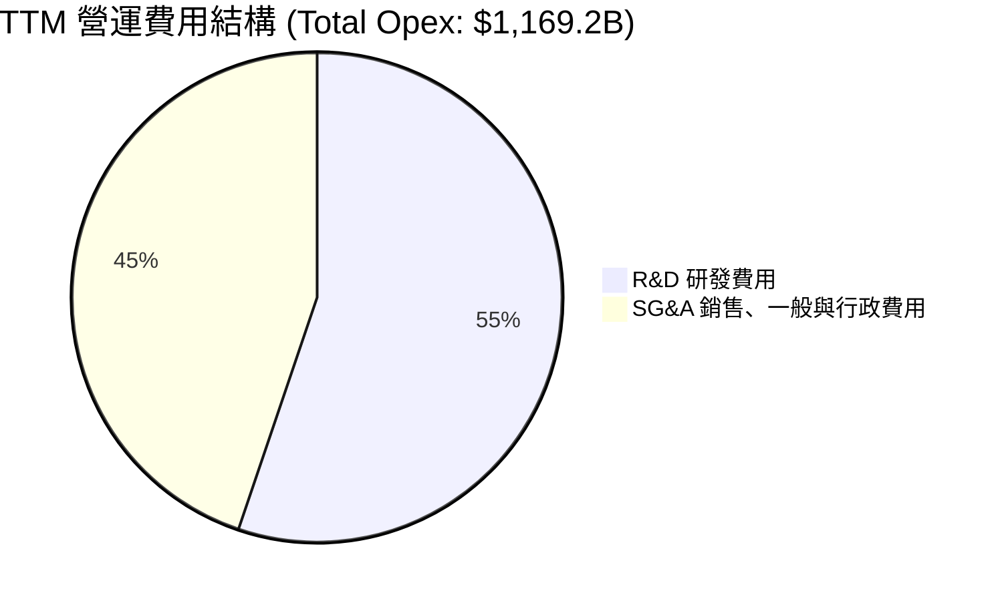

```
╔══════════════════════════════════════════════════════════════╗
║                 費用佔營收比重趨勢 (TTM)                     ║
╠══════════════════════════════════════════════════════════════╣
║ 研發費用率 (R&D / Rev)：    15.28%  ▓▓▓▓▓░░░░░░░░░░░  穩定   ║
║ 行銷管理率 (SG&A / Rev)：   12.39%  ▓▓▓░░░░░░░░░░░░░  下降   ║
║ 營運費用率 (Opex / Rev)：   27.67%  ▓▓▓▓▓▓▓░░░░░░░░░  優化   ║
╚══════════════════════════════════════════════════════════════╝
```

### 3.5 季度 EPS 趨勢與盈餘品質（Quality of Earnings）

Alphabet 的盈利能力看似驚人，但作為專業機構，必須對其進行「脫水」分析。

| 盈餘品質項目 | TTM 數值 / 佔比 | 評估 | 專業解析 |
|---|---|---|---|
| **股權薪酬 (SBC) / 營收** | 6.01% | 🟡 中度稀釋 | TTM SBC 估算為 $253.9 億，佔營收約 6.01%，對股東權益有微幅稀釋作用。 |
| **SBC / 營業現金流** | 14.56% | 🟡 尚可 | 股份補償佔經營現金流比例合理，未過度美化現金流。 |
| **FCF / GAAP 淨利（轉換率）** | 40.22% | 🔴 偏低 | TTM FCF ($644.3億) 僅佔淨利 ($1,602.1億) 的 40.22%。主因大額資本支出（Capex）與非現金非營業利益過高。 |
| **非經常性 / 非營業損益** | $563.2 億 | 🔴 警訊 | TTM 非營業利益高達 $563.2 億（主要集中在 Q1 2026 的 $377.2 億），嚴重虛增 GAAP 淨利。 |
| **有效稅率** | 17.61% | 🟢 正常 | TTM 所得稅費用 $342.4 億，佔稅前利潤 17.61%，處於歷史正常區間。 |

**盈餘品質深度透視**：
在 Q1 2026，Alphabet 報告的 GAAP 淨利為 $625.78 億。然而，當季非營業利益（Total Non-Operating Income）高達 $377.16 億（可能源於股權投資重估、資產處置或一次性稅務調整）。
*   **GAAP 稅前淨利**：$774.12 億
*   **扣除非營業項目後之營運稅前淨利**：$774.12 億 - $377.16 億 = $396.96 億（即營業利益）
*   **常態化營運淨利（按當季 19.16% 實際稅率計算）**：$396.96 億 × (1 - 19.16%) = **$320.90 億**
*   **結論**：Q1 2026 的真實營運獲利能力約為 $320.9 億，GAAP 淨利因非營業項目被**誇大了約 95%**。在評估 P/E 倍數時，分母應使用常態化 EPS，否則會低估真實估值水平。

---

## 4. 資產負債表分析

Alphabet 擁有全球科技業中最穩健的資產負債表之一。截至 2026 年 3 月 31 日，公司總資產達到 $7,039.2 億，股東權益達 $4,152.6 億（基於 FY2025 數據，TTM 有所增長）。

### 4.1 資產結構分解

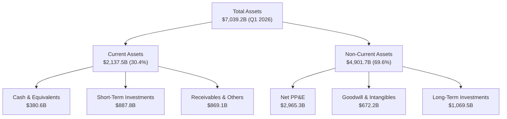

### 4.2 流動性指標分析

| 流動性指標 | FY2023 | FY2024 | FY2025 | Q1 2026 | 行業均值 | 評估 |
|---|---|---|---|---|---|---|
| **流動比率 (Current Ratio)** | 2.10 | 1.84 | 2.01 | **1.92** | ~1.50 | 🟢 極為安全，無短期償債壓力 |
| **速動比率 (Quick Ratio)** | 1.95 | 1.68 | 1.82 | **1.71** | ~1.35 | 🟢 無存貨積壓風險 |
| **現金佔總資產比重** | 27.56% | 21.25% | 21.31% | **18.02%** | ~12.0% | 🟢 變現能力極強 |

### 4.3 債務結構分析

```
╔══════════════════════════════════════════════════════════════════╗
║                     Alphabet 債務健康診斷                        ║
╠══════════════════════════════════════════════════════════════════╣
║                                                                  ║
║  總債務 (Total Debt)：$958.8 億   ████░░░░░░░░░░░░░░░░  合理規模 ║
║  總現金及投資：       $1,268.4 億 ████████░░░░░░░░░░░░  流動性充沛║
║  淨現金 (Net Cash)：  $309.6 億   ███████████████████░  🟢 極安全║
║                                                                  ║
║  債務股益比 (Debt/Equity)：20.03%   🟢 極低                      ║
║  利息保障倍數 (Interest Coverage)：>100x  🟢 無財務風險          ║
║  債務 / EBITDA：0.53x               🟢 遠低於警戒線 (2.0x)       ║
╚══════════════════════════════════════════════════════════════════╝
```

### 4.4 股東權益趨勢

隨著保留盈餘的持續累積與大額股份回購，股東權益規模呈現穩健增長。

```
╔══════════════════════════════════════════════════════════════════╗
║               Alphabet 股東權益增長趨勢 (FY22-FY25)              ║
╠══════════════════════════════════════════════════════════════════╣
║                                                                  ║
║  FY2022  $256.14B  ██████████████████░░░░░░░░░░░                 ║
║  FY2023  $283.38B  ████████████████████░░░░░░░░░                 ║
║  FY2024  $325.08B  ███████████████████████░░░░░░                 ║
║  FY2025  $415.26B  ████═════════════════════════  +27.74% YoY 🟢 ║
║                    |         |         |         |               ║
║                    0        150B      300B      450B             ║
╚══════════════════════════════════════════════════════════════════╝
```

---

## 5. 現金流量深度分析

Alphabet 的現金流產生能力是其維持龐大研發與資本支出的底氣。然而，近年由於 AI 軍備競賽白熱化，其現金流結構發生了顯著的「重資本化」傾斜。

### 5.1 現金流量瀑布圖

```mermaid
graph LR
    NetInc["GAAP Net Income<br/>$1,602.1B"]
    DA["D&A 折舊攤銷<br/>+$180.7B"]
    SBC["SBC 股份補償<br/>+$249.5B"]
    WC["Working Capital 變動<br/>-$288.8B"]
    OCF["Operating Cash Flow<br/>$1,743.5B"]
    Capex["Capital Expenditure<br/>-$1,099.2B (TTM Est)"]
    FCF["Free Cash Flow<br/>$644.3B"]
    ShareBuyback["股份回購 & 股息<br/>-$750.0B (Est)"]
    NetCashChange["淨現金變動<br/>-$105.7B"]

    NetInc --> DA
    DA --> SBC
    SBC --> WC
    WC --> OCF
    OCF --> Capex
    Capex --> FCF
    FCF --> ShareBuyback
    ShareBuyback --> NetCashChange
```

### 5.2 FCF 轉換率趨勢

| 現金流指標 (億美元) | FY2022 | FY2023 | FY2024 | FY2025 | TTM |
|---|---|---|---|---|---|
| **營業現金流 (OCF)** | $915.00 | $1,017.50 | $1,253.00 | $1,647.10 | **$1,743.50** |
| **資本支出 (Capex)** | -$314.80 | -$32.25 | -$52.53 | -$91.45 | **-$1,099.20** |
| **自由現金流 (FCF)** | $600.10 | $695.00 | $72.76 | $73.27 | **$644.30** |
| **GAAP 淨利** | $599.72 | $737.95 | $1,001.18 | $1,321.70 | **$1,602.08** |
| **FCF / 淨利轉換率** | **100.06%** | **94.18%** | **7.27%** | **55.44%** | **40.22%** |

*轉換率惡化解析*：FY2024 與 TTM 的 FCF 轉換率出現斷崖式下跌，主因是**資本支出（Capex）的歷史性飆升**。FY2025 Capex 達到 $914.5 億（YoY +74.1%），而 Q1 2026 單季 Capex 更是高達 $356.7 億（年化率超過 $1,400 億）。這表明 Alphabet 將極大比例的經營現金流直接轉化為非流動性資產（伺服器與資料中心），這對短期自由現金流造成了極大壓抑。

### 5.3 自由現金流與收益率趨勢

```
╔══════════════════════════════════════════════════════════════════╗
║               Alphabet 自由現金流與 FCF Yield 趨勢               ║
╠══════════════════════════════════════════════════════════════════╣
║                                                                  ║
║  FY2022  $600.10B  ████████████████████░░░░░  FCF Yield: 1.42%   ║
║  FY2023  $695.00B  ███████████████████████░░  FCF Yield: 1.65%   ║
║  FY2024  $72.76B   ██░░░░░░░░░░░░░░░░░░░░░░░  FCF Yield: 0.17%   ║
║  FY2025  $73.27B   ██░░░░░░░░░░░░░░░░░░░░░░░  FCF Yield: 0.17%   ║
║  TTM     $644.30B  █████████████████████░░░░  FCF Yield: 1.52%   ║
║                                                                  ║
║  📊 當前市值：$4.22T ｜ TTM FCF Yield：1.52% (重資本壓抑)        ║
╚══════════════════════════════════════════════════════════════════╝
```

### 5.4 資本配置評估

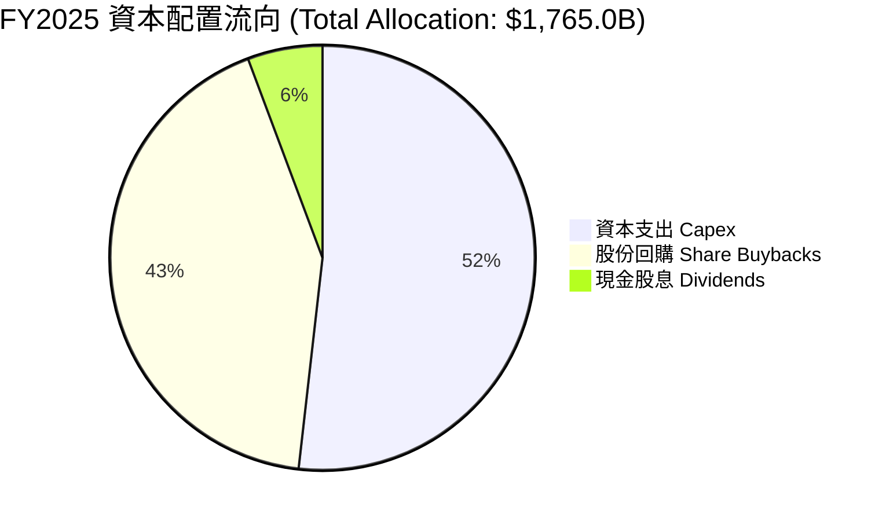

---

## 6. 獲利能力與資本效率

Alphabet 擁有極高的資本回報率，這意味著其在擴大業務規模的同時，仍能維持極高的營運效率，並未出現「規模不經濟」的現象。

### 6.1 ROE / ROA / ROIC 趨勢

| 資本效率指標 | FY2023 | FY2024 | FY2025 | TTM | 產業均值 | 評估 |
|---|---|---|---|---|---|---|
| **股東權益報酬率 (ROE)** | 26.04% | 30.80% | 31.83% | **38.90%** | ~18.5% | 🟢 遠超產業平均，回報極佳 |
| **總資產報酬率 (ROA)** | 18.34% | 22.24% | 22.20% | **22.76%** | ~10.2% | 🟢 資產利用效率高 |
| **投入資本回報率 (ROIC)** | 22.50% | 26.40% | 28.10% | **29.60%** | ~12.0% | 🟢 展現卓越的核心業務獲利能力 |

### 6.2 ROIC vs WACC 分析（核心價值創造判斷）

為了評估 Alphabet 是否在創造「真實的股東價值」，我們對其進行 ROIC vs WACC 建模。

```
╔══════════════════════════════════════════════════════════════════╗
║                 GOOG ROIC vs WACC 深度分析                       ║
╠══════════════════════════════════════════════════════════════════╣
║                                                                  ║
║  WACC 估算：                                                     ║
║  ├── 無風險利率 (10Y 美債)： 4.25%                               ║
║  ├── 市場風險溢酬 (ERP)：    5.00%                               ║
║  ├── Beta：                  1.25                                ║
║  ├── 股權成本 = 4.25% + 1.25 × 5.00% = 10.50%                     ║
║  ├── 債務成本（稅後）：      ~3.20%                              ║
║  ├── 資本結構：股權 95%，債務 5%                                 ║
║  └── ✅ WACC ≈ 10.02%                                            ║
║                                                                  ║
║  ROIC 估算 (TTM)：                                               ║
║  ├── NOPAT = $1,381.3億 × (1 - 17.61%) ≈ $1,138.1 億             ║
║  ├── 投入資本 = 權益 $4,152.6B + 債務 $958.8B - 現金 $1,268.4B     ║
║  │            ≈ $3,843.0 億                                      ║
║  └── ✅ ROIC ≈ 29.60%                                            ║
║                                                                  ║
║  ★ 經濟價值增加 (EVA) = ROIC - WACC = +19.58%                     ║
║                                                                  ║
║  ROIC  29.60%  ▓▓▓▓▓▓▓▓▓▓▓▓▓▓▓▓▓▓▓▓▓▓▓▓▓▓▓▓░░  🟢                ║
║  WACC  10.02%  ▓▓▓▓▓▓▓▓▓░░░░░░░░░░░░░░░░░░░░░  ──                ║
║  EVA   +19.58% ████████████████████░░░░░░░░░░  🏆 強力價值創造   ║
║                                                                  ║
║  📊 結論：ROIC 為 WACC 的 2.95 倍，每投入 $1 資本產生極高的超額回報║
╚══════════════════════════════════════════════════════════════════╝
```

### 6.3 杜邦三因素分解

透過杜邦分析，我們拆解 Alphabet ROE 增長的底層驅動因素：

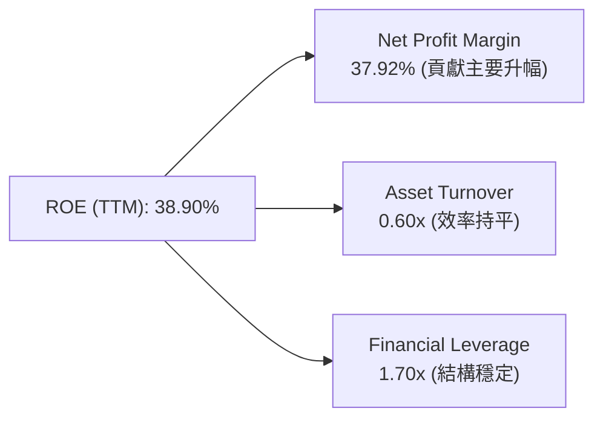

*   **淨利率 (37.92%)**：相較於 FY2022 的 21.20% 大幅攀升，是推動 ROE 增長的最核心力量。然而，如前所述，其中包含非營運收益的扭曲，常態化淨利率約為 30.38%，常態化 ROE 約為 **31.10%**，依然極具競爭力。
*   **資產週轉率 (0.60x)**：因資產端（特別是 PP&E 與長期投資）擴張速度快於營收，週轉率微幅下滑，顯示公司正向「重資產、高資本密度」模式轉型。
*   **權益乘數 (1.70x)**：財務槓桿維持在極低且安全的區間，並未透過過度舉債來美化回報率。

### 6.4 獲利能力驅動結構

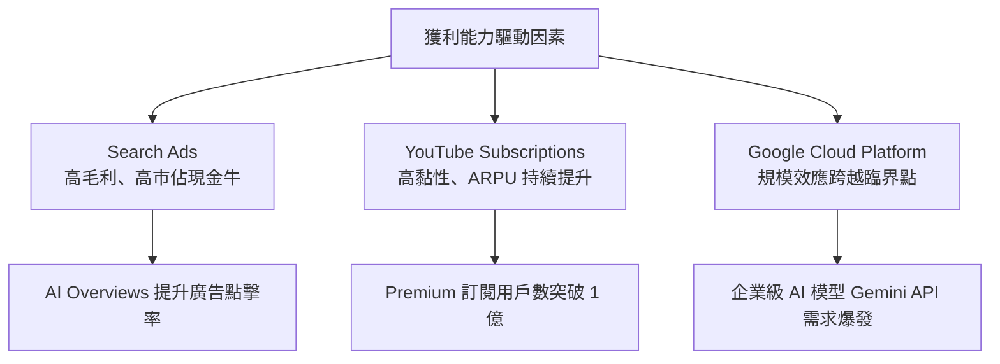

---

## 7. 估值深度分析

對 Alphabet 進行估值時，鑑於其淨利受非營運項目扭曲，且資本支出巨大壓抑了短期 FCF，傳統 Trailing P/E 與單一 FCF Yield 均可能產生偏誤。我們將優先參考 **Forward P/E**、**EV/EBITDA** 與**常態化淨利/常態化 FCF 混合模型**。

### 7.1 同業估值比較表格

| 估值指標 | **Alphabet (GOOG)** | **Microsoft (MSFT)** | **Amazon (AMZN)** | **Meta (META)** | **GOOG 估值評估** |
|---|---|---|---|---|---|
| **Trailing P/E** | 26.38x | 35.80x | 41.20x | 29.50x | 🟢 顯著低於微軟與亞馬遜，具吸引力 |
| **Forward P/E** | **23.63x** | 31.20x | 33.50x | 24.80x | 🟢 估值最為便宜的大型科技股之一 |
| **PEG Ratio** | **1.39** | 2.10 | 1.65 | 1.25 | 🟢 增長溢價非常合理（<1.5） |
| **EV / EBITDA** | **25.80x** | 24.50x | 21.80x | 20.50x | 🟡 考量折舊攤銷後，估值處於合理中值 |
| **P/S Ratio** | 10.00x | 13.50x | 3.10x | 9.20x | 🟡 軟體與廣告業務溢價，低於 MSFT |
| **FCF Yield** | **1.52%** | 2.30% | 3.10% | 3.50% | 🔴 因超額 Capex 導致短期收益率落後同業 |

### 7.2 歷史估值區間分析

```
╔══════════════════════════════════════════════════════════════════╗
║               Alphabet 歷史 5 年 P/E Band 區間                   ║
╠══════════════════════════════════════════════════════════════════╣
║                                                                  ║
║  歷史最高 (High)：  36.0x                                        ║
║  歷史均值 (Mean)：  25.5x                                        ║
║  當前 P/E (TTM)：   26.38x (略高於均值)                          ║
║  當前 Forward P/E： 23.63x (低於均值，安全邊際浮現)               ║
║                                                                  ║
║  20x                25.5x (均值)      28x                36x     ║
║  |═══════════════════|═════════●════════|══════════════════|     ║
║                               ▲當前位置                          ║
╚══════════════════════════════════════════════════════════════════╝
```

### 7.3 情境目標價（假設驅動，Bear / Base / Bull）

我們基於未來 3 年營收 CAGR、常態化營業利益率與退出倍數，建立三情境估值模型：

| 情境 | 營收 CAGR (3Y) | 營業利益率 | 退出 P/E 倍數 | 隱含目標價 | 相對現價漲跌幅 | 核心假設前提 |
|---|---|---|---|---|---|---|
| 🔴 **悲觀情境** | 8.5% | 28.0% | 18.0x | **$308.00** | 🔴 -11.01% | DOJ 反壟斷訴訟敗訴迫使終止 Apple 預設協議；AI 搜尋嚴重侵蝕廣告營收。 |
| 🟡 **基準情境** | **13.5%** | **33.5%** | **24.0x** | **$427.77** | 🟢 **+23.59%** | 搜尋廣告維持雙位數增長；Cloud 獲利持續釋放；AI 變現按預期推進。 |
| 🟢 **樂觀情境** | 18.0% | 37.0% | 28.0x | **$512.00** | 🟢 +47.93% | Gemini 成為企業端 AI 絕對標準；自主 TPU 降低 30% 算力成本；Waymo 商業化爆發。 |

### 7.4 DCF 敏感性分析（基準目標價：$427.77）

基於永續增長模型（Terminal Growth Rate = 3.0%），我們對 WACC 與終端成長率進行敏感性測試：

| 終端成長率 \ WACC | WACC = 9.0% | **WACC = 10.02% (基準)** | WACC = 11.0% |
|---|---|---|---|
| **3.5%** | $498.50 (+44.0%) | $448.20 (+29.5%) | $405.60 (+17.2%) |
| **3.0% (基準)** | $472.30 (+36.5%) | **$427.77 (+23.59%)** | $388.40 (+12.2%) |
| **2.5%** | $449.10 (+29.8%) | $409.30 (+18.3%) | $373.10 (+7.8%) |

### 7.5 估值綜合區間

```
╔══════════════════════════════════════════════════════════════════╗
║                    Alphabet 估值綜合區間                         ║
╠══════════════════════════════════════════════════════════════════╣
║                                                                  ║
║  當前股價：  $346.12                                             ║
║  悲觀目標價：$308.00 (下行空間 -11.01%)                          ║
║  基準目標價：$427.77 (上行空間 +23.59%)                          ║
║  樂觀目標價：$512.00 (上行空間 +47.93%)                          ║
║                                                                  ║
║  $308                 $346.12          $427.77            $512   ║
║  |═══════════════════════●═════════════════|══════════════════|   ║
║                         ▲當前股價                                ║
╚══════════════════════════════════════════════════════════════════╝
```

---

## 8. 成長催化劑

Alphabet 的未來成長並非依賴單一業務，而是多個高潛力板塊的協同爆發。

### 8.1 催化劑時間軸

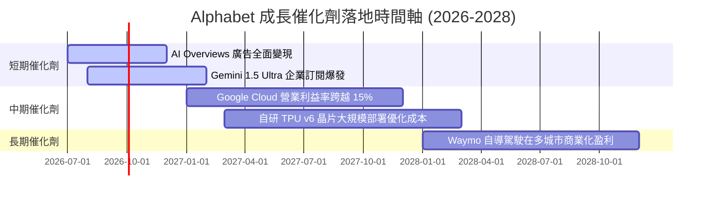

### 8.2 TAM（潛在市場規模）分析

我們估算 Alphabet 核心涉足領域的潛在市場規模及滲透率：

```
╔══════════════════════════════════════════════════════════════════╗
║               Alphabet 核心市場 TAM 與滲透率估算                 ║
╠══════════════════════════════════════════════════════════════════╣
║                                                                  ║
║  數位廣告市場 (Digital Ads)：                                    ║
║  ├── 2028年全球 TAM： $8,500 億                                  ║
║  └── Alphabet 預期份額：~38% (貢獻營收 $3,230 億)                ║
║                                                                  ║
║  雲端運算與 AI 算力 (Cloud & AI Compute)：                       ║
║  ├── 2028年全球 TAM： $12,000 億                                 ║
║  └── Alphabet 預期份額：~12% (貢獻營收 $1,440 億)                ║
║                                                                  ║
║  自動駕駛與 Robotaxi (Waymo)：                                   ║
║  ├── 2030年全球 TAM： $1,500 億                                  ║
║  └── Alphabet 預期份額：~15% (貢獻營收 $225 億)                  ║
║                                                                  ║
╚══════════════════════════════════════════════════════════════════╝
```

### 8.3 成長驅動力結構圖

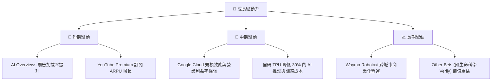

---

## 9. 風險矩陣

評估 Alphabet 的投資價值，必須對其面臨的下行風險進行量化評估。

### 9.1 風險評分矩陣

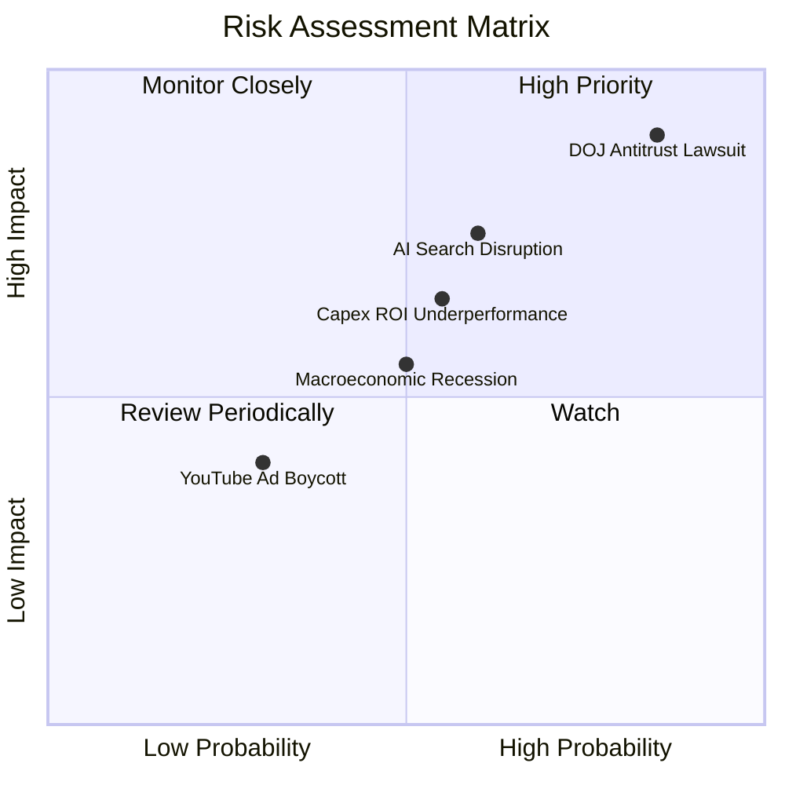

### 9.2 風險清單詳細分析

| # | 風險項目 | 發生機率 | 財務衝擊 | 風險評分 | 緩解措施 / 機構應對方案 |
|---|---|---|---|---|---|
| 1 | 🔴 **DOJ 反壟斷訴訟與分拆風險** | 高 (85%) | 高 (影響搜尋流量 20%) | 🔴 **9.0 / 10** | 法律訴訟將拖延數年；Alphabet 正積極發展硬體生態（Pixel）與直接訂閱模式，降低對 Apple 預設協議的依賴。 |
| 2 | 🟡 **AI 對話搜尋侵蝕廣告流量** | 中 (60%) | 中 (影響廣告營收 10%) | 🟡 **7.5 / 10** | 推出 AI Overviews 搶佔對話式搜尋市場，並逐步引入生成式廣告格式以維持變現率。 |
| 3 | 🟡 **AI 資本支出回報率（ROI）低於預期** | 中 (55%) | 中 (壓抑 FCF 與利潤率) | 🟡 **6.5 / 10** | 透過自研 TPU（相較購買 NVIDIA 晶片可節省大量成本）優化基礎設施支出，並對非核心業務（Other Bets）進行預算裁剪。 |
| 4 | 🟢 **宏觀經濟衰退壓抑廣告預算** | 中 (50%) | 低 (短期波動) | 🟢 **5.0 / 10** | 廣告主在衰退期更傾向於將預算集中在 ROI 明確的 Google 搜尋與 YouTube，展現防禦屬性。 |

---

## 10. 投資建議

基於對 Alphabet 基本面、獲利品質與估值的深度剖析，我們認為 **GOOG 當前股價（$346.12）提供了極佳的長線佈局機會**。儘管 Q1 2026 的淨利受非營業利益扭曲，且高額 Capex 壓抑了短期 FCF，但其核心業務的常態化盈利能力與資本配置效率（ROIC 29.6%）依然是美股科技巨頭中的佼佼者。

### 10.1 最終綜合評級

```
╔══════════════════════════════════════════════════════════════╗
║               GOOG 最終綜合評級雷達圖 (1-10分)               ║
╠══════════════════════════════════════════════════════════════╣
║ 業務基本面強度：    9.0  ▓▓▓▓▓▓▓▓▓▓▓▓▓▓▓▓▓▓░░  ★★★★★         ║
║ 財務健康安全度：    9.5  ▓▓▓▓▓▓▓▓▓▓▓▓▓▓▓▓▓▓▓░  ★★★★★         ║
║ 長期成長潛力：      8.5  ▓▓▓▓▓▓▓▓▓▓▓▓▓▓▓▓▓░░░  ★★★★☆         ║
║ 估值安全邊際：      7.5  ▓▓▓▓▓▓▓▓▓▓▓▓▓▓▓░░░░░  ★★★★☆         ║
║ 護城河與壁壘度：    9.2  ▓▓▓▓▓▓▓▓▓▓▓▓▓▓▓▓▓▓▓░  ★★★★★         ║
╠══════════════════════════════════════════════════════════════╣
║ 綜合推薦評級：      8.5  ▓▓▓▓▓▓▓▓▓▓▓▓▓▓▓▓▓░░░  🏆 強烈買入   ║
╚══════════════════════════════════════════════════════════════╝
```

### 10.2 目標價與隱含報酬率

| 情境 | 機率權重 | 目標價 | 隱含報酬率 | 期望值貢獻 |
|---|---|---|---|---|
| **樂觀情境 (Bull)** | 25% | $512.00 | +47.93% | $128.00 |
| **基準情境 (Base)** | **60%** | **$427.77** | **+23.59%** | **$256.66** |
| **悲觀情境 (Bear)** | 15% | $308.00 | -11.01% | $46.20 |
| **加權期望目標價** | **100%** | **$430.86** | **+24.48%** | **評級：🟢 買入** |

### 10.3 買入時機與觸發因素

```
╔══════════════════════════════════════════════════════════════════╗
║                    ✅ GOOG 投資行動指南                          ║
╠══════════════════════════════════════════════════════════════════╣
║                                                                  ║
║  立即建倉觸發條件 (滿足以下多數即可)：                            ║
║  ✅ 當前股價低於 $350 (Forward P/E < 24x)，具備充足安全邊際。     ║
║  ✅ 核心 Google Cloud 營收成長率維持在 25% 以上，且利潤率持續改善。║
║  ✅ 搜尋廣告營收 YoY 增速不低於 12%，確認核心業務未受 AI 侵蝕。    ║
║                                                                  ║
║  加碼觸發條件：                                                  ║
║  ☐ 股價因 DOJ 訴訟中途判決出現非理性回檔至 $310-$320 區間。      ║
║  ☐ 公司宣佈自研 TPU v6 晶片全面替代 NVIDIA H200/B200，Capex 下滑。 ║
║                                                                  ║
║  減碼 / 停損觸發條件：                                           ║
║  ☐ 司法部反壟斷判決強制拆分 Google Chrome 或 Android 系統。      ║
║  ☐ 搜尋引擎全球市佔率跌破 85%，或 Cloud 營收增長跌破 15%。       ║
║                                                                  ║
╚══════════════════════════════════════════════════════════════════╝
```

### 10.4 投資人適配度分析

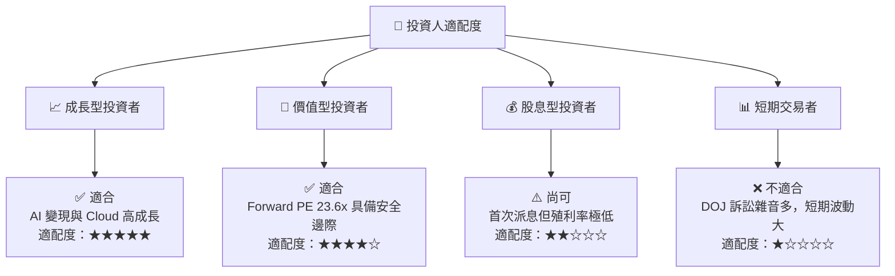

### 10.5 每季財報監控清單（Quarterly Watch List）

機構投資者在未來的季度財報中，應重點監控以下指標，以驗證投資論點：

| 監控指標 | 基準安全線 | 觸發「加碼」門檻 | 觸發「減碼」門檻 | 監控核心意義 |
|---|---|---|---|---|
| **Google Cloud YoY 增速** | 22.0% | 🟢 > 28.0% | 🔴 < 18.0% | 驗證雲端與 AI 算力變現的第二曲線動能。 |
| **Google Cloud 營業利益率** | 10.0% | 🟢 > 15.0% | 🔴 < 5.0% | 驗證該業務的規模效應與獲利釋放進度。 |
| **搜尋與其他廣告 YoY 增速** | 10.0% | 🟢 > 15.0% | 🔴 < 8.0% | 觀察 AI 搜尋對傳統廣告市佔率的實質侵蝕程度。 |
| **季度資本支出 (Capex)** | < $300 億 | 🟢 < $250 億 (效率提升) | 🔴 > $400 億 (無節制擴張) | 評估 AI 基礎設施投資對 FCF 的壓抑程度與資本回報率。 |
| **常態化 FCF 轉換率** | > 60.0% | 🟢 > 80.0% | 🔴 < 40.0% (非一次性) | 監控真實經營現金流轉化為股東可分配價值的效率。 |

### 10.6 反面論證：什麼會證明投資論點錯誤（What Would Change My Mind）

```
╔══════════════════════════════════════════════════════════════════╗
║              ⚠️ 論點失效條件 (Disconfirming Evidence)            ║
╠══════════════════════════════════════════════════════════════════╣
║  若發生以下可量化條件，本投資報告之「買入」評級應立即予以撤銷：   ║
║                                                                  ║
║  ☐ 核心搜尋廣告營收連續兩季 YoY 成長率 < 6.0% (確認流量流失)。    ║
║  ☐ Google Cloud 營業利益率連續兩季下滑，跌破 5.0% (競爭加劇)。    ║
║  ☐ 資本支出 (Capex) 持續攀升，但營收 YoY 增速卻跌破 10.0%        ║
║     (確認 AI 投資回報率 ROI 失敗，折舊將嚴重侵蝕利潤率)。          ║
║  ☐ ROIC 跌破 15.0%，或經濟增值 (EVA) 轉為負值。                  ║
║  ☐ DOJ 最終判決強制分拆 Alphabet (分拆溢價除外，需重新評估)。    ║
║                                                                  ║
╚══════════════════════════════════════════════════════════════════╝
```

---

> **免責聲明**：本報告僅供研究參考，不構成任何投資建議。投資有風險，入市需謹慎。