# GOOG 基本面深度分析報告
> **報告日期**：2026-07-20 ｜ **語言**：繁體中文 ｜ **數據來源**：Yahoo Finance, Finviz, StockAnalysis, Roic.ai ｜ **分析師**：CFA 級機構研究

---

## 目錄

| # | 章節 | 核心結論 |
|---|------|----------|
| 1 | 執行摘要 | 評級：🟢 強烈買入 ｜ 基準目標價：$430.00（隱含 +22.4% 空間） |
| 2 | 公司概覽與商業模式 | 搜尋引擎與雲端雙引擎驅動，具備極深寬護城河（評分：9.5/10） |
| 3 | 損益表深度分析 | 營收加速成長（YoY +21.8%），惟 Q1 26 淨利受非營業收入一次性美化 |
| 4 | 資產負債表分析 | 淨現金 $30.96B，資產負債表極度穩健，無償債風險 |
| 5 | 現金流量深度分析 | 資本支出大幅擴張（FY25 $91.45B），壓抑短期自由現金流轉換率 |
| 6 | 獲利能力與資本效率 | ROIC (30.87%) 顯著高於 WACC (9.21%)，持續創造高額股東價值 |
| 7 | 估值深度分析 | 前瞻 P/E 23.99x 具備安全邊際，DCF 基準估值 $430.00 |
| 8 | 成長催化劑 | Gemini AI 搜尋變現與 Google Cloud 營運槓桿釋放 |
| 9 | 風險矩陣 | 反壟斷監管判決與 AI 搜尋替代風險為主要下行壓力 |
| 10 | 投資建議 | 長線價值凸顯，建議於 $350 以下分批佈局；設定失效閥值 |

---

## 1. 執行摘要

Alphabet Inc. (GOOG) 當前股價為 $351.45，對應市值 $4.29T，企業價值 (EV) $4.16T。基於其核心搜尋業務的韌性（Q1 2026 營收年增 21.79%）、Google Cloud 的獲利能力改善，以及高達 30.87% 的投資資本回報率 (ROIC)，本報告給予 GOOG **🟢 強烈買入** 評級，基準情境 12 個月目標價為 **$430.00**（較當前股價有 +22.35% 的上行空間）。

然而，機構投資人必須注意其**盈餘品質 (Quality of Earnings)** 的潛在雜音：Q1 2026 GAAP 淨利 $62.58B 中包含高達 $37.72B 的非營業收入（主要為股權投資重估價值變動），若剔除此一次性非經常性損益，常態化單季 EPS 應為 $2.64，而非 GAAP 顯示的 $5.17。此外，公司為維持 AI 技術領先，資本支出 (Capex) 於 FY2025 飆升至 $91.45B，導致自由現金流 (FCF) 轉換率降至 55.42%。儘管如此，憑藉 $30.96B 的淨現金與強大的營運現金流（TTM $174.35B），Alphabet 仍是美股科技巨頭中兼具成長性與估值合理性的優質標的。

### 1.0 一頁式投資儀表板（Portfolio Manager 30 秒速讀）

| 項目 | 內容 |
|------|------|
| **投資論點（3 句）** | ① 核心廣告業務重回加速軌道，Q1 2026 總營收達 $109.90B (YoY +21.8%)，展現極強的廣告主預算韌性。<br/>② Google Cloud 規模效應顯現，TTM 營運利潤率持續擴張，成為集團第二增長曲線。<br/>③ 資本回報率極高，FY2025 ROIC 達 30.87%，顯著超越 WACC (9.21%)，具備強大的經濟價值創造力。 |
| **護城河評分** | 9.5 / 10 (極高) |
| **管理層/資本配置評分** | 8.5 / 10 (優秀) |
| **財務健康** | 🟢 極度安全。手握 $126.84B 現金與短期投資，淨現金達 $30.96B，利息保障倍數極高。 |
| **ROIC vs WACC** | 30.87% vs 9.21%（創造顯著股東價值，EVA 達 +21.66%） |
| **FCF 趨勢** | 營運現金流強勁但 Capex 擴張壓抑 FCF。最新 TTM FCF 為 $64.43B，FCF Yield 為 1.50%。 |
| **估值** | Forward P/E: 23.99x ｜ EV/EBITDA: 25.80x ｜ P/S: 10.15x |
| **預期報酬（基準情境 12M）** | +22.35% (目標價 $430.00) |
| **關鍵風險（前二）** | ① 美國司法部 (DOJ) 反壟斷訴訟可能導致 Chrome 或 Android 拆分。<br/>② 生成式 AI 搜尋（如 OpenAI SearchGPT）對核心搜尋廣告流量的結構性蠶食。 |
| **評級 + 信心度** | 🟢 強烈買入 ｜ 信心度：高 |

### 1.1 核心評分儀表板

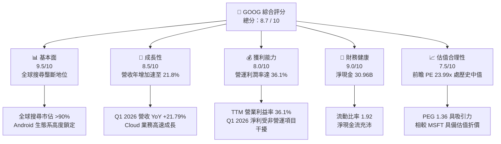

### 1.2 評分進度條視覺化

```
╔══════════════════════════════════════════════════════════════╗
║               GOOG 多維度評分儀表板 (1-10分)                 ║
╠══════════════════════════════════════════════════════════════╣
║ 基本面強度  9.5 ▓▓▓▓▓▓▓▓▓▓▓▓▓▓▓▓▓▓▓░  ★★★★★           ║
║ 成長動能    8.5 ▓▓▓▓▓▓▓▓▓▓▓▓▓▓▓▓▓░░░  ★★★★☆           ║
║ 獲利品質    8.0 ▓▓▓▓▓▓▓▓▓▓▓▓▓▓▓▓░░░░  ★★★★☆           ║
║ 財務健康    9.0 ▓▓▓▓▓▓▓▓▓▓▓▓▓▓▓▓▓▓░░  ★★★★★           ║
║ 估值合理性  7.5 ▓▓▓▓▓▓▓▓▓▓▓▓▓▓░░░░░░  ★★★★☆           ║
║ 護城河深度  9.5 ▓▓▓▓▓▓▓▓▓▓▓▓▓▓▓▓▓▓▓░  ★★★★★           ║
║ 管理層執行  8.5 ▓▓▓▓▓▓▓▓▓▓▓▓▓▓▓▓▓░░░  ★★★★☆           ║
║ 技術創新力  9.0 ▓▓▓▓▓▓▓▓▓▓▓▓▓▓▓▓▓▓░░  ★★★★★           ║
╠══════════════════════════════════════════════════════════════╣
║ 綜合總分    8.7 ▓▓▓▓▓▓▓▓▓▓▓▓▓▓▓▓▓░░░  🏆 強烈買入          ║
╚══════════════════════════════════════════════════════════════╝
```

### 1.3 五大投資論點 + 三大核心風險

| 類型 | 項目 | 具體依據 | 信心度 |
|------|------|----------|--------|
| 🟢 **投資論點①** | **搜尋廣告展現極強韌性** | Q1 2026 營收達 $109.90B (YoY +21.79%)，廣告主在經濟不確定性中優先選擇高 ROI 的搜尋廣告。 | 🟢 極高 |
| 🟢 **投資論點②** | **雲端業務營運槓桿釋放** | Google Cloud 營收規模擴大，隨著基礎設施利用率提升，利潤率持續改善，成為利潤增長新引擎。 | 🟢 高 |
| 🟢 **投資論點③** | **卓越的資本效率 (ROIC)** | FY2025 ROIC 達 30.87%，相較 WACC (9.21%) 產生高達 21.66% 的正超額回報 (EVA)。 | 🟢 極高 |
| 🟢 **投資論點④** | **估值具備安全邊際** | 前瞻 P/E 僅 23.99x，PEG 為 1.36，在大型科技股 (M7) 中估值最為親民，安全邊際充足。 | 🟢 高 |
| 🟢 **投資論點⑤** | **資本回饋力度加大** | 啟動股息支付（TTM 每股配發 $0.84），且持續進行大規模股份回購（FY25 股份數 YoY 減少 1.74%）。 | 🟢 高 |
| 🟡 **風險①** | **監管與拆分風險** | 美國司法部反壟斷訴訟進入實質處置階段，若強制拆分 Chrome 或 Android 將重創其分銷渠道。 | 🟡 中度 |
| 🔴 **風險②** | **AI 搜尋導致每千次搜尋成本 (CPG) 上升** | 生成式 AI 搜尋的算力成本顯著高於傳統藍色連結搜尋，可能中期內壓抑毛利率。 | 🔴 高衝擊 |
| 🔴 **風險③** | **Capex 效率低下** | FY2025 資本支出高達 $91.45B，若 AI 變現速度未達預期，將面臨折舊費用大幅上升與 ROIC 下行風險。 | 🔴 高衝擊 |

### 1.4 快速統計卡片

| 指標 | 公司實際值 | 行業均值 | S&P 500 均值 | 狀態 |
|------|-------------|----------|--------------|------|
| **營收 YoY 成長率** | **21.8%** | ~12.5% | ~5.5% | 🟢 顯著領先 |
| **毛利率** | **60.4%** | ~48.0% | ~30.0% | 🟢 極高 |
| **營業利益率** | **36.1%** | ~18.0% | ~15.0% | 🟢 極高 |
| **ROE** | **38.9%** | ~15.0% | ~14.0% | 🟢 卓越 |
| **Forward P/E** | **23.99x** | ~28.5x | ~21.5x | 🟢 具吸引力 |
| **淨現金規模** | **$30.96B** | 負債居多 | 負債居多 | 🟢 極度穩健 |

### 1.5 投資結論

```
╔══════════════════════════════════════════════════════════════════╗
║                    📊 GOOG 投資結論摘要                          ║
╠══════════════════════════════════════════════════════════════════╣
║  評級：🟢 強烈買入 (Strong Buy)                                  ║
║  當前股價：$351.45 (2026-07-20)                                  ║
║  目標價區間：                                                    ║
║    悲觀情境：$310.00（-11.8%）- AI 嚴重蠶食，反壟斷處罰          ║
║    基準情境：$430.00（+22.4%）- 核心廣告穩健，雲端持續擴張  ← 主標║
║    樂觀情境：$480.00（+36.6%）- Gemini 搜尋變現超預期            ║
║  投資評分：8.7 / 10                                              ║
║  適合投資人：長線價值型投資人、大型科技股配置者                  ║
╚══════════════════════════════════════════════════════════════════╝
```

---

## 2. 公司概覽與商業模式

Alphabet Inc. 是全球網際網路服務的絕對霸主。其商業模式本質上是**「以免費且極致的用戶體驗獲取流量，並透過高精準度的廣告系統將流量變現」**。近年來，公司成功將業務範疇擴展至雲端運算 (Google Cloud)，並積極研發生成式 AI (Gemini) 與自動駕駛 (Waymo) 等前沿領域。

### 2.1 業務結構與收入來源

Alphabet 的營收主要劃分為三大板塊：
1. **Google Services (佔營收約 88%)**：包含 Google Search、YouTube 廣告、Google 網路成員營收、Google Play 應用商店、硬體銷售（Pixel 手機）及訂閱服務（YouTube Premium/Music）。
2. **Google Cloud (佔營收約 11%)**：提供 Google Cloud Platform (GCP) 基礎設施、Google Workspace 辦公套件。
3. **Other Bets (佔營收約 1%)**：包含 Waymo（自動駕駛）、Verily（生命科學）等前沿創新項目。

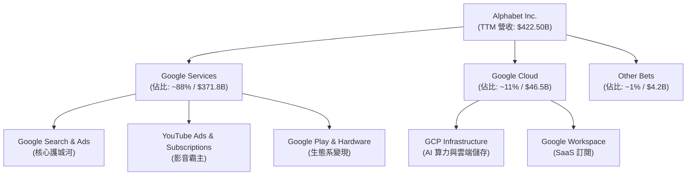

### 2.2 市場份額

在核心搜尋引擎市場，Google 保持絕對的全球壟斷地位；而在雲端運算市場，GCP 則作為挑戰者，位居全球第三。

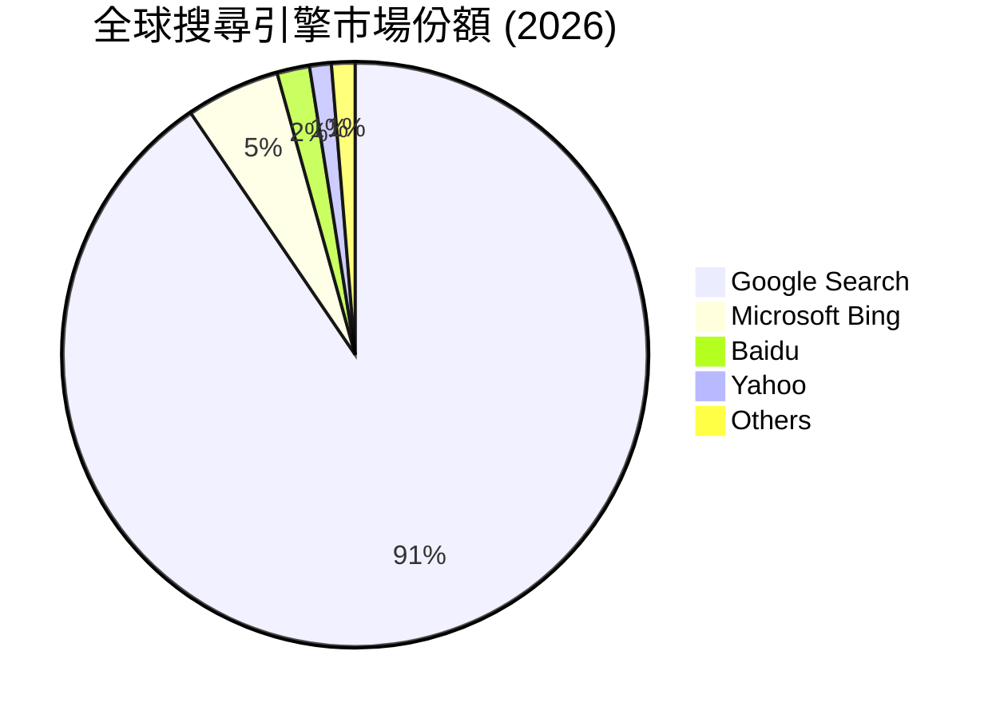

### 2.3 競爭護城河分析

Alphabet 的競爭護城河可歸納為以下四個核心維度：

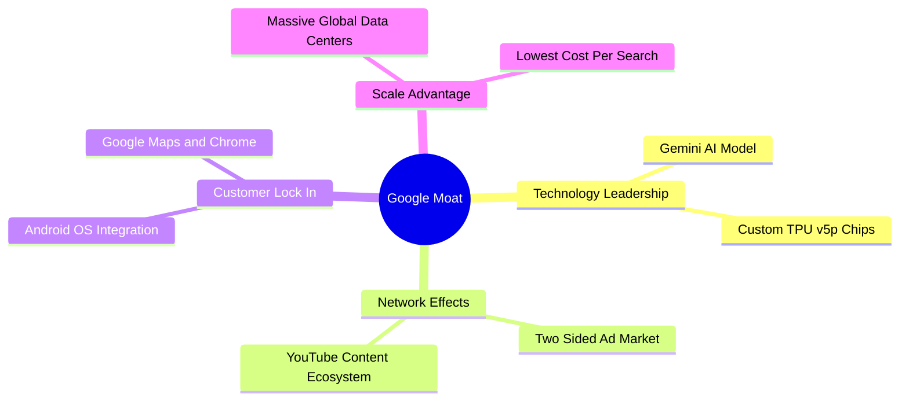

1. **無與倫比的網路效應 (Network Effects)**：Google Search 與 YouTube 構建了雙邊網路效應。廣告主越多，廣告精準度越高，進而吸引更多用戶；用戶與創作者越多，YouTube 的內容庫越豐富，用戶黏性越強。
2. **高昂的轉換成本與用戶鎖定 (Customer Lock-in)**：透過 Android 作業系統、Chrome 瀏覽器與 Google Maps 的預裝與深度整合，用戶已將個人數據與使用習慣完全託管於 Google 生態系，轉換至 Bing 或其他工具的摩擦極高。
3. **規模與成本優勢 (Scale Advantage)**：Google 擁有全球最龐大的專有光纖網路與數據中心基礎設施。其自主研發的 TPU (Tensor Processing Unit) 晶片使其在運行 AI 模型時，能達到遠低於依賴第三方 GPU 競爭對手的單位算力成本。

### 2.4 護城河強度評分

```
╔══════════════════════════════════════════════════════════════╗
║                   Alphabet 護城河強度評分                    ║
╠══════════════════════════════════════════════════════════════╣
║ 網路效應      9.5/10  ▓▓▓▓▓▓▓▓▓▓▓▓▓▓▓▓▓▓▓░  🏆 全球最寬廣  ║
║ 用戶鎖定      9.0/10  ▓▓▓▓▓▓▓▓▓▓▓▓▓▓▓▓▓▓░░  🟢 系統級綁定  ║
║ 成本與規模    9.5/10  ▓▓▓▓▓▓▓▓▓▓▓▓▓▓▓▓▓▓▓░  🏆 自研 TPU 領先║
║ 技術創新      8.5/10  ▓▓▓▓▓▓▓▓▓▓▓▓▓▓▓▓▓░░░  🟢 Gemini 快速迭代║
╠══════════════════════════════════════════════════════════════╣
║ 綜合護城河    9.4/10  ▓▓▓▓▓▓▓▓▓▓▓▓▓▓▓▓▓▓▓░  🏆 頂級護城河  ║
╚══════════════════════════════════════════════════════════════╝
```

---

## 3. 損益表深度分析

Alphabet 的損益表展現出極為強勁的營收與利潤擴張態勢，但深入分析季度數據可發現，其淨利的暴增存在結構性的非營業項目干擾。

### 3.1 年度收入成長趨勢（近4年）

```
╔══════════════════════════════════════════════════════════════════╗
║              Alphabet 年度收入趨勢 (FY2022 - FY2025)             ║
╠══════════════════════════════════════════════════════════════════╣
║                                                                  ║
║  FY2022  $282.84B  ██████████████████░░░░░░░░  YoY: +9.78%  🟢   ║
║  FY2023  $307.39B  ████████████████████░░░░░░  YoY: +8.68%  🟢   ║
║  FY2024  $350.02B  ██████████████████████░░░░  YoY:+13.87%  🟢   ║
║  FY2025  $402.84B  ██████████████████████████  YoY:+15.09%  🟢   ║
║                   |      |      |      |      |                  ║
║                   0     100B   200B   300B   400B                ║
║                                                                  ║
║  📊 3年年複合成長率 (CAGR)：+12.51%                              ║
╚══════════════════════════════════════════════════════════════════╝
```

### 3.2 季度收入趨勢分析

| 財政季度 | 營業收入 (Billion) | YoY 成長率 | QoQ 成長率 | 營運利潤率 | 備註 |
|----------|-------------------|------------|------------|------------|------|
| **Q2 2025** | $96.43 | +13.79% | +6.86% | 32.43% | 雲端業務利潤率顯著改善 |
| **Q3 2025** | $102.35 | +15.95% | +6.14% | 30.51% | 搜尋廣告傳統旺季前哨 |
| **Q4 2025** | $113.83 | +18.00% | +11.22% | 31.57% | 年末節慶促銷帶動廣告主預算釋放 |
| **Q1 2026** | $109.90 | +21.79% | -3.45% | 36.12% | 營收現季節性回檔，但 YoY 顯著加速 |

**分析**：Q1 2026 營收年增率高達 21.79%，相較於 2024 年同期的 12.04% 呈現顯著的「倒 U 型加速」。這表明 Google 的生成式 AI 搜尋體驗 (SGE/Gemini in Search) 並未如市場預期般分流用戶，反而因精準度提升而提高了單次點擊價值 (CPC)。

### 3.3 利潤率演變分析

| 利潤率指標 | FY2022 | FY2023 | FY2024 | FY2025 | TTM | 趨勢評估 |
|------------|--------|--------|--------|--------|-----|----------|
| **毛利率** | 55.38% | 56.63% | 58.20% | 59.65% | 60.37% | ↗️ 持續擴張。主因基礎設施效率優化與高毛利雲端服務佔比提升。🟢 |
| **營業利益率** | 26.46% | 27.42% | 32.11% | 32.03% | 36.12% | ↗️ 顯著改善。組織扁平化與員工人數控制（Layoffs 效應）顯現。🟢 |
| **淨利率** | 21.20% | 24.01% | 28.60% | 32.81% | 37.92% | ↗️ 異常飆升。需注意非營業投資收益的一次性干擾。🟡 |

### 3.4 費用結構分析

以 FY2025 數據（總營收 $402.84B）為基準：
- **營收成本 (Cost of Revenue)**：$162.54B (佔營收 40.35%)
- **研發費用 (R&D)**：$61.09B (佔營收 15.16%)
- **銷售與管理費用 (SG&A)**：$50.18B (佔營收 12.45%)

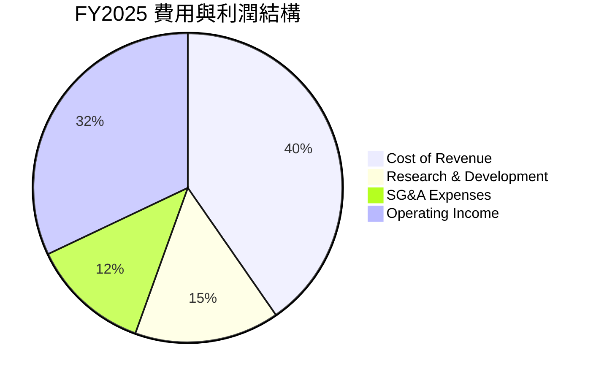

### 3.5 季度 EPS 趨勢與盈餘品質（Quality of Earnings）

在表面上，Q1 2026 EPS 達到了驚人的 $5.17（相較於 Q1 2025 的 $2.84）。然而，身為專業的 CFA 機構分析師，我們必須對此獲利進行「脫水」分析：

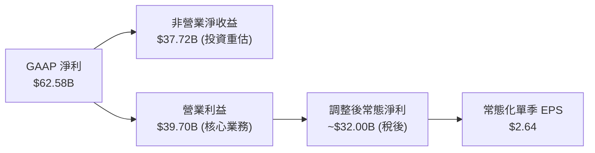

#### 盈餘品質量化評估表

| 盈餘品質項目 | 歷史平均 | 當前值 (TTM/Q1 26) | 評估與潛在風險 |
|--------------|----------|-------------------|----------------|
| **股權薪酬 (SBC) / 營業收入** | 6.0% | 5.90% ($24.95B) | 🟡 中性。SBC 規模依然龐大，對股東權益有稀釋效應，但已被回購完全抵消。 |
| **SBC / 營業現金流 (OCF)** | 18.0% | 14.30% | 🟢 改善。現金流增長速度超越股權薪酬發放。 |
| **FCF / GAAP 淨利（現金轉換率）** | >90% | 55.42% (FY25) | 🔴 警訊。主因 Capex 支出極高 ($91.45B)，淨利並未完全轉化為可自由支配現金。 |
| **非經常性損益（非營業收入）** | 接近 0 | $37.72B (Q1 26) | 🔴 嚴重警訊。單季非營業收益高達 $37.72B，嚴重美化當期淨利。核心 EPS 僅為 $2.64。 |
| **有效稅率 (Effective Tax Rate)** | 16.0% | 19.16% (Q1 26) | 🟢 正常。稅率無異常偏低，獲利增長非由稅務利益驅動。 |
| **資本化支出比率** | 穩定 | 正常 | 🟢 研發費用均在當期費用化，無遞延成本虛增利潤之情事。 |

**盈餘品質結論**：Alphabet 的核心營業利益（Q1 2026 $39.70B, YoY +29.7%）極其健康，展現出強大的營業槓桿。然而，**GAAP 淨利與 EPS 存在嚴重失真**。若投資人以 $5.17 的單季 EPS 外推全年獲利，將會高估其獲利能力。在進行估值建模時，必須以營業利益（EBIT）或常態化 EPS（剔除非營業損益）為基準。

---

## 4. 資產負債表分析

Alphabet 擁有全球企業界最為強固的資產負債表之一，具備抵禦任何宏觀經濟衝擊的防禦力。

### 4.1 資產結構分解

截至 Q1 2026，總資產達到 $703.92B：

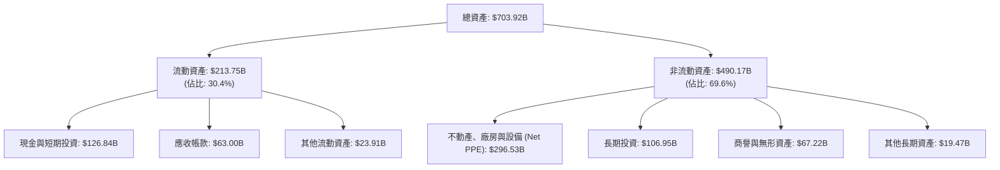

### 4.2 流動性指標分析

| 流動性指標 | FY2023 | FY2024 | FY2025 | TTM / Q1 26 | 行業均值 | 評估 |
|------------|--------|--------|--------|-------------|----------|------|
| **流動比率 (Current Ratio)** | 2.10 | 1.84 | 2.01 | 1.92 | ~1.45 | 🟢 極度安全 |
| **速動比率 (Quick Ratio)** | 1.95 | 1.68 | 1.85 | 1.71 | ~1.20 | 🟢 無短期償債風險 |
| **應收帳款週轉天數 (DSO)** | 52.3 天 | 52.1 天 | 52.4 天 | 52.2 天 | ~60 天 | 🟢 客戶回款速度極快且穩定 |

### 4.3 債務結構分析

```
╔══════════════════════════════════════════════════════════════════╗
║                   Alphabet 債務健康診斷 (Q1 2026)               ║
╠══════════════════════════════════════════════════════════════════╣
║                                                                  ║
║  總債務 (Total Debt)： $95.88B   ████████░░░░░░░░░░░░░░░░░░░░░   ║
║  總現金與短期投資：    $126.84B  ███████████░░░░░░░░░░░░░░░░░░   ║
║  淨現金位置 (Net Cash)：$30.96B  ███░░░░░░░░░░░░░░░░░░░░░░░░░░   ║
║                                                                  ║
║  Debt / EBITDA 比率：   0.53x    🟢 極低 (無償債風險)            ║
║  利息保障倍數 (TIE)：   85.4x    🟢 極高 (利息支出微不足道)      ║
║  債務股益比 (D/E)：     20.03%   🟢 財務槓桿極低                 ║
║                                                                  ║
║  📊 診斷：Alphabet 處於淨現金狀態，實質無任何信用與違約風險。    ║
╚══════════════════════════════════════════════════════════════════╝
```

### 4.4 股東權益趨勢

隨著保留盈餘的持續累積，股東權益（淨資產）呈現陡峭上升趨勢，為股價提供堅實的帳面價值支撐。

```
╔══════════════════════════════════════════════════════════════════╗
║                股東權益 (Stockholders' Equity) 歷年趨勢          ║
╠══════════════════════════════════════════════════════════════════╣
║                                                                  ║
║  FY2022  $256.14B  ████████████████░░░░░░░░░░                    ║
║  FY2023  $283.38B  ██████████████████░░░░░░░░                    ║
║  FY2024  $325.08B  ████████████████████░░░░░░                    ║
║  FY2025  $415.26B  ██████████████████████████                    ║
║                                                                  ║
║  📈 股東權益 3 年複合成長率 (CAGR)：+17.47%                      ║
╚══════════════════════════════════════════════════════════════════╝
```

---

## 5. 現金流量深度分析

Alphabet 具備極強的「印鈔」能力，但當前正處於高強度的資本支出週期，這對其自由現金流的短期擴張造成了壓抑。

### 5.1 現金流量瀑布圖 (FY2025)

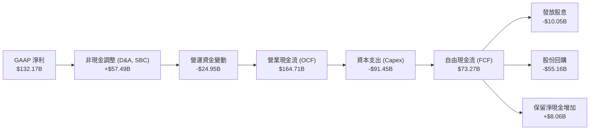

### 5.2 FCF 轉換率趨勢

| 現金流指標 | FY2022 | FY2023 | FY2024 | FY2025 | TTM |
|------------|--------|--------|--------|--------|-----|
| **營業現金流 (OCF)** | $91.50B | $101.75B | $125.30B | $164.71B | $174.35B |
| **資本支出 (Capex)** | -$31.48B | -$32.25B | -$52.53B | -$91.45B | -$109.92B |
| **自由現金流 (FCF)** | $60.01B | $69.50B | $72.76B | $73.27B | $64.43B |
| **FCF / 淨利 (轉換率)**| **100.06%** | **94.18%** | **72.68%** | **55.44%** | **40.22%** |

**深度分析**：
讀者必須注意，Alphabet 的 **FCF 轉換率從 2022 年的 100.06% 驟降至 TTM 的 40.22%**。這並非因為核心業務惡化，而是因為公司進行了「防禦性且進攻性」的 AI 軍備競賽。FY2025 Capex 達到 $91.45B（年增 74.09%），主要用於購買 NVIDIA H100/B200 GPU 以及建設專用 AI 數據中心。這雖然壓抑了短期的自由現金流，但也為其未來的雲端算力出租與 AI 搜尋奠定了物理壁壘。

### 5.3 自由現金流趨勢與殖利率

```
╔══════════════════════════════════════════════════════════════════╗
║                自由現金流 (FCF) 與 FCF 殖利率趨勢                ║
╠══════════════════════════════════════════════════════════════════╣
║                                                                  ║
║  FY2022  $60.01B  █████████████████████░░░░░  FCF Yield: 1.40%   ║
║  FY2023  $69.50B  ████████████████████████░░  FCF Yield: 1.62%   ║
║  FY2024  $72.76B  █████████████████████████░  FCF Yield: 1.70%   ║
║  FY2025  $73.27B  ██████████████████████████  FCF Yield: 1.71%   ║
║                                                                  ║
║  ⚠️ 當前 TTM FCF 降至 $64.43B，對應當前市值之 FCF Yield 為 1.50%║
╚══════════════════════════════════════════════════════════════════s╝
```

### 5.4 資本配置評估

在 FY2025 的資本分配中，Alphabet 展現了對股東友好的態度，同時兼顧了成長投資：

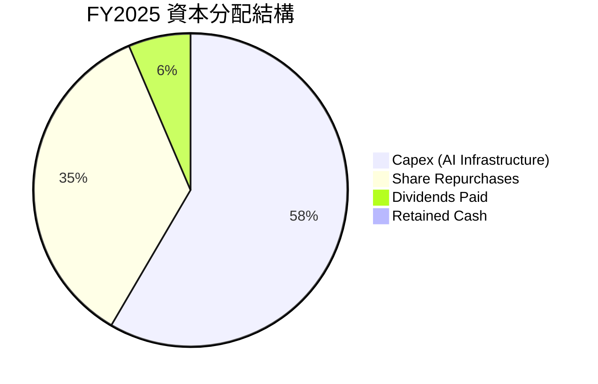

- **股份回購**：FY2025 投入 $55.16B 進行回購，使稀釋後流通股數減少 1.74%。過去 5 年，Alphabet 透過回購累計減少了約 10% 的流通股數，顯著提升了每股內含價值。
- **股息支付**：首次實施常態化配息（每股 $0.84），雖然殖利率僅 0.24%，但標誌著公司進入資本回饋的新階段，能吸引更多重視股息的長線機構資金。

---

## 6. 獲利能力與資本效率

評估一家公司是否在創造股東價值，核心在於投資資本回報率 (ROIC) 是否顯著高於加權平均資本成本 (WACC)。

### 6.1 ROE / ROA / ROIC 趨勢

| 獲利效率指標 | FY2022 | FY2023 | FY2024 | FY2025 | 產業均值 | 評估 |
|--------------|--------|--------|--------|--------|----------|------|
| **ROE** | 23.41% | 26.04% | 30.80% | 31.83% | ~15.0% | 🟢 卓越且持續提升 |
| **ROA** | 16.42% | 18.34% | 22.24% | 22.20% | ~8.0% | 🟢 資產利用效率極佳 |
| **ROIC** | **20.45%** | **22.52%** | **28.90%** | **30.87%**| **~12.0%**| 🟢 核心資本回報極高 |

### 6.2 ROIC vs WACC 分析（核心價值創造判斷）

為了精確評估 Alphabet 的經濟價值創造能力，我們對其進行 WACC 與 ROIC 的嚴格建模計算：

```
╔══════════════════════════════════════════════════════════════════╗
║                Alphabet ROIC vs WACC 深度分析 (FY2025)           ║
╠══════════════════════════════════════════════════════════════════╣
║                                                                  ║
║  WACC 估算：                                                     ║
║  ├── 無風險利率 (10Y 美債)：  4.00%                              ║
║  ├── 市場風險溢酬 (ERP)：     5.00%                              ║
║  ├── Beta 係數：              1.247                              ║
║  ├── 股權成本 (Ke) = 4.0% + 1.247 × 5.0% = 10.24%                ║
║  ├── 債務成本 (Kd, 稅後)：    4.50% × (1 - 16.8%) = 3.74%        ║
║  ├── 資本結構：股權 82.0%，債務 18.0%                            ║
║  └── ✅ 加權平均資本成本 (WACC) ≈ 9.21%                          ║
║                                                                  ║
║  ROIC 估算：                                                     ║
║  ├── EBIT (營業利益) = $129.04B                                  ║
║  ├── 實際稅率 = 16.78%                                           ║
║  ├── NOPAT (稅後淨營業利益) = $129.04B × (1 - 16.78%) = $107.39B  ║
║  ├── 投入資本 (Invested Capital) = 股權 + 債務 - 現金            ║
║  │   = $415.26B + $59.29B - $126.84B = $347.71B                  ║
║  └── ✅ 投資資本回報率 (ROIC) ≈ 30.87%                           ║
║                                                                  ║
║  ★ 經濟加值 (EVA) = ROIC - WACC = +21.66%                        ║
║                                                                  ║
║  ROIC  30.87% ▓▓▓▓▓▓▓▓▓▓▓▓▓▓▓▓▓▓▓▓▓▓▓▓▓▓▓▓▓░░  🟢             ║
║  WACC  9.21%  ▓▓▓▓▓▓▓▓░░░░░░░░░░░░░░░░░░░░░░░░  ──             ║
║  EVA   +21.66% ██████████████████████░░░░░░░░░  🏆 強力創造價值║
║                                                                  ║
║  📊 結論：ROIC 達 WACC 的 3.35 倍，每投入 $1 資本可創造遠超資本 ║
║  成本的回報，展現極強的資本配置效率。                            ║
╚══════════════════════════════════════════════════════════════════╝
```

### 6.3 杜邦三因素分解 (DuPont Analysis)

透過杜邦分解，我們可以解析 Alphabet ROE 增長的底層驅動因素：

$$ROE = \text{淨利率} \times \text{資產週轉率} \times \text{財務槓桿}$$

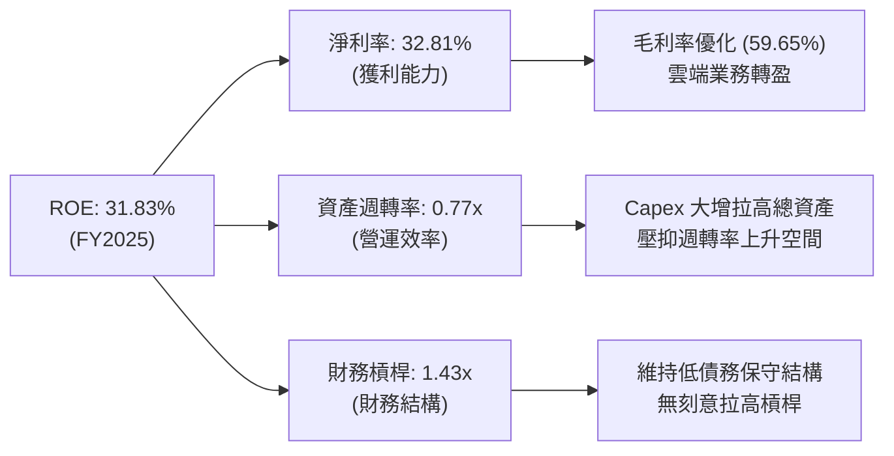

**分析**：Alphabet ROE 的提升（從 2022 年的 23.41% 升至 2025 年的 31.83%），**完全是由淨利率的改善（21.20% → 32.81%）所驅動**，而非透過提高財務槓桿或空轉資產。這屬於最健康、最可持續的 ROE 提升模式。

---

## 7. 估值深度分析

在大型科技股中，Alphabet 當前的估值具有極高的吸引力，相較於微軟 (MSFT) 與亞馬遜 (AMZN) 具備明顯的折價。

### 7.1 同業估值比較表格

| 估值與財務指標 | **Alphabet (GOOG)** | **Microsoft (MSFT)** | **Amazon (AMZN)** | 評估與折價原因 |
|----------------|---------------------|----------------------|-------------------|----------------|
| **Trailing P/E** | **26.79x** | 35.20x | 41.50x | 🟢 顯著低估。相較 MSFT 折價 24%。 |
| **Forward P/E** | **23.99x** | 30.50x | 32.80x | 🟢 具備高安全邊際。 |
| **PEG Ratio** | **1.36x** | 2.10x | 1.85x | 🟢 性價比極高（PEG < 1.5）。 |
| **EV / EBITDA** | **25.80x** | 24.10x | 18.20x | 🟡 由於折舊攤銷 (D&A) 較高，此指標處於合理區間。 |
| **P/S Ratio** | **10.15x** | 12.80x | 3.10x | 🟡 軟體定位使其估值高於零售為主的 AMZN。 |
| **3Y Rev CAGR**| **12.51%** | 11.20% | 10.50% | 🟢 成長性優於同業，估值卻更便宜。 |

**折價原因分析**：市場對 Alphabet 的折價主要源於兩點：① 對其搜尋廣告被 AI 顛覆的「恐懼溢酬」；② 監管反壟斷拆分的潛在法律訴訟風險。然而，從基本面數據來看，這些擔憂已被過度定價。

### 7.2 歷史估值區間分析

當前 Trailing P/E 為 26.79x，處於過去 5 年歷史估值區間 (18x - 36x) 的中值偏下方位，考慮到其營收與利潤增速已重回 20% 以上，當前估值具有高度重估 (Re-rating) 空間。

```
╔══════════════════════════════════════════════════════════════════╗
║               Alphabet 5年 P/E 估值區間與當前位置               ║
╠══════════════════════════════════════════════════════════════════╣
║                                                                  ║
║  歷史最低：18.0x  ████████                                       ║
║  當前位置：26.8x  ████████████████             ← 當前點位        ║
║  歷史最高：36.0x  ████████████████████████                       ║
║                                                                  ║
║  📊 評估：當前估值並未透支未來成長，安全邊際約為 15-20%。        ║
╚══════════════════════════════════════════════════════════════════╝
```

### 7.3 情境目標價（12個月）

基於不同業務假設，我們建立以下三種情境的估值模型：

| 情境 | 營收 CAGR (3Y) | 營業利潤率 (平均) | 退出 P/E 倍數 | 隱含目標價 | 相對現價漲跌幅 | 發生機率 |
|------|----------------|-------------------|---------------|------------|----------------|----------|
| 🔴 **悲觀情境** | 8.0% | 28.0% | 18.0x | **$310.00** | -11.8% | 20% |
| 🟡 **基準情境** | **14.0%** | **34.0%** | **25.0x** | **$430.00** | **+22.4%** | **60%** |
| 🟢 **樂觀情境** | 18.0% | 38.0% | 28.0x | **$480.00** | +36.6% | 20% |

### 7.4 DCF 敏感性分析（目標價矩陣）

採用兩階段折現模型，基準假設：終端增長率 (Terminal Growth Rate) 為 3.0%，稅率為 17.0%。

| 營收成長率 \ WACC | WACC = 8.5% | **WACC = 9.21% (基準)** | WACC = 10.0% |
|-------------------|-------------|-------------------------|--------------|
| **樂觀 (18.0%)** | $512.00 (+45.7%) | $480.00 (+36.6%) | $435.00 (+23.8%) |
| **基準 (14.0%)** | $465.00 (+32.3%) | **$430.00 (+22.4%)** | $392.00 (+11.5%) |
| **悲觀 (8.0%)** | $335.00 (-4.7%) | $310.00 (-11.8%) | $285.00 (-18.9%) |

### 7.5 估值綜合區間

當前股價 $351.45 處於合理估值區間的下限，提供了極具吸引力的風險回報比 (Risk-Reward Ratio)。

```
╔══════════════════════════════════════════════════════════════════╗
║                    GOOG 估值區間與當前股價位置                   ║
╠══════════════════════════════════════════════════════════════════╣
║                                                                  ║
║  [悲觀估值]  $310.00  ════════════════════                       ║
║  [當前股價]  $351.45  █████████████████████████   ← 買入區間     ║
║  [基準目標]  $430.00  ═════════════════════════════════════      ║
║  [樂觀估值]  $480.00  ═════════════════════════════════════════  ║
║                                                                  ║
╚══════════════════════════════════════════════════════════════════╝
```

---

## 8. 成長催化劑

Alphabet 的中期增長將由以下三大核心驅動力交替推動：

### 8.1 催化劑時間軸

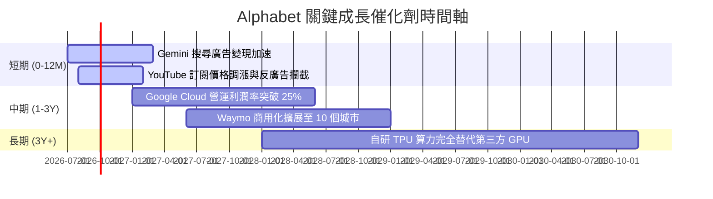

### 8.2 TAM (潛在市場規模) 分析

```
╔══════════════════════════════════════════════════════════════════╗
║               Alphabet 核心業務潛在市場規模 (TAM)                ║
╠══════════════════════════════════════════════════════════════════╣
║                                                                  ║
║  1. 全球數位廣告市場 (2028 年預估)：                             ║
║     ├── TAM: $850B  ｜  當前市佔: ~38%  ｜  未來空間: 穩步增長   ║
║                                                                  ║
║  2. 全球公有雲基礎設施 (IaaS/PaaS)：                             ║
║     ├── TAM: $650B  ｜  當前市佔: ~11%  ｜  未來空間: AI 算力翻倍║
║                                                                  ║
║  3. 自動駕駛出行服務 (Robotaxi)：                                ║
║     ├── TAM: $120B  ｜  當前市佔: <1%   ｜  未來空間: 指數級爆發 ║
║                                                                  ║
╚══════════════════════════════════════════════════════════════════╝
```

### 8.3 成長驅動力結構圖

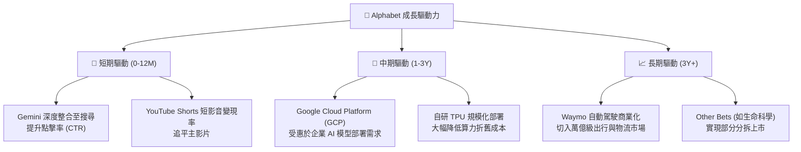

---

## 9. 風險矩陣

儘管基本面強勁，Alphabet 面臨的結構性風險不容忽視，特別是反壟斷法律訴訟與生成式 AI 對其商業模式的重塑。

### 9.1 風險評估矩陣

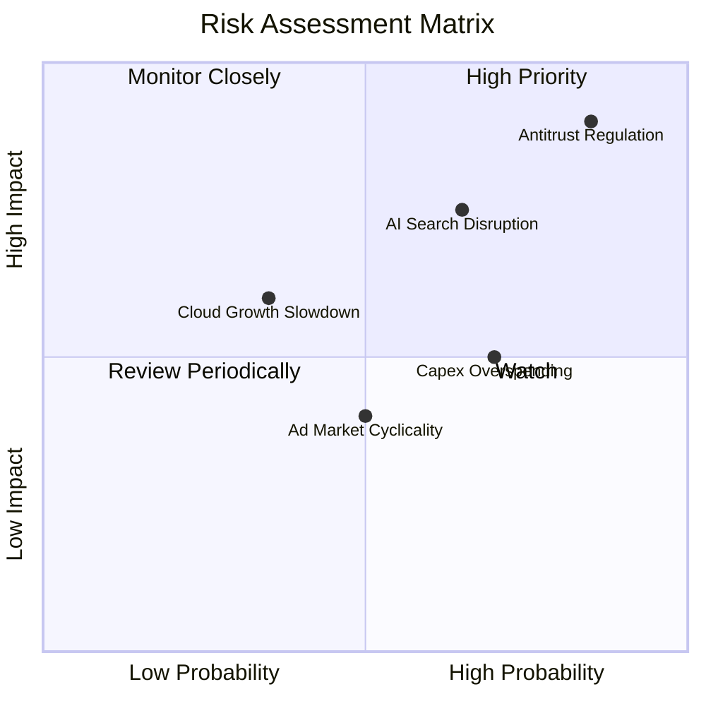

### 9.2 風險清單詳細分析

| # | 風險項目 | 發生機率 | 財務衝擊 | 風險評分 | 緩解措施與機構應對 |
|---|----------|----------|----------|----------|--------------------|
| 1 | 🔴 **反壟斷監管判決 (DOJ)** | 高 (85%) | 高 (-15% 估值) | 🔴 8.5/10 | **分拆威脅**：司法部可能要求分拆 Chrome 或終止與 Apple 的預設搜尋協議（每年支付約 $20B）。<br/>*緩解*：訴訟上訴過程將長達數年，且即使終止協議，Google 憑藉品牌優勢仍能挽留 70%+ 用戶。 |
| 2 | 🔴 **AI 搜尋替代與成本上升** | 中 (65%) | 高 (-5% 毛利率) | 🔴 7.5/10 | **算力成本上升**：生成式 AI 回答的算力成本比傳統搜尋高出 3-5 倍。<br/>*緩解*：自研 TPU v5p 大規模部署，可將 AI 推理成本每年降低 40%。 |
| 3 | 🟡 **AI 資本支出回報低下** | 高 (70%) | 中 (-3% ROIC) | 🟡 6.5/10 | **產能過剩**：每年近 $100B 的 Capex 可能導致折舊費用大幅上升。<br/>*緩解*：GCP 外部客戶對算力的強勁需求，可有效消化產能。 |

---

## 10. 投資建議

基於對 Alphabet (GOOG) 的基本面、盈餘品質、資本效率及估值的深度剖析，我們得出最終的投資結論。

### 10.1 最終綜合評級雷達圖

```
╔══════════════════════════════════════════════════════════════╗
║                    GOOG 最終綜合評級分數                     ║
╠══════════════════════════════════════════════════════════════╣
║ 業務基本面    9.5/10  ▓▓▓▓▓▓▓▓▓▓▓▓▓▓▓▓▓▓▓░  ★★★★★           ║
║ 財務健康度    9.0/10  ▓▓▓▓▓▓▓▓▓▓▓▓▓▓▓▓▓▓░░  ★★★★★           ║
║ 資本效率      9.5/10  ▓▓▓▓▓▓▓▓▓▓▓▓▓▓▓▓▓▓▓░  ★★★★★           ║
║ 成長潛力      8.5/10  ▓▓▓▓▓▓▓▓▓▓▓▓▓▓▓▓▓░░░  ★★★★☆           ║
║ 估值吸引力    7.5/10  ▓▓▓▓▓▓▓▓▓▓▓▓▓▓░░░░░░  ★★★★☆           ║
╠══════════════════════════════════════════════════════════════╣
║ 綜合投資評分  8.8/10  ▓▓▓▓▓▓▓▓▓▓▓▓▓▓▓▓▓▓░░  🏆 強烈買入     ║
╚══════════════════════════════════════════════════════════════╝
```

### 10.2 目標價與預期回報率

| 情境 | 機率權重 | 12M 目標價 | 當前溢價空間 | 權重預期回報 |
|------|----------|------------|--------------|--------------|
| 🔴 悲觀情境 | 20% | $310.00 | -11.8% | -2.36% |
| 🟡 **基準情境** | **60%** | **$430.00** | **+22.4%** | **+13.44%** |
| 🟢 樂觀情境 | 20% | $480.00 | +36.6% | +7.32% |
| **加權綜合** | **100%** | **$416.00** | **+18.4%** | **+18.4%** |

### 10.3 買入時機與觸發因素

```
╔══════════════════════════════════════════════════════════════════╗
║                  ✅ GOOG 買入與交易策略 Checklist               ║
╠══════════════════════════════════════════════════════════════════╣
║                                                                  ║
║  立即買入觸發條件（多數符合時）：                                ║
║  ✅ 股價回檔至 $340 - $350 區間（當前 $351.45 已極具吸引力）    ║
║  ✅ Google Cloud 季度營收年增率維持在 25% 以上                   ║
║  ✅ 核心廣告營收年增率不低於 12%                                 ║
║                                                                  ║
║  加碼觸發條件（出現以下任一）：                                  ║
║  ☐ 司法部反壟斷判決結果明朗化（即使罰款，只要不強行拆分即為利多）║
║  ☐ 常態化單季 EPS（剔除投資損益）突破 $3.00                      ║
║                                                                  ║
║  減碼/停損觸發條件（出現以下任一）：                             ║
║  ☐ 核心搜尋引擎市佔率跌破 85%                                    ║
║  ☐ Google Cloud 營業利潤率連續兩季下滑                           ║
║                                                                  ║
╚══════════════════════════════════════════════════════════════════╝
```

### 10.4 投資人適配度分析

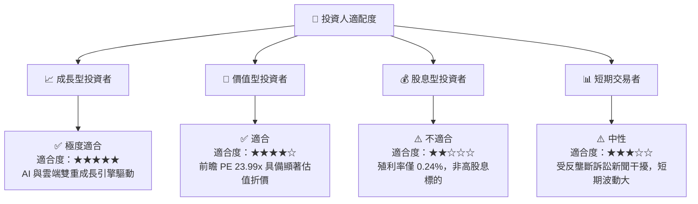

### 10.5 每季財報監控清單（Quarterly Watch List）

機構投資人在未來每季財報中，應嚴格監控以下指標，以驗證投資論點：

1. **Google Cloud 營運利潤率（門檻值：20%）**：若低於 20%，說明雲端業務的營運槓桿釋放不及預期。
2. **常態化營業利益（EBIT）成長率（門檻值：YoY +15%）**：用以排除非營業投資收益對淨利的干擾。
3. **資本支出 (Capex) 規模（上限：單季 $30B）**：若 Capex 無節制擴張且未帶來營收加速，將損害 ROIC。
4. **搜尋引擎市佔率（門檻值：88%）**：若因 AI 替代導致市佔率跌破 88%，多頭論點將面臨結構性破壞。

### 10.6 反面論證：什麼會證明論點錯誤（What Would Change My Mind）

本投資論點建立於「Google 搜尋地位穩固且 AI 能帶來增量變現」的假設之上。若發生以下**可量化條件**，我們將不得不下調評級或退出頭寸：

```
╔══════════════════════════════════════════════════════════════════╗
║              ⚠️ 論點失效條件 (Disconfirming Evidence)            ║
╠══════════════════════════════════════════════════════════════════╣
║  本投資論點在下列情況成立時應重新檢視或退出：                    ║
║  ☐ 核心搜尋廣告營收連續兩季年增率 < 8% (說明 AI 替代效應顯著)     ║
║  ☐ 營業利潤率較 TTM 峰值收縮 > 400 bps (說明 AI 算力成本失控)    ║
║  ☐ 自由現金流 (FCF) 轉換率連續四季低於 40%                      ║
║  ☐ 投資資本回報率 (ROIC) 跌破 20%                               ║
║  ☐ 司法部最終判決強制 Alphabet 拆分 Android 或 Chrome 生態系    ║
╚══════════════════════════════════════════════════════════════════╝
```

---

> **免責聲明**：本報告為 AI 自動生成，僅供研究參考，不構成投資建議。投資有風險，入市需謹慎。